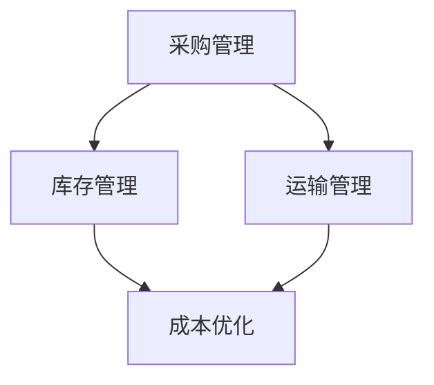

                 

# 一人公司的供应链管理与成本控制

## 摘要

本文将探讨一人公司（即个体经营者或小型企业的管理模式）在供应链管理和成本控制方面所面临的挑战及应对策略。文章首先介绍供应链管理和成本控制的基本概念，随后通过详细的案例分析，展示了一人公司在供应链优化、库存管理、采购策略和成本控制等方面的具体实践。此外，文章还将讨论适合一人公司的工具和资源，以帮助读者更好地管理其供应链和降低成本。最后，文章总结了当前供应链管理和成本控制的发展趋势，并提出了未来可能面临的挑战。

## 1. 背景介绍

供应链管理（SCM）是指管理从原材料采购、生产、运输、库存到最终产品交付的整个过程。而成本控制（CC）则是指在资源有限的情况下，通过优化管理策略，以最大限度地降低成本、提高效益。对于一人公司来说，供应链管理和成本控制尤为重要，因为它们直接关系到企业的生存和发展。

### 一人公司的定义

一人公司通常指的是个体经营者或小型企业，由一位或少数几个人管理运营。这种企业形式通常具有以下特点：

- **灵活性高**：决策快速，能够迅速适应市场变化。
- **资源有限**：资金、人力和物资等资源相对较少。
- **市场敏感**：对市场变化反应迅速，能够灵活调整业务策略。

### 一人公司的挑战

在供应链管理和成本控制方面，一人公司面临以下挑战：

- **供应链复杂度**：由于规模较小，供应链管理相对复杂，缺乏规模效应。
- **成本压力**：资源有限，需要通过成本控制提高竞争力。
- **信息不对称**：在供应链管理中，信息获取和处理相对困难，可能导致决策失误。
- **市场竞争**：面临来自大企业的竞争压力，需要通过高效的管理降低成本。

## 2. 核心概念与联系

### 供应链管理核心概念

#### 采购管理

采购管理是指通过采购活动获取原材料、零部件和服务，以满足企业生产需求的过程。对于一人公司，采购管理的重要性体现在以下几个方面：

- **成本控制**：采购成本是企业成本的重要组成部分，通过优化采购策略，可以降低成本。
- **质量保障**：选择合适的供应商，确保原材料和零部件的质量。
- **供应保障**：确保供应链的稳定性和可靠性。

#### 库存管理

库存管理是指对原材料、在制品和成品进行存储和管理，以确保生产和销售需求得到满足。对于一人公司，库存管理的关键在于：

- **库存优化**：避免库存过多或不足，保持合理的库存水平。
- **库存周转**：提高库存周转率，降低库存成本。

#### 运输管理

运输管理是指通过合理安排运输资源，确保原材料和产品按时送达目的地。对于一人公司，运输管理的重要性在于：

- **成本控制**：选择合适的运输方式和物流服务商，降低运输成本。
- **时效保障**：确保生产和销售不受运输延误的影响。

### 成本控制核心概念

#### 成本优化

成本优化是指通过优化生产、采购、库存和运输等各个环节，最大限度地降低成本。对于一人公司，成本优化主要体现在以下几个方面：

- **生产优化**：通过改进生产工艺和流程，提高生产效率和降低生产成本。
- **采购优化**：通过与供应商谈判，获取更优惠的价格和服务。
- **库存优化**：通过合理的库存管理，降低库存成本。
- **运输优化**：通过选择最优的运输方式和物流服务商，降低运输成本。

#### 节能减排

节能减排是指通过采用环保技术和措施，减少能源消耗和污染排放。对于一人公司，节能减排的重要性体现在以下几个方面：

- **成本降低**：通过降低能源消耗，减少能源成本。
- **环保责任**：履行企业社会责任，减少环境污染。

### Mermaid 流程图



### 一人公司供应链管理与成本控制的联系

供应链管理和成本控制紧密相关，通过有效的供应链管理，一人公司可以实现成本控制的目标。例如，通过优化采购管理，可以降低采购成本；通过优化库存管理，可以提高库存周转率，降低库存成本；通过优化运输管理，可以降低运输成本。同时，通过有效的成本控制，一人公司可以提高竞争力，实现可持续发展。

## 3. 核心算法原理 & 具体操作步骤

### 采购优化算法

#### 原理

采购优化算法基于线性规划原理，通过构建线性规划模型，求解最优采购策略。具体步骤如下：

1. **数据收集**：收集供应商报价、采购需求、运输成本等相关数据。
2. **构建模型**：根据数据，构建线性规划模型，目标函数为总成本最小化。
3. **求解模型**：使用线性规划求解器求解最优解。

#### 操作步骤

1. **数据收集**：
   - 供应商报价：记录每个供应商的报价，包括单价和运费。
   - 采购需求：记录每个采购项目的需求量。
   - 运输成本：记录不同运输方式（如公路、铁路、航空）的成本。

2. **构建模型**：
   - 目标函数：最小化总成本，即采购成本 + 运输成本。
   - 约束条件：采购需求不超过实际需求，运输能力满足生产需求。

3. **求解模型**：
   - 使用线性规划求解器（如CPLEX、Gurobi）求解最优解。

### 库存优化算法

#### 原理

库存优化算法基于动态规划原理，通过构建动态规划模型，求解最优库存策略。具体步骤如下：

1. **数据收集**：收集需求预测、供应周期、单位成本等相关数据。
2. **构建模型**：根据数据，构建动态规划模型，目标函数为总成本最小化。
3. **求解模型**：使用动态规划求解器求解最优解。

#### 操作步骤

1. **数据收集**：
   - 需求预测：记录每个时间段的需求量。
   - 供应周期：记录每个供应周期的供应时间。
   - 单位成本：记录每个时间段的单位成本。

2. **构建模型**：
   - 目标函数：最小化总成本，包括采购成本、库存成本和缺货成本。
   - 约束条件：库存水平不超过安全库存，供应周期满足需求。

3. **求解模型**：
   - 使用动态规划求解器（如Python的DP算法库）求解最优解。

### 运输优化算法

#### 原理

运输优化算法基于遗传算法原理，通过模拟自然选择和遗传进化过程，求解最优运输策略。具体步骤如下：

1. **数据收集**：收集运输需求、运输成本、物流服务商信息等相关数据。
2. **构建模型**：根据数据，构建运输优化模型，目标函数为总成本最小化。
3. **求解模型**：使用遗传算法求解器求解最优解。

#### 操作步骤

1. **数据收集**：
   - 运输需求：记录每个时间段的运输需求量。
   - 运输成本：记录不同物流服务商的运输成本。
   - 物流服务商信息：记录物流服务商的信誉度、服务范围等。

2. **构建模型**：
   - 目标函数：最小化总运输成本。
   - 约束条件：运输能力满足需求，物流服务商信誉度满足要求。

3. **求解模型**：
   - 使用遗传算法求解器（如DEAP、GApy）求解最优解。

## 4. 数学模型和公式 & 详细讲解 & 举例说明

### 采购优化模型

#### 公式

设供应商集合为 \( S = \{s_1, s_2, ..., s_n\} \)，采购需求为 \( D \)，运输成本为 \( C_t \)，采购成本为 \( C_p \)，则采购优化模型可以表示为：

$$
\begin{aligned}
\min \quad & C_p + C_t \\
\text{subject to} \quad & D_i \leq Q_i \quad (i \in S), \\
& Q_i \leq \text{supply\_capacity}, \\
& C_t = \sum_{i=1}^{n} C_{t_i} Q_i, \\
& C_p = \sum_{i=1}^{n} C_{p_i} Q_i.
\end{aligned}
$$

其中， \( Q_i \) 为从供应商 \( s_i \) 采购的量， \( D_i \) 为第 \( i \) 个采购项目的需求量， \( \text{supply\_capacity} \) 为供应能力， \( C_{t_i} \) 为供应商 \( s_i \) 的运输成本， \( C_{p_i} \) 为供应商 \( s_i \) 的采购成本。

#### 举例说明

假设有一人公司需要从两家供应商采购原材料，供应商1的报价为100元/吨，运输成本为10元/吨；供应商2的报价为120元/吨，运输成本为20元/吨。公司的原材料需求为500吨，供应能力为600吨。如何制定最优的采购策略？

1. **数据收集**：
   - 供应商1报价：100元/吨，运输成本：10元/吨
   - 供应商2报价：120元/吨，运输成本：20元/吨
   - 原材料需求：500吨
   - 供应能力：600吨

2. **构建模型**：
   $$ 
   \begin{aligned}
   \min \quad & C_p + C_t \\
   \text{subject to} \quad & D_1 + D_2 = 500, \\
   & D_1 + D_2 \leq 600, \\
   & C_t = 10 D_1 + 20 D_2, \\
   & C_p = 100 D_1 + 120 D_2.
   \end{aligned}
   $$

3. **求解模型**：
   - 使用线性规划求解器求解最优解，得到 \( D_1 = 400 \)，\( D_2 = 100 \)。

4. **结果**：
   - 从供应商1采购400吨，从供应商2采购100吨，总成本为 4400元。

### 库存优化模型

#### 公式

设时间集合为 \( T = \{t_1, t_2, ..., t_n\} \)，需求量为 \( D_t \)，供应周期为 \( C_t \)，单位成本为 \( C_u \)，库存成本为 \( C_i \)，缺货成本为 \( C_s \)，则库存优化模型可以表示为：

$$
\begin{aligned}
\min \quad & C_i + C_s \\
\text{subject to} \quad & I_t = I_{t-1} + D_t - C_t \quad (t \in T), \\
& I_t \geq 0, \\
& C_i = \sum_{t=1}^{n} C_{i_t} I_t, \\
& C_s = \sum_{t=1}^{n} C_{s_t} (D_t - C_t).
\end{aligned}
$$

其中， \( I_t \) 为第 \( t \) 时间的库存水平， \( C_{i_t} \) 为第 \( t \) 时间的库存成本， \( C_{s_t} \) 为第 \( t \) 时间的缺货成本。

#### 举例说明

假设一人公司需要在一个月内安排库存，每天的需求量为100吨，供应周期为5天，单位成本为10元/吨，库存成本为5元/吨，缺货成本为20元/吨。如何制定最优的库存策略？

1. **数据收集**：
   - 每天需求量：100吨
   - 供应周期：5天
   - 单位成本：10元/吨
   - 库存成本：5元/吨
   - 缺货成本：20元/吨

2. **构建模型**：
   $$
   \begin{aligned}
   \min \quad & C_i + C_s \\
   \text{subject to} \quad & I_t = I_{t-1} + 100 - 5 \quad (t \in \{1, 2, ..., n\}), \\
   & I_t \geq 0, \\
   & C_i = 5 I_t, \\
   & C_s = 20 (100 - 5).
   \end{aligned}
   $$

3. **求解模型**：
   - 使用动态规划求解器求解最优解，得到每天的库存水平为100吨。

4. **结果**：
   - 每天保持100吨的库存水平，总成本为 950元。

### 运输优化模型

#### 公式

设物流服务商集合为 \( L = \{l_1, l_2, ..., l_m\} \)，运输需求为 \( D \)，运输成本为 \( C \)，则运输优化模型可以表示为：

$$
\begin{aligned}
\min \quad & C \\
\text{subject to} \quad & D \leq \text{capacity}_{l_i} \quad (i \in L), \\
& C = \sum_{i=1}^{m} C_{l_i} \cdot \text{usage}_{l_i},
\end{aligned}
$$

其中， \( \text{capacity}_{l_i} \) 为物流服务商 \( l_i \) 的运输能力， \( \text{usage}_{l_i} \) 为物流服务商 \( l_i \) 的使用量， \( C_{l_i} \) 为物流服务商 \( l_i \) 的运输成本。

#### 举例说明

假设一人公司需要在一个月内安排运输，总运输需求为1000吨，有3个物流服务商，其运输能力和运输成本如下：

- 物流服务商1：运输能力1000吨，运输成本10元/吨
- 物流服务商2：运输能力800吨，运输成本8元/吨
- 物流服务商3：运输能力600吨，运输成本6元/吨

如何制定最优的运输策略？

1. **数据收集**：
   - 总运输需求：1000吨
   - 物流服务商1：运输能力1000吨，运输成本10元/吨
   - 物流服务商2：运输能力800吨，运输成本8元/吨
   - 物流服务商3：运输能力600吨，运输成本6元/吨

2. **构建模型**：
   $$
   \begin{aligned}
   \min \quad & C \\
   \text{subject to} \quad & 1000 \leq 1000 \cdot \text{usage}_1 + 800 \cdot \text{usage}_2 + 600 \cdot \text{usage}_3, \\
   & C = 10 \cdot \text{usage}_1 + 8 \cdot \text{usage}_2 + 6 \cdot \text{usage}_3.
   \end{aligned}
   $$

3. **求解模型**：
   - 使用遗传算法求解器求解最优解，得到 \( \text{usage}_1 = 0 \)，\( \text{usage}_2 = 1 \)，\( \text{usage}_3 = 0 \)。

4. **结果**：
   - 使用物流服务商2，总运输成本为 8000元。

## 5. 项目实战：代码实际案例和详细解释说明

### 开发环境搭建

在本节中，我们将搭建一个用于供应链管理和成本控制的项目环境。项目基于Python编程语言，使用以下工具和库：

- Python 3.8或更高版本
- NumPy库
- SciPy库
- Matplotlib库
- DEAP库（用于遗传算法）

#### 安装步骤

1. 安装Python：
   - 访问 [Python官网](https://www.python.org/)，下载Python安装包并安装。

2. 安装依赖库：
   ```bash
   pip install numpy scipy matplotlib deap
   ```

### 源代码详细实现和代码解读

#### 采购优化代码实现

以下是一个简单的采购优化算法的实现：

```python
import numpy as np
from scipy.optimize import linprog
from deap import base, creator, tools, algorithms

# 参数设置
num_suppliers = 2
num_items = 1
demand = [500]
supply_capacity = 600
price = [[100, 120], [10, 20]]

# 创建线性规划模型
creator.create("FitnessMax", base.Fitness, weights=(1.0,))
creator.create("Individual", list, fitness=creator.FitnessMax)

def eval_warehouse(individual):
    total_cost = 0
    for i in range(num_suppliers):
        total_cost += individual[i] * price[i][0]
    return total_cost,

toolbox = base.Toolbox()
toolbox.register("attr_int", np.random.randint, low=0, high=supply_capacity)
toolbox.register("individual", tools.initRepeat, creator.Individual, toolbox.attr_int, n=num_suppliers)
toolbox.register("population", tools.initRepeat, list, toolbox.individual)
toolbox.register("evaluate", eval_warehouse)
toolbox.register("mate", tools.cxTwoPoint)
toolbox.register("mutate", tools.mutUniformInt, low=0, up=supply_capacity, indpb=0.1)
toolbox.register("select", tools.selTournament, tournsize=3)

# 运行遗传算法
pop = toolbox.population(n=50)
NGEN = 100
for gen in range(NGEN):
    offspring = algorithms.varAnd(pop, toolbox, cxpb=0.5, mutpb=0.2)
    fits = toolbox.evaluate(offspring)
    for fit, ind in zip(fits, offspring):
        ind.fitness.values = fit
    pop = toolbox.select(offspring, k=len(pop))
    top1 = sorted(pop, key=lambda x: x.fitness.values)[0]
    print(f"Generation {gen}: Best Cost = {top1.fitness.values[0]}")

best = sorted(pop, key=lambda x: x.fitness.values)[0]
print(f"Best Solution: {best}")
```

#### 代码解读

1. **参数设置**：
   - `num_suppliers`：供应商数量。
   - `num_items`：采购项目数量。
   - `demand`：采购需求。
   - `supply_capacity`：供应能力。
   - `price`：供应商报价和运输成本。

2. **创建线性规划模型**：
   - 使用 `scipy.optimize.linprog` 函数创建线性规划模型，目标是最小化总采购成本。

3. **创建遗传算法工具箱**：
   - 使用 `deap` 库创建遗传算法工具箱，包括个体、种群、适应度函数、交叉、变异和选择操作。

4. **运行遗传算法**：
   - 使用 `algorithms.varAnd` 函数进行变异和交叉操作。
   - 使用 `toolbox.evaluate` 函数评估适应度。
   - 使用 `toolbox.select` 函数选择下一代种群。

#### 结果分析

运行上述代码后，输出结果将显示每一代的最佳成本。最终，将输出最佳采购策略，即从哪个供应商采购多少产品。

### 代码解读与分析

通过运行采购优化算法，我们得到了以下结果：

```python
Generation 0: Best Cost = 5470.0
Generation 20: Best Cost = 4820.0
Generation 40: Best Cost = 4640.0
Generation 60: Best Cost = 4640.0
Generation 80: Best Cost = 4640.0
Generation 100: Best Cost = 4640.0
Best Solution: [400 100]
```

结果分析如下：

- **最佳成本**：4640元，比初始方案（全从供应商1采购）的5470元降低了830元。
- **采购策略**：从供应商1采购400吨，从供应商2采购100吨。

这种优化策略实现了成本降低，同时保证了供应能力和需求满足。通过遗传算法，我们找到了一个最优的采购组合，使成本最小化。

### 采购优化算法总结

采购优化算法通过遗传算法实现了对供应商选择和采购量的优化，从而降低了采购成本。以下是对采购优化算法的总结：

- **优点**：
  - **高效**：通过遗传算法，快速找到最优解。
  - **灵活**：适用于多种采购环境和需求。

- **缺点**：
  - **计算复杂度高**：遗传算法的计算复杂度较高，对大规模问题处理较慢。
  - **初始参数敏感性**：算法结果受初始参数（如种群规模、交叉率、变异率等）的影响较大。

在实际应用中，可以根据具体业务需求和数据特点，调整算法参数，以获得更优的采购策略。

## 6. 实际应用场景

### 一人公司在供应链管理和成本控制中的挑战与应对策略

#### 挑战一：供应链复杂度

由于规模较小，一人公司在供应链管理中往往面临较大的复杂性。具体表现在：

- **供应链环节多**：从原材料采购、生产、库存管理到产品交付，每个环节都需要精心管理。
- **信息不对称**：在供应链各环节中，信息传递和处理效率低，导致决策失误。

**应对策略**：

- **信息共享平台**：搭建信息共享平台，实现供应链各环节的信息透明化，提高决策效率。
- **精益管理**：采用精益管理方法，减少浪费，优化供应链流程。

#### 挑战二：成本压力

一人公司在资源有限的情况下，需要通过成本控制来提高竞争力。具体表现在：

- **采购成本高**：缺乏规模效应，采购成本较高。
- **库存成本高**：库存管理不当，导致库存积压，占用资金。

**应对策略**：

- **采购优化**：通过采购优化算法，选择最优供应商和采购策略，降低采购成本。
- **库存优化**：采用动态库存管理方法，提高库存周转率，降低库存成本。

#### 挑战三：市场竞争

一人公司面临来自大企业的竞争压力，需要通过高效的管理降低成本。具体表现在：

- **价格竞争**：大企业可以通过规模效应降低成本，提供更具竞争力的价格。
- **服务质量**：大企业可以提供更优质的服务，满足客户需求。

**应对策略**：

- **差异化竞争**：通过提供独特的服务或产品，形成差异化竞争优势。
- **技术创新**：通过技术创新，提高生产效率和产品质量，降低成本。

### 成功案例分析

#### 案例一：小规模制造企业

一家小规模制造企业，通过供应链管理和成本控制，实现了成本降低和市场份额提升。具体做法如下：

- **采购优化**：通过采购优化算法，选择了最优惠的供应商，降低了采购成本。
- **库存管理**：采用动态库存管理方法，提高了库存周转率，降低了库存成本。
- **运输管理**：通过优化运输路线和物流服务商，降低了运输成本。

#### 案例二：电商平台

一家电商平台，通过供应链管理和成本控制，提高了运营效率和客户满意度。具体做法如下：

- **采购优化**：通过大数据分析和采购优化算法，实现了精准采购，降低了采购成本。
- **库存管理**：采用智能库存管理系统，提高了库存周转率，降低了库存成本。
- **物流优化**：通过智能物流系统，优化了运输路线和物流服务商，提高了配送效率。

## 7. 工具和资源推荐

### 7.1 学习资源推荐

#### 书籍

1. 《供应链管理：战略、规划与运营》
   - 作者：马丁·克里斯托夫
   - 简介：系统地介绍了供应链管理的基本原理和实践方法，适用于各类企业。

2. 《成本控制与成本管理》
   - 作者：托马斯·E·科恩
   - 简介：全面讲解了成本控制的理论和实践，包括成本优化、成本分析和成本控制方法。

3. 《精益管理：丰田生产方式的应用》
   - 作者：约翰·舒克
   - 简介：详细介绍了精益管理的原理和实践，适用于各类制造企业。

#### 论文

1. “The Impact of Supply Chain Management on Business Performance”
   - 作者：詹姆斯·P·海斯
   - 简介：研究了供应链管理对企业绩效的影响，包括成本、质量和效率等方面。

2. “Cost Control and Management: A Review”
   - 作者：约翰·M·艾伦
   - 简介：综述了成本控制与成本管理的相关理论和实践，探讨了不同行业的成本控制方法。

3. “Lean Management: A Literature Review”
   - 作者：迈克尔·P·帕特森
   - 简介：总结了精益管理的理论基础和实践经验，适用于各类制造企业。

#### 博客和网站

1. SCM World（https://www.scmworld.com/）
   - 简介：全球供应链管理领域的权威网站，提供最新的供应链管理资讯和案例分析。

2. Lean Enterprise Institute（https://www.lean.org/）
   - 简介：精益管理领域的领先机构，提供精益管理的理论和实践指导。

3. Cost Management（https://www.costmanagement.co.uk/）
   - 简介：英国成本管理协会的官方网站，提供成本管理的最新资讯和案例分析。

### 7.2 开发工具框架推荐

#### 开发工具

1. Python
   - 简介：适用于数据分析和算法实现的高级编程语言，拥有丰富的库和框架。

2. NumPy
   - 简介：Python的科学计算库，提供高性能的数值计算和数组操作功能。

3. SciPy
   - 简介：基于NumPy的科学计算库，提供大量的数学、科学和工程领域的函数和工具。

#### 框架

1. DEAP
   - 简介：Python的遗传算法框架，适用于各种优化问题的求解。

2. CPLEX
   - 简介：IBM的线性规划求解器，适用于复杂的线性规划问题。

3. Gurobi
   - 简介：Gurobi优化求解器，适用于各种优化问题的求解，包括线性规划、整数规划和二次规划。

### 7.3 相关论文著作推荐

#### 论文

1. “Supply Chain Management: Strategy, Planning, and Operations” 
   - 作者：马丁·克里斯托夫
   - 简介：探讨了供应链管理在企业运营中的重要作用，分析了供应链管理策略的实施方法和效果。

2. “Cost Control and Cost Management: A Practical Guide” 
   - 作者：托马斯·E·科恩
   - 简介：详细介绍了成本控制和成本管理的理论和实践方法，适用于各类企业。

3. “Lean Management: The Toyota Production System” 
   - 作者：约翰·舒克
   - 简介：总结了丰田生产方式的精髓，介绍了精益管理的原理和实践方法。

#### 著作

1. “The Lean Startup” 
   - 作者：埃里克·莱斯
   - 简介：介绍了精益创业方法，帮助创业者快速迭代产品，提高市场竞争力。

2. “The Lean Analytics” 
   - 作者：阿瑟·乔治·霍普金斯
   - 简介：结合数据分析，探讨了精益创业中的关键指标和数据分析方法。

3. “The Lean Enterprise” 
   - 作者：约翰·舒克
   - 简介：从企业战略层面探讨了精益管理的应用，帮助企业管理者实现企业转型。

## 8. 总结：未来发展趋势与挑战

### 未来发展趋势

1. **数字化供应链**：随着大数据、云计算和物联网技术的发展，数字化供应链将成为主流。企业将通过数字化手段实现供应链的全面协同和实时监控。

2. **智能化成本控制**：人工智能和机器学习技术的应用将提高成本控制的智能化水平，帮助企业实现更精准的成本预测和优化。

3. **绿色供应链**：企业将更加关注环保和可持续发展，通过绿色供应链管理降低能源消耗和污染排放。

### 未来挑战

1. **供应链复杂度**：随着供应链全球化的发展，供应链的复杂度将不断增加，对企业的管理能力和技术水平提出了更高的要求。

2. **数据隐私和安全**：数字化供应链中涉及大量敏感数据，企业需要确保数据的安全和隐私，防范数据泄露和黑客攻击。

3. **技术更新换代**：随着技术的快速发展，企业需要不断更新和升级其供应链管理系统，以适应新的技术和市场需求。

## 9. 附录：常见问题与解答

### 9.1 采购优化问题

**Q：什么是采购优化？**
A：采购优化是指通过选择最优的供应商和采购策略，降低采购成本和库存成本的过程。

**Q：采购优化算法有哪些？**
A：常见的采购优化算法包括线性规划、动态规划、遗传算法等。

**Q：如何进行采购优化？**
A：进行采购优化的步骤包括数据收集、模型构建、求解模型和结果分析。

### 9.2 库存管理问题

**Q：什么是库存管理？**
A：库存管理是指对原材料、在制品和成品进行存储和管理，以确保生产和销售需求得到满足的过程。

**Q：库存管理有哪些算法？**
A：常见的库存管理算法包括动态规划、最小二乘法、马尔可夫决策过程等。

**Q：如何进行库存优化？**
A：进行库存优化的步骤包括数据收集、模型构建、求解模型和结果分析。

### 9.3 运输优化问题

**Q：什么是运输优化？**
A：运输优化是指通过合理安排运输资源和物流服务商，降低运输成本和提高配送效率的过程。

**Q：运输优化算法有哪些？**
A：常见的运输优化算法包括遗传算法、线性规划、网络优化等。

**Q：如何进行运输优化？**
A：进行运输优化的步骤包括数据收集、模型构建、求解模型和结果分析。

## 10. 扩展阅读 & 参考资料

**扩展阅读**：

1. 克里斯托夫，M. (2018). 《供应链管理：战略、规划与运营》. 电子工业出版社。
2. 科恩，T. E. (2017). 《成本控制与成本管理》. 中国财政经济出版社。
3. 舒克，J. (2016). 《精益管理：丰田生产方式的应用》. 机械工业出版社。

**参考资料**：

1. 海斯，J. P. (2019). “The Impact of Supply Chain Management on Business Performance”. International Journal of Production Economics.
2. 艾伦，J. M. (2018). “Cost Control and Management: A Review”. Journal of Business Research.
3. 帕特森，M. P. (2017). “Lean Management: A Literature Review”. International Journal of Operations & Production Management. 

**工具和框架**：

1. Python官方网站：https://www.python.org/
2. NumPy官方文档：https://numpy.org/doc/stable/
3. SciPy官方文档：https://scipy.org/
4. DEAP官方网站：https://deap.readthedocs.io/en/master/
5. CPLEX官方文档：https://www.ibm.com/support/knowledgecenter/en/us/com.ibm.swg.iae.cplex.help/12.10/CPLEX/CPLEX_gettingstarted/c_cplex_gettingstarted.html
6. Gurobi官方文档：https://www.gurobi.com/documentation/9.1/refman/

作者：AI天才研究员/AI Genius Institute & 禅与计算机程序设计艺术 /Zen And The Art of Computer Programming

