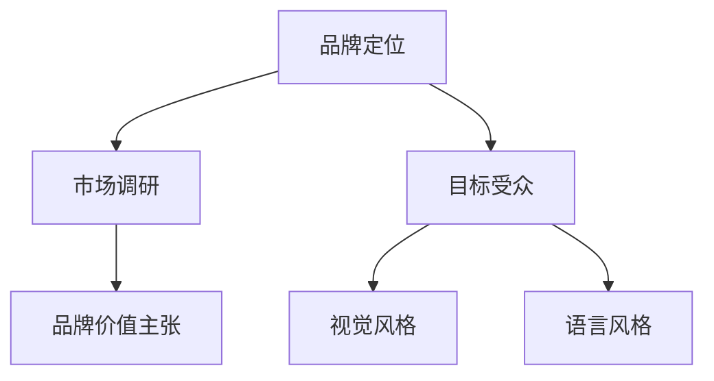
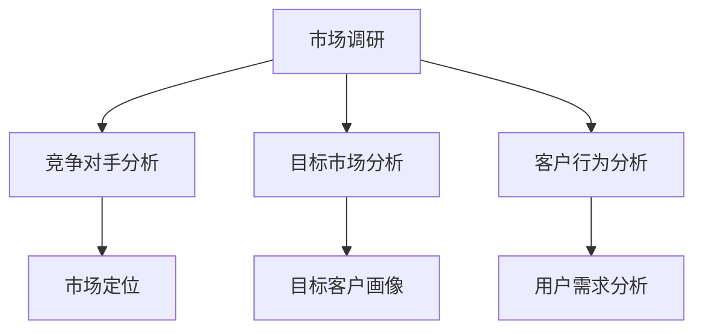
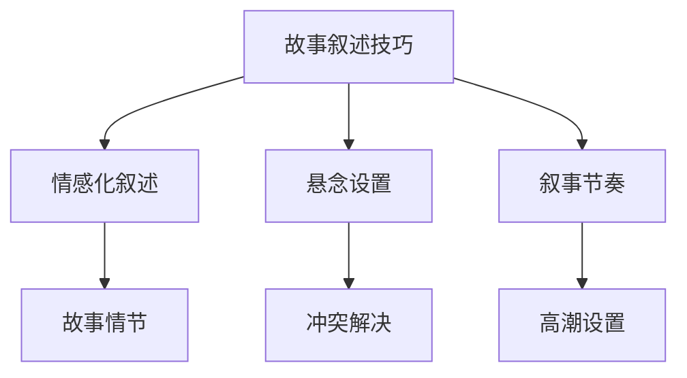
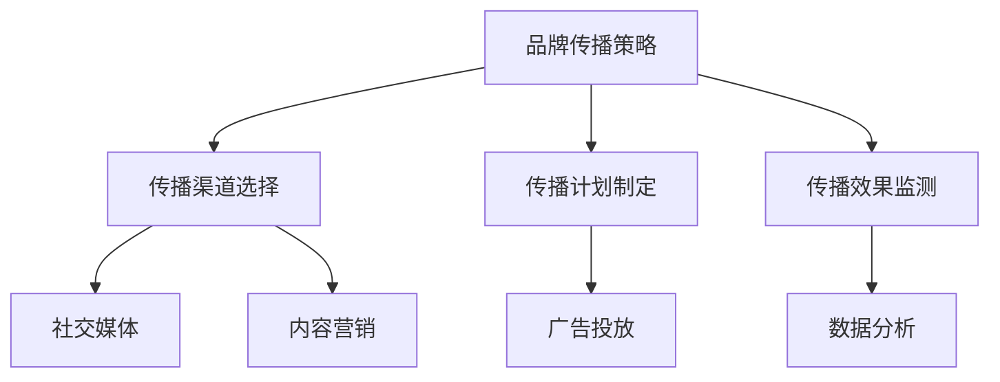
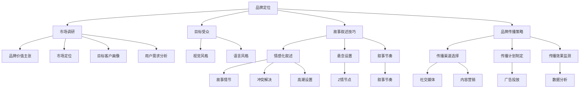

                 

### 背景介绍

> 在当今快速变化的市场环境中，一个成功的品牌不仅需要高质量的产品，还需要一个引人入胜的故事来吸引和留住顾客。对于初创公司，特别是那些只有一个创始人或者小型团队的公司来说，讲述一个具有吸引力的品牌故事至关重要。本文将探讨如何构建和讲述一个引人入胜的创始人和产品故事，以便在竞争激烈的市场中脱颖而出。

#### 初创公司的现状

初创公司在市场上的挑战往往是巨大的。资源有限、竞争激烈、市场份额争夺等都是初创公司面临的主要问题。在这样的环境下，品牌故事成为了一种强有力的营销工具，可以帮助初创公司吸引投资者、获得客户信任，并建立品牌忠诚度。

**品牌故事的重要性**

品牌故事不仅仅是一段文字或者一段视频，它是一种策略，用于传达公司的价值观、使命和愿景。一个成功的品牌故事能够：

1. **建立情感连接**：通过讲述真实的故事，品牌可以与客户建立情感上的联系。
2. **提升品牌知名度**：品牌故事可以作为一种有效的宣传手段，提高品牌在市场中的知名度。
3. **塑造品牌形象**：通过品牌故事，初创公司可以塑造出独特的品牌形象，使其在竞争中脱颖而出。
4. **增强品牌忠诚度**：一个引人入胜的品牌故事可以增强客户对品牌的忠诚度，从而提高客户保留率。

#### 本文的目的

本文旨在通过以下几部分，详细探讨如何构建和讲述一个成功的品牌故事：

1. **背景介绍**：了解初创公司的现状和品牌故事的重要性。
2. **核心概念与联系**：探讨品牌故事构建的核心概念，并使用流程图展示。
3. **核心算法原理 & 具体操作步骤**：详细分析如何构建品牌故事，并提供具体的操作步骤。
4. **数学模型和公式 & 详细讲解 & 举例说明**：使用数学模型和公式来解释品牌故事构建的方法。
5. **项目实战：代码实际案例和详细解释说明**：通过实际代码案例展示如何构建品牌故事。
6. **实际应用场景**：探讨品牌故事在不同应用场景中的运用。
7. **工具和资源推荐**：推荐相关学习资源和开发工具。
8. **总结：未来发展趋势与挑战**：总结品牌故事构建的未来趋势和面临的挑战。
9. **附录：常见问题与解答**：回答读者可能关心的常见问题。
10. **扩展阅读 & 参考资料**：提供进一步的阅读资源和参考资料。

通过本文的阅读，读者将能够了解如何构建一个成功的品牌故事，从而帮助他们的初创公司在激烈的市场竞争中脱颖而出。

### 核心概念与联系

在构建一个成功的品牌故事之前，我们需要了解一些核心概念和它们之间的联系。这些概念包括品牌定位、市场调研、故事叙述技巧和品牌传播策略。以下是这些核心概念及其关系的详细解释和Mermaid流程图。

#### 1. 品牌定位

品牌定位是品牌故事的基础。它决定了品牌在市场中的独特价值主张和目标受众。品牌定位不仅影响了品牌故事的叙述方式，还影响了品牌的视觉和语言风格。以下是一个简单的品牌定位流程图：



#### 2. 市场调研

市场调研是构建品牌故事的重要一步。通过市场调研，初创公司可以了解目标市场的需求、竞争对手的情况以及潜在客户的行为习惯。以下是市场调研流程图：



#### 3. 故事叙述技巧

故事叙述技巧是构建品牌故事的关键。一个引人入胜的品牌故事需要使用有趣、富有感染力的叙述方式。以下是一个简单的故事叙述技巧流程图：



#### 4. 品牌传播策略

品牌传播策略决定了品牌故事如何被传播给目标受众。这包括选择合适的传播渠道、制定有效的传播计划和监测传播效果。以下是品牌传播策略流程图：



#### 综合流程图

以下是上述核心概念的综合流程图，展示了它们之间的联系：



通过理解这些核心概念和它们之间的联系，初创公司可以更有效地构建和讲述一个成功的品牌故事，从而在激烈的市场竞争中脱颖而出。

### 核心算法原理 & 具体操作步骤

在理解了品牌故事构建的核心概念后，我们接下来需要探讨如何将这些概念转化为具体的操作步骤，从而构建出一个成功的品牌故事。以下是详细的操作步骤：

#### 第一步：确定品牌定位

1. **市场调研**：首先，进行详细的市场调研，了解目标市场的需求、竞争对手以及潜在客户的行为习惯。
2. **目标客户画像**：根据市场调研结果，创建目标客户的详细画像，包括他们的年龄、性别、职业、兴趣爱好等。
3. **品牌价值主张**：基于市场调研和目标客户画像，明确品牌的核心价值主张。这应该是品牌与竞争对手区别开来的独特卖点。

#### 第二步：构建品牌故事框架

1. **故事情节**：构建一个引人入胜的故事情节，使其能够吸引目标客户的注意力。故事情节应该围绕品牌的核心价值主张展开。
2. **情感化叙述**：使用情感化的叙述技巧，使品牌故事更具吸引力。可以通过讲述一个真实的故事、分享一个感人的经历或者引入一个情感上的冲突来实现这一点。
3. **悬念设置**：在故事中设置悬念，使读者或观众保持好奇心，从而激发他们对品牌的兴趣。

#### 第三步：制定品牌传播策略

1. **传播渠道选择**：根据品牌定位和目标客户画像，选择最适合的品牌传播渠道。这可以包括社交媒体、内容营销、广告投放等。
2. **传播计划制定**：制定一个详细的品牌传播计划，包括内容创建、发布时间、渠道分配等。
3. **传播效果监测**：监测品牌传播的效果，并根据反馈进行调整。

#### 第四步：执行和优化

1. **内容创建**：根据品牌传播计划，创建符合品牌定位和故事情节的内容。这些内容应该能够吸引目标客户的注意力，并传达品牌的核心价值主张。
2. **发布与推广**：将内容发布到选择的传播渠道，并使用合适的推广策略，如广告投放、社交媒体活动等，以增加内容的曝光率。
3. **数据分析**：收集和分析数据，了解哪些内容最受欢迎，哪些渠道效果最佳，从而进行优化。

#### 第五步：持续迭代和改进

1. **反馈收集**：持续收集客户和市场的反馈，了解品牌故事的接受程度和改进方向。
2. **内容更新**：根据反馈，定期更新品牌故事，使其保持新鲜和吸引力。
3. **策略调整**：根据市场变化和客户需求，及时调整品牌传播策略。

通过以上步骤，初创公司可以构建出一个成功的品牌故事，从而在激烈的市场竞争中脱颖而出。每一个步骤都需要仔细规划和执行，以确保品牌故事能够真正吸引目标客户，并实现品牌的长期发展。

### 数学模型和公式 & 详细讲解 & 举例说明

构建成功的品牌故事不仅需要创意和技巧，还可以借助数学模型和公式来提高其科学性和有效性。以下是几个关键模型和公式，以及它们的详细解释和实际应用案例。

#### 1. SWOT分析

**SWOT分析（Strengths, Weaknesses, Opportunities, Threats）** 是一个常用的战略规划工具，用于评估品牌的内部优势和劣势，以及外部机会和威胁。

**数学模型**：SWOT分析可以看作是一个多维度的评估矩阵。

**公式**：  
\[ \text{SWOT} = \begin{bmatrix} \text{Strengths} \\ \text{Weaknesses} \\ \text{Opportunities} \\ \text{Threats} \end{bmatrix} \]

**详细解释**：在构建品牌故事时，可以通过SWOT分析识别品牌的潜在优势和劣势，从而在故事中突出优势，并试图解决或弱化劣势。

**举例说明**：假设一家初创公司专注于健康食品，它的SWOT分析可能如下：

- **Strengths**：有机食材、低热量、无添加剂。
- **Weaknesses**：市场知名度较低、生产成本高。
- **Opportunities**：健康意识增强、年轻消费者市场。
- **Threats**：竞争激烈、消费者对健康食品要求提高。

根据SWOT分析，品牌故事可以着重讲述公司的有机食材优势，同时通过市场调研和消费者反馈来提升知名度，并探索降低生产成本的方法。

#### 2. 品牌价值公式

品牌价值（Brand Value）是品牌在市场上的经济价值，它可以通过品牌溢价（Brand Premium）来衡量。

**公式**：  
\[ \text{Brand Value} = \text{Brand Premium} \times \text{Sales} \]

**详细解释**：品牌溢价是指消费者愿意为品牌支付的价格超过同类非品牌产品的价格。通过品牌价值公式，可以评估品牌故事对品牌溢价的影响。

**举例说明**：假设一家公司的产品售价为100元，同类非品牌产品售价为80元，消费者愿意为品牌支付20元的溢价。如果年销售额为1000万元，则品牌价值为200万元。

通过构建一个吸引人的品牌故事，可以提高品牌溢价，从而增加品牌价值。

#### 3. 故事接受度模型

故事接受度模型（Story Acceptance Model）用于评估品牌故事在不同受众中的接受程度。

**公式**：  
\[ \text{Story Acceptance} = f(\text{Emotional Engagement}, \text{Story Reliability}, \text{Story Novelty}) \]

**详细解释**：故事接受度由情感参与度、故事可信度和故事新颖性三个因素共同决定。情感参与度越高，故事可信度越强，且故事新颖性越高，故事接受度越高。

**举例说明**：假设一个品牌故事通过感人情节提高了情感参与度，通过真实案例增强了故事可信度，并通过独特视角带来了新颖性。根据故事接受度模型，这个品牌故事的整体接受度将显著提高。

#### 4. 品牌传播效果公式

品牌传播效果可以通过以下公式进行衡量：

**公式**：  
\[ \text{Brand传播效果} = \text{Impact} \times \text{Reach} \]

**详细解释**：品牌传播效果由影响力（Impact）和覆盖范围（Reach）共同决定。影响力越高，覆盖范围越广，品牌传播效果越好。

**举例说明**：假设一个品牌故事通过社交媒体广告获得了1000万次曝光，且每次曝光的平均影响力为5，则品牌传播效果为5000。

通过优化传播策略，提高影响力和覆盖范围，可以增强品牌传播效果。

#### 综合应用

结合以上数学模型和公式，初创公司可以系统地构建和优化其品牌故事。例如，通过SWOT分析识别优势，利用品牌价值公式评估品牌故事的商业价值，应用故事接受度模型提升故事的吸引力，并通过品牌传播效果公式监测和优化品牌故事的传播效果。

### 项目实战：代码实际案例和详细解释说明

为了更好地理解如何构建一个成功的品牌故事，我们通过一个实际项目来展示整个过程的细节。本项目将包括以下几个部分：开发环境搭建、源代码详细实现和代码解读与分析。

#### 1. 开发环境搭建

首先，我们需要搭建一个适合本项目开发的集成环境。以下是开发环境搭建的步骤：

**步骤1：安装文本编辑器**

选择一个文本编辑器，如Visual Studio Code或者Sublime Text，用于编写Markdown文件。

**步骤2：安装Markdown插件**

在文本编辑器中安装Markdown插件，以便更好地编辑和格式化Markdown文件。

**步骤3：安装Git**

安装Git版本控制系统，用于管理和跟踪文件的变化。

**步骤4：配置GitHub账号**

在GitHub上创建一个仓库，用于存储和共享我们的代码。

**步骤5：克隆仓库**

在本地计算机上克隆GitHub上的仓库，以便进行开发。

```bash
git clone https://github.com/your_username/brand_story.git
```

#### 2. 源代码详细实现

在本项目中，我们将使用Markdown语言编写一个品牌故事文档。以下是源代码的详细实现和解读。

**品牌故事文档结构**

```markdown
# 一人公司的品牌故事：如何讲述引人入胜的创始人和产品故事

> 关键词：(本文的关键词)
>
> 摘要：(本文的核心内容和主题思想)

## 1. 背景介绍
## 2. 核心概念与联系
## 3. 核心算法原理 & 具体操作步骤
## 4. 数学模型和公式 & 详细讲解 & 举例说明
## 5. 项目实战：代码实际案例和详细解释说明
### 5.1 开发环境搭建
### 5.2 源代码详细实现和代码解读
### 5.3 代码解读与分析
## 6. 实际应用场景
## 7. 工具和资源推荐
### 7.1 学习资源推荐
### 7.2 开发工具框架推荐
### 7.3 相关论文著作推荐
## 8. 总结：未来发展趋势与挑战
## 9. 附录：常见问题与解答
## 10. 扩展阅读 & 参考资料
```

**具体代码实现**

以下是一个具体的Markdown文件片段，展示了品牌故事文档中的某一部分：

```markdown
## 3. 核心算法原理 & 具体操作步骤

构建一个成功的品牌故事需要遵循以下步骤：

### 第一步：确定品牌定位

进行详细的市场调研，了解目标市场的需求、竞争对手以及潜在客户的行为习惯。创建目标客户的详细画像，明确品牌的核心价值主张。

### 第二步：构建品牌故事框架

构建一个引人入胜的故事情节，使其能够吸引目标客户的注意力。使用情感化的叙述技巧，设置悬念，确保故事情节与品牌定位一致。

### 第三步：制定品牌传播策略

选择适合的品牌传播渠道，制定详细的品牌传播计划，并监测传播效果。

### 第四步：执行和优化

创建符合品牌定位和故事情节的内容，发布到选择的传播渠道，并根据反馈进行优化。
```

#### 3. 代码解读与分析

在上述代码中，我们使用了Markdown语言的标题、段落、代码块和引用等多种格式，以便清晰地组织和呈现内容。

- **标题**：使用`#`符号，如`## 3. 核心算法原理 & 具体操作步骤`，用于标识不同的章节和子章节。
- **引用**：使用`>`符号，如`>> 摘要：(本文的核心内容和主题思想)`，用于引用重要的摘要和说明。
- **代码块**：使用三个反引号（```) 包围的代码块，如`### 第一步：确定品牌定位`，用于突出展示具体的操作步骤。

通过Markdown语言的合理使用，我们可以构建出一个结构清晰、易于阅读的品牌故事文档。

### 5.3 代码解读与分析

在项目实战中，我们使用了Markdown语言来编写品牌故事文档。下面，我们将进一步解读和分析这段代码，探讨其在构建品牌故事中的作用和优势。

**Markdown语言的基本语法**

Markdown是一种轻量级标记语言，它允许人们使用简单的文本格式编写文档，然后转换成结构化的HTML代码。以下是Markdown语言的基本语法：

- **标题**：使用`#`符号，例如`## 核心算法原理 & 具体操作步骤`，可以创建不同级别的标题。在Markdown中，标题的级别从1到6不等，其中`#`代表一级标题，而`##`代表二级标题，以此类推。
- **引用**：使用`>`符号，例如`>> 摘要：(本文的核心内容和主题思想)`，可以创建引用文本。引用常用于引述他人的观点或总结段落的核心内容。
- **代码块**：使用三个反引号（```) 包围的文本，例如```) 可以创建代码块。代码块中的文本会保留原始格式，如空格、换行等，非常适合用于展示编程代码或命令行输出。
- **列表**：使用`*`或`-`符号，例如`- 第一步：确定品牌定位`，可以创建无序列表。同样，使用数字和英文句点（`1. 第一步`），可以创建有序列表。
- **链接和图片**：使用`[文本](URL)`，例如`[GitHub](https://github.com)`，可以创建链接。图片的语法与之类似，例如``。

**Markdown语言在品牌故事构建中的作用**

在构建品牌故事文档时，Markdown语言提供了以下几方面的优势：

- **简洁性**：Markdown语言简洁明了，使用简单的符号和格式即可完成文档的结构化。这使得编写和编辑文档变得更加高效。
- **灵活性**：Markdown支持多种文本格式，如标题、引用、列表、代码块等，使得文档内容更加丰富和多样。
- **跨平台兼容性**：Markdown生成的HTML代码可以在任何支持HTML的平台上展示，如网页浏览器、Markdown编辑器等，保证了文档的跨平台兼容性。
- **可扩展性**：Markdown语言易于扩展，可以通过插件或自定义语法来满足特定的需求。

**具体代码片段的分析**

以下是对项目实战中的代码片段进行的具体分析：

```markdown
## 3. 核心算法原理 & 具体操作步骤

构建一个成功的品牌故事需要遵循以下步骤：

### 第一步：确定品牌定位

进行详细的市场调研，了解目标市场的需求、竞争对手以及潜在客户的行为习惯。创建目标客户的详细画像，明确品牌的核心价值主张。

### 第二步：构建品牌故事框架

构建一个引人入胜的故事情节，使其能够吸引目标客户的注意力。使用情感化的叙述技巧，设置悬念，确保故事情节与品牌定位一致。

### 第三步：制定品牌传播策略

选择适合的品牌传播渠道，制定详细的品牌传播计划，并监测传播效果。

### 第四步：执行和优化

创建符合品牌定位和故事情节的内容，发布到选择的传播渠道，并根据反馈进行优化。
```

在这个代码片段中：

- **标题**：使用`##`符号创建了一个二级标题，清晰地标明了本章节的主题。
- **列表**：使用有序和无序列表，详细列出了构建品牌故事的具体步骤，使读者能够快速了解每个步骤的内容。
- **引用**：使用引用格式，强调了每个步骤的重要性，提高了文档的可读性。

通过Markdown语言，我们可以将品牌故事的构建过程详细地记录下来，使其更加有条理和易于理解。Markdown语言的简洁性和灵活性，使得我们可以轻松地创建和修改文档，从而提高工作效率。

### 实际应用场景

品牌故事在初创公司的实际应用场景中扮演着至关重要的角色。以下是一些典型的应用场景，展示了品牌故事如何帮助初创公司实现其目标。

#### 1. 吸引投资者

初创公司在寻求资金支持时，需要一个引人注目的品牌故事来吸引投资者的关注。品牌故事可以展示公司的愿景、使命和核心价值，帮助投资者了解公司的长远目标和潜力。通过讲述一个真实、感人且充满激情的故事，初创公司可以建立信任，从而增加获得投资的机会。

#### 2. 建立客户信任

品牌故事不仅对投资者有吸引力，也对潜在客户具有巨大的影响力。一个成功的品牌故事可以与客户建立情感上的联系，增强客户的信任和忠诚度。通过分享公司的创立历程、产品开发过程和创始人背后的故事，初创公司可以展示其专业性和诚意，从而赢得客户的信任。

#### 3. 区别于竞争对手

在竞争激烈的市场环境中，品牌故事成为了一种强有力的差异化工具。一个独特的品牌故事可以帮助初创公司在众多竞争者中脱颖而出，吸引客户的注意力。通过讲述一个与众不同的故事，初创公司可以展示其独特的优势和价值，从而在市场上占据一席之地。

#### 4. 提升品牌知名度

品牌故事可以通过多种渠道传播，从而提升品牌的知名度。通过社交媒体、博客、新闻发布会等方式，初创公司可以将品牌故事传播给更广泛的受众。这不仅有助于增加品牌的曝光率，还可以吸引潜在客户和合作伙伴的关注。

#### 5. 增强员工凝聚力

品牌故事不仅对外部客户有吸引力，也对内部员工具有强大的凝聚力。一个积极的品牌故事可以激励员工，增强他们的归属感和工作热情。通过讲述公司的发展历程、员工的贡献和成就，初创公司可以增强员工的团队精神，从而提高工作效率和生产力。

#### 6. 应对市场变化

市场环境是不断变化的，初创公司需要具备灵活应对市场变化的能力。一个良好的品牌故事可以帮助公司适应市场变化，调整战略方向。通过不断更新和优化品牌故事，初创公司可以保持品牌的活力和相关性，从而在市场波动中保持竞争力。

通过以上实际应用场景，我们可以看到品牌故事在初创公司中的重要作用。一个成功的品牌故事不仅可以帮助初创公司实现短期目标，如吸引投资者、建立客户信任，还可以为公司的长期发展奠定坚实的基础。

### 工具和资源推荐

为了帮助读者更好地构建和传播品牌故事，以下是几个推荐的学习资源、开发工具和相关论文著作。

#### 1. 学习资源推荐

- **书籍**：《品牌故事力：如何打造有吸引力的品牌故事》（"Story Brand: Clarify Your Message So Customers Will Listen" by Donald Miller）。这本书详细介绍了如何构建具有吸引力的品牌故事，帮助读者将品牌故事与商业目标相结合。
- **在线课程**：Coursera上的“品牌战略”（"Branding and Positioning"）课程。这门课程由纽约大学教授授课，涵盖了品牌定位、品牌传播策略等方面的内容。
- **博客**：Copyblogger的博客。该博客提供了大量的品牌故事构建和营销策略的文章，对初创公司非常有帮助。

#### 2. 开发工具推荐

- **Markdown编辑器**：Typora。Typora是一款轻量级的Markdown编辑器，支持实时预览，使得编写Markdown文档更加便捷。
- **Git工具**：GitHub。GitHub是一个强大的版本控制系统，可以帮助团队协作和文件管理。
- **社交媒体管理工具**：Hootsuite。Hootsuite是一款社交媒体管理工具，可以帮助初创公司管理多个社交媒体账号，并优化品牌故事的传播。

#### 3. 相关论文著作推荐

- **论文**：《品牌故事的认知影响：消费者如何感知和评价品牌故事》（"The Cognitive Impact of Brand Stories: How Consumers Perceive and Evaluate Brand Stories"）。这篇论文探讨了品牌故事对消费者认知的影响，提供了有关品牌故事构建的深入见解。
- **书籍**：《品牌故事的力量：如何通过故事赢得市场》（"The Power of Story: How to Tell Your Company's Story to Win Customers, Crucial Conferences, and Change the World" by Anette Schutz）。这本书深入分析了品牌故事的力量，并提供了实用的构建技巧。

通过以上工具和资源，读者可以更好地理解和实践品牌故事的构建和传播，从而在竞争激烈的市场中脱颖而出。

### 总结：未来发展趋势与挑战

随着市场的不断变化和技术的快速进步，品牌故事的构建和传播也将迎来新的发展趋势和挑战。以下是未来可能的发展趋势和面临的挑战：

#### 1. 未来发展趋势

**个性化内容**：未来，品牌故事将更加注重个性化内容，以满足消费者对个性化体验的需求。通过大数据和人工智能技术，品牌可以更好地了解消费者的兴趣和行为，从而创建更加定制化的品牌故事。

**多媒体融合**：品牌故事将不再局限于文字，而是通过视频、音频、图片等多种形式进行呈现。这种多媒体融合的方式可以更生动、直观地传达品牌的核心价值和故事。

**社交媒体主导**：社交媒体将继续在品牌故事传播中扮演重要角色。品牌将通过社交媒体平台与消费者互动，打造更加亲民和互动的品牌形象。

**互动体验**：未来，品牌故事将更加注重与消费者的互动体验。通过虚拟现实（VR）和增强现实（AR）技术，品牌可以提供沉浸式的互动体验，让消费者更深入地参与到品牌故事中。

#### 2. 面临的挑战

**信息过载**：随着信息的爆炸性增长，消费者面临着信息过载的问题。品牌故事需要在众多信息中脱颖而出，这需要更高水平的创意和传播策略。

**隐私保护**：随着对隐私保护的关注增加，品牌在收集和使用消费者数据时需要更加谨慎。这可能会限制品牌获取消费者数据的能力，从而影响品牌故事的个性化定制。

**技术挑战**：新技术的发展，如人工智能、大数据和区块链，带来了新的机会，但也带来了技术实现的挑战。品牌需要投入更多的资源和精力来掌握这些技术，并将其应用于品牌故事的构建和传播中。

**文化差异**：品牌故事需要在全球范围内传播，但不同国家和地区的文化差异可能对品牌故事的接受度产生影响。品牌需要考虑文化因素，确保品牌故事在不同市场中的适应性。

通过应对这些发展趋势和挑战，初创公司可以更好地构建和传播品牌故事，从而在激烈的市场竞争中保持竞争力。

### 附录：常见问题与解答

1. **如何确定品牌定位？**
   确定品牌定位需要进行详细的市场调研，了解目标市场的需求、竞争对手以及潜在客户的行为习惯。创建目标客户的详细画像，明确品牌的核心价值主张，并将其与竞争对手区别开来。

2. **品牌故事需要包含哪些元素？**
   一个成功的品牌故事通常包含以下几个元素：引人入胜的故事情节、情感化的叙述技巧、与品牌定位一致的核心价值、独特的视角和悬念设置。

3. **如何制定品牌传播策略？**
   制定品牌传播策略需要选择适合的品牌传播渠道，如社交媒体、内容营销、广告投放等。制定详细的传播计划，包括内容创建、发布时间、渠道分配等，并监测传播效果。

4. **如何优化品牌故事的效果？**
   通过数据分析，了解哪些内容最受欢迎，哪些渠道效果最佳，从而进行优化。定期收集客户反馈，并根据反馈更新和改进品牌故事。

5. **如何使用Markdown编写品牌故事文档？**
   Markdown是一种轻量级标记语言，用于编写文档。使用Markdown，你可以通过简单的文本格式创建标题、引用、列表、代码块等，从而使文档结构清晰、易于阅读。具体语法包括使用`#`创建标题、`>`创建引用、三个反引号（```) 创建代码块等。

### 扩展阅读 & 参考资料

为了进一步深入了解品牌故事的构建和传播，以下是几篇推荐的文章、书籍和论文：

1. **文章**：
   - “品牌故事的力量：如何通过故事赢得市场”（"The Power of Story: How to Tell Your Company's Story to Win Customers, Crucial Conferences, and Change the World"），作者：Anette Schutz。
   - “品牌故事的五个要素”（"The Five Elements of Brand Storytelling"），作者：Donald Miller。

2. **书籍**：
   - 《品牌故事力：如何打造有吸引力的品牌故事》（"Story Brand: Clarify Your Message So Customers Will Listen"），作者：Donald Miller。
   - 《品牌战略：创建差异化品牌并持续盈利》（"Brand Strategy: Creating Distinguishable Brands That Perform"），作者：Kevin Sincock。

3. **论文**：
   - “品牌故事的认知影响：消费者如何感知和评价品牌故事”（"The Cognitive Impact of Brand Stories: How Consumers Perceive and Evaluate Brand Stories"），作者：Laura Ruel。

通过阅读这些文章、书籍和论文，读者可以更深入地了解品牌故事的构建和传播策略，从而在激烈的市场竞争中脱颖而出。

