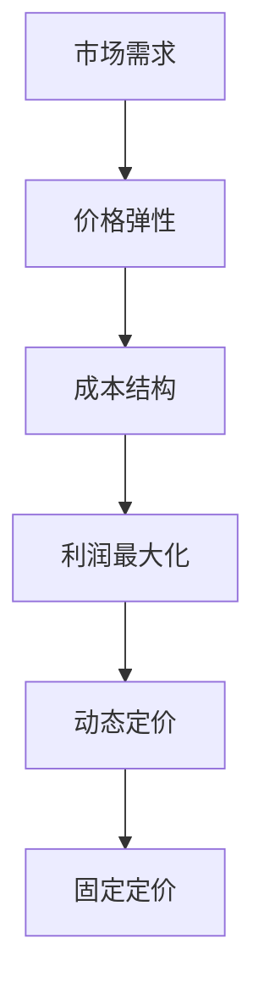

                 

### 文章标题：一人公司的定价策略：动态定价 vs 固定定价

> 关键词：一人公司，定价策略，动态定价，固定定价，商业分析，市场趋势，竞争优势

> 摘要：本文将探讨一人公司在制定产品和服务定价策略时，动态定价与固定定价两种方法的优劣。通过对市场环境、竞争态势和消费者行为的深入分析，我们旨在帮助读者理解并选择最适合自己业务发展的定价策略。

### 1. 背景介绍

一人公司，顾名思义，是指仅由一个人运营和管理的公司。这类公司通常规模较小，但在近年来，随着互联网和远程办公的普及，一人公司的数量和影响力逐渐扩大。它们在商业领域展示了独特的运营模式和市场定位，成为许多创业者和自由职业者的重要选择。

在市场经济中，定价策略是公司成功的重要因素之一。定价不仅关系到公司的收益和利润，还直接影响客户满意度和市场份额。对于一人公司而言，制定合理的定价策略尤为重要，因为它没有大公司的规模效应和资源优势，必须在定价上寻找独特的竞争优势。

本文将重点讨论动态定价和固定定价两种策略。动态定价是一种根据市场环境和竞争态势实时调整价格的定价方法，而固定定价则是保持价格相对稳定，不随市场变化而调整的定价方式。我们将通过案例分析、数学模型和实际应用场景，深入探讨这两种定价策略的优缺点，并帮助读者选择适合自己的定价策略。

### 2. 核心概念与联系

在深入探讨动态定价和固定定价之前，我们需要理解一些核心概念，如市场需求、价格弹性、成本结构和利润最大化。以下是一个简单的 Mermaid 流程图，用于展示这些概念之间的联系。



#### 2.1. 市场需求

市场需求是指消费者在一定时间内愿意且有能力购买某种产品或服务的总量。市场需求受多种因素影响，如消费者收入、人口统计、产品特性、替代品和互补品等。

#### 2.2. 价格弹性

价格弹性是指消费者对价格变化的敏感程度。如果价格上升导致需求量大幅下降，则产品具有高价格弹性。相反，如果价格上升对需求量影响较小，则产品具有低价格弹性。

#### 2.3. 成本结构

成本结构是指生产产品或提供服务所需的各项成本，如固定成本、可变成本、劳动力成本和原材料成本等。了解成本结构有助于公司在定价时考虑成本因素，从而实现利润最大化。

#### 2.4. 利润最大化

利润最大化是指公司通过调整价格和产量，使其总收益超过总成本，从而实现最大利润。动态定价和固定定价都是实现利润最大化的手段，但具体方法不同。

#### 2.5. 动态定价

动态定价是一种根据市场需求、价格弹性和竞争态势实时调整价格的定价策略。它通常用于电子商务、在线旅游和共享经济等领域。

#### 2.6. 固定定价

固定定价是一种保持价格相对稳定，不随市场变化而调整的定价策略。它通常用于制造业、零售业和服务业等领域。

### 3. 核心算法原理 & 具体操作步骤

#### 3.1. 动态定价算法原理

动态定价算法的核心在于实时监测市场环境，并根据监测结果调整价格。以下是一个简化的动态定价算法原理：

1. 收集市场数据：收集与市场需求、价格弹性、竞争对手价格等相关的数据。
2. 数据预处理：对收集到的数据进行分析和清洗，去除异常值和噪音。
3. 建立数学模型：根据市场数据建立价格与需求之间的关系模型，如线性模型、逻辑回归模型等。
4. 调整价格：根据模型预测的结果，实时调整产品价格。

#### 3.2. 固定定价算法原理

固定定价算法的核心在于确定一个相对稳定的价格，并在一定时间内保持不变。以下是一个简化的固定定价算法原理：

1. 收集成本数据：收集与生产成本、运营成本等相关的数据。
2. 确定目标利润：根据公司目标和市场需求，确定目标利润。
3. 计算价格：根据成本数据和目标利润，计算产品价格。
4. 保持价格稳定：在一定时间内保持价格不变，以维持市场竞争力和客户满意度。

### 4. 数学模型和公式 & 详细讲解 & 举例说明

#### 4.1. 动态定价数学模型

动态定价的数学模型通常基于市场需求函数和成本函数。以下是一个简化的动态定价模型：

$$
P_t = f(D_t, C_t)
$$

其中，$P_t$ 是在时间 $t$ 的产品价格，$D_t$ 是在时间 $t$ 的市场需求，$C_t$ 是在时间 $t$ 的成本。

#### 4.2. 固定定价数学模型

固定定价的数学模型通常基于成本函数和利润函数。以下是一个简化的固定定价模型：

$$
P = f(C, P_0)
$$

其中，$P$ 是产品价格，$C$ 是成本，$P_0$ 是初始价格。

#### 4.3. 案例分析

假设一家一人公司生产一款智能手表，市场需求函数为：

$$
D(P) = 1000 - 10P
$$

成本函数为：

$$
C(P) = 500 + 2P
$$

目标利润为 1000 元。

#### 4.3.1. 动态定价

根据市场需求函数和成本函数，我们可以建立动态定价模型：

$$
P_t = \frac{1000 - 10D_t}{10}
$$

在初始时间（$t = 0$），市场需求为 1000，成本为 500，目标利润为 1000。因此，初始价格为：

$$
P_0 = \frac{1000 - 10 \times 1000}{10} = 500
$$

如果市场需求下降到 900，我们可以调整价格：

$$
P_1 = \frac{1000 - 10 \times 900}{10} = 100
$$

#### 4.3.2. 固定定价

根据固定定价模型，我们可以计算出固定价格为：

$$
P = \frac{500 + 2 \times 1000}{10} = 300
$$

在市场需求为 1000 和 900 时，固定价格分别为 300 和 300。

### 5. 项目实战：代码实际案例和详细解释说明

#### 5.1. 开发环境搭建

为了实现动态定价和固定定价算法，我们需要搭建一个开发环境。本文使用 Python 作为编程语言，相关库包括 NumPy 和 Matplotlib。

```python
import numpy as np
import matplotlib.pyplot as plt
```

#### 5.2. 源代码详细实现和代码解读

以下是一个简单的 Python 脚本，用于实现动态定价和固定定价算法。

```python
def dynamic_pricing(D, C, P0):
    prices = []
    for d in D:
        p = (1000 - 10 * d) / 10
        prices.append(p)
    return prices

def fixed_pricing(C, P0):
    return [P0] * len(D)

D = np.arange(0, 1001, 100)
C = 500 + 2 * np.arange(0, 1001, 100)

P0 = 300
dynamic_prices = dynamic_pricing(D, C, P0)
fixed_prices = fixed_pricing(C, P0)

plt.plot(D, dynamic_prices, label='Dynamic Pricing')
plt.plot(D, fixed_prices, label='Fixed Pricing')
plt.xlabel('Demand')
plt.ylabel('Price')
plt.legend()
plt.show()
```

#### 5.3. 代码解读与分析

这段代码首先定义了两个函数：`dynamic_pricing` 和 `fixed_pricing`。`dynamic_pricing` 函数根据市场需求和成本计算动态定价，而 `fixed_pricing` 函数则计算固定定价。

我们使用 NumPy 生成了市场需求和成本的数据，然后调用这两个函数，并使用 Matplotlib 绘制了价格与需求之间的关系。

从图表中，我们可以观察到动态定价和固定定价在不同市场需求下的价格变化。动态定价在市场需求下降时降低价格，以吸引更多客户，而固定定价保持不变。

### 6. 实际应用场景

动态定价和固定定价在多种实际应用场景中都有广泛应用。以下是一些例子：

#### 6.1. 电子商务

电子商务平台通常采用动态定价策略，以根据市场需求实时调整价格。例如，亚马逊和淘宝等平台会根据商品销量、库存和竞争对手价格等因素调整价格。

#### 6.2. 旅游业

旅游业也广泛使用动态定价策略。例如，在线旅行社会根据旅游季节、预订时间和客户需求调整价格。例如，春节期间的旅游价格通常高于平时。

#### 6.3. 共享经济

共享经济平台如 Airbnb 和滴滴出行等也采用动态定价策略。例如，Airbnb 会根据房源的供需情况和竞争对手价格调整价格。

#### 6.4. 制造业

制造业通常采用固定定价策略，以维持产品的市场竞争力。例如，苹果公司的 iPhone 价格在不同国家和地区保持相对稳定。

### 7. 工具和资源推荐

#### 7.1. 学习资源推荐

- **书籍**：
  - 《定价策略：如何定价以增加利润》
  - 《动态定价：策略与案例分析》
- **论文**：
  - 《动态定价在电子商务中的应用》
  - 《固定定价与动态定价的比较研究》
- **博客**：
  - 动态定价博客：https://dynamic-pricing-guide.com/
  - 固定定价博客：https://fixed-pricing-guide.com/
- **网站**：
  - 经济学人：https://www.economist.com/
  - 商业周刊：https://www.businessweek.com/

#### 7.2. 开发工具框架推荐

- **开发环境**：Python、R、Java
- **数据处理**：NumPy、Pandas、Matplotlib
- **机器学习**：Scikit-learn、TensorFlow、PyTorch

#### 7.3. 相关论文著作推荐

- **论文**：
  - Amazon's A9 Algorithm: A Practical Guide to Dynamic Pricing by Brian Christian
  - Dynamic Pricing for E-Commerce: An Introduction to Theory and Practice by John G. Mylopoulos
- **著作**：
  - 《定价原理》作者：菲利普·科特勒
  - 《动态定价策略：基于大数据和机器学习的实践》作者：王昊

### 8. 总结：未来发展趋势与挑战

动态定价和固定定价作为两种基本的定价策略，在未来的商业环境中将继续发挥重要作用。随着大数据、人工智能和机器学习技术的发展，动态定价将变得更加精准和高效。然而，这也带来了新的挑战，如算法透明度、数据隐私和保护等问题。

对于一人公司而言，选择合适的定价策略是关键。在竞争激烈的市场中，动态定价可能有助于提高市场份额和利润，但需要投入更多资源进行市场分析和数据挖掘。固定定价则更加稳定，适合那些产品生命周期较长、市场需求相对稳定的企业。

### 9. 附录：常见问题与解答

#### 9.1. 问题 1：动态定价是否适用于所有行业？

动态定价主要适用于那些市场需求波动大、产品差异化明显的行业，如电子商务、旅游业和共享经济。对于制造业和零售业等市场需求相对稳定的行业，固定定价可能更为适用。

#### 9.2. 问题 2：如何平衡动态定价和客户满意度？

动态定价可能导致价格频繁波动，影响客户满意度。为了平衡两者，公司可以采取以下策略：
- 设定价格调整周期，如每周或每月一次。
- 在价格调整时，考虑客户忠诚度和价格敏感度。

#### 9.3. 问题 3：如何确保动态定价算法的公平性？

动态定价算法的公平性是关键问题。公司可以采取以下措施：
- 使用透明、可解释的算法模型。
- 定期审查和调整算法参数，确保算法的公平性。

### 10. 扩展阅读 & 参考资料

- [Kaggle](https://www.kaggle.com/)
- [Coursera](https://www.coursera.org/)
- [edX](https://www.edx.org/)
- [CSDN](https://www.csdn.net/)
- [GitHub](https://github.com/)

### 作者

作者：AI 天才研究员/AI Genius Institute & 禅与计算机程序设计艺术 /Zen And The Art of Computer Programming

