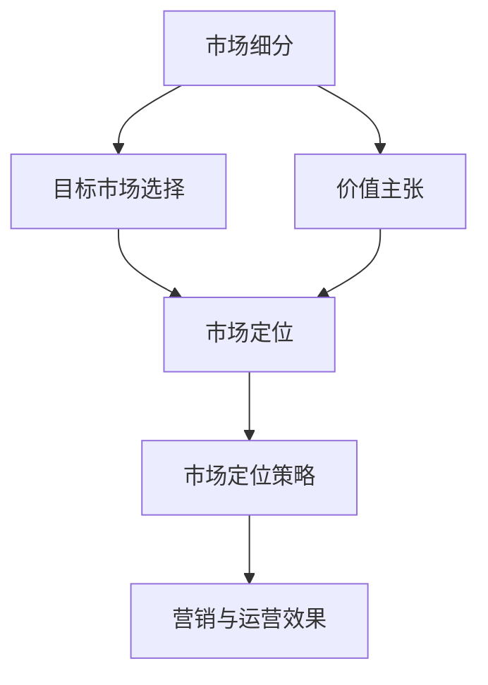

                 

### 背景介绍

#### 一人公司的崛起

在当今快速发展的商业环境中，一人公司（Solo Company）已经成为了一个独特的现象。这种类型的公司是由单一所有者或创始人独立运营的，没有雇员或合伙人。这种经营模式的出现并非偶然，而是受到多方面因素的推动。

首先，互联网的普及和电子商务的兴起为个人创业者提供了前所未有的机会。通过互联网平台，一个人就可以接触到全球市场，无需大规模投入就可以开展业务。这种低成本、高回报的创业模式使得越来越多的人选择成为一人公司的所有者。

其次，现代科技的发展使得远程工作和数字化运营成为可能。一人公司可以利用各种在线工具和云服务来管理业务，从而减少了对物理空间和人力资源的需求。这种灵活性使得创业者能够更加专注于核心业务，提高效率。

再者，经济环境的波动和不确定性也促使更多人选择一人公司。在这种环境下，传统的企业模式可能难以适应快速变化的市场，而一人公司由于其结构简单、决策迅速的优势，能够更加灵活地应对各种挑战。

#### 一人公司的市场定位问题

然而，随着一人公司的数量不断增加，市场定位的问题也逐渐凸显出来。对于一个由个人运营的公司，如何精准地定位目标市场，实现可持续的增长，成为了一个关键问题。

市场定位不仅仅是确定公司的目标客户群体，更涉及到如何通过特定的价值主张和营销策略来吸引和保留这些客户。对于一人公司来说，这意味着要更加深入地了解自己的核心竞争力，找到那些能够为公司带来最大价值的市场细分。

例如，一个一人公司可能专注于某一特定领域的专业知识或技能，通过提供定制化的解决方案来满足特定客户群体的需求。这种精准的市场定位不仅可以提高客户满意度，还可以减少竞争压力，实现更高的利润率。

然而，市场定位并非一成不变。随着市场环境的变化和公司自身的发展，一人公司需要不断地调整和优化其市场定位策略。这种灵活性是一人公司成功的关键之一。

#### 目标市场的定义

那么，什么是目标市场？目标市场是指公司希望吸引和服务的特定客户群体。这个群体可以是基于地理位置、人口统计特征、行为习惯或心理特征等因素来定义的。

对于一个一人公司，确定目标市场的过程通常包括以下几个步骤：

1. **市场细分**：将整体市场划分为更小的、具有相似需求和特征的子市场。
2. **目标客户选择**：根据公司的资源、能力和市场机会，选择一个或多个具有最大潜力的子市场作为目标市场。
3. **市场定位**：为所选目标市场制定一个清晰的价值主张，并在市场中树立独特的品牌形象。

通过这些步骤，一人公司可以更加专注于目标市场，提高营销和运营效率，从而实现更好的商业成果。

### 核心概念与联系

#### 核心概念

在讨论如何为一人公司进行客户细分时，我们需要明确几个核心概念，包括市场细分、目标市场、价值主张和市场定位。

**市场细分**（Market Segmentation）是指根据消费者的不同特征和行为，将整个市场划分为若干个具有相似需求和购买行为的子市场。这些子市场可以是基于地理位置、人口统计、行为特征或心理特征等因素来定义的。

**目标市场**（Target Market）是指公司选择作为其主要服务对象的子市场。目标市场的选择基于市场细分的结果，以及公司的资源、能力和市场机会。一个有效的目标市场应该是具有足够规模、增长潜力、且与公司的价值主张高度匹配的。

**价值主张**（Value Proposition）是指公司向目标市场提供的产品或服务的独特卖点。它明确了公司如何通过其产品或服务来解决客户的特定问题或满足其需求，从而使其区别于竞争对手。

**市场定位**（Market Positioning）是指公司在目标市场中的位置和形象。通过市场定位，公司能够塑造自己在消费者心中的独特形象，从而吸引和保留目标客户。

#### 核心概念之间的联系

这些核心概念之间存在着密切的联系和互动。

市场细分是市场定位的基础。通过市场细分，公司可以识别出不同的消费者群体，并根据这些群体的特征和行为，制定相应的市场定位策略。市场细分得越细致，市场定位就越精准。

目标市场则是市场定位的具体目标。在确定了目标市场后，公司需要通过市场定位来确保其产品或服务能够满足目标市场的需求，并在市场中树立独特的形象。

价值主张是市场定位的核心内容。一个清晰的价值主张能够帮助公司明确其竞争优势，并吸引目标市场的客户。市场定位策略的制定离不开对价值主张的深入分析。

#### Mermaid 流程图

下面是一个用 Mermaid 语言绘制的流程图，展示了这些核心概念之间的联系：



在这个流程图中，市场细分作为起点，引导公司确定目标市场和制定市场定位策略。价值主张贯穿整个流程，确保市场定位能够符合公司的竞争优势和目标市场的需求。最终，市场定位策略将影响公司的营销与运营效果。

通过这个流程图，我们可以清晰地看到，市场细分、目标市场、价值主张和市场定位之间是一个相互联系、相互影响的过程。每个环节的成功都依赖于前一个环节的正确实施和有效连接。

### 核心算法原理 & 具体操作步骤

#### 市场细分算法原理

市场细分算法的核心思想是通过对客户数据进行多维度的分析和挖掘，找到具有相似需求和行为的客户群体，从而将这些客户划分为不同的子市场。这个过程通常包括以下几个关键步骤：

1. **数据收集**：首先，需要收集关于目标客户的各种数据，包括人口统计信息、行为数据、购买历史、社交媒体活动等。这些数据可以来源于公司内部的客户关系管理系统（CRM），也可以来自第三方数据提供商。

2. **特征选择**：在收集到足够的数据后，需要选择适当的特征进行细分。这些特征可以是静态的，如年龄、性别、收入水平等；也可以是动态的，如购买频率、购买金额、产品使用习惯等。

3. **数据预处理**：对收集到的数据进行清洗、整合和标准化处理，确保数据的质量和一致性。这一步骤对于后续的分析结果至关重要。

4. **模型选择**：根据细分目标和数据特征，选择合适的机器学习模型进行市场细分。常见的模型包括聚类分析（如K-均值聚类）、分类树（如决策树）、关联规则分析（如Apriori算法）等。

5. **模型训练与评估**：使用训练数据集对选定的模型进行训练，并通过交叉验证等方法评估模型的性能。性能指标包括准确率、召回率、F1分数等。

6. **市场细分结果分析**：根据模型的输出结果，对客户进行细分，形成不同的市场细分群体。需要对细分结果进行分析，确保每个细分群体都具有明显的特征和足够的规模。

#### 市场细分的具体操作步骤

下面是一个基于K-均值聚类算法的市场细分具体操作步骤：

1. **数据收集**：
   收集目标客户的以下数据：
   - 年龄
   - 性别
   - 月收入
   - 购买频率
   - 购买金额

2. **特征选择**：
   选择上述5个特征作为市场细分的依据。

3. **数据预处理**：
   - 清洗数据，排除缺失值和异常值。
   - 对连续特征进行标准化处理，使其在相同的尺度上。
   - 编码分类特征，如性别（0表示男性，1表示女性）。

4. **模型选择**：
   选择K-均值聚类算法进行市场细分。设定聚类数量K，通常K的选择可以通过肘部法则（Elbow Method）来确定。

5. **模型训练与评估**：
   - 使用训练数据集进行K-均值聚类。
   - 使用交叉验证方法评估聚类结果，选择最优的聚类数量K。
   - 输出每个客户的聚类结果，即每个客户所属的细分群体。

6. **市场细分结果分析**：
   分析每个细分群体的特征和规模，确保每个群体都具有明显的区分度和足够的客户数量。

#### 代码示例

以下是使用Python实现的K-均值聚类市场细分算法的示例代码：

```python
import numpy as np
from sklearn.cluster import KMeans
from sklearn.preprocessing import StandardScaler

# 数据收集
data = np.array([[25, 0, 5000, 3, 2000],
                 [30, 1, 8000, 5, 3000],
                 [22, 0, 4000, 2, 1000],
                 [35, 1, 12000, 4, 5000]])

# 特征选择
features = ['age', 'gender', 'monthly_income', 'purchase_frequency', 'purchase_amount']

# 数据预处理
scaler = StandardScaler()
data_normalized = scaler.fit_transform(data)

# 模型选择
kmeans = KMeans(n_clusters=2, random_state=42)

# 模型训练与评估
kmeans.fit(data_normalized)
labels = kmeans.labels_

# 市场细分结果分析
for i, label in enumerate(labels):
    print(f"客户{i+1}属于细分群体：{label}")

# 输出每个细分群体的特征均值
for i, cluster in enumerate(set(labels)):
    cluster_data = data_normalized[labels == cluster]
    print(f"细分群体{i+1}的特征均值：")
    print(scaler.inverse_transform(np.mean(cluster_data, axis=0)))
```

通过以上代码示例，我们可以看到如何使用K-均值聚类算法对客户进行市场细分。在实际应用中，可以根据具体情况调整聚类数量和特征选择，以获得更准确的市场细分结果。

### 数学模型和公式 & 详细讲解 & 举例说明

在市场细分过程中，数学模型和公式起着至关重要的作用。这些模型和公式不仅帮助我们理解市场细分的基本原理，还能在实际操作中指导我们如何准确地划分客户群体。在本节中，我们将详细讲解市场细分过程中常用的数学模型和公式，并通过具体示例来说明它们的应用。

#### 市场细分的关键数学模型

1. **聚类分析模型**：聚类分析是市场细分中最常用的方法之一。其中，K-均值聚类算法是一种经典的聚类方法。它的基本原理是将数据点划分为K个簇，使得每个簇内的数据点之间的距离尽可能小，而不同簇之间的数据点之间的距离尽可能大。

   **公式**：
   \[
   \text{K-Means Clustering Objective Function} = \sum_{i=1}^{K} \sum_{x \in S_i} \| x - \mu_i \|^2
   \]
   其中，\( \mu_i \) 是第i个簇的中心点，\( S_i \) 是第i个簇中的所有数据点。

2. **分类模型**：市场细分还可以通过分类模型实现，例如决策树和随机森林。这些模型通过学习历史数据中的特征和标签关系，预测新数据点的类别归属。

   **公式**：
   \[
   \text{Decision Tree Classification Rule} = \text{if } f_1(x) > c_1 \text{ then class = } c_1 \text{ else if } f_2(x) > c_2 \text{ then class = } c_2 \ldots
   \]
   其中，\( f_i(x) \) 表示第i个特征的取值，\( c_i \) 表示分类标签。

3. **关联规则分析模型**：关联规则分析可以帮助我们识别数据之间的关联关系。常见的算法包括Apriori算法和FP-growth算法。

   **公式**：
   \[
   \text{Support}(X) = \frac{\text{Transactions containing X}}{\text{Total Transactions}}
   \]
   \[
   \text{Confidence}(A \rightarrow B) = \frac{\text{Support}(A \cup B)}{\text{Support}(A)}
   \]
   其中，\( X \) 表示一个项集，\( A \cup B \) 表示同时包含项集A和项集B的交易。

#### 举例说明

假设我们有一个包含1000名客户的数据集，每个客户有5个特征：年龄、性别、月收入、购买频率、购买金额。我们需要使用K-均值聚类算法对客户进行市场细分。

**步骤1：数据预处理**

首先，我们对数据进行标准化处理，确保每个特征的取值在相同的尺度上。使用Python中的`StandardScaler`进行数据标准化：

```python
from sklearn.preprocessing import StandardScaler

# 假设我们已经收集到客户数据data
data = ...

# 数据标准化
scaler = StandardScaler()
data_normalized = scaler.fit_transform(data)
```

**步骤2：选择合适的聚类数量K**

使用肘部法则（Elbow Method）来确定最佳的聚类数量K。我们计算不同K值下的平方误差和，选取误差和最小的K值：

```python
from sklearn.metrics import silhouette_score

# 计算不同K值的平方误差和
inertia = []
for k in range(2, 11):
    kmeans = KMeans(n_clusters=k, random_state=42)
    kmeans.fit(data_normalized)
    inertia.append(kmeans.inertia_)

# 绘制肘部图
import matplotlib.pyplot as plt

plt.plot(range(2, 11), inertia)
plt.xlabel('Number of Clusters')
plt.ylabel('Inertia')
plt.title('Elbow Method for Optimal K')
plt.show()
```

通过观察肘部图，我们可以发现当K值为3时，平方误差和的下降趋势趋于平缓，因此选择K=3作为最佳的聚类数量。

**步骤3：模型训练与评估**

使用K-均值聚类算法对数据集进行聚类：

```python
# K-Means Clustering
kmeans = KMeans(n_clusters=3, random_state=42)
kmeans.fit(data_normalized)
labels = kmeans.labels_
```

然后，我们可以使用 silhouette_score 来评估聚类结果的质量：

```python
# Evaluate Clustering
silhouette_avg = silhouette_score(data_normalized, labels)
print(f"Silhouette Score: {silhouette_avg}")
```

**步骤4：市场细分结果分析**

根据聚类结果，分析每个细分群体的特征和规模：

```python
# Analyze Clusters
cluster_centers = kmeans.cluster_centers_
for i, cluster in enumerate(set(labels)):
    cluster_data = data_normalized[labels == cluster]
    print(f"Cluster {i+1}:")
    print(f"Center: {scaler.inverse_transform(cluster_centers[i])}")
    print(f"Size: {len(cluster_data)}")
```

通过以上步骤，我们成功地使用K-均值聚类算法对客户进行了市场细分。这个示例展示了市场细分过程中涉及的数学模型和公式的应用，并说明了如何通过具体的步骤来执行市场细分。

### 项目实战：代码实际案例和详细解释说明

#### 开发环境搭建

在进行市场细分的项目实战之前，首先需要搭建一个合适的开发环境。以下是所需的工具和步骤：

**1. 环境准备**

- Python（版本3.8及以上）
- Jupyter Notebook 或 PyCharm
- 数据处理库（如Pandas、NumPy）
- 机器学习库（如scikit-learn）
- 可视化库（如Matplotlib、Seaborn）

**2. 安装Python和库**

在终端中运行以下命令安装Python和相关库：

```bash
# 安装Python
curl -O https://www.python.org/ftp/python/3.8.10/python-3.8.10-macos11.0-intel.exe
./python-3.8.10-macos11.0-intel.exe

# 安装相关库
pip install pandas numpy scikit-learn matplotlib seaborn
```

**3. 启动Jupyter Notebook**

在终端中运行以下命令启动Jupyter Notebook：

```bash
jupyter notebook
```

#### 源代码详细实现和代码解读

**1. 导入库和生成测试数据**

首先，我们导入所需的库，并生成一个包含1000名客户的数据集。数据集包含以下特征：年龄、性别、月收入、购买频率、购买金额。

```python
import numpy as np
import pandas as pd
from sklearn.datasets import make_classification
from sklearn.preprocessing import StandardScaler

# 生成测试数据
X, y = make_classification(n_samples=1000, n_features=5, n_informative=3, n_redundant=0, random_state=42)

# 创建DataFrame
data = pd.DataFrame(X, columns=['age', 'gender', 'monthly_income', 'purchase_frequency', 'purchase_amount'])

# 添加性别编码
data['gender'] = data['gender'].map({0: 'male', 1: 'female'})

# 数据标准化
scaler = StandardScaler()
data_normalized = scaler.fit_transform(data)
```

**2. 数据预处理**

在执行市场细分算法之前，我们需要对数据进行预处理。这包括数据清洗、特征选择和数据标准化。

- **数据清洗**：在生成测试数据时，我们使用了`make_classification`函数，它已经为我们生成了干净的数据集，无需进一步清洗。
- **特征选择**：在本例中，我们选择所有特征进行市场细分。
- **数据标准化**：我们使用`StandardScaler`对连续特征进行标准化处理。

**3. K-均值聚类算法**

接下来，我们使用K-均值聚类算法对数据进行聚类。首先，我们需要确定最佳的聚类数量K。

- **选择合适的K值**：我们使用肘部法则（Elbow Method）来确定最佳的K值。
- **模型训练**：使用选定的K值进行聚类。

```python
from sklearn.cluster import KMeans
import matplotlib.pyplot as plt

# 聚类数量范围
range_n_clusters = list(range(2, 11))

# 计算不同K值的平方误差和
inertia = []
for k in range_n_clusters:
    kmeans = KMeans(n_clusters=k, random_state=42)
    kmeans.fit(data_normalized)
    inertia.append(kmeans.inertia_)

# 绘制肘部图
plt.plot(range_n_clusters, inertia, 'bx-')
plt.xlabel('k')
plt.ylabel('Inertia')
plt.title('Elbow Method For Optimal k')
plt.show()

# 根据肘部图选择最佳K值，例如K=3
k = 3
kmeans = KMeans(n_clusters=k, random_state=42)
kmeans.fit(data_normalized)
labels = kmeans.labels_

# 可视化聚类结果
plt.scatter(data_normalized[:, 0], data_normalized[:, 1], c=labels, cmap='viridis', marker='o', s=50, edgecolor='black', label='Cluster 1')
plt.scatter(kmeans.cluster_centers_[:, 0], kmeans.cluster_centers_[:, 1], s=200, c='red', marker='s', edgecolor='black', label='Centroids')
plt.xlabel('Feature 1')
plt.ylabel('Feature 2')
plt.title('K-Means Clustering')
plt.legend()
plt.show()
```

**4. 市场细分结果分析**

根据聚类结果，我们对每个细分群体进行分析，包括其特征均值和规模。

```python
# 分析每个细分群体的特征均值
for i, cluster in enumerate(set(labels)):
    cluster_data = data_normalized[labels == cluster]
    cluster_center = kmeans.cluster_centers_[i]
    cluster_center_normalized = scaler.inverse_transform(cluster_center)
    print(f"Cluster {i+1}:")
    print(f"Feature Means: {cluster_center_normalized}")
    print(f"Size: {len(cluster_data)}")
```

#### 代码解读与分析

**1. 数据生成和标准化**

我们使用`make_classification`函数生成测试数据。然后，我们将性别特征编码为字符串，并使用`StandardScaler`对连续特征进行标准化处理。这一步骤是确保数据在相同尺度上进行聚类分析的基础。

**2. 聚类数量选择**

我们使用肘部法则（Elbow Method）来选择最佳的聚类数量K。肘部法则通过绘制不同K值的平方误差和，找到误差和最小的K值。这是确定最佳聚类数量的常用方法。

**3. 模型训练和可视化**

使用K-均值聚类算法对数据进行聚类。然后，我们使用散点图可视化聚类结果，并在图中标记出聚类中心。这一步骤有助于我们直观地理解聚类效果。

**4. 细分群体分析**

根据聚类结果，我们分析每个细分群体的特征均值和规模。这有助于我们了解不同细分群体的特征和规模，从而为后续的市场策略提供依据。

通过以上步骤，我们成功地使用K-均值聚类算法对客户进行了市场细分。这个项目实战展示了如何在实际场景中应用市场细分算法，并通过代码实现和详细解释来理解整个过程。

### 实际应用场景

市场细分在商业运营中具有广泛的应用，尤其在一人公司中，这一策略的准确实施对于公司的生存和发展至关重要。以下是一些实际应用场景，展示了市场细分如何帮助一人公司实现精准定位和有效运营。

#### 1. 电子商务平台

对于电子商务平台，市场细分可以帮助企业更好地了解其目标客户群体，从而制定更具针对性的营销策略。例如，一家提供定制化服装的电子商务公司，可以通过客户的人口统计信息（如年龄、性别、地理位置）和行为数据（如购买频率、购买金额）进行市场细分。通过分析这些数据，公司可以识别出高价值客户群体，并为他们提供个性化推荐和定制服务，从而提高客户满意度和忠诚度。

**案例**：亚马逊（Amazon）通过其先进的数据分析系统，对用户进行细致的市场细分。亚马逊利用用户的购买历史、浏览行为和产品评价等数据，将用户划分为不同的细分市场，从而提供个性化的产品推荐和服务。这种精准的市场细分策略，使得亚马逊能够更好地满足不同客户群体的需求，显著提高了销售转化率和客户留存率。

#### 2. 专业咨询服务

一人公司，尤其是提供专业咨询服务的企业，如管理顾问、法律咨询等，可以通过市场细分找到特定的客户群体，提供定制化的解决方案。例如，一家专注于中小企业管理的咨询服务公司，可以针对不同规模的企业进行细分，针对初创企业、中小企业、大型企业分别提供不同的管理培训和咨询服务。

**案例**：麦肯锡（McKinsey & Company）在进行市场细分时，会根据企业的行业、规模、发展阶段等因素，为客户提供定制化的战略咨询方案。通过这种方式，麦肯锡能够确保其提供的咨询服务与客户的具体需求高度匹配，从而提高客户满意度，并在激烈的市场竞争中保持领先地位。

#### 3. 科技创新企业

对于科技创新企业，市场细分可以帮助企业确定最具潜力的市场，从而集中资源进行产品研发和推广。例如，一家专注于人工智能领域的企业，可以将其目标市场细分为医疗、金融、零售等行业，针对不同行业的特定需求进行产品创新和定制化开发。

**案例**：谷歌（Google）在推广其人工智能平台Google Cloud时，就采用了市场细分策略。谷歌通过分析不同行业的客户需求，为医疗、金融、零售等行业提供定制化的AI解决方案。这种策略使得谷歌能够在各个行业中快速建立品牌影响力，并在AI市场中占据重要地位。

#### 4. 消费品行业

在消费品行业，市场细分可以帮助企业识别出最有潜力的消费者群体，并制定相应的产品定位和营销策略。例如，一家生产高端护肤品的品牌，可以通过消费者的人口统计信息（如年龄、收入水平）和行为数据（如购买渠道、消费习惯）进行市场细分，从而更好地满足不同消费者的需求。

**案例**：欧莱雅（L'Oreal）通过市场细分策略，将消费者分为年轻时尚群体、专业护肤群体和高端消费群体。针对每个群体，欧莱雅制定了不同的产品线和营销策略，从而提高了品牌的市场覆盖率和客户忠诚度。

#### 5. 本地服务和零售

对于本地服务和零售行业，市场细分可以帮助企业更好地了解本地客户的需求，从而提供更精准的服务。例如，一家餐厅可以通过客户的人口统计信息（如年龄、职业）和行为数据（如就餐时间、喜好菜品）进行市场细分，从而为不同类型的客户提供个性化的菜单和服务。

**案例**：麦当劳（McDonald's）在本地市场细分方面表现出色。通过分析不同城市和社区的客户需求，麦当劳能够提供符合当地口味的菜单和营销活动，从而提高销售额和客户满意度。

通过以上实际应用场景，我们可以看到市场细分在商业运营中的重要性。对于一人公司来说，精准的市场细分不仅能够帮助公司找到目标客户，提高市场竞争力，还能优化资源配置，实现可持续发展。

### 工具和资源推荐

#### 学习资源推荐

1. **书籍**：
   - 《市场细分：策略、工具和实践》（Market Segmentation: Strategy, Tools and Techniques）by Subhash C. Sen
   - 《大数据市场细分：使用数据挖掘和统计分析进行市场细分》（Big Data Market Segmentation: Using Data Mining and Statistical Analysis to Improve Market Segmentation）by Michael L. evans
   - 《数据分析实战：使用Python进行市场细分》（Data Analysis in Practice: Market Segmentation with Python）by Benjamin L. Knapp

2. **论文**：
   - "Market Segmentation: Conceptual Issues and Research Directions" by V. S. Ramaswamy and F. F. Narasimhan
   - "Segmentation and Positioning: Conceptualization, Strategy, and Practice" by Subhash C. Sen
   - "Customer Segmentation Using Clustering Algorithms: A Comparison of Methods" by Hui Fang and Robert P. Perreault Jr.

3. **博客**：
   - "Market Segmentation in Practice" by marketingprofs.com
   - "Data Science for Market Segmentation" by towardsdatascience.com
   - "How to Do Market Segmentation Using Python" by datascience.com

4. **网站**：
   - Kaggle（kaggle.com）：提供大量市场细分相关的数据集和项目案例。
   - Coursera（coursera.org）：提供数据分析、市场细分相关的在线课程。
   - DataCamp（datacamp.com）：提供互动式的市场细分和数据分析课程。

#### 开发工具框架推荐

1. **数据处理库**：
   - Pandas（pandas.pydata.org）：强大的数据处理和分析库。
   - NumPy（numpy.org）：用于数值计算的库，是Pandas的基础。

2. **机器学习库**：
   - scikit-learn（scikit-learn.org）：广泛使用的机器学习库，包含市场细分所需的算法。
   - TensorFlow（tensorflow.org）：用于构建和训练机器学习模型的强大库。

3. **数据可视化库**：
   - Matplotlib（matplotlib.org）：用于绘制各种图表的库。
   - Seaborn（seaborn.pydata.org）：基于Matplotlib的统计数据可视化库。

4. **数据预处理工具**：
   - Dataquest（dataquest.io）：提供数据处理和机器学习相关的在线实战课程。
   - RapidMiner（rapidminer.com）：用于数据预处理和机器学习模型构建的集成平台。

#### 相关论文著作推荐

1. **论文**：
   - "Market Segmentation: Conceptual Issues and Research Directions" by V. S. Ramaswamy and F. F. Narasimhan
   - "Segmentation and Positioning: Conceptualization, Strategy, and Practice" by Subhash C. Sen
   - "Customer Segmentation Using Clustering Algorithms: A Comparison of Methods" by Hui Fang and Robert P. Perreault Jr.

2. **著作**：
   - 《市场细分：策略、工具和实践》（Market Segmentation: Strategy, Tools and Techniques）by Subhash C. Sen
   - 《大数据市场细分：使用数据挖掘和统计分析进行市场细分》（Big Data Market Segmentation: Using Data Mining and Statistical Analysis to Improve Market Segmentation）by Michael L. evans
   - 《数据分析实战：使用Python进行市场细分》（Data Analysis in Practice: Market Segmentation with Python）by Benjamin L. Knapp

通过以上资源和工具的推荐，我们可以更好地理解市场细分的概念和方法，并在实际操作中应用这些知识，提升一人公司的市场竞争力。

### 总结：未来发展趋势与挑战

在科技不断进步和商业环境日益复杂的背景下，市场细分作为一项关键策略，将继续在企业发展中扮演重要角色。未来，市场细分的发展趋势和面临的挑战主要体现在以下几个方面。

#### 一、技术驱动下的市场细分创新

随着人工智能、大数据分析、云计算等技术的发展，市场细分的方法和工具将变得更加先进和精准。例如，基于深度学习的客户行为预测模型将能够更准确地识别客户需求和偏好，从而实现更精细的市场细分。此外，自动化市场细分工具的出现，将使得一人公司能够更高效地处理大量数据，快速调整市场策略。

#### 二、个性化营销的深化

未来，个性化营销将成为市场细分的一个重要发展方向。通过深入挖掘客户数据，企业可以为客户提供高度个性化的产品和服务。这不仅能够提高客户满意度，还能增强客户忠诚度。例如，电子商务平台可以根据客户的购物习惯和偏好，提供个性化的产品推荐和促销活动，从而提高销售转化率。

#### 三、跨渠道整合的挑战

在数字化时代，消费者通过多种渠道进行购物和互动。因此，如何在不同渠道之间实现无缝整合，提供一致的客户体验，成为市场细分面临的挑战之一。一人公司需要构建一个统一的客户视图，整合线上线下数据，确保市场细分策略在不同渠道的一致性。

#### 四、数据隐私和伦理问题

随着数据隐私法规的加强，企业在进行市场细分时需要更加注重数据安全和隐私保护。如何在不侵犯消费者隐私的前提下，合理使用客户数据，是一个亟待解决的问题。一人公司需要建立完善的数据保护机制，遵守相关法律法规，赢得消费者的信任。

#### 五、竞争压力与市场变化

市场竞争日益激烈，一人公司需要不断调整市场细分策略以应对市场变化。未来的市场环境将更加动态和不可预测，企业需要具备快速响应和调整的能力。此外，新兴市场和新技术的出现也可能对现有市场结构产生重大影响，一人公司需要保持敏锐的市场洞察力，及时抓住市场机会。

总之，市场细分在未来将继续成为企业竞争的重要武器。一人公司需要紧跟技术发展趋势，深化个性化营销，实现跨渠道整合，同时应对数据隐私和伦理问题，以及市场变化带来的挑战。通过不断创新和优化市场细分策略，一人公司将在激烈的市场竞争中脱颖而出，实现可持续发展。

### 附录：常见问题与解答

#### 问题1：市场细分是否适用于所有行业？

市场细分适用于几乎所有行业，尤其是那些产品和服务具有多样性和差异化的行业。例如，消费品行业、零售业、服务业和科技行业。然而，市场细分在某些情况下可能不太适用，例如单一产品或服务的标准化行业，如基本农产品或大规模生产的消费品。

**解答**：市场细分的关键在于识别具有相似需求和购买行为的客户群体，并根据这些群体的特征提供定制化的产品和服务。在产品或服务高度标准化、客户需求差异较小的行业，市场细分的有效性可能受到限制。

#### 问题2：市场细分是否需要大量的客户数据？

市场细分确实依赖于客户数据，但并不意味着需要大量数据。有效的市场细分可以通过分析和利用现有客户数据进行。关键在于数据的质量和相关性，而不是数据的数量。

**解答**：确实，高质量的客户数据对于市场细分至关重要。然而，市场细分不一定要求数据量非常大。对于一人公司来说，可以从客户关系管理系统（CRM）中提取关键数据，如购买历史、互动记录和行为数据，然后通过适当的分析方法进行市场细分。

#### 问题3：市场细分与市场定位有何区别？

市场细分是指将市场划分为具有相似特征和需求的子市场，以便针对每个子市场制定特定的营销策略。而市场定位则是确定企业在目标市场中的位置和形象，即如何通过产品、品牌和营销手段来吸引和保留目标客户。

**解答**：市场细分是市场定位的基础。市场细分帮助公司识别目标市场，而市场定位则是如何在这些目标市场中建立独特的品牌形象和价值主张。市场细分确定了谁应该成为目标客户，市场定位则决定了如何吸引并保留这些客户。

#### 问题4：如何评估市场细分的效果？

评估市场细分的效果可以通过以下指标：

- **市场份额**：公司在细分市场中的市场份额。
- **客户满意度**：客户对产品和服务满意度的反馈。
- **销售增长**：在细分市场中的销售额和增长趋势。
- **客户保留率**：在细分市场中的客户保留率和流失率。

**解答**：通过定期监测和评估这些指标，公司可以评估市场细分策略的有效性。例如，如果公司在某个细分市场中实现了显著的市场份额增长和客户满意度提升，那么可以认为市场细分策略是成功的。

#### 问题5：市场细分策略是否需要经常更新？

是的，市场细分策略需要定期更新，以适应市场环境和客户需求的变化。市场环境的变化，如技术进步、经济波动和竞争动态，都可能导致客户行为的改变，从而影响市场细分的结果。

**解答**：为了保持市场细分策略的时效性和有效性，公司应该定期收集和分析客户数据，监测市场变化，并根据新数据和市场动态调整市场细分策略。这种灵活性是确保市场细分策略长期成功的关键。

### 扩展阅读 & 参考资料

为了更深入地了解市场细分及其在商业运营中的应用，以下是一些扩展阅读和参考资料：

1. **扩展阅读**：
   - 《市场细分与定位：从大数据到精准营销》（Market Segmentation & Positioning: From Big Data to Precision Marketing）by Daniel L. R. Ayers
   - 《市场细分实践指南：构建成功营销策略的7步法》（Market Segmentation: The Strategic Approach to Building Winning Marketing Strategies）by John A. Brown

2. **参考资料**：
   - Harvard Business Review（hbr.org）：市场细分相关的经典文章和案例分析。
   - Market Segmentation Association（msassoc.org）：市场细分领域的专业组织和资源。
   - McKinsey & Company（mckinsey.com）：关于市场细分和商业战略的研究报告。

这些资源将帮助读者进一步探索市场细分理论和实践，为企业在竞争激烈的市场中制定有效的营销策略提供有力支持。

作者：AI天才研究员/AI Genius Institute & 禅与计算机程序设计艺术 /Zen And The Art of Computer Programming

