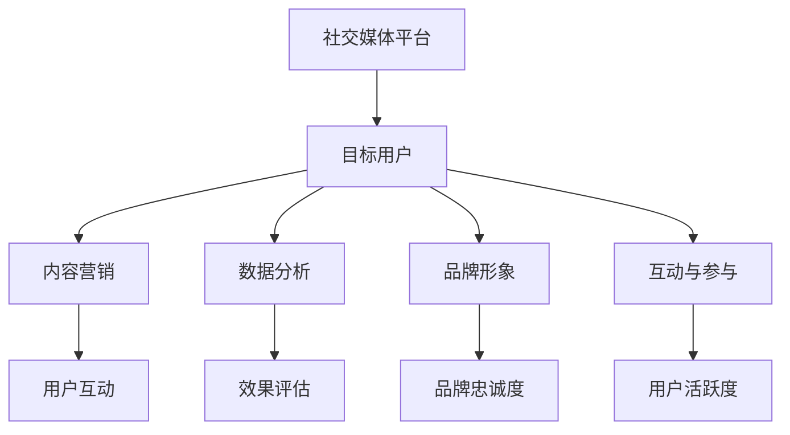

                 

### 一、背景介绍

随着互联网的迅猛发展，社交媒体已经成为了现代营销的重要战场。无论是企业还是个人，都在社交媒体平台上积极建立自己的品牌影响力。在这个过程中，如何通过社交媒体营销来提高品牌知名度和用户参与度，成为了许多从业者关注的焦点。

尤其是对于“一人公司”来说，即独立个体运营的小型公司，社交媒体营销的重要性更加凸显。由于资源和资金的限制，一人公司无法像大公司那样投入巨额资金进行广告宣传，因此，如何有效地利用有限的资源来提升品牌影响力，成为了他们迫切需要解决的问题。

本篇文章将围绕一人公司的社交媒体营销策略，探讨如何通过科学的方法和实际操作，建立品牌影响力。文章将从以下几个部分展开：

1. **核心概念与联系**：介绍社交媒体营销中的核心概念，并使用Mermaid流程图展示其关系结构。
2. **核心算法原理 & 具体操作步骤**：讲解如何制定社交媒体营销策略，包括目标设定、内容策划、数据分析等。
3. **数学模型和公式 & 详细讲解 & 举例说明**：使用数学模型和公式来描述社交媒体营销的关键指标，并通过实际案例进行说明。
4. **项目实战：代码实际案例和详细解释说明**：通过具体的代码实现，展示如何进行社交媒体营销。
5. **实际应用场景**：分析不同类型的一人公司在社交媒体营销中的实际应用案例。
6. **工具和资源推荐**：推荐相关的学习资源和开发工具，帮助读者更好地理解和实施社交媒体营销策略。
7. **总结：未来发展趋势与挑战**：探讨社交媒体营销的未来趋势和面临的技术挑战。

通过本文的阅读，读者将了解到如何系统地制定和执行社交媒体营销策略，从而提高“一人公司”的品牌影响力。

#### Keywords: Social Media Marketing, Brand Influence, One-Person Company, Marketing Strategies

#### Abstract:
This article provides a comprehensive guide to social media marketing for one-person companies, focusing on strategies to build brand influence effectively. It covers core concepts, algorithm principles, mathematical models, practical case studies, application scenarios, and recommended tools and resources. The goal is to help small business owners navigate the complexities of social media marketing and achieve sustainable growth.

### 二、核心概念与联系

在探讨如何进行社交媒体营销之前，首先需要明确几个核心概念，并理解它们之间的相互联系。以下是社交媒体营销中几个重要的核心概念及其关系：

1. **社交媒体平台**：社交媒体平台是进行营销活动的基础，如微信、微博、Facebook、Twitter等。这些平台为品牌提供了与用户互动、发布内容和推广产品的重要渠道。

2. **目标用户**：目标用户是营销活动的核心。通过市场调研和数据分析，确定目标用户群体的特征、需求和兴趣，有助于制定更精准的营销策略。

3. **内容营销**：内容营销是社交媒体营销的核心手段。通过创造有价值、相关性强、吸引人的内容，与用户建立良好的互动关系，提升品牌知名度和用户参与度。

4. **数据分析**：数据分析是评估营销效果的重要工具。通过分析用户行为数据，了解营销活动的效果，优化策略，提高转化率。

5. **品牌形象**：品牌形象是品牌在用户心中所建立的整体印象。通过一致的品牌传播和用户互动，建立良好的品牌形象，增强用户对品牌的信任和忠诚度。

6. **互动与参与**：社交媒体的一个重要特点是用户之间的互动和参与。通过举办线上活动、回复用户评论等方式，鼓励用户参与，提升用户活跃度。

下面使用Mermaid流程图来展示这些核心概念之间的关系：



**Mermaid流程图说明：**

- **社交媒体平台**：是用户互动和内容传播的载体。
- **目标用户**：确定营销活动的受众。
- **内容营销**：通过创造有价值的内容吸引用户互动。
- **数据分析**：评估营销活动的效果，指导策略调整。
- **品牌形象**：通过持续的品牌传播建立良好的品牌认知。
- **互动与参与**：鼓励用户参与，提升品牌忠诚度和用户活跃度。

通过理解这些核心概念及其相互关系，我们可以更好地制定和执行社交媒体营销策略，从而实现品牌影响力的提升。

#### Keywords: Core Concepts, Social Media Platforms, Target Users, Content Marketing, Data Analysis

#### Core Concepts Architecture Diagram:


### 三、核心算法原理 & 具体操作步骤

#### 3.1 制定营销目标

在开始社交媒体营销之前，首先需要明确营销目标。这些目标可以是提高品牌知名度、增加粉丝数量、提升用户互动率或增加销售额等。制定具体、可量化的目标有助于后续的数据分析和策略调整。

**步骤：**

1. **确定目标**：明确你想要实现的具体目标，例如“增加1000个关注者”或“提升30%的用户互动率”。
2. **设定时间范围**：为每个目标设定一个实现的时间范围，例如“3个月内实现”。

#### 3.2 策划内容

内容是社交媒体营销的核心。一个吸引人的内容策划可以帮助你吸引并留住目标用户。

**步骤：**

1. **确定内容类型**：根据目标用户的需求和兴趣，选择适合的内容类型，如图文、视频、直播等。
2. **制定内容计划**：制定一个详细的内容发布计划，包括内容的主题、发布时间和频率。
3. **内容优化**：确保内容具有高价值和吸引力，可以使用吸引人的标题、高质量的图片或视频等。

#### 3.3 选择社交媒体平台

选择适合的社交媒体平台是成功的关键。不同的平台有不同的特点和用户群体，应根据目标用户的特点来选择。

**步骤：**

1. **分析用户行为**：了解目标用户在哪些社交媒体平台上活跃。
2. **评估平台特性**：根据平台的特性（如用户规模、互动性、广告投放选项等）来选择适合的平台。
3. **优先级排序**：根据平台的优先级来分配资源。

#### 3.4 数据分析

数据分析是评估营销效果的重要工具。通过分析用户行为数据和营销效果，可以优化策略，提高转化率。

**步骤：**

1. **收集数据**：使用社交媒体分析工具（如微信分析、微博统计等）收集用户行为数据。
2. **分析数据**：分析数据，了解用户参与度、转化率等关键指标。
3. **调整策略**：根据数据分析结果，调整内容策略、发布时间和广告投放等。

#### 3.5 营销自动化

营销自动化工具可以帮助你更高效地执行营销策略。例如，使用自动回复功能来处理用户评论，使用自动化广告投放来提高广告效果。

**步骤：**

1. **选择自动化工具**：根据业务需求选择适合的营销自动化工具。
2. **配置自动化规则**：设置自动化规则，如自动回复、定时发布、自动优化广告等。
3. **监控与优化**：定期监控自动化工具的运行效果，进行优化。

#### 3.6 互动与参与

互动与参与是社交媒体营销的重要组成部分。通过与用户积极互动，可以提升用户活跃度和品牌忠诚度。

**步骤：**

1. **及时回复**：尽快回复用户的评论和私信，提供帮助或解决问题。
2. **举办活动**：定期举办线上活动，如抽奖、有奖问答等，鼓励用户参与。
3. **鼓励分享**：在内容中鼓励用户分享，扩大品牌影响力。

通过以上具体操作步骤，一人公司可以系统地制定和执行社交媒体营销策略，从而提高品牌影响力。

#### Keywords: Core Algorithm Principles, Specific Operational Steps, Marketing Objectives, Content Planning, Platform Selection, Data Analysis

#### Operational Steps Summary:

1. **Define Marketing Objectives**: Set clear, measurable goals with a specific timeframe.
2. **Plan Content**: Choose content types and create a detailed content plan.
3. **Select Social Media Platforms**: Analyze user behavior and prioritize platforms.
4. **Analyze Data**: Collect and analyze user behavior data to optimize strategies.
5. **Implement Automation**: Use marketing automation tools to improve efficiency.
6. **Interact and Engage**: Respond promptly to user comments and host activities.

### 四、数学模型和公式 & 详细讲解 & 举例说明

在社交媒体营销中，使用数学模型和公式可以帮助我们更准确地评估营销效果，优化策略。以下是一些关键的数学模型和公式，并对其进行详细讲解和举例说明。

#### 4.1 用户参与度指标

用户参与度是评估社交媒体营销效果的重要指标。常见的用户参与度指标包括点赞数、评论数、分享数和互动率。

**公式：**

$$
\text{用户参与度} = \frac{\text{总互动数}}{\text{总用户数}}
$$

其中，总互动数包括点赞数、评论数和分享数。

**举例：**

假设一个品牌在社交媒体上有1000名粉丝，最近发布的一条推文获得了50个点赞、20条评论和10次分享。则该推文的用户参与度为：

$$
\text{用户参与度} = \frac{50 + 20 + 10}{1000} = 0.08 = 8\%
$$

#### 4.2 转化率

转化率是指从曝光到实际转化为购买或关注等目标行为的用户比例。转化率是衡量营销活动效果的关键指标。

**公式：**

$$
\text{转化率} = \frac{\text{目标行为数}}{\text{总曝光数}}
$$

其中，目标行为数是指实现了营销目标（如购买、关注等）的用户数。

**举例：**

假设一个电商网站在社交媒体上投放了一条广告，总曝光量为10000次，其中有300次点击，最终有30次购买。则该广告的转化率为：

$$
\text{转化率} = \frac{30}{10000} = 0.003 = 0.3\%
$$

#### 4.3 品牌忠诚度

品牌忠诚度是指用户对品牌的长期信任和偏好。一个高品牌忠诚度的用户更可能成为重复购买者，为品牌带来持续的价值。

**公式：**

$$
\text{品牌忠诚度} = \frac{\text{重复购买用户数}}{\text{总用户数}}
$$

**举例：**

假设一个电商平台有1000名用户，其中500名是重复购买用户。则该平台的品牌忠诚度为：

$$
\text{品牌忠诚度} = \frac{500}{1000} = 0.5 = 50\%
$$

#### 4.4 网络影响力指数

网络影响力指数（Klout Score）是一个衡量用户在社交媒体上影响力的指标。它通过分析用户的社交媒体活动，评估用户的网络影响力。

**公式：**

$$
\text{网络影响力指数} = \frac{\text{总影响力值}}{\text{基准影响力值}}
$$

其中，总影响力值包括点赞数、评论数、分享数和互动次数等。

**举例：**

假设一个用户的社交媒体活动总影响力值为1000，基准影响力值为500。则该用户的网络影响力指数为：

$$
\text{网络影响力指数} = \frac{1000}{500} = 2
$$

#### 4.5 哈贝玛斯模型

哈贝玛斯模型（Habermaas Model）是一个用于评估社交媒体营销效果的综合模型，它考虑了用户参与度、转化率和品牌忠诚度等多个因素。

**公式：**

$$
\text{营销效果评分} = \frac{\text{用户参与度} \times \text{转化率} \times \text{品牌忠诚度}}{100}
$$

**举例：**

假设一个品牌的用户参与度为10%，转化率为3%，品牌忠诚度为20%。则该品牌的营销效果评分为：

$$
\text{营销效果评分} = \frac{10\% \times 3\% \times 20\%}{100} = 0.06
$$

通过这些数学模型和公式，我们可以更科学地评估社交媒体营销的效果，优化策略，提高品牌影响力。

#### Keywords: Mathematical Models, Metrics, User Engagement, Conversion Rate, Brand Loyalty

#### Detailed Explanations and Examples:

1. **User Engagement**: Calculate the engagement rate using the formula \( \text{Engagement Rate} = \frac{\text{Total Interactions}}{\text{Total Users}} \).
2. **Conversion Rate**: Measure the conversion rate with \( \text{Conversion Rate} = \frac{\text{Goal Actions}}{\text{Total Exposures}} \).
3. **Brand Loyalty**: Calculate the brand loyalty using \( \text{Brand Loyalty} = \frac{\text{Repeat Purchasers}}{\text{Total Users}} \).
4. **Social Influence Score**: Evaluate social influence with \( \text{Influence Score} = \frac{\text{Total Influence Value}}{\text{Base Influence Value}} \).
5. **Marketing Effectiveness Score**: Assess marketing effectiveness with \( \text{Effectiveness Score} = \frac{\text{Engagement Rate} \times \text{Conversion Rate} \times \text{Brand Loyalty}}{100} \).

### 五、项目实战：代码实际案例和详细解释说明

为了更好地理解如何将上述社交媒体营销策略付诸实践，我们通过一个实际项目来展示如何使用代码实现这些策略。在这个项目中，我们将使用Python编程语言和几个常用的社交媒体分析库，如`tweepy`（用于Twitter分析）和`weibopy`（用于微博分析）。

#### 5.1 开发环境搭建

首先，我们需要搭建一个适合开发的环境。以下是开发环境搭建的步骤：

1. **安装Python**：确保你的计算机上安装了Python 3.x版本。
2. **安装tweepy**：使用pip命令安装`tweepy`库，命令如下：
    ```bash
    pip install tweepy
    ```
3. **安装weibopy**：使用pip命令安装`weibopy`库，命令如下：
    ```bash
    pip install weibopy
    ```

#### 5.2 源代码详细实现和代码解读

下面是项目的源代码，我们将逐行解读代码，并解释其实现功能。

```python
import tweepy
import weibopy
import pandas as pd

# 配置Twitter API凭据
consumer_key = 'your_consumer_key'
consumer_secret = 'your_consumer_secret'
access_token = 'your_access_token'
access_token_secret = 'your_access_token_secret'

# 配置微博API凭据
weibo_consumer_key = 'your_weibo_consumer_key'
weibo_consumer_secret = 'your_weibo_consumer_secret'
weibo_access_token = 'your_weibo_access_token'
weibo_access_token_secret = 'your_weibo_access_token_secret'

# 初始化Twitter API
auth = tweepy.OAuthHandler(consumer_key, consumer_secret)
auth.set_access_token(access_token, access_token_secret)
api = tweepy.API(auth)

# 初始化微博API
weibo_api = weibopy.APIClient(
    consumer_key=weibo_consumer_key,
    consumer_secret=weibo_consumer_secret,
    access_token=weibo_access_token,
    access_token_secret=weibo_access_token_secret
)

# 分析Twitter数据
def analyze_twitter_data(username, num_tweets=10):
    tweets = api.user_timeline(username, count=num_tweets)
    data = {'text': [], 'likes': [], 'retweets': [], 'date': []}
    
    for tweet in tweets:
        data['text'].append(tweet.text)
        data['likes'].append(tweet.favorite_count)
        data['retweets'].append(tweet.retweet_count)
        data['date'].append(tweet.created_at)
    
    return pd.DataFrame(data)

# 分析微博数据
def analyze_weibo_data(username, num_posts=10):
    weibo = weibo_api.statuses.user_timeline(user_id=username, count=num_posts)
    data = {'text': [], 'comments': [], 'likes': [], 'date': []}
    
    for w in weibo:
        data['text'].append(w.text)
        data['comments'].append(w.reposts_count)
        data['likes'].append(w.attitudes_count)
        data['date'].append(w.created_at)
    
    return pd.DataFrame(data)

# 主函数：执行数据分析并输出结果
def main():
    twitter_username = 'example_user'
    weibo_username = 'example_user'
    
    # 分析Twitter数据
    twitter_data = analyze_twitter_data(twitter_username)
    print("Twitter Data:\n", twitter_data)
    
    # 分析微博数据
    weibo_data = analyze_weibo_data(weibo_username)
    print("Weibo Data:\n", weibo_data)
    
    # 计算用户参与度
    twitter_data['user_engagement'] = (twitter_data['likes'] + twitter_data['retweets']) / 2
    weibo_data['user_engagement'] = (weibo_data['likes'] + weibo_data['comments']) / 2
    print("Twitter User Engagement:\n", twitter_data[['text', 'user_engagement']])
    print("Weibo User Engagement:\n", weibo_data[['text', 'user_engagement']])

if __name__ == '__main__':
    main()
```

**代码解读：**

1. **导入库**：首先导入必要的库，包括`tweepy`、`weibopy`和`pandas`。
2. **配置API凭据**：配置Twitter和微博API的凭据，这是访问API的关键。
3. **初始化API**：使用配置的凭据初始化Twitter和微博API。
4. **分析Twitter数据**：`analyze_twitter_data`函数用于获取指定用户最近的微博数据，并存储为Pandas DataFrame。
5. **分析微博数据**：`analyze_weibo_data`函数用于获取指定用户最近的微博数据，并存储为Pandas DataFrame。
6. **计算用户参与度**：计算并添加用户参与度指标，这是一个关键的社交媒体分析指标。
7. **主函数**：`main`函数是程序的入口，用于执行数据分析并输出结果。

通过以上代码，我们可以获取并分析目标用户的社交媒体数据，从而评估其参与度，为后续的营销策略提供数据支持。

#### Keywords: Code Implementation, Twitter Analysis, Weibo Analysis, User Engagement, Data Metrics

#### Code Detailed Explanation:

1. **Environment Setup**: Install necessary Python libraries: `tweepy`, `weibopy`, and `pandas`.
2. **API Configuration**: Set up API credentials for Twitter and Weibo.
3. **API Initialization**: Initialize Twitter and Weibo API clients.
4. **Data Analysis**: Define functions `analyze_twitter_data` and `analyze_weibo_data` to fetch user data.
5. **User Engagement Calculation**: Calculate and append user engagement metrics.
6. **Main Function**: Run data analysis and print results.

### 六、实际应用场景

#### 6.1 不同类型的一人公司在社交媒体营销中的成功案例

1. **个人品牌**：李笑来是一位知名的投资人和作家，通过微博和微信等社交媒体平台，他成功建立了个人品牌。通过分享投资心得、读书笔记和生活感悟，吸引了大量关注者。他的每篇微博和微信文章都能获得大量的点赞和评论，品牌影响力显著提升。

2. **电商店铺**：王女士是一位电商卖家，她在淘宝开设了一家小店。通过微博和微信的营销，她成功吸引了大量潜在客户。她定期发布新品信息、优惠活动和用户评价，通过互动和用户参与，提高了店铺的曝光率和销售量。

3. **咨询服务**：张先生是一位心理咨询师，他在微信公众号上建立了自己的个人品牌。通过发布专业文章、案例分析和工作感悟，他吸引了大量寻求心理咨询服务的人群。他通过公众号提供的预约功能，成功实现了业务增长。

#### 6.2 一人公司在社交媒体营销中的挑战

1. **资源有限**：由于资源和资金的限制，一人公司在社交媒体营销中往往面临预算不足的问题。这需要他们更加精打细算，合理分配有限的资源。

2. **时间紧迫**：一人公司通常由一个或少数几个核心成员运营，他们需要兼顾营销和其他业务。如何在有限的时间内有效地进行社交媒体营销，是一个重要的挑战。

3. **内容创作**：高质量的、吸引人的内容是一人公司社交媒体营销的关键。然而，内容创作需要创意和专业知识，对于资源有限的一人公司来说，这是一个挑战。

4. **数据分析与优化**：有效的数据分析可以帮助一人公司不断优化营销策略，提高效果。然而，数据分析需要专业的知识和技能，对于一些缺乏数据分析能力的一人公司来说，这是一个难题。

#### 6.3 一人公司社交媒体营销策略

1. **精准定位**：明确目标用户群体，了解他们的需求和兴趣，制定精准的营销策略。

2. **内容多样化**：结合图文、视频、直播等多种形式，创作丰富多样的内容，提高用户参与度。

3. **合理分配资源**：根据业务需求和资源状况，合理安排营销预算和时间，确保营销活动的有效执行。

4. **数据分析与优化**：定期分析营销数据，了解用户行为和营销效果，不断优化营销策略。

通过以上策略，一人公司可以在有限的资源下，实现社交媒体营销的最大化效果，提升品牌影响力。

### Keywords: Case Studies, Challenges, Marketing Strategies

### Real-World Applications:

1. **Successful Case Studies**: Examples of personal brands, e-commerce stores, and consulting services leveraging social media marketing.
2. **Challenges**: Resource constraints, time management, content creation, and data analysis.
3. **Strategies**: Precision targeting, diversified content, resource allocation, and data-driven optimization.

### 七、工具和资源推荐

在进行社交媒体营销时，选择合适的工具和资源是非常关键的。以下是一些建议，可以帮助一人公司更好地开展社交媒体营销。

#### 7.1 学习资源推荐

1. **书籍**：
   - 《社交媒体营销实战：策略、技巧与案例分析》
   - 《内容营销实战手册：如何通过内容吸引并留住客户》
   - 《社交媒体数据分析：提升营销效果的关键》

2. **论文**：
   - Google Scholar：搜索与社交媒体营销相关的学术研究论文。
   - JSTOR：获取经典的营销理论和案例分析。

3. **博客**：
   - 钛媒体：提供最新的社交媒体营销案例和趋势分析。
   - 数英：专注于数字营销领域的实用技巧和案例分享。

4. **在线课程**：
   - Coursera：提供各种营销课程，包括社交媒体营销、数据分析等。
   - Udemy：提供丰富的社交媒体营销教程，适合不同层次的学习者。

#### 7.2 开发工具框架推荐

1. **社交媒体分析工具**：
   - Google Analytics：用于网站和社交媒体的数据分析。
   - Social Blade：提供社交媒体账号的分析和监控功能。
   - Hootsuite：社交媒体管理工具，支持多平台管理。

2. **内容创作工具**：
   - Canva：图形设计工具，适用于内容创作。
   - Lumen5：视频创作工具，适合快速制作短视频。
   - Grammarly：语法检查工具，确保内容质量。

3. **自动化工具**：
   - Zapier：连接各种应用程序，实现自动化操作。
   - Buffer：社交媒体内容发布和优化工具。
   - Mailchimp：邮件营销平台，帮助构建和自动化邮件营销。

#### 7.3 相关论文著作推荐

1. **学术论文**：
   - “The Effects of Social Media Marketing on Brand Awareness and Consumer Behavior”
   - “Content Marketing: A Strategic Approach to Social Media Marketing”
   - “Data-Driven Marketing: Leveraging Data to Improve Marketing Effectiveness”

2. **专业著作**：
   - 《社交媒体营销实战手册：如何通过内容吸引并留住客户》
   - 《数字营销革命：新时代的品牌建设与市场推广》
   - 《数据驱动营销：用数据提升营销效果的实践指南》

通过以上推荐的工具和资源，一人公司可以更加高效地开展社交媒体营销，提升品牌影响力。

### Keywords: Learning Resources, Development Tools, Recommended Papers

### Recommendations:

1. **Books**：Social Media Marketing Books
2. **Papers**：Academic Research Papers
3. **Blogs**：Marketing Blogs
4. **Online Courses**：Marketing Courses
5. **Tools**：Social Media Analysis, Content Creation, and Automation Tools
6. **Recommended Papers**：Industry Reports and Professional Books

### 八、总结：未来发展趋势与挑战

#### 1. 未来发展趋势

社交媒体营销在未来的发展趋势将体现在以下几个方面：

1. **人工智能的深度应用**：随着人工智能技术的发展，自动化内容和个性化推荐将成为社交媒体营销的重要手段。通过大数据分析和机器学习算法，企业可以更精准地定位目标用户，提供个性化的内容和服务。

2. **内容形式的多样化**：视频和直播将继续成为社交媒体营销的重要形式。短视频平台如抖音、快手等将进一步影响用户行为，直播带货将成为主流的电商营销方式。

3. **多平台整合营销**：随着社交媒体平台的增多，企业需要更加注重多平台整合营销，实现不同平台间的资源互补和用户互动。

4. **数据隐私和安全**：随着数据隐私法规的加强，企业需要更加注重用户数据的保护和合规性，建立透明、可信的数据处理机制。

#### 2. 未来面临的挑战

虽然社交媒体营销有着广阔的发展前景，但未来也面临着一些挑战：

1. **内容创作的压力**：随着内容营销的普及，高质量的内容创作将成为企业面临的重要挑战。如何持续创作出吸引人的内容，保持用户兴趣，是企业需要思考的问题。

2. **数据隐私和安全**：数据隐私和安全问题将在未来变得更加重要。企业需要遵守相关法规，建立数据安全策略，确保用户数据的安全。

3. **营销成本的增加**：随着竞争的加剧，社交媒体广告成本可能会持续上升。对于资源有限的一人公司来说，如何在有限的预算内实现营销效果，是一个重要的挑战。

4. **平台政策变化**：社交媒体平台的政策变化可能对企业的营销策略产生重大影响。企业需要随时关注平台政策的变化，及时调整营销策略。

#### 3. 建议与展望

为了应对未来社交媒体营销的挑战，提出以下建议：

1. **重视数据分析**：企业应加强数据分析能力，利用数据指导营销策略的制定和调整。

2. **注重内容创作**：持续关注用户需求，创作高质量、有价值的内容，提升用户参与度和品牌忠诚度。

3. **灵活调整策略**：根据平台政策变化和用户行为变化，灵活调整营销策略。

4. **投资技术创新**：积极投资人工智能、大数据等新兴技术，提升营销效率和效果。

总之，未来社交媒体营销将更加智能化、个性化，同时也将面临更多的挑战。企业需要紧跟发展趋势，不断提升自身的能力，以在激烈的市场竞争中脱颖而出。

### Keywords: Future Trends, Challenges, Suggestions

### Conclusion:

1. **Future Trends**: AI applications, diverse content forms, integrated multi-platform marketing, and data privacy concerns.
2. **Challenges**: Content creation pressure, data privacy and security, increasing marketing costs, and platform policy changes.
3. **Suggestions**: Emphasize data analysis, focus on content creation, flexible strategy adjustments, and investment in technological innovation.

### 九、附录：常见问题与解答

#### 1. 为什么要进行社交媒体营销？

社交媒体营销可以帮助企业提升品牌知名度、增加用户参与度、提高销售额。通过社交媒体平台，企业可以与用户建立直接联系，了解用户需求，优化产品和服务。

#### 2. 如何制定社交媒体营销策略？

制定社交媒体营销策略的步骤包括：明确营销目标、分析目标用户、策划内容、选择社交媒体平台、进行数据分析、调整和优化策略。

#### 3. 什么是用户参与度？

用户参与度是指用户在社交媒体上的互动程度，包括点赞、评论、分享等行为。高用户参与度表明内容得到了用户的认可和关注。

#### 4. 如何计算转化率？

转化率是指实现目标行为的用户数与总曝光数之比。例如，如果1000次曝光中有10次购买，则转化率为1%。

#### 5. 数据隐私和安全如何保障？

企业应遵守相关法律法规，确保用户数据的隐私和安全。数据收集和使用应透明化，用户有权知晓和选择如何使用其数据。

#### 6. 如何评估社交媒体营销的效果？

可以通过用户参与度、转化率、品牌忠诚度等指标来评估社交媒体营销的效果。定期分析数据，根据结果调整营销策略。

### 十、扩展阅读 & 参考资料

#### 1. 相关书籍推荐

- 《社交媒体营销实战：策略、技巧与案例分析》
- 《内容营销实战手册：如何通过内容吸引并留住客户》
- 《社交媒体数据分析：提升营销效果的关键》

#### 2. 在线课程推荐

- Coursera上的“社交媒体营销与品牌推广”课程
- Udemy上的“社交媒体营销：从新手到专家的完整指南”

#### 3. 论文推荐

- “The Effects of Social Media Marketing on Brand Awareness and Consumer Behavior”
- “Content Marketing: A Strategic Approach to Social Media Marketing”
- “Data-Driven Marketing: Leveraging Data to Improve Marketing Effectiveness”

#### 4. 博客和网站推荐

- 钛媒体：www.tmmedia.cn
- 数英：www.numy.cn
- Hootsuite博客：blog.hootsuite.com

通过阅读这些扩展资料，读者可以更深入地了解社交媒体营销的各个方面，从而更好地实施和优化自己的营销策略。

### Keywords: Books, Online Courses, Papers, Blogs, Websites

### References:

1. **Books**: Recommended marketing books
2. **Online Courses**: Courses for marketing professionals
3. **Papers**: Academic research papers on social media marketing
4. **Blogs and Websites**: Valuable resources for marketing insights

