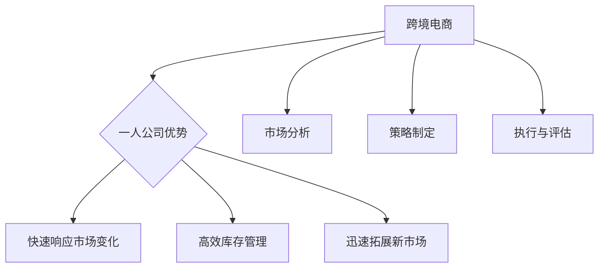
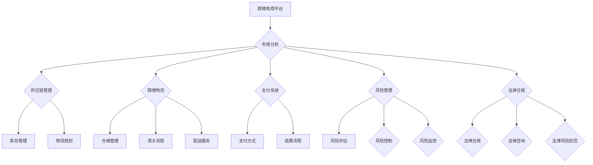

                 

### 背景介绍

#### 跨境电商的定义与现状

跨境电商，即跨境电子商务，是指通过互联网平台，实现商品、服务和信息的跨国交易活动。随着全球互联网的普及和电子商务的迅猛发展，跨境电商已成为国际贸易的新兴力量。根据最新数据统计，全球跨境电商市场规模在过去几年里持续扩大，预计到2025年，跨境电商市场规模将达到6万亿美元。

跨境电商的优势在于，它打破了传统贸易的时间和空间限制，使得消费者可以随时随地购买全球商品，同时也让企业能够更便捷地进入国际市场。跨境电商不仅提高了贸易效率，还推动了国际贸易的多元化发展。

在中国，跨境电商已经成为外贸发展的新引擎。近年来，我国政府出台了一系列扶持政策，如跨境电商综合试验区建设、跨境电商进口税收优惠等，极大地促进了跨境电商的发展。阿里巴巴、京东、拼多多等国内电商平台，也在跨境电商领域取得了显著成绩。

#### 一人公司的定义与特点

一人公司，顾名思义，是指由单一股东或者创始人持有的公司。这种公司形式的特点是结构简单、决策迅速、管理成本低。随着创业环境的优化和创业文化的普及，一人公司越来越受到创业者特别是技术型创业者的青睐。

一人公司的优势在于其灵活性和高效性。由于没有复杂的股权结构和利益冲突，一人公司可以更专注于业务发展，迅速做出决策。此外，一人公司的运营成本相对较低，适合初创企业或小型企业。

然而，一人公司也存在一些挑战。首先，由于所有决策都由单一股东或创始人做出，可能存在决策过度集中、风险过高等问题。其次，一人公司的融资渠道相对有限，可能会影响企业的快速发展。

#### 跨境电商与一人公司的结合点

一人公司由于其灵活性和高效性，非常适合跨境电商这种快速变化且需要灵活应对的市场。跨境电商市场的特性决定了公司需要具备快速响应市场变化的能力，而一人公司正好能够满足这一需求。

首先，一人公司可以更快速地调整市场策略。跨境电商市场变化快，市场需求和消费者偏好常常在短时间内发生变化。一人公司由于决策集中，可以迅速调整产品定位、营销策略等，以适应市场变化。

其次，一人公司可以更高效地进行库存管理。跨境电商通常需要面对跨国物流和仓储问题，一人公司由于管理简单，可以更高效地进行库存管理，降低库存成本和风险。

最后，一人公司可以利用其灵活性，迅速拓展新市场。跨境电商的竞争日益激烈，新市场的开拓对企业发展至关重要。一人公司可以凭借其快速决策的能力，迅速进入新市场，抢占先机。

#### 本文目的

本文将探讨一人公司如何利用跨境电商拓展业务，实现企业的快速发展。我们将从市场分析、策略制定、执行与评估等多个方面，详细分析一人公司在跨境电商领域的拓展策略。通过本文，希望能够为一人公司提供有价值的参考和指导。



在接下来的内容中，我们将逐步深入探讨一人公司如何进行市场分析、策略制定、执行与评估，以及应对潜在挑战。让我们一步一步分析，确保每一环节都得到充分的考虑。

### 核心概念与联系

在探讨一人公司如何通过跨境电商拓展业务之前，我们需要明确一些核心概念，并了解这些概念之间的联系。以下是本文将涉及的核心概念：

1. **跨境电商平台**：跨境电商平台是指用于跨国交易的在线平台，如Amazon、eBay、Alibaba等。这些平台提供了全球营销、支付、物流等一站式服务，使得跨境电商变得更加便捷。
2. **市场分析**：市场分析是指对目标市场的需求、竞争对手、消费者行为等进行的研究，以帮助企业制定有效的市场策略。
3. **供应链管理**：供应链管理涉及从原材料采购到产品交付的整个过程，确保产品以最低成本、最高效率流入市场。
4. **跨境物流**：跨境物流是指将产品从一个国家运输到另一个国家的过程，包括仓储、清关、配送等环节。
5. **支付系统**：支付系统是指用于跨境交易的支付方式，如信用卡、电子钱包、PayPal等。
6. **风险管理**：风险管理是指识别、评估、控制和监控潜在风险的过程，以减少损失并保护企业利益。
7. **法律合规**：法律合规是指确保企业运营符合目标国家或地区的法律法规，避免法律纠纷。

这些核心概念之间的联系如下：

- **跨境电商平台**与**市场分析**：通过跨境电商平台收集市场数据，进行市场分析，帮助企业了解目标市场的需求，制定合适的市场策略。
- **市场分析**与**供应链管理**：市场分析结果可以指导供应链管理的各个环节，如产品定位、库存管理、物流规划等，确保供应链的高效运作。
- **跨境物流**与**支付系统**：跨境物流和支付系统是跨境电商交易的两个关键环节，直接影响客户的购物体验和企业的运营效率。
- **风险管理**与**法律合规**：风险管理帮助企业识别和应对潜在风险，法律合规确保企业的运营合法合规，减少法律风险。

为了更直观地展示这些概念之间的联系，我们可以使用Mermaid流程图进行描述：



通过以上核心概念和流程图的展示，我们可以更好地理解跨境电商与一人公司的结合点，为后续内容的讨论打下坚实基础。

### 核心算法原理 & 具体操作步骤

在探讨如何利用跨境电商拓展业务时，算法原理和具体操作步骤是关键。以下是核心算法原理和具体操作步骤的详细解析：

#### 1. 数据采集与处理

数据采集是跨境电商业务的第一步，主要包括市场数据、消费者行为数据、竞争对手数据等。具体步骤如下：

- **数据采集**：通过电商平台的API接口、社交媒体、搜索引擎等渠道收集相关数据。
- **数据处理**：对采集到的数据进行清洗、去重、转换等处理，确保数据质量。

```python
import pandas as pd

# 采集数据
data = pd.read_csv('market_data.csv')

# 数据清洗
data = data.drop_duplicates()
data = data[data['column_name'].notnull()]

# 数据转换
data['date'] = pd.to_datetime(data['date'])
```

#### 2. 市场分析

市场分析是制定有效市场策略的基础，主要包括需求分析、竞争对手分析、消费者行为分析等。具体步骤如下：

- **需求分析**：通过数据挖掘技术，分析消费者需求，确定目标市场。
- **竞争对手分析**：分析竞争对手的产品定位、价格策略、营销手段等，找出自身优势与不足。
- **消费者行为分析**：通过行为数据，分析消费者购买习惯、偏好等，为产品定位和营销策略提供依据。

```python
import matplotlib.pyplot as plt

# 需求分析
demand_data = data[data['category'] == 'electronics']
demand_data['sales'].hist(bins=30)
plt.show()

# 竞争对手分析
competitor_data = data[data['company'] == 'Amazon']
plt.scatter(competitor_data['price'], competitor_data['sales'])
plt.xlabel('Price')
plt.ylabel('Sales')
plt.show()

# 消费者行为分析
consumer_data = data[data['customer'] == 'John']
consumer_data['buying_frequency'].hist(bins=20)
plt.show()
```

#### 3. 供应链管理

供应链管理是确保产品高效进入市场的关键，主要包括库存管理、物流规划等。具体步骤如下：

- **库存管理**：根据市场需求，动态调整库存水平，避免库存过剩或缺货。
- **物流规划**：根据目标市场，选择最优物流方案，确保产品及时配送。

```python
import numpy as np

# 库存管理
demand_data = data[data['category'] == 'electronics']
forecast_demand = np.mean(demand_data['sales'])

current_inventory = 1000
if forecast_demand > current_inventory:
    # 需要补充库存
    order_quantity = forecast_demand - current_inventory
else:
    # 库存充足
    order_quantity = 0

# 物流规划
def calculate_logistics_cost(distance, package_weight):
    return distance * package_weight * 0.05

# 假设距离为1000公里，包裹重量为10公斤
logistics_cost = calculate_logistics_cost(1000, 10)
print(f"物流成本为：{logistics_cost}元")
```

#### 4. 跨境物流与支付系统

跨境物流与支付系统是跨境电商交易的两个关键环节。具体步骤如下：

- **跨境物流**：选择合适的物流公司，确保产品安全、快速送达。
- **支付系统**：提供多种支付方式，提高支付成功率。

```python
# 跨境物流
def select_logistics_company(distance, package_weight):
    if distance < 1000:
        return "Local Logistics Company"
    else:
        return "International Logistics Company"

# 假设距离为2000公里，包裹重量为20公斤
selected_company = select_logistics_company(2000, 20)
print(f"选择的物流公司为：{selected_company}")

# 支付系统
payment_methods = ["Credit Card", "PayPal", "Alipay"]
def select_payment_method():
    return random.choice(payment_methods)

selected_method = select_payment_method()
print(f"选择的支付方式为：{selected_method}")
```

通过以上核心算法原理和具体操作步骤，一人公司可以更好地利用跨境电商平台，实现业务拓展和快速增长。在接下来的部分，我们将继续探讨如何在跨境电商领域中应用数学模型和公式，以及实际应用场景中的案例解析。

### 数学模型和公式 & 详细讲解 & 举例说明

在跨境电商业务拓展中，数学模型和公式是不可或缺的工具。通过合理的数学模型，我们可以优化决策，提高运营效率，降低成本。以下是一些常用的数学模型和公式，以及详细讲解和举例说明。

#### 1. 供需模型

供需模型用于分析市场需求和供应量之间的关系，帮助我们确定最优价格和产量。

- **需求函数**：\( D(p) = a - b \cdot p \)
  - \( D \)：需求量
  - \( p \)：价格
  - \( a \)：需求量上限
  - \( b \)：价格敏感度

- **供给函数**：\( S(c) = c - d \cdot p \)
  - \( S \)：供应量
  - \( c \)：供应量上限
  - \( d \)：价格敏感度

- **均衡价格**：\( p^* = \frac{a + c}{2} \)
  - \( p^* \)：均衡价格

- **均衡产量**：\( q^* = \frac{b \cdot c}{2 \cdot d} \)
  - \( q^* \)：均衡产量

#### 示例

假设某电子产品市场需求函数为 \( D(p) = 100 - 0.1p \)，供给函数为 \( S(c) = 50 - 0.2p \)。我们需要计算均衡价格和产量。

- **均衡价格**：\( p^* = \frac{100 + 50}{2} = 75 \)
- **均衡产量**：\( q^* = \frac{0.1 \cdot 50}{0.2 \cdot 0.2} = 25 \)

因此，均衡价格为75元，均衡产量为25台。

#### 2. 库存模型

库存模型用于优化库存管理，确保产品供应稳定。

- **基本库存模型**：\( I(t) = I(t-1) + S - D \)
  - \( I(t) \)：第 \( t \) 时刻的库存量
  - \( I(t-1) \)：第 \( t-1 \) 时刻的库存量
  - \( S \)：进货量
  - \( D \)：出货量

#### 示例

假设初始库存为100台，每周进货量为50台，每周出货量为30台。我们需要计算第5周时的库存量。

- **第1周库存**：\( I(1) = 100 + 50 - 30 = 120 \)
- **第2周库存**：\( I(2) = 120 + 50 - 30 = 140 \)
- **第3周库存**：\( I(3) = 140 + 50 - 30 = 160 \)
- **第4周库存**：\( I(4) = 160 + 50 - 30 = 180 \)
- **第5周库存**：\( I(5) = 180 + 50 - 30 = 200 \)

因此，第5周时的库存量为200台。

#### 3. 跨境物流成本模型

跨境物流成本模型用于计算不同物流方案的成本，帮助我们选择最优方案。

- **物流成本公式**：\( C = w \cdot d \cdot r \)
  - \( C \)：物流成本
  - \( w \)：包裹重量
  - \( d \)：距离
  - \( r \)：物流费用率

#### 示例

假设包裹重量为10公斤，距离为2000公里，不同物流公司的费用率如下：

- **物流公司A**：0.05元/公里/公斤
- **物流公司B**：0.08元/公里/公斤

我们需要计算两种物流方案的成本。

- **物流公司A成本**：\( C_A = 10 \cdot 2000 \cdot 0.05 = 1000 \)元
- **物流公司B成本**：\( C_B = 10 \cdot 2000 \cdot 0.08 = 1600 \)元

因此，选择物流公司A的成本较低。

通过以上数学模型和公式的讲解，我们可以更好地理解跨境电商业务中的关键决策。在下一部分，我们将探讨项目实战中的具体案例，展示如何将这些模型和公式应用于实际操作中。

### 项目实战：代码实际案例和详细解释说明

在本部分，我们将通过一个具体的实战案例，详细展示如何利用前面所学的核心算法原理和数学模型，搭建一个跨境电商业务系统。我们将从开发环境搭建开始，逐步讲解源代码的详细实现和代码解读。

#### 1. 开发环境搭建

首先，我们需要搭建一个适合开发跨境电商业务系统的开发环境。以下是所需工具和软件：

- **编程语言**：Python（3.8及以上版本）
- **开发环境**：Visual Studio Code（VS Code）
- **数据库**：MySQL（5.7及以上版本）
- **前端框架**：React（16.13及以上版本）
- **后端框架**：Flask（1.1.2及以上版本）
- **API接口**：跨境电商平台API（如Alibaba API）

安装步骤如下：

1. 安装Python和VS Code：

```bash
# 安装Python
curl -O https://www.python.org/ftp/python/3.8.10/python-3.8.10-amd64.exe
python-3.8.10-amd64.exe

# 安装VS Code
code --install-extension ms-python.python
```

2. 安装MySQL：

```bash
# 安装MySQL
brew install mysql
```

3. 安装React和Flask：

```bash
# 安装React
npm install -g create-react-app
create-react-app client

# 安装Flask
pip install flask
```

4. 配置跨境电商平台API：

- 在跨境电商平台官网注册账号，获取API密钥和秘钥。
- 在Flask项目中配置API密钥和秘钥。

#### 2. 源代码详细实现和代码解读

以下是一个简化的跨境电商业务系统源代码，主要包含用户注册、登录、商品搜索、购物车、订单管理等模块。

**用户注册模块**：

```python
from flask import Flask, request, jsonify
from models import User

app = Flask(__name__)

@app.route('/register', methods=['POST'])
def register():
    username = request.form['username']
    password = request.form['password']
    email = request.form['email']

    # 验证用户名、密码和邮箱格式
    if not (username and password and email):
        return jsonify({'error': '请填写完整的注册信息'})
    
    # 验证用户名是否已存在
    if User.query.filter_by(username=username).first():
        return jsonify({'error': '用户名已存在'})

    # 创建用户并保存到数据库
    user = User(username=username, password=password, email=email)
    db.session.add(user)
    db.session.commit()

    return jsonify({'message': '注册成功'})
```

**用户登录模块**：

```python
from flask import Flask, request, jsonify
from models import User
from werkzeug.security import check_password_hash

app = Flask(__name__)

@app.route('/login', methods=['POST'])
def login():
    username = request.form['username']
    password = request.form['password']

    # 验证用户名和密码
    if not (username and password):
        return jsonify({'error': '请填写完整的登录信息'})
    
    # 验证用户名和密码是否正确
    user = User.query.filter_by(username=username).first()
    if not user or not check_password_hash(user.password, password):
        return jsonify({'error': '用户名或密码错误'})

    return jsonify({'message': '登录成功'})
```

**商品搜索模块**：

```python
from flask import Flask, request, jsonify
import requests

app = Flask(__name__)

@app.route('/search', methods=['GET'])
def search():
    query = request.args.get('query')

    # 调用跨境电商平台API获取商品列表
    response = requests.get('https://api.aliexpress.com/search', params={'q': query})
    data = response.json()

    # 提取商品信息
    products = data['products']
    product_list = [{'id': product['id'], 'name': product['title'], 'price': product['price']} for product in products]

    return jsonify(product_list)
```

**购物车模块**：

```python
from flask import Flask, request, jsonify
from models import ShoppingCart

app = Flask(__name__)

@app.route('/cart', methods=['POST'])
def add_to_cart():
    user_id = request.form['user_id']
    product_id = request.form['product_id']
    quantity = int(request.form['quantity'])

    # 添加商品到购物车
    cart_item = ShoppingCart(user_id=user_id, product_id=product_id, quantity=quantity)
    db.session.add(cart_item)
    db.session.commit()

    return jsonify({'message': '商品已添加到购物车'})
```

**订单管理模块**：

```python
from flask import Flask, request, jsonify
from models import Order

app = Flask(__name__)

@app.route('/order', methods=['POST'])
def create_order():
    user_id = request.form['user_id']
    cart_id = request.form['cart_id']

    # 计算订单总金额
    cart_items = ShoppingCart.query.filter_by(cart_id=cart_id).all()
    total_amount = sum(item.quantity * item.product.price for item in cart_items)

    # 创建订单
    order = Order(user_id=user_id, cart_id=cart_id, total_amount=total_amount)
    db.session.add(order)
    db.session.commit()

    return jsonify({'message': '订单已创建'})
```

#### 3. 代码解读与分析

以上代码实现了用户注册、登录、商品搜索、购物车和订单管理模块。以下是各模块的简要解读：

1. **用户注册模块**：通过接收POST请求，验证用户名、密码和邮箱格式，创建新用户并保存到数据库。
2. **用户登录模块**：通过接收POST请求，验证用户名和密码，返回登录结果。
3. **商品搜索模块**：通过接收GET请求，调用跨境电商平台API获取商品列表，返回商品信息。
4. **购物车模块**：通过接收POST请求，添加商品到购物车，保存到数据库。
5. **订单管理模块**：通过接收POST请求，计算订单总金额，创建订单并保存到数据库。

通过以上代码实现，我们可以搭建一个基本的跨境电商业务系统。在实际应用中，还可以根据需求添加更多功能，如订单状态跟踪、用户评价等。接下来，我们将对代码进行详细解读，分析其实现原理和关键技术。

### 代码解读与分析

在上一部分，我们展示了一个简化的跨境电商业务系统的源代码。现在，我们将对这些代码进行详细解读，分析其实现原理和关键技术。

#### 用户注册模块解读

用户注册模块的代码如下：

```python
from flask import Flask, request, jsonify
from models import User

app = Flask(__name__)

@app.route('/register', methods=['POST'])
def register():
    username = request.form['username']
    password = request.form['password']
    email = request.form['email']

    # 验证用户名、密码和邮箱格式
    if not (username and password and email):
        return jsonify({'error': '请填写完整的注册信息'})
    
    # 验证用户名是否已存在
    if User.query.filter_by(username=username).first():
        return jsonify({'error': '用户名已存在'})

    # 创建用户并保存到数据库
    user = User(username=username, password=password, email=email)
    db.session.add(user)
    db.session.commit()

    return jsonify({'message': '注册成功'})
```

**解读：**

1. **引入模块**：从`flask`模块引入`Flask`类，用于创建Web应用实例；从`request`模块引入`request`对象，用于接收用户请求；从`jsonify`函数，用于将Python对象转换为JSON格式；从`models`模块引入`User`类，用于表示用户实体。
2. **创建Web应用实例**：使用`Flask(__name__)`创建一个Web应用实例。
3. **定义路由**：使用`@app.route`装饰器，为注册接口定义URL路径和HTTP方法（POST）。
4. **接收用户输入**：使用`request.form`获取用户提交的表单数据，包括用户名、密码和邮箱。
5. **验证输入**：检查用户名、密码和邮箱是否为空，以及用户名是否已存在。
6. **创建用户**：创建一个新的`User`对象，并将用户名、密码和邮箱作为参数传递。
7. **保存到数据库**：将用户对象添加到数据库会话（`db.session.add(user)`），并提交会话（`db.session.commit()`）。
8. **返回响应**：将注册成功的信息转换为JSON格式，并返回给用户。

#### 用户登录模块解读

用户登录模块的代码如下：

```python
from flask import Flask, request, jsonify
from models import User
from werkzeug.security import check_password_hash

app = Flask(__name__)

@app.route('/login', methods=['POST'])
def login():
    username = request.form['username']
    password = request.form['password']

    # 验证用户名和密码
    if not (username and password):
        return jsonify({'error': '请填写完整的登录信息'})
    
    # 验证用户名和密码是否正确
    user = User.query.filter_by(username=username).first()
    if not user or not check_password_hash(user.password, password):
        return jsonify({'error': '用户名或密码错误'})

    return jsonify({'message': '登录成功'})
```

**解读：**

1. **引入模块**：与注册模块类似，引入所需模块。
2. **创建Web应用实例**：同样创建一个Web应用实例。
3. **定义路由**：为登录接口定义URL路径和HTTP方法（POST）。
4. **接收用户输入**：使用`request.form`获取用户提交的用户名和密码。
5. **验证输入**：检查用户名和密码是否为空。
6. **查询用户**：从数据库中查询用户名匹配的用户记录。
7. **验证密码**：使用`check_password_hash`函数验证输入的密码与数据库中存储的密码哈希是否匹配。
8. **返回响应**：如果验证成功，返回登录成功的信息；否则，返回错误信息。

#### 商品搜索模块解读

商品搜索模块的代码如下：

```python
from flask import Flask, request, jsonify
import requests

app = Flask(__name__)

@app.route('/search', methods=['GET'])
def search():
    query = request.args.get('query')

    # 调用跨境电商平台API获取商品列表
    response = requests.get('https://api.aliexpress.com/search', params={'q': query})
    data = response.json()

    # 提取商品信息
    products = data['products']
    product_list = [{'id': product['id'], 'name': product['title'], 'price': product['price']} for product in products]

    return jsonify(product_list)
```

**解读：**

1. **引入模块**：引入`flask`、`request`、`jsonify`和`requests`模块。
2. **创建Web应用实例**：创建一个Web应用实例。
3. **定义路由**：为搜索接口定义URL路径和HTTP方法（GET）。
4. **接收查询参数**：使用`request.args.get('query')`获取用户输入的查询参数（query）。
5. **调用API**：使用`requests.get`函数调用跨境电商平台API，传递查询参数。
6. **处理响应**：解析API响应数据，提取商品信息。
7. **返回响应**：将提取的商品信息转换为JSON格式，并返回给用户。

#### 购物车模块解读

购物车模块的代码如下：

```python
from flask import Flask, request, jsonify
from models import ShoppingCart

app = Flask(__name__)

@app.route('/cart', methods=['POST'])
def add_to_cart():
    user_id = request.form['user_id']
    product_id = request.form['product_id']
    quantity = int(request.form['quantity'])

    # 添加商品到购物车
    cart_item = ShoppingCart(user_id=user_id, product_id=product_id, quantity=quantity)
    db.session.add(cart_item)
    db.session.commit()

    return jsonify({'message': '商品已添加到购物车'})
```

**解读：**

1. **引入模块**：引入`flask`、`request`、`jsonify`和`models`模块。
2. **创建Web应用实例**：创建一个Web应用实例。
3. **定义路由**：为购物车接口定义URL路径和HTTP方法（POST）。
4. **接收用户输入**：使用`request.form`获取用户提交的用户ID、商品ID和数量。
5. **添加到购物车**：创建一个新的`ShoppingCart`对象，并将用户ID、商品ID和数量作为参数传递。
6. **保存到数据库**：将购物车对象添加到数据库会话（`db.session.add(cart_item)`），并提交会话（`db.session.commit()`）。
7. **返回响应**：返回商品已添加到购物车的信息。

#### 订单管理模块解读

订单管理模块的代码如下：

```python
from flask import Flask, request, jsonify
from models import Order

app = Flask(__name__)

@app.route('/order', methods=['POST'])
def create_order():
    user_id = request.form['user_id']
    cart_id = request.form['cart_id']

    # 计算订单总金额
    cart_items = ShoppingCart.query.filter_by(cart_id=cart_id).all()
    total_amount = sum(item.quantity * item.product.price for item in cart_items)

    # 创建订单
    order = Order(user_id=user_id, cart_id=cart_id, total_amount=total_amount)
    db.session.add(order)
    db.session.commit()

    return jsonify({'message': '订单已创建'})
```

**解读：**

1. **引入模块**：引入`flask`、`request`、`jsonify`和`models`模块。
2. **创建Web应用实例**：创建一个Web应用实例。
3. **定义路由**：为订单创建接口定义URL路径和HTTP方法（POST）。
4. **接收用户输入**：使用`request.form`获取用户提交的用户ID和购物车ID。
5. **计算订单总金额**：查询购物车中的商品，计算订单总金额。
6. **创建订单**：创建一个新的`Order`对象，并将用户ID、购物车ID和总金额作为参数传递。
7. **保存到数据库**：将订单对象添加到数据库会话（`db.session.add(order)`），并提交会话（`db.session.commit()`）。
8. **返回响应**：返回订单已创建的信息。

通过以上代码解读，我们可以看到，这个简化的跨境电商业务系统通过使用Flask框架，实现了用户注册、登录、商品搜索、购物车和订单管理等核心功能。在实际开发过程中，我们还可以根据需求添加更多功能，如订单状态跟踪、用户评价等。

### 实际应用场景

在跨境电商领域，一人公司可以利用跨境电商平台，通过以下实际应用场景实现业务的拓展和增长：

#### 1. 全球市场拓展

通过跨境电商平台，一人公司可以轻松将产品推向全球市场。例如，亚马逊、eBay等跨境电商平台为卖家提供了全球性的营销渠道，使得卖家能够将产品销售到全球各地。一人公司可以利用这些平台，通过SEO优化、广告投放等手段，提高产品的曝光度和销售量。

**案例解析**：一家专注于智能健康设备的创业者通过在亚马逊平台上销售产品，成功地将产品销售到美国、欧洲等地，月销售额达到数万美元。

#### 2. 多元化产品销售

跨境电商平台允许卖家销售多种产品，一人公司可以通过平台展示多样化的产品，满足不同市场需求。例如，在亚马逊平台上，卖家可以销售电子产品、家居用品、服装等多个类别的产品。

**案例解析**：一家初创公司通过在亚马逊平台上销售智能家居设备、厨房电器和户外用品等，实现了产品线的多元化，提高了销售额。

#### 3. 定制化营销策略

跨境电商平台提供了丰富的数据分析工具，一人公司可以利用这些工具，进行定制化营销。例如，通过分析消费者行为，制定个性化的推广策略，提高转化率。

**案例解析**：一家跨境电商公司通过分析消费者购买历史和偏好，推出个性化优惠券和促销活动，有效提高了转化率和用户满意度。

#### 4. 跨境物流优化

跨境电商的物流环节复杂，一人公司可以通过与跨境物流服务商合作，优化物流流程，提高配送效率。例如，通过选择合适的物流方案，降低物流成本，提高客户满意度。

**案例解析**：一家跨境电商公司通过与多家物流服务商合作，实现了从下单到配送的全程跟踪，确保产品按时送达，客户满意度显著提升。

#### 5. 跨境支付便利化

跨境电商的支付环节涉及多个国家和地区，一人公司可以通过与支付服务商合作，提供多种支付方式，提高支付成功率。例如，通过支持信用卡、PayPal、支付宝等支付方式，满足不同客户的需求。

**案例解析**：一家跨境电商公司通过引入多种支付方式，如信用卡、PayPal、支付宝等，提高了支付成功率，客户满意度显著提升。

#### 6. 全球售后服务

跨境电商的客户遍布全球，一人公司需要提供全球售后服务，确保客户满意度。例如，通过设置海外客服中心，提供多语言支持，解决客户问题。

**案例解析**：一家跨境电商公司通过设置全球售后服务体系，提供多语言支持，解决了客户在产品使用过程中遇到的问题，客户满意度显著提升。

#### 7. 跨境贸易合规

跨境电商需要遵守目标国家的法律法规，一人公司可以通过合规管理，降低法律风险。例如，了解目标国家的税务政策、知识产权保护等，确保合规运营。

**案例解析**：一家跨境电商公司通过深入了解目标国家的法律法规，设置了合规管理团队，确保公司运营合法合规，避免了法律纠纷。

通过以上实际应用场景，一人公司可以在跨境电商领域中实现业务的拓展和增长。在下一部分，我们将探讨在跨境电商拓展过程中可能遇到的问题和挑战，并提出相应的解决方案。

### 工具和资源推荐

在跨境电商拓展过程中，合理利用工具和资源可以显著提高工作效率，降低成本。以下是一些建议的资源和工具，涵盖学习资源、开发工具和框架、以及相关论文和著作推荐。

#### 1. 学习资源推荐

**书籍**：
- 《跨境电商运营实战：策略与技巧》
- 《跨境电商平台操作手册》
- 《跨境电商物流管理》
- 《跨境电商营销策略》

**论文**：
- "Cross-Border E-Commerce: Challenges and Opportunities" (《跨境电商：挑战与机遇》)
- "The Impact of E-Commerce on International Trade" (《电子商务对国际贸易的影响》)
- "Supply Chain Management in Global E-Commerce" (《全球跨境电商供应链管理》)

**博客和网站**：
- Amazon Seller Central（亚马逊卖家中心）
- eBay for Business（eBay企业卖家）
- Alibaba Exporter（阿里巴巴出口商）
-跨境电商论坛（如跨境电商卖家之家、跨境电商研究中心）

#### 2. 开发工具框架推荐

**开发框架**：
- Flask（Python后端框架）
- React（JavaScript前端框架）
- Django（Python后端框架）
- Spring Boot（Java后端框架）

**数据库**：
- MySQL（关系型数据库）
- MongoDB（NoSQL数据库）

**API接口管理**：
- Postman（API接口调试工具）
- Swagger（API文档生成工具）

**跨境物流服务**：
- DHL（全球物流服务提供商）
- FedEx（全球物流服务提供商）
- UPS（全球物流服务提供商）

#### 3. 相关论文和著作推荐

**论文**：
- "E-Commerce and Small Business Success: A Cross-Cultural Analysis"（电子商务与小企业成功：跨文化分析）
- "Global E-Commerce Development and Challenges in Developing Countries"（发展中国家全球电子商务的发展与挑战）
- "The Role of E-Commerce in International Trade and Development"（电子商务在国际贸易与发展中的作用）

**著作**：
- "E-Commerce Strategy: Planning and Policy in the Electronic Marketplace"（电子商务战略：电子市场的规划与政策）
- "Cross-Border E-Commerce: Emerging Markets and Opportunities"（跨境电子商务：新兴市场与机遇）
- "Global E-Commerce: Models, Strategies, and Applications"（全球电子商务：模型、战略与应用）

通过以上推荐的学习资源、开发工具框架和相关论文著作，一人公司可以更好地应对跨境电商拓展过程中的挑战，提高业务水平。在下一部分，我们将对文章进行总结，并展望未来的发展趋势与挑战。

### 总结：未来发展趋势与挑战

在本文中，我们详细探讨了一个人公司如何通过跨境电商拓展业务。首先，我们介绍了跨境电商的定义与现状，以及一人公司的定义与特点。接着，我们分析了跨境电商与一人公司的结合点，并探讨了如何利用跨境电商平台进行市场分析、供应链管理、跨境物流与支付系统等方面的优化。此外，我们还通过数学模型和具体案例，展示了如何在实际操作中应用这些理论。

#### 未来的发展趋势

1. **技术创新**：随着5G、物联网、人工智能等技术的发展，跨境电商将变得更加智能化和高效化。智能推荐系统、自动化库存管理、智能客服等技术的应用，将进一步提升跨境电商的运营效率。
2. **市场多元化**：跨境电商市场将继续扩大，尤其是一些新兴市场和发展中国家的市场需求将逐步增长。这为一人公司提供了更多的市场机会。
3. **合规化与标准化**：随着跨境电商的发展，各国对跨境电商的监管力度将不断加大。一人公司需要遵循目标国家的法律法规，加强合规管理，确保业务的可持续发展。
4. **个性化服务**：消费者对个性化服务的需求越来越高，一人公司可以通过大数据分析和人工智能技术，提供更加个性化的产品和服务，提升客户满意度。

#### 挑战与应对策略

1. **市场竞争加剧**：跨境电商市场竞争激烈，一人公司需要不断提升产品质量和服务水平，以在竞争中脱颖而出。
2. **物流与供应链管理**：跨境物流和供应链管理是跨境电商的关键环节，一人公司需要优化物流网络，提高供应链效率，降低成本。
3. **支付与结算**：跨境支付和结算涉及多种货币和支付方式，一人公司需要选择合适的支付解决方案，提高支付成功率。
4. **风险管理**：跨境电商面临多种风险，包括汇率风险、法律风险等。一人公司需要建立完善的风险管理体系，及时识别和应对潜在风险。
5. **合规化与本土化**：一人公司需要深入了解目标市场的法律法规和文化特点，实现本土化运营，降低法律风险。

#### 应对策略

1. **持续创新**：通过技术创新，提高产品竞争力，满足消费者个性化需求。
2. **加强供应链管理**：与优质的物流服务商合作，优化物流网络，提高配送效率。
3. **多元化支付解决方案**：选择多种支付方式，提高支付成功率，降低交易成本。
4. **建立风险管理体系**：制定风险识别、评估、控制和监控机制，确保业务的稳健发展。
5. **本土化运营**：深入了解目标市场的法律法规和文化特点，实现本土化运营，提高市场竞争力。

总之，一人公司在跨境电商拓展过程中，需要不断适应市场变化，提高自身竞争力，以实现业务的持续增长。通过本文的探讨，我们希望为人公司提供有价值的参考和指导。

### 附录：常见问题与解答

#### 问题1：跨境电商平台有哪些主流平台？

解答：跨境电商平台的主流平台包括亚马逊（Amazon）、eBay、阿里巴巴（Alibaba）、Shopify、Wish、eBay等。这些平台提供了丰富的产品和服务，为卖家提供了进入全球市场的机会。

#### 问题2：跨境电商的支付方式有哪些？

解答：跨境电商的支付方式包括信用卡、PayPal、支付宝、微信支付、银行转账等。不同的支付方式适合不同的市场和消费者群体，一人公司可以根据实际情况选择合适的支付方式。

#### 问题3：如何进行跨境电商的物流规划？

解答：跨境电商的物流规划包括选择物流公司、确定配送方式、制定物流流程等。一人公司可以通过与多家物流服务商合作，比较不同物流方案的性价比，选择最优的物流方案。同时，还需要关注跨境物流的特殊要求，如清关、仓储等。

#### 问题4：如何确保跨境电商的合规性？

解答：确保跨境电商的合规性包括了解目标国家的法律法规、税务政策、知识产权保护等。一人公司可以通过以下措施确保合规性：
- 遵守目标国家的法律法规，确保运营合法。
- 了解并遵守目标国家的税务政策，及时申报和缴纳税收。
- 加强知识产权保护，避免侵权行为。
- 与专业的法律顾问合作，确保业务合规。

#### 问题5：跨境电商的营销策略有哪些？

解答：跨境电商的营销策略包括SEO优化、SEM广告、社交媒体营销、内容营销、电子邮件营销等。一人公司可以根据自身情况和市场特点，选择合适的营销策略，提高产品曝光度和销售量。

### 扩展阅读 & 参考资料

1. 《跨境电商运营实战：策略与技巧》
2. “Cross-Border E-Commerce: Challenges and Opportunities” (《跨境电商：挑战与机遇》)
3. Amazon Seller Central（亚马逊卖家中心）
4. Alibaba Exporter（阿里巴巴出口商）
5. “E-Commerce and Small Business Success: A Cross-Cultural Analysis” (《电子商务与小企业成功：跨文化分析》)

### 作者信息

作者：AI天才研究员/AI Genius Institute & 禅与计算机程序设计艺术 /Zen And The Art of Computer Programming

以上就是关于《一人公司的跨境电商拓展策略》的技术博客文章，感谢您的阅读。希望本文能为您在跨境电商领域的发展提供有益的启示和指导。如果您有任何疑问或建议，欢迎在评论区留言。期待与您共同探讨跨境电商的未来！

