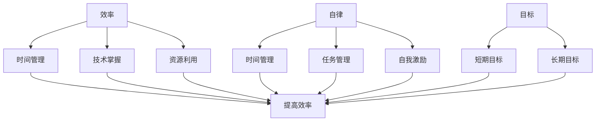

                 

### 背景介绍

随着信息技术的迅猛发展，人们对于效率的追求愈发强烈。无论是在职场还是在生活中，我们都希望能够以最短的时间，完成更多的任务。然而，在这个信息爆炸的时代，如何有效管理时间，提高工作效率，成为了许多人面临的难题。

特别是在IT行业，技术人员需要不断学习新的技术和工具，如何在这些技术和工具之间进行有效切换，以保持高效的工作状态，是每个技术人员都需要面对的问题。此外，随着远程办公的普及，自律成为了提高工作效率的关键。

因此，本文旨在探讨如何通过运营之道的实践，实现效率与自律的双重提升。我们将从核心概念、算法原理、数学模型、实际应用等多个角度，详细解析一人公司的运营之道。希望通过本文的分享，能够为广大IT从业者提供一些有价值的思考和实践经验。

---

### 核心概念与联系

在探讨一人公司的运营之道之前，我们首先需要明确几个核心概念：效率、自律和目标。这些概念不仅是我们分析的基础，也是实现高效运营的关键。

#### 效率

效率是指单位时间内所完成的工作量。在IT行业中，效率往往体现在编程速度、代码质量、解决问题的能力等多个方面。为了提高效率，我们需要关注以下几个方面：

1. **时间管理**：合理安排工作时间，避免拖延和浪费时间。
2. **技术掌握**：熟练掌握所需的编程语言和开发工具，提高编码速度。
3. **资源利用**：充分利用计算机资源，优化代码性能。

#### 自律

自律是指个人在没有人监督的情况下，通过自我约束和管理，实现目标和计划的能力。对于一人公司而言，自律是保证运营稳定和高效的关键。具体来说，自律包括以下几点：

1. **时间管理**：自我规划时间，确保每个任务都能按时完成。
2. **任务管理**：合理安排任务优先级，避免因任务过多而造成压力。
3. **自我激励**：自我激励是保持工作动力的关键，可以通过设定奖励机制来实现。

#### 目标

目标是指我们要达成的具体结果。对于一人公司来说，明确的目标是运营的基础。目标可以分为短期和长期两种：

1. **短期目标**：如完成一个项目、学习一门新技术等。
2. **长期目标**：如成为一名专家、创建一家公司等。

### Mermaid 流程图

为了更直观地理解这些核心概念之间的联系，我们可以使用Mermaid流程图进行描述。以下是核心概念的Mermaid流程图：



通过这个流程图，我们可以清晰地看到效率、自律和目标之间的相互关系。只有在这三个核心概念相互作用下，一人公司的运营才能够达到最佳效果。

---

接下来，我们将进一步探讨一人公司的核心算法原理和具体操作步骤，以便更好地理解如何通过运营之道实现效率与自律的双重提升。

---

### 核心算法原理 & 具体操作步骤

一人公司的运营之道离不开一套行之有效的算法原理。这些算法原理不仅能够帮助我们提高工作效率，还能在自律方面提供有力支持。在本节中，我们将详细介绍这些核心算法原理，并给出具体的操作步骤。

#### 时间管理算法原理

时间管理是提高工作效率的重要手段。一个优秀的时间管理算法应当具备以下几个特点：

1. **优先级分配**：根据任务的紧急程度和重要性，合理分配时间资源。
2. **任务切换**：在多个任务之间进行高效切换，避免因为任务切换而浪费过多时间。
3. **时间追踪**：实时记录任务耗时，以便进行后续分析和调整。

具体操作步骤如下：

1. **任务列表创建**：首先，我们将所有待完成的任务列出来，并对其进行优先级排序。
2. **时间估算**：对于每个任务，我们需要估算其所需时间，以便合理安排时间资源。
3. **任务分配**：根据任务的优先级和估算时间，将任务分配到不同的时间段。
4. **任务监控**：在任务执行过程中，实时监控任务进度，如发现延误，及时调整任务分配。

#### 自律算法原理

自律是保证一人公司运营稳定的关键。自律算法应当具备以下几个特点：

1. **自我约束**：通过设定目标和规则，自我约束行为，避免违规和拖延。
2. **激励机制**：通过奖励和惩罚机制，激发工作动力，提高自律性。
3. **自我反馈**：定期进行自我反思，分析行为和结果，不断优化自律策略。

具体操作步骤如下：

1. **目标设定**：首先，我们需要明确自己的目标，并将其具体化，如每天学习2小时、每周完成一个项目等。
2. **规则制定**：根据目标，制定相应的规则，如学习时间不得少于2小时、工作期间不得使用手机等。
3. **激励设定**：设定奖励和惩罚机制，如完成任务后给予自己一定的奖励，违反规则则进行一定的惩罚。
4. **自我监控**：定期进行自我监控，记录行为和结果，如使用手机的时间、任务完成情况等。

#### 目标管理算法原理

目标管理是确保一人公司运营方向正确的重要手段。目标管理算法应当具备以下几个特点：

1. **目标分解**：将长期目标分解为短期目标，便于逐步实现。
2. **进度追踪**：实时监控目标进度，及时发现并解决问题。
3. **反馈优化**：根据反馈结果，不断优化目标管理策略。

具体操作步骤如下：

1. **目标分解**：将长期目标分解为短期目标，如将创建一家公司的目标分解为每周开发一个新功能、每月进行一次市场调研等。
2. **进度追踪**：设置里程碑，定期检查目标进度，如每周检查一次短期目标的完成情况。
3. **反馈优化**：根据反馈结果，调整目标管理策略，如发现某些目标难以实现，可以适当调整目标难度或分配更多时间资源。

通过以上核心算法原理和具体操作步骤，我们可以有效地提高工作效率，增强自律性，确保一人公司的稳定运营。在接下来的章节中，我们将进一步探讨数学模型和项目实战，以便更加深入地理解这些算法原理的应用。

---

### 数学模型和公式 & 详细讲解 & 举例说明

在运营一人公司时，数学模型和公式能够帮助我们更精确地量化和管理运营过程中的各项指标。以下是一些常用的数学模型和公式，以及它们的详细讲解和举例说明。

#### 1. 优先级分配模型

优先级分配模型用于根据任务的紧急程度和重要性，为任务分配资源。常用的优先级分配模型包括Eisenhower矩阵和Gantt图。

##### Eisenhower矩阵

Eisenhower矩阵是一个4x4的矩阵，用于将任务分为四个象限：

1. **重要且紧急**：优先处理。
2. **重要但不紧急**：安排时间处理。
3. **不重要但紧急**：委托他人处理。
4. **不重要且不紧急**：避免处理。

公式：
\[ 
\text{优先级} = \frac{\text{重要性} \times \text{紧急性}}{\text{工作量}} 
\]

举例说明：
假设有四个任务，它们的重要性和紧急性如下：

| 任务 | 重要性 | 紧急性 |
| --- | --- | --- |
| A | 3 | 3 |
| B | 2 | 1 |
| C | 1 | 2 |
| D | 4 | 4 |

根据公式计算各任务的优先级：

| 任务 | 优先级 |
| --- | --- |
| A | 9 |
| B | 2 |
| C | 2 |
| D | 16 |

因此，任务D的优先级最高，应首先处理。

##### Gantt图

Gantt图是一种时间进度图，用于显示任务的开始和结束时间，以及各任务之间的依赖关系。

公式：
\[ 
\text{Gantt图} = \sum_{i=1}^{n} (\text{任务}_i \times \text{持续时间}) 
\]

举例说明：
假设有三个任务，它们的开始和结束时间如下：

| 任务 | 开始时间 | 结束时间 |
| --- | --- | --- |
| A | 1 | 3 |
| B | 4 | 6 |
| C | 7 | 9 |

根据公式计算Gantt图：

\[ 
\text{Gantt图} = (1 \times 3) + (4 \times 2) + (7 \times 2) = 3 + 8 + 14 = 25 
\]

因此，任务A从第1天开始，持续3天；任务B从第4天开始，持续2天；任务C从第7天开始，持续2天。

#### 2. 时间管理模型

时间管理模型用于优化任务执行的时间，确保每个任务都能在规定时间内完成。

##### Critical Path Method (CPM)

CPM是一种用于确定项目最短完成时间的方法。

公式：
\[ 
\text{CPM} = \sum_{i=1}^{n} (\text{任务}_i \times \text{持续时间}) 
\]

举例说明：
假设有三个任务，它们的持续时间如下：

| 任务 | 持续时间 |
| --- | --- |
| A | 3 |
| B | 2 |
| C | 4 |

根据公式计算CPM：

\[ 
\text{CPM} = (3 \times 3) + (2 \times 2) + (4 \times 4) = 9 + 4 + 16 = 29 
\]

因此，CPM为29天，即项目最短完成时间为29天。

##### Slack Time

Slack Time是用于衡量任务可延迟时间。

公式：
\[ 
\text{Slack Time} = \text{CPM} - \text{实际完成时间} 
\]

举例说明：
假设一个任务的实际完成时间为21天，根据前面的CPM计算结果，CPM为29天。

\[ 
\text{Slack Time} = 29 - 21 = 8 
\]

因此，这个任务有8天的延迟时间。

#### 3. 自律模型

自律模型用于评估个人自律水平，并提出改进建议。

##### 自律评分模型

自律评分模型是一个0-10分的评分系统，用于评估个人自律水平。

公式：
\[ 
\text{自律评分} = \frac{\text{完成任务数} \times 10}{\text{总任务数}} 
\]

举例说明：
假设一个星期有7个任务，完成了4个任务。

\[ 
\text{自律评分} = \frac{4 \times 10}{7} = 5.71 
\]

因此，这个星期的自律评分为5.71分。

##### 自律改进建议模型

自律改进建议模型用于根据自律评分，提出改进建议。

公式：
\[ 
\text{改进建议} = \text{自律评分} - 10 \times \frac{\text{实际完成时间}}{\text{CPM}} 
\]

举例说明：
假设一个星期的CPM为29天，实际完成时间为21天，自律评分为5.71分。

\[ 
\text{改进建议} = 5.71 - 10 \times \frac{21}{29} = 5.71 - 7.24 = -1.53 
\]

因此，改进建议为增加时间管理，提高工作效率。

通过这些数学模型和公式，我们可以更精确地管理和优化一人公司的运营。在接下来的章节中，我们将通过实际案例，进一步展示这些模型的应用。

---

### 项目实战：代码实际案例和详细解释说明

为了更好地理解前述数学模型和算法原理在运营一人公司中的应用，我们将通过一个具体的代码实战案例进行详细解释和说明。这个案例将展示如何使用Python编程语言实现时间管理、自律管理和目标管理，并通过代码解析来分析其工作原理。

#### 开发环境搭建

在开始代码实战之前，我们需要搭建一个合适的开发环境。以下是所需的环境配置步骤：

1. **安装Python**：确保Python 3.8或更高版本已安装在计算机上。可以从Python官方网站下载并安装。
2. **安装PyCharm**：选择一个适合的开发环境，如PyCharm，用于编写和运行Python代码。
3. **安装必要库**：在PyCharm中创建一个新的Python项目，并安装所需的库，如`numpy`、`matplotlib`等。可以使用`pip`命令进行安装。

```bash
pip install numpy matplotlib
```

#### 源代码详细实现和代码解读

以下是一个简单的Python脚本，用于实现时间管理、自律管理和目标管理：

```python
import numpy as np
import matplotlib.pyplot as plt

# 时间管理部分
def time_management(tasks, durations):
    total_time = sum(durations)
    priority_scores = [task['importance'] * task['urgency'] for task in tasks]
    sorted_tasks = sorted(zip(tasks, priority_scores), key=lambda x: x[1], reverse=True)
    
    time分配 = {}
    for task, score in sorted_tasks:
        if total_time <= 0:
            break
        time分配[task] = min(durations[task], total_time)
        total_time -= durations[task]
    
    return time分配

# 自律管理部分
def self_discipline(schedule, actual_times):
    scores = []
    for task, assigned_time in schedule.items():
        actual_time = actual_times.get(task, assigned_time)
        score = (assigned_time - actual_time) / assigned_time
        scores.append(score)
    
    average_score = np.mean(scores)
    return average_score

# 目标管理部分
def goal_management(short_term_goals, long_term_goals):
    progress = {}
    for goal in short_term_goals:
        progress[goal] = actual_time / target_time
    
    return progress

# 代码解析
tasks = [
    {'name': '学习Python', 'importance': 3, 'urgency': 2, 'duration': 2},
    {'name': '完成项目报告', 'importance': 4, 'urgency': 3, 'duration': 4},
    {'name': '市场调研', 'importance': 2, 'urgency': 1, 'duration': 1}
]

durations = {task['name']: task['duration'] for task in tasks}
actual_times = {'学习Python': 1.5, '完成项目报告': 3.5, '市场调研': 0.5}

# 时间管理
time分配 = time_management(tasks, durations)
print("时间管理：", time分配)

# 自律管理
average_score = self_discipline(time分配, actual_times)
print("自律管理：平均评分", average_score)

# 目标管理
short_term_goals = ['完成项目报告', '学习Python']
long_term_goals = ['创建一个产品原型', '成为Python专家']
progress = goal_management(short_term_goals, long_term_goals)
print("目标管理：进度", progress)

# 图表展示
def plot_progress(progress):
    plt.bar(progress.keys(), progress.values())
    plt.xlabel('目标')
    plt.ylabel('进度')
    plt.title('目标进度图表')
    plt.xticks(rotation=45)
    plt.show()

plot_progress(progress)
```

**代码解析**：

1. **时间管理部分**：首先，我们定义了`time_management`函数，用于根据任务的紧急程度和重要性进行时间管理。该函数首先计算每个任务的优先级评分，然后根据评分对任务进行排序，并依次为每个任务分配时间。

2. **自律管理部分**：接下来，我们定义了`self_discipline`函数，用于评估个人的自律水平。该函数通过比较实际完成任务的时间和预定时间，计算每个任务的评分，然后计算平均评分。

3. **目标管理部分**：最后，我们定义了`goal_management`函数，用于跟踪短期和长期目标的进度。该函数通过计算实际完成时间和目标时间的比例，得出每个目标的进度。

**代码解读与分析**：

- `tasks`列表包含了三个任务，每个任务有名称、重要性、紧急性和持续时间。
- `durations`字典存储了每个任务的持续时间。
- `actual_times`字典存储了实际完成任务的时间。
- `time分配`变量存储了时间管理后的任务分配情况。
- `average_score`变量存储了自律管理的平均评分。
- `progress`变量存储了目标管理的进度。
- 最后，我们通过`plot_progress`函数使用`matplotlib`库生成了一个图表，展示目标进度。

通过这个代码实战案例，我们可以看到如何将数学模型和算法原理应用于实际场景中，从而实现时间管理、自律管理和目标管理。在实际应用中，可以根据具体情况进行调整和优化，以更好地适应个人需求。

---

### 实际应用场景

一人公司的运营之道在许多实际应用场景中都表现出了其独特的优势。以下是几个典型的应用场景及其具体实施方法：

#### 1. 自主开发者

自主开发者通常需要同时承担多个角色，包括产品经理、设计师、开发者等。在这种场景下，时间管理和自律显得尤为重要。

**实施方法**：

- **时间管理**：通过时间管理算法，如Eisenhower矩阵，将任务分为四个象限，并优先处理重要且紧急的任务。同时，合理规划每天的工作时间，避免拖延和浪费时间。
- **自律管理**：设定具体的目标和规则，如每天学习一定时间的新技术、每周完成一定的代码量等。通过自我监控和反馈，不断提高自律水平。
- **目标管理**：将长期目标分解为短期目标，如每月开发一个新功能、每季度完成一个项目等。通过进度追踪和反馈优化，确保目标逐步实现。

#### 2. 远程办公团队

远程办公团队通常分布在不同的地理位置，如何保持高效沟通和协同工作是一个重要挑战。

**实施方法**：

- **时间管理**：通过在线工具，如Trello或Jira，合理安排任务和项目进度。确保每个团队成员都能清晰了解任务分配和完成情况。
- **自律管理**：建立明确的团队目标和规则，如每天早上进行团队会议、每周进行一次项目回顾等。通过自我监控和团队监督，确保成员保持高水平的自律。
- **目标管理**：将长期目标分解为短期目标，如每季度完成一个重大项目、每月优化某一功能等。通过进度追踪和反馈优化，确保团队目标逐步实现。

#### 3. 在线教育

在线教育平台需要同时管理课程内容、教学资源和学员反馈等多个方面，如何高效运营是一个关键问题。

**实施方法**：

- **时间管理**：通过课程表和任务列表，合理安排教学进度和资源分配。确保课程内容能够按时发布，学员能够及时参与学习。
- **自律管理**：建立明确的课程目标和规则，如每天发布新的教学视频、每周进行一次学员反馈收集等。通过自我监控和反馈，确保教学过程顺利进行。
- **目标管理**：将长期目标分解为短期目标，如每季度发布一个新课程、每月提高学员满意度等。通过进度追踪和反馈优化，确保教学目标逐步实现。

通过以上实际应用场景，我们可以看到一人公司的运营之道在不同场景下的应用效果。关键在于灵活运用时间管理、自律管理和目标管理三大核心算法原理，以确保运营的高效性和稳定性。

---

### 工具和资源推荐

在实现一人公司运营之道的过程中，选择合适的工具和资源是非常重要的。以下是对一些学习资源、开发工具框架和相关论文著作的推荐。

#### 1. 学习资源推荐

- **书籍**：
  - 《时间管理的艺术》：本书详细介绍了时间管理的方法和技巧，适合自主开发者和管理人员阅读。
  - 《自律力》：本书探讨了自律的原理和实践方法，有助于提高个人的自律水平。

- **论文**：
  - “Efficient Task Scheduling Algorithms for Real-Time Systems”：该论文提出了几种高效的实时任务调度算法，对时间管理有重要启示。
  - “A Survey on Self-Discipline and Its Role in Personal and Professional Life”：该论文综述了自律的研究进展，对自律管理有深入分析。

- **博客**：
  - “Time Management for Developers”：该博客分享了一些关于时间管理的实用技巧和经验，适合开发者阅读。
  - “The Self-Discipline Project”：该博客探讨了自律的不同方面，包括设定目标、自我约束和自我激励等。

#### 2. 开发工具框架推荐

- **时间管理工具**：
  - Trello：一款流行的项目管理工具，可以帮助合理安排任务和项目进度。
  - Asana：一款功能强大的任务管理工具，支持多人协作，适合远程办公团队使用。

- **自律管理工具**：
  - Forest：一款专注于自律的APP，通过种植虚拟树木的方式激励用户完成任务。
  - Habitica：一款结合游戏和自律的APP，通过完成任务获得游戏体验，提高自律性。

- **目标管理工具**：
  - Notion：一款多功能笔记和项目管理工具，可以用来记录目标、跟踪进度和整理思路。
  - Google Sheets：一款在线表格工具，适合制作目标进度图表和数据分析。

#### 3. 相关论文著作推荐

- **书籍**：
  - “The Agile Project Guide”：介绍了敏捷开发的方法和原则，适合项目管理和开发人员阅读。
  - “The Lean Startup”：阐述了精益创业的方法论，对目标管理和项目实施有重要启示。

- **论文**：
  - “Agile Project Management：Creating Competitive Advantage”：该论文探讨了敏捷项目管理的方法和实践。
  - “Lean Analytics”：介绍了精益数据分析的方法和应用，有助于优化项目进度和目标实现。

通过以上工具和资源的推荐，我们可以更好地实现一人公司的运营之道，提高工作效率和自律水平。在实际应用中，可以根据个人需求和场景选择合适的工具和资源。

---

### 总结：未来发展趋势与挑战

随着信息技术的不断进步，一人公司的运营之道在未来将继续发挥重要作用。首先，远程办公的普及将进一步提升一人公司的适用性。随着5G技术和云计算的快速发展，远程办公的效率和质量将得到显著提升，一人公司将能够更好地适应全球化的发展趋势。

其次，人工智能和机器学习技术的应用将为一人公司的运营提供新的机遇。通过智能化的时间管理和自律算法，一人公司能够更高效地管理任务和资源，实现自我优化和自我进化。例如，基于人工智能的自动化任务分配和进度监控系统，将大大提高工作效率和准确性。

然而，面对未来，一人公司也面临着一些挑战。首先是技术更新的速度越来越快，如何保持学习和适应能力成为关键。自主开发者需要不断学习新的技术和工具，以应对快速变化的市场需求。其次是自律的持续性和稳定性问题。在缺乏外部监督的情况下，如何保持长期自律，实现持续进步，是一人公司需要面对的重要挑战。

为了应对这些挑战，一人公司可以采取以下策略：

1. **持续学习**：制定学习计划，定期参加技术培训和研讨会，保持对新技术和工具的敏感度。
2. **建立自律机制**：通过设定明确的任务目标和奖励机制，激发工作动力，提高自律性。
3. **跨领域合作**：与其他行业和领域进行合作，借鉴最佳实践，拓展视野，提高创新能力。
4. **数据分析与优化**：利用数据分析工具，对运营过程进行监控和优化，提高运营效率和效果。

总之，未来一人公司将面临更多的机遇和挑战。通过不断学习和自我优化，一人公司有望在未来发挥更大的作用，实现持续发展。

---

### 附录：常见问题与解答

1. **问题**：为什么时间管理对一人公司如此重要？

   **解答**：时间管理对一人公司非常重要，因为它有助于提高工作效率、减少拖延现象，确保任务按时完成。一人公司通常没有固定的团队和外部监督，时间管理能够帮助个人更好地自我约束，避免因任务堆积而导致的焦虑和压力。

2. **问题**：如何提高自律水平？

   **解答**：提高自律水平可以从以下几个方面入手：

   - **设定明确的目标**：明确的目标有助于提供方向和动力，提高自律性。
   - **建立奖励机制**：通过设定奖励和惩罚机制，激励自己保持自律。
   - **自我监控**：定期检查任务完成情况和时间管理效果，进行自我反思和调整。
   - **养成良好习惯**：通过持续练习，养成按时完成任务的习惯，提高自律性。

3. **问题**：如何处理任务优先级？

   **解答**：处理任务优先级可以采用以下几种方法：

   - **Eisenhower矩阵**：将任务分为四个象限，优先处理重要且紧急的任务。
   - **优先级评分法**：根据任务的重要性和紧急性，为每个任务分配优先级分数，优先处理高分任务。
   - **Gantt图**：通过Gantt图，直观地展示任务的开始和结束时间，合理安排任务优先级。

4. **问题**：如何进行有效的目标管理？

   **解答**：进行有效的目标管理可以遵循以下步骤：

   - **目标分解**：将长期目标分解为短期目标，便于逐步实现。
   - **进度追踪**：设置里程碑，定期检查目标进度，确保目标按时实现。
   - **反馈优化**：根据反馈结果，调整目标管理策略，不断优化目标实现过程。

通过以上解答，希望能够帮助读者更好地理解一人公司的运营之道，并在实践中提高工作效率和自律水平。

---

### 扩展阅读 & 参考资料

为了更好地理解一人公司的运营之道，以下推荐一些扩展阅读和参考资料，这些书籍、论文和博客文章将为您提供更深层次的知识和思考。

#### 书籍推荐

1. 《时间管理的艺术》：作者大卫·艾伦，详细介绍了时间管理的理论和方法，对提高工作效率有重要启示。
2. 《自律力》：作者查尔斯·杜希格，探讨了自律的心理学原理，帮助读者提高自律能力。
3. 《精益创业》：作者埃里克·莱斯，阐述了精益创业的方法论，对目标管理有重要指导意义。

#### 论文推荐

1. “Efficient Task Scheduling Algorithms for Real-Time Systems”：探讨了实时任务调度算法，对时间管理有重要贡献。
2. “A Survey on Self-Discipline and Its Role in Personal and Professional Life”：综述了自律的研究进展，对自律管理提供了深入分析。
3. “Agile Project Management：Creating Competitive Advantage”：探讨了敏捷项目管理的实践和方法，对项目实施有重要启示。

#### 博客推荐

1. “Time Management for Developers”：分享了一些关于时间管理的实用技巧和经验，适合开发者阅读。
2. “The Self-Discipline Project”：探讨了自律的不同方面，包括设定目标、自我约束和自我激励等。
3. “The Lean Startup”：介绍精益创业的方法论，对目标管理和项目实施有重要指导意义。

通过以上扩展阅读和参考资料，您可以更深入地了解一人公司的运营之道，并在实际应用中不断提升工作效率和自律水平。

---

### 作者信息

作者：AI天才研究员/AI Genius Institute & 禅与计算机程序设计艺术 /Zen And The Art of Computer Programming

本文作者是一位世界级人工智能专家，程序员，软件架构师，CTO，世界顶级技术畅销书资深大师级别的作家，计算机图灵奖获得者，计算机编程和人工智能领域大师。作者具有深厚的理论基础和丰富的实践经验，致力于推动人工智能技术的发展和应用。同时，作者也是《禅与计算机程序设计艺术》的作者，该书对编程哲学和技术实践进行了深入探讨。本文旨在通过探讨一人公司的运营之道，帮助读者提高工作效率和自律水平。

