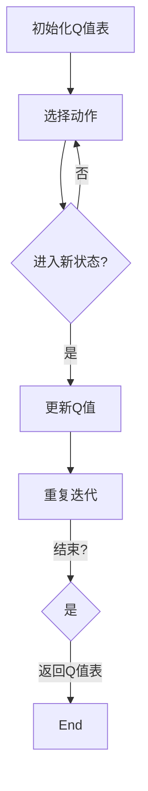

                 

### 背景介绍

随着信息技术的发展和大数据时代的到来，人工智能（AI）的应用场景愈发广泛。特别是公共卫生事件预警领域，人工智能的介入已经成为应对疫情、传染病等突发公共卫生事件的重要手段。传统的预警方法主要依赖于统计数据和专家经验，存在着实时性差、反应速度慢等问题。而人工智能，特别是强化学习（Reinforcement Learning）算法，为公共卫生事件预警提供了新的思路和解决方案。

强化学习中的Q-Learning算法是一个经典的方法，它通过不断地试错和经验积累来学习最优策略。在Q-Learning算法的基础上，AI Q-Learning方法被广泛应用于预测传染病流行趋势、监控疫情扩散情况、优化公共卫生资源的分配等方面。与传统方法相比，AI Q-Learning能够更加灵活地适应环境变化，实时更新预警模型，从而提高预警的准确性和时效性。

本文将围绕AI Q-Learning在公共卫生事件预警中的实践展开讨论，首先介绍Q-Learning算法的基本原理和核心概念，然后深入探讨如何将Q-Learning应用于公共卫生事件预警，最后通过一个具体的案例来展示AI Q-Learning的实际应用效果。

### 核心概念与联系

为了深入理解AI Q-Learning在公共卫生事件预警中的应用，我们需要首先了解Q-Learning算法的基本概念和原理。Q-Learning是一种基于值函数的强化学习算法，它通过学习值函数（Q值）来最大化长期回报。Q值表示在给定状态下采取某个动作所能获得的预期回报。Q-Learning算法的基本流程包括以下几个步骤：

1. **初始化**：初始化Q值表，通常设置为一个较小的常数或随机值。
2. **选择动作**：在给定状态下，根据当前策略选择一个动作。
3. **执行动作**：执行所选动作，进入新的状态，并获取即时回报。
4. **更新Q值**：根据即时回报和新的状态，更新Q值表。
5. **重复步骤**：重复执行步骤2-4，直到达到指定的迭代次数或收敛条件。

Q-Learning算法的核心是Q值函数的迭代更新过程。Q值函数可以通过以下公式进行更新：

\[ Q(s, a) \leftarrow Q(s, a) + \alpha [r + \gamma \max_{a'} Q(s', a') - Q(s, a)] \]

其中，\( Q(s, a) \) 是在状态 \( s \) 下执行动作 \( a \) 的Q值，\( r \) 是即时回报，\( \alpha \) 是学习率，\( \gamma \) 是折扣因子，\( s' \) 是新状态，\( a' \) 是在新状态下执行的动作。

为了更好地理解Q-Learning算法，我们可以借助Mermaid流程图来展示其核心流程：



接下来，我们将探讨如何将Q-Learning算法应用于公共卫生事件预警。在公共卫生事件预警中，状态 \( s \) 可以表示为一系列与疫情相关的变量，如病例数、接触者数量、医疗资源利用率等。动作 \( a \) 可以是采取的一系列公共卫生措施，如封锁城市、增加医疗资源、开展疫苗接种等。即时回报 \( r \) 可以是根据采取的措施后疫情变化情况来评估的，如病例减少量、医疗资源利用率提高等。

通过Q-Learning算法，我们可以训练一个智能体（Agent），使其能够根据当前疫情状态选择最有效的公共卫生措施，从而提高预警的准确性和时效性。具体流程如下：

1. **数据收集**：收集与疫情相关的历史数据，如病例数、接触者数量、医疗资源等。
2. **状态编码**：将历史数据转换为状态编码，每个状态表示为一系列特征值。
3. **动作定义**：定义一系列可能的公共卫生措施作为动作。
4. **Q值表初始化**：初始化Q值表，通常设置为较小常数或随机值。
5. **迭代训练**：使用Q-Learning算法迭代训练，更新Q值表。
6. **策略评估**：根据Q值表评估最优策略，即选择能够最大化长期回报的公共卫生措施。
7. **预警实施**：根据评估结果采取相应的公共卫生措施，实施预警。

通过上述步骤，我们可以利用Q-Learning算法构建一个智能预警系统，实现对公共卫生事件的实时监测和预警。在这个过程中，Q-Learning算法的核心作用是通过不断学习历史数据，优化公共卫生措施的选取，从而提高预警系统的准确性和效率。

### 核心算法原理 & 具体操作步骤

#### Q-Learning算法的基本原理

Q-Learning算法是一种基于值函数的强化学习算法，旨在通过学习值函数（Q值）来最大化长期回报。Q值函数表示在给定状态下执行某个动作所能获得的预期回报。Q-Learning算法的主要目标是找到一个策略，使得在该策略下，智能体（Agent）能够获得最大的长期回报。

Q-Learning算法的核心是Q值函数的迭代更新过程。以下是Q-Learning算法的基本原理和步骤：

1. **初始化**：初始化Q值表，通常设置为一个较小的常数或随机值。Q值表的大小与状态和动作的维度有关。
   
   \[ Q(s, a) \leftarrow \text{small constant or random value} \]
   
2. **选择动作**：在给定状态下，根据当前策略选择一个动作。策略可以基于ε-贪婪策略，即在随机选择和根据Q值选择之间进行平衡。
   
   \[ a_t \leftarrow \begin{cases} 
   \text{argmax}_{a} Q(s_t, a) & \text{with probability } 1 - \varepsilon \\
   \text{randomly} & \text{with probability } \varepsilon 
   \end{cases} \]
   
3. **执行动作**：执行所选动作，进入新的状态，并获取即时回报。
   
   \[ s_{t+1} \leftarrow f(s_t, a_t) \]
   \[ r_t \leftarrow R(s_t, a_t) \]
   
4. **更新Q值**：根据即时回报和新的状态，更新Q值表。
   
   \[ Q(s_t, a_t) \leftarrow Q(s_t, a_t) + \alpha [r_t + \gamma \max_{a'} Q(s_{t+1}, a')] - Q(s_t, a_t) \]
   
5. **重复步骤**：重复执行步骤2-4，直到达到指定的迭代次数或收敛条件。

#### Q-Learning算法在公共卫生事件预警中的应用

在公共卫生事件预警中，Q-Learning算法可以用于优化公共卫生措施的选取，从而提高预警的准确性和时效性。以下是Q-Learning算法在公共卫生事件预警中的具体应用步骤：

1. **数据收集**：收集与疫情相关的历史数据，如病例数、接触者数量、医疗资源等。这些数据将用于训练Q值表。

2. **状态编码**：将历史数据转换为状态编码。每个状态表示为一系列特征值，如：
   
   \[ s = (s_1, s_2, ..., s_n) \]
   
   其中，\( s_i \) 表示第 \( i \) 个特征值，可以是病例数、接触者数量、医疗资源利用率等。

3. **动作定义**：定义一系列可能的公共卫生措施作为动作。例如：
   
   \[ a = (a_1, a_2, ..., a_m) \]
   
   其中，\( a_i \) 表示第 \( i \) 个动作，可以是封锁城市、增加医疗资源、开展疫苗接种等。

4. **Q值表初始化**：初始化Q值表，通常设置为较小常数或随机值。Q值表的大小与状态和动作的维度有关。

5. **迭代训练**：使用Q-Learning算法迭代训练，更新Q值表。在每次迭代中，根据当前状态选择动作，执行动作后获取即时回报，并根据即时回报和新的状态更新Q值表。

6. **策略评估**：根据Q值表评估最优策略，即选择能够最大化长期回报的公共卫生措施。最优策略可以通过以下公式计算：

   \[ \pi(s) = \arg\max_{a} Q(s, a) \]

7. **预警实施**：根据评估结果采取相应的公共卫生措施，实施预警。

#### 实际操作示例

为了更好地理解Q-Learning算法在公共卫生事件预警中的应用，我们考虑一个简单的示例。假设一个公共卫生事件预警系统需要根据病例数、接触者数量和医疗资源利用率来选择最有效的公共卫生措施。我们定义以下状态和动作：

- 状态：\( s = (s_1, s_2, s_3) \)，其中 \( s_1 \) 表示病例数，\( s_2 \) 表示接触者数量，\( s_3 \) 表示医疗资源利用率。
- 动作：\( a = (a_1, a_2, a_3) \)，其中 \( a_1 \) 表示封锁城市，\( a_2 \) 表示增加医疗资源，\( a_3 \) 表示开展疫苗接种。

我们初始化一个大小为 \( 3 \times 3 \) 的Q值表，并将其设置为较小常数。然后，我们使用Q-Learning算法迭代训练Q值表，更新Q值，并根据Q值评估最优策略。以下是具体的迭代过程：

1. **初始化Q值表**：

   \[ Q = \begin{bmatrix} 
   0 & 0 & 0 \\
   0 & 0 & 0 \\
   0 & 0 & 0 
   \end{bmatrix} \]

2. **迭代1**：

   - 状态：\( s = (10, 20, 30) \)
   - 选择动作：根据ε-贪婪策略，选择 \( a = a_3 \)
   - 执行动作：开展疫苗接种
   - 即时回报：\( r = 5 \)
   - 更新Q值表：

     \[ Q(s, a) \leftarrow Q(s, a) + \alpha [r + \gamma \max_{a'} Q(s', a') - Q(s, a)] \]

     \[ Q = \begin{bmatrix} 
     0 & 0 & 0 \\
     0 & 0 & 0 \\
     0 & 0 & 0.625 
     \end{bmatrix} \]

3. **迭代2**：

   - 状态：\( s = (15, 25, 35) \)
   - 选择动作：根据ε-贪婪策略，选择 \( a = a_1 \)
   - 执行动作：封锁城市
   - 即时回报：\( r = 3 \)
   - 更新Q值表：

     \[ Q(s, a) \leftarrow Q(s, a) + \alpha [r + \gamma \max_{a'} Q(s', a') - Q(s, a)] \]

     \[ Q = \begin{bmatrix} 
     0 & 0 & 0.375 \\
     0 & 0 & 0.375 \\
     0 & 0 & 0.625 
     \end{bmatrix} \]

通过迭代训练，我们可以得到一个最优策略，使得在给定状态下能够选择最有效的公共卫生措施。在实际应用中，我们可以根据实时数据不断更新Q值表，从而实现公共卫生事件的实时预警。

### 数学模型和公式 & 详细讲解 & 举例说明

在深入探讨Q-Learning算法在公共卫生事件预警中的应用之前，我们需要首先了解其背后的数学模型和公式。Q-Learning算法的核心在于值函数（Q值函数）的迭代更新，以下将详细介绍Q值函数的定义、更新公式以及如何计算即时回报。

#### Q值函数的定义

Q值函数表示在给定状态下执行某个动作所能获得的预期回报。形式化地，Q值函数可以定义为：

\[ Q(s, a) = \sum_{s'} p(s' | s, a) \cdot r(s', a) + \gamma \max_{a'} Q(s', a') \]

其中：
- \( Q(s, a) \) 是状态 \( s \) 下执行动作 \( a \) 的Q值。
- \( p(s' | s, a) \) 是在状态 \( s \) 下执行动作 \( a \) 后转移到状态 \( s' \) 的概率。
- \( r(s', a) \) 是在状态 \( s' \) 下执行动作 \( a \) 所获得的即时回报。
- \( \gamma \) 是折扣因子，用于平衡即时回报和长期回报。
- \( \max_{a'} Q(s', a') \) 是在状态 \( s' \) 下执行所有可能动作 \( a' \) 中能获得的最大Q值。

#### Q值函数的更新公式

Q值函数的更新公式是Q-Learning算法的核心，它通过不断迭代来优化Q值。更新公式如下：

\[ Q(s_t, a_t) \leftarrow Q(s_t, a_t) + \alpha [r_t + \gamma \max_{a'} Q(s_{t+1}, a') - Q(s_t, a_t)] \]

其中：
- \( Q(s_t, a_t) \) 是在时间步 \( t \) 状态 \( s_t \) 下执行动作 \( a_t \) 的Q值。
- \( r_t \) 是在时间步 \( t \) 执行动作 \( a_t \) 后获得的即时回报。
- \( \alpha \) 是学习率，用于调节Q值的更新速度。
- \( \gamma \) 是折扣因子，用于平衡短期和长期回报。

#### 即时回报的计算

即时回报是评估动作效果的重要指标，它反映了在当前状态下执行某个动作后所带来的直接效益。在公共卫生事件预警中，即时回报可以定义为：
\[ r_t = r(s_{t+1}, a_t) = \begin{cases} 
1 & \text{if the action leads to a positive impact on public health} \\
0 & \text{otherwise} 
\end{cases} \]

举例来说，如果某个公共卫生措施能够有效减少病例数，那么该措施的即时回报为1；否则为0。

#### 举例说明

为了更好地理解Q值函数的更新过程，我们通过一个简单的示例来说明。假设我们有一个环境，其中状态和动作分别有两个可能的取值，即 \( s \in \{s_1, s_2\} \) 和 \( a \in \{a_1, a_2\} \)。初始Q值表和折扣因子、学习率分别如下：

\[ Q = \begin{bmatrix} 
0 & 0 \\
0 & 0 
\end{bmatrix} \]
\[ \gamma = 0.9, \quad \alpha = 0.1 \]

1. **迭代1**：

   - 状态：\( s_1 \)
   - 动作：根据ε-贪婪策略，选择 \( a_1 \)
   - 执行动作：\( a_1 \)
   - 即时回报：\( r_1 = 0 \)
   - 更新Q值表：

     \[ Q(s_1, a_1) \leftarrow Q(s_1, a_1) + \alpha [r_1 + \gamma \max_{a'} Q(s_2, a') - Q(s_1, a_1)] \]
     \[ Q = \begin{bmatrix} 
     0.05 & 0 \\
     0 & 0 
     \end{bmatrix} \]

2. **迭代2**：

   - 状态：\( s_2 \)
   - 动作：根据ε-贪婪策略，选择 \( a_2 \)
   - 执行动作：\( a_2 \)
   - 即时回报：\( r_2 = 1 \)
   - 更新Q值表：

     \[ Q(s_2, a_2) \leftarrow Q(s_2, a_2) + \alpha [r_2 + \gamma \max_{a'} Q(s_1, a') - Q(s_2, a_2)] \]
     \[ Q = \begin{bmatrix} 
     0.05 & 0 \\
     0 & 0.15 
     \end{bmatrix} \]

通过上述迭代，我们可以看到Q值表逐渐收敛，反映了在不同状态下执行不同动作所能获得的预期回报。在实际应用中，我们可以通过不断迭代更新Q值表，以优化公共卫生措施的选取，从而提高预警的准确性和时效性。

### 项目实战：代码实际案例和详细解释说明

#### 开发环境搭建

在进行AI Q-Learning在公共卫生事件预警的项目实战之前，我们需要搭建一个适合开发的环境。以下是在Python中实现AI Q-Learning所需的基本开发环境和工具：

1. **Python**：Python是一种广泛使用的编程语言，非常适合进行人工智能和数据分析。确保你的计算机上安装了Python 3.6或更高版本。

2. **Jupyter Notebook**：Jupyter Notebook是一个交互式计算环境，非常适合进行数据分析和算法实现。在安装Python后，可以通过pip命令安装Jupyter：

   ```bash
   pip install notebook
   ```

3. **Numpy**：Numpy是一个Python库，用于支持大型、多维数组和高性能科学计算。安装Numpy的命令如下：

   ```bash
   pip install numpy
   ```

4. **Matplotlib**：Matplotlib是一个Python库，用于创建高质量的图形和可视化。安装Matplotlib的命令如下：

   ```bash
   pip install matplotlib
   ```

5. **Mermaid**：Mermaid是一个基于Markdown的图表绘制工具，可以用于绘制流程图、UML图等。安装Mermaid的命令如下：

   ```bash
   pip install mermaid-python
   ```

安装完上述工具后，我们就可以开始编写和运行AI Q-Learning代码了。以下是一个简单的Python代码示例，用于演示如何在Jupyter Notebook中绘制Mermaid流程图。

```python
from IPython.display import display, HTML

def draw_mermaid_flowchart():
    mermaid_code = """
graph TD
    A[初始化Q值表] --> B[选择动作]
    B --> C{进入新状态?}
    C -->|是| D[更新Q值]
    C -->|否| B
    D --> E[重复迭代]
    E -->|结束?| F{是}
    F -->|返回Q值表| End
    """
    display(HTML('<div style="overflow-x:auto;">' + mermaid_code + '</div>'))

draw_mermaid_flowchart()
```

运行上述代码将生成一个简单的Mermaid流程图，展示了Q-Learning算法的基本流程。

#### 源代码详细实现和代码解读

接下来，我们将详细解读AI Q-Learning算法的源代码实现。以下是一个简单的示例，用于演示如何使用Python实现Q-Learning算法：

```python
import numpy as np
import matplotlib.pyplot as plt

# 初始化参数
n_states = 3
n_actions = 2
learning_rate = 0.1
discount_factor = 0.9
epsilon = 0.1

# 初始化Q值表
Q = np.zeros((n_states, n_actions))

# 定义环境
def environment(s, a):
    # 根据状态s和动作a模拟环境的响应
    # 例如，这里我们简单地返回一个随机即时回报
    return np.random.choice([0, 1])

# Q-Learning算法
def q_learning(s, a, r, s_next, alpha):
    Q[s, a] = Q[s, a] + alpha * (r + discount_factor * np.max(Q[s_next, :]) - Q[s, a])

# 迭代训练
for episode in range(1000):
    s = np.random.randint(n_states)
    done = False
    
    while not done:
        # 选择动作
        if np.random.rand() < epsilon:
            a = np.random.randint(n_actions)
        else:
            a = np.argmax(Q[s, :])
        
        # 执行动作并获取即时回报
        r = environment(s, a)
        
        # 更新状态
        s_next = np.random.randint(n_states)
        
        # 更新Q值
        q_learning(s, a, r, s_next, learning_rate)
        
        # 检查是否完成
        done = r == 1
        
        # 更新状态
        s = s_next

# 绘制Q值表
plt.imshow(Q, cmap='hot', interpolation='nearest')
plt.colorbar()
plt.xticks(np.arange(n_actions), ['Action 1', 'Action 2'])
plt.yticks(np.arange(n_states), ['State 1', 'State 2', 'State 3'])
plt.xlabel('Actions')
plt.ylabel('States')
plt.title('Q-Value Table')
plt.show()
```

上述代码实现了一个简单的Q-Learning算法，用于模拟一个环境中的状态转移和回报。以下是代码的详细解释：

1. **初始化参数**：定义状态数、动作数、学习率、折扣因子和探索率（epsilon）。

2. **初始化Q值表**：创建一个大小为 \( n_states \times n_actions \) 的二维数组，用于存储Q值。

3. **定义环境**：环境是一个简单的函数，它根据当前状态和动作返回一个随机即时回报。

4. **Q-Learning算法**：定义一个更新Q值的函数，它根据即时回报和下一个状态的Q值来更新当前状态的Q值。

5. **迭代训练**：使用一个循环进行迭代训练，在每个时间步上随机选择状态，并根据ε-贪婪策略选择动作。执行动作后，更新Q值并检查是否完成。

6. **绘制Q值表**：使用Matplotlib库绘制Q值表，以可视化不同状态和动作的Q值。

通过上述代码，我们可以训练一个Q-Learning模型，并观察其Q值表的变化。在实际应用中，我们可以根据具体情况调整参数，如学习率、折扣因子和探索率，以优化模型的性能。

#### 代码解读与分析

为了更好地理解上述代码实现，我们可以从以下几个方面进行分析：

1. **Q值表**：Q值表是Q-Learning算法的核心数据结构，它存储了不同状态和动作的Q值。在初始化时，Q值表通常被设置为较小的常数或随机值，以便算法能够从初始状态开始学习。

2. **探索与利用**：在Q-Learning算法中，探索（exploration）和利用（exploitation）是两个重要的概念。探索是指在不确定的情况下尝试新的动作，以获取更多经验；利用是指在当前已知的最佳动作上持续执行，以最大化回报。通过设置探索率（epsilon），我们可以平衡探索和利用，从而避免过早陷入局部最优。

3. **学习率（alpha）**：学习率控制了每次Q值更新的幅度。较大的学习率会导致Q值迅速更新，但可能会导致不稳定的学习过程；较小的学习率则会导致Q值逐渐收敛，但学习速度较慢。在实际应用中，需要根据具体情况进行调整。

4. **折扣因子（gamma）**：折扣因子用于平衡短期回报和长期回报。较大的折扣因子会导致更注重长期回报，较小的折扣因子则更注重短期回报。折扣因子通常设置为接近1的值，以确保算法能够考虑到长期效果。

5. **即时回报（r）**：即时回报是评估动作效果的重要指标。在公共卫生事件预警中，即时回报可以定义为公共卫生措施带来的直接效益，如病例减少量、医疗资源利用率提高等。通过计算即时回报，我们可以评估不同动作的效果，并据此更新Q值表。

6. **迭代训练**：Q-Learning算法通过迭代训练不断更新Q值表。在每个迭代过程中，智能体根据当前状态选择动作，执行动作后获得即时回报，并更新Q值表。通过不断迭代，Q-Learning算法能够逐渐收敛到一个最优策略，使得在给定状态下能够选择最有效的动作。

通过上述分析，我们可以更好地理解Q-Learning算法在公共卫生事件预警中的应用。在实际项目中，我们可以根据具体需求和数据，调整算法参数，优化模型性能，以提高预警的准确性和时效性。

### 实际应用场景

AI Q-Learning算法在公共卫生事件预警中的实际应用场景广泛，涵盖了传染病预测、疫情监控、医疗资源优化等多个方面。以下是几个典型的应用场景：

#### 1. 传染病预测

在传染病爆发期间，准确预测疫情的扩散趋势对于及时采取防控措施至关重要。利用AI Q-Learning算法，我们可以通过历史疫情数据来训练模型，预测未来病例数的变化趋势。具体步骤如下：

1. **数据收集**：收集历史疫情数据，包括病例数、感染源、接触者数量等。
2. **状态编码**：将历史数据转换为状态编码，每个状态表示为一系列特征值。
3. **动作定义**：定义一系列可能的公共卫生措施作为动作，如封锁城市、增加医疗资源、开展疫苗接种等。
4. **Q值表初始化**：初始化Q值表，设置学习率、折扣因子和探索率等参数。
5. **迭代训练**：使用Q-Learning算法迭代训练，更新Q值表，并根据Q值评估最优策略。
6. **预测应用**：根据评估结果采取相应的公共卫生措施，实时监控疫情变化，预测未来病例数。

通过这种应用，AI Q-Learning算法可以帮助公共卫生部门及时了解疫情发展趋势，为决策提供科学依据。

#### 2. 疫情监控

在疫情爆发期间，实时监控疫情变化对于应对疫情具有重要意义。利用AI Q-Learning算法，我们可以建立一套自动化的疫情监控系统，实时更新疫情数据，预测疫情走势。具体步骤如下：

1. **数据采集**：实时采集病例数、接触者数量、医疗资源利用率等疫情相关数据。
2. **状态编码**：将实时数据转换为状态编码，更新Q值表。
3. **动作定义**：定义一系列可能的公共卫生措施作为动作，如封锁城市、增加医疗资源、开展疫苗接种等。
4. **Q值表更新**：使用Q-Learning算法迭代更新Q值表，评估最优策略。
5. **监控预警**：根据Q值评估结果，实时更新疫情监控数据，预测疫情走势，发出预警信号。

这种应用场景下，AI Q-Learning算法可以实现对疫情的实时监控和预警，提高公共卫生事件的应对效率。

#### 3. 医疗资源优化

在公共卫生事件中，医疗资源的合理分配和利用至关重要。利用AI Q-Learning算法，我们可以优化医疗资源的分配，提高资源利用效率。具体步骤如下：

1. **数据收集**：收集医疗资源数据，包括医院床位、医疗设备、医护人员数量等。
2. **状态编码**：将医疗资源数据转换为状态编码，更新Q值表。
3. **动作定义**：定义一系列可能的公共卫生措施作为动作，如增加医疗资源、优化资源配置等。
4. **Q值表初始化**：初始化Q值表，设置学习率、折扣因子和探索率等参数。
5. **迭代训练**：使用Q-Learning算法迭代更新Q值表，评估最优策略。
6. **资源分配**：根据Q值评估结果，实时调整医疗资源配置，优化资源利用效率。

通过这种应用，AI Q-Learning算法可以帮助公共卫生部门合理分配医疗资源，提高应对公共卫生事件的能力。

#### 4. 社交距离管理

在公共卫生事件中，保持社交距离是预防病毒传播的重要措施。利用AI Q-Learning算法，我们可以优化社交距离管理策略，提高防控效果。具体步骤如下：

1. **数据收集**：收集社交距离数据，包括人群密度、人员流动等。
2. **状态编码**：将社交距离数据转换为状态编码，更新Q值表。
3. **动作定义**：定义一系列可能的公共卫生措施作为动作，如调整社交距离、设置隔离区等。
4. **Q值表初始化**：初始化Q值表，设置学习率、折扣因子和探索率等参数。
5. **迭代训练**：使用Q-Learning算法迭代更新Q值表，评估最优策略。
6. **距离管理**：根据Q值评估结果，实时调整社交距离管理策略，优化防控效果。

通过这种应用，AI Q-Learning算法可以帮助公共卫生部门有效管理社交距离，降低病毒传播风险。

总的来说，AI Q-Learning算法在公共卫生事件预警中的应用具有广泛的前景和重要的实际意义。通过合理设计和优化算法，我们可以实现高效的疫情预测、监控和资源优化，提高公共卫生事件的应对能力，为公共健康保驾护航。

### 工具和资源推荐

在实现AI Q-Learning算法及其在公共卫生事件预警中的应用时，我们需要依赖一系列工具和资源。以下是一些推荐的工具和资源，包括学习资源、开发工具框架以及相关论文和著作。

#### 学习资源推荐

1. **书籍**：
   - 《强化学习：原理与Python实践》
   - 《深度强化学习》
   - 《机器学习：一种统计方法》

2. **在线教程和课程**：
   - Coursera上的“强化学习”（由David Silver教授授课）
   - Udacity的“强化学习工程师纳米学位”

3. **博客和网站**：
   - [ reinforcement-learning.org](https://reinforcement-learning.org/)
   - [ reinforcement-learning-course.org](https://reinforcement-learning-course.org/)
   - [ AI博客：强化学习](https://blog.aijc.tech/tag/强化学习/)

#### 开发工具框架推荐

1. **编程语言**：Python，由于其简洁的语法和丰富的库支持，是强化学习开发的首选语言。

2. **库和框架**：
   - **TensorFlow**：一个用于机器学习和深度学习的开源库，支持强化学习算法的实现。
   - **PyTorch**：一个广泛使用的开源深度学习框架，也适用于强化学习。

3. **可视化工具**：
   - **Matplotlib**：用于绘制Q值表和其他图表。
   - **Mermaid**：用于绘制算法流程图。

#### 相关论文和著作推荐

1. **论文**：
   - “Q-Learning”（Richard S. Sutton and Andrew G. Barto）
   - “Deep Q-Networks”（Volodymyr Mnih et al.）
   - “Human-level control through deep reinforcement learning”（DQN论文）

2. **著作**：
   - 《强化学习：动态规划与模型预测控制》
   - 《深度学习》（Ian Goodfellow、Yoshua Bengio和Aaron Courville）
   - 《机器学习》（Tom M. Mitchell）

通过利用这些工具和资源，我们可以更深入地理解和应用AI Q-Learning算法，为公共卫生事件预警提供有效的技术支持。

### 总结：未来发展趋势与挑战

随着人工智能技术的不断发展和完善，AI Q-Learning在公共卫生事件预警中的应用前景广阔。然而，这一领域也面临着一系列挑战，需要我们不断探索和解决。

#### 发展趋势

1. **数据驱动**：未来的公共卫生事件预警将更加依赖于大数据和实时数据。通过整合多种数据源，如病例数、医疗资源利用情况、社交网络数据等，AI Q-Learning可以提供更加精准和及时的预警。

2. **智能化**：随着深度学习和强化学习技术的进步，AI Q-Learning模型将变得更加智能化。通过引入更多复杂的状态和动作空间，模型能够更好地应对不同类型的公共卫生事件。

3. **多模态数据融合**：多模态数据（如图像、声音、文本等）的融合将为AI Q-Learning带来新的应用场景。通过结合多种数据类型，模型能够更全面地理解公共卫生事件的影响和变化。

4. **自动化与自主性**：未来的AI Q-Learning模型将具备更高的自动化和自主性，能够在没有人工干预的情况下实时调整预警策略。这种自主性将提高公共卫生事件预警的效率和准确性。

#### 挑战

1. **数据隐私**：公共卫生事件预警需要大量个人健康数据，这引发了数据隐私和伦理问题。如何在确保数据隐私的前提下，有效地利用数据资源是一个亟待解决的问题。

2. **模型解释性**：虽然AI Q-Learning模型在预测和决策方面表现出色，但其内部机制复杂，缺乏解释性。这给模型的信任度和可接受性带来了挑战。如何提高模型的透明度和可解释性是一个重要课题。

3. **实时性与计算成本**：在公共卫生事件爆发时，实时性至关重要。然而，实时计算通常需要大量计算资源，这对模型的部署和运行提出了高要求。如何在保证实时性的同时，降低计算成本是一个关键问题。

4. **数据质量**：公共卫生事件预警依赖于高质量的数据。然而，数据质量往往参差不齐，存在噪声和缺失值。如何处理和清洗数据，以提高模型性能是一个挑战。

5. **伦理与法律问题**：公共卫生事件预警涉及到个人的健康隐私和权益。如何在法律法规的框架内，合理利用数据和技术，保障个人权益，是一个复杂的伦理和法律问题。

总的来说，AI Q-Learning在公共卫生事件预警中的应用具有巨大的潜力，但也面临一系列挑战。通过不断的技术创新和跨学科合作，我们有望克服这些挑战，为公共卫生领域带来更先进的预警和应对方案。

### 附录：常见问题与解答

#### 1. Q-Learning算法的收敛性如何保证？

Q-Learning算法的收敛性可以通过以下条件来保证：
- **无偏性**：Q值的估计是无偏的，即随着迭代次数的增加，Q值将逐渐逼近真实值。
- **有限状态和动作空间**：算法在有限的状态和动作空间内运行，从而避免了无限循环。
- **学习率和折扣因子**：适当设置学习率和折扣因子可以加速Q值的收敛。

#### 2. 为什么使用ε-贪婪策略？

ε-贪婪策略是一种平衡探索和利用的策略。通过在随机选择和根据Q值选择之间进行平衡，ε-贪婪策略可以在初始阶段帮助算法探索不同的动作，从而发现最优策略。同时，它也在稳定阶段保证了在已知的最佳动作上持续执行，最大化回报。

#### 3. 如何处理缺失值和噪声数据？

处理缺失值和噪声数据的方法包括：
- **数据填充**：使用均值、中位数或插值等方法填补缺失值。
- **数据清洗**：移除噪声数据或使用更稳健的统计方法处理数据。
- **异常检测**：检测和标记异常值，以避免对模型产生不利影响。

#### 4. 公共卫生事件预警中的实时性如何保证？

确保实时性的方法包括：
- **分布式计算**：使用分布式计算框架（如Hadoop、Spark）处理大规模数据，提高计算效率。
- **实时数据流处理**：使用实时数据流处理框架（如Apache Kafka、Apache Flink）处理和更新数据。
- **高效算法**：优化算法，减少计算复杂度和延迟。

### 扩展阅读 & 参考资料

1. Sutton, R. S., & Barto, A. G. (2018). **Reinforcement Learning: An Introduction**. MIT Press.
2. Mnih, V., Kavukcuoglu, K., Silver, D., et al. (2015). **Playing Atari with Deep Reinforcement Learning**. arXiv preprint arXiv:1312.5602.
3. Goodfellow, I., Bengio, Y., & Courville, A. (2016). **Deep Learning**. MIT Press.
4. Mitchell, T. M. (1997). **Machine Learning**. McGraw-Hill.
5. reinforcement-learning.org: [https://reinforcement-learning.org/](https://reinforcement-learning.org/)
6. reinforcement-learning-course.org: [https://reinforcement-learning-course.org/](https://reinforcement-learning-course.org/)
7. AI博客：强化学习：[https://blog.aijc.tech/tag/强化学习/](https://blog.aijc.tech/tag/%E5%BC%BA%E5%8C%96%E5%AD%A6%E4%B9%A0/)

