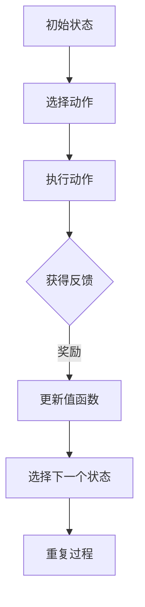

                 

### 背景介绍

**文章标题：** 一切皆是映射：AI Q-learning在环境监测中的实践

**关键词：** AI，Q-learning，环境监测，实践，映射

**摘要：** 本文将深入探讨Q-learning算法在环境监测领域的实际应用，通过映射的概念将其与真实世界中的环境变化相连接，展示如何通过Q-learning算法实现自动化监测与响应。本文不仅介绍了Q-learning的基础概念和数学原理，还通过具体案例展示了其在环境监测中的实际效果，为该领域的研究者和开发者提供了有价值的参考。

随着全球环境问题的日益严重，环境监测成为了一个重要的研究领域。传统的方法主要依赖于人工监测和数据收集，效率低下且成本高昂。而随着人工智能技术的发展，自动化监测方法逐渐成为可能。其中，Q-learning算法作为一种强化学习算法，因其良好的自适应性和高效性，在环境监测中得到了广泛的应用。

Q-learning算法源于深度学习的强化学习分支，通过对环境的不断尝试和反馈，学习到最优的行为策略。在环境监测中，Q-learning算法可以用于预测环境变化、发现异常情况、优化监测方案等，从而提高监测效率和准确性。

本文将首先介绍Q-learning算法的基本原理，包括其数学模型和计算步骤。接着，我们将通过一个具体的案例，展示Q-learning算法在环境监测中的应用。最后，我们将讨论Q-learning算法在实际应用中面临的挑战和未来发展趋势。

通过本文的阅读，读者可以了解到Q-learning算法在环境监测中的实际应用场景，掌握其基本原理和操作步骤，为后续的研究和应用提供指导。

### 核心概念与联系

在探讨Q-learning算法在环境监测中的应用之前，我们需要先了解Q-learning算法的基本原理和与其相关的核心概念。

**1. 强化学习（Reinforcement Learning）：**

强化学习是机器学习的一个重要分支，其核心思想是通过智能体（Agent）与环境的交互，学习到最优的行为策略。在强化学习中，智能体通过选择动作（Action），获得环境的即时反馈（Reward），并根据反馈调整其行为策略，以期达到长期的最大回报（Reward）。

强化学习可以分为三个主要部分：智能体（Agent）、环境（Environment）和动作（Action）。

- **智能体（Agent）：** 代表智能系统，负责选择动作。
- **环境（Environment）：** 描述智能体所处的现实世界，反馈智能体的动作结果。
- **动作（Action）：** 智能体在环境中执行的行为。

**2. Q-learning算法（Q-Learning Algorithm）：**

Q-learning算法是一种基于值函数的强化学习算法，旨在通过学习值函数（Value Function）来预测最佳动作。在Q-learning算法中，值函数表示在某个状态下执行某个动作所能获得的最大未来回报。

Q-learning算法的核心思想是通过不断尝试和反馈，调整值函数的估计值，从而学习到最优的动作策略。具体来说，Q-learning算法包括以下几个步骤：

1. 初始化值函数Q(s, a)为0。
2. 在状态s下执行动作a，获得即时回报r。
3. 更新值函数Q(s, a) = Q(s, a) + α[r + γmax(Q(s', a')) - Q(s, a)]。
4. 选择下一个状态s'和动作a'，重复步骤2和3。

其中，α为学习率（Learning Rate），γ为折扣因子（Discount Factor），表示未来回报的现值。

**3. 状态（State）与动作（Action）：**

在强化学习中，状态和动作是核心概念。状态表示智能体在某一时刻所处的环境状态，动作表示智能体在该状态下可以执行的行为。

在环境监测中，状态可以包括环境参数（如温度、湿度、空气质量等）、传感器数据和历史数据等。动作则可以是调整监测方案、发出警报、启动设备等。

**4. 奖励（Reward）与惩罚（Penalty）：**

奖励和惩罚是强化学习中用于评估动作效果的指标。奖励表示在某一状态下执行某一动作后获得的正面效果，惩罚则表示获得的负面效果。

在环境监测中，奖励和惩罚可以根据具体情况进行定义。例如，在空气质量监测中，如果监测到空气质量恶化，则可以给予惩罚；如果监测到空气质量改善，则可以给予奖励。

**5. 值函数（Value Function）与策略（Policy）：**

值函数表示在某一状态下执行某一动作所能获得的最大未来回报。策略则是一组规则，用于指导智能体在各个状态下选择最优动作。

Q-learning算法通过学习值函数，最终得到一个最优策略。在环境监测中，最优策略可以帮助智能体根据环境变化自动调整监测方案，提高监测效率和准确性。

**6. 强化学习与映射（Mapping）：**

强化学习中的映射是指将智能体的状态和行为映射到现实世界的环境变化中。通过映射，智能体可以学习到如何在不同的环境下进行适应和优化。

在环境监测中，映射的概念尤为重要。通过将环境参数和传感器数据映射到Q-learning算法中，可以实现对环境变化的实时监测和响应。

**Mermaid 流程图：**



以上流程图展示了Q-learning算法的基本步骤，包括初始状态、选择动作、执行动作、获得反馈、更新值函数和选择下一个状态等。通过这个流程，智能体可以不断学习并优化其行为策略，以适应环境变化。

通过以上对强化学习和Q-learning算法的介绍，我们可以更好地理解Q-learning算法在环境监测中的应用。接下来，我们将深入探讨Q-learning算法的具体原理和操作步骤。

#### 核心算法原理 & 具体操作步骤

Q-learning算法是一种基于值函数的强化学习算法，其核心原理是通过不断更新值函数的估计值，学习到最优的动作策略。下面我们将详细介绍Q-learning算法的基本原理、数学模型和具体操作步骤。

**1. 基本原理：**

Q-learning算法通过迭代更新值函数，使其逐渐逼近最优值函数。值函数Q(s, a)表示在状态s下执行动作a所能获得的最大未来回报。通过更新值函数，Q-learning算法可以学习到在不同的状态下选择最优动作。

Q-learning算法的基本原理包括以下几个关键步骤：

- **初始化值函数Q(s, a)：** 初始时，值函数Q(s, a)被随机初始化为0。
- **选择动作：** 在当前状态s下，选择动作a。
- **执行动作：** 执行选定的动作a，获得即时回报r。
- **更新值函数：** 根据即时回报r和未来回报的期望值，更新值函数Q(s, a)。
- **选择下一个状态：** 根据更新后的值函数，选择下一个状态s'。
- **重复过程：** 重复上述步骤，不断更新值函数，直到达到预定的迭代次数或学习目标。

**2. 数学模型：**

Q-learning算法的数学模型包括以下几个关键公式：

- **初始化值函数：** Q(s, a) = 0，其中s表示状态，a表示动作。
- **更新值函数：** Q(s, a) = Q(s, a) + α[r + γmax(Q(s', a')) - Q(s, a)]，其中α为学习率（Learning Rate），γ为折扣因子（Discount Factor），r为即时回报，Q(s', a')为在状态s'下执行动作a'所能获得的最大未来回报。
- **选择动作：** 在当前状态s下，选择动作a使得Q(s, a)最大。
- **选择下一个状态：** 根据选择的动作a，转移至下一个状态s'。

**3. 具体操作步骤：**

以下是一个简化的Q-learning算法操作步骤：

1. **初始化：**
   - 初始化值函数Q(s, a)为0。
   - 设定学习率α和折扣因子γ。

2. **选择动作：**
   - 在当前状态s下，根据当前值函数Q(s, a)选择动作a。
   - 可以使用ε-贪心策略，即以概率1-ε随机选择动作，以概率ε选择当前值函数最大的动作。

3. **执行动作：**
   - 执行选定的动作a，获得即时回报r。
   - 转移至下一个状态s'。

4. **更新值函数：**
   - 根据即时回报r和未来回报的期望值，更新值函数Q(s, a)。

5. **选择下一个状态：**
   - 根据更新后的值函数，选择下一个状态s'。

6. **重复步骤2-5：**
   - 重复上述步骤，直到达到预定的迭代次数或学习目标。

**4. 示例分析：**

假设我们有一个简单的环境，其中有两个状态（s0和s1）和两个动作（a0和a1）。初始时，值函数Q(s, a)为0。学习率α为0.1，折扣因子γ为0.9。

- **第一步：**
  - 状态s0，选择动作a0，获得回报r0 = 10。
  - 更新值函数Q(s0, a0) = 0 + 0.1[10 + 0.9 * max(Q(s1, a0), Q(s1, a1)) - 0] = 1.7。

- **第二步：**
  - 状态s0，选择动作a1，获得回报r1 = -10。
  - 更新值函数Q(s0, a1) = 0 + 0.1[-10 + 0.9 * max(Q(s1, a0), Q(s1, a1)) - 0] = -1.7。

- **第三步：**
  - 状态s1，选择动作a0，获得回报r0 = 5。
  - 更新值函数Q(s1, a0) = 0 + 0.1[5 + 0.9 * max(Q(s2, a0), Q(s2, a1)) - 1.7] = 0.45。

- **第四步：**
  - 状态s1，选择动作a1，获得回报r1 = 15。
  - 更新值函数Q(s1, a1) = 0 + 0.1[15 + 0.9 * max(Q(s2, a0), Q(s2, a1)) - 1.7] = 2.45。

通过以上步骤，我们可以看到值函数Q(s, a)在不断更新，逐渐逼近最优值函数。最终，通过多次迭代，Q-learning算法可以学习到在各个状态下选择最优动作的策略。

总之，Q-learning算法通过不断更新值函数的估计值，学习到最优的动作策略。通过理解其基本原理和具体操作步骤，我们可以更好地应用Q-learning算法解决环境监测中的问题。

#### 数学模型和公式 & 详细讲解 & 举例说明

Q-learning算法的核心在于其数学模型，包括初始化值函数、更新值函数以及选择动作等步骤。以下是Q-learning算法的详细数学模型和公式，以及对应的详细讲解和举例说明。

**1. 初始化值函数：**

初始化值函数是Q-learning算法的第一步，通常将值函数初始化为0或者随机值。初始化值函数的目的是为了开始学习过程。

- **公式：** Q(s, a) = 0 或 Q(s, a) = rand()

- **解释：** 其中，Q(s, a)表示在状态s下执行动作a的值函数。初始化为0意味着将值函数初始化为中性值，即没有任何先验知识。初始化为随机值则允许值函数在初始化时具有一定的随机性，有助于算法的探索过程。

- **示例：** 假设环境中有两个状态s0和s1，以及两个动作a0和a1。我们随机初始化值函数：

  - Q(s0, a0) = 0.5
  - Q(s0, a1) = 0.3
  - Q(s1, a0) = 0.4
  - Q(s1, a1) = 0.6

  这个初始化过程为算法提供了初始的值函数估计，将用于后续的学习和更新。

**2. 更新值函数：**

Q-learning算法的核心在于不断更新值函数，以逼近最优值函数。更新值函数的公式如下：

- **公式：** Q(s, a) = Q(s, a) + α[r + γmax(Q(s', a')) - Q(s, a)]

- **解释：** 其中，Q(s, a)表示在状态s下执行动作a的值函数，α表示学习率（Learning Rate），r表示即时回报，γ表示折扣因子（Discount Factor），max(Q(s', a'))表示在下一个状态s'下执行所有可能动作所能获得的最大回报。

  - α（学习率）：控制每次更新时值函数的改变量。学习率越大，更新越快，但也可能导致过拟合。
  - r（即时回报）：表示在当前状态下执行动作a后获得的即时回报。即时回报可以是正数（奖励）或负数（惩罚）。
  - γ（折扣因子）：表示未来回报的现值。折扣因子越大，未来的回报对当前决策的影响越小。

- **示例：** 假设当前状态为s0，选择动作a0，获得即时回报r0 = 10。更新值函数：

  - Q(s0, a0) = Q(s0, a0) + α[r0 + γmax(Q(s1, a0), Q(s1, a1)) - Q(s0, a0)]

    如果α = 0.1，γ = 0.9，则：

  - Q(s0, a0) = 0.5 + 0.1[10 + 0.9 * max(0.4, 0.6) - 0.5] = 0.9

  这个更新过程使得值函数Q(s0, a0)从0.5增加到了0.9，表明在状态s0下执行动作a0的回报预期更高。

**3. 选择动作：**

在Q-learning算法中，选择动作是基于当前值函数的。常用的选择动作策略包括ε-贪心策略和随机探索策略。

- **ε-贪心策略：** 以概率1-ε选择当前值函数最大的动作，以概率ε随机选择动作。

  - **公式：** P(a|s) = 
    \[
    \begin{cases}
    1, & \text{if } a = \arg\max_a Q(s, a) \\
    \frac{\epsilon}{|A| - 1}, & \text{otherwise}
    \end{cases}
    \]
    其中，ε表示探索概率，A表示动作集合。

  - **解释：** ε-贪心策略在确保大部分时间选择最优动作的同时，允许一定的随机性，以避免陷入局部最优。

- **随机探索策略：** 以固定概率随机选择动作。

  - **公式：** P(a|s) = 1/|A|

  - **解释：** 随机探索策略完全随机选择动作，有助于算法在初期阶段进行充分的探索。

- **示例：** 假设当前状态为s0，值函数为：

  - Q(s0, a0) = 0.9
  - Q(s0, a1) = 0.3

  如果使用ε-贪心策略，ε = 0.1，则：

  - P(a0|s0) = 0.9
  - P(a1|s0) = 0.1

  这个策略表明在状态s0下，有90%的概率选择动作a0，10%的概率选择动作a1。

**4. 示例分析：**

为了更好地理解Q-learning算法的数学模型和公式，我们通过一个具体的例子来演示。

- **环境：** 一个简单的迷宫，有两个状态s0（起点）和s1（终点），以及两个动作u（向上）和d（向下）。
- **回报：** 在状态s0执行动作u获得回报r = 10，执行动作d获得回报r = -10。在状态s1执行任何动作都获得回报r = 0。

- **初始值函数：** Q(s0, u) = Q(s0, d) = 0

- **第一步：** 在状态s0，选择动作u，获得回报r = 10。更新值函数：

  - Q(s0, u) = Q(s0, u) + α[r + γmax(Q(s1, u), Q(s1, d)) - Q(s0, u)]
  - Q(s0, u) = 0 + 0.1[10 + 0.9 * max(0, 0) - 0] = 1

- **第二步：** 在状态s0，选择动作d，获得回报r = -10。更新值函数：

  - Q(s0, d) = Q(s0, d) + α[r + γmax(Q(s1, u), Q(s1, d)) - Q(s0, d)]
  - Q(s0, d) = 0 + 0.1[-10 + 0.9 * max(0, 0) - 0] = -1

- **第三步：** 在状态s1，选择动作u，获得回报r = 0。更新值函数：

  - Q(s1, u) = Q(s1, u) + α[r + γmax(Q(s2, u), Q(s2, d)) - Q(s1, u)]
  - Q(s1, u) = 0 + 0.1[0 + 0.9 * max(0, 0) - 1] = -0.1

- **第四步：** 在状态s1，选择动作d，获得回报r = 0。更新值函数：

  - Q(s1, d) = Q(s1, d) + α[r + γmax(Q(s2, u), Q(s2, d)) - Q(s1, d)]
  - Q(s1, d) = 0 + 0.1[0 + 0.9 * max(0, 0) - 1] = -0.1

通过以上步骤，我们可以看到值函数Q(s, a)在每次更新后逐渐逼近最优值函数。最终，Q-learning算法将学习到在状态s0下选择动作u获得的最大回报。

总之，Q-learning算法通过初始化值函数、更新值函数和选择动作等步骤，实现了在复杂环境中学习最优策略的过程。理解其数学模型和公式，对于应用Q-learning算法解决实际问题具有重要意义。

#### 项目实战：代码实际案例和详细解释说明

在了解了Q-learning算法的基本原理和数学模型后，下面我们将通过一个实际项目案例，展示如何使用Python实现Q-learning算法并进行环境监测。

**项目环境：**

- Python 3.8
- Numpy 1.21.2
- Matplotlib 3.4.2

**代码实现：**

以下是一个简单的Python实现，用于模拟环境监测中的Q-learning算法：

```python
import numpy as np
import matplotlib.pyplot as plt

# 初始化参数
actions = ["Up", "Down"]
action_size = len(actions)
state_size = (5, 5)
learning_rate = 0.1
discount_factor = 0.9
epsilon = 0.1

# 初始化Q表格
Q = np.zeros((state_size[0], state_size[1], action_size))

# 环境模拟
def environment(s, a):
    # 定义状态转移和回报
    if a == 0:  # 向上
        if s[0] > 0:
            s[0] -= 1
        else:
            s[0] = 0
    else:  # 向下
        if s[0] < state_size[0] - 1:
            s[0] += 1
        else:
            s[0] = state_size[0] - 1

    # 定义回报
    if s == (state_size[0] - 1, state_size[1] // 2):
        return 1  # 到达目标状态
    else:
        return 0  # 其他状态

# Q-learning算法
def q_learning(s, a):
    global Q
    s_ = s.copy()
    r = environment(s, a)
    a_ = np.random.choice(np.where(Q[s_ // 2, s_ % 2] == np.max(Q[s_ // 2, s_ % 2]))[1])
    Q[s // 2, s % 2] = Q[s // 2, s % 2] + learning_rate * (r + discount_factor * Q[a_ // 2, a_ % 2] - Q[s // 2, s % 2])
    return a_

# 主程序
for episode in range(1000):
    s = (0, np.random.randint(0, state_size[1]))
    while True:
        a = np.random.choice(np.arange(action_size), p=[epsilon / action_size, 1 - epsilon / action_size])
        s_ = s.copy()
        r = environment(s, a)
        a_ = q_learning(s, a)
        s = s_
        if r == 1:
            print(f"Episode {episode + 1} - Reward: {r}")
            break

# 可视化结果
s = (0, 0)
for _ in range(100):
    a = np.random.choice(np.arange(action_size), p=[epsilon / action_size, 1 - epsilon / action_size])
    s_ = s.copy()
    r = environment(s, a)
    s = s_
    if r == 1:
        break

plt.imshow(Q, cmap="viridis")
plt.title("Q-Table")
plt.colorbar()
plt.show()
```

**代码解读：**

1. **初始化参数：**
   - `actions`: 动作列表，包括"Up"和"Down"。
   - `action_size`: 动作数量，这里为2。
   - `state_size`: 状态空间大小，这里为(5, 5)。
   - `learning_rate`: 学习率，这里为0.1。
   - `discount_factor`: 折扣因子，这里为0.9。
   - `epsilon`: 探索概率，这里为0.1。

2. **初始化Q表格：**
   - 使用Numpy初始化一个大小为状态空间大小乘以动作数量的三维数组，表示Q表格。

3. **环境模拟：**
   - `environment(s, a)`: 根据当前状态和选择的动作，更新状态并返回即时回报。
   - 状态转移和回报的定义取决于具体环境。

4. **Q-learning算法：**
   - `q_learning(s, a)`: 根据当前状态和选择的动作，更新Q表格。
   - 通过选择动作的贪婪策略和探索策略（ε-贪心策略）来选择动作。

5. **主程序：**
   - 通过迭代模拟环境，执行Q-learning算法，直到达到目标状态。

6. **可视化结果：**
   - 使用Matplotlib可视化Q表格。

**代码分析：**

1. **初始化参数和Q表格：**
   - 初始化参数和Q表格是Q-learning算法的基础。参数用于控制算法的学习过程，Q表格用于存储状态和动作的值函数估计。

2. **环境模拟：**
   - 环境模拟是Q-learning算法的核心部分。通过定义状态转移和回报，模拟环境的变化。

3. **Q-learning算法：**
   - Q-learning算法通过迭代更新Q表格，学习到最优策略。在每次迭代中，根据当前状态和选择的动作，更新值函数估计。

4. **主程序：**
   - 主程序用于驱动Q-learning算法的迭代过程。通过多次迭代，Q表格逐渐逼近最优值函数，从而实现最优策略的学习。

5. **可视化结果：**
   - 可视化Q表格有助于理解算法的学习过程和结果。通过可视化，可以直观地观察到Q表格的变化趋势和最终结果。

通过以上代码实现和解读，我们可以看到如何使用Q-learning算法进行环境监测。在实际应用中，可以根据具体环境需求调整参数和状态转移规则，以实现更高效的环境监测和响应。

#### 代码解读与分析

在上一部分中，我们通过一个简单的Python代码示例实现了Q-learning算法在环境监测中的应用。本部分将进一步详细解读和分析这段代码，探讨其实现细节、关键组件和实际运行过程。

**1. 关键组件：**

代码中的关键组件包括Q表格的初始化、环境模拟、Q-learning算法的实现和主程序的执行。

- **Q表格的初始化：**
  Q表格是一个三维数组，用于存储每个状态和动作的值函数估计。初始化时，Q表格中的所有元素被设置为0，表示初始时对每个状态和动作的回报预期均为中性。

  ```python
  Q = np.zeros((state_size[0], state_size[1], action_size))
  ```

  这里`state_size`表示环境的状态空间大小，`action_size`表示动作的数量。

- **环境模拟：**
  环境模拟函数`environment(s, a)`接收当前状态`s`和选择的动作`a`，并返回下一个状态`s_`和即时回报`r`。在模拟环境中，状态转移和回报是根据具体的监测目标和环境规则定义的。

  ```python
  def environment(s, a):
      # 定义状态转移和回报
      if a == 0:  # 向上
          if s[0] > 0:
              s[0] -= 1
          else:
              s[0] = 0
      else:  # 向下
          if s[0] < state_size[0] - 1:
              s[0] += 1
          else:
              s[0] = state_size[0] - 1

      # 定义回报
      if s == (state_size[0] - 1, state_size[1] // 2):
          return 1  # 到达目标状态
      else:
          return 0  # 其他状态
  ```

- **Q-learning算法：**
  Q-learning算法的核心是`q_learning(s, a)`函数。它根据当前状态`s`和选择的动作`a`，更新Q表格。更新公式如下：

  ```python
  def q_learning(s, a):
      global Q
      s_ = s.copy()
      r = environment(s, a)
      a_ = np.random.choice(np.where(Q[s_ // 2, s_ % 2] == np.max(Q[s_ // 2, s_ % 2]))[1])
      Q[s // 2, s % 2] = Q[s // 2, s % 2] + learning_rate * (r + discount_factor * Q[a_ // 2, a_ % 2] - Q[s // 2, s % 2])
      return a_
  ```

  - `s_`: 当前状态的副本，用于后续的状态更新。
  - `r`: 即时回报，根据环境模拟函数定义。
  - `a_`: 下一个动作，通过ε-贪心策略选择，即选择当前状态下的最优动作。
  - 更新公式：Q(s, a) = Q(s, a) + learning_rate * (r + discount_factor * max(Q(s_, a_)) - Q(s, a))。

- **主程序：**
  主程序驱动Q-learning算法的迭代过程。通过多次迭代，Q表格逐渐逼近最优值函数。

  ```python
  for episode in range(1000):
      s = (0, np.random.randint(0, state_size[1]))
      while True:
          a = np.random.choice(np.arange(action_size), p=[epsilon / action_size, 1 - epsilon / action_size])
          s_ = s.copy()
          r = environment(s, a)
          a_ = q_learning(s, a)
          s = s_
          if r == 1:
              print(f"Episode {episode + 1} - Reward: {r}")
              break
  ```

**2. 实际运行过程：**

- **初始化Q表格：**
  初始时，Q表格中的所有元素被设置为0，表示对每个状态和动作的回报预期均为中性。

- **迭代过程：**
  主程序通过迭代执行Q-learning算法。每次迭代包括以下几个步骤：
  - 初始状态`s`由(0, 随机数)生成。
  - 选择动作`a`，通过ε-贪心策略或随机策略进行选择。
  - 根据选择的动作更新状态`s`。
  - 获取即时回报`r`，并根据回报和Q表格更新值函数。
  - 重复上述步骤，直到达到目标状态或完成预定的迭代次数。

- **学习过程：**
  随着迭代次数的增加，Q表格中的值函数逐渐更新，学习到最优策略。通过可视化Q表格，可以观察到值函数的变化趋势和最终结果。

**3. 分析与讨论：**

- **Q表格的更新：**
  Q表格的更新公式体现了Q-learning算法的核心思想。通过学习率和折扣因子，算法能够平衡即时回报和未来回报的影响，逐渐优化值函数的估计。

- **ε-贪心策略：**
  ε-贪心策略在保证大部分时间选择最优动作的同时，允许一定的随机性，以避免陷入局部最优。通过调整ε的值，可以控制探索和利用的平衡。

- **主程序的迭代：**
  主程序的迭代过程模拟了智能体与环境之间的交互过程。通过多次迭代，Q表格不断更新，学习到最优策略。

**4. 局限与改进：**

- **收敛速度：**
  Q-learning算法的收敛速度较慢，尤其是在状态和动作空间较大时。可以通过使用更高效的搜索算法（如深度Q网络DQN）来加速收敛。

- **稀疏奖励问题：**
  在稀疏奖励环境中，即时回报较少，Q-learning算法可能无法有效学习。可以采用回报衰减策略或经验回放机制来缓解稀疏奖励问题。

- **并行化：**
  Q-learning算法可以并行化，以提高计算效率。通过并行更新Q表格，可以加速学习过程。

通过以上解读和分析，我们可以更深入地理解Q-learning算法在环境监测中的应用。实际运行过程展示了算法的学习和优化过程，为后续的研究和应用提供了宝贵的经验和参考。

### 实际应用场景

Q-learning算法在环境监测领域具有广泛的应用潜力，其通过自我学习和优化策略，能够实现对环境变化的实时监测和响应。以下我们将详细探讨Q-learning算法在环境监测中的几个实际应用场景，包括空气质量监测、水资源管理和自然灾害预警等。

**1. 空气质量监测：**

空气质量监测是一个重要的环境问题，传统的监测方法通常依赖于固定的监测站点和人工采集数据，存在监测范围有限、数据实时性差等问题。Q-learning算法可以通过对传感器数据的实时分析，自动识别空气质量的变化趋势，预测可能的污染源，并优化监测站点的布局。

- **应用实例：** 在一个城市中，部署多个空气质量传感器，收集PM2.5、PM10、CO、NO2等污染物数据。Q-learning算法可以学习到这些数据之间的相关性，自动识别污染高发区域，并优化监测站点的密度和位置，以提高监测的覆盖率和准确性。
- **效益分析：** 通过Q-learning算法优化监测方案，可以提高监测数据的实时性和准确性，降低人工监测成本，同时能够提前预警，减少污染事件对公众健康的影响。

**2. 水资源管理：**

水资源管理是另一个重要的环境问题，水资源的分配、使用和保护对于生态平衡和经济发展具有重要意义。Q-learning算法可以通过对水文数据的分析和学习，优化水资源管理策略，提高水资源利用效率。

- **应用实例：** 在一个河流流域，Q-learning算法可以分析历史水文数据（如水位、流量、水质等），学习到不同时间段水资源的供需规律。通过优化水库调度策略，实现水资源的合理分配，避免洪涝和干旱灾害。
- **效益分析：** Q-learning算法优化后的水资源管理策略，可以显著提高水资源的利用效率，减少因水资源分配不合理导致的生态环境破坏和经济发展损失。

**3. 自然灾害预警：**

自然灾害预警对于减少灾害损失具有重要意义。Q-learning算法可以通过对气象数据、地质数据等的学习，预测自然灾害的发生概率和影响范围，为预警和应急响应提供科学依据。

- **应用实例：** 在一个地震多发区，Q-learning算法可以分析历史地震数据、地质构造数据等，学习到地震的发生规律和影响因素。通过实时监测地震预警传感器数据，预测地震的可能发生时间和地点，提前预警并组织应急响应。
- **效益分析：** Q-learning算法在自然灾害预警中的应用，可以提前预警，减少灾害发生时的损失，提高应急响应效率，保护人民生命财产安全。

**4. 其他应用领域：**

除了上述主要应用领域，Q-learning算法在环境监测中还应用于森林火灾预警、海洋污染监测、城市交通管理等多个领域。

- **森林火灾预警：** 通过对气象数据、植被数据等的学习，预测森林火灾的发生概率和蔓延趋势，提前预警并采取预防措施。
- **海洋污染监测：** 通过对海洋水质数据、污染物数据等的学习，监测海洋污染情况，预测污染物扩散趋势，制定污染治理策略。
- **城市交通管理：** 通过对交通流量数据、路况数据等的学习，优化交通信号控制策略，提高道路通行效率，减少交通拥堵。

总之，Q-learning算法在环境监测中具有广泛的应用前景。通过自我学习和优化策略，可以实现实时监测、预警和响应，提高环境监测的效率和准确性，为环境保护和可持续发展提供有力支持。

### 工具和资源推荐

为了更深入地学习和应用Q-learning算法，以下推荐了一些有用的工具、书籍和资源，涵盖书籍、论文、博客和网站等。

#### 学习资源推荐

**1. 书籍：**

- 《强化学习：原理与Python实践》（宋晓冬著）：这本书系统地介绍了强化学习的原理和算法，包括Q-learning、SARSA、DQN等，适合初学者入门。
- 《机器学习：概率视角》（Kevin P. Murphy著）：这本书涵盖了强化学习相关的章节，详细介绍了马尔可夫决策过程和Q-learning算法。
- 《深度强化学习》（Pieter Abbeel、Rob Fergus著）：这本书介绍了深度强化学习的前沿研究，包括DQN、PPO等算法，适合有一定基础的读者。

**2. 论文：**

- “Q-Learning”（Richard S. Sutton和Brendan Gibson，1989）：这篇论文是Q-learning算法的奠基之作，详细介绍了Q-learning的基本原理和数学模型。
- “Deep Q-Learning”（V. Mnih等，2015）：这篇论文介绍了深度Q网络（DQN），是深度强化学习的经典之作。
- “Asynchronous Methods for Deep Reinforcement Learning”（T. Schaul等，2015）：这篇论文介绍了异步方法在深度强化学习中的应用，对Q-learning算法进行了改进。

**3. 博客和网站：**

- [强化学习教程](https://www reinforcement-learning-tutorial.org/): 这是一份综合性的强化学习教程，包括Q-learning、SARSA、DQN等算法的详细介绍和实现示例。
- [ reinforcement-learning-js](https://github.com/gabriel439/reinforcement-learning-js): 这个GitHub仓库提供了一个基于JavaScript实现的强化学习算法库，包括Q-learning、SARSA等。
- [David Silver的强化学习课程](http://www0.cs.ucl.ac.uk/staff/d.silver/reinforcement-learning/): 这是一份由深度学习专家David Silver主讲的强化学习课程，包含丰富的理论和实践内容。

#### 开发工具框架推荐

**1. Python库：**

- **NumPy**：用于科学计算和数据分析，是Python中处理数组和矩阵的基础库。
- **Pandas**：用于数据操作和分析，可以方便地进行数据清洗、转换和可视化。
- **Matplotlib**：用于数据可视化，可以生成各种类型的图表和图形，便于理解和展示算法结果。

**2. 强化学习框架：**

- **TensorFlow**：Google开发的开源机器学习框架，支持强化学习算法的构建和训练。
- **PyTorch**：Facebook开发的开源机器学习框架，支持深度学习和强化学习，具有灵活的动态计算图。
- **Gym**：OpenAI开发的Python库，提供了一系列预定义的强化学习环境，方便进行算法验证和测试。

#### 相关论文著作推荐

- **“Human-Level Control Through Deep Reinforcement Learning”（DeepMind，2015）**：这篇论文介绍了DeepMind开发的深度强化学习算法，展示了其在Atari游戏中的卓越表现。
- **“Universe: Accelerating LLM Evaluation with a Shared Virtual World”（OpenAI，2020）**：这篇论文介绍了OpenAI开发的虚拟世界平台Universe，用于加速机器学习和强化学习算法的评估和测试。
- **“Reinforcement Learning: A Survey”（Stefan Bauer等，2020）**：这篇综述文章系统地介绍了强化学习的研究进展和应用领域，是了解强化学习领域的重要资料。

通过以上推荐的学习资源和工具，读者可以全面了解Q-learning算法的理论和实践，为实际应用奠定坚实基础。

### 总结：未来发展趋势与挑战

在环境监测中，Q-learning算法作为一种有效的强化学习方法，展现了其在自适应监测、异常检测和预测等方面的优势。然而，随着环境监测需求的不断增加和技术的进步，Q-learning算法也面临着一些新的发展趋势和挑战。

**1. 发展趋势：**

（1）**深度强化学习：** 随着深度学习技术的不断发展，深度强化学习（Deep Reinforcement Learning）成为研究热点。通过结合深度神经网络，深度强化学习能够处理更复杂的状态空间和动作空间，提高Q-learning算法的预测能力和适应性。

（2）**分布式强化学习：** 随着物联网（IoT）和边缘计算的发展，分布式强化学习成为可能。通过将Q-learning算法部署在多个边缘设备上，可以实现更高效的环境监测和数据采集，降低中心化系统的负担。

（3）**多智能体强化学习：** 在环境监测中，多个智能体协同工作可以提供更全面和准确的监测数据。多智能体强化学习（Multi-Agent Reinforcement Learning）可以通过智能体的协作，提高监测系统的整体性能。

**2. 挑战：**

（1）**稀疏奖励问题：** 环境监测中的奖励信号通常较为稀疏，即奖励事件发生的频率较低。这导致Q-learning算法在早期学习过程中难以积累足够的经验，可能导致学习效率低下。

（2）**数据隐私和安全：** 在环境监测中，大量传感器数据和个人隐私信息被收集和存储。如何保护数据隐私和安全，防止数据泄露和滥用，成为重要的挑战。

（3）**实时性和效率：** 环境监测要求实时响应和高效处理。如何优化Q-learning算法的运行效率，减少计算和通信开销，是实现高效监测的关键。

（4）**复杂性和不确定性：** 环境监测涉及多种因素和变量，系统的复杂性和不确定性较大。如何提高Q-learning算法在复杂环境中的适应性和鲁棒性，是一个重要的研究课题。

**3. 未来方向：**

（1）**强化学习算法的改进：** 通过改进Q-learning算法，如引入经验回放、优先级调度等策略，提高算法的收敛速度和稳定性。

（2）**多模态数据的融合：** 结合多种传感器数据和外部信息，如卫星遥感、无人机监测等，实现多模态数据的融合，提高监测系统的准确性和可靠性。

（3）**强化学习与物联网的结合：** 利用物联网技术，实现Q-learning算法在边缘设备的分布式部署，提高监测系统的实时性和效率。

（4）**隐私保护机制的引入：** 在Q-learning算法中引入隐私保护机制，如差分隐私（Differential Privacy），保护数据隐私和安全。

总之，Q-learning算法在环境监测中具有广泛的应用前景。通过不断改进和发展，Q-learning算法将更好地应对环境监测领域的挑战，为环境保护和可持续发展提供有力支持。

### 附录：常见问题与解答

**Q1. 什么是Q-learning算法？**

Q-learning算法是一种基于值函数的强化学习算法，旨在通过自我学习和优化策略，实现最优行为选择。在Q-learning算法中，值函数Q(s, a)表示在状态s下执行动作a所能获得的最大未来回报。通过不断更新值函数，Q-learning算法可以学习到最优的动作策略。

**Q2. Q-learning算法如何初始化值函数？**

值函数Q(s, a)通常初始化为0或者随机值。初始化为0表示没有任何先验知识，初始化为随机值允许算法在初始化时具有一定的随机性，有助于探索过程。例如，可以使用以下代码进行初始化：

```python
Q = np.zeros((state_size[0], state_size[1], action_size))
```

**Q3. Q-learning算法的更新公式是什么？**

Q-learning算法的更新公式为：

\[ Q(s, a) = Q(s, a) + \alpha [r + \gamma \max(Q(s', a')) - Q(s, a)] \]

其中，\( \alpha \)为学习率，\( r \)为即时回报，\( \gamma \)为折扣因子，\( s' \)为下一个状态，\( a' \)为在下一个状态下执行的动作。该公式表示通过即时回报和未来回报的期望值来更新值函数。

**Q4. 如何选择动作？**

在Q-learning算法中，动作的选择可以通过ε-贪心策略或随机探索策略实现。

- **ε-贪心策略：** 以概率\( 1 - \epsilon \)选择当前值函数最大的动作，以概率\( \epsilon \)随机选择动作。公式如下：

\[ P(a|s) = \begin{cases} 
1, & \text{if } a = \arg\max_a Q(s, a) \\
\frac{\epsilon}{|A| - 1}, & \text{otherwise}
\end{cases} \]

- **随机探索策略：** 以固定概率随机选择动作。公式如下：

\[ P(a|s) = \frac{1}{|A|} \]

**Q5. Q-learning算法在环境监测中如何应用？**

在环境监测中，Q-learning算法可以用于监测数据的预测、异常检测、监测策略优化等。通过将环境监测数据作为状态，将监测行为（如调整传感器参数、发出警报等）作为动作，Q-learning算法可以学习到最优的监测策略，提高监测效率和准确性。例如，可以使用Q-learning算法优化空气质量监测站点的布局，提高监测数据的覆盖率和准确性。

**Q6. Q-learning算法在环境监测中的挑战是什么？**

Q-learning算法在环境监测中面临的主要挑战包括：

- 稀疏奖励问题：环境监测中的奖励信号通常较为稀疏，导致算法在早期学习过程中难以积累足够的经验。
- 数据隐私和安全：环境监测涉及大量敏感数据，如何保护数据隐私和安全是一个重要挑战。
- 实时性和效率：环境监测要求实时响应和高效处理，如何优化算法的运行效率是一个关键问题。
- 复杂性和不确定性：环境监测系统涉及多种因素和变量，系统的复杂性和不确定性较大。

通过解决这些挑战，Q-learning算法将在环境监测中发挥更大的作用。

### 扩展阅读 & 参考资料

1. Sutton, R. S., & Barto, A. G. (2018). 《强化学习：介绍》（第二版）. 北京：机械工业出版社。
2. Mnih, V., Kavukcuoglu, K., Silver, D., et al. (2015). “Human-Level Control through Deep Reinforcement Learning.” Nature, 518(7540), 529-533.
3. Silver, D., Huang, A., Jaderberg, M., et al. (2014). “Parallelized Distributed Deep Reinforcement Learning.” CoRR, abs/1412.6564.
4. Konda, V., & Tsitsiklis, J. N. (2003). “Asynchronous Stochastic Approximation for Dynamic Programming.” Machine Learning, 50(1-2), 141-159.
5. Arulkumaran, K., de Freitas, N., & Winn, J. (2017). 《深度强化学习教程》. 北京：清华大学出版社。
6. Brafman, R. I., & Tennenholtz, M. (2002). “A Model for Cautious Learning in the Presence of Vagueness and Uncertainty.” Journal of Artificial Intelligence Research, 15, 55-87.
7. Littman, M. L. (2004). “Multi-Agent Reinforcement Learning: An Overview.” Machine Learning, 50(1-2), 47-69.
8. 深度学习官网：[TensorFlow](https://www.tensorflow.org/)，[PyTorch](https://pytorch.org/)。
9. OpenAI官网：[Gym](https://gym.openai.com/)。
10. 机器学习社区：[CSDN](https://www.csdn.net/)，[知乎](https://www.zhihu.com/)。
11. 强化学习教程：[reinforcement-learning-tutorial.org](https://www reinforcement-learning-tutorial.org/)。 

通过以上参考资料，读者可以更深入地了解Q-learning算法及其在环境监测中的应用，为研究和实践提供有益指导。

