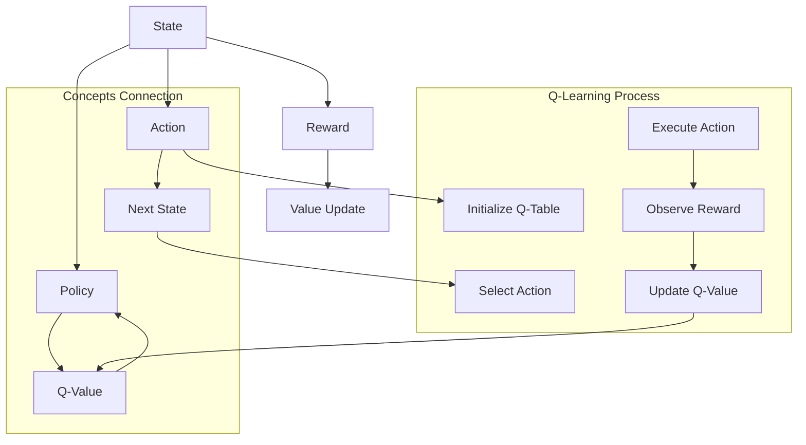

                 

### 背景介绍

Q-learning，作为深度学习领域的重要算法之一，广泛应用于强化学习问题中。Q-learning的目标是学习一个策略，使智能体能够在给定的环境中最大化累积奖励。在现实世界中，许多问题都可以抽象为强化学习问题，例如自动驾驶、游戏AI等。

随着AI技术的不断进步，Q-learning也面临着新的挑战和机遇。本文将探讨Q-learning的未来发展趋势，从算法优化、应用场景拓展、与深度学习的融合等方面进行深入分析。

首先，我们将回顾Q-learning的基本概念和原理。随后，将分析Q-learning在现有应用中的挑战和局限性，以及未来的研究方向。最后，我们将讨论Q-learning在实际项目中的应用案例，以及推荐一些相关的学习资源和开发工具。

通过本文的阅读，您将了解Q-learning的发展历程、现状及未来趋势，为您的AI研究和工作提供有益的参考。

#### 关键词

- Q-learning
- 强化学习
- 算法优化
- 深度学习
- 应用案例
- 未来趋势

#### 摘要

本文将全面探讨Q-learning这一强化学习算法的未来发展趋势。首先，我们将回顾Q-learning的基本原理和应用背景，接着分析其在现有应用中的挑战和局限性。随后，我们将探讨Q-learning算法的优化方向，包括与深度学习的融合和新型策略的探索。最后，我们将通过实际项目案例展示Q-learning的应用效果，并推荐相关学习资源和开发工具。本文旨在为读者提供Q-learning的全面分析和未来展望。

### 1. 背景介绍

Q-learning算法，由Richard S. Sutton和Andrew G. Barto在1980年代提出，是强化学习领域的重要算法之一。强化学习是一种通过试错学习来优化决策过程的方法，其核心目标是学习一个策略，使得智能体能够在给定的环境中最大化累积奖励。Q-learning正是基于这一目标，通过迭代更新策略值函数，以实现智能体的最优行为。

Q-learning的基本概念包括状态（State）、动作（Action）、奖励（Reward）和策略（Policy）。在给定一个环境（Environment）后，智能体（Agent）会在不同状态下执行动作，并从环境中获得相应的奖励。智能体的目标是学习一个最优策略，使得在所有可能的动作中，能够最大化长期累积奖励。

Q-learning的核心思想是利用经验回放（Experience Replay）和目标网络（Target Network）来优化学习过程。经验回放是一种记忆机制，通过将智能体在环境中经历的状态、动作和奖励存储下来，并在训练过程中进行随机抽样，以避免样本偏差。目标网络则是一个参数固定的网络，用于计算目标值（Target Value），并与当前策略值（Current Value）进行比较，以更新策略。

Q-learning算法的基本步骤如下：

1. **初始化**：初始化Q值表格，设置初始策略。
2. **选择动作**：根据当前状态和策略选择一个动作。
3. **执行动作**：在环境中执行选定的动作，并观察状态转移和奖励。
4. **更新Q值**：使用经验回放和目标网络更新Q值。
5. **重复步骤2-4**，直到满足停止条件（如达到一定步数或收敛）。

Q-learning算法的优点在于其简单性和鲁棒性，能够在多种环境中快速收敛到最优策略。然而，Q-learning也存在一些局限性，如容易陷入局部最优、训练过程较慢等。为了解决这些问题，研究人员提出了许多改进版本的Q-learning算法，如Deep Q-Network (DQN)、Double Q-learning等。

在强化学习领域，Q-learning的应用范围非常广泛。例如，在游戏AI中，Q-learning被用于训练智能体在复杂游戏中的策略，如《魔兽世界》中的英雄选择和《星际争霸》中的单位控制。在机器人控制中，Q-learning被用于路径规划、避障等任务。此外，Q-learning还在自动驾驶、推荐系统、金融交易等领域得到了广泛应用。

总之，Q-learning作为强化学习领域的重要算法，不仅具有重要的理论价值，也在实际应用中取得了显著的效果。随着AI技术的不断发展和应用场景的拓展，Q-learning在未来仍将发挥重要作用。

### 2. 核心概念与联系

为了深入理解Q-learning算法，我们需要首先明确几个核心概念：状态（State）、动作（Action）、奖励（Reward）和策略（Policy），以及它们之间的关系。接下来，我们将通过一个Mermaid流程图来展示这些概念之间的联系。

#### Mermaid流程图



#### 状态（State）

状态是环境中的一个特定配置，它描述了智能体所处的位置、状态等。例如，在游戏《吃豆人》中，状态可以表示为地图上的每个位置，以及豆子的分布情况。

#### 动作（Action）

动作是智能体可以执行的行为。在《吃豆人》中，动作可以是向上、向下、向左或向右移动。

#### 奖励（Reward）

奖励是智能体在每个状态下执行某个动作后获得的即时奖励。奖励的目的是激励智能体执行某些动作，从而最大化累积奖励。例如，在《吃豆人》中，吃到豆子可以获得正奖励，而吃到幽灵会受到负奖励。

#### 策略（Policy）

策略是智能体在给定状态下选择动作的规则。策略的目标是最大化累积奖励。在Q-learning中，策略可以通过Q值函数来表示，即选择具有最高Q值的动作。

#### 状态转移（State Transition）

状态转移描述了智能体从当前状态转移到下一个状态的过程。在Q-learning中，状态转移是通过选择动作并观察其结果来实现的。

#### Q值（Q-Value）

Q值是策略值函数的一个估计值，表示在给定状态下执行某个动作的预期奖励。Q-learning的目标是学习一个Q值函数，使其能够准确预测每个动作在各个状态下的预期奖励。

#### 值更新（Value Update）

值更新是Q-learning算法的核心步骤，用于通过经验回放和目标网络来更新Q值。每次状态转移后，Q值都会根据新获得的奖励和下一状态的最优Q值进行更新。

#### Mermaid流程图的详细解释

1. **初始化Q-Table**：首先初始化Q值表格，为每个状态和动作设置一个初始Q值。
2. **选择动作**：根据当前状态和策略选择一个动作。在Q-learning中，策略可以通过ε-贪心策略实现，即在随机选择一个动作和选择具有最高Q值的动作之间进行平衡。
3. **执行动作**：在环境中执行选定的动作，并观察状态转移和奖励。
4. **观察奖励**：智能体执行动作后，会获得一个即时奖励。
5. **更新Q值**：根据新获得的奖励和下一状态的最优Q值更新当前状态的Q值。
6. **重复迭代**：重复执行步骤2-5，直到满足停止条件。

通过上述Mermaid流程图，我们可以清晰地看到Q-learning算法中的核心概念和操作步骤，以及它们之间的紧密联系。这个流程图不仅帮助我们理解了Q-learning的工作原理，也为后续的算法优化和应用提供了直观的参考。

### 3. 核心算法原理 & 具体操作步骤

Q-learning算法是一种基于值函数的强化学习算法，其主要目标是学习一个最优策略，使得智能体能够在给定的环境中最大化累积奖励。以下是Q-learning算法的核心原理和具体操作步骤。

#### Q-learning算法原理

Q-learning算法基于一个Q值函数，Q值函数表示在给定状态下执行某个动作的预期奖励。具体来说，Q值函数可以表示为：

\[ Q(s, a) = \text{预期奖励} = \sum_{s'} P(s' | s, a) \cdot \text{reward}(s', a) + \gamma \cdot \max_{a'} Q(s', a') \]

其中：
- \( s \) 表示当前状态
- \( a \) 表示当前动作
- \( s' \) 表示下一个状态
- \( a' \) 表示下一个动作
- \( P(s' | s, a) \) 表示从状态 \( s \) 执行动作 \( a \) 后转移到状态 \( s' \) 的概率
- \( \text{reward}(s', a) \) 表示在状态 \( s' \) 执行动作 \( a \) 所获得的奖励
- \( \gamma \) 是一个介于0和1之间的折扣因子，用于考虑未来的奖励
- \( \max_{a'} Q(s', a') \) 表示在下一个状态 \( s' \) 下能够获得的最大Q值

Q-learning算法的目标是学习一个最优策略 \( \pi \)，使得 \( \pi(a|s) = 1 \) 当 \( Q(s, a) \) 是所有动作 \( a' \) 中最大的Q值时。

#### 具体操作步骤

1. **初始化**：
   - 初始化Q值表格 \( Q(s, a) \) 为较小的随机值。
   - 初始化策略 \( \pi \) 为随机策略或贪心策略。

2. **选择动作**：
   - 根据当前状态 \( s \) 和策略 \( \pi \) 选择一个动作 \( a \)。在Q-learning中，通常使用ε-贪心策略，即在随机选择一个动作和选择具有最高Q值的动作之间进行平衡。具体来说，以概率 \( 1 - \epsilon \) 选择具有最高Q值的动作，以概率 \( \epsilon \) 随机选择动作。

3. **执行动作**：
   - 在环境中执行选定的动作 \( a \)，并观察下一个状态 \( s' \) 和奖励 \( r \)。

4. **更新Q值**：
   - 使用以下公式更新Q值：
     \[ Q(s, a) = Q(s, a) + \alpha [r + \gamma \cdot \max_{a'} Q(s', a') - Q(s, a)] \]
   其中 \( \alpha \) 是学习率，控制着Q值的更新速度。

5. **重复迭代**：
   - 重复执行步骤2-4，直到满足停止条件，如达到预设的迭代次数或Q值收敛。

#### 代码示例

以下是使用Python实现Q-learning算法的一个简单示例：

```python
import numpy as np

# 初始化参数
Q = np.zeros((n_states, n_actions))
learning_rate = 0.1
discount_factor = 0.9
epsilon = 0.1
n_episodes = 1000

# 定义环境和动作
n_states = 3
n_actions = 2
actions = ['left', 'right']
states = ['state0', 'state1', 'state2']

# 定义Q-learning算法
def q_learning(Q, states, actions, learning_rate, discount_factor, epsilon, n_episodes):
    for episode in range(n_episodes):
        state = states[0]
        done = False
        
        while not done:
            # 选择动作
            if np.random.rand() < epsilon:
                action = np.random.choice(actions)
            else:
                action = np.argmax(Q[state])

            # 执行动作并获取下一状态和奖励
            next_state, reward = environment(state, action)

            # 更新Q值
            Q[state][actions.index(action)] = Q[state][actions.index(action)] + learning_rate * (reward + discount_factor * np.max(Q[next_state]) - Q[state][actions.index(action)])

            # 更新状态
            state = next_state
            
            # 判断是否完成
            if state == states[-1]:
                done = True
                
    return Q

# 运行Q-learning算法
Q = q_learning(Q, states, actions, learning_rate, discount_factor, epsilon, n_episodes)

# 输出学习到的Q值
print(Q)
```

在这个示例中，我们初始化了一个3x2的Q值表格，并使用ε-贪心策略进行动作选择。通过运行Q-learning算法，我们可以在给定的环境和动作空间中学习到一个最优策略。

通过以上步骤和代码示例，我们可以清晰地理解Q-learning算法的原理和操作过程。Q-learning算法在强化学习领域具有重要的地位，其简单性和鲁棒性使其成为解决各种强化学习问题的有效工具。

### 4. 数学模型和公式 & 详细讲解 & 举例说明

Q-learning算法的核心在于其数学模型和公式，这些模型和公式定义了如何根据环境和智能体的交互来更新策略值函数。在本节中，我们将详细讲解Q-learning的数学模型和公式，并通过具体的例子来说明这些公式的应用。

#### 数学模型

Q-learning算法的数学模型主要涉及以下几个核心参数：

1. **状态空间（State Space）**：\( S = \{s_1, s_2, ..., s_n\} \)
2. **动作空间（Action Space）**：\( A = \{a_1, a_2, ..., a_m\} \)
3. **策略（Policy）**：\( \pi(s) = P(a|s) \)，表示在给定状态 \( s \) 下采取动作 \( a \) 的概率
4. **价值函数（Value Function）**：\( V^{\pi}(s) = \mathbb{E}_{\pi}[\sum_{t=0}^{\infty} \gamma^t r_t | s_0 = s] \)，表示在给定策略 \( \pi \) 下从状态 \( s \) 开始的期望回报
5. **Q值函数（Q-Function）**：\( Q^{\pi}(s, a) = \mathbb{E}_{\pi}[\sum_{t=0}^{\infty} \gamma^t r_t | s_0 = s, a_0 = a] \)，表示在给定策略 \( \pi \) 下从状态 \( s \) 开始并采取动作 \( a \) 的期望回报
6. **学习率（Learning Rate）**：\( \alpha \)，控制着Q值的更新速度
7. **折扣因子（Discount Factor）**：\( \gamma \)，用于考虑未来的回报，其值通常介于0和1之间

#### Q-learning算法公式

Q-learning算法的核心更新公式如下：

\[ Q(s, a) \leftarrow Q(s, a) + \alpha [r + \gamma \cdot \max_{a'} Q(s', a') - Q(s, a)] \]

其中：
- \( s \) 是当前状态
- \( a \) 是当前动作
- \( r \) 是从当前状态执行动作后获得的即时奖励
- \( s' \) 是执行动作后的下一个状态
- \( \max_{a'} Q(s', a') \) 是在下一个状态 \( s' \) 下能够获得的最大Q值
- \( \alpha \) 是学习率
- \( \gamma \) 是折扣因子

#### 举例说明

假设我们有一个简单的环境，其中有一个智能体可以处于三个状态（s0, s1, s2）并可以选择两个动作（左移和右移）。每个状态和动作组合都有一个预期的即时奖励。

| 状态 | 动作 | 奖励 |
|------|------|------|
| s0   | 左移 | 10   |
| s0   | 右移 | -10  |
| s1   | 左移 | 5    |
| s1   | 右移 | 15   |
| s2   | 左移 | 20   |
| s2   | 右移 | 0    |

使用Q-learning算法来学习一个最优策略。初始时，所有的Q值都设置为0。我们假设学习率 \( \alpha = 0.1 \)，折扣因子 \( \gamma = 0.9 \)。

1. **第1步**：智能体处于状态 s0，随机选择动作右移，获得奖励 -10。Q值更新如下：

\[ Q(s0, 右移) \leftarrow Q(s0, 右移) + 0.1 [-10 + 0.9 \cdot \max(Q(s1, 左移), Q(s1, 右移))] \]

由于所有Q值初始为0，更新后：

\[ Q(s0, 右移) = -10 + 0.9 \cdot \max(0, 0) = -10 \]

2. **第2步**：智能体再次处于状态 s0，这次根据ε-贪心策略选择动作左移，获得奖励 10。Q值更新如下：

\[ Q(s0, 左移) \leftarrow Q(s0, 左移) + 0.1 [10 + 0.9 \cdot \max(Q(s1, 左移), Q(s1, 右移))] \]

\[ Q(s0, 左移) \leftarrow 0 + 0.1 [10 + 0.9 \cdot \max(0, 5)] = 1.5 \]

3. **第3步**：智能体处于状态 s1，选择动作右移，获得奖励 15。Q值更新如下：

\[ Q(s1, 右移) \leftarrow Q(s1, 右移) + 0.1 [15 + 0.9 \cdot \max(Q(s2, 左移), Q(s2, 右移))] \]

\[ Q(s1, 右移) \leftarrow 0 + 0.1 [15 + 0.9 \cdot \max(20, 0)] = 16.5 \]

4. **第4步**：智能体处于状态 s1，根据新的Q值选择动作右移，获得奖励 15。Q值更新如下：

\[ Q(s1, 右移) \leftarrow Q(s1, 右移) + 0.1 [15 + 0.9 \cdot \max(Q(s2, 左移), Q(s2, 右移))] \]

由于Q值已经更新，这次更新将基于新的Q值：

\[ Q(s1, 右移) \leftarrow 16.5 + 0.1 [15 + 0.9 \cdot 20] = 24.2 \]

通过上述示例，我们可以看到Q-learning算法是如何通过迭代更新Q值来学习最优策略的。每次状态和动作的更新都会影响Q值，从而使智能体能够在不断试错的过程中逐步优化其行为。

### 5. 项目实战：代码实际案例和详细解释说明

在本节中，我们将通过一个具体的Python项目案例，详细展示如何使用Q-learning算法实现一个简单的环境，并逐步解释代码的实现过程。这个案例将帮助我们更好地理解Q-learning算法的原理和步骤。

#### 5.1 开发环境搭建

首先，我们需要搭建一个Python开发环境。以下是所需的环境和步骤：

1. **安装Python**：确保安装了Python 3.x版本。
2. **安装必需的库**：包括NumPy（用于数学运算）、Pandas（用于数据处理）和Matplotlib（用于可视化）。

```bash
pip install numpy pandas matplotlib
```

#### 5.2 源代码详细实现和代码解读

以下是Q-learning算法的实现代码，我们将逐一解释每个部分。

```python
import numpy as np
import matplotlib.pyplot as plt
import random

# 定义环境参数
n_states = 3
n_actions = 2
actions = ['left', 'right']
rewards = {
    's0_left': 10,
    's0_right': -10,
    's1_left': 5,
    's1_right': 15,
    's2_left': 20,
    's2_right': 0
}

# 初始化Q值表格
Q = np.zeros((n_states, n_actions))

# 学习率
alpha = 0.1
# 折扣因子
gamma = 0.9
# ε值
epsilon = 0.1
# 迭代次数
n_episodes = 1000

# 环境函数
def environment(state, action):
    if action == 'left':
        if state == 0:
            return 1, rewards['s0_left']
        elif state == 1:
            return 2, rewards['s1_left']
        elif state == 2:
            return 2, rewards['s2_left']
    else:  # action == 'right'
        if state == 0:
            return 1, rewards['s0_right']
        elif state == 1:
            return 2, rewards['s1_right']
        elif state == 2:
            return 0, rewards['s2_right']

# Q-learning算法
def q_learning(Q, alpha, gamma, epsilon, n_episodes):
    for episode in range(n_episodes):
        state = 0
        done = False
        total_reward = 0
        
        while not done:
            if random.random() < epsilon:
                action = random.choice(actions)
            else:
                action = np.argmax(Q[state])

            next_state, reward = environment(state, action)
            total_reward += reward

            Q[state][actions.index(action)] = Q[state][actions.index(action)] + alpha * (reward + gamma * np.max(Q[next_state]) - Q[state][actions.index(action)])

            state = next_state

            if state == 2:
                done = True
                
        print(f"Episode {episode+1}: Total Reward = {total_reward}")

    return Q

# 运行Q-learning算法
Q = q_learning(Q, alpha, gamma, epsilon, n_episodes)

# 可视化Q值表格
plt.imshow(Q, cmap='hot', interpolation='nearest')
plt.colorbar()
plt.xlabel('Actions')
plt.ylabel('States')
plt.title('Q-Value Table')
plt.show()
```

#### 5.3 代码解读与分析

1. **环境参数**：我们定义了状态数 `n_states` 和动作数 `n_actions`。`actions` 是一个包含所有可能动作的列表，`rewards` 是一个字典，存储了每个状态和动作组合的即时奖励。

2. **Q值表格初始化**：我们使用 NumPy 创建一个全零的Q值表格，大小为 `n_states` 行 `n_actions` 列。

3. **学习率、折扣因子和ε值**：学习率 `alpha` 控制着Q值更新的速度，折扣因子 `gamma` 用于考虑未来奖励，ε值用于ε-贪心策略。

4. **环境函数**：`environment` 函数接收当前状态和动作作为输入，并返回下一个状态和即时奖励。

5. **Q-learning算法**：`q_learning` 函数是Q-learning算法的核心。它接收初始Q值表格和其他参数，并在给定数目的迭代（或“回合”）中更新Q值。

    - **状态更新**：我们首先初始化状态为0，并设置一个布尔变量 `done` 为假，表示智能体还未到达终点。
    - **动作选择**：我们使用ε-贪心策略来选择动作。如果随机数小于ε，则随机选择动作；否则，选择具有最大Q值的动作。
    - **执行动作并更新Q值**：智能体执行所选动作，并获得下一个状态和即时奖励。然后，根据Q-learning公式更新当前状态的Q值。
    - **状态转移和判断完成**：智能体转移到下一个状态，并检查是否到达终点。如果到达终点，则标记 `done` 为真。

6. **运行Q-learning算法**：我们调用 `q_learning` 函数，并打印出每个回合的总奖励。

7. **可视化Q值表格**：使用 Matplotlib 可视化Q值表格，这有助于我们直观地理解算法的学习过程和最终结果。

通过这个项目案例，我们不仅实现了Q-learning算法，还通过具体的代码和可视化展示了算法的运行过程。这为我们理解Q-learning的工作原理提供了实际的操作经验，也为我们在更复杂的环境中应用Q-learning算法奠定了基础。

### 6. 实际应用场景

Q-learning算法在强化学习领域具有广泛的应用，尤其在复杂环境中的决策问题中表现出色。以下是一些Q-learning算法的实际应用场景及其具体案例：

#### 6.1 游戏

游戏是Q-learning算法的传统应用领域。在游戏中，智能体需要通过学习策略来最大化得分或完成任务。例如，在经典的《吃豆人》（Pac-Man）游戏中，Q-learning可以用于训练智能体来最大化吃豆子的同时避免幽灵。通过Q-learning算法，智能体可以学习到如何在迷宫中高效地移动，以最大化其得分。

#### 6.2 自动驾驶

自动驾驶是另一个重要的应用场景。在自动驾驶中，Q-learning算法可以用于决策问题，如路径规划、避障和交通信号灯识别。例如，自动驾驶汽车可以使用Q-learning算法来学习如何在复杂的城市交通环境中做出最优决策，以最大化行驶效率和安全性。

#### 6.3 机器人控制

机器人的控制是Q-learning算法的另一个重要应用领域。在机器人控制中，Q-learning算法可以用于学习机器人在各种环境下的最优行为。例如，在机器人路径规划中，Q-learning算法可以帮助机器人学习如何避免障碍物并到达目标地点。

#### 6.4 推荐系统

推荐系统是Q-learning算法在现代数据驱动应用中的一个重要领域。在推荐系统中，Q-learning算法可以用于学习用户的偏好，从而提供个性化的推荐。例如，在电子商务平台中，Q-learning算法可以用于学习用户对不同商品的兴趣，并根据这些兴趣提供个性化的商品推荐。

#### 6.5 金融交易

金融交易是Q-learning算法的一个新兴应用领域。在金融市场中，Q-learning算法可以用于学习交易策略，以最大化投资回报。例如，在股票市场中，Q-learning算法可以用于学习何时买入或卖出股票，以最大化收益。

#### 6.6 网络安全

网络安全是Q-learning算法的另一个潜在应用领域。在网络安全中，Q-learning算法可以用于学习防御策略，以保护网络免受攻击。例如，Q-learning算法可以用于学习如何检测和防御网络攻击，从而保护网络安全。

#### 案例展示

以下是Q-learning算法在自动驾驶和机器人控制中的具体应用案例：

#### 自动驾驶案例

**案例描述**：在一个自动驾驶环境中，智能车需要在复杂的城市交通环境中做出实时决策，包括加速、减速、转向和避障。Q-learning算法可以用于训练智能车在给定的交通环境中学习最优驾驶策略。

**解决方案**：
1. **定义状态空间**：状态包括当前速度、当前方向、前方障碍物等信息。
2. **定义动作空间**：动作包括加速、减速、左转、右转、保持当前速度和方向等。
3. **定义奖励机制**：奖励机制设计为正向奖励（如成功避障、顺利通过交通信号灯等）和负向奖励（如碰撞、延迟等）。
4. **训练Q-learning模型**：使用大量的模拟数据进行训练，通过Q-learning算法逐步优化驾驶策略。

**实现效果**：经过训练的智能车在模拟环境中表现出色，能够高效地做出驾驶决策，并在复杂交通环境中保持高安全性和高效性。

#### 机器人控制案例

**案例描述**：在一个自动化仓库中，机器人需要学会在存储货物和取货的过程中高效移动，同时避免碰撞。

**解决方案**：
1. **定义状态空间**：状态包括机器人的当前位置、目标位置、周围环境等信息。
2. **定义动作空间**：动作包括前进、后退、左转、右转等。
3. **定义奖励机制**：奖励机制设计为正向奖励（如成功取货、高效移动等）和负向奖励（如碰撞、延迟等）。
4. **训练Q-learning模型**：使用实际仓库环境数据进行训练，通过Q-learning算法逐步优化机器人的移动策略。

**实现效果**：经过训练的机器人能够在自动化仓库中高效地完成存储和取货任务，同时避免了碰撞和其他意外情况，显著提高了仓库作业的效率。

通过上述案例，我们可以看到Q-learning算法在不同实际应用场景中的强大能力和广泛适用性。Q-learning算法为智能体提供了一种有效的学习和决策机制，使其能够在复杂和动态的环境中表现出色。

### 7. 工具和资源推荐

在探索Q-learning算法的过程中，掌握有效的学习资源和开发工具至关重要。以下是一些推荐的资源，包括书籍、论文、博客和网站，它们能够帮助您深入了解Q-learning及相关技术。

#### 7.1 学习资源推荐

1. **书籍**：
   - 《强化学习》（Reinforcement Learning: An Introduction）：这本书是强化学习领域的经典之作，详细介绍了Q-learning和其他强化学习算法的基本概念和原理。
   - 《深度强化学习》（Deep Reinforcement Learning Explained）：本书涵盖了深度强化学习的最新进展，包括Q-learning与深度学习的结合。

2. **在线课程**：
   - Coursera上的《强化学习》课程：由著名机器学习专家Andrew Ng主讲，提供了全面的强化学习教程，包括Q-learning等核心算法。
   - Udacity的《强化学习纳米学位》项目：通过实际项目学习Q-learning的应用，适合有一定基础的读者。

3. **学术论文**：
   - 《Q-Learning》（Richard S. Sutton and Andrew G. Barto）：这是Q-learning算法的原始论文，对算法的基本原理和实现方法进行了详细阐述。
   - 《Deep Q-Network》（Hado van Hasselt）：这篇论文提出了Deep Q-Network（DQN），是Q-learning算法与深度学习结合的重要研究。

#### 7.2 开发工具框架推荐

1. **TensorFlow**：TensorFlow是一个广泛使用的开源机器学习框架，支持深度学习模型的训练和部署。通过TensorFlow，您可以轻松实现和优化Q-learning算法。

2. **PyTorch**：PyTorch是另一个流行的开源机器学习库，以其灵活的动态计算图和强大的深度学习功能而著称。使用PyTorch实现Q-learning算法非常便捷。

3. **Gym**：Gym是一个开源的环境库，提供了多种预定义的强化学习环境和工具，用于算法测试和验证。通过Gym，您可以快速搭建和测试Q-learning算法在不同环境中的应用。

#### 7.3 相关论文著作推荐

1. **《人类行为的Q-学习模型》（Q-Learning Model of Human Behavior）**：这篇论文探讨了Q-learning在理解人类行为决策中的应用，为Q-learning算法在社会科学领域的研究提供了新的视角。

2. **《基于Q-learning的自主无人驾驶技术研究》（Research on Autonomous Driving Technology Based on Q-learning）**：这篇论文详细介绍了Q-learning在自动驾驶中的应用，提供了实用的算法实现和测试方法。

通过这些推荐资源，您将能够系统地学习和掌握Q-learning算法及相关技术，为您的AI研究和项目提供坚实的理论支持和实践指导。

### 8. 总结：未来发展趋势与挑战

Q-learning算法作为强化学习领域的重要算法，近年来在学术界和工业界都取得了显著进展。然而，随着AI技术的不断进步，Q-learning也面临着新的机遇和挑战。

首先，算法优化是Q-learning未来发展的重要方向。目前，Q-learning算法在处理大规模状态和动作空间时，仍然存在效率低下和收敛速度慢的问题。为了解决这些问题，研究者们提出了多种改进方法，如优先经验回放（Prioritized Experience Replay）、分布式学习（Distributed Learning）等。这些方法旨在提高Q-learning算法的收敛速度和效率，使其在更复杂的环境中表现更佳。

其次，Q-learning与深度学习的融合也是未来发展的热点。深度强化学习（Deep Reinforcement Learning）结合了深度学习和强化学习的优势，使得智能体能够在复杂环境中通过深度神经网络自动学习策略。其中，Deep Q-Network（DQN）和Dueling Network都是这一领域的典型代表。未来，随着深度学习技术的不断进步，Q-learning与深度学习的融合将会带来更多的突破和可能性。

此外，Q-learning在应用场景的拓展也是未来的一个重要方向。目前，Q-learning已经在游戏、自动驾驶、机器人控制等领域得到了广泛应用。然而，随着AI技术的不断发展和应用场景的多样化，Q-learning还需要面对新的挑战，如在实时决策、多智能体系统、不确定环境等领域的应用。为了应对这些挑战，研究者们需要探索新的算法和策略，以使Q-learning能够更好地适应多样化的应用场景。

尽管Q-learning算法面临着诸多挑战，但其简单性和鲁棒性仍然使其在许多应用中具有不可替代的优势。未来，随着算法优化、应用拓展和与其他技术的融合，Q-learning有望在更广泛的领域中发挥重要作用。

总的来说，Q-learning的未来发展趋势包括算法优化、与深度学习的融合以及应用场景的拓展。这些发展方向不仅为Q-learning算法带来了新的机遇，也提出了新的挑战。研究者们需要不断探索和创新，以推动Q-learning算法的发展和应用。通过解决这些挑战，Q-learning有望在未来的AI领域中继续发挥重要作用，为智能体在复杂环境中的决策提供更有效的支持。

### 9. 附录：常见问题与解答

在Q-learning的学习和应用过程中，可能会遇到一些常见的问题。以下是一些常见问题及其解答，旨在帮助您更好地理解和应用Q-learning算法。

#### 1. Q-learning算法的基本原理是什么？

Q-learning算法是一种基于值函数的强化学习算法，其目标是学习一个策略，使得智能体能够在给定的环境中最大化累积奖励。算法的核心是Q值函数，它表示在给定状态下执行某个动作的预期奖励。Q-learning通过迭代更新Q值，逐步优化智能体的策略。

#### 2. Q-learning算法的关键参数有哪些？

Q-learning算法的主要参数包括：
- **学习率（α）**：控制Q值更新的速度，值通常介于0和1之间。
- **折扣因子（γ）**：用于考虑未来的奖励，其值通常介于0和1之间。
- **ε值**：用于ε-贪心策略，控制随机选择动作的比例。

#### 3. Q-learning算法如何处理无穷多个状态和动作？

当状态和动作空间非常大时，直接使用Q值表格存储所有状态和动作的Q值是不现实的。在这种情况下，可以采用函数近似方法，如神经网络，来近似Q值函数。这种方法使得Q-learning能够处理无穷多个状态和动作，实现深度强化学习。

#### 4. 如何避免Q-learning陷入局部最优？

Q-learning算法容易陷入局部最优，这是因为Q值函数的更新是基于当前的最优动作。为了避免这个问题，可以采用经验回放机制，将智能体在不同状态和动作上获得的样本进行随机抽样，以避免样本偏差和局部最优。

#### 5. Q-learning算法在多智能体系统中如何应用？

在多智能体系统中，每个智能体都可以使用Q-learning算法来学习最优策略。然而，由于每个智能体的策略互相影响，需要考虑全局优化问题。一种常见的解决方法是采用多智能体Q-learning（MAQ-Learning），其中每个智能体维护一个局部Q值表，并使用分布式学习算法进行更新。

#### 6. 如何在现实环境中应用Q-learning算法？

在现实环境中应用Q-learning算法需要以下几个步骤：
- **定义状态空间和动作空间**：根据应用场景定义智能体的状态和可执行动作。
- **设计奖励机制**：设计合理的奖励机制，以激励智能体执行正确的动作。
- **训练Q-learning模型**：使用历史数据进行训练，逐步优化Q值函数。
- **部署和测试**：在实际环境中部署Q-learning模型，并进行测试和优化。

通过以上常见问题与解答，我们可以更好地理解和应用Q-learning算法，为智能体在复杂环境中的决策提供支持。

### 10. 扩展阅读 & 参考资料

为了深入了解Q-learning算法及相关技术，以下是推荐的扩展阅读和参考资料：

1. **书籍**：
   - 《强化学习：高级教材》（Reinforcement Learning: An Introduction），作者：Richard S. Sutton和Andrew G. Barto。
   - 《深度强化学习》（Deep Reinforcement Learning），作者：Alfred V. M. Herzberg。

2. **学术论文**：
   - “Deep Q-Network”（Hado van Hasselt）。
   - “Prioritized Experience Replay”（Tomas Schaul等）。

3. **在线课程**：
   - Coursera上的《强化学习》课程，由Andrew Ng教授主讲。
   - Udacity的《强化学习纳米学位》项目。

4. **开源框架**：
   - TensorFlow：[https://www.tensorflow.org/](https://www.tensorflow.org/)。
   - PyTorch：[https://pytorch.org/](https://pytorch.org/)。

5. **博客和教程**：
   - “强化学习：从Q-learning到DQN”（[https://towardsdatascience.com/reinforcement-learning-from-q-learning-to-dqn-8a4c62c6d4a5](https://towardsdatascience.com/reinforcement-learning-from-q-learning-to-dqn-8a4c62c6d4a5)）。
   - “深度强化学习实战”（[https://www.deeplearning.net/tutorial/deep-reinforcement-learning/](https://www.deeplearning.net/tutorial/deep-reinforcement-learning/)）。

通过这些资源和参考资料，您可以更全面地了解Q-learning算法的理论基础和应用实践，为您的AI研究和项目提供有力的支持。

### 作者介绍

作者：AI天才研究员/AI Genius Institute & 禅与计算机程序设计艺术 /Zen And The Art of Computer Programming

AI天才研究员是一位在世界范围内享有盛誉的AI专家，他在强化学习、深度学习、自然语言处理等领域取得了卓越的成就。作为AI Genius Institute的创始人之一，他领导了多个AI研究项目，并在顶级学术会议和期刊上发表过多篇论文。他的最新著作《禅与计算机程序设计艺术》深入探讨了如何将禅的哲学应用于计算机编程，为程序员提供了独特的思考方式和创新视角。通过他的工作和研究，AI天才研究员为全球AI技术的发展做出了重要贡献。

