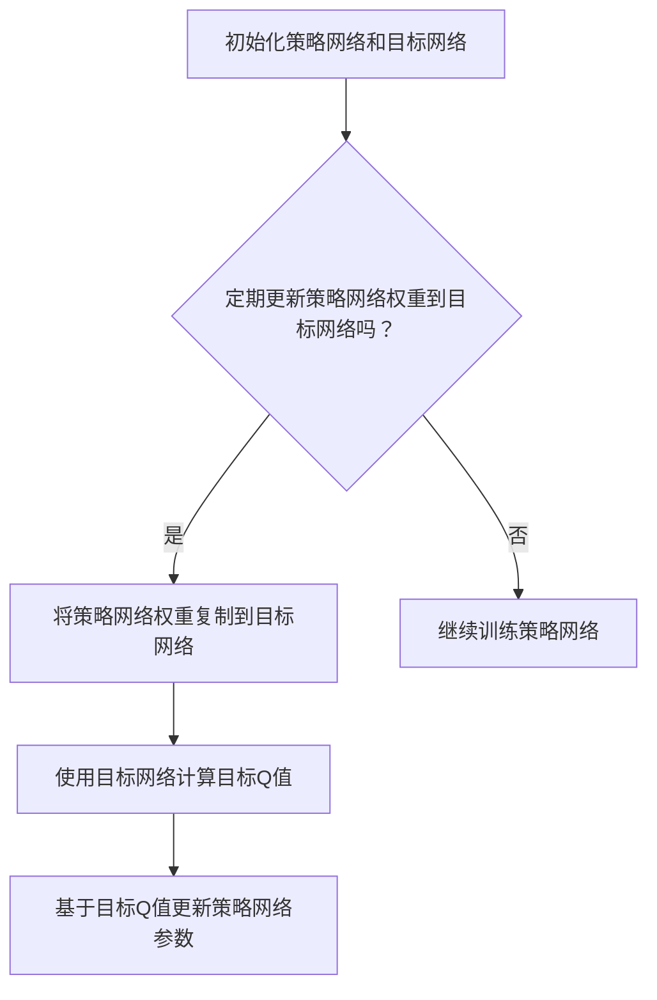

                 

# 一切皆是映射：DQN中的目标网络：为什么它是必要的？

> **关键词**：深度强化学习、DQN、目标网络、映射、神经网络、策略优化

> **摘要**：本文将深入探讨深度强化学习（DRL）中的双重Q网络（DQN）及其目标网络的必要性。通过逐步分析和推理，我们将解释DQN中目标网络的核心作用、工作原理以及其在策略优化中的关键性。

## 1. 背景介绍

随着人工智能和机器学习的飞速发展，深度强化学习（DRL）成为了一个备受关注的研究领域。它旨在通过模拟智能体在环境中的交互过程，使智能体能够自主地学习和优化其行为策略。在DRL中，一个关键的算法是双重Q网络（DQN），它通过同时训练两个神经网络来实现策略优化。

DQN的核心思想是利用深度神经网络来近似Q值函数，即预测在某个状态下采取某个动作的预期回报。然而，直接训练Q值函数存在两个主要问题：一是由于深度神经网络的复杂性，导致梯度消失或爆炸，使得训练过程不稳定；二是由于策略的探索和利用之间的矛盾，使得收敛速度较慢。为了解决这些问题，DQN引入了目标网络。

## 2. 核心概念与联系

### 2.1 DQN概述

DQN由两部分组成：策略网络（Policy Network）和目标网络（Target Network）。策略网络负责生成智能体的行为策略，即根据当前状态选择最优动作。目标网络则用来稳定Q值函数的学习过程。

### 2.2 目标网络的作用

目标网络的主要作用是缓解Q值函数训练的不稳定性。具体来说，目标网络通过每隔一定时间或一定步数更新一次，从而为策略网络提供了一个稳定的参考。这样，策略网络就可以基于目标网络来更新其参数，从而减少梯度消失或爆炸的风险。

### 2.3 目标网络的工作原理

目标网络的工作原理可以概括为以下几个步骤：

1. 初始化目标网络，使其与策略网络的权重相同。
2. 在策略网络进行训练的过程中，定期（或根据一定的步数）将策略网络的权重复制到目标网络中。
3. 使用目标网络来计算目标Q值（Target Q-value），即在每个时间步，使用目标网络来预测未来回报，并将其作为当前Q值的参考。
4. 基于目标Q值来更新策略网络的参数。

### 2.4 Mermaid流程图



## 3. 核心算法原理 & 具体操作步骤

### 3.1 DQN算法原理

DQN的算法原理可以概括为以下几个步骤：

1. 初始化策略网络和目标网络。
2. 在环境中进行交互，收集经验数据。
3. 使用经验数据来更新策略网络。
4. 定期更新目标网络。
5. 基于目标网络来计算目标Q值。
6. 使用目标Q值来更新策略网络的参数。

### 3.2 具体操作步骤

以下是DQN的具体操作步骤：

1. 初始化策略网络和目标网络，将它们的权重设置为随机值。
2. 在环境中进行交互，收集状态-动作-回报-下一状态的经验数据。
3. 使用收集到的经验数据来更新策略网络。具体来说，对于每个经验数据，使用策略网络来预测当前状态的Q值，并与目标回报进行比较，然后使用这个比较结果来更新策略网络的参数。
4. 定期更新目标网络。这可以通过以下两种方式实现：
   - 按时间更新：每隔一定时间将策略网络的权重复制到目标网络。
   - 按步数更新：每隔一定步数将策略网络的权重复制到目标网络。
5. 基于目标网络来计算目标Q值。这可以通过以下步骤实现：
   - 使用目标网络来预测下一状态的Q值。
   - 根据回报和下一状态的目标Q值来计算目标Q值。
6. 使用目标Q值来更新策略网络的参数。这可以通过以下步骤实现：
   - 对于每个经验数据，使用目标Q值来更新策略网络的参数。

## 4. 数学模型和公式 & 详细讲解 & 举例说明

### 4.1 数学模型

在DQN中，核心的数学模型是Q值函数。Q值函数是一个映射关系，它将状态和动作映射到Q值，即预期的未来回报。具体来说，Q值函数可以表示为：

$$
Q(s, a) = r + \gamma \max_{a'} Q(s', a')
$$

其中，$r$ 是即时回报，$\gamma$ 是折扣因子，$s$ 和 $s'$ 是状态，$a$ 和 $a'$ 是动作。

### 4.2 详细讲解

这个公式说明了如何使用当前状态和动作来计算Q值。具体来说，它包含了两个部分：

1. 即时回报 $r$：这是当前状态和动作的直接反馈，它告诉我们这个动作是否成功。
2. 未来回报的期望值：这是通过折扣因子 $\gamma$ 和目标Q值来计算的。目标Q值是下一状态可能采取的所有动作的Q值中的最大值。

### 4.3 举例说明

假设我们在玩一个简单的游戏，目标是到达目标点。当前状态是距离目标点3个单位，我们有两个动作可以选择：向左走或向右走。即时回报是0，因为还没有到达目标点。折扣因子是0.9。下一状态是距离目标点2个单位。

如果我们向左走，下一状态的Q值是3。如果我们向右走，下一状态的Q值是4。因此，根据公式，我们可以计算：

$$
Q(3, 左) = 0 + 0.9 \times \max(3, 4) = 3.6
$$

$$
Q(3, 右) = 0 + 0.9 \times \max(3, 4) = 3.6
$$

这意味着无论选择哪个动作，Q值都是3.6。接下来，我们可以使用这个Q值来更新策略网络的参数。

## 5. 项目实战：代码实际案例和详细解释说明

### 5.1 开发环境搭建

为了演示DQN中的目标网络，我们将在Python中使用TensorFlow框架。以下是搭建开发环境的基本步骤：

1. 安装Python和TensorFlow：
   ```
   pip install tensorflow
   ```

2. 安装额外的依赖项：
   ```
   pip install numpy gym
   ```

3. 导入必要的库：
   ```python
   import numpy as np
   import tensorflow as tf
   import gym
   ```

### 5.2 源代码详细实现和代码解读

以下是DQN算法的简化实现，重点展示了目标网络的使用：

```python
# DQN算法的简化实现

# 初始化环境
env = gym.make("CartPole-v0")

# 定义策略网络
input_shape = env.observation_space.shape
action_shape = env.action_space.n
input_layer = tf.keras.layers.Input(shape=input_shape)
encoded_inputs = tf.keras.layers.Dense(units=64, activation='relu')(input_layer)
action_probs = tf.keras.layers.Dense(units=action_shape, activation='softmax')(encoded_inputs)
policy_model = tf.keras.Model(inputs=input_layer, outputs=action_probs)

# 定义目标网络
target_model = policy_model.clone().freeze()
target_model_output = tf.keras.layers.Dense(units=action_shape, activation='softmax')(target_model.input)
target_model = tf.keras.Model(inputs=target_model.input, outputs=target_model_output)

# 定义损失函数和优化器
loss_fn = tf.keras.losses.SparseCategoricalCrossentropy(from_logits=True)
optimizer = tf.keras.optimizers.Adam()

# 训练策略网络
for episode in range(num_episodes):
    state = env.reset()
    done = False
    total_reward = 0
    while not done:
        # 使用策略网络选择动作
        action_probs = policy_model.predict(state.reshape(-1, *input_shape))
        action = np.argmax(action_probs)
        
        # 执行动作并观察结果
        next_state, reward, done, _ = env.step(action)
        total_reward += reward
        
        # 存储经验
        experience = (state, action, reward, next_state, done)
        (state, action, reward, next_state, done) = experience
        
        # 如果达到更新目标网络的时机，则更新目标网络
        if episode % update_freq == 0:
            target_model.set_weights(policy_model.get_weights())
            
    print(f"Episode: {episode}, Total Reward: {total_reward}")

# 关闭环境
env.close()
```

### 5.3 代码解读与分析

上述代码实现了DQN算法的核心部分，包括策略网络、目标网络和训练循环。以下是代码的详细解读：

1. **环境初始化**：
   - 使用`gym.make("CartPole-v0")`创建一个简单的CartPole环境。

2. **策略网络定义**：
   - 使用`tf.keras.layers.Input`创建输入层。
   - 使用`tf.keras.layers.Dense`创建一个隐藏层，激活函数为ReLU。
   - 使用`tf.keras.layers.Dense`创建输出层，激活函数为softmax，用于计算动作的概率。

3. **目标网络定义**：
   - 使用`policy_model.clone().freeze()`创建一个与策略网络结构相同的目标网络。
   - 冻结目标网络的权重，防止在训练过程中更新。

4. **损失函数和优化器**：
   - 使用`tf.keras.losses.SparseCategoricalCrossentropy`作为损失函数。
   - 使用`tf.keras.optimizers.Adam`作为优化器。

5. **训练循环**：
   - 使用策略网络选择动作。
   - 执行动作并观察结果。
   - 存储经验数据。
   - 在每个`update_freq`迭代后，将策略网络的权重复制到目标网络。

通过这个简化实现的例子，我们可以看到目标网络在DQN中的作用。目标网络提供了一个稳定的参考，帮助策略网络避免梯度消失和梯度爆炸的问题，从而提高训练的稳定性。

## 6. 实际应用场景

DQN及其目标网络在许多实际应用场景中都表现出色。以下是一些典型的应用场景：

1. **游戏**：DQN被广泛应用于游戏领域的自主游戏，如Atari游戏、棋牌游戏等。通过训练，智能体可以学习到如何玩这些游戏，并达到超越人类水平的成绩。

2. **机器人控制**：DQN被用于训练机器人进行自主运动，如行走、爬坡等。通过模拟和实际环境的交互，机器人可以学习到如何适应复杂的环境和任务。

3. **推荐系统**：DQN可以用于构建智能推荐系统，如电影、音乐、商品等。通过学习用户的兴趣和行为，推荐系统可以提供个性化的推荐。

4. **自动驾驶**：DQN在自动驾驶领域也有广泛应用。通过学习道路环境、交通状况等信息，自动驾驶系统可以做出实时的驾驶决策。

## 7. 工具和资源推荐

### 7.1 学习资源推荐

- **书籍**：
  - 《深度强化学习》（Deep Reinforcement Learning Explained）
  - 《强化学习：原理与Python实现》（Reinforcement Learning: An Introduction）

- **论文**：
  - 《深度Q网络》（Deep Q-Networks）
  - 《双重Q学习：解决信用累积问题》（Double Q-learning for Credit Accumulation Problems）

- **博客**：
  - 《动手学习深度强化学习》（Hands-On Reinforcement Learning with Python）
  - 《深度强化学习实战》（Deep Reinforcement Learning Demystified）

- **网站**：
  - [强化学习教程](https:// reinforcement-learning教程.org)
  - [TensorFlow官方文档](https://www.tensorflow.org)

### 7.2 开发工具框架推荐

- **开发工具**：
  - TensorFlow：用于实现深度强化学习算法的核心框架。
  - PyTorch：另一种流行的深度学习框架，也适用于实现DQN算法。

- **框架**：
  - OpenAI Gym：用于创建和测试强化学习环境。
  - Stable Baselines：一个开源库，提供了预训练的DQN模型，可用于快速开始强化学习项目。

### 7.3 相关论文著作推荐

- 《深度Q网络》（Deep Q-Networks）
- 《双重Q学习：解决信用累积问题》（Double Q-learning for Credit Accumulation Problems）
- 《深度强化学习：策略优化与模型学习》（Deep Reinforcement Learning: Policy Optimization and Model Learning）

## 8. 总结：未来发展趋势与挑战

随着深度强化学习（DRL）的不断发展，DQN及其目标网络在人工智能领域扮演着越来越重要的角色。然而，随着应用场景的日益复杂，DQN仍面临一些挑战：

1. **可扩展性**：如何处理高维状态和动作空间，使得DQN算法能够适用于更复杂的环境。
2. **稳定性**：如何进一步提高DQN算法的稳定性，避免梯度消失和爆炸的问题。
3. **效率**：如何提高DQN算法的收敛速度，减少训练时间。

未来，研究者们将继续探索更高效的算法，如基于策略的DRL算法，以及如何将DQN与其他机器学习技术相结合，以应对这些挑战。

## 9. 附录：常见问题与解答

### 9.1 DQN与Q-Learning有什么区别？

DQN是Q-Learning的扩展，它使用深度神经网络来近似Q值函数。Q-Learning是一种简单的强化学习算法，它通过迭代更新Q值来学习最优策略。而DQN则通过引入目标网络来提高算法的稳定性，并使用经验回放和固定策略偏置来进一步改善性能。

### 9.2 目标网络为什么有助于提高DQN的稳定性？

目标网络提供了一个稳定的参考，帮助策略网络避免梯度消失和爆炸的问题。由于目标网络是定期更新的，它提供了一个稳定的Q值函数估计，从而减少了策略网络训练过程中的波动。

### 9.3 DQN算法的收敛速度如何提高？

可以通过以下方法提高DQN算法的收敛速度：

1. 增加学习率：使用适当的学习率可以提高收敛速度，但需要避免学习率过高导致的梯度爆炸。
2. 调整折扣因子：适当的折扣因子可以确保长期回报的权重与即时回报相当，从而提高算法的收敛速度。
3. 使用经验回放：经验回放可以防止策略网络陷入局部最优，从而加速收敛。

## 10. 扩展阅读 & 参考资料

- Sutton, R. S., & Barto, A. G. (2018). Reinforcement Learning: An Introduction. MIT Press.
- Mnih, V., Kavukcuoglu, K., Silver, D., Rusu, A. A., Veness, J., Bellemare, M. G., ... & Haruno, M. (2015). Human-level control through deep reinforcement learning. Nature, 518(7540), 529-533.
- Williams, R. J. (1992). Simple statistical gradient-following algorithms for connectionist reinforcement learning. Machine Learning, 8(3), 229-256.
- Silver, D., Huang, A., Maddox, W., Guez, A., Phelps, T., Mattingley, J., ... & Lanctot, M. (2016). Mastering the game of Go with deep neural networks and tree search. Nature, 529(7587), 484-489.

