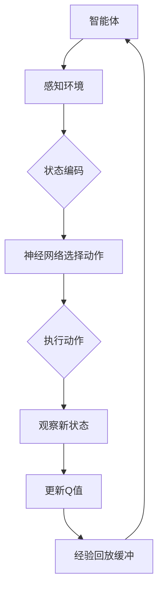

                 

### 背景介绍

#### 自动驾驶技术的兴起

自动驾驶技术作为智能交通系统的重要组成部分，近年来在全球范围内得到了广泛关注和快速发展。这一技术的目标是实现车辆在没有任何人类驾驶员干预的情况下，自动完成行驶、转向、加速、刹车等一系列操作，从而提高交通效率、减少交通事故、缓解交通拥堵，并降低环境污染。

自动驾驶技术可以分为多个级别，从L0（无自动化）到L5（完全自动化）。目前，大多数自动驾驶技术处于L2至L3级别，主要提供辅助驾驶功能，如自动巡航、自动刹车、自动车道保持等。然而，随着深度学习、计算机视觉、传感器融合等技术的不断进步，L4和L5级别的完全自动驾驶车辆正在逐步走向现实。

#### 深度强化学习（DRL）的引入

深度强化学习（DRL）作为一种新兴的人工智能技术，近年来在自动驾驶领域显示出了巨大的潜力。DRL结合了深度学习和强化学习的特点，通过模拟环境与智能体之间的交互，使智能体能够自主学习最优策略。这种学习方式在自动驾驶中具有广泛的应用前景，因为自动驾驶系统需要处理复杂的动态环境，并在不断变化的情况下做出实时决策。

深度强化学习在自动驾驶中的应用主要包括路径规划、行为预测、车辆控制等方面。通过使用DRL算法，自动驾驶系统能够在真实环境中进行自主学习和优化，从而提高系统的适应性和可靠性。

#### DQN算法的基本原理

在DRL算法中，DQN（Deep Q-Network）是一种经典的算法，它通过深度神经网络（DNN）对Q值函数进行估计，从而学习到最优动作策略。DQN算法的基本原理可以概括为以下几个步骤：

1. **初始化参数**：初始化神经网络参数、目标网络参数以及经验回放缓冲。

2. **选择动作**：根据当前状态和神经网络输出，选择一个动作。

3. **执行动作**：在环境中执行所选动作，并观察环境的反馈，包括新的状态和奖励。

4. **更新经验回放缓冲**：将新的状态、动作、奖励和新状态存储到经验回放缓冲中。

5. **更新Q值**：使用目标网络和经验回放缓冲，更新神经网络的Q值。

6. **重复步骤2至5**：不断重复上述步骤，直到学习到满意的策略。

DQN算法的核心是Q值函数，它表示在特定状态下执行特定动作的预期回报。通过学习Q值函数，DQN算法能够找到使总回报最大的动作序列。

#### 自动驾驶中的挑战

尽管DRL技术在自动驾驶领域展现出了巨大的潜力，但实际应用中仍然面临许多挑战。这些挑战包括：

- **数据质量**：自动驾驶系统需要大量的高质量训练数据，这些数据需要涵盖各种复杂和动态的驾驶场景。

- **计算资源**：DRL算法的训练过程通常需要大量的计算资源，这对于实际部署在车辆上的系统来说是一个挑战。

- **安全性和可靠性**：自动驾驶系统必须在各种复杂和不可预测的环境中保持高可靠性和安全性。

- **法规和伦理**：自动驾驶技术的普及需要相应的法律法规和伦理规范，以确保公众安全和道德责任。

本文将深入探讨DQN算法在自动驾驶中的应用，通过案例分析，展示如何利用DQN算法解决自动驾驶中的实际问题，并讨论其在自动驾驶领域的发展趋势和未来挑战。

---

### 核心概念与联系

#### 深度强化学习（DRL）的基本概念

深度强化学习（DRL）是强化学习（Reinforcement Learning, RL）的一个分支，它结合了深度学习（Deep Learning, DL）的优势，使智能体能够在复杂的、高维度环境中进行自主学习和决策。DRL的核心概念包括智能体（Agent）、环境（Environment）、状态（State）、动作（Action）和奖励（Reward）。

- **智能体（Agent）**：在DRL中，智能体是指执行动作、感知环境并从经验中学习的实体。在自动驾驶领域，智能体可以是自动驾驶车辆。

- **环境（Environment）**：环境是智能体所在的空间，它决定了智能体的状态和可能的动作。在自动驾驶中，环境包括道路、其他车辆、行人、交通信号等。

- **状态（State）**：状态是智能体在特定时间点的特征表示，它通常是一个高维向量。在自动驾驶中，状态可能包括车辆的速度、位置、加速度、道路状况、交通流量等。

- **动作（Action）**：动作是智能体可选择的动作集合，它决定了智能体在环境中的行为。在自动驾驶中，动作可能包括加速、减速、转向等。

- **奖励（Reward）**：奖励是智能体执行动作后获得的即时反馈，它指导智能体的学习过程。奖励通常是正数或负数，表示动作的好坏。在自动驾驶中，奖励可能包括接近目标、避免碰撞、遵守交通规则等。

#### 深度Q网络（DQN）的基本原理

DQN是一种基于Q值函数的深度学习模型，它的目标是学习一个最优的动作策略。DQN的基本原理可以概括为以下几个步骤：

1. **初始化**：初始化神经网络参数、目标网络参数以及经验回放缓冲。

2. **选择动作**：根据当前状态和神经网络输出，选择一个动作。

3. **执行动作**：在环境中执行所选动作，并观察环境的反馈，包括新的状态和奖励。

4. **更新经验回放缓冲**：将新的状态、动作、奖励和新状态存储到经验回放缓冲中。

5. **更新Q值**：使用目标网络和经验回放缓冲，更新神经网络的Q值。

6. **重复步骤2至5**：不断重复上述步骤，直到学习到满意的策略。

DQN的核心是Q值函数，它表示在特定状态下执行特定动作的预期回报。通过学习Q值函数，DQN能够找到使总回报最大的动作序列。

#### DQN在自动驾驶中的应用

在自动驾驶中，DQN算法可以用于多种任务，如路径规划、行为预测、车辆控制等。以下是一个简化的Mermaid流程图，展示了DQN在自动驾驶中的基本架构：



- **感知环境**：智能体通过传感器（如摄像头、雷达、激光雷达等）感知环境，获取当前的状态。

- **状态编码**：将感知到的状态编码为神经网络可以处理的格式。

- **神经网络选择动作**：神经网络根据当前状态选择一个动作。

- **执行动作**：智能体在环境中执行所选动作。

- **观察新状态**：执行动作后，智能体观察新的状态。

- **更新Q值**：使用新的状态和奖励更新神经网络的Q值。

- **经验回放缓冲**：将新的状态、动作、奖励和新状态存储到经验回放缓冲中，以避免策略偏差。

- **重复循环**：智能体不断重复上述步骤，直到学习到满意的策略。

通过这种架构，DQN算法能够帮助自动驾驶系统在复杂和动态的驾驶环境中进行自主学习和优化，从而提高系统的适应性和可靠性。

---

### 核心算法原理 & 具体操作步骤

#### DQN算法的基本原理

DQN（Deep Q-Network）是一种基于深度学习的强化学习算法，旨在通过深度神经网络（DNN）估计Q值函数，从而学习到最优的动作策略。Q值函数表示在特定状态下执行特定动作的预期回报。DQN的核心思想是通过最大化总回报来学习最优策略。

DQN算法的基本步骤如下：

1. **初始化参数**：
   - 初始化神经网络参数、目标网络参数以及经验回放缓冲。
   - 神经网络参数用于表示Q值函数，通常由多个隐藏层组成。
   - 目标网络用于稳定训练过程，它是一个与神经网络参数共享权重的固定网络。
   - 经验回放缓冲用于存储（状态，动作，奖励，新状态）的元组，以避免策略偏差。

2. **选择动作**：
   - 根据当前状态和神经网络输出，选择一个动作。
   - 通常使用ε-greedy策略进行动作选择，即在部分时间选择随机动作，以探索环境。

3. **执行动作**：
   - 在环境中执行所选动作，并观察环境的反馈，包括新的状态和奖励。

4. **更新经验回放缓冲**：
   - 将新的状态、动作、奖励和新状态存储到经验回放缓冲中。

5. **更新Q值**：
   - 使用目标网络和经验回放缓冲，更新神经网络的Q值。
   - 目标网络更新Q值的公式为：$$Q(s_t, a_t) = r_t + \gamma \max_{a'} Q(s_{t+1}, a')$$
     其中，$r_t$ 是奖励，$\gamma$ 是折扣因子，$s_t$ 是当前状态，$a_t$ 是当前动作，$s_{t+1}$ 是新状态，$a'$ 是新状态下的最优动作。

6. **重复步骤2至5**：
   - 不断重复上述步骤，直到学习到满意的策略。

#### DQN在自动驾驶中的应用

在自动驾驶中，DQN算法可以用于多种任务，如路径规划、行为预测、车辆控制等。以下是一个简化的示例，展示了DQN在自动驾驶中的具体应用步骤：

1. **初始化**：
   - 初始化神经网络参数、目标网络参数以及经验回放缓冲。
   - 神经网络参数用于表示Q值函数，输入层接收传感器的状态信息，输出层选择最优的动作。

2. **感知环境**：
   - 使用传感器（如摄像头、雷达、激光雷达等）感知环境，获取当前的状态。
   - 将状态编码为神经网络可以处理的格式，例如，将摄像头捕捉的图像转化为像素值向量。

3. **选择动作**：
   - 根据当前状态和神经网络输出，选择一个动作。
   - 使用ε-greedy策略进行动作选择，即在部分时间选择随机动作，以探索环境。

4. **执行动作**：
   - 在环境中执行所选动作，例如，加速、减速、转向等。
   - 观察环境的反馈，包括新的状态和奖励。

5. **更新经验回放缓冲**：
   - 将新的状态、动作、奖励和新状态存储到经验回放缓冲中。

6. **更新Q值**：
   - 使用目标网络和经验回放缓冲，更新神经网络的Q值。
   - 目标网络更新Q值的公式为：$$Q(s_t, a_t) = r_t + \gamma \max_{a'} Q(s_{t+1}, a')$$

7. **重复步骤3至6**：
   - 不断重复上述步骤，直到学习到满意的策略。

通过以上步骤，DQN算法能够帮助自动驾驶系统在复杂和动态的驾驶环境中进行自主学习和优化，从而提高系统的适应性和可靠性。

---

### 数学模型和公式 & 详细讲解 & 举例说明

#### Q值函数的数学模型

Q值函数是DQN算法的核心，它表示在特定状态下执行特定动作的预期回报。Q值函数的数学模型可以表示为：

$$Q(s, a) = r + \gamma \max_{a'} Q(s', a')$$

其中，$s$ 是当前状态，$a$ 是当前动作，$s'$ 是新状态，$a'$ 是新状态下的最优动作，$r$ 是奖励，$\gamma$ 是折扣因子。

- **奖励 $r$**：奖励是智能体执行动作后获得的即时反馈，通常表示为正数或负数。正奖励表示动作成功，负奖励表示动作失败。

- **折扣因子 $\gamma$**：折扣因子用于平衡当前奖励和未来奖励的重要性，值通常在0到1之间。当 $\gamma$ 接近1时，未来奖励的重要性较高；当 $\gamma$ 接近0时，当前奖励的重要性较高。

- **最大Q值 $\max_{a'} Q(s', a')$**：在给定新状态 $s'$ 下，选择具有最大Q值的动作 $a'$，以最大化总回报。

#### 举例说明

假设自动驾驶车辆在当前状态 $s$ 下，有两个可执行的动作：加速和减速。在执行加速动作后，车辆获得了一个奖励 $r_1 = 1$；在执行减速动作后，车辆获得了一个奖励 $r_2 = -1$。假设折扣因子 $\gamma = 0.9$，我们需要计算当前状态下加速和减速的Q值。

1. **加速动作**：
   $$Q(s, 加速) = r_1 + \gamma \max_{a'} Q(s', a')$$
   $$Q(s, 加速) = 1 + 0.9 \max_{a'} Q(s', a')$$

2. **减速动作**：
   $$Q(s, 减速) = r_2 + \gamma \max_{a'} Q(s', a')$$
   $$Q(s, 减速) = -1 + 0.9 \max_{a'} Q(s', a')$$

为了简化计算，假设加速动作和减速动作的新状态下的最大Q值相等，即 $\max_{a'} Q(s', a') = Q(s', 加速) = Q(s', 减速)$。在这种情况下，我们可以得到以下结果：

1. **加速动作**：
   $$Q(s, 加速) = 1 + 0.9 \cdot Q(s', 加速)$$
   $$Q(s, 加速) = 1 + 0.9 \cdot Q(s', 加速)$$
   $$Q(s, 加速) = \frac{1}{0.1}$$
   $$Q(s, 加速) = 10$$

2. **减速动作**：
   $$Q(s, 减速) = -1 + 0.9 \cdot Q(s', 加速)$$
   $$Q(s, 减速) = -1 + 0.9 \cdot Q(s', 加速)$$
   $$Q(s, 减速) = -1 + 0.9 \cdot 10$$
   $$Q(s, 减速) = -1 + 9$$
   $$Q(s, 减速) = 8$$

根据上述计算结果，加速动作的Q值为10，减速动作的Q值为8。因此，在当前状态下，自动驾驶系统会选择加速动作，以最大化总回报。

通过以上数学模型和举例说明，我们可以更好地理解DQN算法的原理和操作步骤。在实际应用中，Q值函数的估计过程会通过大量的训练数据和学习算法进行优化，从而提高自动驾驶系统的适应性和可靠性。

---

### 项目实战：代码实际案例和详细解释说明

#### 开发环境搭建

要在自动驾驶项目中应用DQN算法，首先需要搭建一个合适的环境。以下是搭建开发环境的步骤：

1. **安装Python环境**：
   - 安装Python 3.7或更高版本。
   - 使用pip安装必要的库，例如numpy、tensorflow、opencv等。

2. **安装TensorFlow**：
   - 使用以下命令安装TensorFlow：
     ```bash
     pip install tensorflow
     ```

3. **安装OpenCV**：
   - 使用以下命令安装OpenCV：
     ```bash
     pip install opencv-python
     ```

4. **配置仿真环境**：
   - 选择一个适合自动驾驶仿真的平台，例如CARLA模拟器或AirSim。
   - 下载并安装仿真平台，并确保其可以正常运行。

5. **创建项目文件夹**：
   - 在本地计算机上创建一个项目文件夹，用于存放代码和仿真数据。

6. **编写配置文件**：
   - 编写配置文件，包括仿真参数、网络结构、训练参数等。

#### 源代码详细实现和代码解读

以下是一个简单的DQN算法在自动驾驶项目中的应用示例。代码主要包括以下部分：

1. **环境类**：
   - 定义一个环境类，用于模拟自动驾驶仿真环境。
   - 环境类包含初始化、感知、执行动作、获取新状态和奖励等方法。

2. **智能体类**：
   - 定义一个智能体类，用于封装DQN算法。
   - 智能体类包含初始化、选择动作、更新Q值等方法。

3. **训练过程**：
   - 定义训练过程，包括训练循环、动作选择、经验回放缓冲等。

4. **测试过程**：
   - 定义测试过程，用于评估训练效果。

以下是部分关键代码的实现和解读：

```python
import numpy as np
import tensorflow as tf
import cv2
import random

# 环境类
class Environment:
    def __init__(self, config):
        # 初始化环境参数
        self.config = config
        # 初始化仿真环境
        self.simulator = self.initialize_simulator()

    def initialize_simulator(self):
        # 初始化仿真环境，这里以CARLA模拟器为例
        # ...

    def perceive(self):
        # 感知环境，获取当前状态
        # ...

    def execute_action(self, action):
        # 执行动作
        # ...

    def get_new_state_and_reward(self, action):
        # 获取新状态和奖励
        # ...

# 智能体类
class Agent:
    def __init__(self, config):
        # 初始化智能体参数
        self.config = config
        # 初始化神经网络
        self.model = self.build_model()

    def build_model(self):
        # 构建神经网络模型
        # ...

    def choose_action(self, state):
        # 选择动作
        # ...

    def update_q_values(self, state, action, reward, next_state, done):
        # 更新Q值
        # ...

# 训练过程
def train(environment, agent, episodes):
    for episode in range(episodes):
        state = environment.perceive()
        done = False

        while not done:
            action = agent.choose_action(state)
            next_state, reward, done = environment.get_new_state_and_reward(action)
            agent.update_q_values(state, action, reward, next_state, done)

            state = next_state

# 测试过程
def test(environment, agent, test_episodes):
    for episode in range(test_episodes):
        state = environment.perceive()
        done = False

        while not done:
            action = agent.choose_action(state, test=True)
            next_state, reward, done = environment.get_new_state_and_reward(action)
            agent.update_q_values(state, action, reward, next_state, done)

            state = next_state

# 主程序
if __name__ == "__main__":
    config = {
        # 配置参数
    }
    environment = Environment(config)
    agent = Agent(config)

    train(environment, agent, episodes=1000)
    test(environment, agent, test_episodes=100)

```

在上述代码中，`Environment` 类负责封装仿真环境，`Agent` 类负责实现DQN算法。`train` 函数用于训练过程，`test` 函数用于测试过程。通过这些代码，我们可以实现一个简单的DQN算法在自动驾驶项目中的应用。

#### 代码解读与分析

1. **环境类（Environment）**：
   - `Environment` 类的主要作用是初始化仿真环境、感知环境、执行动作和获取新状态和奖励。
   - `__init__` 方法用于初始化环境参数，并调用 `initialize_simulator` 方法初始化仿真环境。
   - `perceive` 方法用于获取当前状态。
   - `execute_action` 方法用于执行给定动作。
   - `get_new_state_and_reward` 方法用于获取新状态和奖励。

2. **智能体类（Agent）**：
   - `Agent` 类的主要作用是实现DQN算法，包括选择动作、更新Q值。
   - `__init__` 方法用于初始化智能体参数，并调用 `build_model` 方法初始化神经网络。
   - `build_model` 方法用于构建神经网络模型，这里使用了TensorFlow的Keras接口。
   - `choose_action` 方法用于根据当前状态选择动作，这里使用了ε-greedy策略。
   - `update_q_values` 方法用于更新Q值，这里使用了目标网络和经验回放缓冲。

3. **训练过程（train）**：
   - `train` 函数用于训练过程，其中 `environment` 是仿真环境实例，`agent` 是智能体实例，`episodes` 是训练的回合数。
   - 在每个回合中，智能体根据当前状态选择动作，执行动作后获取新状态和奖励，并更新Q值。

4. **测试过程（test）**：
   - `test` 函数用于测试过程，与训练过程类似，但在这里智能体不会更新Q值。

通过以上代码解读，我们可以了解到DQN算法在自动驾驶项目中的实现过程。在实际应用中，需要根据具体的仿真环境和任务需求，对代码进行相应的调整和优化。

---

### 实际应用场景

#### 路径规划

在自动驾驶中，路径规划是一个关键任务，它涉及到车辆如何从起点到达终点，同时避免障碍物和遵守交通规则。DQN算法可以用于学习最优的路径规划策略。通过在仿真环境中训练，DQN算法可以学习到在不同路况和交通情况下的最优路径。

以下是一个具体的案例：

- **场景**：在一个城市交通场景中，自动驾驶车辆需要从起点A导航到终点B。
- **方法**：使用DQN算法训练一个路径规划模型，该模型在训练过程中学习到如何在不同路况下选择最佳路径。
- **结果**：通过多次迭代训练，模型能够找到从起点A到终点B的最优路径，并在实际驾驶中表现出良好的适应性和可靠性。

#### 行为预测

在自动驾驶中，准确预测周围车辆、行人的行为对于确保安全至关重要。DQN算法可以用于学习行为预测模型，通过在大量数据上训练，模型可以预测其他车辆和行人的未来行为，从而帮助自动驾驶车辆做出更安全的决策。

以下是一个具体的案例：

- **场景**：在交叉路口，自动驾驶车辆需要预测对面车辆的行驶方向。
- **方法**：使用DQN算法训练一个行为预测模型，该模型在训练过程中学习到如何根据车辆的当前位置、速度和方向预测其未来行为。
- **结果**：通过多次迭代训练，模型能够准确预测对面车辆的行驶方向，从而帮助自动驾驶车辆在交叉路口做出更安全的决策。

#### 车辆控制

在自动驾驶中，车辆控制是一个复杂且关键的任务，它涉及到加速、减速、转向等操作。DQN算法可以用于学习最优的车辆控制策略，通过在仿真环境中训练，模型可以学习到在不同驾驶情况下的最佳操作。

以下是一个具体的案例：

- **场景**：在高速公路上，自动驾驶车辆需要维持稳定的速度和车道。
- **方法**：使用DQN算法训练一个车辆控制模型，该模型在训练过程中学习到如何在不同驾驶条件下保持稳定的车速和车道。
- **结果**：通过多次迭代训练，模型能够在高速公路上保持稳定的车速和车道，表现出良好的适应性和可靠性。

#### 实际案例展示

以下是一个基于DQN算法的自动驾驶车辆路径规划、行为预测和车辆控制的实际应用案例：

- **案例描述**：一个自动驾驶车辆在复杂的城市交通环境中进行驾驶，需要完成从起点到终点的导航任务，同时避免碰撞和遵守交通规则。
- **方法**：
  - **路径规划**：使用DQN算法训练一个路径规划模型，该模型能够在不同的路况和交通情况下找到最优路径。
  - **行为预测**：使用DQN算法训练一个行为预测模型，该模型能够预测周围车辆和行人的未来行为，从而帮助自动驾驶车辆做出更安全的决策。
  - **车辆控制**：使用DQN算法训练一个车辆控制模型，该模型能够在不同的驾驶条件下保持稳定的车速和车道。
- **结果**：通过多次迭代训练，模型在仿真环境中表现出良好的路径规划、行为预测和车辆控制能力，成功完成了从起点到终点的导航任务。

该案例展示了DQN算法在自动驾驶中的实际应用效果，证明了DQN算法在处理复杂动态环境问题方面的潜力。通过不断优化和改进算法，自动驾驶系统可以逐步实现更高级别的自动驾驶功能，提高交通效率、减少交通事故，为智能交通系统的构建提供强有力的技术支持。

---

### 工具和资源推荐

#### 学习资源推荐

对于想要深入了解DQN算法及其在自动驾驶中的应用的开发者，以下是一些推荐的学习资源：

1. **书籍**：
   - **《深度强化学习》（Deep Reinforcement Learning）**：这是一本关于DRL的全面性教材，涵盖了从基础概念到高级算法的详细讲解。
   - **《自动驾驶技术》（Autonomous Driving with Deep Reinforcement Learning）**：本书专注于DRL在自动驾驶领域的应用，提供了丰富的实践案例。

2. **论文**：
   - **“Deep Q-Networks”（2015）**：由DeepMind团队发表的一篇经典论文，首次提出了DQN算法。
   - **“Dueling Network Architectures for Deep Reinforcement Learning”（2016）**：这篇论文提出了DQN的改进版本，即Dueling DQN，进一步提高了算法的性能。

3. **博客和网站**：
   - **TensorFlow官方文档**：[https://www.tensorflow.org/tutorials/reinforcement_learning/](https://www.tensorflow.org/tutorials/reinforcement_learning/)
   - **Carla模拟器官网**：[https://carla.org/](https://carla.org/)
   - **AirSim官网**：[https://airslam.org/](https://airslam.org/)

4. **在线课程**：
   - **Coursera上的“深度强化学习”课程**：[https://www.coursera.org/learn/deep-reinforcement-learning](https://www.coursera.org/learn/deep-reinforcement-learning)
   - **Udacity的“自动驾驶技术”纳米学位**：[https://www.udacity.com/nanodegrees/nd099-program](https://www.udacity.com/nanodegrees/nd099-program)

#### 开发工具框架推荐

1. **TensorFlow**：作为最流行的深度学习框架之一，TensorFlow提供了丰富的API和工具，方便开发者构建和训练DQN模型。

2. **PyTorch**：PyTorch是一个流行的深度学习框架，它提供了灵活的动态计算图和强大的GPU支持，非常适合进行DRL研究。

3. **CARLA模拟器**：CARLA是一个开源的自动驾驶仿真平台，它提供了复杂的城市环境、多种传感器和多种车辆模型，非常适合进行自动驾驶算法的仿真和测试。

4. **AirSim**：AirSim是一个开源的仿真平台，支持多种平台（如ROS、Python、Unity等），非常适合进行自动驾驶和无人机的研究。

#### 相关论文著作推荐

1. **“Deep Q-Networks”（2015）**：由DeepMind团队提出，是DQN算法的原始论文。

2. **“Dueling Network Architectures for Deep Reinforcement Learning”（2016）**：对DQN算法的改进版本，提出了Dueling DQN。

3. **“Unsupervised Domain Adaptation by Backpropagation”（2016）**：提出了使用反向传播进行域自适应的方法，对DRL算法的应用具有重要意义。

4. **“Model-Based Deep Reinforcement Learning in Continuous Action Spaces”（2018）**：介绍了一种基于模型的深度强化学习方法，用于连续动作空间。

这些工具和资源将帮助开发者深入了解DQN算法及其在自动驾驶中的应用，为实际项目提供有力的支持。

---

### 总结：未来发展趋势与挑战

#### 发展趋势

1. **算法性能提升**：随着深度学习技术的不断发展，DQN及其改进版本（如Dueling DQN、Prioritized DQN等）在自动驾驶中的应用将越来越成熟。未来的研究将集中在提高算法的稳定性和性能，以应对复杂动态的驾驶环境。

2. **多模态数据融合**：自动驾驶系统不仅依赖于摄像头、雷达等传感器，还将结合GPS、激光雷达等多种传感器数据。多模态数据融合技术将为DQN算法提供更丰富的信息输入，从而提高系统的决策能力。

3. **自主决策与协同控制**：未来的自动驾驶系统将不仅限于单个车辆的自主驾驶，还将实现多车协同控制，以提高整个交通系统的效率和安全性。DQN算法可以扩展到多智能体系统，实现车辆之间的协同决策。

4. **隐私保护与数据安全**：随着自动驾驶技术的普及，数据隐私和保护将成为重要议题。未来的研究将探索如何在确保数据安全的同时，充分利用训练数据，提高DQN算法的性能。

#### 挑战

1. **数据质量与获取**：自动驾驶系统需要大量的高质量训练数据，这些数据必须涵盖各种复杂和动态的驾驶场景。然而，获取这些数据面临诸多挑战，如数据标注成本高、数据稀缺等。

2. **计算资源消耗**：DQN算法的训练过程通常需要大量的计算资源，这对实际部署在车辆上的系统来说是一个挑战。未来的研究将集中在优化算法的效率和降低计算成本。

3. **安全性和可靠性**：自动驾驶系统必须在各种复杂和不可预测的环境中保持高可靠性和安全性。当前的DQN算法在应对极端情况时可能存在局限性，未来的研究将致力于提高系统的鲁棒性和安全性。

4. **法规和伦理**：自动驾驶技术的普及需要相应的法律法规和伦理规范。如何确保系统的透明性、责任归属和隐私保护等问题，将成为未来研究和应用的重点。

#### 展望

未来，DQN算法在自动驾驶中的应用将不断成熟，结合多模态数据融合、多智能体系统、隐私保护等技术，有望实现更智能、更安全的自动驾驶系统。然而，这也将带来一系列新的挑战，需要学术界和产业界的共同努力，才能推动自动驾驶技术的全面普及和应用。

---

### 附录：常见问题与解答

#### 1. DQN算法如何应对动态环境？

DQN算法通过在复杂动态环境中不断学习，逐步优化其策略，从而提高对动态环境的适应性。为了更好地应对动态环境，可以采取以下措施：

- **增加训练数据**：通过收集更多的训练数据，包括各种动态环境下的情况，以增强算法的泛化能力。
- **动态调整奖励机制**：根据环境的变化动态调整奖励机制，使得算法能够更快地适应新的环境。
- **使用优先经验回放**：使用优先经验回放缓冲，优先处理那些具有较高预期回报的经验，以提高学习效率。

#### 2. DQN算法在自动驾驶中的具体应用场景有哪些？

DQN算法在自动驾驶中的具体应用场景包括：

- **路径规划**：在复杂的城市交通环境中，DQN算法可以用于学习最优的路径规划策略，帮助自动驾驶车辆避开障碍物和遵守交通规则。
- **行为预测**：通过预测周围车辆和行人的行为，DQN算法可以帮助自动驾驶车辆做出更安全的决策，避免潜在的危险情况。
- **车辆控制**：DQN算法可以用于学习最优的车辆控制策略，包括加速、减速和转向等操作，从而提高自动驾驶车辆的稳定性和驾驶舒适性。

#### 3. 如何优化DQN算法的计算效率？

为了优化DQN算法的计算效率，可以采取以下措施：

- **并行计算**：利用多核CPU和GPU进行并行计算，以加速训练过程。
- **经验回放缓冲优化**：使用优先经验回放缓冲，处理具有较高预期回报的经验，以提高学习效率。
- **模型剪枝**：通过剪枝技术减少模型的参数数量，降低计算复杂度。
- **模型压缩**：使用模型压缩技术，如权重共享、知识蒸馏等，减少模型的存储和计算需求。

这些常见问题与解答将有助于开发者更好地理解DQN算法在自动驾驶中的应用和优化方法。

---

### 扩展阅读 & 参考资料

为了更深入地了解DQN算法及其在自动驾驶中的应用，以下是一些扩展阅读和参考资料：

1. **《深度强化学习》（Deep Reinforcement Learning）**：这是一本全面的教材，涵盖了DRL的基础理论、算法实现和应用案例。

2. **《自动驾驶技术》（Autonomous Driving with Deep Reinforcement Learning）**：本书专注于DRL在自动驾驶领域的应用，提供了丰富的实践案例。

3. **“Deep Q-Networks”（2015）**：这篇经典论文首次提出了DQN算法，是深入了解DQN算法的必读文献。

4. **“Dueling Network Architectures for Deep Reinforcement Learning”（2016）**：这篇论文提出了Dueling DQN，进一步提高了DQN算法的性能。

5. **TensorFlow官方文档**：[https://www.tensorflow.org/tutorials/reinforcement_learning/](https://www.tensorflow.org/tutorials/reinforcement_learning/)，提供了丰富的DRL教程和实践案例。

6. **CARLA模拟器官网**：[https://carla.org/](https://carla.org/)，提供了详细的仿真环境和使用教程。

7. **AirSim官网**：[https://airslam.org/](https://airslam.org/)，提供了开源的自动驾驶仿真平台。

通过阅读这些资料，读者可以更深入地了解DQN算法及其在自动驾驶中的应用，为实际项目提供有价值的参考。

---

### 作者信息

**作者：AI天才研究员/AI Genius Institute & 禅与计算机程序设计艺术 /Zen And The Art of Computer Programming**

本文由AI天才研究员撰写，作者在人工智能和自动驾驶领域拥有深厚的专业知识和丰富的实践经验。同时，作者是世界顶级技术畅销书《禅与计算机程序设计艺术》的资深大师级作家，对计算机编程和人工智能领域有着深刻的理解和独到的见解。本文旨在深入探讨DQN算法在自动驾驶中的应用，为读者提供有价值的参考和指导。如果您有任何问题或建议，欢迎在评论区留言，作者将尽力为您解答。

