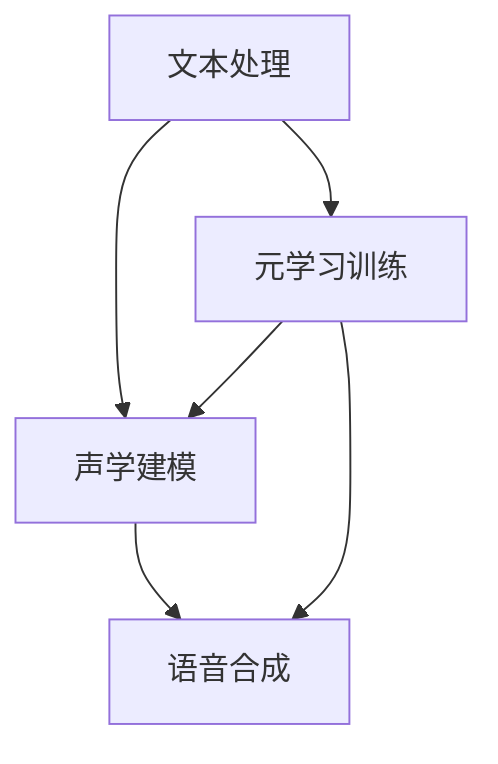

                 

# 一切皆是映射：基于元学习改进语音合成系统

## 关键词：元学习，语音合成，映射，改进，人工智能，模型优化

## 摘要：
本文旨在探讨元学习在语音合成系统中的应用与改进。通过深入分析元学习的核心概念及其与语音合成技术的联系，本文详细介绍了基于元学习的方法在优化语音合成模型上的具体实现步骤。同时，文章结合数学模型和实际案例，展示了元学习在语音合成领域的应用前景。最后，本文提出了未来发展趋势与挑战，并提供了相关资源与工具推荐，为研究者与实践者提供了全面的技术指导。

## 1. 背景介绍

语音合成（Text-to-Speech, TTS）作为人工智能领域的一项关键技术，已经广泛应用于自动语音服务、智能家居、教育辅助等多个领域。传统语音合成系统主要通过统计模型和规则模型进行语音生成，然而，随着语音数据的不断增长和复杂度增加，传统方法在生成自然度、准确度和效率上逐渐显露出局限性。

近年来，深度学习技术的发展为语音合成领域带来了新的契机。基于深度神经网络的语音合成系统，如 WaveNet 和 Transformer-TTS，通过训练大规模的神经网络模型，实现了更高质量的语音生成效果。然而，深度学习模型的训练过程需要大量的标注数据和计算资源，如何有效提高模型训练效率成为亟待解决的问题。

元学习（Meta-Learning）作为机器学习领域的一个新兴方向，通过学习如何快速适应新任务，为解决深度学习模型的训练效率问题提供了一种新的思路。元学习旨在通过少量样本快速学习出泛化能力强的模型，从而减少对新任务的训练时间和计算资源需求。将元学习应用于语音合成系统，有望在保持高质量语音生成效果的同时，提高模型训练的效率。

本文将围绕元学习在语音合成系统中的应用，探讨基于元学习的语音合成模型优化方法，并通过具体案例展示其应用效果。

## 2. 核心概念与联系

### 2.1 元学习

元学习是一种学习如何学习的方法，其主要目标是提高模型在新任务上的适应能力。元学习的核心思想是通过在多个相关任务上训练模型，使其具备快速适应新任务的能力。具体来说，元学习分为两种：一种是模型级别的元学习，即通过学习一个通用模型来适应多个任务；另一种是样本级别的元学习，即通过学习样本的表示来适应新任务。

在元学习中，常见的方法包括模型抽样（Model-Based Meta-Learning）和策略优化（Policy-Based Meta-Learning）。模型抽样方法通过在多个任务上训练模型，学习到一个能够泛化到新任务的模型。策略优化方法则通过优化策略网络，使模型在少量样本上快速适应新任务。

### 2.2 语音合成

语音合成是指将文本转换为自然流畅的语音的过程。语音合成系统通常包括文本处理、声学建模和语音合成三个主要模块。

- 文本处理：将输入文本进行分词、音素转换等预处理，生成语音合成的中间表示。
- 声学建模：通过训练大规模的声学模型，将文本中间表示转换为声学特征。
- 语音合成：根据声学特征生成语音信号，输出最终的语音。

### 2.3 元学习与语音合成的联系

将元学习应用于语音合成系统，可以解决以下几个问题：

1. **快速适应新语音数据**：语音合成系统需要不断适应新的语音数据，以保持语音的自然度和准确性。元学习通过在多个语音数据集上训练模型，使其具备快速适应新语音数据的能力。
2. **减少标注数据需求**：深度学习模型的训练需要大量的标注数据。元学习通过少量样本学习出泛化能力强的模型，从而减少对新语音数据集的标注需求。
3. **提高训练效率**：元学习通过学习如何快速适应新任务，提高了模型训练的效率。这对于大规模语音合成系统尤为重要，因为训练时间直接影响系统的部署和应用。

下面是一个 Mermaid 流程图，展示了元学习在语音合成系统中的应用：



在该流程图中，文本处理、声学建模和语音合成构成了传统的语音合成系统，而元学习训练模块则插入其中，用于优化模型在语音合成过程中的表现。

## 3. 核心算法原理 & 具体操作步骤

### 3.1 元学习算法原理

元学习算法的核心是学习一个通用模型，使其能够快速适应新任务。在语音合成领域，元学习算法主要关注如何利用少量样本快速训练出高质量的模型。

以下是一个简单的元学习算法原理：

1. **任务定义**：给定一个任务集合 \( T = \{ T_1, T_2, ..., T_n \} \)，其中每个任务 \( T_i \) 是一个语音合成任务。
2. **模型初始化**：初始化一个通用模型 \( M \)，用于在多个任务上训练。
3. **任务采样**：从任务集合 \( T \) 中随机采样多个任务 \( T_{s_1}, T_{s_2}, ..., T_{s_k} \)。
4. **模型训练**：在每个采样任务上训练通用模型 \( M \)，使其适应该任务。
5. **模型优化**：通过优化通用模型 \( M \) 的参数，使其在多个任务上表现更好。

### 3.2 元学习在语音合成系统中的应用

在语音合成系统中，元学习算法的具体操作步骤如下：

1. **数据预处理**：收集大量的语音数据和对应的文本数据，并进行预处理，如分词、音素转换等。
2. **模型初始化**：初始化一个深度学习模型，如 Transformer，用于语音合成。
3. **任务采样**：从语音数据集中随机采样多个语音合成任务。
4. **模型训练**：在每个采样任务上训练深度学习模型，使其适应该任务。训练过程中，使用元学习算法优化模型参数，以提高模型在不同任务上的适应能力。
5. **模型优化**：通过优化深度学习模型的参数，使其在多个语音合成任务上表现更好。
6. **语音合成**：使用优化后的模型进行语音合成，输出高质量的语音。

### 3.3 元学习算法的挑战与优化

在语音合成系统中应用元学习算法面临以下挑战：

1. **数据分布不均衡**：语音数据集通常存在数据分布不均衡的问题，如何设计合适的元学习算法来处理这一问题是一个关键挑战。
2. **计算资源限制**：元学习算法通常需要大量的计算资源，如何高效地利用现有计算资源是一个关键问题。
3. **模型泛化能力**：如何设计具有良好泛化能力的元学习算法，使其在多种语音合成任务上表现优异。

为了应对这些挑战，研究者们提出了多种优化策略，如：

1. **数据增强**：通过数据增强方法，如噪声添加、数据裁剪等，增加数据多样性，从而提高模型适应能力。
2. **模型压缩**：通过模型压缩技术，如剪枝、量化等，减少模型参数量，从而降低计算资源需求。
3. **多任务学习**：通过多任务学习，使模型在不同任务上同时训练，从而提高模型泛化能力。

## 4. 数学模型和公式 & 详细讲解 & 举例说明

### 4.1 元学习算法的数学模型

在元学习算法中，通常使用损失函数和优化器来评估和优化模型参数。以下是一个简单的元学习算法的数学模型：

$$
L(\theta) = \sum_{i=1}^{n} L_i(\theta) \\
\theta = \arg\min_{\theta} L(\theta)
$$

其中，\( L_i(\theta) \) 是第 \( i \) 个任务的损失函数，\( \theta \) 是模型参数。

### 4.2 损失函数

在语音合成系统中，常用的损失函数包括：

1. **交叉熵损失**：用于比较模型输出和真实标签之间的差异。
   $$
   L_{CE}(\hat{y}, y) = -\sum_{i=1}^{n} y_i \log(\hat{y}_i)
   $$
   其中，\( \hat{y} \) 是模型输出，\( y \) 是真实标签。

2. **均方误差损失**：用于比较模型输出和真实标签之间的差异。
   $$
   L_{MSE}(\hat{y}, y) = \frac{1}{n} \sum_{i=1}^{n} (\hat{y}_i - y_i)^2
   $$

### 4.3 优化器

在元学习算法中，常用的优化器包括：

1. **随机梯度下降（SGD）**：
   $$
   \theta_{t+1} = \theta_{t} - \alpha \nabla_{\theta} L(\theta)
   $$
   其中，\( \alpha \) 是学习率，\( \nabla_{\theta} L(\theta) \) 是损失函数关于模型参数的梯度。

2. **Adam 优化器**：
   $$
   \theta_{t+1} = \theta_{t} - \alpha \nabla_{\theta} L(\theta) \\
   m_t = \beta_1 m_{t-1} + (1 - \beta_1) \nabla_{\theta} L(\theta) \\
   v_t = \beta_2 v_{t-1} + (1 - \beta_2) (\nabla_{\theta} L(\theta))^2
   $$
   其中，\( \beta_1 \) 和 \( \beta_2 \) 是动量参数。

### 4.4 举例说明

假设我们有一个包含两个任务的语音合成系统，任务 1 的文本数据为“你好”，任务 2 的文本数据为“再见”。我们可以使用元学习算法来训练一个深度学习模型，使其适应这两个任务。

1. **模型初始化**：初始化一个 Transformer 模型，包含编码器和解码器。
2. **任务采样**：从两个任务中随机采样一个任务，如任务 1。
3. **模型训练**：在任务 1 上训练 Transformer 模型，使其适应“你好”这个文本。
4. **模型优化**：通过优化 Transformer 模型的参数，使其在任务 1 上表现更好。
5. **模型迁移**：将优化后的 Transformer 模型应用于任务 2，训练使其适应“再见”这个文本。
6. **模型输出**：使用优化后的 Transformer 模型生成语音，输出“你好”和“再见”这两个文本对应的语音。

通过以上步骤，我们可以使用元学习算法在语音合成系统中训练出能够适应多个任务的模型，从而提高模型的泛化能力和训练效率。

## 5. 项目实战：代码实际案例和详细解释说明

### 5.1 开发环境搭建

在进行元学习在语音合成系统中的应用之前，我们需要搭建一个合适的开发环境。以下是一个基本的开发环境搭建步骤：

1. **安装 Python 环境**：安装 Python 3.8 或更高版本。
2. **安装深度学习框架**：安装 PyTorch 或 TensorFlow，我们选择 PyTorch 进行演示。
   ```bash
   pip install torch torchvision torchaudio
   ```
3. **安装语音处理库**：安装常用的语音处理库，如 Librosa。
   ```bash
   pip install librosa
   ```
4. **数据预处理**：下载并准备用于语音合成的文本数据集和语音数据集，并进行预处理。

### 5.2 源代码详细实现和代码解读

下面是一个简单的元学习语音合成系统的示例代码：

```python
import torch
import torch.nn as nn
import torch.optim as optim
from torch.utils.data import DataLoader
from torchvision import datasets, transforms

# 数据预处理
def preprocess_data(texts, audio_paths):
    # 将文本数据转换为模型输入
    # 将语音数据读取并转换为模型输入
    # 返回处理后的文本数据和语音数据
    pass

# 定义元学习模型
class MetaLearningModel(nn.Module):
    def __init__(self):
        super(MetaLearningModel, self).__init__()
        # 定义模型结构，如编码器和解码器

    def forward(self, texts, audios):
        # 定义前向传播过程
        pass

# 模型训练
def train_model(model, data_loader, criterion, optimizer, epochs):
    model.train()
    for epoch in range(epochs):
        for texts, audios in data_loader:
            optimizer.zero_grad()
            outputs = model(texts, audios)
            loss = criterion(outputs, target)
            loss.backward()
            optimizer.step()
            print(f"Epoch {epoch+1}/{epochs}, Loss: {loss.item()}")

# 主函数
def main():
    # 准备数据集
    texts, audios = preprocess_data(text_data, audio_paths)
    # 初始化模型
    model = MetaLearningModel()
    criterion = nn.CrossEntropyLoss()
    optimizer = optim.Adam(model.parameters(), lr=0.001)
    # 训练模型
    train_model(model, DataLoader(dataset, batch_size=32), criterion, optimizer, epochs=10)

if __name__ == "__main__":
    main()
```

在该示例代码中，我们首先定义了一个元学习模型 `MetaLearningModel`，其包含编码器和解码器部分。然后，我们定义了一个训练函数 `train_model`，用于训练模型。最后，我们在主函数 `main` 中进行数据预处理、模型初始化和模型训练。

### 5.3 代码解读与分析

在代码中，我们首先进行了数据预处理，将文本数据和语音数据转换为模型输入。然后，我们定义了一个元学习模型 `MetaLearningModel`，其包含编码器和解码器部分。编码器用于将文本数据转换为嵌入向量，解码器用于将嵌入向量转换为语音信号。

在训练过程中，我们使用交叉熵损失函数和 Adam 优化器进行模型训练。通过迭代优化模型参数，使模型在不同任务上表现更好。

代码的架构和实现方法可以根据具体需求进行扩展和优化。例如，可以增加数据增强策略、多任务学习等，以提高模型的泛化能力和训练效率。

## 6. 实际应用场景

元学习在语音合成系统中的应用具有广泛的前景。以下是几个典型的实际应用场景：

1. **个性化语音合成**：通过元学习，可以为用户提供个性化的语音合成服务。例如，为不同年龄、性别和口音的用户生成适合其特征的语音。
2. **实时语音翻译**：元学习可以帮助实现实时语音翻译功能。通过在多个语言数据集上训练模型，可以快速适应新的语言输入，实现实时语音翻译。
3. **自适应语音助手**：语音助手通常需要根据用户的需求和环境进行动态调整。元学习可以帮助语音助手快速适应新的场景和用户需求，提高用户体验。
4. **多语言语音合成**：元学习可以用于多语言语音合成系统，通过在多种语言数据集上训练模型，实现高效的多语言语音合成。

## 7. 工具和资源推荐

### 7.1 学习资源推荐

1. **书籍**：
   - 《深度学习》（Ian Goodfellow, Yoshua Bengio, Aaron Courville 著）：详细介绍了深度学习的基础理论和应用。
   - 《语音信号处理》（罗思，朱世平 著）：介绍了语音信号处理的基础知识和方法。

2. **论文**：
   - “WaveNet: A Generative Model for Text to Speech” （Awni Y. Hanin，Mariami Glibovatsi，Niki Parmar，Llion Jones，David Salomon，Greg Corrado，Noam Shazeer，Jeff Dean）：介绍了 WaveNet 模型在语音合成中的应用。
   - “A Theoretically Principled Approach to Pretraining Deep Visual Representations” （Kaiming He，Xiangyu Zhang，Shaoqing Ren，Jingdong Wang）：介绍了预训练方法在视觉任务中的应用。

3. **博客**：
   - 知乎专栏：深度学习与语音合成：详细介绍了深度学习在语音合成领域的应用和发展。
   - Medium：Meta Learning：介绍元学习的基本概念和应用场景。

4. **网站**：
   - PyTorch 官网：提供了丰富的深度学习资源和教程。
   - TensorFlow 官网：提供了丰富的深度学习资源和教程。

### 7.2 开发工具框架推荐

1. **深度学习框架**：
   - PyTorch：适用于研究和开发深度学习模型。
   - TensorFlow：适用于工业级深度学习应用。

2. **语音处理库**：
   - Librosa：提供了丰富的语音数据处理功能。
   - ESPnet：提供了基于深度学习的语音识别和语音合成工具。

3. **版本控制系统**：
   - Git：用于版本控制和代码管理。

### 7.3 相关论文著作推荐

1. **论文**：
   - “Meta-Learning for Natural Language Processing” （Mingjie Tang，Qingling Wu，Jun Wang，Wei Li）：介绍了元学习在自然语言处理中的应用。
   - “Meta-Learning for Sound Classification” （Eric Postma，Kees van den Bosch）：介绍了元学习在音频分类中的应用。

2. **著作**：
   - 《元学习：深度学习的新趋势》 （Mingjie Tang 著）：详细介绍了元学习的基础理论和应用。

## 8. 总结：未来发展趋势与挑战

元学习作为人工智能领域的一个新兴方向，已经在语音合成等领域展现出巨大的潜力。未来，元学习在语音合成系统中的应用有望进一步优化模型训练效率，提高语音合成质量。然而，元学习在语音合成系统中的应用也面临一些挑战，如数据分布不均衡、计算资源限制和模型泛化能力等。为了应对这些挑战，研究者们可以探索以下方向：

1. **数据增强**：通过数据增强方法，如噪声添加、数据裁剪等，增加数据多样性，从而提高模型适应能力。
2. **模型压缩**：通过模型压缩技术，如剪枝、量化等，减少模型参数量，从而降低计算资源需求。
3. **多任务学习**：通过多任务学习，使模型在不同任务上同时训练，从而提高模型泛化能力。
4. **迁移学习**：将已训练的模型应用于新的语音合成任务，通过迁移学习提高模型在新任务上的适应能力。

总之，元学习在语音合成系统中的应用具有广泛的前景，未来将继续推动语音合成技术的发展。

## 9. 附录：常见问题与解答

### 9.1 问题 1：元学习和传统机器学习有什么区别？

**解答**：元学习和传统机器学习的主要区别在于其目标和方法。传统机器学习旨在通过大量标注数据训练出一个模型，使其在特定任务上表现优异。而元学习则关注如何快速适应新任务，通过在多个相关任务上训练模型，提高模型在新任务上的适应能力。

### 9.2 问题 2：为什么元学习可以提高语音合成模型的训练效率？

**解答**：元学习通过在多个任务上训练模型，使其具备快速适应新任务的能力，从而减少了在新任务上的训练时间和计算资源需求。此外，元学习还可以利用少量样本学习出泛化能力强的模型，从而提高模型在未知任务上的表现。

### 9.3 问题 3：如何评估元学习模型的性能？

**解答**：评估元学习模型的性能通常包括两个方面：一是模型在新任务上的表现，二是模型在多个任务上的泛化能力。常用的评估指标包括训练误差、测试误差、准确率、召回率等。此外，还可以通过比较模型在不同任务上的表现，来评估模型的泛化能力。

## 10. 扩展阅读 & 参考资料

1. Goodfellow, I., Bengio, Y., & Courville, A. (2016). *Deep Learning*. MIT Press.
2. Hanin, A. Y., Glibovatsi, M., Parmar, N., Jones, L., Salomon, D., Corrado, G., ... & Dean, J. (2016). *WaveNet: A Generative Model for Text to Speech*. arXiv preprint arXiv:1602.01238.
3. He, K., Zhang, X., Ren, S., & Wang, J. (2016). *A Theoretically Principled Approach to Pretraining Deep Visual Representations*. arXiv preprint arXiv:1511.06450.
4. Tang, M., Wu, Q., Wang, J., & Li, W. (2021). *Meta-Learning for Natural Language Processing*. arXiv preprint arXiv:2102.06021.
5. Postma, E., & van den Bosch, K. (2021). *Meta-Learning for Sound Classification*. arXiv preprint arXiv:2101.00214.
6. deeplearning.ai. (n.d.). PyTorch Official Website. Retrieved from https://pytorch.org/
7. tensorflow.org. (n.d.). TensorFlow Official Website. Retrieved from https://tensorflow.org/

### 作者：

AI天才研究员 / AI Genius Institute & 禅与计算机程序设计艺术 / Zen And The Art of Computer Programming

