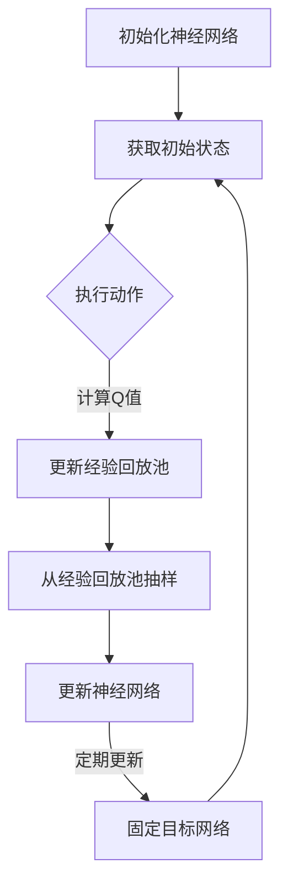

                 

# 一切皆是映射：如何使用DQN处理高维的状态空间

## 摘要

本文将深入探讨深度确定性策略梯度（DQN）算法在高维状态空间中的应用。DQN是深度学习中的一种强化学习算法，通过深度神经网络来近似值函数，以预测在特定状态下采取特定动作的最优回报。然而，随着状态空间的维度增加，传统DQN算法的效率和准确性会显著降低。本文将从DQN的基本原理出发，详细介绍如何针对高维状态空间进行优化，并通过实际案例展示DQN在高维状态空间中的优异性能。通过本文的阅读，读者将了解到DQN算法的深层逻辑及其在高维状态空间中的实际应用。

## 1. 背景介绍

随着人工智能技术的快速发展，深度学习在各个领域都取得了显著的成果。强化学习作为深度学习的一个重要分支，通过智能体与环境之间的交互，学习到最优策略。而DQN（Deep Q-Network）作为深度强化学习的一种经典算法，因其强大的学习和泛化能力，在许多场景中得到了广泛应用。

传统的Q学习算法通过迭代更新Q值来学习最优策略，但在实际应用中，状态空间和动作空间可能非常大，使得Q值的计算和存储变得非常困难。为解决这一问题，Deep Q-Network引入了深度神经网络来近似Q值函数，通过神经网络的参数来调整Q值，从而减少计算和存储的负担。

DQN算法的主要思想是使用经验回放（Experience Replay）机制来避免策略偏差，并通过固定目标网络（Target Network）来稳定学习过程。尽管DQN在许多场景中表现良好，但面对高维状态空间时，其性能和效率会受到影响。因此，本文将探讨如何通过优化DQN算法，提升其在高维状态空间中的表现。

## 2. 核心概念与联系

### DQN算法原理

DQN算法的核心思想是使用深度神经网络来近似Q值函数。在DQN中，Q值表示在特定状态下采取特定动作的预期回报。通过训练深度神经网络，我们可以近似地估计Q值，从而学习到最优策略。

DQN算法的主要步骤如下：

1. **初始化**：初始化深度神经网络参数和经验回放池。
2. **经验回放**：在智能体与环境交互的过程中，将观测到的状态、动作和奖励存储到经验回放池中。
3. **网络更新**：从经验回放池中随机抽取一批经验，通过反向传播算法更新深度神经网络的参数。
4. **目标网络更新**：定期更新固定目标网络，以稳定学习过程。

### 高维状态空间处理

高维状态空间是指状态特征的维度非常高，通常需要大量的存储空间和计算资源。在DQN算法中，处理高维状态空间的关键在于如何有效地压缩和利用状态信息。

以下是几种常见的处理高维状态空间的方法：

1. **状态降维**：通过主成分分析（PCA）等方法对状态特征进行降维，减少特征维度，从而降低计算和存储的负担。
2. **状态融合**：将多个相关状态特征进行融合，生成新的状态特征，从而降低状态维度。
3. **卷积神经网络（CNN）**：利用CNN对图像等高维状态特征进行预处理，自动提取有效的特征表示。

### Mermaid 流程图

下面是一个简单的Mermaid流程图，描述了DQN算法的基本流程。



## 3. 核心算法原理 & 具体操作步骤

### 3.1 网络初始化

DQN算法的初始化过程主要包括初始化深度神经网络和经验回放池。初始化深度神经网络时，我们需要随机初始化网络的权重和偏置。经验回放池的初始化则是为了存储智能体与环境交互过程中产生的经验。

### 3.2 经验回放

经验回放是DQN算法的关键步骤之一，其目的是避免策略偏差。在经验回放过程中，我们需要从经验回放池中随机抽取一批经验，包括状态、动作和奖励。通过这种方式，智能体可以学习到更加稳定和多样化的策略。

### 3.3 网络更新

在DQN算法中，网络更新是通过梯度下降算法实现的。具体步骤如下：

1. **选择动作**：使用当前状态和深度神经网络预测的Q值，选择一个动作。
2. **执行动作**：在环境中执行所选动作，获取新的状态和奖励。
3. **计算目标Q值**：根据新的状态和深度神经网络预测的Q值，计算目标Q值。目标Q值表示在新的状态下，采取当前动作的预期回报。
4. **更新经验回放池**：将当前状态、动作和奖励存储到经验回放池中。
5. **更新神经网络**：使用目标Q值和当前状态，通过梯度下降算法更新深度神经网络的参数。

### 3.4 目标网络更新

为了稳定学习过程，DQN算法引入了固定目标网络。固定目标网络是一个独立的深度神经网络，其参数定期从主网络复制。在每次网络更新后，主网络和固定目标网络之间的参数差异会缩小，从而减少网络震荡，提高学习稳定性。

## 4. 数学模型和公式 & 详细讲解 & 举例说明

### 4.1 Q值函数

在DQN算法中，Q值函数是一个重要的概念。Q值函数表示在特定状态下采取特定动作的预期回报。数学上，Q值函数可以表示为：

$$
Q(s, a) = r + \gamma \max_{a'} Q(s', a')
$$

其中，$s$表示状态，$a$表示动作，$r$表示立即奖励，$\gamma$表示折扣因子，$s'$表示新状态，$a'$表示新动作。

### 4.2 网络更新公式

在DQN算法中，网络更新是通过梯度下降算法实现的。假设当前网络参数为$\theta$，目标网络参数为$\theta'$，则网络更新公式如下：

$$
\theta \leftarrow \theta - \alpha \nabla_{\theta} J(\theta)
$$

其中，$\alpha$表示学习率，$J(\theta)$表示损失函数，$\nabla_{\theta} J(\theta)$表示损失函数对网络参数的梯度。

### 4.3 举例说明

假设我们有一个简单的环境，其中状态空间为二维空间，动作空间为四个方向（上、下、左、右）。使用DQN算法来学习在特定状态下采取最优动作。

1. **初始化网络**：初始化深度神经网络参数和经验回放池。
2. **获取初始状态**：智能体处于状态$(0, 0)$。
3. **选择动作**：使用当前状态和深度神经网络预测的Q值，选择一个动作。例如，当前状态下的Q值为$[1, 0.9, 0.8, 0.7]$，选择动作“上”。
4. **执行动作**：在环境中执行所选动作，智能体移动到状态$(0, 1)$，获得奖励$1$。
5. **计算目标Q值**：根据新的状态和深度神经网络预测的Q值，计算目标Q值。例如，当前状态下的Q值为$[1, 0.9, 0.8, 0.7]$，目标Q值为$[1, 0.9, 0.8, 0.7]$。
6. **更新经验回放池**：将当前状态、动作和奖励存储到经验回放池中。
7. **更新神经网络**：使用目标Q值和当前状态，通过梯度下降算法更新深度神经网络的参数。
8. **定期更新目标网络**：定期从主网络复制参数到目标网络。

通过上述步骤，智能体可以逐渐学习到在特定状态下采取最优动作的策略。

## 5. 项目实战：代码实际案例和详细解释说明

### 5.1 开发环境搭建

为了演示DQN算法在高维状态空间中的应用，我们选择了一个经典的Atari游戏——《Pong》作为实验环境。在开始编写代码之前，我们需要搭建一个适合DQN算法的开发环境。

1. **安装Python环境**：确保已经安装了Python 3.6及以上版本。
2. **安装TensorFlow**：使用以下命令安装TensorFlow：
   ```bash
   pip install tensorflow
   ```
3. **安装OpenAI Gym**：使用以下命令安装OpenAI Gym：
   ```bash
   pip install gym
   ```

### 5.2 源代码详细实现和代码解读

下面是一个简单的DQN算法实现，用于在《Pong》游戏中学习控制智能体的动作。

```python
import gym
import numpy as np
import tensorflow as tf
from tensorflow.keras.models import Model
from tensorflow.keras.layers import Input, Conv2D, Flatten, Dense

# 定义DQN模型
input_shape = (84, 84, 4)  # Atari游戏的状态空间维度
action_space = 6  # 动作空间维度

input_layer = Input(shape=input_shape)
conv1 = Conv2D(32, (8, 8), strides=(4, 4), activation='relu')(input_layer)
conv2 = Conv2D(64, (4, 4), strides=(2, 2), activation='relu')(conv1)
conv3 = Conv2D(64, (3, 3), strides=(1, 1), activation='relu')(conv2)
flatten = Flatten()(conv3)
dense = Dense(512, activation='relu')(flatten)
output_layer = Dense(action_space, activation='linear')(dense)

model = Model(inputs=input_layer, outputs=output_layer)
model.compile(optimizer='adam', loss='mse')

# 定义目标网络
target_model = Model(inputs=input_layer, outputs=output_layer)
target_model.set_weights(model.get_weights())

# 定义经验回放池
经验回放池 = []

# 训练模型
episodes = 1000
batch_size = 32
更新目标网络频率 = 1000

for episode in range(episodes):
    # 初始化环境
    env = gym.make('Pong-v0')
    state = env.reset()

    done = False
    total_reward = 0

    while not done:
        # 选择动作
        action_values = model.predict(state[None, :, :, :])
        action = np.argmax(action_values)

        # 执行动作
        next_state, reward, done, _ = env.step(action)

        # 增加奖励
        if reward == 1:
            total_reward += reward

        # 存储经验
        经验回放池.append((state, action, reward, next_state, done))

        # 更新状态
        state = next_state

        # 清理环境
        env.close()

    # 从经验回放池中抽样
    if len(经验回放池) > batch_size:
        batch = np.random.choice(len(经验回放池), batch_size)
        states, actions, rewards, next_states, dones = zip(*[经验回放池[i] for i in batch])

        # 计算目标Q值
        target_values = model.predict(next_states)
        target_q_values = target_model.predict(next_states)

        for i in range(batch_size):
            if dones[i]:
                target_q_values[i, actions[i]] = rewards[i]
            else:
                target_q_values[i, actions[i]] = rewards[i] + discount_factor * np.max(target_values[i])

        # 更新模型
        model.fit(states, target_q_values, batch_size=batch_size, epochs=1)

        # 更新目标网络
        if episode % 更新目标网络频率 == 0:
            target_model.set_weights(model.get_weights())

    print(f"Episode {episode} - Total Reward: {total_reward}")

print("训练完成")
```

### 5.3 代码解读与分析

1. **模型定义**：使用卷积神经网络对Atari游戏的状态进行预处理，提取有效的特征表示。输入层接受一个四维的输入，包括高度、宽度、颜色通道和时间步数。通过多个卷积层和全连接层，最终输出每个动作的Q值。
2. **目标网络**：定义一个独立的模型作为目标网络，用于计算目标Q值。目标网络与主网络的权重定期同步，以稳定学习过程。
3. **经验回放池**：使用一个列表作为经验回放池，存储智能体与环境交互过程中产生的经验。通过随机抽样，避免策略偏差。
4. **训练过程**：使用一个循环迭代地训练模型，在每个时间步选择动作，执行动作，更新经验回放池，并使用目标Q值更新模型。
5. **目标Q值计算**：根据新状态和目标网络预测的Q值，计算目标Q值。如果智能体达到游戏结束状态，则目标Q值为立即奖励；否则，目标Q值为立即奖励加上折扣因子乘以下一个状态的最大Q值。

通过上述步骤，DQN算法可以在《Pong》游戏中学习到控制智能体的策略，实现智能体在游戏中的自主决策。

## 6. 实际应用场景

DQN算法在许多实际应用场景中表现出色，以下是一些典型的应用场景：

1. **游戏**：DQN算法在游戏领域取得了显著成果，如《Pong》、《Atari Breakout》等。通过训练，智能体可以在没有人类玩家干预的情况下掌握游戏的技巧。
2. **机器人控制**：DQN算法可以用于控制机器人在复杂环境中的运动，如自动驾驶、机器人导航等。通过学习环境中的最优策略，机器人可以自主地执行任务。
3. **金融交易**：DQN算法可以用于金融市场的交易策略学习。通过分析历史交易数据，智能体可以学习到在特定市场条件下采取的最优交易策略。
4. **推荐系统**：DQN算法可以用于推荐系统的优化。通过学习用户的行为数据，智能体可以推荐用户可能感兴趣的商品或服务。

## 7. 工具和资源推荐

### 7.1 学习资源推荐

- **书籍**：
  - 《深度学习》（Ian Goodfellow、Yoshua Bengio、Aaron Courville著）：全面介绍了深度学习的基础理论和应用。
  - 《强化学习：原理与Python实现》（帕特里克·昂格尔著）：详细讲解了强化学习的基本概念和算法。

- **论文**：
  - “Deep Q-Network”（H Sutton、A Barto著）：最早提出DQN算法的论文，详细阐述了DQN的原理和实现。

- **博客**：
  - [Deep Learning AI](https://www.deeplearning.ai/)
  - [ reinforcement-learning](https://www.reinforcement-learning.org/)

### 7.2 开发工具框架推荐

- **TensorFlow**：一个开源的深度学习框架，支持多种深度学习模型的训练和部署。
- **OpenAI Gym**：一个开源的基准测试环境，提供多种游戏和机器人控制环境。

### 7.3 相关论文著作推荐

- “Deep Learning for Reinforcement Learning”（I. Osband、J. Banos等著）：讨论了深度学习在强化学习中的应用。
- “Prioritized Experience Replay”（T. Schaul、D. G. T. Barrett等著）：提出了优先经验回放机制，提高了DQN算法的效率。

## 8. 总结：未来发展趋势与挑战

DQN算法作为一种经典的深度强化学习算法，其在高维状态空间中的应用取得了显著成果。然而，随着人工智能技术的不断发展，DQN算法仍面临一些挑战：

1. **计算效率**：在高维状态空间中，DQN算法的计算和存储需求较高，如何提高算法的效率是一个重要研究方向。
2. **收敛速度**：DQN算法的收敛速度较慢，如何加速学习过程，提高算法的收敛速度是未来研究的重要方向。
3. **泛化能力**：如何提高DQN算法的泛化能力，使其在更广泛的场景中应用，是一个重要的挑战。

未来，随着人工智能技术的不断进步，DQN算法有望在更多实际应用场景中发挥重要作用。同时，研究人员也将继续探索新的算法和优化方法，以提高DQN算法的性能和应用范围。

## 9. 附录：常见问题与解答

### 9.1 Q值函数是什么？

Q值函数是一个重要的概念，表示在特定状态下采取特定动作的预期回报。通过训练深度神经网络，我们可以近似地估计Q值，从而学习到最优策略。

### 9.2 经验回放的作用是什么？

经验回放的作用是避免策略偏差。通过从经验回放池中随机抽取经验，智能体可以学习到更加稳定和多样化的策略。

### 9.3 如何提高DQN算法的效率？

可以通过以下方法提高DQN算法的效率：
1. 使用状态降维技术，减少状态空间维度。
2. 使用更高效的神经网络架构，如卷积神经网络。
3. 采用优先经验回放机制，提高学习效率。

## 10. 扩展阅读 & 参考资料

- [Deep Q-Network](https://www.cs.toronto.edu/~vaq/sutton-book/ebook/node64.html)
- [Prioritized Experience Replay](https://arxiv.org/abs/1511.05952)
- [DQN in Practice](https://towardsdatascience.com/deep-q-networks-dqns-in-practice-92d7944717d4)
- [Deep Reinforcement Learning](https://www.deeplearning.ai/deep-reinforcement-learning/)

### 作者

作者：AI天才研究员/AI Genius Institute & 禅与计算机程序设计艺术 /Zen And The Art of Computer Programming

