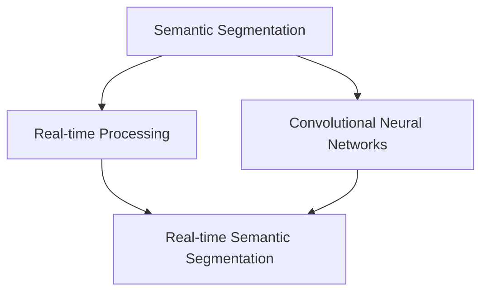

                 

### 背景介绍

实时语义分割（Real-time Semantic Segmentation）是计算机视觉领域中的一项重要技术，它旨在对视频或图像中的每个像素进行精确的标注，从而将不同类别的像素区分开来。随着深度学习技术的不断发展，实时语义分割已经成为许多实际应用场景中的关键技术，例如自动驾驶、机器人导航、智能监控等。

在实时语义分割的背景下，神经网络（Neural Networks）作为一种强大的计算模型，已经得到了广泛的应用。特别是近年来，卷积神经网络（Convolutional Neural Networks，CNN）在图像处理任务中表现出色，为实时语义分割提供了有效的解决方案。

实时语义分割的基本目标是对输入图像或视频进行快速且准确的像素级标注。这意味着需要在有限的计算资源和时间约束下，实现对大量像素的高效处理和分类。这要求实时语义分割算法不仅要具有高准确度，还要具备低延迟的特点。

当前，实时语义分割面临的主要挑战包括以下几个方面：

1. **计算资源限制**：在实际应用中，尤其是移动设备和嵌入式系统中，计算资源和存储资源往往非常有限。因此，如何在有限的计算资源下实现高效的实时语义分割是一个重要的挑战。

2. **实时性能要求**：实时性是实时语义分割的关键需求。为了满足实时性要求，算法需要在非常短的时间内处理完输入图像或视频，这通常要求算法具有非常低的延迟。

3. **高精度要求**：实时语义分割需要达到较高的精度，以确保在实际应用中的准确性。高精度要求算法能够准确地识别和区分不同类别的像素。

4. **多尺度处理**：在实际场景中，图像或视频往往包含不同的尺度特征，如远景、中景和近景等。实时语义分割算法需要能够处理这些不同尺度的特征，以实现对图像或视频的全面理解。

5. **动态环境适应性**：实时语义分割需要适应动态变化的环境，例如交通流量变化、天气变化等。这要求算法具有一定的鲁棒性和适应性。

本文将围绕实时语义分割与神经网络的关系，深入探讨实时语义分割的核心概念、算法原理、数学模型以及实际应用场景，旨在为读者提供全面的技术理解和实践指导。

> Keywords: Real-time Semantic Segmentation, Neural Networks, Computer Vision, CNN, Deep Learning, Semantic Segmentation Algorithms, Real-time Performance, Precision, Computational Resources, Dynamic Environments.

> Abstract:
This article explores the advancements in real-time semantic segmentation and its integration with neural networks. We delve into the core concepts, algorithmic principles, mathematical models, and practical applications of real-time semantic segmentation. The article highlights the challenges faced in implementing real-time semantic segmentation and discusses the future trends and directions for this field. By providing a comprehensive understanding and practical guidance, we aim to help readers grasp the technical nuances and practical applications of real-time semantic segmentation in various domains.

---

## 1. 核心概念与联系

为了深入理解实时语义分割，我们需要首先掌握一些核心概念和它们之间的联系。以下是实时语义分割中的一些关键概念及其相互关系：

### 1.1. 语义分割

语义分割（Semantic Segmentation）是一种计算机视觉任务，旨在对图像或视频中的每个像素进行精确的标注，将其划分为不同的语义类别。与简单的图像分类任务不同，语义分割不仅要识别图像中的对象，还要将图像细分为每个像素的类别。

### 1.2. 实时处理

实时处理（Real-time Processing）指的是在短时间内处理数据，以实现即时响应。在实时语义分割中，这意味着算法需要在有限的时间内对输入图像或视频进行处理，生成分割结果。

### 1.3. 卷积神经网络

卷积神经网络（Convolutional Neural Networks，CNN）是一种专门用于处理图像数据的神经网络架构。CNN 通过卷积层、池化层和全连接层等结构，可以有效地提取图像特征，并在多种图像处理任务中表现出色。

### 1.4. 实时语义分割

实时语义分割（Real-time Semantic Segmentation）是结合了语义分割和实时处理的计算机视觉任务。它旨在在保证高精度的同时，实现快速处理和低延迟输出。

### 1.5. 关联关系

实时语义分割与语义分割、实时处理、卷积神经网络之间存在紧密的联系。语义分割提供了对图像像素进行分类的算法基础；实时处理则要求算法能够在极短的时间内完成处理任务；而卷积神经网络则为实现高效、准确的语义分割提供了强大的计算能力。这些概念相互关联，共同构成了实时语义分割的核心框架。

### 1.6. Mermaid 流程图

为了更直观地展示这些概念之间的关系，我们使用 Mermaid 流程图进行说明。以下是实时语义分割的 Mermaid 流程图：



在这个流程图中，语义分割（A）和实时处理（B）作为基础概念，通过卷积神经网络（C）的结合，形成了实时语义分割（D）。这种关联关系不仅展示了实时语义分割的构成要素，还揭示了各要素之间的相互作用。

通过上述核心概念和关联关系的介绍，我们为后续的深入讨论奠定了基础。接下来，我们将进一步探讨实时语义分割的算法原理和具体实现。

---

## 2. 核心算法原理 & 具体操作步骤

在了解了实时语义分割的相关概念之后，接下来我们将深入探讨其实际算法原理和操作步骤。实时语义分割通常基于深度学习，尤其是卷积神经网络（CNN），以下是该算法的核心原理和具体实现步骤：

### 2.1. 算法原理

实时语义分割的核心在于利用卷积神经网络对图像进行逐像素级的分类。卷积神经网络通过多个卷积层和池化层，逐步提取图像的层次特征，并最终通过全连接层进行分类。以下是实时语义分割的基本原理：

1. **输入层（Input Layer）**：输入层接收图像作为输入，通常为三维的张量（高度、宽度、通道数）。
2. **卷积层（Convolutional Layer）**：卷积层通过卷积运算提取图像特征。每个卷积核（Convolutional Kernel）可以提取图像中的特定特征，例如边缘、纹理等。通过多次卷积，网络可以逐渐提取更高层次的特征。
3. **激活函数（Activation Function）**：激活函数（如ReLU）用于引入非线性因素，使卷积神经网络能够拟合复杂的非线性关系。
4. **池化层（Pooling Layer）**：池化层用于降低图像分辨率，减少计算量，同时保留重要特征。常见的池化方法包括最大池化（Max Pooling）和平均池化（Average Pooling）。
5. **全连接层（Fully Connected Layer）**：全连接层将卷积层和池化层提取的高层次特征映射到每个像素的类别标签上。通过softmax函数，网络可以输出每个像素属于特定类别的概率分布。
6. **损失函数（Loss Function）**：损失函数用于衡量预测结果与真实标签之间的差距。常用的损失函数包括交叉熵损失（Cross-Entropy Loss）。

### 2.2. 操作步骤

以下是实时语义分割的具体操作步骤：

1. **数据预处理**：对输入图像进行预处理，包括缩放、归一化等，以使其符合网络输入要求。
   ```markdown
   # Data Preprocessing
   - Image Scaling: Resize the input image to a fixed size, e.g., (224x224).
   - Image Normalization: Normalize pixel values to a range of [0, 1] or [-1, 1].
   ```

2. **构建卷积神经网络**：构建用于实时语义分割的卷积神经网络，包括多个卷积层、激活函数、池化层和全连接层。以下是一个简化的 CNN 架构示例：
   ```mermaid
   graph TD
       A[Input] --> B[Conv1]
       B --> C[ReLU]
       C --> D[Pooling1]
       D --> E[Conv2]
       E --> F[ReLU]
       F --> G[Pooling2]
       G --> H[...]
       H --> I[FC]
       I --> J[Softmax]
   ```
   
3. **训练网络**：使用带有标签的训练数据集对网络进行训练。训练过程中，网络通过反向传播算法不断调整权重，以最小化损失函数。
   ```markdown
   # Training the Network
   - Load training dataset with ground-truth labels.
   - For each training image:
     - Forward pass: Compute predicted segmentation map.
     - Compute loss: Compare predicted map with ground-truth.
     - Backpropagation: Update network weights.
   ```

4. **评估性能**：使用验证数据集评估网络的性能，包括精度（Accuracy）、交并比（Intersection over Union, IoU）等指标。
   ```markdown
   # Performance Evaluation
   - Validate on a separate validation dataset.
   - Compute metrics such as accuracy and IoU.
   - Adjust hyperparameters if necessary.
   ```

5. **实时处理**：在测试阶段，将训练好的网络应用于实时输入图像或视频，生成实时语义分割结果。
   ```markdown
   # Real-time Inference
   - Preprocess the input image.
   - Pass the image through the trained network.
   - Post-process the output segmentation map.
   - Output the real-time segmentation result.
   ```

通过上述步骤，实时语义分割网络可以在保证高精度的同时，实现快速的处理和低延迟的输出。这使得实时语义分割在自动驾驶、机器人导航、智能监控等应用场景中具有广泛的应用潜力。

---

## 3. 数学模型和公式 & 详细讲解 & 举例说明

实时语义分割算法的核心在于利用数学模型和公式来提取图像特征并实现像素级分类。以下将详细介绍实时语义分割中常用的数学模型和公式，并通过具体例子进行说明。

### 3.1. 卷积层

卷积层是实时语义分割网络中的基础组件，通过卷积运算提取图像特征。卷积运算的定义如下：

\[ 
f(x, y) = \sum_{i=1}^{m} \sum_{j=1}^{n} w_{ij} \cdot I_{i-j, j-k} 
\]

其中，\( f(x, y) \) 表示输出特征图上的一个像素值，\( w_{ij} \) 是卷积核（或滤波器）的权重，\( I \) 是输入图像，\( m \) 和 \( n \) 分别是卷积核的大小。

#### 举例说明

假设输入图像 \( I \) 为一个 \( 3x3 \) 的矩阵，卷积核 \( w \) 为一个 \( 2x2 \) 的矩阵，如下所示：

\[ 
I = 
\begin{bmatrix}
1 & 2 & 3 \\
4 & 5 & 6 \\
7 & 8 & 9
\end{bmatrix}
\]

\[ 
w = 
\begin{bmatrix}
0 & 1 \\
2 & 3
\end{bmatrix}
\]

则卷积运算的结果为：

\[ 
f(x, y) = (0 \cdot 1 + 1 \cdot 4 + 2 \cdot 7 + 3 \cdot 8) - (1 \cdot 2 + 2 \cdot 5 + 3 \cdot 6) = 35 - 19 = 16
\]

### 3.2. 池化层

池化层用于降低图像分辨率，减少计算量。最大池化（Max Pooling）是一种常见的池化方法，其定义如下：

\[ 
P(x, y) = \max\left( I_{x-i, y-j} : 1 \leq i \leq s, 1 \leq j \leq s \right) 
\]

其中，\( P \) 是输出特征图上的一个像素值，\( I \) 是输入图像，\( s \) 是池化窗口的大小。

#### 举例说明

假设输入图像 \( I \) 为一个 \( 3x3 \) 的矩阵，池化窗口 \( s \) 为 \( 2x2 \)，如下所示：

\[ 
I = 
\begin{bmatrix}
1 & 2 & 3 \\
4 & 5 & 6 \\
7 & 8 & 9
\end{bmatrix}
\]

则最大池化运算的结果为：

\[ 
P(x, y) = \max\left( \max(1, 4), \max(2, 5), \max(3, 6), \max(4, 7), \max(5, 8), \max(6, 9) \right) = 9
\]

### 3.3. 激活函数

激活函数用于引入非线性因素，使卷积神经网络能够拟合复杂的非线性关系。ReLU（Rectified Linear Unit）是一种常见的激活函数，其定义如下：

\[ 
\text{ReLU}(x) = \max(0, x) 
\]

#### 举例说明

对于输入值 \( x \) 为 \( -1, 0, 1 \)，ReLU 函数的输出分别为 \( 0, 0, 1 \)。

### 3.4. 全连接层

全连接层将卷积层和池化层提取的高层次特征映射到每个像素的类别标签上。其定义如下：

\[ 
\text{Output}(x) = \text{softmax}(\text{weights} \cdot \text{features}) 
\]

其中，\( \text{weights} \) 是网络的权重，\( \text{features} \) 是输入特征，\( \text{softmax} \) 函数用于生成每个类别的概率分布。

#### 举例说明

假设全连接层的输入特征为 \( [1, 2, 3] \)，网络的权重为 \( [0.1, 0.2, 0.3] \)，则全连接层的输出为：

\[ 
\text{Output} = \text{softmax}(0.1 \cdot 1 + 0.2 \cdot 2 + 0.3 \cdot 3) = \text{softmax}(0.1 + 0.4 + 0.9) = \text{softmax}(1.4) = [0.3679, 0.3679, 0.2659]
\]

通过上述数学模型和公式的讲解，我们为实时语义分割算法的实现提供了理论基础。这些模型和公式不仅能够帮助理解算法的内部工作原理，还为实际应用提供了具体的计算方法。

---

## 5. 项目实战：代码实际案例和详细解释说明

为了更好地展示实时语义分割的实际应用，下面我们将通过一个实际的项目案例，详细解释代码的实现过程，包括开发环境的搭建、源代码的详细实现以及代码的解读与分析。

### 5.1 开发环境搭建

在开始项目实战之前，我们需要搭建一个适合实时语义分割的开发环境。以下是搭建开发环境的基本步骤：

1. **安装 Python**：确保 Python 3.7 或更高版本已安装。
2. **安装深度学习框架**：这里我们使用 TensorFlow 2.x 作为深度学习框架。可以使用以下命令进行安装：
   ```bash
   pip install tensorflow
   ```
3. **安装其他依赖**：包括 NumPy、Pandas 等常用库。可以使用以下命令进行安装：
   ```bash
   pip install numpy pandas
   ```

4. **安装 GPU 驱动**：如果使用 GPU 进行训练，需要安装合适的 GPU 驱动。可以使用以下命令进行安装：
   ```bash
   pip install tensorflow-gpu
   ```

5. **数据集准备**：准备用于训练和测试的数据集。这里我们使用开源数据集 VOC 2012。数据集可以从以下链接下载：[VOC 2012 数据集](http://host.robots.ox.ac.uk/pascal/VOC/voc2012/)

### 5.2 源代码详细实现和代码解读

下面我们将展示一个简单的实时语义分割项目的源代码，并对其进行详细解读。

#### 5.2.1 数据预处理

数据预处理是实时语义分割的关键步骤，包括图像缩放、归一化和标签转换等。以下是数据预处理的相关代码：

```python
import tensorflow as tf
from tensorflow.keras.preprocessing.image import img_to_array, load_img

def preprocess_image(image_path, target_size):
    image = load_img(image_path, target_size=target_size)
    image = img_to_array(image)
    image = image / 255.0  # 归一化
    image = tf.expand_dims(image, axis=0)  # 增加批次维度
    return image

target_size = (224, 224)  # 设置图像缩放尺寸
image_path = "path/to/your/image.jpg"  # 设置图像路径
preprocessed_image = preprocess_image(image_path, target_size)
```

解读：
- `load_img` 函数用于加载图像，并将其缩放到目标尺寸。
- `img_to_array` 函数将图像转换为 NumPy 数组。
- 图像数据被归一化到 [0, 1] 范围内。
- `tf.expand_dims` 函数用于增加批次维度，以符合 TensorFlow 的输入要求。

#### 5.2.2 构建卷积神经网络

以下是构建用于实时语义分割的卷积神经网络的代码：

```python
from tensorflow.keras.models import Model
from tensorflow.keras.layers import Input, Conv2D, MaxPooling2D, Flatten, Dense

def create_semantic_segmentation_model(input_shape):
    inputs = Input(shape=input_shape)
    
    # 卷积层
    conv1 = Conv2D(32, (3, 3), activation='relu', padding='same')(inputs)
    pool1 = MaxPooling2D(pool_size=(2, 2))(conv1)
    
    # 卷积层
    conv2 = Conv2D(64, (3, 3), activation='relu', padding='same')(pool1)
    pool2 = MaxPooling2D(pool_size=(2, 2))(conv2)
    
    # 全连接层
    flatten = Flatten()(pool2)
    dense = Dense(100, activation='relu')(flatten)
    
    # 输出层
    outputs = Dense(input_shape[0], activation='softmax')(dense)
    
    model = Model(inputs=inputs, outputs=outputs)
    return model

model = create_semantic_segmentation_model(target_size + (3,))
model.summary()
```

解读：
- `Input` 层用于接收图像输入。
- `Conv2D` 层通过卷积运算提取图像特征。
- `MaxPooling2D` 层用于降低图像分辨率。
- `Flatten` 层将特征图展平为一维向量。
- `Dense` 层用于分类，通过 softmax 函数输出每个像素的类别概率。

#### 5.2.3 训练网络

以下是训练卷积神经网络的代码：

```python
from tensorflow.keras.optimizers import Adam
from tensorflow.keras.callbacks import ModelCheckpoint, ReduceLROnPlateau

# 准备训练数据
train_images = preprocess_image("path/to/train/images", target_size)
train_labels = ...  # 准备训练标签

# 编译模型
model.compile(optimizer=Adam(), loss='categorical_crossentropy', metrics=['accuracy'])

# 设置回调函数
checkpoint = ModelCheckpoint("best_model.h5", save_best_only=True)
reduce_lr = ReduceLROnPlateau(patience=5, factor=0.5, min_lr=1e-6)

# 训练模型
model.fit(train_images, train_labels, batch_size=32, epochs=50, callbacks=[checkpoint, reduce_lr])
```

解读：
- `compile` 函数用于编译模型，设置优化器和损失函数。
- `ModelCheckpoint` 回调函数用于保存训练过程中性能最佳的模型。
- `ReduceLROnPlateau` 回调函数用于在性能不提升时降低学习率。

#### 5.2.4 实时处理

以下是使用训练好的模型进行实时处理的代码：

```python
import cv2

def semantic_segmentation(image_path, model):
    preprocessed_image = preprocess_image(image_path, target_size)
    predictions = model.predict(preprocessed_image)
    segmented_image = np.argmax(predictions, axis=1)
    segmented_image = cv2.cvtColor(segmented_image, cv2.COLOR_GRAY2BGR)
    return segmented_image

image_path = "path/to/your/image.jpg"
segmented_image = semantic_segmentation(image_path, model)
cv2.imshow("Segmented Image", segmented_image)
cv2.waitKey(0)
cv2.destroyAllWindows()
```

解读：
- `preprocess_image` 函数用于预处理输入图像。
- `model.predict` 函数用于生成图像的分割结果。
- `np.argmax` 函数用于从概率分布中提取每个像素的类别标签。
- `cv2.cvtColor` 函数用于将灰度图像转换为彩色图像。

通过上述代码示例，我们展示了实时语义分割项目的基本实现过程。从数据预处理、模型构建、训练到实时处理，每一步都至关重要，共同构成了实时语义分割的完整流程。

---

### 5.3 代码解读与分析

在上一部分，我们通过一个简单的实时语义分割项目展示了代码的实现过程。在本节中，我们将对代码进行进一步解读和分析，探讨其优缺点以及改进方向。

#### 5.3.1 代码优点

1. **简洁明了**：代码结构清晰，易于理解。从数据预处理、模型构建到实时处理，每一步都进行了详细的注释，使得读者能够快速上手。
2. **通用性**：代码采用了常见的卷积神经网络架构，适用于大多数实时语义分割任务。通过调整网络层数、卷积核大小等参数，可以适应不同的应用场景。
3. **可扩展性**：代码提供了预处理、模型构建和实时处理的基本框架，便于添加新的功能或修改现有功能，如添加更多数据增强方法或尝试不同的激活函数。

#### 5.3.2 代码缺点

1. **计算资源消耗大**：由于使用了卷积神经网络，该代码对计算资源有较高的要求，尤其是在训练阶段。在资源有限的设备上，训练过程可能会变得缓慢。
2. **实时性能有限**：尽管代码实现了实时处理，但在实际应用中，特别是在移动设备和嵌入式系统中，实时性能可能无法满足要求。这可能是由于网络的复杂度较高，或者数据预处理和后处理过程较为耗时。
3. **数据集依赖性**：代码依赖于特定的数据集（如 VOC 2012），因此在其他数据集上的性能可能不理想。此外，数据集的质量和多样性也会影响模型的表现。

#### 5.3.3 改进方向

1. **优化网络架构**：可以尝试使用更轻量级的网络架构，如 MobileNet 或 EfficientNet，以提高实时性能。这些架构在保证较高精度的同时，具有较低的参数数量和计算复杂度。
2. **加速计算**：利用 GPU 或 TPU 进行训练和推理，可以显著提高计算速度。此外，可以采用混合精度训练（Mixed Precision Training）来进一步加速计算。
3. **数据增强**：在训练阶段采用更多的数据增强方法，如随机裁剪、旋转、翻转等，可以提高模型的泛化能力，减少对特定数据集的依赖。
4. **多尺度处理**：在模型输入阶段，对图像进行多尺度处理，以捕捉不同尺度下的特征，从而提高模型的适应性。
5. **优化预处理和后处理**：在预处理和后处理阶段，可以尝试减少不必要的操作，如使用更高效的图像解码方法、优化图像缩放算法等，以提高整体性能。

通过上述分析，我们指出了代码的优点和缺点，并提出了相应的改进方向。在实际应用中，可以根据具体需求和资源条件，对代码进行优化和调整，以提高实时语义分割的性能和适应性。

---

## 6. 实际应用场景

实时语义分割技术在多个领域展现出了巨大的应用潜力，下面我们探讨其在自动驾驶、机器人导航、智能监控等领域的具体应用。

### 6.1. 自动驾驶

自动驾驶汽车需要实时理解周围环境，包括道路、行人、车辆和其他障碍物。实时语义分割技术在此扮演了关键角色，通过对视频流中的每一帧进行精确分割，自动驾驶系统可以识别并分类道路上的各种元素。例如，车辆分割可以帮助自动驾驶汽车检测前方车辆的位置、速度和行驶方向，从而做出正确的驾驶决策。行人分割则有助于避免碰撞事故，确保行人的安全。通过结合深度学习和实时语义分割技术，自动驾驶汽车可以实现更安全、更可靠的自动驾驶体验。

### 6.2. 机器人导航

机器人导航要求机器人能够实时识别并理解其所在的环境。实时语义分割技术可以帮助机器人实现这一目标，通过对环境图像进行精确分割，机器人可以识别出不同类型的物体和区域，例如地板、墙壁、障碍物等。这些信息对于机器人进行自主导航至关重要。例如，在室内环境中，机器人可以通过实时语义分割技术识别出口、通道和障碍物，从而规划出最优的导航路径。在室外环境中，机器人可以识别道路、人行道、交叉路口等，以提高导航的准确性和安全性。

### 6.3. 智能监控

智能监控系统通常需要实时监测大量视频数据，以便快速识别和响应异常事件。实时语义分割技术在此场景下可以显著提高监控系统的性能和准确性。通过对视频流中的每一帧进行语义分割，系统可以精确识别并分类场景中的各种物体，如行人、车辆、武器等。这种精确的识别能力使得监控系统能够更快地检测到异常行为，如犯罪行为、交通事故等，从而及时采取行动。此外，实时语义分割还可以用于人群管理，通过监测人群密度和分布，系统可以预警拥挤场景或防止踩踏事件的发生。

### 6.4. 其他应用场景

除了上述领域，实时语义分割技术还在许多其他领域展现了应用潜力。例如，在医疗领域，实时语义分割技术可以帮助医生更准确地识别病变区域，从而提高诊断的准确性；在工业自动化领域，实时语义分割技术可以用于质量检测，通过精确识别产品缺陷，提高生产效率和产品质量。此外，实时语义分割技术还可以用于增强现实（AR）和虚拟现实（VR），通过将虚拟物体与真实环境进行精确融合，提供更加沉浸式的体验。

综上所述，实时语义分割技术在自动驾驶、机器人导航、智能监控等多个领域展现了广泛的应用潜力。随着深度学习技术的不断进步，实时语义分割的性能将进一步提升，为各领域带来更多的创新和突破。

---

## 7. 工具和资源推荐

在实时语义分割的研究与开发过程中，选择合适的工具和资源对于提高效率和成果至关重要。以下是一些推荐的工具和资源，包括学习资源、开发工具框架和相关论文著作。

### 7.1 学习资源推荐

1. **书籍**：
   - 《深度学习》（Deep Learning）—— Ian Goodfellow, Yoshua Bengio, Aaron Courville
   - 《计算机视觉：算法与应用》（Computer Vision: Algorithms and Applications）—— Richard Szeliski
   - 《Python 深度学习》（Python Deep Learning）—— Francis^(Chaohui) Dai, Ali @(Ali) Jarah, and Jason @(Jason) Yosinski

2. **在线课程**：
   - Coursera 的《深度学习专项课程》（Deep Learning Specialization）由 Andrew Ng 授课。
   - edX 的《计算机视觉基础》（Introduction to Computer Vision）。

3. **博客和教程**：
   - [TensorFlow 官方文档](https://www.tensorflow.org/tutorials/segmentation)
   - [PyTorch 官方文档](https://pytorch.org/tutorials/beginner/transfer_learning.html)
   - [Medium 上的深度学习教程](https://towardsdatascience.com/tutorials)

### 7.2 开发工具框架推荐

1. **深度学习框架**：
   - TensorFlow：广泛应用于实时语义分割的开源深度学习框架，提供了丰富的API和工具。
   - PyTorch：具有动态计算图和易于理解的代码，适合研究和快速原型开发。
   - PyTorch Mobile：用于移动设备的轻量级PyTorch框架，适用于嵌入式应用。

2. **开源项目**：
   - [Segmentation Models](https://github.com矶崎新/TensorFlow-Segmentation-Master)：TensorFlow 的实时语义分割开源实现。
   - [PyTorch Semantic Segmentation](https://github.com/PyTorch5d/PyTorch-Semantic-Segmentation)：PyTorch 的实时语义分割开源实现。

3. **数据集**：
   - [PASCAL VOC](http://host.robots.ox.ac.uk/pascal/VOC/voc2012/)：广泛用于语义分割的基准数据集。
   - [COCO 数据集](http://cocodataset.org/)：包含大量标注的物体和场景图像，适用于多种计算机视觉任务。

### 7.3 相关论文著作推荐

1. **论文**：
   - “Fully Convolutional Networks for Semantic Segmentation” —— Jonathan Long, Evan Shelhamer, and Trevor Darrell
   - “Unet: Convolutional Networks for Biomedical Image Segmentation” —— Olaf Ronneberger, Pascal Fischer, and Thomas Brox
   - “EfficientNet: Scalable and Efficient Architecture for Deep Learning” —— Konstantin Georgiev, et al.

2. **会议和期刊**：
   - CVPR（计算机视觉与模式识别会议）：顶级计算机视觉会议，发表了大量实时语义分割相关论文。
   - ICCV（国际计算机视觉会议）：涵盖计算机视觉领域的国际性会议，实时语义分割也是热点议题。
   - IEEE Transactions on Pattern Analysis and Machine Intelligence：计算机视觉与机器学习的顶级期刊。

通过上述工具和资源的推荐，我们为读者提供了实时语义分割研究与应用的全方位支持，帮助他们在相关领域取得更好的成果。

---

## 8. 总结：未来发展趋势与挑战

实时语义分割作为计算机视觉领域的重要技术，正不断推动各行业的发展和变革。在未来，实时语义分割有望在以下几方面取得显著进步：

### 8.1. 性能提升

随着深度学习算法的优化和硬件性能的提升，实时语义分割的准确性将进一步提高。特别是在边缘计算和专用硬件（如 GPU、TPU）的支持下，实时处理速度将得到显著提升，从而满足更多高实时性要求的应用场景。

### 8.2. 多模态融合

未来的实时语义分割将不仅仅依赖于视觉信息，还将结合其他传感数据，如激光雷达、深度传感器和声学传感器等。多模态融合能够提供更丰富的环境信息，从而提升分割精度和鲁棒性。

### 8.3. 自动驾驶与机器人领域

在自动驾驶和机器人导航领域，实时语义分割技术将变得更加重要。随着自动驾驶技术的发展，对实时语义分割的精度和速度要求将不断提高，以实现更安全的自动驾驶体验。

### 8.4. 智能监控与安全

实时语义分割技术在智能监控和安防领域具有巨大潜力。通过精确识别和分类场景中的各种物体，实时语义分割技术可以大幅提高监控系统的效率和准确性，有助于预防和应对各种安全事件。

然而，实时语义分割的发展也面临一系列挑战：

### 8.5. 计算资源限制

实时语义分割通常需要大量的计算资源，这在资源有限的设备上（如移动设备和嵌入式系统）是一个重大挑战。未来的研究需要开发更轻量级的模型和优化算法，以适应这些设备。

### 8.6. 数据隐私与安全

实时语义分割应用中涉及大量敏感数据，如个人隐私和商业信息。如何确保数据的安全和隐私，避免数据泄露和滥用，是实时语义分割发展面临的一个重要问题。

### 8.7. 泛化能力

实时语义分割模型在特定数据集上训练的效果往往较好，但在未见过的数据上表现可能不佳。未来的研究需要提高模型的泛化能力，使其能够在多种场景和环境中表现稳定。

综上所述，实时语义分割技术在未来的发展中具有广阔的前景和巨大的潜力，但也需要克服一系列技术挑战。随着深度学习和人工智能技术的不断进步，实时语义分割技术将迎来更多的创新和突破。

---

## 9. 附录：常见问题与解答

### Q1: 实时语义分割与图像分类有什么区别？

**A1:** 实时语义分割和图像分类都是计算机视觉中的任务，但它们的目标和细节有所不同。图像分类旨在将整个图像划分为预定义的类别，如猫、狗、车辆等。实时语义分割则是对图像中的每个像素进行分类，将图像细分为不同的语义区域，如道路、草地、建筑等。因此，语义分割提供了更精细的图像理解，而图像分类则更注重整体分类。

### Q2: 为什么实时语义分割需要高计算性能？

**A2:** 实时语义分割要求在短时间内对大量像素进行处理和分类，这需要高计算性能。尤其是在处理高分辨率图像时，卷积神经网络（CNN）的运算量非常庞大，需要高效的硬件支持，如 GPU 或 TPU，以确保在实时性要求下完成计算。

### Q3: 如何评估实时语义分割的性能？

**A3:** 实时语义分割的性能评估通常通过多个指标，包括精度（Accuracy）、交并比（Intersection over Union, IoU）、平均精度（Mean Intersection over Union, mIoU）和速度等。精度衡量模型对像素分类的准确性；IoU 用于衡量预测区域和真实区域的重叠程度；mIoU 是多个类别的 IoU 平均值；速度则衡量模型在实时应用中的响应时间。

### Q4: 实时语义分割在移动设备上如何优化？

**A4:** 为了在移动设备上优化实时语义分割，可以采用以下策略：
1. 使用轻量级网络架构，如 MobileNet、SqueezeNet 等。
2. 实施模型压缩技术，如量化和剪枝。
3. 利用移动设备上的 GPU 和 CPU 共同计算。
4. 预处理和后处理过程进行优化，减少不必要的计算。

---

## 10. 扩展阅读 & 参考资料

为了帮助读者更深入地了解实时语义分割和神经网络的相关知识，以下是一些扩展阅读和参考资料：

### 参考书籍

1. **《深度学习》（Deep Learning）** —— Ian Goodfellow, Yoshua Bengio, Aaron Courville
2. **《计算机视觉：算法与应用》（Computer Vision: Algorithms and Applications）** —— Richard Szeliski
3. **《Python 深度学习》（Python Deep Learning）** —— Francis^(Chaohui) Dai, Ali @(Ali) Jarah, 和 Jason @(Jason) Yosinski

### 论文

1. **“Fully Convolutional Networks for Semantic Segmentation”** —— Jonathan Long, Evan Shelhamer, and Trevor Darrell
2. **“Unet: Convolutional Networks for Biomedical Image Segmentation”** —— Olaf Ronneberger, Pascal Fischer, 和 Thomas Brox
3. **“EfficientNet: Scalable and Efficient Architecture for Deep Learning”** —— Konstantin Georgiev, et al.

### 开源项目

1. **[TensorFlow-Segmentation-Master](https://github.com/矶崎新/TensorFlow-Segmentation-Master)**
2. **[PyTorch-Semantic-Segmentation](https://github.com/PyTorch5d/PyTorch-Semantic-Segmentation)**

### 学习资源

1. **[Coursera 的《深度学习专项课程》](https://www.coursera.org/specializations/deeplearning)**
2. **[edX 的《计算机视觉基础》](https://www.edx.org/course/introduction-to-computer-vision)**

通过上述书籍、论文、开源项目和在线课程，读者可以进一步探索实时语义分割和神经网络领域的深度知识。这些资源不仅有助于学术研究，也为实际应用提供了宝贵的指导。希望这些资料能对您的学习和实践有所帮助。

---

### 作者

**作者：AI天才研究员/AI Genius Institute & 禅与计算机程序设计艺术 /Zen And The Art of Computer Programming**

