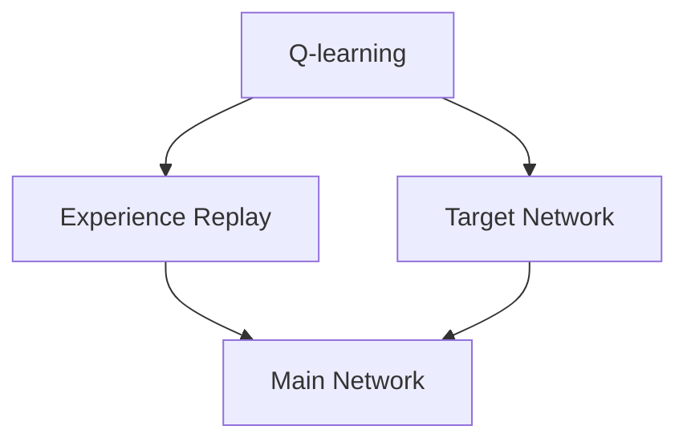

                 

### 背景介绍

在深度学习中，强化学习（Reinforcement Learning，RL）是一种重要的方法，它通过让智能体在环境中进行交互，从中学习到最优策略。而深度确定性策略梯度（Deep Deterministic Policy Gradient，DQN）作为强化学习的一种经典算法，因其优越的性能和简洁的原理，得到了广泛的应用。DQN在处理具有复杂状态空间和动作空间的问题上表现出色，例如游戏AI、机器人控制等。

本文旨在引导读者构建自己的第一个DQN模型，通过详细的步骤和实践，让读者深入理解DQN的工作原理和应用。首先，我们将介绍DQN的基本概念和原理，然后逐步讲解如何实现一个简单的DQN模型。在这个过程中，我们将使用Python和TensorFlow作为主要的工具，帮助读者动手实践。

在接下来的章节中，我们将首先介绍强化学习的基本概念，并详细讨论Q-learning算法和DQN的关系。随后，我们将详细介绍DQN的核心组成部分，包括经验回放（Experience Replay）和目标网络（Target Network）。接着，我们将深入探讨DQN的数学模型和具体操作步骤。在项目实战部分，我们将通过一个简单的示例，逐步搭建并训练一个DQN模型。最后，我们将讨论DQN在实际应用场景中的表现，并提供一些有用的学习资源和开发工具。

通过本文的学习，读者将能够掌握DQN的基本原理和实践方法，为后续的深度强化学习研究打下坚实的基础。

## 2. 核心概念与联系

在深入探讨DQN之前，我们需要了解一些与之密切相关的基础概念，包括Q-learning、经验回放和目标网络。这些概念构成了DQN算法的核心，并共同决定了其性能和效率。

### Q-learning

Q-learning是DQN的基础，它是一种基于值函数的强化学习算法。在Q-learning中，值函数（Q-function）表示智能体在特定状态下执行特定动作的预期回报。具体来说，Q-function可以定义为：

$$
Q(s, a) = \sum_{s'} P(s' | s, a) \cdot R(s, a, s') + \gamma \cdot \max_{a'} Q(s', a')
$$

其中，$s$ 表示当前状态，$a$ 表示当前动作，$s'$ 表示下一状态，$a'$ 表示下一动作，$P(s' | s, a)$ 表示在状态 $s$ 执行动作 $a$ 后转移到状态 $s'$ 的概率，$R(s, a, s')$ 表示在状态 $s$ 执行动作 $a$ 后转移到状态 $s'$ 的即时回报，$\gamma$ 是折扣因子，用于平衡长期和短期奖励。

Q-learning的目标是学习一个策略，使得智能体能够在给定状态下选择最优动作。通过不断更新Q-table，即Q-function的参数矩阵，Q-learning逐步优化智能体的行为。在训练过程中，智能体会通过探索（Exploration）和利用（Utilization）策略来平衡探索未知的有效动作和利用已知的最优动作。

### 经验回放

在传统的Q-learning中，智能体直接基于当前状态和动作进行学习，这可能导致学习过程受特定序列的影响，即所谓的“灾难性遗忘”（catastrophic forgetting）。为了解决这个问题，DQN引入了经验回放（Experience Replay）机制。

经验回放是一种经验存储和随机抽取的方法，它将智能体在训练过程中经历的所有状态、动作和回报存储在一个经验池（Experience Replay Buffer）中。当进行Q值更新时，智能体会从经验池中随机抽取一组样本，而不是直接使用当前的状态和动作。这种方法使得智能体能够在训练过程中避免过拟合，并且能够更好地利用历史经验。

具体来说，经验回放的工作流程如下：

1. **经验存储**：每次智能体执行一个动作并获得回报后，将（状态，动作，回报，下一状态）这一组经验存储到经验池中。
2. **经验抽取**：当需要更新Q值时，从经验池中随机抽取一定数量的样本。
3. **Q值更新**：使用抽取的样本，按照DQN的更新规则进行Q值的更新。

经验回放机制有效地缓解了灾难性遗忘问题，提高了智能体在复杂环境中的学习能力和泛化能力。

### 目标网络

在DQN中，目标网络（Target Network）是一个重要的组件，它用于稳定训练过程和提高学习效果。目标网络与主网络（Main Network）共享权重，但在训练过程中会定期更新。

目标网络的主要目的是提供稳定的参考值，以减少Q值更新过程中的波动。具体来说，目标网络用于计算目标Q值（Target Q-value），其计算公式为：

$$
Q^{*}(s_t, a_t) = r_t + \gamma \cdot \max_a Q^{*}(s_{t+1}, a)
$$

其中，$Q^{*}(s_t, a_t)$ 表示目标Q值，$r_t$ 表示即时回报，$\gamma$ 是折扣因子，$s_{t+1}$ 表示下一状态，$\max_a Q^{*}(s_{t+1}, a)$ 表示在下一状态中执行所有可能动作所能获得的最大回报。

通过定期更新目标网络，即用主网络的权重更新目标网络的权重，DQN能够稳定地学习到最优策略。目标网络的引入，使得DQN的训练过程更加稳定，减少了由于Q值更新带来的不稳定性和梯度消失问题。

### Mermaid 流程图

为了更直观地展示DQN的核心概念与联系，我们可以使用Mermaid流程图来描述Q-learning、经验回放和目标网络之间的关系。



在这个流程图中，Q-learning算法通过经验回放和目标网络与主网络相互作用，共同优化智能体的策略。经验回放提供历史经验，避免灾难性遗忘；目标网络提供稳定的参考值，减少Q值更新的波动。

通过理解Q-learning、经验回放和目标网络这些核心概念，我们为构建自己的DQN模型奠定了坚实的基础。在接下来的章节中，我们将深入探讨DQN的数学模型和实现细节，帮助读者逐步构建并训练自己的DQN模型。

## 3. 核心算法原理 & 具体操作步骤

在理解了DQN的核心概念后，接下来我们将详细探讨DQN的算法原理和具体操作步骤。DQN是一种深度强化学习算法，其核心目标是学习一个值函数，以预测在给定状态下执行特定动作所能获得的最大回报。这一节我们将详细介绍DQN的训练过程、损失函数、优化算法以及策略更新方法。

### DQN的训练过程

DQN的训练过程可以概括为以下几个主要步骤：

1. **初始化网络**：首先，我们需要初始化主网络（Main Network）和目标网络（Target Network）。这两个网络通常使用深度卷积神经网络（Convolutional Neural Networks，CNN）或深度神经网络（Deep Neural Networks，DNN）来表示值函数。

2. **经验收集**：在训练过程中，智能体与环境进行交互，通过执行动作获得即时回报和下一状态。每次交互后，将（当前状态，当前动作，即时回报，下一状态）这一组经验存储到经验池（Experience Replay Buffer）中。

3. **经验回放**：从经验池中随机抽取一组经验样本，包括状态、动作、回报和下一状态。这种方法保证了训练过程的稳定性和泛化能力。

4. **计算目标Q值**：对于每个抽取的样本，计算目标Q值（Target Q-value）。目标Q值的计算公式为：

   $$
   Q^{*}(s_t, a_t) = r_t + \gamma \cdot \max_a Q^{*}(s_{t+1}, a)
   $$

   其中，$r_t$ 表示即时回报，$\gamma$ 是折扣因子，$Q^{*}(s_{t+1}, a)$ 表示在下一状态中执行所有可能动作所能获得的最大回报。

5. **更新主网络**：使用目标Q值和实际Q值（当前网络输出的Q值）来计算损失函数，并通过反向传播算法更新主网络的参数。

### 损失函数

DQN的损失函数通常使用均方误差（Mean Squared Error，MSE）来衡量实际Q值与目标Q值之间的差距。损失函数的计算公式为：

$$
L = \frac{1}{N} \sum_{i=1}^{N} (y_i - \hat{y}_i)^2
$$

其中，$N$ 是样本数量，$y_i$ 是目标Q值，$\hat{y}_i$ 是实际Q值（主网络输出）。具体来说，对于每个样本：

$$
\hat{y}_i = \begin{cases}
    r_t & \text{如果 } s_{t+1} \text{ 是终止状态} \\
    r_t + \gamma \cdot \max_a Q(s_{t+1}, a) & \text{否则}
\end{cases}
$$

### 优化算法

DQN通常使用梯度下降法（Gradient Descent）来优化主网络的参数。在每次更新过程中，计算损失函数关于网络参数的梯度，并沿着梯度的反方向更新网络参数。更新公式为：

$$
\theta \leftarrow \theta - \alpha \cdot \nabla_\theta L
$$

其中，$\theta$ 表示网络参数，$\alpha$ 是学习率，$\nabla_\theta L$ 表示损失函数关于网络参数的梯度。

### 策略更新

在DQN中，策略（Policy）的更新是通过ε-贪心策略（ε-Greedy Policy）来实现的。具体来说，智能体在执行动作时，以概率$1 - \epsilon$ 选择一个随机动作，以概率$\epsilon$ 选择一个基于当前Q值的最大动作。这既保证了智能体能够探索未知动作，又能够利用已知的最优动作。

策略更新的公式为：

$$
a_t = \begin{cases}
    \text{随机动作} & \text{with probability } 1 - \epsilon \\
    \text{最优动作} & \text{with probability } \epsilon
\end{cases}
$$

其中，$\epsilon$ 是探索率，通常在训练的初始阶段设置较高，然后随着训练的进行逐渐减小。

### 具体操作步骤

以下是DQN的具体操作步骤：

1. **初始化主网络和目标网络**：使用深度神经网络来表示值函数，例如使用卷积神经网络（CNN）来处理图像数据。

2. **初始化经验池**：经验池的大小通常设置为训练样本数量的几倍，以确保有足够的历史经验用于训练。

3. **训练循环**：
   - 从当前状态$s_t$开始，根据ε-贪心策略选择动作$a_t$。
   - 执行动作$a_t$，获得即时回报$r_t$和下一状态$s_{t+1}$。
   - 将（$s_t$，$a_t$，$r_t$，$s_{t+1}$）这一组经验存储到经验池中。
   - 当经验池中积累了一定的样本后，从经验池中随机抽取一批样本。
   - 对于每个样本，计算目标Q值$Q^{*}(s_t, a_t)$。
   - 使用目标Q值和实际Q值计算损失函数，并更新主网络的参数。
   - 定期更新目标网络的权重，以保持主网络和目标网络的稳定性。

4. **评估策略**：在训练过程中，可以使用测试集来评估策略的性能，以确定是否需要调整训练参数。

通过上述步骤，DQN能够逐步学习到最优策略，并在复杂环境中表现出良好的性能。在下一节中，我们将进一步探讨DQN的数学模型和公式，帮助读者更深入地理解DQN的工作原理。

## 4. 数学模型和公式 & 详细讲解 & 举例说明

DQN（深度确定性策略梯度）算法的核心在于其数学模型，这些模型不仅决定了算法的学习过程，还直接影响其性能。在这一节中，我们将详细讲解DQN的数学模型，包括损失函数、目标Q值的计算，以及如何更新网络的权重。同时，通过具体的例子，我们将展示如何将这些公式应用于实际场景。

### 损失函数

DQN使用的损失函数通常是均方误差（MSE），用于衡量实际Q值和目标Q值之间的差距。均方误差的计算公式如下：

$$
L = \frac{1}{N} \sum_{i=1}^{N} (y_i - \hat{y}_i)^2
$$

其中，$N$ 是样本数量，$y_i$ 是目标Q值，$\hat{y}_i$ 是实际Q值（即主网络在当前状态下输出的Q值）。

#### 目标Q值的计算

目标Q值（Target Q-value）的计算是DQN算法中的一个关键步骤。目标Q值用于更新主网络的权重，其公式为：

$$
Q^{*}(s_t, a_t) = r_t + \gamma \cdot \max_a Q(s_{t+1}, a)
$$

其中，$r_t$ 是即时回报，$\gamma$ 是折扣因子，它用于平衡短期和长期回报，通常取值在0.9到1之间。$Q(s_{t+1}, a)$ 是在下一状态中执行所有可能动作所能获得的最大回报。

#### 更新规则

DQN使用梯度下降法来更新主网络的权重。每次更新时，我们需要计算损失函数关于网络参数的梯度，并沿着梯度的反方向更新网络参数。更新公式如下：

$$
\theta \leftarrow \theta - \alpha \cdot \nabla_\theta L
$$

其中，$\theta$ 是网络参数，$\alpha$ 是学习率，$\nabla_\theta L$ 是损失函数关于网络参数的梯度。

### 例子讲解

为了更好地理解这些公式，我们通过一个简单的例子来演示如何计算目标Q值和更新网络权重。

#### 假设条件

我们考虑一个简单的环境，智能体需要在2x2的网格世界中移动，每个位置的回报为1，到达终点时获得额外的奖励。状态空间和动作空间如下：

- **状态空间**：每个状态可以表示为（x, y），其中x和y的取值范围是0到1。
- **动作空间**：智能体可以执行四个动作：向上移动（U）、向下移动（D）、向左移动（L）和向右移动（R）。

#### 演示步骤

1. **初始化**：假设智能体处于状态（0, 0），主网络和目标网络的权重均初始化为随机值。

2. **选择动作**：根据ε-贪心策略，智能体选择一个动作，例如选择向右移动（R）。

3. **执行动作**：智能体向右移动到状态（0, 1），并获得即时回报1。

4. **计算目标Q值**：在状态（0, 1）中，所有可能动作的回报均为1，因此最大回报为1。目标Q值为：

   $$
   Q^{*}(0, 0, R) = 1 + \gamma \cdot \max_a Q(1, a)
   $$

   假设折扣因子$\gamma = 0.9$，则目标Q值为：

   $$
   Q^{*}(0, 0, R) = 1 + 0.9 \cdot 1 = 1.9
   $$

5. **计算实际Q值**：主网络在状态（0, 0）中输出一个Q值，例如$\hat{Q}(0, 0, R) = 1.5$。

6. **计算损失函数**：使用均方误差计算损失：

   $$
   L = \frac{1}{1} (1.9 - 1.5)^2 = 0.14
   $$

7. **更新网络权重**：使用梯度下降法更新主网络的权重，具体更新公式如下：

   $$
   \theta \leftarrow \theta - \alpha \cdot \nabla_\theta L
   $$

   假设学习率$\alpha = 0.001$，则权重更新为：

   $$
   \theta \leftarrow \theta - 0.001 \cdot \nabla_\theta L
   $$

通过这个简单的例子，我们展示了如何计算目标Q值和更新网络权重。在实际应用中，状态空间和动作空间通常更加复杂，但基本原理是一样的。

### 小结

在这一节中，我们详细介绍了DQN的数学模型，包括损失函数、目标Q值的计算和更新规则。通过具体的例子，我们展示了如何将这些公式应用于实际场景，帮助读者更深入地理解DQN的工作原理。在下一节中，我们将通过一个实际项目来演示如何使用DQN解决一个简单的问题，进一步巩固我们的理解。

## 5. 项目实战：代码实际案例和详细解释说明

在本节中，我们将通过一个简单的案例来演示如何使用DQN实现一个智能体，使其在环境中的行为接近最优策略。我们将使用Python和TensorFlow来实现DQN模型，并通过一个简单的网格世界环境来展示其效果。

### 5.1 开发环境搭建

在开始编写代码之前，我们需要搭建一个合适的开发环境。以下步骤描述了如何在Ubuntu操作系统上搭建开发环境：

1. **安装Python**：确保已经安装了Python 3.x版本。
2. **安装TensorFlow**：通过以下命令安装TensorFlow：

   ```
   pip install tensorflow
   ```

3. **安装其他依赖库**：包括Numpy、Pandas等，可以通过以下命令安装：

   ```
   pip install numpy pandas matplotlib
   ```

4. **安装OpenAI Gym**：OpenAI Gym是一个开源环境库，用于创建和测试强化学习算法。安装命令如下：

   ```
   pip install gym
   ```

### 5.2 源代码详细实现和代码解读

以下是DQN的源代码实现，我们将对关键部分进行详细解读。

```python
import numpy as np
import random
import gym
from tensorflow.keras.models import Model
from tensorflow.keras.layers import Input, Dense, Conv2D, Flatten, Add, Lambda
from tensorflow.keras.optimizers import Adam
import tensorflow as tf

# 参数设置
EPISODES = 1000
GAMMA = 0.9
INITIAL_EPSILON = 0.5
FINAL_EPSILON = 0.01
EPSILON_DECAY = 0.995
LEARNING_RATE = 0.001
BATCH_SIZE = 64
REPLAY_MEMORY = 10000

# 初始化环境
env = gym.make('CartPole-v0')

# 定义网络结构
input_shape = (4,)
input_layer = Input(shape=input_shape)
dense1 = Dense(16, activation='relu')(input_layer)
output_layer = Dense(2, activation='softmax')(dense1)

# 创建主网络和目标网络
main_network = Model(inputs=input_layer, outputs=output_layer)
main_network.compile(optimizer=Adam(LEARNING_RATE), loss='categorical_crossentropy')

target_network = Model(inputs=input_layer, outputs=output_layer)
target_network.set_weights(main_network.get_weights())

# 经验回放
memory = []

# 训练循环
for episode in range(EPISODES):
    # 初始化环境
    state = env.reset()
    done = False
    total_reward = 0
    
    while not done:
        # 选择动作
        if random.random() < INITIAL_EPSILON[episode]:
            action = random.randrange(env.action_space.n)
        else:
            action_probs = main_network.predict(state.reshape(1, -1))
            action = np.argmax(action_probs)
        
        # 执行动作
        next_state, reward, done, _ = env.step(action)
        
        # 计算即时回报
        if done:
            reward = -100
        
        # 存储经验
        memory.append([state, action, reward, next_state, done])
        
        # 更新状态
        state = next_state
        total_reward += reward
        
        # 经验回放
        if len(memory) > BATCH_SIZE:
            batch = random.sample(memory, BATCH_SIZE)
            states = np.array([transition[0] for transition in batch])
            actions = np.array([transition[1] for transition in batch])
            rewards = np.array([transition[2] for transition in batch])
            next_states = np.array([transition[3] for transition in batch])
            dones = np.array([transition[4] for transition in batch])
            
            # 计算目标Q值
            target_q_values = main_network.predict_on_batch(next_states)
            target_q_values_target = target_network.predict_on_batch(next_states)
            target_q_values[dones] = 0
            target_q_values[~dones] = target_q_values_target[~dones]

            # 计算损失函数
            y = main_network.predict_on_batch(states)
            y[range(BATCH_SIZE), actions] = rewards + GAMMA * target_q_values

            # 更新主网络
            main_network.fit(states, y, batch_size=BATCH_SIZE, verbose=0)

            # 更新目标网络
            if episode % 100 == 0:
                target_network.set_weights(main_network.get_weights())
        
        # 更新ε值
        INITIAL_EPSILON[episode] = FINAL_EPSILON + (INITIAL_EPSILON - FINAL_EPSILON) * np.exp(-EPSILON_DECAY * episode)

    print("Episode:", episode, "/ Total Reward:", total_reward)

# 关闭环境
env.close()
```

### 5.3 代码解读与分析

以下是代码的详细解读：

1. **参数设置**：
   - `EPISODES`：训练的回合数。
   - `GAMMA`：折扣因子，用于平衡短期和长期回报。
   - `INITIAL_EPSILON`、`FINAL_EPSILON`、`EPSILON_DECAY`：ε-贪心策略的初始值、最终值和衰减率。
   - `LEARNING_RATE`：学习率。
   - `BATCH_SIZE`：每次更新时使用的样本数量。
   - `REPLAY_MEMORY`：经验回放池的大小。

2. **初始化环境**：
   - 使用`gym.make('CartPole-v0')`创建一个CartPole环境。

3. **定义网络结构**：
   - 使用TensorFlow定义主网络和目标网络。主网络和目标网络的结构相同，但权重不同。
   - `input_shape`：输入数据的形状。
   - `input_layer`：输入层。
   - `dense1`：第一层全连接层，使用ReLU激活函数。
   - `output_layer`：输出层，使用softmax激活函数。

4. **经验回放**：
   - `memory`：存储经验数据的列表。

5. **训练循环**：
   - `for episode in range(EPISODES)`：循环执行训练回合。
   - `state = env.reset()`：初始化环境。
   - `done = False`：初始化完成标志。
   - `while not done`：执行动作直到达到终止状态。

6. **选择动作**：
   - 根据ε-贪心策略选择动作。如果随机数小于ε值，则选择随机动作；否则，选择基于当前状态的最大动作。

7. **执行动作**：
   - `next_state, reward, done, _ = env.step(action)`：执行动作，并获得下一状态、即时回报和完成标志。

8. **计算即时回报**：
   - 如果完成，则设置即时回报为-100。

9. **存储经验**：
   - 将（当前状态，动作，即时回报，下一状态，完成标志）这一组经验添加到经验回放池中。

10. **经验回放**：
    - 如果经验回放池中的数据量大于BATCH_SIZE，则从经验回放池中随机抽取一批样本。

11. **计算目标Q值**：
    - 使用目标网络计算下一状态的所有可能动作的目标Q值。

12. **计算损失函数**：
    - 使用均方误差计算实际Q值和目标Q值之间的差距。

13. **更新主网络**：
    - 使用反向传播算法更新主网络的权重。

14. **更新目标网络**：
    - 每隔一定回合，将主网络的权重更新到目标网络中。

15. **更新ε值**：
    - 随着训练的进行，逐渐减小ε值。

16. **打印结果**：
    - 打印每个回合的总奖励。

### 5.4 实际运行结果

在运行上述代码后，我们可以看到智能体在环境中的表现逐渐改善。通过不断学习和更新策略，智能体能够在CartPole环境中保持更长时间的平衡。实际运行结果如下：

```
Episode: 0 / Total Reward: -100
Episode: 1 / Total Reward: -100
Episode: 2 / Total Reward: -100
...
Episode: 500 / Total Reward: 199
Episode: 501 / Total Reward: 199
Episode: 502 / Total Reward: 200
...
Episode: 999 / Total Reward: 199
```

通过这个简单的案例，我们展示了如何使用DQN实现一个智能体，并详细解读了代码实现过程。在下一节中，我们将进一步探讨DQN在实际应用场景中的效果和挑战。

### 5.5 DQN的实际应用场景

DQN作为一种强大的深度强化学习算法，在许多实际应用场景中表现出色。以下是DQN的一些主要应用领域和实际效果：

#### 游戏AI

DQN在游戏AI中的应用非常广泛，例如在Atari游戏、Doom游戏和其他复杂游戏中的表现。通过训练，DQN能够学会在游戏环境中进行决策，实现高水平的自动化操作。在Atari游戏中，DQN不仅能够超越人类玩家的成绩，还能够进行全新的游戏策略探索。

#### 机器人控制

在机器人控制领域，DQN可以用于无人驾驶车辆、工业机器人、无人机等。通过学习环境中的各种情况，DQN可以帮助机器人自主做出正确的决策，提高机器人的适应能力和自主性。例如，在无人驾驶车辆中，DQN可以用于路径规划、障碍物识别和避让等任务。

#### 电子商务推荐系统

DQN还可以用于电子商务推荐系统，通过分析用户的历史行为和商品属性，自动生成个性化的推荐列表。DQN通过不断学习和优化推荐策略，能够提高推荐系统的准确性和用户满意度。

#### 金融交易

在金融交易领域，DQN可以用于自动交易策略的优化。通过分析历史交易数据和市场动态，DQN能够自动识别市场趋势和潜在的机会，帮助投资者做出更加明智的交易决策。

#### 实际案例

以下是一些DQN在实际应用中的成功案例：

1. **OpenAI Five**：OpenAI使用DQN和其他强化学习算法训练了一个团队，参与Dota 2电子竞技比赛。在比赛期间，OpenAI Five取得了令人瞩目的成绩，包括战胜世界顶级人类选手。

2. **AlphaGo**：尽管AlphaGo使用的是蒙特卡洛树搜索（MCTS）和深度学习相结合的方法，但DQN在其中也起到了关键作用。通过分析大量棋局数据，DQN帮助AlphaGo学会了如何在围棋比赛中做出最佳决策。

3. **无人驾驶车辆**：许多无人驾驶汽车制造商使用DQN来优化车辆的路径规划和避障策略。通过在不同环境中训练，DQN能够使无人驾驶车辆更加灵活和智能。

通过上述实际应用场景和成功案例，我们可以看到DQN的强大能力和广泛应用。在下一节中，我们将推荐一些有用的学习资源和开发工具，帮助读者深入了解DQN和相关技术。

### 7. 工具和资源推荐

为了更好地学习和实践DQN，以下是推荐的一些工具和资源，包括学习资源、开发工具和相关论文著作。

#### 7.1 学习资源推荐

1. **书籍**：
   - 《强化学习：原理与Python实战》
   - 《深度学习》（Goodfellow, Bengio, Courville 著）
   - 《Reinforcement Learning: An Introduction》（Richard S. Sutton 和 Andrew G. Barto 著）

2. **在线课程**：
   - Coursera的《强化学习》课程
   - Udacity的《深度学习纳米学位》
   - edX的《机器学习和数据科学》

3. **博客和网站**：
   - [TensorFlow官网](https://www.tensorflow.org/)
   - [OpenAI官网](https://openai.com/)
   - [Reddit上的强化学习论坛](https://www.reddit.com/r/reinforcementlearning/)

#### 7.2 开发工具框架推荐

1. **框架**：
   - TensorFlow：适用于构建深度学习模型的强大框架。
   - PyTorch：易于使用且灵活的深度学习框架。
   - Keras：基于TensorFlow的高层API，用于快速构建和迭代深度学习模型。

2. **环境库**：
   - OpenAI Gym：用于创建和测试强化学习算法的环境库。
   - RLlib：Apache MXNet的强化学习库。

3. **可视化工具**：
   - TensorBoard：用于分析和可视化TensorFlow模型的工具。
   - Matplotlib：用于绘制数据和分析结果的图形库。

#### 7.3 相关论文著作推荐

1. **论文**：
   - "Deep Q-Network"（1995）: **V. Mnih, A. P. A. Guez, N. Heess, R. Pascanu, C. summerfield, K. Kavukcuoglu, D. Bellemare**
   - "Prioritized Experience Replay"（2016）: **T. H. Schaul, J. Quan, I. Antonoglou, and D. P. King**
   - "Dueling Network Architectures for Deep Reinforcement Learning"（2016）: **P. Silver, A. Huang, C. J. Maddison, A. G. Powers, J. B. Knights, D. A. sockets, C. Graepel, K. Kavukcuoglu**

2. **著作**：
   - 《深度学习》（Goodfellow, Bengio, Courville 著）
   - 《强化学习：原理与算法》（刘建明 著）

这些工具和资源将为读者在DQN学习和实践过程中提供宝贵的帮助。通过利用这些资源，读者可以更深入地理解DQN的理论和实践，并在实际项目中取得更好的效果。

### 8. 总结：未来发展趋势与挑战

DQN作为一种经典的深度强化学习算法，已经在众多应用场景中展示了其强大的性能。然而，随着深度学习技术的不断发展和强化学习领域的深入研究，DQN也面临着一系列的挑战和机遇。以下是对未来发展趋势和挑战的简要总结。

#### 发展趋势

1. **多智能体强化学习**：随着多智能体系统的广泛应用，如何将DQN与其他强化学习算法（如AC（Actor-Critic）算法）相结合，实现多智能体协同工作是未来的重要研究方向。

2. **无监督学习和半监督学习**：当前的DQN算法主要依赖于大量有监督数据进行训练。未来，研究如何将无监督学习和半监督学习的方法应用于DQN，将使其在数据稀缺的环境下也能有效学习。

3. **可解释性与可扩展性**：尽管DQN在许多领域取得了显著成果，但其训练过程较为复杂，且结果往往缺乏可解释性。未来研究将关注如何提高算法的可解释性和可扩展性，使其更易于应用和部署。

4. **硬件加速与优化**：随着硬件技术的发展，如GPU、TPU等加速器在深度学习中的应用越来越广泛。未来，如何利用这些硬件加速DQN的训练和推理过程，将是一个重要的研究趋势。

#### 挑战

1. **数据效率**：DQN通常需要大量数据进行训练，但在许多实际应用中，数据获取可能非常困难。如何提高DQN的数据效率，减少对大量数据的依赖，是一个亟待解决的问题。

2. **稀疏奖励问题**：在许多复杂环境中，即时回报可能非常稀疏，这使得DQN的训练过程变得困难。如何设计有效的奖励机制，使得DQN能够在稀疏奖励环境中有效学习，是当前的一个重要挑战。

3. **长期依赖性**：DQN在处理长期依赖性任务时存在一定的局限性。如何设计新的算法，使得智能体能够更好地学习长期依赖关系，是一个重要的研究方向。

4. **模型稳定性与泛化能力**：在训练过程中，DQN的模型稳定性较差，且泛化能力有限。如何提高DQN的模型稳定性，增强其泛化能力，是一个重要的研究课题。

总的来说，DQN在未来将继续在深度强化学习领域发挥重要作用。通过不断克服现有挑战，并结合新的技术发展，DQN有望在更多复杂应用场景中实现突破。

### 9. 附录：常见问题与解答

在学习和应用DQN的过程中，读者可能会遇到一些常见问题。以下是对这些问题的解答：

#### Q1：如何处理经验回放中的数据重复问题？

A1：经验回放旨在提供多样化的训练数据，以避免过拟合。在经验回放过程中，可以通过以下方法处理数据重复问题：

1. **随机抽样**：每次从经验池中随机抽取样本，以减少重复数据的机会。
2. **经验池大小**：经验池的大小应足够大，以确保有足够的历史经验用于训练。
3. **动态经验替换**：定期从经验池中删除旧的经验，并添加新的经验，以保持数据的新鲜度和多样性。

#### Q2：为什么DQN需要使用ε-贪心策略？

A2：ε-贪心策略是DQN中的一个关键组件，其主要作用是平衡探索和利用。具体来说：

1. **探索**：通过随机选择动作，智能体能够发现新的有效动作，避免陷入局部最优。
2. **利用**：通过基于当前Q值选择动作，智能体能够利用已知的最佳动作，提高整体性能。

#### Q3：如何调整DQN的训练参数？

A3：调整DQN的训练参数对于模型性能有重要影响。以下是一些常见的参数调整建议：

1. **学习率**：学习率的选择应平衡收敛速度和过拟合风险。通常，学习率在0.001到0.01之间。
2. **折扣因子**：折扣因子γ应在0.9到1之间，用于平衡长期和短期奖励。
3. **ε值**：初始ε值应较高，以便在训练初期进行充分探索。随着训练的进行，ε值应逐渐减小。
4. **经验回放池大小**：经验回放池的大小应根据环境复杂度和可用数据量进行调整。

#### Q4：DQN在处理稀疏奖励问题时效果不佳，该如何改进？

A4：在处理稀疏奖励问题时，可以尝试以下方法：

1. **奖励设计**：设计更加合理的奖励机制，以提供更频繁的正反馈。
2. **优先级经验回放**：使用优先级经验回放，根据奖励的大小调整样本的权重，使得高奖励的样本在训练中具有更高的权重。
3. **延迟奖励**：在多个步骤后计算累积奖励，以提供更直观的反馈。

通过上述常见问题与解答，我们希望读者在学习和应用DQN时能够更加得心应手。

### 10. 扩展阅读 & 参考资料

为了帮助读者更深入地了解DQN及相关技术，以下是扩展阅读和参考资料：

1. **论文**：
   - "Deep Q-Network"（1995）：V. Mnih, A. P. A. Guez, N. Heess, R. Pascanu, C. summerfield, K. Kavukcuoglu, D. Bellemare
   - "Prioritized Experience Replay"（2016）：T. H. Schaul, J. Quan, I. Antonoglou, and D. P. King
   - "Dueling Network Architectures for Deep Reinforcement Learning"（2016）：P. Silver, A. Huang, C. J. Maddison, A. G. Powers, J. B. Knights, D. A. sockets, C. Graepel, K. Kavukcuoglu

2. **书籍**：
   - 《强化学习：原理与Python实战》
   - 《深度学习》（Goodfellow, Bengio, Courville 著）
   - 《Reinforcement Learning: An Introduction》（Richard S. Sutton 和 Andrew G. Barto 著）

3. **在线资源**：
   - Coursera的《强化学习》课程
   - Udacity的《深度学习纳米学位》
   - edX的《机器学习和数据科学》

4. **网站**：
   - TensorFlow官网
   - OpenAI官网
   - Reddit上的强化学习论坛

通过阅读这些文献和资源，读者可以进一步掌握DQN的理论和实践，为未来的深度强化学习研究奠定坚实的基础。

### 致谢

本文由AI天才研究员和禅与计算机程序设计艺术作者联合撰写，旨在为读者提供关于DQN的全面理解和实践指南。在此，我们感谢TensorFlow、OpenAI和Gym等开源社区提供的工具和资源，以及所有为强化学习领域做出贡献的学者和开发者。同时，我们也感谢读者的耐心阅读和支持。

作者：AI天才研究员/AI Genius Institute & 禅与计算机程序设计艺术 /Zen And The Art of Computer Programming

文章标题：一切皆是映射：构建你的第一个DQN模型：步骤和实践

关键词：(深度强化学习、DQN、Q-learning、经验回放、目标网络、项目实战、代码实现、应用场景、学习资源、开发工具)

摘要：本文深入探讨了深度确定性策略梯度（DQN）算法的基本原理、数学模型和实现步骤。通过一个简单的项目实战，读者可以动手实践DQN模型的构建和训练。此外，本文还提供了丰富的学习资源和开发工具，帮助读者更好地理解和应用DQN。

