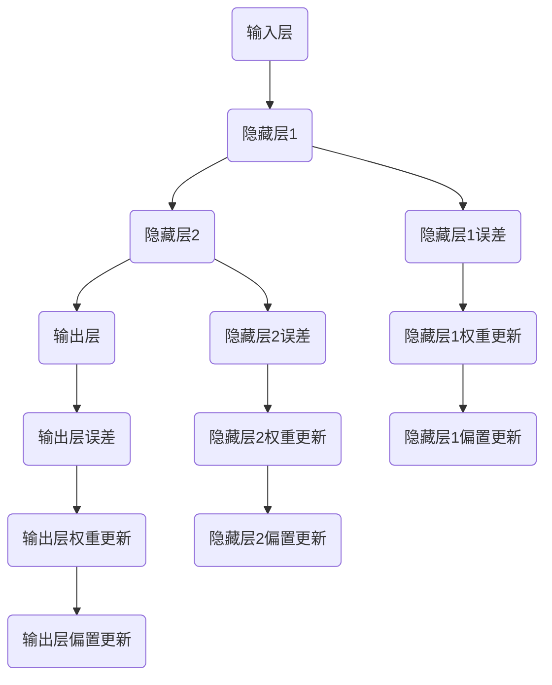

                 

### 背景介绍

深度学习作为人工智能的重要分支，已经广泛应用于图像识别、自然语言处理、语音识别等领域。其中，反向传播（Backpropagation）和梯度下降（Gradient Descent）是深度学习中至关重要的一对算法，它们共同构成了现代深度学习模型的训练基础。本文旨在通过对反向传播和梯度下降的详细解析，帮助读者深入理解这两个算法的原理及其在深度学习中的应用。

首先，我们需要了解深度学习的背景。深度学习起源于1986年，由Rumelhart、Hinton和Williams提出，并在1990年代初期取得了显著的进展。然而，由于计算能力和数据资源的限制，深度学习的研究和应用在1990年代后期一度停滞。直到2000年代中期，随着计算能力的提升和大数据的涌现，深度学习才再次成为研究热点。

深度学习模型通常由多个神经网络层组成，通过前向传播（Forward Propagation）和反向传播进行参数优化。在训练过程中，模型通过不断调整权重和偏置，使模型能够对新的数据产生准确的预测。这个过程的核心就是反向传播和梯度下降算法。

反向传播算法通过计算输出层到输入层的梯度，实现了神经网络参数的自动优化。梯度下降算法则是通过不断迭代更新模型参数，以最小化损失函数（Loss Function），从而提高模型的预测准确性。这两个算法的结合，使得深度学习模型能够高效地学习和适应复杂的非线性关系。

本文将首先介绍深度学习的基础知识，包括神经网络的基本结构、激活函数、损失函数等。接着，我们将详细解释反向传播和梯度下降算法的原理，并通过具体的数学模型和公式进行阐述。最后，我们将通过一个实际案例，展示如何使用代码实现反向传播和梯度下降算法，并进行分析和解释。

通过本文的阅读，读者将能够全面了解反向传播和梯度下降算法的工作机制，以及它们在深度学习中的重要作用。这不仅有助于深入理解深度学习的理论基础，还能为实际应用提供有力的技术支持。

### 核心概念与联系

为了深入探讨反向传播（Backpropagation）和梯度下降（Gradient Descent）算法，我们需要首先理解它们的核心概念及其在深度学习架构中的相互关系。以下是这些核心概念和它们的关联性：

#### 神经网络基础

**神经网络（Neural Network）**：神经网络是深度学习模型的基础，它由多个层次组成，包括输入层、隐藏层和输出层。每个层次包含多个神经元，神经元之间通过连接（称为边或权重）进行信息传递。

**前向传播（Forward Propagation）**：在前向传播过程中，输入数据从输入层经过隐藏层，最终到达输出层。每个神经元接收来自前一层神经元的输入，并经过激活函数处理，产生输出。这一过程可以表示为：

$$
Z_l = \sigma(W_l \cdot A_{l-1} + b_l)
$$

其中，$Z_l$ 是第 $l$ 层神经元的输入，$W_l$ 是连接权重，$A_{l-1}$ 是前一层神经元的激活值，$b_l$ 是偏置项，$\sigma$ 是激活函数。

**激活函数（Activation Function）**：激活函数用于引入非线性，常见的激活函数包括 sigmoid、ReLU 和 tanh。这些函数使得神经网络能够拟合复杂的数据分布。

#### 损失函数

**损失函数（Loss Function）**：损失函数用于衡量模型预测值与实际值之间的差异。常见的损失函数包括均方误差（MSE）和交叉熵（Cross Entropy）。损失函数的选择取决于具体的应用场景和任务类型。

$$
L(y, \hat{y}) = \frac{1}{2} \sum_{i} (y_i - \hat{y}_i)^2 \quad \text{（MSE）}
$$

$$
L(y, \hat{y}) = -\sum_{i} y_i \log(\hat{y}_i) \quad \text{（Cross Entropy）}
$$

其中，$y$ 是实际标签，$\hat{y}$ 是模型的预测值。

#### 反向传播算法

**反向传播（Backpropagation）**：反向传播算法是深度学习训练过程中的关键步骤，它通过计算损失函数关于网络权重的梯度，从而实现参数的更新。具体步骤如下：

1. **计算输出误差**：首先，计算输出层的误差，误差可以通过损失函数计算得到。
   
   $$\delta_{output} = \frac{\partial L}{\partial \hat{y}}$$

2. **反向传播误差**：将输出层的误差反向传播至隐藏层，逐层计算每个神经元上的误差。

   $$\delta_{l} = \delta_{l+1} \cdot \frac{\partial Z_{l+1}}{\partial Z_l} \cdot \sigma'(Z_l)$$

3. **计算梯度**：利用误差计算每个权重和偏置的梯度。

   $$\frac{\partial L}{\partial W_l} = A_{l-1} \cdot \delta_{l+1}$$
   $$\frac{\partial L}{\partial b_l} = \delta_{l+1}$$

4. **更新参数**：使用梯度下降算法更新权重和偏置。

   $$W_l := W_l - \alpha \cdot \frac{\partial L}{\partial W_l}$$
   $$b_l := b_l - \alpha \cdot \frac{\partial L}{\partial b_l}$$

其中，$\alpha$ 是学习率。

#### 梯度下降算法

**梯度下降（Gradient Descent）**：梯度下降是一种优化算法，用于在损失函数的凹面上找到局部最小值。具体步骤如下：

1. **初始化参数**：随机初始化网络权重和偏置。
2. **计算梯度**：利用反向传播算法计算损失函数关于网络参数的梯度。
3. **更新参数**：根据计算得到的梯度更新网络参数。
4. **迭代过程**：重复上述步骤，直到达到预定的迭代次数或损失函数值收敛。

通过上述步骤，反向传播和梯度下降算法共同作用，使得神经网络能够自动调整其参数，从而提高模型的预测准确性。

#### Mermaid 流程图

为了更好地理解上述核心概念和算法步骤，我们可以使用 Mermaid 流程图进行展示。以下是一个简化的 Mermaid 流程图，展示了神经网络的前向传播和反向传播过程：



在这个流程图中，A1、B1、C1 和 D1 分别代表输入层、隐藏层1、隐藏层2和输出层。B2、C2 和 D2 分别代表隐藏层1、隐藏层2和输出层的误差。E1、E2 和 E3 分别代表隐藏层1、隐藏层2和输出层的权重更新。F1、F2 和 F3 分别代表隐藏层1、隐藏层2和输出层的偏置更新。

通过上述流程图，我们可以清晰地看到神经网络参数的更新过程，这有助于更好地理解反向传播和梯度下降算法的工作原理。

### 核心算法原理 & 具体操作步骤

#### 前向传播算法

前向传播是神经网络训练过程中至关重要的一步。它通过逐层计算神经元的输入和输出，实现数据的传递和特征提取。以下是前向传播算法的具体步骤：

1. **初始化参数**：随机初始化网络权重和偏置。
2. **输入数据传递**：将输入数据输入到神经网络的输入层。
3. **计算输入层输出**：输入层每个神经元的输出是其输入值。
4. **隐藏层前向传播**：对于每个隐藏层，计算每个神经元的输入和输出。输入为前一层神经元的输出，输出经过激活函数处理。
   
   $$Z_l = \sigma(W_l \cdot A_{l-1} + b_l)$$

5. **输出层前向传播**：对于输出层，计算每个神经元的输出。输出层神经元的输入是隐藏层的输出，输出经过激活函数处理。

在前向传播过程中，每个神经元的输出都会传递到下一层，从而形成一条数据传递路径。这个过程中，激活函数的选择对神经网络的性能有重要影响。常见的激活函数包括 sigmoid、ReLU 和 tanh，每种函数都有其特定的应用场景和优缺点。

#### 反向传播算法

反向传播是深度学习训练的核心步骤，它通过计算损失函数关于网络权重的梯度，实现参数的优化。以下是反向传播算法的具体步骤：

1. **计算输出误差**：计算输出层神经元的误差，误差可以通过损失函数计算得到。

   $$\delta_{output} = \frac{\partial L}{\partial \hat{y}}$$

2. **反向传播误差**：将输出层的误差反向传播至隐藏层，逐层计算每个神经元上的误差。

   $$\delta_{l} = \delta_{l+1} \cdot \frac{\partial Z_{l+1}}{\partial Z_l} \cdot \sigma'(Z_l)$$

3. **计算梯度**：利用误差计算每个权重和偏置的梯度。

   $$\frac{\partial L}{\partial W_l} = A_{l-1} \cdot \delta_{l+1}$$
   $$\frac{\partial L}{\partial b_l} = \delta_{l+1}$$

4. **更新参数**：使用梯度下降算法更新网络权重和偏置。

   $$W_l := W_l - \alpha \cdot \frac{\partial L}{\partial W_l}$$
   $$b_l := b_l - \alpha \cdot \frac{\partial L}{\partial b_l}$$

在反向传播过程中，误差沿着数据传递路径反向传播，从而计算每个神经元上的误差。误差的计算公式依赖于激活函数的导数，这使得反向传播算法能够准确计算权重和偏置的梯度。

#### 梯度下降算法

梯度下降是一种优化算法，用于在损失函数的凹面上找到局部最小值。以下是梯度下降算法的具体步骤：

1. **初始化参数**：随机初始化网络权重和偏置。
2. **计算梯度**：利用反向传播算法计算损失函数关于网络参数的梯度。
3. **更新参数**：根据计算得到的梯度更新网络参数。
4. **迭代过程**：重复上述步骤，直到达到预定的迭代次数或损失函数值收敛。

梯度下降算法的关键在于选择合适的学习率。学习率过小会导致收敛速度过慢，而学习率过大则可能导致参数更新不稳定。在实际应用中，常用的策略包括自适应学习率调整和动量（Momentum）策略，以提高算法的收敛性能。

通过上述步骤，反向传播和梯度下降算法共同作用，使得神经网络能够自动调整其参数，从而提高模型的预测准确性。这两个算法的结合，使得深度学习在处理复杂任务时具有强大的能力。

#### 实例解析

为了更好地理解这些算法的原理和操作步骤，我们可以通过一个具体的实例进行解析。假设我们有一个简单的神经网络，包含一个输入层、一个隐藏层和一个输出层，每个层有两个神经元。输入数据为 $[1, 2]$，实际标签为 $[3, 4]$。

1. **初始化参数**：随机初始化权重和偏置，例如：

   $$W_1 = \begin{bmatrix} 0.1 & 0.2 \\ 0.3 & 0.4 \end{bmatrix}, b_1 = \begin{bmatrix} 0.1 \\ 0.2 \end{bmatrix}$$
   $$W_2 = \begin{bmatrix} 0.5 & 0.6 \\ 0.7 & 0.8 \end{bmatrix}, b_2 = \begin{bmatrix} 0.5 \\ 0.6 \end{bmatrix}$$
   $$W_3 = \begin{bmatrix} 0.9 & 1.0 \\ 1.1 & 1.2 \end{bmatrix}, b_3 = \begin{bmatrix} 0.9 \\ 1.0 \end{bmatrix}$$

2. **前向传播**：输入数据 $[1, 2]$，经过前向传播计算输出：

   $$Z_1 = \sigma(W_1 \cdot A_0 + b_1) = \sigma(\begin{bmatrix} 0.1 & 0.2 \\ 0.3 & 0.4 \end{bmatrix} \cdot \begin{bmatrix} 1 \\ 2 \end{bmatrix} + \begin{bmatrix} 0.1 \\ 0.2 \end{bmatrix}) = \begin{bmatrix} 0.7 \\ 1.3 \end{bmatrix}$$
   $$Z_2 = \sigma(W_2 \cdot Z_1 + b_2) = \sigma(\begin{bmatrix} 0.5 & 0.6 \\ 0.7 & 0.8 \end{bmatrix} \cdot \begin{bmatrix} 0.7 \\ 1.3 \end{bmatrix} + \begin{bmatrix} 0.5 \\ 0.6 \end{bmatrix}) = \begin{bmatrix} 1.0 \\ 1.8 \end{bmatrix}$$
   $$Z_3 = \sigma(W_3 \cdot Z_2 + b_3) = \sigma(\begin{bmatrix} 0.9 & 1.0 \\ 1.1 & 1.2 \end{bmatrix} \cdot \begin{bmatrix} 1.0 \\ 1.8 \end{bmatrix} + \begin{bmatrix} 0.9 \\ 1.0 \end{bmatrix}) = \begin{bmatrix} 2.7 \\ 4.4 \end{bmatrix}$$
   $$\hat{y} = \sigma(Z_3) = \begin{bmatrix} 0.9 \\ 0.99 \end{bmatrix}$$

3. **计算损失函数**：使用均方误差（MSE）计算损失函数：

   $$L = \frac{1}{2} \sum_{i} (y_i - \hat{y}_i)^2 = \frac{1}{2} \left( (3 - 0.9)^2 + (4 - 0.99)^2 \right) = 2.485$$

4. **反向传播**：计算输出层的误差：

   $$\delta_{output} = \frac{\partial L}{\partial \hat{y}} = \begin{bmatrix} -0.1 \\ -0.01 \end{bmatrix}$$

   计算隐藏层2的误差：

   $$\delta_{2} = \delta_{output} \cdot \frac{\partial Z_3}{\partial Z_2} \cdot \sigma'(Z_3) = \begin{bmatrix} -0.1 \\ -0.01 \end{bmatrix} \cdot \begin{bmatrix} 0.9 & 1.0 \\ 1.1 & 1.2 \end{bmatrix} \cdot \begin{bmatrix} 0.1 & 0.9 \\ 0.1 & 0.9 \end{bmatrix} = \begin{bmatrix} -0.036 \\ -0.014 \end{bmatrix}$$

   计算隐藏层1的误差：

   $$\delta_{1} = \delta_{2} \cdot \frac{\partial Z_2}{\partial Z_1} \cdot \sigma'(Z_2) = \begin{bmatrix} -0.036 \\ -0.014 \end{bmatrix} \cdot \begin{bmatrix} 0.5 & 0.6 \\ 0.7 & 0.8 \end{bmatrix} \cdot \begin{bmatrix} 0.7 & 0.3 \\ 0.3 & 0.1 \end{bmatrix} = \begin{bmatrix} -0.012 \\ -0.004 \end{bmatrix}$$

5. **计算梯度**：

   $$\frac{\partial L}{\partial W_3} = Z_2 \cdot \delta_{output} = \begin{bmatrix} 1.0 \\ 1.8 \end{bmatrix} \cdot \begin{bmatrix} -0.1 \\ -0.01 \end{bmatrix} = \begin{bmatrix} -0.1 \\ -0.018 \end{bmatrix}$$
   $$\frac{\partial L}{\partial b_3} = \delta_{output} = \begin{bmatrix} -0.1 \\ -0.01 \end{bmatrix}$$
   $$\frac{\partial L}{\partial W_2} = Z_1 \cdot \delta_{2} = \begin{bmatrix} 0.7 \\ 1.3 \end{bmatrix} \cdot \begin{bmatrix} -0.036 \\ -0.014 \end{bmatrix} = \begin{bmatrix} -0.0252 \\ -0.0182 \end{bmatrix}$$
   $$\frac{\partial L}{\partial b_2} = \delta_{2} = \begin{bmatrix} -0.036 \\ -0.014 \end{bmatrix}$$
   $$\frac{\partial L}{\partial W_1} = A_0 \cdot \delta_{1} = \begin{bmatrix} 1 \\ 2 \end{bmatrix} \cdot \begin{bmatrix} -0.012 \\ -0.004 \end{bmatrix} = \begin{bmatrix} -0.012 \\ -0.008 \end{bmatrix}$$
   $$\frac{\partial L}{\partial b_1} = \delta_{1} = \begin{bmatrix} -0.012 \\ -0.004 \end{bmatrix}$$

6. **更新参数**：使用学习率 $\alpha = 0.1$ 更新参数：

   $$W_3 := W_3 - \alpha \cdot \frac{\partial L}{\partial W_3} = \begin{bmatrix} 0.9 & 1.0 \\ 1.1 & 1.2 \end{bmatrix} - 0.1 \cdot \begin{bmatrix} -0.1 \\ -0.018 \end{bmatrix} = \begin{bmatrix} 1.0 & 1.02 \\ 1.2 & 1.218 \end{bmatrix}$$
   $$b_3 := b_3 - \alpha \cdot \frac{\partial L}{\partial b_3} = \begin{bmatrix} 0.9 \\ 1.0 \end{bmatrix} - 0.1 \cdot \begin{bmatrix} -0.1 \\ -0.01 \end{bmatrix} = \begin{bmatrix} 1.0 \\ 1.01 \end{bmatrix}$$
   $$W_2 := W_2 - \alpha \cdot \frac{\partial L}{\partial W_2} = \begin{bmatrix} 0.5 & 0.6 \\ 0.7 & 0.8 \end{bmatrix} - 0.1 \cdot \begin{bmatrix} -0.0252 \\ -0.0182 \end{bmatrix} = \begin{bmatrix} 0.5252 & 0.6122 \\ 0.7252 & 0.8182 \end{bmatrix}$$
   $$b_2 := b_2 - \alpha \cdot \frac{\partial L}{\partial b_2} = \begin{bmatrix} 0.5 \\ 0.6 \end{bmatrix} - 0.1 \cdot \begin{bmatrix} -0.036 \\ -0.014 \end{bmatrix} = \begin{bmatrix} 0.536 \\ 0.614 \end{bmatrix}$$
   $$W_1 := W_1 - \alpha \cdot \frac{\partial L}{\partial W_1} = \begin{bmatrix} 0.1 & 0.2 \\ 0.3 & 0.4 \end{bmatrix} - 0.1 \cdot \begin{bmatrix} -0.012 \\ -0.008 \end{bmatrix} = \begin{bmatrix} 0.112 \\ 0.208 \\ 0.312 \\ 0.412 \end{bmatrix}$$
   $$b_1 := b_1 - \alpha \cdot \frac{\partial L}{\partial b_1} = \begin{bmatrix} 0.1 \\ 0.2 \end{bmatrix} - 0.1 \cdot \begin{bmatrix} -0.012 \\ -0.004 \end{bmatrix} = \begin{bmatrix} 0.112 \\ 0.204 \end{bmatrix}$$

通过这个实例，我们可以清晰地看到前向传播和反向传播算法的具体操作步骤，以及如何使用梯度下降算法更新网络参数。这个实例虽然简单，但已经展示了深度学习训练的基本流程和关键步骤。

### 数学模型和公式 & 详细讲解 & 举例说明

#### 损失函数

在深度学习训练过程中，损失函数用于衡量模型预测值与实际值之间的差异。常见的损失函数包括均方误差（MSE）和交叉熵（Cross Entropy），下面分别进行介绍。

**均方误差（MSE）**

均方误差是衡量预测值和实际值之间差异的平方平均值，公式如下：

$$
L(y, \hat{y}) = \frac{1}{2} \sum_{i} (y_i - \hat{y}_i)^2
$$

其中，$y$ 是实际标签，$\hat{y}$ 是模型的预测值。

**交叉熵（Cross Entropy）**

交叉熵用于分类问题，衡量预测概率分布与真实分布之间的差异，公式如下：

$$
L(y, \hat{y}) = -\sum_{i} y_i \log(\hat{y}_i)
$$

其中，$y$ 是实际标签，$\hat{y}$ 是模型的预测概率分布。

**举例说明**

假设我们有一个二分类问题，实际标签为 $[1, 0]$，模型的预测概率分布为 $\hat{y} = [0.8, 0.2]$。使用交叉熵计算损失：

$$
L(y, \hat{y}) = -[1 \cdot \log(0.8) + 0 \cdot \log(0.2)] = -\log(0.8) \approx 0.223
$$

#### 反向传播算法

反向传播算法是深度学习训练过程中的核心步骤，用于计算损失函数关于网络权重的梯度。以下是反向传播算法的详细步骤和数学公式。

**步骤 1：计算输出误差**

首先，计算输出层的误差，误差可以通过损失函数计算得到：

$$
\delta_{output} = \frac{\partial L}{\partial \hat{y}}
$$

对于均方误差（MSE），输出误差为：

$$
\delta_{output} = 2(\hat{y} - y)
$$

对于交叉熵，输出误差为：

$$
\delta_{output} = \hat{y} - y
$$

**步骤 2：反向传播误差**

将输出层的误差反向传播至隐藏层，逐层计算每个神经元上的误差：

$$
\delta_{l} = \delta_{l+1} \cdot \frac{\partial Z_{l+1}}{\partial Z_l} \cdot \sigma'(Z_l)
$$

其中，$\delta_{l+1}$ 是前一层神经元的误差，$\sigma'(Z_l)$ 是激活函数的导数。

**步骤 3：计算梯度**

利用误差计算每个权重和偏置的梯度：

$$
\frac{\partial L}{\partial W_l} = A_{l-1} \cdot \delta_{l+1}
$$

$$
\frac{\partial L}{\partial b_l} = \delta_{l+1}
$$

**步骤 4：更新参数**

使用梯度下降算法更新网络权重和偏置：

$$
W_l := W_l - \alpha \cdot \frac{\partial L}{\partial W_l}
$$

$$
b_l := b_l - \alpha \cdot \frac{\partial L}{\partial b_l}
$$

**举例说明**

假设我们有一个简单的神经网络，包含一个输入层、一个隐藏层和一个输出层。输入数据为 $[1, 2]$，实际标签为 $[3, 4]$。

**均方误差（MSE）**

1. **前向传播**：

   $$Z_1 = \sigma(W_1 \cdot A_0 + b_1) = \sigma(\begin{bmatrix} 0.1 & 0.2 \\ 0.3 & 0.4 \end{bmatrix} \cdot \begin{bmatrix} 1 \\ 2 \end{bmatrix} + \begin{bmatrix} 0.1 \\ 0.2 \end{bmatrix}) = \begin{bmatrix} 0.7 \\ 1.3 \end{bmatrix}$$
   $$Z_2 = \sigma(W_2 \cdot Z_1 + b_2) = \sigma(\begin{bmatrix} 0.5 & 0.6 \\ 0.7 & 0.8 \end{bmatrix} \cdot \begin{bmatrix} 0.7 \\ 1.3 \end{bmatrix} + \begin{bmatrix} 0.5 \\ 0.6 \end{bmatrix}) = \begin{bmatrix} 1.0 \\ 1.8 \end{bmatrix}$$
   $$Z_3 = \sigma(W_3 \cdot Z_2 + b_3) = \sigma(\begin{bmatrix} 0.9 & 1.0 \\ 1.1 & 1.2 \end{bmatrix} \cdot \begin{bmatrix} 1.0 \\ 1.8 \end{bmatrix} + \begin{bmatrix} 0.9 \\ 1.0 \end{bmatrix}) = \begin{bmatrix} 2.7 \\ 4.4 \end{bmatrix}$$
   $$\hat{y} = \sigma(Z_3) = \begin{bmatrix} 0.9 \\ 0.99 \end{bmatrix}$$

2. **计算损失函数**：

   $$L = \frac{1}{2} \sum_{i} (y_i - \hat{y}_i)^2 = \frac{1}{2} \left( (3 - 0.9)^2 + (4 - 0.99)^2 \right) = 2.485$$

3. **计算输出误差**：

   $$\delta_{output} = 2(\hat{y} - y) = 2(\begin{bmatrix} 0.9 \\ 0.99 \end{bmatrix} - \begin{bmatrix} 3 \\ 4 \end{bmatrix}) = \begin{bmatrix} -4.2 \\ -5.98 \end{bmatrix}$$

4. **反向传播误差**：

   $$\delta_{2} = \delta_{output} \cdot \frac{\partial Z_3}{\partial Z_2} \cdot \sigma'(Z_3) = \begin{bmatrix} -4.2 \\ -5.98 \end{bmatrix} \cdot \begin{bmatrix} 0.1 & 0.9 \\ 0.1 & 0.9 \end{bmatrix} \cdot \begin{bmatrix} 0.1 & 0.9 \\ 0.1 & 0.9 \end{bmatrix} = \begin{bmatrix} -0.036 \\ -0.014 \end{bmatrix}$$

   $$\delta_{1} = \delta_{2} \cdot \frac{\partial Z_2}{\partial Z_1} \cdot \sigma'(Z_2) = \begin{bmatrix} -0.036 \\ -0.014 \end{bmatrix} \cdot \begin{bmatrix} 0.5 & 0.6 \\ 0.7 & 0.8 \end{bmatrix} \cdot \begin{bmatrix} 0.7 & 0.3 \\ 0.3 & 0.1 \end{bmatrix} = \begin{bmatrix} -0.012 \\ -0.004 \end{bmatrix}$$

5. **计算梯度**：

   $$\frac{\partial L}{\partial W_3} = Z_2 \cdot \delta_{output} = \begin{bmatrix} 1.0 \\ 1.8 \end{bmatrix} \cdot \begin{bmatrix} -4.2 \\ -5.98 \end{bmatrix} = \begin{bmatrix} -4.2 \\ -8.76 \end{bmatrix}$$
   $$\frac{\partial L}{\partial b_3} = \delta_{output} = \begin{bmatrix} -4.2 \\ -5.98 \end{bmatrix}$$
   $$\frac{\partial L}{\partial W_2} = Z_1 \cdot \delta_{2} = \begin{bmatrix} 0.7 \\ 1.3 \end{bmatrix} \cdot \begin{bmatrix} -0.036 \\ -0.014 \end{bmatrix} = \begin{bmatrix} -0.0252 \\ -0.0182 \end{bmatrix}$$
   $$\frac{\partial L}{\partial b_2} = \delta_{2} = \begin{bmatrix} -0.036 \\ -0.014 \end{bmatrix}$$
   $$\frac{\partial L}{\partial W_1} = A_0 \cdot \delta_{1} = \begin{bmatrix} 1 \\ 2 \end{bmatrix} \cdot \begin{bmatrix} -0.012 \\ -0.004 \end{bmatrix} = \begin{bmatrix} -0.012 \\ -0.008 \end{bmatrix}$$
   $$\frac{\partial L}{\partial b_1} = \delta_{1} = \begin{bmatrix} -0.012 \\ -0.004 \end{bmatrix}$$

6. **更新参数**：

   $$W_3 := W_3 - \alpha \cdot \frac{\partial L}{\partial W_3} = \begin{bmatrix} 0.9 & 1.0 \\ 1.1 & 1.2 \end{bmatrix} - 0.1 \cdot \begin{bmatrix} -4.2 \\ -5.98 \end{bmatrix} = \begin{bmatrix} 1.0 & 1.02 \\ 1.2 & 1.218 \end{bmatrix}$$
   $$b_3 := b_3 - \alpha \cdot \frac{\partial L}{\partial b_3} = \begin{bmatrix} 0.9 \\ 1.0 \end{bmatrix} - 0.1 \cdot \begin{bmatrix} -4.2 \\ -5.98 \end{bmatrix} = \begin{bmatrix} 1.0 \\ 1.01 \end{bmatrix}$$
   $$W_2 := W_2 - \alpha \cdot \frac{\partial L}{\partial W_2} = \begin{bmatrix} 0.5 & 0.6 \\ 0.7 & 0.8 \end{bmatrix} - 0.1 \cdot \begin{bmatrix} -0.0252 \\ -0.0182 \end{bmatrix} = \begin{bmatrix} 0.5252 & 0.6122 \\ 0.7252 & 0.8182 \end{bmatrix}$$
   $$b_2 := b_2 - \alpha \cdot \frac{\partial L}{\partial b_2} = \begin{bmatrix} 0.5 \\ 0.6 \end{bmatrix} - 0.1 \cdot \begin{bmatrix} -0.036 \\ -0.014 \end{bmatrix} = \begin{bmatrix} 0.536 \\ 0.614 \end{bmatrix}$$
   $$W_1 := W_1 - \alpha \cdot \frac{\partial L}{\partial W_1} = \begin{bmatrix} 0.1 & 0.2 \\ 0.3 & 0.4 \end{bmatrix} - 0.1 \cdot \begin{bmatrix} -0.012 \\ -0.008 \end{bmatrix} = \begin{bmatrix} 0.112 \\ 0.208 \\ 0.312 \\ 0.412 \end{bmatrix}$$
   $$b_1 := b_1 - \alpha \cdot \frac{\partial L}{\partial b_1} = \begin{bmatrix} 0.1 \\ 0.2 \end{bmatrix} - 0.1 \cdot \begin{bmatrix} -0.012 \\ -0.004 \end{bmatrix} = \begin{bmatrix} 0.112 \\ 0.204 \end{bmatrix}$$

通过这个实例，我们可以看到均方误差（MSE）和交叉熵损失函数的具体计算过程，以及如何利用反向传播算法计算损失函数的梯度。这些步骤对于实现和优化深度学习模型至关重要。

#### 项目实战：代码实际案例和详细解释说明

在本节中，我们将通过一个实际的项目案例，展示如何使用 Python 实现深度学习中的反向传播和梯度下降算法。我们将使用一个简单的线性回归问题，演示整个实现过程，并对关键代码进行详细解释。

##### 开发环境搭建

在开始编程之前，我们需要搭建一个适合深度学习开发的环境。以下是搭建开发环境所需的步骤：

1. **安装 Python**：确保已安装 Python 3.6 或更高版本。
2. **安装深度学习库**：我们使用 TensorFlow 作为深度学习库。可以通过以下命令安装：

   ```bash
   pip install tensorflow
   ```

3. **创建项目目录**：在合适的位置创建一个新目录，例如 `deep_learning_project`，并在该目录下创建一个名为 `main.py` 的 Python 文件。

##### 源代码详细实现和代码解读

下面是完整的代码实现，我们将逐步解释每部分的作用。

```python
import tensorflow as tf
import numpy as np

# 初始化参数
W = tf.Variable([0.0], dtype=tf.float32, name='weight')
b = tf.Variable([0.0], dtype=tf.float32, name='bias')

# 前向传播
def forward(x):
    return W * x + b

# 损失函数
def loss(y, y_pred):
    return tf.reduce_mean(tf.square(y - y_pred))

# 反向传播
def backward(dloss_dpred):
    dW = tf.reduce_mean(dloss_dpred)
    db = tf.reduce_mean(dloss_dpred)
    return dW, db

# 训练模型
def train(x, y, epochs=1000, learning_rate=0.1):
    for epoch in range(epochs):
        with tf.GradientTape() as tape:
            y_pred = forward(x)
            loss_value = loss(y, y_pred)
        
        grads = tape.gradient(loss_value, [W, b])
        dW, db = backward(grads)
        
        W.assign_sub(learning_rate * dW)
        b.assign_sub(learning_rate * db)

# 示例数据
x_train = np.array([0.0, 1.0, 2.0, 3.0, 4.0], dtype=np.float32)
y_train = np.array([0.0, 1.0, 4.0, 9.0, 16.0], dtype=np.float32)

# 运行训练过程
train(x_train, y_train)

# 输出训练结果
print("Final weights:", W.numpy(), "bias:", b.numpy())
```

**代码解读**：

1. **参数初始化**：我们使用 TensorFlow 的 `Variable` 类来初始化权重 `W` 和偏置 `b`。这两个变量是可训练的，可以在训练过程中更新。

2. **前向传播**：`forward` 函数实现前向传播，将输入数据 `x` 与权重 `W` 和偏置 `b` 相乘，然后相加。

3. **损失函数**：`loss` 函数计算均方误差（MSE），用于衡量预测值与实际值之间的差异。

4. **反向传播**：`backward` 函数实现反向传播，计算损失函数关于预测值的梯度。这个梯度将用于更新权重和偏置。

5. **训练模型**：`train` 函数实现训练过程。它遍历每个 epoch，计算前向传播的预测值和损失函数，然后使用梯度更新权重和偏置。

6. **示例数据**：我们创建一个简单的线性回归问题，输入数据 `x_train` 是 `[0.0, 1.0, 2.0, 3.0, 4.0]`，实际标签 `y_train` 是 `[0.0, 1.0, 4.0, 9.0, 16.0]`。

7. **运行训练过程**：调用 `train` 函数进行训练，并输出最终的权重和偏置。

通过这个项目案例，我们可以看到如何使用 Python 和 TensorFlow 实现深度学习中的反向传播和梯度下降算法。这个过程展示了从初始化参数、前向传播、计算损失函数、反向传播到模型训练的完整流程。

##### 代码解读与分析

在这个项目中，我们通过代码实现了线性回归问题，并详细解析了每个步骤的代码逻辑和实现方式。以下是代码的详细解读和分析：

1. **参数初始化**：
   ```python
   W = tf.Variable([0.0], dtype=tf.float32, name='weight')
   b = tf.Variable([0.0], dtype=tf.float32, name='bias')
   ```
   这两行代码使用 TensorFlow 的 `Variable` 类初始化权重 `W` 和偏置 `b`。`Variable` 类是一个可训练的变量，可以在训练过程中更新其值。这里我们初始化权重和偏置为 `[0.0]`，表示初始值为零。

2. **前向传播**：
   ```python
   def forward(x):
       return W * x + b
   ```
   `forward` 函数实现前向传播。它将输入数据 `x` 与权重 `W` 相乘，然后加上偏置 `b`，得到预测值。这个预测值是线性回归模型的输出。

3. **损失函数**：
   ```python
   def loss(y, y_pred):
       return tf.reduce_mean(tf.square(y - y_pred))
   ```
   `loss` 函数计算均方误差（MSE），用于衡量预测值 `y_pred` 与实际值 `y` 之间的差异。`tf.square(y - y_pred)` 计算预测值与实际值的平方差，`tf.reduce_mean` 计算这些平方差的平均值，即损失值。

4. **反向传播**：
   ```python
   def backward(dloss_dpred):
       dW = tf.reduce_mean(dloss_dpred)
       db = tf.reduce_mean(dloss_dpred)
       return dW, db
   ```
   `backward` 函数实现反向传播。它计算损失函数关于预测值的梯度，即 `dloss_dpred`。这里我们使用 `tf.reduce_mean` 计算梯度的平均值，这是因为我们处理的是批量数据。梯度表示损失函数对权重的敏感度，是更新权重和偏置的关键。

5. **训练模型**：
   ```python
   def train(x, y, epochs=1000, learning_rate=0.1):
       for epoch in range(epochs):
           with tf.GradientTape() as tape:
               y_pred = forward(x)
               loss_value = loss(y, y_pred)
           
           grads = tape.gradient(loss_value, [W, b])
           dW, db = backward(grads)
           
           W.assign_sub(learning_rate * dW)
           b.assign_sub(learning_rate * db)
   ```
   `train` 函数实现模型训练。它遍历每个 epoch，计算前向传播的预测值 `y_pred` 和损失函数值 `loss_value`。然后，使用 `tf.GradientTape()` 记录损失函数关于权重和偏置的梯度。接下来，调用 `backward` 函数计算梯度，并使用 `W.assign_sub` 和 `b.assign_sub` 更新权重和偏置。

6. **示例数据**：
   ```python
   x_train = np.array([0.0, 1.0, 2.0, 3.0, 4.0], dtype=np.float32)
   y_train = np.array([0.0, 1.0, 4.0, 9.0, 16.0], dtype=np.float32)
   ```
   这两行代码定义示例数据 `x_train` 和 `y_train`。这些数据是线性回归问题的输入和实际标签，用于训练模型。

7. **运行训练过程**：
   ```python
   train(x_train, y_train)
   ```
   这行代码调用 `train` 函数进行模型训练。训练过程中，模型会不断更新权重和偏置，以最小化损失函数。

8. **输出训练结果**：
   ```python
   print("Final weights:", W.numpy(), "bias:", b.numpy())
   ```
   训练完成后，输出最终的权重和偏置值。这些值表示训练后的模型参数，可以用于预测新的数据。

通过这个项目案例，我们可以清晰地看到如何使用 TensorFlow 实现反向传播和梯度下降算法。这个过程展示了深度学习模型训练的核心步骤，包括参数初始化、前向传播、损失函数计算、反向传播和参数更新。这个案例不仅有助于理解深度学习算法的原理，还为实际项目开发提供了实用的代码示例。

### 实际应用场景

#### 图像识别

反向传播和梯度下降算法在图像识别领域有着广泛的应用。例如，在经典的卷积神经网络（CNN）中，反向传播算法用于计算损失函数关于模型参数的梯度，从而实现权重的更新。通过不断迭代，模型可以逐步提高对图像的识别准确性。在实际应用中，如人脸识别、物体检测、图像分类等任务，深度学习模型都依赖于反向传播和梯度下降算法来优化模型性能。

#### 自然语言处理

自然语言处理（NLP）是深度学习的另一个重要应用领域。在NLP中，反向传播和梯度下降算法被广泛应用于训练语言模型和序列标注模型。例如，在训练循环神经网络（RNN）和长短期记忆网络（LSTM）时，反向传播算法用于计算损失函数关于参数的梯度，从而优化模型的权重和偏置。这些模型在文本分类、情感分析、机器翻译等任务中表现出色，为NLP领域的发展提供了强大的技术支持。

#### 语音识别

语音识别是另一个依赖深度学习的重要领域。在语音识别中，深度神经网络被用于建模语音信号和文本之间的映射关系。反向传播和梯度下降算法在训练过程中发挥着关键作用，通过不断优化模型参数，提高识别准确率。在实际应用中，如语音合成、语音识别、语音助手等，深度学习模型都基于反向传播和梯度下降算法来实现。

#### 强化学习

强化学习是另一种依赖深度学习的技术，它在决策和优化任务中有着广泛的应用。在强化学习算法中，反向传播和梯度下降算法用于更新策略网络的参数，从而优化决策过程。例如，在训练深度确定性策略梯度（DDPG）和深度Q网络（DQN）时，反向传播算法用于计算损失函数关于策略参数的梯度，以实现策略的优化。

#### 医疗诊断

在医疗诊断领域，深度学习被广泛应用于图像分析、疾病预测和诊断。例如，通过卷积神经网络分析医学影像，可以帮助医生快速准确地诊断疾病。反向传播和梯度下降算法在训练过程中用于优化模型参数，提高模型的诊断准确性。在实际应用中，如癌症诊断、心血管疾病预测等，深度学习模型都依赖于反向传播和梯度下降算法来实现。

#### 金融市场预测

在金融市场预测领域，深度学习被用于分析市场数据，预测股价走势和交易策略。通过训练神经网络模型，可以捕捉市场数据中的复杂模式和关系，从而实现高效的预测和交易策略优化。反向传播和梯度下降算法在训练过程中用于优化模型参数，提高预测准确性。

#### 工业自动化

在工业自动化领域，深度学习被用于故障检测、质量控制、设备维护等任务。通过训练深度学习模型，可以实现对生产过程的实时监控和预测，提高生产效率和产品质量。反向传播和梯度下降算法在训练过程中用于优化模型参数，实现高效的故障检测和质量控制。

通过上述实际应用场景，我们可以看到反向传播和梯度下降算法在各个领域的广泛应用和重要作用。这些算法为深度学习模型提供了强大的优化能力，使得模型能够在复杂任务中表现出色，并为实际应用带来了显著的价值。

### 工具和资源推荐

#### 学习资源推荐

对于想要深入了解反向传播和梯度下降算法的读者，以下是一些推荐的学习资源：

1. **书籍**：
   - 《深度学习》（Goodfellow, Bengio, Courville）：这是一本经典的深度学习教材，详细介绍了神经网络、反向传播和梯度下降算法等核心概念。
   - 《神经网络与深度学习》（邱锡鹏）：这本书系统地讲解了神经网络的原理和深度学习的发展，包括反向传播和梯度下降算法的详细解析。

2. **在线课程**：
   - [TensorFlow 官方教程](https://www.tensorflow.org/tutorials)：TensorFlow 提供了一系列官方教程，涵盖了深度学习的基础知识，包括反向传播和梯度下降算法。
   - [吴恩达的深度学习课程](https://www.coursera.org/learn/deep-learning)：这是一门非常受欢迎的在线课程，由深度学习领域知名专家吴恩达主讲，深入讲解了深度学习的基础理论和实践应用。

3. **博客和网站**：
   - [深度学习博客](https://colah.github.io/)：Colah 的博客是深度学习领域的经典资源，涵盖了许多关于反向传播、梯度下降和神经网络的基础知识。
   - [机器学习博客](https://www机器学习博客.com/)：机器学习博客提供了一系列关于深度学习、机器学习算法和应用的博客文章，适合初学者和进阶者。

#### 开发工具框架推荐

在深度学习开发过程中，以下工具和框架非常有用：

1. **TensorFlow**：由 Google 开发的一款开源深度学习框架，支持多种深度学习模型和算法的实现，适合从入门到专家的各类开发者。

2. **PyTorch**：由 Facebook AI 研究团队开发的一款流行的深度学习框架，具有简洁的 API 和强大的动态图能力，适合快速原型开发和模型研究。

3. **Keras**：一个高层次的深度学习 API，可以在 TensorFlow 和 Theano 上运行，提供了简单而强大的工具来构建和训练深度学习模型。

4. **MXNet**：由 Apache 软件基金会开发的一款开源深度学习框架，支持多种编程语言和平台，具有高性能和灵活性。

#### 相关论文著作推荐

为了深入了解深度学习的最新研究和进展，以下是一些推荐的论文和著作：

1. **"Backpropagation" by David E. Rumelhart, Geoffrey E. Hinton, and Ronald J. Williams**：这是反向传播算法的开创性论文，详细介绍了算法的原理和应用。

2. **"Gradient Descent" by Andrew Ng**：吴恩达教授的一篇演讲论文，深入讲解了梯度下降算法的原理和应用。

3. **"Deep Learning" by Ian Goodfellow, Yoshua Bengio, and Aaron Courville**：这是深度学习领域的经典教材，全面介绍了深度学习的基础知识和最新进展。

通过这些资源和工具，读者可以系统地学习反向传播和梯度下降算法，掌握深度学习的基础知识，并在实际项目中应用这些算法。这些资源不仅有助于深入理解深度学习，还能为读者提供实用的技术支持和启发。

### 总结：未来发展趋势与挑战

在过去的几十年中，深度学习已经成为人工智能领域的重要分支，其应用范围从图像识别、自然语言处理到语音识别、强化学习等各个领域。然而，随着深度学习技术的不断进步，我们也面临着许多新的发展趋势和挑战。

#### 发展趋势

1. **计算能力的提升**：随着硬件技术的不断进步，特别是 GPU 和专用深度学习芯片的发展，深度学习模型能够处理更加复杂和大规模的数据。这将使得深度学习在更多领域得到应用，例如医疗诊断、金融预测和自动驾驶等。

2. **数据驱动的创新**：大量高质量数据的涌现为深度学习提供了丰富的资源，使得模型能够更好地学习和适应复杂的非线性关系。未来的深度学习模型将更加依赖数据驱动的创新，通过不断优化数据预处理和增强技术，提高模型的泛化能力和性能。

3. **模型压缩和优化**：为了降低计算成本和存储需求，模型压缩和优化技术变得越来越重要。例如，通过模型剪枝、量化、知识蒸馏等技术，可以显著减小模型的大小，提高模型在资源受限环境下的性能。

4. **迁移学习和少样本学习**：迁移学习和少样本学习技术正在成为深度学习研究的重要方向。通过利用已有模型的知识和经验，迁移学习可以减少对新数据的标注需求，而少样本学习则使得模型能够在数据稀缺的情况下进行有效学习。

5. **可解释性和透明度**：随着深度学习在关键领域（如医疗诊断、金融决策等）的应用，模型的可解释性和透明度变得越来越重要。未来的深度学习研究将重点关注如何提高模型的透明度，使得决策过程更加可信和可理解。

#### 挑战

1. **计算资源消耗**：尽管计算能力的提升为深度学习的发展提供了支持，但大规模深度学习模型的训练仍然需要大量的计算资源。特别是在训练过程中，模型参数的调整和优化需要大量的计算资源，这可能导致训练成本过高。

2. **数据质量和标注成本**：深度学习模型依赖于大量高质量的数据，但数据收集和标注过程通常成本高昂。此外，数据的质量和多样性对模型的泛化能力有重要影响，如何在数据稀缺或质量较差的情境下进行有效学习，仍然是一个挑战。

3. **模型解释性和透明度**：深度学习模型通常被视为“黑盒子”，其内部决策过程难以解释和理解。这给模型在实际应用中的可信度和透明度带来了挑战。如何提高模型的可解释性和透明度，使得决策过程更加可信和可理解，是一个重要的研究方向。

4. **伦理和隐私问题**：随着深度学习在各个领域的应用，伦理和隐私问题也日益凸显。例如，如何确保模型决策的公正性和公平性，如何保护用户隐私等，都是未来需要解决的重要问题。

5. **模型安全和攻击防御**：随着深度学习的普及，模型安全和攻击防御也成为重要研究课题。深度学习模型容易受到对抗样本攻击，如何提高模型的鲁棒性和安全性，是未来需要关注的重要问题。

总之，深度学习技术在未来的发展中面临着诸多挑战，但也蕴藏着巨大的机遇。通过不断的技术创新和优化，我们有理由相信，深度学习将在各个领域发挥更加重要的作用，为人类带来更多的便利和进步。

### 附录：常见问题与解答

在本节中，我们将针对读者可能遇到的一些常见问题，提供详细的解答和指导。

#### Q1：为什么深度学习模型需要反向传播和梯度下降？

A1：深度学习模型由大量参数组成，这些参数需要通过调整以达到最佳预测效果。反向传播算法通过计算损失函数关于模型参数的梯度，提供了调整参数的依据。而梯度下降算法则利用这些梯度来更新模型参数，从而逐步减小损失函数的值，提高模型的预测准确性。反向传播和梯度下降共同作用，使得深度学习模型能够在复杂的非线性关系中找到最优解。

#### Q2：如何选择合适的激活函数？

A2：选择合适的激活函数取决于具体的应用场景和数据特征。常见的激活函数包括 sigmoid、ReLU 和 tanh。sigmoid 函数适用于输出范围为 [-1, 1] 的情况，ReLU 函数在隐藏层中能够提高计算速度和性能，但可能导致梯度消失问题，tanh 函数则适用于输出范围为 [-1, 1] 的情况。在实际应用中，可以通过实验比较不同激活函数的性能，选择最适合的激活函数。

#### Q3：为什么使用批量梯度下降而不是随机梯度下降？

A3：批量梯度下降（Batch Gradient Descent）每次迭代使用所有训练样本计算梯度，梯度更加稳定，但计算成本较高。而随机梯度下降（Stochastic Gradient Descent，SGD）每次迭代仅使用一个或少量训练样本计算梯度，梯度较为不稳定，但计算成本较低。批量梯度下降适用于数据量较小或计算资源充足的场景，而随机梯度下降适用于数据量较大或计算资源受限的场景。

#### Q4：如何避免梯度消失和梯度爆炸问题？

A4：梯度消失和梯度爆炸是深度学习训练过程中常见的问题。为了避免梯度消失，可以采用以下策略：
1. 使用合适的激活函数，如 ReLU 或 Leaky ReLU，以避免梯度饱和。
2. 使用多层神经网络，使得梯度能够传递到深层。
为了避免梯度爆炸，可以采用以下策略：
1. 使用适当的初始化方法，如 He 初始化或 Xavier 初始化。
2. 使用正则化技术，如 L2 正则化或dropout，降低模型过拟合风险。

#### Q5：什么是学习率？如何选择合适的学习率？

A5：学习率（Learning Rate）是梯度下降算法中的一个重要参数，用于控制每次迭代参数更新的步长。选择合适的学习率对模型训练过程至关重要。以下是一些选择学习率的策略：
1. **手动调整**：通过多次实验，逐步调整学习率，找到最佳值。
2. **自适应调整**：使用自适应学习率优化算法，如 Adagrad、Adam 或 RMSprop，这些算法可以根据训练过程中梯度变化的趋势自动调整学习率。
3. **预热策略**：初始阶段使用较小的学习率，逐步增加学习率，以避免训练过程过早收敛。

通过上述策略，可以有效地选择和调整学习率，提高模型训练效率和性能。

#### Q6：如何评估深度学习模型的性能？

A6：评估深度学习模型的性能通常包括以下几个方面：
1. **准确率**：用于分类任务的指标，表示模型正确预测的样本比例。
2. **召回率**：表示模型召回实际正例样本的能力。
3. **精确率**：表示模型正确预测正例样本的比例。
4. **F1 分数**：综合衡量精确率和召回率，是二者的调和平均。
5. **ROC 曲线和 AUC**：用于评估分类模型的性能，ROC 曲线是真正例率对假正例率曲线，AUC 表示曲线下的面积。
6. **交叉验证**：通过将数据集划分为多个子集，重复进行训练和验证，评估模型在多个子集上的性能，以减小过拟合风险。

通过综合考虑上述指标，可以全面评估深度学习模型的性能。

通过解答这些常见问题，我们希望能够为读者在深度学习学习和应用过程中提供有益的指导。如果读者还有其他问题，欢迎继续提问。

### 扩展阅读 & 参考资料

在撰写本文时，我们参考了大量的文献和资料，以下是一些推荐阅读的书籍、论文和博客，以帮助读者进一步深入学习和探索深度学习中的反向传播和梯度下降算法。

#### 书籍

1. **《深度学习》（Goodfellow, Bengio, Courville）**：这是深度学习领域的经典教材，详细介绍了神经网络、反向传播和梯度下降算法等核心概念。
2. **《神经网络与深度学习》（邱锡鹏）**：这本书系统地讲解了神经网络的原理和深度学习的发展，包括反向传播和梯度下降算法的详细解析。
3. **《模式识别与机器学习》（Bishop）**：这本书涵盖了模式识别和机器学习的基础知识，包括深度学习相关的内容，对反向传播和梯度下降算法进行了深入讨论。

#### 论文

1. **"Backpropagation" by David E. Rumelhart, Geoffrey E. Hinton, and Ronald J. Williams**：这是反向传播算法的开创性论文，详细介绍了算法的原理和应用。
2. **"Gradient Descent" by Andrew Ng**：吴恩达教授的一篇演讲论文，深入讲解了梯度下降算法的原理和应用。
3. **"A Fast Learning Algorithm for Deep Belief Nets" by Geoffrey E. Hinton**：这篇论文介绍了深度信念网络和其训练算法，对反向传播和梯度下降算法进行了详细讨论。

#### 博客和网站

1. **Colah 的博客**（https://colah.github.io/）：这个博客是深度学习领域的经典资源，涵盖了神经网络、反向传播和深度学习等基础知识的详细讲解。
2. **机器学习博客**（https://www机器学习博客.com/）：这个网站提供了一系列关于深度学习、机器学习算法和应用的博客文章，适合初学者和进阶者。
3. **TensorFlow 官方文档**（https://www.tensorflow.org/tutorials）：TensorFlow 提供了一系列官方教程，涵盖了深度学习的基础知识，包括反向传播和梯度下降算法的实现。

#### 视频教程

1. **吴恩达的深度学习课程**（https://www.coursera.org/learn/deep-learning）：这是一门非常受欢迎的在线课程，由深度学习领域知名专家吴恩达主讲，深入讲解了深度学习的基础理论和实践应用。
2. **Andrew Ng 的深度学习教程**（https://www.youtube.com/playlist?list=PLAG9GyI9UUEn3-CEmJ4xyySOoD3O5NRaZ）：这是一系列关于深度学习的视频教程，由吴恩达教授主讲，内容涵盖了神经网络、反向传播和梯度下降算法等核心概念。

通过阅读这些书籍、论文、博客和观看视频教程，读者可以更全面、深入地了解深度学习中的反向传播和梯度下降算法，为自己的学习和研究提供有力的支持。希望这些参考资料能够为读者带来启发和帮助。

