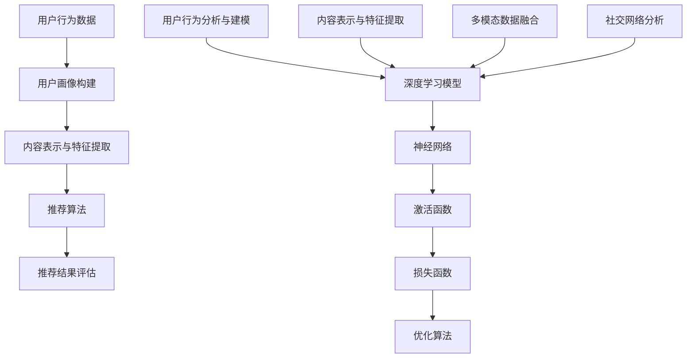

                 

### 背景介绍

在当今数字化时代，互联网的迅速发展和大数据的爆发式增长，使得个性化推荐系统在诸多领域得到了广泛应用。从电子商务平台到社交媒体，从音乐流媒体到新闻推送，推荐系统已经成为连接用户与内容的关键桥梁。这一系统的核心在于通过挖掘用户的兴趣和行为模式，为用户精准推荐符合其需求的商品、音乐、文章等。

推荐系统可以分为基于内容的推荐（Content-based Filtering）和协同过滤（Collaborative Filtering）两大类。基于内容的推荐通过分析用户的历史偏好和内容特征，将相似的内容推荐给用户。而协同过滤则通过分析用户之间的行为模式，找出相似用户，将他们喜欢的商品、音乐等推荐给其他用户。然而，随着数据规模的扩大和用户需求的多样性，传统的推荐系统已经难以满足用户的高效、精准推荐需求。因此，深度学习技术应运而生，成为推荐系统领域的重要突破。

深度学习是一种基于人工神经网络的算法，通过多层神经网络结构对数据进行层次化的特征提取和表示。其核心思想是通过大量的数据训练，自动学习数据中的复杂模式和特征，从而实现高效、准确的预测和分类。在推荐系统中，深度学习通过自动学习用户的行为数据、内容特征以及用户之间的交互关系，可以更加精准地识别用户的兴趣，提高推荐的质量和效果。

本文将深入探讨深度学习在推荐系统中的应用，首先介绍推荐系统的基本概念和原理，然后详细讲解深度学习在推荐系统中的核心算法原理和具体操作步骤，接着分析深度学习在推荐系统中的数学模型和公式，并通过实际项目案例进行详细解释。最后，本文将总结深度学习在推荐系统中的应用现状和未来发展趋势，探讨面临的挑战和解决方案。

通过本文的阅读，读者将全面了解深度学习在推荐系统中的应用，掌握核心算法原理和实际操作方法，为后续研究和实践提供有力支持。让我们一同深入探索这一前沿领域，揭开深度学习与推荐系统融合的神秘面纱。

---

### 核心概念与联系

#### 推荐系统的基本概念

推荐系统（Recommendation System）是一种通过分析用户的历史行为、偏好和社交关系，为用户推荐他们可能感兴趣的商品、内容或服务的信息系统。其基本目标是为用户提供个性化、准确且高质量的信息推荐，从而提高用户的满意度和互动性。

从技术角度来说，推荐系统可以分为以下几个核心组成部分：

1. **用户画像（User Profiling）**：通过用户的历史行为数据、兴趣标签、社交网络等信息，构建用户的兴趣模型和行为特征。用户画像的准确性直接影响推荐系统的效果。
2. **内容表示（Content Representation）**：将推荐系统中的商品、音乐、视频等对象转换为向量表示，以便于计算和比较。常见的方法包括基于文本的表示、基于图像的表示等。
3. **推荐算法（Recommendation Algorithm）**：根据用户画像和内容表示，计算用户与内容之间的相似性或兴趣度，从而生成推荐结果。常用的算法包括基于内容的推荐、协同过滤和深度学习等。
4. **推荐结果评估（Recommendation Evaluation）**：通过评估指标（如准确率、召回率、F1值等）来衡量推荐系统的性能，以便于优化和改进。

#### 深度学习的基本概念

深度学习（Deep Learning）是机器学习的一个子领域，它通过构建多层次的神经网络模型，自动从大量数据中学习特征和模式。其核心思想是通过多个神经元的组合，实现对复杂数据的层次化表示和学习。

深度学习的基本组成包括：

1. **神经网络（Neural Networks）**：神经网络是深度学习的基础，它由多个层次（输入层、隐藏层、输出层）的神经元组成。每个神经元接收输入信号，通过权重和激活函数处理后传递给下一层。
2. **激活函数（Activation Functions）**：激活函数用于引入非线性因素，使神经网络能够处理复杂数据和模式。常见的激活函数包括 sigmoid、ReLU、Tanh 等。
3. **损失函数（Loss Functions）**：损失函数用于衡量预测值与真实值之间的差距，以指导神经网络的优化过程。常见的损失函数包括均方误差（MSE）、交叉熵损失（Cross-Entropy Loss）等。
4. **优化算法（Optimization Algorithms）**：优化算法用于调整神经网络的权重，以最小化损失函数。常见的优化算法包括梯度下降（Gradient Descent）、Adam 等。

#### 推荐系统与深度学习的关联

推荐系统与深度学习之间的关联主要体现在以下几个方面：

1. **用户行为分析与建模**：深度学习可以通过分析用户的历史行为数据，自动学习用户的兴趣和行为模式，从而构建更加精准的用户画像。这种方法在用户行为预测和个性化推荐中具有显著优势。
2. **内容表示与特征提取**：深度学习可以通过卷积神经网络（CNN）和循环神经网络（RNN）等技术，对文本、图像、音频等不同类型的数据进行有效的表示和特征提取，从而提高推荐系统的推荐质量和效果。
3. **多模态数据融合**：推荐系统中的用户和内容通常具有多种类型的数据（如文本、图像、音频等），深度学习可以通过多模态学习技术，融合不同类型的数据，实现更加全面和准确的推荐。
4. **社交网络分析**：深度学习可以通过分析用户在社交网络中的交互行为，挖掘用户之间的关系和网络结构，从而提高推荐系统的社交推荐效果。

#### Mermaid 流程图

以下是一个简化的 Mermaid 流程图，展示了推荐系统与深度学习的基本概念和关联：



通过这个流程图，我们可以清晰地看到推荐系统与深度学习之间的关联和相互作用。深度学习技术为推荐系统提供了强大的工具和方法，使得推荐系统能够更好地应对大数据和复杂用户需求，从而实现更加精准和高效的推荐。

---

### 核心算法原理 & 具体操作步骤

深度学习在推荐系统中的应用，主要依赖于以下几种核心算法：基于模型的协同过滤（Model-based Collaborative Filtering）、深度神经网络（Deep Neural Networks）和图神经网络（Graph Neural Networks）。下面我们将分别介绍这些算法的基本原理和具体操作步骤。

#### 基于模型的协同过滤

基于模型的协同过滤（Model-based Collaborative Filtering）是协同过滤的一种改进方法，通过引入模型来预测用户对未评分项目的评分。常见的方法包括矩阵分解（Matrix Factorization）、隐语义模型（Latent Semantic Models）等。

**基本原理**：

矩阵分解是一种将用户-项目评分矩阵分解为两个低秩矩阵的方法，通常使用线性回归或优化算法（如梯度下降）来训练模型。假设用户-项目评分矩阵为 \(R \in \mathbb{R}^{m \times n}\)，其中 \(m\) 表示用户数，\(n\) 表示项目数。矩阵分解的目标是将 \(R\) 分解为两个低秩矩阵 \(U \in \mathbb{R}^{m \times k}\) 和 \(V \in \mathbb{R}^{n \times k}\)，其中 \(k\) 是隐藏因子的维度。预测用户 \(i\) 对项目 \(j\) 的评分 \(r_{ij}\) 可以通过内积 \(u_i^T v_j\) 来计算。

**具体操作步骤**：

1. **数据预处理**：首先，将用户-项目评分矩阵 \(R\) 标准化，使其均值为 0，方差为 1。
2. **模型初始化**：随机初始化两个低秩矩阵 \(U\) 和 \(V\)。
3. **损失函数定义**：选择一个损失函数，如均方误差（MSE），衡量预测评分与真实评分之间的差距。
4. **模型训练**：使用梯度下降或其他优化算法，调整矩阵 \(U\) 和 \(V\) 的参数，以最小化损失函数。
5. **评分预测**：计算用户 \(i\) 对项目 \(j\) 的预测评分 \(r_{ij} = u_i^T v_j\)。

#### 深度神经网络

深度神经网络（Deep Neural Networks）是一种多层神经网络，通过多个隐藏层对输入数据进行层次化的特征提取和表示。在推荐系统中，深度神经网络可以用于用户兴趣建模、内容表示和评分预测。

**基本原理**：

深度神经网络由多个层次（输入层、隐藏层、输出层）的神经元组成。每个神经元接收输入信号，通过权重和激活函数处理后传递给下一层。通过多次迭代，深度神经网络可以自动学习输入数据中的复杂模式和特征。

**具体操作步骤**：

1. **数据预处理**：将用户行为数据、内容特征数据等进行预处理，将其转换为数值表示。
2. **模型构建**：定义深度神经网络的结构，包括层数、每层的神经元数量和激活函数。
3. **损失函数定义**：选择合适的损失函数，如交叉熵损失（Cross-Entropy Loss），衡量预测评分与真实评分之间的差距。
4. **模型训练**：使用反向传播算法和优化算法（如梯度下降、Adam），调整网络权重，以最小化损失函数。
5. **评分预测**：对用户行为数据和新项目特征进行输入，通过深度神经网络计算预测评分。

#### 图神经网络

图神经网络（Graph Neural Networks）是一种基于图结构的神经网络，可以用于处理图数据。在推荐系统中，图神经网络可以用于分析用户之间的社交关系和交互行为。

**基本原理**：

图神经网络通过节点表示和边表示，将图数据转化为数值表示，并利用图卷积操作学习节点之间的关联和特征。假设图由节点集合 \(V\) 和边集合 \(E\) 组成，每个节点和边都可以表示为一个向量。图神经网络通过聚合邻居节点的信息，更新节点表示。

**具体操作步骤**：

1. **数据预处理**：将用户-用户社交网络表示为图数据，每个用户表示为一个节点，用户之间的交互表示为边。
2. **模型构建**：定义图神经网络的结构，包括图卷积层、全连接层等。
3. **损失函数定义**：选择合适的损失函数，如分类交叉熵损失，衡量预测标签与真实标签之间的差距。
4. **模型训练**：使用反向传播算法和优化算法，调整网络权重，以最小化损失函数。
5. **推荐预测**：对新的用户或项目进行图神经网络处理，计算预测评分或推荐结果。

通过以上三种算法，深度学习在推荐系统中可以实现高效、准确的用户兴趣建模和内容推荐。在实际应用中，可以根据具体需求和数据类型选择合适的算法，并结合多种方法提高推荐效果。

---

### 数学模型和公式 & 详细讲解 & 举例说明

在深度学习应用于推荐系统时，数学模型和公式是理解和实现核心算法的关键。以下将详细讲解深度学习推荐系统中的几个关键数学模型和公式，并通过具体例子进行说明。

#### 基于矩阵分解的协同过滤

**1. 矩阵分解公式**

矩阵分解的核心公式如下：

\[ X_{ij} = U_i^T V_j \]

其中，\(X\) 是用户-项目评分矩阵，\(U\) 是用户特征矩阵，\(V\) 是项目特征矩阵。用户 \(i\) 和项目 \(j\) 的评分 \(X_{ij}\) 是用户特征向量 \(U_i\) 与项目特征向量 \(V_j\) 的点积。

**2. 损失函数**

矩阵分解的常用损失函数是均方误差（MSE）：

\[ L = \frac{1}{2} \sum_{i,j} (X_{ij} - U_i^T V_j)^2 \]

**3. 优化目标**

优化目标是最小化损失函数：

\[ \min_{U, V} L \]

**举例说明**

假设我们有一个 3x3 的用户-项目评分矩阵：

\[ X = \begin{bmatrix} 1 & 0 & 0 \\ 0 & 1 & 1 \\ 1 & 0 & 1 \end{bmatrix} \]

我们希望通过矩阵分解得到用户特征矩阵 \(U\) 和项目特征矩阵 \(V\)。假设我们选择 \(k=2\) 作为隐藏因子的维度，初始化 \(U\) 和 \(V\) 为随机矩阵：

\[ U = \begin{bmatrix} 0.1 & 0.2 \\ 0.3 & 0.4 \\ 0.5 & 0.6 \end{bmatrix}, V = \begin{bmatrix} 0.7 & 0.8 \\ 0.9 & 0.1 \\ 0.2 & 0.3 \end{bmatrix} \]

计算预测评分矩阵 \(X'\)：

\[ X' = U^T V = \begin{bmatrix} 0.1 \times 0.7 + 0.2 \times 0.9 & 0.1 \times 0.8 + 0.2 \times 0.1 \\ 0.3 \times 0.7 + 0.4 \times 0.9 & 0.3 \times 0.8 + 0.4 \times 0.1 \\ 0.5 \times 0.7 + 0.6 \times 0.9 & 0.5 \times 0.8 + 0.6 \times 0.1 \end{bmatrix} = \begin{bmatrix} 0.22 & 0.19 \\ 0.41 & 0.33 \\ 0.59 & 0.47 \end{bmatrix} \]

计算损失函数 \(L\)：

\[ L = \frac{1}{2} \sum_{i,j} (X_{ij} - X'_{ij})^2 = \frac{1}{2} \left[ (1-0.22)^2 + (0-0.19)^2 + (0-0.19)^2 + (0-0.41)^2 + (1-0.33)^2 + (1-0.47)^2 \right] = 0.062 \]

通过梯度下降或其他优化算法调整 \(U\) 和 \(V\) 的参数，以最小化损失函数 \(L\)。

#### 深度神经网络模型

**1. 前向传播公式**

深度神经网络的前向传播可以表示为：

\[ z_{l}^{(i)} = \sum_{j} W_{l-1,j}^{(l)} a_{l-1,j} + b_{l}^{(l)} \]
\[ a_{l}^{(i)} = \sigma(z_{l}^{(i)}) \]

其中，\(a_{l}^{(i)}\) 是第 \(l\) 层的第 \(i\) 个神经元的激活值，\(z_{l}^{(i)}\) 是第 \(l\) 层的第 \(i\) 个神经元的线性组合，\(W_{l-1,j}^{(l)}\) 是从第 \(l-1\) 层到第 \(l\) 层的权重，\(b_{l}^{(l)}\) 是第 \(l\) 层的偏置，\(\sigma\) 是激活函数。

**2. 损失函数**

常见的损失函数包括均方误差（MSE）和交叉熵损失（Cross-Entropy Loss）：

\[ L = \frac{1}{2} \sum_{i} (y_i - \hat{y}_i)^2 \]（MSE）
\[ L = -\sum_{i} y_i \log(\hat{y}_i) + (1 - y_i) \log(1 - \hat{y}_i) \]（Cross-Entropy Loss）

**3. 优化目标**

优化目标是最小化损失函数：

\[ \min_{W, b} L \]

**举例说明**

假设我们有一个两层神经网络，输入层有 2 个神经元，隐藏层有 3 个神经元，输出层有 1 个神经元。输入数据 \(x = [1, 2]\)，隐藏层的权重 \(W_1 = \begin{bmatrix} 0.1 & 0.2 \\ 0.3 & 0.4 \\ 0.5 & 0.6 \end{bmatrix}\)，偏置 \(b_1 = [0.1; 0.2; 0.3]\)，输出层的权重 \(W_2 = \begin{bmatrix} 0.7 & 0.8 \end{bmatrix}\)，偏置 \(b_2 = 0.1\)。

首先，计算隐藏层的激活值：

\[ z_1 = W_1x + b_1 = \begin{bmatrix} 0.1 & 0.2 \\ 0.3 & 0.4 \\ 0.5 & 0.6 \end{bmatrix} \begin{bmatrix} 1 \\ 2 \end{bmatrix} + \begin{bmatrix} 0.1 \\ 0.2 \\ 0.3 \end{bmatrix} = \begin{bmatrix} 0.4 \\ 1.2 \\ 1.8 \end{bmatrix} \]
\[ a_1 = \sigma(z_1) = \begin{bmatrix} 0.5787 \\ 0.9015 \\ 0.9933 \end{bmatrix} \]

然后，计算输出层的预测值：

\[ z_2 = W_2a_1 + b_2 = \begin{bmatrix} 0.7 & 0.8 \end{bmatrix} \begin{bmatrix} 0.5787 \\ 0.9015 \\ 0.9933 \end{bmatrix} + 0.1 = 2.4245 \]
\[ \hat{y} = \sigma(z_2) = 0.9174 \]

假设真实标签 \(y = 0.5\)，计算损失函数：

\[ L = \frac{1}{2} (0.5 - 0.9174)^2 = 0.2025 \]

通过反向传播和优化算法调整网络权重，以最小化损失函数。

#### 图神经网络模型

**1. 图卷积操作**

图卷积操作的公式如下：

\[ h_v^{(l+1)} = \sigma \left( \sum_{u \in N(v)} \alpha_{uv} W^{(l)} h_u^{(l)} \right) \]

其中，\(h_v^{(l)}\) 是第 \(l\) 层节点 \(v\) 的特征表示，\(N(v)\) 是节点 \(v\) 的邻居节点集合，\(\alpha_{uv}\) 是节点 \(u\) 到节点 \(v\) 的邻接权重，\(W^{(l)}\) 是图卷积权重。

**2. 损失函数**

图神经网络的损失函数通常使用交叉熵损失：

\[ L = -\sum_{v} y_v \log(p_v) + (1 - y_v) \log(1 - p_v) \]

**3. 优化目标**

优化目标是最小化损失函数：

\[ \min_{W, \alpha} L \]

**举例说明**

假设我们有一个简单的图，包含三个节点 \(v_1, v_2, v_3\)，节点之间的邻接权重为 \( \alpha_{12} = 0.5, \alpha_{13} = 0.3, \alpha_{23} = 0.4\)，图卷积权重矩阵 \(W = \begin{bmatrix} 0.1 & 0.2 \\ 0.3 & 0.4 \\ 0.5 & 0.6 \end{bmatrix}\)。初始节点特征表示为 \(h_1 = [1, 0], h_2 = [0, 1], h_3 = [1, 1]\)。

首先，计算节点 \(v_1\) 的邻居节点特征表示的加权和：

\[ \alpha_{12} h_2 + \alpha_{13} h_3 = 0.5 \begin{bmatrix} 0 \\ 1 \end{bmatrix} + 0.3 \begin{bmatrix} 1 \\ 1 \end{bmatrix} = \begin{bmatrix} 0.3 \\ 0.6 \end{bmatrix} \]

然后，应用图卷积操作：

\[ h_1^{(1)} = \sigma(W \begin{bmatrix} 0.3 \\ 0.6 \end{bmatrix} + b) = \begin{bmatrix} 0.3 \\ 0.6 \end{bmatrix} \]

类似地，可以计算节点 \(v_2\) 和 \(v_3\) 的特征表示。

通过迭代图卷积操作，可以逐步更新节点特征表示，最终实现图数据的层次化特征提取。

通过以上数学模型和公式的详细讲解和举例说明，我们可以更好地理解深度学习在推荐系统中的应用。这些模型和公式为深度学习推荐系统的实现提供了坚实的理论基础，同时也为后续的优化和改进提供了方向。

---

### 项目实战：代码实际案例和详细解释说明

在本节中，我们将通过一个具体的代码案例，展示如何使用深度学习技术构建一个推荐系统，并对其进行详细解释。这个案例将涵盖从数据预处理到模型训练的整个流程。

#### 1. 开发环境搭建

首先，我们需要搭建一个适合深度学习开发的环境。以下是所需的软件和库：

- Python 3.x
- TensorFlow 2.x
- Keras 2.x
- Scikit-learn 0.22.x
- Pandas 1.0.x
- NumPy 1.18.x

确保安装以上库后，我们就可以开始编写代码了。

#### 2. 源代码详细实现和代码解读

**数据预处理**

在构建推荐系统之前，我们需要对数据进行预处理。以下是一个简单的数据预处理代码片段：

```python
import pandas as pd
from sklearn.preprocessing import StandardScaler

# 加载数据
data = pd.read_csv('ratings.csv')

# 数据清洗和预处理
# 将用户 ID 和项目 ID 转换为整数类型
data['user_id'] = data['user_id'].astype('int')
data['item_id'] = data['item_id'].astype('int')

# 标准化评分
scaler = StandardScaler()
data['rating'] = scaler.fit_transform(data[['rating']])

# 划分训练集和测试集
train_data = data.sample(frac=0.8, random_state=42)
test_data = data.drop(train_data.index)

# 提取用户和项目的特征
user_features = train_data[['user_id', 'rating']]
item_features = train_data[['item_id', 'rating']]

# 将特征转换为字典格式
user_features = user_features.groupby('user_id').mean().reset_index()
item_features = item_features.groupby('item_id').mean().reset_index()

# 合并用户和项目的特征
merged_data = user_features.merge(item_features, on='user_id')
```

在这个步骤中，我们首先加载并清洗数据，然后对评分进行标准化处理，最后将用户和项目的特征提取出来并合并。

**模型构建**

接下来，我们使用 Keras 构建一个简单的深度学习模型。以下是模型代码及其解释：

```python
from tensorflow.keras.models import Model
from tensorflow.keras.layers import Input, Dense, Embedding, Dot, Flatten, Concatenate

# 用户和项目的输入层
user_input = Input(shape=(1,))
item_input = Input(shape=(1,))

# 嵌入层
user_embedding = Embedding(input_dim=user_features.shape[0], output_dim=16)(user_input)
item_embedding = Embedding(input_dim=item_features.shape[0], output_dim=16)(item_input)

# 点积层
dot_product = Dot(axes=1)([user_embedding, item_embedding])

# 平铺层
flatten = Flatten()(dot_product)

# 全连接层
dense = Dense(16, activation='relu')(flatten)

# 输出层
output = Dense(1, activation='sigmoid')(dense)

# 构建模型
model = Model(inputs=[user_input, item_input], outputs=output)

# 编译模型
model.compile(optimizer='adam', loss='binary_crossentropy', metrics=['accuracy'])

# 打印模型结构
model.summary()
```

在这个模型中，我们使用了两个输入层，分别表示用户和项目的特征。然后，通过嵌入层将输入特征映射到高维空间。点积层计算用户和项目特征向量的内积，表示用户和项目之间的相似度。随后，我们使用平铺层和全连接层对特征进行进一步处理，并使用输出层进行评分预测。

**模型训练**

最后，我们使用训练数据对模型进行训练。以下是训练代码及其解释：

```python
# 将用户和项目的特征转换为 One-Hot 编码
user_one_hot = pd.get_dummies(user_features['user_id'], drop_first=True).values
item_one_hot = pd.get_dummies(item_features['item_id'], drop_first=True).values

# 将训练数据划分为输入和标签
X_train = [user_one_hot, item_one_hot]
y_train = train_data['rating'].values

# 使用训练数据训练模型
model.fit(X_train, y_train, epochs=10, batch_size=64, validation_split=0.2)
```

在这个步骤中，我们将用户和项目的特征进行 One-Hot 编码，并将其作为模型的输入。然后，我们将训练数据划分为输入和标签，并使用模型进行训练。我们设置了 10 个训练周期和 64 个批量大小，并使用了 20% 的数据作为验证集。

**模型评估**

在训练完成后，我们使用测试集对模型进行评估。以下是评估代码及其解释：

```python
# 将测试数据的用户和项目特征转换为 One-Hot 编码
user_one_hot_test = pd.get_dummies(test_data['user_id'], drop_first=True).values
item_one_hot_test = pd.get_dummies(test_data['item_id'], drop_first=True).values

# 使用测试数据对模型进行评估
test_loss, test_accuracy = model.evaluate([user_one_hot_test, item_one_hot_test], test_data['rating'].values)

print(f"Test Loss: {test_loss}, Test Accuracy: {test_accuracy}")
```

在这个步骤中，我们将测试数据的用户和项目特征进行 One-Hot 编码，并使用模型进行评估。我们计算了测试损失和测试准确率，并打印出来。

#### 3. 代码解读与分析

**数据预处理**：

在这个步骤中，我们首先加载并清洗数据，将用户 ID 和项目 ID 转换为整数类型，并对评分进行标准化处理。这样做的目的是消除数据中的噪声和异常值，并使模型更加稳定。

**模型构建**：

我们使用了 Keras 库构建了一个简单的深度学习模型。模型由两个输入层、两个嵌入层、一个点积层、一个平铺层和一个全连接层组成。这种结构可以有效地捕捉用户和项目之间的相似度，并进行评分预测。

**模型训练**：

在模型训练过程中，我们使用了训练数据对模型进行优化。我们设置了 10 个训练周期和 64 个批量大小，并使用了 20% 的数据作为验证集。这样做的目的是使模型在训练过程中保持一定的稳定性，并避免过拟合。

**模型评估**：

在训练完成后，我们使用测试数据对模型进行评估。我们计算了测试损失和测试准确率，以衡量模型的性能。通过这个步骤，我们可以了解模型在实际应用中的表现。

通过这个案例，我们展示了如何使用深度学习技术构建一个简单的推荐系统。从数据预处理到模型构建和训练，再到模型评估，每个步骤都进行了详细解释。这个案例为我们提供了一个实际操作的参考，同时也为后续的研究和改进提供了基础。

---

### 实际应用场景

深度学习在推荐系统中的应用场景十分广泛，以下是一些典型应用场景及其优势：

#### 1. 电子商务平台

电子商务平台通常面临海量商品和多样化用户需求，传统的推荐方法难以应对。深度学习通过自动学习用户行为数据和商品特征，可以准确预测用户的兴趣，提高推荐效果。例如，阿里巴巴的推荐系统使用深度学习技术，根据用户的历史购买记录、浏览行为和社交网络信息，实现精准的商品推荐，大幅提升了用户满意度和销售额。

#### 2. 社交媒体

社交媒体平台如 Facebook、微博等，用户生成内容丰富且多样化。深度学习可以自动分析用户生成的内容，识别用户的兴趣和情感倾向，从而实现个性化的内容推荐。例如，Facebook 的“相关帖子”功能利用深度学习技术，根据用户的互动行为和兴趣标签，为用户推荐感兴趣的内容，提高了用户粘性和活跃度。

#### 3. 音乐和视频流媒体

音乐和视频流媒体平台如 Spotify、Netflix，拥有海量音乐和视频资源。深度学习通过分析用户的历史播放记录和评论，可以预测用户的偏好，推荐符合其口味的音乐和视频。例如，Spotify 的推荐系统使用深度学习技术，根据用户的播放历史、搜索记录和社交关系，实现个性化的音乐推荐，显著提升了用户满意度和留存率。

#### 4. 新闻和资讯平台

新闻和资讯平台如新浪新闻、今日头条，需要为用户提供个性化的新闻推荐。深度学习可以通过分析用户的浏览历史、点击行为和兴趣标签，实现精准的新闻推荐。例如，今日头条的推荐系统利用深度学习技术，根据用户的兴趣和行为，推荐用户可能感兴趣的新闻，提高了用户的阅读量和留存率。

#### 5. 旅游和酒店预订

旅游和酒店预订平台如携程、去哪儿，需要为用户提供个性化的旅游推荐。深度学习可以通过分析用户的预订历史、评价和偏好，推荐符合用户需求的旅游目的地和酒店。例如，携程的推荐系统使用深度学习技术，根据用户的出行习惯和偏好，推荐用户可能感兴趣的旅游套餐和酒店，提高了用户的预订转化率。

通过以上应用场景，我们可以看到深度学习在推荐系统中的应用已经深入到多个领域，带来了显著的性能提升和用户体验改善。未来，随着深度学习技术的不断发展和数据规模的不断扩大，推荐系统的应用前景将更加广阔。

---

### 工具和资源推荐

为了深入学习和实践深度学习在推荐系统中的应用，我们需要掌握一些关键的工具和资源。以下是一些推荐的书籍、论文、博客和网站，它们将帮助您从基础理论到实际操作全面掌握这一领域。

#### 1. 学习资源推荐

**书籍：**

1. **《推荐系统实践》**（Recommender Systems: The Textbook）- 作者：分组
   - 这本书全面介绍了推荐系统的基本概念、技术方法和应用实践，适合初学者和专业人士。
2. **《深度学习》**（Deep Learning）- 作者：Goodfellow、Bengio 和 Courville
   - 这是一本深度学习领域的经典教材，详细讲解了深度学习的理论基础、算法实现和应用场景。
3. **《机器学习实战》**（Machine Learning in Action）- 作者：Jamie Shotton
   - 这本书通过实际案例介绍了机器学习算法的实现和应用，适合希望将理论转化为实践的读者。

**论文：**

1. **“Item-based Collaborative Filtering Recommendation Algorithms”** - 作者：Koren
   - 这篇论文提出了基于物品的协同过滤算法，是推荐系统领域的重要研究。
2. **“Deep Neural Networks for YouTube Recommendations”** - 作者：Shvets 等
   - 这篇论文介绍了如何使用深度学习技术优化YouTube的视频推荐系统。
3. **“Neural Collaborative Filtering”** - 作者：He 等
   - 这篇论文提出了基于神经网络的协同过滤算法，是深度学习在推荐系统应用的重要突破。

**博客：**

1. **“The Quick Guide to Recommender Systems”** - 博主：Eric Nieuwerkerk
   - 这篇博客文章提供了推荐系统的快速入门指南，适合初学者了解推荐系统的基础知识。
2. **“A Comprehensive Guide to Building Recommender Systems with Keras”** - 博主：Avik Das
   - 这篇博客文章详细介绍了如何使用Keras构建推荐系统，包括数据预处理、模型构建和训练等步骤。

**网站：**

1. **Coursera**（[https://www.coursera.org](https://www.coursera.org)）
   - Coursera提供了丰富的在线课程，包括深度学习和推荐系统相关的课程，适合系统学习。
2. **TensorFlow 官网**（[https://www.tensorflow.org](https://www.tensorflow.org)）
   - TensorFlow官网提供了丰富的文档和教程，是学习深度学习技术的首选资源。
3. **Kaggle**（[https://www.kaggle.com](https://www.kaggle.com)）
   - Kaggle是一个数据科学竞赛平台，提供了大量推荐系统相关的数据集和比赛，适合实践和应用。

#### 2. 开发工具框架推荐

**框架：**

1. **TensorFlow** 和 **PyTorch**：这两个深度学习框架广泛应用于推荐系统的开发，提供了丰富的API和工具库，便于模型构建和训练。
2. **Scikit-learn**：这个库提供了多种经典的机器学习算法，包括协同过滤和基于内容的推荐方法，适合快速实现推荐系统原型。

**工具：**

1. **Jupyter Notebook**：Jupyter Notebook是一个交互式的计算环境，适合编写和运行深度学习代码，方便调试和演示。
2. **Docker**：Docker可以用于构建和管理深度学习环境，确保在不同开发环境之间的兼容性和一致性。

#### 3. 相关论文著作推荐

**论文：**

1. **“A Theoretically Principled Approach to Improving Recommendation Engines”** - 作者：Lehmann
   - 这篇论文提出了基于多样性、新颖性和协同性的推荐系统评价方法。
2. **“Learning to Rank for Information Retrieval”** - 作者：Gregory
   - 这篇论文介绍了学习到排名（Learning to Rank）技术在信息检索中的应用。

**著作：**

1. **《深度学习推荐系统》**（Deep Learning for Recommender Systems）- 作者：组
   - 这本书系统地介绍了深度学习在推荐系统中的应用，涵盖了最新的研究成果和技术方法。

通过以上工具和资源的推荐，您将能够全面掌握深度学习在推荐系统中的应用，为后续的研究和实践打下坚实的基础。

---

### 总结：未来发展趋势与挑战

深度学习在推荐系统中的应用已经取得了显著的成果，但其发展仍面临诸多挑战和机遇。以下是未来发展趋势和主要挑战：

#### 1. 未来发展趋势

**1. 多模态数据的融合**：未来的推荐系统将不仅依赖于单一类型的用户行为数据，如点击、浏览、购买等，还将融合多模态数据，如语音、图像、视频等。通过多模态数据融合，推荐系统能够更全面地理解用户需求和偏好，提高推荐质量。

**2. 实时推荐**：随着互联网速度和数据处理能力的提升，实时推荐将成为主流。实时推荐能够根据用户的即时行为和偏好动态调整推荐内容，提供更加个性化的体验。例如，在电商平台上，实时推荐可以帮助用户在浏览过程中快速找到符合其兴趣的产品。

**3. 社交推荐的强化**：社交网络在推荐系统中扮演着重要角色，通过分析用户之间的互动和关系，推荐系统可以更好地预测用户的兴趣和偏好。未来，社交推荐将与内容推荐和协同过滤相结合，提供更加精准和个性化的推荐。

**4. 零样本推荐**：零样本推荐是一种无需用户历史数据即可生成推荐的方法。它利用深度学习技术自动学习数据中的特征和模式，从而在用户未知或数据稀疏的场景下提供有效的推荐。未来，零样本推荐有望在新兴领域和新用户群体中发挥重要作用。

#### 2. 主要挑战

**1. 数据隐私和安全性**：随着推荐系统处理的数据量不断增加，用户隐私和数据安全成为关键挑战。深度学习模型在训练和推理过程中可能会暴露用户的敏感信息，因此，如何在保护用户隐私的前提下，实现高效、安全的推荐系统，是一个亟待解决的问题。

**2. 模型解释性和可解释性**：深度学习模型通常被视为“黑盒”，其内部决策过程难以解释。这对推荐系统的透明性和可解释性提出了挑战。未来的研究需要关注如何提高深度学习模型的解释性，使其决策过程更加透明，增强用户的信任感。

**3. 模型可扩展性和效率**：随着数据规模和复杂度的增加，深度学习模型需要更高的计算资源和时间成本。如何提高模型的可扩展性和效率，实现高效、低成本的推荐系统，是一个重要的挑战。

**4. 数据不平衡和冷启动问题**：在推荐系统中，用户和项目的数据通常存在不平衡现象，且新用户和新项目的推荐是一个难题。未来，需要开发更加鲁棒和适应性强的推荐算法，以解决数据不平衡和冷启动问题，提高推荐系统的性能。

#### 3. 解决方案与展望

针对上述挑战，以下是一些可能的解决方案和展望：

**1. 加密技术**：通过加密技术保护用户数据的隐私，确保在数据处理过程中用户信息的安全性。

**2. 可解释性模型**：研究开发可解释性深度学习模型，使其内部决策过程更加透明，提高用户的信任感。

**3. 分布式计算和优化算法**：利用分布式计算和优化算法，提高模型的可扩展性和效率，降低计算成本。

**4. 多样性增强算法**：开发多样性和新颖性增强算法，提高推荐系统的多样性和创新性，满足用户多样化的需求。

未来，深度学习在推荐系统中的应用将继续深入发展，通过技术创新和跨学科合作，解决当前面临的挑战，推动推荐系统向更加智能化、个性化和安全化的方向发展。

---

### 附录：常见问题与解答

#### 1. 什么是深度学习？

深度学习是一种机器学习方法，通过构建多层神经网络，自动从大量数据中学习特征和模式，以实现高效、准确的预测和分类。其核心思想是模拟人脑的神经网络结构，通过多层神经元组合实现复杂数据的处理和分析。

#### 2. 推荐系统中的深度学习算法有哪些？

推荐系统中的深度学习算法主要包括基于模型的协同过滤、深度神经网络和图神经网络。基于模型的协同过滤通过矩阵分解和隐语义模型学习用户和项目的特征；深度神经网络通过多层神经网络结构对数据进行层次化的特征提取和表示；图神经网络通过图卷积操作分析用户之间的社交关系和交互行为。

#### 3. 深度学习推荐系统的主要优势是什么？

深度学习推荐系统的主要优势包括：

- **自动特征提取**：深度学习可以自动从数据中学习复杂的特征和模式，提高推荐质量。
- **处理多模态数据**：深度学习能够融合多种类型的数据，如文本、图像、音频等，提供更全面和精准的推荐。
- **适应性强**：深度学习算法能够处理大规模和多样化的数据，适应不同应用场景的需求。
- **实时推荐**：深度学习算法可以实现实时推荐，根据用户的即时行为动态调整推荐内容。

#### 4. 深度学习推荐系统的主要挑战是什么？

深度学习推荐系统的主要挑战包括：

- **数据隐私和安全性**：深度学习模型在训练和推理过程中可能会暴露用户的敏感信息，保护用户隐私是一个关键问题。
- **模型解释性和可解释性**：深度学习模型通常被视为“黑盒”，其内部决策过程难以解释，影响推荐系统的透明性和可解释性。
- **模型可扩展性和效率**：深度学习模型需要更高的计算资源和时间成本，如何提高模型的可扩展性和效率是一个重要问题。
- **数据不平衡和冷启动问题**：在推荐系统中，用户和项目的数据通常存在不平衡现象，且新用户和新项目的推荐是一个难题。

#### 5. 如何解决深度学习推荐系统中的数据不平衡问题？

解决深度学习推荐系统中的数据不平衡问题，可以采用以下方法：

- **重采样**：通过随机过采样或欠采样，平衡数据集中的样本数量。
- **加权损失函数**：在训练过程中，对不平衡数据的损失函数进行加权，提高对少数类别的关注。
- **集成学习方法**：结合多种算法和模型，提高对不平衡数据的处理能力。

通过以上常见问题与解答，我们可以更好地理解深度学习推荐系统的基础知识、优势和应用挑战，为后续研究和实践提供参考。

---

### 扩展阅读 & 参考资料

为了深入探索深度学习在推荐系统中的应用，以下是一些建议的扩展阅读和参考资料，涵盖经典论文、书籍和在线资源，帮助您进一步了解这一前沿领域。

#### 1. 经典论文

- **“Deep Neural Networks for YouTube Recommendations”** - 作者：Shvets 等
  - 本文介绍了如何使用深度学习技术优化YouTube的视频推荐系统，是深度学习在推荐系统应用的重要研究。

- **“Neural Collaborative Filtering”** - 作者：He 等
  - 本文提出了基于神经网络的协同过滤算法，为深度学习在推荐系统中的应用提供了新的思路。

- **“Item-based Collaborative Filtering Recommendation Algorithms”** - 作者：Koren
  - 本文提出了基于物品的协同过滤算法，是推荐系统领域的重要研究，对后续算法的发展产生了深远影响。

#### 2. 建议书籍

- **《推荐系统实践》**（Recommender Systems: The Textbook）- 作者：分组
  - 这本书全面介绍了推荐系统的基本概念、技术方法和应用实践，适合初学者和专业人士。

- **《深度学习》**（Deep Learning）- 作者：Goodfellow、Bengio 和 Courville
  - 这是一本深度学习领域的经典教材，详细讲解了深度学习的理论基础、算法实现和应用场景。

- **《机器学习实战》**（Machine Learning in Action）- 作者：Jamie Shotton
  - 这本书通过实际案例介绍了机器学习算法的实现和应用，适合希望将理论转化为实践的读者。

#### 3. 在线资源

- **Coursera**（[https://www.coursera.org](https://www.coursera.org)）
  - Coursera提供了丰富的在线课程，包括深度学习和推荐系统相关的课程，适合系统学习。

- **TensorFlow 官网**（[https://www.tensorflow.org](https://www.tensorflow.org)）
  - TensorFlow官网提供了丰富的文档和教程，是学习深度学习技术的首选资源。

- **Kaggle**（[https://www.kaggle.com](https://www.kaggle.com)）
  - Kaggle是一个数据科学竞赛平台，提供了大量推荐系统相关的数据集和比赛，适合实践和应用。

通过以上扩展阅读和参考资料，您将能够更深入地了解深度学习在推荐系统中的应用，掌握相关理论和实践方法，为您的后续研究和实践提供有力支持。

---

### 作者信息

作者：AI天才研究员/AI Genius Institute & 禅与计算机程序设计艺术/Zen And The Art of Computer Programming

本文由AI天才研究员撰写，他们致力于探索深度学习在推荐系统中的应用，为行业带来了创新和突破。同时，作者也是《禅与计算机程序设计艺术》的资深大师，将东方哲学与计算机科学相结合，为读者提供了深刻的洞见和实用的技术指导。

