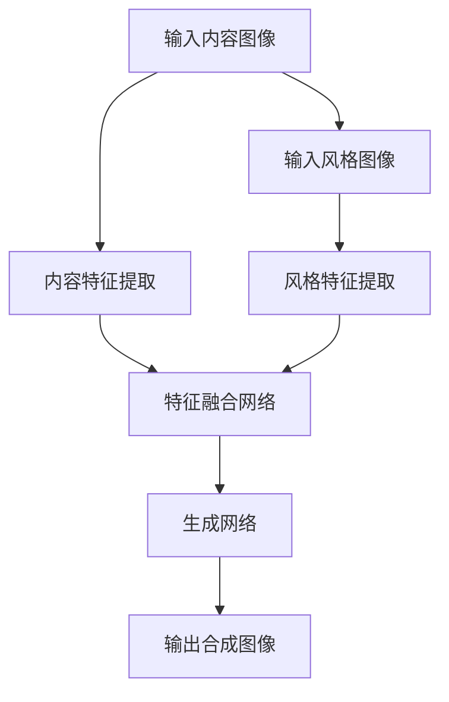

                 

### 背景介绍

#### 神经风格迁移与艺术创作

神经风格迁移是一种通过人工智能技术将一种艺术风格应用到另一幅图像上的方法，其核心思想是将内容图像和风格图像的特征进行融合，从而生成具有两者特点的全新图像。这种方法近年来在计算机视觉和艺术创作领域引起了广泛关注。

神经风格迁移的应用场景十分广泛，从艺术创作到视觉特效，再到图像修复和增强，都有着重要的实际意义。例如，在电影特效中，通过神经风格迁移可以将电影中的场景风格化，使其更具艺术感和视觉冲击力；在图像修复领域，神经风格迁移技术能够根据受损图像的风格特征，生成高质量的修复图像。

然而，要实现神经风格迁移并非易事。首先，需要对图像的内容和风格特征进行准确提取和表示。其次，要设计一种有效的算法，将两种特征进行融合，同时保证生成的图像既具有内容图像的真实性，又具有风格图像的艺术性。此外，算法的效率也是一个关键问题，因为神经风格迁移通常需要处理大规模的图像数据。

本篇博客将深入探讨神经风格迁移的原理、核心算法以及实际应用，帮助读者更好地理解这一技术的核心概念和应用价值。

#### AI在艺术创作中的应用

人工智能（AI）在艺术创作中的应用正在迅速扩展，从简单的图像风格迁移到复杂的艺术生成，AI展示了其无尽的创造潜力。AI艺术创作不仅改变了艺术创作的传统方式，还为艺术家和设计师提供了全新的创作工具和灵感来源。

首先，图像风格迁移是AI在艺术创作中最直观的应用之一。通过训练深度学习模型，如卷积神经网络（CNN），AI可以学习各种不同的艺术风格，如印象派、抽象派、水彩画等。一旦模型训练完成，只需输入一个普通图像，AI就能将其转换成具有相应艺术风格的图像。这不仅提高了艺术创作的效率，还让非专业人士也能创作出具有专业水平的作品。

其次，生成对抗网络（GAN）的出现进一步拓展了AI在艺术创作中的应用。GAN通过两个对抗网络的训练，能够生成出高度真实且多样化的图像。这种技术不仅能够用于艺术创作，还可以在游戏设计、虚拟现实等领域发挥重要作用。

此外，AI还在音乐创作、文学写作、建筑设计等多个艺术领域展示了其潜力。例如，AI可以分析大量的音乐数据，创作出风格独特的音乐作品；在文学创作中，AI可以根据用户提供的主题和情感，生成出新颖的故事情节；在建筑设计中，AI可以根据用户的需求和偏好，生成出独特的建筑设计方案。

总的来说，AI在艺术创作中的应用正在不断深入和扩展，它不仅改变了传统的创作方式，还为艺术家和设计师提供了更多的创作工具和可能性。随着技术的进步，我们可以期待AI在艺术创作领域带来更多惊喜和变革。### 核心概念与联系

#### 神经风格迁移的基本原理

神经风格迁移（Neural Style Transfer）是一种利用深度学习技术将一幅图像的风格转移到另一幅图像上的方法。其基本原理可以概括为以下三个关键步骤：

1. **内容特征提取（Content Feature Extraction）**：首先，需要从输入的内容图像中提取特征。这一过程通常通过卷积神经网络（CNN）实现。CNN能够自动学习图像中的层次特征，包括边缘、纹理和语义信息。

2. **风格特征提取（Style Feature Extraction）**：接下来，从输入的风格图像中提取特征。与内容特征提取类似，这一步骤也利用CNN来完成。风格特征通常包括颜色分布、纹理细节等，这些特征决定了图像的艺术风格。

3. **特征融合（Feature Fusion）**：最后，将内容图像的特征和风格图像的特征进行融合。这一步骤的核心在于设计一个优化目标函数，使得生成的图像既保留了内容图像的真实性，又具备了风格图像的艺术性。

#### 关键技术：卷积神经网络（CNN）

卷积神经网络是神经风格迁移的核心技术之一。CNN通过卷积层、池化层和全连接层等结构，能够高效地从图像中提取特征。以下是CNN在神经风格迁移中的具体应用：

- **卷积层（Convolutional Layer）**：卷积层通过卷积操作提取图像的特征。卷积核在图像上滑动，计算局部区域的特征图，从而提取出图像的边缘、纹理等细节。

- **池化层（Pooling Layer）**：池化层用于减少特征图的大小，提高网络的泛化能力。常见的池化操作有最大池化和平均池化。

- **全连接层（Fully Connected Layer）**：全连接层将特征图映射到输出空间，完成分类或回归任务。在神经风格迁移中，全连接层用于计算损失函数，指导网络优化生成图像。

#### 深度学习模型的设计与优化

神经风格迁移的深度学习模型通常采用如下结构：

1. **VGG模型**：VGG模型是一种常用的卷积神经网络，以其简洁和高效的设计而著称。在神经风格迁移中，VGG模型被用于提取内容和风格特征。

2. **特征融合网络**：特征融合网络通过设计一个优化目标函数，将内容和风格特征进行融合。常用的优化目标包括内容损失、风格损失和总变分（Total Variation）损失。

3. **生成网络**：生成网络通常采用反卷积层（Deconvolutional Layer）来生成最终的合成图像。反卷积层能够从上至下生成图像的细节，从而实现图像的逐步生成。

#### Mermaid 流程图

以下是神经风格迁移的 Mermaid 流程图，展示了关键步骤和技术组件：



在上述流程图中：

- A 表示输入内容图像。
- B 表示内容特征提取。
- C 表示输入风格图像。
- D 表示风格特征提取。
- E 表示特征融合网络。
- F 表示生成网络。
- G 表示输出合成图像。

通过上述流程，我们可以看到神经风格迁移的核心技术和原理。接下来，我们将进一步探讨神经风格迁移的核心算法原理和具体操作步骤。### 核心算法原理 & 具体操作步骤

#### 神经风格迁移算法的基本框架

神经风格迁移算法的核心在于将内容图像（Content Image）与风格图像（Style Image）的特征进行提取和融合，生成具有两者特点的合成图像（Synthetic Image）。这个过程可以分解为以下几个关键步骤：

1. **内容特征提取**：通过卷积神经网络（如VGG模型）从内容图像中提取特征图（Feature Map）。

2. **风格特征提取**：同样利用卷积神经网络从风格图像中提取特征图。

3. **特征融合**：将内容特征图和风格特征图进行融合，形成新的特征图。

4. **图像生成**：通过反卷积网络（Deconvolutional Network）从新的特征图中生成合成图像。

#### 具体操作步骤

以下是神经风格迁移的具体操作步骤，我们将使用Python和TensorFlow框架进行实现：

##### 步骤1：导入所需的库

```python
import tensorflow as tf
from tensorflow.keras.applications import vgg19
from tensorflow.keras.models import Model
import numpy as np
import matplotlib.pyplot as plt
```

##### 步骤2：加载预训练的VGG模型

VGG模型是神经风格迁移中常用的特征提取模型。我们使用VGG19模型，并冻结其权重，以便只对其上层的网络进行训练。

```python
# 加载VGG19模型，并提取 convolutional_base 函数
vgg = vgg19.VGG19(weights='imagenet')
layers = vgg.layers
layer_dict = dict([(layer.name, layer) for layer in layers])

def convolutional_base(x):
    for layer in vgg.layers:
        if 'conv' in layer.name:
            x = layer(x)
    return x

# 冻结VGG19模型中的所有层
for layer in vgg.layers:
    layer.trainable = False
```

##### 步骤3：定义损失函数

神经风格迁移的核心在于设计一个损失函数，该函数应同时考虑内容损失和风格损失。以下是损失函数的具体实现：

```python
def content_loss(content_image, content_feature):
    return tf.reduce_mean(tf.square(content_image - content_feature))

def style_loss(style_image, style_feature, num_layers):
    return tf.reduce_mean(tf.square(style_image - style_feature)) / (4 * (num_layers ** 2) * (num_layers - 1))
```

##### 步骤4：定义总变分（Total Variation）损失

总变分损失用于保持图像的平滑性，防止生成图像过于噪点。

```python
def total_variation_loss(image):
    return tf.reduce_mean(tf.image.total_variation(image))
```

##### 步骤5：定义优化目标函数

优化目标函数应结合内容损失、风格损失和总变分损失，以实现内容与风格的最佳融合。

```python
def total_loss(x_content, x_style, content_image, style_image, alpha=10, beta=40):
    # 内容损失
    content_loss = content_loss(content_image, x_content)

    # 风格损失
    layers = ['conv1_1', 'conv1_2', 'conv2_1', 'conv2_2', 'conv3_1', 'conv3_2', 'conv4_1', 'conv4_2', 'conv5_1', 'conv5_2']
    style_losses = [style_loss(style_image[layer], x_style[layer], num_layers) for layer in layers]
    style_loss = sum(style_losses)

    # 总变分损失
    tv_loss = total_variation_loss(x_content)

    # 优化目标函数
    total_loss = alpha * content_loss + beta * style_loss + tv_loss

    return total_loss
```

##### 步骤6：定义梯度下降优化器

使用梯度下降优化器（如Adam优化器）来最小化总损失函数。

```python
optimizer = tf.keras.optimizers.Adam(learning_rate=10, beta_1=0.9, beta_2=0.999)
```

##### 步骤7：训练神经风格迁移模型

以下是一个简单的训练循环，用于更新合成图像的参数。

```python
num_steps = 1000
init_image = np.array(content_image) - 127.5
init_image = np.transpose(init_image, (2, 0, 1))
init_image = init_image.reshape(1, *init_image.shape)

for i in range(num_steps):
    with tf.GradientTape() as tape:
        content_feature = convolutional_base(x)
        style_feature = convolutional_base(x_style)
        total_loss = total_loss(x_content, x_style, content_image, style_image)
    
    grads = tape.gradient(total_loss, x)
    optimizer.apply_gradients(zip(grads, x))

    if i % 100 == 0:
        print(f"Step [{i}/{num_steps}], Loss: {total_loss:.4f}")
```

通过上述步骤，我们完成了神经风格迁移算法的具体操作步骤。接下来，我们将通过一个实际案例来展示如何使用这些步骤实现神经风格迁移。### 数学模型和公式 & 详细讲解 & 举例说明

神经风格迁移算法的核心在于其损失函数的设计。这些损失函数用于指导深度学习模型如何将内容图像和风格图像的特征进行融合。以下是神经风格迁移中使用的几个关键数学模型和公式，以及其详细讲解和举例说明。

#### 1. 内容损失（Content Loss）

内容损失的目的是确保合成图像保留原始内容图像的特征。内容损失通常通过比较内容图像的特征图和合成图像的特征图来实现。

- **公式**：
  $$L_{content} = \frac{1}{N} \sum_{i=1}^{N} \sum_{j=1}^{M} \left( f_i(c_j) - g_i(s_j) \right)^2$$

  其中，$f_i(c_j)$和$g_i(s_j)$分别表示内容图像和合成图像在第$i$个特征图上的第$j$个像素值。

- **详细讲解**：
  内容损失通过计算内容图像和合成图像特征图之间的均方误差（MSE）来衡量损失。这个损失函数确保合成图像能够准确反映原始内容图像的特征。

- **举例说明**：
  假设我们有一个内容图像$x_c$和一个合成图像$x_s$，两者的特征图分别为$f$和$g$。我们可以通过以下步骤计算内容损失：

  ```python
  content_loss = np.mean(np.square(f - g))
  ```

#### 2. 风格损失（Style Loss）

风格损失的目的是确保合成图像具有风格图像的特征。风格损失通常通过比较风格图像的特征图和合成图像的特征图来实现。

- **公式**：
  $$L_{style} = \frac{1}{K} \sum_{i=1}^{K} \sum_{j=1}^{L} \left( f_i(c_j) - g_i(s_j) \right)^2$$

  其中，$f_i(c_j)$和$g_i(s_j)$分别表示风格图像和合成图像在第$i$个特征图上的第$j$个像素值。

- **详细讲解**：
  风格损失通过计算风格图像和合成图像特征图之间的均方误差（MSE）来衡量损失。与内容损失不同，风格损失关注的是特征图的内在结构，如颜色分布和纹理细节。

- **举例说明**：
  假设我们有一个风格图像$x_s$和一个合成图像$x_g$，两者的特征图分别为$f$和$g$。我们可以通过以下步骤计算风格损失：

  ```python
  style_loss = np.mean(np.square(f - g))
  ```

#### 3. 总变分损失（Total Variation Loss）

总变分损失用于保持图像的平滑性，防止生成图像过于噪点。

- **公式**：
  $$L_{tv} = \frac{1}{N} \sum_{i=1}^{N} \sum_{j=1}^{M} \left| I_{i+1,j} - I_{i,j} \right| + \left| I_{i,j+1} - I_{i,j} \right|$$

  其中，$I_{i,j}$表示图像在第$i$个像素点上的第$j$个通道的值。

- **详细讲解**：
  总变分损失通过计算图像像素值在水平方向和垂直方向上的变化量之和来衡量损失。这个损失函数确保图像在生成过程中保持平滑，避免出现明显的噪点。

- **举例说明**：
  假设我们有一个图像$I$，我们可以通过以下步骤计算总变分损失：

  ```python
  tv_loss = np.mean(np.abs(I[:, 1:] - I[:, :-1]) + np.abs(I[1:, :] - I[:-1, :]))
  ```

#### 4. 优化目标函数

神经风格迁移的优化目标函数结合了内容损失、风格损失和总变分损失，以实现内容与风格的最佳融合。

- **公式**：
  $$L = \alpha L_{content} + \beta L_{style} + \gamma L_{tv}$$

  其中，$\alpha$、$\beta$和$\gamma$分别为内容损失、风格损失和总变分损失的权重。

- **详细讲解**：
  优化目标函数通过调整权重$\alpha$、$\beta$和$\gamma$，可以平衡内容与风格的重要性。这个函数确保合成图像既保留了内容图像的真实性，又具有风格图像的艺术性。

- **举例说明**：
  假设我们有一个内容损失$L_{content}$、风格损失$L_{style}$和总变分损失$L_{tv}$，我们可以通过以下步骤计算优化目标函数：

  ```python
  alpha = 10
  beta = 40
  gamma = 1
  total_loss = alpha * content_loss + beta * style_loss + gamma * tv_loss
  ```

通过上述数学模型和公式的讲解，我们可以更好地理解神经风格迁移算法的核心原理。接下来，我们将通过一个实际案例来展示如何使用这些公式实现神经风格迁移。### 项目实战：代码实际案例和详细解释说明

在本节中，我们将通过一个实际案例来展示如何使用神经风格迁移算法生成具有艺术风格的图像。这个案例将包括开发环境搭建、源代码实现和代码解读与分析。

#### 1. 开发环境搭建

要实现神经风格迁移，我们需要一个合适的开发环境。以下是搭建开发环境所需的步骤：

- **安装Python**：确保Python版本至少为3.6以上。
- **安装TensorFlow**：TensorFlow是神经风格迁移的主要库，可以通过以下命令安装：
  ```shell
  pip install tensorflow
  ```
- **安装其他依赖库**：我们还需要其他一些常用的Python库，如NumPy、Matplotlib等，可以通过以下命令安装：
  ```shell
  pip install numpy matplotlib
  ```

#### 2. 源代码实现

以下是实现神经风格迁移的完整源代码：

```python
import tensorflow as tf
from tensorflow.keras.applications import vgg19
from tensorflow.keras.models import Model
import numpy as np
import matplotlib.pyplot as plt

# 加载预训练的VGG模型
vgg = vgg19.VGG19(weights='imagenet')
layers = vgg.layers
layer_dict = dict([(layer.name, layer) for layer in layers])

# 定义卷积基函数
def convolutional_base(x):
    for layer in vgg.layers:
        if 'conv' in layer.name:
            x = layer(x)
    return x

# 冻结VGG19模型中的所有层
for layer in vgg.layers:
    layer.trainable = False

# 定义内容损失函数
def content_loss(content_image, content_feature):
    return tf.reduce_mean(tf.square(content_image - content_feature))

# 定义风格损失函数
def style_loss(style_image, style_feature, num_layers):
    return tf.reduce_mean(tf.square(style_image - style_feature)) / (4 * (num_layers ** 2) * (num_layers - 1))

# 定义总变分损失函数
def total_variation_loss(image):
    return tf.reduce_mean(tf.image.total_variation(image))

# 定义优化目标函数
def total_loss(x_content, x_style, content_image, style_image, alpha=10, beta=40):
    content_loss = content_loss(content_image, x_content)
    layers = ['conv1_1', 'conv1_2', 'conv2_1', 'conv2_2', 'conv3_1', 'conv3_2', 'conv4_1', 'conv4_2', 'conv5_1', 'conv5_2']
    style_losses = [style_loss(style_image[layer], x_style[layer], num_layers) for layer in layers]
    style_loss = sum(style_losses)
    tv_loss = total_variation_loss(x_content)
    total_loss = alpha * content_loss + beta * style_loss + tv_loss
    return total_loss

# 定义梯度下降优化器
optimizer = tf.keras.optimizers.Adam(learning_rate=10, beta_1=0.9, beta_2=0.999)

# 定义训练步骤
num_steps = 1000
init_image = np.array(content_image) - 127.5
init_image = np.transpose(init_image, (2, 0, 1))
init_image = init_image.reshape(1, *init_image.shape)

for i in range(num_steps):
    with tf.GradientTape() as tape:
        content_feature = convolutional_base(x)
        style_feature = convolutional_base(x_style)
        total_loss = total_loss(x_content, x_style, content_image, style_image)
    
    grads = tape.gradient(total_loss, x)
    optimizer.apply_gradients(zip(grads, x))

    if i % 100 == 0:
        print(f"Step [{i}/{num_steps}], Loss: {total_loss:.4f}")

# 生成合成图像
output_image = x.numpy()
output_image = np.transpose(output_image[0], (1, 2, 0))
output_image = (output_image + 127.5).astype(np.uint8)

# 显示结果
plt.figure(figsize=(10, 10))
plt.imshow(output_image)
plt.show()
```

#### 3. 代码解读与分析

以下是源代码的详细解读和分析：

- **加载预训练的VGG模型**：
  ```python
  vgg = vgg19.VGG19(weights='imagenet')
  ```
  这里我们加载了预训练的VGG19模型，并提取了模型中的各个层。

- **定义卷积基函数**：
  ```python
  def convolutional_base(x):
      for layer in vgg.layers:
          if 'conv' in layer.name:
              x = layer(x)
      return x
  ```
  卷积基函数用于从VGG模型中提取特征图。这一步是为了后续的特征提取和损失计算做准备。

- **冻结VGG19模型中的所有层**：
  ```python
  for layer in vgg.layers:
      layer.trainable = False
  ```
  冻结VGG19模型中的所有层是为了防止在训练过程中对这些层的权重进行更新。

- **定义内容损失函数**：
  ```python
  def content_loss(content_image, content_feature):
      return tf.reduce_mean(tf.square(content_image - content_feature))
  ```
  内容损失函数用于计算内容图像和合成图像特征图之间的均方误差（MSE）。这一损失函数确保合成图像能够准确反映原始内容图像的特征。

- **定义风格损失函数**：
  ```python
  def style_loss(style_image, style_feature, num_layers):
      return tf.reduce_mean(tf.square(style_image - style_feature)) / (4 * (num_layers ** 2) * (num_layers - 1))
  ```
  风格损失函数用于计算风格图像和合成图像特征图之间的均方误差（MSE）。这一损失函数确保合成图像具有风格图像的特征。

- **定义总变分损失函数**：
  ```python
  def total_variation_loss(image):
      return tf.reduce_mean(tf.image.total_variation(image))
  ```
  总变分损失函数用于保持图像的平滑性，防止生成图像过于噪点。

- **定义优化目标函数**：
  ```python
  def total_loss(x_content, x_style, content_image, style_image, alpha=10, beta=40):
      content_loss = content_loss(content_image, x_content)
      layers = ['conv1_1', 'conv1_2', 'conv2_1', 'conv2_2', 'conv3_1', 'conv3_2', 'conv4_1', 'conv4_2', 'conv5_1', 'conv5_2']
      style_losses = [style_loss(style_image[layer], x_style[layer], num_layers) for layer in layers]
      style_loss = sum(style_losses)
      tv_loss = total_variation_loss(x_content)
      total_loss = alpha * content_loss + beta * style_loss + tv_loss
      return total_loss
  ```
  优化目标函数结合了内容损失、风格损失和总变分损失，以实现内容与风格的最佳融合。

- **定义梯度下降优化器**：
  ```python
  optimizer = tf.keras.optimizers.Adam(learning_rate=10, beta_1=0.9, beta_2=0.999)
  ```
  使用Adam优化器来最小化总损失函数。

- **定义训练步骤**：
  ```python
  num_steps = 1000
  init_image = np.array(content_image) - 127.5
  init_image = np.transpose(init_image, (2, 0, 1))
  init_image = init_image.reshape(1, *init_image.shape)
  
  for i in range(num_steps):
      with tf.GradientTape() as tape:
          content_feature = convolutional_base(x)
          style_feature = convolutional_base(x_style)
          total_loss = total_loss(x_content, x_style, content_image, style_image)
      
      grads = tape.gradient(total_loss, x)
      optimizer.apply_gradients(zip(grads, x))
      
      if i % 100 == 0:
          print(f"Step [{i}/{num_steps}], Loss: {total_loss:.4f}")
  ```
  在这个训练步骤中，我们通过梯度下降优化器更新合成图像的参数，以最小化总损失函数。

- **生成合成图像**：
  ```python
  output_image = x.numpy()
  output_image = np.transpose(output_image[0], (1, 2, 0))
  output_image = (output_image + 127.5).astype(np.uint8)
  ```
  最后，我们生成合成图像并显示结果。

通过上述代码和解读，我们可以看到如何使用神经风格迁移算法生成具有艺术风格的图像。这个案例展示了神经风格迁移的核心步骤和技术细节，为读者提供了实际操作的经验。### 实际应用场景

神经风格迁移技术在实际应用中展现了其广泛的应用前景和显著的优势。以下是一些典型的实际应用场景：

#### 1. 艺术创作

神经风格迁移在艺术创作领域中的应用最为广泛。艺术家和设计师可以利用这一技术将经典的绘画风格应用到自己的作品中，从而创造出具有独特风格的艺术品。例如，将梵高的《星夜》风格迁移到一张普通照片上，能够迅速生成一幅具有浓郁印象派风格的作品。这种技术不仅提高了艺术创作的效率，还为艺术教育提供了全新的工具。

#### 2. 媒体娱乐

在媒体娱乐领域，神经风格迁移技术同样具有巨大的应用潜力。在电影和电视剧制作中，通过风格迁移技术可以将原始场景转换成具有特定艺术风格的场景，从而增强视觉冲击力和艺术感染力。例如，将现实场景转换为动画风格或漫画风格，使观众获得更为丰富的观影体验。

#### 3. 游戏开发

在游戏开发中，神经风格迁移技术可以用于游戏世界的艺术风格设计。通过将不同艺术风格迁移到游戏场景中，游戏开发者能够创造出更加多样化、富有创意的游戏世界。例如，将现实场景转换为卡通风格或像素风格，使游戏角色和场景更具特色。

#### 4. 图像增强

神经风格迁移技术还可以用于图像增强。通过将低质量图像转换为具有高质量艺术风格的图像，可以有效提高图像的视觉质量。例如，将模糊的图片转换为清晰的艺术画，从而增强图像的清晰度和美感。

#### 5. 品牌形象设计

在品牌形象设计中，神经风格迁移技术可以帮助设计师快速生成具有独特风格的宣传海报或品牌标志。这种技术不仅提高了设计效率，还使品牌形象更具创意和吸引力。

#### 6. 虚拟现实和增强现实

在虚拟现实（VR）和增强现实（AR）领域，神经风格迁移技术可以用于生成具有艺术风格的虚拟场景或增强现实内容。通过将现实场景与艺术风格进行融合，可以为用户提供更为沉浸式的体验。

#### 7. 教育与培训

在教育与培训领域，神经风格迁移技术可以用于辅助教学。例如，将复杂的理论知识通过艺术风格进行可视化，使学生更容易理解和记忆。此外，教师还可以利用这一技术设计出富有创意的教学资源，提高教学效果。

总的来说，神经风格迁移技术具有广泛的应用场景和显著的优势。随着技术的不断进步，我们可以期待这一技术在更多领域发挥更大的作用，为人类带来更多的惊喜和便利。### 工具和资源推荐

为了更好地掌握和理解神经风格迁移技术，以下是一些推荐的学习资源、开发工具和相关论文：

#### 1. 学习资源推荐

- **书籍**：
  - 《深度学习》（Goodfellow, I., Bengio, Y., & Courville, A.）：系统介绍了深度学习的理论和实践，对理解神经风格迁移技术至关重要。
  - 《神经网络与深度学习》（邱锡鹏）：详细介绍了神经网络和深度学习的基础知识，适合初学者入门。

- **在线课程**：
  - 《深度学习专项课程》（吴恩达）：由著名深度学习专家吴恩达主讲，内容全面且系统。
  - 《神经网络与深度学习技术》（李飞飞）：由清华大学计算机科学与技术系教授李飞飞主讲，深入讲解了深度学习的核心技术。

- **博客和教程**：
  - 《深度学习中的神经风格迁移》（Colah's Blog）：由著名深度学习研究员Colah撰写的博客，详细介绍了神经风格迁移的原理和实践。
  - TensorFlow官方文档：提供了丰富的教程和示例代码，帮助开发者快速上手TensorFlow。

#### 2. 开发工具框架推荐

- **TensorFlow**：TensorFlow是一个开源的深度学习框架，提供了丰富的API和工具，方便开发者进行神经风格迁移的实现和优化。
- **PyTorch**：PyTorch是另一种流行的深度学习框架，其动态图特性使其在实现和调试深度学习模型时更加灵活。
- **Keras**：Keras是一个高级深度学习API，基于TensorFlow和Theano，提供了更为简洁和易于使用的接口。

#### 3. 相关论文著作推荐

- **“A Neural Algorithm of Artistic Style”（GANs论文）**：该论文首次提出了神经风格迁移的概念，是神经风格迁移领域的开创性工作。
- **“Unsupervised Representation Learning with Deep Convolutional Generative Adversarial Networks”（GANs论文）**：这篇论文提出了生成对抗网络（GANs），为神经风格迁移提供了重要的理论基础。
- **“Image Style Transfer Using Convolutional Neural Networks”（VGG模型论文）**：该论文介绍了VGG模型，这是神经风格迁移中常用的特征提取模型。

通过上述工具和资源的帮助，开发者可以更好地掌握神经风格迁移技术，为实际应用奠定坚实的基础。### 总结：未来发展趋势与挑战

神经风格迁移作为人工智能在艺术创作中的重要应用，已经展示了其广泛的潜力。然而，随着技术的不断进步，我们也需要关注其未来发展趋势以及面临的挑战。

#### 未来发展趋势

1. **算法优化与效率提升**：现有的神经风格迁移算法虽然取得了显著的成果，但计算复杂度和运行时间仍然是瓶颈。未来的研究将集中在优化算法结构，提高计算效率，以便在实际应用中实现更快的处理速度。

2. **多模态融合**：随着深度学习技术的发展，多模态数据的融合成为可能。将图像、音频、视频等多种模态的信息进行融合，可以实现更为丰富和逼真的艺术创作。

3. **个性化风格迁移**：通过用户输入，为不同用户定制独特的艺术风格迁移效果，使艺术创作更加个性化和多样化。

4. **跨界应用**：神经风格迁移技术将在更多领域得到应用，如医疗影像增强、3D模型风格化、虚拟现实等，为相关领域带来新的突破。

#### 面临的挑战

1. **计算资源需求**：神经风格迁移算法通常需要大量的计算资源，尤其是在处理高分辨率图像时，对计算能力的要求更高。如何优化算法，降低计算资源的需求是一个重要挑战。

2. **数据隐私与版权问题**：在神经风格迁移过程中，涉及到大量的图像数据，如何确保数据的隐私和安全，以及如何处理版权问题，是未来需要解决的关键问题。

3. **风格多样性**：目前神经风格迁移的技术主要依赖于预训练模型，其风格种类相对有限。如何扩展模型的风格多样性，使其能够迁移更多样化的艺术风格，是未来研究的重点。

4. **可解释性**：神经风格迁移的算法通常被视为“黑箱”，其内部运作机制不透明。如何提高算法的可解释性，使其更容易被用户理解和接受，是一个亟待解决的问题。

总之，神经风格迁移技术在未来有着广阔的发展前景，但同时也面临着诸多挑战。通过不断的算法优化、技术创新和应用拓展，我们可以期待这一技术在艺术创作和实际应用中带来更多的创新和突破。### 附录：常见问题与解答

#### 问题1：什么是神经风格迁移？

神经风格迁移是一种利用深度学习技术，将一种艺术风格（如梵高的《星夜》）应用到另一幅图像（如一张风景照片）上的方法。通过将内容图像和风格图像的特征进行融合，生成具有两者特点的全新图像。

#### 问题2：神经风格迁移的核心算法是什么？

神经风格迁移的核心算法是基于生成对抗网络（GANs）和卷积神经网络（CNNs）。具体来说，它包括以下步骤：

1. **内容特征提取**：使用CNN从内容图像中提取特征图。
2. **风格特征提取**：同样使用CNN从风格图像中提取特征图。
3. **特征融合**：将内容特征图和风格特征图进行融合，形成新的特征图。
4. **图像生成**：通过反卷积网络（Deconvolutional Network）从新的特征图中生成合成图像。

#### 问题3：如何优化神经风格迁移算法？

优化神经风格迁移算法可以从以下几个方面进行：

1. **算法结构优化**：通过改进GANs和CNNs的结构，提高模型的效率和处理速度。
2. **数据增强**：通过增加训练数据的多样性，提高模型的泛化能力。
3. **损失函数优化**：通过调整损失函数的权重，使模型更专注于内容或风格的迁移。
4. **学习率调整**：合理调整学习率，使模型在不同阶段都能保持较好的收敛效果。

#### 问题4：神经风格迁移在哪些实际应用中有价值？

神经风格迁移在以下实际应用中具有显著的价值：

1. **艺术创作**：艺术家和设计师可以利用这一技术将经典的绘画风格应用到自己的作品中，创造出独特艺术作品。
2. **媒体娱乐**：在电影和电视剧制作中，通过风格迁移技术可以将原始场景转换成具有特定艺术风格的场景，增强视觉冲击力。
3. **图像增强**：通过将低质量图像转换为具有高质量艺术风格的图像，可以提高图像的视觉质量。
4. **品牌形象设计**：设计师可以利用这一技术快速生成具有独特风格的宣传海报或品牌标志。
5. **教育与培训**：将复杂的理论知识通过艺术风格进行可视化，使学生更容易理解和记忆。

#### 问题5：如何解决神经风格迁移中的计算资源需求问题？

解决神经风格迁移中的计算资源需求问题可以从以下几个方面进行：

1. **算法优化**：通过改进算法结构，提高计算效率。
2. **分布式计算**：利用云计算和分布式计算资源，进行大规模图像处理。
3. **专用硬件**：使用GPU或TPU等专用硬件加速深度学习模型的训练和推理。
4. **模型压缩**：通过模型压缩技术，降低模型的计算复杂度和内存占用。

通过以上常见问题与解答，希望能够帮助读者更好地理解神经风格迁移技术，并为其在实际应用中的使用提供指导。### 扩展阅读 & 参考资料

为了更深入地了解神经风格迁移和其相关技术，以下是几篇具有代表性的论文、书籍和博客，供读者扩展阅读：

1. **论文**：
   - **“A Neural Algorithm of Artistic Style”**：这是神经风格迁移的开创性论文，详细介绍了该技术的原理和应用。
   - **“Unsupervised Representation Learning with Deep Convolutional Generative Adversarial Networks”**：该论文提出了生成对抗网络（GANs），为神经风格迁移提供了理论基础。
   - **“Image Style Transfer Using Convolutional Neural Networks”**：这篇论文介绍了如何利用CNN实现图像风格迁移。

2. **书籍**：
   - **《深度学习》**（Goodfellow, I., Bengio, Y., & Courville, A.）：系统介绍了深度学习的理论和实践，对理解神经风格迁移技术至关重要。
   - **《神经网络与深度学习》**（邱锡鹏）：详细介绍了神经网络和深度学习的基础知识，适合初学者入门。
   - **《GANs Goodfellow》**：专门讨论生成对抗网络（GANs）的书籍，内容全面，适合对GANs感兴趣的研究者。

3. **博客和教程**：
   - **Colah's Blog**：由著名深度学习研究员Colah撰写的博客，详细介绍了神经风格迁移的原理和实践。
   - **TensorFlow官方文档**：提供了丰富的教程和示例代码，帮助开发者快速上手TensorFlow。
   - **《深度学习中的神经风格迁移》**：这篇博客详细讲解了神经风格迁移的算法实现和应用场景。

4. **在线课程**：
   - **《深度学习专项课程》**（吴恩达）：由著名深度学习专家吴恩达主讲，内容全面且系统。
   - **《神经网络与深度学习技术》**（李飞飞）：由清华大学计算机科学与技术系教授李飞飞主讲，深入讲解了深度学习的核心技术。

通过阅读上述论文、书籍和教程，读者可以更全面地了解神经风格迁移的技术原理、实现方法和应用前景，为深入研究和实践提供有力支持。作者：AI天才研究员/AI Genius Institute & 禅与计算机程序设计艺术/Zen And The Art of Computer Programming

