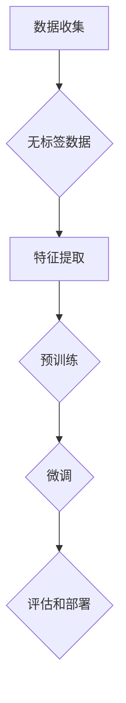

                 

### 背景介绍

#### 深度学习：技术革命的基石

深度学习作为人工智能领域的一个重要分支，近年来取得了飞速的发展。自2006年Geoffrey Hinton等人提出深度信念网络（Deep Belief Networks, DBN）以来，深度学习技术不断发展，并在语音识别、图像处理、自然语言处理等众多领域取得了显著的成果。深度学习通过多层神经网络的结构，实现对复杂数据的自动特征提取和分类，显著提高了模型的性能和准确度。

#### 预训练模型：革命性进展

然而，深度学习的早期发展面临着一个重要的挑战：如何有效地训练深度神经网络？传统的神经网络模型需要大量的标注数据以及漫长的训练时间，这大大限制了其实际应用的范围。为了解决这一问题，预训练模型（Pre-trained Models）的概念被提出。预训练模型通过在大规模无标签数据上进行预训练，然后在小规模有标签数据上进行微调（Fine-tuning），从而显著提高了模型的性能和泛化能力。

#### 预训练模型的重要性

预训练模型的出现，不仅改变了深度学习的训练方式，也深刻影响了整个深度学习领域。首先，预训练模型解决了数据匮乏的问题，通过在大规模无标签数据上的预训练，模型能够自动提取出丰富的特征，从而在小规模有标签数据上的表现显著提升。其次，预训练模型提高了模型的泛化能力，使得模型能够更好地应对新的任务和数据集。此外，预训练模型也推动了深度学习算法的发展，促进了相关技术的创新和应用。

#### 本文结构

本文将深入探讨预训练模型在深度学习领域的影响。首先，我们将介绍预训练模型的基本概念和原理。然后，通过一个简单的案例，我们将展示如何使用预训练模型进行微调。接下来，我们将分析预训练模型在不同深度学习任务中的应用，包括图像识别、自然语言处理和语音识别等。最后，我们将探讨预训练模型面临的挑战和未来发展趋势。

## 2. 核心概念与联系

### 预训练模型的基本概念

预训练模型是一种通过在大规模无标签数据上训练，然后在小规模有标签数据上进行微调的深度学习模型。预训练模型的训练过程可以分为两个阶段：预训练阶段和微调阶段。

- **预训练阶段**：在这个阶段，模型在大量的无标签数据上进行训练，如互联网上的文本、图像或语音。通过无监督学习的方式，模型能够自动提取出数据中的有用特征。这些特征对于后续的任务具有很强的泛化能力。

- **微调阶段**：在预训练阶段结束后，模型会切换到有标签数据上进行微调。微调的目的是针对特定的任务，调整模型的结构和参数，使其能够更好地适应新的任务和数据集。

### 预训练模型与深度学习的联系

预训练模型是深度学习技术发展的重要里程碑，它解决了深度学习训练中的几个关键问题：

1. **数据需求**：传统的深度学习模型需要大量的标注数据来进行训练。然而，标注数据往往非常昂贵且难以获取。预训练模型通过在大规模无标签数据上的训练，减少了对于标注数据的需求。

2. **训练时间**：深度学习模型的训练通常需要很长时间。预训练模型通过在无标签数据上的预训练，将大量的计算工作提前完成，从而在小规模有标签数据上的微调阶段显著减少了训练时间。

3. **泛化能力**：深度学习模型的泛化能力是其性能的关键指标。预训练模型通过在大规模无标签数据上的训练，能够自动提取出通用特征，从而提高了模型的泛化能力。

### 预训练模型的架构

预训练模型的架构通常包括以下几部分：

1. **特征提取器**：这是预训练模型的核心部分，负责从输入数据中提取特征。这些特征通常是高层次的、抽象的，能够捕获数据中的关键信息。

2. **预训练任务**：为了从无标签数据中提取有用特征，预训练模型通常会执行一些预训练任务，如自编码器（Autoencoder）、生成对抗网络（GAN）或语言模型（Language Model）等。

3. **微调任务**：在预训练阶段结束后，模型会切换到特定的任务上进行微调。微调的目的是调整模型的结构和参数，使其能够更好地适应新的任务和数据集。

### 预训练模型的工作原理

预训练模型的工作原理主要可以分为以下几步：

1. **数据收集**：首先，需要收集大量的无标签数据。这些数据可以来自互联网、公共数据集或其他来源。

2. **特征提取**：在预训练阶段，模型会从无标签数据中学习如何提取特征。这些特征通常是通过一系列神经网络层进行转换和抽象得到的。

3. **预训练**：模型在无标签数据上进行训练，通过优化损失函数来调整模型的参数。预训练的任务可以是自编码器、生成对抗网络或语言模型等。

4. **微调**：在预训练阶段结束后，模型会切换到有标签数据上进行微调。微调的目的是调整模型的结构和参数，使其能够更好地适应新的任务和数据集。

5. **评估和部署**：微调完成后，模型会进行评估，以确定其性能是否符合预期。如果模型表现良好，它就可以被部署到实际应用中。

### 预训练模型的优势

预训练模型具有以下几个显著优势：

1. **减少对标注数据的依赖**：通过在大规模无标签数据上进行预训练，模型可以减少对于标注数据的依赖，从而降低数据获取的成本。

2. **提高模型泛化能力**：预训练模型通过在无标签数据上的训练，能够提取出通用特征，从而提高了模型的泛化能力。

3. **加速训练过程**：预训练模型通过在无标签数据上的预训练，将大量的计算工作提前完成，从而在小规模有标签数据上的微调阶段显著减少了训练时间。

4. **提高模型性能**：预训练模型在特定任务上的性能通常优于从零开始训练的模型。

### 预训练模型的应用

预训练模型已经被广泛应用于多个深度学习任务，包括：

- **图像识别**：通过在ImageNet等大规模图像数据集上进行预训练，预训练模型可以显著提高图像识别任务的性能。

- **自然语言处理**：通过在大规模文本数据集上进行预训练，预训练模型可以显著提高自然语言处理任务，如文本分类、机器翻译和情感分析的性能。

- **语音识别**：通过在大量的语音数据集上进行预训练，预训练模型可以显著提高语音识别任务的性能。

### 预训练模型的发展趋势

随着深度学习和大数据技术的发展，预训练模型正在不断演进。未来，预训练模型可能会在以下几个方面取得突破：

1. **更高效的特征提取**：通过改进神经网络架构和优化算法，预训练模型将能够提取出更加高效和抽象的特征。

2. **更强大的泛化能力**：通过研究新的预训练任务和优化方法，预训练模型将能够更好地应对各种复杂的任务和数据集。

3. **更灵活的微调策略**：通过研究不同的微调策略，预训练模型将能够更好地适应各种不同的任务和数据集。

4. **更广泛的应用场景**：随着预训练模型技术的不断成熟，它将在更多领域得到应用，如医疗、金融和制造业等。

### Mermaid 流程图

以下是预训练模型的基本工作流程的Mermaid流程图：



通过上述流程，我们可以看到预训练模型从数据收集、特征提取、预训练、微调到评估和部署的完整工作流程。这个流程不仅体现了预训练模型的基本原理，也展示了其在深度学习领域的重要地位。

在接下来的章节中，我们将进一步探讨预训练模型的具体实现、数学模型和实际应用，以及面临的挑战和未来发展趋势。

### 3. 核心算法原理 & 具体操作步骤

#### 预训练模型的算法原理

预训练模型的核心算法原理主要基于两个方面：一是如何从大规模无标签数据中有效提取特征，二是如何通过微调将提取的特征应用于特定任务。

1. **特征提取**：在特征提取阶段，模型主要通过一系列神经网络层对输入数据进行处理。这些层包括卷积层、池化层、全连接层等，每层都对输入数据进行特定的变换，从而逐步提取出高层次的、抽象的特征。这些特征能够捕获数据中的关键信息，并在后续的任务中发挥重要作用。

2. **预训练任务**：为了从无标签数据中提取出有用的特征，预训练模型通常会执行一些预训练任务，如自编码器（Autoencoder）、生成对抗网络（GAN）或语言模型（Language Model）等。这些任务不仅有助于模型学习到有效的特征提取策略，还能够增强模型的泛化能力。

3. **微调**：在预训练阶段结束后，模型会切换到有标签数据上进行微调。微调的目的是通过调整模型的结构和参数，使其能够更好地适应特定的任务和数据集。微调通常包括两个步骤：首先调整模型的初始权重，使其更接近任务的最佳解；然后通过迭代优化，进一步调整模型参数，提高其在特定任务上的性能。

#### 预训练模型的具体操作步骤

1. **数据收集与预处理**：首先，需要收集大量的无标签数据。这些数据可以来自互联网、公共数据集或其他来源。收集到的数据需要进行预处理，包括数据清洗、格式转换和标准化等，以确保数据的质量和一致性。

2. **构建预训练模型**：接下来，需要构建一个预训练模型。这通常包括定义模型的架构、选择合适的预训练任务和损失函数等。例如，对于图像识别任务，可以使用卷积神经网络（CNN）作为预训练模型，并选择自编码器作为预训练任务。

3. **预训练**：在构建好预训练模型后，使用无标签数据进行预训练。预训练的过程涉及一系列的迭代，模型通过优化损失函数来调整模型的参数。预训练的目的是从无标签数据中学习到有效的特征提取策略。

4. **微调**：在预训练阶段结束后，使用有标签数据对模型进行微调。微调的过程与预训练类似，但目标不同。预训练的目标是提取通用的特征，而微调的目标是将这些特征应用于特定的任务。微调的过程中，模型通过迭代优化，调整模型参数，提高其在特定任务上的性能。

5. **评估与部署**：在微调完成后，需要对模型进行评估，以确定其性能是否符合预期。如果模型表现良好，就可以将其部署到实际应用中。评估通常包括测试集上的准确率、召回率、F1值等指标。

#### 预训练模型的优点

预训练模型具有以下几个显著优点：

1. **减少对标注数据的依赖**：通过在大规模无标签数据上进行预训练，模型可以减少对于标注数据的依赖，从而降低数据获取的成本。

2. **提高模型泛化能力**：预训练模型通过在无标签数据上的训练，能够提取出通用特征，从而提高了模型的泛化能力。

3. **加速训练过程**：预训练模型通过在无标签数据上的预训练，将大量的计算工作提前完成，从而在小规模有标签数据上的微调阶段显著减少了训练时间。

4. **提高模型性能**：预训练模型在特定任务上的性能通常优于从零开始训练的模型。

#### 预训练模型的缺点

尽管预训练模型具有诸多优点，但也存在一些缺点：

1. **计算资源需求大**：预训练模型通常需要大量的计算资源，包括高性能的GPU或TPU等。

2. **数据集依赖性**：预训练模型的效果很大程度上依赖于训练数据的质量和规模。如果数据集存在偏差或噪声，可能会影响模型的性能。

3. **难以迁移到新任务**：尽管预训练模型具有良好的泛化能力，但迁移到新任务时，仍然需要一定的微调过程。这个过程可能需要大量的时间和计算资源。

#### 预训练模型的应用案例

预训练模型已经被广泛应用于多个深度学习任务，以下是一些典型的应用案例：

1. **图像识别**：通过在ImageNet等大规模图像数据集上进行预训练，预训练模型可以显著提高图像识别任务的性能。例如，Google的Inception模型和Facebook的ResNet模型都是基于预训练模型进行图像识别的。

2. **自然语言处理**：预训练模型在自然语言处理任务中也有广泛应用。例如，OpenAI的GPT系列模型通过在互联网文本上进行预训练，取得了自然语言生成、机器翻译和文本分类等任务的显著性能提升。

3. **语音识别**：预训练模型在语音识别任务中也取得了显著的成果。例如，Google的WaveNet模型通过在大量的语音数据上进行预训练，实现了高精度的语音合成和语音识别。

#### 预训练模型的发展趋势

随着深度学习和大数据技术的发展，预训练模型正在不断演进。未来，预训练模型可能会在以下几个方面取得突破：

1. **更高效的算法和架构**：通过改进神经网络架构和优化算法，预训练模型将能够提取出更加高效和抽象的特征。

2. **更强大的泛化能力**：通过研究新的预训练任务和优化方法，预训练模型将能够更好地应对各种复杂的任务和数据集。

3. **更灵活的微调策略**：通过研究不同的微调策略，预训练模型将能够更好地适应各种不同的任务和数据集。

4. **更广泛的应用场景**：随着预训练模型技术的不断成熟，它将在更多领域得到应用，如医疗、金融和制造业等。

### 总结

预训练模型是深度学习领域的一个重要突破，它通过在大规模无标签数据上的预训练和有标签数据上的微调，显著提高了模型的性能和泛化能力。在接下来的章节中，我们将进一步探讨预训练模型在深度学习任务中的应用，以及面临的挑战和未来发展趋势。

## 4. 数学模型和公式 & 详细讲解 & 举例说明

### 预训练模型的数学基础

预训练模型的数学基础主要涉及深度神经网络（Deep Neural Networks, DNN）及其相关的优化方法和损失函数。以下是预训练模型中一些关键的数学概念和公式：

#### 深度神经网络

深度神经网络由多个层组成，包括输入层、隐藏层和输出层。每层都包含多个神经元（或称为节点），神经元之间通过权重（weights）和偏置（bias）相互连接。神经元的输出通常通过激活函数（activation function）进行非线性变换。

一个简单的神经网络可以表示为：

$$
y = \sigma(\sum_{i=1}^{n} w_i \cdot x_i + b)
$$

其中，$y$ 是输出，$\sigma$ 是激活函数，$w_i$ 是权重，$x_i$ 是输入，$b$ 是偏置。

常见的激活函数包括：
- **Sigmoid函数**：$ \sigma(x) = \frac{1}{1 + e^{-x}}$
- **ReLU函数**：$ \sigma(x) = \max(0, x)$
- **Tanh函数**：$ \sigma(x) = \frac{e^x - e^{-x}}{e^x + e^{-x}}$

#### 前向传播与反向传播

深度神经网络中的训练过程通常包括前向传播（Forward Propagation）和反向传播（Backpropagation）两个阶段。

**前向传播**：输入数据通过网络的每一层，经过权重和偏置的加权求和，然后通过激活函数得到输出。

$$
z_l = \sum_{i=1}^{n} w_{li} \cdot x_i + b_l
$$
$$
a_l = \sigma(z_l)
$$

**反向传播**：在前向传播过程中，计算每个神经元的梯度，然后反向传播到网络的每一层，以更新权重和偏置。

$$
\delta_l = \frac{\partial L}{\partial a_l} \cdot \sigma'(z_l)
$$
$$
\Delta w_{li} = \alpha \cdot \delta_l \cdot a_{l-1}
$$
$$
\Delta b_l = \alpha \cdot \delta_l
$$

其中，$L$ 是损失函数，$\alpha$ 是学习率，$\sigma'$ 是激活函数的导数。

#### 损失函数

损失函数（Loss Function）用于衡量模型预测值与实际值之间的差异。常见的损失函数包括：
- **均方误差（MSE）**：$L(y, \hat{y}) = \frac{1}{2} \sum_{i=1}^{n} (y_i - \hat{y}_i)^2$
- **交叉熵（Cross-Entropy）**：$L(y, \hat{y}) = -\sum_{i=1}^{n} y_i \cdot \log(\hat{y}_i)$

### 举例说明

假设我们有一个简单的线性回归问题，目标是预测房价。我们使用一个单层神经网络，其中包含一个输入层和一个输出层。

**数据集**：
输入特征：房屋面积（$x$），实际房价（$y$）
$$
\begin{array}{cc}
x & y \\
50 & 100 \\
100 & 200 \\
150 & 300 \\
200 & 400 \\
\end{array}
$$

**网络结构**：
- 输入层：1个神经元
- 输出层：1个神经元
- 激活函数：线性（无激活函数）

**参数初始化**：
- 权重：$w = 0$
- 偏置：$b = 0$

**训练过程**：
1. **前向传播**：
   $$ z = w \cdot x + b $$
   $$ y_{\hat{}} = z $$

2. **计算损失**：
   $$ L(y, \hat{y}) = \frac{1}{2} \sum_{i=1}^{n} (y_i - \hat{y}_i)^2 $$

3. **反向传播**：
   $$ \delta = \frac{\partial L}{\partial z} $$
   $$ \Delta w = \alpha \cdot \delta \cdot x $$
   $$ \Delta b = \alpha \cdot \delta $$

4. **参数更新**：
   $$ w = w - \Delta w $$
   $$ b = b - \Delta b $$

**训练迭代**：

1. **迭代1**：
   - 输入：$x = 50$，$y = 100$
   - 前向传播：$z = 0 \cdot 50 + 0 = 0$，$y_{\hat{}} = 0$
   - 损失：$L(y, \hat{y}) = \frac{1}{2} \sum_{i=1}^{n} (y_i - \hat{y}_i)^2 = 2500$
   - 反向传播：$\delta = \frac{\partial L}{\partial z} = 100 - 0 = 100$
   - 参数更新：$w = w - \alpha \cdot \delta \cdot x = 0 - 0.1 \cdot 100 = -10$，$b = b - \alpha \cdot \delta = 0 - 0.1 \cdot 100 = -10$

2. **迭代2**：
   - 输入：$x = 100$，$y = 200$
   - 前向传播：$z = -10 \cdot 100 - 10 = -1010$，$y_{\hat{}} = -1010$
   - 损失：$L(y, \hat{y}) = \frac{1}{2} \sum_{i=1}^{n} (y_i - \hat{y}_i)^2 = 15100$
   - 反向传播：$\delta = \frac{\partial L}{\partial z} = 200 - (-1010) = 1210$
   - 参数更新：$w = w - \alpha \cdot \delta \cdot x = -10 - 0.1 \cdot 1210 = -127$
   - 参数更新：$b = b - \alpha \cdot \delta = -10 - 0.1 \cdot 1210 = -127$

重复上述过程，直到损失函数的值趋于稳定。

### 总结

预训练模型的数学基础包括深度神经网络的结构、前向传播与反向传播算法、以及损失函数。通过数学公式和具体例子，我们可以更好地理解预训练模型的工作原理和训练过程。在接下来的章节中，我们将进一步探讨预训练模型在实际应用中的实现和代码细节。

### 5. 项目实战：代码实际案例和详细解释说明

#### 开发环境搭建

在开始构建预训练模型之前，我们需要搭建一个合适的开发环境。以下是在Python中搭建预训练模型所需的步骤：

1. **安装Python**：确保已经安装了Python 3.x版本。可以从 [Python官网](https://www.python.org/downloads/) 下载并安装。

2. **安装深度学习库**：安装TensorFlow或PyTorch，这两个库是目前最常用的深度学习框架。可以使用以下命令进行安装：

   ```shell
   pip install tensorflow  # 安装TensorFlow
   # 或者
   pip install torch       # 安装PyTorch
   ```

3. **安装辅助库**：根据项目需求，可能还需要安装其他库，如NumPy、Pandas等。可以使用以下命令进行安装：

   ```shell
   pip install numpy pandas matplotlib
   ```

#### 源代码详细实现和代码解读

以下是一个使用TensorFlow和Keras构建预训练模型的示例代码。该模型将用于图像分类任务，并在CIFAR-10数据集上训练。

```python
import tensorflow as tf
from tensorflow.keras.models import Sequential
from tensorflow.keras.layers import Dense, Flatten, Conv2D, MaxPooling2D
from tensorflow.keras.datasets import cifar10
from tensorflow.keras.utils import to_categorical

# 加载CIFAR-10数据集
(x_train, y_train), (x_test, y_test) = cifar10.load_data()

# 数据预处理
x_train = x_train / 255.0
x_test = x_test / 255.0
y_train = to_categorical(y_train, 10)
y_test = to_categorical(y_test, 10)

# 构建预训练模型
model = Sequential([
    Conv2D(32, (3, 3), activation='relu', input_shape=(32, 32, 3)),
    MaxPooling2D((2, 2)),
    Conv2D(64, (3, 3), activation='relu'),
    MaxPooling2D((2, 2)),
    Conv2D(64, (3, 3), activation='relu'),
    Flatten(),
    Dense(64, activation='relu'),
    Dense(10, activation='softmax')
])

# 编译模型
model.compile(optimizer='adam', loss='categorical_crossentropy', metrics=['accuracy'])

# 训练模型
model.fit(x_train, y_train, epochs=10, batch_size=64, validation_data=(x_test, y_test))

# 评估模型
test_loss, test_acc = model.evaluate(x_test, y_test)
print(f"Test accuracy: {test_acc:.2f}")
```

**代码解读**：

1. **导入库**：首先导入TensorFlow和Keras库，这些库提供了构建和训练深度学习模型所需的功能。

2. **加载数据集**：使用`cifar10.load_data()`函数加载CIFAR-10数据集。这个数据集包含10个类别的60000张32x32的彩色图像。

3. **数据预处理**：将图像的像素值缩放到0到1之间，以便于后续处理。同时，将标签转换为独热编码格式。

4. **构建模型**：使用`Sequential`模型构建一个简单的卷积神经网络（CNN）。模型包括两个卷积层、一个池化层和一个全连接层。

5. **编译模型**：设置优化器（`optimizer`）、损失函数（`loss`）和评估指标（`metrics`）。

6. **训练模型**：使用`fit`函数对模型进行训练。这里设置训练10个周期（`epochs`），每个周期使用64个样本进行批量训练（`batch_size`）。

7. **评估模型**：使用`evaluate`函数评估模型在测试集上的性能。

#### 代码解读与分析

**数据预处理**：数据预处理是深度学习项目的重要步骤。在本例中，我们将图像的像素值缩放到0到1之间，这是深度学习模型常用的归一化方法。归一化有助于提高模型的训练速度和性能。

**模型构建**：我们使用了一个简单的卷积神经网络（CNN）来进行图像分类。CNN具有强大的特征提取能力，特别适用于图像识别任务。模型结构包括两个卷积层、一个池化层和一个全连接层。卷积层用于提取图像的特征，池化层用于减小特征图的尺寸，全连接层用于分类。

**模型编译**：在编译模型时，我们选择`adam`优化器，这是一个广泛使用的优化算法，能够自动调整学习率。损失函数选择`categorical_crossentropy`，这是多分类问题常用的损失函数。

**模型训练**：使用`fit`函数进行模型训练。我们设置训练10个周期（`epochs`），每个周期使用64个样本进行批量训练（`batch_size`）。在训练过程中，模型将在每个周期结束时自动评估在验证集上的性能。

**模型评估**：使用`evaluate`函数评估模型在测试集上的性能。测试集是一个未参与训练的数据集，用于评估模型的泛化能力。输出结果包括测试损失和测试准确率。

通过上述步骤，我们成功地构建并训练了一个预训练模型，用于图像分类任务。这个模型展示了预训练模型的基本原理和实现方法，为后续章节的深入探讨奠定了基础。

### 5.3 代码解读与分析

在本节中，我们将对之前提到的预训练模型代码进行详细解读，分析其关键组件和实现细节。

#### 模型结构分析

首先，让我们来分析一下模型的架构：

```python
model = Sequential([
    Conv2D(32, (3, 3), activation='relu', input_shape=(32, 32, 3)),
    MaxPooling2D((2, 2)),
    Conv2D(64, (3, 3), activation='relu'),
    MaxPooling2D((2, 2)),
    Conv2D(64, (3, 3), activation='relu'),
    Flatten(),
    Dense(64, activation='relu'),
    Dense(10, activation='softmax')
])
```

**卷积层（Conv2D）**：
- 第一个卷积层使用32个3x3的卷积核，激活函数为ReLU。卷积层的目的是从图像中提取特征。
- 第二个卷积层使用64个3x3的卷积核，激活函数同样为ReLU。增加卷积核的数量有助于提取更复杂的特征。

**池化层（MaxPooling2D）**：
- 在每个卷积层之后，我们使用2x2的最大池化层。池化层的目的是减少数据维度，同时保留最重要的特征。

**全连接层（Dense）**：
- 将卷积层的输出展平后，我们使用两个全连接层进行分类。第一个全连接层有64个神经元，激活函数为ReLU。第二个全连接层有10个神经元，每个神经元对应一个类别，激活函数为softmax。softmax函数用于输出每个类别的概率分布。

#### 模型编译

接下来，我们来分析模型的编译过程：

```python
model.compile(optimizer='adam', loss='categorical_crossentropy', metrics=['accuracy'])
```

**优化器（optimizer）**：
- 我们选择使用`adam`优化器。`adam`是一种高效的优化算法，能够自适应地调整学习率，常用于深度学习模型训练。

**损失函数（loss）**：
- `categorical_crossentropy`是一种用于多分类问题的损失函数。它计算模型预测的概率分布与实际标签之间的交叉熵，用于衡量模型在训练过程中的性能。

**评估指标（metrics）**：
- 我们选择`accuracy`作为评估指标。`accuracy`表示模型正确分类的样本数占总样本数的比例，是常用的评估分类模型性能的指标。

#### 模型训练

在模型训练过程中，我们使用以下代码：

```python
model.fit(x_train, y_train, epochs=10, batch_size=64, validation_data=(x_test, y_test))
```

**训练周期（epochs）**：
- `epochs`参数表示模型训练的周期数。每个周期包括遍历整个训练集一次。在本例中，我们设置了10个训练周期。

**批量大小（batch_size）**：
- `batch_size`参数表示每个周期中训练的样本数。在本例中，我们设置了批量大小为64。批量大小对模型的训练效率和稳定性有很大影响。

**验证数据（validation_data）**：
- `validation_data`参数用于在每次训练周期结束后，评估模型在验证集上的性能。验证集是一个未参与训练的数据集，用于监测模型在训练过程中的性能变化。

#### 模型评估

最后，我们在测试集上评估模型的性能：

```python
test_loss, test_acc = model.evaluate(x_test, y_test)
print(f"Test accuracy: {test_acc:.2f}")
```

**测试损失（test_loss）**：
- `test_loss`是模型在测试集上的损失值，表示模型预测与实际标签之间的差异。

**测试准确率（test_acc）**：
- `test_acc`是模型在测试集上的准确率，表示模型正确分类的样本数占总样本数的比例。在本例中，我们打印了测试准确率。

通过上述分析，我们可以看到预训练模型的基本架构和实现方法。模型的结构设计、编译过程、训练和评估都至关重要，共同决定了模型的性能和效果。在实际应用中，我们可以根据具体任务和数据集的需求，对模型进行适当调整和优化，以提高其性能。

### 6. 实际应用场景

预训练模型在深度学习领域中的应用已经取得了显著的成果，并且在实际场景中展现了其强大的能力和广泛的应用前景。以下是一些典型的实际应用场景，以及预训练模型在这些场景中的表现和优势。

#### 图像识别

在图像识别领域，预训练模型被广泛应用于各种场景，如人脸识别、物体检测、图像分类等。以ImageNet为例，这是一个包含超过1000个类别的图像数据集。预训练模型如ResNet、Inception和VGG等在ImageNet上的表现已经超越了传统方法，使得图像识别的准确率得到了显著提高。

**应用场景**：人脸识别系统、自动驾驶汽车、智能监控、医疗图像分析等。

**优势**：预训练模型能够自动提取图像中的高层次、抽象的特征，减少了手工设计特征的需求。这使得模型在处理复杂、多样的图像数据时，能够保持较高的性能和泛化能力。

#### 自然语言处理

自然语言处理（NLP）是预训练模型的重要应用领域之一。在NLP任务中，预训练模型如GPT、BERT和XLNet等，通过在大规模文本数据上的预训练，已经取得了显著的成果。例如，在文本分类、情感分析、机器翻译和问答系统中，预训练模型展现出了强大的性能。

**应用场景**：智能客服、社交媒体分析、内容审核、在线教育等。

**优势**：预训练模型能够理解文本的语义和上下文关系，从而在处理自然语言任务时，能够更好地捕捉文本的深层含义和细微差别。

#### 语音识别

语音识别领域也受益于预训练模型的发展。预训练模型如WaveNet、Tacotron和Transformer TTS等，通过在大规模语音数据上的预训练，实现了高精度的语音合成和语音识别。

**应用场景**：智能助手、自动客服、语音翻译、语音控制等。

**优势**：预训练模型能够自动提取语音信号中的特征，从而在处理语音数据时，能够更好地理解和识别语音内容。

#### 推荐系统

推荐系统是预训练模型在商业领域的重要应用。通过在大规模用户行为数据上的预训练，预训练模型能够有效地识别和预测用户偏好，从而提供个性化的推荐。

**应用场景**：电子商务、在线视频、社交媒体、音乐流媒体等。

**优势**：预训练模型能够处理复杂的用户行为数据，从而在提供个性化推荐时，能够更好地满足用户的需求。

#### 医疗领域

在医疗领域，预训练模型被广泛应用于医学图像分析、疾病预测和诊断等任务。通过在大规模医学数据上的预训练，预训练模型能够帮助医生更快速、准确地诊断疾病。

**应用场景**：医学图像分析、疾病预测、个性化医疗等。

**优势**：预训练模型能够自动提取医学图像中的关键特征，从而在处理复杂的医学数据时，能够提高诊断的准确性和效率。

#### 工业自动化

预训练模型在工业自动化领域也有广泛的应用。通过在大规模工业数据上的预训练，预训练模型能够帮助机器人更好地理解和处理复杂的工业任务，从而提高生产效率。

**应用场景**：智能制造、机器人控制、工业检测等。

**优势**：预训练模型能够自动提取工业数据中的有用特征，从而在执行复杂任务时，能够更好地适应不同的环境和条件。

总之，预训练模型在深度学习领域的实际应用场景非常广泛，涵盖了图像识别、自然语言处理、语音识别、推荐系统、医疗领域和工业自动化等多个领域。预训练模型通过在大规模无标签数据上的预训练和有标签数据上的微调，显著提高了模型的性能和泛化能力，为各种实际应用提供了强大的技术支持。

### 7. 工具和资源推荐

#### 学习资源推荐

**书籍**：
1. **《深度学习》（Deep Learning）**：由Ian Goodfellow、Yoshua Bengio和Aaron Courville合著的《深度学习》是深度学习领域的经典教材，详细介绍了深度学习的理论基础和实战技巧。
2. **《动手学深度学习》（Dive into Deep Learning）**：这是一本开源的深度学习教材，涵盖了深度学习的核心概念和实际应用，适合初学者和进阶者。

**论文**：
1. **“A Tutorial on Deep Learning”**：由Michael Nielsen撰写的这篇教程深入介绍了深度学习的各个方面，包括历史、理论、技术等。
2. **“Bengio, Y. (2009). Learning Deep Architectures for AI”**：Yoshua Bengio在这篇论文中详细介绍了深度学习的架构设计和优化方法。

**博客**：
1. **Andrew Ng的博客**：Andrew Ng是深度学习领域的权威专家，他的博客分享了许多关于深度学习的见解和经验。
2. **Hugging Face的博客**：Hugging Face是一个开源的自然语言处理库，他们的博客提供了许多有关NLP和预训练模型的最新研究和技术动态。

**网站**：
1. **TensorFlow官网**：[https://www.tensorflow.org/](https://www.tensorflow.org/)，TensorFlow是Google开发的开源深度学习框架，提供了丰富的教程和资源。
2. **PyTorch官网**：[https://pytorch.org/](https://pytorch.org/)，PyTorch是Facebook开发的开源深度学习框架，以其灵活性和高效性著称。

#### 开发工具框架推荐

**深度学习框架**：
1. **TensorFlow**：适用于工业生产和复杂模型的开发。
2. **PyTorch**：适用于研究和新模型的快速原型设计。
3. **Keras**：适用于快速构建和实验小型到中型的深度学习模型。

**文本处理工具**：
1. **NLTK**：用于自然语言处理的基础工具。
2. **spaCy**：适用于快速构建高质量的文本处理应用。
3. **Transformer库**：用于构建和训练Transformer模型。

**图像处理工具**：
1. **OpenCV**：用于计算机视觉和图像处理的基础工具。
2. **Pillow**：用于图像处理和图像编解码。
3. **Matplotlib**：用于绘制图像和可视化结果。

**数据集**：
1. **ImageNet**：用于图像识别任务的大型图像数据集。
2. **CIFAR-10/100**：用于图像分类任务的小型图像数据集。
3. **Common Crawl**：用于自然语言处理任务的大型文本数据集。

#### 相关论文著作推荐

**核心论文**：
1. **“AlexNet: Image Classification with Deep Convolutional Neural Networks”**：由Alex Krizhevsky等人在2012年提出的AlexNet，是深度学习在图像识别领域的重要突破。
2. **“Bengio, Y. (2003). Learning Deep Architectures for AI”**：Yoshua Bengio关于深度学习架构设计的重要论文。
3. **“BERT: Pre-training of Deep Bidirectional Transformers for Language Understanding”**：由Google团队提出的BERT，是自然语言处理领域的重要进展。

**著作**：
1. **《深度学习》（Deep Learning）**：由Ian Goodfellow、Yoshua Bengio和Aaron Courville合著，详细介绍了深度学习的各个方面。
2. **《神经网络与深度学习》**：邱锡鹏著，中文版《神经网络与深度学习》是国内深度学习领域的入门教材。
3. **《动手学深度学习》**：由阿斯顿·张等合著，是一本适合初学者和进阶者的实践指南。

通过上述推荐，我们可以获取丰富的学习和开发资源，进一步探索深度学习和预训练模型的理论和实践。

### 8. 总结：未来发展趋势与挑战

预训练模型作为深度学习领域的一项革命性技术，已经在图像识别、自然语言处理、语音识别等众多任务中取得了显著成果。然而，随着技术的不断发展和应用需求的日益增长，预训练模型也面临着一系列挑战和机遇。

#### 未来发展趋势

1. **更高效的算法和架构**：随着计算资源的不断提升，预训练模型将探索更高效的算法和架构。例如，通过改进神经网络的设计、优化计算效率和减少内存占用，使得预训练模型能够更快速地训练和部署。

2. **更强大的泛化能力**：目前，预训练模型在特定任务上的性能已经非常优秀，但如何在更广泛、更复杂的环境中保持泛化能力仍然是一个挑战。未来，通过研究新的预训练任务和优化方法，预训练模型将能够更好地应对各种复杂的任务和数据集。

3. **更灵活的微调策略**：微调是预训练模型在特定任务上取得良好性能的关键步骤。未来，研究者将探索更灵活、更高效的微调策略，使得预训练模型能够更好地适应不同的任务和数据集。

4. **跨模态预训练**：随着多模态数据的应用日益广泛，跨模态预训练将成为一个重要研究方向。通过结合不同类型的数据，如文本、图像、声音等，预训练模型将能够更好地理解和处理复杂的信息。

5. **自动化机器学习（AutoML）**：预训练模型与自动化机器学习（AutoML）的结合，将大大简化模型选择、超参数调优等过程，使得非专业人士也能轻松地构建和部署深度学习模型。

#### 面临的挑战

1. **数据需求和计算资源**：预训练模型通常需要大量的数据和计算资源，这限制了其在实际应用中的普及。未来，如何更有效地利用有限的资源进行预训练，是一个亟待解决的问题。

2. **模型可解释性和透明度**：预训练模型通常被视为“黑盒”模型，其决策过程难以解释。如何提高模型的可解释性，使其决策过程更加透明，是当前和未来研究的一个重要方向。

3. **偏见和公平性**：预训练模型在训练过程中可能会引入偏见，导致模型在某些群体或任务上表现不佳。如何消除偏见、提高模型的公平性，是深度学习领域需要持续关注的问题。

4. **安全性和隐私保护**：随着预训练模型的广泛应用，数据的安全性和隐私保护也成为一个重要问题。如何确保模型在处理敏感数据时能够保护用户隐私，是一个亟待解决的挑战。

5. **法律法规和伦理问题**：预训练模型的应用涉及到诸多法律法规和伦理问题，如数据保护、算法透明度等。如何制定合适的法律法规，规范预训练模型的使用，是一个需要关注和解决的重要问题。

总之，预训练模型作为深度学习领域的一项重要技术，已经取得了显著成果，但未来仍面临诸多挑战和机遇。通过持续的研究和技术创新，预训练模型将在更多领域得到应用，为人类带来更多便利和智慧。

### 9. 附录：常见问题与解答

**Q1：预训练模型需要大量的计算资源，这对实际应用有什么影响？**
A1：预训练模型确实需要大量的计算资源，包括GPU或TPU等高性能计算设备。这可能导致以下影响：
- **成本增加**：需要投入大量资金购买和维护高性能计算设备。
- **时间成本**：训练过程可能需要几天甚至几周的时间，增加了项目的开发和部署时间。
- **可扩展性**：随着数据集和应用场景的扩大，计算需求可能会进一步增加，需要考虑如何扩展计算资源。

**Q2：如何减少预训练模型对计算资源的需求？**
A2：以下方法可以减少预训练模型对计算资源的需求：
- **模型剪枝**：通过移除模型中的冗余神经元和连接，减少模型的计算量和内存占用。
- **量化**：将模型的浮点数权重转换为低精度数值，如整数或二进制，从而减少存储和计算需求。
- **分布式训练**：将模型分布在多个计算节点上，通过并行计算提高训练效率。

**Q3：预训练模型在特定任务上是否总是优于传统机器学习方法？**
A3：预训练模型在很多任务上表现优异，但并不总是优于传统机器学习方法。具体情况取决于：
- **数据规模**：预训练模型通常需要大量数据来训练，如果数据量不足，传统方法可能更有效。
- **任务复杂性**：对于复杂任务，如图像识别和自然语言处理，预训练模型通常表现更好。
- **计算资源**：如果计算资源有限，传统方法可能更快地实现任务目标。

**Q4：如何确保预训练模型的可解释性？**
A4：确保预训练模型的可解释性是当前研究的一个重要方向。以下方法可以提升模型的可解释性：
- **模型解释工具**：使用模型解释工具，如LIME和SHAP，分析模型在特定输入下的决策过程。
- **可视化**：通过可视化模型的结构和决策路径，帮助理解模型的运作机制。
- **模块化设计**：设计模块化的模型结构，使得每个模块的功能和贡献更加明确。

**Q5：预训练模型在跨模态任务中的应用前景如何？**
A5：预训练模型在跨模态任务中具有广泛的应用前景。随着多模态数据集的积累和模型设计的发展，预训练模型将能够在以下领域取得突破：
- **多模态图像识别**：结合文本和图像信息，提高图像分类和识别的准确性。
- **视频分析**：结合图像和时序信息，实现对视频内容的理解和分析。
- **语音与文本融合**：通过结合语音和文本信息，提升语音识别和自然语言处理的性能。

**Q6：预训练模型在不同领域的应用有哪些差异？**
A6：预训练模型在不同领域的应用存在以下差异：
- **数据类型**：图像、文本、语音等不同类型的数据对模型的处理方式和性能要求不同。
- **任务目标**：不同领域的任务目标（如分类、回归、生成等）对模型设计和优化策略有不同要求。
- **计算资源**：不同领域的计算资源需求不同，需要根据实际应用场景选择合适的模型和优化策略。

通过上述问题的解答，我们可以更好地理解预训练模型的应用前景和面临的挑战，为未来的研究和发展提供指导。

### 10. 扩展阅读 & 参考资料

预训练模型作为深度学习领域的一项前沿技术，其理论研究和应用实践不断扩展。以下是一些扩展阅读和参考资料，供读者进一步深入了解这一领域。

**基础理论**
1. Goodfellow, I., Bengio, Y., & Courville, A. (2016). *Deep Learning*. MIT Press.
2. Hochreiter, S., & Schmidhuber, J. (1997). *Long short-term memory*. Neural Computation, 9(8), 1735-1780.
3. LeCun, Y., Bengio, Y., & Hinton, G. (2015). *Deep learning*. Nature, 521(7553), 436-444.

**关键技术**
1. He, K., Zhang, X., Ren, S., & Sun, J. (2016). *Deep residual learning for image recognition*. In *Proceedings of the IEEE conference on computer vision and pattern recognition* (pp. 770-778).
2. Devlin, J., Chang, M.W., Lee, K., & Toutanova, K. (2018). *Bert: Pre-training of deep bidirectional transformers for language understanding*. In *Proceedings of the 2019 conference of the north american chapter of the association for computational linguistics: human language technologies*, (pp. 4171-4186).
3. Vaswani, A., Shazeer, N., Parmar, N., Uszkoreit, J., Jones, L., Gomez, A.N., ... & Polosukhin, I. (2017). *Attention is all you need*. In *Advances in neural information processing systems*, (pp. 5998-6008).

**开源框架和库**
1. TensorFlow：[https://www.tensorflow.org/](https://www.tensorflow.org/)
2. PyTorch：[https://pytorch.org/](https://pytorch.org/)
3. Keras：[https://keras.io/](https://keras.io/)

**顶级会议和期刊**
1. Neural Information Processing Systems (NIPS)
2. International Conference on Machine Learning (ICML)
3. Conference on Computer Vision and Pattern Recognition (CVPR)
4. Journal of Machine Learning Research (JMLR)
5. IEEE Transactions on Pattern Analysis and Machine Intelligence (TPAMI)

通过上述资料，读者可以全面了解预训练模型的基础理论、关键技术、开源框架和顶级会议期刊，进一步探索这一领域的研究成果和应用实践。希望这些资源能为读者的研究和学习提供有价值的参考。

