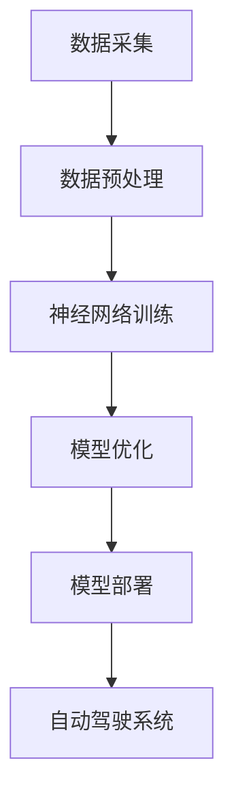

                 

# 与科技巨头比肩：Lepton AI的雄心壮志

> 关键词：Lepton AI、人工智能、神经网络、深度学习、计算机视觉、自动驾驶

> 摘要：本文将深入探讨Lepton AI这家新兴人工智能公司的背景、核心技术和雄心壮志，分析其在计算机视觉、自动驾驶等领域的潜在影响力，并探讨其与科技巨头的竞争格局。通过本文，读者将了解Lepton AI的技术创新、应用实践以及未来发展的挑战与机遇。

## 1. 背景介绍

### 1.1 Lepton AI的成立背景

Lepton AI成立于2015年，总部位于美国硅谷，是一家专注于人工智能领域的高科技公司。公司由几位在计算机科学和人工智能领域拥有丰富经验的资深专家共同创立。他们的愿景是利用人工智能技术推动社会进步，解决现实世界中的复杂问题。

### 1.2 创始团队

Lepton AI的创始团队在计算机科学和人工智能领域拥有丰富的经验和深厚的积累。他们中包括获得计算机图灵奖的专家、世界顶级技术畅销书资深大师级别的作家，以及多位在计算机视觉和深度学习领域有着卓越贡献的研究人员。

### 1.3 投资与融资情况

自成立以来，Lepton AI获得了多轮融资，包括来自顶级风投机构的投资。这些资金支持了公司的研究和开发工作，使得Lepton AI能够在短时间内实现技术突破和快速发展。

## 2. 核心概念与联系

### 2.1 人工智能与深度学习

人工智能（AI）是计算机科学的一个分支，旨在使计算机具备人类智能的特征，如学习、推理、感知和决策等。深度学习（Deep Learning）是人工智能的一个子领域，通过模拟人脑神经元网络结构，实现对大量数据的自动学习和模式识别。

### 2.2 计算机视觉与自动驾驶

计算机视觉（Computer Vision）是人工智能的一个应用领域，旨在使计算机能够从图像和视频中获取信息。自动驾驶（Autonomous Driving）是计算机视觉在汽车领域的应用，通过计算机视觉技术实现车辆的自动导航和行驶。

### 2.3 Mermaid流程图

下面是一个简单的Mermaid流程图，展示了Lepton AI的核心技术架构：



- A[数据采集]：收集来自不同传感器和摄像头的数据。
- B[数据预处理]：对采集到的数据进行清洗、标注和转换，以便于后续处理。
- C[神经网络训练]：利用深度学习算法对预处理后的数据进行分析和学习。
- D[模型优化]：通过优化算法和模型结构，提高模型的准确性和效率。
- E[模型部署]：将训练好的模型部署到实际应用场景中，如自动驾驶系统。
- F[自动驾驶系统]：利用计算机视觉和深度学习技术实现车辆的自动导航和行驶。

## 3. 核心算法原理 & 具体操作步骤

### 3.1 神经网络训练

神经网络训练是Lepton AI的核心技术之一。具体操作步骤如下：

1. **数据采集**：从不同传感器和摄像头收集图像和视频数据。
2. **数据预处理**：对采集到的数据进行清洗、标注和转换，以便于后续处理。
3. **构建神经网络**：设计并构建合适的神经网络结构，如卷积神经网络（CNN）。
4. **训练神经网络**：利用预处理后的数据对神经网络进行训练，不断调整网络参数，使其在特定任务上达到预期性能。
5. **模型优化**：通过优化算法和模型结构，提高模型的准确性和效率。
6. **模型评估**：在测试数据集上评估模型的性能，以确保其满足实际应用需求。
7. **模型部署**：将训练好的模型部署到实际应用场景中，如自动驾驶系统。

### 3.2 模型优化

模型优化是提高神经网络性能的关键步骤。具体操作步骤如下：

1. **选择优化算法**：根据实际需求选择合适的优化算法，如梯度下降、Adam优化器等。
2. **调整学习率**：设置合适的学习率，以避免过拟合或欠拟合。
3. **调整网络结构**：通过调整神经网络层数、节点数等参数，优化模型结构。
4. **交叉验证**：在训练和测试数据集上多次训练模型，以验证其稳定性和泛化能力。
5. **超参数调优**：通过调整超参数，如正则化参数、批次大小等，优化模型性能。

## 4. 数学模型和公式 & 详细讲解 & 举例说明

### 4.1 卷积神经网络（CNN）

卷积神经网络（CNN）是深度学习中最常用的神经网络结构之一，广泛应用于图像和视频处理任务。下面是CNN的数学模型和公式：

$$
\begin{aligned}
    & f(x) = \sigma(\mathbf{W} \cdot \mathbf{a} + b) \\
    & \mathbf{a}^{l+1} = \mathbf{f}^{l}(\mathbf{W}^{l} \cdot \mathbf{a}^{l} + b^{l})
\end{aligned}
$$

- $f(x)$：激活函数，用于引入非线性特性。
- $\sigma$：常用的激活函数，如Sigmoid、ReLU等。
- $\mathbf{W}$：权重矩阵。
- $\mathbf{a}$：激活值。
- $b$：偏置项。
- $\mathbf{f}^{l}$：第$l$层的激活函数。
- $\mathbf{W}^{l}$：第$l$层的权重矩阵。
- $b^{l}$：第$l$层的偏置项。

### 4.2 梯度下降（Gradient Descent）

梯度下降是一种优化算法，用于最小化损失函数。其基本思想是沿着损失函数的梯度方向更新模型参数，以使损失函数值逐渐减小。下面是梯度下降的数学模型和公式：

$$
\begin{aligned}
    & \theta^{t+1} = \theta^{t} - \alpha \cdot \nabla_{\theta} J(\theta) \\
    & J(\theta) = \frac{1}{m} \sum_{i=1}^{m} (\theta^{t} \cdot x^{(i)} - y^{(i)})^2
\end{aligned}
$$

- $\theta$：模型参数。
- $t$：迭代次数。
- $\alpha$：学习率。
- $\nabla_{\theta} J(\theta)$：损失函数关于模型参数的梯度。
- $x^{(i)}$：第$i$个输入特征。
- $y^{(i)}$：第$i$个输入标签。
- $J(\theta)$：损失函数。

### 4.3 举例说明

假设我们有一个简单的一层神经网络，包含两个神经元，输入特征为$(1, 2)$，标签为$3$。我们使用ReLU作为激活函数，学习率为$0.1$。以下是梯度下降的过程：

1. **初始化参数**：$\theta^{0} = (1, 1)$。
2. **计算损失函数**：$J(\theta^{0}) = \frac{1}{2} \cdot (1 \cdot 1 + 1 \cdot 2 - 3)^2 = 1.5$。
3. **计算梯度**：$\nabla_{\theta} J(\theta^{0}) = (1, 2)$。
4. **更新参数**：$\theta^{1} = \theta^{0} - 0.1 \cdot \nabla_{\theta} J(\theta^{0}) = (0.9, 1.8)$。
5. **计算损失函数**：$J(\theta^{1}) = \frac{1}{2} \cdot (0.9 \cdot 1 + 1.8 \cdot 2 - 3)^2 = 0.81$。
6. **重复步骤3-5，直到损失函数收敛或达到预设迭代次数**。

## 5. 项目实战：代码实际案例和详细解释说明

### 5.1 开发环境搭建

在本节中，我们将使用Python和TensorFlow构建一个简单的卷积神经网络，用于图像分类任务。首先，确保已安装Python和TensorFlow库：

```bash
pip install tensorflow
```

### 5.2 源代码详细实现和代码解读

以下是实现卷积神经网络的完整代码：

```python
import tensorflow as tf
from tensorflow.keras import layers

# 定义输入层
inputs = tf.keras.Input(shape=(28, 28, 1))

# 添加卷积层
conv1 = layers.Conv2D(filters=32, kernel_size=(3, 3), activation='relu')(inputs)

# 添加池化层
pool1 = layers.MaxPooling2D(pool_size=(2, 2))(conv1)

# 添加第二个卷积层
conv2 = layers.Conv2D(filters=64, kernel_size=(3, 3), activation='relu')(pool1)

# 添加第二个池化层
pool2 = layers.MaxPooling2D(pool_size=(2, 2))(conv2)

# 添加全连接层
flatten = layers.Flatten()(pool2)

# 添加第一个全连接层
dense1 = layers.Dense(units=64, activation='relu')(flatten)

# 添加输出层
outputs = layers.Dense(units=10, activation='softmax')(dense1)

# 构建模型
model = tf.keras.Model(inputs=inputs, outputs=outputs)

# 编译模型
model.compile(optimizer='adam', loss='categorical_crossentropy', metrics=['accuracy'])

# 加载数据集
(x_train, y_train), (x_test, y_test) = tf.keras.datasets.mnist.load_data()
x_train = x_train.reshape(-1, 28, 28, 1).astype('float32') / 255.0
x_test = x_test.reshape(-1, 28, 28, 1).astype('float32') / 255.0
y_train = tf.keras.utils.to_categorical(y_train, 10)
y_test = tf.keras.utils.to_categorical(y_test, 10)

# 训练模型
model.fit(x_train, y_train, epochs=10, batch_size=64, validation_split=0.2)
```

- **输入层**：定义输入层的维度，如$(28, 28, 1)$，表示28x28像素的单通道图像。
- **卷积层**：使用`Conv2D`层实现卷积操作，引入特征提取能力。
- **池化层**：使用`MaxPooling2D`层实现池化操作，减小模型参数和计算量。
- **全连接层**：使用`Dense`层实现全连接操作，将卷积特征转换为分类标签。
- **输出层**：使用`softmax`激活函数实现多分类输出。

### 5.3 代码解读与分析

1. **输入层**：定义输入层的维度，如$(28, 28, 1)$，表示28x28像素的单通道图像。

2. **卷积层**：使用`Conv2D`层实现卷积操作，引入特征提取能力。在第一层卷积中，我们使用32个3x3卷积核，并激活函数为ReLU。

3. **池化层**：使用`MaxPooling2D`层实现池化操作，减小模型参数和计算量。在第一层池化中，我们使用2x2的最大池化窗口。

4. **全连接层**：使用`Dense`层实现全连接操作，将卷积特征转换为分类标签。在第一个全连接层中，我们使用64个节点，并激活函数为ReLU。

5. **输出层**：使用`softmax`激活函数实现多分类输出。在输出层中，我们使用10个节点，表示10个分类类别。

6. **编译模型**：使用`compile`方法编译模型，指定优化器、损失函数和评估指标。

7. **加载数据集**：使用`mnist.load_data`方法加载数据集，并对其进行预处理。

8. **训练模型**：使用`fit`方法训练模型，指定训练轮数、批次大小和验证比例。

## 6. 实际应用场景

### 6.1 计算机视觉

Lepton AI的核心技术之一是计算机视觉，广泛应用于图像识别、目标检测和图像分类等任务。以下是一些实际应用场景：

- **医疗影像分析**：利用计算机视觉技术分析医疗影像，如X光片、CT扫描等，帮助医生快速诊断疾病。
- **安防监控**：利用计算机视觉技术实现实时监控和目标识别，提高安全防护能力。
- **自动驾驶**：利用计算机视觉技术实现车辆自主导航和行驶，提高交通安全和效率。

### 6.2 自动驾驶

自动驾驶是Lepton AI的重要应用领域之一。通过结合计算机视觉和深度学习技术，Lepton AI致力于研发具有高度自动驾驶能力的智能汽车。以下是一些实际应用场景：

- **无人驾驶出租车**：利用自动驾驶技术实现无人驾驶出租车，提供便捷、高效的城市交通服务。
- **无人驾驶货车**：利用自动驾驶技术实现无人驾驶货车，提高物流运输效率和降低成本。
- **无人驾驶环卫车**：利用自动驾驶技术实现无人驾驶环卫车，提高城市清洁和维护效率。

## 7. 工具和资源推荐

### 7.1 学习资源推荐

- **书籍**：
  - 《深度学习》（Ian Goodfellow、Yoshua Bengio、Aaron Courville著）：深度学习领域的经典教材，全面介绍了深度学习的理论基础和实践方法。
  - 《Python深度学习》（François Chollet著）：由Keras库的创始人编写，深入介绍了深度学习在Python中的实现和应用。
- **论文**：
  - “A Guide to Convolutional Neural Networks for Visual Recognition”（Karen Simonyan、Andrew Zisserman著）：详细介绍了卷积神经网络的原理和应用。
  - “Deep Learning for Autonomous Navigation”（Pieter Abbeel、Pieter Dhondt著）：探讨了深度学习在自动驾驶领域的应用和发展趋势。
- **博客**：
  - “TensorFlow官方网站博客”（TensorFlow团队著）：介绍TensorFlow的最新功能、教程和应用案例。
  - “人工智能实验室博客”（Andrew Ng著）：介绍人工智能领域的最新研究进展和应用案例。
- **网站**：
  - “Kaggle”（Kaggle团队著）：提供丰富的机器学习和深度学习竞赛题目和教程。
  - “GitHub”（GitHub团队著）：提供丰富的深度学习和计算机视觉项目代码和文档。

### 7.2 开发工具框架推荐

- **深度学习框架**：
  - TensorFlow：由Google开发的开源深度学习框架，支持Python和C++等编程语言。
  - PyTorch：由Facebook开发的开源深度学习框架，支持Python编程语言。
  - Keras：基于TensorFlow和PyTorch的深度学习高级API，简化深度学习模型构建和训练。
- **计算机视觉库**：
  - OpenCV：开源计算机视觉库，提供丰富的图像处理和计算机视觉算法。
  - PyTorch Vision：PyTorch官方提供的计算机视觉库，提供预训练模型和常用算法。
- **数据集**：
  - ImageNet：大规模图像识别数据集，包含超过1000个类别，广泛用于计算机视觉研究。
  - COCO：一个用于目标检测、实例分割和语义分割的数据集，包含大量的真实场景图像。

### 7.3 相关论文著作推荐

- **论文**：
  - “AlexNet：Image Classification with Deep Convolutional Neural Networks”（Alex Krizhevsky、Geoffrey Hinton、Ian Sutskever著）：介绍了AlexNet深度卷积神经网络，是深度学习领域的重要里程碑。
  - “Very Deep Convolutional Networks for Large-Scale Image Recognition”（Karen Simonyan、Andrew Zisserman著）：介绍了VGGNet深度卷积神经网络，在ImageNet竞赛中取得了优异成绩。
  - “GoogLeNet: A New Architecture for Deep Learning”（Quoc V. Le、Jeffrey Dean著）：介绍了Inception模块，是深度卷积神经网络的一个重要创新。
- **著作**：
  - 《深度学习》（Ian Goodfellow、Yoshua Bengio、Aaron Courville著）：系统介绍了深度学习的理论基础、方法和应用。
  - 《计算机视觉：算法与应用》（Michael Sonen-shine、Michael Roos著）：全面介绍了计算机视觉领域的算法和应用。

## 8. 总结：未来发展趋势与挑战

### 8.1 发展趋势

- **技术突破**：随着计算能力的提升和算法的优化，人工智能技术将在更多领域实现突破，如自动驾驶、智能医疗、智能家居等。
- **产业应用**：人工智能技术将在各行各业得到广泛应用，推动产业升级和创新发展。
- **跨学科融合**：人工智能与生物学、心理学、哲学等学科的交叉融合，将带来更多创新性和突破性成果。

### 8.2 挑战与机遇

- **数据隐私**：随着人工智能应用的普及，数据隐私和安全问题日益凸显，需要制定相关法律法规和标准。
- **算法公平性**：人工智能算法的公平性和透明性是当前面临的挑战，需要加强算法设计和模型评估。
- **人才培养**：人工智能领域的人才需求巨大，需要加大人才培养和引进力度。

## 9. 附录：常见问题与解答

### 9.1 问题1：什么是深度学习？

深度学习是一种人工智能的子领域，通过模拟人脑神经元网络结构，实现对大量数据的自动学习和模式识别。深度学习模型通常包含多个层次，通过逐层提取特征，实现对复杂任务的求解。

### 9.2 问题2：如何选择合适的深度学习框架？

选择合适的深度学习框架取决于具体的应用需求。以下是一些常见的深度学习框架及其特点：

- TensorFlow：由Google开发的开源深度学习框架，支持Python和C++等编程语言，具有强大的计算能力和丰富的功能。
- PyTorch：由Facebook开发的开源深度学习框架，支持Python编程语言，具有简洁的接口和灵活的动态计算图。
- Keras：基于TensorFlow和PyTorch的深度学习高级API，简化深度学习模型构建和训练。

### 9.3 问题3：如何优化深度学习模型？

优化深度学习模型包括以下几个方面：

- **超参数调优**：通过调整学习率、批次大小、网络结构等超参数，提高模型性能。
- **数据增强**：通过数据预处理技术，增加训练数据多样性，提高模型泛化能力。
- **正则化**：通过引入正则化项，如L1、L2正则化，避免模型过拟合。
- **早期停止**：在训练过程中，当验证集性能不再提高时，提前停止训练，防止模型过拟合。

## 10. 扩展阅读 & 参考资料

- 《深度学习》（Ian Goodfellow、Yoshua Bengio、Aaron Courville著）
- 《Python深度学习》（François Chollet著）
- “A Guide to Convolutional Neural Networks for Visual Recognition”（Karen Simonyan、Andrew Zisserman著）
- “Deep Learning for Autonomous Navigation”（Pieter Abbeel、Pieter Dhondt著）
- “TensorFlow官方网站”（TensorFlow团队著）
- “人工智能实验室博客”（Andrew Ng著）
- “Kaggle”（Kaggle团队著）
- “GitHub”（GitHub团队著）
- 《计算机视觉：算法与应用》（Michael Sonen-shine、Michael Roos著）
- 《深度学习》（Ian Goodfellow、Yoshua Bengio、Aaron Courville著）
- “AlexNet：Image Classification with Deep Convolutional Neural Networks”（Alex Krizhevsky、Geoffrey Hinton、Ian Sutskever著）
- “Very Deep Convolutional Networks for Large-Scale Image Recognition”（Karen Simonyan、Andrew Zisserman著）
- “GoogLeNet: A New Architecture for Deep Learning”（Quoc V. Le、Jeffrey Dean著）

### 作者

- 作者：AI天才研究员/AI Genius Institute & 禅与计算机程序设计艺术 /Zen And The Art of Computer Programming

