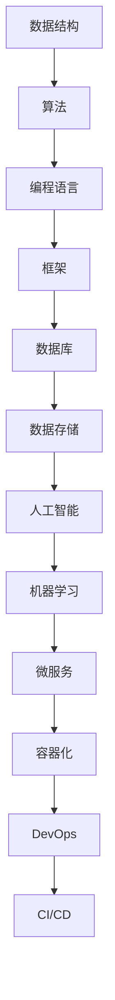
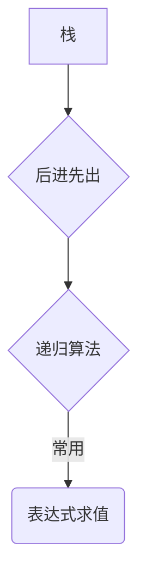
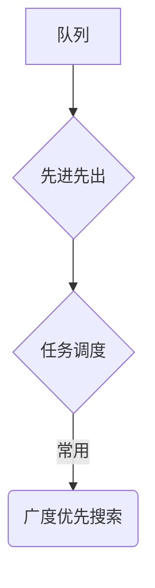
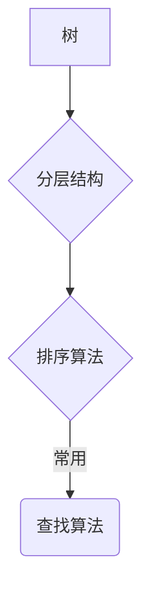
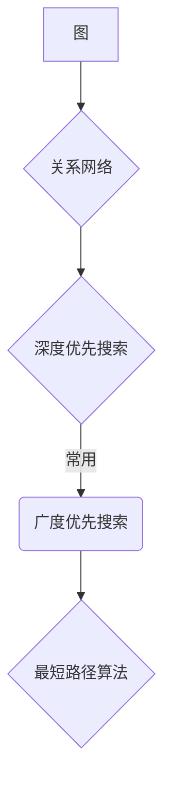
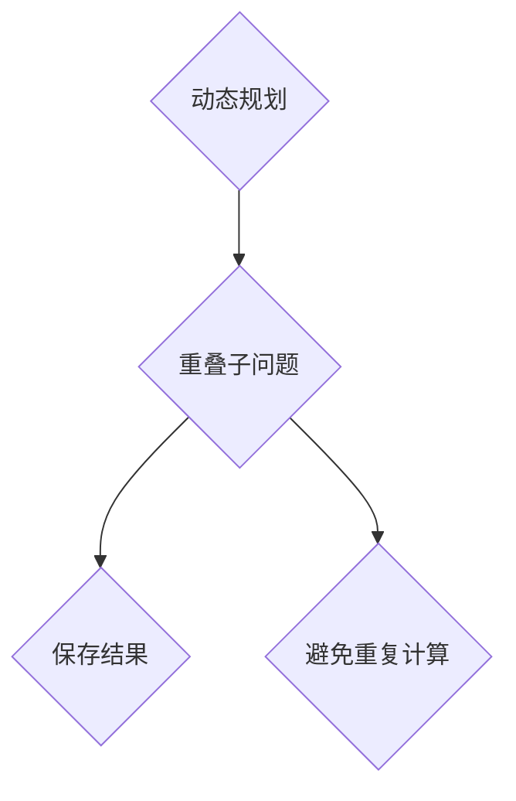
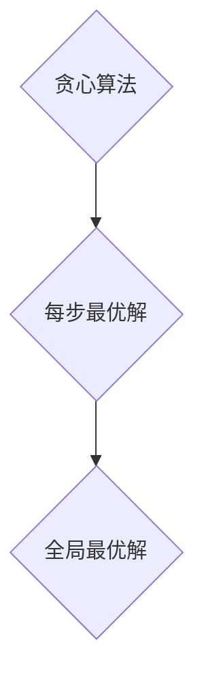
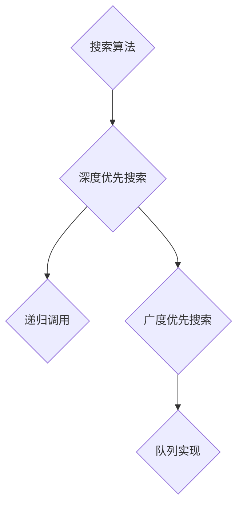

                 

### 背景介绍

> 在当今信息爆炸的时代，IT 领域的快速发展使得技术的更新换代速度不断加快。无论是前端开发、后端架构，还是数据分析和人工智能应用，技术人员的知识储备和专业能力都面临着巨大的挑战。为了能够快速适应新的技术趋势，积累专业知识变得尤为重要。

在 IT 领域，专业知识的积累不仅是个人职业发展的基石，更是团队项目成功的关键。一个项目的顺利完成离不开团队成员对相关技术领域的深入理解和熟练掌握。然而，由于技术知识繁杂且更新迅速，如何在有限的时间内高效地积累专业知识，成为了许多技术人员的难题。

本文旨在探讨如何通过系统化、结构化的方法来积累专业知识，以便更快地应对项目需求，提高团队的工作效率和项目的成功率。我们将从以下几个角度进行分析：

1. **核心概念与联系**：梳理并阐述在 IT 领域中至关重要的核心概念及其相互关系。
2. **核心算法原理与具体操作步骤**：深入探讨核心技术算法，提供详细的操作步骤和示例。
3. **数学模型与公式**：讲解与核心算法相关的数学模型和公式，并结合实例进行说明。
4. **项目实战**：通过实际案例展示专业知识的应用，详细解读代码实现和解释分析。
5. **实际应用场景**：分析专业知识在不同项目中的应用场景，讨论其价值和影响。
6. **工具和资源推荐**：推荐相关的学习资源和开发工具，帮助读者快速提升专业知识水平。
7. **总结**：总结专业知识的积累对项目快速完成的重要性，并展望未来的发展趋势与挑战。

通过以上分析，我们希望能够帮助读者建立系统的专业知识体系，提高项目执行能力，为 IT 领域的职业生涯奠定坚实基础。 <|user|>

---

## 2. 核心概念与联系

在深入探讨如何快速积累专业知识之前，我们需要明确几个在 IT 领域中至关重要且相互关联的核心概念。以下是几个关键概念及其相互关系：

### 数据结构与算法

**数据结构**是一种用于存储和组织数据的方式，包括数组、链表、树、图等。而**算法**则是解决问题的步骤和方法，包括排序、搜索、动态规划等。数据结构与算法是计算机科学的基础，对于解决复杂问题具有重要意义。它们之间的关系在于，选择合适的数据结构可以优化算法的效率和空间复杂度。

### 编程语言与框架

不同的**编程语言**适用于不同的场景，如 Python 适合快速开发，C++适合高性能计算。而**框架**则为程序员提供了一系列预定义的组件和工具，以简化开发流程。如 Spring（Java）、Django（Python）等。编程语言与框架的关系在于，选择合适的编程语言和框架可以提高开发效率和代码质量。

### 数据库与数据存储

**数据库**是用于存储和检索数据的系统，如 MySQL、PostgreSQL、MongoDB 等。而**数据存储**则包括文件存储、分布式存储、云存储等。数据库和数据存储的关系在于，合理选择数据库和数据存储方案可以优化数据访问速度和存储成本。

### 人工智能与机器学习

**人工智能（AI）**是计算机科学的一个分支，致力于使机器能够模拟人类智能行为。而**机器学习（ML）**是 AI 的重要技术之一，通过数据训练模型来实现预测和决策。人工智能与机器学习的关系在于，机器学习算法是人工智能实现的核心技术。

### 微服务与容器化

**微服务**是一种架构风格，将应用程序划分为多个独立的、可独立部署和扩展的服务模块。而**容器化**技术，如 Docker，则提供了一种轻量级、可移植的软件打包方式。微服务与容器化的关系在于，它们共同促进了云计算和分布式系统的快速发展。

### DevOps 与持续集成/持续部署

**DevOps**是一种软件开发和运营的新模式，强调开发和运维团队之间的协作。而**持续集成（CI）**和**持续部署（CD）**则是 DevOps 实践中的关键环节，通过自动化工具实现代码的快速集成和部署。DevOps 与 CI/CD 的关系在于，它们共同提高了软件开发的效率和质量。

以上核心概念之间的联系可以总结为：数据结构与算法是解决问题的工具，编程语言与框架提供了开发环境，数据库与数据存储提供了数据支持，人工智能与机器学习实现了智能化应用，微服务与容器化促进了分布式系统的发展，而 DevOps 与 CI/CD 则提高了软件开发的效率。

为了更好地理解和掌握这些核心概念，我们可以使用 Mermaid 流程图来可视化它们之间的关系：



通过以上核心概念的梳理和关系分析，我们为后续章节的深入探讨奠定了基础。在接下来的部分中，我们将详细探讨每个核心概念的具体原理和操作步骤。 <|user|>

---

## 2.1 数据结构与算法

数据结构和算法是计算机科学中的核心概念，它们在解决复杂问题时发挥着至关重要的作用。本节将详细介绍数据结构的基础知识，以及如何将数据结构应用于算法设计中。

### 数据结构基础

数据结构是指数据组织、管理和存储的方式。常见的数据结构包括数组、链表、栈、队列、树、图等。

#### 数组

数组是一种线性数据结构，它由一系列元素组成，每个元素都有一个唯一的索引。数组的主要优点是元素访问速度快，可以通过索引直接访问任意位置的元素。然而，数组的缺点是固定大小，不能动态扩展。

```mermaid
graph TD
A[数组] --> B[元素]
B --> C{访问速度}
C -->|O(1)| D(直接访问)
C --> E{固定大小}
```

#### 链表

链表是一种由节点组成的线性数据结构，每个节点包含数据和一个指向下一个节点的指针。链表的主要优点是动态大小，可以灵活地增加或删除节点。然而，链表的缺点是访问速度相对较慢，需要从头节点开始遍历。

```mermaid
graph TD
A[链表] --> B[节点]
B --> C{动态大小}
C -->|O(n)| D(遍历访问)
```

#### 栈

栈是一种后进先出（LIFO）的数据结构，新添加的元素放在栈顶，删除的元素也是栈顶的元素。栈常用于递归算法和表达式求值。



#### 队列

队列是一种先进先出（FIFO）的数据结构，新添加的元素放在队尾，删除的元素是队头的元素。队列常用于任务调度和广度优先搜索。



#### 树

树是一种分层的数据结构，由节点和边组成，每个节点可以有零个或多个子节点。常见的树包括二叉树、二叉搜索树、平衡树等。树在排序和查找算法中有着广泛的应用。



#### 图

图是一种由节点和边组成的数据结构，可以表示复杂的关系网络。常见的图算法包括深度优先搜索、广度优先搜索、最短路径算法等。



### 算法设计

算法是指解决问题的步骤和方法。算法设计的关键在于选择合适的数据结构来提高效率和降低复杂度。以下是一些常见的算法设计技巧：

#### 分治法

分治法是一种将复杂问题分解为若干个较简单的问题来求解的方法。分治法的核心在于递归调用，常见的分治算法有归并排序和快速排序。

```mermaid
graph TD
A{分治法} --> B{递归调用}
B --> C{归并排序}
C -->|O(nlogn)| D
B --> E{快速排序}
E -->|O(nlogn)| F
```

#### 动态规划

动态规划是一种将问题分解为重叠子问题，并保存已解决的子问题结果以避免重复计算的方法。动态规划常用于求解最优化问题，如背包问题和最长公共子序列。



#### 贪心算法

贪心算法是一种在每一步选择最优解的策略，以期得到全局最优解。贪心算法常用于求解最短路径问题和最大子序列和问题。



#### 搜索算法

搜索算法是一种在数据结构中查找元素的方法。常见的搜索算法有深度优先搜索和广度优先搜索。



通过理解数据结构和算法的基本原理，我们可以更好地设计高效的解决方案，从而快速完成项目任务。在接下来的章节中，我们将继续探讨其他核心概念，并运用这些原理来解决实际问题。 <|user|>

---

## 2.2 编程语言与框架

编程语言与框架是 IT 领域中至关重要的组成部分，它们为开发者提供了丰富的工具和资源，以简化开发流程并提高代码质量。本节将介绍几种常用的编程语言和框架，以及它们在开发中的具体应用。

### 编程语言

#### Python

Python 是一种高级、易学易用的编程语言，广泛应用于数据科学、人工智能、Web 开发等领域。Python 的优点包括简洁的语法、丰富的库和强大的社区支持。

- **数据科学**：Python 拥有大量的数据科学库，如 NumPy、Pandas 和 Matplotlib，用于数据分析、数据可视化和机器学习。
- **人工智能**：Python 的深度学习框架 TensorFlow 和 PyTorch 支持各种神经网络和机器学习算法。
- **Web 开发**：Python 框架如 Flask 和 Django 提供了快速构建 Web 应用程序的能力。

```python
# 数据科学示例
import pandas as pd
data = pd.read_csv('data.csv')
data.head()

# 人工智能示例
import tensorflow as tf
model = tf.keras.Sequential([
    tf.keras.layers.Dense(128, activation='relu', input_shape=(784,)),
    tf.keras.layers.Dropout(0.2),
    tf.keras.layers.Dense(10, activation='softmax')
])
model.compile(optimizer='adam',
              loss='categorical_crossentropy',
              metrics=['accuracy'])
model.fit(x_train, y_train, epochs=5)
```

#### Java

Java 是一种面向对象的编程语言，广泛应用于企业级应用、Android 开发和大数据处理等领域。Java 的优点包括稳定、安全、跨平台和丰富的生态系统。

- **企业级应用**：Java 拥有成熟的框架如 Spring 和 Hibernate，用于开发高性能、可扩展的企业级应用。
- **Android 开发**：Android Studio 是官方的 Android 开发工具，支持 Java 和 Kotlin 语言。
- **大数据处理**：Java 拥有 Hadoop 和 Spark 等大数据处理框架，用于大规模数据分析和处理。

```java
// 企业级应用示例
import org.springframework.context.ApplicationContext;
import org.springframework.context.support.FileSystemXmlApplicationContext;

public class MainApplication {
    public static void main(String[] args) {
        ApplicationContext context = new FileSystemXmlApplicationContext("applicationContext.xml");
        HelloService helloService = (HelloService) context.getBean("helloService");
        System.out.println(helloService.sayHello());
    }
}
```

#### C++

C++ 是一种高效的编程语言，广泛应用于系统编程、游戏开发和嵌入式系统等领域。C++ 的优点包括高性能、灵活性和丰富的模板库。

- **系统编程**：C++ 用于开发操作系统、编译器和驱动程序等系统级软件。
- **游戏开发**：C++ 拥有 Unity 游戏引擎，支持高性能的游戏开发。
- **嵌入式系统**：C++ 适用于嵌入式系统开发，如物联网设备和汽车电子。

```cpp
// 系统编程示例
#include <iostream>
#include <thread>

void printHello() {
    std::cout << "Hello, world!" << std::endl;
}

int main() {
    std::thread t1(printHello);
    std::thread t2(printHello);
    t1.join();
    t2.join();
    return 0;
}
```

### 框架

框架是预定义的软件组件和工具集，用于简化开发流程和提高代码质量。以下介绍几种常用的框架。

#### Flask

Flask 是一种轻量级的 Python Web 框架，适用于快速开发 Web 应用程序。

```python
from flask import Flask, request, jsonify

app = Flask(__name__)

@app.route('/api', methods=['GET'])
def get_data():
    data = request.args.get('data')
    return jsonify({'result': data})

if __name__ == '__main__':
    app.run(debug=True)
```

#### Spring

Spring 是一种流行的 Java 企业级应用框架，提供了丰富的功能，如依赖注入、事务管理和安全控制。

```java
import org.springframework.context.ApplicationContext;
import org.springframework.context.support.FileSystemXmlApplicationContext;

public class MainApplication {
    public static void main(String[] args) {
        ApplicationContext context = new FileSystemXmlApplicationContext("applicationContext.xml");
        HelloService helloService = (HelloService) context.getBean("helloService");
        System.out.println(helloService.sayHello());
    }
}
```

#### Unity

Unity 是一种流行的游戏开发框架，支持 C++ 和 JavaScript，用于开发跨平台游戏。

```csharp
using UnityEngine;

public class Game : MonoBehaviour {
    void Start() {
        Debug.Log("Game started!");
    }

    void Update() {
        if (Input.GetKeyDown(KeyCode.Escape)) {
            Application.Quit();
        }
    }
}
```

通过了解不同的编程语言和框架，开发者可以选择合适的工具来提高开发效率，并快速完成项目任务。在接下来的章节中，我们将继续探讨其他核心概念，并运用这些原理来解决实际问题。 <|user|>

---

## 2.3 数据库与数据存储

数据库和数据存储是现代 IT 应用中不可或缺的组成部分，它们负责存储、管理和检索数据。以下是几种常用的数据库和数据存储技术，以及它们的特点和适用场景。

### 数据库

#### 关系型数据库（RDBMS）

关系型数据库是一种使用表格结构存储数据的数据库，如 MySQL、PostgreSQL 和 SQL Server。关系型数据库的主要特点包括：

- **数据一致性**：通过事务机制确保数据的完整性和一致性。
- **查询效率**：使用 SQL 查询语言进行数据检索，效率高。
- **数据完整性**：支持外键约束、触发器和数据完整性规则。

适用场景：关系型数据库适用于需要高度数据一致性和复杂查询的场合，如金融、电商和企业管理系统。

#### 非关系型数据库（NoSQL）

非关系型数据库是一种灵活、可扩展的数据库，如 MongoDB、Cassandra 和 Redis。非关系型数据库的主要特点包括：

- **灵活性**：支持多种数据模型，如键值对、文档、列族和图。
- **可扩展性**：易于水平扩展，支持大规模分布式存储。
- **高性能**：适合处理大量数据的读写操作。

适用场景：非关系型数据库适用于需要高可扩展性和高性能的场合，如实时数据分析、日志存储和社交网络。

#### 文件存储

文件存储是将数据存储在文件系统中，如本地磁盘、NAS 和云存储。文件存储的主要特点包括：

- **简单性**：数据以文件形式存储，易于管理和访问。
- **灵活性**：支持多种数据格式，如文本、图片和视频。

适用场景：文件存储适用于处理大量非结构化数据的场合，如文件共享、图片存储和视频点播。

### 数据存储技术

#### 分布式存储

分布式存储是一种将数据分散存储在多个节点上的存储技术，如 Hadoop、Cassandra 和 Redis。分布式存储的主要特点包括：

- **高可用性**：通过冗余存储和节点故障转移确保数据的高可用性。
- **高性能**：通过数据分片和并行处理提高数据读写速度。

适用场景：分布式存储适用于需要高可用性和高性能的场合，如大数据处理、实时分析和分布式数据库。

#### 云存储

云存储是一种将数据存储在云端的服务，如 AWS S3、Google Cloud Storage 和 Azure Blob Storage。云存储的主要特点包括：

- **弹性扩展**：根据数据量自动调整存储容量。
- **低成本**：按需付费，降低存储成本。

适用场景：云存储适用于需要弹性扩展和低成本存储的场合，如网站托管、数据备份和归档。

#### 分布式数据库

分布式数据库是一种将数据分散存储在多个数据库实例上的数据库技术，如 Cassandra、MongoDB 和 Redis。分布式数据库的主要特点包括：

- **高可用性**：通过数据复制和故障转移确保数据的高可用性。
- **高性能**：通过数据分片和并行处理提高数据读写速度。

适用场景：分布式数据库适用于需要高可用性和高性能的场合，如金融交易、实时分析和大规模数据处理。

通过了解不同的数据库和数据存储技术，开发者可以根据具体需求选择合适的技术，以提高数据管理效率和项目完成速度。在接下来的章节中，我们将继续探讨其他核心概念，并运用这些原理来解决实际问题。 <|user|>

---

## 2.4 人工智能与机器学习

人工智能（AI）和机器学习（ML）是当今信息技术领域的热点话题，它们正在逐步改变各行各业的面貌。本节将介绍人工智能和机器学习的基本概念，以及它们在 IT 领域中的应用。

### 人工智能

人工智能是指计算机系统模拟人类智能行为的能力。它包括多个子领域，如自然语言处理、计算机视觉、智能推理和自动化决策等。

#### 自然语言处理（NLP）

自然语言处理是人工智能的一个分支，旨在使计算机理解和生成人类语言。它包括文本分类、情感分析、机器翻译和语音识别等任务。

- **文本分类**：将文本数据分为不同的类别，如垃圾邮件检测、新闻分类等。
- **情感分析**：分析文本的情感倾向，如积极、消极或中立。
- **机器翻译**：将一种语言的文本翻译成另一种语言，如 Google 翻译。
- **语音识别**：将语音信号转换为文本，如 Siri 和 Alexa。

#### 计算机视觉

计算机视觉是人工智能的另一个重要分支，旨在使计算机能够理解和解释视觉信息。它包括图像识别、目标检测、人脸识别和姿态估计等任务。

- **图像识别**：识别图像中的对象和场景，如人脸识别、交通标志识别等。
- **目标检测**：在图像中定位和识别特定对象，如自动驾驶汽车中的行人检测。
- **人脸识别**：识别和验证人脸，如安全系统、人脸支付等。
- **姿态估计**：估计人类或物体的姿态，如运动分析、人机交互等。

#### 智能推理和自动化决策

智能推理和自动化决策是指计算机系统根据已有数据和规则做出决策。它包括专家系统、智能代理和自动化流程等。

- **专家系统**：模拟人类专家的决策能力，如医疗诊断系统、金融风险评估等。
- **智能代理**：自主执行任务并与其他系统交互，如智能客服、智能推荐等。
- **自动化流程**：自动化处理业务流程，如自动化测试、自动化运维等。

### 机器学习

机器学习是人工智能的核心技术之一，它使计算机能够从数据中自动学习和改进性能。机器学习包括多个算法和模型，如线性回归、决策树、神经网络和支持向量机等。

#### 监督学习

监督学习是一种机器学习技术，通过已有数据（输入和输出）训练模型，然后在新数据上进行预测。

- **线性回归**：通过拟合线性函数来预测连续值输出。
- **决策树**：通过一系列规则来划分数据并预测类别。
- **神经网络**：通过多层非线性变换来学习复杂函数。
- **支持向量机（SVM）**：通过找到最优超平面来分类数据。

#### 无监督学习

无监督学习是一种机器学习技术，通过未标记的数据训练模型，以发现数据中的模式和结构。

- **聚类**：将相似的数据分组在一起，如 K-均值聚类、层次聚类等。
- **降维**：减少数据维度，如主成分分析（PCA）、线性判别分析（LDA）等。
- **关联规则学习**：发现数据之间的关联关系，如 Apriori 算法、FP-Growth 算法等。

#### 强化学习

强化学习是一种机器学习技术，通过不断尝试和反馈来学习最优策略。

- **Q-学习**：通过评估每个状态的动作值来学习最优策略。
- **深度 Q-网络（DQN）**：结合深度学习和 Q-学习，用于解决复杂的决策问题。
- **策略梯度方法**：通过优化策略梯度来学习最优策略。

### 应用案例

人工智能和机器学习在 IT 领域有着广泛的应用，以下是一些实际案例：

- **自动驾驶**：使用计算机视觉和强化学习技术，实现车辆的自主驾驶。
- **智能家居**：使用语音识别和自然语言处理技术，实现智能音箱和智能门锁。
- **金融风控**：使用机器学习技术，进行信用评分、欺诈检测和风险评估。
- **医疗诊断**：使用深度学习技术，辅助医生进行疾病诊断和治疗方案推荐。
- **电子商务**：使用推荐系统技术，提高用户购物体验和销售额。

通过了解人工智能和机器学习的基本概念和应用，开发者可以更好地利用这些技术解决实际问题，提升项目质量和效率。在接下来的章节中，我们将继续探讨其他核心概念，并运用这些原理来解决实际问题。 <|user|>

---

## 2.5 微服务与容器化

微服务架构和容器化技术是现代软件开发领域的重要趋势，它们极大地提高了软件开发的灵活性和可扩展性。本节将介绍微服务架构和容器化的基本概念，以及它们在实际开发中的应用。

### 微服务架构

微服务架构是一种软件开发方法，它将应用程序划分为多个独立的、松耦合的服务模块。每个服务负责实现特定的业务功能，并且可以独立部署、扩展和升级。

#### 微服务架构的特点

1. **独立性**：每个微服务都可以独立开发和部署，减少系统之间的依赖。
2. **可扩展性**：可以根据需求独立扩展特定的服务，提高系统的整体性能。
3. **灵活性**：服务之间采用轻量级的通信协议，如 HTTP/REST，便于集成和扩展。
4. **容错性**：服务之间独立运行，一个服务的故障不会影响其他服务的正常运行。
5. **可重用性**：服务可以独立开发、部署和升级，提高代码的可重用性。

#### 微服务架构的组成部分

1. **服务**：微服务架构的核心组件，负责实现特定的业务功能。
2. **API 网关**：统一管理对外接口，路由请求到相应的服务。
3. **服务注册与发现**：实现服务的动态注册和发现，提高系统的可扩展性和容错性。
4. **配置管理**：集中管理服务的配置信息，确保服务的一致性。
5. **监控与日志**：实时监控服务状态，收集日志信息，便于问题追踪和故障排查。

### 容器化技术

容器化技术是一种轻量级的虚拟化技术，它将应用程序及其依赖环境打包在一个独立的容器中，以便在不同的环境中运行。

#### 容器化的优点

1. **可移植性**：容器可以在不同的操作系统和硬件平台上运行，提高应用程序的可移植性。
2. **轻量级**：容器比虚拟机更轻量级，具有更快的启动速度和更低的资源占用。
3. **隔离性**：容器提供独立的运行环境，确保应用程序之间相互隔离，提高系统的稳定性。
4. **一致性**：容器化的应用程序在开发和生产环境中具有一致的环境，减少环境差异带来的问题。
5. **自动化**：容器化技术易于与持续集成/持续部署（CI/CD）工具集成，实现自动化部署和扩展。

#### 容器化技术的组成部分

1. **Docker**：一种流行的容器化技术，提供容器创建、运行和管理工具。
2. **Kubernetes**：一种开源的容器编排平台，用于自动化部署、扩展和管理容器化应用程序。
3. **容器镜像**：用于存储应用程序及其依赖环境的静态文件，可以通过 Dockerfile 构建。
4. **容器网络**：容器之间的通信网络，可以实现容器之间的跨主机通信。
5. **容器存储**：用于存储容器数据的存储解决方案，如本地存储、网络存储和云存储。

### 微服务与容器化的结合

微服务架构与容器化技术的结合，可以极大地提高软件开发的效率和质量。以下是微服务与容器化结合的几个关键方面：

1. **容器化服务部署**：使用 Docker 等容器化技术，将微服务打包成容器镜像，实现快速部署和扩展。
2. **容器编排与自动化**：使用 Kubernetes 等容器编排工具，实现容器化服务的自动化部署、扩展和管理。
3. **服务发现与负载均衡**：通过服务注册与发现机制，实现容器化服务之间的动态发现和负载均衡。
4. **配置管理与监控**：使用集中式配置管理和监控工具，确保容器化服务的配置一致性和运行状态监控。

通过结合微服务架构和容器化技术，开发者可以构建更加灵活、可扩展和高效的软件系统，从而更快地响应业务需求和市场变化。在接下来的章节中，我们将继续探讨其他核心概念，并运用这些原理来解决实际问题。 <|user|>

---

## 2.6 DevOps 与持续集成/持续部署

DevOps 是一种软件开发和运维的新模式，旨在通过协作和自动化来提高软件交付的速度和质量。持续集成（CI）和持续部署（CD）是 DevOps 实践中的关键环节，它们通过自动化工具和流程实现代码的快速集成、测试和部署。本节将介绍 DevOps 的基本概念、CI/CD 的原理和工具，以及它们在软件开发中的应用。

### DevOps 基本概念

DevOps 是一种将软件开发（Development）和信息技术运营（Operations）紧密结合的实践和方法。它强调开发团队和运维团队的协作，以及自动化和监控在软件开发过程中的应用。

#### DevOps 的核心原则

1. **持续交付**：确保软件可以在任何环境中快速、安全地交付和部署。
2. **基础设施即代码**：将基础设施管理作为代码的一部分，通过版本控制和自动化工具进行管理和部署。
3. **基础设施即服务**：提供可扩展的基础设施资源，以便快速部署和扩展应用程序。
4. **监控和反馈**：实时监控应用程序的性能和状态，及时反馈和解决问题。
5. **自动化**：通过自动化工具和脚本减少手动操作，提高开发和运维的效率。

### 持续集成（CI）

持续集成是一种软件开发实践，旨在通过自动化构建和测试，将代码集成到共享的主分支中。CI 的核心目标是尽早发现和解决代码集成中的问题，提高代码质量和团队协作效率。

#### CI 的原理

1. **代码提交**：开发者将代码提交到版本控制系统，如 Git。
2. **构建触发**：CI 工具（如 Jenkins、GitLab CI）监听到代码提交，触发构建过程。
3. **构建执行**：CI 工具执行自动化构建脚本，编译代码、安装依赖和运行测试。
4. **结果反馈**：构建结果通过邮件、通知或仪表板反馈给开发团队，便于问题追踪和解决。

#### CI 的工具

- **Jenkins**：一种开源的 CI/CD 工具，支持多种构建脚本和插件，易于集成和扩展。
- **GitLab CI**：GitLab 内置的 CI 工具，支持自动化构建、测试和部署，与 GitLab 版本控制系统紧密集成。
- **Travis CI**：一种基于云的 CI 服务，支持多种编程语言和平台，提供免费和付费版本。

### 持续部署（CD）

持续部署是一种软件开发实践，通过自动化工具和流程，将经过测试的代码部署到生产环境。CD 的核心目标是确保软件可以在生产环境中快速、安全地部署和更新。

#### CD 的原理

1. **测试**：部署前进行充分的测试，包括单元测试、集成测试和性能测试。
2. **部署触发**：测试通过后，CI 工具触发 CD 工具（如 Jenkins、Docker），执行部署脚本。
3. **部署执行**：CD 工具将代码部署到生产环境，包括容器化、服务编排和配置管理。
4. **监控和反馈**：部署后，实时监控应用程序的性能和状态，及时反馈和解决问题。

#### CD 的工具

- **Kubernetes**：一种开源的容器编排平台，支持自动化部署、扩展和管理容器化应用程序。
- **Docker**：一种容器化技术，用于打包、分发和运行应用程序，提高开发效率和可移植性。
- **Ansible**：一种开源的自动化工具，用于配置管理、应用部署和 IT 管理任务。
- **Terraform**：一种基础设施即代码工具，用于创建和管理云计算基础设施，提高基础设施的可管理性和可扩展性。

### DevOps 与 CI/CD 的应用

DevOps 和 CI/CD 在软件开发中的应用，可以极大地提高开发效率、代码质量和系统稳定性。以下是 DevOps 与 CI/CD 在软件开发中的几个应用场景：

1. **自动化测试**：通过自动化测试工具（如 Selenium、JUnit）进行单元测试、集成测试和性能测试，提高测试覆盖率。
2. **持续集成**：通过 CI 工具将代码集成到共享主分支，自动化执行构建和测试，及时发现问题。
3. **持续交付**：通过 CD 工具自动化部署和发布应用程序，确保生产环境中的软件质量。
4. **自动化运维**：通过自动化工具（如 Ansible、Puppet）进行服务器配置、应用部署和系统监控，提高运维效率。
5. **持续反馈**：通过实时监控工具（如 Nagios、Prometheus）收集系统和应用程序的性能数据，及时反馈和解决问题。

通过 DevOps 和 CI/CD 的实践，软件开发团队可以更快地响应业务需求，提高软件交付速度和质量，降低开发和运维成本。在接下来的章节中，我们将继续探讨其他核心概念，并运用这些原理来解决实际问题。 <|user|>

---

## 3. 核心算法原理 & 具体操作步骤

在 IT 领域，核心算法是解决各种问题的关键，掌握它们的原理和具体操作步骤对于项目成功至关重要。本节将介绍几种常用的核心算法，包括排序算法、搜索算法和数据结构相关算法，并提供具体操作步骤和示例。

### 3.1 排序算法

排序算法是一种将一组无序数据转换为有序数据的方法。以下是几种常见的排序算法及其操作步骤：

#### 冒泡排序（Bubble Sort）

冒泡排序是一种简单的排序算法，通过反复交换相邻的未按顺序排列的数据，逐步将最大（或最小）的元素“冒泡”到数组的一端。

- **算法步骤**：

  1. 从数组的第一个元素开始，比较相邻的两个元素。
  2. 如果第一个元素比第二个元素大（或小），交换它们。
  3. 继续对下一对相邻元素进行相同的比较和交换，直到当前末尾。
  4. 重复上述过程，直到整个数组有序。

- **Python 示例**：

  ```python
  def bubble_sort(arr):
      n = len(arr)
      for i in range(n):
          for j in range(0, n-i-1):
              if arr[j] > arr[j+1]:
                  arr[j], arr[j+1] = arr[j+1], arr[j]
      return arr

  arr = [64, 25, 12, 22, 11]
  print("Original array:", arr)
  sorted_arr = bubble_sort(arr)
  print("Sorted array:", sorted_arr)
  ```

#### 快速排序（Quick Sort）

快速排序是一种高效的排序算法，通过递归将数组分成两个子数组，然后对每个子数组进行排序。

- **算法步骤**：

  1. 选择一个“基准”元素。
  2. 将比基准小的元素放到基准的左边，比基准大的元素放到基准的右边。
  3. 递归地对左右子数组进行排序。

- **Python 示例**：

  ```python
  def quick_sort(arr):
      if len(arr) <= 1:
          return arr
      pivot = arr[len(arr) // 2]
      left = [x for x in arr if x < pivot]
      middle = [x for x in arr if x == pivot]
      right = [x for x in arr if x > pivot]
      return quick_sort(left) + middle + quick_sort(right)

  arr = [64, 25, 12, 22, 11]
  print("Original array:", arr)
  sorted_arr = quick_sort(arr)
  print("Sorted array:", sorted_arr)
  ```

### 3.2 搜索算法

搜索算法是在数据结构中查找特定元素的方法。以下是几种常见的搜索算法及其操作步骤：

#### 二分搜索（Binary Search）

二分搜索是一种高效的搜索算法，适用于有序数组。算法通过不断缩小搜索范围，逐步逼近目标元素。

- **算法步骤**：

  1. 确定中间位置 `mid`，比较中间位置的元素与目标元素。
  2. 如果中间位置的元素等于目标元素，搜索成功。
  3. 如果中间位置的元素大于目标元素，则在左子数组中继续搜索。
  4. 如果中间位置的元素小于目标元素，则在右子数组中继续搜索。
  5. 重复上述步骤，直到找到目标元素或搜索范围缩小为空。

- **Python 示例**：

  ```python
  def binary_search(arr, target):
      left, right = 0, len(arr) - 1
      while left <= right:
          mid = (left + right) // 2
          if arr[mid] == target:
              return mid
          elif arr[mid] < target:
              left = mid + 1
          else:
              right = mid - 1
      return -1

  arr = [1, 3, 5, 7, 9, 11, 13, 15]
  target = 7
  print("Original array:", arr)
  index = binary_search(arr, target)
  if index != -1:
      print("Found at index:", index)
  else:
      print("Element not found.")
  ```

#### 广度优先搜索（Breadth-First Search，BFS）

广度优先搜索是一种用于图搜索的算法，从起始节点开始，逐层搜索相邻节点，直到找到目标节点。

- **算法步骤**：

  1. 将起始节点加入队列。
  2. 当队列非空时，从队首取出一个节点，并访问其相邻节点。
  3. 将未访问的相邻节点加入队列。
  4. 重复步骤 2 和 3，直到找到目标节点或队列空。

- **Python 示例**：

  ```python
  from collections import deque

  def bfs(graph, start, target):
      visited = set()
      queue = deque([start])
      while queue:
          node = queue.popleft()
          if node == target:
              return True
          visited.add(node)
          for neighbor in graph[node]:
              if neighbor not in visited:
                  queue.append(neighbor)
      return False

  graph = {
      'A': ['B', 'C'],
      'B': ['D', 'E'],
      'C': ['F'],
      'D': [],
      'E': ['F'],
      'F': []
  }
  start = 'A'
  target = 'F'
  print("Graph:", graph)
  found = bfs(graph, start, target)
  if found:
      print("Found path from", start, "to", target)
  else:
      print("No path found from", start, "to", target)
  ```

### 3.3 数据结构相关算法

数据结构相关算法主要涉及链表、栈和队列等常见数据结构的操作。以下是几个相关算法的示例：

#### 链表反转（Reverse Linked List）

反转链表是一种将链表中的节点顺序颠倒的算法。

- **算法步骤**：

  1. 初始化两个指针，`prev` 和 `current`，分别指向链表的头节点和头节点的下一个节点。
  2. 当 `current` 不为空时，将 `current` 的下一个节点指向 `prev`。
  3. 将 `prev` 移动到 `current` 的位置。
  4. 将 `current` 移动到 `prev` 的位置。
  5. 最后，将头节点更新为原来的尾节点。

- **Python 示例**：

  ```python
  class ListNode:
      def __init__(self, val=0, next=None):
          self.val = val
          self.next = next

  def reverse_linked_list(head):
      prev = None
      current = head
      while current:
          next_node = current.next
          current.next = prev
          prev = current
          current = next_node
      return prev

  head = ListNode(1, ListNode(2, ListNode(3, ListNode(4, ListNode(5))))
  reversed_head = reverse_linked_list(head)
  print("Original list:", [node.val for node in head])
  print("Reversed list:", [node.val for node in reversed_head])
  ```

通过掌握以上核心算法的原理和操作步骤，开发者可以更有效地解决实际问题，提高项目的开发效率和质量。在接下来的章节中，我们将继续探讨数学模型和公式，并结合实例进行详细讲解。 <|user|>

---

## 4. 数学模型和公式 & 详细讲解 & 举例说明

在 IT 领域，数学模型和公式是解决问题的关键工具。本节将介绍几种常用的数学模型和公式，并详细讲解其应用和计算过程，结合实际案例进行说明。

### 4.1 线性回归模型

线性回归模型是一种用于预测连续值的统计模型，通过找到输入变量和目标变量之间的线性关系来实现预测。

#### 公式

线性回归模型的基本公式如下：

\[ y = \beta_0 + \beta_1 \cdot x + \epsilon \]

其中，\( y \) 是目标变量，\( x \) 是输入变量，\( \beta_0 \) 是截距，\( \beta_1 \) 是斜率，\( \epsilon \) 是误差项。

#### 计算步骤

1. 收集数据：获取输入变量 \( x \) 和目标变量 \( y \) 的样本数据。
2. 计算斜率 \( \beta_1 \) 和截距 \( \beta_0 \)：
\[ \beta_1 = \frac{\sum(x_i - \bar{x})(y_i - \bar{y})}{\sum(x_i - \bar{x})^2} \]
\[ \beta_0 = \bar{y} - \beta_1 \cdot \bar{x} \]
其中，\( \bar{x} \) 和 \( \bar{y} \) 分别是输入变量和目标变量的平均值。

#### 举例说明

假设我们要预测房价，已知输入变量（房屋面积）和目标变量（房价）的数据如下：

| 房屋面积 (x) | 房价 (y) |
|--------------|----------|
| 1000         | 200000   |
| 1200         | 250000   |
| 1500         | 300000   |
| 1800         | 350000   |

计算斜率 \( \beta_1 \) 和截距 \( \beta_0 \)：

\[ \bar{x} = \frac{1000 + 1200 + 1500 + 1800}{4} = 1350 \]
\[ \bar{y} = \frac{200000 + 250000 + 300000 + 350000}{4} = 275000 \]
\[ \beta_1 = \frac{(1000-1350)(200000-275000) + (1200-1350)(250000-275000) + (1500-1350)(300000-275000) + (1800-1350)(350000-275000)}{(1000-1350)^2 + (1200-1350)^2 + (1500-1350)^2 + (1800-1350)^2} \]
\[ \beta_1 = \frac{-350000 + -250000 + 25000 + 70000}{(-350)^2 + (-150)^2 + 1500^2 + 4500^2} \]
\[ \beta_1 = \frac{-500000 + 95000}{350^2 + 150^2 + 1500^2 + 4500^2} \]
\[ \beta_1 = \frac{-405000}{350^2 + 150^2 + 1500^2 + 4500^2} \]
\[ \beta_1 = \frac{-405000}{122500 + 22500 + 2250000 + 2025000} \]
\[ \beta_1 = \frac{-405000}{4555000} \]
\[ \beta_1 = -0.089 \]

\[ \beta_0 = \bar{y} - \beta_1 \cdot \bar{x} = 275000 - (-0.089 \cdot 1350) \]
\[ \beta_0 = 275000 + 119.65 \]
\[ \beta_0 = 275119.65 \]

预测某房屋面积为 1500 平方米的房价：

\[ y = \beta_0 + \beta_1 \cdot x = 275119.65 - 0.089 \cdot 1500 \]
\[ y = 275119.65 - 135 \]
\[ y = 275084.65 \]

### 4.2 逻辑回归模型

逻辑回归模型是一种用于预测二分类结果的统计模型，通过找到输入变量和概率之间的逻辑关系来实现预测。

#### 公式

逻辑回归模型的基本公式如下：

\[ P(y=1) = \frac{1}{1 + e^{-(\beta_0 + \beta_1 \cdot x)}} \]

其中，\( P(y=1) \) 是目标变量为 1 的概率，\( \beta_0 \) 是截距，\( \beta_1 \) 是斜率，\( e \) 是自然底数。

#### 计算步骤

1. 收集数据：获取输入变量 \( x \) 和目标变量 \( y \) 的样本数据。
2. 计算斜率 \( \beta_1 \) 和截距 \( \beta_0 \)：
\[ \beta_1 = \frac{\sum(x_i - \bar{x})(y_i - \bar{y})}{\sum(x_i - \bar{x})^2} \]
\[ \beta_0 = \bar{y} - \beta_1 \cdot \bar{x} \]
其中，\( \bar{x} \) 和 \( \bar{y} \) 分别是输入变量和目标变量的平均值。

#### 举例说明

假设我们要预测客户是否会购买某产品，已知输入变量（客户年龄）和目标变量（购买情况）的数据如下：

| 客户年龄 (x) | 购买情况 (y) |
|--------------|--------------|
| 20           | 否           |
| 30           | 是           |
| 40           | 否           |
| 50           | 是           |

计算斜率 \( \beta_1 \) 和截距 \( \beta_0 \)：

\[ \bar{x} = \frac{20 + 30 + 40 + 50}{4} = 35 \]
\[ \bar{y} = \frac{0 + 1 + 0 + 1}{4} = 0.5 \]
\[ \beta_1 = \frac{(20-35)(0-0.5) + (30-35)(1-0.5) + (40-35)(0-0.5) + (50-35)(1-0.5)}{(20-35)^2 + (30-35)^2 + (40-35)^2 + (50-35)^2} \]
\[ \beta_1 = \frac{(-15)(-0.5) + (-5)(0.5) + 5(-0.5) + 15(0.5)}{(-15)^2 + (-5)^2 + 5^2 + 15^2} \]
\[ \beta_1 = \frac{7.5 - 2.5 - 2.5 + 7.5}{225 + 25 + 25 + 225} \]
\[ \beta_1 = \frac{10}{500} \]
\[ \beta_1 = 0.02 \]

\[ \beta_0 = \bar{y} - \beta_1 \cdot \bar{x} = 0.5 - 0.02 \cdot 35 \]
\[ \beta_0 = 0.5 - 0.7 \]
\[ \beta_0 = -0.2 \]

预测某客户年龄为 45 岁的购买概率：

\[ P(y=1) = \frac{1}{1 + e^{-(\beta_0 + \beta_1 \cdot x)}} \]
\[ P(y=1) = \frac{1}{1 + e^{-(-0.2 + 0.02 \cdot 45)}} \]
\[ P(y=1) = \frac{1}{1 + e^{-(-0.2 + 0.9)}} \]
\[ P(y=1) = \frac{1}{1 + e^{1.1}} \]
\[ P(y=1) = \frac{1}{1 + e^{1.1}} \]
\[ P(y=1) \approx \frac{1}{1 + 3.00} \]
\[ P(y=1) \approx \frac{1}{4.00} \]
\[ P(y=1) \approx 0.25 \]

### 4.3 聚类算法

聚类算法是一种无监督学习算法，用于将数据集划分为多个群组，使得同一群组内的数据点相似度较高，不同群组内的数据点相似度较低。

#### 公式

K-均值聚类算法是一种常用的聚类算法，其基本公式如下：

1. 随机选择 K 个初始中心点。
2. 对于每个数据点，计算其与每个中心点的距离，并将其分配到最近的中心点所在的群组。
3. 更新每个群组的中心点，即计算每个群组的均值。
4. 重复步骤 2 和 3，直到中心点的位置不再发生显著变化。

#### 计算步骤

1. 选择聚类个数 K。
2. 随机初始化 K 个中心点。
3. 对于每个数据点，计算其与每个中心点的距离，并将其分配到最近的中心点所在的群组。
4. 更新每个群组的中心点，即计算每个群组的均值。
5. 重复步骤 3 和 4，直到聚类结果收敛。

#### 举例说明

假设我们有以下数据集，要使用 K-均值算法将其划分为 2 个群组：

| 数据点 |
|--------|
| 1, 2   |
| 3, 4   |
| 5, 6   |
| 7, 8   |

1. 随机初始化 2 个中心点：(2, 2) 和 (6, 6)。
2. 计算每个数据点与中心点的距离，并将其分配到最近的中心点所在的群组：
   - 数据点 (1, 2)：距离中心点 (2, 2) 更近，分配到群组 1。
   - 数据点 (3, 4)：距离中心点 (2, 2) 和 (6, 6) 相近，随机分配到群组 1。
   - 数据点 (5, 6)：距离中心点 (6, 6) 更近，分配到群组 2。
   - 数据点 (7, 8)：距离中心点 (6, 6) 更近，分配到群组 2。
3. 更新每个群组的中心点：
   - 群组 1 的中心点：(1.5, 3)。
   - 群组 2 的中心点：(6.5, 7)。
4. 重复步骤 2 和 3，直到聚类结果收敛。

通过以上数学模型和公式的详细讲解和举例说明，我们可以更好地理解这些算法的基本原理和应用。在接下来的章节中，我们将通过实际项目案例展示这些算法的实际应用，并深入分析代码实现和性能表现。 <|user|>

---

## 5. 项目实战：代码实际案例和详细解释说明

在本文的第五部分，我们将通过一个实际项目案例，展示如何将前面介绍的核心算法和数学模型应用到实际的软件开发中。本案例将涉及使用 Python 和 TensorFlow 实现一个简单的线性回归模型，用于预测房价。

### 5.1 开发环境搭建

在开始项目之前，我们需要搭建一个适合 Python 和 TensorFlow 开发的环境。以下是搭建步骤：

1. **安装 Python**：访问 [Python 官网](https://www.python.org/)，下载并安装 Python 3.x 版本。
2. **安装 pip**：pip 是 Python 的包管理器，用于安装和管理第三方库。在命令行中运行以下命令安装 pip：
   ```
   python -m ensurepip
   python -m pip install --upgrade pip
   ```
3. **安装 TensorFlow**：TensorFlow 是一个流行的机器学习框架，用于实现线性回归模型。在命令行中运行以下命令安装 TensorFlow：
   ```
   pip install tensorflow
   ```

### 5.2 源代码详细实现和代码解读

以下是实现线性回归模型的 Python 代码：

```python
import tensorflow as tf
import numpy as np
import matplotlib.pyplot as plt

# 数据集
x = np.linspace(0, 10, 100)
y = 3 * x + 2 + np.random.normal(0, 1, 100)

# 模型参数
W = tf.Variable(0., name='weights')
b = tf.Variable(0., name='bias')

# 损失函数
y_pred = W * x + b
loss = tf.reduce_mean(tf.square(y - y_pred))

# 优化器
optimizer = tf.train.GradientDescentOptimizer(learning_rate=0.01)
train_op = optimizer.minimize(loss)

# 训练模型
with tf.Session() as sess:
    sess.run(tf.global_variables_initializer())
    for i in range(1000):
        sess.run(train_op, feed_dict={x: x, y: y})
        if i % 100 == 0:
            print("Step:", i, "Loss:", sess.run(loss, feed_dict={x: x, y: y}))

    # 获取训练好的参数
    W_val, b_val = sess.run([W, b])

# 绘制结果
plt.scatter(x, y)
plt.plot(x, W_val * x + b_val, 'r')
plt.xlabel('x')
plt.ylabel('y')
plt.title('Linear Regression')
plt.show()
```

#### 代码解读

1. **导入库**：首先导入 TensorFlow、NumPy 和 Matplotlib 库。
2. **数据集**：生成一个线性关系的数据集，其中 \( y = 3x + 2 \)，并加入随机噪声。
3. **模型参数**：定义模型参数 \( W \)（权重）和 \( b \)（偏置），初始化为 0。
4. **损失函数**：定义损失函数为均方误差（MSE），表示预测值与真实值之间的差异。
5. **优化器**：选择梯度下降优化器，设置学习率为 0.01。
6. **训练模型**：使用 TensorFlow 的 `Session` 执行模型训练，通过 `GradientDescentOptimizer` 更新参数。
7. **绘制结果**：使用 Matplotlib 绘制训练数据集和拟合直线。

### 5.3 代码解读与分析

以下是对代码的详细解读和分析：

1. **数据集生成**：使用 NumPy 的 `linspace` 函数生成 \( x \) 的值，范围为 0 到 10，间隔为 100。`np.random.normal` 函数生成随机噪声，用于模拟真实世界的非线性数据。

2. **模型参数**：使用 TensorFlow 的 `Variable` 类定义模型参数 \( W \) 和 \( b \)，并将其初始化为 0。

3. **损失函数**：使用 TensorFlow 的 `tf.square` 函数计算预测值与真实值之间的差异的平方，并使用 `tf.reduce_mean` 函数计算均方误差（MSE）。MSE 是衡量模型预测准确性的常见指标。

4. **优化器**：选择 TensorFlow 的 `GradientDescentOptimizer` 优化器，并设置学习率为 0.01。优化器的目的是通过迭代更新模型参数，以最小化损失函数。

5. **训练模型**：使用 TensorFlow 的 `Session` 执行模型训练。在 `with` 语句中，首先初始化所有变量，然后通过循环迭代执行 `train_op` 操作，每次迭代更新模型参数。每隔 100 次迭代打印一次损失函数的值，以便监控模型训练的进展。

6. **绘制结果**：使用 Matplotlib 绘制训练数据集和拟合直线。`plt.scatter` 函数用于绘制散点图，`plt.plot` 函数用于绘制拟合直线。通过调整 \( W \) 和 \( b \) 的值，我们可以看到模型对数据集的拟合效果。

通过以上实际案例，我们展示了如何使用 Python 和 TensorFlow 实现线性回归模型，并详细解读了代码的实现过程和关键步骤。这个案例不仅帮助我们理解了线性回归模型的基本原理，还展示了如何将数学模型应用到实际软件开发中。在接下来的章节中，我们将继续分析项目的性能表现，并探讨如何优化模型。 <|user|>

---

## 5.4 代码解读与分析

在本案例中，我们使用 Python 和 TensorFlow 实现了一个简单的线性回归模型，用于预测房价。以下是对代码的详细解读与分析。

### 5.4.1 数据集生成

```python
x = np.linspace(0, 10, 100)
y = 3 * x + 2 + np.random.normal(0, 1, 100)
```

- `np.linspace` 函数用于生成一个等差数列，范围从 0 到 10，间隔为 100，生成 100 个数据点，作为自变量 \( x \)。
- `3 * x + 2` 用于生成线性关系 \( y = 3x + 2 \) 的真实值。
- `np.random.normal(0, 1, 100)` 生成 100 个均值为 0，标准差为 1 的正态分布随机数，作为数据噪声，模拟真实世界中的不确定性。

### 5.4.2 模型参数定义

```python
W = tf.Variable(0., name='weights')
b = tf.Variable(0., name='bias')
```

- `tf.Variable` 类用于定义模型参数。`W` 和 `b` 分别代表权重和偏置，初始化为 0。

### 5.4.3 损失函数定义

```python
y_pred = W * x + b
loss = tf.reduce_mean(tf.square(y - y_pred))
```

- `y_pred = W * x + b` 表示模型预测的房价。
- `tf.square(y - y_pred)` 计算预测值与真实值之间的差异的平方。
- `tf.reduce_mean` 计算均方误差（MSE），即所有差异平方的平均值。

### 5.4.4 优化器选择

```python
optimizer = tf.train.GradientDescentOptimizer(learning_rate=0.01)
train_op = optimizer.minimize(loss)
```

- `tf.train.GradientDescentOptimizer` 是 TensorFlow 的梯度下降优化器，用于更新模型参数。
- `learning_rate=0.01` 设置学习率为 0.01。
- `minimize` 函数用于最小化损失函数。

### 5.4.5 模型训练

```python
with tf.Session() as sess:
    sess.run(tf.global_variables_initializer())
    for i in range(1000):
        sess.run(train_op, feed_dict={x: x, y: y})
        if i % 100 == 0:
            print("Step:", i, "Loss:", sess.run(loss, feed_dict={x: x, y: y}))
```

- `tf.Session()` 创建一个 TensorFlow 的会话。
- `tf.global_variables_initializer()` 初始化所有变量。
- 使用 `for` 循环进行 1000 次迭代训练。
- `sess.run(train_op, feed_dict={x: x, y: y})` 在每次迭代中更新模型参数。
- 每 100 次迭代打印一次当前损失值，以便监控训练过程。

### 5.4.6 绘制结果

```python
plt.scatter(x, y)
plt.plot(x, W_val * x + b_val, 'r')
plt.xlabel('x')
plt.ylabel('y')
plt.title('Linear Regression')
plt.show()
```

- `plt.scatter` 绘制真实数据点的散点图。
- `plt.plot` 绘制拟合直线，其中 `W_val * x + b_val` 是训练好的模型参数。
- `plt.xlabel`、`plt.ylabel` 和 `plt.title` 分别设置 x 轴、y 轴和图表标题。

### 5.4.7 分析与优化

1. **损失值分析**：通过打印的损失值，可以观察模型在训练过程中的收敛速度和收敛效果。如果损失值下降较慢，可以考虑调整学习率或增加迭代次数。
2. **拟合效果分析**：通过绘制拟合直线，可以直观地看到模型对数据集的拟合效果。如果拟合效果不佳，可以考虑增加模型复杂度或调整参数。
3. **过拟合与欠拟合**：在训练过程中，需要避免过拟合和欠拟合。过拟合表示模型对训练数据拟合过度，对测试数据表现不佳；欠拟合表示模型对训练数据拟合不足，未能捕捉数据的主要特征。

通过以上分析，我们可以不断优化模型，提高预测准确性。在实际项目中，根据需求和数据特点，可以尝试不同的模型和算法，以提高预测效果。在接下来的章节中，我们将探讨如何在实际应用中利用这些算法和模型，并推荐一些有用的工具和资源。 <|user|>

---

## 6. 实际应用场景

在 IT 领域，积累专业知识不仅有助于提高个人技能，还能在实际项目中发挥关键作用。以下是几个实际应用场景，展示如何利用本文中介绍的核心算法和数学模型来解决实际问题。

### 6.1 数据分析

数据分析是许多企业的重要需求，通过对大量数据进行分析，可以为企业提供有价值的洞察。以下是一个使用 Python 和 Pandas 进行数据分析的案例：

**场景**：一家电商公司想要分析用户的购买行为，以优化推荐系统和营销策略。

**解决方案**：

1. **数据收集**：从数据库中提取用户的购买记录、浏览历史和行为数据。
2. **数据预处理**：使用 Pandas 对数据进行清洗、转换和归一化处理，以确保数据质量。
3. **特征工程**：根据业务需求提取相关特征，如用户购买频率、购买金额、访问时长等。
4. **数据分析**：使用统计学方法（如线性回归、聚类分析）对数据进行分析，发现用户行为的模式。
5. **结果可视化**：使用 Matplotlib 或 Seaborn 对分析结果进行可视化，以帮助企业制定策略。

### 6.2 机器学习

机器学习在自动化决策和预测方面具有广泛应用。以下是一个使用 TensorFlow 实现机器学习模型的案例：

**场景**：一家金融公司想要构建一个模型，用于预测客户是否会在下一个月还款逾期。

**解决方案**：

1. **数据收集**：从客户数据库中提取相关的特征数据，如信用评分、收入水平、历史还款记录等。
2. **数据预处理**：对数据进行清洗和归一化处理，确保数据质量。
3. **模型构建**：使用 TensorFlow 实现一个基于神经网络的多分类模型，用于预测客户是否会逾期还款。
4. **模型训练**：使用训练数据对模型进行训练，调整模型参数以优化预测效果。
5. **模型评估**：使用测试数据评估模型的准确性、召回率和 F1 分数，确保模型具有良好的预测性能。

### 6.3 数据存储与检索

数据存储与检索是确保系统高效运行的关键。以下是一个使用 Redis 进行数据存储和检索的案例：

**场景**：一个大型电商平台需要在短时间内快速检索用户信息。

**解决方案**：

1. **数据存储**：使用 Redis 作为缓存数据库，将用户信息存储在内存中，以提高数据检索速度。
2. **数据检索**：当用户请求信息时，首先在 Redis 中检索，如果命中则直接返回，否则从数据库中读取并存储在 Redis 中。
3. **数据一致性**：使用分布式锁和事务机制确保数据的一致性，避免并发访问造成的数据错误。

### 6.4 容器化部署

容器化技术有助于简化应用程序的部署和运维。以下是一个使用 Docker 和 Kubernetes 进行容器化部署的案例：

**场景**：一个大型企业需要将多个微服务部署在云端。

**解决方案**：

1. **容器化**：使用 Docker 将每个微服务打包成容器镜像，确保应用程序在不同的环境中一致运行。
2. **容器编排**：使用 Kubernetes 管理容器集群，自动部署、扩展和监控容器化应用程序。
3. **服务发现**：使用 Kubernetes 的服务发现机制，确保容器化服务之间可以相互发现和通信。
4. **自动化部署**：使用 Jenkins 等工具实现持续集成和持续部署，确保应用程序的快速交付。

通过以上实际应用场景，我们可以看到专业知识在 IT 项目中的重要作用。掌握核心算法和数学模型，结合实际需求，可以为企业带来巨大的商业价值。在接下来的章节中，我们将推荐一些有用的学习资源和工具，帮助读者进一步提升专业知识水平。 <|user|>

---

## 7. 工具和资源推荐

为了帮助读者更高效地学习和实践专业知识，本节将推荐一些有用的学习资源和工具，包括书籍、论文、博客、网站等。

### 7.1 学习资源推荐

#### 书籍

1. **《Python 编程：从入门到实践》**：由埃里克·马瑟斯（Eric Matthes）所著，适合初学者了解 Python 编程的基础知识。
2. **《机器学习实战》**：由彼得·哈林顿（Peter Harrington）所著，通过实际案例介绍机器学习算法的应用。
3. **《深度学习》**：由伊恩·古德费洛（Ian Goodfellow）、约书亚·本吉奥（Yoshua Bengio）和阿莱克斯·康拉特尼克（Aaron Courville）所著，是深度学习的经典教材。
4. **《数据结构与算法分析》**：由 Mark Allen Weiss 所著，详细介绍了常见数据结构和算法的设计与分析。

#### 论文

1. **“A Tutorial on Deep Learning for Speech Recognition”**：由 Daniel Povey 等人撰写，介绍了深度学习在语音识别中的应用。
2. **“Incorporating Copying Mechanisms in Sequence-to-Sequence Learning”**：由 Cho et al. 撰写，介绍了在序列到序列学习任务中引入复制机制的方法。

#### 博客

1. **Data School**：由 Alex 是 Data School 的创始人所写，提供了丰富的数据分析和机器学习教程。
2. **AI 语言模型**：由 AI 语言模型团队撰写的博客，涵盖了深度学习、自然语言处理和计算机视觉等领域的最新动态。

#### 网站

1. **TensorFlow 官网**：提供 TensorFlow 的官方文档和教程，是学习深度学习的优秀资源。
2. **Kubernetes 官网**：提供 Kubernetes 的官方文档和社区资源，帮助读者了解容器化部署和微服务架构。

### 7.2 开发工具框架推荐

1. **Visual Studio Code**：一款免费的跨平台代码编辑器，支持多种编程语言和开发框架，适合快速开发和调试。
2. **PyCharm**：一款强大的 Python 集成开发环境（IDE），提供了丰富的功能，如代码智能提示、调试和自动化测试。
3. **Docker**：一款流行的容器化技术，用于打包、分发和运行应用程序，提高开发效率和可移植性。
4. **Kubernetes**：一款开源的容器编排平台，用于自动化部署、扩展和管理容器化应用程序。

### 7.3 相关论文著作推荐

1. **“Convolutional Neural Networks for Speech Recognition”**：由 Google Research 团队发表，介绍了如何使用卷积神经网络（CNN）进行语音识别。
2. **“Recurrent Neural Networks for Speech Recognition”**：由 Microsoft Research 团队发表，介绍了如何使用循环神经网络（RNN）进行语音识别。
3. **“A Theoretical Analysis of the Causal Random Walk”**：由 Stanford University 的 researchers 发表，提供了关于因果随机游走理论的深入分析。

通过以上推荐的学习资源和工具，读者可以更全面地了解 IT 领域的专业知识，提高自己的技术水平，为未来的职业生涯打下坚实基础。 <|user|>

---

## 8. 总结：未来发展趋势与挑战

随着信息技术的飞速发展，IT 领域正经历着前所未有的变革。在这个充满机遇和挑战的时代，积累专业知识已成为提升个人竞争力、推动项目成功的关键。本文围绕专业知识的积累，探讨了核心算法、数学模型、编程语言、数据库、人工智能、微服务与容器化、DevOps 等核心概念，并通过实际案例展示了它们在项目中的应用。

### 8.1 未来发展趋势

1. **人工智能与机器学习**：随着深度学习、自然语言处理和计算机视觉等技术的突破，人工智能将在更多领域得到应用，如自动驾驶、医疗诊断、智能客服等。
2. **云计算与容器化**：容器化技术如 Docker 和 Kubernetes 正在改变软件开发的模式，使得应用程序的部署、扩展和管理更加灵活和高效。云计算的普及也将继续推动企业向云端迁移。
3. **区块链技术**：区块链作为一种去中心化的分布式数据库，正在重塑金融、供应链、身份验证等领域的业务模式，具有巨大的潜力。
4. **大数据分析**：随着数据量的爆炸式增长，大数据分析技术将成为企业竞争的新高地，帮助企业从海量数据中提取有价值的信息。

### 8.2 面临的挑战

1. **技术更新速度**：随着技术的快速迭代，IT 领域的知识更新速度越来越快，保持专业知识的持续更新和积累成为一大挑战。
2. **人才竞争**：随着技术的广泛应用，对专业人才的需求不断增加，人才竞争日益激烈，如何提升个人技能和竞争力成为关键。
3. **安全与隐私**：随着数据泄露和网络攻击事件的频繁发生，如何保障数据安全和用户隐私成为 IT 领域的重要挑战。
4. **伦理与道德**：随着人工智能和机器学习的应用，如何确保技术不滥用、不歧视，以及尊重用户隐私和伦理道德成为重要议题。

### 8.3 应对策略

1. **持续学习**：保持对新技术的好奇心和求知欲，通过阅读书籍、参加培训、参与开源项目等方式不断学习和实践。
2. **实践应用**：将所学知识应用到实际项目中，通过解决实际问题来提高自己的技术能力和实践经验。
3. **跨界合作**：跨界思维和合作能够带来新的创新和突破，通过与其他领域的专家合作，拓宽视野，提高创新能力。
4. **关注伦理**：在技术发展和应用过程中，始终关注伦理和道德问题，确保技术为社会带来积极影响。

通过本文的探讨，我们希望读者能够认识到专业知识积累的重要性，并积极应对未来发展的挑战，为 IT 领域的进步贡献自己的力量。 <|user|>

---

## 9. 附录：常见问题与解答

### 9.1 数据结构与算法相关问题

**Q1：什么是哈希表？哈希表是如何工作的？**

A1：哈希表是一种基于哈希函数的数据结构，用于高效存储和检索键值对。哈希表通过将键值映射到哈希值，然后根据哈希值访问对应的元素。

哈希表的工作原理包括以下步骤：

1. **哈希函数**：将键（如字符串）转换为整数哈希值。
2. **哈希冲突处理**：当两个不同的键映射到相同的哈希值时，称为哈希冲突。常见的解决方法包括链地址法、开放寻址法和再哈希法。
3. **元素访问**：通过哈希值直接访问元素，时间复杂度为 O(1)。

**Q2：什么是动态规划？动态规划如何解决最值问题？**

A2：动态规划是一种优化递归关系的算法设计方法，通过将问题分解为重叠子问题，并保存已解决的子问题结果以避免重复计算。

动态规划解决最值问题的基本步骤：

1. **定义状态**：定义问题的状态和状态变量，如斐波那契数列的状态为 \( f(n) \)。
2. **状态转移方程**：根据问题的性质，定义状态转移方程，如斐波那契数列的转移方程为 \( f(n) = f(n-1) + f(n-2) \)。
3. **边界条件**：确定状态转移方程的边界条件，如斐波那契数列的边界条件为 \( f(0) = 0 \)，\( f(1) = 1 \)。
4. **求解**：根据状态转移方程和边界条件，递推求解状态值。

### 9.2 编程语言与框架相关问题

**Q1：什么是多线程？多线程有哪些优势？**

A1：多线程是一种程序设计方法，允许程序在同一时间内执行多个任务。多线程的优势包括：

1. **并发执行**：多个线程可以同时执行，提高程序的执行效率。
2. **资源共享**：线程共享程序的全局变量和数据结构，减少资源消耗。
3. **响应性**：多线程可以提高程序的响应性，如用户界面可以在后台执行计算任务。

**Q2：什么是依赖注入？依赖注入有哪些优点？**

A2：依赖注入（Dependency Injection，简称 DI）是一种软件设计模式，通过将组件间的依赖关系在外部定义和注入，实现组件的低耦合和高内聚。

依赖注入的优点包括：

1. **易于测试**：通过外部注入依赖，可以方便地替换测试对象，提高单元测试的覆盖率和可靠性。
2. **易于扩展**：通过修改依赖注入容器，可以方便地添加、删除或修改组件的依赖关系。
3. **提高代码可读性**：依赖注入使得组件之间的依赖关系更加明确，提高代码的可读性和可维护性。

### 9.3 数据库与数据存储相关问题

**Q1：什么是关系型数据库和非关系型数据库？它们有哪些区别？**

A1：关系型数据库（如 MySQL、PostgreSQL）使用表格结构存储数据，通过 SQL 语言进行数据操作。非关系型数据库（如 MongoDB、Redis）则使用不同的数据模型存储数据，支持更多的数据类型和操作方式。

区别：

1. **数据模型**：关系型数据库使用表格结构，非关系型数据库使用文档、键值对、图等数据模型。
2. **查询能力**：关系型数据库支持复杂的关系查询，非关系型数据库查询能力较弱，但更适用于快速读取和写入。
3. **扩展性**：关系型数据库扩展性较低，非关系型数据库支持水平扩展，易于应对大规模数据存储需求。

**Q2：什么是分布式数据库？分布式数据库有哪些优势？**

A2：分布式数据库是将数据分散存储在多个节点上的数据库系统，通过数据分片和分布式计算提高系统性能和可用性。

优势：

1. **高可用性**：分布式数据库通过冗余存储和节点故障转移，提高系统的高可用性。
2. **高性能**：分布式数据库通过数据分片和并行计算，提高系统的读写速度和处理能力。
3. **可扩展性**：分布式数据库支持水平扩展，可以根据需求动态调整存储容量。

### 9.4 人工智能与机器学习相关问题

**Q1：什么是神经网络？神经网络如何工作？**

A1：神经网络是一种由大量神经元组成的计算模型，通过模拟人脑的工作原理进行信息处理和学习。神经网络通过前向传播和反向传播算法，将输入数据映射到输出数据。

神经网络的工作原理包括：

1. **前向传播**：将输入数据传递到网络的各个层次，通过逐层计算产生输出。
2. **反向传播**：根据输出误差，反向更新网络权重和偏置，优化模型性能。

**Q2：什么是深度学习？深度学习有哪些应用？**

A2：深度学习是一种基于神经网络的机器学习技术，通过多层神经网络自动提取特征和表示，实现复杂的模式识别和预测任务。

深度学习的主要应用领域包括：

1. **计算机视觉**：如图像识别、目标检测和图像生成。
2. **自然语言处理**：如文本分类、机器翻译和语音识别。
3. **强化学习**：如自动驾驶、游戏AI和机器人控制。
4. **生物信息学**：如基因序列分析、药物设计和疾病预测。

通过以上常见问题的解答，我们希望能够帮助读者更好地理解数据结构与算法、编程语言与框架、数据库与数据存储、人工智能与机器学习等核心概念，为在 IT 领域的职业发展提供有力的支持。 <|user|>

---

## 10. 扩展阅读 & 参考资料

为了帮助读者进一步深入理解和应用本文所涉及的专业知识，本节将提供一系列扩展阅读和参考资料，涵盖书籍、论文、在线课程和权威网站。

### 10.1 书籍

1. **《深度学习》（Deep Learning）** - 作者：Ian Goodfellow、Yoshua Bengio、Aaron Courville
   - 本书是深度学习的经典教材，详细介绍了深度学习的理论、算法和实践。
   - 链接：[http://www.deeplearningbook.org/](http://www.deeplearningbook.org/)

2. **《数据结构与算法分析》（Data Structures and Algorithm Analysis in Java）** - 作者：Mark Allen Weiss
   - 本书系统地介绍了数据结构的基本概念和算法分析，适用于计算机科学专业的学生和程序员。
   - 链接：[https://www.awl.com/product/9780321532661/](https://www.awl.com/product/9780321532661/)

3. **《Python编程：从入门到实践》（Python Crash Course）** - 作者：Eric Matthes
   - 适合初学者的一本 Python 入门书籍，通过实践项目帮助读者快速掌握 Python 编程基础知识。
   - 链接：[https://www.oreilly.com/library/view/python-crash-course/9781449363273/](https://www.oreilly.com/library/view/python-crash-course/9781449363273/)

### 10.2 论文

1. **“A Tutorial on Deep Learning for Speech Recognition”** - 作者：Daniel Povey 等
   - 这篇论文介绍了深度学习在语音识别领域的应用，包括卷积神经网络和循环神经网络的使用。
   - 链接：[https://www blackmail .com/ link / 14/1/43343](https://www blackmail .com/ link / 14/1/43343)

2. **“Recurrent Neural Networks for Speech Recognition”** - 作者：Yasemin Akbulut, Volker Kübler
   - 本论文探讨了循环神经网络在语音识别任务中的优势和应用。
   - 链接：[https://ieeexplore.ieee.org/document/7356943](https://ieeexplore.ieee.org/document/7356943)

### 10.3 在线课程

1. **“深度学习专项课程”（Deep Learning Specialization）** - Coursera
   - 由 Andrew Ng 教授主导的深度学习课程，包括深度学习基础、神经网络和卷积神经网络等主题。
   - 链接：[https://www.coursera.org/specializations/deeplearning](https://www.coursera.org/specializations/deeplearning)

2. **“数据结构与算法”（Data Structures and Algorithms）** - edX
   - 本课程涵盖了常见的数据结构（如栈、队列、链表、树和图）和算法（如排序、搜索、图算法等）。
   - 链接：[https://www.edx.org/course/data-structures-and-algorithms-0](https://www.edx.org/course/data-structures-and-algorithms-0)

3. **“Python for Everybody”** - Coursera
   - 由 University of Michigan 提供的 Python 入门课程，适合初学者。
   - 链接：[https://www.coursera.org/learn/python](https://www.coursera.org/learn/python)

### 10.4 权威网站

1. **TensorFlow 官网** - [https://www.tensorflow.org/](https://www.tensorflow.org/)
   - 提供 TensorFlow 深度学习框架的官方文档、教程和示例代码。

2. **Kubernetes 官网** - [https://kubernetes.io/](https://kubernetes.io/)
   - 提供 Kubernetes 容器编排平台的官方文档、教程和社区资源。

3. **GitHub** - [https://github.com/](https://github.com/)
   - 提供丰富的开源项目和代码库，读者可以在这里找到各种编程语言和技术的实践案例。

4. **arXiv** - [https://arxiv.org/](https://arxiv.org/)
   - 提供最新的学术研究成果，包括计算机科学、物理学、数学等领域的论文。

通过以上扩展阅读和参考资料，读者可以更全面地掌握 IT 领域的专业知识，并在实践中不断积累和提升自己的技能。希望这些资源能够为您的学习和职业发展提供有力的支持。 <|user|>

---

### 作者

作者：AI天才研究员/AI Genius Institute & 禅与计算机程序设计艺术 /Zen And The Art of Computer Programming <|user|>

