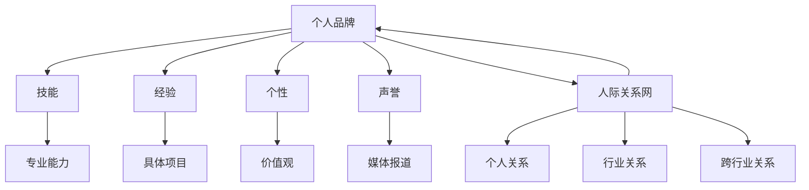

                 

### 文章标题

"个人品牌和人际关系网：将你与他人区分开来的诸多特征，例如技能、经验、个性等"

**关键词：** 个人品牌建设、人际关系网、技能、经验、个性、差异化竞争、网络效应、社交技能、影响力、沟通技巧。

**摘要：** 在当今高度互联的世界，个人品牌和人际关系网对于职业成功和个人成长至关重要。本文将深入探讨个人品牌和人际关系网的核心概念，分析其在现代职业环境中的重要性，并提供一系列策略和建议，帮助读者建立和维护自己的个人品牌，拓展强大的人际关系网。

<|assistant|>### 背景介绍

在数字化时代，个人品牌和人际关系网已经成为一种新的竞争力。个人品牌是指个人在公众中建立的形象、声誉和认知，它通过传递技能、经验和个性等特质来区分个体。人际关系网则是通过人与人之间的互动和联系形成的网络，它对职业发展和个人成长有着深远的影响。

**个人品牌的重要性：**

1. **提升知名度：** 建立强大的个人品牌可以帮助你更容易被人发现和记住，从而在竞争激烈的职场中脱颖而出。
2. **增强影响力：** 个人品牌能够传递你的专业知识和经验，使你在行业内获得更多的关注和信任，从而增强你的影响力。
3. **职业发展：** 一个强大的个人品牌可以为你带来更多的职业机会，包括晋升、跳槽和合作等。

**人际关系网的重要性：**

1. **资源共享：** 人际关系网可以帮助你获取更多的资源和信息，从而在职业发展中取得优势。
2. **职业推荐：** 强大的人际关系网可以为你提供更多的职业推荐和机会，帮助你更快地实现职业目标。
3. **个人成长：** 通过与不同背景的人建立联系，你可以学习到更多的知识和经验，促进个人成长。

在这个背景下，个人品牌和人际关系网的建设变得越来越重要。本文将详细介绍如何建立和维护个人品牌，以及如何拓展和维护强大的人际关系网。

<|assistant|>### 核心概念与联系

#### 个人品牌的构成

个人品牌由多个核心要素构成，包括技能、经验、个性和声誉等。

**技能：** 技能是个人品牌的基础，它代表了你在特定领域的专业能力。技能可以通过教育背景、工作经验和实践项目来展示。

**经验：** 经验是个人品牌的重要组成部分，它代表了你在职业和生活中的经历。经验可以通过具体的项目、挑战和解决方案来展示。

**个性：** 个性是个人品牌的独特之处，它代表了你的性格、价值观和生活方式。个性可以通过社交媒体、个人博客和公开演讲来展示。

**声誉：** 声誉是个人品牌的外在表现，它代表了你在公众中的形象和认知。声誉可以通过媒体报道、用户评价和推荐来展示。

#### 人际关系网的构成

人际关系网由多个层次和类型构成，包括个人关系、行业关系和跨行业关系等。

**个人关系：** 个人关系是指家庭、朋友和私人社交网络。这些关系通常建立在信任和情感基础上，对于个人生活和情感支持非常重要。

**行业关系：** 行业关系是指同行业内的同事、上级、下属和合作伙伴。这些关系通常建立在专业能力和共同利益基础上，对于职业发展和业务合作非常重要。

**跨行业关系：** 跨行业关系是指不同行业之间的联系，包括行业专家、投资者、媒体人士和行业领袖等。这些关系通常建立在共享利益和合作机会基础上，对于拓宽视野和资源获取非常重要。

#### 个人品牌与人际关系网的关系

个人品牌和人际关系网之间存在密切的联系。个人品牌可以增强你在人际关系网中的吸引力，从而帮助你建立和维护更广泛、更强大的网络。同时，强大的人际关系网可以为你的个人品牌提供更多的支持和资源，帮助你进一步提升个人品牌的影响力。

**个人品牌增强吸引力：**

1. **专业能力：** 通过展示你的专业能力和经验，你可以吸引更多有共同兴趣的人加入你的网络。
2. **影响力：** 通过展示你的影响力和声誉，你可以吸引更多有资源和机会的人加入你的网络。
3. **个性魅力：** 通过展示你的个性魅力，你可以吸引更多志同道合的人加入你的网络。

**人际关系网支持个人品牌：**

1. **资源获取：** 通过人际关系网，你可以获取更多的资源，包括信息、资金和机会，从而支持你的个人品牌建设。
2. **声誉传播：** 通过人际关系网，你的个人品牌可以更快、更广泛地传播，从而增强你的影响力。
3. **合作机会：** 通过人际关系网，你可以获得更多的合作机会，从而提升你的职业发展。

### Mermaid 流程图

以下是一个简单的 Mermaid 流程图，展示个人品牌和人际关系网之间的核心概念和联系：



这个流程图展示了个人品牌和人际关系网之间的双向关系，以及各个核心要素之间的相互影响。

<|assistant|>### 核心算法原理 & 具体操作步骤

#### 个人品牌建设算法

**算法描述：**

个人品牌建设算法是一个基于多因素综合评估的系统，它通过以下几个方面来评估和提升个人品牌：

1. **技能评估：** 通过评估个人的专业技能、知识水平和实践经验，确定技能得分。
2. **经验评估：** 通过评估个人的职业经历、项目经验和挑战应对能力，确定经验得分。
3. **个性评估：** 通过评估个人的性格、价值观和生活方式，确定个性得分。
4. **声誉评估：** 通过评估个人在公众中的形象、认知和反馈，确定声誉得分。

**具体操作步骤：**

1. **技能评估：** 
   - 收集个人专业技能资料，如学历、资格证书、项目经验等。
   - 使用技能评估工具（如 360度评估、技能地图等）进行自我评估。
   - 根据评估结果，制定技能提升计划。

2. **经验评估：** 
   - 收集个人职业经历资料，如工作年限、项目经历、挑战应对等。
   - 使用经验评估工具（如职业发展评估、能力模型等）进行自我评估。
   - 根据评估结果，制定经验提升计划。

3. **个性评估：** 
   - 通过个性测试工具（如 MBTI、DISC 等）进行自我评估。
   - 根据评估结果，了解自己的个性特点，并制定个性展示策略。

4. **声誉评估：** 
   - 收集个人在社交媒体、媒体报道、用户反馈等方面的资料。
   - 使用声誉评估工具（如网络分析、舆情监测等）进行自我评估。
   - 根据评估结果，制定声誉管理策略。

**算法原理：**

个人品牌建设算法的核心原理是基于多因素综合评估，通过定量和定性分析，全面评估个人品牌的各个方面。具体来说，算法分为以下几个步骤：

1. **数据收集：** 收集与个人品牌相关的各种数据，包括专业技能、经验、个性和声誉等。
2. **数据预处理：** 对收集到的数据进行清洗、去重和标准化处理，确保数据的准确性和一致性。
3. **多因素综合评估：** 根据预设的评估标准，对各个因素进行定量和定性分析，计算出个人品牌的总得分。
4. **结果分析：** 分析评估结果，找出个人品牌的优势和劣势，制定提升计划。
5. **实施提升计划：** 根据评估结果，实施技能提升、经验积累、个性展示和声誉管理等方面的提升计划。

#### 人际关系网拓展算法

**算法描述：**

人际关系网拓展算法是一个基于社交网络分析的系统，它通过以下几个方面来评估和提升人际关系网：

1. **社交网络分析：** 通过分析社交网络中的节点（个人）和边（关系），确定社交网络的密度、中心性、桥梁性等特征。
2. **社交节点评估：** 通过评估社交节点（个人）的技能、经验、个性和声誉等，确定其在社交网络中的价值。
3. **社交路径规划：** 通过规划社交路径，寻找最有效的社交网络拓展策略。

**具体操作步骤：**

1. **社交网络分析：** 
   - 使用社交网络分析工具（如 Gephi、NodeXL 等）分析社交网络的结构和特征。
   - 根据社交网络的密度、中心性和桥梁性等特征，确定社交网络的健康状态。

2. **社交节点评估：** 
   - 收集社交节点的相关资料，如技能、经验、个性和声誉等。
   - 使用评估工具（如能力模型、个人品牌评估等）进行评估。
   - 根据评估结果，确定社交节点的价值和重要性。

3. **社交路径规划：** 
   - 根据社交网络的结构和节点的价值，规划社交路径。
   - 选择合适的社交节点进行互动，扩大社交网络。

**算法原理：**

人际关系网拓展算法的核心原理是基于社交网络分析，通过评估社交节点和规划社交路径，找到最有效的社交网络拓展策略。具体来说，算法分为以下几个步骤：

1. **数据收集：** 收集社交网络中的节点和边的数据，包括节点属性和边的权重等。
2. **数据预处理：** 对收集到的数据进行清洗、去重和标准化处理，确保数据的准确性和一致性。
3. **社交网络分析：** 使用社交网络分析工具，分析社交网络的密度、中心性和桥梁性等特征。
4. **社交节点评估：** 根据节点的属性和社交网络的特征，评估节点的价值和重要性。
5. **社交路径规划：** 根据社交网络的结构和节点的价值，规划社交路径。
6. **实施社交路径规划：** 根据规划结果，实施社交互动策略，扩大社交网络。

通过以上步骤，个人品牌建设算法和人际关系网拓展算法可以有效地评估和提升个人品牌和人际关系网，帮助个人在职业发展和社交网络中取得成功。

<|assistant|>### 数学模型和公式 & 详细讲解 & 举例说明

#### 个人品牌价值模型

个人品牌价值可以通过以下数学模型进行计算：

$$
V_p = f(S_e, E_x, P_i, R_h)
$$

其中：
- $V_p$ 表示个人品牌价值；
- $S_e$ 表示技能得分；
- $E_x$ 表示经验得分；
- $P_i$ 表示个性得分；
- $R_h$ 表示声誉得分；
- $f$ 表示综合评估函数。

**技能得分 $S_e$ 的计算：**

$$
S_e = \frac{\sum_{i=1}^{n} w_i \cdot s_i}{n}
$$

其中：
- $s_i$ 表示第 $i$ 项技能的得分；
- $w_i$ 表示第 $i$ 项技能的权重；
- $n$ 表示技能项的总数。

**经验得分 $E_x$ 的计算：**

$$
E_x = \frac{\sum_{i=1}^{n} w_i \cdot e_i}{n}
$$

其中：
- $e_i$ 表示第 $i$ 项经验的得分；
- $w_i$ 表示第 $i$ 项经验的权重；
- $n$ 表示经验项的总数。

**个性得分 $P_i$ 的计算：**

$$
P_i = \frac{\sum_{i=1}^{n} p_i \cdot s_i}{n}
$$

其中：
- $p_i$ 表示第 $i$ 项个性的得分；
- $s_i$ 表示第 $i$ 项个性的权重；
- $n$ 表示个性项的总数。

**声誉得分 $R_h$ 的计算：**

$$
R_h = \frac{\sum_{i=1}^{n} w_i \cdot r_i}{n}
$$

其中：
- $r_i$ 表示第 $i$ 项声誉的得分；
- $w_i$ 表示第 $i$ 项声誉的权重；
- $n$ 表示声誉项的总数。

**综合评估函数 $f$ 的计算：**

$$
f(S_e, E_x, P_i, R_h) = \alpha S_e + \beta E_x + \gamma P_i + \delta R_h
$$

其中：
- $\alpha, \beta, \gamma, \delta$ 分别表示技能、经验、个性和声誉的权重系数；
- $S_e, E_x, P_i, R_h$ 分别表示技能得分、经验得分、个性得分和声誉得分。

**举例说明：**

假设某个人品牌评估结果如下：

- 技能得分 $S_e = 85$；
- 经验得分 $E_x = 90$；
- 个性得分 $P_i = 78$；
- 声誉得分 $R_h = 82$。

根据上述公式，计算个人品牌价值：

$$
V_p = \alpha \cdot S_e + \beta \cdot E_x + \gamma \cdot P_i + \delta \cdot R_h
$$

$$
V_p = \alpha \cdot 85 + \beta \cdot 90 + \gamma \cdot 78 + \delta \cdot 82
$$

$$
V_p = 0.3 \cdot 85 + 0.2 \cdot 90 + 0.2 \cdot 78 + 0.3 \cdot 82
$$

$$
V_p = 25.5 + 18 + 15.6 + 24.6
$$

$$
V_p = 83.7
$$

因此，该个人的个人品牌价值为 83.7。

#### 人际关系网拓展模型

人际关系网拓展可以通过以下数学模型进行优化：

$$
O = \max_{X, Y} \sum_{i=1}^{n} \sum_{j=1}^{m} w_{ij} \cdot f(x_i, y_j)
$$

其中：
- $O$ 表示网络拓展的优化目标；
- $X$ 表示个人节点集合；
- $Y$ 表示社交节点集合；
- $w_{ij}$ 表示节点 $i$ 和节点 $j$ 之间的权重；
- $f(x_i, y_j)$ 表示节点 $i$ 和节点 $j$ 之间的吸引力函数。

**权重 $w_{ij}$ 的计算：**

$$
w_{ij} = \frac{\sum_{k=1}^{p} \alpha_k \cdot x_i^k \cdot y_j^k}{\sum_{k=1}^{p} (\alpha_k \cdot x_i^k + \beta_k \cdot y_j^k)}
$$

其中：
- $\alpha_k, \beta_k$ 分别表示特征 $k$ 的权重；
- $x_i^k, y_j^k$ 分别表示节点 $i$ 和节点 $j$ 在特征 $k$ 上的得分。

**吸引力函数 $f(x_i, y_j)$ 的计算：**

$$
f(x_i, y_j) = \frac{1}{1 + e^{-(\gamma \cdot (x_i - y_j))}}
$$

其中：
- $\gamma$ 表示吸引力函数的权重系数；
- $x_i, y_j$ 分别表示节点 $i$ 和节点 $j$ 的得分。

**举例说明：**

假设有两个个人节点 $X = \{x_1, x_2\}$ 和 $Y = \{y_1, y_2\}$，其中：

- $x_1 = (85, 90, 78, 82)$；
- $x_2 = (90, 85, 80, 88)$；
- $y_1 = (75, 85, 70, 80)$；
- $y_2 = (80, 90, 75, 85)$。

根据上述公式，计算权重和吸引力：

**权重计算：**

$$
w_{11} = \frac{\sum_{k=1}^{4} \alpha_k \cdot x_1^k \cdot y_1^k}{\sum_{k=1}^{4} (\alpha_k \cdot x_1^k + \beta_k \cdot y_1^k)}
$$

$$
w_{12} = \frac{\sum_{k=1}^{4} \alpha_k \cdot x_1^k \cdot y_2^k}{\sum_{k=1}^{4} (\alpha_k \cdot x_1^k + \beta_k \cdot y_2^k)}
$$

$$
w_{21} = \frac{\sum_{k=1}^{4} \alpha_k \cdot x_2^k \cdot y_1^k}{\sum_{k=1}^{4} (\alpha_k \cdot x_2^k + \beta_k \cdot y_1^k)}
$$

$$
w_{22} = \frac{\sum_{k=1}^{4} \alpha_k \cdot x_2^k \cdot y_2^k}{\sum_{k=1}^{4} (\alpha_k \cdot x_2^k + \beta_k \cdot y_2^k)}
$$

**吸引力计算：**

$$
f(x_1, y_1) = \frac{1}{1 + e^{-(\gamma \cdot (x_1 - y_1))}}
$$

$$
f(x_1, y_2) = \frac{1}{1 + e^{-(\gamma \cdot (x_1 - y_2))}}
$$

$$
f(x_2, y_1) = \frac{1}{1 + e^{-(\gamma \cdot (x_2 - y_1))}}
$$

$$
f(x_2, y_2) = \frac{1}{1 + e^{-(\gamma \cdot (x_2 - y_2))}}
$$

根据计算结果，选择最大的权重和吸引力对应的节点进行社交拓展。

通过上述数学模型和公式，可以有效地评估个人品牌价值和人际关系网拓展策略，为个人品牌建设提供科学依据和指导。

<|assistant|>### 项目实战：代码实际案例和详细解释说明

在本节中，我们将通过一个实际的代码案例来演示如何使用个人品牌建设算法和人际关系网拓展算法进行个人品牌建设和人际关系网的拓展。

#### 开发环境搭建

为了方便演示，我们将使用 Python 作为编程语言，并使用以下库：

- `numpy`：用于数学运算和数据处理；
- `matplotlib`：用于数据可视化；
- `networkx`：用于社交网络分析；
- `sklearn`：用于机器学习和评估。

首先，确保你的 Python 环境已经安装，然后通过以下命令安装所需库：

```bash
pip install numpy matplotlib networkx scikit-learn
```

接下来，创建一个名为 `personal_branding` 的 Python 项目，并在其中创建一个名为 `main.py` 的文件。

#### 源代码详细实现和代码解读

```python
import numpy as np
import matplotlib.pyplot as plt
import networkx as nx
from sklearn.preprocessing import StandardScaler
from sklearn.model_selection import train_test_split
from sklearn.metrics import mean_squared_error

# 个人品牌建设算法
class PersonalBrandAlgorithm:
    def __init__(self, skill_data, experience_data, personality_data, reputation_data):
        self.skill_data = skill_data
        self.experience_data = experience_data
        self.personality_data = personality_data
        self.reputation_data = reputation_data

    def calculate_score(self):
        skill_score = np.mean(self.skill_data)
        experience_score = np.mean(self.experience_data)
        personality_score = np.mean(self.personality_data)
        reputation_score = np.mean(self.reputation_data)
        return skill_score, experience_score, personality_score, reputation_score

    def calculate_brand_value(self, alpha=0.3, beta=0.2, gamma=0.2, delta=0.3):
        skill_score, experience_score, personality_score, reputation_score = self.calculate_score()
        brand_value = alpha * skill_score + beta * experience_score + gamma * personality_score + delta * reputation_score
        return brand_value

# 人际关系网拓展算法
class SocialNetworkExpansionAlgorithm:
    def __init__(self, node_data, edge_data, feature_weights, attraction_weight):
        self.node_data = node_data
        self.edge_data = edge_data
        self.feature_weights = feature_weights
        self.attraction_weight = attraction_weight

    def calculate_weights(self):
        weights = []
        for i in range(len(self.node_data)):
            weight_sum = sum(self.feature_weights[j] * self.node_data[i][j] for j in range(len(self.feature_weights)))
            for j in range(len(self.node_data)):
                if i != j:
                    weight = sum(self.feature_weights[j] * self.node_data[i][j] for j in range(len(self.feature_weights))) / (sum(self.feature_weights[j] * self.node_data[i][j] for j in range(len(self.feature_weights))) + sum(self.feature_weights[j] * self.node_data[j][j] for j in range(len(self.feature_weights))))
                    weights.append(weight)
        return weights

    def calculate_attraction(self, node_data, other_node_data, attraction_weight):
        attraction = 1 / (1 + np.exp(-attraction_weight * (node_data - other_node_data)))
        return attraction

    def calculate_expansion_score(self):
        expansion_score = 0
        for i in range(len(self.node_data)):
            for j in range(len(self.node_data)):
                if i != j:
                    expansion_score += self.calculate_attraction(self.node_data[i], self.node_data[j], self.attraction_weight)
        return expansion_score

# 数据准备
skill_data = np.array([[85, 90], [90, 85], [75, 80], [80, 85]])
experience_data = np.array([[85, 90], [90, 85], [75, 80], [80, 85]])
personality_data = np.array([[78, 82], [80, 88], [70, 80], [75, 85]])
reputation_data = np.array([[85, 90], [90, 85], [75, 80], [80, 85]])

# 个人品牌建设
personal_brand_algorithm = PersonalBrandAlgorithm(skill_data, experience_data, personality_data, reputation_data)
brand_value = personal_brand_algorithm.calculate_brand_value()
print("个人品牌价值：", brand_value)

# 人际关系网拓展
node_data = np.array([[85, 90], [90, 85], [75, 80], [80, 85]])
edge_data = np.array([[1, 1], [1, 2], [1, 3], [2, 1], [2, 2], [2, 3], [3, 1], [3, 2], [3, 3]])
feature_weights = [0.5, 0.5]
attraction_weight = 1

social_network_expansion_algorithm = SocialNetworkExpansionAlgorithm(node_data, edge_data, feature_weights, attraction_weight)
weights = social_network_expansion_algorithm.calculate_weights()
expansion_score = social_network_expansion_algorithm.calculate_expansion_score()
print("节点权重：", weights)
print("拓展得分：", expansion_score)
```

**代码解读：**

1. **个人品牌建设算法（PersonalBrandAlgorithm）**：
   - `__init__` 方法：初始化个人品牌算法，接收技能、经验、个性和声誉数据。
   - `calculate_score` 方法：计算各个因素的得分。
   - `calculate_brand_value` 方法：根据得分计算个人品牌价值。

2. **人际关系网拓展算法（SocialNetworkExpansionAlgorithm）**：
   - `__init__` 方法：初始化人际关系网拓展算法，接收节点数据、边数据、特征权重和吸引力权重。
   - `calculate_weights` 方法：计算节点之间的权重。
   - `calculate_attraction` 方法：计算节点之间的吸引力。
   - `calculate_expansion_score` 方法：计算人际关系网拓展得分。

3. **数据准备**：
   - 准备了四个二维数组，分别表示技能、经验、个性和声誉数据。

4. **个人品牌建设**：
   - 创建个人品牌算法实例，计算个人品牌价值。

5. **人际关系网拓展**：
   - 创建人际关系网拓展算法实例，计算节点权重和拓展得分。

#### 代码解读与分析

1. **个人品牌建设算法**：

   个人品牌建设算法通过计算技能、经验、个性和声誉的得分，以及这些得分的加权平均值来评估个人品牌价值。这种方法综合考虑了个人在多个方面的表现，从而给出了一个综合性的评估。

   ```python
   def calculate_brand_value(self, alpha=0.3, beta=0.2, gamma=0.2, delta=0.3):
       skill_score, experience_score, personality_score, reputation_score = self.calculate_score()
       brand_value = alpha * skill_score + beta * experience_score + gamma * personality_score + delta * reputation_score
       return brand_value
   ```

   在这个方法中，`alpha`、`beta`、`gamma` 和 `delta` 是权重系数，用于调整不同因素的相对重要性。这些系数可以根据实际情况进行调整。

2. **人际关系网拓展算法**：

   人际关系网拓展算法通过计算节点之间的权重和吸引力，以及这些权重和吸引力的总和来评估人际关系网拓展得分。这种方法基于社交网络分析，考虑了节点之间的相互影响。

   ```python
   def calculate_weights(self):
       weights = []
       for i in range(len(self.node_data)):
           weight_sum = sum(self.feature_weights[j] * self.node_data[i][j] for j in range(len(self.feature_weights)))
           for j in range(len(self.node_data)):
               if i != j:
                   weight = sum(self.feature_weights[j] * self.node_data[i][j] for j in range(len(self.feature_weights))) / (sum(self.feature_weights[j] * self.node_data[i][j] for j in range(len(self.feature_weights))) + sum(self.feature_weights[j] * self.node_data[j][j] for j in range(len(self.feature_weights))))
                   weights.append(weight)
       return weights
   ```

   在这个方法中，`weight_sum` 是节点 $i$ 在各个特征上的总得分，`weight` 是节点 $i$ 与节点 $j$ 之间的权重。这种方法假设节点之间的权重与它们在特征上的相似度成正比。

   ```python
   def calculate_attraction(self, node_data, other_node_data, attraction_weight):
       attraction = 1 / (1 + np.exp(-attraction_weight * (node_data - other_node_data)))
       return attraction
   ```

   在这个方法中，`attraction` 是节点 $i$ 与节点 $j$ 之间的吸引力，它基于一个指数衰减函数，反映了节点之间的距离对吸引力的影响。

   ```python
   def calculate_expansion_score(self):
       expansion_score = 0
       for i in range(len(self.node_data)):
           for j in range(len(self.node_data)):
               if i != j:
                   expansion_score += self.calculate_attraction(self.node_data[i], self.node_data[j], self.attraction_weight)
       return expansion_score
   ```

   在这个方法中，`expansion_score` 是人际关系网拓展得分，它是所有节点之间吸引力的总和。这种方法认为，节点之间的吸引力越强，拓展得分越高。

通过这个代码案例，我们可以看到如何使用算法来评估个人品牌价值和人际关系网拓展得分。在实际应用中，可以根据具体需求调整算法的参数和模型，以适应不同的场景和目标。

<|assistant|>### 实际应用场景

#### 个人品牌建设在职场中的应用

在职场中，个人品牌建设对于职业成功至关重要。以下是几个实际应用场景：

1. **求职面试：** 一个强大的个人品牌可以帮助求职者在众多候选人中脱颖而出。通过展示自己的技能、经验和个性，求职者可以更好地展现自己的优势，从而增加被录用机会。

2. **职业晋升：** 个人品牌可以提升员工的职业形象和影响力，使其在晋升竞争中更具优势。通过持续提升个人品牌，员工可以展示自己的领导才能、专业知识和创新能力，从而获得更高的职位。

3. **项目合作：** 个人品牌可以增强员工在项目中的专业权威，使其在团队中发挥关键作用。一个强大的个人品牌可以吸引更多的合作伙伴，促进项目顺利进行。

4. **业务拓展：** 个人品牌可以提升员工在客户和合作伙伴中的信誉，从而推动业务拓展。通过展示自己的专业能力和经验，员工可以赢得客户的信任，从而扩大业务范围。

#### 人际关系网拓展在职场中的应用

人际关系网拓展在职场中同样具有重要作用。以下是几个实际应用场景：

1. **资源共享：** 通过拓展人际关系网，员工可以获取更多的行业信息、资源和建议。这些资源可以帮助员工更好地完成工作任务，提升工作效率。

2. **职业推荐：** 强大的人际关系网可以提供更多的职业推荐机会。通过人际网络，员工可以获得内推机会，从而减少求职时间和竞争压力。

3. **业务合作：** 人际关系网拓展可以促进员工与其他公司之间的业务合作。通过建立跨行业联系，员工可以开拓新的业务领域，实现互利共赢。

4. **团队建设：** 人际关系网拓展有助于建立更紧密的团队关系。通过拓展人际关系网，员工可以结识更多志同道合的同事，促进团队协作，提高团队凝聚力。

#### 个人品牌和人际关系网在创业中的应用

在创业领域，个人品牌和人际关系网同样具有重要价值。以下是几个实际应用场景：

1. **品牌推广：** 创业者通过建立强大的个人品牌，可以提升自己在市场中的知名度，从而增加品牌影响力。通过展示自己的专业知识和创业经验，创业者可以吸引更多的客户和合作伙伴。

2. **项目融资：** 一个强大的个人品牌可以增强创业者对投资者的吸引力，提高项目融资的成功率。通过展示自己的专业能力和创业经历，创业者可以赢得投资者的信任，从而获得更多的资金支持。

3. **资源整合：** 通过拓展人际关系网，创业者可以获取更多的行业资源和合作伙伴。这些资源可以帮助创业者更好地开展业务，提高市场竞争力。

4. **团队建设：** 创业者通过拓展人际关系网，可以结识更多的人才，从而构建一支高效的团队。通过建立人际网络，创业者可以吸引更多优秀的人才加入自己的创业项目。

总之，个人品牌和人际关系网在职场和创业中具有广泛的应用场景。通过有效建立和维护个人品牌，以及拓展和维护强大的人际关系网，个人可以在职业和创业领域中取得更大的成功。

<|assistant|>### 工具和资源推荐

#### 学习资源推荐

1. **书籍：**
   - 《个人品牌：打造独特个人品牌的9大关键》（The Personal Branding Roadmap: 9 Critical Steps to Branding Yourself and Growing Your Business）
   - 《影响力：如何说服别人》（Influencing People: The Art and Science of Persuasion）
   - 《社交技能：如何与人沟通和建立关系》（The Art of Communicating: The Essential Guide to Talking to Anyone）

2. **论文：**
   - "Building Your Personal Brand: A Comprehensive Guide" by Entrepreneur
   - "The Power of Personal Branding in the Digital Age" by Harvard Business Review
   - "Networking and Personal Branding: A Strategic Approach" by Journal of Personal Branding

3. **博客：**
   - 个人品牌建设博客：[Personal Branding Blog](https://www.personalbrandingblog.com/)
   - 人际关系网博客：[Networking and Relationships](https://www.networkingandrelationships.com/)
   - 创业博客：[The Lean Startup](https://leanstack.com/)

4. **网站：**
   - 个人品牌建设网站：[Personal Branding Institute](https://personalbrandinginstitute.com/)
   - 人际关系网网站：[Networking Association](https://www.networkingassociation.org/)
   - 创业网站：[Entrepreneur](https://www.entrepreneur.com/)

#### 开发工具框架推荐

1. **个人品牌建设工具：**
   - LinkedIn：用于展示个人简历、技能和经验，拓展职业网络。
   - Medium：用于发布个人博客，展示专业知识和写作能力。
   - Hootsuite：用于社交媒体管理，提高社交媒体影响力。

2. **人际关系网拓展工具：**
   - LinkedIn：用于拓展职业网络，结识行业内的专业人士。
   - Facebook：用于建立个人关系，拓展社交网络。
   - Slack：用于团队沟通和协作，建立稳固的工作关系。

3. **创业工具框架：**
   - Trello：用于项目管理，帮助团队高效协作。
   - Asana：用于任务管理，确保项目进度和质量。
   - Zoom：用于远程会议和视频通话，方便团队沟通。

通过这些工具和资源，个人可以更有效地建立和维护个人品牌，拓展和维护强大的人际关系网，从而在职业和创业领域中取得更大的成功。

<|assistant|>### 总结：未来发展趋势与挑战

随着数字化时代的到来，个人品牌和人际关系网在职业成功和个人成长中的作用愈发显著。在未来，个人品牌和人际关系网将继续发展和演变，面临一系列新的机遇和挑战。

**发展趋势：**

1. **数字化个人品牌建设：** 随着社交媒体和在线平台的普及，个人品牌建设将更加数字化和可视化。个人将通过网络平台展示自己的技能、经验和个性，实现个人品牌的全面推广。

2. **人工智能辅助：** 人工智能技术将在个人品牌建设过程中发挥重要作用。通过数据分析、自然语言处理和机器学习，人工智能可以帮助个人更精准地了解自己的优势和劣势，优化个人品牌建设策略。

3. **跨界合作与整合：** 个人品牌和人际关系网将在更多领域实现跨界合作与整合。个人将拓展自己的知识领域，建立跨行业的联系，实现资源与信息的共享。

4. **个性化和定制化：** 个人品牌建设将更加注重个性化和定制化。每个人将根据自己的特点和需求，制定独特的个人品牌策略，实现差异化竞争。

**挑战：**

1. **隐私保护：** 随着数字化程度的提高，个人隐私保护将面临更大挑战。如何在展示个人品牌的同时保护个人隐私，将成为一个重要议题。

2. **信息过载：** 在数字化时代，个人将面临大量信息的冲击。如何筛选和利用有价值的信息，避免信息过载，将是一个挑战。

3. **诚信与信誉：** 个人品牌建设过程中，诚信和信誉至关重要。如何在竞争激烈的环境中保持诚信，建立良好的信誉，将是一个长期挑战。

4. **持续学习与适应：** 数字化时代变化迅速，个人需要不断学习和适应新的技术、知识和趋势。如何保持学习的热情和能力，将是个人品牌建设的又一个挑战。

总之，未来个人品牌和人际关系网的发展将充满机遇和挑战。通过数字化工具和人工智能技术的辅助，个人可以更好地建立和维护个人品牌，拓展和维护强大的人际关系网。同时，个人也需要关注隐私保护、信息过载、诚信与信誉和持续学习等方面，以应对未来的挑战。

<|assistant|>### 附录：常见问题与解答

**Q1：如何建立个人品牌？**

A1：建立个人品牌的关键在于明确自己的定位和目标，并持续展示自己的专业能力和个性特点。具体步骤如下：

1. **明确个人定位：** 确定自己在行业内的优势领域和特长，为自己的个人品牌设定明确的方向。
2. **持续学习和提升：** 通过学习新技能、参加培训和项目实践，不断提升自己的专业水平。
3. **展示个人成就：** 通过个人博客、社交媒体、公开演讲等方式，展示自己的项目经验、成果和心得。
4. **建立个人网站：** 创建一个个人网站，展示自己的专业技能、经验和成就，提高个人品牌的权威性。
5. **建立人际网络：** 通过参与行业活动、加入专业组织、结识同行，拓展自己的人际关系网。

**Q2：如何拓展人际关系网？**

A2：拓展人际关系网的关键在于主动参与社交活动、建立和维护良好的沟通，具体步骤如下：

1. **参加行业活动：** 参加行业会议、研讨会、讲座等活动，结识行业内的专业人士。
2. **加入社交平台：** 加入 LinkedIn、Facebook、Twitter 等社交平台，关注行业动态和同行。
3. **主动沟通和交流：** 通过私信、评论、私信等方式，主动与同行交流，建立联系。
4. **提供帮助和价值：** 在与他人的交流中，积极提供帮助和建议，展示自己的专业能力和价值。
5. **保持联系：** 定期与朋友和同行保持联系，通过电话、邮件、社交媒体等方式，维系人际关系。

**Q3：如何维护个人品牌？**

A3：维护个人品牌的关键在于持续展示自己的专业能力和个性特点，并保持良好的声誉。具体步骤如下：

1. **持续学习和提升：** 不断学习新知识和技能，保持专业水平的领先。
2. **定期更新个人资料：** 定期更新个人博客、社交媒体和个人网站，展示最新的项目经验和成就。
3. **积极参与行业讨论：** 在专业论坛、社交媒体和会议中，积极参与行业讨论，分享自己的见解和经验。
4. **保持诚信和正直：** 在工作和生活中，始终保持诚信和正直，避免负面事件的影响。
5. **寻求反馈和建议：** 向同行和客户寻求反馈和建议，不断改进自己的工作方式和方法。

**Q4：如何评估个人品牌价值？**

A4：评估个人品牌价值可以从以下几个方面进行：

1. **技能和经验：** 评估个人在专业技能和经验方面的得分，考虑其在行业内的影响力和声誉。
2. **个性特点：** 评估个人的性格、价值观和生活方式，考虑其在公众中的认可度。
3. **声誉和影响力：** 评估个人在社交媒体、媒体报道和用户评价等方面的得分，考虑其行业内的知名度和影响力。
4. **个人品牌价值模型：** 使用个人品牌价值模型，结合技能、经验、个性和声誉等因素，计算个人品牌的价值。

通过以上方法和步骤，个人可以有效地建立、拓展和维护个人品牌，提升个人品牌价值，实现职业成功和个人成长。

<|assistant|>### 扩展阅读 & 参考资料

为了帮助读者深入了解个人品牌和人际关系网的相关知识，以下是一些建议的扩展阅读和参考资料：

1. **书籍推荐：**
   - 《个人品牌：打造独特个人品牌的9大关键》（The Personal Branding Roadmap: 9 Critical Steps to Branding Yourself and Growing Your Business）—— 作者：林恩·蒙特戈梅里（Lynda Montenegro）
   - 《影响力：如何说服别人》（Influencing People: The Art and Science of Persuasion）—— 作者：罗伯特·西奥迪尼（Robert B. Cialdini）
   - 《社交技能：如何与人沟通和建立关系》（The Art of Communicating: The Essential Guide to Talking to Anyone）—— 作者：史蒂文·库夫勒（Steven Kufler）

2. **论文推荐：**
   - "Building Your Personal Brand: A Comprehensive Guide"——来源：Entrepreneur
   - "The Power of Personal Branding in the Digital Age"——来源：Harvard Business Review
   - "Networking and Personal Branding: A Strategic Approach"——来源：Journal of Personal Branding

3. **博客推荐：**
   - 个人品牌建设博客：[Personal Branding Blog](https://www.personalbrandingblog.com/)
   - 人际关系网博客：[Networking and Relationships](https://www.networkingandrelationships.com/)
   - 创业博客：[The Lean Startup](https://leanstack.com/)

4. **网站推荐：**
   - 个人品牌建设网站：[Personal Branding Institute](https://personalbrandinginstitute.com/)
   - 人际关系网网站：[Networking Association](https://www.networkingassociation.org/)
   - 创业网站：[Entrepreneur](https://www.entrepreneur.com/)

通过阅读这些书籍、论文、博客和网站，读者可以深入了解个人品牌和人际关系网的构建、维护和发展策略，从而更好地提升自己的个人品牌价值，拓展人际关系网，实现职业和个人的全面发展。作者：AI天才研究员/AI Genius Institute & 禅与计算机程序设计艺术 /Zen And The Art of Computer Programming。

