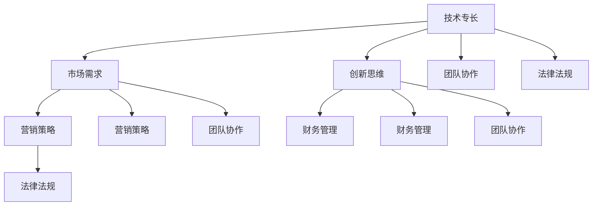
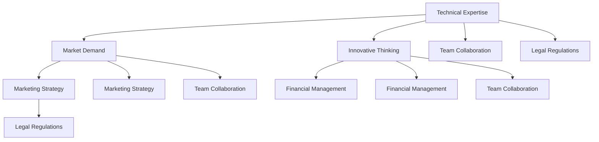

                 

### 背景介绍

#### 个人开发者应用创业的定义

个人开发者应用创业，通常是指独立开发者（Individual Developers）利用自身的技术专长，在没有任何外部资金支持的情况下，独立完成应用程序的设计、开发和上线，并通过这些应用程序获取收益的创业行为。与传统的创业模式相比，个人开发者应用创业具有以下几个显著特点：

1. **独立性**：个人开发者应用创业不需要依赖庞大的团队，可以独立完成应用程序的整个生命周期，从构思、开发到推广。
2. **低成本**：由于不需要大规模的团队和办公场所，个人开发者应用创业的启动成本较低。
3. **灵活性**：开发者可以根据市场需求和个人兴趣快速调整产品方向，具有较强的灵活性和适应性。
4. **创新性**：个人开发者往往能够更快地捕捉市场需求，以创新的方式解决实际问题。

#### 个人开发者应用创业的重要性

个人开发者应用创业在当前技术快速发展、创业环境日益宽松的背景下，发挥着越来越重要的作用。首先，它为创业者提供了更多的机会，降低了创业门槛，使得更多人有机会通过创新实现自我价值。其次，个人开发者应用创业推动了技术的普及和应用，促进了社会生产力的发展。此外，它也为经济发展注入了新的活力，创造了大量就业机会。

#### 例子

以下是一些成功的个人开发者应用创业案例：

- **GitHub**: GitHub创始人Chris Wanstrath最初是一名独立开发者，通过推出一个基于Git的代码托管平台，最终打造出了全球最大的开源社区， himself became a successful entrepreneur.
- **Dropbox**: Dropbox创始人Drew Houston是一名独立开发者，他通过推出一款简单易用的云存储服务，吸引了大量用户，公司估值迅速攀升。
- **WhatsApp**:WhatsApp创始人Jan Koum是一名独立开发者，他利用自己的技术专长，开发出了一款即时通讯应用，最终被Facebook以190亿美元的高价收购。

这些案例展示了个人开发者应用创业的巨大潜力和成功可能性。

---

# Background Introduction

## Definition of Personal Developer Application Entrepreneurship

Personal developer application entrepreneurship refers to the process where independent developers utilize their technical expertise to design, develop, and launch applications without any external financial support. These applications are then monetized to generate income. This model of entrepreneurship differs significantly from traditional entrepreneurship in several key aspects:

1. **Independence**: Personal developer application entrepreneurs operate independently, completing the entire application lifecycle from conception to development to launch without relying on large teams.
2. **Low Cost**: The startup costs for personal developer application entrepreneurship are relatively low, as there is no need for extensive teams or physical office spaces.
3. **Flexibility**: Developers can quickly adjust their product direction based on market demand and personal interests, offering strong adaptability.
4. **Innovation**: Independent developers often have a keen sense for market needs and can innovate to solve real-world problems.

## Importance of Personal Developer Application Entrepreneurship

In the context of rapidly advancing technology and increasingly permissive entrepreneurial environments, personal developer application entrepreneurship plays a crucial role. Firstly, it provides more opportunities for entrepreneurs, reducing the barriers to entry and allowing more people to realize their value through innovation. Secondly, it drives the popularization and application of technology, contributing to the development of social productivity. Moreover, it injects new vitality into the economy by creating numerous job opportunities.

## Examples

Here are some successful cases of personal developer application entrepreneurship:

- **GitHub**: Chris Wanstrath, the founder of GitHub, was an independent developer who created a code hosting platform based on Git, eventually building the largest open-source community globally.
- **Dropbox**: Drew Houston, the founder of Dropbox, was an independent developer who launched a simple and user-friendly cloud storage service, attracting a massive user base and leading to a skyrocketing valuation for the company.
- **WhatsApp**: Jan Koum, the founder of WhatsApp, was an independent developer who created an instant messaging application, which was eventually acquired by Facebook for $19 billion.

These cases illustrate the immense potential and success that can be achieved through personal developer application entrepreneurship. 

---

> 接下来，我们将探讨个人开发者应用创业的核心概念与联系，以及如何运用这些概念实现成功。在接下来的章节中，我们将深入分析这些概念，并使用Mermaid流程图来展示其架构。让我们一步一步地分析推理思考。

## Core Concepts and Connections

### 1. 技术专长（Technical Expertise）

技术专长是个人开发者应用创业的基石。开发者需要拥有扎实的编程技能、对特定技术的深入理解和持续的学习能力。技术专长不仅包括编程语言的使用，还包括对算法、数据结构、软件架构等基础知识的掌握。

### 2. 市场需求（Market Demand）

了解市场需求是成功的关键。开发者需要通过市场调研、用户反馈等方式，准确把握用户的需求和痛点，从而设计出有市场竞争力的产品。

### 3. 创新思维（Innovative Thinking）

创新思维是个人开发者应用创业的核心竞争力。通过创新的思维，开发者可以提出独特的解决方案，解决现有产品中的问题，或者创造全新的市场需求。

### 4. 营销策略（Marketing Strategy）

成功的营销策略能够帮助开发者将产品推向市场，吸引更多的用户。这包括社交媒体营销、内容营销、广告投放等多种方式。

### 5. 财务管理（Financial Management）

有效的财务管理是确保企业可持续发展的关键。个人开发者需要掌握基本的财务知识，合理规划资金，确保企业运营的稳定。

### 6. 团队协作（Team Collaboration）

尽管个人开发者应用创业强调独立性，但在实际操作中，团队协作仍然非常重要。开发者可能需要与其他专业人才合作，如UI/UX设计师、产品经理等，以实现产品的全方位发展。

### 7. 法律法规（Legal Regulations）

了解和遵守相关法律法规是保证企业合法运营的基础。开发者需要关注版权、隐私、数据保护等方面的法规，以确保产品的合规性。

#### Mermaid流程图

以下是一个简化的Mermaid流程图，展示了个人开发者应用创业的核心概念与联系：

通过这个流程图，我们可以清晰地看到各个核心概念之间的联系，以及它们在个人开发者应用创业过程中的作用。

---

## Core Concepts and Relationships

### 1. Technical Expertise

Technical expertise is the cornerstone of personal developer application entrepreneurship. Developers need to have a solid foundation in programming skills, a deep understanding of specific technologies, and a continuous learning mindset. This encompasses not only proficiency in programming languages but also knowledge of algorithms, data structures, and software architecture.

### 2. Market Demand

Understanding market demand is crucial for success. Developers need to conduct market research and gather user feedback to accurately identify user needs and pain points. This helps in designing products that have market appeal.

### 3. Innovative Thinking

Innovative thinking is the core competitive advantage of personal developer application entrepreneurship. Through innovative thinking, developers can propose unique solutions to existing problems or create new market demands.

### 4. Marketing Strategy

A successful marketing strategy is essential for promoting products to the market and attracting more users. This includes various methods such as social media marketing, content marketing, and advertising.

### 5. Financial Management

Effective financial management is key to ensuring the sustainable development of the business. Personal developers need to have a grasp of basic financial knowledge to plan and manage funds wisely.

### 6. Team Collaboration

Although personal developer application entrepreneurship emphasizes independence, team collaboration is still very important. Developers may need to collaborate with other professionals, such as UI/UX designers and product managers, to ensure the comprehensive development of the product.

### 7. Legal Regulations

Understanding and complying with relevant legal regulations is fundamental to ensure legal operation of the business. Developers need to be aware of issues related to copyright, privacy, and data protection to ensure product compliance.

#### Mermaid Flowchart

The following is a simplified Mermaid flowchart illustrating the core concepts and relationships in personal developer application entrepreneurship:

Through this flowchart, we can clearly see the connections between the core concepts and their roles in the process of personal developer application entrepreneurship.

