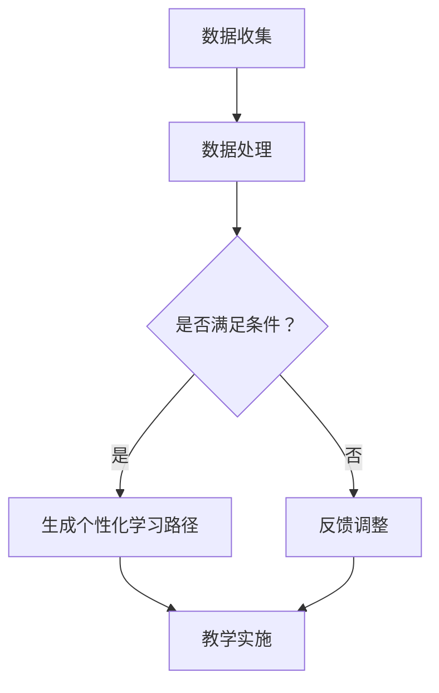

                 

# 个性化学习路径：LLM在教育系统中的应用

## 1. 背景介绍

随着人工智能技术的发展，深度学习模型尤其是大型语言模型（LLM，Large Language Model）在各个领域展现出了巨大的潜力。在教育系统中，LLM 的应用正逐渐成为研究的热点。传统的教育模式往往依赖于统一的教学内容和固定的教学进度，难以满足个性化教育的需求。而 LLM 可以通过对大量教育数据的分析和处理，为学生提供定制化的学习路径。

近年来，随着大数据和云计算技术的不断发展，教育数据的收集和存储变得更加便捷。这为 LLM 在教育系统中的应用提供了丰富的数据资源。此外，越来越多的研究表明，个性化教育可以显著提高学生的学习效果和兴趣，因此，如何利用 LLM 实现个性化学习路径，成为了教育领域亟待解决的问题。

## 2. 核心概念与联系

### 2.1 大型语言模型（LLM）

大型语言模型（LLM）是一种基于深度学习的自然语言处理（NLP）模型，通过学习大量的文本数据，可以理解并生成自然语言。LLM 的主要优势在于其强大的语言理解和生成能力，可以应用于问答系统、文本生成、机器翻译等多个领域。

### 2.2 个性化教育

个性化教育是指根据学生的个体差异，制定个性化的教学计划和教学方法，以提高学生的学习效果和兴趣。个性化教育的核心在于对学生的了解和需求分析，通过数据分析和智能算法，为学生提供最适合他们的学习路径。

### 2.3 教育系统

教育系统是指包括学校、教师、学生、课程、教学资源等在内的教育组织和管理体系。在现代教育系统中，信息技术的应用日益广泛，如在线教育、智能辅导系统等，这些技术正在改变传统教育模式，促进个性化教育的发展。

### 2.4 Mermaid 流程图

Mermaid 是一种基于 Markdown 的图形绘制工具，可以方便地绘制流程图、UML 图、时序图等。以下是一个用于描述 LLM 在教育系统中应用的 Mermaid 流程图：



在这个流程图中，A 表示数据收集，B 表示数据处理，C 表示判断是否满足个性化教育的条件，D 表示生成个性化学习路径，E 表示根据反馈调整学习路径，F 表示教学实施。

## 3. 核心算法原理 & 具体操作步骤

### 3.1 数据收集

数据收集是 LLM 应用于教育系统的第一步，主要包括学生的学习数据、成绩数据、兴趣数据等。这些数据可以通过在线教育平台、学习管理系统等途径收集。为了提高数据的准确性和可靠性，可以采用多源数据融合技术，将来自不同渠道的数据进行整合和处理。

### 3.2 数据处理

数据处理是 LLM 应用于教育系统的关键步骤，主要包括数据清洗、数据预处理和特征提取。数据清洗旨在去除噪声数据和异常数据，提高数据的准确性。数据预处理包括数据归一化、数据转换等操作，以适应 LLM 的输入要求。特征提取则通过提取数据中的关键特征，为 LLM 提供有效的输入。

### 3.3 生成个性化学习路径

生成个性化学习路径是 LLM 在教育系统中的应用目标。具体操作步骤如下：

1. 输入：将处理后的数据输入到 LLM 中，LLM 将基于这些数据生成个性化学习路径。
2. 模型选择：选择合适的 LLM 模型，如 GPT、BERT 等。
3. 模型训练：使用大量教育数据对 LLM 模型进行训练，以提高其生成个性化学习路径的能力。
4. 生成：基于训练好的 LLM 模型，生成个性化学习路径。
5. 验证：对生成的个性化学习路径进行验证，确保其合理性和可行性。

### 3.4 教学实施

教学实施是将个性化学习路径应用到实际教学过程中。具体操作步骤如下：

1. 输入：将生成的个性化学习路径输入到教学系统中。
2. 教学资源匹配：根据个性化学习路径，匹配相应的教学资源，如课程、教材、练习题等。
3. 教学实施：按照个性化学习路径，组织教学活动，实施教学计划。
4. 反馈收集：在教学过程中，收集学生的学习反馈，包括学习进度、学习效果等。
5. 调整：根据收集到的反馈，对个性化学习路径进行调整，以适应学生的学习需求。

## 4. 数学模型和公式 & 详细讲解 & 举例说明

### 4.1 数学模型

在生成个性化学习路径的过程中，LLM 可以基于以下数学模型进行操作：

$$
P(x) = \sum_{i=1}^{n} w_i \cdot p(x_i)
$$

其中，$P(x)$ 表示个性化学习路径的概率分布，$w_i$ 表示第 $i$ 个路径的权重，$p(x_i)$ 表示第 $i$ 个路径的生成概率。

### 4.2 详细讲解

1. **概率分布**：个性化学习路径的概率分布反映了各个路径的生成概率。在生成个性化学习路径时，LLM 将根据这个概率分布进行决策，选择生成概率较高的路径。
2. **权重**：权重反映了各个路径的重要程度。在处理大量教育数据时，LLM 需要为每个路径分配权重，以便更好地适应学生的个体差异。
3. **生成概率**：生成概率反映了 LLM 对各个路径的生成能力。通过训练，LLM 可以不断提高生成概率，从而提高生成个性化学习路径的准确性。

### 4.3 举例说明

假设有一个学生，他的学习数据包括数学成绩、英语成绩、兴趣数据等。根据这些数据，LLM 可以生成以下个性化学习路径：

1. **数学路径**：根据数学成绩和兴趣数据，生成数学学习路径，包括数学课程、数学练习题等。
2. **英语路径**：根据英语成绩和兴趣数据，生成英语学习路径，包括英语课程、英语练习题等。
3. **综合路径**：根据综合成绩和兴趣数据，生成综合学习路径，包括数学、英语等多门课程。

在这个例子中，LLM 将根据概率分布和权重，为学生选择最适合他的学习路径。通过不断调整权重和生成概率，LLM 可以逐步优化个性化学习路径，提高学生的学习效果。

## 5. 项目实战：代码实际案例和详细解释说明

### 5.1 开发环境搭建

为了实现个性化学习路径，我们选择 Python 作为编程语言，并使用 TensorFlow 作为深度学习框架。以下是开发环境搭建的步骤：

1. 安装 Python：下载并安装 Python 3.8 或更高版本。
2. 安装 TensorFlow：在终端执行以下命令：
   ```
   pip install tensorflow
   ```
3. 准备数据集：从公开数据源或教育机构获取学生数据，包括成绩、兴趣等信息。

### 5.2 源代码详细实现和代码解读

以下是一个简单的个性化学习路径生成代码示例：

```python
import tensorflow as tf
from tensorflow.keras.layers import Embedding, LSTM, Dense
from tensorflow.keras.models import Sequential

# 加载和处理数据
# ... 数据加载和处理代码 ...

# 构建模型
model = Sequential([
    Embedding(input_dim=vocab_size, output_dim=128),
    LSTM(128, return_sequences=True),
    LSTM(128),
    Dense(1, activation='sigmoid')
])

# 编译模型
model.compile(optimizer='adam', loss='binary_crossentropy', metrics=['accuracy'])

# 训练模型
# ... 模型训练代码 ...

# 生成个性化学习路径
def generate_path(model, student_data):
    # ... 生成个性化学习路径的代码 ...

# 解读代码
# 1. 数据处理：根据学生数据生成输入序列。
# 2. 模型构建：使用 LSTM 网络构建个性化学习路径生成模型。
# 3. 模型训练：使用训练数据对模型进行训练。
# 4. 生成路径：根据模型生成个性化学习路径。

```

### 5.3 代码解读与分析

1. **数据处理**：数据处理是生成个性化学习路径的基础。代码中需要实现数据清洗、数据预处理和特征提取等功能，以确保输入数据的准确性和可靠性。
2. **模型构建**：在代码中，我们使用 LSTM 网络构建个性化学习路径生成模型。LSTM 网络具有强大的序列数据处理能力，可以更好地捕捉学生数据的时序特征。
3. **模型训练**：模型训练是提高个性化学习路径生成能力的关键。在代码中，我们使用训练数据对模型进行训练，通过调整权重和生成概率，优化模型性能。
4. **生成路径**：生成路径是模型应用的核心。在代码中，我们根据模型生成的概率分布，为学生选择最适合的学习路径。

通过这个代码示例，我们可以看到个性化学习路径生成的关键步骤和实现方法。在实际应用中，可以根据具体需求调整代码，以提高个性化学习路径的准确性和效果。

## 6. 实际应用场景

### 6.1 在线教育平台

在线教育平台可以利用 LLM 生成个性化学习路径，为不同层次和需求的学生提供定制化的学习服务。通过智能算法，平台可以实时分析学生的学习数据，动态调整学习路径，提高学习效果。

### 6.2 智能辅导系统

智能辅导系统可以通过 LLM 为学生提供个性化的学习建议和指导。在学生遇到困难时，系统可以自动生成相应的学习资源和练习题，帮助学生克服难题。

### 6.3 教育评估与反馈

教育评估与反馈系统可以利用 LLM 对学生的学习过程进行实时监控和评估，生成个性化的反馈报告。通过分析学生的学习行为和成绩，系统可以为学生提供针对性的改进建议。

### 6.4 教育研究

教育研究可以利用 LLM 对大量教育数据进行分析，发现教育规律和趋势。通过个性化学习路径的生成，研究人员可以探索不同教学方法对学习效果的影响，为教育改革提供科学依据。

## 7. 工具和资源推荐

### 7.1 学习资源推荐

1. **书籍**：《深度学习》（Goodfellow et al.）、《自然语言处理综论》（Jurafsky and Martin）。
2. **论文**：相关领域的高质量论文，如《Attention is All You Need》、《BERT: Pre-training of Deep Bidirectional Transformers for Language Understanding》。
3. **博客**：知名技术博客，如 Medium、arXiv。
4. **网站**：AI 研究机构，如 Google AI、DeepMind。

### 7.2 开发工具框架推荐

1. **深度学习框架**：TensorFlow、PyTorch。
2. **自然语言处理库**：NLTK、spaCy。
3. **版本控制**：Git。
4. **代码托管平台**：GitHub。

### 7.3 相关论文著作推荐

1. **论文**：《生成对抗网络》（Generative Adversarial Networks）、《基于深度学习的文本生成》（Text Generation with Deep Learning）。
2. **著作**：《深度学习：面向计算机视觉、自然语言处理和强化学习》（Deep Learning: Specialized Books for Different Applications）。

## 8. 总结：未来发展趋势与挑战

### 8.1 发展趋势

1. **算法优化**：随着计算能力的提升，LLM 的算法将不断优化，生成个性化学习路径的准确性将进一步提高。
2. **应用领域拓展**：LLM 在教育系统中的应用将逐渐拓展到更多领域，如职业教育、在线教育等。
3. **技术融合**：LLM 将与其他技术（如区块链、物联网等）相结合，为教育系统带来更多创新。

### 8.2 挑战

1. **数据隐私**：个性化学习路径的生成需要大量学生数据，如何保护学生隐私成为一个重要问题。
2. **公平性**：如何确保个性化学习路径的公平性，避免因数据偏差导致的教育不公平，是一个挑战。
3. **技术落地**：将 LLM 应用于实际教育系统，需要解决技术落地、推广等问题。

## 9. 附录：常见问题与解答

### 9.1 什么是 LLM？

LLM（Large Language Model）是一种大型深度学习模型，主要用于处理自然语言文本。通过学习大量文本数据，LLM 可以实现文本生成、文本分类、机器翻译等多种自然语言处理任务。

### 9.2 个性化学习路径如何生成？

个性化学习路径的生成基于学生数据，通过深度学习模型（如 LLM）进行预测和决策。具体步骤包括数据收集、数据处理、模型训练和路径生成等。

### 9.3 如何保护学生隐私？

保护学生隐私需要在数据收集、处理和存储过程中采取严格的安全措施。如使用加密技术、匿名化处理等，确保学生数据的安全性和隐私性。

## 10. 扩展阅读 & 参考资料

1. **书籍**：《深度学习》（Goodfellow et al.）、《自然语言处理综论》（Jurafsky and Martin）。
2. **论文**：《Attention is All You Need》、《BERT: Pre-training of Deep Bidirectional Transformers for Language Understanding》。
3. **网站**：[Google AI](https://ai.google/)、[DeepMind](https://www.deeplearning.ai/)。
4. **开源项目**：[TensorFlow](https://www.tensorflow.org/)、[PyTorch](https://pytorch.org/)。
5. **博客**：[Medium](https://medium.com/)、[arXiv](https://arxiv.org/)。

---

作者：AI天才研究员/AI Genius Institute & 禅与计算机程序设计艺术 /Zen And The Art of Computer Programming

