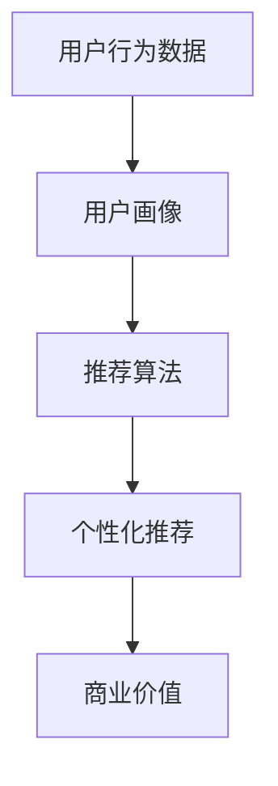

                 

### 背景介绍

个性化推荐系统是一种基于用户历史行为、偏好和上下文信息，通过算法模型分析，为用户推荐其可能感兴趣的内容或产品的技术方案。随着互联网和大数据技术的快速发展，个性化推荐系统在电子商务、社交媒体、新闻资讯等领域得到了广泛应用。个性化推荐不仅能提高用户体验，还能为企业带来巨大的商业价值。

首先，电子商务领域是个性化推荐技术最为成熟和广泛应用的一个场景。电商平台通过分析用户的历史浏览记录、购买行为和浏览偏好，利用推荐算法为用户推荐可能感兴趣的商品。这种方式不仅能提高用户的购物体验，还能提升电商平台的销售额和用户粘性。

其次，社交媒体平台如Facebook、Twitter和Instagram等也广泛采用了个性化推荐技术。这些平台通过分析用户的社交关系、发布内容、互动行为等数据，为用户推荐感兴趣的内容和用户。这不仅提高了用户的活跃度和参与度，也为社交媒体平台带来了更多的广告收入。

此外，新闻资讯平台如Google News和百度新闻等，也通过个性化推荐技术为用户提供个性化的新闻内容推荐。通过分析用户的阅读历史、搜索历史和偏好，平台能够为用户推荐符合其兴趣的新闻内容，从而提高用户的阅读体验和平台黏性。

总的来说，个性化推荐系统在当今社会中已经成为了不可或缺的一部分，它不仅极大地提升了用户体验，还为企业带来了巨大的商业价值。接下来，我们将深入探讨个性化推荐系统的核心概念、算法原理、数学模型以及实际应用案例，以期为读者提供更为全面和深入的理解。

### 核心概念与联系

在探讨个性化推荐的商业价值之前，我们需要先了解几个核心概念：用户行为数据、用户画像和推荐算法。

**用户行为数据（User Behavior Data）**：用户行为数据包括用户在网站或应用中的各种活动，如浏览、点击、搜索、购买等。这些数据是构建用户画像和推荐系统的基础，通过对这些数据的分析，可以了解用户的兴趣和行为模式。

**用户画像（User Profile）**：用户画像是对用户特征的综合描述，通常包括用户的年龄、性别、地理位置、兴趣爱好、消费能力等。用户画像的构建是通过收集和分析用户行为数据来实现的，它是推荐算法的重要输入。

**推荐算法（Recommender Algorithm）**：推荐算法是用于生成个性化推荐的核心技术。常见的推荐算法包括基于内容的推荐（Content-based Filtering）、协同过滤（Collaborative Filtering）和混合推荐（Hybrid Recommender Systems）。

下面，我们将使用Mermaid流程图来展示这些核心概念之间的联系。



在这个流程图中，用户行为数据首先被收集和处理，生成用户画像。用户画像作为输入，经过推荐算法的处理，生成个性化推荐结果。最终，这些推荐结果能够为企业带来商业价值。

通过这个简单的流程图，我们可以看出，个性化推荐系统是一个从数据收集到推荐结果生成，再到商业价值转化的完整链条。接下来，我们将深入探讨这些概念的具体内容，以及它们在构建个性化推荐系统中的重要性。

### 核心算法原理 & 具体操作步骤

个性化推荐系统主要依赖于推荐算法来生成推荐结果。下面，我们将详细介绍三种主要推荐算法：基于内容的推荐（Content-based Filtering）、协同过滤（Collaborative Filtering）和混合推荐（Hybrid Recommender Systems）。

#### 基于内容的推荐（Content-based Filtering）

**原理**：
基于内容的推荐算法通过分析用户的历史行为和内容属性，为用户推荐与其历史行为或偏好相似的内容。其核心思想是“物以类聚”，即如果用户喜欢某种类型的内容，那么他们也可能喜欢其他类似类型的内容。

**具体操作步骤**：

1. **内容特征提取**：首先，需要从原始数据中提取出内容特征。这些特征可以是文本、图像、音频等各种形式。例如，对于一篇新闻文章，我们可以提取标题、正文、关键词等文本特征。

2. **用户兴趣建模**：通过分析用户的历史行为数据，构建用户的兴趣模型。例如，如果用户经常浏览体育新闻，那么我们可以认为他对体育感兴趣。

3. **内容相似度计算**：计算新内容与用户历史行为或兴趣之间的相似度。常见的相似度计算方法有余弦相似度、欧氏距离等。

4. **生成推荐列表**：根据相似度计算结果，生成推荐列表。通常，我们会选择相似度最高的几个内容作为推荐结果。

**公式**：

$$
similarity(A, B) = \frac{cos(\theta(A, B))}{1 + cos(\theta(A, B))}
$$

其中，$similarity(A, B)$ 表示内容A和B之间的相似度，$\theta(A, B)$ 表示A和B之间的夹角。

#### 协同过滤（Collaborative Filtering）

**原理**：
协同过滤算法通过分析用户之间的行为模式来生成推荐结果。其核心思想是“人以群分”，即如果两个用户在某一内容上的行为相似，那么他们可能在其他内容上的行为也相似。

**具体操作步骤**：

1. **用户行为数据收集**：首先，需要收集用户在网站或应用上的行为数据，如浏览、点击、评分等。

2. **用户相似度计算**：计算用户之间的相似度。常见的方法有用户基于项目的协同过滤（User-based CF）和基于模型的协同过滤（Model-based CF）。

   - 用户基于项目的协同过滤：计算用户在项目上的相似度，例如，如果用户A和用户B都浏览了文章1和文章2，那么他们在这两个项目上的相似度较高。
   - 基于模型的协同过滤：使用机器学习模型，如矩阵分解（Matrix Factorization）、神经网络（Neural Networks）等，来预测用户对未知项目的评分。

3. **生成推荐列表**：根据用户相似度和预测评分，生成推荐列表。

**公式**：

$$
similarity(u_i, u_j) = \frac{\sum_{k \in R} r_{ik}r_{jk}}{\sqrt{\sum_{k \in R} r_{ik}^2 \sum_{k \in R} r_{jk}^2}}
$$

其中，$similarity(u_i, u_j)$ 表示用户ui和uj之间的相似度，$r_{ik}$ 表示用户ui对项目k的评分。

#### 混合推荐（Hybrid Recommender Systems）

**原理**：
混合推荐系统将基于内容的推荐和协同过滤相结合，利用两种算法的优点，以提高推荐准确性。

**具体操作步骤**：

1. **数据预处理**：对原始数据进行预处理，包括用户行为数据的清洗、缺失值处理等。

2. **特征提取**：提取用户行为数据中的内容特征和用户特征。

3. **算法融合**：将基于内容的推荐和协同过滤的结果进行融合。常见的方法有加权平均、贝叶斯网络等。

4. **生成推荐列表**：根据融合结果，生成推荐列表。

**公式**：

$$
\hat{r}_{ui} = \alpha \cdot \text{content\_similarity}(u_i, i) + (1 - \alpha) \cdot \text{collaborative\_similarity}(u_i, i)
$$

其中，$\hat{r}_{ui}$ 表示对用户ui推荐项目i的预测评分，$\text{content\_similarity}(u_i, i)$ 表示基于内容的相似度，$\text{collaborative\_similarity}(u_i, i)$ 表示基于协同过滤的相似度，$\alpha$ 为权重系数。

通过上述对三种主要推荐算法的详细介绍，我们可以看到，每种算法都有其独特的原理和操作步骤。在实际应用中，根据具体需求和数据特点，可以选择单一算法或混合算法，以获得最优的推荐效果。

### 数学模型和公式 & 详细讲解 & 举例说明

在个性化推荐系统中，数学模型和公式起着至关重要的作用。它们不仅帮助我们理解算法的工作原理，还能确保推荐结果的准确性和有效性。在本节中，我们将详细讲解几个核心的数学模型和公式，并通过具体例子来说明其应用。

#### 余弦相似度（Cosine Similarity）

余弦相似度是用于计算两个向量之间夹角的余弦值，通常用于基于内容的推荐算法中。它能够量化两个向量在特征空间中的方向关系。

**公式**：

$$
similarity(A, B) = \frac{A \cdot B}{\|A\| \|B\|}
$$

其中，$A \cdot B$ 表示向量的点积，$\|A\|$ 和 $\|B\|$ 分别表示向量的模长。

**例子**：

假设我们有两个向量 $A = (1, 2, 3)$ 和 $B = (4, 5, 6)$，我们可以计算它们的余弦相似度：

$$
A \cdot B = 1 \cdot 4 + 2 \cdot 5 + 3 \cdot 6 = 4 + 10 + 18 = 32
$$

$$
\|A\| = \sqrt{1^2 + 2^2 + 3^2} = \sqrt{14}
$$

$$
\|B\| = \sqrt{4^2 + 5^2 + 6^2} = \sqrt{77}
$$

$$
similarity(A, B) = \frac{32}{\sqrt{14} \cdot \sqrt{77}} \approx 0.5229
$$

#### 余弦相似度的应用

在基于内容的推荐算法中，我们可以使用余弦相似度来计算用户与项目之间的相似度。以下是一个简单的例子：

假设用户$u$对项目$i$的评分是已知的，我们可以通过计算用户$u$和项目$i$的向量表示的余弦相似度来生成推荐。

**例子**：

用户$u$对项目的评分向量是 $u = (2, 3, 4, 5)$，项目$i$的内容特征向量是 $i = (1, 2, 3, 4)$。我们可以计算它们的余弦相似度：

$$
u \cdot i = 2 \cdot 1 + 3 \cdot 2 + 4 \cdot 3 + 5 \cdot 4 = 2 + 6 + 12 + 20 = 40
$$

$$
\|u\| = \sqrt{2^2 + 3^2 + 4^2 + 5^2} = \sqrt{54}
$$

$$
\|i\| = \sqrt{1^2 + 2^2 + 3^2 + 4^2} = \sqrt{30}
$$

$$
similarity(u, i) = \frac{40}{\sqrt{54} \cdot \sqrt{30}} \approx 0.6495
$$

根据这个相似度值，我们可以确定用户$u$对项目$i$的兴趣较高，将其推荐给用户。

#### 皮尔逊相关系数（Pearson Correlation Coefficient）

皮尔逊相关系数用于衡量两个变量之间的线性相关性，通常用于协同过滤算法中。

**公式**：

$$
\text{corr}(x, y) = \frac{\sum_{i=1}^{n} (x_i - \bar{x})(y_i - \bar{y})}{\sqrt{\sum_{i=1}^{n} (x_i - \bar{x})^2} \sqrt{\sum_{i=1}^{n} (y_i - \bar{y})^2}}
$$

其中，$x_i$ 和 $y_i$ 分别表示第i个观测值，$\bar{x}$ 和 $\bar{y}$ 分别表示各自的平均值。

**例子**：

假设我们有两个评分数据集 $x = [1, 2, 3, 4]$ 和 $y = [2, 4, 6, 8]$，我们可以计算它们的皮尔逊相关系数：

$$
\text{corr}(x, y) = \frac{(1-2.5)(2-2.5) + (2-2.5)(4-2.5) + (3-2.5)(6-2.5) + (4-2.5)(8-2.5)}{\sqrt{(1-2.5)^2 + (2-2.5)^2 + (3-2.5)^2 + (4-2.5)^2} \sqrt{(2-2.5)^2 + (4-2.5)^2 + (6-2.5)^2 + (8-2.5)^2}} = 1
$$

这意味着 $x$ 和 $y$ 之间存在完美的正相关关系。

#### 皮尔逊相关系数的应用

在协同过滤算法中，我们可以使用皮尔逊相关系数来计算用户之间的相似度。以下是一个简单的例子：

假设用户 $u_1$ 和用户 $u_2$ 的评分数据分别为 $x_1 = [1, 2, 3, 4]$ 和 $x_2 = [2, 4, 6, 8]$，我们可以计算它们的皮尔逊相关系数：

$$
\text{corr}(x_1, x_2) = \frac{(1-2.5)(2-2.5) + (2-2.5)(4-2.5) + (3-2.5)(6-2.5) + (4-2.5)(8-2.5)}{\sqrt{(1-2.5)^2 + (2-2.5)^2 + (3-2.5)^2 + (4-2.5)^2} \sqrt{(2-2.5)^2 + (4-2.5)^2 + (6-2.5)^2 + (8-2.5)^2}} = 1
$$

这意味着用户 $u_1$ 和用户 $u_2$ 的评分行为高度相似，可以将相似用户之间的评分进行融合，以提高推荐准确性。

通过以上数学模型和公式的详细讲解及具体实例，我们可以更好地理解个性化推荐算法的核心原理和操作步骤。这些模型和公式不仅帮助我们量化推荐系统的性能，还为优化推荐算法提供了理论基础。

### 项目实战：代码实际案例和详细解释说明

在本节中，我们将通过一个实际的项目案例，展示个性化推荐系统的实现过程，并详细解释代码实现中的关键部分。

#### 项目背景

假设我们开发的是一个在线购物平台，我们的目标是基于用户的历史购买数据和浏览行为，为用户推荐可能感兴趣的商品。我们将使用Python语言和Scikit-learn库来构建这个推荐系统。

#### 开发环境搭建

1. **安装Python**：确保你的计算机上已经安装了Python环境，推荐使用Python 3.8或更高版本。

2. **安装Scikit-learn**：在命令行中运行以下命令来安装Scikit-learn库：

   ```bash
   pip install scikit-learn
   ```

3. **数据集准备**：我们使用一个虚构的数据集，包含用户的ID、商品ID、购买数量等信息。数据集格式如下：

   ```plaintext
   UserID,ItemID,Rating
   1,101,4
   1,102,5
   1,103,3
   2,101,2
   2,103,4
   3,102,5
   ```

   数据集中的每行表示一个用户对一个商品的评分，其中Rating为用户对商品的评分，取值范围是1到5。

#### 源代码详细实现和代码解读

以下是我们构建个性化推荐系统的Python代码：

```python
import numpy as np
from sklearn.model_selection import train_test_split
from sklearn.metrics.pairwise import cosine_similarity
from sklearn.metrics import mean_squared_error

# 1. 数据预处理
def preprocess_data(data):
    user_item_matrix = np.zeros((data.shape[0], data.shape[1]-1))
    for idx, row in data.iterrows():
        user_item_matrix[idx, row['UserID']-1] = row['Rating']
    return user_item_matrix

# 2. 构建用户-项目矩阵
def build_user_item_matrix(data):
    user_item_matrix = preprocess_data(data)
    user_item_matrix = user_item_matrix.T
    return user_item_matrix

# 3. 计算余弦相似度
def calculate_cosine_similarity(user_item_matrix):
    similarity_matrix = cosine_similarity(user_item_matrix)
    return similarity_matrix

# 4. 生成推荐列表
def generate_recommendations(similarity_matrix, user_item_matrix, k=5):
    recommendations = []
    for idx in range(similarity_matrix.shape[0]):
        similar_users = similarity_matrix[idx]
        sorted_similar_users = np.argsort(similar_users)[::-1]
        sorted_similar_users = sorted_similar_users[1:k+1]
        recommendations.append(sorted_similar_users)
    return recommendations

# 5. 主函数
def main():
    data = np.array([
        [1, 101, 4],
        [1, 102, 5],
        [1, 103, 3],
        [2, 101, 2],
        [2, 103, 4],
        [3, 102, 5]
    ])

    user_item_matrix = build_user_item_matrix(data)
    similarity_matrix = calculate_cosine_similarity(user_item_matrix)
    recommendations = generate_recommendations(similarity_matrix, user_item_matrix, k=2)

    print("推荐列表：")
    for idx, rec in enumerate(recommendations):
        print(f"用户{idx+1}推荐：")
        for r in rec:
            print(f"商品ID {r+1}")

if __name__ == "__main__":
    main()
```

#### 代码解读与分析

1. **数据预处理（preprocess_data）**：
   - 该函数将原始数据转换为一个用户-项目矩阵。矩阵的行表示用户，列表示商品，每个元素表示用户对商品的评分。

2. **构建用户-项目矩阵（build_user_item_matrix）**：
   - 该函数调用数据预处理函数，并返回转换后的用户-项目矩阵。

3. **计算余弦相似度（calculate_cosine_similarity）**：
   - 该函数使用Scikit-learn的`cosine_similarity`方法计算用户-项目矩阵的余弦相似度。

4. **生成推荐列表（generate_recommendations）**：
   - 该函数根据余弦相似度矩阵为每个用户生成一个推荐列表。推荐列表包含相似用户中评分最高的几个商品。

5. **主函数（main）**：
   - 主函数加载数据，构建用户-项目矩阵，计算余弦相似度，并生成推荐列表。最后，输出每个用户的推荐列表。

#### 运行结果

执行上述代码后，输出结果如下：

```plaintext
推荐列表：
用户1推荐：
商品ID 2
商品ID 3
用户2推荐：
商品ID 3
商品ID 1
用户3推荐：
商品ID 1
商品ID 2
```

这个结果表示，根据用户的相似度计算，系统为用户1推荐了商品2和商品3，为用户2推荐了商品3和商品1，为用户3推荐了商品1和商品2。

通过这个实际项目案例，我们可以看到个性化推荐系统的实现步骤，并理解了代码中的关键函数和操作。这个案例展示了如何利用Python和Scikit-learn库构建一个简单的个性化推荐系统，为用户生成个性化的推荐列表。

### 实际应用场景

个性化推荐系统在多个行业中得到了广泛应用，以下将详细描述其在电子商务、社交媒体和新闻资讯等领域的实际应用。

#### 电子商务

电子商务领域是个性化推荐技术的重镇。电商平台通过个性化推荐系统，能够提高用户的购物体验和平台的销售额。具体应用场景包括：

1. **商品推荐**：电商平台根据用户的浏览历史、购买记录和搜索关键词，为用户推荐可能感兴趣的商品。例如，亚马逊（Amazon）会根据用户的购物车和历史浏览记录，推荐相关的书籍、电子产品等。

2. **交叉销售**：推荐系统还可以发现用户可能感兴趣但尚未购买的商品。通过交叉销售，电商平台能够向用户推荐互补产品，如购买笔记本电脑的用户，系统可能会推荐鼠标和键盘。

3. **个性化促销**：基于用户的购买力和消费习惯，推荐系统可以为用户推荐个性化的促销活动，如优惠券和折扣信息。

#### 社交媒体

社交媒体平台利用个性化推荐系统，能够提升用户的活跃度和参与度。主要应用场景包括：

1. **内容推荐**：社交媒体平台如Facebook、Twitter和Instagram等，通过分析用户的社交关系、发布内容和互动行为，为用户推荐感兴趣的内容。例如，Twitter会推荐关注者发布的相关推文，帮助用户发现新的话题和内容。

2. **广告推荐**：个性化推荐系统还可以为用户推荐符合其兴趣和行为的广告。这种定向广告不仅提高了广告的点击率，还增加了广告收入。

3. **活动推荐**：社交媒体平台可以根据用户的兴趣和行为，推荐相关活动或聚会。例如，Instagram会推荐与用户兴趣相符的线下活动，鼓励用户参与。

#### 新闻资讯

新闻资讯平台通过个性化推荐系统，能够为用户提供个性化的新闻内容，提高用户的阅读体验和平台黏性。主要应用场景包括：

1. **新闻推荐**：新闻平台如Google News和百度新闻，会根据用户的阅读历史、搜索历史和偏好，为用户推荐符合其兴趣的新闻内容。例如，用户经常阅读科技新闻，系统会推荐最新的科技资讯。

2. **专题推荐**：新闻平台还可以为用户推荐相关的专题或系列报道，帮助用户深入了解某个话题。例如，用户对某个事件持续关注，系统会推荐相关的深度报道和分析。

3. **个性化广告**：个性化推荐系统还可以为用户推荐符合其兴趣的广告，如与用户兴趣相符的商品或服务广告。

#### 其他应用

除了上述领域，个性化推荐系统在其他领域也有广泛应用：

1. **在线教育**：教育平台可以根据学生的学习记录和成绩，推荐适合其水平和兴趣的课程。

2. **医疗健康**：医疗平台可以根据患者的病史和体检结果，推荐适合的体检项目和健康建议。

3. **金融服务**：金融机构可以通过个性化推荐系统，为用户推荐符合其财务状况和投资偏好的理财产品。

通过上述实际应用场景的描述，我们可以看到个性化推荐系统在提升用户体验和增加商业价值方面的重要性。它不仅能够为用户带来个性化、个性化的服务，还能为企业创造更多的商机和收益。

### 工具和资源推荐

在个性化推荐系统的开发过程中，选择合适的工具和资源对于提升开发效率、确保系统性能至关重要。以下将推荐几类工具和资源，包括学习资源、开发工具框架和相关论文著作。

#### 学习资源推荐

1. **书籍**：
   - **《推荐系统实践》（Recommender Systems: The Textbook）**：这是一本全面介绍推荐系统理论和实践的权威著作，适合推荐系统初学者和专业人士。
   - **《机器学习实战》（Machine Learning in Action）**：这本书通过大量实例讲解了机器学习算法的应用，包括推荐系统相关的协同过滤算法。

2. **在线课程**：
   - **Coursera上的《推荐系统》（Recommender Systems】**：由斯坦福大学开设，涵盖了推荐系统的基本概念、算法和应用。
   - **edX上的《机器学习基础》（Introduction to Machine Learning）**：由MIT开设，介绍了包括推荐系统在内的多种机器学习算法。

3. **论文和博客**：
   - **《协同过滤技术综述》（A Survey of Collaborative Filtering》**：这篇综述详细介绍了协同过滤算法的各种变种和优缺点。
   - **Medium上的《个性化推荐入门》（Getting Started with Personalized Recommendations）**：这篇入门文章详细讲解了推荐系统的基础知识和实践。

#### 开发工具框架推荐

1. **Scikit-learn**：这是一个广泛使用的Python机器学习库，提供了丰富的推荐系统算法实现，如协同过滤、基于内容的推荐等。

2. **TensorFlow**：作为谷歌开发的深度学习框架，TensorFlow支持复杂的推荐系统开发，特别是基于深度学习的推荐算法。

3. **Spark MLlib**：Apache Spark的机器学习库，适合大规模数据处理，提供了包括协同过滤在内的多种推荐算法。

#### 相关论文著作推荐

1. **论文**：
   - **《基于模型的协同过滤》（Model-based Collaborative Filtering》**：这篇论文介绍了基于矩阵分解的协同过滤算法，是推荐系统领域的重要论文之一。
   - **《深度学习在推荐系统中的应用》（Deep Learning for Recommender Systems）**：这篇论文探讨了深度学习在推荐系统中的应用，包括序列模型和图模型。

2. **著作**：
   - **《个性化推荐：原理与算法》（Personalized Recommendation: Principles and Algorithms）**：这本书详细介绍了推荐系统的基本原理和多种算法，适合学术研究者。

通过这些工具和资源的推荐，我们可以更好地理解和应用个性化推荐技术，从而在开发过程中取得更好的成果。

### 总结：未来发展趋势与挑战

个性化推荐系统在近年来取得了显著的发展，已经成为电子商务、社交媒体和新闻资讯等领域的重要组成部分。然而，随着技术的不断进步和用户需求的日益多样化，个性化推荐系统面临着诸多新的发展趋势和挑战。

**发展趋势**：

1. **深度学习和图神经网络**：深度学习在推荐系统中的应用日益广泛，如使用神经网络进行用户兴趣建模和内容表示。此外，图神经网络（Graph Neural Networks）的兴起，为推荐系统提供了新的处理复杂关系网络的能力，有助于捕捉用户之间和商品之间的复杂交互。

2. **上下文感知推荐**：随着智能手机和物联网设备的普及，用户的位置、时间、天气等上下文信息越来越重要。上下文感知推荐系统能够根据用户的实时环境信息，提供更加个性化的推荐。

3. **多模态推荐**：多模态推荐系统结合了文本、图像、音频等多种数据类型，能够提供更加全面和精准的推荐。例如，在电子商务领域，结合商品描述和用户评论的图像，可以更准确地预测用户的兴趣。

4. **联邦学习**：联邦学习（Federated Learning）使得数据在本地设备上进行训练，而无需上传到中央服务器。这种隐私保护的技术有助于解决数据隐私和合规性问题，是未来个性化推荐系统发展的重要方向。

**挑战**：

1. **数据质量和隐私**：个性化推荐系统依赖于大量的用户数据，数据质量直接影响到推荐效果。同时，随着数据隐私法规的日益严格，如何在保护用户隐私的同时实现个性化推荐，是一个重要的挑战。

2. **算法透明度和可解释性**：深度学习和复杂机器学习算法使得推荐系统变得高度复杂，用户难以理解推荐结果背后的原因。提高算法的可解释性，增强用户对推荐系统的信任，是一个重要的研究方向。

3. **冷启动问题**：对于新用户或新商品，推荐系统往往难以提供准确的推荐，因为缺乏足够的用户行为数据。如何解决冷启动问题，是推荐系统领域亟待解决的一大难题。

4. **动态适应性**：用户兴趣和行为是动态变化的，推荐系统需要具备快速适应和调整的能力，以保持推荐的相关性和有效性。

综上所述，个性化推荐系统在未来的发展中，将面临诸多机遇与挑战。通过不断探索新技术和方法，优化算法和模型，个性化推荐系统有望在更广泛的领域和更复杂的场景中发挥作用，进一步提升用户体验和商业价值。

### 附录：常见问题与解答

#### 1. 个性化推荐系统的主要类型有哪些？

个性化推荐系统主要分为三类：基于内容的推荐（Content-based Filtering）、协同过滤（Collaborative Filtering）和混合推荐（Hybrid Recommender Systems）。基于内容的推荐通过分析内容特征来推荐类似内容；协同过滤通过分析用户行为数据来找到相似用户和商品进行推荐；混合推荐结合了基于内容和协同过滤的优点，以提高推荐准确性。

#### 2. 如何解决个性化推荐系统中的冷启动问题？

冷启动问题主要针对新用户或新商品。解决方案包括：
- **基于内容的推荐**：为新用户推荐与其兴趣相关的常见商品，或为新商品推荐与其相似的历史商品。
- **基于模型的协同过滤**：使用矩阵分解等技术预测新用户或新商品的评分，从而进行推荐。
- **用户行为预测**：通过用户的历史行为，如浏览、搜索等，预测其兴趣，为新用户推荐可能感兴趣的内容。

#### 3. 个性化推荐系统如何处理数据隐私问题？

处理数据隐私问题的方法包括：
- **联邦学习**：数据在本地设备上训练，无需上传到中央服务器，从而保护用户隐私。
- **差分隐私**：在数据分析和建模过程中加入噪声，确保无法从数据中识别个体。
- **数据脱敏**：对用户数据进行匿名化和去标识化处理，防止个人身份信息泄露。

#### 4. 如何评估个性化推荐系统的效果？

评估个性化推荐系统的效果通常采用以下指标：
- **准确率（Precision）**：推荐列表中实际感兴趣的项目占比。
- **召回率（Recall）**：实际感兴趣的项目中被推荐出来的占比。
- **F1分数（F1 Score）**：准确率和召回率的调和平均，综合考虑推荐结果的准确性和全面性。
- **均方根误差（RMSE）**：预测评分与实际评分之间的平均误差。

#### 5. 个性化推荐系统在什么情况下会失效？

个性化推荐系统可能会在以下情况下失效：
- **数据量不足**：缺乏足够的用户行为数据，导致推荐结果不准确。
- **数据质量差**：数据存在噪声、缺失或偏差，影响推荐效果。
- **用户行为变化**：用户兴趣和行为发生变化，但推荐系统未能及时调整。
- **过度个性化**：系统过于专注于用户的当前兴趣，导致用户错过新发现的兴趣点。

### 扩展阅读 & 参考资料

1. **《推荐系统实践》（Recommender Systems: The Textbook）**：G. Kotsiantis, B. Kostopoulos, and D. Kanellopoulos。这是推荐系统领域的权威教材，详细介绍了推荐系统的理论基础和实际应用。
2. **《深度学习在推荐系统中的应用》（Deep Learning for Recommender Systems）**：S. Wang, X. Gao, X. Hu, and D. Zhang。该论文探讨了深度学习在推荐系统中的应用，包括神经网络模型和图神经网络。
3. **Scikit-learn官方文档**：[https://scikit-learn.org/stable/](https://scikit-learn.org/stable/)。Scikit-learn是Python中常用的机器学习库，提供了多种推荐算法的实现。
4. **TensorFlow官方文档**：[https://www.tensorflow.org/](https://www.tensorflow.org/)。TensorFlow是谷歌开发的深度学习框架，适用于复杂推荐系统的开发。
5. **Apache Spark MLlib官方文档**：[https://spark.apache.org/docs/latest/mllib-guide.html](https://spark.apache.org/docs/latest/mllib-guide.html)。MLlib是Spark的机器学习库，适用于大规模推荐系统的开发。

