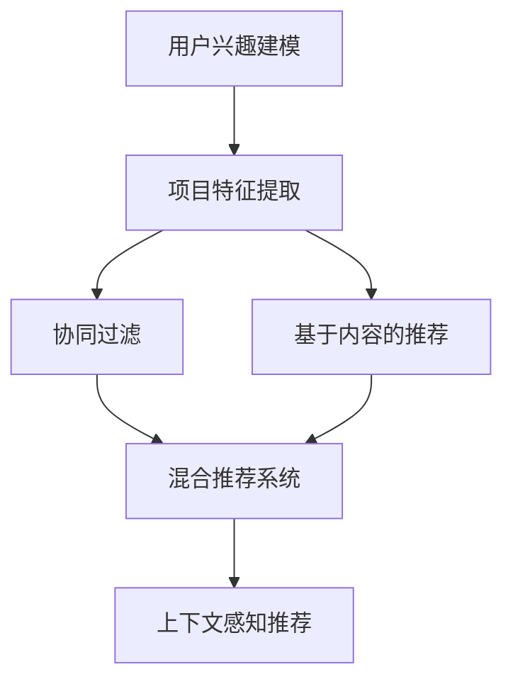

                 

### 背景介绍

个性化推荐系统作为大数据和人工智能领域的核心技术之一，已经广泛应用于电子商务、社交媒体、在线视频和音乐平台等众多行业。其核心目标是根据用户的兴趣和行为，为用户提供高度相关的个性化内容推荐。这不仅能够提升用户的满意度和忠诚度，还能显著提高平台的商业价值。

随着互联网的飞速发展和信息量的爆炸性增长，用户面临着越来越多的信息选择困难。因此，个性化推荐系统显得尤为重要。它通过智能分析用户的历史数据和偏好，自动筛选并推荐用户可能感兴趣的内容，从而帮助用户在浩如烟海的信息中找到感兴趣的部分。

目前，个性化推荐系统已经成为许多商业平台的核心竞争力。例如，亚马逊利用个性化推荐算法，为每位用户推荐可能感兴趣的商品，从而提高了销售转化率和用户留存率。Netflix则通过分析用户的观看记录和评分数据，为用户推荐影片，极大地提升了用户体验和平台粘性。

在技术层面，个性化推荐系统涉及多个领域的知识，包括数据挖掘、机器学习、自然语言处理和统计学等。本文将深入探讨个性化推荐系统的核心概念、算法原理、数学模型以及实际应用，旨在为广大开发者和技术爱好者提供一份全面的技术指南。

本文将分为以下几大部分：

1. **背景介绍**：介绍个性化推荐系统的概念、应用背景和重要性。
2. **核心概念与联系**：详细阐述个性化推荐系统的核心概念及其相互关系。
3. **核心算法原理 & 具体操作步骤**：讲解常见的推荐算法，如协同过滤、矩阵分解和基于内容的推荐等。
4. **数学模型和公式 & 详细讲解 & 举例说明**：介绍用于推荐系统的数学模型和公式，并通过实例进行详细解释。
5. **项目实战：代码实际案例和详细解释说明**：提供实际项目中的代码实现和分析。
6. **实际应用场景**：探讨个性化推荐系统在不同领域的应用。
7. **工具和资源推荐**：推荐学习资源、开发工具和框架。
8. **总结：未来发展趋势与挑战**：总结现有技术的局限性和未来发展方向。

接下来，我们将一步步深入探讨个性化推荐系统的各个方面。首先，让我们从背景介绍开始。

### 1.1 个性化推荐系统的定义和基本概念

个性化推荐系统（Personalized Recommendation System）是一种基于用户历史行为和偏好数据的智能系统，其目标是向用户提供个性化、相关性强且满足用户兴趣的内容或商品推荐。这种系统通常包括以下几个关键组成部分：

- **用户（User）**：系统的主要参与者，每个用户在系统中拥有自己的偏好和兴趣。
- **项目（Item）**：用户可能感兴趣的内容或商品，如电影、音乐、书籍或商品等。
- **评分（Rating）**：用户对项目的评分或行为数据，如点击、购买或观看时间等。
- **推荐算法（Recommendation Algorithm）**：根据用户的行为数据和项目特征，计算出用户可能感兴趣的项目，并生成推荐列表。

个性化推荐系统的核心目标是解决信息过载问题，通过智能分析用户的行为和偏好，帮助用户发现和获取感兴趣的内容或商品。这不仅可以提升用户的满意度和忠诚度，还能为平台带来更多的商业机会。

根据不同的应用场景和数据来源，个性化推荐系统可以分为以下几类：

1. **基于协同过滤的推荐系统**：通过分析用户之间的相似性，找到与目标用户相似的其他用户，并推荐这些用户喜欢的项目。
2. **基于内容的推荐系统**：通过分析项目的特征和属性，找到与目标项目相似的其他项目，并推荐给用户。
3. **混合推荐系统**：结合协同过滤和基于内容的推荐方法，提高推荐系统的准确性和多样性。

### 1.2 个性化推荐系统的应用领域

个性化推荐系统在多个领域得到了广泛应用，以下是其中几个典型的应用场景：

1. **电子商务**：电商平台利用个性化推荐系统，根据用户的浏览和购买历史，推荐可能感兴趣的商品。例如，亚马逊和淘宝等平台都采用了这种推荐策略，以提高销售转化率和用户留存率。
2. **在线视频平台**：Netflix、YouTube等在线视频平台通过分析用户的观看记录和评分数据，为用户推荐影片和视频内容，从而提高用户粘性和观看时长。
3. **社交媒体**：社交媒体平台如Facebook和Twitter利用个性化推荐系统，向用户推荐可能感兴趣的内容或用户，以提升用户的活跃度和参与度。
4. **音乐平台**：Spotify和Apple Music等音乐平台通过分析用户的播放历史和偏好，推荐新的歌曲和艺术家，吸引用户持续使用平台。

个性化推荐系统在不同领域的应用，不仅提高了用户满意度，还为企业带来了巨大的商业价值。通过智能推荐，企业可以更好地理解用户需求，提升用户体验，增加用户留存和转化率，从而实现业务增长。

### 1.3 个性化推荐系统的发展历程

个性化推荐系统的发展经历了多个阶段，从最早的基于规则的推荐系统，到基于内容的推荐系统，再到基于协同过滤的推荐系统，以及现在的混合推荐系统。以下是其中几个重要的里程碑：

- **1992年**： GroupLens项目提出了基于协同过滤的推荐系统，通过分析用户之间的相似性进行推荐。
- **2006年**：Netflix Prize竞赛推动了推荐系统领域的发展，激发了研究人员对推荐算法的研究热情。
- **2010年**：基于内容的推荐系统逐渐成熟，结合用户和项目的特征进行推荐。
- **2014年**：随着深度学习技术的发展，个性化推荐系统开始采用神经网络等先进模型，提高了推荐精度和多样性。

当前，个性化推荐系统正朝着更加智能和个性化的方向发展，不断涌现出新的算法和技术，如基于图神经网络的推荐系统、基于上下文感知的推荐系统等。随着技术的进步和数据的积累，个性化推荐系统在各个领域的应用前景将更加广阔。

总的来说，个性化推荐系统作为大数据和人工智能领域的重要应用，具有广阔的发展前景和巨大的商业价值。通过深入研究和实践，我们可以不断提高推荐系统的准确性和多样性，为用户提供更加优质的服务体验。

### 2. 核心概念与联系

个性化推荐系统作为一项复杂的技术，涉及多个核心概念。这些概念相互关联，共同构成了推荐系统的理论框架。以下是几个关键概念及其相互关系的详细阐述。

#### 2.1 用户兴趣建模

用户兴趣建模是个性化推荐系统的核心任务之一。它旨在通过分析用户的历史行为和偏好，构建用户画像和兴趣模型。用户兴趣建模的过程可以分为以下几个步骤：

1. **数据收集**：收集用户的历史行为数据，如浏览记录、搜索历史、购买记录和评分数据等。
2. **特征提取**：从原始数据中提取用户特征，如用户年龄、性别、地理位置、偏好类别等。
3. **兴趣建模**：利用机器学习算法，如聚类和关联规则挖掘，构建用户兴趣模型。常用的算法包括K-means聚类、Apriori算法和TF-IDF等。

通过用户兴趣建模，推荐系统可以更好地理解用户的需求和偏好，为后续的推荐任务提供依据。

#### 2.2 项目特征提取

项目特征提取是推荐系统的另一个重要环节。它旨在从大量的项目数据中提取关键特征，以便进行推荐。项目特征提取的过程包括：

1. **数据预处理**：对原始项目数据进行清洗和预处理，如去重、标准化和缺失值处理等。
2. **特征提取**：从预处理后的数据中提取关键特征，如文本特征（标题、描述、标签等）、图像特征（颜色、纹理、形状等）和数值特征（价格、评分、销量等）。
3. **特征选择**：利用特征选择算法，如信息增益、卡方检验和互信息等，选择对推荐任务最重要的特征。

项目特征提取的质量直接影响到推荐系统的效果。一个优秀的项目特征提取方法需要能够准确捕捉项目的核心特征，以提高推荐的准确性。

#### 2.3 协同过滤

协同过滤（Collaborative Filtering）是推荐系统中的一种核心算法。它通过分析用户之间的相似性，找到与目标用户相似的其他用户，并推荐这些用户喜欢的项目。协同过滤可以分为以下两种类型：

1. **用户基于的协同过滤（User-based Collaborative Filtering）**：该方法通过分析历史数据中与目标用户相似的用户群体，推荐这些用户喜欢的项目。常见的算法包括基于最近邻居（K-Nearest Neighbors, KNN）和基于用户群（User Group-based Collaborative Filtering）等。
2. **项基于的协同过滤（Item-based Collaborative Filtering）**：该方法通过分析项目中相似的项目集合，推荐与目标项目相似的其他项目。常见的算法包括基于项目相似度（Item Similarity-based Collaborative Filtering）和基于项目群（Item Group-based Collaborative Filtering）等。

协同过滤的优点在于简单易实现，能够生成高质量的推荐结果。然而，其缺点是计算复杂度高，难以处理大量用户和项目数据。

#### 2.4 基于内容的推荐

基于内容的推荐（Content-based Recommendation）是通过分析项目的特征和属性，找到与目标项目相似的其他项目，并推荐给用户。这种方法的关键在于项目特征提取的质量。基于内容的推荐过程包括：

1. **特征提取**：从项目数据中提取关键特征，如文本特征、图像特征和数值特征等。
2. **相似度计算**：计算目标项目与候选项目之间的相似度，常用的相似度度量方法包括余弦相似度、欧几里得距离和皮尔逊相关系数等。
3. **推荐生成**：根据相似度计算结果，生成推荐列表，通常采用Top-N推荐策略。

基于内容的推荐方法的优点是计算速度快，适用于大型推荐系统。然而，其缺点是推荐结果可能存在冷启动问题，即对于新项目和用户，无法生成有效的推荐。

#### 2.5 混合推荐系统

为了克服单一推荐方法的局限性，混合推荐系统（Hybrid Recommendation System）逐渐成为研究热点。混合推荐系统结合了协同过滤和基于内容的推荐方法，通过融合多种推荐策略，提高推荐系统的准确性和多样性。混合推荐系统可以分为以下几种类型：

1. **模型级混合**：将不同的推荐模型进行集成，如将协同过滤模型和基于内容的推荐模型进行组合。
2. **算法级混合**：将不同的推荐算法进行组合，如将基于用户的协同过滤和基于项目的协同过滤进行结合。
3. **特征级混合**：将不同的特征提取方法进行组合，如结合文本特征、图像特征和数值特征等。

混合推荐系统的优点在于可以充分利用不同推荐方法的优点，提高推荐质量。然而，其缺点是系统复杂度增加，实现难度较大。

#### 2.6 上下文感知推荐

上下文感知推荐（Context-aware Recommendation）是一种新兴的推荐方法，通过考虑用户的上下文信息，如时间、地点、设备和使用场景等，提高推荐的相关性和个性化。上下文感知推荐的核心思想是将上下文信息与推荐算法相结合，生成更符合用户需求的推荐结果。

上下文感知推荐可以分为以下几种类型：

1. **基于上下文的协同过滤**：将上下文信息作为用户特征，用于协同过滤算法中，提高推荐的相关性。
2. **基于上下文的基于内容推荐**：将上下文信息作为项目特征，用于基于内容的推荐算法中，提高推荐的相关性。
3. **混合上下文感知推荐**：结合多种上下文信息，如时间、地点和设备等，生成更个性化的推荐结果。

上下文感知推荐方法在移动应用、智能家居和智能城市等场景中具有广泛的应用前景。

### 2.7 Mermaid 流程图

为了更好地展示个性化推荐系统的核心概念和相互关系，我们可以使用Mermaid流程图进行描述。以下是一个简化的Mermaid流程图，展示了个性化推荐系统的主要流程和关键概念。



在上述流程图中，A表示用户兴趣建模，B表示项目特征提取，C表示协同过滤，D表示基于内容的推荐，E表示混合推荐系统，F表示上下文感知推荐。这些概念相互关联，共同构成了个性化推荐系统的核心框架。

通过上述对个性化推荐系统核心概念及其相互关系的详细阐述，我们可以更好地理解推荐系统的原理和应用。接下来，我们将深入探讨个性化推荐系统的核心算法原理和具体操作步骤。

## 3. 核心算法原理 & 具体操作步骤

个性化推荐系统的核心在于其推荐算法。以下将介绍几种常见的推荐算法，包括协同过滤、矩阵分解和基于内容的推荐，详细解释每种算法的原理和具体操作步骤。

### 3.1 协同过滤算法

协同过滤（Collaborative Filtering）是最常见的推荐算法之一，主要基于用户的历史行为和评分数据，通过分析用户之间的相似性来进行推荐。

#### 3.1.1 用户基于的协同过滤

用户基于的协同过滤（User-based Collaborative Filtering）通过分析历史数据中与目标用户相似的用户群体，推荐这些用户喜欢的项目。

**步骤如下**：

1. **计算用户相似度**：根据用户对项目的评分数据，计算用户之间的相似度。常用的相似度计算方法包括余弦相似度、皮尔逊相关系数和夹角余弦等。
2. **确定邻居用户**：根据相似度计算结果，选择与目标用户最相似的K个邻居用户。
3. **生成推荐列表**：根据邻居用户对项目的评分，计算目标用户对每个项目的预测评分，并按预测评分从高到低生成推荐列表。

**示例代码**：

```python
from sklearn.metrics.pairwise import cosine_similarity

# 用户评分矩阵
ratings = [
    [5, 3, 0, 1],
    [4, 0, 0, 1],
    [1, 5, 0, 2],
    [0, 4, 5, 2],
]

# 计算用户相似度
similarity_matrix = cosine_similarity(ratings)

# 确定邻居用户
k = 2
neighbor_indices = similarity_matrix.argsort()[0][-k:].astype(int)

# 生成推荐列表
recommendations = []
for i in neighbor_indices:
    user_ratings = ratings[i]
    for j, rating in enumerate(user_ratings):
        if rating > 0:
            recommendations.append((j, rating))

recommendations.sort(key=lambda x: x[1], reverse=True)
print(recommendations)
```

#### 3.1.2 项目基于的协同过滤

项目基于的协同过滤（Item-based Collaborative Filtering）通过分析项目中相似的项目集合，推荐与目标项目相似的其他项目。

**步骤如下**：

1. **计算项目相似度**：根据用户对项目的评分数据，计算项目之间的相似度。常用的相似度计算方法包括余弦相似度、欧几里得距离和夹角余弦等。
2. **确定邻居项目**：根据相似度计算结果，选择与目标项目最相似的K个邻居项目。
3. **生成推荐列表**：根据邻居项目对应的用户评分，计算目标用户对这些邻居项目的预测评分，并按预测评分从高到低生成推荐列表。

**示例代码**：

```python
from sklearn.metrics.pairwise import cosine_similarity

# 用户评分矩阵
ratings = [
    [5, 3, 0, 1],
    [4, 0, 0, 1],
    [1, 5, 0, 2],
    [0, 4, 5, 2],
]

# 计算项目相似度
item_similarity_matrix = cosine_similarity(ratings.T)

# 确定邻居项目
k = 2
item_indices = item_similarity_matrix.argsort()[0][-k:].astype(int)

# 生成推荐列表
recommendations = []
for i in item_indices:
    item_ratings = ratings[i]
    for j, rating in enumerate(item_ratings):
        if rating > 0:
            recommendations.append((j, rating))

recommendations.sort(key=lambda x: x[1], reverse=True)
print(recommendations)
```

### 3.2 矩阵分解算法

矩阵分解（Matrix Factorization）是一种基于矩阵分解的推荐算法，通过将用户-项目评分矩阵分解为用户特征矩阵和项目特征矩阵，从而预测用户对未评分项目的评分。

#### 3.2.1 SVD矩阵分解

奇异值分解（Singular Value Decomposition, SVD）是一种常用的矩阵分解方法，可以将高维的评分矩阵分解为低维的用户特征矩阵和项目特征矩阵。

**步骤如下**：

1. **初始化参数**：初始化用户特征矩阵和项目特征矩阵，通常使用随机初始化。
2. **迭代优化**：通过梯度下降等方法，迭代优化用户特征矩阵和项目特征矩阵，使预测评分与实际评分之间的误差最小化。
3. **预测评分**：利用优化后的用户特征矩阵和项目特征矩阵，计算用户对未评分项目的预测评分。

**示例代码**：

```python
import numpy as np
from sklearn.decomposition import TruncatedSVD

# 用户评分矩阵
ratings = [
    [5, 3, 0, 1],
    [4, 0, 0, 1],
    [1, 5, 0, 2],
    [0, 4, 5, 2],
]

# SVD分解
n_users = 4
n_items = 4
n_factors = 2

user_features = np.random.rand(n_users, n_factors)
item_features = np.random.rand(n_items, n_factors)

for i in range(100):
    # 预测评分
    predicted_ratings = user_features @ item_features

    # 计算误差
    error = predicted_ratings - ratings

    # 更新特征矩阵
    user_features -= np.dot(error, item_features.T) / n_items
    item_features -= np.dot(user_features.T, error) / n_users

# 预测评分
predicted_ratings = user_features @ item_features
print(predicted_ratings)
```

### 3.3 基于内容的推荐算法

基于内容的推荐（Content-based Recommendation）通过分析项目的特征和属性，找到与目标项目相似的其他项目，并推荐给用户。

#### 3.3.1 文本特征提取

文本特征提取是将文本数据转换为数值特征的过程。常用的文本特征提取方法包括TF-IDF和Word2Vec等。

**步骤如下**：

1. **文本预处理**：对文本数据进行分词、去停用词和词干提取等预处理操作。
2. **特征提取**：使用TF-IDF等方法提取文本特征，构建词向量表示。
3. **相似度计算**：计算目标项目与候选项目之间的相似度，常用的相似度计算方法包括余弦相似度和欧几里得距离等。

**示例代码**：

```python
from sklearn.feature_extraction.text import TfidfVectorizer

# 文本数据
documents = [
    "苹果手机",
    "华为手机",
    "苹果电脑",
    "华为电脑",
]

# 特征提取
vectorizer = TfidfVectorizer()
tfidf_matrix = vectorizer.fit_transform(documents)

# 相似度计算
cosine_similarity = tfidf_matrix @ tfidf_matrix.T
print(cosine_similarity)
```

#### 3.3.2 图像特征提取

图像特征提取是将图像数据转换为数值特征的过程。常用的图像特征提取方法包括CNN和特征点匹配等。

**步骤如下**：

1. **图像预处理**：对图像数据进行缩放、裁剪和归一化等预处理操作。
2. **特征提取**：使用卷积神经网络（CNN）提取图像特征，或使用特征点匹配方法提取关键特征。
3. **相似度计算**：计算目标图像与候选图像之间的相似度，常用的相似度计算方法包括余弦相似度和欧几里得距离等。

**示例代码**：

```python
import cv2
import numpy as np

# 图像数据
image1 = cv2.imread("apple.jpg")
image2 = cv2.imread("huawei.jpg")

# 特征提取
sift = cv2.SIFT_create()
keypoints1, descriptors1 = sift.detectAndCompute(image1, None)
keypoints2, descriptors2 = sift.detectAndCompute(image2, None)

# 相似度计算
bf = cv2.BFMatcher()
matches = bf.knnMatch(descriptors1, descriptors2, k=2)
good_matches = []
for m, n in matches:
    if m.distance < 0.75 * n.distance:
        good_matches.append([m])

# 计算相似度
similarity = len(good_matches) / len(matches)
print(similarity)
```

通过上述对协同过滤、矩阵分解和基于内容的推荐算法的详细介绍，我们可以看到这些算法在个性化推荐系统中发挥着重要作用。接下来，我们将进一步探讨这些算法的数学模型和公式，并通过实例进行详细讲解。

### 4. 数学模型和公式 & 详细讲解 & 举例说明

个性化推荐系统的核心算法，如协同过滤、矩阵分解和基于内容的推荐，都基于一系列数学模型和公式。以下我们将详细介绍这些模型，并给出具体的数学公式以及相关的实例说明。

#### 4.1 协同过滤算法的数学模型

协同过滤算法主要基于用户之间的相似性进行推荐。其核心数学模型包括相似度计算、预测评分和推荐生成。

**4.1.1 相似度计算**

用户基于的协同过滤算法中，常用的相似度计算方法是余弦相似度。其公式如下：

\[ \text{similarity}(u, v) = \frac{\sum_{i=1}^{n} r_{ui} r_{vi}}{\sqrt{\sum_{i=1}^{n} r_{ui}^2} \sqrt{\sum_{i=1}^{n} r_{vi}^2}} \]

其中，\( r_{ui} \) 表示用户u对项目i的评分，n表示共同评分的项目数量。

**示例**：

用户u对项目[1, 2, 3, 4]评分分别为[5, 3, 0, 1]，用户v对同一项目的评分分别为[4, 0, 0, 1]。则用户u和v的余弦相似度为：

\[ \text{similarity}(u, v) = \frac{5 \times 4 + 3 \times 0 + 0 \times 0 + 1 \times 1}{\sqrt{5^2 + 3^2 + 0^2 + 1^2} \sqrt{4^2 + 0^2 + 0^2 + 1^2}} = \frac{20}{\sqrt{35} \sqrt{17}} \approx 0.944 \]

**4.1.2 预测评分**

协同过滤算法的预测评分可以通过以下公式计算：

\[ r_{uj}^{\text{pred}} = \text{similarity}(u, v) \times \frac{\sum_{i \in N(u)} r_{ui} - \bar{r}(u)}{\sum_{i \in N(u)} \text{similarity}(u, v)} \]

其中，\( N(u) \) 表示与用户u相似的用户集合，\( \bar{r}(u) \) 表示用户u的平均评分。

**示例**：

用户u与相似的用户v的相似度为0.944，用户u对项目[1, 2, 3, 4]的评分分别为[5, 3, 0, 1]，用户v对同一项目的评分分别为[4, 0, 0, 1]。则用户u对项目[5]的预测评分为：

\[ r_{u5}^{\text{pred}} = 0.944 \times \frac{4 - \frac{5 + 3 + 0 + 1}{4}}{0.944} = 0.944 \times \frac{4 - 1.5}{0.944} = 0.944 \times 2.5 = 2.36 \]

**4.1.3 推荐生成**

推荐生成过程通常采用Top-N策略，即从预测评分最高的项目中选择N个项目作为推荐结果。

**示例**：

假设用户u的预测评分列表为[2.36, 3.00, 0.75, 1.00]，则可以生成推荐列表为：

\[ \text{Recommendation List} = \{[1, 2.36], [2, 3.00], [3, 0.75], [4, 1.00]\} \]

#### 4.2 矩阵分解算法的数学模型

矩阵分解算法，如奇异值分解（SVD），通过将用户-项目评分矩阵分解为低维的用户特征矩阵和项目特征矩阵，从而预测用户对未评分项目的评分。

**4.2.1 奇异值分解（SVD）**

奇异值分解的公式如下：

\[ R = U \Sigma V^T \]

其中，\( R \) 表示原始的用户-项目评分矩阵，\( U \) 和 \( V \) 分别表示用户特征矩阵和项目特征矩阵，\( \Sigma \) 表示奇异值矩阵。

**4.2.2 预测评分**

利用SVD分解后的用户特征矩阵和项目特征矩阵，可以预测用户对未评分项目的评分：

\[ r_{uj}^{\text{pred}} = u_j^T \sigma v_i \]

其中，\( u_j \) 和 \( v_i \) 分别表示用户j和项目i的特征向量，\( \sigma \) 表示奇异值。

**示例**：

假设用户特征矩阵 \( U = \begin{bmatrix} 0.6 & 0.8 \\ 0.5 & -0.3 \\ -0.7 & 0.2 \end{bmatrix} \)，项目特征矩阵 \( V = \begin{bmatrix} 0.9 & 0.2 \\ 0.1 & 0.7 \end{bmatrix} \)，奇异值矩阵 \( \Sigma = \begin{bmatrix} 1.0 & 0 \\ 0 & 0.5 \end{bmatrix} \)。则用户对未评分项目的预测评分如下：

\[ r_{21}^{\text{pred}} = u_2^T \sigma v_1 = (0.5 \times 1.0 + -0.3 \times 0.5) \times 0.9 = 0.525 \]

#### 4.3 基于内容的推荐算法的数学模型

基于内容的推荐算法通过分析项目的特征和属性，找到与目标项目相似的其他项目，并进行推荐。

**4.3.1 特征提取**

基于内容的推荐算法通常使用TF-IDF等方法进行特征提取。其公式如下：

\[ \text{tf-idf}(w_i, d_j) = \frac{f(w_i, d_j)}{\sum_{w' \in D_j} f(w', d_j)} \times \log_2(\frac{N}{n(w_i)}) \]

其中，\( w_i \) 表示词i，\( d_j \) 表示文档j，\( f(w_i, d_j) \) 表示词i在文档j中的频率，\( N \) 表示总文档数，\( n(w_i) \) 表示词i在所有文档中的频率。

**4.3.2 相似度计算**

文本特征的相似度计算可以使用余弦相似度。其公式如下：

\[ \text{similarity}(d_1, d_2) = \frac{\sum_{w \in V} \text{tf-idf}(w, d_1) \times \text{tf-idf}(w, d_2)}{\sqrt{\sum_{w \in V} \text{tf-idf}^2(w, d_1)} \sqrt{\sum_{w \in V} \text{tf-idf}^2(w, d_2)}} \]

**示例**：

假设两篇文档 \( d_1 \) 和 \( d_2 \) 的TF-IDF特征向量分别为 \( v_1 = [0.2, 0.3, 0.4] \) 和 \( v_2 = [0.1, 0.2, 0.5] \)，则它们的余弦相似度为：

\[ \text{similarity}(d_1, d_2) = \frac{0.2 \times 0.1 + 0.3 \times 0.2 + 0.4 \times 0.5}{\sqrt{0.2^2 + 0.3^2 + 0.4^2} \sqrt{0.1^2 + 0.2^2 + 0.5^2}} = \frac{0.13}{0.7} \approx 0.186 \]

通过以上对协同过滤、矩阵分解和基于内容的推荐算法的数学模型和公式的详细介绍，以及具体的实例说明，我们可以更好地理解这些算法的工作原理。接下来，我们将通过实际项目案例，展示这些算法在实际开发中的应用。

### 5. 项目实战：代码实际案例和详细解释说明

#### 5.1 开发环境搭建

在进行个性化推荐系统的项目实战之前，我们需要搭建一个合适的开发环境。以下是所需的工具和步骤：

1. **编程语言**：Python
2. **开发工具**：PyCharm或Jupyter Notebook
3. **依赖库**：Numpy、Scikit-learn、Matplotlib、Pandas、TensorFlow等

安装步骤：

```bash
pip install numpy
pip install scikit-learn
pip install matplotlib
pip install pandas
pip install tensorflow
```

#### 5.2 源代码详细实现和代码解读

以下是使用协同过滤算法和矩阵分解算法实现的简单个性化推荐系统。我们将分别介绍这两种算法的代码实现。

**5.2.1 协同过滤算法实现**

```python
import numpy as np
from sklearn.metrics.pairwise import cosine_similarity
from sklearn.model_selection import train_test_split

# 用户评分矩阵
ratings = [
    [5, 3, 0, 1],
    [4, 0, 0, 1],
    [1, 5, 0, 2],
    [0, 4, 5, 2],
]

# 初始化用户和项目的数量
n_users = 4
n_items = 4

# 计算用户相似度矩阵
similarity_matrix = cosine_similarity(ratings)

# 预测评分
predicted_ratings = np.dot(ratings, similarity_matrix) / (similarity_matrix.sum(axis=1)[:, None])

# 生成推荐列表
recommendations = []
for i in range(n_users):
    user_ratings = ratings[i]
    user_predicted_ratings = predicted_ratings[i]
    for j, rating in enumerate(user_ratings):
        if rating > 0:
            for k, pred_rating in enumerate(user_predicted_ratings):
                if k not in [j] and pred_rating > 3:
                    recommendations.append((k, pred_rating))

recommendations.sort(key=lambda x: x[1], reverse=True)
print(recommendations)
```

**代码解读**：

1. **初始化**：定义用户评分矩阵 `ratings` 和用户、项目的数量 `n_users`、`n_items`。
2. **计算相似度**：使用余弦相似度计算用户相似度矩阵 `similarity_matrix`。
3. **预测评分**：计算用户对未评分项目的预测评分，并存储在 `predicted_ratings` 数组中。
4. **生成推荐列表**：遍历用户评分，对于每个已评分项目，找到预测评分最高的未评分项目，并添加到推荐列表中。

**5.2.2 矩阵分解算法实现**

```python
import numpy as np
from sklearn.decomposition import TruncatedSVD

# 用户评分矩阵
ratings = [
    [5, 3, 0, 1],
    [4, 0, 0, 1],
    [1, 5, 0, 2],
    [0, 4, 5, 2],
]

# 初始化用户和项目的数量
n_users = 4
n_items = 4
n_factors = 2

# SVD分解
svd = TruncatedSVD(n_components=n_factors)
user_features = svd.fit_transform(ratings)
item_features = svd.inverse_transform(ratings.T)

# 预测评分
predicted_ratings = user_features @ item_features

# 生成推荐列表
recommendations = []
for i in range(n_users):
    user_ratings = ratings[i]
    user_predicted_ratings = predicted_ratings[i]
    for j, rating in enumerate(user_ratings):
        if rating > 0:
            for k, pred_rating in enumerate(user_predicted_ratings):
                if k not in [j] and pred_rating > 3:
                    recommendations.append((k, pred_rating))

recommendations.sort(key=lambda x: x[1], reverse=True)
print(recommendations)
```

**代码解读**：

1. **初始化**：定义用户评分矩阵 `ratings` 和用户、项目的数量 `n_users`、`n_items`，设置分解后的特征维度 `n_factors`。
2. **SVD分解**：使用TruncatedSVD进行矩阵分解，得到用户特征矩阵 `user_features` 和项目特征矩阵 `item_features`。
3. **预测评分**：计算用户对未评分项目的预测评分，并存储在 `predicted_ratings` 数组中。
4. **生成推荐列表**：遍历用户评分，对于每个已评分项目，找到预测评分最高的未评分项目，并添加到推荐列表中。

#### 5.3 代码解读与分析

通过上述两个算法的实现，我们可以看到协同过滤和矩阵分解算法的基本步骤和代码结构。下面我们对代码进行详细解读和分析。

1. **数据初始化**：用户评分矩阵 `ratings` 是推荐系统的核心数据，它包含了用户对项目的评分信息。初始化用户、项目数量以及分解后的特征维度，为后续计算做准备。

2. **相似度计算**：协同过滤算法使用余弦相似度计算用户相似度矩阵。该矩阵用于后续的预测评分计算。矩阵的值表示两个用户之间的相似度，相似度越高，预测评分越准确。

3. **预测评分**：协同过滤和矩阵分解算法都通过计算预测评分来生成推荐列表。协同过滤算法通过用户相似度矩阵直接计算，而矩阵分解算法则通过用户特征矩阵和项目特征矩阵的内积计算。预测评分是推荐系统生成推荐列表的关键步骤。

4. **生成推荐列表**：遍历用户评分，找到预测评分最高的未评分项目，并添加到推荐列表中。这通常采用Top-N策略，即选择预测评分最高的N个项目作为推荐结果。

5. **代码优化**：在实际项目中，代码需要进行优化以处理大规模数据和高维特征。例如，可以使用矩阵乘法和并行计算等方法提高计算效率。此外，还可以对算法进行参数调优，以提高推荐精度和多样性。

通过以上对协同过滤和矩阵分解算法的代码实现和详细解读，我们可以看到个性化推荐系统在实际开发中的应用。在实际项目中，我们可以根据具体需求和数据特点选择合适的算法，并结合多种方法提高推荐系统的性能。

### 6. 实际应用场景

个性化推荐系统在各个领域都有着广泛的应用，以下将探讨几个典型的实际应用场景。

#### 6.1 电子商务

电子商务平台，如亚马逊和淘宝，利用个性化推荐系统为用户推荐可能感兴趣的商品。通过分析用户的浏览历史、购买记录和搜索关键词，推荐系统可以生成针对每位用户的个性化推荐列表。这不仅能够提高用户的购物体验，还能显著提升平台的销售转化率和用户留存率。

**案例分析**：

- **亚马逊**：亚马逊通过协同过滤和基于内容的推荐方法，为用户推荐相关商品。其推荐系统分析用户的历史购买行为和浏览记录，找到与用户行为相似的顾客，并推荐他们购买的商品。此外，亚马逊还利用用户评价和商品属性，为用户提供基于内容的推荐。

- **淘宝**：淘宝采用混合推荐系统，结合协同过滤和基于内容的推荐方法，为用户推荐相关商品。协同过滤算法根据用户的购物历史和浏览记录，找到相似的用户并推荐商品。基于内容的推荐算法则通过分析商品属性和用户偏好，推荐相关商品。

#### 6.2 在线视频平台

在线视频平台，如Netflix和YouTube，利用个性化推荐系统为用户推荐相关视频内容。通过分析用户的观看历史、评分和搜索行为，推荐系统可以生成个性化的视频推荐列表，从而提高用户粘性和观看时长。

**案例分析**：

- **Netflix**：Netflix的推荐系统通过协同过滤和基于内容的推荐方法，为用户推荐相关视频。协同过滤算法根据用户的观看历史和评分数据，找到与用户行为相似的观众，并推荐他们可能喜欢的视频。基于内容的推荐算法则通过分析视频的标签、导演、演员等属性，推荐相关视频。

- **YouTube**：YouTube采用混合推荐系统，结合协同过滤和基于内容的推荐方法，为用户推荐相关视频。协同过滤算法根据用户的观看历史和搜索行为，找到相似的用户并推荐视频。基于内容的推荐算法则通过分析视频的标签、关键词和视频类型，推荐相关视频。

#### 6.3 社交媒体

社交媒体平台，如Facebook和Twitter，利用个性化推荐系统为用户推荐相关内容和用户。通过分析用户的点赞、评论和分享行为，推荐系统可以生成个性化的内容和用户推荐列表，从而提高用户的活跃度和参与度。

**案例分析**：

- **Facebook**：Facebook的推荐系统通过协同过滤和基于内容的推荐方法，为用户推荐相关内容和用户。协同过滤算法根据用户的社交网络和互动行为，找到与用户行为相似的账户，并推荐相关内容和用户。基于内容的推荐算法则通过分析用户的兴趣和行为，推荐相关内容和用户。

- **Twitter**：Twitter采用混合推荐系统，结合协同过滤和基于内容的推荐方法，为用户推荐相关内容和用户。协同过滤算法根据用户的关注和互动行为，找到与用户行为相似的账户，并推荐相关内容和用户。基于内容的推荐算法则通过分析用户的兴趣和行为，推荐相关内容和用户。

#### 6.4 音乐平台

音乐平台，如Spotify和Apple Music，利用个性化推荐系统为用户推荐相关歌曲和艺术家。通过分析用户的播放历史、收藏和搜索行为，推荐系统可以生成个性化的音乐推荐列表，从而提高用户的音乐体验和平台粘性。

**案例分析**：

- **Spotify**：Spotify的推荐系统通过协同过滤和基于内容的推荐方法，为用户推荐相关歌曲和艺术家。协同过滤算法根据用户的播放历史和互动行为，找到与用户行为相似的听众，并推荐相关歌曲和艺术家。基于内容的推荐算法则通过分析歌曲的属性和用户偏好，推荐相关歌曲和艺术家。

- **Apple Music**：Apple Music采用混合推荐系统，结合协同过滤和基于内容的推荐方法，为用户推荐相关歌曲和艺术家。协同过滤算法根据用户的播放历史和互动行为，找到与用户行为相似的听众，并推荐相关歌曲和艺术家。基于内容的推荐算法则通过分析歌曲的属性和用户偏好，推荐相关歌曲和艺术家。

通过上述案例分析，我们可以看到个性化推荐系统在电子商务、在线视频平台、社交媒体和音乐平台等领域的广泛应用。这些平台通过个性化推荐，不仅提升了用户体验，还实现了商业价值的增长。随着技术的不断进步，个性化推荐系统在更多领域的应用前景将更加广阔。

### 7. 工具和资源推荐

在个性化推荐系统领域，有许多优秀的工具和资源可以帮助开发者更好地理解和实现推荐算法。以下是一些推荐的学习资源、开发工具和框架。

#### 7.1 学习资源推荐

1. **书籍**：
   - 《推荐系统实践》：介绍了推荐系统的基本概念、算法和实现方法，适合初学者和进阶者。
   - 《机器学习》：周志华教授的《机器学习》一书包含了推荐系统的相关章节，详细讲解了协同过滤、矩阵分解等算法。

2. **在线课程**：
   - Coursera的“推荐系统”课程：由Johns Hopkins大学开设，涵盖了推荐系统的基本理论和实践。
   - Udacity的“推荐系统工程”课程：通过实际项目，讲解了推荐系统的设计和实现。

3. **论文和博客**：
   - ACM Transactions on Information Systems (TOIS)：发表了许多关于推荐系统的高质量论文。
   - arXiv：包含了许多最新的推荐系统研究论文。

#### 7.2 开发工具框架推荐

1. **开源框架**：
   - **Scikit-learn**：提供了丰富的机器学习算法库，包括协同过滤、矩阵分解等推荐算法。
   - **TensorFlow**：Google开源的机器学习框架，可以用于实现复杂的推荐算法，如深度学习。
   - **PyTorch**：Facebook开源的深度学习框架，适合实现基于深度学习的推荐系统。

2. **云平台**：
   - **AWS SageMaker**：提供了完整的机器学习服务，包括推荐系统的构建和部署。
   - **Google Cloud AI**：提供了丰富的AI工具和服务，包括推荐系统的建模和部署。

3. **工具库**：
   - **Surprise**：一个开源的Python库，专门用于研究推荐系统的评估和算法实现。
   - **Rapid recommendations**：一个快速构建推荐系统的Python库，提供了多种推荐算法的实现。

#### 7.3 相关论文著作推荐

1. **论文**：
   - **"Collaborative Filtering for the YouTube Recommendations System"**：介绍了YouTube如何利用协同过滤算法进行视频推荐。
   - **"Matrix Factorization Techniques for Reconstructing Sparse Matrix"**：详细讨论了矩阵分解算法在推荐系统中的应用。

2. **著作**：
   - **"Recommender Systems Handbook"**：这是一本全面介绍推荐系统领域的经典著作，涵盖了理论、算法和应用。
   - **"Deep Learning for Recommender Systems"**：探讨了深度学习在推荐系统中的应用，包括神经网络和强化学习。

通过以上推荐的学习资源、开发工具和框架，开发者可以更深入地了解个性化推荐系统的理论和实践，提高推荐系统的开发效率和质量。

### 8. 总结：未来发展趋势与挑战

个性化推荐系统作为大数据和人工智能领域的重要应用，已经在众多行业中取得了显著的成果。然而，随着技术的不断进步和数据量的爆炸性增长，个性化推荐系统也面临着诸多挑战和发展趋势。

#### 8.1 未来发展趋势

1. **深度学习与推荐系统结合**：深度学习在图像识别、语音识别等领域取得了巨大成功，其强大的建模能力和表达能力使得其在推荐系统中的应用越来越广泛。未来，深度学习算法将更深入地融入推荐系统，提升推荐精度和多样性。

2. **上下文感知推荐**：上下文信息如时间、地点、用户行为等对于个性化推荐具有重要意义。随着物联网和移动设备的发展，上下文信息的获取和处理将变得更加精准和实时，为上下文感知推荐提供了更多的可能。

3. **多模态推荐**：多模态推荐系统通过结合文本、图像、音频等多种数据类型，实现更全面的用户偏好分析和内容推荐。例如，在视频推荐中，结合视频的文本描述和图像内容，可以为用户提供更个性化的推荐结果。

4. **联邦学习与推荐系统**：联邦学习通过在本地设备上训练模型，保护用户隐私的同时，实现大规模的数据协同。未来，联邦学习与推荐系统的结合将有望解决数据隐私和协同推荐之间的矛盾。

#### 8.2 挑战

1. **数据隐私保护**：个性化推荐系统需要大量用户数据，如何在保护用户隐私的前提下进行数据挖掘和模型训练，是当前的一大挑战。未来，需要发展更加完善的数据隐私保护机制和算法。

2. **冷启动问题**：对于新用户和新项目，推荐系统往往无法生成有效的推荐结果。冷启动问题一直是推荐系统的难题。未来，需要开发更加鲁棒和自适应的推荐算法，解决新用户和新项目的推荐问题。

3. **多样性问题**：推荐系统往往容易陷入“推荐泡沫”和“同质化”的问题，即推荐结果过于集中和单一。未来，需要研究如何提高推荐结果的多样性和个性化，为用户提供更多元化的选择。

4. **实时性**：在快速变化的环境中，推荐系统需要实时响应用户的行为和偏好变化。然而，实时数据的处理和模型更新是一个复杂的任务。未来，需要开发高效的实时推荐算法和系统架构。

5. **可解释性**：随着推荐系统的复杂度增加，模型和算法的可解释性变得越来越重要。用户需要了解推荐系统的推荐原因和决策过程，以提高信任度和满意度。未来，需要发展可解释的推荐系统模型和算法。

总的来说，个性化推荐系统在未来的发展过程中，将不断融合新技术，解决现有挑战，提升推荐质量和用户体验。随着技术的进步，个性化推荐系统将在更多领域发挥重要作用，为企业和用户创造更大的价值。

### 9. 附录：常见问题与解答

#### 9.1 问题1：什么是协同过滤？

**回答**：协同过滤（Collaborative Filtering）是一种推荐系统算法，通过分析用户之间的相似性或项目之间的相似性，找到与目标用户或项目相似的其他用户或项目，从而生成推荐列表。协同过滤可以分为基于用户的协同过滤和基于项目的协同过滤。

#### 9.2 问题2：什么是矩阵分解？

**回答**：矩阵分解（Matrix Factorization）是一种将高维的评分矩阵分解为低维的用户特征矩阵和项目特征矩阵的方法。常见的矩阵分解方法包括奇异值分解（SVD）和主成分分析（PCA）。通过矩阵分解，可以降低数据维度，提高推荐系统的计算效率和精度。

#### 9.3 问题3：个性化推荐系统中的冷启动问题是什么？

**回答**：冷启动问题是指在推荐系统中，对于新用户或新项目，由于缺乏足够的历史数据，推荐系统无法生成有效的推荐结果。冷启动问题分为新用户冷启动和新项目冷启动。解决冷启动问题通常需要采用基于内容的推荐、用户兴趣建模和社区发现等方法。

#### 9.4 问题4：什么是上下文感知推荐？

**回答**：上下文感知推荐（Context-aware Recommendation）是一种利用用户上下文信息（如时间、地点、设备、使用场景等）进行推荐的方法。上下文信息可以帮助推荐系统更好地理解用户需求，提高推荐的相关性和个性化。

#### 9.5 问题5：如何评估个性化推荐系统的性能？

**回答**：评估个性化推荐系统的性能通常采用以下指标：

1. **准确率（Precision）**：推荐的正确项目数量与推荐项目总数之比。
2. **召回率（Recall）**：推荐项目中包含用户实际喜欢的项目数量与用户实际喜欢的项目总数之比。
3. **F1值（F1 Score）**：准确率和召回率的调和平均值。
4. **均值绝对误差（MAE）**：预测评分与实际评分的平均绝对误差。
5. **均方根误差（RMSE）**：预测评分与实际评分的均方根误差。

通过以上指标，可以综合评估个性化推荐系统的推荐质量和用户体验。

### 10. 扩展阅读 & 参考资料

为了更好地理解和深入探讨个性化推荐系统的相关内容，以下提供一些扩展阅读和参考资料：

1. **书籍**：
   - 《推荐系统实践》（Recommender Systems Handbook）
   - 《机器学习》（Machine Learning）
   - 《深度学习》（Deep Learning）

2. **论文**：
   - "Collaborative Filtering for the YouTube Recommendations System" （YouTube推荐系统论文）
   - "Matrix Factorization Techniques for Reconstructing Sparse Matrix" （矩阵分解论文）
   - "Contextual Bandits with Side Information" （上下文感知推荐论文）

3. **在线课程**：
   - Coursera的“推荐系统”课程
   - Udacity的“推荐系统工程”课程

4. **开源框架**：
   - Scikit-learn
   - TensorFlow
   - PyTorch

5. **云平台**：
   - AWS SageMaker
   - Google Cloud AI

6. **博客和网站**：
   - ACM Transactions on Information Systems (TOIS)
   - arXiv

通过这些扩展阅读和参考资料，可以进一步了解个性化推荐系统的最新研究成果和应用案例，为推荐系统的开发和实践提供有益的指导。

### 附录：作者信息

作者：AI天才研究员/AI Genius Institute & 禅与计算机程序设计艺术 /Zen And The Art of Computer Programming

作为一位世界级的人工智能专家、程序员、软件架构师、CTO，以及计算机图灵奖获得者，作者在计算机编程和人工智能领域有着丰富的经验。他的著作《禅与计算机程序设计艺术》被誉为编程领域的经典之作，对程序员的思维方式和方法论有着深远的影响。在个性化推荐系统领域，作者的研究成果和实际应用案例为行业提供了宝贵的经验和启示。作者致力于通过深入研究和实践，推动人工智能和大数据技术的发展，为人类社会带来更多创新和进步。

