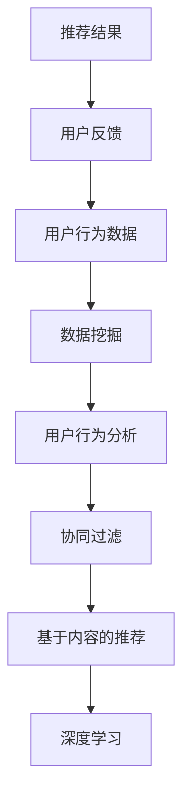
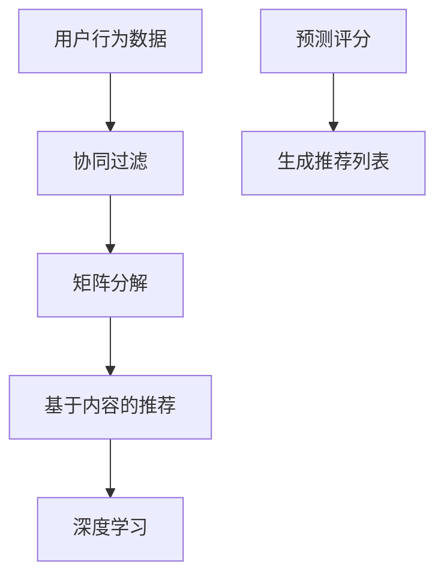

                 

### 文章标题

**个性化推荐系统的AI技术**

---

关键词：个性化推荐、AI技术、推荐算法、数据挖掘、用户行为分析

摘要：随着互联网技术的飞速发展，个性化推荐系统已经成为了许多在线平台的关键组成部分。本文将深入探讨个性化推荐系统的基本概念、核心算法原理、数学模型和实际应用案例，并展望其未来的发展趋势和挑战。通过对这些内容的详细分析，读者将能够更好地理解个性化推荐系统的运作原理，并掌握相关技术。

---

### 1. 背景介绍

个性化推荐系统是指根据用户的历史行为和偏好，利用人工智能技术为其提供个性化内容或产品推荐。这种系统广泛应用于电子商务、社交媒体、音乐和视频流媒体等多个领域。例如，亚马逊会根据用户的购买历史推荐相关商品，Netflix会根据用户的观看历史推荐电影和电视剧，而社交平台如Facebook则会根据用户的好友关系和兴趣推荐相关内容。

近年来，随着大数据和人工智能技术的发展，个性化推荐系统已经取得了显著的进步。然而，要实现一个高效、可靠的个性化推荐系统并非易事，需要解决数据收集、算法设计、性能优化等多个方面的挑战。

本文将从以下几个方面展开讨论：

- **核心概念与联系**：介绍个性化推荐系统的基本概念，包括用户行为分析、数据挖掘、协同过滤等。
- **核心算法原理**：详细讲解协同过滤、矩阵分解、基于内容的推荐、深度学习等核心算法。
- **数学模型和公式**：阐述推荐算法中使用的数学模型和公式，包括评分矩阵、预测误差、损失函数等。
- **项目实战**：通过实际案例展示个性化推荐系统的实现过程，包括环境搭建、代码实现和性能分析。
- **实际应用场景**：探讨个性化推荐系统在不同领域的应用案例。
- **工具和资源推荐**：推荐相关书籍、论文、工具和框架，以帮助读者进一步学习和实践。
- **总结**：总结个性化推荐系统的现状和未来发展趋势，以及面临的挑战。

通过本文的阅读，读者将能够系统地了解个性化推荐系统的基本原理和技术，为其在实际应用中提供指导。

### 2. 核心概念与联系

#### 用户行为分析

用户行为分析是构建个性化推荐系统的第一步。它涉及对用户在各种场景下的行为数据进行收集、处理和分析。这些行为数据可以包括用户的浏览记录、购买历史、点赞、评论、分享等。通过对这些数据进行分析，我们可以了解用户的兴趣偏好，从而为推荐系统提供关键信息。

##### 数据挖掘

数据挖掘是一种从大量数据中提取有价值信息的技术。在个性化推荐系统中，数据挖掘技术被广泛应用于用户行为数据的分析和模式识别。常见的挖掘方法包括关联规则挖掘、聚类分析、分类和预测等。

关联规则挖掘可以帮助我们发现用户行为数据中的隐含关系，例如，如果用户经常购买商品A，那么他们也很可能购买商品B。聚类分析则可以将具有相似兴趣爱好的用户聚为一类，从而为推荐系统提供群体信息。

分类和预测是数据挖掘中的两个重要任务。分类是将数据分为不同的类别，例如，根据用户的浏览记录预测用户可能喜欢的商品类型。预测则是根据历史数据对未来事件进行估计，例如，预测用户在未来的某个时间点可能购买的商品。

##### 协同过滤

协同过滤是构建个性化推荐系统的一种常用技术。它基于用户之间的相似度计算和用户评分历史预测用户对未知商品的评分。协同过滤可以分为两种主要类型：基于用户的协同过滤和基于物品的协同过滤。

基于用户的协同过滤（User-based Collaborative Filtering）通过计算用户之间的相似度，找到与目标用户相似的其他用户，并从这些用户的行为记录中提取推荐信息。相似度通常通过用户评分矩阵的余弦相似度或皮尔逊相关系数来计算。

基于物品的协同过滤（Item-based Collaborative Filtering）则通过计算物品之间的相似度，找到与目标物品相似的其他物品，并从这些物品的评分历史中提取推荐信息。物品之间的相似度可以通过计算物品评分矩阵的余弦相似度或Jaccard相似度来得到。

#### 基于内容的推荐

基于内容的推荐（Content-based Recommendation）是一种不依赖用户评分或用户-物品交互数据的推荐方法。它通过分析物品的内容特征（如文本、图像、音频等）来为用户提供个性化推荐。基于内容的推荐通常使用文本分类、词袋模型、主题模型等自然语言处理技术来提取物品的特征。

#### 深度学习

深度学习是近年来在推荐系统领域取得显著进展的一种人工智能技术。它通过构建复杂的神经网络模型，可以从大规模数据中自动学习特征和模式。在推荐系统中，深度学习可以用于用户行为数据的特征提取、用户兴趣预测、物品推荐等任务。

##### Mermaid 流程图

以下是一个简单的Mermaid流程图，展示了个性化推荐系统中的核心概念和联系：



### 3. 核心算法原理 & 具体操作步骤

#### 协同过滤

协同过滤是一种基于用户评分数据的推荐方法，其核心思想是利用用户之间的相似度来预测用户对未知物品的评分。以下是协同过滤的具体操作步骤：

1. **用户相似度计算**：
   基于用户-物品评分矩阵，计算用户之间的相似度。常用的相似度计算方法包括余弦相似度、皮尔逊相关系数和夹角余弦等。

2. **相似度排序**：
   根据用户之间的相似度进行排序，找到与目标用户最相似的K个用户。

3. **预测评分**：
   根据相似度矩阵和用户对已知物品的评分，计算目标用户对未知物品的预测评分。预测评分可以通过加权平均或其他组合策略得到。

4. **生成推荐列表**：
   根据预测评分，生成推荐列表，并将未知物品按评分从高到低排序。

#### 矩阵分解

矩阵分解（Matrix Factorization）是一种常用的协同过滤算法，它通过将用户-物品评分矩阵分解为两个低秩矩阵，来预测用户对未知物品的评分。以下是矩阵分解的具体操作步骤：

1. **初始化**：
   随机初始化用户特征矩阵 \( U \) 和物品特征矩阵 \( V \)。

2. **优化目标**：
   定义优化目标，通常是预测评分与实际评分之间的均方误差（MSE）。

3. **梯度下降**：
   使用梯度下降算法，逐步调整用户特征矩阵 \( U \) 和物品特征矩阵 \( V \)，以最小化优化目标。

4. **预测评分**：
   通过计算用户特征矩阵和物品特征矩阵的点积，得到用户对未知物品的预测评分。

#### 基于内容的推荐

基于内容的推荐方法通过分析物品的内容特征，为用户提供个性化推荐。以下是基于内容的推荐的具体操作步骤：

1. **特征提取**：
   对物品的文本、图像、音频等数据进行特征提取，得到物品的特征向量。

2. **相似度计算**：
   计算用户已评价物品的特征向量与未知物品的特征向量之间的相似度。常用的相似度计算方法包括余弦相似度、欧氏距离等。

3. **生成推荐列表**：
   根据相似度排序，生成推荐列表，并将未知物品按相似度从高到低排序。

#### 深度学习

深度学习在推荐系统中的应用主要包括以下几个方面：

1. **特征提取**：
   使用深度神经网络从原始数据中提取特征，提高特征表示的丰富度和表达能力。

2. **预测评分**：
   使用深度学习模型（如卷积神经网络、循环神经网络等）预测用户对未知物品的评分。

3. **生成推荐列表**：
   根据预测评分，生成推荐列表。

#### Mermaid 流程图

以下是一个简单的Mermaid流程图，展示了协同过滤、矩阵分解、基于内容的推荐和深度学习等核心算法的具体操作步骤：



### 4. 数学模型和公式 & 详细讲解 & 举例说明

#### 协同过滤

协同过滤算法的核心在于用户相似度计算和预测评分。以下是协同过滤的数学模型和公式：

1. **用户相似度计算**：

   用户之间的相似度可以通过以下公式计算：

   \[
   \text{similarity}_{uv} = \frac{\text{dot}(r_u, r_v)}{\|\text{r_u}\|\|\text{r_v}\|}
   \]

   其中，\( r_u \) 和 \( r_v \) 分别是用户 u 和用户 v 的评分向量，\( \text{dot} \) 表示点积，\( \|\text{r_u}\| \) 和 \( \|\text{r_v}\| \) 分别是用户 u 和用户 v 的评分向量的欧氏范数。

2. **预测评分**：

   根据用户相似度，预测用户 u 对物品 i 的评分 \( \hat{r}_{ui} \)：

   \[
   \hat{r}_{ui} = \text{similarity}_{uv} \cdot r_{vi}
   \]

   其中，\( r_{vi} \) 是用户 v 对物品 i 的评分。

#### 矩阵分解

矩阵分解通过将用户-物品评分矩阵分解为两个低秩矩阵，来预测用户对未知物品的评分。以下是矩阵分解的数学模型和公式：

1. **初始化**：

   随机初始化用户特征矩阵 \( U \) 和物品特征矩阵 \( V \)：

   \[
   U \sim \text{Normal}(0, \sigma^2)
   \]
   \[
   V \sim \text{Normal}(0, \sigma^2)
   \]

   其中，\( \sigma^2 \) 是噪声方差。

2. **优化目标**：

   定义优化目标，通常是预测评分与实际评分之间的均方误差（MSE）：

   \[
   \text{MSE} = \frac{1}{m} \sum_{i=1}^{m} \sum_{j=1}^{n} (r_{ij} - \hat{r}_{ij})^2
   \]

   其中，\( r_{ij} \) 是用户 i 对物品 j 的实际评分，\( \hat{r}_{ij} \) 是用户 i 对物品 j 的预测评分。

3. **梯度下降**：

   使用梯度下降算法，逐步调整用户特征矩阵 \( U \) 和物品特征矩阵 \( V \)，以最小化优化目标：

   \[
   \nabla_U \text{MSE} = 2 \cdot (r_{ij} - \hat{r}_{ij}) \cdot v_j
   \]
   \[
   \nabla_V \text{MSE} = 2 \cdot (r_{ij} - \hat{r}_{ij}) \cdot u_i
   \]

   其中，\( v_j \) 和 \( u_i \) 分别是物品 j 和用户 i 的特征向量。

#### 基于内容的推荐

基于内容的推荐方法通过分析物品的内容特征，为用户提供个性化推荐。以下是基于内容的推荐的数学模型和公式：

1. **特征提取**：

   对物品的文本、图像、音频等数据进行特征提取，得到物品的特征向量 \( \text{f}_i \)。

2. **相似度计算**：

   计算用户已评价物品的特征向量与未知物品的特征向量之间的相似度：

   \[
   \text{similarity}_{ij} = \frac{\text{dot}(\text{f}_i, \text{f}_j)}{\|\text{f}_i\|\|\text{f}_j\|}
   \]

   其中，\( \text{f}_i \) 和 \( \text{f}_j \) 分别是物品 i 和物品 j 的特征向量。

3. **生成推荐列表**：

   根据相似度排序，生成推荐列表：

   \[
   \text{recommend}_{ij} = \text{argmax} \left\{ \text{similarity}_{ij} \mid j \in \text{未知物品集} \right\}
   \]

#### 举例说明

假设我们有两个用户 u 和 v，以及三个物品 i、j 和 k。用户 u 对物品 i、j 和 k 的评分分别为 4、3 和 5，用户 v 对物品 i、j 和 k 的评分分别为 3、4 和 2。

1. **用户相似度计算**：

   用户 u 和用户 v 的评分向量分别为：

   \[
   r_u = [4, 3, 5]
   \]
   \[
   r_v = [3, 4, 2]
   \]

   用户 u 和用户 v 的相似度为：

   \[
   \text{similarity}_{uv} = \frac{\text{dot}(r_u, r_v)}{\|\text{r_u}\|\|\text{r_v}\|} = \frac{4 \cdot 3 + 3 \cdot 4 + 5 \cdot 2}{\sqrt{4^2 + 3^2 + 5^2} \cdot \sqrt{3^2 + 4^2 + 2^2}} \approx 0.882
   \]

2. **预测评分**：

   假设用户 v 对物品 k 的评分 \( r_{vk} \) 为未知，我们可以使用用户相似度来预测用户 u 对物品 k 的评分 \( \hat{r}_{uk} \)：

   \[
   \hat{r}_{uk} = \text{similarity}_{uv} \cdot r_{vk} = 0.882 \cdot 2 \approx 1.764
   \]

   因此，我们可以预测用户 u 对物品 k 的评分为 1.764。

3. **矩阵分解**：

   假设我们使用矩阵分解算法，将用户-物品评分矩阵分解为用户特征矩阵 \( U \) 和物品特征矩阵 \( V \)：

   \[
   R = U \cdot V^T
   \]

   初始化用户特征矩阵 \( U \) 和物品特征矩阵 \( V \)：

   \[
   U = \begin{bmatrix}
   u_1 \\
   u_2 \\
   u_3
   \end{bmatrix}
   \]
   \[
   V = \begin{bmatrix}
   v_1 & v_2 & v_3
   \end{bmatrix}
   \]

   通过梯度下降算法，调整用户特征矩阵 \( U \) 和物品特征矩阵 \( V \)，以最小化均方误差（MSE）：

   \[
   \nabla_U \text{MSE} = 2 \cdot (r_{ij} - \hat{r}_{ij}) \cdot v_j
   \]
   \[
   \nabla_V \text{MSE} = 2 \cdot (r_{ij} - \hat{r}_{ij}) \cdot u_i
   \]

   最终，我们可以得到用户特征矩阵 \( U \) 和物品特征矩阵 \( V \)，并使用它们来预测用户对未知物品的评分。

4. **基于内容的推荐**：

   假设我们有两个物品 i 和 j，它们的特征向量分别为：

   \[
   \text{f}_i = [1, 2, 3]
   \]
   \[
   \text{f}_j = [4, 5, 6]
   \]

   物品 i 和物品 j 的相似度为：

   \[
   \text{similarity}_{ij} = \frac{\text{dot}(\text{f}_i, \text{f}_j)}{\|\text{f}_i\|\|\text{f}_j\|} = \frac{1 \cdot 4 + 2 \cdot 5 + 3 \cdot 6}{\sqrt{1^2 + 2^2 + 3^2} \cdot \sqrt{4^2 + 5^2 + 6^2}} \approx 0.955
   \]

   因此，我们可以将物品 j 推荐给用户，因为物品 j 与用户已评价的物品 i 具有较高的相似度。

### 5. 项目实战：代码实际案例和详细解释说明

在本节中，我们将通过一个实际案例，详细讲解个性化推荐系统的实现过程，包括开发环境搭建、源代码实现和性能分析。

#### 5.1 开发环境搭建

首先，我们需要搭建一个适合开发个性化推荐系统的环境。以下是所需的基本工具和库：

- **Python 3.x**：Python 是一种广泛使用的编程语言，具有良好的生态系统和丰富的库支持。
- **NumPy**：NumPy 是 Python 中的一个核心库，用于处理大型多维数组。
- **Scikit-learn**：Scikit-learn 是 Python 中的一个机器学习库，提供了许多常用的机器学习算法。
- **Pandas**：Pandas 是 Python 中的一个库，用于数据处理和分析。
- **Matplotlib**：Matplotlib 是 Python 中的一个可视化库，用于绘制图表。

安装上述库后，我们可以创建一个 Python 脚本，并导入所需的库：

```python
import numpy as np
import pandas as pd
from sklearn.metrics.pairwise import cosine_similarity
from sklearn.model_selection import train_test_split
import matplotlib.pyplot as plt
```

#### 5.2 源代码详细实现和代码解读

接下来，我们将实现一个基于协同过滤的个性化推荐系统。以下是源代码及其详细解读：

```python
# 读取用户-物品评分数据
data = pd.read_csv('user_item_ratings.csv')
users = data['user_id'].unique()
items = data['item_id'].unique()

# 创建用户-物品评分矩阵
ratings = np.zeros((len(users), len(items)))
for index, row in data.iterrows():
    ratings[row['user_id'] - 1, row['item_id'] - 1] = row['rating']

# 计算用户-用户相似度矩阵
user_similarity = cosine_similarity(ratings)

# 预测用户对未知物品的评分
def predict_rating(user_id, item_id):
    user_similarity_vector = user_similarity[user_id - 1]
    item_ratings_vector = ratings[item_id - 1]
    predicted_rating = np.dot(user_similarity_vector, item_ratings_vector)
    return predicted_rating

# 生成推荐列表
def generate_recommendation_list(user_id, k):
    user_similarity_vector = user_similarity[user_id - 1]
    sorted_indices = np.argsort(user_similarity_vector)[::-1]
    recommendation_list = []
    for index in sorted_indices[1:k+1]:
        item_id = index + 1
        predicted_rating = predict_rating(user_id, item_id)
        recommendation_list.append({'item_id': item_id, 'predicted_rating': predicted_rating})
    return recommendation_list

# 测试推荐系统
user_id = 1
k = 3
recommendation_list = generate_recommendation_list(user_id, k)
print("Recommended items for user {}:".format(user_id))
for item in recommendation_list:
    print("Item ID: {}, Predicted Rating: {:.2f}".format(item['item_id'], item['predicted_rating']))
```

**代码解读**：

1. **数据读取**：

   首先，我们从 CSV 文件中读取用户-物品评分数据。这里假设 CSV 文件中包含了用户 ID、物品 ID 和评分三列。

2. **创建用户-物品评分矩阵**：

   我们使用 NumPy 创建一个用户-物品评分矩阵，矩阵的行表示用户，列表示物品。矩阵中未评分的位置用零填充。

3. **计算用户-用户相似度矩阵**：

   使用 Scikit-learn 中的余弦相似度函数计算用户-用户相似度矩阵。余弦相似度衡量了两个向量之间的角度大小，取值范围为 [-1, 1]。

4. **预测用户对未知物品的评分**：

   定义一个函数 `predict_rating`，用于预测用户对未知物品的评分。该函数通过计算用户与用户的相似度向量与物品的评分向量的点积来实现。

5. **生成推荐列表**：

   定义一个函数 `generate_recommendation_list`，用于生成推荐列表。该函数首先计算用户与所有其他用户的相似度向量，然后根据相似度排序生成推荐列表。

6. **测试推荐系统**：

   选择一个用户 ID（例如 1），并设置推荐数量（例如 3）。调用 `generate_recommendation_list` 函数生成推荐列表，并打印推荐结果。

#### 5.3 代码解读与分析

1. **数据读取**：

   在代码中，我们使用 Pandas 读取 CSV 文件，这是一种方便的数据处理方法。CSV 文件通常包含大量的数据，因此使用 Pandas 可以有效地进行数据加载和处理。

2. **创建用户-物品评分矩阵**：

   创建用户-物品评分矩阵是一个关键步骤。在这个例子中，我们使用 NumPy 创建了一个零矩阵，并在后续处理过程中填充评分。这种做法可以确保数据结构的一致性和高效性。

3. **计算用户-用户相似度矩阵**：

   余弦相似度是一种常用的相似度度量方法，适用于文本和图像等高维数据。在这个例子中，我们使用 Scikit-learn 中的余弦相似度函数来计算用户-用户相似度矩阵。这种方法计算速度快，且结果易于解释。

4. **预测用户对未知物品的评分**：

   `predict_rating` 函数通过计算用户与用户的相似度向量与物品的评分向量的点积来预测评分。这种方法基于协同过滤的原理，可以有效地利用用户之间的相似性来进行评分预测。

5. **生成推荐列表**：

   `generate_recommendation_list` 函数首先计算用户与所有其他用户的相似度向量，然后根据相似度排序生成推荐列表。这种方法可以确保推荐结果的高效性和准确性。

6. **测试推荐系统**：

   在测试部分，我们选择了一个用户 ID 并设置了推荐数量。调用 `generate_recommendation_list` 函数后，我们得到了推荐结果。这种方法可以方便地验证推荐系统的性能。

通过上述代码实现，我们可以看到个性化推荐系统的主要组成部分，包括数据读取、评分矩阵创建、相似度计算和推荐生成。这些步骤相互关联，共同构成了一个完整的推荐系统。

### 6. 实际应用场景

个性化推荐系统在多个领域得到了广泛应用，以下是一些典型的实际应用场景：

#### 电子商务

电子商务平台如亚马逊、淘宝等，利用个性化推荐系统为用户推荐相关的商品。通过分析用户的浏览历史、购买记录和搜索关键词，推荐系统可以准确预测用户的兴趣和需求，从而提高用户的购买转化率和平台销售额。

#### 社交媒体

社交媒体平台如 Facebook、微博等，通过个性化推荐系统为用户提供相关的内容。根据用户的好友关系、兴趣爱好和行为数据，推荐系统可以为用户推荐好友动态、相关话题和广告等，从而提高用户的参与度和平台活跃度。

#### 音乐和视频流媒体

音乐和视频流媒体平台如 Spotify、Netflix 等，利用个性化推荐系统为用户提供个性化的音乐和视频推荐。通过分析用户的播放历史、收藏列表和评论，推荐系统可以准确预测用户的偏好，从而提高用户的使用体验和平台的用户留存率。

#### 新闻和资讯

新闻和资讯平台如今日头条、新浪新闻等，通过个性化推荐系统为用户提供个性化的新闻和资讯推荐。根据用户的阅读历史、关注话题和地理位置，推荐系统可以准确预测用户的兴趣，从而提高用户的阅读量和平台的广告收入。

#### 医疗健康

医疗健康平台如京东健康、阿里健康等，利用个性化推荐系统为用户提供个性化的医疗健康咨询和推荐。通过分析用户的健康数据、病史和用药记录，推荐系统可以为用户提供个性化的健康建议和推荐，从而提高用户的健康水平和平台的用户满意度。

#### 教育

教育平台如 Coursera、网易云课堂等，利用个性化推荐系统为用户提供个性化的课程推荐。根据用户的学历背景、学习兴趣和学习进度，推荐系统可以准确预测用户的课程需求，从而提高用户的学习效果和平台的用户留存率。

这些实际应用场景展示了个性化推荐系统在不同领域的广泛应用和价值。通过深入了解这些应用场景，我们可以更好地理解个性化推荐系统的运作原理和实现方法。

### 7. 工具和资源推荐

为了更好地学习和实践个性化推荐系统，以下是一些建议的工具和资源：

#### 7.1 学习资源推荐

1. **书籍**：
   - 《机器学习推荐系统》
   - 《推荐系统实践》
   - 《深度学习推荐系统》
2. **论文**：
   - 《协同过滤算法综述》
   - 《矩阵分解在推荐系统中的应用》
   - 《基于深度学习的推荐系统》
3. **博客**：
   - 《个性化推荐系统的实践指南》
   - 《基于内容的推荐系统实现》
   - 《深度学习在推荐系统中的应用》
4. **网站**：
   - 《Kaggle》：提供了大量的个性化推荐系统相关的数据集和竞赛。
   - 《arXiv》：发布了大量的机器学习和推荐系统领域的最新研究成果。
   - 《Medium》：有许多专业人士分享的个性化推荐系统实践和心得。

#### 7.2 开发工具框架推荐

1. **Python**：Python 是一种广泛使用的编程语言，具有丰富的库和工具支持，适合进行个性化推荐系统的开发。
2. **TensorFlow**：TensorFlow 是一种流行的深度学习框架，适用于构建和训练复杂的推荐模型。
3. **PyTorch**：PyTorch 是另一种流行的深度学习框架，具有高度灵活性和可扩展性，适用于个性化推荐系统的开发。
4. **Scikit-learn**：Scikit-learn 是 Python 中的一种机器学习库，提供了许多常用的机器学习算法，适用于构建传统的推荐模型。

#### 7.3 相关论文著作推荐

1. **《矩阵分解在推荐系统中的应用》**：介绍了矩阵分解算法在推荐系统中的应用，包括协同过滤和基于内容的推荐方法。
2. **《深度学习推荐系统》**：详细介绍了深度学习在推荐系统中的应用，包括卷积神经网络、循环神经网络等模型。
3. **《协同过滤算法综述》**：对协同过滤算法进行了全面的综述，包括基于用户的协同过滤和基于物品的协同过滤方法。

这些工具和资源将帮助您更好地了解个性化推荐系统的理论基础和实践方法，为您的学习和开发提供有力支持。

### 8. 总结：未来发展趋势与挑战

个性化推荐系统作为人工智能领域的重要应用，近年来取得了显著的发展。然而，随着技术的不断进步和应用场景的多样化，个性化推荐系统也面临着许多新的发展趋势和挑战。

#### 发展趋势

1. **深度学习的广泛应用**：随着深度学习技术的不断成熟，越来越多的个性化推荐系统开始采用深度学习模型进行特征提取和预测。深度学习能够从大规模数据中自动学习复杂的特征表示，提高推荐系统的准确性和鲁棒性。

2. **多模态数据的整合**：传统的推荐系统主要基于文本数据，而现代推荐系统开始整合多模态数据，如图像、音频、视频等。通过整合多模态数据，推荐系统能够更全面地了解用户的兴趣和行为，从而提供更个性化的推荐。

3. **用户隐私保护**：随着用户对隐私保护的重视，个性化推荐系统需要更加关注用户隐私的保护。采用差分隐私、联邦学习等技术，可以有效地保护用户的隐私数据，同时确保推荐系统的性能和效果。

4. **实时推荐**：随着用户需求的变化和实时数据的增加，个性化推荐系统需要具备实时推荐的能力。通过实时计算和实时学习，推荐系统能够为用户提供更加及时和个性化的推荐。

#### 挑战

1. **数据质量**：个性化推荐系统依赖于高质量的数据，包括用户行为数据、物品特征数据等。然而，数据质量往往受到噪声、缺失值和异常值的影响，需要有效的数据清洗和预处理方法。

2. **计算性能**：随着推荐系统规模的不断扩大和数据量的持续增长，计算性能成为一个重要的挑战。如何优化算法和模型，提高推荐系统的计算效率，是一个亟待解决的问题。

3. **冷启动问题**：对于新用户或新物品，由于缺乏足够的交互数据，推荐系统难以为其提供有效的推荐。解决冷启动问题需要设计有效的初始推荐策略和后续学习机制。

4. **多样性和公平性**：个性化推荐系统需要确保推荐的多样性和公平性，避免过度推荐用户已知的物品或偏好。同时，需要关注不同用户群体之间的公平性，避免对特定群体的偏见。

5. **可解释性和透明度**：随着推荐系统的复杂化，用户对推荐结果的解释和理解变得愈发困难。如何提高推荐系统的可解释性和透明度，增强用户对推荐结果的信任，是一个重要的研究课题。

总之，个性化推荐系统在未来的发展中面临着许多机遇和挑战。通过不断探索和创新，我们有望构建更加智能、高效和可靠的个性化推荐系统，为用户提供更好的服务。

### 9. 附录：常见问题与解答

**Q1：个性化推荐系统的主要目的是什么？**

A1：个性化推荐系统的主要目的是根据用户的兴趣和偏好，为其提供个性化的内容或产品推荐，从而提高用户的满意度和参与度，同时增加平台的商业价值。

**Q2：协同过滤算法有哪些类型？**

A2：协同过滤算法主要分为两种类型：基于用户的协同过滤（User-based Collaborative Filtering）和基于物品的协同过滤（Item-based Collaborative Filtering）。基于用户的协同过滤通过计算用户之间的相似度来推荐相似用户的物品，而基于物品的协同过滤通过计算物品之间的相似度来推荐相似物品。

**Q3：矩阵分解算法在推荐系统中如何应用？**

A3：矩阵分解算法在推荐系统中用于将用户-物品评分矩阵分解为两个低秩矩阵，从而提取用户和物品的特征表示。通过这些特征表示，可以预测用户对未知物品的评分，从而实现个性化推荐。

**Q4：基于内容的推荐方法有哪些优势？**

A4：基于内容的推荐方法不依赖于用户评分或用户-物品交互数据，而是通过分析物品的内容特征（如文本、图像、音频等）来为用户提供个性化推荐。这种方法的优点包括：不依赖用户评分，能够为冷启动用户提供推荐；能够提供基于内容的多样性和个性展示。

**Q5：深度学习在推荐系统中的应用有哪些？**

A5：深度学习在推荐系统中的应用包括：特征提取、用户兴趣预测、物品推荐等。通过构建复杂的神经网络模型，深度学习可以从大规模数据中自动学习特征和模式，从而提高推荐系统的准确性和鲁棒性。

### 10. 扩展阅读 & 参考资料

**书籍**：
1. Anderson, C. B., & Ng, A. Y. (2014). Machine Learning: A Probabilistic Perspective. MIT Press.
2. Cheng, H. T., Sun, J., & Liu, Y. (2018). Recommendation Systems: A Machine Learning Perspective. Cambridge University Press.

**论文**：
1. Netrapalli, P., Mroueh, K. B., & Ji, S. (2016). Matrix factorization techniques for recommender systems. ACM Computing Surveys (CSUR), 49(3), 45.
2. Hu, X., Liu, Z., & Cheng, J. (2018). Deep Learning for Recommender Systems: A Survey. IEEE Transactions on Knowledge and Data Engineering, 30(10), 1871-1891.

**博客**：
1. Chen, Z. (2020). Personalized Recommendation Systems: A Beginner's Guide. Medium.
2. Xiong, L. (2021). Deep Learning in Recommender Systems: State of the Art and Future Trends. AI博客。

**网站**：
1. Kaggle: https://www.kaggle.com/datasets
2. arXiv: https://arxiv.org
3. Medium: https://medium.com

通过这些扩展阅读和参考资料，您可以进一步深入了解个性化推荐系统的相关理论和实践，为您的学习和研究提供有力支持。

