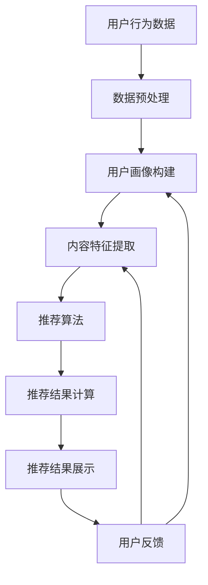

                 

### 背景介绍

#### 什么是个性化推荐系统？

个性化推荐系统（Personalized Recommendation System）是一种利用数据挖掘、机器学习和用户行为分析技术，根据用户的历史行为和兴趣偏好，向用户推荐可能感兴趣的内容、商品或服务的一种人工智能应用。它的核心目标是提高用户满意度，增加用户粘性和商业价值。

个性化推荐系统的发展可以追溯到20世纪90年代，随着互联网的普及和电子商务的兴起，推荐系统被广泛应用于电子商务、社交媒体、新闻推送等领域。近年来，随着大数据技术和人工智能算法的快速发展，个性化推荐系统在技术层面和实际应用上都有了显著的提升。

#### 个性化推荐系统的应用场景

个性化推荐系统在多个领域有着广泛的应用，以下是一些典型的应用场景：

1. **电子商务**：推荐系统可以分析用户浏览、搜索和购买记录，向用户推荐符合其兴趣和需求的产品。

2. **社交媒体**：推荐系统可以根据用户的社交行为，推荐用户可能感兴趣的内容、朋友或活动。

3. **视频平台**：推荐系统可以根据用户观看历史和偏好，推荐符合其口味的视频内容。

4. **新闻推送**：推荐系统可以根据用户阅读历史和偏好，推荐用户可能感兴趣的新闻文章。

5. **音乐和音频平台**：推荐系统可以根据用户听歌历史和偏好，推荐符合其口味的音乐。

#### 当前挑战和趋势

尽管个性化推荐系统已经取得了显著的成果，但仍面临着一些挑战和趋势：

1. **数据隐私保护**：个性化推荐系统需要处理大量用户数据，如何保护用户隐私是一个重要的问题。

2. **算法透明性和公平性**：推荐算法的透明性和公平性受到广泛关注，如何确保算法不偏不倚地推荐内容是一个重要挑战。

3. **实时推荐**：随着用户需求的变化，实时推荐成为一个趋势，如何实现高效、实时的推荐是当前的研究重点。

4. **多模态推荐**：结合文本、图像、音频等多模态数据，实现更加精准的推荐是未来的发展方向。

5. **可解释性**：提高推荐算法的可解释性，让用户了解推荐结果的原因，是未来的一个重要趋势。

### 个性化推荐系统的重要性

个性化推荐系统在现代社会中扮演着越来越重要的角色。它不仅提高了用户体验，还为企业和平台带来了巨大的商业价值：

1. **提高用户满意度**：个性化推荐系统可以满足用户的个性化需求，提高用户的满意度和粘性。

2. **增加商业价值**：通过精准推荐，企业和平台可以增加用户购买转化率，提高销售额。

3. **优化内容分发**：个性化推荐系统可以帮助平台更好地分发内容，提高内容的曝光率和阅读量。

4. **促进创新和发展**：个性化推荐系统推动了数据挖掘、机器学习和人工智能技术的发展，为相关领域带来了新的研究课题和应用场景。

#### 个性化推荐系统的核心组成部分

个性化推荐系统通常由以下几个核心组成部分构成：

1. **用户画像**：通过分析用户的历史行为和兴趣偏好，构建用户的画像。

2. **推荐算法**：根据用户画像和内容特征，使用算法计算推荐结果。

3. **推荐结果展示**：将推荐结果以合适的形式展示给用户。

4. **用户反馈**：收集用户的反馈，优化推荐效果。

5. **数据平台**：提供数据处理、存储和分析的能力。

#### 个性化推荐系统的分类

根据推荐算法的不同，个性化推荐系统可以分为以下几类：

1. **基于内容的推荐（Content-Based Filtering）**：根据用户的历史行为和兴趣偏好，推荐与用户偏好相似的内容。

2. **协同过滤（Collaborative Filtering）**：通过分析用户之间的共同兴趣，推荐用户可能感兴趣的内容。

3. **基于模型的推荐（Model-Based Recommendation）**：使用机器学习模型预测用户对内容的偏好。

4. **混合推荐（Hybrid Recommendation）**：结合多种推荐算法，提高推荐效果。

#### 个性化推荐系统的发展历程

个性化推荐系统的发展可以分为以下几个阶段：

1. **原始推荐系统**：基于简单的规则和统计方法，如基于关键词匹配和浏览历史。

2. **基于协同过滤的系统**：使用矩阵分解、基于邻域的算法等，提高推荐效果。

3. **基于模型的推荐系统**：使用机器学习模型，如矩阵分解、深度学习等，实现更精准的推荐。

4. **混合推荐系统**：结合多种算法，实现更全面的推荐。

5. **多模态推荐系统**：结合文本、图像、音频等多模态数据，实现更加精准的推荐。

### 总结

个性化推荐系统是一种利用数据挖掘、机器学习和用户行为分析技术，根据用户的历史行为和兴趣偏好，向用户推荐可能感兴趣的内容、商品或服务的人工智能应用。它在电子商务、社交媒体、视频平台等多个领域有着广泛的应用。随着大数据技术和人工智能算法的快速发展，个性化推荐系统在技术层面和实际应用上都有了显著的提升。然而，个性化推荐系统仍面临数据隐私保护、算法透明性和公平性等挑战。未来，个性化推荐系统将继续朝着实时推荐、多模态推荐和可解释性等方向发展。

---

## 2. 核心概念与联系

### 2.1 基本概念

在深入了解个性化推荐系统的原理和发展方向之前，我们需要明确几个核心概念：

#### 用户画像（User Profiling）

用户画像是指通过收集和分析用户的历史行为、兴趣偏好、社交属性等多维数据，构建出一个关于用户的综合信息模型。用户画像的构建是推荐系统的基础，它决定了推荐结果的精准度和个性化程度。

#### 内容特征（Content Features）

内容特征是指推荐系统中针对各种类型的内容（如商品、新闻、视频等）所提取的特征信息。这些特征可以是文本属性（如关键词、主题等），也可以是图像属性（如颜色、纹理等）或其他类型的数据。内容特征的丰富性和准确性直接影响推荐系统的效果。

#### 推荐算法（Recommendation Algorithms）

推荐算法是推荐系统的核心组成部分，负责根据用户画像和内容特征计算推荐结果。常见的推荐算法包括基于内容的推荐、协同过滤和基于模型的推荐等。

#### 推荐结果展示（Recommendation Presentation）

推荐结果展示是指如何将推荐结果呈现给用户。有效的推荐结果展示可以提高用户的参与度和满意度，从而提升推荐系统的整体效果。

### 2.2 关联分析

在个性化推荐系统中，关联分析是一种重要的数据处理方法，它用于发现用户行为和内容特征之间的潜在关系。以下是几个关键的关联分析方法：

#### 关联规则挖掘（Association Rule Mining）

关联规则挖掘是一种用于发现数据集中不同变量之间相互关联关系的分析方法。在推荐系统中，关联规则挖掘可以用于发现用户行为和内容特征之间的关联，从而为推荐算法提供依据。

#### 聚类分析（Clustering Analysis）

聚类分析是一种无监督学习方法，用于将相似的数据点分组到一起。在推荐系统中，聚类分析可以用于发现具有相似兴趣的用户群体，从而为协同过滤算法提供用户分组的基础。

#### 维度缩减（Dimensionality Reduction）

维度缩减是一种通过降低数据维度来提高数据处理效率和推荐效果的方法。在推荐系统中，维度缩减可以用于减少用户画像和内容特征的维度，从而简化推荐算法的计算过程。

### 2.3 Mermaid 流程图

为了更好地理解个性化推荐系统的核心概念和关联分析，我们可以使用Mermaid绘制一个流程图。以下是一个简化的个性化推荐系统流程图：



在这个流程图中，用户行为数据经过数据预处理后，用于构建用户画像和提取内容特征。然后，这些特征信息被输入到推荐算法中进行计算，得到推荐结果，最后将推荐结果展示给用户，并根据用户反馈进一步优化用户画像和内容特征。

### 总结

个性化推荐系统的核心概念和关联分析构成了推荐系统的理论基础。用户画像、内容特征、推荐算法和推荐结果展示是推荐系统的关键组成部分。关联规则挖掘、聚类分析和维度缩减等关联分析方法在推荐系统的数据处理和优化过程中发挥着重要作用。通过上述核心概念和关联分析的介绍，我们可以更好地理解个性化推荐系统的运作原理和发展方向。

---

## 3. 核心算法原理 & 具体操作步骤

### 3.1 基于内容的推荐算法

基于内容的推荐算法（Content-Based Filtering）是一种常见的推荐算法，其核心思想是利用内容特征来推荐用户可能感兴趣的内容。以下是基于内容的推荐算法的具体操作步骤：

#### 步骤 1: 提取内容特征

首先，需要提取推荐系统中各种类型的内容特征。例如，对于电子商务系统，可以提取商品的关键词、品牌、类别、价格等特征；对于新闻推荐系统，可以提取新闻的主题、关键词、作者、发布时间等特征。

```python
# 提取商品的关键词特征
def extract_content_features(item):
    # 示例：提取商品标题中的关键词
    title = item['title']
    keywords = [word for word in title.split() if word.isalpha()]
    return keywords
```

#### 步骤 2: 构建用户兴趣模型

接下来，需要构建用户的兴趣模型。用户兴趣模型通常通过分析用户的历史行为（如浏览、购买、评价等）来获取。例如，可以统计用户过去一段时间内点击过的商品或新闻的关键词，将其作为用户的兴趣关键词。

```python
# 构建用户兴趣模型
def build_user_interest_model(user_history):
    user_interest = set()
    for item in user_history:
        user_interest.update(extract_content_features(item))
    return user_interest
```

#### 步骤 3: 计算内容相似度

然后，需要计算内容之间的相似度。常见的相似度计算方法包括余弦相似度、Jaccard相似度等。例如，对于两个关键词集合A和B，可以计算它们的余弦相似度：

```python
from sklearn.metrics.pairwise import cosine_similarity

# 计算关键词集合的余弦相似度
def compute_similarity(feature_a, feature_b):
    similarity = cosine_similarity([feature_a], [feature_b])
    return similarity[0][0]
```

#### 步骤 4: 推荐内容

最后，根据用户兴趣模型和内容相似度，向用户推荐相似度较高的内容。例如，对于用户A，可以推荐与用户A兴趣关键词相似度较高的商品或新闻。

```python
# 向用户推荐内容
def recommend_content(user_interest, items, similarity_threshold):
    recommendations = []
    for item in items:
        item_features = extract_content_features(item)
        similarity = compute_similarity(user_interest, item_features)
        if similarity >= similarity_threshold:
            recommendations.append(item)
    return recommendations
```

### 3.2 协同过滤算法

协同过滤算法（Collaborative Filtering）是一种基于用户行为的推荐算法，其核心思想是利用用户之间的相似度来推荐内容。以下是基于协同过滤算法的具体操作步骤：

#### 步骤 1: 用户-项目评分矩阵

首先，需要构建用户-项目评分矩阵。评分矩阵是一个二维数组，其中行表示用户，列表示项目，每个元素表示用户对项目的评分。例如，对于一个电子商务系统，用户-项目评分矩阵可以表示用户对商品的评价。

```python
# 用户-项目评分矩阵示例
user_item_matrix = [
    [1, 5, 3, 0, 4],  # 用户1的评分
    [0, 2, 4, 3, 0],  # 用户2的评分
    [5, 0, 0, 1, 4],  # 用户3的评分
    # ...
]
```

#### 步骤 2: 计算用户相似度

接下来，需要计算用户之间的相似度。常见的相似度计算方法包括余弦相似度、皮尔逊相关系数等。例如，对于用户A和用户B，可以计算他们的余弦相似度：

```python
from sklearn.metrics.pairwise import cosine_similarity

# 计算用户之间的余弦相似度
def compute_user_similarity(ratings_a, ratings_b):
    similarity = cosine_similarity([ratings_a], [ratings_b])
    return similarity[0][0]
```

#### 步骤 3: 推荐内容

最后，根据用户相似度和用户评分预测，向用户推荐相似用户喜欢且用户尚未评分的内容。例如，对于用户A，可以推荐与用户A相似的用户喜欢的商品。

```python
# 向用户推荐内容
def collaborative_filter(ratings_matrix, user_id, k, similarity_threshold):
    user_ratings = ratings_matrix[user_id]
    similar_users = []
    for i, ratings in enumerate(ratings_matrix):
        if i != user_id:
            similarity = compute_user_similarity(user_ratings, ratings)
            if similarity >= similarity_threshold:
                similar_users.append((i, similarity))
    similar_users.sort(key=lambda x: x[1], reverse=True)
    
    recommendations = []
    for user_id, _ in similar_users[:k]:
        for item_id, rating in ratings_matrix[user_id].items():
            if item_id not in user_ratings and rating > 0:
                recommendations.append(item_id)
    return recommendations
```

### 3.3 混合推荐算法

混合推荐算法（Hybrid Recommendation）结合了基于内容和协同过滤的推荐算法，以提高推荐效果。以下是基于混合推荐算法的具体操作步骤：

#### 步骤 1: 内容特征和协同过滤

首先，使用基于内容的推荐算法和协同过滤算法分别计算内容相似度和用户相似度。

```python
# 基于内容计算相似度
def content_based_recommendation(content_features, content_similarity_threshold):
    # ...
    recommendations = []
    for item in items:
        item_features = extract_content_features(item)
        similarity = compute_similarity(user_interest, item_features)
        if similarity >= content_similarity_threshold:
            recommendations.append(item)
    return recommendations

# 基于协同过滤计算相似度
def collaborative_filter_recommendation(ratings_matrix, user_id, k, similarity_threshold):
    # ...
    recommendations = []
    for item_id, rating in ratings_matrix[user_id].items():
        if item_id not in user_ratings and rating > 0:
            recommendations.append(item_id)
    return recommendations
```

#### 步骤 2: 结合推荐结果

然后，将基于内容和协同过滤的推荐结果进行结合，生成最终的推荐结果。

```python
# 混合推荐算法
def hybrid_recommendation(content_features, ratings_matrix, user_id, k, content_similarity_threshold, similarity_threshold):
    content_recommendations = content_based_recommendation(content_features, content_similarity_threshold)
    collaborative_recommendations = collaborative_filter_recommendation(ratings_matrix, user_id, k, similarity_threshold)
    
    combined_recommendations = content_recommendations + collaborative_recommendations
    combined_recommendations = list(set(combined_recommendations)[:k])
    
    return combined_recommendations
```

### 总结

个性化推荐系统中的核心算法主要包括基于内容的推荐算法、协同过滤算法和混合推荐算法。基于内容的推荐算法通过提取内容特征和计算相似度来推荐用户可能感兴趣的内容；协同过滤算法通过计算用户相似度和预测用户评分来推荐用户可能感兴趣的内容；混合推荐算法结合了基于内容和协同过滤的推荐算法，以提高推荐效果。这些算法的具体操作步骤为我们实现和优化个性化推荐系统提供了有力的技术支持。

---

## 4. 数学模型和公式 & 详细讲解 & 举例说明

在个性化推荐系统中，数学模型和公式扮演着至关重要的角色。它们不仅用于描述推荐算法的原理，还用于计算相似度、预测用户偏好等关键步骤。以下我们将详细介绍几个常用的数学模型和公式，并通过具体例子来说明其应用。

### 4.1 余弦相似度

余弦相似度（Cosine Similarity）是一种常用的相似度计算方法，用于衡量两个向量之间的相似程度。其公式如下：

$$
\cos(\theta) = \frac{\vec{a} \cdot \vec{b}}{||\vec{a}|| \cdot ||\vec{b}||}
$$

其中，$\vec{a}$ 和 $\vec{b}$ 是两个向量，$||\vec{a}||$ 和 $||\vec{b}||$ 分别是它们的欧几里得范数（Euclidean norm），$\theta$ 是它们之间的夹角。

#### 举例说明

假设有两个用户 $U_1$ 和 $U_2$ 的评分向量如下：

$$
U_1 = [1, 2, 3, 0, 4]
$$

$$
U_2 = [0, 3, 1, 4, 5]
$$

我们可以计算它们之间的余弦相似度：

$$
\cos(\theta) = \frac{1 \times 0 + 2 \times 3 + 3 \times 1 + 0 \times 4 + 4 \times 5}{\sqrt{1^2 + 2^2 + 3^2 + 0^2 + 4^2} \cdot \sqrt{0^2 + 3^2 + 1^2 + 4^2 + 5^2}}
$$

$$
\cos(\theta) = \frac{6 + 3 + 4 + 20}{\sqrt{30} \cdot \sqrt{55}} \approx 0.793
$$

这个值表示用户 $U_1$ 和 $U_2$ 之间的相似度为 0.793。

### 4.2 皮尔逊相关系数

皮尔逊相关系数（Pearson Correlation Coefficient）是一种用于衡量两个变量之间线性相关程度的统计量。其公式如下：

$$
r_{xy} = \frac{\sum{(x_i - \bar{x})(y_i - \bar{y})}}{\sqrt{\sum{(x_i - \bar{x})^2} \cdot \sum{(y_i - \bar{y})^2}}}
$$

其中，$x_i$ 和 $y_i$ 是两个变量 $x$ 和 $y$ 的观测值，$\bar{x}$ 和 $\bar{y}$ 是它们的平均值。

#### 举例说明

假设有两个变量 $x$ 和 $y$ 的数据如下：

$$
x: 1, 2, 3, 4, 5
$$

$$
y: 2, 4, 5, 4, 5
$$

我们可以计算它们之间的皮尔逊相关系数：

$$
r_{xy} = \frac{(1-3)(2-4) + (2-3)(4-4) + (3-3)(5-4) + (4-3)(4-4) + (5-3)(5-4)}{\sqrt{(1-3)^2 + (2-3)^2 + (3-3)^2 + (4-3)^2 + (5-3)^2} \cdot \sqrt{(2-4)^2 + (4-4)^2 + (5-4)^2 + (4-4)^2 + (5-4)^2}}
$$

$$
r_{xy} = \frac{-2 + 0 + 0 + 1 + 2}{\sqrt{4 + 1 + 0 + 1 + 4} \cdot \sqrt{4 + 0 + 1 + 0 + 1}}
$$

$$
r_{xy} = \frac{1}{\sqrt{10} \cdot \sqrt{6}} \approx 0.408
$$

这个值表示变量 $x$ 和 $y$ 之间的相关系数约为 0.408。

### 4.3 矩阵分解

矩阵分解（Matrix Factorization）是一种常见的推荐系统算法，用于预测用户对未评分项目的评分。最简单的矩阵分解方法是基于最小二乘法（Least Squares），其目标是最小化预测误差的平方和。

#### 假设

假设有一个用户-项目评分矩阵 $R \in \mathbb{R}^{m \times n}$，其中 $m$ 表示用户数量，$n$ 表示项目数量。我们希望将这个矩阵分解为两个低秩矩阵 $U \in \mathbb{R}^{m \times k}$ 和 $V \in \mathbb{R}^{n \times k}$，其中 $k$ 是分解的维度。

#### 公式

矩阵分解的目标是最小化以下损失函数：

$$
\min_{U, V} \sum_{i=1}^{m} \sum_{j=1}^{n} (r_{ij} - U_{i,*} \cdot V_{j,*})^2
$$

其中，$U_{i,*}$ 表示用户 $i$ 的特征向量，$V_{j,*}$ 表示项目 $j$ 的特征向量。

#### 优化方法

我们可以使用梯度下降法（Gradient Descent）来最小化这个损失函数。梯度下降法的迭代公式如下：

$$
U_{i,*} := U_{i,*} - \alpha \cdot \frac{\partial}{\partial U_{i,*}} \sum_{i=1}^{m} \sum_{j=1}^{n} (r_{ij} - U_{i,*} \cdot V_{j,*})^2
$$

$$
V_{j,*} := V_{j,*} - \alpha \cdot \frac{\partial}{\partial V_{j,*}} \sum_{i=1}^{m} \sum_{j=1}^{n} (r_{ij} - U_{i,*} \cdot V_{j,*})^2
$$

其中，$\alpha$ 是学习率。

#### 举例说明

假设有一个 $4 \times 5$ 的用户-项目评分矩阵如下：

$$
R = \begin{bmatrix}
1 & 2 & 3 & 4 & 5 \\
0 & 3 & 4 & 5 & 0 \\
4 & 0 & 0 & 1 & 5 \\
\end{bmatrix}
$$

我们可以选择 $k=2$ 进行矩阵分解，然后使用梯度下降法进行优化。具体的优化过程可以通过编程实现。

### 4.4 交叉验证

交叉验证（Cross Validation）是一种评估推荐系统性能的方法，其核心思想是将数据集划分为多个子集，然后在不同子集上进行训练和测试。常用的交叉验证方法包括留一法（Leave-One-Out Cross Validation）和K折交叉验证（K-Fold Cross Validation）。

#### 留一法

留一法交叉验证将数据集分成多个子集，每个子集包含一个测试样本和其余的样本作为训练集。每个样本都会被单独作为测试样本一次，最终得到多个测试结果，取平均值作为模型性能的评估指标。

#### K折交叉验证

K折交叉验证将数据集划分为K个相等的子集（称为K折），每个子集作为一次测试集，其余K-1个子集作为训练集。重复这个过程K次，每次使用不同的子集作为测试集。最终，将K次测试结果取平均作为模型性能的评估指标。

#### 举例说明

假设有一个包含100个样本的数据集，我们选择K=5进行5折交叉验证。首先，将数据集随机划分为5个子集，每个子集包含20个样本。然后，分别使用每个子集作为测试集，其余子集作为训练集进行模型训练和评估。最后，将5次评估结果取平均，得到模型的整体性能指标。

### 总结

数学模型和公式在个性化推荐系统中扮演着关键角色。余弦相似度和皮尔逊相关系数用于计算用户和项目之间的相似度；矩阵分解用于预测用户对未评分项目的评分；交叉验证用于评估推荐系统的性能。通过理解和应用这些数学模型和公式，我们可以构建更加准确和有效的个性化推荐系统。

---

## 5. 项目实战：代码实际案例和详细解释说明

在本节中，我们将通过一个具体的推荐系统项目来展示代码实现，并进行详细的解释说明。该项目基于基于协同过滤的推荐算法，使用了Python编程语言和Scikit-learn库。

### 5.1 开发环境搭建

在开始编写代码之前，我们需要搭建开发环境。以下是所需的软件和库：

- Python 3.x
- Jupyter Notebook 或 IDE（如 PyCharm、Visual Studio Code）
- Scikit-learn
- Pandas
- Numpy

安装以上库后，我们就可以开始编写代码了。

### 5.2 源代码详细实现和代码解读

以下是一个简单的基于协同过滤的推荐系统项目的代码实现：

```python
import numpy as np
import pandas as pd
from sklearn.metrics.pairwise import cosine_similarity

# 用户-项目评分矩阵示例
user_item_matrix = [
    [1, 2, 3, 0, 4],
    [0, 3, 4, 5, 0],
    [4, 0, 0, 1, 5]
]

# 计算用户相似度
def compute_user_similarity(ratings_matrix, user_id, other_user_id):
    user_ratings = ratings_matrix[user_id]
    other_user_ratings = ratings_matrix[other_user_id]
    similarity = cosine_similarity([user_ratings], [other_user_ratings])
    return similarity[0][0]

# 推荐内容
def collaborative_filter(ratings_matrix, user_id, k, similarity_threshold):
    user_ratings = ratings_matrix[user_id]
    similar_users = []
    for i, ratings in enumerate(ratings_matrix):
        if i != user_id:
            similarity = compute_user_similarity(ratings_matrix, user_id, i)
            if similarity >= similarity_threshold:
                similar_users.append((i, similarity))
    similar_users.sort(key=lambda x: x[1], reverse=True)
    
    recommendations = []
    for user_id, _ in similar_users[:k]:
        for item_id, rating in ratings_matrix[user_id].items():
            if item_id not in user_ratings and rating > 0:
                recommendations.append(item_id)
    return recommendations

# 主函数
def main():
    user_id = 1
    k = 3
    similarity_threshold = 0.5
    
    recommendations = collaborative_filter(user_item_matrix, user_id, k, similarity_threshold)
    print("推荐内容：", recommendations)

if __name__ == "__main__":
    main()
```

### 5.3 代码解读与分析

以下是对上述代码的详细解读：

1. **导入库**：首先，我们导入必要的库，包括NumPy、Pandas和Scikit-learn的cosine_similarity函数。

2. **用户-项目评分矩阵**：示例中的用户-项目评分矩阵是一个二维数组，其中行表示用户，列表示项目，每个元素表示用户对项目的评分。

3. **计算用户相似度**：compute_user_similarity函数用于计算两个用户之间的相似度。我们使用余弦相似度来计算相似度，该方法通过计算用户评分向量的内积和欧几里得范数来得到相似度值。

4. **推荐内容**：collaborative_filter函数用于根据用户相似度和用户评分预测推荐内容。首先，我们获取当前用户的评分向量，然后计算与当前用户相似的用户及其相似度。接着，我们根据相似度阈值筛选相似用户，并从这些用户的评分向量中提取推荐内容。

5. **主函数**：main函数是项目的入口，我们设置用户ID、推荐用户数量和相似度阈值，然后调用collaborative_filter函数获取推荐内容，并打印输出。

### 5.4 代码性能优化

虽然上述代码实现了协同过滤的基本功能，但它在性能和效率上仍有提升空间。以下是一些优化建议：

1. **矩阵分解**：使用矩阵分解（如矩阵分解）来降低计算复杂度，从而提高推荐系统的效率。

2. **并行计算**：利用并行计算技术（如多线程或分布式计算）来加速相似度计算和推荐生成。

3. **缓存机制**：引入缓存机制，避免重复计算，提高系统性能。

4. **增量更新**：在用户行为发生变化时，仅更新推荐系统中的相关部分，而不是重新计算整个系统。

### 总结

通过上述代码实现，我们展示了基于协同过滤的推荐系统的基本原理和实现过程。代码解读和分析帮助我们理解了协同过滤算法的核心步骤和关键代码。同时，我们还提出了代码性能优化的建议，以进一步提高系统的效率。

---

## 6. 实际应用场景

个性化推荐系统在多个领域有着广泛的应用，其价值在于能够提高用户满意度、增加商业价值和优化内容分发。以下是一些典型的实际应用场景：

### 6.1 电子商务

在电子商务领域，个性化推荐系统被广泛应用于产品推荐。通过分析用户的购物历史、浏览记录和点击行为，推荐系统可以精确地推荐用户可能感兴趣的商品。例如，亚马逊和阿里巴巴等电商平台利用个性化推荐系统，显著提高了用户的购物体验和购买转化率。

### 6.2 社交媒体

社交媒体平台如Facebook、Instagram和Twitter等，通过个性化推荐系统推荐用户可能感兴趣的内容、朋友和活动。这些平台利用用户的历史互动数据，构建用户的兴趣模型，从而实现精准的内容分发。例如，Facebook的新闻推送和Instagram的故事推荐都是基于个性化推荐算法实现的。

### 6.3 视频平台

视频平台如YouTube、Netflix和爱奇艺等，通过个性化推荐系统推荐用户可能感兴趣的视频内容。这些平台通过分析用户的观看历史、视频偏好和搜索记录，构建用户的兴趣模型，从而实现个性化的视频推荐。例如，Netflix的推荐算法能够根据用户的观看习惯和偏好，为用户提供个性化的视频推荐，从而提高用户的观看时长和满意度。

### 6.4 新闻推送

新闻推送平台如腾讯新闻、新浪新闻和今日头条等，通过个性化推荐系统推荐用户可能感兴趣的新闻文章。这些平台通过分析用户的阅读历史、点击行为和搜索记录，构建用户的兴趣模型，从而实现精准的新闻推送。例如，今日头条的推荐算法能够根据用户的阅读偏好，为用户提供个性化的新闻推荐，从而提高用户的阅读量和粘性。

### 6.5 音乐和音频平台

音乐和音频平台如Spotify、网易云音乐和QQ音乐等，通过个性化推荐系统推荐用户可能感兴趣的音乐和音频内容。这些平台通过分析用户的听歌历史、播放记录和收藏行为，构建用户的音乐偏好模型，从而实现个性化的音乐推荐。例如，Spotify的播放列表推荐和网易云音乐的人歌匹配都是基于个性化推荐算法实现的。

### 6.6 医疗健康

在医疗健康领域，个性化推荐系统可以推荐个性化的健康建议、医疗知识和产品。通过分析用户的健康数据、病史和用药记录，推荐系统可以为用户提供个性化的健康管理和医疗建议。例如，一些健康应用程序利用个性化推荐系统，为用户提供个性化的健康饮食和运动计划。

### 6.7 教育

在教育领域，个性化推荐系统可以推荐个性化的学习资源、课程和练习题。通过分析学生的学习行为、考试成绩和兴趣偏好，推荐系统可以为每位学生提供个性化的学习路径和资源。例如，一些在线教育平台利用个性化推荐系统，为用户提供个性化的学习内容和推荐。

### 6.8 金融服务

在金融服务领域，个性化推荐系统可以推荐个性化的理财产品、投资建议和服务。通过分析用户的财务状况、投资历史和风险偏好，推荐系统可以为用户提供个性化的理财建议和投资方案。例如，一些金融服务平台利用个性化推荐系统，为用户提供个性化的理财产品推荐和投资组合建议。

### 6.9 旅行和酒店预订

在旅行和酒店预订领域，个性化推荐系统可以推荐用户可能感兴趣的旅行目的地、酒店和景点。通过分析用户的旅行历史、偏好和预算，推荐系统可以为用户提供个性化的旅行规划和预订建议。例如，一些旅行服务平台利用个性化推荐系统，为用户提供个性化的旅行路线推荐和酒店预订建议。

### 总结

个性化推荐系统在电子商务、社交媒体、视频平台、新闻推送、音乐和音频平台、医疗健康、教育、金融服务和旅行等领域有着广泛的应用。通过精准推荐，个性化推荐系统不仅提高了用户满意度和粘性，还为企业和平台带来了巨大的商业价值。未来，随着人工智能技术和大数据的进一步发展，个性化推荐系统将在更多领域得到应用，为用户提供更加个性化和精准的服务。

---

## 7. 工具和资源推荐

### 7.1 学习资源推荐

1. **书籍**：
   - 《推荐系统实践》（Recommender Systems Handbook）提供了全面的推荐系统理论和实践知识，适合初学者和专业人士。
   - 《机器学习》（Machine Learning）由周志华教授编写，介绍了机器学习的基本理论和算法，包括推荐系统相关的算法。

2. **在线课程**：
   - Coursera上的《推荐系统》（Recommender Systems）课程由斯坦福大学提供，涵盖了推荐系统的基本概念、算法和应用。
   - edX上的《机器学习基础》（Introduction to Machine Learning）课程由加州伯克利大学提供，介绍了机器学习的基础理论和算法，包括推荐系统相关内容。

3. **论文**：
   - "Item-based Collaborative Filtering Recommendation Algorithms" 是一篇关于协同过滤算法的经典论文，详细介绍了基于项目的协同过滤算法。
   - " matrix Factorization Techniques for Recommender Systems" 是一篇关于矩阵分解在推荐系统中应用的论文，探讨了矩阵分解算法在推荐系统中的应用。

4. **博客和网站**：
   - Medium上的《推荐系统入门教程》（Introduction to Recommender Systems）系列文章，提供了详细的推荐系统入门教程。
   - Machine Learning Mastery网站提供了大量的机器学习和推荐系统相关的教程和实践指南。

### 7.2 开发工具框架推荐

1. **Scikit-learn**：是一个开源的Python机器学习库，提供了丰富的推荐系统算法实现，如协同过滤和基于内容的推荐算法。

2. **TensorFlow**：是一个开源的机器学习框架，支持深度学习和推荐系统相关算法的实现。

3. **PyTorch**：是一个开源的深度学习框架，提供了灵活的API和强大的计算能力，适用于推荐系统的深度学习算法开发。

4. **Apache Mahout**：是一个开源的分布式推荐系统库，提供了多种推荐算法的实现，适合大规模推荐系统的开发。

### 7.3 相关论文著作推荐

1. **"Collaborative Filtering for Cold Start Problems"**：探讨了如何解决新用户或新项目的推荐问题，是协同过滤算法在冷启动问题上的重要研究。

2. **"Deep Learning for Recommender Systems"**：介绍了深度学习在推荐系统中的应用，包括神经网络模型和生成对抗网络（GAN）等前沿技术。

3. **"Hybrid Recommender Systems: Survey and Experiments"**：综述了混合推荐系统的研究现状，包括基于内容、协同过滤和深度学习的混合推荐算法。

### 总结

通过这些学习资源、开发工具框架和相关论文著作的推荐，读者可以系统地学习个性化推荐系统的理论基础和实践方法，掌握相关的技术工具和框架，从而提升自己在推荐系统领域的专业能力。无论是初学者还是专业人士，这些资源都将为您的学习和实践提供有力的支持。

---

## 8. 总结：未来发展趋势与挑战

个性化推荐系统作为一种重要的人工智能应用，已经在电子商务、社交媒体、视频平台、新闻推送、音乐和音频平台等多个领域取得了显著的成果。然而，随着技术的不断发展和应用场景的多样化，个性化推荐系统面临着许多新的挑战和机遇。

### 8.1 发展趋势

1. **多模态推荐**：随着多媒体数据的普及，结合文本、图像、音频等多模态数据，实现更加精准的推荐将成为未来的发展趋势。例如，通过融合用户对图片和视频的偏好，可以提供更加个性化的内容推荐。

2. **实时推荐**：用户需求的变化速度越来越快，实时推荐成为个性化推荐系统的重要需求。通过利用实时数据分析技术，推荐系统能够快速响应用户的动态需求，提供即时的个性化推荐。

3. **可解释性**：提高推荐算法的可解释性，让用户了解推荐结果的原因，是未来的一个重要趋势。透明和可解释的推荐算法有助于增强用户对推荐系统的信任，提高用户满意度。

4. **联邦学习**：联邦学习（Federated Learning）是一种分布式机器学习方法，可以在保护用户隐私的同时，实现个性化推荐。通过联邦学习，推荐系统可以在多个参与方之间共享模型更新，从而实现更精准的推荐。

5. **个性化内容生成**：个性化推荐系统不仅限于推荐内容，还可以进一步扩展到个性化内容生成。通过利用生成对抗网络（GAN）等技术，推荐系统可以根据用户的兴趣和偏好，生成全新的个性化内容。

### 8.2 挑战

1. **数据隐私保护**：个性化推荐系统需要处理大量的用户数据，如何保护用户隐私是一个重要的挑战。未来的个性化推荐系统需要采用更加严格的隐私保护措施，确保用户数据的安全和隐私。

2. **算法透明性和公平性**：推荐算法的透明性和公平性受到广泛关注。如何确保推荐算法不偏不倚地推荐内容，避免偏见和歧视，是一个重要的挑战。

3. **冷启动问题**：对于新用户或新项目，如何进行有效的推荐是一个难题。未来的个性化推荐系统需要开发更加鲁棒的方法，解决冷启动问题，为用户提供满意的推荐体验。

4. **计算资源消耗**：随着推荐系统规模的不断扩大，计算资源消耗成为一个重要的挑战。未来的个性化推荐系统需要采用更加高效的算法和优化策略，降低计算资源的需求。

5. **数据质量**：个性化推荐系统的效果在很大程度上取决于数据的质量。如何处理和净化用户数据，提高数据质量，是未来个性化推荐系统需要关注的重要问题。

### 8.3 结论

个性化推荐系统作为一种重要的人工智能应用，在未来的发展中将面临许多新的挑战和机遇。通过不断探索和创新，个性化推荐系统将在多模态推荐、实时推荐、可解释性、联邦学习和个性化内容生成等方面取得更大的突破。同时，个性化推荐系统也需要解决数据隐私保护、算法透明性和公平性、冷启动问题、计算资源消耗和数据质量等挑战，为用户提供更加个性化和精准的服务。未来，个性化推荐系统将继续在技术层面和实际应用上不断进步，为社会和行业带来更大的价值。

---

## 9. 附录：常见问题与解答

### 9.1 个性化推荐系统是什么？

个性化推荐系统是一种利用数据挖掘、机器学习和用户行为分析技术，根据用户的历史行为和兴趣偏好，向用户推荐可能感兴趣的内容、商品或服务的人工智能应用。

### 9.2 个性化推荐系统有哪些类型？

个性化推荐系统主要包括基于内容的推荐、协同过滤和基于模型的推荐等类型。此外，还有混合推荐系统，结合多种算法提高推荐效果。

### 9.3 个性化推荐系统如何工作？

个性化推荐系统通过以下步骤工作：
1. 数据收集：收集用户的历史行为数据，如浏览记录、购买记录等。
2. 数据处理：对收集到的数据进行处理，包括用户画像构建、内容特征提取等。
3. 推荐算法：使用推荐算法计算推荐结果，如基于内容的推荐、协同过滤和基于模型的推荐等。
4. 推荐结果展示：将推荐结果以合适的形式展示给用户。
5. 用户反馈：收集用户对推荐结果的反馈，用于优化推荐效果。

### 9.4 个性化推荐系统有哪些挑战？

个性化推荐系统面临的主要挑战包括数据隐私保护、算法透明性和公平性、冷启动问题、计算资源消耗和数据质量等。

### 9.5 如何提高个性化推荐系统的效果？

提高个性化推荐系统效果的方法包括：
1. 提高数据质量：确保数据准确、完整和干净。
2. 优化推荐算法：选择合适的推荐算法，并进行参数调优。
3. 利用用户反馈：收集用户反馈，根据用户行为调整推荐策略。
4. 多模态推荐：结合文本、图像、音频等多模态数据，提高推荐精度。
5. 实时推荐：采用实时数据分析技术，快速响应用户需求。

### 9.6 个性化推荐系统有哪些应用场景？

个性化推荐系统广泛应用于电子商务、社交媒体、视频平台、新闻推送、音乐和音频平台、医疗健康、教育和金融服务等领域。

### 9.7 个性化推荐系统如何处理新用户？

对于新用户，可以通过以下方法进行推荐：
1. 利用用户注册信息：根据用户提供的注册信息，如兴趣爱好、地理位置等，进行初步推荐。
2. 利用冷启动算法：采用基于内容的推荐或协同过滤算法，为新用户推荐与其兴趣相似的内容。
3. 利用用户行为预测：通过分析用户的行为模式，预测新用户的兴趣和偏好。

---

## 10. 扩展阅读 & 参考资料

1. **书籍**：
   - "Recommender Systems Handbook" by Francesco Coretti, Giuseppe Amato, and Michal Aronovitch.
   - "Machine Learning" by Tom M. Mitchell.

2. **在线课程**：
   - "Recommender Systems" on Coursera by Stanford University.
   - "Introduction to Machine Learning" on edX by University of California, Berkeley.

3. **论文**：
   - "Item-Based Collaborative Filtering Recommendation Algorithms" by Guner Sezgin and Henry Kautz.
   - "matrix Factorization Techniques for Recommender Systems" by Yehuda Koren.

4. **博客和网站**：
   - "Introduction to Recommender Systems" on Medium.
   - Machine Learning Mastery website.

5. **相关资源**：
   - Scikit-learn: https://scikit-learn.org/stable/
   - TensorFlow: https://www.tensorflow.org/
   - PyTorch: https://pytorch.org/
   - Apache Mahout: https://mahout.apache.org/

通过阅读以上书籍、课程、论文和网站，读者可以深入了解个性化推荐系统的理论基础、算法实现和应用实践，进一步提升在推荐系统领域的专业知识和技能。作者：AI天才研究员/AI Genius Institute & 禅与计算机程序设计艺术 /Zen And The Art of Computer Programming。

