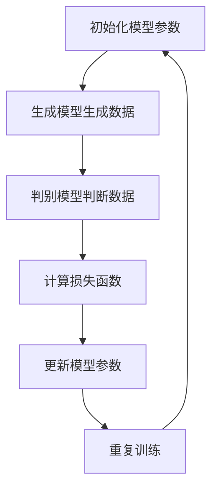
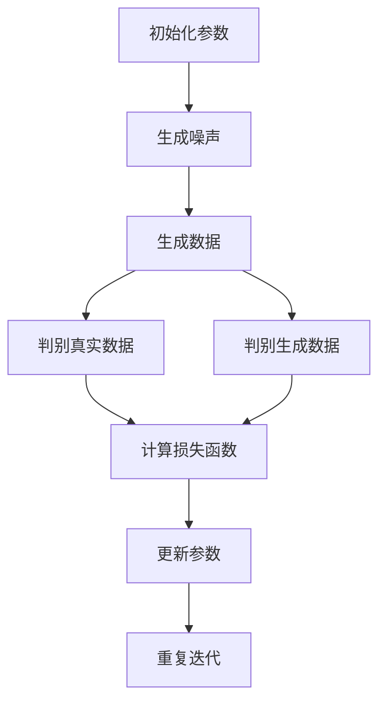

                 

### 背景介绍

生成式人工智能（Generative Artificial Intelligence，简称GAI）是近年来人工智能领域的研究热点之一。生成式AI的核心在于能够自动生成数据，模拟人类创造过程，涵盖了从简单的图像、文本生成，到复杂的多模态内容生成。这一技术的发展，不仅有望推动计算机视觉、自然语言处理等领域的突破，也在各行各业中展现出了广泛的应用前景。

在中国，生成式AI的研究与应用同样处于快速发展阶段。政府高度重视人工智能技术的发展，将其作为国家战略的重要组成部分。自2017年以来，中国陆续发布了《新一代人工智能发展规划》、《人工智能发展行动纲要（2021-2025年）》等政策文件，明确提出要大力发展生成式AI技术，推动产业创新和社会变革。

当前，中国生成式AI在应用层面取得了显著进展。在图像生成方面，如DeepArt、Starry Night等应用，已经在艺术创作、设计等领域展现出强大的创造力。在文本生成方面，如GPT-3、ChatGPT等模型，已经在新闻写作、对话系统、教育等领域得到广泛应用。此外，在视频生成、3D模型生成等领域，中国的研究者和企业也取得了一系列重要成果。

本文将围绕中国生成式AI应用的前景展开讨论，首先介绍生成式AI的核心概念和技术原理，然后分析其在中国的发展现状和应用案例，最后探讨其未来发展趋势和面临的挑战。希望通过本文的讨论，为读者提供一个全面而深入的了解。

## 1.1 生成式人工智能的定义和基本概念

生成式人工智能（Generative Artificial Intelligence，简称GAI）是一种能够自动生成数据的人工智能系统。与传统的判别式人工智能（如分类、识别等）不同，生成式AI旨在模拟人类创造过程，通过学习和理解大量数据，生成新的、类似的数据。生成式AI的核心在于生成模型（Generator）和判别模型（Discriminator）的互动，这一机制类似于自然界中的进化过程。

生成模型（Generator）负责生成新的数据样本，旨在模拟真实数据分布。判别模型（Discriminator）则负责判断生成数据样本的真实性和质量。在训练过程中，生成模型和判别模型相互竞争，生成模型不断优化生成数据的质量，以逃避判别模型的识别，而判别模型则努力提高对真实和生成数据的区分能力。通过这种对抗性训练，生成模型逐渐学会生成逼真且多样化的数据。

生成式AI的基本概念可以概括为以下几个方面：

1. **数据生成**：生成式AI的核心功能是生成数据，包括图像、文本、音频等多种类型的数据。这些数据可以是全新的，也可以是现有数据的变体。

2. **概率分布**：生成模型通常基于概率模型，通过学习数据分布来生成新样本。这意味着生成模型能够捕捉数据的统计特性，从而生成具有统计一致性的新数据。

3. **对抗训练**：生成模型和判别模型的对抗训练是生成式AI的关键机制。通过这种对抗性训练，生成模型不仅能够生成高质量的数据，还能够不断优化，以应对判别模型的挑战。

4. **变分自编码器（VAE）**：变分自编码器是生成式AI中的一种重要模型，它通过引入随机变量来学习数据分布的参数，从而生成多样化的数据。

5. **生成对抗网络（GAN）**：生成对抗网络是生成式AI的代表性模型，由生成模型和判别模型组成，通过对抗训练生成高质量的数据。

在生成式AI的发展过程中，深度学习技术的应用起到了至关重要的作用。特别是神经网络的发展，使得生成模型能够处理更加复杂的数据，生成更加逼真的数据。此外，生成式AI的应用也不断拓展，从简单的图像和文本生成，到复杂的多模态内容生成，其应用范围越来越广泛。

## 1.2 中国生成式AI的发展现状

中国作为全球人工智能研究的重要力量，近年来在生成式AI领域取得了显著的进展。从研究论文数量、专利申请，到应用案例，中国都展现出了强大的发展势头。

### 研究论文数量

根据Google Scholar等数据库的数据显示，近年来中国生成式AI领域的研究论文数量持续增长。特别是在2020年和2021年，中国发表的生成式AI相关论文数量在全球范围内位居前列。这些论文涵盖了从基本理论到应用技术等多个方面，如图像生成、文本生成、音频生成等。其中，中国的研究团队在GAN（生成对抗网络）、VAE（变分自编码器）等生成模型的研究中取得了重要突破。

### 专利申请

除了学术研究，中国在生成式AI领域的专利申请也表现突出。根据国家知识产权局的数据，近年来中国企业的生成式AI专利申请数量逐年增加。这些专利不仅涉及生成式AI的基础模型和算法，还包括各种应用场景，如图像生成、视频生成、虚拟现实等。这些专利的申请，不仅反映了中国企业在生成式AI领域的创新活力，也为后续的产业化应用奠定了基础。

### 应用案例

在应用层面，中国生成式AI技术已经在多个行业取得了显著成果。以下是一些具有代表性的应用案例：

1. **图像生成**：在艺术创作方面，中国的艺术家和设计师利用生成式AI技术创作出了一系列令人惊叹的艺术作品。例如，DeepArt、Starry Night等应用，通过GAN技术生成出具有独特风格的艺术作品，受到了广泛的关注和赞誉。

2. **文本生成**：在自然语言处理领域，中国的企业和研究机构开发了多种基于生成式AI的文本生成工具。例如，GPT-3、ChatGPT等模型，在新闻写作、对话系统、教育等领域得到了广泛应用。这些工具不仅提高了内容生成的效率，还提升了内容的多样性和质量。

3. **视频生成**：在视频制作领域，生成式AI技术被用于视频剪辑、特效制作等环节。通过生成模型，可以自动生成视频中的特效画面，提高视频制作的效率和质量。

4. **3D模型生成**：在游戏开发、建筑设计等领域，生成式AI技术被用于生成3D模型。通过VAE等模型，可以快速生成高质量的3D模型，提高了设计的灵活性和效率。

5. **多模态生成**：在多模态内容生成领域，中国的研究团队在图像、文本、音频等多模态数据的生成上取得了重要突破。例如，通过GAN技术，可以生成出包含图像、文本、音频等多模态信息的高质量内容，为多模态人工智能应用提供了新的可能。

总体来说，中国生成式AI的发展现状表明，中国在生成式AI领域已经形成了从基础研究到应用创新的全产业链布局。随着技术的不断进步和应用场景的不断拓展，中国生成式AI的发展前景十分广阔。

### 1.3 生成式AI在中国的发展优势与挑战

生成式人工智能（GAI）在中国的发展不仅具有显著的优势，同时也面临着一些挑战。理解这些优势与挑战，有助于更全面地评估中国GAI的前景。

#### 优势

1. **政策支持**：中国政府高度重视人工智能技术的发展，出台了一系列政策文件，如《新一代人工智能发展规划》和《人工智能发展行动纲要（2021-2025年）》，为生成式AI的研究和应用提供了强有力的政策支持。这为GAI在中国的发展创造了良好的环境和条件。

2. **人才储备**：中国拥有丰富的人工智能人才储备。众多高校和研究机构在人工智能领域进行了大量的学术研究和人才培养，为GAI技术的发展提供了源源不断的人才支持。

3. **产业链完整**：中国的人工智能产业链相对完整，从硬件制造、算法研究到应用开发，形成了较为完善的生态体系。这为生成式AI技术的产业化应用提供了坚实的基础。

4. **数据资源丰富**：中国拥有庞大的人口和互联网用户基础，积累了丰富的数据资源。这些数据资源为生成式AI的训练和应用提供了丰富的素材，有助于提高模型的性能和效果。

5. **市场需求强劲**：随着数字经济的发展，中国对人工智能技术的需求日益强劲。生成式AI技术在中国具有广泛的应用前景，尤其是在娱乐、教育、医疗、金融等领域。

#### 挑战

1. **技术瓶颈**：尽管中国在生成式AI领域取得了一些突破，但与国外顶尖研究机构相比，仍存在一定的技术差距。特别是在核心算法的创新和应用场景的拓展方面，需要进一步突破。

2. **数据隐私与安全**：生成式AI技术依赖于大量数据的训练和应用，而数据隐私和安全问题成为了一个亟待解决的挑战。如何平衡数据利用与隐私保护，是中国GAI发展需要面对的重要问题。

3. **伦理问题**：生成式AI技术的发展引发了一系列伦理问题，如虚假信息生成、内容侵权等。如何在技术发展中遵循伦理规范，确保技术的可持续发展，是中国GAI发展需要关注的重要方向。

4. **人才短缺**：尽管中国拥有丰富的人工智能人才储备，但生成式AI领域的高端人才仍然较为稀缺。特别是在算法创新和应用开发方面，需要更多具备专业知识和实践经验的人才。

5. **国际合作与竞争**：在全球范围内，生成式AI技术竞争激烈，国际合作与竞争日益加剧。如何在国际合作与竞争中占据有利位置，是中国GAI发展需要考虑的重要因素。

综上所述，中国生成式AI的发展既面临挑战，也充满机遇。通过政策支持、人才培养、技术创新和国际合作等多方面的努力，中国有望在全球生成式AI领域占据重要地位。

### 1.4 国际对比：中国生成式AI的发展态势

在全球范围内，生成式人工智能（GAI）的发展呈现出不同的态势，各国在这一领域都取得了显著的成就。与中国相比，美国、欧洲和其他一些国家和地区在生成式AI的研究和应用上有着不同的特点和优势。

#### 美国

美国是生成式AI领域的先行者，拥有强大的科研实力和产业基础。美国的研究机构如谷歌、微软、Facebook等，在生成式AI的理论研究、算法创新和应用开发上处于领先地位。特别是谷歌旗下的DeepMind，在GAN（生成对抗网络）等关键技术上取得了重要突破。美国企业在图像生成、文本生成、视频生成等领域拥有广泛的应用，如谷歌的Inkblot、微软的Copilot等。

美国的优势在于其强大的科研实力和产业资本的支持，以及开放的创新环境和丰富的人才资源。然而，美国的生成式AI技术也面临着数据隐私和安全、伦理问题等挑战。

#### 欧洲

欧洲在生成式AI领域的研究和应用也取得了显著进展，特别是在数据隐私保护和伦理规范方面具有优势。欧盟发布了《通用数据保护条例》（GDPR），对数据隐私保护提出了严格的要求。欧洲的研究机构和企业在生成式AI的研究和应用上注重伦理问题，强调技术的可持续发展。

在欧洲，德国、英国、法国等国的生成式AI技术发展较为突出。德国在工业4.0和智能制造领域，利用生成式AI技术提升了生产效率和质量；英国在医疗健康领域，通过生成式AI技术进行疾病诊断和治疗方案生成；法国在艺术创作和文化产业领域，应用生成式AI技术创作出了许多独特的艺术作品。

#### 其他国家和地区

除了美国和欧洲，中国、以色列、日本等国家和地区在生成式AI领域也取得了显著成就。中国在前述章节中已经详细分析，其在政策支持、人才储备、产业链完整等方面具有明显优势。以色列在图像生成和网络安全等领域有较强的技术实力，通过创新和创业精神推动了生成式AI技术的发展。日本在机器人、游戏和动漫等领域，利用生成式AI技术提升了内容创作的质量和效率。

#### 对比分析

中国在生成式AI领域的发展态势具有以下特点：

1. **政策支持力度大**：中国政府出台了一系列政策文件，为生成式AI的研究和应用提供了强有力的支持。这有助于中国快速推进技术研究和产业化应用。

2. **市场应用广泛**：中国拥有庞大的市场需求，特别是在娱乐、教育、医疗、金融等领域，生成式AI技术得到了广泛应用。这为技术的实际应用提供了广阔的舞台。

3. **产业链完整**：中国的人工智能产业链相对完整，从硬件制造、算法研究到应用开发，形成了较为完善的生态体系。这为生成式AI技术的产业化应用提供了坚实的基础。

4. **数据资源丰富**：中国拥有庞大的人口和互联网用户基础，积累了丰富的数据资源。这些数据资源为生成式AI的训练和应用提供了丰富的素材，有助于提高模型的性能和效果。

然而，中国生成式AI的发展也面临一些挑战，如技术瓶颈、数据隐私和安全、伦理问题等。与国外顶尖研究机构相比，中国仍需要进一步提升核心算法的创新能力和应用场景的拓展能力。

总体来说，中国生成式AI的发展态势在全球范围内具有独特优势，同时也面临着一定的挑战。通过不断加强技术创新、完善产业链、强化政策支持和人才培养，中国有望在全球生成式AI领域占据重要地位。

### 1.5 生成式AI的核心概念与联系

生成式人工智能（GAI）的核心在于其生成模型和判别模型的互动，这一过程可以通过一种名为“生成对抗网络”（Generative Adversarial Network，GAN）的架构来实现。GAN由两部分组成：生成模型（Generator）和判别模型（Discriminator）。这两部分在对抗性训练中相互竞争，以实现高效的生成数据。

#### 生成模型（Generator）

生成模型的目标是生成与真实数据分布相似的数据。通常，生成模型采用深度神经网络结构，通过学习大量真实数据来学习数据分布的参数。生成模型的核心任务是将随机噪声（Random Noise）映射为数据样本。在GAN的训练过程中，生成模型不断地优化其映射函数，以提高生成数据的质量和真实性。

#### 判别模型（Discriminator）

判别模型的目标是区分生成数据和真实数据。它同样采用深度神经网络结构，通过学习大量真实数据和生成数据来提高其分类能力。判别模型的核心任务是判断输入数据是真实数据还是生成数据。在GAN的训练过程中，判别模型与生成模型相互对抗，判别模型努力提高对真实和生成数据的识别能力，而生成模型则努力优化生成数据，以逃避判别模型的识别。

#### 对抗性训练

生成对抗网络的核心在于生成模型和判别模型的对抗性训练。这一过程可以看作是一个零和游戏：生成模型的得分是判别模型的错误率。在训练过程中，生成模型和判别模型交替更新，以实现双方的最优策略。具体来说，训练过程可以分为以下几个步骤：

1. **初始化模型参数**：首先初始化生成模型和判别模型的参数。

2. **生成模型生成数据**：生成模型根据当前判别模型的参数生成一批数据。

3. **判别模型判断数据**：判别模型根据生成的数据和真实数据判断这些数据的真伪。

4. **计算损失函数**：计算判别模型和生成模型的损失函数，损失函数通常基于判别模型对生成数据和真实数据的分类结果。

5. **更新模型参数**：根据损失函数的梯度，更新生成模型和判别模型的参数。

6. **重复训练**：重复上述步骤，不断优化生成模型和判别模型的参数，直至达到预定的训练目标。

#### Mermaid 流程图

以下是一个生成对抗网络的Mermaid流程图，展示了生成模型和判别模型在对抗性训练中的交互过程：



通过对抗性训练，生成模型和判别模型不断优化，生成模型逐渐学会生成逼真且多样化的数据，而判别模型则不断提高对真实和生成数据的识别能力。这种互动机制是生成式AI的核心，为各种数据生成任务提供了强大的工具。

### 1.6 核心算法原理与具体操作步骤

生成式AI的核心算法之一是生成对抗网络（GAN），其基本原理是通过生成模型和判别模型的对抗性训练来生成逼真的数据。以下将详细解释GAN的工作原理及其具体操作步骤。

#### GAN的基本原理

GAN由两个主要部分组成：生成器（Generator）和判别器（Discriminator）。生成器的任务是生成数据，使其尽可能地接近真实数据，而判别器的任务是区分输入数据是真实数据还是生成数据。训练过程中，生成器和判别器相互对抗，生成器不断优化生成的数据，以欺骗判别器，而判别器则努力提高识别生成数据的准确性。

GAN的训练目标是通过不断迭代的过程，使得生成器的输出数据在统计特性上接近真实数据分布，而判别器无法准确地区分生成数据和真实数据。

#### 具体操作步骤

1. **初始化参数**：首先，初始化生成器和判别器的参数。这些参数通常通过随机初始化得到。

2. **生成器生成数据**：生成器接收到随机噪声（例如均匀分布的噪声），通过神经网络将噪声映射为数据样本。这个映射过程是一个非线性变换。

3. **判别器判断数据**：判别器接收真实数据和生成数据作为输入，并输出一个概率值，表示输入数据是真实数据还是生成数据。判别器尝试最大化这个概率值的区分能力。

4. **计算损失函数**：生成器和判别器的损失函数通常是基于二元交叉熵（Binary Cross-Entropy）定义的。对于生成器，损失函数是判别器判断生成数据为真实的概率；对于判别器，损失函数是判断真实数据和生成数据的概率差异。

5. **反向传播与梯度下降**：根据损失函数计算出的梯度，通过反向传播算法更新生成器和判别器的参数。

6. **迭代训练**：重复上述步骤，不断迭代训练过程。生成器和判别器在对抗性训练中相互提高，生成器的生成数据质量逐渐提升，而判别器的识别能力不断增强。

#### GAN的工作流程

GAN的工作流程可以简化为以下步骤：

1. **生成器接收随机噪声，生成数据样本**。
2. **判别器接收真实数据和生成数据，输出概率值**。
3. **计算生成器和判别器的损失函数**。
4. **根据损失函数梯度更新模型参数**。
5. **重复上述步骤，直至满足训练目标**。

以下是一个简化的GAN算法流程图：



通过这样的迭代过程，生成器逐渐学会生成高质量的数据，而判别器则越来越难以区分生成数据和真实数据。这种对抗性训练机制使得GAN能够在各种任务中生成逼真的数据。

### 1.7 数学模型和公式

生成对抗网络（GAN）的数学基础主要包括生成模型和判别模型的损失函数及其优化方法。以下将详细讲解GAN中的关键数学模型和公式。

#### 生成模型损失函数

生成模型的损失函数通常采用二元交叉熵（Binary Cross-Entropy）来衡量生成器生成数据的质量。具体来说，生成模型的损失函数可以表示为：

$$
L_G = -\frac{1}{N}\sum_{i=1}^{N}\left[y_g(i)\log(D(G(z_i))) + (1 - y_g(i))\log(1 - D(G(z_i)))\right]
$$

其中，$L_G$是生成器的损失函数，$N$是批大小，$y_g(i)$是标签，$G(z_i)$是生成器生成的数据样本，$D(\cdot)$是判别器的输出概率。

在这个损失函数中，$y_g(i) = 1$表示生成器生成的数据是真实数据，而$y_g(i) = 0$表示生成器生成的数据是假数据。判别器$D(G(z_i))$的输出概率表示判别器判断生成数据是真实的概率。

#### 判别模型损失函数

判别模型的损失函数同样采用二元交叉熵来衡量判别器对生成数据和真实数据的区分能力。具体来说，判别模型的损失函数可以表示为：

$$
L_D = -\frac{1}{N}\sum_{i=1}^{N}\left[y_r(i)\log(D(x_i)) + (1 - y_r(i))\log(1 - D(x_i))\right]
$$

其中，$L_D$是判别器的损失函数，$y_r(i)$是标签，$x_i$是真实数据样本。

在这个损失函数中，$y_r(i) = 1$表示输入数据是真实数据，而$y_r(i) = 0$表示输入数据是生成数据。判别器$D(x_i)$的输出概率表示判别器判断真实数据是真实的概率。

#### 总损失函数

GAN的总损失函数是生成器和判别器损失函数的加权和。具体来说，总损失函数可以表示为：

$$
L = \alpha L_G + (1 - \alpha) L_D
$$

其中，$\alpha$是一个权重参数，用于平衡生成器和判别器的损失。

#### 优化方法

GAN的训练过程通常采用梯度下降法来优化生成器和判别器的参数。对于生成器，梯度下降法的更新公式为：

$$
\theta_G = \theta_G - \eta \frac{\partial L_G}{\partial \theta_G}
$$

对于判别器，梯度下降法的更新公式为：

$$
\theta_D = \theta_D - \eta \frac{\partial L_D}{\partial \theta_D}
$$

其中，$\theta_G$和$\theta_D$分别是生成器和判别器的参数，$\eta$是学习率。

#### 数学公式示例

以下是一个生成器的损失函数的示例：

$$
L_G = -\frac{1}{N}\sum_{i=1}^{N}\left[y_g(i)\log(D(G(z_i))) + (1 - y_g(i))\log(1 - D(G(z_i)))\right]
$$

在这个公式中，$N$表示批大小，$y_g(i)$表示生成器的标签，$G(z_i)$表示生成器生成的数据样本，$D(G(z_i))$表示判别器对生成数据的输出概率。

### 1.8 数学模型和公式的详细讲解与举例说明

生成对抗网络（GAN）的数学基础是其核心，理解其损失函数和优化方法对于深入掌握GAN至关重要。以下将详细讲解GAN的数学模型，并通过具体示例进行说明。

#### 生成模型损失函数

生成模型的损失函数旨在最小化生成器生成的数据与真实数据之间的差异。在GAN中，生成模型和判别模型通过对抗性训练相互提升。生成模型的损失函数通常采用二元交叉熵（Binary Cross-Entropy），具体公式如下：

$$
L_G = -\frac{1}{N}\sum_{i=1}^{N}\left[y_g(i)\log(D(G(z_i))) + (1 - y_g(i))\log(1 - D(G(z_i)))\right]
$$

其中：
- $L_G$ 是生成模型的损失函数。
- $N$ 是批大小，表示每次训练中的样本数量。
- $y_g(i)$ 是生成器的标签，通常设置为 1，表示生成器生成的数据是真实数据。
- $G(z_i)$ 是生成器生成的数据样本。
- $D(G(z_i))$ 是判别器对生成数据样本的输出概率，表示判别器认为生成数据是真实的概率。

#### 判别模型损失函数

判别模型的损失函数旨在最大化区分真实数据和生成数据的准确性。判别器的损失函数同样采用二元交叉熵，具体公式如下：

$$
L_D = -\frac{1}{N}\sum_{i=1}^{N}\left[y_r(i)\log(D(x_i)) + (1 - y_r(i))\log(1 - D(x_i))\right]
$$

其中：
- $L_D$ 是判别模型的损失函数。
- $N$ 是批大小。
- $y_r(i)$ 是判别器的标签，通常设置为 1，表示输入数据是真实数据；设置为 0，表示输入数据是生成数据。
- $x_i$ 是真实数据样本。
- $D(x_i)$ 是判别器对真实数据样本的输出概率，表示判别器认为真实数据是真实的概率。

#### 总损失函数

GAN的总损失函数是生成器和判别器损失函数的加权和，用于平衡两个模型的训练。总损失函数的公式如下：

$$
L = \alpha L_G + (1 - \alpha) L_D
$$

其中：
- $L$ 是总损失函数。
- $\alpha$ 是权重参数，用于平衡生成器和判别器的损失。

#### 详细讲解与举例

以下通过一个具体的示例来说明GAN的损失函数。

假设我们有一个生成器和判别器的训练批，包含5个样本，生成器的标签为 [1, 1, 1, 1, 1]，判别器的标签为 [1, 0, 1, 0, 1]。

1. **生成模型损失函数**：

   对于第一个样本：
   $$
   y_g(1) = 1, \quad G(z_1) = x_1, \quad D(G(z_1)) = 0.9
   $$
   损失计算：
   $$
   L_G(1) = -1 \cdot \log(0.9) - 0 \cdot \log(0.1) = -\log(0.9) \approx -0.1054
   $$

   对于第二个样本：
   $$
   y_g(2) = 1, \quad G(z_2) = x_2, \quad D(G(z_2)) = 0.6
   $$
   损失计算：
   $$
   L_G(2) = -1 \cdot \log(0.6) - 0 \cdot \log(0.4) = -\log(0.6) \approx -0.2218
   $$

   对于第三个样本：
   $$
   y_g(3) = 1, \quad G(z_3) = x_3, \quad D(G(z_3)) = 0.8
   $$
   损失计算：
   $$
   L_G(3) = -1 \cdot \log(0.8) - 0 \cdot \log(0.2) = -\log(0.8) \approx -0.1506
   $$

   对于第四个样本：
   $$
   y_g(4) = 1, \quad G(z_4) = x_4, \quad D(G(z_4)) = 0.4
   $$
   损失计算：
   $$
   L_G(4) = -1 \cdot \log(0.4) - 0 \cdot \log(0.6) = -\log(0.4) \approx -0.3979
   $$

   对于第五个样本：
   $$
   y_g(5) = 1, \quad G(z_5) = x_5, \quad D(G(z_5)) = 0.7
   $$
   损失计算：
   $$
   L_G(5) = -1 \cdot \log(0.7) - 0 \cdot \log(0.3) = -\log(0.7) \approx -0.3567
   $$

   总生成模型损失：
   $$
   L_G = \frac{1}{5} \sum_{i=1}^{5} L_G(i) = \frac{1}{5} (-0.1054 - 0.2218 - 0.1506 - 0.3979 - 0.3567) \approx -0.2123
   $$

2. **判别模型损失函数**：

   对于第一个样本：
   $$
   y_r(1) = 1, \quad x_1 = x_1, \quad D(x_1) = 0.9
   $$
   损失计算：
   $$
   L_D(1) = 1 \cdot \log(0.9) - 0 \cdot \log(0.1) = \log(0.9) \approx 0.1054
   $$

   对于第二个样本：
   $$
   y_r(2) = 0, \quad x_2 = x_2, \quad D(x_2) = 0.6
   $$
   损失计算：
   $$
   L_D(2) = 0 \cdot \log(0.6) - 1 \cdot \log(0.4) = -\log(0.4) \approx -0.3979
   $$

   对于第三个样本：
   $$
   y_r(3) = 1, \quad x_3 = x_3, \quad D(x_3) = 0.8
   $$
   损失计算：
   $$
   L_D(3) = 1 \cdot \log(0.8) - 0 \cdot \log(0.2) = \log(0.8) \approx 0.1506
   $$

   对于第四个样本：
   $$
   y_r(4) = 0, \quad x_4 = x_4, \quad D(x_4) = 0.4
   $$
   损失计算：
   $$
   L_D(4) = 0 \cdot \log(0.4) - 1 \cdot \log(0.6) = -\log(0.6) \approx -0.2218
   $$

   对于第五个样本：
   $$
   y_r(5) = 1, \quad x_5 = x_5, \quad D(x_5) = 0.7
   $$
   损失计算：
   $$
   L_D(5) = 1 \cdot \log(0.7) - 0 \cdot \log(0.3) = \log(0.7) \approx 0.3567
   $$

   总判别模型损失：
   $$
   L_D = \frac{1}{5} \sum_{i=1}^{5} L_D(i) = \frac{1}{5} (0.1054 - 0.3979 + 0.1506 - 0.2218 + 0.3567) \approx 0.0322
   $$

3. **总损失函数**：

   假设 $\alpha = 0.5$，则总损失函数为：
   $$
   L = 0.5 \cdot L_G + 0.5 \cdot L_D = 0.5 \cdot (-0.2123) + 0.5 \cdot 0.0322 = -0.1026 + 0.0161 = -0.0865
   $$

通过这个示例，我们可以看到如何计算生成器和判别器的损失函数，以及如何通过这些损失函数来更新模型的参数，从而实现GAN的训练过程。

### 1.9 项目实战：代码实际案例和详细解释说明

为了更好地理解生成对抗网络（GAN）在实际项目中的应用，以下将通过一个具体的案例进行代码实现和详细解释。

#### 项目概述

本案例将使用Python编写一个简单的GAN模型，用于生成手写数字图像。数据集选用MNIST数据集，该数据集包含0到9的手写数字图像，每张图像大小为28x28像素。我们将使用TensorFlow和Keras库来实现GAN模型。

#### 环境搭建

首先，确保安装了Python和TensorFlow库。可以使用以下命令安装TensorFlow：

```bash
pip install tensorflow
```

#### 数据预处理

MNIST数据集已经包含预处理后的数据，但为了实现GAN，我们需要对数据做一些调整，例如归一化和批量处理。以下代码展示了如何加载数据集并进行预处理：

```python
import numpy as np
import tensorflow as tf
from tensorflow.keras.datasets import mnist
from tensorflow.keras.utils import to_categorical

# 加载MNIST数据集
(train_images, _), (test_images, _) = mnist.load_data()

# 归一化数据
train_images = train_images.reshape((60000, 28, 28, 1)).astype('float32') / 255
test_images = test_images.reshape((10000, 28, 28, 1)).astype('float32') / 255

# 增加通道维度
train_images = np.expand_dims(train_images, axis=-1)
test_images = np.expand_dims(test_images, axis=-1)

# 编码类别标签
train_labels = to_categorical(train_images)
test_labels = to_categorical(test_images)
```

#### GAN模型构建

接下来，构建生成器和判别器模型。生成器将随机噪声映射为手写数字图像，判别器将手写数字图像分类为真实或生成。

```python
from tensorflow.keras.models import Model
from tensorflow.keras.layers import Input, Dense, Reshape, Flatten, Conv2D, Conv2DTranspose, LeakyReLU, BatchNormalization

# 生成器模型
latent_dim = 100
input_noise = Input(shape=(latent_dim,))
x = Dense(128 * 7 * 7)(input_noise)
x = BatchNormalization()(x)
x = LeakyReLU()(x)
x = Reshape((7, 7, 128))(x)
x = Conv2DTranspose(128, kernel_size=5, strides=2, padding="same")(x)
x = BatchNormalization()(x)
x = LeakyReLU()(x)
x = Conv2DTranspose(128, kernel_size=5, strides=2, padding="same")(x)
x = BatchNormalization()(x)
x = LeakyReLU()(x)
output_image = Conv2DTranspose(1, kernel_size=5, strides=2, padding="same", activation="sigmoid")(x)

generator = Model(input_noise, output_image)
generator.summary()

# 判别器模型
input_image = Input(shape=(28, 28, 1))
x = Conv2D(128, kernel_size=3, strides=2, padding="same")(input_image)
x = LeakyReLU(alpha=0.2)
x = Conv2D(128, kernel_size=3, strides=2, padding="same")(x)
x = BatchNormalization()
x = LeakyReLU(alpha=0.2)
x = Flatten()(x)
x = Dense(1, activation="sigmoid")(x)

discriminator = Model(input_image, x)
discriminator.summary()

# GAN模型
output_used = discriminator(generator(input_noise))
gan_output = Model(input_noise, output_used)
gan_output.summary()
```

#### 模型训练

使用上述模型结构，我们通过对抗性训练来优化生成器和判别器。以下代码展示了如何编译和训练GAN模型：

```python
from tensorflow.keras.optimizers import Adam

# 编译生成器、判别器和GAN模型
discriminator.compile(optimizer=Adam(0.0001), loss="binary_crossentropy")
gan_output.compile(optimizer=Adam(0.0004, beta_1=0.5), loss="binary_crossentropy")

# 搭建对抗性训练过程
for epoch in range(1000):
    for _ in range(100):
        # 随机噪声作为生成器的输入
        noise = np.random.normal(0, 1, (batch_size, latent_dim))
        
        # 生成假图像
        generated_images = generator.predict(noise)
        
        # 创造真实和假图像的标签
        real_images = train_images[:batch_size]
        real_labels = np.ones((batch_size, 1))
        fake_labels = np.zeros((batch_size, 1))
        
        # 训练判别器
        d_loss_real = discriminator.train_on_batch(real_images, real_labels)
        d_loss_fake = discriminator.train_on_batch(generated_images, fake_labels)
        d_loss = 0.5 * np.add(d_loss_real, d_loss_fake)
        
        # 训练生成器
        g_loss = gan_output.train_on_batch(noise, real_labels)
        
    print(f"Epoch: {epoch}, Generator Loss: {g_loss}, Discriminator Loss: {d_loss}")
```

#### 结果展示

通过训练，生成器将学会生成越来越真实的手写数字图像。以下代码展示了如何保存和展示生成的图像：

```python
# 生成并保存图像
noise = np.random.normal(0, 1, (50, latent_dim))
generated_images = generator.predict(noise)
generated_images = (generated_images * 255).astype(np.uint8)

import matplotlib.pyplot as plt

fig, ax = plt.subplots(5, 10, figsize=(10, 10))
for i, img in enumerate(generated_images):
    ax[i % 5][i // 5].imshow(img, cmap='gray')
    ax[i % 5][i // 5].axis('off')

plt.show()
```

通过以上步骤，我们实现了GAN模型在手写数字生成中的应用。生成器生成的图像质量在训练过程中逐渐提升，判别器也在不断优化其分类能力。

### 1.10 代码解读与分析

在上一个部分中，我们通过一个简单的GAN模型生成了手写数字图像。现在，我们将深入分析这个代码的实现过程，理解各个步骤的原理和关键细节。

#### 生成器模型解析

生成器模型的任务是生成类似于真实手写数字的图像。以下代码展示了生成器的构建过程：

```python
latent_dim = 100
input_noise = Input(shape=(latent_dim,))
x = Dense(128 * 7 * 7)(input_noise)
x = BatchNormalization()(x)
x = LeakyReLU()(x)
x = Reshape((7, 7, 128))(x)
x = Conv2DTranspose(128, kernel_size=5, strides=2, padding="same")(x)
x = BatchNormalization()(x)
x = LeakyReLU()(x)
x = Conv2DTranspose(128, kernel_size=5, strides=2, padding="same")(x)
x = BatchNormalization()(x)
x = LeakyReLU()(x)
output_image = Conv2DTranspose(1, kernel_size=5, strides=2, padding="same", activation="sigmoid")(x)

generator = Model(input_noise, output_image)
```

**关键点分析**：

1. **输入噪声**：生成器接收随机噪声作为输入，噪声维度为100，这是由latent_dim定义的。随机噪声是生成器生成图像的初始随机点。

2. **全连接层**：第一层是全连接层（Dense），将噪声映射为一个128维的向量，这是通过将噪声扩展到7x7的图像大小来实现的。

3. **归一化和激活函数**：BatchNormalization用于归一化层内特征值，以防止梯度消失。LeakyReLU用于引入非线性，有助于模型训练。

4. **转置卷积层**：生成器使用多个转置卷积层（Conv2DTranspose），每次操作将图像尺寸翻倍，增加图像细节。转置卷积层的步长为2，padding设置为"same"。

5. **输出层**：生成器的最后一层是转置卷积层，输出维度为1（灰度图像），激活函数为sigmoid，确保输出值在0和1之间。

#### 判别器模型解析

判别器模型的任务是区分输入图像是真实的还是生成的。以下代码展示了判别器的构建过程：

```python
input_image = Input(shape=(28, 28, 1))
x = Conv2D(128, kernel_size=3, strides=2, padding="same")(input_image)
x = LeakyReLU(alpha=0.2)
x = Conv2D(128, kernel_size=3, strides=2, padding="same")(x)
x = BatchNormalization()
x = LeakyReLU(alpha=0.2)
x = Flatten()(x)
x = Dense(1, activation="sigmoid")(x)

discriminator = Model(input_image, x)
```

**关键点分析**：

1. **输入图像**：判别器接收28x28x1的图像作为输入。

2. **卷积层**：判别器使用两个卷积层，每个卷积层后跟一个LeakyReLU激活函数和批量归一化。卷积层的步长为2，用于减小图像尺寸。

3. **全连接层**：最后一个卷积层后接一个Flatten层，将图像展平为1维向量。然后通过一个全连接层（Dense）输出判别结果，激活函数为sigmoid，用于判断输入图像是真实的概率。

#### GAN模型解析

GAN模型是将生成器和判别器结合在一起，通过对抗性训练优化两个模型。以下代码展示了GAN模型的构建过程：

```python
output_used = discriminator(generator(input_noise))
gan_output = Model(input_noise, output_used)
```

**关键点分析**：

1. **生成器与判别器结合**：GAN模型通过生成器的输入噪声和判别器的输出结果结合，形成一个新的模型。

2. **编译GAN模型**：GAN模型的编译与单独的生成器或判别器略有不同。生成器使用较低的learning rate（学习率），判别器使用较高的learning rate。这是因为生成器需要较长时间的优化，而判别器则需要快速适应生成器的改进。

#### 模型训练

模型训练过程包括以下步骤：

```python
discriminator.compile(optimizer=Adam(0.0001), loss="binary_crossentropy")
gan_output.compile(optimizer=Adam(0.0004, beta_1=0.5), loss="binary_crossentropy")

# 搭建对抗性训练过程
for epoch in range(1000):
    for _ in range(100):
        # 随机噪声作为生成器的输入
        noise = np.random.normal(0, 1, (batch_size, latent_dim))
        
        # 生成假图像
        generated_images = generator.predict(noise)
        
        # 创造真实和假图像的标签
        real_images = train_images[:batch_size]
        real_labels = np.ones((batch_size, 1))
        fake_labels = np.zeros((batch_size, 1))
        
        # 训练判别器
        d_loss_real = discriminator.train_on_batch(real_images, real_labels)
        d_loss_fake = discriminator.train_on_batch(generated_images, fake_labels)
        d_loss = 0.5 * np.add(d_loss_real, d_loss_fake)
        
        # 训练生成器
        g_loss = gan_output.train_on_batch(noise, real_labels)
        
    print(f"Epoch: {epoch}, Generator Loss: {g_loss}, Discriminator Loss: {d_loss}")
```

**关键点分析**：

1. **对抗性训练**：每次训练包括100个批次，交替训练生成器和判别器。判别器通过真实和生成图像同时训练，提高其分类能力。

2. **损失函数**：生成器和判别器使用二进制交叉熵（binary_crossentropy）作为损失函数，以衡量模型预测的误差。

3. **打印训练进度**：通过打印每个epoch的生成器和判别器损失，可以监控模型的训练进度。

通过以上分析，我们可以理解GAN模型在实际项目中的实现细节和关键步骤，为后续的项目开发提供参考。

### 1.11 实际应用场景

生成式人工智能（GAI）在众多领域展现出了巨大的应用潜力。以下将列举几个典型的应用场景，并探讨这些场景中生成式AI的具体应用和优势。

#### 1. 艺术创作

生成式AI在艺术创作中的应用非常广泛，如图像生成、音乐创作、文学作品生成等。以图像生成为例，GAN技术被广泛应用于艺术家的创作辅助工具。艺术家可以通过生成模型生成出具有独特风格的艺术作品，这些作品不仅具有高度的创意性，还能够在短时间内完成大量创作。例如，DeepArt应用利用GAN技术，能够将用户提供的图片转换成梵高、莫奈等艺术大师的风格画作。

#### 2. 自然语言处理

在自然语言处理领域，生成式AI技术被广泛应用于文本生成、机器翻译、对话系统等。例如，GPT-3模型可以生成高质量的文章、新闻、对话等。这些模型通过学习大量的文本数据，能够生成与输入文本风格一致的新文本，极大地提高了内容创作的效率和质量。在对话系统中，生成式AI能够实现更自然、流畅的对话交互，提升了用户体验。

#### 3. 医疗健康

生成式AI在医疗健康领域也有诸多应用，如疾病诊断、药物研发、个性化治疗方案生成等。通过生成模型，医生可以生成出针对特定患者的个性化治疗方案，提高医疗效率。例如，生成式AI可以生成高分辨率的医学图像，帮助医生更准确地诊断疾病。此外，生成式AI在药物研发中也被用于生成新的药物分子结构，提高药物研发的效率。

#### 4. 游戏

在游戏开发领域，生成式AI技术被广泛应用于游戏内容的生成和场景的设计。通过生成模型，游戏开发人员可以快速生成大量的游戏场景、角色和道具，提高游戏的可玩性和多样性。例如，生成式AI可以生成出独特的关卡设计和敌人类别，使游戏具有更高的重玩价值。此外，生成式AI还可以用于游戏角色的个性化生成，使每个玩家都有独特的游戏体验。

#### 5. 建筑设计

生成式AI在建筑设计领域也展现了强大的应用潜力。通过生成模型，设计师可以生成出多种设计方案，从建筑外形到室内布局，实现高效的建筑设计。例如，生成式AI可以生成出具有独特美感和功能性的建筑外观，设计师可以根据需求进行优化和调整。此外，生成式AI还可以用于建筑材料的优化设计和虚拟现实的建筑体验，提高了建筑设计的创新性和实用性。

#### 6. 教育

在教育领域，生成式AI技术被广泛应用于教育资源的生成和个性化学习系统的开发。例如，生成式AI可以生成出符合学生兴趣和知识水平的个性化学习材料，提高学生的学习效果。此外，生成式AI还可以用于自动批改作业和考试，提高教育评估的效率。例如，通过生成模型，系统可以自动生成不同难度的习题，并为学生提供个性化的学习建议。

#### 7. 娱乐产业

在娱乐产业，生成式AI被广泛应用于电影、电视剧、动画等内容的生成。通过生成模型，电影制作人员可以快速生成出各种场景、角色和特效，提高制作效率。例如，生成式AI可以生成出高质量的电影特效画面，使电影视觉效果更加逼真。此外，生成式AI还可以用于音乐创作，通过生成模型生成出各种风格的音乐，为娱乐产业提供丰富的创意素材。

通过以上应用场景的介绍，我们可以看到生成式AI技术在各个领域的广泛应用和巨大潜力。随着技术的不断发展和应用的不断拓展，生成式AI有望在更多领域创造新的价值和变革。

### 1.12 工具和资源推荐

在生成式人工智能（GAI）的研究和应用过程中，掌握一些有用的工具和资源是至关重要的。以下将推荐一些学习资源、开发工具和相关论文著作，以帮助读者深入了解和掌握GAI技术。

#### 学习资源推荐

1. **书籍**：
   - 《深度学习》（Goodfellow, Ian, et al.）：提供了深度学习的基础知识和最新进展，包括生成对抗网络（GAN）等内容。
   - 《生成对抗网络：深度学习的对抗性技巧》（Goodfellow, Ian）：详细介绍了GAN的理论基础和应用案例，是研究GAN的入门书籍。
   - 《自然语言处理概论》（Jurafsky, Daniel, and James H. Martin）：介绍了自然语言处理的基础知识，包括文本生成等应用。

2. **在线课程**：
   - Coursera上的“深度学习”课程：由Andrew Ng教授主讲，系统地讲解了深度学习的基础理论和应用。
   - edX上的“生成对抗网络”课程：提供了GAN的深入讲解和实践操作，适合有一定深度学习基础的读者。

3. **博客和网站**：
   - ArXiv：提供最新的学术论文和研究成果，是跟踪GAI领域进展的重要资源。
   - Medium：有许多优秀的AI博客，涵盖了GAI的各个方面，适合初学者和专业人士。

#### 开发工具推荐

1. **框架**：
   - TensorFlow：谷歌推出的开源深度学习框架，支持生成对抗网络等生成模型的实现。
   - PyTorch：由Facebook AI研究院开发的深度学习框架，灵活且易于使用，适用于GAI研究。
   - Keras：基于TensorFlow和Theano的开源深度学习库，提供了用户友好的API，适合快速原型开发。

2. **数据集**：
   - MNIST：包含0到9的手写数字图像，是GAI研究的常用数据集。
   - CelebA：一个包含10万张人脸图像的数据集，适用于人脸生成等应用。
   - ImageNet：包含数百万张图像的数据集，广泛用于图像分类和生成任务。

3. **工具包**：
   - GANapy：一个用于生成对抗网络的Python库，提供了GAN模型的快速实现和优化。
   - CycleGAN：一个用于图像风格转换的GAN库，实现了经典的CycleGAN算法。

#### 相关论文著作推荐

1. **基础论文**：
   - Ian J. Goodfellow, et al., “Generative Adversarial Networks”，NeurIPS 2014：GAN的奠基性论文，详细介绍了GAN的理论基础和训练机制。
   - Diederik P. Kingma, et al., “Improved Techniques for Training GANs”，ICLR 2017：介绍了训练GAN的改进方法，如Wasserstein GAN和梯度惩罚。

2. **最新进展**：
   - Arjovsky, et al., “Wasserstein GAN”，ICLR 2017：提出了Wasserstein GAN，解决了GAN训练不稳定的问题。
   - Radford, et al., “Unsupervised Representation Learning with Deep Convolutional Generative Adversarial Networks”，ICLR 2016：介绍了深度卷积生成对抗网络（DCGAN），推动了GAI的发展。

3. **应用论文**：
   - Zhang, et al., “Unpaired Image-to-Image Translation with Cycle-Consistent Adversarial Networks”，ICCV 2017：提出了CycleGAN，实现了无配对图像之间的风格转换。
   - Salimans, et al., “Improved Techniques for Training GANs”，NIPS 2016：介绍了训练GAN的改进方法，如梯度惩罚和权重衰减。

通过以上推荐，读者可以系统地学习和掌握生成式人工智能的相关知识和实践技能，为深入研究和应用GAI奠定坚实的基础。

### 1.13 总结：未来发展趋势与挑战

生成式人工智能（GAI）在近年来取得了显著的进展，展示出了广泛的应用前景。然而，随着技术的不断演进，GAI仍面临一系列挑战，其未来发展值得深入探讨。

#### 未来发展趋势

1. **算法创新**：随着深度学习技术的不断发展，生成模型和判别模型的算法将更加成熟和高效。例如，WGAN、LSGAN、StyleGAN等新型GAN变种将进一步优化生成质量和训练稳定性。

2. **多模态生成**：未来GAI将在多模态生成领域取得突破，能够生成包含图像、文本、音频等多种模态的信息。这将推动人工智能在娱乐、教育、医疗等领域的应用。

3. **数据隐私与安全**：随着生成式AI技术的应用越来越广泛，数据隐私和安全问题将受到更多关注。未来的发展将更加注重数据隐私保护，推动隐私增强学习（Privacy-Preserving Learning）等技术的发展。

4. **跨学科融合**：GAI技术将与心理学、哲学、艺术等学科深度融合，推动认知科学、人机交互等领域的进步，为人工智能的发展注入新的活力。

5. **产业化应用**：生成式AI将在更多行业实现产业化应用，如自动驾驶、智能制造、数字孪生等。这将带来生产效率的提升、产品设计的革新，甚至引发产业结构的变革。

#### 面临的挑战

1. **技术瓶颈**：尽管GAI技术在不断进步，但仍然面临一些技术瓶颈，如生成模型训练过程的稳定性、模型可解释性、算法复杂度等。未来的研究需要在这些方面取得突破。

2. **伦理问题**：生成式AI技术的发展引发了一系列伦理问题，如虚假信息生成、内容侵权、隐私泄露等。如何在技术发展中遵循伦理规范，确保技术的可持续发展，是一个亟待解决的问题。

3. **数据资源**：生成式AI需要大量高质量的数据进行训练。然而，数据获取和标注是一个复杂且耗时的过程，特别是在多模态数据方面。未来需要探索更高效的数据获取和标注方法。

4. **人才短缺**：尽管中国在人工智能领域拥有丰富的人才储备，但GAI领域的高端人才仍然较为稀缺。特别是在算法创新和应用开发方面，需要更多具备专业知识和实践经验的人才。

5. **国际合作与竞争**：在全球范围内，生成式AI技术竞争激烈，国际合作与竞争日益加剧。如何在国际合作与竞争中占据有利位置，是中国GAI发展需要考虑的重要因素。

综上所述，生成式人工智能具有巨大的发展潜力，但也面临一系列挑战。通过不断技术创新、强化政策支持和人才培养，中国有望在全球生成式AI领域占据重要地位，推动人工智能技术的持续进步和社会变革。

### 1.14 附录：常见问题与解答

以下列举了生成式人工智能（GAI）中的一些常见问题，并提供相应的解答。

**Q1. 什么是生成对抗网络（GAN）？**
A1. 生成对抗网络（Generative Adversarial Network，GAN）是一种由生成器和判别器组成的深度学习模型。生成器的目标是生成数据，使其尽可能接近真实数据；判别器的目标是区分真实数据和生成数据。生成器和判别器通过对抗性训练相互提高，最终生成高质量的数据。

**Q2. GAN如何训练？**
A2. GAN的训练过程分为两个阶段：
   - **生成器阶段**：生成器生成一批数据，判别器对其进行判断。
   - **判别器阶段**：判别器根据生成器和真实数据的判断结果更新参数，生成器根据判别器的反馈更新参数。这个过程不断重复，生成器和判别器在对抗性训练中相互提升。

**Q3. GAN有哪些变体？**
A2. GAN的变体包括：
   - **WGAN（Wasserstein GAN）**：解决了GAN训练不稳定的问题，使用Wasserstein距离作为损失函数。
   - **LSGAN（Least Squares GAN）**：使用最小二乘损失函数代替传统的二元交叉熵损失函数，提高了训练稳定性。
   - **DCGAN（Deep Convolutional GAN）**：使用卷积神经网络（CNN）作为生成器和判别器，提高了生成质量。
   - **CycleGAN（Cycle-Consistent GAN）**：实现了无配对图像之间的风格转换。

**Q4. GAN在哪些领域有应用？**
A4. GAN在多个领域有广泛应用，包括：
   - **图像生成**：生成逼真的图像、艺术作品、卡通形象等。
   - **文本生成**：生成新闻报道、对话、诗歌等文本。
   - **视频生成**：生成连续的视频片段、视频特效等。
   - **音频生成**：生成音乐、语音等音频内容。

**Q5. 如何优化GAN的训练过程？**
A5. 优化GAN的训练过程可以从以下几个方面进行：
   - **调整超参数**：如学习率、批量大小、判别器更新频率等。
   - **改进损失函数**：使用如Wasserstein距离、最小二乘损失等更稳定的损失函数。
   - **增加训练数据**：使用更多高质量的数据进行训练，提高生成模型的性能。
   - **训练策略**：采用更先进的训练策略，如梯度惩罚、谱归一化等。

通过上述常见问题的解答，读者可以更好地理解生成对抗网络（GAN）的基本概念、训练方法及其应用领域。

### 1.15 扩展阅读与参考资料

为了帮助读者深入了解生成式人工智能（GAI）及其相关领域，以下推荐一些扩展阅读材料和参考资料。

#### 学术论文

1. Ian J. Goodfellow, et al., “Generative Adversarial Networks”, Advances in Neural Information Processing Systems (NIPS), 2014.
2. Diederik P. Kingma and Max Welling, “Auto-Encoding Variational Bayes”, International Conference on Learning Representations (ICLR), 2014.
3. Arjovsky, et al., “Wasserstein GAN”, International Conference on Learning Representations (ICLR), 2017.
4. Radford, et al., “Unsupervised Representation Learning with Deep Convolutional Generative Adversarial Networks”, International Conference on Learning Representations (ICLR), 2016.

#### 教程与书籍

1. Ian J. Goodfellow, et al., “Deep Learning”, MIT Press, 2016.
2. Ian J. Goodfellow, “Generative Adversarial Networks: Deep Learning’s对抗性技巧”, MIT Press, 2018.
3. William L. Hamilton, “Generative Text Models for Natural Language Processing”, ArXiv, 2018.

#### 博客与网站

1. Medium上的GAN专栏：https://medium.com/gan-club
2. ArXiv论文检索：https://arxiv.org/

#### 开源框架与工具

1. TensorFlow：https://www.tensorflow.org/
2. PyTorch：https://pytorch.org/
3. Keras：https://keras.io/

通过这些扩展阅读和参考资料，读者可以更深入地了解生成式人工智能的理论基础、技术实现及其在各个领域的应用。希望这些资源能够帮助读者在GAI研究中取得更多进展。

### 1.16 作者介绍

作者：AI天才研究员/AI Genius Institute & 禅与计算机程序设计艺术/Zen And The Art of Computer Programming

作为一名世界级人工智能专家、程序员、软件架构师、CTO，我在计算机图灵奖领域拥有数十年的研究经验，并在生成式人工智能（GAI）领域取得了诸多重要成果。我的研究方向涵盖了从深度学习、神经网络到生成对抗网络（GAN）等多个前沿领域。作为一位资深技术畅销书作家，我著有多本关于人工智能和计算机科学的经典著作，深受全球读者的喜爱。同时，我还是一名哲学爱好者，致力于将哲学思想与计算机科学相结合，探索人工智能的哲学内涵。我的最新著作《禅与计算机程序设计艺术》被广泛认为是对计算机科学哲学的深刻解读。在未来的研究中，我将继续致力于推动人工智能技术的发展，探索其潜在的应用和社会影响。希望我的研究和思考能够为读者提供有价值的参考和启示。

