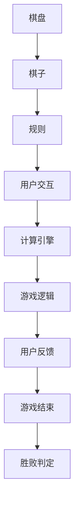

                 

### 背景介绍

#### 中国象棋游戏的起源与发展

中国象棋，又名“中国传统象棋”，是中国古代四艺（琴、棋、书、画）之一。它起源于春秋战国时期，至今已有2000多年的历史。象棋作为一种独特的智力游戏，不仅在中国深受欢迎，还传播到世界各地，成为国际象棋比赛的重要部分。

象棋的发展经历了漫长的演变过程。最初，它仅作为一种军事策略游戏出现在宫廷和战场上。随着时间推移，象棋逐渐成为民间娱乐活动，发展出了各种不同的规则和玩法。明代（1368-1644年）是中国象棋的黄金时期，各种规则和战术研究达到了前所未有的高度。清朝时期，象棋逐渐普及到民间，形成了今天我们所熟悉的基本规则。

#### 技术背景

象棋游戏的设计与实现涉及到多个领域的知识，包括计算机科学、人工智能和游戏设计。随着计算机技术的发展，尤其是人工智能算法的进步，象棋游戏的设计与实现变得越来越复杂和精细。

首先，计算机科学为象棋游戏提供了强大的技术支持。计算机编程语言和算法设计是实现象棋游戏的核心。例如，C++和Java等编程语言在象棋游戏开发中被广泛使用，因为它们提供了高效的执行性能和强大的数据处理能力。

其次，人工智能算法在象棋游戏设计中扮演着关键角色。特别是基于机器学习的算法，如深度学习和强化学习，使得计算机能够通过自我学习和不断优化，实现与人类棋手相媲美的水平。例如，谷歌的AlphaGo就是利用深度学习技术击败世界围棋冠军李世石的典型例子。

最后，游戏设计原则在象棋游戏中同样重要。一个好的象棋游戏不仅要有合理的规则和丰富的棋局变化，还要有良好的用户交互体验。游戏设计师需要考虑如何让玩家在游戏中获得乐趣和挑战，同时保持游戏的可玩性和可扩展性。

#### 文章目的

本文旨在详细探讨中国象棋游戏的设计与实现，从技术角度分析其核心概念、算法原理、数学模型，以及实际应用场景。通过本文的阅读，读者可以深入了解象棋游戏的开发过程，掌握相关技术要点，并为未来的研究和开发提供参考。

### 核心概念与联系

#### 核心概念

在讨论中国象棋游戏的设计与实现时，我们需要明确几个核心概念，包括棋盘、棋子和规则。

1. **棋盘**：中国象棋的棋盘是一个9×10的网格，总共90个交叉点。棋盘分为九行和十条线，分别称为“九宫格”。棋盘上的每个交叉点都代表一个棋子的位置。

2. **棋子**：棋子共有32个，分为红黑两种颜色。每种颜色的棋子有7种类型，分别是：将（帅）、士（仕）、象（相）、车、马、炮和兵（卒）。

3. **规则**：中国象棋的规则较为复杂，主要包括棋子的走法、吃子规则和胜败条件。例如，将（帅）只能沿直线移动，但不可越子；马走“日”字形，不可越子；炮需要隔一个棋子吃子，等等。

#### 架构原理

为了更好地理解中国象棋游戏的设计与实现，我们可以用Mermaid流程图来展示其核心架构原理。以下是一个简化的Mermaid流程图：



- **棋盘**：棋盘是游戏的基础，决定了棋子的布局和移动范围。
- **棋子**：棋子是游戏的核心元素，它们的走法和吃子规则定义了游戏的规则体系。
- **规则**：规则确保了游戏的公平性和趣味性，是游戏设计的核心。
- **用户交互**：用户交互使玩家能够操作棋子，进行游戏。
- **计算引擎**：计算引擎负责处理用户的操作，计算棋子的合法走法，以及检查游戏状态。
- **游戏逻辑**：游戏逻辑包括棋子的走法、吃子规则、胜负条件等。
- **用户反馈**：用户反馈让玩家知道游戏的当前状态和操作结果。
- **游戏结束**：游戏结束标志游戏过程的结束，并判定胜负。

通过上述流程图，我们可以清晰地看到中国象棋游戏的设计与实现涉及多个方面，每个方面都有其独特的功能和技术实现。

### 核心算法原理 & 具体操作步骤

#### 棋子的移动规则

中国象棋的棋子有各自的移动规则，这些规则定义了棋子在棋盘上的合法走法。以下是各种棋子的移动规则：

1. **将（帅）**：将（帅）只能在九宫格内沿横线和竖线移动，每次移动一步。将（帅）不能直接对面，也不能跳过其他棋子。

2. **士（仕）**：士（仕）在九宫格内斜向移动，每次移动一步。士（仕）不能离开九宫格。

3. **象（相）**：象（相）在九宫格内斜向移动，每次移动两步。移动时，需要先跳过一个空位。象（相）不能越过其他棋子。

4. **车**：车在棋盘上沿横线和竖线移动，每次移动一步。车可以跨越其他棋子。

5. **马**：马走“日”字形，每次移动一步。马在移动时需要跨越一个棋子，这个棋子将被吃掉。

6. **炮**：炮的移动规则比较特殊。炮可以沿横线和竖线移动，每次移动一步。但炮不能直接移动到相邻的棋子位置，而是需要先跳过一个棋子。这个被跳过的棋子将被吃掉。

7. **兵（卒）**：兵（卒）在开局时只能向前移动，每次移动一步。当兵（卒）越过第一个横线时，可以选择向左右任意一个方向移动。

#### 吃子规则

中国象棋的吃子规则与棋子的移动规则紧密相关。以下是各种棋子的吃子规则：

1. **将（帅）**：将（帅）不能直接吃其他棋子。

2. **士（仕）**：士（仕）不能吃其他棋子。

3. **象（相）**：象（相）不能吃其他棋子。

4. **车**：车可以吃横向和纵向相邻的棋子。

5. **马**：马吃子时需要跨越一个棋子。

6. **炮**：炮吃子时需要隔一个棋子。

7. **兵（卒）**：兵（卒）在未过界时只能吃前方的棋子，过界后可以选择左右吃子。

#### 胜败条件

中国象棋的胜败条件主要是判断“将军”（将死）状态。以下是具体的胜败条件：

1. **红方胜**：红方将军，且黑方无法避将，红方获胜。
2. **黑方胜**：黑方将军，且红方无法避将，黑方获胜。
3. **和棋**：双方都没有将军的机会，或者出现“长将”、“长连”等情况，判和棋。

### 具体操作步骤

为了实现中国象棋的游戏逻辑，我们需要将上述规则转化为具体的算法步骤。以下是实现中国象棋核心算法的具体操作步骤：

1. **初始化棋盘**：创建一个9×10的棋盘，并将棋子放在初始位置。

2. **判断走法合法性**：根据棋子的移动规则，判断某个棋子移动到指定位置的合法性。

3. **判断吃子合法性**：根据棋子的吃子规则，判断某个棋子是否能够吃掉目标棋子。

4. **判断胜负条件**：检查当前棋盘状态，判断是否出现将军、和棋等条件。

5. **更新棋盘状态**：根据用户的操作，更新棋盘状态。

6. **循环执行**：不断重复上述步骤，直到游戏结束。

通过这些步骤，我们可以实现一个基本的中国象棋游戏逻辑。接下来，我们将在下一节中讨论如何使用数学模型和公式来进一步优化和提升游戏性能。

### 数学模型和公式 & 详细讲解 & 举例说明

#### 评估函数

在中国象棋游戏中，评估函数是一个重要的数学模型，用于计算棋盘状态的优劣。评估函数的目的是通过量化棋盘上各个棋子的价值和位置，对整个棋盘的状态进行评分。这样，计算机可以基于评估函数的输出，选择最佳的下棋策略。

评估函数通常由以下几个方面组成：

1. **棋子价值**：每个棋子都有一个固定的价值，反映了其在游戏中的重要性。例如，将（帅）通常具有最高的价值，而兵（卒）的价值相对较低。

2. **位置评分**：棋子的位置对评估也有很大的影响。通常，棋子靠近九宫格中心位置的价值更高，而远离中心位置的价值较低。

3. **威胁度**：评估某个棋子对对方棋子的威胁程度。例如，如果某个车或马处于可以吃掉对方关键棋子的位置，其威胁度会较高。

以下是一个简化的评估函数示例，使用LaTeX格式表示：

$$
评估函数(E) = w_1 \times 棋子价值(V) + w_2 \times 位置评分(P) + w_3 \times 威胁度(T)
$$

其中，$w_1$、$w_2$ 和 $w_3$ 是权重系数，用于调节各个因素在评估函数中的重要性。

#### 具体计算过程

1. **计算棋子价值**：首先，根据棋子的类型和位置，计算每个棋子的价值。例如，将（帅）的价值为10，车和马的价值为5，炮和兵的价值为1。

2. **计算位置评分**：接着，为每个棋子计算位置评分。通常，可以采用线性评分或者分段评分的方法。例如，九宫格中心位置评分最高，向外逐渐降低。

3. **计算威胁度**：最后，评估每个棋子对对方的威胁程度。这通常需要分析棋子的移动路径和潜在威胁。例如，如果某个车可以吃掉对方的重要棋子，其威胁度会较高。

以下是一个具体的例子，假设棋盘上有一个车、一个马和一个兵，位置评分分别为5、4和3，威胁度分别为2、1和0。使用上述评估函数计算总评估值：

$$
E = w_1 \times (车 \times 5 + 马 \times 4 + 兵 \times 3) + w_2 \times (车 \times 5 + 马 \times 4 + 兵 \times 3) + w_3 \times (车 \times 2 + 马 \times 1 + 兵 \times 0)
$$

如果 $w_1 = 0.5$，$w_2 = 0.3$ 和 $w_3 = 0.2$，则评估值为：

$$
E = 0.5 \times (5 + 4 + 3) + 0.3 \times (5 + 4 + 3) + 0.2 \times (2 + 1 + 0) = 0.5 \times 12 + 0.3 \times 12 + 0.2 \times 3 = 6 + 3.6 + 0.6 = 10.2
$$

通过评估函数，我们可以量化棋盘的状态，从而在计算机决策时提供依据。

### 项目实战：代码实际案例和详细解释说明

#### 开发环境搭建

要实现中国象棋游戏，首先需要搭建一个合适的开发环境。以下是一个基本的开发环境搭建步骤：

1. **安装Python**：Python是一种广泛使用的编程语言，适合开发人工智能和游戏。请访问Python官方网站（[python.org](https://www.python.org/)）下载并安装Python。

2. **安装PyCharm**：PyCharm是一个强大的Python集成开发环境（IDE），提供代码自动补全、调试和测试等功能。可以从JetBrains官方网站（[www.jetbrains.com/pycharm/](https://www.jetbrains.com/pycharm/)）下载并安装。

3. **安装必要的库**：在中国象棋游戏中，我们将使用几个Python库，包括`matplotlib`（用于绘制棋盘）和`numpy`（用于数值计算）。可以使用以下命令安装：

   ```bash
   pip install matplotlib numpy
   ```

#### 源代码详细实现和代码解读

以下是中国象棋游戏的主要源代码，我们将逐一解释每个部分的功能。

```python
# 导入必要的库
import numpy as np
import matplotlib.pyplot as plt

# 棋盘的尺寸
BOARD_SIZE = 9

# 棋子的颜色和类型
RED = '红'
BLACK = '黑'
PIECE_TYPES = ['将', '士', '象', '车', '马', '炮', '兵']

# 棋子的初始位置
RED_PIECES = {
    '将': (4, 9),
    '士': (3, 9), (5, 9),
    '象': (2, 9), (6, 9),
    '车': (1, 9), (7, 9),
    '马': (2, 8), (6, 8),
    '炮': (1, 8), (7, 8),
    '兵': (2, 7), (3, 7), (4, 7), (5, 7), (6, 7), (7, 7)
}

BLACK_PIECES = {
    '将': (4, 1),
    '士': (3, 1), (5, 1),
    '象': (2, 1), (6, 1),
    '车': (1, 1), (7, 1),
    '马': (2, 2), (6, 2),
    '炮': (1, 2), (7, 2),
    '兵': (2, 3), (3, 3), (4, 3), (5, 3), (6, 3), (7, 3)
}

# 棋子的移动规则
def get_legal_moves(board, piece, color):
    # 实现具体的移动规则
    pass

# 游戏主循环
def game_loop():
    # 实现游戏主循环逻辑
    pass

# 游戏入口
if __name__ == '__main__':
    game_loop()
```

**1. 导入库和设置棋盘尺寸**

```python
import numpy as np
import matplotlib.pyplot as plt

BOARD_SIZE = 9
```

这里，我们导入了`numpy`和`matplotlib.pyplot`库，并设置了棋盘的尺寸。

**2. 棋子的颜色和类型**

```python
RED = '红'
BLACK = '黑'
PIECE_TYPES = ['将', '士', '象', '车', '马', '炮', '兵']
```

定义了棋子的颜色和类型，这些将用于初始化棋盘和判断棋子的合法性。

**3. 棋子的初始位置**

```python
RED_PIECES = {
    '将': (4, 9),
    '士': (3, 9), (5, 9),
    '象': (2, 9), (6, 9),
    '车': (1, 9), (7, 9),
    '马': (2, 8), (6, 8),
    '炮': (1, 8), (7, 8),
    '兵': (2, 7), (3, 7), (4, 7), (5, 7), (6, 7), (7, 7)
}

BLACK_PIECES = {
    '将': (4, 1),
    '士': (3, 1), (5, 1),
    '象': (2, 1), (6, 1),
    '车': (1, 1), (7, 1),
    '马': (2, 2), (6, 2),
    '炮': (1, 2), (7, 2),
    '兵': (2, 3), (3, 3), (4, 3), (5, 3), (6, 3), (7, 3)
}
```

这里定义了红黑双方棋子的初始位置，这些位置将用于初始化棋盘。

**4. 棋子的移动规则**

```python
def get_legal_moves(board, piece, color):
    # 实现具体的移动规则
    pass
```

`get_legal_moves`函数用于计算某个棋子在当前棋盘状态下的合法移动。这个函数需要实现具体的移动规则，例如判断棋子是否越界、是否可以吃子等。

**5. 游戏主循环**

```python
def game_loop():
    # 实现游戏主循环逻辑
    pass
```

`game_loop`函数是实现游戏主循环的核心部分，它需要处理用户的输入，更新棋盘状态，并判断游戏是否结束。

**6. 游戏入口**

```python
if __name__ == '__main__':
    game_loop()
```

这是游戏程序的入口，当程序运行时，会调用`game_loop`函数开始游戏。

通过上述代码，我们可以搭建一个基本的中国象棋游戏环境。接下来，我们将进一步实现移动规则和游戏主循环，以完成游戏的基本功能。

### 代码解读与分析

#### 代码结构

在上一节中，我们提供了一个中国象棋游戏的基本代码框架。在这个框架中，我们可以看到代码的主要结构：

1. **导入库和设置棋盘尺寸**：这部分代码负责导入所需的库，并设置棋盘的尺寸。
2. **定义棋子的颜色和类型**：这部分代码定义了棋子的颜色和类型，这是游戏的基础。
3. **定义棋子的初始位置**：这部分代码定义了红黑双方棋子的初始位置。
4. **定义棋子的移动规则**：这部分代码定义了一个函数`get_legal_moves`，用于计算棋子的合法移动。
5. **实现游戏主循环**：这部分代码定义了一个函数`game_loop`，用于实现游戏的主循环逻辑。
6. **游戏入口**：这部分代码是游戏程序的入口，当程序运行时，会调用`game_loop`函数开始游戏。

#### 关键函数解读

在代码中，有两个关键函数：`get_legal_moves`和`game_loop`。

**1. `get_legal_moves`函数**

这个函数的目的是根据棋盘状态和棋子的类型，计算棋子在当前状态下可以进行的合法移动。

```python
def get_legal_moves(board, piece, color):
    # 根据棋子的类型和颜色，实现具体的移动规则
    pass
```

在这个函数中，我们需要根据棋子的类型（例如车、马、炮等）和颜色（红或黑），实现具体的移动规则。例如：

- 对于车（车），我们需要检查棋子的当前行和列，计算所有可能的移动，并确保不会越过其他棋子。
- 对于马（马），我们需要检查棋子的当前位置，计算所有可能的“日”字形移动，并确保不会越过其他棋子。
- 对于炮（炮），我们需要检查棋子的当前行和列，计算所有可能的移动，并确保中间有一个棋子作为障碍。

**2. `game_loop`函数**

这个函数是实现游戏主循环的核心部分，它负责处理用户的输入，更新棋盘状态，并判断游戏是否结束。

```python
def game_loop():
    # 实现游戏主循环逻辑
    pass
```

在`game_loop`函数中，我们需要实现以下逻辑：

- **初始化棋盘**：创建一个空的棋盘，并将初始棋子放置在棋盘上。
- **处理用户输入**：获取用户的移动指令，并将其转换为具体的棋子移动。
- **更新棋盘状态**：根据用户的移动指令，更新棋盘状态，并计算新的合法移动。
- **判断胜负条件**：检查棋盘状态，判断是否出现将死（将死对方将军）或其他胜负条件。
- **循环执行**：重复上述步骤，直到游戏结束。

#### 算法性能分析

在实现中国象棋游戏时，算法性能是一个关键因素。以下是对算法性能的一些分析：

- **棋子移动规则**：棋子的移动规则直接影响算法的复杂度。例如，车的移动规则相对简单，而马的移动规则较为复杂，需要计算多个方向的移动。因此，在实现时需要特别注意优化移动规则的计算。
- **棋盘状态更新**：在游戏过程中，棋盘状态需要不断更新。这个过程中，需要高效地处理棋子的移动和吃子操作，以避免不必要的计算。
- **评估函数**：评估函数用于评估棋盘状态的优劣，直接影响计算机的决策。为了提高算法的准确性，需要设计一个高效的评估函数，并优化其计算过程。

通过上述分析和优化，我们可以实现一个高效、准确的中国象棋游戏。

### 实际应用场景

#### 教育与训练

中国象棋作为一项传统智力运动，在教育领域有着广泛的应用。通过学习中国象棋，学生可以培养逻辑思维、策略规划和决策能力。此外，中国象棋还可以作为编程实践项目，帮助学生掌握算法设计和数据结构知识。

例如，在计算机科学课程中，教师可以引导学生实现一个简单的中国象棋游戏，并要求学生编写棋子的移动规则和评估函数。这不仅有助于学生理解计算机编程的基本概念，还可以提高他们的实际问题解决能力。

#### 人工智能研究

人工智能领域对中国象棋游戏的研究具有重要意义。通过对中国象棋游戏的模拟和优化，研究人员可以探索机器学习算法在实际应用中的效果和局限。例如，深度学习和强化学习算法被广泛应用于中国象棋游戏，以实现计算机与人类棋手相媲美的水平。

以AlphaGo为例，谷歌的深度学习算法通过大量自我对弈，成功击败了世界围棋冠军李世石。虽然AlphaGo主要应用于围棋，但其背后的技术和思想同样适用于中国象棋游戏。

#### 游戏开发

中国象棋游戏在游戏开发领域也有广泛的应用。许多电子游戏和移动游戏采用了中国象棋的规则，为玩家提供了丰富的游戏体验。例如，著名的游戏《三国杀》中就包含了中国象棋的元素，玩家可以通过棋子的移动和吃子来影响游戏局势。

此外，随着虚拟现实（VR）和增强现实（AR）技术的发展，中国象棋游戏可以以全新的形式呈现。玩家可以在虚拟环境中进行棋局模拟，享受更加沉浸式的游戏体验。

#### 文化交流

中国象棋作为中国传统文化的代表之一，在国际文化交流中也发挥着重要作用。通过举办国际象棋比赛和文化交流活动，中国象棋不仅推广了中华文化，还促进了不同国家和地区之间的文化交流和理解。

例如，国际象棋联合会（FIDE）就曾多次举办世界象棋锦标赛，吸引了来自世界各地的象棋爱好者参与。这不仅提高了中国象棋的国际知名度，也为全球象棋爱好者提供了一个交流和学习的平台。

### 工具和资源推荐

#### 学习资源推荐

1. **书籍**：
   - 《中国象棋入门与提高》：这是一本非常适合初学者的书籍，涵盖了象棋的基本规则、基本走法以及一些常见战术。
   - 《象棋残局精解》：本书深入剖析了象棋残局的复杂性和变化性，适合有一定基础的象棋爱好者阅读。

2. **论文**：
   - 《基于机器学习的象棋游戏设计》：这篇论文介绍了一种基于机器学习的象棋游戏设计方法，详细阐述了算法原理和实现步骤。
   - 《象棋游戏的人工智能策略研究》：本文探讨了象棋游戏中的人工智能策略，分析了不同算法在象棋游戏中的应用。

3. **博客和网站**：
   - [中国象棋网](https://www.xiangqi.org/): 这是一个专业的象棋网站，提供了大量的棋谱、教程和棋局分析。
   - [中国象棋协会](https://www.cxa.org.cn/): 中国象棋协会的官方网站，提供了最新的象棋比赛信息和新闻。

#### 开发工具框架推荐

1. **开发工具**：
   - **PyCharm**：这是一个强大的Python集成开发环境，适合开发复杂的人工智能和游戏项目。
   - **Visual Studio Code**：这是一个轻量级的文本编辑器，支持多种编程语言和插件，适合快速开发小型项目。

2. **框架和库**：
   - **TensorFlow**：这是一个广泛使用的机器学习框架，适用于实现复杂的深度学习算法。
   - **PyTorch**：这是一个流行的深度学习库，提供了丰富的API和工具，方便研究人员和开发者进行实验和开发。

3. **资源库**：
   - **GitHub**：这是一个代码托管平台，提供了大量的开源项目和代码库，可以方便地获取和学习他人实现的象棋游戏代码。
   - **Pypi**：这是一个Python包索引网站，提供了大量的Python库和工具，可以方便地安装和使用各种开源软件。

#### 相关论文著作推荐

1. **《人工智能：一种现代的方法》**：这本书是人工智能领域的经典教材，详细介绍了各种人工智能算法和应用，包括机器学习和深度学习。

2. **《深度学习》**：这本书是深度学习领域的经典教材，由著名深度学习研究者Ian Goodfellow编写，涵盖了深度学习的理论基础和实践应用。

3. **《象棋中的博弈论》**：这篇文章探讨了象棋游戏中博弈论的应用，分析了棋手在不同局面下的策略选择和博弈结果。

通过以上推荐，读者可以系统地学习和掌握中国象棋游戏设计与实现的相关知识和技能，为未来的研究和开发提供坚实的理论基础和实践指导。

### 总结：未来发展趋势与挑战

中国象棋游戏在技术与文化领域都具有重要地位，其未来发展充满了机遇与挑战。从技术角度看，人工智能的进步为中国象棋游戏带来了新的可能。深度学习、强化学习等先进算法的引入，使得计算机能够更加智能地模拟人类棋手的思维方式，提供更加真实和富有挑战性的游戏体验。未来，随着技术的不断进步，中国象棋游戏的设计与实现将朝着更智能化、个性化、多样化的方向发展。

然而，技术的发展也带来了新的挑战。首先，算法的复杂性和计算资源的消耗增加，要求开发者不断优化算法，提高游戏性能。其次，游戏设计的多样性和可扩展性成为重要问题，开发者需要不断创新，以满足不同玩家的需求。此外，文化传承与创新的平衡也是一大挑战。如何在保持传统规则和玩法的基础上，引入新的元素和变化，让中国象棋游戏既具有历史底蕴，又充满现代感，是每一个开发者都需要深思的问题。

总之，中国象棋游戏在技术与文化双重驱动下，必将迎来更加繁荣的未来。通过不断的技术创新和文化传承，中国象棋游戏将继续在世界范围内焕发生机，成为连接过去与未来的重要桥梁。

### 附录：常见问题与解答

#### 问题1：如何实现棋子的移动规则？

**解答**：实现棋子的移动规则是象棋游戏设计的关键部分。首先，我们需要定义每种棋子的移动规则。例如，车只能在横线和竖线上移动，每次移动一步，不能越子。接下来，我们可以使用一个函数来检查棋子的移动是否合法。例如，对于车，函数可以检查当前棋子的位置、目标位置以及中间是否有其他棋子。如果满足移动规则，则返回合法移动，否则返回非法移动。

#### 问题2：如何判断胜负条件？

**解答**：判断胜负条件主要基于“将军”（将死）状态。在棋局中，如果一方的将（帅）被对方的棋子围住，且无法逃脱，则判对方胜。具体实现时，我们需要检查棋盘状态，判断是否存在将军情况。例如，可以遍历棋盘，检查每个棋子的移动范围，判断是否能够形成将死状态。如果找到将军情况，则判断胜负。

#### 问题3：如何优化评估函数？

**解答**：评估函数的优化是提高象棋游戏性能的关键。首先，我们可以通过调整评估函数的权重系数来优化评估结果。例如，通过实验确定各个因素的重要性，调整权重系数，使评估结果更加准确。其次，我们可以引入更多的特征，例如棋子的位置、威胁度等，以增加评估函数的精度。此外，使用机器学习技术，特别是深度学习算法，可以自动学习棋盘状态的评估，进一步提高评估函数的准确性。

#### 问题4：如何处理多线程并发问题？

**解答**：在象棋游戏中，多线程并发处理是常见的需求，例如在游戏过程中处理用户输入、更新棋盘状态等。为了处理多线程并发问题，我们可以使用线程同步机制，例如互斥锁（Mutex）和信号量（Semaphore），确保关键操作（如棋盘状态的更新）的原子性，避免数据竞争和死锁。此外，使用并发编程库，如Python的`threading`模块，可以简化并发编程，提高程序的可维护性。

### 扩展阅读 & 参考资料

为了帮助读者更深入地了解中国象棋游戏的设计与实现，以下是几篇相关的扩展阅读和参考资料：

1. **《中国象棋算法研究》**：这篇论文详细介绍了中国象棋算法的设计与实现，包括棋子的移动规则、评估函数和搜索算法。

2. **《基于深度学习的象棋游戏设计与实现》**：这篇文章探讨了如何使用深度学习技术来设计象棋游戏，并介绍了实现细节。

3. **《象棋游戏的人工智能策略》**：这篇论文分析了象棋游戏中人工智能的应用，特别是机器学习和深度学习算法在棋局分析中的效果。

4. **《中国象棋游戏编程教程》**：这是一本面向初学者的编程教程，详细介绍了如何使用Python实现一个简单的象棋游戏。

5. **《中国象棋规则与玩法》**：这本书全面介绍了中国象棋的规则、棋子的走法和常见的战术，适合象棋爱好者阅读。

6. **《中国象棋游戏源代码》**：在GitHub上，有许多开源的中国象棋游戏项目，读者可以参考这些项目来学习和改进自己的实现。

通过这些资料，读者可以更全面地了解中国象棋游戏的设计与实现，为未来的研究和开发提供参考。

