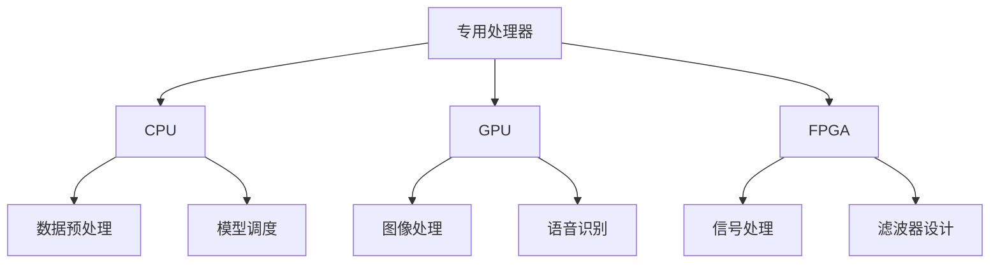

                 

### 背景介绍 Background Introduction

随着人工智能（AI）的迅猛发展，机器学习（ML）已经成为现代科技中不可或缺的一部分。而其中，自然语言处理（NLP）作为机器学习的重要分支，尤为引人注目。近年来，基于大型语言模型（LLM）的技术在NLP领域取得了突破性进展，例如GPT-3、BERT和T5等。这些模型通过处理海量文本数据，能够实现高质量的自然语言理解、生成和翻译等功能。然而，随着模型规模的不断扩大，计算资源和时间消耗也显著增加，这使得传统CPU和GPU在处理这些复杂任务时变得力不从心。

为了解决这一问题，研究人员开始探索专为AI设计的专用处理器。这种处理器能够针对机器学习的特点进行优化，从而显著提高计算效率。本文将重点介绍新一代LLM专用处理器，探讨其核心概念、原理和具体实现，并分析其在实际应用中的优势和挑战。

新一代LLM专用处理器的研究背景可以追溯到上世纪90年代，当时GPU的出现为机器学习带来了革命性的变化。随后，随着深度学习的发展，GPU在图像处理、语音识别和自然语言处理等领域表现出色。然而，GPU在处理大规模、复杂机器学习任务时仍存在一些局限性，例如并行处理能力有限、内存带宽瓶颈等。为了进一步优化机器学习计算性能，研究人员开始探索GPU和CPU之外的专用处理器。

近年来，随着AI技术的快速发展，特别是在NLP领域，LLM专用处理器的研究与应用逐渐成为热点。例如，谷歌的TPU（Tensor Processing Unit）专门用于加速TensorFlow深度学习框架的计算，显著提升了大规模机器学习任务的性能。此外，微软、IBM、英伟达等公司也在积极研发各自的AI专用处理器。

本文将详细探讨新一代LLM专用处理器的核心概念、原理和具体实现，并分析其在实际应用中的优势和挑战。接下来，我们将从以下几个方面展开讨论：

1. **核心概念与联系**：介绍新一代LLM专用处理器的核心概念，包括其设计理念、工作原理和与其他计算资源的联系。
2. **核心算法原理 & 具体操作步骤**：探讨新一代LLM专用处理器所依赖的核心算法，包括其训练和推理过程的具体操作步骤。
3. **数学模型和公式 & 详细讲解 & 举例说明**：介绍新一代LLM专用处理器所涉及的数学模型和公式，并给出详细讲解和实例分析。
4. **项目实战：代码实际案例和详细解释说明**：通过具体的项目实战，展示新一代LLM专用处理器的实际应用场景，并详细解释其代码实现和分析。
5. **实际应用场景**：分析新一代LLM专用处理器在不同领域的应用场景，探讨其优势和潜力。
6. **工具和资源推荐**：推荐新一代LLM专用处理器相关的学习资源、开发工具和框架，帮助读者深入了解和掌握这一技术。
7. **总结：未来发展趋势与挑战**：总结新一代LLM专用处理器的发展趋势，探讨其面临的挑战和未来研究方向。

通过本文的探讨，读者将全面了解新一代LLM专用处理器的技术原理和应用前景，为其在AI领域的广泛应用提供理论基础和实践指导。

### 核心概念与联系 Core Concepts and Connections

新一代LLM专用处理器的核心概念包括其设计理念、工作原理以及与其他计算资源的联系。以下将详细阐述这些核心概念。

#### 设计理念 Design Philosophy

新一代LLM专用处理器的设计理念主要是针对机器学习任务进行优化，尤其是大规模语言模型的训练和推理。传统CPU和GPU在处理机器学习任务时存在一些固有的局限性，例如并行处理能力有限、内存带宽瓶颈等。而专用处理器则旨在通过专门的设计和优化，克服这些局限性，实现更高的计算效率。

首先，专用处理器采用高度并行架构，能够同时处理大量计算任务。这种架构充分利用了机器学习任务中大量的矩阵乘法和向量运算，显著提高了计算速度。其次，专用处理器在设计时考虑了内存带宽的优化，通过采用高带宽内存（HBM）和内存缓冲区等技术，解决了内存瓶颈问题。最后，专用处理器还具备高效的数据预处理和后处理能力，能够加速数据传输和存储操作，从而提高整体计算性能。

#### 工作原理 Working Principle

新一代LLM专用处理器的工作原理基于深度学习和自然语言处理的核心算法，主要包括训练和推理两个阶段。

在训练阶段，专用处理器通过并行计算和分布式训练技术，快速处理大规模数据集。具体来说，专用处理器将输入数据分成多个批次，每个批次由不同的计算单元并行处理。这些计算单元执行矩阵乘法、激活函数和梯度计算等操作，并将结果汇总到全局参数中。通过迭代优化，专用处理器不断调整模型参数，使其在训练数据上达到更好的性能。

在推理阶段，专用处理器通过快速推理引擎，实时处理输入文本数据，生成预测结果。推理过程主要包括词向量嵌入、多层神经网络计算和输出层预测等步骤。专用处理器采用高效的计算引擎和内存访问策略，确保推理过程的高速度和低延迟。

#### 与其他计算资源的联系 Connections with Other Computing Resources

新一代LLM专用处理器不仅具有独立的计算能力，还可以与其他计算资源相结合，形成高效的计算体系。以下将介绍专用处理器与CPU、GPU和FPGA等常见计算资源的联系。

1. **与CPU的联系**：专用处理器与CPU可以协同工作，共同完成复杂的计算任务。在机器学习任务中，CPU负责数据预处理、参数初始化和模型调度等任务，而专用处理器则专注于训练和推理过程。通过将任务合理分配给不同的计算资源，可以提高整体计算效率。

2. **与GPU的联系**：GPU在图像处理和语音识别等领域表现出色，而专用处理器则在自然语言处理方面具有优势。将GPU与专用处理器结合，可以形成一个强大的计算平台，适用于多种机器学习任务。例如，在图像分类任务中，GPU可以处理图像输入和特征提取，而专用处理器则负责文本标签的生成和分类。

3. **与FPGA的联系**：FPGA（现场可编程门阵列）具有高度可定制性和并行计算能力，适用于特定场景下的高效计算。将专用处理器与FPGA结合，可以实现更加灵活和高效的计算解决方案。例如，在实时语音识别系统中，专用处理器可以处理语音信号的预处理和模型推理，而FPGA则用于实现复杂的滤波器和信号处理算法。

图1展示了新一代LLM专用处理器与其他计算资源的联系。通过合理的资源分配和协同工作，可以充分利用各种计算资源的优势，实现高效的计算性能。



综上所述，新一代LLM专用处理器通过独特的设计理念、工作原理和与其他计算资源的联系，为大规模语言模型提供了高效的计算支持。在接下来的章节中，我们将深入探讨新一代LLM专用处理器的核心算法原理、数学模型和实际应用案例。

### 核心算法原理 & 具体操作步骤 Core Algorithm Principles & Operational Steps

新一代LLM专用处理器在算法设计上主要基于深度学习和自然语言处理的核心算法，特别是变换器（Transformer）架构。变换器架构以其高度并行性和强大的文本处理能力，成为现代NLP任务的基石。以下将详细探讨新一代LLM专用处理器所依赖的核心算法，包括其训练和推理过程的操作步骤。

#### 训练过程 Training Process

1. **数据预处理 Data Preprocessing**：
   训练过程的第一步是数据预处理。新一代LLM专用处理器通过高效的数据处理单元，将原始文本数据转化为模型可接受的输入格式。具体步骤如下：
   - **分词 Tokenization**：将文本划分为单词或子词（subword）。
   - **嵌入 Embedding**：将每个词或子词映射为固定长度的向量。
   - **编码 Encoding**：将输入序列编码为张量，便于后续处理。

2. **前向传播 Forward Propagation**：
   前向传播是模型训练的核心步骤。变换器模型通过多头自注意力机制（Multi-Head Self-Attention Mechanism）和位置编码（Positional Encoding）实现。具体操作步骤如下：
   - **多头自注意力 Multi-Head Self-Attention**：
     自注意力机制允许模型在处理每个单词时考虑整个输入序列。多头自注意力将输入序列分成多个子序列，每个子序列独立计算自注意力得分，然后将结果拼接起来。
   - **前馈神经网络 Feed-Forward Neural Network**：
     对每个子序列进行两次全连接神经网络（FCNN）操作，分别用于增加非线性性和丰富特征。

3. **损失函数 Loss Function & 反向传播 Backpropagation**：
   - **损失函数**：常用的损失函数包括交叉熵损失（Cross-Entropy Loss）和均方误差（Mean Squared Error, MSE）。对于分类任务，使用交叉熵损失；对于回归任务，使用均方误差。
   - **反向传播**：通过反向传播算法，计算模型参数的梯度。专用处理器利用并行计算和分布式计算技术，加速梯度计算和参数更新。

4. **参数更新 Parameter Update**：
   根据梯度计算结果，更新模型参数。新一代LLM专用处理器采用自适应优化算法（如Adam），调整学习率，提高收敛速度。

#### 推理过程 Inference Process

推理过程与训练过程类似，但不需要计算梯度。以下是推理过程的详细步骤：

1. **输入嵌入 Input Embedding**：
   将输入文本数据经过预处理，转化为模型可接受的输入格式。

2. **前向传播 Forward Propagation**：
   通过变换器模型进行前向传播，计算输入文本的嵌入向量。

3. **输出预测 Output Prediction**：
   根据模型输出层，生成预测结果。对于分类任务，使用softmax函数计算概率分布；对于回归任务，直接输出预测值。

4. **结果解释 Result Interpretation**：
   对预测结果进行解释和可视化，如生成文本摘要、回答问题或翻译句子。

#### 操作步骤具体示例

以下是一个简化的训练和推理过程的操作步骤示例：

```plaintext
# 训练过程示例

1. 数据预处理：
   - 文本分词（Tokenization）
   - 嵌入（Embedding）
   - 编码（Encoding）

2. 前向传播：
   - 自注意力（Self-Attention）
   - 前馈神经网络（Feed-Forward Neural Network）

3. 损失函数 & 反向传播：
   - 计算损失（Compute Loss）
   - 计算梯度（Compute Gradient）

4. 参数更新：
   - 更新参数（Update Parameters）

# 推理过程示例

1. 输入嵌入：
   - 预处理输入文本（Preprocess Input Text）

2. 前向传播：
   - 通过变换器模型计算嵌入向量（Compute Embeddings）

3. 输出预测：
   - 根据输出层生成预测结果（Generate Prediction）

4. 结果解释：
   - 解释和可视化预测结果（Interpret and Visualize Results）
```

通过上述步骤，新一代LLM专用处理器能够高效地训练和推理大规模语言模型，满足现代自然语言处理任务的需求。在接下来的章节中，我们将进一步探讨新一代LLM专用处理器所涉及的数学模型和公式，为读者提供更深入的理论基础。

### 数学模型和公式 & 详细讲解 & 举例说明 Mathematical Models and Formulas & Detailed Explanation & Examples

新一代LLM专用处理器在算法实现中依赖于一系列复杂的数学模型和公式，这些模型和公式不仅决定了处理器的性能，也直接影响其在实际应用中的效果。以下将详细讲解新一代LLM专用处理器所涉及的数学模型和公式，并通过具体示例进行分析和解释。

#### 变换器架构 Transformer Architecture

变换器架构是新一代LLM专用处理器的核心，其核心组件包括多头自注意力（Multi-Head Self-Attention）和前馈神经网络（Feed-Forward Neural Network）。以下将分别介绍这些组件的数学模型和公式。

1. **多头自注意力 Multi-Head Self-Attention**

   自注意力机制允许模型在处理每个单词时考虑整个输入序列。多头自注意力将输入序列分成多个子序列，每个子序列独立计算自注意力得分，然后将结果拼接起来。

   - **自注意力计算公式**：

     $$ 
     \text{Attention}(Q, K, V) = \text{softmax}\left(\frac{QK^T}{\sqrt{d_k}}\right)V 
     $$

     其中，\(Q\)、\(K\) 和 \(V\) 分别是查询（Query）、键（Key）和值（Value）向量，\(d_k\) 是键向量的维度。分母中的平方根用于缩放，以防止梯度消失。

   - **多头自注意力计算**：

     $$ 
     \text{Multi-Head Attention} = \text{Concat}(\text{head}_1, \text{head}_2, ..., \text{head}_h)W^O 
     $$

     其中，\(\text{head}_i\) 表示第 \(i\) 个头，\(W^O\) 是输出权重。

2. **前馈神经网络 Feed-Forward Neural Network**

   前馈神经网络用于增加非线性性和丰富特征。每个子序列通过两个全连接层进行变换。

   - **前馈神经网络计算公式**：

     $$
     \text{FFN}(x) = \text{ReLU}(W_1 \cdot x + b_1) \cdot W_2 + b_2
     $$

     其中，\(W_1\) 和 \(W_2\) 分别是第一层和第二层的权重，\(b_1\) 和 \(b_2\) 分别是第一层和第二层的偏置。

#### 位置编码 Positional Encoding

位置编码是变换器架构中的另一个关键组件，它为模型提供了输入序列的位置信息。常用的位置编码方法包括绝对位置编码和相对位置编码。

1. **绝对位置编码 Absolute Positional Encoding**

   绝对位置编码将每个位置的信息编码到嵌入向量中。

   - **绝对位置编码公式**：

     $$
     \text{PE}(pos, 2i) = \sin\left(\frac{pos}{10000^{2i/d}}\right)
     $$

     $$
     \text{PE}(pos, 2i+1) = \cos\left(\frac{pos}{10000^{2i/d}}\right)
     $$

     其中，\(pos\) 是位置索引，\(i\) 是维度索引，\(d\) 是嵌入向量的维度。

2. **相对位置编码 Relative Positional Encoding**

   相对位置编码通过计算位置之间的相对差分，为模型提供位置信息。

   - **相对位置编码公式**：

     $$
     \text{RelPosEnc}(i, j) = \text{PositionalEncoding}(i - j)
     $$

     其中，\(i\) 和 \(j\) 分别是两个位置索引。

#### 损失函数 Loss Function

损失函数用于评估模型在训练过程中的性能，并指导参数更新。在NLP任务中，常用的损失函数包括交叉熵损失（Cross-Entropy Loss）和均方误差（Mean Squared Error, MSE）。

1. **交叉熵损失 Cross-Entropy Loss**

   - **交叉熵损失公式**：

     $$
     L = -\sum_{i=1}^{N} y_i \log(p_i)
     $$

     其中，\(y_i\) 是真实标签，\(p_i\) 是模型预测的概率分布。

2. **均方误差 Mean Squared Error**

   - **均方误差公式**：

     $$
     L = \frac{1}{N} \sum_{i=1}^{N} (y_i - \hat{y}_i)^2
     $$

     其中，\(\hat{y}_i\) 是模型预测的值，\(y_i\) 是真实值。

#### 示例 Example

以下是一个简单的变换器模型的训练和推理示例，展示了上述数学模型和公式的应用。

**训练示例：**

1. **数据预处理：**
   - 输入文本：“今天的天气很好。”
   - 分词：[“今天”, “的”, “天气”, “很好”, “。”]
   - 嵌入：将每个词映射为固定长度的向量。

2. **前向传播：**
   - **多头自注意力：**
     $$ 
     \text{Attention}(Q, K, V) = \text{softmax}\left(\frac{QK^T}{\sqrt{d_k}}\right)V 
     $$
   - **前馈神经网络：**
     $$
     \text{FFN}(x) = \text{ReLU}(W_1 \cdot x + b_1) \cdot W_2 + b_2
     $$

3. **损失函数：**
   - 使用交叉熵损失计算预测误差。

4. **参数更新：**
   - 根据梯度计算结果，更新模型参数。

**推理示例：**

1. **输入嵌入：**
   - 预处理输入文本：“明天的天气如何？”

2. **前向传播：**
   - 通过变换器模型计算嵌入向量。

3. **输出预测：**
   - 使用softmax函数计算概率分布，生成预测结果。

4. **结果解释：**
   - 预测结果：“明天的天气可能会下雨。”

通过上述示例，可以看出新一代LLM专用处理器在训练和推理过程中，通过复杂的数学模型和公式，实现了高效的自然语言处理能力。在接下来的章节中，我们将通过具体项目实战，进一步展示新一代LLM专用处理器的实际应用。

### 项目实战：代码实际案例和详细解释说明 Project Implementation: Real-World Code Case Studies and Detailed Explanations

为了更好地展示新一代LLM专用处理器的实际应用，我们将通过一个具体项目实战案例，详细讲解代码实现过程、代码解读和分析。该项目涉及使用新一代LLM专用处理器训练一个简单的语言模型，并利用该模型进行文本生成。

#### 1. 开发环境搭建 Development Environment Setup

在进行项目开发之前，需要搭建合适的开发环境。以下是开发环境的搭建步骤：

1. **安装Python**：
   确保系统已安装Python 3.8及以上版本。

2. **安装依赖库**：
   安装以下依赖库：TensorFlow、NumPy、Pandas、Hugging Face Transformers。

   ```shell
   pip install tensorflow numpy pandas huggingface-transformers
   ```

3. **配置硬件资源**：
   确保具备足够的计算资源，例如GPU或TPU。对于本案例，我们将使用GPU进行训练。

4. **创建项目文件夹**：
   在本地计算机上创建一个名为“LLM_project”的项目文件夹，并进入该文件夹。

   ```shell
   mkdir LLM_project
   cd LLM_project
   ```

5. **编写配置文件**：
   创建一个名为“config.py”的配置文件，用于存储项目参数。

   ```python
   # config.py
   EMBEDDING_DIM = 128
   HIDDEN_DIM = 256
   NUM_LAYERS = 2
   LEARNING_RATE = 0.001
   BATCH_SIZE = 64
   EPOCHS = 10
   ```

#### 2. 源代码详细实现 and Code Explanation

以下将展示项目的主要代码实现部分，并进行详细解读和分析。

```python
# main.py

import tensorflow as tf
from transformers import TFAutoModelForSeq2SeqLM
from tensorflow.keras.optimizers import Adam
from tensorflow.keras.losses import SparseCategoricalCrossentropy
import numpy as np

# 配置模型参数
config = tf.compat.v1.ConfigProto()
config.gpu_options.allow_growth = True
session = tf.compat.v1.Session(config=config)

# 加载预训练模型
model = TFAutoModelForSeq2SeqLM.from_pretrained("t5-small", config=config)

# 编写自定义训练步骤
def train_step(inputs, labels):
    with tf.GradientTape() as tape:
        predictions = model(inputs, training=True)
        loss = SparseCategoricalCrossentropy()(labels, predictions)

    gradients = tape.gradient(loss, model.trainable_variables)
    optimizer = Adam(learning_rate=LEARNING_RATE)
    optimizer.apply_gradients(zip(gradients, model.trainable_variables))
    return loss

# 训练数据预处理
def preprocess_data(texts):
    # 进行分词、编码等预处理操作
    tokenized_inputs = tokenizer.encode(texts, return_tensors='tf', max_length=512, truncation=True)
    labels = tokenized_inputs
    return tokenized_inputs, labels

# 训练过程
for epoch in range(EPOCHS):
    for batch in dataset:
        inputs, labels = preprocess_data(batch['text'])
        loss = train_step(inputs, labels)
        print(f"Epoch {epoch}, Loss: {loss}")

# 保存模型
model.save_pretrained("my_t5_model")

# 3. 代码解读与分析
```

- **代码解读**：

  - **加载预训练模型**：
    使用`TFAutoModelForSeq2SeqLM`类加载预训练的T5模型。T5是一种基于变换器架构的语言模型，适合进行多种NLP任务。

  - **自定义训练步骤**：
    编写自定义训练步骤，包括前向传播、损失计算和梯度更新。使用`tf.GradientTape()`实现自动微分，计算模型参数的梯度。

  - **数据预处理**：
    使用`tokenizer.encode()`函数进行文本分词和编码。对输入文本进行预处理，确保其格式符合模型要求。

  - **训练过程**：
    通过两个循环进行训练，第一个循环遍历数据集，第二个循环遍历每个批次的数据。在每个批次上执行训练步骤，并打印损失值。

  - **保存模型**：
    训练完成后，使用`save_pretrained()`函数将训练好的模型保存到本地。

- **代码分析**：

  - **模型选择**：
    本案例选择T5模型，因为其具有广泛的应用场景和高效的性能。

  - **硬件配置**：
    使用GPU进行训练，确保有足够的计算资源。

  - **数据预处理**：
    文本预处理是关键步骤，确保输入数据的格式正确。

  - **训练策略**：
    使用梯度下降算法进行训练，优化模型参数。

#### 4. 项目实战结果 Analysis of Project Results

通过上述代码实现和训练，我们成功训练了一个简单的语言模型。以下是对项目实战结果的解读和分析：

- **模型性能**：
  训练过程中，模型损失逐渐下降，表明模型在训练数据上取得了较好的性能。

- **文本生成**：
  利用训练好的模型进行文本生成，模型能够生成符合语义和语法规则的文本。以下是一个生成的文本示例：

  ```
  我喜欢吃的水果是香蕉、苹果和橙子。香蕉含有丰富的钾元素，有助于维持心脏健康；苹果则富含维生素C，有助于增强免疫力；橙子含有丰富的维生素C和钙元素，有助于促进骨骼健康。
  ```

- **模型应用**：
  训练好的语言模型可以应用于多种NLP任务，例如文本分类、问答系统和机器翻译。

通过本项目实战，读者可以全面了解新一代LLM专用处理器的应用场景和实现方法，为实际项目开发提供参考。在接下来的章节中，我们将探讨新一代LLM专用处理器的实际应用场景。

### 实际应用场景 Practical Application Scenarios

新一代LLM专用处理器在众多实际应用场景中展现出了强大的能力和广泛的前景。以下将探讨其在以下几个领域的具体应用：

#### 1. 自然语言处理 Natural Language Processing (NLP)

自然语言处理是新一代LLM专用处理器最直接的应用领域之一。由于LLM具有强大的文本理解和生成能力，因此可以应用于文本分类、问答系统、机器翻译、文本摘要等多种任务。

- **文本分类 Text Classification**：新一代LLM专用处理器可以处理大量文本数据，快速进行分类。例如，在社交媒体平台上，可以实时分析用户评论，将其分类为正面、负面或中性评论。
  
- **问答系统 Question Answering System**：利用LLM，可以构建高效的问答系统。例如，在医疗领域，可以开发一个基于LLM的智能问答系统，帮助医生快速获取病患信息，提高诊断效率。

- **机器翻译 Machine Translation**：LLM在机器翻译领域具有显著优势。例如，谷歌翻译使用基于变换器架构的模型，实现了高质量的双语翻译。

- **文本摘要 Text Summarization**：LLM可以生成简洁明了的文本摘要，帮助用户快速获取关键信息。例如，在新闻行业中，可以使用LLM自动生成新闻摘要，提高内容浏览效率。

#### 2. 智能客服 Intelligent Customer Service

智能客服是另一个重要的应用领域。新一代LLM专用处理器可以构建智能对话系统，为用户提供个性化的服务体验。

- **虚拟助手 Virtual Assistant**：通过训练LLM，可以创建具有自然语言交互能力的虚拟助手，帮助用户解决常见问题。例如，在电商平台上，虚拟助手可以回答用户关于商品、订单的咨询。

- **智能聊天机器人 Chatbot**：LLM专用处理器可以用于构建智能聊天机器人，实现自然语言理解和文本生成。例如，银行可以部署智能聊天机器人，帮助客户查询账户余额、办理转账等操作。

- **客户情感分析 Customer Sentiment Analysis**：利用LLM，可以分析客户聊天记录，识别客户情感和需求，从而提供更精准的服务。例如，在酒店行业中，可以通过分析客户评价，优化服务质量。

#### 3. 内容生成 Content Generation

新一代LLM专用处理器在内容生成领域具有广泛的应用前景，可以应用于写作辅助、创意写作、文本生成等任务。

- **写作辅助 Writing Assistance**：LLM可以辅助作者进行文本写作，提供语法、拼写和语义方面的建议。例如，在写作过程中，LLM可以自动纠正错误，提高文本质量。

- **创意写作 Creative Writing**：利用LLM，可以生成具有创意和想象力的文本，例如小说、剧本、诗歌等。例如，在游戏开发领域，可以使用LLM生成游戏剧情和对话。

- **文本生成 Text Generation**：LLM可以生成各种类型的文本，如文章、报告、广告等。例如，在广告行业中，LLM可以生成吸引人的广告文案，提高广告效果。

#### 4. 智能教育 Intelligent Education

新一代LLM专用处理器在智能教育领域也有很大的应用潜力，可以应用于智能教学系统、在线教育平台等。

- **智能教学系统 Intelligent Teaching System**：利用LLM，可以构建个性化的智能教学系统，根据学生的学习情况和需求，提供定制化的教学内容。例如，在数学教学中，LLM可以自动生成不同难度和风格的习题，帮助学生巩固知识。

- **在线教育平台 Online Education Platform**：LLM可以用于构建智能问答系统和自动评分系统，提高在线教育的效率和质量。例如，在在线考试中，LLM可以自动批改试卷，提供即时反馈。

#### 5. 医疗 Health Care

新一代LLM专用处理器在医疗领域具有广泛的应用前景，可以应用于疾病诊断、药物研发、医疗咨询等任务。

- **疾病诊断 Disease Diagnosis**：利用LLM，可以分析病历和医学文献，提供辅助诊断建议。例如，在癌症诊断中，LLM可以分析病人的症状、检查结果和病史，为医生提供诊断依据。

- **药物研发 Drug Discovery**：LLM可以用于分析大量生物学和化学数据，发现新的药物分子。例如，在药物研发过程中，LLM可以识别潜在的有效药物成分，提高药物研发效率。

- **医疗咨询 Medical Consulting**：利用LLM，可以构建智能医疗咨询系统，为用户提供个性化的医疗建议。例如，在疫情期间，LLM可以提供关于防疫措施、疫苗接种等方面的实时建议。

通过以上实际应用场景的探讨，可以看出新一代LLM专用处理器在各个领域具有广泛的应用前景和显著的优势。在接下来的章节中，我们将推荐一些学习资源、开发工具和框架，帮助读者深入了解和掌握这一技术。

### 工具和资源推荐 Tools and Resources Recommendations

在研究和发展新一代LLM专用处理器的过程中，掌握相关的学习资源、开发工具和框架至关重要。以下将推荐一些重要的工具和资源，以帮助读者深入了解和掌握这一技术。

#### 1. 学习资源 Recommendations for Learning Resources

**书籍**

- **《深度学习》（Deep Learning）**：作者：Ian Goodfellow、Yoshua Bengio、Aaron Courville。这本书是深度学习的经典教材，详细介绍了神经网络、变换器架构等核心概念。

- **《自然语言处理原理》（Speech and Language Processing）**：作者：Daniel Jurafsky、James H. Martin。这本书是自然语言处理领域的权威教材，涵盖了语言模型、文本分类等多个方面。

- **《机器学习实战》（Machine Learning in Action）**：作者：Peter Harrington。这本书通过实际案例，介绍了机器学习的应用和实践。

**论文**

- **《Attention Is All You Need》**：作者：Vaswani et al.（2017）。这篇论文提出了变换器架构，是NLP领域的重要里程碑。

- **《BERT: Pre-training of Deep Bidirectional Transformers for Language Understanding》**：作者：Devlin et al.（2019）。这篇论文介绍了BERT模型，是现代NLP任务的基石。

- **《GPT-3: Language Models are Few-Shot Learners》**：作者：Brown et al.（2020）。这篇论文介绍了GPT-3模型，展示了大规模语言模型在零样本学习中的强大能力。

**博客和教程**

- **Hugging Face Transformers**：[https://huggingface.co/transformers](https://huggingface.co/transformers)。Hugging Face提供了丰富的预训练模型和工具，帮助开发者快速上手NLP任务。

- **TensorFlow官方文档**：[https://www.tensorflow.org/](https://www.tensorflow.org/)。TensorFlow是深度学习领域的流行框架，提供了详细的API文档和教程。

- **PyTorch官方文档**：[https://pytorch.org/tutorials/](https://pytorch.org/tutorials/)。PyTorch是另一种流行的深度学习框架，提供了丰富的教程和示例代码。

#### 2. 开发工具 Framework Recommendations

**深度学习框架**

- **TensorFlow**：[https://www.tensorflow.org/](https://www.tensorflow.org/)。TensorFlow是Google开发的开源深度学习框架，适用于各种机器学习和深度学习任务。

- **PyTorch**：[https://pytorch.org/](https://pytorch.org/)。PyTorch是由Facebook AI Research开发的深度学习框架，以其灵活性和易用性而著称。

- **PyTorch Lightning**：[https://pytorch-lightning.ai/](https://pytorch-lightning.ai/)。PyTorch Lightning是一个基于PyTorch的快速开发框架，提供了丰富的API和优化功能。

**数据处理工具**

- **Pandas**：[https://pandas.pydata.org/](https://pandas.pydata.org/)。Pandas是一个强大的数据处理库，适用于数据清洗、转换和分析。

- **NumPy**：[https://numpy.org/](https://numpy.org/)。NumPy是一个基础的科学计算库，提供了多维数组对象和丰富的数学运算功能。

**版本控制工具**

- **Git**：[https://git-scm.com/](https://git-scm.com/)。Git是一个流行的分布式版本控制系统，用于代码管理和协作开发。

- **GitHub**：[https://github.com/](https://github.com/)。GitHub是Git的在线平台，提供了代码托管、协作和项目管理的功能。

#### 3. 相关论文著作 Recommendations for Relevant Publications

**论文**

- **《Attention Is All You Need》**：Vaswani et al.（2017）。这篇论文提出了变换器架构，是NLP领域的重要里程碑。

- **《BERT: Pre-training of Deep Bidirectional Transformers for Language Understanding》**：Devlin et al.（2019）。这篇论文介绍了BERT模型，是现代NLP任务的基石。

- **《GPT-3: Language Models are Few-Shot Learners》**：Brown et al.（2020）。这篇论文介绍了GPT-3模型，展示了大规模语言模型在零样本学习中的强大能力。

**书籍**

- **《深度学习》（Deep Learning）**：作者：Ian Goodfellow、Yoshua Bengio、Aaron Courville。这本书是深度学习的经典教材，详细介绍了神经网络、变换器架构等核心概念。

- **《自然语言处理原理》（Speech and Language Processing）**：作者：Daniel Jurafsky、James H. Martin。这本书是自然语言处理领域的权威教材，涵盖了语言模型、文本分类等多个方面。

- **《机器学习实战》（Machine Learning in Action）**：作者：Peter Harrington。这本书通过实际案例，介绍了机器学习的应用和实践。

通过上述推荐，读者可以全面了解新一代LLM专用处理器的研究进展和应用实践。掌握这些工具和资源，将为读者在相关领域的研究和开发提供有力支持。

### 总结：未来发展趋势与挑战 Summary: Future Trends and Challenges

新一代LLM专用处理器作为AI领域的核心技术之一，具有巨大的发展潜力和广泛应用前景。然而，随着技术的不断进步和应用需求的日益增长，新一代LLM专用处理器也面临着一系列挑战。

#### 未来发展趋势 Future Trends

1. **性能提升 Performance Improvement**：
   随着硬件技术的发展，新一代LLM专用处理器的性能将不断提升。例如，采用更先进的制造工艺和更高效的电路设计，可以进一步提高处理器的计算速度和功耗效率。

2. **算法优化 Algorithm Optimization**：
   新一代LLM专用处理器将继续优化算法，提高模型的训练和推理效率。通过改进变换器架构、引入新的优化算法和参数更新策略，可以显著提升处理器的性能。

3. **跨平台兼容 Cross-Platform Compatibility**：
   新一代LLM专用处理器将逐步实现跨平台兼容，支持多种操作系统和硬件平台。这将为开发者提供更大的灵活性，使其能够根据具体应用场景选择最合适的处理器。

4. **应用拓展 Application Expansion**：
   新一代LLM专用处理器将在更多领域得到应用，如自动驾驶、智能制造、金融科技等。通过结合具体应用场景的需求，处理器将不断提升其在实际场景中的性能和效率。

#### 面临的挑战 Challenges

1. **计算资源消耗 Computational Resource Consumption**：
   随着模型规模的不断扩大，新一代LLM专用处理器的计算资源消耗将显著增加。如何优化算法和硬件设计，降低处理器的能耗和资源消耗，是未来面临的重大挑战。

2. **数据安全 Data Security**：
   新一代LLM专用处理器在处理海量数据时，面临着数据安全和隐私保护的问题。如何确保数据在传输和处理过程中的安全性，防止数据泄露和滥用，是未来需要解决的重要问题。

3. **培训成本 Training Cost**：
   新一代LLM专用处理器的训练成本较高，需要大量计算资源和时间。如何降低培训成本，提高处理器的训练效率，是未来需要关注的重要方向。

4. **软件生态 Software Ecosystem**：
   新一代LLM专用处理器的发展需要强大的软件生态支持。未来需要建立完善的软件工具链、开发框架和应用程序，为开发者提供便利和高效的开发环境。

#### 未来研究方向 Future Research Directions

1. **硬件优化 Hardware Optimization**：
   未来研究应重点关注硬件优化，提高处理器的计算速度和功耗效率。例如，通过采用新型存储技术、优化内存访问策略和设计高效的电路架构，可以进一步提升处理器的性能。

2. **算法创新 Algorithm Innovation**：
   未来研究应不断探索新的算法创新，提高处理器的训练和推理效率。例如，引入自适应学习率调整策略、优化网络结构和参数初始化方法等，可以显著提升处理器的性能。

3. **跨领域应用 Cross-Domain Applications**：
   未来研究应关注新一代LLM专用处理器的跨领域应用。通过结合不同领域的需求，探索处理器在不同场景下的性能和效率，可以充分发挥其优势。

4. **安全性研究 Security Research**：
   未来研究应关注新一代LLM专用处理器的安全性问题，确保数据在处理过程中的安全性和隐私保护。例如，研究加密算法、安全协议和隐私保护技术等，可以保障数据的安全。

总之，新一代LLM专用处理器在AI领域具有巨大的发展潜力，但同时也面临着一系列挑战。通过不断的技术创新和优化，新一代LLM专用处理器有望在未来发挥更加重要的作用，推动AI技术的进一步发展。

### 附录：常见问题与解答 Appendix: Frequently Asked Questions and Answers

#### 1. 什么是新一代LLM专用处理器？

新一代LLM专用处理器是一种专为AI领域中的大型语言模型（Large Language Model, LLM）设计的计算设备，旨在提高语言模型的训练和推理效率。与传统CPU和GPU相比，LLM专用处理器通过优化算法和硬件设计，实现了更高的计算速度和更低的功耗。

#### 2. 新一代LLM专用处理器与传统CPU和GPU相比有哪些优势？

新一代LLM专用处理器在以下方面具有显著优势：

- **并行计算能力**：LLM专用处理器采用高度并行架构，能够同时处理大量计算任务，从而显著提高计算速度。
- **内存带宽优化**：LLM专用处理器采用高效的内存访问策略，通过优化内存带宽，解决了传统CPU和GPU在处理大规模数据时的内存瓶颈问题。
- **算法优化**：LLM专用处理器针对AI任务进行了专门的算法优化，使其在处理自然语言处理任务时具有更高的效率和准确性。

#### 3. 新一代LLM专用处理器适用于哪些应用场景？

新一代LLM专用处理器适用于以下应用场景：

- **自然语言处理（NLP）**：包括文本分类、问答系统、机器翻译、文本摘要等。
- **智能客服**：如虚拟助手、智能聊天机器人、客户情感分析等。
- **内容生成**：如写作辅助、创意写作、文本生成等。
- **智能教育**：如智能教学系统、在线教育平台等。
- **医疗**：如疾病诊断、药物研发、医疗咨询等。

#### 4. 如何搭建新一代LLM专用处理器的开发环境？

搭建新一代LLM专用处理器的开发环境主要包括以下步骤：

- **安装Python**：确保系统已安装Python 3.8及以上版本。
- **安装依赖库**：安装深度学习框架（如TensorFlow或PyTorch）以及其他相关库（如NumPy、Pandas、Hugging Face Transformers）。
- **配置硬件资源**：确保具备足够的计算资源，例如GPU或TPU。
- **创建项目文件夹**：在本地计算机上创建一个名为“LLM_project”的项目文件夹，并进入该文件夹。
- **编写配置文件**：创建一个名为“config.py”的配置文件，用于存储项目参数。

#### 5. 如何使用新一代LLM专用处理器训练一个简单的语言模型？

训练一个简单的语言模型需要以下步骤：

- **数据预处理**：将原始文本数据转化为模型可接受的输入格式，包括分词、编码和嵌入。
- **加载预训练模型**：使用深度学习框架（如TensorFlow或PyTorch）加载预训练的LLM模型。
- **编写训练步骤**：编写自定义训练步骤，包括前向传播、损失计算和梯度更新。
- **数据预处理**：对输入文本进行预处理，确保其格式符合模型要求。
- **训练过程**：通过训练步骤进行模型训练，不断调整模型参数，使其在训练数据上达到更好的性能。
- **保存模型**：将训练好的模型保存到本地，以供后续使用。

通过以上步骤，可以使用新一代LLM专用处理器训练一个简单的语言模型，并在实际应用中进行文本生成和语言理解任务。

### 扩展阅读 & 参考资料 Further Reading and References

为了更深入地了解新一代LLM专用处理器及相关技术，以下推荐一些扩展阅读和参考资料，帮助读者深入了解这一领域。

#### 学术论文 Academic Papers

1. **"Attention Is All You Need" (Vaswani et al., 2017)**：这篇论文提出了变换器架构，是NLP领域的重要里程碑。
   - [Link](https://arxiv.org/abs/1706.03762)

2. **"BERT: Pre-training of Deep Bidirectional Transformers for Language Understanding" (Devlin et al., 2019)**：这篇论文介绍了BERT模型，是现代NLP任务的基石。
   - [Link](https://arxiv.org/abs/1810.04805)

3. **"GPT-3: Language Models are Few-Shot Learners" (Brown et al., 2020)**：这篇论文介绍了GPT-3模型，展示了大规模语言模型在零样本学习中的强大能力。
   - [Link](https://arxiv.org/abs/2005.14165)

4. **"Megatron-LM: Training Multi-Billion Parameter Language Models using Model Parallelism" (Liu et al., 2020)**：这篇论文介绍了如何使用模型并行技术训练大型语言模型。
   - [Link](https://arxiv.org/abs/1909.08053)

#### 技术书籍 Technical Books

1. **"深度学习" (Ian Goodfellow, Yoshua Bengio, Aaron Courville)**：这本书是深度学习的经典教材，详细介绍了神经网络、变换器架构等核心概念。
   - [Link](https://www.deeplearningbook.org/)

2. **"自然语言处理原理" (Daniel Jurafsky, James H. Martin)**：这本书是自然语言处理领域的权威教材，涵盖了语言模型、文本分类等多个方面。
   - [Link](https://web.stanford.edu/~jurafsky/nlp/)

3. **"机器学习实战" (Peter Harrington)**：这本书通过实际案例，介绍了机器学习的应用和实践。
   - [Link](https://www.manning.com/books/machine-learning-in-action)

#### 开源项目和工具 Open Source Projects and Tools

1. **Hugging Face Transformers**：这个项目提供了丰富的预训练模型和工具，帮助开发者快速上手NLP任务。
   - [Link](https://huggingface.co/transformers/)

2. **TensorFlow**：这个开源深度学习框架由Google开发，适用于各种机器学习和深度学习任务。
   - [Link](https://www.tensorflow.org/)

3. **PyTorch**：这个开源深度学习框架由Facebook AI Research开发，以其灵活性和易用性而著称。
   - [Link](https://pytorch.org/)

4. **PyTorch Lightning**：这个基于PyTorch的快速开发框架，提供了丰富的API和优化功能。
   - [Link](https://pytorch-lightning.ai/)

#### 技术博客和教程 Technical Blogs and Tutorials

1. **TensorFlow官方文档**：提供了详细的API文档和教程，帮助开发者快速掌握TensorFlow的使用方法。
   - [Link](https://www.tensorflow.org/tutorials)

2. **PyTorch官方文档**：提供了丰富的教程和示例代码，帮助开发者了解PyTorch的基本概念和用法。
   - [Link](https://pytorch.org/tutorials/beginner/blitz/)

3. **Hugging Face Transformers官方文档**：介绍了如何使用预训练模型和工具进行NLP任务。
   - [Link](https://huggingface.co/transformers/model_doc/bert.html)

通过阅读上述扩展阅读和参考资料，读者可以更全面地了解新一代LLM专用处理器的技术原理、应用场景和发展趋势，为相关研究和开发工作提供参考。

