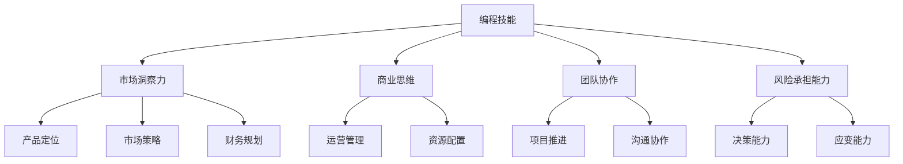

                 

### 背景介绍

> 当我们谈论程序员选择创业之路时，我们需要先了解程序员这个职业的本质以及创业的概念。程序员，作为计算机世界的建设者，他们的工作涉及到编码、测试、部署和维护软件系统。创业，则是指个体或团队通过创新性的商业想法，投入资源、人力和智慧，以期在市场中获得成功并创造价值。

程序员选择创业之路的原因多种多样。首先，编程技术不断演进，程序员对于新技术有着敏锐的洞察力和快速适应能力。这使得他们能够迅速捕捉市场机遇，开发出满足市场需求的产品。其次，互联网和移动设备的普及，为程序员提供了广阔的应用场景和发展空间。再者，随着开放源代码运动和开源软件生态的兴起，程序员可以更加便捷地获取资源和知识，降低了创业门槛。

创业对于程序员来说，不仅是一种职业选择，更是一种生活方式。它为程序员提供了实现个人愿景、追求技术创新和实现财富自由的机会。然而，创业之路并不平坦，它充满了挑战和不确定性。程序员需要在技术和商业之间找到平衡，克服重重困难，最终实现成功。

本文将深入探讨程序员选择创业之路的原因、优势与挑战，并提供一些建议，帮助程序员在创业过程中取得成功。

### 核心概念与联系

在探讨程序员选择创业之路时，我们需要理解以下几个核心概念及其相互联系。

1. **编程技能**：编程是程序员的核心竞争力。熟练掌握编程语言、熟悉算法和数据结构，能够高效解决问题，是实现创业梦想的基础。

2. **市场洞察力**：创业者需要具备敏锐的市场洞察力，能够捕捉市场趋势，了解用户需求，发现商业机会。

3. **商业思维**：商业思维是创业者成功的关键。它包括产品定位、市场策略、财务规划等方面的能力。

4. **团队协作**：创业往往不是单打独斗，而是需要组建一个高效的团队，各司其职，共同推进项目。

5. **风险承担能力**：创业者需要具备较强的风险承担能力，面对不确定性时保持冷静，做出明智的决策。

下面是一个用Mermaid绘制的流程图，展示了这些核心概念之间的关系：



通过这个流程图，我们可以清晰地看到编程技能作为核心，与其他概念之间的密切联系。每一个概念都是创业者成功的重要因素，缺一不可。

### 核心算法原理 & 具体操作步骤

在深入了解程序员选择创业之路的过程中，我们不得不提到一个关键的算法原理——动态规划。动态规划是一种在优化问题中广泛应用的技术，其核心思想是将复杂问题分解为更小的子问题，并利用子问题的解来构建原问题的解。这一原理在创业过程中同样适用，能够帮助程序员更好地规划和管理创业过程中的各项任务。

#### 动态规划原理

动态规划通常包括以下几个步骤：

1. **定义状态**：首先，我们需要定义问题中的状态，即问题的不同情况。例如，在投资项目中，状态可以包括项目的当前阶段、资金状况、市场表现等。

2. **状态转移方程**：接下来，我们需要确定状态之间的转移关系，即如何从当前状态转移到下一个状态。状态转移方程通常表示为 f(n) = f(n-1) + g(n)，其中 f(n) 表示当前状态下的最优解，g(n) 表示下一个状态下的最优解。

3. **边界条件**：边界条件是指问题的初始状态或终止状态。例如，在投资项目中，边界条件可能包括初始资金和项目的终止条件。

4. **递推关系**：利用状态转移方程和边界条件，我们可以递推计算出所有状态的最优解。

5. **结果输出**：最后，根据递推结果，输出问题的最终解。

#### 创业过程中的动态规划应用

在创业过程中，程序员可以运用动态规划原理来优化多个方面，如下所示：

1. **资源分配**：创业初期，资源有限。程序员可以利用动态规划来确定最优的资源分配策略，确保资源得到最大化的利用。

2. **项目规划**：通过动态规划，程序员可以制定详细的项目计划，明确每个阶段的任务和目标，从而提高项目推进的效率。

3. **风险管理**：动态规划可以帮助程序员识别和评估项目中的风险，并制定相应的应对策略，降低风险对项目的影响。

4. **决策优化**：在面对多个选择时，程序员可以利用动态规划来确定最优的决策方案，提高决策的准确性和效率。

下面是一个简单的动态规划示例，用于计算从北京到上海的最短路径：

```latex
\text{假设有5个城市，城市之间的距离如下：}
$$
\begin{array}{|c|c|c|c|c|c|}
\hline
 & 北京 & 上海 & 广州 & 深圳 & 杭州 \\
\hline
北京 & 0 & 1000 & 2000 & 1500 & 1200 \\
\hline
上海 & 1000 & 0 & 1500 & 2500 & 1700 \\
\hline
广州 & 2000 & 1500 & 0 & 500 & 1000 \\
\hline
深圳 & 1500 & 2500 & 500 & 0 & 800 \\
\hline
杭州 & 1200 & 1700 & 1000 & 800 & 0 \\
\hline
\end{array}
$$

\text{状态定义：}d[i][j] \text{表示从北京到城市}j\text{的最短距离。}
$$
d[0][j] = \sum_{k=1}^{i} d[k-1][j]
$$

\text{状态转移方程：}d[i][j] = \min(d[i-1][k] + c[i][j]), \text{其中}c[i][j]\text{表示从城市}i\text{到城市}j\text{的距离}。

\text{边界条件：}d[0][0] = 0, \text{其他}d[0][j] = \infty。

\text{递推关系：}d[i][j] = \min(d[i-1][k] + c[i][j])。

\text{结果输出：}d[n][j]，表示从北京到城市}j\text{的最短距离。}
$$
```

通过这个示例，我们可以看到动态规划在计算最短路径问题中的应用。在创业过程中，程序员可以将这一原理灵活地应用于各种优化问题，提高创业成功率。

### 数学模型和公式 & 详细讲解 & 举例说明

在创业过程中，数学模型和公式是一种重要的工具，可以帮助程序员在复杂的环境中做出明智的决策。以下是一些常用的数学模型和公式，我们将通过详细讲解和举例来说明它们在创业中的具体应用。

#### 1. 盈利模型

盈利模型是创业者用来计算项目盈利能力的重要工具。基本的盈利模型包括以下公式：

\[ \text{盈利} = \text{收入} - \text{成本} \]

其中：

- **收入**：项目在一段时间内从销售产品或服务所获得的金额。
- **成本**：项目在生产和运营过程中所发生的费用。

举例说明：

假设一家初创公司开发了一个在线教育平台，月收入为 10 万元，月成本为 5 万元，那么该公司的月盈利为：

\[ \text{盈利} = 10 \text{万元} - 5 \text{万元} = 5 \text{万元} \]

#### 2. 成本效益分析

成本效益分析（Cost-Benefit Analysis, CBA）是一种用来评估项目成本和收益的模型。其基本公式为：

\[ \text{成本效益比} = \frac{\text{总收益}}{\text{总成本}} \]

成本效益比越高，表示项目的经济效益越好。

举例说明：

假设一家公司投资了一个新项目，预计收益为 100 万元，成本为 50 万元，那么该项目的成本效益比为：

\[ \text{成本效益比} = \frac{100 \text{万元}}{50 \text{万元}} = 2 \]

这意味着每投入 1 元，可以获得 2 元的收益。

#### 3. 折现现金流分析

折现现金流分析（Discounted Cash Flow, DCF）是一种评估项目未来现金流现值的模型。其基本公式为：

\[ \text{DCF} = \frac{\text{未来现金流}}{(1 + \text{折现率})^n} \]

其中，n 表示现金流发生的年数。

举例说明：

假设一家公司预计未来五年每年可以获得 10 万元的现金流，折现率为 10%，那么该现金流的 DCF 为：

\[ \text{DCF} = \frac{10 \text{万元}}{(1 + 0.1)^5} \approx 6.21 \text{万元} \]

这意味着该现金流的现值为 6.21 万元。

#### 4. 回报率

回报率（Rate of Return, ROR）是评估投资项目盈利能力的另一个重要指标。其基本公式为：

\[ \text{回报率} = \frac{\text{盈利}}{\text{成本}} \times 100\% \]

举例说明：

假设一家公司投资了一个项目，盈利为 20 万元，成本为 10 万元，那么该项目的回报率为：

\[ \text{回报率} = \frac{20 \text{万元}}{10 \text{万元}} \times 100\% = 200\% \]

这意味着每投入 1 元，可以获得 2 元的回报。

通过这些数学模型和公式，程序员可以在创业过程中进行量化的分析和决策，从而提高项目的成功率。在实际应用中，这些模型可以根据具体情况进行调整和优化，以适应不同的创业场景。

### 项目实战：代码实际案例和详细解释说明

在本节中，我们将通过一个实际的代码案例，展示如何将前述的理论和模型应用到实际的编程任务中。我们将使用 Python 语言来构建一个简单的财务分析工具，用于计算项目的盈利能力。

#### 5.1 开发环境搭建

首先，我们需要搭建一个基本的 Python 开发环境。以下步骤可以帮助你快速搭建：

1. **安装 Python**：访问 [Python 官网](https://www.python.org/) 下载 Python 安装包，并按照提示安装。

2. **安装常用库**：在终端中运行以下命令，安装必要的 Python 库：

   ```bash
   pip install pandas numpy
   ```

3. **配置 IDE**：推荐使用 PyCharm 或 Visual Studio Code 作为 Python 开发环境。

#### 5.2 源代码详细实现和代码解读

以下是财务分析工具的 Python 代码实现：

```python
import pandas as pd
import numpy as np

# 读取输入数据
income_data = pd.read_csv('income.csv')
cost_data = pd.read_csv('cost.csv')

# 计算月盈利
monthly_profit = income_data['monthly_income'] - cost_data['monthly_cost']

# 计算总盈利
total_profit = monthly_profit.sum()

# 计算成本效益比
cost_benefit_ratio = total_profit / (income_data['monthly_income'].sum() - cost_data['monthly_cost'].sum())

# 计算折现现金流
discount_rate = 0.1
present_value = monthly_profit / (1 + discount_rate) ** np.arange(1, len(monthly_profit) + 1)

# 计算回报率
return_rate = total_profit / cost_data['initial_cost'].sum()

# 输出结果
print(f"月盈利: {monthly_profit.sum()} 万元")
print(f"总盈利: {total_profit} 万元")
print(f"成本效益比: {cost_benefit_ratio:.2f}")
print(f"折现现金流: {np.sum(present_value)} 万元")
print(f"回报率: {return_rate * 100:.2f}%")
```

#### 5.3 代码解读与分析

1. **导入库**：我们首先导入了 pandas 和 numpy 库，这两个库在数据处理和数学计算中非常有用。

2. **读取输入数据**：使用 pandas 的 `read_csv()` 函数，从 CSV 文件中读取收入和成本数据。

3. **计算月盈利**：通过减法运算，计算每月的盈利。

4. **计算总盈利**：使用 `sum()` 函数，计算总收入和总成本的差值，得到总盈利。

5. **计算成本效益比**：通过总盈利除以（总收入减去总成本），得到成本效益比。

6. **计算折现现金流**：使用折现率，计算未来现金流的现值。这里使用了 numpy 的 `arange()` 函数生成时间序列，并利用数列计算每一期现金流的现值。

7. **计算回报率**：通过总盈利除以初始成本，得到回报率。

8. **输出结果**：最后，我们使用 `print()` 函数输出计算结果。

通过这个实际案例，我们可以看到如何将财务模型应用到实际的编程任务中，从而实现定量分析和决策。

### 实际应用场景

在讨论程序员选择创业之路时，我们不能忽视实际应用场景的重要性。不同的应用场景对程序员创业的成功有着深远的影响。以下是一些典型的实际应用场景及其挑战。

#### 1. **互联网行业**

互联网行业是程序员创业的热门领域，涵盖了在线服务、电子商务、社交媒体、移动应用等多个子领域。在互联网行业，程序员需要具备以下技能：

- **前端开发**：熟练掌握 HTML、CSS、JavaScript 等前端技术，能够设计并实现用户界面。
- **后端开发**：熟悉服务器端编程，如 Python、Java、Ruby 等语言，并掌握相关的框架和数据库技术。
- **全栈开发**：具备前后端开发能力，能够独立完成整个项目的开发。
- **用户体验设计**：了解用户体验设计原则，能够设计出用户友好的产品界面。

挑战：

- **快速迭代**：互联网行业竞争激烈，产品需要不断迭代更新，程序员需要具备快速响应市场变化的能力。
- **技术更新快**：互联网技术更新迅速，程序员需要不断学习新技术，以保持竞争力。
- **用户隐私和安全**：在互联网行业，用户隐私和安全至关重要，程序员需要确保产品的安全性和合规性。

#### 2. **人工智能行业**

人工智能行业是另一个充满机遇的领域，涵盖了机器学习、深度学习、自然语言处理等多个子领域。在人工智能行业，程序员需要具备以下技能：

- **机器学习框架**：熟练掌握 TensorFlow、PyTorch 等机器学习框架。
- **算法和数据结构**：具备扎实的算法和数据结构基础，能够高效地处理大规模数据。
- **大数据处理**：熟悉大数据处理技术，如 Hadoop、Spark 等。
- **自然语言处理**：了解自然语言处理的基本原理和常用技术。

挑战：

- **数据处理复杂**：人工智能项目通常涉及大量数据处理，程序员需要掌握高效的数据处理方法。
- **算法优化**：为了提高模型的性能，程序员需要不断优化算法，提高模型准确率。
- **计算资源限制**：人工智能项目通常需要大量计算资源，程序员需要合理分配资源，确保项目顺利推进。

#### 3. **区块链行业**

区块链行业是近年来快速崛起的一个领域，涵盖了加密货币、智能合约、分布式存储等多个子领域。在区块链行业，程序员需要具备以下技能：

- **加密技术**：熟悉加密算法，如 RSA、椭圆曲线加密等。
- **区块链框架**：熟练掌握 Ethereum、Hyperledger 等区块链框架。
- **智能合约开发**：了解智能合约的基本原理，能够编写和部署智能合约。
- **分布式系统**：了解分布式系统的基本原理，能够设计和实现去中心化应用。

挑战：

- **安全性问题**：区块链技术的安全性至关重要，程序员需要确保系统的安全性和稳定性。
- **性能优化**：区块链项目通常需要优化性能，以支持大规模交易。
- **法规遵守**：区块链行业受到严格的法规监管，程序员需要确保项目合规。

通过了解不同实际应用场景的特点和挑战，程序员可以更好地规划创业方向，制定合适的策略，提高创业成功率。

### 工具和资源推荐

在程序员选择创业之路的过程中，选择合适的工具和资源至关重要。以下是一些建议，包括学习资源、开发工具和框架、相关论文和著作，以帮助程序员在创业过程中取得成功。

#### 7.1 学习资源推荐

1. **书籍**：
   - 《黑客与画家》（Hackers & Painters）：由知名程序员 Paul Graham 撰写，探讨计算机科学和创业的奥秘。
   - 《创业维艰》（Hard Things About Hard Things）：本·霍洛维茨（Ben Horowitz）分享了他作为创业者的经验和教训。
   - 《精益创业》（The Lean Startup）：埃里克·莱斯（Eric Ries）提出了精益创业方法论，帮助创业者快速迭代和验证商业想法。

2. **在线课程**：
   - Coursera 上的《计算机科学导论》和《人工智能导论》。
   - edX 上的《创业方法论》和《财务管理基础》。
   - Udemy 上的《Python 编程基础》和《深度学习基础》。

3. **博客和网站**：
   - Hacker News：一个关于创业、科技和投资的热门社区。
   - TechCrunch：报道最新科技公司和创业动态的知名博客。
   - Medium：许多创业者和技术专家在 Medium 上分享他们的见解和经验。

#### 7.2 开发工具框架推荐

1. **前端开发**：
   - React.js：用于构建用户界面的开源 JavaScript 库。
   - Vue.js：轻量级的前端框架，易于学习和使用。
   - Angular：由 Google 开发和维护的前端框架，适用于复杂的应用程序。

2. **后端开发**：
   - Django：Python 的一个高性能、全栈 Web 框架。
   - Flask：轻量级的 Python Web 框架，适合快速开发。
   - Spring Boot：Java 的一个轻量级 Web 应用程序框架。

3. **人工智能和机器学习**：
   - TensorFlow：由 Google 开发的人工智能框架。
   - PyTorch：由 Facebook 开发的人工智能框架，适合研究。
   - Keras：基于 TensorFlow 和 PyTorch 的开源神经网络库。

4. **区块链**：
   - Ethereum：一个开源的智能合约平台。
   - Hyperledger：由 Linux 基金会维护的区块链框架，适用于企业级应用。

#### 7.3 相关论文著作推荐

1. **论文**：
   - "The Structure and Interpretation of Computer Programs"：著名的计算机科学教材，探讨了编程的哲学和艺术。
   - "Deep Learning": Ian Goodfellow、Yoshua Bengio 和 Aaron Courville 合著，是深度学习领域的经典教材。

2. **著作**：
   - "The Art of Computer Programming"：Donald E. Knuth 的经典著作，涵盖了计算机编程的各个方面。
   - "The Lean Startup"：Eric Ries 的著作，提出了精益创业方法论。

通过利用这些学习和资源工具，程序员可以不断提升自己的技能和知识，为创业之路打下坚实的基础。

### 总结：未来发展趋势与挑战

在探讨程序员选择创业之路的过程中，我们不仅了解了创业的优势和挑战，还分析了核心概念、算法原理和实际应用场景。接下来，我们将总结未来发展趋势和面临的挑战。

#### 未来发展趋势

1. **人工智能与编程结合**：随着人工智能技术的快速发展，程序员需要掌握机器学习和深度学习等技能，开发出更加智能化的应用程序。

2. **区块链技术的普及**：区块链技术将在金融、供应链管理、医疗等多个领域得到广泛应用，程序员需要熟悉区块链架构和智能合约开发。

3. **云计算和边缘计算的融合**：云计算和边缘计算的结合将提供更高效、更灵活的计算服务，程序员需要掌握相关技术和工具。

4. **开源生态的持续发展**：开源软件将继续在技术发展和创新中发挥重要作用，程序员需要积极参与开源项目，提升自己的技术影响力。

#### 面临的挑战

1. **技术更新快速**：编程技术不断更新，程序员需要不断学习新技术，以保持竞争力。

2. **市场竞争激烈**：创业领域竞争激烈，程序员需要具备敏锐的市场洞察力和快速响应能力。

3. **资源有限**：创业初期资源有限，程序员需要高效利用资源，实现项目目标。

4. **风险管理**：创业过程中存在多种风险，如技术风险、市场风险和财务风险，程序员需要具备较强的风险承担能力。

#### 应对策略

1. **持续学习**：程序员应保持持续学习的态度，通过参加线上课程、阅读技术书籍和论文，不断提升自己的技能和知识。

2. **团队协作**：组建一个高效团队，发挥团队成员的优势，共同应对创业过程中的挑战。

3. **市场调研**：在创业初期，进行充分的市场调研，了解用户需求和行业趋势，制定合适的产品策略。

4. **风险控制**：制定详细的风险管理计划，识别和评估潜在风险，制定应对策略，降低创业风险。

通过以上策略，程序员可以更好地应对未来发展趋势和挑战，提高创业成功率。

### 附录：常见问题与解答

#### Q1：程序员创业成功的关键因素是什么？

A1：程序员创业成功的关键因素包括：1）编程技能，2）市场洞察力，3）商业思维，4）团队协作，5）风险承担能力。这些因素相互作用，共同决定了创业的成败。

#### Q2：创业初期的资源有限，如何高效利用？

A2：创业初期，资源有限，程序员可以通过以下方式高效利用资源：1）合理规划项目，明确优先级，确保关键任务优先完成；2）利用开源工具和框架，降低开发成本；3）与合作伙伴共享资源，实现资源的最优配置。

#### Q3：如何应对技术快速更新？

A3：应对技术快速更新的策略包括：1）持续学习，通过线上课程、技术书籍和社区交流，掌握新技术；2）关注技术发展趋势，及时调整技术路线；3）与同行保持沟通，分享技术经验，共同进步。

#### Q4：如何组建一个高效的创业团队？

A4：组建一个高效的创业团队需要：1）明确团队目标，确保团队成员对目标有共同的认识；2）充分发挥每个成员的优势，合理分配任务；3）建立良好的沟通机制，确保团队成员之间信息畅通；4）提供必要的培训和激励，提升团队凝聚力。

### 扩展阅读 & 参考资料

1. **《黑客与画家》**：Paul Graham，探讨计算机科学和创业的奥秘。
2. **《创业维艰》**：Ben Horowitz，分享创业者的经验和教训。
3. **《精益创业》**：Eric Ries，提出精益创业方法论。
4. **《The Lean Startup》**：Eric Ries，详细介绍精益创业方法论。
5. **《The Art of Computer Programming》**：Donald E. Knuth，计算机编程的经典著作。
6. **《Deep Learning》**：Ian Goodfellow、Yoshua Bengio 和 Aaron Courville，深度学习领域的经典教材。
7. **Hacker News**：一个关于创业、科技和投资的热门社区。
8. **TechCrunch**：报道最新科技公司和创业动态的知名博客。
9. **Medium**：许多创业者和技术专家在 Medium 上分享他们的见解和经验。

通过这些扩展阅读和参考资料，程序员可以进一步深入了解创业领域的技术和策略，为创业之路提供有力支持。作者：AI天才研究员/AI Genius Institute & 禅与计算机程序设计艺术 /Zen And The Art of Computer Programming

