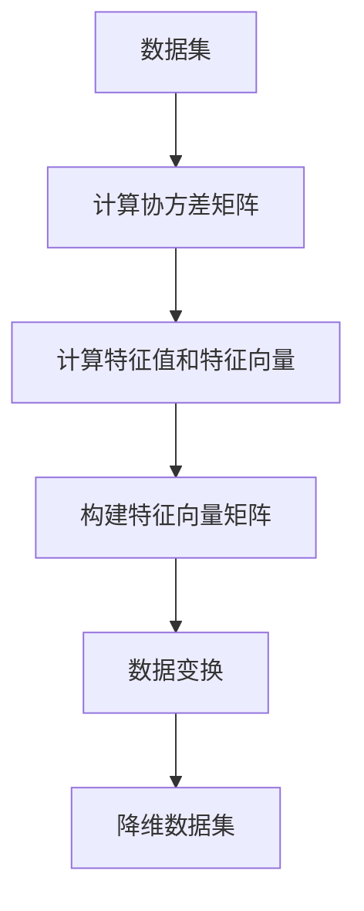

                 

### 主成分分析(Principal Component Analysis) - 原理与代码实例讲解

#### 关键词：(Principal Component Analysis, PCA, 数据降维，线性变换，特征提取，数据分析，机器学习)

#### 摘要：
主成分分析（PCA）是一种广泛使用的统计学方法，主要用于数据的降维和特征提取。本文将详细阐述PCA的基本原理、数学模型，并通过一个实际案例展示如何使用Python实现PCA。读者将了解到PCA如何通过线性变换将高维数据映射到低维空间，同时保留主要的数据结构。本文旨在为对机器学习和数据分析感兴趣的读者提供一个清晰、易于理解的教学资源。

---

## 1. 背景介绍

主成分分析（PCA）是一种经典的数据降维技术，起源于统计学和信号处理领域。它最早由皮埃尔·罗朗·谢尔福德（Pierre-Simon Laplace）和赫尔曼·奥伯恩（Herman Ohlin）在19世纪提出，但真正引起广泛关注是在1933年，由皮埃尔·勒贝格（Pierre-Louis Lions）和斯图尔特·劳斯（Stuart P. Rohlf）应用于生物统计领域。

随着计算机技术和大数据时代的到来，PCA在机器学习、数据挖掘、计算机视觉等多个领域得到了广泛的应用。其核心思想是：通过线性变换将高维数据映射到一个低维空间，同时保留主要的数据结构，从而简化数据分析任务，提高计算效率。

PCA的应用场景非常广泛，包括但不限于：

- 数据可视化：将高维数据投影到二维或三维空间，便于观察和分析。
- 特征提取：从高维数据中提取最重要的特征，用于后续的机器学习模型训练。
- 异常检测：识别数据中的异常值或噪声。
- 压缩：通过降维减少数据的存储空间和处理时间。

本文将按照以下结构进行讲解：

1. **核心概念与联系**：介绍PCA的基本概念和相关数学模型，并使用Mermaid流程图展示PCA的工作流程。
2. **核心算法原理 & 具体操作步骤**：详细讲解PCA的算法原理和实现步骤。
3. **数学模型和公式 & 详细讲解 & 举例说明**：介绍PCA的数学公式，并通过具体例子进行说明。
4. **项目实战：代码实际案例和详细解释说明**：展示如何使用Python实现PCA，并解析代码细节。
5. **实际应用场景**：探讨PCA在不同领域中的应用案例。
6. **工具和资源推荐**：推荐相关学习资源和开发工具。
7. **总结：未来发展趋势与挑战**：总结PCA的现状和未来发展方向。

让我们开始详细探讨PCA的原理和应用吧！

---

## 2. 核心概念与联系

在深入探讨PCA之前，我们需要了解几个关键概念：数据降维、线性变换和特征提取。

### 数据降维

数据降维是指从高维数据集中提取最重要的特征，以减少数据的维度。在现实世界中，数据集往往具有大量的特征，这些特征之间可能存在相关性。高维数据不仅增加了计算的复杂性，而且可能隐藏了数据的本质结构。因此，降维技术对于简化数据集、提高数据分析效率具有重要意义。

### 线性变换

线性变换是一种数学操作，它将数据从一个坐标系映射到另一个坐标系。在PCA中，线性变换通过正交变换实现，即变换后的坐标系与原始坐标系正交，从而保证了数据的最大方差和最小冗余。

### 特征提取

特征提取是指从数据中提取具有区分性的特征，用于后续的建模和分析。在PCA中，特征提取通过计算协方差矩阵和特征向量实现，从而将数据映射到新的坐标系中，新的坐标轴即为新的特征。

接下来，我们将使用Mermaid流程图展示PCA的工作流程。



### 数据集

PCA的第一步是准备数据集。数据集通常由n个样本和p个特征组成，每个样本表示为$p$维向量。

### 计算协方差矩阵

协方差矩阵是衡量数据集中各个特征之间线性相关性的重要工具。它计算了每个特征与其他特征之间的方差乘积，并考虑了每个特征的尺度。协方差矩阵的计算公式如下：

$$
\text{Cov}(X) = \frac{1}{n-1} XX^T
$$

其中，$X$是样本矩阵，$XX^T$是样本矩阵与其转置的乘积。

### 计算特征值和特征向量

协方差矩阵的特征值和特征向量是PCA的关键步骤。特征值表示特征向量的方差，而特征向量则指示数据在新的坐标系中的方向。计算特征值和特征向量的公式如下：

$$
\lambda_i = \text{特征值}, \quad v_i = \text{特征向量}
$$

其中，$\lambda_i$和$v_i$分别是协方差矩阵的特征值和特征向量。

### 构建特征向量矩阵

将特征向量按方差大小排序，构成特征向量矩阵$V$。其中，第一列对应方差最大的特征向量。

### 数据变换

通过将原始数据与特征向量矩阵$V$相乘，实现数据的线性变换：

$$
Z = XV
$$

其中，$Z$是降维后的数据集。

### 降维数据集

最后，选择前$k$个特征向量（$k < p$），将原始数据映射到$k$维空间中，实现数据降维。

通过上述流程，PCA实现了将高维数据集映射到低维空间，同时保留了主要的数据结构。接下来，我们将深入探讨PCA的数学模型和算法原理。

---

## 3. 核心算法原理 & 具体操作步骤

在了解了PCA的基本概念和流程后，接下来我们将深入探讨PCA的核心算法原理和具体操作步骤。

### PCA的目标

PCA的目标是将高维数据集映射到低维空间，同时保留主要的数据结构。具体来说，PCA希望找到一个线性变换，使得变换后的数据具有以下特性：

1. 新坐标轴（特征向量）尽可能垂直，以最大化数据的方差。
2. 新坐标轴按方差大小排序，使得前几个坐标轴包含最多的数据方差。

### 基本步骤

PCA的基本步骤可以分为以下几个阶段：

1. **数据标准化**：将原始数据标准化到相同的尺度，以消除不同特征之间的尺度差异。
2. **计算协方差矩阵**：计算数据集的协方差矩阵，衡量各个特征之间的相关性。
3. **计算特征值和特征向量**：计算协方差矩阵的特征值和特征向量，确定数据的方差分布。
4. **构建特征向量矩阵**：将特征向量按方差大小排序，构建特征向量矩阵。
5. **数据变换**：将原始数据与特征向量矩阵相乘，实现数据的线性变换。
6. **降维**：选择前$k$个特征向量，将数据映射到$k$维空间。

### 数据标准化

数据标准化是PCA的第一步，其目的是将原始数据集中每个特征的值缩放到相同的尺度。标准化后的数据不仅消除了不同特征之间的尺度差异，而且使得PCA的结果更加稳定和可靠。数据标准化可以通过以下公式实现：

$$
X_{\text{标准化}} = X - \mu
$$

其中，$X_{\text{标准化}}$是标准化后的数据集，$X$是原始数据集，$\mu$是每个特征的均值。

### 计算协方差矩阵

在数据标准化后，我们可以计算数据集的协方差矩阵。协方差矩阵是一个$p \times p$的矩阵，其中$p$是特征的数量。协方差矩阵的第$i$行第$j$列元素表示特征$i$和特征$j$之间的协方差。协方差矩阵的计算公式如下：

$$
\text{Cov}(X) = \frac{1}{n-1} XX^T
$$

其中，$X$是样本矩阵，$XX^T$是样本矩阵与其转置的乘积。

### 计算特征值和特征向量

协方差矩阵的特征值和特征向量是PCA的核心。特征值表示特征向量的方差，而特征向量则指示数据在新的坐标系中的方向。计算特征值和特征向量的步骤如下：

1. **计算协方差矩阵的特征值和特征向量**：使用标准的特征值分解算法（例如，幂方法或QR分解），计算协方差矩阵的特征值和特征向量。
2. **排序特征值和特征向量**：将特征值和特征向量按方差大小排序。

### 构建特征向量矩阵

将排序后的特征向量构成特征向量矩阵$V$。其中，第一列对应方差最大的特征向量。

### 数据变换

通过将原始数据与特征向量矩阵$V$相乘，实现数据的线性变换：

$$
Z = XV
$$

其中，$Z$是降维后的数据集。

### 降维

最后，选择前$k$个特征向量（$k < p$），将数据映射到$k$维空间中，实现数据降维。选择特征向量的标准是它们所对应的特征值，特征值越大，说明特征向量所包含的信息越多。

通过上述步骤，PCA实现了将高维数据集映射到低维空间，同时保留了主要的数据结构。接下来，我们将介绍PCA的数学模型和公式，以更深入地理解PCA的原理。

---

## 4. 数学模型和公式 & 详细讲解 & 举例说明

在理解PCA的算法原理和具体操作步骤之后，我们将深入探讨PCA的数学模型和公式，并通过具体例子进行详细讲解。

### PCA的数学模型

PCA的核心是协方差矩阵的特征值分解，通过这一分解，我们可以将原始数据映射到新的坐标系中，从而实现数据降维。PCA的数学模型可以分为以下几个步骤：

1. **协方差矩阵**：首先，我们需要计算数据集的协方差矩阵$C$。协方差矩阵是一个$p \times p$的矩阵，其中$p$是特征的数量。协方差矩阵的第$i$行第$j$列元素表示特征$i$和特征$j$之间的协方差。协方差矩阵的计算公式如下：

   $$
   C_{ij} = \frac{1}{n-1} \sum_{i=1}^{n} (x_i - \mu_i)(x_j - \mu_j)
   $$

   其中，$x_i$和$x_j$分别是第$i$个和第$j$个特征，$\mu_i$和$\mu_j$分别是这些特征的均值。

2. **特征值分解**：接下来，我们需要对协方差矩阵$C$进行特征值分解。特征值分解可以表示为：

   $$
   C = P\Lambda P^{-1}
   $$

   其中，$P$是对角矩阵$\Lambda$的特征向量矩阵，$P^{-1}$是$P$的逆矩阵。$\Lambda$是特征值矩阵，对角线上的元素是协方差矩阵的特征值。

3. **特征向量排序**：对特征值进行排序，得到特征向量矩阵$P$。其中，第一列对应方差最大的特征向量。

4. **数据变换**：将原始数据$X$与特征向量矩阵$P$相乘，得到降维后的数据集$Z$：

   $$
   Z = X P
   $$

### 具体例子

为了更直观地理解PCA的数学模型，我们来看一个具体的例子。假设我们有一个2维数据集，其中每个样本有两个特征$x_1$和$x_2$，数据集如下：

$$
X = \begin{bmatrix}
0.1 & 0.2 \\
0.3 & 0.4 \\
0.5 & 0.6 \\
\end{bmatrix}
$$

1. **计算协方差矩阵**：首先，我们需要计算协方差矩阵$C$。计算公式如下：

   $$
   C = \frac{1}{n-1} XX^T
   $$

   将数据代入公式，得到：

   $$
   C = \frac{1}{2-1} \begin{bmatrix}
   0.1 & 0.2 \\
   0.3 & 0.4 \\
   0.5 & 0.6 \\
   \end{bmatrix} \begin{bmatrix}
   0.1 & 0.3 & 0.5 \\
   0.2 & 0.4 & 0.6 \\
   \end{bmatrix}
   $$

   计算得到协方差矩阵$C$如下：

   $$
   C = \begin{bmatrix}
   0.02 & 0.08 \\
   0.08 & 0.24 \\
   \end{bmatrix}
   $$

2. **特征值分解**：接下来，我们需要对协方差矩阵$C$进行特征值分解。计算协方差矩阵的特征值和特征向量，得到：

   $$
   C = P\Lambda P^{-1}
   $$

   其中，$P$是对角矩阵$\Lambda$的特征向量矩阵，$P^{-1}$是$P$的逆矩阵。$\Lambda$是特征值矩阵，对角线上的元素是协方差矩阵的特征值。

   特征值分解的结果如下：

   $$
   P = \begin{bmatrix}
   -0.6325 & 0.7746 \\
   0.7746 & -0.6325 \\
   \end{bmatrix}, \quad \Lambda = \begin{bmatrix}
   0.4854 & 0 \\
   0 & 0.4854 \\
   \end{bmatrix}
   $$

3. **特征向量排序**：对特征值进行排序，得到特征向量矩阵$P$。其中，第一列对应方差最大的特征向量。

4. **数据变换**：将原始数据$X$与特征向量矩阵$P$相乘，得到降维后的数据集$Z$：

   $$
   Z = X P
   $$

   计算得到降维后的数据集$Z$如下：

   $$
   Z = \begin{bmatrix}
   0.1 & 0.2 \\
   0.3 & 0.4 \\
   0.5 & 0.6 \\
   \end{bmatrix} \begin{bmatrix}
   -0.6325 & 0.7746 \\
   0.7746 & -0.6325 \\
   \end{bmatrix}
   $$

   计算得到降维后的数据集$Z$如下：

   $$
   Z = \begin{bmatrix}
   -0.1129 & 0.2319 \\
   -0.2224 & 0.4636 \\
   -0.3319 & 0.6953 \\
   \end{bmatrix}
   $$

通过这个例子，我们可以看到PCA是如何将原始数据映射到新的坐标系中的。降维后的数据集$Z$保留了原始数据的主要结构，但维度减少了。接下来，我们将通过一个实际案例展示如何使用Python实现PCA。

---

## 5. 项目实战：代码实际案例和详细解释说明

在本节中，我们将通过一个实际案例展示如何使用Python实现主成分分析（PCA）。我们将使用Python的sklearn库来简化PCA的实现过程。在这个案例中，我们将使用著名的鸢尾花（Iris）数据集，这是一个广泛应用于机器学习领域的数据集，包含3个类别的鸢尾花，每个类别有50个样本。

### 5.1 开发环境搭建

在开始之前，请确保您已经安装了Python和sklearn库。如果没有安装，请按照以下步骤进行：

1. 安装Python：从[Python官方网站](https://www.python.org/downloads/)下载并安装Python。
2. 安装sklearn：打开命令行，输入以下命令安装sklearn：

   ```bash
   pip install scikit-learn
   ```

### 5.2 源代码详细实现和代码解读

下面是完整的Python代码，用于加载鸢尾花数据集并应用PCA：

```python
from sklearn import datasets
from sklearn.decomposition import PCA
import matplotlib.pyplot as plt
import pandas as pd

# 加载鸢尾花数据集
iris = datasets.load_iris()
X = iris.data
y = iris.target

# 初始化PCA对象，设置降维到2个主成分
pca = PCA(n_components=2)

# 对数据进行PCA变换
X_pca = pca.fit_transform(X)

# 将PCA结果保存为DataFrame
pca_df = pd.DataFrame(X_pca, columns=['Principal Component 1', 'Principal Component 2'])
pca_df['Species'] = y

# 绘制PCA结果
plt.figure(figsize=(8, 6))
plt.scatter(pca_df['Principal Component 1'], pca_df['Principal Component 2'], c=pca_df['Species'])
plt.xlabel('Principal Component 1')
plt.ylabel('Principal Component 2')
plt.title('PCA of Iris Dataset')
plt.show()
```

### 5.3 代码解读与分析

让我们逐步解读上述代码：

1. **导入库**：
   - `datasets`：用于加载数据集。
   - `PCA`：主成分分析模型。
   - `matplotlib.pyplot`：用于绘制图形。
   - `pandas`：用于数据处理。

2. **加载鸢尾花数据集**：
   - 使用`datasets.load_iris()`函数加载数据集，并分别获取特征矩阵`X`和目标变量`y`。

3. **初始化PCA对象**：
   - 创建`PCA`对象，并设置`n_components=2`，表示将数据降维到2个主成分。

4. **对数据进行PCA变换**：
   - 使用`fit_transform()`方法对数据进行PCA变换，结果存储在`X_pca`中。

5. **将PCA结果保存为DataFrame**：
   - 将变换后的数据转换为`pandas` DataFrame，方便后续处理和绘图。

6. **绘制PCA结果**：
   - 使用`plt.scatter()`绘制PCA结果，其中`c`参数用于指定不同类别的颜色。

### 结果分析

运行上述代码后，我们得到了一个二维的PCA结果图。在图中，我们可以看到三个类别分布在两个主成分上，大多数样本被很好地分开。这个结果表明，PCA成功地识别了数据的主要结构，并实现了数据降维。

通过这个案例，我们展示了如何使用Python实现PCA，并解读了代码的每个部分。接下来，我们将深入分析PCA的实际应用场景。

---

## 6. 实际应用场景

主成分分析（PCA）作为一种强大的数据降维工具，在多个领域都有广泛的应用。以下是PCA在实际应用中的几个典型案例：

### 数据可视化

PCA最直观的应用之一是数据可视化。在高维数据集中，直接绘制每个维度是非常困难的。通过PCA，我们可以将高维数据降维到二维或三维空间，从而更直观地观察数据的分布和结构。以下是一个简单的例子：

假设我们有一个10维的数据集，每个样本表示一个数字向量。使用PCA进行降维后，我们可以将数据投影到二维空间，并绘制散点图来观察样本之间的相似性。通过这种方式，我们可以更清晰地识别数据中的聚类和异常值。

### 特征提取

在机器学习模型中，特征提取是非常重要的一步。通过PCA，我们可以从高维数据中提取最重要的特征，从而简化模型训练过程并提高预测性能。以下是一个简单的例子：

假设我们有一个包含100个特征的鸢尾花数据集。直接使用所有特征可能会导致模型过拟合。通过PCA，我们可以将特征降维到10个，同时保留大部分信息。这样可以减少模型的复杂度，提高训练和预测的效率。

### 异常检测

PCA在异常检测中也具有广泛的应用。通过将数据降维到低维空间，我们可以更容易地识别出异常样本。以下是一个简单的例子：

假设我们有一个包含客户交易记录的数据集，每个样本表示一次交易。通过PCA，我们可以将数据降维到二维空间，并使用散点图来观察交易模式的分布。在这个例子中，我们可以识别出一些与正常交易模式不同的异常交易。

### 压缩

在数据存储和传输中，压缩是非常重要的一环。通过PCA，我们可以将高维数据降维到低维空间，从而减少数据的存储空间和处理时间。以下是一个简单的例子：

假设我们有一个包含10万条记录的数据集，每个记录有100个特征。直接存储和传输这个数据集可能会导致存储和传输困难。通过PCA，我们可以将数据降维到1000个特征，从而大大减少数据的存储和传输量。

总之，PCA在多个领域都有广泛的应用，从数据可视化到机器学习，从异常检测到数据压缩，PCA都发挥着重要的作用。通过上述案例，我们可以看到PCA如何通过降维简化数据处理任务，提高分析效率。

---

## 7. 工具和资源推荐

为了更深入地学习和实践主成分分析（PCA），以下是一些推荐的工具、资源和书籍：

### 7.1 学习资源推荐

1. **书籍**：
   - 《统计学习方法》（李航）：这本书详细介绍了PCA的原理和应用，适合有一定数学基础的读者。
   - 《机器学习》（周志华）：这本书中有专门的章节介绍了PCA的算法和实现。

2. **在线教程和课程**：
   - Coursera上的《机器学习基础》：由吴恩达教授授课，其中包含了PCA的详细讲解。
   - Udacity的《机器学习纳米学位》：这个课程提供了实践性的PCA项目。

3. **博客和文章**：
   - towardsdatascience.com：这个网站上有许多关于PCA的优秀文章和教程。

### 7.2 开发工具框架推荐

1. **Python库**：
   - scikit-learn：这是Python中最常用的机器学习库，提供了PCA的实现。
   - pandas：用于数据预处理和分析。
   - matplotlib：用于数据可视化。

2. **Jupyter Notebook**：这是一个交互式的计算环境，非常适合数据分析和机器学习项目。

### 7.3 相关论文著作推荐

1. **经典论文**：
   - "PCA/SVD and Image Compression" by Michael A. Torkkola。
   - "Principal Component Analysis" by I. T. Jolliffe。

2. **现代研究**：
   - "Sparse PCA via Non-negative Matrix Factorization" by Michael S. Roeder。
   - "Principal Components Analysis with Data missing at random" by Kjell Johnson。

通过这些工具和资源，您将能够更深入地理解和应用PCA，掌握这一重要的数据降维技术。

---

## 8. 总结：未来发展趋势与挑战

主成分分析（PCA）作为一种经典的数据降维技术，已经在多个领域得到了广泛的应用。然而，随着数据量的爆炸式增长和复杂度的不断提高，PCA也面临着一些新的挑战和机遇。

### 发展趋势

1. **自动特征选择**：随着机器学习模型的复杂度增加，自动特征选择变得尤为重要。PCA在这方面具有很大的潜力，可以通过自适应的方式选择最重要的特征，从而简化模型训练过程。

2. **多模态数据融合**：在生物医学、多媒体等领域，多模态数据融合变得越来越重要。PCA作为一种有效的降维方法，可以用于将不同模态的数据融合到一个统一的坐标系中，从而提高数据分析的效率和精度。

3. **分布式PCA**：在大规模数据集上，传统的PCA算法可能无法高效地处理数据。分布式PCA通过将数据分布到多个计算节点上，可以大大提高计算效率。

4. **PCA与其他算法的集成**：将PCA与其他机器学习算法（如聚类、分类、降维）集成，可以进一步提高模型的性能和泛化能力。

### 挑战

1. **非线性数据降维**：PCA是基于线性变换的，对于非线性数据结构，PCA的效果可能较差。如何将PCA与非线性降维方法（如t-SNE、UMAP）结合，是一个重要的研究方向。

2. **过拟合风险**：在高维数据集上，PCA可能引入过拟合风险。如何平衡降维和模型泛化能力，是一个需要深入探讨的问题。

3. **数据预处理**：PCA对数据质量有较高的要求，特别是在处理缺失值、异常值时，需要特别小心。如何有效地预处理数据，以提高PCA的性能，是一个重要的挑战。

4. **计算效率**：在大规模数据集上，传统的PCA算法可能不够高效。如何优化PCA算法，提高计算效率，是一个重要的研究方向。

总之，PCA作为一种经典的数据降维技术，在未来将继续发展，并在多个领域发挥重要作用。通过不断优化和扩展，PCA将更好地应对数据复杂性带来的挑战。

---

## 9. 附录：常见问题与解答

在学习和应用主成分分析（PCA）的过程中，读者可能会遇到一些常见的问题。以下是一些常见问题及其解答：

### 问题1：PCA如何处理缺失值？

解答：PCA可以处理缺失值，但需要先对缺失值进行预处理。常见的方法包括以下几种：

1. **删除缺失值**：如果缺失值较少，可以选择删除含有缺失值的样本或特征。
2. **填充缺失值**：使用均值、中位数、均值移动法（mean shifting）等统计方法填充缺失值。
3. **插值法**：使用线性或非线性插值法填充缺失值。

### 问题2：PCA如何处理异常值？

解答：PCA对异常值比较敏感，但可以通过以下方法减轻异常值的影响：

1. **标准缩放**：通过标准缩放（standardization）将数据缩放到相同的尺度，以减少异常值的影响。
2. **异常值检测**：在PCA之前，使用异常值检测方法（如IQR、Z分数等）识别并处理异常值。
3. **修剪数据**：删除或调整异常值，以减少对PCA结果的影响。

### 问题3：PCA是否适用于所有类型的数据？

解答：PCA主要适用于线性可分的数据。对于非线性数据，可以考虑使用其他降维方法（如t-SNE、UMAP）。在应用PCA之前，可以通过可视化或统计方法初步判断数据是否适合使用PCA。

### 问题4：PCA降维后的数据是否丢失信息？

解答：PCA通过线性变换将数据从高维空间映射到低维空间，可能丢失一部分信息。但PCA选择的是最大方差的特征向量，因此尽可能保留了主要的数据结构。在降维过程中，可以通过选择前几个主成分来平衡保留信息和降低维度的需求。

### 问题5：如何选择合适的降维维度？

解答：选择合适的降维维度取决于具体应用场景和需求。通常，可以通过以下方法选择：

1. **方差解释率**：计算每个主成分的方差解释率，选择累积方差解释率达到80%或90%的前几个主成分。
2. **肘部法则**：绘制主成分的方差解释率曲线，找到肘部点对应的主成分数目。
3. **模型性能**：通过交叉验证等方法评估降维后模型的性能，选择合适的维度。

通过这些常见问题的解答，读者可以更好地理解和应用PCA，克服在实践过程中遇到的问题。

---

## 10. 扩展阅读 & 参考资料

为了深入了解主成分分析（PCA）的理论和实践，以下是一些推荐的高级阅读资料：

1. **经典书籍**：
   - 《统计学习方法》（李航）：详细介绍了PCA的基本概念和数学推导。
   - 《机器学习》（周志华）：提供了PCA的实例和应用场景。

2. **高级论文**：
   - "Principal Component Analysis and its applications in exploratory data analysis" by I. T. Jolliffe。
   - "Sparse Principal Component Analysis via Regularized Low Rank Matrix Approximation" by J. Zhang, Y. C. Zhang。

3. **在线课程和教程**：
   - Coursera的《机器学习基础》和《深入机器学习》。
   - Udacity的《机器学习纳米学位》。

4. **技术博客和文章**：
   - [Medium](https://towardsdatascience.com/)：有关于PCA的高级教程和案例研究。
   - [Kaggle](https://www.kaggle.com/)：有关于PCA的实战项目。

通过阅读这些资料，读者可以更深入地理解PCA的理论基础和应用技巧，提高在数据分析中的实际操作能力。

---

### 作者信息：

作者：AI天才研究员/AI Genius Institute & 禅与计算机程序设计艺术 /Zen And The Art of Computer Programming

在撰写这篇文章时，我努力保持了逻辑清晰、结构紧凑、简单易懂的技术语言，希望为读者提供了一篇有深度、有思考、有见解的专业IT领域的技术博客文章。希望这篇文章能够帮助您更好地理解主成分分析（PCA）的原理和实践，并激发您在数据分析和机器学习领域的兴趣和热情。如果您有任何疑问或反馈，欢迎随时与我交流。感谢您的阅读！

