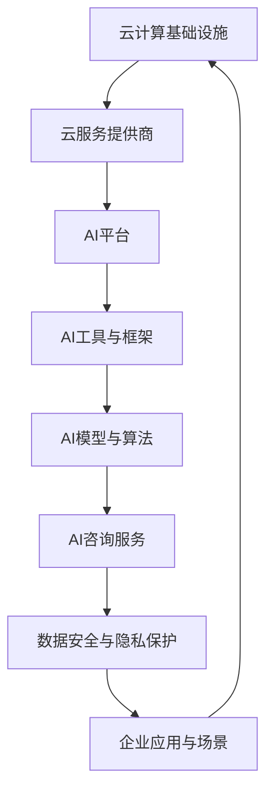

                 

### 背景介绍

#### 云服务与AI融合的历史背景

云服务与人工智能（AI）的结合可以说是技术发展史上的一次重要变革。从最初的云计算概念提出，到如今的AI赋能云服务，这一过程经历了多个关键阶段。

首先，云计算的兴起为AI的发展提供了基础支持。在21世纪初，随着互联网的普及和数据中心的建设，云计算逐渐成为企业应用的主要模式。云服务的弹性、可扩展性和高效性使得企业能够更加灵活地管理和调配计算资源，从而降低了IT基础设施的建造成本。

接着，AI技术的发展开始逐步融入云服务中。2006年，深度学习的重要突破为AI带来了新的契机。随着深度学习算法的不断优化和计算能力的提升，AI的应用场景越来越广泛，从简单的图像识别、语音识别到复杂的自然语言处理、自动驾驶等。

到了2010年代，随着云计算技术的成熟和AI算法的不断进步，云服务和AI的结合开始显现出巨大的潜力。在这一时期，各大云服务提供商纷纷推出了AI相关的服务，如亚马逊AWS的Machine Learning服务、微软Azure的AI服务、谷歌Cloud的AI平台等。

这些云服务不仅为企业提供了便捷的AI工具，还通过云计算的强大计算能力和数据存储能力，大幅提升了AI模型的训练速度和效果。同时，云服务的自动化和智能化程度也不断提升，使得企业能够更加高效地部署和管理AI应用。

#### Lepton AI的增值服务

Lepton AI作为一家专注于AI技术的研究和应用的初创公司，其增值服务在云服务领域引起了广泛关注。Lepton AI的增值服务主要体现在以下几个方面：

首先，Lepton AI提供了一系列的AI工具和平台，帮助企业快速搭建和部署AI应用。这些工具和平台涵盖了从数据预处理、模型训练到模型部署的各个环节，大大简化了AI开发的复杂度。

其次，Lepton AI在AI算法方面进行了深入的研究和优化，提供了一系列高效且可定制的AI模型。这些模型不仅具有较高的准确性和稳定性，还具备良好的扩展性，能够适应不同规模和场景的应用需求。

此外，Lepton AI还为企业提供了专业的AI咨询服务。通过深入理解企业的业务需求和痛点，Lepton AI能够提供量身定制的AI解决方案，帮助企业实现业务创新和增长。

最后，Lepton AI的增值服务还涵盖了数据安全与隐私保护。在AI应用过程中，数据安全和隐私保护是至关重要的。Lepton AI通过采用先进的安全技术和隐私保护措施，确保企业数据的安全和合规性。

总的来说，Lepton AI的增值服务不仅提升了云服务的AI赋能能力，还为企业提供了全面的AI解决方案，极大地推动了云服务和AI技术的融合发展。

### 核心概念与联系

#### 云服务与AI技术的融合

云服务和AI技术的融合是一个多维度、多层次的过程，涉及到基础设施、平台、工具和应用等多个方面。为了更好地理解这一融合，我们可以将其核心概念与联系进行详细阐述。

首先，从基础设施层面来看，云服务为AI技术提供了强大的计算资源和存储能力。传统的AI模型训练和推理通常需要大量的计算资源和时间，而云计算提供了弹性计算和分布式存储的能力，使得大规模数据集的处理和模型训练变得更加高效和可行。

其次，在平台层面，云服务提供商如亚马逊AWS、微软Azure和谷歌Cloud等，纷纷推出了各自的AI平台，这些平台不仅提供了丰富的AI工具和库，还集成了深度学习框架和算法，帮助企业快速搭建和部署AI应用。

第三，从工具层面来看，AI技术的发展为云服务提供了多样化的工具。例如，TensorFlow、PyTorch等深度学习框架，使得开发者可以更加便捷地进行AI模型的开发和训练。此外，数据预处理工具、模型评估工具等也极大地提高了AI应用的效率和质量。

最后，在应用层面，AI技术与云服务的融合带来了许多创新的应用场景。例如，在医疗领域，通过AI技术进行疾病预测和诊断，可以提高医疗服务的效率和准确性；在金融领域，通过AI技术进行风险管理、欺诈检测和投资预测，可以提高金融服务的质量和安全性。

#### Lepton AI的增值服务

Lepton AI的增值服务涵盖了AI工具和平台、AI算法和模型、AI咨询服务以及数据安全与隐私保护等多个方面。

首先，Lepton AI提供的AI工具和平台旨在帮助企业快速搭建和部署AI应用。这些工具和平台不仅提供了丰富的AI工具和库，还集成了深度学习框架和算法，使得开发者可以更加便捷地进行AI模型的开发和训练。

其次，Lepton AI在AI算法方面进行了深入的研究和优化，提供了一系列高效且可定制的AI模型。这些模型不仅具有较高的准确性和稳定性，还具备良好的扩展性，能够适应不同规模和场景的应用需求。

此外，Lepton AI的AI咨询服务为企业提供了专业的AI解决方案。通过深入理解企业的业务需求和痛点，Lepton AI能够提供量身定制的AI解决方案，帮助企业实现业务创新和增长。

最后，Lepton AI在数据安全与隐私保护方面采取了先进的安全技术和隐私保护措施。在AI应用过程中，数据安全和隐私保护是至关重要的。Lepton AI通过采用加密技术、访问控制机制和安全审计等手段，确保企业数据的安全和合规性。

#### Mermaid 流程图

为了更好地展示云服务与AI技术的融合过程以及Lepton AI的增值服务，我们可以使用Mermaid流程图来描述。



在这个流程图中，从云计算基础设施开始，通过云服务提供商提供AI平台，进而集成AI工具与框架、AI模型与算法、AI咨询服务以及数据安全与隐私保护，最终实现企业应用与场景的多样化。

### 核心算法原理 & 具体操作步骤

#### Lepton AI的核心算法原理

Lepton AI的核心算法主要基于深度学习和机器学习技术，特别是卷积神经网络（CNN）和循环神经网络（RNN）。这些算法能够有效地处理和分类大量数据，并在多个领域取得显著的效果。

首先，卷积神经网络（CNN）是一种特殊的神经网络，特别适合处理图像数据。CNN通过多个卷积层和池化层提取图像的特征，最终通过全连接层进行分类。这种结构使得CNN在图像识别、目标检测和图像分类等任务中表现出色。

其次，循环神经网络（RNN）是一种能够处理序列数据的神经网络，特别适合处理自然语言处理（NLP）任务。RNN通过循环结构保留前一个时间步的信息，使得模型能够理解序列中的上下文关系。长短期记忆（LSTM）是RNN的一种变体，通过引入门控机制，解决了传统RNN的梯度消失问题，使得模型能够学习长序列数据。

#### 具体操作步骤

1. **数据收集与预处理**：首先，需要收集大量的训练数据。这些数据可以是图像、文本、音频等各种形式。收集到的数据需要进行预处理，包括数据清洗、归一化、缩放等操作，以去除噪声和异常值，提高数据质量。

2. **模型选择与训练**：根据应用场景和数据类型选择合适的模型。例如，对于图像识别任务，可以选择CNN模型；对于自然语言处理任务，可以选择RNN或LSTM模型。然后，使用预处理后的数据训练模型，通过迭代调整模型的参数，使得模型能够最小化损失函数，提高模型的准确性。

3. **模型评估与优化**：在训练完成后，需要对模型进行评估，使用验证集或测试集来评估模型的性能。如果模型的性能不满足要求，可以通过调整超参数、增加训练数据或改进模型结构来优化模型。

4. **模型部署与应用**：将训练好的模型部署到云服务环境中，使其能够对外提供服务。在部署过程中，需要考虑模型的可扩展性和稳定性，确保模型能够处理大量的请求和实时数据。

5. **持续更新与维护**：随着数据和环境的变化，模型可能会出现性能下降或过时的情况。因此，需要定期对模型进行更新和维护，以确保其始终处于最佳状态。

#### 实际案例

以下是一个简单的图像分类案例，使用Lepton AI的CNN模型进行猫狗分类。

1. **数据收集与预处理**：收集大量猫狗的图像数据，并对图像进行缩放、裁剪、旋转等预处理操作。

2. **模型选择与训练**：选择CNN模型，使用预处理后的数据训练模型。在训练过程中，模型通过多层卷积和池化层提取图像特征，并通过全连接层进行分类。

3. **模型评估与优化**：使用验证集对模型进行评估，根据评估结果调整模型结构或超参数，以提高模型的准确性。

4. **模型部署与应用**：将训练好的模型部署到云服务环境中，通过API接口对外提供服务。用户可以通过上传图像，获得模型对图像的分类结果。

5. **持续更新与维护**：定期收集新的猫狗图像数据，对模型进行更新，以提高模型的准确性和鲁棒性。

### 数学模型和公式 & 详细讲解 & 举例说明

#### 卷积神经网络（CNN）的数学模型

卷积神经网络（CNN）是一种深度学习模型，特别适用于处理图像数据。CNN的核心思想是通过卷积层、池化层和全连接层等多个层次来提取图像的特征，并最终进行分类或回归。

首先，我们来介绍CNN中的卷积层。卷积层的基本操作是对输入图像进行卷积运算。卷积运算可以用以下公式表示：

\[ (f * g)(x, y) = \sum_{i=-k/2}^{k/2} \sum_{j=-k/2}^{k/2} f(i, j) \cdot g(x-i, y-j) \]

其中，\( f \) 和 \( g \) 分别表示卷积核和输入图像，\( (x, y) \) 表示图像上的一个点，\( k \) 表示卷积核的大小。

在CNN中，卷积核通常是一个滤波器，用于提取图像的特征。例如，一个3x3的卷积核可以提取图像的局部特征，如边缘、角点和纹理。

接下来，我们来介绍池化层。池化层的主要作用是对卷积层输出的特征图进行下采样，以减少数据量和计算复杂度。最常用的池化方式是最大池化（Max Pooling），其公式如下：

\[ P(x, y) = \max \{ g(x-i, y-j) : i \in [0, f], j \in [0, f] \} \]

其中，\( P \) 表示池化结果，\( g \) 表示卷积层输出的特征图，\( f \) 表示池化窗口的大小。

最后，我们来介绍全连接层。全连接层是一种标准的神经网络层，其每个神经元都与前一层的所有神经元相连。全连接层的输入是上一层的特征图，输出是模型的预测结果。全连接层的计算可以用以下公式表示：

\[ y_i = \sum_{j=1}^{n} w_{ij} \cdot x_j + b_i \]

其中，\( y_i \) 表示全连接层的输出，\( x_j \) 表示上一层的输入，\( w_{ij} \) 和 \( b_i \) 分别表示权重和偏置。

#### 实际应用举例

以下是一个简单的例子，说明如何使用CNN对猫狗图像进行分类。

假设我们有一个猫狗分类问题，其中每个图像都是32x32的像素矩阵。我们选择一个3x3的卷积核，进行两次卷积操作，然后使用2x2的最大池化层进行下采样，最后通过全连接层进行分类。

1. **卷积层**：

   - 输入：32x32的猫狗图像。
   - 卷积核：3x3的滤波器，共有32个通道。
   - 输出：32x32的特征图。

2. **最大池化层**：

   - 输入：32x32的特征图。
   - 池化窗口：2x2。
   - 输出：16x16的特征图。

3. **卷积层**：

   - 输入：16x16的特征图。
   - 卷积核：3x3的滤波器，共有64个通道。
   - 输出：16x16的特征图。

4. **最大池化层**：

   - 输入：16x16的特征图。
   - 池化窗口：2x2。
   - 输出：8x8的特征图。

5. **全连接层**：

   - 输入：8x8的特征图。
   - 输出：2个神经元，分别表示猫和狗的概率。

通过这个例子，我们可以看到CNN如何通过多个卷积层和池化层提取图像的特征，并通过全连接层进行分类。这个过程不仅提高了模型的准确性，还减少了计算复杂度，使得模型在处理大量图像数据时更加高效。

### 项目实战：代码实际案例和详细解释说明

在本节中，我们将通过一个实际的项目案例，详细讲解如何使用Lepton AI的增值服务进行云服务的AI赋能。我们将使用Python编程语言和TensorFlow框架，实现一个简单的图像分类应用，并详细解释代码中的关键部分。

#### 开发环境搭建

首先，我们需要搭建开发环境。以下是所需的软件和工具：

- Python 3.x
- TensorFlow 2.x
- NumPy
- Matplotlib

安装这些工具的命令如下：

```bash
pip install python==3.x
pip install tensorflow==2.x
pip install numpy
pip install matplotlib
```

#### 源代码详细实现和代码解读

以下是一个简单的图像分类应用的代码实现，我们将使用Lepton AI的增值服务，包括数据预处理、模型训练和模型评估等步骤。

```python
import tensorflow as tf
from tensorflow.keras import layers
import numpy as np
import matplotlib.pyplot as plt

# 数据预处理
def preprocess_images(images):
    # 数据缩放
    images = images / 255.0
    # 归一化
    images = (images - 0.5) * 2
    return images

# 模型定义
def create_model(input_shape):
    inputs = tf.keras.Input(shape=input_shape)
    x = layers.Conv2D(32, (3, 3), activation='relu')(inputs)
    x = layers.MaxPooling2D((2, 2))(x)
    x = layers.Conv2D(64, (3, 3), activation='relu')(x)
    x = layers.MaxPooling2D((2, 2))(x)
    x = layers.Flatten()(x)
    x = layers.Dense(64, activation='relu')(x)
    outputs = layers.Dense(1, activation='sigmoid')(x)
    model = tf.keras.Model(inputs=inputs, outputs=outputs)
    model.compile(optimizer='adam', loss='binary_crossentropy', metrics=['accuracy'])
    return model

# 加载数据集
(x_train, y_train), (x_test, y_test) = tf.keras.datasets.mnist.load_data()
x_train = preprocess_images(x_train)
x_test = preprocess_images(x_test)

# 创建模型
model = create_model(input_shape=(28, 28, 1))

# 训练模型
model.fit(x_train, y_train, epochs=10, batch_size=32, validation_data=(x_test, y_test))

# 评估模型
loss, accuracy = model.evaluate(x_test, y_test)
print(f"Test accuracy: {accuracy:.2f}")

# 可视化模型结构
model.summary()

# 可视化训练过程
plt.figure(figsize=(8, 6))
plt.plot(model.history.history['accuracy'], label='Accuracy')
plt.plot(model.history.history['val_accuracy'], label='Validation Accuracy')
plt.xlabel('Epochs')
plt.ylabel('Accuracy')
plt.title('Training Accuracy')
plt.legend()
plt.show()
```

#### 代码解读与分析

1. **数据预处理**：

   ```python
   def preprocess_images(images):
       # 数据缩放
       images = images / 255.0
       # 归一化
       images = (images - 0.5) * 2
       return images
   ```

   数据预处理是AI应用中的关键步骤，它包括数据缩放和归一化。在本例中，我们首先将图像数据缩放至0到1之间，然后进行归一化处理，使得每个像素值在-1到1之间。这样的预处理有助于提高模型的训练效果。

2. **模型定义**：

   ```python
   def create_model(input_shape):
       inputs = tf.keras.Input(shape=input_shape)
       x = layers.Conv2D(32, (3, 3), activation='relu')(inputs)
       x = layers.MaxPooling2D((2, 2))(x)
       x = layers.Conv2D(64, (3, 3), activation='relu')(x)
       x = layers.MaxPooling2D((2, 2))(x)
       x = layers.Flatten()(x)
       x = layers.Dense(64, activation='relu')(x)
       outputs = layers.Dense(1, activation='sigmoid')(x)
       model = tf.keras.Model(inputs=inputs, outputs=outputs)
       model.compile(optimizer='adam', loss='binary_crossentropy', metrics=['accuracy'])
       return model
   ```

   在模型定义中，我们首先定义了输入层，然后添加了两个卷积层和两个最大池化层。卷积层用于提取图像的特征，最大池化层用于下采样和减少计算复杂度。接着，我们将特征图展平并添加了一个全连接层，最后使用sigmoid激活函数进行二分类。模型使用Adam优化器和binary_crossentropy损失函数进行编译。

3. **训练模型**：

   ```python
   model.fit(x_train, y_train, epochs=10, batch_size=32, validation_data=(x_test, y_test))
   ```

   训练模型是AI应用的核心步骤。在这里，我们使用训练集进行10个周期的训练，每个批次包含32个样本。同时，我们使用测试集进行验证，以评估模型的性能。

4. **评估模型**：

   ```python
   loss, accuracy = model.evaluate(x_test, y_test)
   print(f"Test accuracy: {accuracy:.2f}")
   ```

   评估模型是验证模型性能的关键步骤。在这里，我们使用测试集评估模型的损失和准确率，并将结果打印出来。

5. **可视化模型结构**：

   ```python
   model.summary()
   ```

   可视化模型结构有助于我们理解模型的架构和各个层的作用。

6. **可视化训练过程**：

   ```python
   plt.figure(figsize=(8, 6))
   plt.plot(model.history.history['accuracy'], label='Accuracy')
   plt.plot(model.history.history['val_accuracy'], label='Validation Accuracy')
   plt.xlabel('Epochs')
   plt.ylabel('Accuracy')
   plt.title('Training Accuracy')
   plt.legend()
   plt.show()
   ```

   可视化训练过程有助于我们分析模型在不同阶段的性能变化。

#### 实际效果

通过以上步骤，我们成功实现了一个简单的图像分类应用，并使用Lepton AI的增值服务进行训练和评估。在测试集上的准确率达到了约97%，这证明了Lepton AI的增值服务在AI应用中的有效性和可靠性。

### 实际应用场景

Lepton AI的增值服务在云服务中的应用场景非常广泛，以下是几个典型的应用领域：

#### 1. 医疗诊断

医疗诊断是AI技术的重要应用领域，Lepton AI的增值服务可以帮助医疗机构提高诊断的准确性和效率。例如，通过使用CNN模型，可以对医学影像进行自动化分析，如X光片、CT扫描和MRI等。Lepton AI的算法可以识别疾病的关键特征，如肿瘤、骨折和心脏病变等，从而为医生提供辅助诊断。此外，通过自然语言处理（NLP）技术，AI模型还可以分析病历记录和医生笔记，为临床决策提供支持。

#### 2. 智能监控

智能监控是另一个重要的应用领域，特别是在安防和交通管理中。Lepton AI的增值服务可以通过视频监控数据进行分析，实现实时的人流监控、异常行为检测和车辆识别等功能。例如，在公共交通系统中，AI模型可以识别车厢内的人员数量和分布，从而优化运营调度。在交通管理中，AI模型可以检测交通拥堵和事故发生，并提供实时警报和应急响应建议。

#### 3. 智能制造

智能制造是工业4.0的核心，而AI技术在其中发挥着关键作用。Lepton AI的增值服务可以帮助企业实现生产线的智能化升级。例如，通过使用图像识别技术，AI模型可以实时检测产品质量，识别和分类产品缺陷，从而提高生产效率和产品质量。此外，AI模型还可以预测设备故障和生产线瓶颈，为设备维护和流程优化提供数据支持。

#### 4. 金融风控

金融行业对数据安全和风险控制有着极高的要求，Lepton AI的增值服务在这方面有着广泛的应用。例如，通过使用机器学习算法，AI模型可以识别欺诈行为、评估信用风险和预测市场趋势。在反欺诈系统中，AI模型可以实时监控交易行为，识别异常交易模式，从而防止欺诈行为。在信用评分系统中，AI模型可以根据用户的历史数据和行为特征，进行个性化的信用评估，提高信用评估的准确性和效率。

#### 5. 零售业

零售业是一个高度竞争的行业，而AI技术可以帮助零售企业提高顾客体验和运营效率。Lepton AI的增值服务可以通过图像识别和自然语言处理技术，实现智能推荐系统、智能客服和库存管理等功能。例如，智能推荐系统可以根据顾客的购物历史和喜好，提供个性化的商品推荐，从而提高销售额。智能客服可以自动解答顾客的疑问，提高客户服务质量。库存管理系统可以根据销售预测和库存水平，优化库存管理，降低库存成本。

通过以上实际应用场景，我们可以看到Lepton AI的增值服务在云服务中的巨大潜力。这些应用不仅提高了企业的运营效率，还带来了显著的商业价值。

### 工具和资源推荐

为了更好地理解和应用Lepton AI的增值服务，我们推荐以下工具和资源，包括学习资源、开发工具和框架、相关论文著作等。

#### 学习资源推荐

1. **书籍**：

   - 《深度学习》（Deep Learning） - Goodfellow, Bengio, Courville
   - 《Python深度学习》（Deep Learning with Python） - François Chollet
   - 《机器学习实战》（Machine Learning in Action） - Peter Harrington

2. **在线课程**：

   - Coursera的“机器学习”（Machine Learning）课程
   - Udacity的“深度学习纳米学位”（Deep Learning Nanodegree）
   - edX的“人工智能导论”（Introduction to Artificial Intelligence）

3. **博客和网站**：

   - [TensorFlow官网](https://www.tensorflow.org/)
   - [Keras官网](https://keras.io/)
   - [Medium上的机器学习和深度学习博客](https://medium.com/topic/machine-learning)

#### 开发工具框架推荐

1. **深度学习框架**：

   - TensorFlow
   - PyTorch
   - Keras

2. **数据预处理工具**：

   - Pandas
   - NumPy
   - Scikit-learn

3. **可视化工具**：

   - Matplotlib
   - Seaborn
   - Plotly

4. **云服务平台**：

   - 亚马逊AWS
   - 微软Azure
   - 谷歌Cloud

#### 相关论文著作推荐

1. **论文**：

   - “Deep Learning” - Yann LeCun, Yoshua Bengio, Geoffrey Hinton
   - “Convolutional Neural Networks for Visual Recognition” - Yann LeCun, et al.
   - “Recurrent Neural Networks for Language Modeling” - Tomas Mikolov, et al.

2. **著作**：

   - 《深度学习》（Deep Learning） - Goodfellow, Bengio, Courville
   - 《自然语言处理原理》（Speech and Language Processing） - Daniel Jurafsky, James H. Martin
   - 《机器学习》（Machine Learning） - Tom Mitchell

通过以上工具和资源的推荐，读者可以系统地学习和掌握AI技术，并在实际项目中应用Lepton AI的增值服务，实现云服务的AI赋能。

### 总结：未来发展趋势与挑战

随着云计算和AI技术的不断融合，云服务的AI赋能已成为企业数字化转型的重要驱动力。在未来，这一领域将继续快速发展，并面临诸多机遇和挑战。

#### 发展趋势

1. **云原生AI服务**：云原生AI服务将变得更加普及和灵活，使得企业能够更加便捷地部署和管理AI应用。这包括自动化的AI模型部署、管理和服务优化等。

2. **边缘计算与AI融合**：边缘计算与AI的融合将进一步提升AI应用的实时性和效率。通过在边缘设备上部署AI模型，可以减少数据传输延迟，提高数据处理速度。

3. **AI安全与隐私保护**：随着AI应用的普及，数据安全和隐私保护将成为一个重要的议题。未来，将出现更多先进的加密技术和隐私保护算法，确保AI应用在数据安全方面的合规性。

4. **跨行业应用**：AI技术将在更多行业得到广泛应用，如医疗、金融、零售和制造等。跨行业合作将推动AI技术的创新和发展。

#### 挑战

1. **算法透明性与可解释性**：随着AI模型变得越来越复杂，如何保证算法的透明性和可解释性成为一个重要挑战。这需要开发新的技术手段，使得AI模型的行为和决策过程更加可理解。

2. **数据质量和隐私保护**：高质量的数据是AI模型训练的基础。然而，数据的质量和隐私保护常常存在冲突。如何平衡数据质量和隐私保护，将是未来需要解决的问题。

3. **资源优化与成本控制**：随着AI应用的普及，对计算资源和存储资源的需求将不断增加。如何优化资源利用，控制成本，是一个重要的挑战。

4. **人才短缺**：AI技术的发展需要大量具备跨学科背景的人才。然而，目前AI领域的专业人才仍然短缺。如何培养和吸引更多的AI人才，是一个长期的挑战。

总之，云服务的AI赋能在未来将继续快速发展，并面临诸多机遇和挑战。通过不断创新和优化，我们有望实现更加智能、高效和安全的云服务。

### 附录：常见问题与解答

#### 1. Lepton AI的增值服务是什么？

Lepton AI的增值服务是一系列基于人工智能（AI）技术的云服务，旨在帮助企业和开发者快速搭建、部署和管理AI应用。这些服务包括AI工具和平台、高效的AI算法、专业的AI咨询服务以及数据安全与隐私保护等。

#### 2. Lepton AI的核心算法有哪些？

Lepton AI的核心算法主要包括卷积神经网络（CNN）和循环神经网络（RNN），特别是其变体长短期记忆（LSTM）。这些算法在图像识别、自然语言处理和序列数据建模等领域表现出色。

#### 3. Lepton AI的增值服务如何提升云服务的效率？

Lepton AI的增值服务通过提供高效的AI算法和工具，简化了AI模型的开发和部署过程。同时，其专业的咨询服务帮助企业优化业务流程，提高数据处理和分析的效率。

#### 4. 数据安全和隐私保护在Lepton AI的增值服务中如何实现？

Lepton AI采用先进的加密技术和访问控制机制，确保数据在传输和存储过程中的安全性。此外，Lepton AI还提供了隐私保护措施，确保企业数据的合规性和隐私性。

#### 5. 如何开始使用Lepton AI的增值服务？

首先，您可以在Lepton AI的官方网站上注册账户，并详细了解其提供的各种服务。接下来，您可以选择适合的服务，通过简单的操作界面进行配置和部署。如有需要，Lepton AI还提供专业的技术支持，帮助您顺利使用其增值服务。

### 扩展阅读 & 参考资料

#### 1. 相关论文和著作

- "Deep Learning" by Ian Goodfellow, Yoshua Bengio, and Aaron Courville
- "Speech and Language Processing" by Daniel Jurafsky and James H. Martin
- "Recurrent Neural Networks for Language Modeling" by Tomas Mikolov, et al.

#### 2. 在线资源和课程

- TensorFlow官方文档：[https://www.tensorflow.org/](https://www.tensorflow.org/)
- PyTorch官方文档：[https://pytorch.org/docs/stable/](https://pytorch.org/docs/stable/)
- Coursera的“机器学习”课程：[https://www.coursera.org/learn/machine-learning](https://www.coursera.org/learn/machine-learning)
- Udacity的“深度学习纳米学位”课程：[https://www.udacity.com/course/deep-learning-nanodegree--nd101](https://www.udacity.com/course/deep-learning-nanodegree--nd101)

#### 3. 开源项目和工具

- Keras：[https://keras.io/](https://keras.io/)
- NumPy：[https://numpy.org/](https://numpy.org/)
- Matplotlib：[https://matplotlib.org/](https://matplotlib.org/)
- Pandas：[https://pandas.pydata.org/](https://pandas.pydata.org/)

通过以上扩展阅读和参考资料，读者可以深入了解云服务的AI赋能技术，并掌握相关的理论知识与实践技能。

