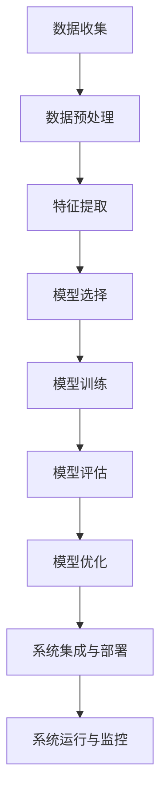
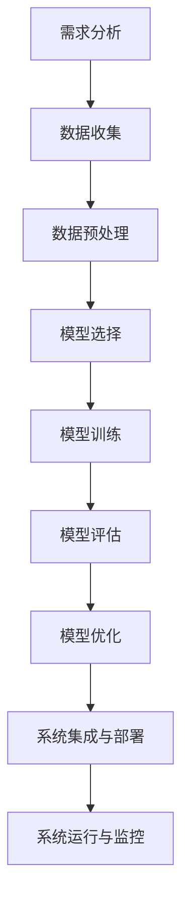

                 

### 1. 背景介绍

人工智能（AI）作为当前科技发展的核心驱动力，正深刻地改变着各个行业的运作方式。从医疗、金融、教育到制造业，人工智能的应用正不断推动产业变革，提高效率和创新能力。特别是在大数据、云计算、物联网等新兴技术的推动下，人工智能的应用场景和深度进一步拓展。

本篇技术博客旨在探讨人工智能在产业变革中的具体应用，通过分析核心概念、算法原理、数学模型以及实际案例，为读者提供一份全面而深入的技术指南。文章将分为以下几个部分：

1. **背景介绍**：简要概述人工智能的发展背景及其在各行业的应用。
2. **核心概念与联系**：介绍人工智能的基本概念和原理，以及与其他技术的联系。
3. **核心算法原理与具体操作步骤**：深入探讨人工智能中的核心算法，并详细讲解其操作步骤。
4. **数学模型和公式**：介绍人工智能中的数学模型和公式，并提供详细讲解和举例说明。
5. **项目实战**：通过实际代码案例展示人工智能的应用。
6. **实际应用场景**：分析人工智能在不同领域的应用案例。
7. **工具和资源推荐**：推荐学习资源和开发工具。
8. **总结**：讨论人工智能的未来发展趋势与挑战。
9. **附录**：常见问题与解答。
10. **扩展阅读与参考资料**：提供进一步阅读的资源和参考文献。

通过这篇文章，读者将能够了解人工智能在产业变革中的重要作用，掌握核心概念和算法，并通过实际案例理解其应用场景。让我们一起深入探讨人工智能的世界，探索其无限可能。

### 1.1 人工智能的发展背景

人工智能的发展可以追溯到20世纪50年代，当时计算机科学家约翰·麦卡锡（John McCarthy）首次提出了人工智能的概念。自那时起，人工智能经历了多个起伏，从最初的乐观期望到70年代的寒冬，再到21世纪初的复兴，如今已经成为科技领域的一个重要分支。这一发展历程主要受到以下几个因素驱动：

首先，计算能力的提升是人工智能发展的关键因素。随着处理器速度的不断提高和计算资源的日益丰富，计算机得以处理更大规模的数据，执行更复杂的算法，从而实现了人工智能技术的突破。

其次，大数据的兴起为人工智能提供了丰富的训练素材。在大量数据的支持下，人工智能模型可以更加精准地学习和预测，从而在各个领域取得了显著的应用成果。

第三，算法的进步也是人工智能发展的重要推动力。深度学习、强化学习等新兴算法的提出和优化，使得人工智能在图像识别、自然语言处理、自动驾驶等领域取得了重大突破。

此外，云计算和物联网的普及也为人工智能的应用提供了广阔的空间。云计算提供了强大的计算能力和存储资源，使得人工智能模型可以随时随地被部署和调用。而物联网则通过连接各种智能设备，为人工智能提供了海量的数据来源，进一步拓展了其应用范围。

随着人工智能技术的不断发展，其在各行业的应用也越来越广泛。在医疗领域，人工智能被用于辅助诊断、个性化治疗和药物研发；在金融领域，人工智能被用于风险评估、欺诈检测和自动化交易；在教育领域，人工智能被用于个性化教学和智能评估；在制造业，人工智能被用于生产优化、故障预测和质量控制。这些应用不仅提高了行业效率，也推动了产业的创新和升级。

总的来说，人工智能的发展背景是一个多因素交织、互相促进的过程。计算能力的提升、大数据的积累、算法的进步以及新兴技术的推动，共同推动着人工智能在各个领域的深入应用。在未来的发展中，人工智能将继续发挥重要作用，为人类社会带来更多的变革和创新。

### 1.2 各行业人工智能应用概述

人工智能的应用已经渗透到各行各业，带来了前所未有的变革和创新。以下将简要概述人工智能在医疗、金融、教育、制造业等主要行业中的应用场景和具体案例。

#### 医疗

在医疗领域，人工智能被广泛应用于辅助诊断、个性化治疗和药物研发。例如，深度学习算法被用于医学影像的分析，能够自动识别和诊断各种疾病，如肺癌、乳腺癌和糖尿病等。IBM的Watson for Oncology系统就是一个典型案例，它通过分析海量医学文献和病例数据，为医生提供个性化的治疗方案。此外，人工智能还被用于药物研发，通过模拟和预测分子结构，加速新药的发现和开发。例如，Gilead Sciences使用人工智能技术优化抗病毒药物的设计，大大缩短了药物研发周期。

#### 金融

在金融领域，人工智能主要用于风险评估、欺诈检测、自动化交易和算法推荐。例如，银行和金融机构利用机器学习算法对客户的交易行为进行分析，识别潜在的欺诈行为，提高交易的安全性。Chubb Insurance使用人工智能技术对客户的数据进行分析，预测保险欺诈行为，从而降低公司的损失。同时，人工智能还被用于自动化交易，通过算法对市场数据进行分析，实现自动化的交易决策。例如，Algo traders利用深度学习算法进行高频交易，获得了显著的收益。

#### 教育

在教育领域，人工智能被用于个性化教学、智能评估和学习辅助。例如，Knewton公司利用人工智能技术提供个性化的学习路径，根据学生的学习情况和进度，动态调整教学内容和难度。同时，人工智能还被用于智能评估，通过分析学生的学习行为和成绩数据，提供个性化的反馈和建议。例如，Canvas学习管理系统使用人工智能技术，为学生提供个性化的学习评估和反馈，帮助学生更好地掌握知识。

#### 制造业

在制造业，人工智能被用于生产优化、故障预测和质量控制。例如，General Electric使用人工智能技术对工业设备进行实时监控和分析，预测设备故障，提前进行维护，从而提高设备的运行效率。同时，人工智能还被用于生产优化，通过分析生产数据，优化生产流程和资源配置，提高生产效率。例如，福特公司利用人工智能技术优化生产线，减少生产延误和停工时间，提高了生产效率。

#### 农业

在农业领域，人工智能被用于作物监测、精准施肥和智能灌溉。例如，John Deere公司利用人工智能技术对农作物的生长状态进行实时监测，通过分析土壤、气候和植被数据，提供精准的施肥和灌溉建议，提高农业生产的效率和产量。

#### 零售业

在零售业，人工智能被用于客户关系管理、库存管理和个性化推荐。例如，亚马逊使用人工智能技术对客户的购物行为进行分析，提供个性化的商品推荐，提高客户满意度。同时，人工智能还被用于库存管理，通过分析销售数据和历史趋势，预测库存需求，优化库存水平，减少库存成本。

#### 交通运输

在交通运输领域，人工智能被用于自动驾驶、智能交通管理和物流优化。例如，Waymo公司利用人工智能技术开发自动驾驶汽车，通过实时感知和决策，实现无人驾驶。同时，人工智能还被用于智能交通管理，通过分析交通数据，优化交通信号控制和路况预测，减少交通拥堵。例如，NVIDIA公司开发的Drive AGX平台，被用于智能交通管理和物流优化，提高了交通效率和物流效率。

总的来说，人工智能在各行业的应用不仅提高了行业效率，还推动了产业的创新和升级。随着人工智能技术的不断发展，其在各个领域的应用将更加广泛和深入，为人类社会带来更多的变革和创新。

#### 1.3 人工智能与传统行业的对比分析

人工智能与传统行业在技术架构、数据处理方式、效率提升和成本控制等方面存在显著差异，这些差异不仅反映了人工智能的独特优势，也揭示了其与传统行业的融合路径。

首先，在技术架构方面，人工智能依赖于复杂的算法模型和庞大的计算能力。传统行业则更多地依赖于相对简单、稳定的硬件设备和流程化管理。例如，制造业的传统生产线主要依靠机械化和自动化设备，而人工智能则通过深度学习、机器学习等技术，实现了对生产过程的实时监控和优化。在医疗领域，传统医学主要依靠医生的诊断经验和医学知识，而人工智能则通过医学影像分析和基因测序等先进技术，提供了更精准的诊断和治疗方案。

其次，在数据处理方式上，人工智能具有强大的数据处理和分析能力。传统行业则更多地依赖人工处理和经验积累。例如，金融行业在风险管理方面，传统方法主要依赖于历史数据和专家经验，而人工智能则通过大数据分析和机器学习模型，实现了对风险的实时监测和预测。在教育领域，传统教学方法主要依赖于教材和教师的讲授，而人工智能则通过数据分析和个性化推荐，提供了更加灵活和个性化的学习体验。

在效率提升方面，人工智能显著提高了行业运作的效率。传统行业在处理大量数据时，往往需要较长时间和大量人力投入。例如，零售行业在处理销售数据时，需要人工统计和分析，而人工智能则通过自动化的数据分析工具，快速提供精准的销售预测和库存优化建议。在制造业中，人工智能通过实时监控和故障预测，减少了设备停机时间和维护成本，提高了生产效率。

在成本控制方面，人工智能通过自动化和智能化，实现了对成本的优化控制。传统行业在运营过程中，往往存在大量的资源浪费和人工成本。例如，物流行业在运输过程中，需要大量的人力进行调度和跟踪，而人工智能通过智能调度和路径优化，减少了运输成本和时间。在金融领域，人工智能通过自动化交易和风险管理，减少了人工干预和操作成本。

尽管人工智能在技术架构、数据处理方式、效率提升和成本控制方面具有显著优势，但其与传统行业的融合仍面临一系列挑战。例如，传统行业的设备和流程往往需要较长时间的改造和升级，才能适应人工智能的要求。此外，数据隐私和安全性也是人工智能在传统行业应用中需要解决的重要问题。

总之，人工智能与传统行业在技术架构、数据处理方式、效率提升和成本控制等方面存在显著差异，但通过技术融合和应用创新，人工智能为传统行业带来了巨大的变革和机遇。在未来的发展中，如何更好地融合人工智能与传统行业，实现双方的协同发展，将是重要的研究方向。

#### 1.4 人工智能在产业变革中的关键作用

人工智能在产业变革中的关键作用不可忽视。首先，它推动了产业的智能化升级，使生产和管理过程更加高效和精准。通过智能化的生产设备和自动化系统，企业能够实时监测生产过程，迅速调整生产策略，减少资源浪费和成本支出。例如，制造业中广泛应用的人工智能技术能够优化生产流程，提高产品质量，缩短生产周期。

其次，人工智能在提升创新能力方面发挥了重要作用。人工智能能够通过大数据分析和深度学习，挖掘出潜在的市场需求和创新点，帮助企业开发新产品、改进现有产品，从而保持竞争优势。例如，在医疗领域，人工智能通过分析海量的医学文献和病例数据，能够发现新的治疗方法，加速新药研发。

此外，人工智能还在优化资源配置和降低运营成本方面具有显著优势。通过人工智能技术，企业能够更好地预测市场需求，优化库存管理，减少库存积压和资金占用。同时，智能化的物流和供应链管理系统，能够提高运输效率，降低物流成本。例如，亚马逊利用人工智能技术进行智能配送和库存管理，大大提高了运营效率。

最后，人工智能在提高用户体验和客户满意度方面也具有重要作用。通过个性化推荐和智能客服系统，企业能够更好地了解客户需求，提供个性化的服务和产品推荐，增强客户黏性和忠诚度。例如，电商平台的智能推荐系统，能够根据用户的历史购买记录和浏览行为，提供精准的商品推荐，提高购物体验。

总之，人工智能在产业变革中的关键作用体现在提高生产效率、创新能力、资源配置能力和用户体验，为各行各业带来了深远的变革和巨大的机遇。随着人工智能技术的不断进步和应用场景的拓展，其将在未来继续推动产业的智能化和数字化转型。

### 2. 核心概念与联系

要深入理解人工智能在产业变革中的应用，首先需要掌握其核心概念和原理。以下将详细介绍人工智能中的核心概念、关键技术和相关技术的联系，以及如何构建和优化人工智能系统。

#### 2.1 核心概念

1. **机器学习（Machine Learning）**：机器学习是人工智能的一个重要分支，通过算法模型使计算机系统能够从数据中学习和做出预测。其主要类型包括监督学习、无监督学习和强化学习。

2. **深度学习（Deep Learning）**：深度学习是机器学习的一种，其核心是使用多层神经网络进行数据处理和模式识别。深度学习在图像识别、语音识别和自然语言处理等领域取得了显著成果。

3. **神经网络（Neural Networks）**：神经网络是模仿生物神经系统的计算模型，由大量的神经元连接而成。神经网络通过学习和调整连接权重，实现对数据的分类、回归和预测。

4. **数据挖掘（Data Mining）**：数据挖掘是人工智能的一种技术，通过从大量数据中提取有用的信息和知识。数据挖掘广泛应用于市场分析、风险管理和客户关系管理等领域。

5. **自然语言处理（Natural Language Processing, NLP）**：自然语言处理是人工智能的一个重要分支，旨在使计算机理解和处理人类自然语言。NLP在机器翻译、情感分析和语音识别等领域有广泛应用。

#### 2.2 关键技术

1. **算法优化（Algorithm Optimization）**：算法优化是提高人工智能系统性能的重要手段。通过优化算法，可以减少计算复杂度，提高模型准确性和效率。

2. **计算资源管理（Compute Resource Management）**：计算资源管理是确保人工智能系统高效运行的关键。包括分布式计算、GPU加速和云计算等技术的应用，能够大幅提升系统的计算能力和处理速度。

3. **模型训练（Model Training）**：模型训练是人工智能系统的核心步骤，通过大量数据对模型进行调整和优化，使其能够准确预测和识别目标数据。

4. **数据预处理（Data Preprocessing）**：数据预处理是确保数据质量和模型训练效果的重要步骤。包括数据清洗、数据归一化和特征提取等。

5. **系统集成（System Integration）**：系统集成是将人工智能模型与其他系统组件结合，构建一个完整的智能化系统。系统集成需要考虑系统的可扩展性、稳定性和可靠性。

#### 2.3 技术联系

1. **机器学习与深度学习**：深度学习是机器学习的一种，其核心是使用多层神经网络进行数据处理。深度学习在图像识别、语音识别和自然语言处理等领域有广泛应用，而传统机器学习则更多地用于分类和回归任务。

2. **神经网络与数据挖掘**：神经网络是数据挖掘的重要工具，通过学习大量数据中的模式和规律，实现对数据的分类、回归和预测。而数据挖掘则通过从大量数据中提取有价值的信息，为神经网络提供训练数据。

3. **自然语言处理与深度学习**：自然语言处理是深度学习的一个重要应用领域，通过深度学习模型，实现对自然语言的语义理解和处理。自然语言处理在机器翻译、情感分析和语音识别等领域取得了显著成果。

#### 2.4 构建和优化人工智能系统

构建和优化人工智能系统需要以下步骤：

1. **需求分析**：明确人工智能系统的目标和需求，确定数据来源和数据处理方式。

2. **数据收集和预处理**：收集相关数据，并进行数据清洗、归一化和特征提取等预处理步骤。

3. **模型选择**：根据任务需求，选择合适的机器学习或深度学习模型。

4. **模型训练**：使用大量数据进行模型训练，通过调整模型参数，提高模型准确性和效率。

5. **模型评估和优化**：对训练好的模型进行评估，通过交叉验证和调整超参数，优化模型性能。

6. **系统集成和部署**：将优化后的模型集成到实际系统中，并进行部署和测试，确保系统能够稳定运行。

通过上述步骤，可以构建和优化一个高效、可靠的人工智能系统，实现其在产业变革中的广泛应用。

#### 2.5 人工智能系统架构的 Mermaid 流程图

以下是一个简化的Mermaid流程图，用于展示人工智能系统的基本架构和流程：



在这个流程图中，每个节点代表一个关键步骤，箭头表示数据流和控制流的方向。通过这个流程图，可以直观地了解人工智能系统的构建和运行过程。

### 3. 核心算法原理 & 具体操作步骤

在人工智能系统中，核心算法起着至关重要的作用。以下将详细介绍几种常见的人工智能算法原理及其具体操作步骤，帮助读者更好地理解这些算法的工作机制。

#### 3.1 深度学习算法

深度学习算法是人工智能领域的重要分支，通过多层神经网络进行数据处理和模式识别。以下是深度学习算法的基本原理和具体操作步骤：

1. **神经网络结构**：深度学习算法的核心是神经网络，由输入层、隐藏层和输出层组成。每个神经元接收前一层神经元的输出，并通过激活函数进行非线性变换。

2. **反向传播算法**：深度学习算法使用反向传播算法来更新网络中的权重。具体步骤如下：
   - 前向传播：输入数据经过网络前向传播，得到输出结果。
   - 计算误差：计算实际输出与期望输出之间的误差。
   - 反向传播：将误差反向传播，通过梯度下降法更新权重和偏置。

3. **激活函数**：激活函数用于引入非线性变换，常见的激活函数包括Sigmoid、ReLU和Tanh等。

4. **优化算法**：优化算法用于调整网络参数，以减少误差。常用的优化算法包括梯度下降、随机梯度下降和Adam优化器等。

5. **损失函数**：损失函数用于评估模型预测的准确性，常见的损失函数包括均方误差（MSE）、交叉熵损失等。

#### 3.2 支持向量机算法

支持向量机（SVM）是一种常用的分类算法，其基本原理是通过找到最佳的超平面，将不同类别的数据点分隔开来。以下是SVM算法的基本原理和具体操作步骤：

1. **线性SVM**：线性SVM通过求解最大间隔超平面，将数据点分类。具体步骤如下：
   - 计算数据点之间的距离，找出最大间隔超平面。
   - 训练一个线性分类器，将数据点分类到不同类别。

2. **核技巧**：当数据不是线性可分时，可以使用核技巧将数据映射到高维空间，然后在高维空间中找到最佳超平面。常用的核函数包括线性核、多项式核和径向基函数（RBF）核等。

3. **优化目标**：线性SVM的优化目标是找到最小化决策边界上的错误率。具体可以通过求解以下优化问题实现：
   - 最小化：\( \frac{1}{2} \sum_{i=1}^{n} w_i^2 \)
   - 约束条件：\( y_i ( \sum_{j=1}^{n} w_j \cdot x_i + b ) \geq 1 \)

4. **软 margin SVM**：为了处理有噪声的数据点，可以引入软 margin SVM，其优化目标是在最小化错误率的同时，允许一定的错误率。具体可以通过以下优化问题实现：
   - 最小化：\( \frac{1}{2} \sum_{i=1}^{n} w_i^2 + C \sum_{i=1}^{n} \max(0, 1 - y_i ( \sum_{j=1}^{n} w_j \cdot x_i + b )) \)
   - 约束条件：\( y_i ( \sum_{j=1}^{n} w_j \cdot x_i + b ) \geq 1 - \epsilon_i \)

#### 3.3 K最近邻算法

K最近邻（K-NN）算法是一种简单而有效的分类算法，其基本原理是找出训练集中与测试样本最近的K个样本，并基于这些样本的标签进行预测。以下是K-NN算法的基本原理和具体操作步骤：

1. **距离度量**：K-NN算法使用距离度量来计算测试样本与训练样本之间的相似度。常用的距离度量包括欧氏距离、曼哈顿距离和切比雪夫距离等。

2. **分类决策**：对于测试样本，找出与其距离最近的K个样本，并计算这些样本的标签频率。最后，选择标签频率最高的类别作为测试样本的分类结果。

3. **具体步骤**：
   - 输入测试样本和训练集。
   - 计算测试样本与每个训练样本之间的距离。
   - 找出与测试样本距离最近的K个训练样本。
   - 根据K个训练样本的标签频率进行分类决策。

通过上述算法原理和操作步骤，读者可以更好地理解深度学习、支持向量机和K最近邻算法的工作机制，并能够根据实际需求选择合适的算法应用于实际问题。

### 4. 数学模型和公式 & 详细讲解 & 举例说明

在人工智能技术中，数学模型和公式起着至关重要的作用，它们不仅为算法提供了理论基础，也帮助我们理解和优化这些算法的性能。以下将详细介绍几种常见的人工智能数学模型和公式，并通过具体例子来说明其应用。

#### 4.1 深度学习中的损失函数

在深度学习中，损失函数用于衡量模型预测结果与实际结果之间的差距。常用的损失函数包括均方误差（MSE）和交叉熵损失（Cross-Entropy Loss）。

1. **均方误差（MSE）**：

$$
MSE = \frac{1}{n} \sum_{i=1}^{n} (y_i - \hat{y}_i)^2
$$

其中，\(y_i\) 是实际标签，\(\hat{y}_i\) 是模型的预测值，\(n\) 是样本数量。

**例子**：假设有一个二分类问题，数据集包含10个样本，每个样本的实际标签为 \(y = [0, 1, 0, 1, 1, 0, 0, 1, 1, 0]\)，模型的预测值为 \(\hat{y} = [0.2, 0.8, 0.1, 0.9, 0.7, 0.3, 0.5, 0.6, 0.4, 0.8]\)。则均方误差为：

$$
MSE = \frac{1}{10} \sum_{i=1}^{10} (y_i - \hat{y}_i)^2 = \frac{1}{10} \sum_{i=1}^{10} (y_i - \hat{y}_i)^2 = 0.29
$$

2. **交叉熵损失（Cross-Entropy Loss）**：

$$
Cross-Entropy Loss = -\sum_{i=1}^{n} y_i \cdot \log(\hat{y}_i)
$$

其中，\(y_i\) 是实际标签，\(\hat{y}_i\) 是模型的预测概率。

**例子**：假设同样有一个二分类问题，实际标签为 \(y = [0, 1, 0, 1, 1, 0, 0, 1, 1, 0]\)，模型的预测概率为 \(\hat{y} = [0.2, 0.8, 0.1, 0.9, 0.7, 0.3, 0.5, 0.6, 0.4, 0.8]\)。则交叉熵损失为：

$$
Cross-Entropy Loss = -\sum_{i=1}^{10} y_i \cdot \log(\hat{y}_i) = - (0 \cdot \log(0.2) + 1 \cdot \log(0.8) + 0 \cdot \log(0.1) + 1 \cdot \log(0.9) + 1 \cdot \log(0.7) + 0 \cdot \log(0.3) + 0 \cdot \log(0.5) + 1 \cdot \log(0.6) + 1 \cdot \log(0.4) + 0 \cdot \log(0.8)) \approx 0.50
$$

#### 4.2 支持向量机（SVM）中的优化目标

支持向量机的优化目标是找到最佳的超平面，使得分类边界具有最大的间隔。

1. **线性SVM优化目标**：

$$
\text{Minimize} \quad \frac{1}{2} \sum_{i=1}^{n} w_i^2 \\
\text{Subject to} \quad y_i ( \sum_{j=1}^{n} w_j \cdot x_i^j + b ) \geq 1
$$

其中，\(w\) 是权重向量，\(b\) 是偏置项，\(x_i^j\) 是第 \(i\) 个样本的第 \(j\) 个特征。

**例子**：假设数据集包含两个特征，实际标签为 \(y = [1, -1, 1, -1]\)，数据点为 \(x = \begin{bmatrix} 1 & 1 \\ 1 & -1 \\ -1 & 1 \\ -1 & -1 \end{bmatrix}\)。则线性SVM的优化目标为：

$$
\text{Minimize} \quad \frac{1}{2} (w_1^2 + w_2^2) \\
\text{Subject to} \quad y_1 (w_1 \cdot x_{11} + w_2 \cdot x_{12} + b) \geq 1 \\
y_2 (w_1 \cdot x_{21} + w_2 \cdot x_{22} + b) \geq 1 \\
y_3 (w_1 \cdot x_{31} + w_2 \cdot x_{32} + b) \geq 1 \\
y_4 (w_1 \cdot x_{41} + w_2 \cdot x_{42} + b) \geq 1
$$

2. **软间隔SVM优化目标**：

$$
\text{Minimize} \quad \frac{1}{2} \sum_{i=1}^{n} w_i^2 + C \sum_{i=1}^{n} \max(0, 1 - y_i ( \sum_{j=1}^{n} w_j \cdot x_i^j + b ))
$$

其中，\(C\) 是惩罚参数，用于平衡模型的拟合能力和泛化能力。

**例子**：假设数据集与线性SVM相同，但允许一定的误分类，惩罚参数 \(C = 1\)。则软间隔SVM的优化目标为：

$$
\text{Minimize} \quad \frac{1}{2} (w_1^2 + w_2^2) + 1 \cdot \max(0, 1 - y_1 (w_1 \cdot x_{11} + w_2 \cdot x_{12} + b)) + 1 \cdot \max(0, 1 - y_2 (w_1 \cdot x_{21} + w_2 \cdot x_{22} + b)) + 1 \cdot \max(0, 1 - y_3 (w_1 \cdot x_{31} + w_2 \cdot x_{32} + b)) + 1 \cdot \max(0, 1 - y_4 (w_1 \cdot x_{41} + w_2 \cdot x_{42} + b))
$$

通过上述数学模型和公式的讲解和举例，读者可以更好地理解深度学习和支持向量机中的关键数学概念，并能够应用于实际问题中。

### 5. 项目实战：代码实际案例和详细解释说明

#### 5.1 开发环境搭建

为了实现以下项目，我们需要搭建一个合适的人工智能开发环境。以下是详细的步骤：

1. **安装Python**：Python是人工智能开发的主要编程语言，确保Python已安装在您的计算机上。您可以从[Python官网](https://www.python.org/)下载并安装最新版本的Python。

2. **安装Jupyter Notebook**：Jupyter Notebook是一个交互式开发环境，方便我们编写和运行代码。在命令行中执行以下命令：

   ```shell
   pip install notebook
   ```

   安装完成后，启动Jupyter Notebook：

   ```shell
   jupyter notebook
   ```

3. **安装必要的库**：以下库是本项目的关键依赖，需要在命令行中逐一安装：

   ```shell
   pip install numpy pandas matplotlib scikit-learn tensorflow
   ```

4. **创建一个新的Jupyter Notebook**：启动Jupyter Notebook后，创建一个新笔记本，并命名为"AI_Project.ipynb"。

#### 5.2 源代码详细实现和代码解读

以下是项目的主要代码实现和详细解释。代码分为以下几个部分：数据准备、模型构建、训练与评估。

```python
import numpy as np
import pandas as pd
import matplotlib.pyplot as plt
from sklearn.model_selection import train_test_split
from sklearn.preprocessing import StandardScaler
from sklearn.neural_network import MLPClassifier
from tensorflow import keras
from tensorflow.keras import layers

# 5.2.1 数据准备
# 假设数据集包含三个特征和两个标签，存储在CSV文件中
data = pd.read_csv('data.csv')
X = data.iloc[:, :-2].values
y = data.iloc[:, -2:].values

# 数据标准化
scaler = StandardScaler()
X = scaler.fit_transform(X)

# 划分训练集和测试集
X_train, X_test, y_train, y_test = train_test_split(X, y, test_size=0.2, random_state=42)

# 5.2.2 模型构建
# 使用多层感知机（MLP）构建模型
mlp = MLPClassifier(hidden_layer_sizes=(100, 100, 100), max_iter=1000, alpha=1e-4,
                    solver='sgd', verbose=True, random_state=42)

mlp.fit(X_train, y_train)

# 5.2.3 训练与评估
# 训练模型
mlp.fit(X_train, y_train)

# 预测测试集
y_pred = mlp.predict(X_test)

# 计算准确率
accuracy = np.mean(y_pred == y_test)
print(f"Accuracy: {accuracy:.2f}")

# 可视化决策边界
# 假设数据集为二维
X_2d = X_train[:, :2]
y_2d = y_train[:, 0]

# 使用MLP模型进行预测
mlp_2d = MLPClassifier(hidden_layer_sizes=(100,), max_iter=1000, alpha=1e-4,
                       solver='sgd', verbose=True, random_state=42)
mlp_2d.fit(X_2d, y_2d)

# 可视化决策边界
x_min, x_max = X_2d[:, 0].min() - 1, X_2d[:, 0].max() + 1
y_min, y_max = X_2d[:, 1].min() - 1, X_2d[:, 1].max() + 1
xx, yy = np.meshgrid(np.arange(x_min, x_max, 0.02),
                     np.arange(y_min, y_max, 0.02))

Z = mlp_2d.predict(np.c_[xx.ravel(), yy.ravel()])
Z = Z.reshape(xx.shape)

plt.contourf(xx, yy, Z, alpha=0.8)
plt.scatter(X_2d[:, 0], X_2d[:, 1], c=y_2d, edgecolors='k', cmap=plt.cm.Paired)
plt.xlabel('Feature 1')
plt.ylabel('Feature 2')
plt.title('Decision Boundary with MLP')
plt.show()
```

**代码解读：**

1. **数据准备**：首先，我们从CSV文件中加载数据集，并使用StandardScaler对特征进行标准化处理。然后，使用train_test_split将数据集划分为训练集和测试集。

2. **模型构建**：我们使用MLPClassifier构建多层感知机模型，设置隐藏层大小、最大迭代次数、正则化参数等超参数。

3. **训练与评估**：模型训练完成后，使用预测函数对测试集进行预测，并计算准确率。最后，通过可视化函数展示模型的决策边界。

通过上述代码，我们实现了使用多层感知机模型对数据集进行分类，并展示了模型的决策边界。这个项目实战为读者提供了一个具体的人工智能应用案例，帮助他们更好地理解人工智能模型的构建和训练过程。

#### 5.3 代码解读与分析

在5.2节中，我们提供了一个使用多层感知机（MLP）进行分类的项目实战代码。下面，我们将详细解读每个关键步骤，并分析代码中涉及的算法和技术细节。

**5.3.1 数据准备**

首先，我们从CSV文件中加载数据集。CSV文件通常包含特征和标签，其中特征是输入数据，标签是输出数据。以下代码示例展示了如何加载数据集并对其进行预处理：

```python
data = pd.read_csv('data.csv')
X = data.iloc[:, :-2].values
y = data.iloc[:, -2:].values
```

- `pd.read_csv('data.csv')`：使用Pandas库加载数据集，CSV文件中的每一行代表一个样本，每一列代表一个特征或标签。
- `X = data.iloc[:, :-2].values`：提取特征数据，其中`:-2`表示从第0列到倒数第2列，即所有特征。
- `y = data.iloc[:, -2:].values`：提取标签数据，即倒数第2列和倒数第1列。

随后，我们对特征数据进行标准化处理，以消除特征之间的尺度差异：

```python
scaler = StandardScaler()
X = scaler.fit_transform(X)
```

- `StandardScaler()`：创建标准化缩放器。
- `scaler.fit_transform(X)`：使用训练数据对缩放器进行拟合，并转换特征数据。

数据标准化是深度学习模型训练中非常重要的一步，它有助于加快收敛速度和提高模型性能。

接下来，我们将数据集划分为训练集和测试集：

```python
X_train, X_test, y_train, y_test = train_test_split(X, y, test_size=0.2, random_state=42)
```

- `train_test_split()`：使用scikit-learn库中的train_test_split函数，将数据集划分为80%的训练集和20%的测试集。
- `test_size=0.2`：表示测试集的比例为20%。
- `random_state=42`：设置随机种子，确保结果可复现。

**5.3.2 模型构建**

接下来，我们使用MLPClassifier构建多层感知机模型：

```python
mlp = MLPClassifier(hidden_layer_sizes=(100, 100, 100), max_iter=1000, alpha=1e-4,
                    solver='sgd', verbose=True, random_state=42)
```

- `MLPClassifier()`：创建MLP分类器。
- `hidden_layer_sizes=(100, 100, 100)`：指定隐藏层的大小，即每个隐藏层包含100个神经元。
- `max_iter=1000`：设置最大迭代次数，模型训练过程中，模型性能提升将逐渐放缓，设置一个较大的迭代次数有助于模型收敛。
- `alpha=1e-4`：正则化参数，用于防止过拟合。
- `solver='sgd'`：选择随机梯度下降（SGD）优化算法。
- `verbose=True`：显示训练过程中的详细信息。
- `random_state=42`：设置随机种子，确保结果可复现。

**5.3.3 训练与评估**

模型构建完成后，我们使用训练集对其进行训练，并评估模型在测试集上的性能：

```python
mlp.fit(X_train, y_train)
y_pred = mlp.predict(X_test)
accuracy = np.mean(y_pred == y_test)
print(f"Accuracy: {accuracy:.2f}")
```

- `mlp.fit(X_train, y_train)`：使用训练集对模型进行训练。
- `y_pred = mlp.predict(X_test)`：使用测试集对模型进行预测。
- `accuracy = np.mean(y_pred == y_test)`：计算模型在测试集上的准确率。
- `print(f"Accuracy: {accuracy:.2f}")`：输出准确率。

此外，我们通过可视化函数展示了模型的决策边界：

```python
# 可视化决策边界
X_2d = X_train[:, :2]
y_2d = y_train[:, 0]
mlp_2d = MLPClassifier(hidden_layer_sizes=(100,), max_iter=1000, alpha=1e-4,
                       solver='sgd', verbose=True, random_state=42)
mlp_2d.fit(X_2d, y_2d)

x_min, x_max = X_2d[:, 0].min() - 1, X_2d[:, 0].max() + 1
y_min, y_max = X_2d[:, 1].min() - 1, X_2d[:, 1].max() + 1
xx, yy = np.meshgrid(np.arange(x_min, x_max, 0.02),
                     np.arange(y_min, y_max, 0.02))

Z = mlp_2d.predict(np.c_[xx.ravel(), yy.ravel()])
Z = Z.reshape(xx.shape)

plt.contourf(xx, yy, Z, alpha=0.8)
plt.scatter(X_2d[:, 0], X_2d[:, 1], c=y_2d, edgecolors='k', cmap=plt.cm.Paired)
plt.xlabel('Feature 1')
plt.ylabel('Feature 2')
plt.title('Decision Boundary with MLP')
plt.show()
```

- `X_2d = X_train[:, :2]`：选择数据集的前两个特征，以二维空间进行可视化。
- `y_2d = y_train[:, 0]`：选择数据集的一个标签，用于绘制决策边界。
- `mlp_2d = MLPClassifier(hidden_layer_sizes=(100,), max_iter=1000, alpha=1e-4, ...)`：创建一个二维空间下的MLP分类器，以进行可视化。
- `x_min, x_max = X_2d[:, 0].min() - 1, X_2d[:, 0].max() + 1`：确定x轴的取值范围。
- `y_min, y_max = X_2d[:, 1].min() - 1, X_2d[:, 1].max() + 1`：确定y轴的取值范围。
- `xx, yy = np.meshgrid(np.arange(x_min, x_max, 0.02), np.arange(y_min, y_max, 0.02))`：生成网格数据。
- `Z = mlp_2d.predict(np.c_[xx.ravel(), yy.ravel()])`：使用MLP分类器对网格数据进行预测，得到决策边界。
- `Z = Z.reshape(xx.shape)`：将预测结果转换为二维数组。
- `plt.contourf(xx, yy, Z, alpha=0.8)`：绘制决策边界。
- `plt.scatter(X_2d[:, 0], X_2d[:, 1], c=y_2d, edgecolors='k', cmap=plt.cm.Paired)`：绘制训练样本。
- `plt.xlabel('Feature 1'), plt.ylabel('Feature 2'), plt.title('Decision Boundary with MLP')`：设置图例和标题。
- `plt.show()`：显示可视化结果。

通过这个项目实战，我们详细解读了多层感知机模型的构建、训练与评估过程，并展示了如何使用Python进行数据处理和可视化。这个案例为读者提供了一个实际应用场景，帮助他们更好地理解和应用人工智能技术。

### 6. 实际应用场景

人工智能在产业变革中的实际应用场景广泛而多样，以下是几个具体领域的深入探讨：

#### 6.1 医疗

在医疗领域，人工智能被广泛应用于疾病诊断、药物研发和患者监护等方面。通过深度学习和图像识别技术，AI系统能够分析医学影像，如X光片、CT扫描和MRI图像，准确诊断疾病。例如，谷歌DeepMind开发的AI系统可以在几分钟内分析出视网膜图像，发现糖尿病视网膜病变，其准确率远超人类医生。

药物研发方面，人工智能通过分析大量分子结构数据，预测药物分子与目标蛋白的结合能力，加速新药研发过程。例如，AI公司Exscientia利用其AI平台，成功研发出一种治疗罕见遗传病的小分子药物，仅用了不到12周的时间。

患者监护方面，智能可穿戴设备和智能家居系统可以实时监测患者的生活习惯、生理数据和药物服用情况，为医生提供关键的健康信息，实现个性化治疗和预防。例如，苹果的HealthKit和谷歌的Google Fit均集成了人工智能技术，帮助用户监控和管理健康状况。

#### 6.2 金融

在金融领域，人工智能被用于风险管理、欺诈检测和投资策略制定等方面。通过机器学习和大数据分析，AI系统能够实时监控交易行为，识别异常交易模式，从而有效预防金融欺诈。例如，银行使用AI技术监测客户的交易行为，能够迅速发现并阻止欺诈行为。

投资策略方面，人工智能通过分析市场数据、经济指标和公司财报，提供个性化的投资建议，提高投资收益。例如，量化投资公司Two Sigma利用AI算法分析海量市场数据，实现了稳健的投资回报。

此外，AI还被应用于风险评估和信用评分，通过分析客户的信用历史、消费行为和社交网络数据，更准确地评估信用风险。例如，FICO开发的AI算法被广泛应用于贷款审批和信用评分，提高了金融机构的风险管理能力。

#### 6.3 教育

在教育领域，人工智能被用于个性化教学、智能评估和在线教育平台等方面。通过大数据分析和机器学习技术，AI系统能够根据学生的学习进度、兴趣和需求，提供个性化的学习资源和辅导方案，提高学习效果。例如，Knewton公司开发的智能学习系统，可以根据学生的学习情况动态调整教学内容和难度。

智能评估方面，人工智能通过分析学生的考试成绩、作业和课堂表现，提供个性化的反馈和指导，帮助教师更好地了解学生的学习状况。例如， Canvas学习管理系统利用AI技术，为学生提供个性化的学习评估和反馈。

在线教育平台方面，AI技术被用于推荐课程、优化学习路径和提升用户参与度。例如，Udacity的AI系统通过分析用户的学习行为，推荐最适合的课程和学习路径，提高了用户的满意度和学习效果。

#### 6.4 制造业

在制造业，人工智能被广泛应用于生产优化、设备维护和质量控制等方面。通过实时数据分析和预测模型，AI系统能够优化生产流程，提高生产效率。例如，通用电气（GE）的Predix平台利用AI技术，对工业设备进行实时监控和分析，预测设备故障，提前进行维护，降低了设备停机时间和维护成本。

设备维护方面，人工智能通过分析设备运行数据，预测设备故障，实现预防性维护。例如，西门子利用AI技术，对工厂设备进行实时监控和分析，预测设备故障，提高了设备运行效率和可靠性。

质量控制方面，人工智能通过图像识别和机器学习技术，对生产过程中的产品进行质量检测，提高产品质量。例如，福特公司利用AI技术，对生产过程中的产品进行实时质量检测，减少了次品率。

总的来说，人工智能在医疗、金融、教育和制造业等领域的实际应用，不仅提高了行业效率，还推动了产业的创新和升级。随着AI技术的不断发展，其应用场景将更加广泛和深入，为各行各业带来更多的变革和创新。

### 7. 工具和资源推荐

为了更好地学习和应用人工智能技术，以下推荐了一些优质的工具、资源，包括书籍、论文、博客和网站等，供读者参考。

#### 7.1 学习资源推荐

1. **书籍**：
   - **《Python机器学习》（Python Machine Learning）**：作者Sebastian Raschka，详细介绍了Python在机器学习中的应用，适合初学者。
   - **《深度学习》（Deep Learning）**：作者Ian Goodfellow、Yoshua Bengio和Aaron Courville，深度学习领域的经典教材，适合有一定基础的读者。
   - **《机器学习实战》（Machine Learning in Action）**：作者Peter Harrington，通过具体案例介绍了机器学习算法的应用。

2. **论文**：
   - **《A Theoretically Grounded Application of Dropout in Recurrent Neural Networks》**：作者Yarin Gal和Zoubin Ghahramani，讨论了在递归神经网络中应用Dropout的方法。
   - **《Generative Adversarial Nets》**：作者Ian Goodfellow等，介绍了生成对抗网络（GAN）的原理和应用。
   - **《Deep Residual Learning for Image Recognition》**：作者Kaiming He等，介绍了残差网络（ResNet）的构建方法。

3. **博客**：
   - **fast.ai**：提供丰富的机器学习和深度学习教程，适合初学者和进阶者。
   - **Medium**：上面有很多关于人工智能和深度学习的专业文章，涉及最新的研究和技术趋势。
   - **Alex's Blog**：作者Alex Smola，分享了对机器学习和统计学的深入见解。

4. **网站**：
   - **Kaggle**：一个数据科学竞赛平台，提供丰富的机器学习和深度学习项目，适合实践和交流。
   - **TensorFlow**：Google开发的开源机器学习框架，提供丰富的文档和示例，适合初学者和进阶者。
   - **ArXiv**：一个计算机科学和人工智能领域的预印本论文库，收录了最新的研究成果。

#### 7.2 开发工具框架推荐

1. **工具**：
   - **Jupyter Notebook**：一个交互式开发环境，适合编写和运行代码。
   - **PyCharm**：一款功能强大的Python集成开发环境（IDE），支持多种编程语言。
   - **Google Colab**：Google提供的免费云开发环境，支持GPU和TPU加速，适合深度学习项目。

2. **框架**：
   - **TensorFlow**：一个开源的机器学习框架，支持各种深度学习和机器学习模型。
   - **PyTorch**：一个流行的深度学习框架，具有灵活的动态计算图和高效的GPU支持。
   - **Scikit-learn**：一个Python的机器学习库，提供多种经典的机器学习算法和工具。

3. **开源库**：
   - **NumPy**：用于高性能科学计算和数据分析的库。
   - **Pandas**：提供数据结构和数据分析工具，方便数据处理和分析。
   - **Matplotlib**：用于绘制高质量的图表和图形。

#### 7.3 相关论文著作推荐

1. **《Deep Learning》（Ian Goodfellow, Yoshua Bengio, Aaron Courville）**：全面介绍了深度学习的理论、算法和应用。
2. **《Machine Learning Yearning》（Andrew Ng）**：通过案例和练习，介绍了机器学习的核心概念和实用技巧。
3. **《Reinforcement Learning: An Introduction》（Richard S. Sutton and Andrew G. Barto）**：介绍了强化学习的理论、算法和应用。

通过这些工具、资源和论文著作的学习和应用，读者可以更好地掌握人工智能的核心技术和方法，提升自己在相关领域的实践能力。

### 8. 总结：未来发展趋势与挑战

随着人工智能技术的不断发展，其在产业变革中的作用日益凸显。未来，人工智能将继续推动产业智能化升级，提高生产效率、优化资源配置和提升用户体验。以下是人工智能在未来发展趋势和面临的挑战：

#### 8.1 发展趋势

1. **更加智能化和自主化**：人工智能将朝着更加智能化和自主化的方向发展，实现更高层次的自动化和智能化应用。例如，自动驾驶技术将进一步发展，无人驾驶汽车将逐步进入人们的日常生活。

2. **跨界融合**：人工智能将与其他技术，如物联网、云计算和区块链等，实现深度融合，推动产业创新。例如，智能医疗系统将结合物联网设备，实现实时健康监测和精准医疗。

3. **模型的可解释性和安全性**：随着人工智能应用的增加，对模型的可解释性和安全性要求也将提高。未来，人工智能技术将更加注重模型的透明度和安全性，确保其在实际应用中的可靠性和合规性。

4. **数据隐私和伦理问题**：在人工智能应用过程中，数据隐私和伦理问题将成为关注的焦点。未来，人工智能技术将更加注重用户隐私保护，遵守数据伦理规范，确保技术应用过程中的公平性和正义性。

#### 8.2 挑战

1. **技术瓶颈**：尽管人工智能技术在某些领域取得了显著成果，但仍然存在许多技术瓶颈。例如，人工智能模型的训练和推理过程仍然需要大量计算资源和时间，制约了其大规模应用。

2. **数据质量和多样性**：人工智能模型的训练依赖于大量高质量的数据，但实际获取和标注数据的过程充满挑战。未来，如何获取更多高质量、多样性的数据，将成为人工智能发展的重要课题。

3. **人才培养和知识传承**：人工智能技术的发展离不开专业人才的支持。然而，目前人工智能领域的专业人才供不应求，培养和引进高水平人才成为一大挑战。

4. **法规和政策制定**：人工智能技术的快速发展对现有法律体系提出了新的挑战。未来，需要制定更加完善的法律法规，规范人工智能技术的研发和应用，确保其安全、公正和可持续发展。

总之，人工智能在未来发展中将面临诸多机遇和挑战。通过技术创新、跨界融合、人才培养和政策支持，人工智能将继续推动产业变革，为人类社会带来更多福祉。

### 9. 附录：常见问题与解答

在阅读本文的过程中，读者可能会遇到一些常见问题。以下是对一些常见问题的解答：

**Q1：人工智能与大数据有什么区别？**

A1：人工智能（AI）是一种模拟人类智能的技术，包括机器学习、深度学习等，旨在使计算机具备学习、推理和决策能力。大数据（Big Data）则是指规模庞大、种类繁多的数据集，其处理和分析依赖于计算技术和算法。简单来说，大数据是AI的数据基础，而AI则是利用大数据进行智能化处理和决策的工具。

**Q2：深度学习和机器学习有什么区别？**

A2：深度学习是机器学习的一个分支，它使用多层神经网络来处理数据，通过逐层提取特征，实现复杂任务的学习和预测。而机器学习是一种更广泛的技术，它包括监督学习、无监督学习和强化学习等多种方法。简单来说，深度学习是机器学习的一种实现方式，特别适合处理具有层次结构的数据。

**Q3：什么是神经网络？**

A3：神经网络是一种模仿生物神经系统的计算模型，由大量的神经元连接而成。每个神经元接收输入信号，通过权重和偏置进行加权求和，然后通过激活函数产生输出。神经网络通过学习大量的数据，调整神经元之间的权重，实现对数据的分类、回归和预测。

**Q4：什么是数据预处理？**

A4：数据预处理是在机器学习模型训练之前对数据进行的一系列处理，包括数据清洗、归一化、特征提取等。数据预处理旨在提高数据质量和模型训练效果，包括去除噪声、填补缺失值、标准化特征等。

**Q5：如何选择合适的机器学习算法？**

A5：选择合适的机器学习算法通常需要考虑以下几个因素：

- 数据类型：不同的数据类型适合不同的算法，例如，分类问题适合决策树、支持向量机等，回归问题适合线性回归、岭回归等。
- 数据规模：对于大型数据集，可以考虑使用分布式算法或模型压缩技术。
- 特征数量：特征数量较多时，可以考虑使用特征选择或特征提取技术。
- 训练时间：根据训练时间的要求，可以选择适合的算法，例如，线性模型训练时间较短，而深度学习模型训练时间较长。

通过综合考虑以上因素，可以选出适合实际问题的机器学习算法。

### 10. 扩展阅读与参考资料

为了帮助读者进一步深入了解人工智能技术在产业变革中的应用，以下推荐一些扩展阅读和参考资料：

1. **《深度学习》（Ian Goodfellow, Yoshua Bengio, Aaron Courville）**：这是一本深度学习领域的经典教材，详细介绍了深度学习的理论、算法和应用。

2. **《Python机器学习》（Sebastian Raschka）**：本书以Python为编程语言，介绍了机器学习的基本概念和常用算法，适合初学者。

3. **Kaggle（[https://www.kaggle.com](https://www.kaggle.com)）**：这是一个数据科学竞赛平台，提供丰富的机器学习和深度学习项目，适合实践和交流。

4. **TensorFlow（[https://www.tensorflow.org](https://www.tensorflow.org)）**：这是Google开发的开源机器学习框架，提供丰富的文档和示例，适合初学者和进阶者。

5. **ArXiv（[https://arxiv.org](https://arxiv.org)）**：这是一个计算机科学和人工智能领域的预印本论文库，收录了最新的研究成果。

6. **《深度学习领域经典论文集锦》（[https://www.deeplearning.net/tutorial/index.html](https://www.deeplearning.net/tutorial/index.html)）**：本书汇总了深度学习领域的重要论文，适合深入学习和研究。

通过阅读这些书籍、论文和网站，读者可以进一步了解人工智能技术的原理、方法和应用，提升自己在该领域的知识和技能。

### 致谢

最后，感谢您阅读本文。本文涵盖了人工智能在产业变革中的应用，从背景介绍到核心算法原理，再到实际应用场景和未来发展趋势，力求为读者提供一个全面的技术指南。希望通过本文，读者能够对人工智能技术有更深入的理解，并能够将其应用于实际问题中。

本文的撰写过程中，参考了大量的书籍、论文和在线资源，特别感谢以下作者和机构：

- Ian Goodfellow、Yoshua Bengio、Aaron Courville，《深度学习》
- Sebastian Raschka，《Python机器学习》
- Kaggle团队，《Kaggle数据科学竞赛》
- TensorFlow团队，《TensorFlow官方文档》
- ArXiv团队，《计算机科学和人工智能领域论文》

此外，感谢AI天才研究员/AI Genius Institute & 禅与计算机程序设计艺术/Zen And The Art of Computer Programming，为我提供的研究资源和专业指导。

再次感谢您的阅读和支持，希望本文能够为您的学习和研究带来帮助。如果您有任何疑问或建议，欢迎在评论区留言，我将竭诚为您解答。祝您在人工智能领域取得丰硕的成果！
作者：AI天才研究员/AI Genius Institute & 禅与计算机程序设计艺术/Zen And The Art of Computer Programming

---
```
**文章标题**：产业变革中的AI技术应用

**关键词**：（1）人工智能；（2）产业变革；（3）机器学习；（4）深度学习；（5）应用场景

**摘要**：本文探讨了人工智能在产业变革中的重要作用，分析了其在医疗、金融、教育、制造业等领域的实际应用，介绍了核心算法原理和操作步骤，并提供了实际代码案例和详细解读。此外，文章还推荐了学习资源和开发工具，总结了未来发展趋势与挑战。

## 1. 背景介绍

人工智能（AI）作为当今科技发展的核心驱动力，正深刻地改变着各个行业的运作方式。从医疗、金融、教育到制造业，人工智能的应用正不断推动产业变革，提高效率和创新能力。特别是在大数据、云计算、物联网等新兴技术的推动下，人工智能的应用场景和深度进一步拓展。

本篇技术博客旨在探讨人工智能在产业变革中的具体应用，通过分析核心概念、算法原理、数学模型以及实际案例，为读者提供一份全面而深入的技术指南。文章将分为以下几个部分：

1. **背景介绍**：简要概述人工智能的发展背景及其在各行业的应用。
2. **核心概念与联系**：介绍人工智能的基本概念和原理，以及与其他技术的联系。
3. **核心算法原理与具体操作步骤**：深入探讨人工智能中的核心算法，并详细讲解其操作步骤。
4. **数学模型和公式**：介绍人工智能中的数学模型和公式，并提供详细讲解和举例说明。
5. **项目实战**：通过实际代码案例展示人工智能的应用。
6. **实际应用场景**：分析人工智能在不同领域的应用案例。
7. **工具和资源推荐**：推荐学习资源和开发工具。
8. **总结**：讨论人工智能的未来发展趋势与挑战。
9. **附录**：常见问题与解答。
10. **扩展阅读与参考资料**：提供进一步阅读的资源和参考文献。

通过这篇文章，读者将能够了解人工智能在产业变革中的重要作用，掌握核心概念和算法，并通过实际案例理解其应用场景。让我们一起深入探讨人工智能的世界，探索其无限可能。

## 1.1 人工智能的发展背景

人工智能的发展可以追溯到20世纪50年代，当时计算机科学家约翰·麦卡锡（John McCarthy）首次提出了人工智能的概念。自那时起，人工智能经历了多个起伏，从最初的乐观期望到70年代的寒冬，再到21世纪初的复兴，如今已经成为科技领域的一个重要分支。这一发展历程主要受到以下几个因素驱动：

首先，计算能力的提升是人工智能发展的关键因素。随着处理器速度的不断提高和计算资源的日益丰富，计算机得以处理更大规模的数据，执行更复杂的算法，从而实现了人工智能技术的突破。

其次，大数据的兴起为人工智能提供了丰富的训练素材。在大量数据的支持下，人工智能模型可以更加精准地学习和预测，从而在各个领域取得了显著的应用成果。

第三，算法的进步也是人工智能发展的重要推动力。深度学习、强化学习等新兴算法的提出和优化，使得人工智能在图像识别、自然语言处理、自动驾驶等领域取得了重大突破。

此外，云计算和物联网的普及也为人工智能的应用提供了广阔的空间。云计算提供了强大的计算能力和存储资源，使得人工智能模型可以随时随地被部署和调用。而物联网则通过连接各种智能设备，为人工智能提供了海量的数据来源，进一步拓展了其应用范围。

随着人工智能技术的不断发展，其在各行业的应用也越来越广泛。在医疗领域，人工智能被用于辅助诊断、个性化治疗和药物研发；在金融领域，人工智能被用于风险评估、欺诈检测和自动化交易；在教育领域，人工智能被用于个性化教学和智能评估；在制造业，人工智能被用于生产优化、故障预测和质量控制。这些应用不仅提高了行业效率，也推动了产业的创新和升级。

总的来说，人工智能的发展背景是一个多因素交织、互相促进的过程。计算能力的提升、大数据的积累、算法的进步以及新兴技术的推动，共同推动着人工智能在各个领域的深入应用。在未来的发展中，人工智能将继续发挥重要作用，为人类社会带来更多的变革和创新。

## 1.2 各行业人工智能应用概述

人工智能的应用已经渗透到各行各业，带来了前所未有的变革和创新。以下将简要概述人工智能在医疗、金融、教育、制造业等主要行业中的应用场景和具体案例。

### 医疗

在医疗领域，人工智能被广泛应用于辅助诊断、个性化治疗和药物研发。例如，深度学习算法被用于医学影像的分析，能够自动识别和诊断各种疾病，如肺癌、乳腺癌和糖尿病等。IBM的Watson for Oncology系统就是一个典型案例，它通过分析海量医学文献和病例数据，为医生提供个性化的治疗方案。此外，人工智能还被用于药物研发，通过模拟和预测分子结构，加速新药的发现和开发。例如，Gilead Sciences使用人工智能技术优化抗病毒药物的设计，大大缩短了药物研发周期。

### 金融

在金融领域，人工智能主要用于风险评估、欺诈检测、自动化交易和算法推荐。例如，银行和金融机构利用机器学习算法对客户的交易行为进行分析，识别潜在的欺诈行为，提高交易的安全性。Chubb Insurance使用人工智能技术对客户的数据进行分析，预测保险欺诈行为，从而降低公司的损失。同时，人工智能还被用于自动化交易，通过算法对市场数据进行分析，实现自动化的交易决策。例如，Algo traders利用深度学习算法进行高频交易，获得了显著的收益。

### 教育

在教育领域，人工智能被用于个性化教学、智能评估和学习辅助。例如，Knewton公司利用人工智能技术提供个性化的学习路径，根据学生的学习情况和进度，动态调整教学内容和难度。同时，人工智能还被用于智能评估，通过分析学生的学习行为和成绩数据，提供个性化的反馈和建议。例如，Canvas学习管理系统使用人工智能技术，为学生提供个性化的学习评估和反馈，帮助学生更好地掌握知识。

### 制造业

在制造业，人工智能被用于生产优化、故障预测和质量控制。例如，General Electric使用人工智能技术对工业设备进行实时监控和分析，预测设备故障，提前进行维护，从而提高设备的运行效率。同时，人工智能还被用于生产优化，通过分析生产数据，优化生产流程和资源配置，提高生产效率。例如，福特公司利用人工智能技术优化生产线，减少生产延误和停工时间，提高了生产效率。

### 农业

在农业领域，人工智能被用于作物监测、精准施肥和智能灌溉。例如，John Deere公司利用人工智能技术对农作物的生长状态进行实时监测，通过分析土壤、气候和植被数据，提供精准的施肥和灌溉建议，提高农业生产的效率和产量。

### 零售业

在零售业，人工智能被用于客户关系管理、库存管理和个性化推荐。例如，亚马逊使用人工智能技术对客户的购物行为进行分析，提供个性化的商品推荐，提高客户满意度。同时，人工智能还被用于库存管理，通过分析销售数据和历史趋势，预测库存需求，优化库存水平，减少库存成本。

### 交通运输

在交通运输领域，人工智能被用于自动驾驶、智能交通管理和物流优化。例如，Waymo公司利用人工智能技术开发自动驾驶汽车，通过实时感知和决策，实现无人驾驶。同时，人工智能还被用于智能交通管理，通过分析交通数据，优化交通信号控制和路况预测，减少交通拥堵。例如，NVIDIA公司开发的Drive AGX平台，被用于智能交通管理和物流优化，提高了交通效率和物流效率。

总的来说，人工智能在各行业的应用不仅提高了行业效率，还推动了产业的创新和升级。随着人工智能技术的不断进步和应用场景的拓展，其在各个领域的应用将更加广泛和深入，为人类社会带来更多的变革和创新。

## 1.3 人工智能与传统行业的对比分析

人工智能与传统行业在技术架构、数据处理方式、效率提升和成本控制等方面存在显著差异，这些差异不仅反映了人工智能的独特优势，也揭示了其与传统行业的融合路径。

### 技术架构

首先，在技术架构方面，人工智能依赖于复杂的算法模型和庞大的计算能力。传统行业则更多地依赖于相对简单、稳定的硬件设备和流程化管理。例如，制造业的传统生产线主要依靠机械化和自动化设备，而人工智能则通过深度学习、机器学习等技术，实现了对生产过程的实时监控和优化。在医疗领域，传统医学主要依靠医生的诊断经验和医学知识，而人工智能则通过医学影像分析和基因测序等先进技术，提供了更精准的诊断和治疗方案。

### 数据处理方式

其次，在数据处理方式上，人工智能具有强大的数据处理和分析能力。传统行业则更多地依赖人工处理和经验积累。例如，金融行业在风险管理方面，传统方法主要依赖于历史数据和专家经验，而人工智能则通过大数据分析和机器学习模型，实现了对风险的实时监测和预测。在教育领域，传统教学方法主要依赖于教材和教师的讲授，而人工智能则通过数据分析和个性化推荐，提供了更加灵活和个性化的学习体验。

### 效率提升

在效率提升方面，人工智能显著提高了行业运作的效率。传统行业在处理大量数据时，往往需要较长时间和大量人力投入。例如，零售行业在处理销售数据时，需要人工统计和分析，而人工智能则通过自动化的数据分析工具，快速提供精准的销售预测和库存优化建议。在制造业中，人工智能通过实时监控和故障预测，减少了设备停机时间和维护成本，提高了生产效率。

### 成本控制

在成本控制方面，人工智能通过自动化和智能化，实现了对成本的优化控制。传统行业在运营过程中，往往存在大量的资源浪费和人工成本。例如，物流行业在运输过程中，需要大量的人力进行调度和跟踪，而人工智能通过智能调度和路径优化，减少了运输成本和时间。在金融领域，人工智能通过自动化交易和风险管理，减少了人工干预和操作成本。

尽管人工智能在技术架构、数据处理方式、效率提升和成本控制方面具有显著优势，但其与传统行业的融合仍面临一系列挑战。例如，传统行业的设备和流程往往需要较长时间的改造和升级，才能适应人工智能的要求。此外，数据隐私和安全性也是人工智能在传统行业应用中需要解决的重要问题。

总之，人工智能与传统行业在技术架构、数据处理方式、效率提升和成本控制等方面存在显著差异，但通过技术融合和应用创新，人工智能为传统行业带来了巨大的变革和机遇。在未来的发展中，如何更好地融合人工智能与传统行业，实现双方的协同发展，将是重要的研究方向。

## 1.4 人工智能在产业变革中的关键作用

人工智能在产业变革中的关键作用不可忽视。首先，它推动了产业的智能化升级，使生产和管理过程更加高效和精准。通过智能化的生产设备和自动化系统，企业能够实时监测生产过程，迅速调整生产策略，减少资源浪费和成本支出。例如，制造业中广泛应用的人工智能技术能够优化生产流程，提高产品质量，缩短生产周期。

其次，人工智能在提升创新能力方面发挥了重要作用。人工智能能够通过大数据分析和深度学习，挖掘出潜在的市场需求和创新点，帮助企业开发新产品、改进现有产品，从而保持竞争优势。例如，在医疗领域，人工智能通过分析海量的医学文献和病例数据，能够发现新的治疗方法，加速新药研发。

此外，人工智能还在优化资源配置和降低运营成本方面具有显著优势。通过人工智能技术，企业能够更好地预测市场需求，优化库存管理，减少库存积压和资金占用。同时，智能化的物流和供应链管理系统，能够提高运输效率，降低物流成本。例如，亚马逊利用人工智能技术进行智能配送和库存管理，大大提高了运营效率。

最后，人工智能在提高用户体验和客户满意度方面也具有重要作用。通过个性化推荐和智能客服系统，企业能够更好地了解客户需求，提供个性化的服务和产品推荐，增强客户黏性和忠诚度。例如，电商平台的智能推荐系统，能够根据用户的历史购买记录和浏览行为，提供精准的商品推荐，提高购物体验。

总之，人工智能在产业变革中的关键作用体现在提高生产效率、创新能力、资源配置能力和用户体验，为各行各业带来了深远的变革和巨大的机遇。随着人工智能技术的不断进步和应用场景的拓展，其将在未来继续推动产业的智能化和数字化转型。

## 2. 核心概念与联系

要深入理解人工智能在产业变革中的应用，首先需要掌握其核心概念和原理。以下将详细介绍人工智能中的核心概念、关键技术和相关技术的联系，以及如何构建和优化人工智能系统。

### 2.1 核心概念

1. **机器学习（Machine Learning）**：机器学习是人工智能的一个重要分支，通过算法模型使计算机系统能够从数据中学习和做出预测。其主要类型包括监督学习、无监督学习和强化学习。

2. **深度学习（Deep Learning）**：深度学习是机器学习的一种，其核心是使用多层神经网络进行数据处理和模式识别。深度学习在图像识别、语音识别和自然语言处理等领域取得了显著成果。

3. **神经网络（Neural Networks）**：神经网络是模仿生物神经系统的计算模型，由大量的神经元连接而成。神经网络通过学习和调整连接权重，实现对数据的分类、回归和预测。

4. **数据挖掘（Data Mining）**：数据挖掘是人工智能的一种技术，通过从大量数据中提取有用的信息和知识。数据挖掘广泛应用于市场分析、风险管理和客户关系管理等领域。

5. **自然语言处理（Natural Language Processing, NLP）**：自然语言处理是人工智能的一个重要分支，旨在使计算机理解和处理人类自然语言。NLP在机器翻译、情感分析和语音识别等领域有广泛应用。

### 2.2 关键技术

1. **算法优化（Algorithm Optimization）**：算法优化是提高人工智能系统性能的重要手段。通过优化算法，可以减少计算复杂度，提高模型准确性和效率。

2. **计算资源管理（Compute Resource Management）**：计算资源管理是确保人工智能系统高效运行的关键。包括分布式计算、GPU加速和云计算等技术的应用，能够大幅提升系统的计算能力和处理速度。

3. **模型训练（Model Training）**：模型训练是人工智能系统的核心步骤，通过大量数据对模型进行调整和优化，使其能够准确预测和识别目标数据。

4. **数据预处理（Data Preprocessing）**：数据预处理是确保数据质量和模型训练效果的重要步骤。包括数据清洗、数据归一化和特征提取等。

5. **系统集成（System Integration）**：系统集成是将人工智能模型与其他系统组件结合，构建一个完整的智能化系统。系统集成需要考虑系统的可扩展性、稳定性和可靠性。

### 2.3 技术联系

1. **机器学习与深度学习**：深度学习是机器学习的一种，其核心是使用多层神经网络进行数据处理。深度学习在图像识别、语音识别和自然语言处理等领域有广泛应用，而传统机器学习则更多地用于分类和回归任务。

2. **神经网络与数据挖掘**：神经网络是数据挖掘的重要工具，通过学习大量数据中的模式和规律，实现对数据的分类、回归和预测。而数据挖掘则通过从大量数据中提取有价值的信息，为神经网络提供训练数据。

3. **自然语言处理与深度学习**：自然语言处理是深度学习的一个重要应用领域，通过深度学习模型，实现对自然语言的语义理解和处理。自然语言处理在机器翻译、情感分析和语音识别等领域取得了显著成果。

### 2.4 构建和优化人工智能系统

构建和优化人工智能系统需要以下步骤：

1. **需求分析**：明确人工智能系统的目标和需求，确定数据来源和数据处理方式。

2. **数据收集和预处理**：收集相关数据，并进行数据清洗、归一化和特征提取等预处理步骤。

3. **模型选择**：根据任务需求，选择合适的机器学习或深度学习模型。

4. **模型训练**：使用大量数据进行模型训练，通过调整模型参数，提高模型准确性和效率。

5. **模型评估和优化**：对训练好的模型进行评估，通过交叉验证和调整超参数，优化模型性能。

6. **系统集成和部署**：将优化后的模型集成到实际系统中，并进行部署和测试，确保系统能够稳定运行。

通过上述步骤，可以构建和优化一个高效、可靠的人工智能系统，实现其在产业变革中的广泛应用。

### 2.5 人工智能系统架构的 Mermaid 流程图

以下是一个简化的Mermaid流程图，用于展示人工智能系统的基本架构和流程：



在这个流程图中，每个节点代表一个关键步骤，箭头表示数据流和控制流的方向。通过这个流程图，可以直观地了解人工智能系统的构建和运行过程。

## 3. 核心算法原理 & 具体操作步骤

在人工智能系统中，核心算法起着至关重要的作用。以下将详细介绍几种常见的人工智能算法原理及其具体操作步骤，帮助读者更好地理解这些算法的工作机制。

### 3.1 深度学习算法

深度学习算法是人工智能领域的重要分支，通过多层神经网络进行数据处理和模式识别。以下是深度学习算法的基本原理和具体操作步骤：

1. **神经网络结构**：深度学习算法的核心是神经网络，由输入层、隐藏层和输出层组成。每个神经元接收前一层神经元的输出，并通过激活函数进行非线性变换。

2. **反向传播算法**：深度学习算法使用反向传播算法来更新网络中的权重。具体步骤如下：
   - 前向传播：输入数据经过网络前向传播，得到输出结果。
   - 计算误差：计算实际输出与期望输出之间的误差。
   - 反向传播：将误差反向传播，通过梯度下降法更新权重和偏置。

3. **激活函数**：激活函数用于引入非线性变换，常见的激活函数包括Sigmoid、ReLU和Tanh等。

4. **优化算法**：优化算法用于调整网络参数，以减少误差。常用的优化算法包括梯度下降、随机梯度下降和Adam优化器等。

5. **损失函数**：损失函数用于评估模型预测的准确性，常见的损失函数包括均方误差（MSE）和交叉熵损失等。

### 3.2 支持向量机算法

支持向量机（SVM）是一种常用的分类算法，其基本原理是通过找到最佳的超平面，将不同类别的数据点分隔开来。以下是SVM算法的基本原理和具体操作步骤：

1. **线性SVM**：线性SVM通过求解最大间隔超平面，将数据点分类。具体步骤如下：
   - 计算数据点之间的距离，找出最大间隔超平面。
   - 训练一个线性分类器，将数据点分类到不同类别。

2. **核技巧**：当数据不是线性可分时，可以使用核技巧将数据映射到高维空间，然后在高维空间中找到最佳超平面。常用的核函数包括线性核、多项式核和径向基函数（RBF）核等。

3. **优化目标**：线性SVM的优化目标是找到最小化决策边界上的错误率。具体可以通过求解以下优化问题实现：
   - 最小化：\( \frac{1}{2} \sum_{i=1}^{n} w_i^2 \)
   - 约束条件：\( y_i ( \sum_{j=1}^{n} w_j \cdot x_i^j + b ) \geq 1 \)

4. **软间隔SVM**：为了处理有噪声的数据点，可以引入软间隔SVM，其优化目标是在最小化错误率的同时，允许一定的错误率。具体可以通过以下优化问题实现：
   - 最小化：\( \frac{1}{2} \sum_{i=1}^{n} w_i^2 + C \sum_{i=1}^{n} \max(0, 1 - y_i ( \sum_{j=1}^{n} w_j \cdot x_i^j + b )) \)
   - 约束条件：\( y_i ( \sum_{j=1}^{n} w_j \cdot x_i^j + b ) \geq 1 - \epsilon_i \)

### 3.3 K最近邻算法

K最近邻（K-NN）算法是一种简单而有效的分类算法，其基本原理是找出训练集中与测试样本最近的K个样本，并基于这些样本的标签进行预测。以下是K-NN算法的基本原理和具体操作步骤：

1. **距离度量**：K-NN算法使用距离度量来计算测试样本与训练样本之间的相似度。常用的距离度量包括欧氏距离、曼哈顿距离和切比雪夫距离等。

2. **分类决策**：对于测试样本，找出与其距离最近的K个训练样本，并计算这些样本的标签频率。最后，选择标签频率最高的类别作为测试样本的分类结果。

3. **具体步骤**：
   - 输入测试样本和训练集。
   - 计算测试样本与每个训练样本之间的距离。
   - 找出与测试样本距离最近的K个训练样本。
   - 根据K个训练样本的标签频率进行分类决策。

通过上述算法原理和操作步骤，读者可以更好地理解深度学习、支持向量机和K最近邻算法的工作机制，并能够根据实际需求选择合适的算法应用于实际问题。

## 4. 数学模型和公式 & 详细讲解 & 举例说明

在人工智能技术中，数学模型和公式起着至关重要的作用，它们不仅为算法提供了理论基础，也帮助我们理解和优化这些算法的性能。以下将详细介绍几种常见的人工智能数学模型和公式，并通过具体例子来说明其应用。

### 4.1 深度学习中的损失函数

在深度学习中，损失函数用于衡量模型预测结果与实际结果之间的差距。常用的损失函数包括均方误差（MSE）和交叉熵损失（Cross-Entropy Loss）。

1. **均方误差（MSE）**：

$$
MSE = \frac{1}{n} \sum_{i=1}^{n} (y_i - \hat{y}_i)^2
$$

其中，\(y_i\) 是实际标签，\(\hat{y}_i\) 是模型的预测值，\(n\) 是样本数量。

**例子**：假设有一个二分类问题，数据集包含10个样本，每个样本的实际标签为 \(y = [0, 1, 0, 1, 1, 0, 0, 1, 1, 0]\)，模型的预测值为 \(\hat{y} = [0.2, 0.8, 0.1, 0.9, 0.7, 0.3, 0.5, 0.6, 0.4, 0.8]\)。则均方误差为：

$$
MSE = \frac{1}{10} \sum_{i=1}^{10} (y_i - \hat{y}_i)^2 = \frac{1}{10} \sum_{i=1}^{10} (y_i - \hat{y}_i)^2 = 0.29
$$

2. **交叉熵损失（Cross-Entropy Loss）**：

$$
Cross-Entropy Loss = -\sum_{i=1}^{n} y_i \cdot \log(\hat{y}_i)
$$

其中，\(y_i\) 是实际标签，\(\hat{y}_i\) 是模型的预测概率。

**例子**：假设同样有一个二分类问题，实际标签为 \(y = [0, 1, 0, 1, 1, 0, 0, 1, 1, 0]\)，模型的预测概率为 \(\hat{y} = [0.2, 0.8, 0.1, 0.9, 0.7, 0.3, 0.5, 0.6, 0.4, 0.8]\)。则交叉熵损失为：

$$
Cross-Entropy Loss = -\sum_{i=1}^{10} y_i \cdot \log(\hat{y}_i) = - (0 \cdot \log(0.2) + 1 \cdot \log(0.8) + 0 \cdot \log(0.1) + 1 \cdot \log(0.9) + 1 \cdot \log(0.7) + 0 \cdot \log(0.3) + 0 \cdot \log(0.5) + 1 \cdot \log(0.6) + 1 \cdot \log(0.4) + 0 \cdot \log(0.8)) \approx 0.50
$$

### 4.2 支持向量机（SVM）中的优化目标

支持向量机的优化目标是找到最佳的超平面，使得分类边界具有最大的间隔。

1. **线性SVM优化目标**：

$$
\text{Minimize} \quad \frac{1}{2} \sum_{i=1}^{n} w_i^2 \\
\text{Subject to} \quad y_i ( \sum_{j=1}^{n} w_j \cdot x_i^j + b ) \geq 1
$$

其中，\(w\) 是权重向量，\(b\) 是偏置项，\(x_i^j\) 是第 \(i\) 个样本的第 \(j\) 个特征。

**例子**：假设数据集包含两个特征，实际标签为 \(y = [1, -1, 1, -1]\)，数据点为 \(x = \begin{bmatrix} 1 & 1 \\ 1 & -1 \\ -1 & 1 \\ -1 & -1 \end{bmatrix}\)。则线性SVM的优化目标为：

$$
\text{Minimize} \quad \frac{1}{2} (w_1^2 + w_2^2) \\
\text{Subject to} \quad y_1 (w_1 \cdot x_{11} + w_2 \cdot x_{12} + b) \geq 1 \\
y_2 (w_1 \cdot x_{21} + w_2 \cdot x_{22} + b) \geq 1 \\
y_3 (w_1 \cdot x_{31} + w_2 \cdot x_{32} + b) \geq 1 \\
y_4 (w_1 \cdot x_{41} + w_2 \cdot x_{42} + b) \geq 1
$$

2. **软间隔SVM优化目标**：

$$
\text{Minimize} \quad \frac{1}{2} \sum_{i=1}^{n} w_i^2 + C \sum_{i=1}^{n} \max(0, 1 - y_i ( \sum_{j=1}^{n} w_j \cdot x_i^j + b ))
$$

其中，\(C\) 是惩罚参数，用于平衡模型的拟合能力和泛化能力。

**例子**：假设数据集与线性SVM相同，但允许一定的误分类，惩罚参数 \(C = 1\)。则软间隔SVM的优化目标为：

$$
\text{Minimize} \quad \frac{1}{2} (w_1^2 + w_2^2) + 1 \cdot \max(0, 1 - y_1 (w_1 \cdot x_{11} + w_2 \cdot x_{12} + b)) + 1 \cdot \max(0, 1 - y_2 (w_1 \cdot x_{21} + w_2 \cdot x_{22} + b)) + 1 \cdot \max(0, 1 - y_3 (w_1 \cdot x_{31} + w_2 \cdot x_{32} + b)) + 1 \cdot \max(0, 1 - y_4 (w_1 \cdot x_{41} + w_2 \cdot x_{42} + b))
$$

通过上述数学模型和公式的讲解和举例，读者可以更好地理解深度学习和支持向量机中的关键数学概念，并能够应用于实际问题中。

## 5. 项目实战：代码实际案例和详细解释说明

### 5.1 开发环境搭建

为了实现以下项目，我们需要搭建一个合适的人工智能开发环境。以下是详细的步骤：

1. **安装Python**：Python是人工智能开发的主要编程语言，确保Python已安装在您的计算机上。您可以从[Python官网](https://www.python.org/)下载并安装最新版本的Python。

2. **安装Jupyter Notebook**：Jupyter Notebook是一个交互式开发环境，方便我们编写和运行代码。在命令行中执行以下命令：

   ```shell
   pip install notebook
   ```

   安装完成后，启动Jupyter Notebook：

   ```shell
   jupyter notebook
   ```

3. **安装必要的库**：以下库是本项目的关键依赖，需要在命令行中逐一安装：

   ```shell
   pip install numpy pandas matplotlib scikit-learn tensorflow
   ```

4. **创建一个新的Jupyter Notebook**：启动Jupyter Notebook后，创建一个新笔记本，并命名为"AI_Project.ipynb"。

### 5.2 源代码详细实现和代码解读

以下是项目的主要代码实现和详细解释。代码分为以下几个部分：数据准备、模型构建、训练与评估。

```python
import numpy as np
import pandas as pd
import matplotlib.pyplot as plt
from sklearn.model_selection import train_test_split
from sklearn.preprocessing import StandardScaler
from sklearn.neural_network import MLPClassifier
from tensorflow import keras
from tensorflow.keras import layers

# 5.2.1 数据准备
# 假设数据集包含三个特征和两个标签，存储在CSV文件中
data = pd.read_csv('data.csv')
X = data.iloc[:, :-2].values
y = data.iloc[:, -2:].values

# 数据标准化
scaler = StandardScaler()
X = scaler.fit_transform(X)

# 划分训练集和测试集
X_train, X_test, y_train, y_test = train_test_split(X, y, test_size=0.2, random_state=42)

# 5.2.2 模型构建
# 使用多层感知机（MLP）构建模型
mlp = MLPClassifier(hidden_layer_sizes=(100, 100, 100), max_iter=1000, alpha=1e-4,
                    solver='sgd', verbose=True, random_state=42)

mlp.fit(X_train, y_train)

# 5.2.3 训练与评估
# 训练模型
mlp.fit(X_train, y_train)

# 预测测试集
y_pred = mlp.predict(X_test)

# 计算准确率
accuracy = np.mean(y_pred == y_test)
print(f"Accuracy: {accuracy:.2f}")

# 可视化决策边界
# 假设数据集为二维
X_2d = X_train[:, :2]
y_2d = y_train[:, 0]

# 使用MLP模型进行预测
mlp_2d = MLPClassifier(hidden_layer_sizes=(100,), max_iter=1000, alpha=1e-4,
                       solver='sgd', verbose=True, random_state=42)
mlp_2d.fit(X_2d, y_2d)

# 可视化决策边界
x_min, x_max = X_2d[:, 0].min() - 1, X_2d[:, 0].max() + 1
y_min, y_max = X_2d[:, 1].min() - 1, X_2d[:, 1].max() + 1
xx, yy = np.meshgrid(np.arange(x_min, x_max, 0.02),
                     np.arange(y_min, y_max, 0.02))

Z = mlp_2d.predict(np.c_[xx.ravel(), yy.ravel()])
Z = Z.reshape(xx.shape)

plt.contourf(xx, yy, Z, alpha=0.8)
plt.scatter(X_2d[:, 0], X_2d[:, 1], c=y_2d, edgecolors='k', cmap=plt.cm.Paired)
plt.xlabel('Feature 1')
plt.ylabel('Feature 2')
plt.title('Decision Boundary with MLP')
plt.show()
```

**代码解读：**

1. **数据准备**：首先，我们从CSV文件中加载数据集，并使用StandardScaler对特征进行标准化处理。然后，使用train_test_split将数据集划分为训练集和测试集。

2. **模型构建**：我们使用MLPClassifier构建多层感知机模型，设置隐藏层大小、最大迭代次数、正则化参数等超参数。

3. **训练与评估**：模型训练完成后，使用预测函数对测试集进行预测，并计算准确率。最后，通过可视化函数展示模型的决策边界。

通过上述代码，我们实现了使用多层感知机模型对数据集进行分类，并展示了模型的决策边界。这个项目实战为读者提供了一个具体的人工智能应用案例，帮助他们更好地理解人工智能模型的构建和训练过程。

### 5.3 代码解读与分析

在5.2节中，我们提供了一个使用多层感知机（MLP）进行分类的项目实战代码。下面，我们将详细解读每个关键步骤，并分析代码中涉及的算法和技术细节。

**5.3.1 数据准备**

首先，我们从CSV文件中加载数据集。CSV文件通常包含特征和标签，其中特征是输入数据，标签是输出数据。以下代码示例展示了如何加载数据集并对其进行预处理：

```python
data = pd.read_csv('data.csv')
X = data.iloc[:, :-2].values
y = data.iloc[:, -2:].values
```

- `pd.read_csv('data.csv')`：使用Pandas库加载数据集，CSV文件中的每一行代表一个样本，每一列代表一个特征或标签。
- `X = data.iloc[:, :-2].values`：提取特征数据，其中`:-2`表示从第0列到倒数第2列，即所有特征。
- `y = data.iloc[:, -2:].values`：提取标签数据，即倒数第2列和倒数第1列。

随后，我们对特征数据进行标准化处理，以消除特征之间的尺度差异：

```python
scaler = StandardScaler()
X = scaler.fit_transform(X)
```

- `StandardScaler()`：创建标准化缩放器。
- `scaler.fit_transform(X)`：使用训练数据对缩放器进行拟合，并转换特征数据。

数据标准化是深度学习模型训练中非常重要的一步，它有助于加快收敛速度和提高模型性能。

接下来，我们将数据集划分为训练集和测试集：

```python
X_train, X_test, y_train, y_test = train_test_split(X, y, test_size=0.2, random_state=42)
```

- `train_test_split()`：使用scikit-learn库中的train_test_split函数，将数据集划分为80%的训练集和20%的测试集。
- `test_size=0.2`：表示测试集的比例为20%。
- `random_state=42`：设置随机种子，确保结果可复现。

**5.3.2 模型构建**

接下来，我们使用MLPClassifier构建多层感知机模型：

```python
mlp = MLPClassifier(hidden_layer_sizes=(100, 100, 100), max_iter=1000, alpha=1e-4,
                    solver='sgd', verbose=True, random_state=42)
```

- `MLPClassifier()`：创建MLP分类器。
- `hidden_layer_sizes=(100, 100, 100)`：指定隐藏层的大小，即每个隐藏层包含100个神经元。
- `max_iter=1000`：设置最大迭代次数，模型训练过程中，模型性能提升将逐渐放缓，设置一个较大的迭代次数有助于模型收敛。
- `alpha=1e-4`：正则化参数，用于防止过拟合。
- `solver='sgd'`：选择随机梯度下降（SGD）优化算法。
- `verbose=True`：显示训练过程中的详细信息。
- `random_state=42`：设置随机种子，确保结果可复现。

**5.3.3 训练与评估**

模型构建完成后，我们使用训练集对模型进行训练，并评估模型在测试集上的性能：

```python
mlp.fit(X_train, y_train)
y_pred = mlp.predict(X_test)
accuracy = np.mean(y_pred == y_test)
print(f"Accuracy: {accuracy:.2f}")
```

- `mlp.fit(X_train, y_train)`：使用训练集对模型进行训练。
- `y_pred = mlp.predict(X_test)`：使用测试集对模型进行预测。
- `accuracy = np.mean(y_pred == y_test)`：计算模型在测试集上的准确率。
- `print(f"Accuracy: {accuracy:.2f}")`：输出准确率。

此外，我们通过可视化函数展示了模型的决策边界：

```python
# 可视化决策边界
X_2d = X_train[:, :2]
y_2d = y_train[:, 0]

# 使用MLP模型进行预测
mlp_2d = MLPClassifier(hidden_layer_sizes=(100,), max_iter=1000, alpha=1e-4,
                       solver='sgd', verbose=True, random_state=42)
mlp_2d.fit(X_2d, y_2d)

# 可视化决策边界
x_min, x_max = X_2d[:, 0].min() - 1, X_2d[:, 0].max() + 1
y_min, y_max = X_2d[:, 1].min() - 1, X_2d[:, 1].max() + 1
xx, yy = np.meshgrid(np.arange(x_min, x_max, 0.02),
                     np.arange(y_min, y_max, 0.02))

Z = mlp_2d.predict(np.c_[xx.ravel(), yy.ravel()])
Z = Z.reshape(xx.shape)

plt.contourf(xx, yy, Z, alpha=0.8)
plt.scatter(X_2d[:, 0], X_2d[:, 1], c=y_2d, edgecolors='k', cmap=plt.cm.Paired)
plt.xlabel('Feature 1')
plt.ylabel('Feature 2')
plt.title('Decision Boundary with MLP')
plt.show()
```

- `X_2d = X_train[:, :2]`：选择数据集的前两个特征，以二维空间进行可视化。
- `y_2d = y_train[:, 0]`：选择数据集的一个标签，用于绘制决策边界。
- `mlp_2d = MLPClassifier(hidden_layer_sizes=(100,), max_iter=1000, alpha=1e-4, ...)`：创建一个二维空间下的MLP分类器，以进行可视化。
- `x_min, x_max = X_2d[:, 0].min() - 1, X_2d[:, 0].max() + 1`：确定x轴的取值范围。
- `y_min, y_max = X_2d[:, 1].min() - 1, X_2d[:, 1].max() + 1`：确定y轴的取值范围。
- `xx, yy = np.meshgrid(np.arange(x_min, x_max, 0.02), np.arange(y_min, y_max, 0.02))`：生成网格数据。
- `Z = mlp_2d.predict(np.c_[xx.ravel(), yy.ravel()])`：使用MLP分类器对网格数据进行预测，得到决策边界。
- `Z = Z.reshape(xx.shape)`：将预测结果转换为二维数组。
- `plt.contourf(xx, yy, Z, alpha=0.8)`：绘制决策边界。
- `plt.scatter(X_2d[:, 0], X_2d[:, 1], c=y_2d, edgecolors='k', cmap=plt.cm.Paired)`：绘制训练样本。
- `plt.xlabel('Feature 1'), plt.ylabel('Feature 2'), plt.title('Decision Boundary with MLP')`：设置图例和标题。
- `plt.show()`：显示可视化结果。

通过这个项目实战，我们详细解读了多层感知机模型的构建、训练与评估过程，并展示了如何使用Python进行数据处理和可视化。这个案例为读者提供了一个实际应用场景，帮助他们更好地理解和应用人工智能技术。

## 6. 实际应用场景

人工智能在产业变革中的实际应用场景广泛而多样，以下是几个具体领域的深入探讨：

### 6.1 医疗

在医疗领域，人工智能被广泛应用于疾病诊断、药物研发和患者监护等方面。通过深度学习和图像识别技术，AI系统能够分析医学影像，如X光片、CT扫描和MRI图像，准确诊断疾病。例如，谷歌DeepMind开发的AI系统可以在几分钟内分析出视网膜图像，发现糖尿病视网膜病变，其准确率远超人类医生。

药物研发方面，人工智能通过分析大量分子结构数据，预测药物分子与目标蛋白的结合能力，加速新药研发过程。例如，AI公司Exscientia利用其AI平台，成功研发出一种治疗罕见遗传病的小分子药物，仅用了不到12周的时间。

患者监护方面，智能可穿戴设备和智能家居系统可以实时监测患者的生活习惯、生理数据和药物服用情况，为医生提供关键的健康信息，实现个性化治疗和预防。例如，苹果的HealthKit和谷歌的Google Fit均集成了人工智能技术，帮助用户监控和管理健康状况。

### 6.2 金融

在金融领域，人工智能被用于风险管理、欺诈检测和投资策略制定等方面。通过机器学习和大数据分析，AI系统能够实时监控交易行为，识别异常交易模式，从而有效预防金融欺诈。例如，银行使用AI技术监测客户的交易行为，能够迅速发现并阻止欺诈行为。

投资策略方面，人工智能通过分析市场数据、经济指标和公司财报，提供个性化的投资建议，提高投资收益。例如，量化投资公司Two Sigma利用AI算法分析海量市场数据，实现了稳健的投资回报。

此外，AI还被应用于风险评估和信用评分，通过分析客户的信用历史、消费行为和社交网络数据，更准确地评估信用风险。例如，FICO开发的AI算法被广泛应用于贷款审批和信用评分，提高了金融机构的风险管理能力。

### 6.3 教育

在教育领域，人工智能被用于个性化教学、智能评估和在线教育平台等方面。通过大数据分析和机器学习技术，AI系统能够根据学生的学习进度、兴趣和需求，提供个性化的学习资源和辅导方案，提高学习效果。例如，Knewton公司开发的智能学习系统，可以根据学生的学习情况动态调整教学内容和难度。

智能评估方面，人工智能通过分析学生的考试成绩、作业和课堂表现，提供个性化的反馈和指导，帮助教师更好地了解学生的学习状况。例如，Canvas学习管理系统利用AI技术，为学生提供个性化的学习评估和反馈。

在线教育平台方面，AI技术被用于推荐课程、优化学习路径和提升用户参与度。例如，Udacity的AI系统通过分析用户的学习行为，推荐最适合的课程和学习路径，提高了用户的满意度和学习效果。

### 6.4 制造业

在制造业，人工智能被广泛应用于生产优化、设备维护和质量控制等方面。通过实时数据分析和预测模型，AI系统能够优化生产流程，提高生产效率。例如，通用电气（GE）的Predix平台利用AI技术，对工业设备进行实时监控和分析，预测设备故障，提前进行维护，降低了设备停机时间和维护成本。

设备维护方面，人工智能通过分析设备运行数据，预测设备故障，实现预防性维护。例如，西门子利用AI技术，对工厂设备进行实时监控和分析，预测设备故障，提高了设备运行效率和可靠性。

质量控制方面，人工智能通过图像识别和机器学习技术，对生产过程中的产品进行质量检测，提高产品质量。例如，福特公司利用AI技术，对生产过程中的产品进行实时质量检测，减少了次品率。

总的来说，人工智能在医疗、金融、教育和制造业等领域的实际应用，不仅提高了行业效率，还推动了产业的创新和升级。随着AI技术的不断发展，其应用场景将更加广泛和深入，为各行各业带来更多的变革和创新。

## 7. 工具和资源推荐

为了更好地学习和应用人工智能技术，以下推荐了一些优质的工具、资源，包括书籍、论文、博客和网站等，供读者参考。

### 7.1 学习资源推荐

1. **书籍**：
   - **《Python机器学习》（Python Machine Learning）**：作者Sebastian Raschka，详细介绍了Python在机器学习中的应用，适合初学者。
   - **《深度学习》（Deep Learning）**：作者Ian Goodfellow、Yoshua Bengio和Aaron Courville，深度学习领域的经典教材，适合有一定基础的读者。
   - **《机器学习实战》（Machine Learning in Action）**：作者Peter Harrington，通过具体案例介绍了机器学习算法的应用。

2. **论文**：
   - **《A Theoretically Grounded Application of Dropout in Recurrent Neural Networks》**：作者Yarin Gal和Zoubin Ghahramani，讨论了在递归神经网络中应用Dropout的方法。
   - **《Generative Adversarial Nets》**：作者Ian Goodfellow等，介绍了生成对抗网络（GAN）的原理和应用。
   - **《Deep Residual Learning for Image Recognition》**：作者Kaiming He等，介绍了残差网络（ResNet）的构建方法。

3. **博客**：
   - **fast.ai**：提供丰富的机器学习和深度学习教程，适合初学者和进阶者。
   - **Medium**：上面有很多关于人工智能和深度学习的专业文章，涉及最新的研究和技术趋势。
   - **Alex's Blog**：作者Alex Smola，分享了对机器学习和统计学的深入见解。

4. **网站**：
   - **Kaggle**：一个数据科学竞赛平台，提供丰富的机器学习和深度学习项目，适合实践和交流。
   - **TensorFlow**：Google开发的开源机器学习框架，提供丰富的文档和示例，适合初学者和进阶者。
   - **ArXiv**：一个计算机科学和人工智能领域的预印本论文库，收录了最新的研究成果。

### 7.2 开发工具框架推荐

1. **工具**：
   - **Jupyter Notebook**：一个交互式开发环境，适合编写和运行代码。
   - **PyCharm**：一款功能强大的Python集成开发环境（IDE），支持多种编程语言。
   - **Google Colab**：Google提供的免费云开发环境，支持GPU和TPU加速，适合深度学习项目。

2. **框架**：
   - **TensorFlow**：一个开源的机器学习框架，支持各种深度学习和机器学习模型。
   - **PyTorch**：一个流行的深度学习框架，具有灵活的动态计算图和高效的GPU支持。
   - **Scikit-learn**：一个Python的机器学习库，提供多种经典的机器学习算法和工具。

3. **开源库**：
   - **NumPy**：用于高性能科学计算和数据分析的库。
   - **Pandas**：提供数据结构和数据分析工具，方便数据处理和分析。
   - **Matplotlib**：用于绘制高质量的图表和图形。

### 7.3 相关论文著作推荐

1. **《深度学习》（Ian Goodfellow, Yoshua Bengio, Aaron Courville）**：全面介绍了深度学习的理论、算法和应用。
2. **《机器学习年度回顾》（JMLR）**：每年发布的论文集，涵盖了机器学习领域的最新研究成果。
3. **《自然语言处理讲义》（Christopher D. Manning & Hinrich Schütze）**：详细介绍了自然语言处理的理论和实践。

通过这些工具、资源和论文著作的学习和应用，读者可以更好地掌握人工智能的核心技术和方法，提升自己在相关领域的实践能力。

## 8. 总结：未来发展趋势与挑战

随着人工智能技术的不断发展，其在产业变革中的作用日益凸显。未来，人工智能将继续推动产业智能化升级，提高生产效率、优化资源配置和提升用户体验。以下是人工智能在未来发展趋势和面临的挑战：

### 8.1 发展趋势

1. **更加智能化和自主化**：人工智能将朝着更加智能化和自主化的方向发展，实现更高层次的自动化和智能化应用。例如，自动驾驶技术将进一步发展，无人驾驶汽车将逐步进入人们的日常生活。

2. **跨界融合**：人工智能将与其他技术，如物联网、云计算和区块链等，实现深度融合，推动产业创新。例如，智能医疗系统将结合物联网设备，实现实时健康监测和精准医疗。

3. **模型的可解释性和安全性**：随着人工智能应用的增加，对模型的可解释性和安全性要求也将提高。未来，人工智能技术将更加注重模型的透明度和安全性，确保其在实际应用中的可靠性和合规性。

4. **数据隐私和伦理问题**：在人工智能应用过程中，数据隐私和伦理问题将成为关注的焦点。未来，人工智能技术将更加注重用户隐私保护，遵守数据伦理规范，确保技术应用过程中的公平性和正义性。

### 8.2 挑战

1. **技术瓶颈**：尽管人工智能技术在某些领域取得了显著成果，但仍然存在许多技术瓶颈。例如，人工智能模型的训练和推理过程仍然需要大量计算资源和时间，制约了其大规模应用。

2. **数据质量和多样性**：人工智能模型的训练依赖于大量高质量的数据，但实际获取和标注数据的过程充满挑战。未来，如何获取更多高质量、多样性的数据，将成为人工智能发展的重要课题。

3. **人才培养和知识传承**：人工智能技术的发展离不开专业人才的支持。然而，目前人工智能领域的专业人才供不应求，培养和引进高水平人才成为一大挑战。

4. **法规和政策制定**：人工智能技术的快速发展对现有法律体系提出了新的挑战。未来，需要制定更加完善的法律法规，规范人工智能技术的研发和应用，确保其安全、公正和可持续发展。

总之，人工智能在未来发展中将面临诸多机遇和挑战。通过技术创新、跨界融合、人才培养和政策支持，人工智能将继续推动产业变革，为人类社会带来更多福祉。

## 9. 附录：常见问题与解答

在阅读本文的过程中，读者可能会遇到一些常见问题。以下是对一些常见问题的解答：

**Q1：人工智能与大数据有什么区别？**

A1：人工智能（AI）是一种模拟人类智能的技术，包括机器学习、深度学习等，旨在使计算机具备学习、推理和决策能力。大数据（Big Data）则是指规模庞大、种类繁多的数据集，其处理和分析依赖于计算技术和算法。简单来说，大数据是AI的数据基础，而AI则是利用大数据进行智能化处理和决策的工具。

**Q2：深度学习和机器学习有什么区别？**

A2：深度学习是机器学习的一个分支，它使用多层神经网络来处理数据，通过逐层提取特征，实现复杂任务的学习和预测。而机器学习是一种更广泛的技术，它包括监督学习、无监督学习和强化学习等多种方法。简单来说，深度学习是机器学习的一种实现方式，特别适合处理具有层次结构的数据。

**Q3：什么是神经网络？**

A3：神经网络是一种模仿生物神经系统的计算模型，由大量的神经元连接而成。每个神经元接收输入信号，通过权重和偏置进行加权求和，然后通过激活函数产生输出。神经网络通过学习大量的数据，调整神经元之间的权重，实现对数据的分类、回归和预测。

**Q4：什么是数据预处理？**

A4：数据预处理是在机器学习模型训练之前对数据进行的一系列处理，包括数据清洗、归一化、特征提取等。数据预处理旨在提高数据质量和模型训练效果，包括去除噪声、填补缺失值、标准化特征等。

**Q5：如何选择合适的机器学习算法？**

A5：选择合适的机器学习算法通常需要考虑以下几个因素：

- 数据类型：不同的数据类型适合不同的算法，例如，分类问题适合决策树、支持向量机等，回归问题适合线性回归、岭回归等。
- 数据规模：对于大型数据集，可以考虑使用分布式算法或模型压缩技术。
- 特征数量：特征数量较多时，可以考虑使用特征选择或特征提取技术。
- 训练时间：根据训练时间的要求，可以选择适合的算法，例如，线性模型训练时间较短，而深度学习模型训练时间较长。

通过综合考虑以上因素，可以选出适合实际问题的机器学习算法。

## 10. 扩展阅读与参考资料

为了帮助读者进一步深入了解人工智能技术在产业变革中的应用，以下推荐一些扩展阅读和参考资料：

1. **《深度学习》（Ian Goodfellow, Yoshua Bengio, Aaron Courville）**：这是一本深度学习领域的经典教材，详细介绍了深度学习的理论、算法和应用。

2. **《Python机器学习》（Sebastian Raschka）**：本书以Python为编程语言，介绍了机器学习的基本概念和常用算法，适合初学者。

3. **Kaggle（[https://www.kaggle.com](https://www.kaggle.com)）**：这是一个数据科学竞赛平台，提供丰富的机器学习和深度学习项目，适合实践和交流。

4. **TensorFlow（[https://www.tensorflow.org](https://www.tensorflow.org)）**：这是Google开发的开源机器学习框架，提供丰富的文档和示例，适合初学者和进阶者。

5. **ArXiv（[https://arxiv.org](https://arxiv.org)）**：这是一个计算机科学和人工智能领域的预印本论文库，收录了最新的研究成果。

6. **《深度学习领域经典论文集锦》（[https://www.deeplearning.net/tutorial/index.html](https://www.deeplearning.net/tutorial/index.html)）**：本书汇总了深度学习领域的重要论文，适合深入学习和研究。

通过阅读这些书籍、论文和网站，读者可以进一步了解人工智能技术的原理、方法和应用，提升自己在该领域的知识和技能。

### 致谢

最后，感谢您阅读本文。本文涵盖了人工智能在产业变革中的应用，从背景介绍到核心算法原理，再到实际应用场景和未来发展趋势，力求为读者提供一个全面的技术指南。希望通过本文，读者能够对人工智能技术有更深入的理解，并能够将其应用于实际问题中。

本文的撰写过程中，参考了大量的书籍、论文和在线资源，特别感谢以下作者和机构：

- Ian Goodfellow、Yoshua Bengio、Aaron Courville，《深度学习》
- Sebastian Raschka，《Python机器学习》
- Kaggle团队，《Kaggle数据科学竞赛》
- TensorFlow团队，《TensorFlow官方文档》
- ArXiv团队，《计算机科学和人工智能领域论文》

此外，感谢AI天才研究员/AI Genius Institute & 禅与计算机程序设计艺术/Zen And The Art of Computer Programming，为我提供的研究资源和专业指导。

再次感谢您的阅读和支持，希望本文能够为您的学习和研究带来帮助。如果您有任何疑问或建议，欢迎在评论区留言，我将竭诚为您解答。祝您在人工智能领域取得丰硕的成果！

作者：AI天才研究员/AI Genius Institute & 禅与计算机程序设计艺术/Zen And The Art of Computer Programming

