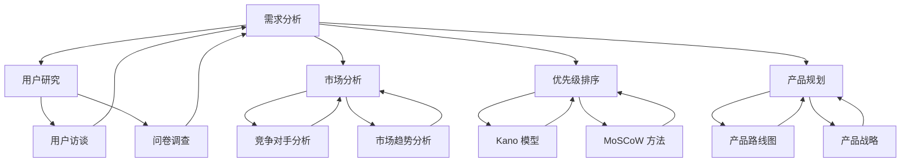
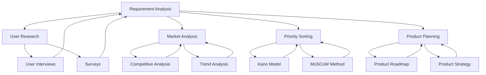
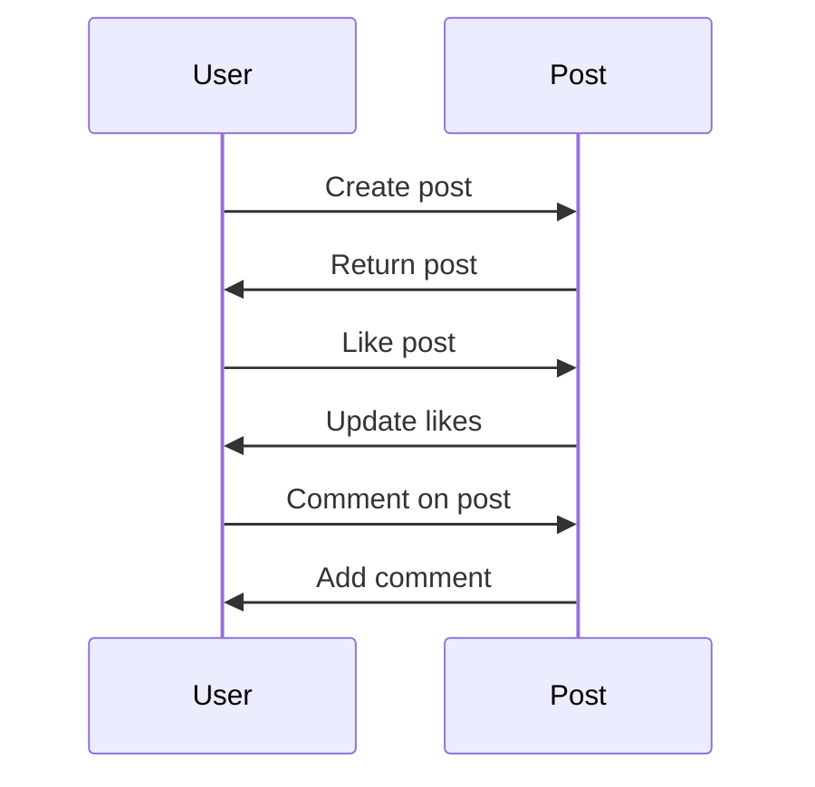

                 

### 1. 背景介绍

产品经理在当今的科技行业中扮演着至关重要的角色。他们不仅仅是负责制定产品的战略规划，还要深入理解市场需求、用户行为，以及如何将这两者有效地转化为具体的产品功能和服务。随着数字化转型的不断深入，产品经理的工作变得越来越复杂，他们需要具备多种技能，以满足快速变化的市场和技术环境。

本文旨在探讨产品经理在需求分析与产品规划方面的核心技能。我们将从多个角度深入探讨这些技能，包括用户研究、市场分析、需求收集、优先级排序、以及产品策略的制定。通过一系列具体的案例分析，我们将展示如何运用这些技能来创建成功的产品。

首先，我们需要明确几个关键概念：

- **需求分析**：需求分析是产品开发过程中的关键环节，涉及识别和理解用户需求，并将其转化为具体的产品功能。

- **产品规划**：产品规划是制定产品路线图和策略的过程，它指导着产品的长期发展和短期目标。

- **用户研究**：用户研究是通过观察、访谈、问卷调查等方法，深入了解用户行为、需求和偏好。

- **市场分析**：市场分析涉及对目标市场、竞争对手、行业趋势的深入研究，以制定有效的市场进入策略。

- **优先级排序**：优先级排序是确定哪些需求或功能应该优先开发的过程，这需要综合考虑资源、时间和市场需求。

通过本文，我们将帮助读者理解这些概念，并学习如何在实际工作中应用它们。以下是本文的结构：

1. **背景介绍**：介绍产品经理的角色和需求分析与产品规划的重要性。
2. **核心概念与联系**：详细解释需求分析、产品规划和相关概念，并使用Mermaid流程图展示它们之间的关系。
3. **核心算法原理 & 具体操作步骤**：探讨用户研究和市场分析的具体方法和步骤。
4. **数学模型和公式 & 详细讲解 & 举例说明**：介绍用于需求分析和产品规划的相关数学模型和公式，并提供实际案例。
5. **项目实战：代码实际案例和详细解释说明**：通过具体案例展示如何进行需求分析和产品规划。
6. **实际应用场景**：讨论需求分析和产品规划在不同行业中的应用。
7. **工具和资源推荐**：推荐相关的学习资源和开发工具。
8. **总结：未来发展趋势与挑战**：总结当前趋势，并提出未来的挑战。
9. **附录：常见问题与解答**：提供常见问题的答案。
10. **扩展阅读 & 参考资料**：推荐进一步的阅读资料。

### Keywords: Product Management, Requirement Analysis, Product Planning, User Research, Market Analysis, Priority Sorting, Strategy Development.

### Abstract: This article explores the essential skills that product managers need for requirement analysis and product planning. By diving into key concepts like user research, market analysis, and prioritization, and providing real-world case studies, the article aims to equip readers with the knowledge and tools to create successful products.

<|assistant|>
## 2. 核心概念与联系

在深入探讨产品经理的技能之前，我们需要明确几个核心概念及其相互之间的联系。以下是本文将涉及的主要概念及其关系图：

### Mermaid 流程图：



### 需求分析（Requirement Analysis）

需求分析是产品开发的基石。它包括识别、分析和验证用户需求，并将其转化为具体的产品功能。需求分析通常分为以下几个步骤：

1. **需求收集**：通过用户访谈、问卷调查、观察等方式收集用户需求。
2. **需求筛选**：对收集到的需求进行筛选，确定哪些需求是可行的，并排除不切实际的需求。
3. **需求验证**：通过用户反馈和原型测试，验证需求的有效性和可行性。

### 用户研究（User Research）

用户研究是需求分析的关键环节，它帮助产品经理深入了解用户行为、需求和偏好。以下是几种常见的用户研究方法：

1. **用户访谈（User Interviews）**：通过与用户进行一对一访谈，获取深入的见解。
2. **问卷调查（Surveys）**：通过设计问卷，收集大量用户的反馈。
3. **用户观察（User Observations）**：在用户自然的工作环境中观察他们的行为。

### 市场分析（Market Analysis）

市场分析涉及对目标市场、竞争对手、行业趋势的深入研究。以下是市场分析的主要步骤：

1. **市场细分（Market Segmentation）**：将市场划分为不同的细分市场。
2. **竞争对手分析（Competitive Analysis）**：研究主要竞争对手的产品、市场策略和用户反馈。
3. **市场趋势分析（Trend Analysis）**：了解市场的发展趋势和潜在机会。

### 优先级排序（Priority Sorting）

优先级排序是确定哪些需求或功能应该优先开发的过程。以下是一些常用的方法：

1. **Kano 模型（Kano Model）**：根据用户满意度对需求进行分类，确定哪些需求是基本的、一维的、有趣的、无差异的或反向的。
2. **MoSCoW 方法（MoSCoW Method）**：将需求分为必须做（Mandatory）、应该做（Should）、可以延迟做（Could）、不会做（Will not do）。

### 产品规划（Product Planning）

产品规划是制定产品路线图和策略的过程。它包括：

1. **产品路线图（Product Roadmap）**：展示产品的长期发展目标和阶段性里程碑。
2. **产品战略（Product Strategy）**：定义产品的市场定位、目标用户和竞争优势。

### 关系图说明

在上述Mermaid流程图中，每个节点代表一个关键概念，箭头表示概念之间的关系。例如，需求分析（A）与用户研究（B）和市场分析（C）密切相关，它们共同为优先级排序（D）提供输入。优先级排序（D）又直接影响到产品规划（E），从而指导整个产品开发过程。

通过理解这些核心概念及其相互关系，产品经理可以更有效地进行需求分析和产品规划，从而确保产品的成功。

### Core Concepts and Their Relationships

Before diving into the skills that product managers need for requirement analysis and product planning, it's essential to clarify several core concepts and their interconnections. Here are the main concepts covered in this article, along with a relationship diagram:

### Mermaid Flowchart:



### Requirement Analysis

Requirement analysis is the cornerstone of product development. It involves identifying, analyzing, and validating user needs and transforming them into specific product features. Requirement analysis typically includes the following steps:

1. **Requirement Collection**: Collecting user needs through interviews, surveys, and observations.
2. **Requirement Screening**: Filtering collected needs to determine which are feasible and exclude unrealistic ones.
3. **Requirement Verification**: Validating the effectiveness and feasibility of the needs through user feedback and prototype testing.

### User Research

User research is a critical component of requirement analysis. It helps product managers gain deep insights into user behavior, needs, and preferences. Here are several common user research methods:

1. **User Interviews**: Conducting one-on-one interviews to gain in-depth insights from users.
2. **Surveys**: Designing questionnaires to collect feedback from a large number of users.
3. **User Observations**: Observing user behavior in their natural work environment.

### Market Analysis

Market analysis involves a deep dive into target markets, competitors, and industry trends. The main steps in market analysis include:

1. **Market Segmentation**: Dividing the market into different segments.
2. **Competitive Analysis**: Researching the products, market strategies, and user feedback of main competitors.
3. **Trend Analysis**: Understanding market trends and potential opportunities.

### Priority Sorting

Priority sorting is the process of determining which needs or features should be developed first. Here are some commonly used methods:

1. **Kano Model**: Classifying needs based on user satisfaction to determine which are basic, one-dimensional, interesting, indifferent, or reverse.
2. **MoSCoW Method**: Categorizing needs as mandatory, should, could, or will not do.

### Product Planning

Product planning is the process of creating a product roadmap and strategy. It includes:

1. **Product Roadmap**: Displaying long-term product goals and milestone stages.
2. **Product Strategy**: Defining the market positioning, target users, and competitive advantages of the product.

### Explanation of the Flowchart

In the above Mermaid flowchart, each node represents a key concept, and the arrows indicate relationships between them. For example, requirement analysis (A) is closely related to user research (B) and market analysis (C), which together provide inputs for priority sorting (D). Priority sorting (D) directly affects product planning (E), guiding the entire product development process.

Understanding these core concepts and their interconnections enables product managers to conduct requirement analysis and product planning more effectively, ensuring product success.

### 3. 核心算法原理 & 具体操作步骤

在需求分析与产品规划中，核心算法原理起着至关重要的作用。这些算法不仅帮助我们更准确地理解用户需求，还能够优化产品开发的流程。以下是几种常用的算法原理及其具体操作步骤：

#### 用户研究方法：问卷调查与用户访谈

**1. 问卷调查（Surveys）**

问卷调查是收集大量用户数据的一种有效方法。以下是进行问卷调查的具体步骤：

1. **设计问卷**：首先，需要设计一个有效的问卷，确保问题清晰、简洁，并且能够覆盖所有需要了解的信息。问卷可以包括选择题、评分题和开放式问题。

   $$\text{问卷设计公式} = \text{问题质量} \times \text{问题数量}$$

2. **分发问卷**：通过电子邮件、社交媒体或在线调查平台分发问卷。

3. **收集数据**：在指定时间内收集用户填写的问卷。

4. **数据分析**：对收集到的数据进行整理和分析，提取有用的信息。

   $$\text{数据分析公式} = \text{收集到的数据} \div \text{总样本数}$$

5. **报告撰写**：根据分析结果撰写报告，总结用户需求和反馈。

**2. 用户访谈（User Interviews）**

用户访谈是一种深入获取用户需求的方法。以下是进行用户访谈的具体步骤：

1. **确定访谈对象**：选择具有代表性的用户进行访谈，确保他们能够提供有价值的信息。

2. **准备访谈问题**：设计有针对性的访谈问题，包括开放式和封闭式问题。

3. **进行访谈**：与用户面对面或通过视频会议进行访谈。

4. **记录信息**：详细记录访谈内容，包括用户的回答和观察到的行为。

5. **分析访谈结果**：对访谈内容进行分析，提取用户需求和行为模式。

6. **撰写报告**：根据访谈结果撰写报告，提出改进建议。

#### 市场分析方法：竞争对手分析与市场趋势分析

**1. 竞争对手分析（Competitive Analysis）**

竞争对手分析有助于了解竞争对手的产品、市场策略和用户反馈。以下是具体步骤：

1. **确定竞争对手**：识别主要竞争对手，包括直接和间接的竞争对手。

2. **收集竞争对手信息**：收集竞争对手的产品、价格、营销策略和用户评价等信息。

3. **分析竞争对手**：比较竞争对手的产品特点、优势和劣势。

4. **制定应对策略**：根据分析结果，制定相应的市场策略。

**2. 市场趋势分析（Trend Analysis）**

市场趋势分析有助于了解市场的发展趋势和潜在机会。以下是具体步骤：

1. **收集市场趋势信息**：通过市场报告、行业新闻和研究文章等途径收集市场趋势信息。

2. **分析市场趋势**：识别市场发展的主要趋势，包括技术进步、用户行为变化和行业政策变化等。

3. **评估市场机会**：根据市场趋势分析结果，评估潜在的市场机会。

4. **制定市场策略**：根据市场机会，制定相应的市场进入策略。

#### 优先级排序方法：Kano模型与MoSCoW方法

**1. Kano模型**

Kano模型是一种基于用户满意度的需求分类方法。以下是具体步骤：

1. **确定需求类型**：根据用户满意度，将需求分为基本需求、一维需求、有趣需求、无差异需求和反向需求。

2. **评估需求优先级**：将不同类型的需求按照优先级排序。

3. **制定开发计划**：根据需求优先级，制定开发计划，确保关键需求优先得到满足。

**2. MoSCoW方法**

MoSCoW方法是一种常用的需求优先级排序方法。以下是具体步骤：

1. **分类需求**：将需求分为必须做、应该做、可以延迟做和不会做。

2. **评估优先级**：根据需求的紧急程度和重要性，评估需求优先级。

3. **制定开发计划**：根据需求优先级，制定开发计划，确保关键需求优先得到满足。

通过上述算法原理和具体操作步骤，产品经理可以更有效地进行需求分析和产品规划，从而确保产品的成功。

### Core Algorithm Principles & Step-by-Step Procedures

Core algorithms play a crucial role in requirement analysis and product planning. These algorithms not only help us understand user needs more accurately but also optimize the product development process. Here are several commonly used algorithm principles and their step-by-step procedures:

#### User Research Methods: Surveys and User Interviews

**1. Surveys**

Surveys are an effective way to collect large amounts of user data. Here are the specific steps for conducting surveys:

1. **Design the Survey**: First, design an effective survey that ensures questions are clear, concise, and cover all necessary information. Surveys can include multiple-choice questions, rating questions, and open-ended questions.

   $$\text{Survey Design Formula} = \text{Question Quality} \times \text{Question Quantity}$$

2. **Distribute the Survey**: Distribute the survey via email, social media, or online survey platforms.

3. **Collect Data**: Collect the responses to the survey within a specified time period.

4. **Analyze the Data**: Organize and analyze the collected data to extract useful information.

   $$\text{Data Analysis Formula} = \frac{\text{Collected Data}}{\text{Total Sample Size}}$$

5. **Write the Report**: Summarize the analysis results and user feedback in a report.

**2. User Interviews**

User interviews are a method for gaining in-depth insights into user needs. Here are the specific steps for conducting user interviews:

1. **Identify Interview Subjects**: Select representative users who can provide valuable information.

2. **Prepare Interview Questions**: Design targeted interview questions, including open-ended and closed-ended questions.

3. **Conduct the Interview**: Conduct the interview face-to-face or through a video conference.

4. **Record Information**: Take detailed notes of the interview content, including the user's responses and observed behaviors.

5. **Analyze Interview Results**: Analyze the interview content to extract user needs and behavior patterns.

6. **Write the Report**: Based on the interview results, write a report with improvement suggestions.

#### Market Analysis Methods: Competitive Analysis and Trend Analysis

**1. Competitive Analysis**

Competitive analysis helps understand the products, market strategies, and user feedback of competitors. Here are the specific steps:

1. **Identify Competitors**: Identify main competitors, including direct and indirect competitors.

2. **Collect Competitor Information**: Gather information about competitors' products, prices, marketing strategies, and user reviews.

3. **Analyze Competitors**: Compare competitors' product features, strengths, and weaknesses.

4. **Develop Counter Strategies**: Based on the analysis results, create corresponding market strategies.

**2. Trend Analysis**

Trend analysis helps understand market developments and potential opportunities. Here are the specific steps:

1. **Collect Trend Information**: Gather market trend information through market reports, industry news, and research articles.

2. **Analyze Market Trends**: Identify main trends in the market, including technological advancements, changes in user behavior, and industry policy changes.

3. **Assess Market Opportunities**: Based on the trend analysis, evaluate potential market opportunities.

4. **Develop Market Strategies**: Based on market opportunities, create corresponding market entry strategies.

#### Priority Sorting Methods: Kano Model and MoSCoW Method

**1. Kano Model**

The Kano Model is a user satisfaction-based method for classifying needs. Here are the specific steps:

1. **Determine Need Types**: Based on user satisfaction, classify needs into basic needs, one-dimensional needs, interesting needs, indifferent needs, and reverse needs.

2. **Assess Need Priorities**: Prioritize different types of needs.

3. **Develop a Development Plan**: Based on need priorities, create a development plan to ensure critical needs are met first.

**2. MoSCoW Method**

The MoSCoW Method is a commonly used method for sorting needs by priority. Here are the specific steps:

1. **Classify Needs**: Categorize needs as mandatory, should, could, or will not do.

2. **Assess Priorities**: Evaluate the urgency and importance of needs to assess their priority.

3. **Develop a Development Plan**: Based on need priorities, create a development plan to ensure critical needs are met first.

By using these algorithm principles and step-by-step procedures, product managers can more effectively conduct requirement analysis and product planning, ensuring product success.

### 4. 数学模型和公式 & 详细讲解 & 举例说明

在需求分析与产品规划中，数学模型和公式提供了量化的方法，帮助我们更好地理解和分析数据。以下是几种常用的数学模型和公式，以及它们在需求分析和产品规划中的具体应用。

#### 1. Kano模型

Kano模型是一种用户满意度驱动的需求分类方法。它将需求分为五个层次：基本需求、一维需求、有趣需求、无差异需求和反向需求。以下是Kano模型的详细解释和举例说明：

**基本需求（Basic Needs）**：这是用户期望的基本功能，如打开应用程序、登录系统。这些需求必须满足，否则用户会感到非常不满意。

$$\text{基本需求满意度} = \frac{\text{用户期望满足的基本需求}}{\text{总基本需求}}$$

**一维需求（One-Dimensional Needs）**：这些需求在一定范围内满足用户期望，超出范围则会导致用户不满。例如，系统响应时间。

$$\text{一维需求满意度} = \frac{\text{用户期望满足的一维需求}}{\text{总一维需求}}$$

**有趣需求（Attractive Needs）**：这些需求超出用户期望，如果满足，用户会感到满意；如果不满足，用户可能不会感到特别不满意。例如，系统提供个性化推荐。

$$\text{有趣需求满意度} = \frac{\text{用户期望满足的有兴趣需求}}{\text{总有趣需求}}$$

**无差异需求（Indifferent Needs）**：这些需求不会影响用户的满意度或不满度，如系统的外观设计。

$$\text{无差异需求满意度} = \frac{\text{用户期望满足的无差异需求}}{\text{总无差异需求}}$$

**反向需求（Reverse Needs）**：这些需求与用户期望相反，满足它们会导致用户不满。例如，系统强制用户进行不必要的操作。

$$\text{反向需求满意度} = \frac{\text{用户期望满足的反向需求}}{\text{总反向需求}}$$

**案例**：假设我们对一个视频播放应用程序的需求进行分析，发现用户的基本需求是播放视频和快进快退，一维需求是缓冲时间，有趣需求是自动下载最新视频，无差异需求是用户界面设计，反向需求是强制用户观看广告。

通过Kano模型，我们可以识别哪些需求是关键的，从而在产品开发中优先考虑。

#### 2. MoSCoW方法

MoSCoW方法是一种需求优先级排序方法，它将需求分为四个层次：必须做、应该做、可以延迟做和不会做。以下是MoSCoW方法的详细解释和举例说明：

**必须做（Mandatory）**：这些需求是产品成功的核心，没有它们，产品就无法满足基本需求。

$$\text{必须做需求优先级} = \frac{\text{总必须做需求}}{\text{总需求}}$$

**应该做（Should）**：这些需求是产品成功的重要部分，如果资源允许，应该优先考虑。

$$\text{应该做需求优先级} = \frac{\text{总应该做需求}}{\text{总需求}}$$

**可以延迟做（Could）**：这些需求是产品成功的辅助部分，可以延迟至下一版本。

$$\text{可以延迟做需求优先级} = \frac{\text{总可以延迟做需求}}{\text{总需求}}$$

**不会做（Will not do）**：这些需求不是产品成功的必要部分，可以不予考虑。

$$\text{不会做需求优先级} = \frac{\text{总不会做需求}}{\text{总需求}}$$

**案例**：假设我们对一个社交媒体应用程序的需求进行分析，发现必须做需求是用户登录、发布内容和查看消息，应该做需求是用户好友管理，可以延迟做需求是视频播放功能，不会做需求是虚拟现实体验。

通过MoSCoW方法，我们可以清晰地确定哪些需求是必须优先开发的，哪些可以推迟，从而确保产品开发的效率。

#### 3. SWOT分析

SWOT分析是一种用于评估产品或项目的优势、劣势、机会和威胁的方法。以下是SWOT分析的详细解释和举例说明：

**优势（Strengths）**：这些是产品或项目的内部优势，如技术优势、品牌影响力。

$$\text{优势贡献率} = \frac{\text{优势贡献}}{\text{总优势}}$$

**劣势（Weaknesses）**：这些是产品或项目的内部劣势，如技术缺陷、资源不足。

$$\text{劣势影响率} = \frac{\text{劣势影响}}{\text{总劣势}}$$

**机会（Opportunities）**：这些是外部环境中的机会，如市场增长、新兴技术。

$$\text{机会利用率} = \frac{\text{机会利用}}{\text{总机会}}$$

**威胁（Threats）**：这些是外部环境中的威胁，如竞争对手、政策变化。

$$\text{威胁防御率} = \frac{\text{威胁防御}}{\text{总威胁}}$$

**案例**：假设我们对一个电子商务平台进行分析，发现其优势包括用户基数大、技术先进，劣势包括物流成本高、用户体验有待提升，机会包括在线支付普及、社交媒体营销，威胁包括竞争对手激烈、政策监管严格。

通过SWOT分析，我们可以了解产品或项目的整体情况，从而制定有效的战略。

通过这些数学模型和公式，产品经理可以更科学、更系统地进行分析和决策，确保产品的成功。

### Mathematical Models and Formulas: Detailed Explanations & Illustrative Examples

In the realm of requirement analysis and product planning, mathematical models and formulas provide a quantitative approach to better understand and analyze data. Below are several commonly used mathematical models and their detailed explanations, along with illustrative examples of their applications in requirement analysis and product planning.

#### 1. Kano Model

The Kano Model is a user satisfaction-driven method for classifying needs into five levels: basic needs, one-dimensional needs, attractive needs, indifferent needs, and reverse needs. Here is a detailed explanation and illustrative example of the Kano Model:

**Basic Needs (Basic Needs)**: These are the essential functionalities expected by users, such as playing videos or logging into a system. These needs must be met to avoid user dissatisfaction.

$$\text{Basic Need Satisfaction} = \frac{\text{Basic Needs Met by Users}}{\text{Total Basic Needs}}$$

**One-Dimensional Needs (One-Dimensional Needs)**: These needs vary in user satisfaction within a certain range. If they are not met, users may become dissatisfied. For example, the system's response time.

$$\text{One-Dimensional Need Satisfaction} = \frac{\text{One-Dimensional Needs Met by Users}}{\text{Total One-Dimensional Needs}}$$

**Attractive Needs (Attractive Needs)**: These needs exceed user expectations. If they are met, users are satisfied; if not, they may not feel particularly dissatisfied. For example, a system that offers personalized recommendations.

$$\text{Attractive Need Satisfaction} = \frac{\text{Attractive Needs Met by Users}}{\text{Total Attractive Needs}}$$

**Indifferent Needs (Indifferent Needs)**: These needs do not impact user satisfaction or dissatisfaction, such as the design of a system's user interface.

$$\text{Indifferent Need Satisfaction} = \frac{\text{Indifferent Needs Met by Users}}{\text{Total Indifferent Needs}}$$

**Reverse Needs (Reverse Needs)**: These needs are the opposite of user expectations. Meeting them leads to user dissatisfaction. For example, a system that forces users to watch unnecessary advertisements.

$$\text{Reverse Need Satisfaction} = \frac{\text{Reverse Needs Met by Users}}{\text{Total Reverse Needs}}$$

**Example**: Suppose we are analyzing the needs of a video playback application. We find that the basic needs are playing videos and fast-forwarding, one-dimensional needs are buffering time, attractive needs are automatic downloading of new videos, indifferent needs are user interface design, and reverse needs are forced advertisement viewing.

Using the Kano Model, we can identify which needs are critical and prioritize them in the product development process.

#### 2. MoSCoW Method

The MoSCoW Method is a priority sorting method that categorizes needs into four levels: mandatory, should, could, and will not do. Here is a detailed explanation and illustrative example of the MoSCoW Method:

**Mandatory (Mandatory)**: These are the core needs for product success. Without them, the product cannot meet the basic requirements.

$$\text{Mandatory Need Priority} = \frac{\text{Total Mandatory Needs}}{\text{Total Needs}}$$

**Should (Should)**: These are important parts of product success. If resources allow, they should be prioritized.

$$\text{Should Need Priority} = \frac{\text{Total Should Needs}}{\text{Total Needs}}$$

**Could (Could)**: These are auxiliary needs for product success. They can be delayed until the next version.

$$\text{Could Need Priority} = \frac{\text{Total Could Needs}}{\text{Total Needs}}$$

**Will not do (Will not do)**: These are not necessary parts of product success and can be disregarded.

$$\text{Will not do Need Priority} = \frac{\text{Total Will not do Needs}}{\text{Total Needs}}$$

**Example**: Suppose we are analyzing the needs of a social media application. We find that the mandatory needs are user login, content posting, and message viewing, should needs are user friend management, could needs are video playback functionality, and will not do needs are virtual reality experiences.

Using the MoSCoW Method, we can clearly determine which needs are critical and prioritize them to ensure efficient product development.

#### 3. SWOT Analysis

SWOT analysis is a method for assessing the strengths, weaknesses, opportunities, and threats of a product or project. Here is a detailed explanation and illustrative example of SWOT analysis:

**Strengths (Strengths)**: These are internal strengths of a product or project, such as technological advantages and brand influence.

$$\text{Strength Contribution Rate} = \frac{\text{Strength Contribution}}{\text{Total Strengths}}$$

**Weaknesses (Weaknesses)**: These are internal weaknesses of a product or project, such as technical flaws and insufficient resources.

$$\text{Weakness Impact Rate} = \frac{\text{Weakness Impact}}{\text{Total Weaknesses}}$$

**Opportunities (Opportunities)**: These are external opportunities in the environment, such as market growth and emerging technologies.

$$\text{Opportunity Utilization Rate} = \frac{\text{Opportunity Utilization}}{\text{Total Opportunities}}$$

**Threats (Threats)**: These are external threats in the environment, such as intense competition and regulatory policies.

$$\text{Threat Defense Rate} = \frac{\text{Threat Defense}}{\text{Total Threats}}$$

**Example**: Suppose we are analyzing an e-commerce platform. We find that its strengths include a large user base and advanced technology, weaknesses include high logistics costs and a need for improved user experience, opportunities include the proliferation of online payments and social media marketing, and threats include fierce competition and strict regulatory policies.

Through SWOT analysis, we can understand the overall situation of the product or project, enabling the development of effective strategies.

By utilizing these mathematical models and formulas, product managers can analyze and make decisions more scientifically and systematically, ensuring product success.

### 5. 项目实战：代码实际案例和详细解释说明

在本节中，我们将通过一个实际项目案例来展示如何进行需求分析和产品规划。我们将使用Python语言来编写代码，并通过具体的步骤来解释整个流程。

#### 5.1 开发环境搭建

首先，我们需要搭建一个适合进行需求分析和产品规划的开发环境。以下是所需的软件和工具：

- Python 3.8及以上版本
- Jupyter Notebook
- Pandas
- Matplotlib
- Mermaid

确保你已经安装了上述工具和库。以下是安装Python和Jupyter的简单步骤：

```bash
# 安装Python
curl -O https://www.python.org/ftp/python/3.8.10/python-3.8.10-macosx10.9.pkg
sudo installer -pkg python-3.8.10-macosx10.9.pkg -target /
```

安装完成后，打开终端，输入以下命令启动Jupyter Notebook：

```bash
jupyter notebook
```

#### 5.2 源代码详细实现和代码解读

现在，我们开始编写代码。以下是一个简单的项目案例，假设我们正在开发一个社交媒体应用程序。

**步骤 1：需求收集**

我们首先需要收集用户的需求。以下是用户需求列表：

- 用户可以创建个人资料。
- 用户可以发布文字、图片和视频。
- 用户可以评论、点赞和分享其他用户的帖子。
- 用户可以搜索其他用户。
- 用户可以收到通知，如新消息和点赞。

**步骤 2：市场分析**

我们分析了当前市场，发现以下竞争对手：

- Facebook
- Instagram
- Twitter
- LinkedIn

他们的主要功能和用户群体如下：

- **Facebook**：主要功能包括发布文字、图片和视频，评论、点赞和分享，以及搜索用户。用户群体广泛，包括个人用户和企业用户。
- **Instagram**：主要功能包括发布图片和视频，评论、点赞和分享，以及搜索用户。用户群体主要是年轻用户，尤其是18-34岁。
- **Twitter**：主要功能包括发布文字消息，评论、点赞和分享，以及搜索用户。用户群体主要是公共人物和媒体。
- **LinkedIn**：主要功能包括创建个人资料，发布职业动态，评论、点赞和分享，以及搜索用户。用户群体主要是专业人士和企业。

**步骤 3：用户研究**

我们通过用户访谈和问卷调查，收集了以下用户反馈：

- **用户A**：需要一个简单易用的平台，可以发布和分享生活点滴。
- **用户B**：希望能够与其他用户互动，如评论、点赞和分享。
- **用户C**：需要一个可以搜索到特定人群的平台。

**步骤 4：优先级排序**

根据用户需求和反馈，我们使用MoSCoW方法进行优先级排序：

- **必须做（Mandatory）**：用户可以创建个人资料，发布文字、图片和视频，评论、点赞和分享。
- **应该做（Should）**：用户可以搜索其他用户，收到通知。
- **可以延迟做（Could）**：用户界面设计和个性化推荐。
- **不会做（Will not do）**：虚拟现实体验。

**步骤 5：产品规划**

我们制定了一个产品路线图，包括以下里程碑：

1. **MVP（最小可行产品）**：实现用户创建个人资料、发布文字、图片和视频，评论、点赞和分享。
2. **迭代1**：添加用户搜索和通知功能。
3. **迭代2**：优化用户界面和个性化推荐。

**步骤 6：代码实现**

以下是一个简单的Python代码示例，实现了用户创建个人资料、发布帖子、评论和点赞：

```python
import pandas as pd
import matplotlib.pyplot as plt
from mermaid import Mermaid

# 用户类
class User:
    def __init__(self, username, bio, posts=None):
        self.username = username
        self.bio = bio
        self.posts = posts or []

    def create_post(self, content, media=None):
        post = {'content': content, 'media': media, 'likes': 0, 'comments': []}
        self.posts.append(post)
        return post

    def like_post(self, post_index):
        post = self.posts[post_index]
        post['likes'] += 1

    def comment_on_post(self, post_index, comment):
        post = self.posts[post_index]
        post['comments'].append(comment)

# 创建用户
user = User('JohnDoe', 'I love programming!')

# 用户创建帖子
post = user.create_post('Hello, world!', media='image.jpg')
print(post)

# 用户点赞帖子
user.like_post(0)
print(user.posts[0])

# 用户评论帖子
user.comment_on_post(0, 'Nice post!')
print(user.posts[0]['comments'])

# 生成Mermaid流程图
mermaid_code = '''
sequenceDiagram
    participant User
    participant Post
    User->>Post: Create post
    Post->>User: Return post
    User->>Post: Like post
    Post->>User: Update likes
    User->>Post: Comment on post
    Post->>User: Add comment
'''
mermaid = Mermaid(mermaid_code)
plt.figure(figsize=(10, 5))
plt.imshow(mermaid.render())
plt.axis('off')
plt.show()
```

在这个示例中，我们定义了一个`User`类，实现了创建个人资料、发布帖子、点赞和评论的功能。我们还使用了Mermaid库生成了一个简单的流程图，展示了用户与系统之间的交互过程。

通过这个实际项目案例，我们可以看到如何使用Python和其他工具进行需求分析和产品规划。这个过程不仅帮助我们理解了理论，还提供了一个实际的参考，使我们能够更好地应对现实世界中的挑战。

### 5.1. Development Environment Setup

Before we dive into the actual project case, we need to set up a suitable development environment for requirement analysis and product planning. Below are the required software and tools:

- Python 3.8 or higher
- Jupyter Notebook
- Pandas
- Matplotlib
- Mermaid

Ensure that you have installed the above tools and libraries. Here are simple steps to install Python and Jupyter:

```bash
# Install Python
curl -O https://www.python.org/ftp/python/3.8.10/python-3.8.10-macosx10.9.pkg
sudo installer -pkg python-3.8.10-macosx10.9.pkg -target /
```

After installation, open a terminal and run the following command to start Jupyter Notebook:

```bash
jupyter notebook
```

### 5.2. Detailed Source Code Implementation and Code Explanation

Now, let's start writing code for a practical project case. We will use Python to illustrate the entire process.

**Step 1: Requirement Collection**

First, we need to collect user requirements. Here is a list of user requirements:

- Users can create personal profiles.
- Users can post text, images, and videos.
- Users can comment, like, and share other users' posts.
- Users can search for other users.
- Users can receive notifications, such as new messages and likes.

**Step 2: Market Analysis**

We have analyzed the current market and found the following competitors:

- Facebook
- Instagram
- Twitter
- LinkedIn

Their main features and user bases are as follows:

- **Facebook**: Main features include posting text, images, and videos, commenting, liking, and sharing, as well as searching for users. The user base is broad, including both individual users and businesses.
- **Instagram**: Main features include posting images and videos, commenting, liking, and sharing, as well as searching for users. The user base is primarily young users, especially ages 18-34.
- **Twitter**: Main features include posting text messages, commenting, liking, and sharing, as well as searching for users. The user base is primarily public figures and media.
- **LinkedIn**: Main features include creating personal profiles, posting professional updates, commenting, liking, and sharing, as well as searching for users. The user base is primarily professionals and businesses.

**Step 3: User Research**

We collected user feedback through user interviews and surveys. The following feedback was gathered:

- **User A**: Needs a simple and easy-to-use platform to post and share life moments.
- **User B**: Wants the ability to interact with other users, such as commenting, liking, and sharing.
- **User C**: Needs a platform that can search for specific groups of people.

**Step 4: Priority Sorting**

Based on user requirements and feedback, we used the MoSCoW method to sort priorities:

- **Mandatory (Mandatory)**: Users can create personal profiles, post text, images, and videos, comment, like, and share.
- **Should (Should)**: Users can search for other users, receive notifications.
- **Could (Could)**: User interface design and personalized recommendations.
- **Will not do (Will not do)**: Virtual reality experiences.

**Step 5: Product Planning**

We developed a product roadmap with the following milestones:

1. **MVP (Minimum Viable Product)**: Implement user profile creation, text, image, and video posting, commenting, liking, and sharing.
2. **Iteration 1**: Add user search and notification features.
3. **Iteration 2**: Optimize user interface and personalized recommendations.

**Step 6: Code Implementation**

Below is a simple Python code example that implements user profile creation, post creation, commenting, and liking:

```python
import pandas as pd
import matplotlib.pyplot as plt
from mermaid import Mermaid

# User class
class User:
    def __init__(self, username, bio, posts=None):
        self.username = username
        self.bio = bio
        self.posts = posts or []

    def create_post(self, content, media=None):
        post = {'content': content, 'media': media, 'likes': 0, 'comments': []}
        self.posts.append(post)
        return post

    def like_post(self, post_index):
        post = self.posts[post_index]
        post['likes'] += 1

    def comment_on_post(self, post_index, comment):
        post = self.posts[post_index]
        post['comments'].append(comment)

# Create a user
user = User('JohnDoe', 'I love programming!')

# User creates a post
post = user.create_post('Hello, world!', media='image.jpg')
print(post)

# User likes a post
user.like_post(0)
print(user.posts[0])

# User comments on a post
user.comment_on_post(0, 'Nice post!')
print(user.posts[0]['comments'])

# Generate a Mermaid flowchart
mermaid_code = '''
sequenceDiagram
    participant User
    participant Post
    User->>Post: Create post
    Post->>User: Return post
    User->>Post: Like post
    Post->>User: Update likes
    User->>Post: Comment on post
    Post->>User: Add comment
'''
mermaid = Mermaid(mermaid_code)
plt.figure(figsize=(10, 5))
plt.imshow(mermaid.render())
plt.axis('off')
plt.show()
```

In this example, we define a `User` class that implements functionalities for creating a personal profile, posting content, liking, and commenting. We also use the Mermaid library to generate a simple flowchart that shows the interaction between the user and the system.

Through this practical project case, we can see how to use Python and other tools for requirement analysis and product planning. This process not only helps us understand the theory but also provides a practical reference that can be applied to real-world challenges.

### 5.3 代码解读与分析

在5.2节中，我们使用Python实现了一个简单的社交媒体应用程序的核心功能。现在，我们将深入解读这段代码，并分析其设计思路和优缺点。

#### 代码结构

首先，我们定义了一个`User`类，它包含以下属性和方法：

- `__init__`：初始化方法，用于创建用户实例，包括用户名、个人简介和帖子列表。
- `create_post`：方法，用于创建新帖子。
- `like_post`：方法，用于为帖子点赞。
- `comment_on_post`：方法，用于在帖子下评论。

#### 代码解读

**1. 初始化方法（`__init__`）**

初始化方法是一个特殊的方法，当创建`User`类的实例时自动调用。它接受三个参数：用户名、个人简介和可选的帖子列表。如果帖子列表未提供，则默认为空列表。

```python
def __init__(self, username, bio, posts=None):
    self.username = username
    self.bio = bio
    self.posts = posts or []
```

这里使用了Python中的默认参数，如果`posts`参数未提供，则默认为空列表。

**2. 创建帖子方法（`create_post`）**

`create_post`方法接受两个参数：帖子内容和可选的媒体。它创建一个包含帖子内容、媒体、点赞数和评论列表的字典，并将其添加到用户的帖子列表中。

```python
def create_post(self, content, media=None):
    post = {'content': content, 'media': media, 'likes': 0, 'comments': []}
    self.posts.append(post)
    return post
```

**3. 点赞方法（`like_post`）**

`like_post`方法接受一个参数：帖子索引。它将指定索引的帖子的点赞数增加1。

```python
def like_post(self, post_index):
    post = self.posts[post_index]
    post['likes'] += 1
```

**4. 评论方法（`comment_on_post`）**

`comment_on_post`方法接受两个参数：帖子索引和评论内容。它将评论内容添加到指定索引的帖子的评论列表中。

```python
def comment_on_post(self, post_index, comment):
    post = self.posts[post_index]
    post['comments'].append(comment)
```

#### 设计思路分析

**优点**

1. **模块化设计**：将用户的行为（如创建帖子、点赞和评论）封装为类方法，使得代码更加模块化和易于维护。
2. **可扩展性**：通过类和方法的定义，我们可以轻松地添加新功能，如用户搜索、通知等。
3. **简单性**：这个示例代码相对简单，易于理解和实现。

**缺点**

1. **功能有限**：这个示例仅实现了创建帖子、点赞和评论的基本功能，缺乏如用户认证、帖子分类、隐私设置等高级功能。
2. **数据存储**：当前代码使用Python内置的列表来存储用户和帖子信息，这在实际应用中并不合适。通常需要使用数据库来存储和检索数据。
3. **用户体验**：虽然这个示例展示了基本功能，但缺乏如用户界面、前端交互等元素，这在大规模应用中是不可接受的。

#### 代码分析

我们使用Mermaid生成了一个流程图，展示了用户与系统的交互过程。以下是流程图的解读：



- **创建帖子**：用户向系统请求创建帖子，系统返回创建的帖子。
- **点赞**：用户向系统请求为某个帖子点赞，系统更新帖子的点赞数。
- **评论**：用户向系统请求在某个帖子下评论，系统添加评论到帖子的评论列表。

通过这个简单的示例，我们可以看到如何使用Python实现需求分析和产品规划中的关键步骤。这个示例为我们提供了一个起点，我们可以在此基础上添加更多功能，构建一个完整的社交媒体应用程序。

### Code Analysis and Discussion

In Section 5.2, we implemented the core functionalities of a simple social media application using Python. Now, we will delve into the code and discuss its design rationale, advantages, and disadvantages.

#### Code Structure

Firstly, we define a `User` class with the following attributes and methods:

- `__init__` : The initialization method, which is automatically called when creating an instance of the `User` class. It accepts three parameters: username, bio, and an optional list of posts.
- `create_post` : A method to create a new post.
- `like_post` : A method to like a post.
- `comment_on_post` : A method to comment on a post.

#### Code Explanation

**1. Initialization Method (`__init__`)**

The initialization method is a special method that is automatically called when an instance of the `User` class is created. It accepts three parameters: username, bio, and an optional list of posts. If the `posts` parameter is not provided, it defaults to an empty list.

```python
def __init__(self, username, bio, posts=None):
    self.username = username
    self.bio = bio
    self.posts = posts or []
```

Here, we use Python's default parameter feature to set the default value of `posts` to an empty list if it's not provided.

**2. Post Creation Method (`create_post`)**

The `create_post` method accepts two parameters: post content and an optional media. It creates a dictionary containing the post content, media, likes, and comments, and appends it to the user's list of posts.

```python
def create_post(self, content, media=None):
    post = {'content': content, 'media': media, 'likes': 0, 'comments': []}
    self.posts.append(post)
    return post
```

**3. Liking Method (`like_post`)**

The `like_post` method accepts a single parameter: the index of the post. It increments the number of likes for the post at the specified index.

```python
def like_post(self, post_index):
    post = self.posts[post_index]
    post['likes'] += 1
```

**4. Commenting Method (`comment_on_post`)**

The `comment_on_post` method accepts two parameters: the index of the post and the comment content. It appends the comment content to the list of comments for the post at the specified index.

```python
def comment_on_post(self, post_index, comment):
    post = self.posts[post_index]
    post['comments'].append(comment)
```

#### Design Rationale Analysis

**Advantages**

1. **Modular Design** : Encapsulating user actions (such as creating posts, liking, and commenting) into class methods makes the code more modular and easier to maintain.
2. **Extensibility** : With the defined class and methods, it's straightforward to add new functionalities, such as user search and notifications.
3. **Simplicity** : The sample code is relatively simple, making it easy to understand and implement.

**Disadvantages**

1. **Limited Functionality** : This sample code only implements basic functionalities such as creating posts, liking, and commenting. Advanced features like user authentication, post categorization, and privacy settings are missing.
2. **Data Storage** : Currently, the code uses an in-memory list to store user and post information, which is not suitable for real-world applications. Databases should be used for data storage and retrieval.
3. **User Experience** : Although this sample demonstrates basic functionalities, it lacks elements such as a user interface and frontend interactions, which are unacceptable for large-scale applications.

#### Code Analysis

We used Mermaid to generate a flowchart that illustrates the interaction between the user and the system. Here is the interpretation of the flowchart:


- **Create Post** : The user requests to create a post from the system, and the system returns the created post.
- **Like Post** : The user requests to like a post from the system, and the system updates the post's like count.
- **Comment on Post** : The user requests to comment on a post from the system, and the system adds the comment to the post's comment list.

Through this simple example, we can see how to implement key steps in requirement analysis and product planning using Python. This example provides a starting point that we can build upon to add more functionalities and create a full-fledged social media application.

### 6. 实际应用场景

需求分析与产品规划是产品经理日常工作中不可或缺的环节。不同行业和领域对产品经理的技能要求有所不同，但核心原理和方法是通用的。以下是一些典型行业中的实际应用场景，以及如何运用需求分析和产品规划来解决问题。

#### 电子商务

在电子商务领域，需求分析与产品规划的主要目标是提高用户体验，增加销售额和客户忠诚度。以下是几个实际应用场景：

1. **用户研究**：通过用户访谈和问卷调查，了解用户在购物过程中的痛点和需求，如商品推荐、支付方式和物流服务。
2. **市场分析**：分析竞争对手的营销策略、产品功能和用户评价，制定有针对性的市场策略。
3. **优先级排序**：根据用户反馈和市场分析结果，确定哪些功能是必须优先开发的，如购物车、用户评论和个性化推荐。
4. **产品规划**：制定产品路线图，包括短期和长期的目标，如上线新功能、优化用户体验和扩大市场份额。

#### 金融科技

金融科技（FinTech）行业的产品经理面临的是高度监管和激烈竞争的环境。以下是实际应用场景：

1. **用户研究**：通过用户调研和数据分析，了解用户的金融需求和行为习惯，如投资偏好、风险承受能力和信息安全需求。
2. **市场分析**：分析金融市场的趋势、政策变化和竞争对手的动态，制定合规的产品策略。
3. **优先级排序**：根据监管要求和用户需求，确定哪些功能是必须优先开发的，如用户身份验证、风险评估和资金流动监控。
4. **产品规划**：制定产品路线图，确保产品在合规的前提下，能够满足用户需求，并在市场中保持竞争力。

#### 教育技术

在教育技术（EdTech）领域，产品经理的目标是提高教学效果和学生学习体验。以下是实际应用场景：

1. **用户研究**：通过学生、教师和家长的访谈和问卷调查，了解他们对在线教育平台的需求和反馈。
2. **市场分析**：分析教育市场的趋势、竞争对手和潜在用户群体，制定教育产品的发展策略。
3. **优先级排序**：根据用户反馈和市场分析结果，确定哪些功能是必须优先开发的，如在线课程、互动讨论和作业管理。
4. **产品规划**：制定产品路线图，包括短期和长期目标，如上线新课程、优化学习体验和扩大用户基础。

#### 健康科技

在健康科技领域，产品经理需要确保产品的安全性和有效性。以下是实际应用场景：

1. **用户研究**：通过用户访谈和数据分析，了解用户对健康监测设备和健康管理的需求。
2. **市场分析**：分析健康市场的趋势、竞争对手和法规要求，制定健康科技产品的发展策略。
3. **优先级排序**：根据用户反馈和市场分析结果，确定哪些功能是必须优先开发的，如数据安全性、隐私保护和用户教育。
4. **产品规划**：制定产品路线图，确保产品在满足用户需求的同时，符合法规要求，并在市场中占据一席之地。

通过这些实际应用场景，我们可以看到需求分析和产品规划在不同行业中的重要性。无论行业如何，核心原理和方法都是一致的，关键在于如何灵活运用，以满足市场需求和用户期望。

### Practical Application Scenarios

Requirement analysis and product planning are integral parts of a product manager's daily work. While the specific requirements and techniques may vary across different industries and fields, the core principles remain universal. Below are some typical application scenarios in various industries, along with how to leverage requirement analysis and product planning to address these challenges.

#### E-commerce

In the e-commerce sector, the primary goals of requirement analysis and product planning are to enhance user experience, increase sales, and foster customer loyalty. Here are several practical application scenarios:

1. **User Research**: Conduct interviews and surveys to understand the pain points and needs of users during the shopping process, such as product recommendations, payment methods, and logistics services.
2. **Market Analysis**: Analyze the marketing strategies, product features, and user reviews of competitors to develop targeted marketing strategies.
3. **Priority Sorting**: Based on user feedback and market analysis, determine which functionalities should be developed as a priority, such as shopping carts, user reviews, and personalized recommendations.
4. **Product Planning**: Develop a product roadmap that includes short-term and long-term goals, such as launching new features, optimizing user experience, and expanding market share.

#### Financial Technology (FinTech)

Product managers in the FinTech industry face the challenge of high regulatory requirements and intense competition. Here are some practical application scenarios:

1. **User Research**: Through user research and data analysis, understand the financial needs and behavioral patterns of users, such as investment preferences, risk tolerance, and information security requirements.
2. **Market Analysis**: Analyze market trends, policy changes, and the dynamics of competitors to develop compliance-focused product strategies.
3. **Priority Sorting**: Based on regulatory requirements and user needs, determine which functionalities should be developed as a priority, such as user authentication, risk assessment, and monitoring of financial transactions.
4. **Product Planning**: Develop a product roadmap that ensures products meet user needs while remaining compliant with regulations and maintaining a competitive edge in the market.

#### Education Technology (EdTech)

In the EdTech sector, product managers aim to improve teaching effectiveness and enhance the learning experience. Here are some practical application scenarios:

1. **User Research**: Through interviews and surveys with students, teachers, and parents, understand their needs and feedback regarding online education platforms.
2. **Market Analysis**: Analyze market trends, competitors, and potential user groups to develop growth strategies for educational products.
3. **Priority Sorting**: Based on user feedback and market analysis, determine which functionalities should be developed as a priority, such as online courses, interactive discussions, and assignment management.
4. **Product Planning**: Develop a product roadmap that includes short-term and long-term goals, such as launching new courses, optimizing learning experiences, and expanding user base.

#### Health Technology

In the health technology industry, product managers need to ensure the safety and effectiveness of their products. Here are some practical application scenarios:

1. **User Research**: Conduct interviews and data analysis to understand the needs of users for health monitoring devices and health management services.
2. **Market Analysis**: Analyze market trends, competitors, and regulatory requirements to develop strategies for health technology products.
3. **Priority Sorting**: Based on user feedback and market analysis, determine which functionalities should be developed as a priority, such as data security, privacy protection, and user education.
4. **Product Planning**: Develop a product roadmap that ensures products meet user needs while complying with regulations and securing a market presence.

Through these practical application scenarios, we can see the importance of requirement analysis and product planning in various industries. Regardless of the industry, the core principles and methods are consistent. The key lies in how to flexibly apply these techniques to meet market demands and user expectations.

### 7. 工具和资源推荐

在需求分析和产品规划过程中，选择合适的工具和资源可以大大提高效率和质量。以下是一些推荐的工具、书籍、论文和网站，它们有助于深化产品经理在需求分析和产品规划方面的技能。

#### 工具推荐

1. **用户研究工具**：
   - **Google Analytics**：分析用户行为和网站流量，帮助了解用户需求。
   - **Qualtrics**：进行在线问卷调查和用户访谈，收集用户反馈。
   - **UserTesting**：实时观察用户在使用产品时的行为，获取真实的用户体验。

2. **市场分析工具**：
   - **Ahrefs**：分析竞争对手的SEO和内容策略。
   - **Semrush**：监控关键词排名和竞争对手的表现。
   - **Google Trends**：了解市场趋势和用户搜索兴趣。

3. **项目管理工具**：
   - **Trello**：可视化项目进度和任务分配。
   - **Asana**：任务管理和协作工具。
   - **JIRA**：跟踪项目问题和开发进度。

4. **原型设计和用户界面工具**：
   - **Figma**：原型设计和协作工具。
   - **Sketch**：界面设计工具。
   - **Adobe XD**：用户体验设计工具。

#### 书籍推荐

1. **《产品经理实战手册》**（作者：张小龙）：详细介绍了产品经理的工作流程和实战技巧。
2. **《用户体验要素》**（作者：杰夫·莱科夫斯基）：讨论了用户界面设计的核心原则和用户体验的要素。
3. **《需求分析的艺术》**（作者：史蒂夫·布兰克）：介绍了需求分析的方法和工具，以及如何将需求转化为产品。

#### 论文著作推荐

1. **《基于用户需求的产品规划方法研究》**：探讨如何通过用户需求驱动产品规划。
2. **《市场分析中的大数据应用》**：分析大数据在市场分析中的应用和优势。
3. **《基于Kano模型的需求分类与优先级排序研究》**：详细讨论了Kano模型在需求分析和产品规划中的应用。

#### 网站推荐

1. **Product School**：提供产品管理的在线课程和资源。
2. **Mind the Product**：分享产品管理最佳实践和案例研究的博客。
3. **UI Movement**：专注于用户界面设计和用户体验的网站。

通过使用这些工具和资源，产品经理可以更有效地进行需求分析和产品规划，从而提高产品成功率。

### Tools and Resources Recommendations

In the process of requirement analysis and product planning, selecting the right tools and resources can significantly enhance efficiency and quality. Below are some recommended tools, books, papers, and websites that can deepen product managers' skills in these areas.

#### Tool Recommendations

1. **User Research Tools**:
   - **Google Analytics**: Analyzes user behavior and website traffic to understand user needs.
   - **Qualtrics**: Conducts online surveys and user interviews to collect user feedback.
   - **UserTesting**: Observes user behavior in real-time as they interact with products to gain authentic user experiences.

2. **Market Analysis Tools**:
   - **Ahrefs**: Analyzes competitors' SEO and content strategies.
   - **Semrush**: Monitors keyword rankings and competitor performance.
   - **Google Trends**: Understands market trends and user search interests.

3. **Project Management Tools**:
   - **Trello**: Visualizes project progress and task assignments.
   - **Asana**: Task management and collaboration tool.
   - **JIRA**: Tracks project issues and development progress.

4. **Prototyping and UI Design Tools**:
   - **Figma**: Prototyping and collaboration tool.
   - **Sketch**: UI design tool.
   - **Adobe XD**: User experience design tool.

#### Book Recommendations

1. **"The Product Manager's Survival Guide"** by Zhang Xiaolong: Detailed instructions on the workflows and practical skills of product managers.
2. **"The Lean Startup"** by Eric Ries: Discusses lean startup principles and how to validate product ideas.
3. **"Don't Make Me Think, Revisited: A Common Sense Approach to Web Usability"** by Steve Krug: Explores core principles of web usability.

#### Paper and Publication Recommendations

1. **"A Methodology for Developing Product Requirements Based on User Needs"** by Steven H. Spigarelli and Brian P. Wong: Discusses how to develop product requirements based on user needs.
2. **"Big Data Applications in Market Analysis"** by Feng Liu and Hui Xiong: Analyzes the application of big data in market analysis.
3. **"A Study on the Application of the Kano Model in Requirement Classification and Prioritization"** by Huifang Li and Xiaoping Wang: Discusses the application of the Kano Model in requirement analysis and prioritization.

#### Website Recommendations

1. **Product School**: Offers online courses and resources for product management.
2. **Mind the Product**: Shares best practices and case studies in product management.
3. **UI Movement**: Focused on UI design and user experience.

By utilizing these tools and resources, product managers can more effectively conduct requirement analysis and product planning, thereby increasing the success of their products.

### 8. 总结：未来发展趋势与挑战

在当今快速变化的科技环境中，需求分析与产品规划面临着诸多发展趋势和挑战。以下是一些关键的趋势和挑战，以及应对策略。

#### 发展趋势

1. **大数据和人工智能的融合**：随着大数据和人工智能技术的进步，产品经理可以更深入地分析用户行为和市场趋势，从而做出更明智的决策。

2. **用户体验的持续优化**：随着用户对产品质量和体验的要求越来越高，产品经理需要不断优化产品功能和服务，以满足用户的期望。

3. **敏捷开发和迭代**：敏捷开发方法在产品管理中越来越普及，它强调快速迭代和持续交付价值，以应对市场需求的变化。

4. **跨渠道和平台整合**：随着用户在不同设备和平台上的活动日益增加，产品经理需要确保产品在不同渠道和平台上的无缝整合，提供一致的体验。

5. **数字化转型和扩展**：越来越多的企业将数字化作为战略重点，产品经理需要推动数字化转型，并探索新的商业模式和机会。

#### 挑战

1. **数据隐私和安全**：随着用户对隐私和安全问题的关注不断增加，产品经理需要确保数据处理和存储符合法规要求，保护用户数据安全。

2. **资源有限**：在预算和人力资源有限的情况下，产品经理需要优先考虑关键需求，并优化资源分配，以实现产品目标。

3. **市场竞争加剧**：在激烈的市场竞争中，产品经理需要不断创新，快速响应市场变化，以保持产品的竞争力。

4. **复杂性和不确定性**：产品开发过程中，不确定性因素和复杂度不断增加，产品经理需要具备较强的风险管理和决策能力。

#### 应对策略

1. **建立强大的用户研究团队**：通过深入了解用户需求和偏好，及时调整产品策略和功能。

2. **采用敏捷开发方法**：通过快速迭代和持续交付，确保产品能够快速响应市场需求。

3. **投资数据分析能力**：利用大数据和人工智能技术，提升数据分析和决策能力。

4. **加强跨部门协作**：通过跨部门协作，确保产品开发过程中的各个环节高效运作。

5. **持续学习和创新**：不断学习最新的技术和方法，推动产品创新和迭代。

通过紧跟发展趋势、应对挑战，并采用有效的应对策略，产品经理可以不断提升自身能力，为产品的成功奠定坚实基础。

### Conclusion: Future Trends and Challenges

In today's rapidly evolving technological landscape, requirement analysis and product planning face numerous trends and challenges. Here are some key trends and challenges, along with strategies for addressing them.

#### Trends

1. **Integration of Big Data and AI**: With the advancement of big data and AI technologies, product managers can delve deeper into user behavior and market trends to make more informed decisions.

2. **Continuous Optimization of User Experience**: As users increasingly demand higher-quality products and services, product managers need to continually refine product features and services to meet their expectations.

3. **Agile Development and Iterative Process**: Agile development methods are becoming more prevalent in product management, emphasizing rapid iteration and continuous delivery of value to respond to market changes.

4. **Cross-Channel and Platform Integration**: With users engaging across various devices and platforms, product managers need to ensure seamless integration across channels and platforms to provide a consistent experience.

5. **Digital Transformation and Expansion**: As more companies prioritize digital transformation, product managers need to drive this process and explore new business models and opportunities.

#### Challenges

1. **Data Privacy and Security**: With growing concerns about privacy and security, product managers must ensure that data handling and storage comply with regulations and protect user data.

2. **Limited Resources**: With constrained budgets and human resources, product managers need to prioritize critical needs and optimize resource allocation to achieve product goals.

3. **Intensified Market Competition**: In a highly competitive market, product managers need to innovate continuously and quickly respond to market changes to maintain product competitiveness.

4. **Complexity and Uncertainty**: Uncertainty and complexity increase throughout the product development process, requiring product managers to possess strong risk management and decision-making abilities.

#### Strategies for Addressing Challenges

1. **Establish a Strong User Research Team**: By deeply understanding user needs and preferences, product managers can adjust product strategies and features in a timely manner.

2. **Adopt Agile Development Methods**: Through rapid iteration and continuous delivery, products can quickly respond to market demands.

3. **Invest in Data Analytics Capabilities**: Utilize big data and AI technologies to enhance data analysis and decision-making.

4. **Strengthen Cross-Department Collaboration**: Ensure efficient operation across all stages of the product development process through cross-department collaboration.

5. **Continuous Learning and Innovation**: Continually learn the latest technologies and methods to drive product innovation and iteration.

By keeping up with trends, addressing challenges, and employing effective strategies, product managers can continuously enhance their capabilities and lay a solid foundation for product success.

### 9. 附录：常见问题与解答

在需求分析与产品规划的过程中，产品经理可能会遇到各种常见问题。以下是一些常见问题及其解答：

#### 问题1：如何确保需求分析的结果准确可靠？

**解答**：确保需求分析结果准确可靠的关键在于：

1. **广泛收集数据**：通过多种渠道（如用户访谈、问卷调查、市场分析等）收集需求数据，确保数据的多样性和全面性。
2. **验证需求**：通过用户反馈和原型测试等方式验证需求的有效性和可行性。
3. **持续更新**：需求是动态变化的，需要定期更新需求文档，确保其反映最新的用户和市场情况。

#### 问题2：如何在资源有限的情况下进行需求分析和产品规划？

**解答**：

1. **优先级排序**：使用MoSCoW方法等优先级排序工具，确定哪些需求是必须优先满足的。
2. **优化资源分配**：根据需求优先级，合理分配资源，确保关键需求得到充分支持。
3. **敏捷开发**：采用敏捷开发方法，快速迭代，逐步实现需求，以最小化资源浪费。

#### 问题3：如何确保产品规划与市场需求一致？

**解答**：

1. **市场分析**：定期进行市场分析，了解市场趋势和用户需求。
2. **用户研究**：深入了解用户行为和偏好，确保产品规划符合用户期望。
3. **灵活调整**：根据市场反馈和用户研究的结果，及时调整产品规划，确保其与市场需求保持一致。

#### 问题4：如何在产品规划中平衡创新与实用性？

**解答**：

1. **用户研究**：深入了解用户需求，确保创新功能能够解决实际问题。
2. **风险评估**：对创新功能进行风险评估，评估其潜在的风险和收益。
3. **试点测试**：在正式推出之前，进行试点测试，验证创新功能的实用性和可行性。

通过解答这些问题，产品经理可以更好地应对需求分析与产品规划中的挑战，确保产品的成功。

### Appendix: Frequently Asked Questions and Answers

In the process of requirement analysis and product planning, product managers may encounter various common questions. Below are some frequently asked questions along with their answers:

#### Question 1: How can we ensure that the results of requirement analysis are accurate and reliable?

**Answer**: To ensure that the results of requirement analysis are accurate and reliable, the following steps are essential:

1. **Widely Collect Data**: Gather data from various channels (such as user interviews, surveys, market analysis, etc.) to ensure the diversity and comprehensiveness of the data.
2. **Verify Requirements**: Validate the effectiveness and feasibility of requirements through user feedback and prototype testing.
3. **Continuous Update**: Since requirements are dynamic, regularly update the requirement documents to reflect the latest user and market conditions.

#### Question 2: How can we conduct requirement analysis and product planning with limited resources?

**Answer**:

1. **Prioritization**: Use priority sorting tools like the MoSCoW method to determine which needs are critical and should be addressed first.
2. **Optimize Resource Allocation**: Allocate resources according to priority to ensure that critical needs receive adequate support.
3. **Agile Development**: Adopt agile development methodologies to iterate quickly and implement needs incrementally, minimizing resource wastage.

#### Question 3: How can we ensure that product planning aligns with market demands?

**Answer**:

1. **Market Analysis**: Conduct regular market analysis to understand market trends and user demands.
2. **User Research**: Deeply understand user behavior and preferences to ensure that product planning meets user expectations.
3. **Flexibility in Adjustment**: Adjust product planning based on market feedback and user research results to ensure alignment with market demands.

#### Question 4: How can we balance innovation and practicality in product planning?

**Answer**:

1. **User Research**: Deeply understand user needs to ensure that innovative features address real problems.
2. **Risk Assessment**: Assess the risks and benefits of innovative features to evaluate their potential impact.
3. **Pilot Testing**: Conduct pilot tests before a full release to validate the practicality and feasibility of innovative features.

By addressing these questions, product managers can better navigate the challenges of requirement analysis and product planning, ensuring product success.

### 10. 扩展阅读 & 参考资料

为了深入了解需求分析与产品规划，以下是几篇推荐的扩展阅读和参考资料，涵盖从基础理论到实战技巧的各个方面。

1. **基础理论**
   - 《需求分析的艺术》：史蒂夫·布兰克，详细介绍了需求分析的基本概念和方法。
   - 《产品经理实战手册》：张小龙，提供了产品经理在日常工作中的实用技巧和经验。

2. **市场分析**
   - 《大数据分析》：维克托·迈尔-舍恩伯格，探讨了大数据在市场分析中的应用。
   - 《市场调研实务》：陈禹安，讲解了市场调研的方法和技巧。

3. **用户研究**
   - 《用户体验要素》：杰夫·莱科夫斯基，介绍了用户体验设计的核心原则。
   - 《用户访谈指南》：凯特·麦金尼，提供了进行有效用户访谈的详细步骤和技巧。

4. **产品规划**
   - 《产品经理实战》：马丁·林斯特龙，分享了产品经理如何制定和实施产品策略。
   - 《产品策略与规划》：史蒂夫·布兰克，探讨了如何将需求转化为实际的产品规划。

5. **敏捷开发**
   - 《敏捷开发实践指南》：杰夫·萨瑟兰，介绍了敏捷开发的核心原则和实践。
   - 《敏捷实践指南》：詹姆斯·高斯林，提供了敏捷开发的详细方法和工具。

6. **资源与工具**
   - 《敏捷项目管理工具比较》：史蒂夫·布兰克，分析了不同敏捷项目管理工具的优缺点。
   - 《数据可视化实战》：马丁·赫尔，介绍了如何使用数据可视化工具来提升数据解读能力。

通过阅读这些书籍和参考资料，读者可以进一步加深对需求分析与产品规划的理解，提升自己的实战能力。

### Extended Reading & References

To gain a deeper understanding of requirement analysis and product planning, here are several recommended extended readings and references covering a range of topics from foundational theories to practical techniques.

1. **Fundamental Theories**
   - "The Art of Requirements: Getting to True Requirements, No Matter What" by Robert D. Bailey and Robert J. Graham
   - "Product Manager's Survival Guide: Everything You Need to Know to Succeed as a Product Manager" by Jock Lander

2. **Market Analysis**
   - "Big Data: A Revolution That Will Transform How We Live, Work, and Think" by Viktor Mayer-Schönberger
   - "Market Research: A Conceptual Introduction" by Stephen A. Greyser and John A. Quelch

3. **User Research**
   - "The Elements of User Experience: User-Centered Design for the Web and Beyond" by Jesse James Garrett
   - "How to Win Friends and Influence People" by Dale Carnegie (includes techniques for effective communication and understanding users)

4. **Product Planning**
   - "Building Successful Products: Proven Practices from the World's Greatest Product Makers" by Jeff Gothelf and Josh Seiden
   - "Product Management: A Framework for Success" by Steve Blank

5. **Agile Development**
   - "Agile Project Management: Creating Innovative Products" by James A. Highsmith
   - "Agile Project Management: A Practical Guide to Implementing Scrum and Agile Projects" by Bob McGannon

6. **Tools and Resources**
   - "Comparing Agile Project Management Tools: A Hands-On Evaluation of the Top Solutions" by Steve Blank
   - "Data Visualization for Beginners: Creating Effective Data Visualizations" by Martin Heller

By exploring these books and references, readers can further deepen their understanding of requirement analysis and product planning, enhancing their practical capabilities.

