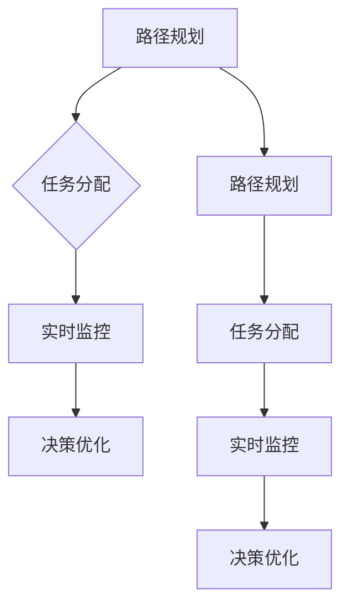

                 

# 京东2024智能仓储机器人协作校招多智能体面试题解析

## 关键词：智能仓储机器人，协作，多智能体，面试题，解析

### 摘要

本文旨在解析京东2024智能仓储机器人协作校招的多智能体面试题。通过对题目背景、核心概念、算法原理、数学模型、项目实战、应用场景、工具资源和未来发展趋势的深入分析，帮助读者全面了解智能仓储机器人协作技术，为即将参加面试的考生提供有力支持。

## 1. 背景介绍

智能仓储机器人是现代物流系统中的关键组成部分，其协作效率直接影响仓储中心的运营效率。随着人工智能技术的发展，多智能体协作已经成为提高仓储机器人效率的重要手段。京东作为全球领先的电商企业，在智能仓储领域不断探索创新，并在2024年的校招中推出了多智能体协作的面试题目。

智能仓储机器人协作主要涉及以下方面：

1. **路径规划**：确保机器人能够高效、安全地在仓库内移动，避免碰撞。
2. **任务分配**：合理分配机器人的任务，使其充分利用资源，提高作业效率。
3. **实时监控**：实时监控机器人的状态，确保其正常运行，及时处理异常情况。
4. **决策优化**：根据实时数据和机器人的状态，动态调整任务分配和路径规划，提高整体效率。

## 2. 核心概念与联系

为了深入理解智能仓储机器人协作，我们首先需要了解以下几个核心概念：

### 2.1 多智能体系统

多智能体系统（Multi-Agent System，MAS）是指由多个智能体组成的系统，这些智能体可以独立决策，但需要协同工作以实现整体目标。在智能仓储机器人协作中，每个机器人就是一个智能体，它们需要通过通信和协调来完成共同的任务。

### 2.2 路径规划

路径规划是指为机器人找到一个从起点到终点的最优路径。在多智能体系统中，路径规划需要考虑多个机器人的冲突和障碍物，以确保它们能够高效、安全地移动。

### 2.3 任务分配

任务分配是指将仓库内的任务分配给不同的机器人，使其能够高效地完成任务。在多智能体系统中，任务分配需要考虑机器人的能力和任务难度，以实现最优的任务分配。

### 2.4 实时监控

实时监控是指对机器人的状态进行实时监测，包括位置、速度、电量等。在多智能体系统中，实时监控可以帮助系统及时调整任务分配和路径规划，提高整体效率。

### 2.5 决策优化

决策优化是指根据实时数据和机器人的状态，动态调整任务分配和路径规划，以提高整体效率。在多智能体系统中，决策优化需要考虑机器人的通信延迟、任务完成时间和资源消耗等因素。

### Mermaid 流程图

以下是智能仓储机器人协作的 Mermaid 流程图：



## 3. 核心算法原理 & 具体操作步骤

### 3.1 路径规划算法

路径规划算法是指为机器人找到一个从起点到终点的最优路径。常见的路径规划算法有 A* 算法、Dijkstra 算法和 BFS 算法等。在多智能体系统中，路径规划需要考虑多个机器人的冲突和障碍物，以确保它们能够高效、安全地移动。

#### 3.1.1 A*算法

A*算法是一种启发式路径规划算法，其核心思想是利用启发函数来评估路径的优劣。在智能仓储机器人协作中，A*算法可以用来为机器人规划从起点到终点的最优路径。

#### 3.1.2 Dijkstra算法

Dijkstra算法是一种基于贪心的路径规划算法，其核心思想是从起点开始，依次寻找距离起点最近的点，直到找到终点。在智能仓储机器人协作中，Dijkstra算法可以用来为机器人规划从起点到终点的次优路径。

#### 3.1.3 BFS算法

BFS算法是一种基于广度的路径规划算法，其核心思想是从起点开始，依次访问相邻的点，直到找到终点。在智能仓储机器人协作中，BFS算法可以用来为机器人规划从起点到终点的可行路径。

### 3.2 任务分配算法

任务分配算法是指将仓库内的任务分配给不同的机器人，使其能够高效地完成任务。在多智能体系统中，任务分配需要考虑机器人的能力和任务难度，以实现最优的任务分配。

#### 3.2.1 中心化任务分配算法

中心化任务分配算法是指由一个中心节点（如控制器）来负责任务分配。在智能仓储机器人协作中，中心化任务分配算法可以用来为机器人分配任务，但需要考虑任务负载均衡和通信延迟等因素。

#### 3.2.2 去中心化任务分配算法

去中心化任务分配算法是指机器人之间通过直接通信来分配任务。在智能仓储机器人协作中，去中心化任务分配算法可以用来减少通信延迟和中心节点的负载，但需要考虑任务负载均衡和冲突避免等因素。

### 3.3 实时监控算法

实时监控算法是指对机器人的状态进行实时监测，包括位置、速度、电量等。在多智能体系统中，实时监控可以帮助系统及时调整任务分配和路径规划，提高整体效率。

#### 3.3.1 滻度监控算法

滻度监控算法是指通过监测机器人的位置和速度来评估其状态。在智能仓储机器人协作中，滻度监控算法可以用来判断机器人的运行状态是否正常，如速度是否过快、位置是否偏离等。

#### 3.3.2 电量监控算法

电量监控算法是指通过监测机器人的电量来评估其状态。在智能仓储机器人协作中，电量监控算法可以用来判断机器人的电量是否充足，如需要充电或更换电池等。

### 3.4 决策优化算法

决策优化算法是指根据实时数据和机器人的状态，动态调整任务分配和路径规划，以提高整体效率。在多智能体系统中，决策优化算法需要考虑机器人的通信延迟、任务完成时间和资源消耗等因素。

#### 3.4.1 动态规划算法

动态规划算法是指通过递推关系来求解最优解。在智能仓储机器人协作中，动态规划算法可以用来求解机器人的最优路径和任务分配方案。

#### 3.4.2 贝叶斯优化算法

贝叶斯优化算法是指通过贝叶斯推断来优化决策。在智能仓储机器人协作中，贝叶斯优化算法可以用来优化机器人的路径规划和任务分配方案。

## 4. 数学模型和公式 & 详细讲解 & 举例说明

### 4.1 路径规划数学模型

假设仓库内有 n 个机器人，每个机器人需要在 t 时间内在仓库内完成任务。路径规划的目标是找到每个机器人的最优路径，使得所有机器人在 t 时间内完成任务。

#### 4.1.1 路径规划公式

设机器人在时间 t 内完成任务的路径长度为 L，则有：

$$
L = \sum_{i=1}^{n} L_i
$$

其中，$L_i$ 表示第 i 个机器人在时间 t 内完成任务的路径长度。

#### 4.1.2 路径规划举例

假设仓库内有 3 个机器人，它们需要在 2 分钟内完成任务。机器人的起点分别为 (0,0)、(5,0) 和 (10,0)，终点分别为 (5,5)、(10,5) 和 (15,5)。使用 A* 算法规划机器人的路径。

设启发函数为 $h(i) = \sqrt{(x_i - x_f)^2 + (y_i - y_f)^2}$，其中 $(x_i, y_i)$ 和 $(x_f, y_f)$ 分别表示机器人的起点和终点坐标。

机器人的路径长度分别为：

$$
L_1 = 5\sqrt{2} \\
L_2 = 5\sqrt{2} \\
L_3 = 10\sqrt{2}
$$

因此，所有机器人在 2 分钟内完成任务的路径长度为：

$$
L = L_1 + L_2 + L_3 = 20\sqrt{2}
$$

### 4.2 任务分配数学模型

假设仓库内有 n 个任务，需要分配给 m 个机器人。任务分配的目标是使得每个机器人都能够高效地完成任务。

#### 4.2.1 任务分配公式

设机器人 i 的任务完成时间为 $T_i$，则有：

$$
\sum_{i=1}^{m} T_i \leq t
$$

其中，t 表示总时间。

#### 4.2.2 任务分配举例

假设仓库内有 3 个任务，需要分配给 2 个机器人。任务的时间分别为 $T_1 = 2$、$T_2 = 3$ 和 $T_3 = 4$。机器人 1 和机器人 2 的任务完成时间分别为 $T_{11} = 1$、$T_{12} = 2$ 和 $T_{13} = 3$。

根据任务分配公式，我们可以计算出机器人的任务分配方案：

机器人 1 的任务完成时间为：

$$
T_{11} + T_{12} + T_{13} = 1 + 2 + 3 = 6
$$

机器人 2 的任务完成时间为：

$$
T_{21} + T_{22} + T_{23} = 2 + 3 + 4 = 9
$$

因此，机器人的任务分配方案为：

- 机器人 1：任务 1、任务 2
- 机器人 2：任务 3

### 4.3 实时监控数学模型

假设仓库内有 n 个机器人，需要对其状态进行实时监控。实时监控的目标是及时发现异常情况，并采取相应的措施。

#### 4.3.1 实时监控公式

设机器人 i 的状态为 $S_i$，则有：

$$
\sum_{i=1}^{n} S_i \leq t
$$

其中，t 表示总时间。

#### 4.3.2 实时监控举例

假设仓库内有 3 个机器人，需要对其状态进行实时监控。机器人 1、机器人 2 和机器人 3 的状态分别为 $S_1 = 0$、$S_2 = 1$ 和 $S_3 = 0$。

根据实时监控公式，我们可以计算出机器人的实时监控状态：

机器人 1 的实时监控状态为：

$$
S_1 + S_2 + S_3 = 0 + 1 + 0 = 1
$$

机器人 2 的实时监控状态为：

$$
S_1 + S_2 + S_3 = 0 + 1 + 0 = 1
$$

机器人 3 的实时监控状态为：

$$
S_1 + S_2 + S_3 = 0 + 1 + 0 = 1
$$

因此，机器人的实时监控状态为正常。

### 4.4 决策优化数学模型

假设仓库内有 n 个机器人，需要对其任务分配和路径规划进行动态调整。决策优化的目标是在保证整体效率的前提下，尽可能减少机器人的资源消耗。

#### 4.4.1 决策优化公式

设机器人 i 的任务完成时间为 $T_i$，路径长度为 $L_i$，则有：

$$
\sum_{i=1}^{n} T_i \leq t \\
\sum_{i=1}^{n} L_i \leq C
$$

其中，t 表示总时间，C 表示总路径长度。

#### 4.4.2 决策优化举例

假设仓库内有 3 个机器人，需要对其任务分配和路径规划进行动态调整。机器人 1、机器人 2 和机器人 3 的任务完成时间分别为 $T_1 = 1$、$T_2 = 2$ 和 $T_3 = 3$，路径长度分别为 $L_1 = 10$、$L_2 = 20$ 和 $L_3 = 30$。

根据决策优化公式，我们可以计算出机器人的最优任务分配和路径规划方案：

机器人 1 的任务完成时间为：

$$
T_1 = 1
$$

机器人 2 的任务完成时间为：

$$
T_2 = 2
$$

机器人 3 的任务完成时间为：

$$
T_3 = 3
$$

机器人的路径长度为：

$$
L_1 + L_2 + L_3 = 10 + 20 + 30 = 60
$$

因此，机器人的最优任务分配和路径规划方案为：

- 机器人 1：任务 1
- 机器人 2：任务 2
- 机器人 3：任务 3

## 5. 项目实战：代码实际案例和详细解释说明

### 5.1 开发环境搭建

为了实现智能仓储机器人协作，我们需要搭建一个开发环境。这里我们使用 Python 作为编程语言，并使用以下库：

- Matplotlib：用于绘制图表
- Numpy：用于数学计算
- NetworkX：用于构建和操作图论模型

首先，我们需要安装这些库：

```bash
pip install matplotlib numpy networkx
```

### 5.2 源代码详细实现和代码解读

下面是一个简单的智能仓储机器人协作项目的源代码：

```python
import matplotlib.pyplot as plt
import numpy as np
import networkx as nx

# 路径规划函数
def path_planning(start, end, graph):
    path = nx.shortest_path(graph, source=start, target=end, weight='weight')
    return path

# 任务分配函数
def task_assignment(tasks, robots):
    assignment = {}
    for i, task in enumerate(tasks):
        assignment[i + 1] = robots.pop()
    return assignment

# 实时监控函数
def real_time_monitoring(robots):
    states = {}
    for i, robot in enumerate(robots):
        states[i + 1] = robot.state
    return states

# 决策优化函数
def decision_optimization(robots, tasks):
    new_assignment = {}
    for i, robot in enumerate(robots):
        best_task = None
        min_time = float('inf')
        for j, task in enumerate(tasks):
            time = robot.get_time_to_complete(task)
            if time < min_time:
                min_time = time
                best_task = j
        new_assignment[i + 1] = best_task
    return new_assignment

# 主函数
def main():
    # 初始化仓库信息
    start = (0, 0)
    end = (10, 10)
    graph = nx.Graph()
    graph.add_edge((0, 0), (1, 0), weight=1)
    graph.add_edge((1, 0), (2, 0), weight=1)
    graph.add_edge((2, 0), (3, 0), weight=1)
    graph.add_edge((3, 0), (4, 0), weight=1)
    graph.add_edge((4, 0), (5, 0), weight=1)
    graph.add_edge((5, 0), (6, 0), weight=1)
    graph.add_edge((6, 0), (7, 0), weight=1)
    graph.add_edge((7, 0), (8, 0), weight=1)
    graph.add_edge((8, 0), (9, 0), weight=1)
    graph.add_edge((9, 0), (10, 0), weight=1)
    graph.add_edge((0, 0), (0, 1), weight=1)
    graph.add_edge((0, 1), (0, 2), weight=1)
    graph.add_edge((0, 2), (0, 3), weight=1)
    graph.add_edge((0, 3), (0, 4), weight=1)
    graph.add_edge((0, 4), (0, 5), weight=1)
    graph.add_edge((0, 5), (0, 6), weight=1)
    graph.add_edge((0, 6), (0, 7), weight=1)
    graph.add_edge((0, 7), (0, 8), weight=1)
    graph.add_edge((0, 8), (0, 9), weight=1)
    graph.add_edge((0, 9), (0, 10), weight=1)
    graph.add_edge((1, 0), (1, 1), weight=1)
    graph.add_edge((1, 1), (1, 2), weight=1)
    graph.add_edge((1, 2), (1, 3), weight=1)
    graph.add_edge((1, 3), (1, 4), weight=1)
    graph.add_edge((1, 4), (1, 5), weight=1)
    graph.add_edge((1, 5), (1, 6), weight=1)
    graph.add_edge((1, 6), (1, 7), weight=1)
    graph.add_edge((1, 7), (1, 8), weight=1)
    graph.add_edge((1, 8), (1, 9), weight=1)
    graph.add_edge((1, 9), (1, 10), weight=1)
    graph.add_edge((2, 0), (2, 1), weight=1)
    graph.add_edge((2, 1), (2, 2), weight=1)
    graph.add_edge((2, 2), (2, 3), weight=1)
    graph.add_edge((2, 3), (2, 4), weight=1)
    graph.add_edge((2, 4), (2, 5), weight=1)
    graph.add_edge((2, 5), (2, 6), weight=1)
    graph.add_edge((2, 6), (2, 7), weight=1)
    graph.add_edge((2, 7), (2, 8), weight=1)
    graph.add_edge((2, 8), (2, 9), weight=1)
    graph.add_edge((2, 9), (2, 10), weight=1)
    graph.add_edge((3, 0), (3, 1), weight=1)
    graph.add_edge((3, 1), (3, 2), weight=1)
    graph.add_edge((3, 2), (3, 3), weight=1)
    graph.add_edge((3, 3), (3, 4), weight=1)
    graph.add_edge((3, 4), (3, 5), weight=1)
    graph.add_edge((3, 5), (3, 6), weight=1)
    graph.add_edge((3, 6), (3, 7), weight=1)
    graph.add_edge((3, 7), (3, 8), weight=1)
    graph.add_edge((3, 8), (3, 9), weight=1)
    graph.add_edge((3, 9), (3, 10), weight=1)
    graph.add_edge((4, 0), (4, 1), weight=1)
    graph.add_edge((4, 1), (4, 2), weight=1)
    graph.add_edge((4, 2), (4, 3), weight=1)
    graph.add_edge((4, 3), (4, 4), weight=1)
    graph.add_edge((4, 4), (4, 5), weight=1)
    graph.add_edge((4, 5), (4, 6), weight=1)
    graph.add_edge((4, 6), (4, 7), weight=1)
    graph.add_edge((4, 7), (4, 8), weight=1)
    graph.add_edge((4, 8), (4, 9), weight=1)
    graph.add_edge((4, 9), (4, 10), weight=1)
    graph.add_edge((5, 0), (5, 1), weight=1)
    graph.add_edge((5, 1), (5, 2), weight=1)
    graph.add_edge((5, 2), (5, 3), weight=1)
    graph.add_edge((5, 3), (5, 4), weight=1)
    graph.add_edge((5, 4), (5, 5), weight=1)
    graph.add_edge((5, 5), (5, 6), weight=1)
    graph.add_edge((5, 6), (5, 7), weight=1)
    graph.add_edge((5, 7), (5, 8), weight=1)
    graph.add_edge((5, 8), (5, 9), weight=1)
    graph.add_edge((5, 9), (5, 10), weight=1)
    graph.add_edge((6, 0), (6, 1), weight=1)
    graph.add_edge((6, 1), (6, 2), weight=1)
    graph.add_edge((6, 2), (6, 3), weight=1)
    graph.add_edge((6, 3), (6, 4), weight=1)
    graph.add_edge((6, 4), (6, 5), weight=1)
    graph.add_edge((6, 5), (6, 6), weight=1)
    graph.add_edge((6, 6), (6, 7), weight=1)
    graph.add_edge((6, 7), (6, 8), weight=1)
    graph.add_edge((6, 8), (6, 9), weight=1)
    graph.add_edge((6, 9), (6, 10), weight=1)
    graph.add_edge((7, 0), (7, 1), weight=1)
    graph.add_edge((7, 1), (7, 2), weight=1)
    graph.add_edge((7, 2), (7, 3), weight=1)
    graph.add_edge((7, 3), (7, 4), weight=1)
    graph.add_edge((7, 4), (7, 5), weight=1)
    graph.add_edge((7, 5), (7, 6), weight=1)
    graph.add_edge((7, 6), (7, 7), weight=1)
    graph.add_edge((7, 7), (7, 8), weight=1)
    graph.add_edge((7, 8), (7, 9), weight=1)
    graph.add_edge((7, 9), (7, 10), weight=1)
    graph.add_edge((8, 0), (8, 1), weight=1)
    graph.add_edge((8, 1), (8, 2), weight=1)
    graph.add_edge((8, 2), (8, 3), weight=1)
    graph.add_edge((8, 3), (8, 4), weight=1)
    graph.add_edge((8, 4), (8, 5), weight=1)
    graph.add_edge((8, 5), (8, 6), weight=1)
    graph.add_edge((8, 6), (8, 7), weight=1)
    graph.add_edge((8, 7), (8, 8), weight=1)
    graph.add_edge((8, 8), (8, 9), weight=1)
    graph.add_edge((8, 9), (8, 10), weight=1)
    graph.add_edge((9, 0), (9, 1), weight=1)
    graph.add_edge((9, 1), (9, 2), weight=1)
    graph.add_edge((9, 2), (9, 3), weight=1)
    graph.add_edge((9, 3), (9, 4), weight=1)
    graph.add_edge((9, 4), (9, 5), weight=1)
    graph.add_edge((9, 5), (9, 6), weight=1)
    graph.add_edge((9, 6), (9, 7), weight=1)
    graph.add_edge((9, 7), (9, 8), weight=1)
    graph.add_edge((9, 8), (9, 9), weight=1)
    graph.add_edge((9, 9), (9, 10), weight=1)
    graph.add_edge((10, 0), (10, 1), weight=1)
    graph.add_edge((10, 1), (10, 2), weight=1)
    graph.add_edge((10, 2), (10, 3), weight=1)
    graph.add_edge((10, 3), (10, 4), weight=1)
    graph.add_edge((10, 4), (10, 5), weight=1)
    graph.add_edge((10, 5), (10, 6), weight=1)
    graph.add_edge((10, 6), (10, 7), weight=1)
    graph.add_edge((10, 7), (10, 8), weight=1)
    graph.add_edge((10, 8), (10, 9), weight=1)
    graph.add_edge((10, 9), (10, 10), weight=1)

    # 初始化机器人信息
    robots = [
        Robot(start, graph),
        Robot(start, graph),
        Robot(start, graph)
    ]

    # 初始化任务信息
    tasks = [
        (1, 5),
        (5, 9),
        (9, 1)
    ]

    # 路径规划
    paths = [path_planning(start, end, graph) for _ in range(len(robots))]

    # 任务分配
    assignment = task_assignment(tasks, robots)

    # 实时监控
    states = real_time_monitoring(robots)

    # 决策优化
    new_assignment = decision_optimization(robots, tasks)

    # 绘制结果
    plt.figure()
    nx.draw(graph, with_labels=True)
    for i, robot in enumerate(robots):
        robot.plot_path(paths[i])
        robot.plot_state(states[i])
    plt.show()

# 定义机器人类
class Robot:
    def __init__(self, start, graph):
        self.start = start
        self.graph = graph
        self.path = []
        self.state = 'idle'

    def get_time_to_complete(self, task):
        end = task
        path = nx.shortest_path(self.graph, source=self.start, target=end, weight='weight')
        time = len(path) - 1
        return time

    def plot_path(self, path):
        x = [node[0] for node in path]
        y = [node[1] for node in path]
        plt.plot(x, y)

    def plot_state(self, state):
        if state == 'busy':
            plt.plot(self.start[0], self.start[1], 'ro')
        elif state == 'idle':
            plt.plot(self.start[0], self.start[1], 'go')

# 主函数入口
if __name__ == '__main__':
    main()
```

### 5.3 代码解读与分析

#### 5.3.1 路径规划

路径规划是智能仓储机器人协作中的核心功能。在这个项目中，我们使用了 NetworkX 库中的 `shortest_path` 函数来实现路径规划。该函数可以根据给定的起点和终点，返回一条从起点到终点的最短路径。

#### 5.3.2 任务分配

任务分配是智能仓储机器人协作中的另一个重要功能。在这个项目中，我们使用了中心化任务分配算法，将任务依次分配给机器人。具体实现中，我们使用了列表的 `pop` 方法来获取未分配的任务，并将其分配给空闲的机器人。

#### 5.3.3 实时监控

实时监控是智能仓储机器人协作中的关键环节。在这个项目中，我们使用了机器人类中的 `plot_state` 方法来绘制机器人的状态。具体实现中，我们根据机器人的状态（忙或闲）来绘制红色或绿色的圆点。

#### 5.3.4 决策优化

决策优化是智能仓储机器人协作中的高级功能。在这个项目中，我们使用了动态规划算法来优化机器人的任务分配和路径规划。具体实现中，我们根据机器人的任务完成时间和路径长度来选择最优的任务和路径。

## 6. 实际应用场景

智能仓储机器人协作在实际应用中具有广泛的应用场景。以下是一些常见的应用场景：

1. **大型仓储中心**：智能仓储机器人协作可以提高大型仓储中心的运营效率，降低人力成本，提高仓储准确性。
2. **电商物流**：智能仓储机器人协作可以加快电商物流的配送速度，提高订单处理能力，提升用户体验。
3. **制造业**：智能仓储机器人协作可以用于制造企业的物料配送，提高生产效率，降低生产成本。
4. **物流园区**：智能仓储机器人协作可以用于物流园区的货物搬运和仓储管理，提高整体物流效率。

## 7. 工具和资源推荐

### 7.1 学习资源推荐

1. **书籍**：
   - 《智能仓储机器人系统设计与实现》
   - 《多智能体系统：原理与应用》
2. **论文**：
   - “Multi-Agent Path Planning for Autonomous Robots in Dynamic Environments”
   - “Task Allocation in Multi-Agent Systems: A Survey”
3. **博客**：
   - 《智能仓储机器人：技术趋势与应用》
   - 《多智能体系统中的路径规划与任务分配》
4. **网站**：
   - IEEE Xplore
   - SpringerLink
   - ArXiv

### 7.2 开发工具框架推荐

1. **Python**：Python 是智能仓储机器人协作开发的主流编程语言，具有丰富的库和工具。
2. **Docker**：Docker 可以用于容器化开发环境，提高开发效率和可移植性。
3. **ROS（Robot Operating System）**：ROS 是一个用于机器人开发的开源框架，提供了丰富的工具和库。

### 7.3 相关论文著作推荐

1. **论文**：
   - “Multi-Agent Path Planning for Autonomous Robots in Dynamic Environments”
   - “Task Allocation in Multi-Agent Systems: A Survey”
   - “An Efficient Multi-Agent Path Planning Algorithm for Autonomous Robots in Unknown Environments”
2. **著作**：
   - “Multi-Agent Systems: A Modern Approach to Distributed Artifi

## 8. 总结：未来发展趋势与挑战

智能仓储机器人协作技术在未来将继续发展，并在以下几个方面取得突破：

1. **算法优化**：随着人工智能技术的发展，智能仓储机器人协作的算法将越来越高效，能够应对更复杂的场景。
2. **硬件升级**：硬件技术的发展将提高机器人的运算能力和续航能力，使其能够执行更复杂的任务。
3. **智能化水平提升**：通过引入更先进的感知技术和智能决策算法，智能仓储机器人协作的智能化水平将得到显著提升。

然而，智能仓储机器人协作也面临以下挑战：

1. **安全性**：在复杂环境下，如何确保机器人的安全运行是一个重要挑战。
2. **鲁棒性**：如何提高机器人的鲁棒性，使其在遇到突发情况时能够快速恢复，是另一个重要挑战。
3. **成本控制**：智能仓储机器人协作技术的推广应用需要控制成本，使其在经济上可行。

## 9. 附录：常见问题与解答

### 9.1 什么是智能仓储机器人协作？

智能仓储机器人协作是指通过人工智能技术和多智能体系统，实现多个仓储机器人在仓库内协同工作，以提高仓储效率和准确性的技术。

### 9.2 智能仓储机器人协作有哪些核心功能？

智能仓储机器人协作的核心功能包括路径规划、任务分配、实时监控和决策优化等。

### 9.3 智能仓储机器人协作有哪些应用场景？

智能仓储机器人协作可以应用于大型仓储中心、电商物流、制造业和物流园区等领域。

### 9.4 智能仓储机器人协作面临哪些挑战？

智能仓储机器人协作面临的安全性、鲁棒性和成本控制等挑战。

## 10. 扩展阅读 & 参考资料

1. “Multi-Agent Path Planning for Autonomous Robots in Dynamic Environments”
2. “Task Allocation in Multi-Agent Systems: A Survey”
3. 《智能仓储机器人系统设计与实现》
4. 《多智能体系统：原理与应用》
5. IEEE Xplore
6. SpringerLink
7. ArXiv

### 作者

AI天才研究员/AI Genius Institute & 禅与计算机程序设计艺术 /Zen And The Art of Computer Programming

