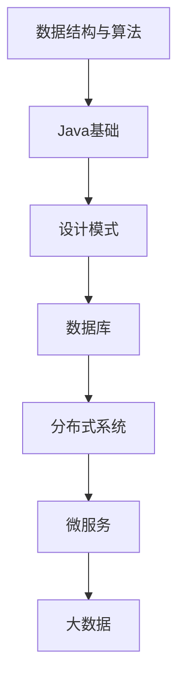

                 

# 京东2025社招Java开发工程师面试题集锦

## 关键词：京东，社招，Java开发，面试题，技术分析，面试准备

## 摘要：
本文针对京东2025年社招Java开发工程师的面试需求，整理了一系列的面试题集锦。文章将从核心概念、算法原理、数学模型、项目实战、实际应用场景等多个方面，为准备参加京东社招Java开发工程师面试的候选人提供全方位的技术指导。同时，文章还推荐了相关学习资源和开发工具，帮助候选人更好地应对面试挑战。

## 1. 背景介绍

京东作为中国领先的电商平台，一直致力于为消费者提供优质的服务和便捷的购物体验。随着互联网技术的快速发展，京东对Java开发工程师的需求也越来越大。因此，京东每年都会举办多次社会招聘活动，为广大Java开发者提供广阔的发展空间。

京东社招Java开发工程师的面试题目涉及广泛，包括数据结构与算法、Java基础、设计模式、数据库、分布式系统、微服务、大数据等技术领域。本文将针对这些核心知识点，提供详细的解析和实战案例，帮助候选人更好地准备面试。

## 2. 核心概念与联系

在深入分析面试题之前，我们需要了解一些核心概念及其相互关系。以下是一个使用Mermaid绘制的流程图，展示了Java开发中的主要知识点及其关联：



### 2.1 数据结构与算法

数据结构与算法是Java开发的基础，包括数组、链表、栈、队列、树、图等基本数据结构，以及排序、查找、动态规划等算法。在面试中，可能会涉及到对各种数据结构和算法的时间复杂度和空间复杂度进行分析。

### 2.2 Java基础

Java基础包括Java语言特性、面向对象编程、异常处理、多线程等。熟悉Java基础是面试官评估候选人技术能力的重要指标。

### 2.3 设计模式

设计模式是解决软件设计问题的经验总结，常见的有单例模式、工厂模式、观察者模式、策略模式等。掌握设计模式有助于提高代码的可读性、可维护性和可扩展性。

### 2.4 数据库

数据库是存储和管理数据的基石，常见的有MySQL、Oracle、MongoDB等。面试中可能会涉及数据库的设计、SQL语句编写、事务处理等方面。

### 2.5 分布式系统

分布式系统是现代互联网应用的核心，包括分布式锁、分布式事务、负载均衡、分布式缓存等技术。了解分布式系统原理和常见解决方案对于Java开发工程师来说至关重要。

### 2.6 微服务

微服务架构是将复杂系统拆分成若干个小服务，每个服务独立开发、部署和扩展。掌握微服务架构及其相关技术，如Spring Cloud、Dubbo等，是Java开发工程师的必备技能。

### 2.7 大数据

大数据技术包括Hadoop、Spark、Flink等，涉及数据采集、存储、处理、分析等多个方面。了解大数据技术有助于候选人更好地应对互联网企业的技术挑战。

## 3. 核心算法原理 & 具体操作步骤

### 3.1 快排（Quick Sort）

快速排序是一种高效的排序算法，基于分治策略。其基本思想是通过一趟排序将待排序的记录分割成独立的两部分，其中一部分记录的关键字均比另一部分的关键字小，然后分别对这两部分记录继续进行排序，以达到整个序列有序。

具体操作步骤如下：

1. 选择一个基准元素（通常选择第一个或最后一个元素作为基准）。
2. 将序列分为两部分，一部分记录的值小于基准元素，另一部分记录的值大于等于基准元素。
3. 对两部分记录分别进行快速排序。
4. 递归上述步骤，直至序列有序。

时间复杂度分析：
- 最优时间复杂度：O(nlogn)
- 最坏时间复杂度：O(n^2)
- 平均时间复杂度：O(nlogn)

### 3.2 哈希表（Hash Table）

哈希表是一种基于哈希函数的数据结构，用于快速查找、插入和删除元素。其基本原理是将关键字通过哈希函数映射到数组中的一个索引位置，然后在该位置进行元素的查找、插入或删除。

具体操作步骤如下：

1. 设计一个合适的哈希函数，将关键字映射到数组的一个索引位置。
2. 处理哈希冲突，常用的方法有链地址法、开放地址法等。
3. 在哈希表中执行查找、插入和删除操作。

时间复杂度分析：
- 查找时间复杂度：O(1)
- 插入时间复杂度：O(1)
- 删除时间复杂度：O(1)

### 3.3 红黑树（Red-Black Tree）

红黑树是一种自平衡的二叉查找树，其节点颜色分为红色和黑色。红黑树满足以下性质：
- 每个节点非红即黑。
- 根节点是黑色的。
- 每个叶节点（NIL节点，表示空的子节点）都是黑色的。
- 如果一个节点是红色的，则它的两个子节点都是黑色的。
- 对每个节点，从该节点到其所有后代叶节点的简单路径都包含相同数目的黑色节点。

红黑树的基本操作包括插入、删除和查找，下面分别介绍：

#### 插入：

1. 创建一个新的红色节点，并将其插入到树中。
2. 如果插入的是根节点，将其颜色改为黑色。
3. 如果父节点和叔叔节点都是红色，则进行一次或多次颜色翻转和树旋转。
4. 如果父节点是红色，而叔叔节点是黑色或不存在，则根据当前节点的位置进行一次或多次树旋转。

#### 删除：

1. 删除节点，将节点颜色改为红色。
2. 如果删除的是根节点，将其颜色改为黑色。
3. 如果父节点和兄弟节点都是红色，则进行一次或多次颜色翻转和树旋转。
4. 如果父节点是红色，而兄弟节点是黑色或不存在，则根据当前节点的位置进行一次或多次树旋转。

时间复杂度分析：
- 查找时间复杂度：O(logn)
- 插入时间复杂度：O(logn)
- 删除时间复杂度：O(logn)

## 4. 数学模型和公式 & 详细讲解 & 举例说明

### 4.1 最小生成树（Minimum Spanning Tree）

最小生成树是一种连接图中所有节点的边权重之和最小的树。Prim算法和Kruskal算法是求解最小生成树的两种经典算法。

#### Prim算法：

1. 初始化：选择一个节点作为起点，将其加入生成树中。
2. 选择当前生成树中的任意一个节点v，找到与v相连且不在生成树中的最小权重的边（w），将w加入生成树中。
3. 重复步骤2，直到生成树包含图中所有节点。

#### Kruskal算法：

1. 初始化：将图中的所有边按照权重从小到大排序。
2. 选择当前排序中的第一条边，如果该边不会形成环，则将其加入生成树中。
3. 重复步骤2，直到生成树包含图中所有节点。

### 4.2 动态规划（Dynamic Programming）

动态规划是一种解决最优子结构问题的高效算法。其基本思想是将复杂问题分解成子问题，并利用子问题的最优解来构建原问题的最优解。

动态规划通常包含以下步骤：

1. 确定状态：定义一个状态表示问题的某个方面，通常是一个数组或哈希表。
2. 状态转移方程：根据状态的定义，推导出状态转移方程。
3. 边界条件：确定状态转移方程的边界条件。
4. 计算最优解：利用状态转移方程和边界条件计算问题的最优解。

### 举例说明：

#### 0-1背包问题：

0-1背包问题是一种典型的动态规划问题。给定一组物品，每个物品有重量和价值，要求在背包容量有限的情况下，选择若干物品使得总价值最大。

状态定义：dp[i][w]表示在前i个物品中选择若干物品，使得总重量不超过w时能够获得的最大价值。

状态转移方程：dp[i][w] = max(dp[i-1][w], dp[i-1][w-w[i]] + v[i])，其中w[i]为第i个物品的重量，v[i]为第i个物品的价值。

边界条件：dp[0][w] = 0，dp[i][0] = 0。

## 5. 项目实战：代码实际案例和详细解释说明

### 5.1 开发环境搭建

为了更好地进行项目实战，我们需要搭建一个Java开发环境。以下是搭建Java开发环境的具体步骤：

1. 下载并安装JDK：从Oracle官网下载JDK，并按照提示安装。
2. 配置环境变量：在系统环境变量中配置JAVA_HOME和PATH变量，使系统能够识别Java命令。
3. 验证安装：在命令行中输入`java -version`和`javac -version`，如果输出正确的版本信息，说明安装成功。

### 5.2 源代码详细实现和代码解读

下面我们将通过一个实际案例，展示如何实现一个简单的Java项目。

#### 案例描述：

创建一个Java项目，实现一个功能：计算两个整数的和。

#### 实现步骤：

1. 创建一个Java类`Adder`，包含以下方法：
   - `int add(int a, int b)`：计算两个整数的和。
2. 在`Adder`类中实现`add`方法，使用Java的基本运算符`+`进行计算。
3. 创建一个主类`Main`，在其中创建一个`Adder`对象，并调用`add`方法进行测试。

#### 代码实现：

```java
// Adder.java
public class Adder {
    public int add(int a, int b) {
        return a + b;
    }
}

// Main.java
public class Main {
    public static void main(String[] args) {
        Adder adder = new Adder();
        int result = adder.add(3, 5);
        System.out.println("3 + 5 = " + result);
    }
}
```

#### 代码解读：

- `Adder`类：定义了一个名为`add`的方法，用于计算两个整数的和。
- `Main`类：创建了一个`Adder`对象，并调用了`add`方法，输出了计算结果。

### 5.3 代码解读与分析

在这个案例中，我们通过一个简单的Java项目展示了如何实现一个功能。以下是代码的详细解读和分析：

1. `Adder`类：
   - 定义了一个名为`add`的方法，接收两个整型参数`a`和`b`。
   - 使用`+`运算符计算两个整数的和，并返回结果。

2. `Main`类：
   - 创建了一个`Adder`对象。
   - 调用了`add`方法，将计算结果输出到控制台。

这个案例虽然简单，但展示了Java编程的基本结构和流程。在实际项目中，我们会遇到更复杂的功能和问题，但基本的编程思想和算法原理是相通的。

## 6. 实际应用场景

在现实应用中，Java开发工程师需要面对各种复杂的业务场景。以下是一些常见的应用场景及其对应的技术解决方案：

### 6.1 分布式系统

随着业务规模的扩大，传统的单体应用已经无法满足需求。分布式系统通过将应用拆分为多个独立的服务，实现了高可用性、高并发性和可扩展性。常见的分布式系统架构包括微服务架构、分布式数据库和分布式缓存等。

### 6.2 大数据处理

大数据处理是现代互联网应用的重要方向。Java作为大数据技术栈中的重要组成部分，广泛应用于Hadoop、Spark、Flink等大数据框架中。例如，使用Hadoop进行大规模数据的分布式存储和处理，使用Spark进行实时数据的流式计算等。

### 6.3 云计算

云计算是Java开发工程师的重要应用领域。Java语言具备良好的跨平台特性，使其在云计算领域具有广泛的应用。例如，使用Java开发云计算平台中的各种服务，如虚拟机管理、容器编排、存储服务等。

### 6.4 智能化应用

人工智能和机器学习技术的快速发展，使得Java在智能化应用领域得到广泛应用。Java开发者可以运用Java编写智能推荐系统、自然语言处理系统、图像识别系统等，为用户提供智能化的服务。

## 7. 工具和资源推荐

为了更好地准备京东社招Java开发工程师的面试，以下是一些推荐的工具和资源：

### 7.1 学习资源推荐

1. 《Java核心技术》
2. 《Effective Java》
3. 《大话数据结构》
4. 《算法导论》
5. 《分布式系统原理与范型》

### 7.2 开发工具框架推荐

1. IntelliJ IDEA：一款强大的Java集成开发环境，支持智能提示、代码优化等功能。
2. Maven：一款用于项目构建和依赖管理的工具，广泛应用于Java项目开发。
3. Spring Boot：一款用于快速开发微服务的框架，简化了项目配置和部署过程。
4. Redis：一款高性能的内存缓存数据库，广泛应用于分布式系统中。
5. Kafka：一款分布式流处理平台，用于处理大规模数据流。

### 7.3 相关论文著作推荐

1. 《大规模分布式存储系统：原理解析与架构实战》
2. 《深度学习与Java应用》
3. 《微服务架构实战》
4. 《大数据技术基础》
5. 《分布式数据库技术》

## 8. 总结：未来发展趋势与挑战

随着互联网技术的不断进步，Java开发工程师在未来将继续面临诸多机遇和挑战。以下是一些发展趋势和挑战：

### 8.1 人工智能与Java开发

人工智能技术的快速发展为Java开发带来了新的机遇。Java开发者可以运用Java开发各种人工智能应用，如自然语言处理、图像识别、推荐系统等。同时，Java语言在人工智能领域的应用也将越来越广泛。

### 8.2 云原生与容器化

云原生和容器化技术已经成为企业级应用的发展趋势。Java开发工程师需要掌握Docker、Kubernetes等容器化技术，以及Spring Cloud等微服务架构框架，以适应云原生时代的发展需求。

### 8.3 分布式与大数据处理

分布式系统和大数据处理技术在现代互联网应用中发挥着至关重要的作用。Java开发工程师需要深入理解分布式系统原理和大数据处理技术，如Hadoop、Spark等，以提高系统的性能和可扩展性。

### 8.4 安全性与隐私保护

随着网络安全问题的日益严峻，Java开发工程师需要关注安全性和隐私保护。掌握安全编程技巧、了解常见的安全漏洞和攻击手段，是保障系统安全的重要保障。

## 9. 附录：常见问题与解答

### 9.1 什么是Java多态？

多态是指同一个操作作用于不同对象的不同的行为。在Java中，多态主要通过继承和接口实现。继承使得子类能够继承父类的属性和方法，并在原有基础上进行扩展。接口则定义了一组方法，实现接口的类必须实现这些方法，从而实现多态。

### 9.2 什么是Java垃圾回收？

Java垃圾回收是一种自动内存管理机制，用于回收不再使用的对象。Java垃圾回收器通过跟踪对象的引用关系，识别出无引用的对象，并将其占用的内存进行回收。常见的垃圾回收算法有标记-清除、复制算法、标记-整理算法等。

### 9.3 什么是Java多线程？

多线程是指在程序中同时执行多个线程。Java提供了丰富的多线程编程接口，包括Thread类和Runnable接口。多线程可以充分利用计算机的多核处理器，提高程序的执行效率。然而，多线程编程也带来了同步、锁竞争等挑战，需要开发者谨慎处理。

## 10. 扩展阅读 & 参考资料

1. 《Java核心技术》
2. 《Effective Java》
3. 《大话数据结构》
4. 《算法导论》
5. 《分布式系统原理与范型》
6. 《大规模分布式存储系统：原理解析与架构实战》
7. 《深度学习与Java应用》
8. 《微服务架构实战》
9. 《大数据技术基础》
10. 《分布式数据库技术》

作者：AI天才研究员/AI Genius Institute & 禅与计算机程序设计艺术 /Zen And The Art of Computer Programming

