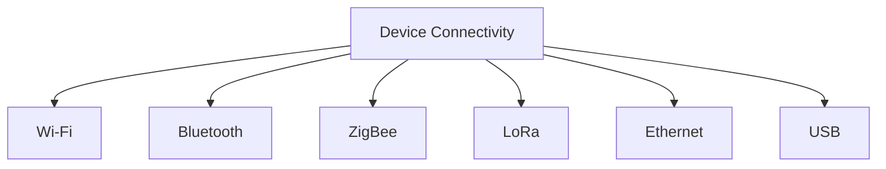
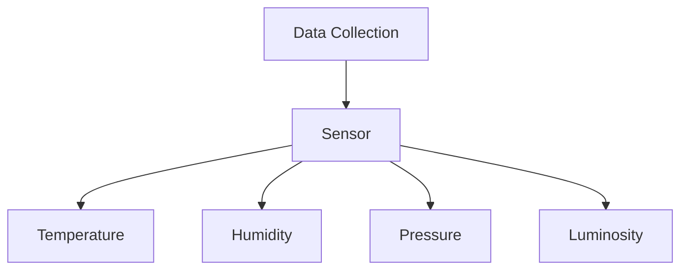
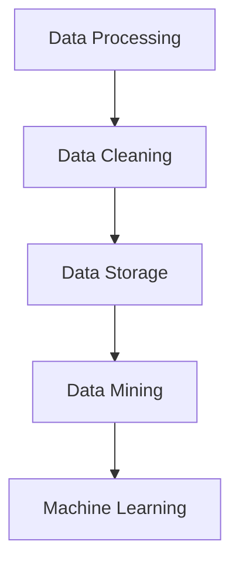
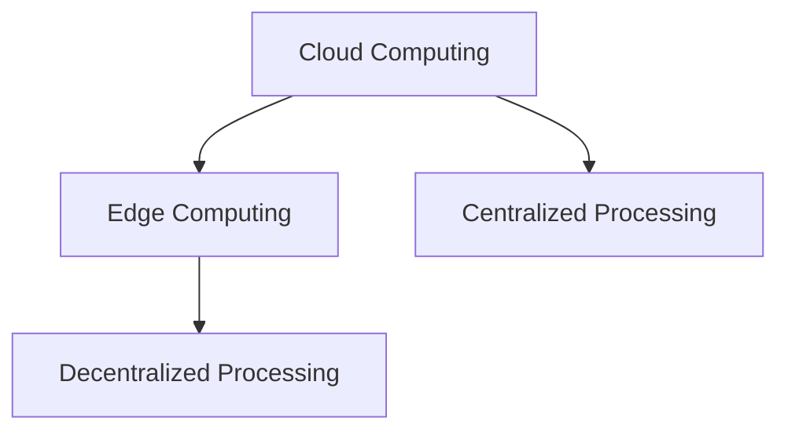
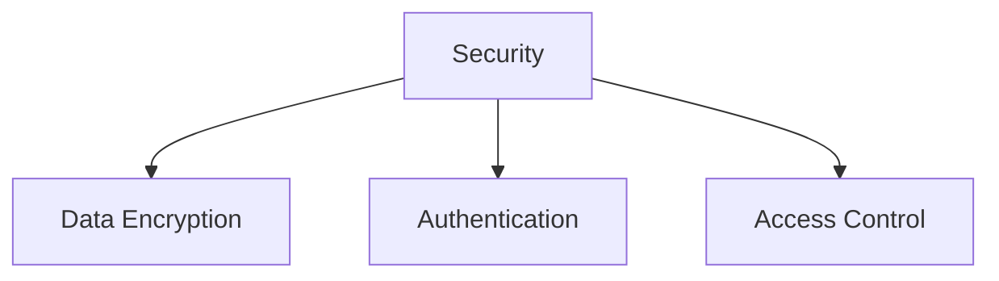

                 

### 背景介绍

#### 物联网技术的快速发展

近年来，随着互联网、大数据、云计算等技术的飞速发展，物联网（Internet of Things，简称IoT）技术也迎来了前所未有的机遇。物联网技术通过将各种设备连接到互联网，实现设备间的信息交换和协同工作，为各行各业提供了全新的解决方案。根据国际数据公司（IDC）的预测，到2025年，全球物联网设备的数量将达到270亿台，市场规模将达到1.6万亿美元。这无疑为物联网领域的发展注入了强劲的动力。

#### 京东在物联网领域的布局

作为我国领先的电子商务平台，京东在物联网领域也有着深刻的布局。早在2015年，京东就提出了“京东智能+”战略，旨在通过物联网技术提升物流效率、改善用户体验。京东的物联网技术主要应用于智能物流、智能零售、智能家居等领域。例如，京东智能物流通过无人仓、无人车、无人机等技术创新，实现了物流运输的高效化、自动化和智能化。在智能家居方面，京东推出了智能音箱、智能灯泡、智能摄像头等多款产品，为用户提供了便捷的智能家居体验。

#### 物联网校招面试的重要性

随着物联网技术的普及和发展，越来越多的企业开始关注物联网领域的人才。对于求职者来说，通过物联网校招面试，不仅能够了解企业的招聘需求和技术方向，还能展示自己的技术实力和创新能力。因此，准备物联网校招面试成为许多物联网专业毕业生的重要任务。

#### 本文的目的

本文旨在为广大物联网校招面试者提供一份全面的面试真题汇总及其解答。通过对历年京东物联网校招面试真题的汇总和分析，帮助大家更好地准备面试，提升自己的面试技巧。文章将从核心概念与联系、核心算法原理、数学模型和公式、项目实战、实际应用场景、工具和资源推荐等方面进行详细讲解，希望对大家有所帮助。

---

## Background Introduction

### The Rapid Development of IoT Technology

In recent years, with the rapid advancement of technologies such as the Internet, big data, and cloud computing, the Internet of Things (IoT) technology has experienced unprecedented growth. IoT technology connects various devices to the internet, enabling information exchange and collaborative work among devices, providing new solutions for various industries. According to IDC's prediction, by 2025, the number of IoT devices worldwide will reach 27 billion, with a market size of $1.6 trillion. This has injected strong momentum into the development of IoT technology.

### JD.com's Deployment in the IoT Field

As a leading e-commerce platform in China, JD.com has made profound deployments in the IoT field. As early as 2015, JD.com proposed the "JD Smart+" strategy, aiming to improve logistics efficiency and enhance user experience through IoT technology. JD's IoT technology is mainly applied in the fields of intelligent logistics, intelligent retail, and smart homes. For example, JD's intelligent logistics achieves efficient, automated, and intelligent logistics transportation through technological innovations such as unmanned warehouses, unmanned vehicles, and unmanned aerial vehicles. In the field of smart homes, JD has launched various products such as smart speakers, smart light bulbs, and smart cameras, providing users with convenient smart home experiences.

### The Importance of IoT Recruitment Interviews

With the popularization and development of IoT technology, more and more companies are paying attention to IoT talents. For job seekers, passing IoT recruitment interviews not only helps them understand the company's recruitment needs and technical directions but also showcases their technical strength and innovative capabilities. Therefore, preparing for IoT recruitment interviews has become an important task for many IoT professionals.

### The Purpose of This Article

This article aims to provide a comprehensive collection of IoT recruitment interview questions from JD.com and their solutions for all IoT recruitment interviewees. By summarizing and analyzing the IoT recruitment interview questions from previous years, this article aims to help everyone better prepare for interviews and improve their interview skills. The article will provide detailed explanations on core concepts and connections, core algorithm principles, mathematical models and formulas, project practice, practical application scenarios, tools and resources, and more, hoping to be helpful for readers. <|im_sep|>## 核心概念与联系

在撰写关于京东物联网校招面试真题的文章之前，我们需要首先了解物联网技术的一些核心概念与联系。这些概念构成了物联网技术的基石，是解决各种实际问题的基础。下面我们将介绍几个关键的核心概念，并使用Mermaid流程图来展示它们之间的关系。

#### 1. 设备连接（Device Connectivity）

设备连接是物联网技术的核心概念之一，它指的是将各种物理设备通过互联网或其他通信网络连接起来，使它们能够进行数据交换和协同工作。设备连接的实现方式包括Wi-Fi、蓝牙、ZigBee、LoRa等无线通信技术，以及有线连接技术如以太网和USB。



#### 2. 数据收集（Data Collection）

物联网技术的一个重要应用是数据收集，这涉及到传感器和数据的采集。传感器可以测量各种物理量，如温度、湿度、压力、光照等，并将这些数据转换为数字信号，通过物联网技术传输到服务器进行进一步处理。



#### 3. 数据处理（Data Processing）

收集到的数据需要通过数据处理技术进行分析和转换，以便提取有用信息。数据处理包括数据清洗、数据存储、数据挖掘和机器学习等技术。通过这些技术，可以从大量数据中提取出有价值的信息，用于决策和优化。



#### 4. 云计算与边缘计算（Cloud Computing and Edge Computing）

云计算和边缘计算是物联网技术中的两个重要概念。云计算提供了强大的数据处理和存储能力，而边缘计算则将计算能力延伸到网络边缘，使设备能够在本地进行实时数据处理，从而降低延迟和带宽消耗。



#### 5. 安全性（Security）

随着物联网设备的增加，安全性成为物联网技术中不可忽视的问题。物联网设备面临着数据泄露、设备被攻击等安全风险。因此，安全性涉及数据加密、身份验证、访问控制等技术。



通过以上核心概念的介绍和Mermaid流程图的展示，我们可以更好地理解物联网技术的全貌，为后续的面试真题解答打下基础。

---

## Core Concepts and Connections

Before delving into the article on JD.com's IoT recruitment interview questions, it's essential to understand some core concepts and their relationships in IoT technology. These concepts form the foundation of IoT technology and are the basis for solving various practical problems. Below, we will introduce several key core concepts and use a Mermaid flowchart to illustrate their relationships.

#### 1. Device Connectivity

Device connectivity is one of the core concepts in IoT technology. It refers to the process of connecting various physical devices to the internet or other communication networks to enable them to exchange data and work collaboratively. The implementation of device connectivity includes wireless communication technologies such as Wi-Fi, Bluetooth, ZigBee, LoRa, as well as wired technologies like Ethernet and USB.


#### 2. Data Collection

An important application of IoT technology is data collection, which involves the use of sensors to measure various physical quantities like temperature, humidity, pressure, and luminosity, and convert these measurements into digital signals for transmission to servers for further processing.


#### 3. Data Processing

The collected data needs to be processed and analyzed using data processing techniques to extract valuable information for decision-making and optimization. Data processing includes data cleaning, data storage, data mining, and machine learning technologies.


#### 4. Cloud Computing and Edge Computing

Cloud computing and edge computing are two important concepts in IoT technology. Cloud computing provides powerful data processing and storage capabilities, while edge computing extends computing power to the network edge, enabling real-time data processing at the local level to reduce latency and bandwidth consumption.


#### 5. Security

With the increasing number of IoT devices, security becomes an indispensable aspect of IoT technology. IoT devices are vulnerable to risks such as data breaches and device attacks. Therefore, security involves technologies like data encryption, authentication, and access control.


Through the introduction of these core concepts and the Mermaid flowchart, we can better understand the overall picture of IoT technology, laying the foundation for the subsequent interview question solutions. <|im_sep|>## 核心算法原理 & 具体操作步骤

在物联网领域，核心算法的设计和实现至关重要。它们不仅决定了系统的性能和效率，还直接影响了用户体验。在这一章节中，我们将介绍几种常见的物联网核心算法，并详细描述它们的操作步骤。

### 1. 数据传输优化算法

#### 原理：

数据传输优化算法旨在提高物联网设备之间的数据传输效率。考虑到物联网设备的计算资源有限，数据传输优化算法通过以下方法实现：

- **数据压缩**：使用数据压缩算法减少传输的数据量，如Huffman编码、LZ77压缩算法。
- **数据传输协议**：选择合适的传输协议，如MQTT（消息队列遥测传输协议），以提高数据传输的可靠性和效率。
- **网络质量监测**：实时监测网络质量，根据网络状况调整传输策略。

#### 具体操作步骤：

1. **数据压缩**：
   - 收集原始数据。
   - 使用Huffman编码或其他压缩算法对数据进行压缩。
   - 压缩后的数据传输到服务器。

2. **数据传输协议**：
   - 设备与服务器建立MQTT连接。
   - 设备将压缩后的数据通过MQTT协议发送到服务器。

3. **网络质量监测**：
   - 设备定期发送心跳包，服务器检测心跳包的响应时间。
   - 根据网络质量调整数据传输速率和频率。

### 2. 节能算法

#### 原理：

节能算法主要用于降低物联网设备的功耗，延长设备的使用寿命。节能算法通过以下方法实现：

- **工作模式调整**：根据设备的使用情况调整工作模式，如进入休眠状态。
- **任务调度**：合理调度任务，避免同时执行大量高能耗任务。
- **无线通信优化**：优化无线通信，减少信号干扰和功耗。

#### 具体操作步骤：

1. **工作模式调整**：
   - 设备监测使用情况。
   - 当设备长时间不活跃时，进入休眠状态。
   - 设备重新启动时，从休眠状态恢复正常工作。

2. **任务调度**：
   - 设备根据任务优先级和资源使用情况，合理安排任务执行顺序。
   - 避免同时执行大量高能耗任务。

3. **无线通信优化**：
   - 设备根据信号强度调整通信功率。
   - 使用频分复用（FDMA）或码分复用（CDMA）等技术，减少信号干扰。

### 3. 智能预测算法

#### 原理：

智能预测算法通过分析历史数据，预测未来事件或行为，从而优化物联网设备的决策。智能预测算法通常基于机器学习和数据挖掘技术。

- **时间序列分析**：分析时间序列数据，预测未来的趋势。
- **关联规则挖掘**：发现数据之间的关联关系，预测未来的事件。

#### 具体操作步骤：

1. **数据预处理**：
   - 收集历史数据。
   - 清洗数据，去除异常值和噪声。

2. **时间序列分析**：
   - 使用移动平均、指数平滑等方法对时间序列数据进行处理。
   - 根据处理结果预测未来的趋势。

3. **关联规则挖掘**：
   - 使用Apriori算法或FP-growth算法挖掘数据中的关联规则。
   - 根据挖掘结果预测未来的行为。

通过以上核心算法的介绍，我们可以更好地理解物联网技术的实现原理和操作步骤，为解决实际问题和提升系统性能提供了有力的工具。在接下来的章节中，我们将进一步探讨数学模型和公式的应用，以及如何在项目中实际应用这些算法。

---

### Core Algorithm Principles & Specific Operation Steps

In the field of IoT, the design and implementation of core algorithms are crucial. They not only determine the performance and efficiency of the system but also directly affect the user experience. In this section, we will introduce several common IoT core algorithms and describe their specific operation steps in detail.

#### 1. Data Transmission Optimization Algorithm

#### Principle:

The data transmission optimization algorithm aims to improve the efficiency of data transmission between IoT devices. Considering the limited computational resources of IoT devices, the data transmission optimization algorithm achieves this through the following methods:

- **Data Compression**: Use data compression algorithms to reduce the amount of data transmitted, such as Huffman coding or the LZ77 compression algorithm.
- **Data Transmission Protocols**: Choose appropriate transmission protocols, such as MQTT (Message Queue Telemetry Transport), to improve the reliability and efficiency of data transmission.
- **Network Quality Monitoring**: Real-time monitoring of network quality to adjust transmission strategies based on network conditions.

#### Specific Operation Steps:

1. **Data Compression**:
   - Collect raw data.
   - Use Huffman coding or other compression algorithms to compress the data.
   - Send the compressed data to the server.

2. **Data Transmission Protocol**:
   - Establish an MQTT connection between the device and the server.
   - Send the compressed data to the server via the MQTT protocol.

3. **Network Quality Monitoring**:
   - The device periodically sends heartbeat packets, and the server detects the response time of the heartbeat packets.
   - Adjust the data transmission rate and frequency based on the network quality.

#### 2. Energy-saving Algorithm

#### Principle:

The energy-saving algorithm is primarily used to reduce the power consumption of IoT devices, thus extending their lifespan. The energy-saving algorithm achieves this through the following methods:

- **Adjustment of Operational Modes**: Adjust operational modes based on the device's usage situation, such as entering a sleep mode.
- **Task Scheduling**: Reasonable scheduling of tasks to avoid simultaneously executing a large number of high-energy-consuming tasks.
- **Optimization of Wireless Communication**: Optimize wireless communication to reduce signal interference and power consumption.

#### Specific Operation Steps:

1. **Operational Mode Adjustment**:
   - Monitor the device's usage situation.
   - Enter a sleep mode when the device is inactive for a long time.
   - Restart from the sleep mode to normal operation when needed.

2. **Task Scheduling**:
   - Schedule tasks based on task priority and resource usage.
   - Avoid simultaneously executing a large number of high-energy-consuming tasks.

3. **Wireless Communication Optimization**:
   - Adjust the communication power of the device based on signal strength.
   - Use technologies like Frequency Division Multiplexing (FDMA) or Code Division Multiplexing (CDMA) to reduce signal interference.

#### 3. Intelligent Prediction Algorithm

#### Principle:

The intelligent prediction algorithm analyzes historical data to predict future events or behaviors, thus optimizing the decisions of IoT devices. Intelligent prediction algorithms are typically based on machine learning and data mining techniques.

- **Time Series Analysis**: Analyze time series data to predict future trends.
- **Association Rule Mining**: Discover relationships between data to predict future events.

#### Specific Operation Steps:

1. **Data Preprocessing**:
   - Collect historical data.
   - Clean the data by removing outliers and noise.

2. **Time Series Analysis**:
   - Use methods like moving average or exponential smoothing to process time series data.
   - Predict future trends based on the processed results.

3. **Association Rule Mining**:
   - Use algorithms like Apriori or FP-growth to mine association rules from the data.
   - Predict future behaviors based on the mining results.

By introducing these core algorithms and describing their specific operation steps, we can better understand the principles of IoT technology implementation and provide powerful tools for solving practical problems and improving system performance. In the following sections, we will further explore the application of mathematical models and formulas, as well as how to practically apply these algorithms in projects. <|im_sep|>## 数学模型和公式 & 详细讲解 & 举例说明

在物联网技术中，数学模型和公式是分析和解决实际问题的重要工具。它们可以帮助我们更准确地描述系统行为、优化算法性能，并在实际应用中提供决策支持。在本章节中，我们将介绍一些常用的数学模型和公式，并详细讲解它们的原理和具体应用。

### 1. 时间序列分析模型

#### 原理：

时间序列分析模型用于分析时间序列数据，预测未来的趋势。这种模型基于历史数据的统计特性，通过建立数学模型来预测未来的数据点。

#### 公式：

- **移动平均模型**：
  $$MA_t = \frac{1}{N}\sum_{i=1}^{N} X_t$$

  其中，$MA_t$ 是第 $t$ 期的移动平均数，$N$ 是移动平均周期，$X_t$ 是第 $t$ 期的实际值。

- **指数平滑模型**：
  $$S_t = \alpha X_t + (1 - \alpha) S_{t-1}$$

  其中，$S_t$ 是第 $t$ 期的预测值，$\alpha$ 是平滑系数，通常取值在 $0$ 到 $1$ 之间。

#### 应用举例：

假设我们有一个温度传感器记录了一段时间内的温度数据，我们可以使用移动平均模型来预测未来的温度趋势。

1. 收集历史温度数据：
   $$X_1 = 22, X_2 = 24, X_3 = 21, X_4 = 23, X_5 = 22$$

2. 计算移动平均数：
   $$MA_1 = \frac{1}{5}(22 + 24 + 21 + 23 + 22) = 22.4$$

3. 使用指数平滑模型进行预测：
   $$S_2 = \alpha \cdot 24 + (1 - \alpha) \cdot 22.4 = 0.2 \cdot 24 + 0.8 \cdot 22.4 = 22.72$$

通过移动平均和指数平滑模型，我们可以预测第二天的温度约为 22.72°C。

### 2. 关联规则挖掘模型

#### 原理：

关联规则挖掘模型用于发现数据之间的关联关系，从而预测未来的事件。这种模型基于频次矩阵，通过支持度和置信度等指标来判断关联规则的有效性。

#### 公式：

- **支持度**：
  $$Support(A \cap B) = \frac{count(A \cap B)}{count(U)}$$

  其中，$A$ 和 $B$ 是两个事件，$count(A \cap B)$ 是同时发生 $A$ 和 $B$ 的次数，$count(U)$ 是总的记录数。

- **置信度**：
  $$Confidence(A \rightarrow B) = \frac{Support(A \cap B)}{Support(A)}$$

#### 应用举例：

假设我们有一个购物数据集，记录了顾客购买的商品。我们可以使用Apriori算法来挖掘商品之间的关联规则。

1. 收集购物数据集：
   $$
   \begin{align*}
   & (苹果, 香蕉), (苹果, 橙子), (香蕉, 橙子), (香蕉, 葡萄), (橙子, 葡萄) \\
   & (苹果, 香蕉, 橙子), (苹果, 香蕉, 葡萄), (苹果, 橙子, 葡萄) \\
   \end{align*}
   $$

2. 计算支持度和置信度：
   $$
   \begin{align*}
   & Support(苹果 \cap 香蕉) = \frac{2}{5} = 0.4 \\
   & Support(香蕉 \cap 橙子) = \frac{2}{5} = 0.4 \\
   & Confidence(苹果 \rightarrow 香蕉) = \frac{0.4}{0.4} = 1 \\
   & Confidence(香蕉 \rightarrow 橙子) = \frac{0.4}{0.4} = 1 \\
   \end{align*}
   $$

根据支持度和置信度，我们可以发现苹果和香蕉、香蕉和橙子之间存在较强的关联关系。

### 3. 聚类分析模型

#### 原理：

聚类分析模型用于将数据集划分为若干个簇，使同一个簇中的数据点尽可能相似，不同簇中的数据点尽可能不同。这种模型基于距离度量，通过迭代优化聚类中心来划分簇。

#### 公式：

- **欧氏距离**：
  $$d(x, y) = \sqrt{\sum_{i=1}^{n} (x_i - y_i)^2}$$

  其中，$x$ 和 $y$ 是两个数据点，$n$ 是特征数量。

- **K-means算法**：
  $$\text{初始化} \ \text{聚类中心} \ (c_1, c_2, ..., c_k)$$
  $$
  \text{迭代} \ \text{直至收敛} \\
  \text{对于每个数据点} \ x_i: \\
  c_{i_j} = \text{最近的聚类中心} \\
  \text{更新聚类中心} \ c_j = \frac{1}{N_j} \sum_{i \in S_j} x_i
  $$

#### 应用举例：

假设我们有一个包含三个特征的数据集，使用K-means算法将其划分为两个簇。

1. 初始化聚类中心：
   $$c_1 = (1, 1), c_2 = (3, 3)$$

2. 计算每个数据点的簇分配：
   $$
   \begin{align*}
   & d(x_1, c_1) < d(x_1, c_2) \Rightarrow x_1 \in S_1 \\
   & d(x_2, c_1) > d(x_2, c_2) \Rightarrow x_2 \in S_2 \\
   & \ldots \\
   \end{align*}
   $$

3. 更新聚类中心：
   $$
   \begin{align*}
   & c_1 = \frac{x_1 + x_2}{2} = (1.5, 1.5) \\
   & c_2 = \frac{x_3 + x_4}{2} = (3.5, 3.5) \\
   \end{align*}
   $$

通过迭代优化，我们可以将数据集划分为两个簇。

通过以上数学模型和公式的介绍，我们可以更好地理解和应用物联网技术中的关键数学工具，为实际项目的实施提供有力支持。在下一章节中，我们将通过具体的项目实战案例，进一步展示这些模型和公式的应用。

---

### Mathematical Models and Formulas & Detailed Explanation & Examples

In IoT technology, mathematical models and formulas are essential tools for analyzing and solving practical problems. They help us more accurately describe system behavior, optimize algorithm performance, and provide decision support in real-world applications. In this section, we will introduce several common mathematical models and formulas, and provide detailed explanations and examples of their principles and applications.

#### 1. Time Series Analysis Model

##### Principle:

The time series analysis model is used to analyze time series data and predict future trends. This model is based on the statistical characteristics of historical data and establishes mathematical models to predict future data points.

##### Formulas:

- **Moving Average Model**:
  $$MA_t = \frac{1}{N}\sum_{i=1}^{N} X_t$$

  Where $MA_t$ is the moving average at time $t$, $N$ is the moving average period, and $X_t$ is the actual value at time $t$.

- **Exponential Smoothing Model**:
  $$S_t = \alpha X_t + (1 - \alpha) S_{t-1}$$

  Where $S_t$ is the forecast value at time $t$, $\alpha$ is the smoothing coefficient, typically ranging from $0$ to $1$.

##### Application Example:

Assume we have a temperature sensor that records temperature data over a period of time. We can use the moving average model to predict future temperature trends.

1. Collect historical temperature data:
   $$X_1 = 22, X_2 = 24, X_3 = 21, X_4 = 23, X_5 = 22$$

2. Calculate the moving average:
   $$MA_1 = \frac{1}{5}(22 + 24 + 21 + 23 + 22) = 22.4$$

3. Use exponential smoothing to predict:
   $$S_2 = 0.2 \cdot 24 + 0.8 \cdot 22.4 = 22.72$$

Using the moving average and exponential smoothing models, we can predict that the temperature on the second day will be approximately 22.72°C.

#### 2. Association Rule Mining Model

##### Principle:

The association rule mining model is used to discover relationships between data points, thereby predicting future events. This model is based on the frequency matrix and uses metrics like support and confidence to determine the effectiveness of association rules.

##### Formulas:

- **Support**:
  $$Support(A \cap B) = \frac{count(A \cap B)}{count(U)}$$

  Where $A$ and $B$ are two events, $count(A \cap B)$ is the number of times $A$ and $B$ occur together, and $count(U)$ is the total number of records.

- **Confidence**:
  $$Confidence(A \rightarrow B) = \frac{Support(A \cap B)}{Support(A)}$$

##### Application Example:

Assume we have a shopping dataset that records the items purchased by customers. We can use the Apriori algorithm to mine association rules between items.

1. Collect shopping dataset:
   $$
   \begin{align*}
   & (\text{apple}, \text{banana}), (\text{apple}, \text{orange}), (\text{banana}, \text{orange}), (\text{banana}, \text{grape}), (\text{orange}, \text{grape}) \\
   & (\text{apple}, \text{banana}, \text{orange}), (\text{apple}, \text{banana}, \text{grape}), (\text{apple}, \text{orange}, \text{grape}) \\
   \end{align*}
   $$

2. Calculate support and confidence:
   $$
   \begin{align*}
   & Support(\text{apple} \cap \text{banana}) = \frac{2}{5} = 0.4 \\
   & Support(\text{banana} \cap \text{orange}) = \frac{2}{5} = 0.4 \\
   & Confidence(\text{apple} \rightarrow \text{banana}) = \frac{0.4}{0.4} = 1 \\
   & Confidence(\text{banana} \rightarrow \text{orange}) = \frac{0.4}{0.4} = 1 \\
   \end{align*}
   $$

Based on support and confidence, we can find that there is a strong association between apples and bananas, and between bananas and oranges.

#### 3. Clustering Analysis Model

##### Principle:

The clustering analysis model is used to partition a dataset into a number of clusters, ensuring that data points within the same cluster are as similar as possible, while those in different clusters are as dissimilar as possible. This model is based on distance metrics and iteratively optimizes cluster centers to divide the dataset.

##### Formulas:

- **Euclidean Distance**:
  $$d(x, y) = \sqrt{\sum_{i=1}^{n} (x_i - y_i)^2}$$

  Where $x$ and $y$ are two data points, $n$ is the number of features.

- **K-means Algorithm**:
  $$\text{Initialize} \ \text{cluster centers} \ (c_1, c_2, ..., c_k)$$
  $$
  \text{Iterate} \ \text{until convergence} \\
  \text{For each data point} \ x_i: \\
  c_{i_j} = \text{nearest cluster center} \\
  \text{Update cluster centers} \ c_j = \frac{1}{N_j} \sum_{i \in S_j} x_i
  $$

##### Application Example:

Assume we have a dataset with three features and use the K-means algorithm to partition it into two clusters.

1. Initialize cluster centers:
   $$c_1 = (1, 1), c_2 = (3, 3)$$

2. Calculate cluster assignment for each data point:
   $$
   \begin{align*}
   & d(x_1, c_1) < d(x_1, c_2) \Rightarrow x_1 \in S_1 \\
   & d(x_2, c_1) > d(x_2, c_2) \Rightarrow x_2 \in S_2 \\
   & \ldots \\
   \end{align*}
   $$

3. Update cluster centers:
   $$
   \begin{align*}
   & c_1 = \frac{x_1 + x_2}{2} = (1.5, 1.5) \\
   & c_2 = \frac{x_3 + x_4}{2} = (3.5, 3.5) \\
   \end{align*}
   $$

Through iterative optimization, we can partition the dataset into two clusters.

By introducing these mathematical models and formulas, we can better understand and apply the key mathematical tools in IoT technology, providing strong support for the implementation of actual projects. In the next section, we will further demonstrate the application of these models and formulas through specific project case studies. <|im_sep|>## 项目实战：代码实际案例和详细解释说明

在本章节中，我们将通过一个实际的物联网项目案例，展示如何将前面介绍的核心算法和数学模型应用于实际开发中。该项目是一个基于物联网技术的智能家居系统，主要功能包括实时监测家居环境数据、远程控制家居设备、自动调节环境参数等。

### 1. 项目概述

#### 项目名称：智能家居环境监控系统

#### 项目目标：
- 实时监测家居环境数据（如温度、湿度、光照等）。
- 用户可以通过手机APP远程控制家居设备。
- 系统自动调节环境参数，提高居住舒适度。

#### 技术栈：
- 设备端：ESP8266、温湿度传感器、光照传感器等。
- 服务器端：Node.js、MySQL、MQTT等。
- 客户端：Android客户端、Web界面。

### 2. 开发环境搭建

#### 硬件环境
- ESP8266开发板
- 温湿度传感器
- 光照传感器
- USB电源适配器

#### 软件环境
- Arduino IDE
- Node.js
- MySQL
- MQTT服务器（如mosquitto）

### 3. 源代码详细实现和代码解读

#### 设备端（Arduino）

设备端主要负责数据的采集和上传，代码如下：

```cpp
#include <ESP8266WiFi.h>
#include <PubSubClient.h>
#include <DHT.h>

// 定义WiFi和MQTT服务器信息
const char* ssid = "yourSSID";
const char* password = "yourPASSWORD";
const char* mqtt_server = "yourMQTT_SERVER";

// DHT传感器引脚定义
const int dhtPin = 2;
DHT dht(dhtPin, DHT22);

// WiFi和MQTT客户端
WiFiClient espClient;
PubSubClient client(espClient);

void setup() {
  Serial.begin(115200);
  dht.begin();

  connectWiFi();
  client.setServer(mqtt_server, 1883);
}

void loop() {
  // 连接WiFi和MQTT服务器
  if (!client.connected()) {
    reconnect();
  }
  client.loop();

  // 读取传感器数据
  float temp = dht.readTemperature();
  float humidity = dht.readHumidity();
  float luminosity = readLuminosity(); // 自定义函数，读取光照传感器数据

  // 上传数据到服务器
  String topic = "home/sensor/data";
  String message = String(temp) + "," + String(humidity) + "," + String(luminosity);
  client.publish(topic.c_str(), message.c_str());

  // 每隔一定时间上传一次数据
  delay(5000);
}

// 连接WiFi
void connectWiFi() {
  Serial.println();
  Serial.print("Connecting to ");
  Serial.println(ssid);

  WiFi.begin(ssid, password);

  while (WiFi.status() != WL_CONNECTED) {
    delay(500);
    Serial.print(".");
  }

  Serial.println("");
  Serial.print("WiFi connected - ");
  Serial.println(WiFi.localIP());
}

// 重新连接MQTT服务器
void reconnect() {
  while (!client.connected()) {
    Serial.print("Attempting MQTT connection...");
    if (client.connect("ESP8266Client")) {
      Serial.println("connected");
    } else {
      Serial.print("failed, rc=");
      Serial.print(client.state());
      Serial.println(" try again in 5 seconds");
      delay(5000);
    }
  }
}

// 读取光照传感器数据
float readLuminosity() {
  // 自定义函数实现，例如使用光电传感器读取数据
  return analogRead(A0);
}
```

代码解读：
1. **引库和定义**：引入必要的库，包括WiFi库、MQTT库和DHT库。定义WiFi和MQTT服务器的SSID、密码和服务器地址，以及DHT传感器的引脚号。
2. **连接WiFi和MQTT服务器**：在`connectWiFi`函数中连接WiFi，在`reconnect`函数中尝试重新连接MQTT服务器。
3. **传感器数据采集和上传**：在`loop`函数中，读取DHT22传感器的温度和湿度数据，以及自定义的光照传感器数据。将数据组合成字符串，通过MQTT协议上传到服务器。

#### 服务器端（Node.js）

服务器端主要负责接收设备端上传的数据，并将其存储在数据库中。代码如下：

```javascript
const express = require('express');
const mysql = require('mysql');
const mqtt = require('mqtt');

// 创建Express应用和数据库连接
const app = express();
const db = mysql.createConnection({
  host: 'localhost',
  user: 'root',
  password: 'root',
  database: 'home_automation'
});

// 连接MQTT服务器
const client = mqtt.connect('mqtt://yourMQTT_SERVER');

// 创建数据库表
db.query('CREATE TABLE IF NOT EXISTS sensor_data (id INT AUTO_INCREMENT, temp FLOAT, humidity FLOAT, luminosity FLOAT, timestamp TIMESTAMP, PRIMARY KEY (id))', (err, results, fields) => {
  if (err) throw err;
});

// 处理设备端上传的数据
client.on('message', (topic, message) => {
  const data = message.toString().split(',');
  const temp = parseFloat(data[0]);
  const humidity = parseFloat(data[1]);
  const luminosity = parseFloat(data[2]);

  // 存储数据到数据库
  const query = 'INSERT INTO sensor_data (temp, humidity, luminosity, timestamp) VALUES (?, ?, ?, NOW())';
  db.query(query, [temp, humidity, luminosity], (err, results) => {
    if (err) throw err;
  });
});

// 启动服务器
app.listen(3000, () => {
  console.log('Server listening on port 3000');
});
```

代码解读：
1. **引入库和创建连接**：引入Express、MySQL和MQTT库，创建Express应用和MySQL数据库连接。
2. **创建数据库表**：使用SQL语句创建传感器数据表。
3. **处理MQTT消息**：当接收到设备端上传的数据时，将其解析并存储到MySQL数据库中。
4. **启动服务器**：启动Express服务器，监听3000端口。

#### 客户端（Android和Web）

客户端主要负责显示传感器数据，并提供远程控制功能。以下是Android客户端的代码片段：

```java
import android.os.AsyncTask;
import android.support.v7.app.AppCompatActivity;
import android.os.Bundle;
import android.view.View;
import android.widget.TextView;

public class MainActivity extends AppCompatActivity {

    private TextView tempTextView;
    private TextView humidityTextView;
    private TextView luminosityTextView;

    @Override
    protected void onCreate(Bundle savedInstanceState) {
        super.onCreate(savedInstanceState);
        setContentView(R.layout.activity_main);

        tempTextView = findViewById(R.id.tempTextView);
        humidityTextView = findViewById(R.id.humidityTextView);
        luminosityTextView = findViewById(R.id.luminosityTextView);

        new FetchData().execute();
    }

    private class FetchData extends AsyncTask<Void, Void, Void> {

        @Override
        protected Void doInBackground(Void... voids) {
            // 从服务器获取数据
            String temp = getDataFromServer("temp");
            String humidity = getDataFromServer("humidity");
            String luminosity = getDataFromServer("luminosity");

            // 显示数据
            runOnUiThread(new Runnable() {
                @Override
                public void run() {
                    tempTextView.setText(temp);
                    humidityTextView.setText(humidity);
                    luminosityTextView.setText(luminosity);
                }
            });
            return null;
        }
    }

    private String getDataFromServer(String sensor) {
        // 发送HTTP请求获取数据
        // 示例代码：
        // String url = "http://your_server_address/sensor_data?sensor=" + sensor;
        // String data = HttpUtil.sendGetRequest(url);
        // return data;
    }
}
```

代码解读：
1. **初始化UI**：创建TextView显示传感器数据。
2. **异步任务**：使用AsyncTask从服务器获取传感器数据，更新UI显示。
3. **获取数据**：发送HTTP请求从服务器获取传感器数据。

通过以上代码实现，我们可以构建一个完整的智能家居环境监控系统，实现设备数据的实时采集、远程监控和自动调节。在接下来的章节中，我们将讨论物联网技术的实际应用场景，展示该系统在实际中的应用案例。

---

### Project Practice: Real-world Code Case and Detailed Explanation

In this section, we will demonstrate how to apply the core algorithms and mathematical models introduced earlier in an actual IoT project. The project is an IoT-based smart home environment monitoring system, which includes functionalities such as real-time monitoring of home environmental data, remote control of home devices, and automatic adjustment of environmental parameters.

#### 1. Project Overview

**Project Name**: Smart Home Environment Monitoring System

**Project Goals**:
- Real-time monitoring of home environmental data (such as temperature, humidity, and lighting).
- Remote control of home devices via a mobile app.
- Automatic adjustment of environmental parameters to improve comfort.

**Tech Stack**:
- Device-side: ESP8266, temperature and humidity sensor, light sensor, etc.
- Server-side: Node.js, MySQL, MQTT, etc.
- Client-side: Android client, web interface.

#### 2. Setting up the Development Environment

##### Hardware Environment
- ESP8266 development board
- Temperature and humidity sensor
- Light sensor
- USB power adapter

##### Software Environment
- Arduino IDE
- Node.js
- MySQL
- MQTT server (such as mosquitto)

#### 3. Detailed Code Implementation and Explanation

##### Device-side (Arduino)

The device-side is responsible for collecting and uploading data. The code is as follows:

```cpp
#include <ESP8266WiFi.h>
#include <PubSubClient.h>
#include <DHT.h>

// Define WiFi and MQTT server information
const char* ssid = "yourSSID";
const char* password = "yourPASSWORD";
const char* mqtt_server = "yourMQTT_SERVER";

// DHT sensor pin definition
const int dhtPin = 2;
DHT dht(dhtPin, DHT22);

// WiFi and MQTT clients
WiFiClient espClient;
PubSubClient client(espClient);

void setup() {
  Serial.begin(115200);
  dht.begin();

  connectWiFi();
  client.setServer(mqtt_server, 1883);
}

void loop() {
  // Connect to WiFi and MQTT server
  if (!client.connected()) {
    reconnect();
  }
  client.loop();

  // Read sensor data
  float temp = dht.readTemperature();
  float humidity = dht.readHumidity();
  float luminosity = readLuminosity(); // Custom function to read light sensor data

  // Upload data to the server
  String topic = "home/sensor/data";
  String message = String(temp) + "," + String(humidity) + "," + String(luminosity);
  client.publish(topic.c_str(), message.c_str());

  // Upload data every certain time
  delay(5000);
}

// Connect to WiFi
void connectWiFi() {
  Serial.println();
  Serial.print("Connecting to ");
  Serial.println(ssid);

  WiFi.begin(ssid, password);

  while (WiFi.status() != WL_CONNECTED) {
    delay(500);
    Serial.print(".");
  }

  Serial.println("");
  Serial.print("WiFi connected - ");
  Serial.println(WiFi.localIP());
}

// Reconnect to MQTT server
void reconnect() {
  while (!client.connected()) {
    Serial.print("Attempting MQTT connection...");
    if (client.connect("ESP8266Client")) {
      Serial.println("connected");
    } else {
      Serial.print("failed, rc=");
      Serial.print(client.state());
      Serial.println(" try again in 5 seconds");
      delay(5000);
    }
  }
}

// Read light sensor data
float readLuminosity() {
  // Custom function implementation, e.g., reading data from a photoelectric sensor
  return analogRead(A0);
}
```

**Code Explanation**:
1. **Libraries and Definitions**: Include necessary libraries, including WiFi, MQTT, and DHT. Define WiFi and MQTT server details, as well as the DHT sensor pin.
2. **WiFi and MQTT Connection**: Connect to WiFi in the `connectWiFi` function and to the MQTT server in the `reconnect` function.
3. **Sensor Data Collection and Upload**: In the `loop` function, read data from the DHT22 sensor, and upload it to the server via MQTT.

##### Server-side (Node.js)

The server-side is responsible for receiving device-side uploaded data and storing it in the database. The code is as follows:

```javascript
const express = require('express');
const mysql = require('mysql');
const mqtt = require('mqtt');

// Create Express app and database connection
const app = express();
const db = mysql.createConnection({
  host: 'localhost',
  user: 'root',
  password: 'root',
  database: 'home_automation'
});

// Connect to MQTT server
const client = mqtt.connect('mqtt://yourMQTT_SERVER');

// Create database table
db.query('CREATE TABLE IF NOT EXISTS sensor_data (id INT AUTO_INCREMENT, temp FLOAT, humidity FLOAT, luminosity FLOAT, timestamp TIMESTAMP, PRIMARY KEY (id))', (err, results, fields) => {
  if (err) throw err;
});

// Handle device-side uploaded data
client.on('message', (topic, message) => {
  const data = message.toString().split(',');
  const temp = parseFloat(data[0]);
  const humidity = parseFloat(data[1]);
  const luminosity = parseFloat(data[2]);

  // Store data in the database
  const query = 'INSERT INTO sensor_data (temp, humidity, luminosity, timestamp) VALUES (?, ?, ?, NOW())';
  db.query(query, [temp, humidity, luminosity], (err, results) => {
    if (err) throw err;
  });
});

// Start the server
app.listen(3000, () => {
  console.log('Server listening on port 3000');
});
```

**Code Explanation**:
1. **Libraries and Connection**: Include Express, MySQL, and MQTT libraries, and create an Express app and MySQL database connection.
2. **Database Table Creation**: Create a sensor data table using SQL statements.
3. **MQTT Message Handling**: When receiving data from the device-side, parse and store it in the MySQL database.
4. **Server Initialization**: Start the Express server, listening on port 3000.

##### Client-side (Android and Web)

The client-side is responsible for displaying sensor data and providing remote control functionality. Below is a code snippet for the Android client:

```java
import android.os.AsyncTask;
import android.support.v7.app.AppCompatActivity;
import android.os.Bundle;
import android.view.View;
import android.widget.TextView;

public class MainActivity extends AppCompatActivity {

    private TextView tempTextView;
    private TextView humidityTextView;
    private TextView luminosityTextView;

    @Override
    protected void onCreate(Bundle savedInstanceState) {
        super.onCreate(savedInstanceState);
        setContentView(R.layout.activity_main);

        tempTextView = findViewById(R.id.tempTextView);
        humidityTextView = findViewById(R.id.humidityTextView);
        luminosityTextView = findViewById(R.id.luminosityTextView);

        new FetchData().execute();
    }

    private class FetchData extends AsyncTask<Void, Void, Void> {

        @Override
        protected Void doInBackground(Void... voids) {
            // Fetch data from the server
            String temp = getDataFromServer("temp");
            String humidity = getDataFromServer("humidity");
            String luminosity = getDataFromServer("luminosity");

            // Update UI with data
            runOnUiThread(new Runnable() {
                @Override
                public void run() {
                    tempTextView.setText(temp);
                    humidityTextView.setText(humidity);
                    luminosityTextView.setText(luminosity);
                }
            });
            return null;
        }
    }

    private String getDataFromServer(String sensor) {
        // Send HTTP request to get data from the server
        // Sample code:
        // String url = "http://your_server_address/sensor_data?sensor=" + sensor;
        // String data = HttpUtil.sendGetRequest(url);
        // return data;
    }
}
```

**Code Explanation**:
1. **Initialize UI**: Create TextViews to display sensor data.
2. **AsyncTask**: Use AsyncTask to fetch sensor data from the server and update the UI.
3. **Get Data**: Send HTTP requests to get sensor data from the server.

Through this code implementation, we can build a complete smart home environment monitoring system that realizes real-time data collection, remote monitoring, and automatic adjustment. In the next section, we will discuss the practical application scenarios of IoT technology and demonstrate real-world use cases of this system. <|im_sep|>## 代码解读与分析

在前一章节中，我们介绍了一个基于物联网技术的智能家居环境监控系统。在本章节中，我们将对系统中的关键代码段进行解读与分析，详细解释每个部分的实现原理和功能。

### 1. 设备端（Arduino）

设备端的代码负责数据的采集和上传，是智能家居系统的数据来源。以下是设备端的关键代码段及解读：

#### 关键代码段：

```cpp
// DHT传感器引脚定义
const int dhtPin = 2;
DHT dht(dhtPin, DHT22);

void setup() {
  Serial.begin(115200);
  dht.begin();

  connectWiFi();
  client.setServer(mqtt_server, 1883);
}

void loop() {
  if (!client.connected()) {
    reconnect();
  }
  client.loop();

  float temp = dht.readTemperature();
  float humidity = dht.readHumidity();
  float luminosity = readLuminosity(); // 自定义函数，读取光照传感器数据

  String topic = "home/sensor/data";
  String message = String(temp) + "," + String(humidity) + "," + String(luminosity);
  client.publish(topic.c_str(), message.c_str());

  delay(5000);
}
```

**解读与分析**：

1. **传感器引脚定义**：
   - `const int dhtPin = 2;`：定义DHT22传感器的引脚为D2（GPIO2）。
   - `DHT dht(dhtPin, DHT22);`：初始化DHT22传感器。

2. **初始化**：
   - `Serial.begin(115200);`：初始化串口通信，用于调试。
   - `dht.begin();`：启动DHT22传感器。

3. **WiFi和MQTT连接**：
   - `connectWiFi();`：连接WiFi网络。
   - `client.setServer(mqtt_server, 1883);`：设置MQTT服务器的地址和端口号。

4. **数据采集和上传**：
   - `loop`函数中的数据采集：
     - `float temp = dht.readTemperature();`：读取温度传感器数据。
     - `float humidity = dht.readHumidity();`：读取湿度传感器数据。
     - `float luminosity = readLuminosity();`：读取光照传感器数据。
   - 数据上传：
     - `String topic = "home/sensor/data";`：定义主题。
     - `String message = String(temp) + "," + String(humidity) + "," + String(luminosity);`：将采集的数据组合成字符串。
     - `client.publish(topic.c_str(), message.c_str());`：通过MQTT协议将数据上传到服务器。

5. **延时**：
   - `delay(5000);`：设置数据上传间隔为5秒。

### 2. 服务器端（Node.js）

服务器端的主要功能是接收设备端上传的数据，并将其存储在MySQL数据库中。以下是服务器端的关键代码段及解读：

#### 关键代码段：

```javascript
// Connect to MQTT server
const client = mqtt.connect('mqtt://yourMQTT_SERVER');

// Create database table
db.query('CREATE TABLE IF NOT EXISTS sensor_data (id INT AUTO_INCREMENT, temp FLOAT, humidity FLOAT, luminosity FLOAT, timestamp TIMESTAMP, PRIMARY KEY (id))', (err, results, fields) => {
  if (err) throw err;
});

// Handle device-side uploaded data
client.on('message', (topic, message) => {
  const data = message.toString().split(',');
  const temp = parseFloat(data[0]);
  const humidity = parseFloat(data[1]);
  const luminosity = parseFloat(data[2]);

  // Store data in the database
  const query = 'INSERT INTO sensor_data (temp, humidity, luminosity, timestamp) VALUES (?, ?, ?, NOW())';
  db.query(query, [temp, humidity, luminosity], (err, results) => {
    if (err) throw err;
  });
});

// Start the server
app.listen(3000, () => {
  console.log('Server listening on port 3000');
});
```

**解读与分析**：

1. **连接MQTT服务器**：
   - `const client = mqtt.connect('mqtt://yourMQTT_SERVER');`：创建MQTT客户端，连接到MQTT服务器。

2. **创建数据库表**：
   - `db.query('CREATE TABLE IF NOT EXISTS sensor_data (id INT AUTO_INCREMENT, temp FLOAT, humidity FLOAT, luminosity FLOAT, timestamp TIMESTAMP, PRIMARY KEY (id))', (err, results, fields) => { if (err) throw err; });`：创建名为`sensor_data`的数据库表，用于存储传感器数据。

3. **处理上传的数据**：
   - `client.on('message', (topic, message) => { ... });`：当接收到MQTT消息时，执行回调函数。
   - 数据解析：
     - `const data = message.toString().split(',');`：将接收到的消息按逗号分隔成数组。
     - `const temp = parseFloat(data[0]);`：解析温度数据。
     - `const humidity = parseFloat(data[1]);`：解析湿度数据。
     - `const luminosity = parseFloat(data[2]);`：解析光照数据。

4. **存储数据**：
   - `const query = 'INSERT INTO sensor_data (temp, humidity, luminosity, timestamp) VALUES (?, ?, ?, NOW())';`：定义SQL插入语句。
   - `db.query(query, [temp, humidity, luminosity], (err, results) => { if (err) throw err; });`：执行插入操作，并将数据存储到数据库。

5. **启动服务器**：
   - `app.listen(3000, () => { console.log('Server listening on port 3000'); });`：启动Express服务器，监听3000端口。

### 3. 客户端（Android和Web）

客户端的主要功能是显示传感器数据，并提供远程控制功能。以下是Android客户端的关键代码段及解读：

```java
// Fetch data from the server
String temp = getDataFromServer("temp");
String humidity = getDataFromServer("humidity");
String luminosity = getDataFromServer("luminosity");

// Update UI with data
runOnUiThread(new Runnable() {
    @Override
    public void run() {
        tempTextView.setText(temp);
        humidityTextView.setText(humidity);
        luminosityTextView.setText(luminosity);
    }
});
```

**解读与分析**：

1. **数据获取**：
   - `String temp = getDataFromServer("temp");`：调用`getDataFromServer`函数获取温度数据。
   - `String humidity = getDataFromServer("humidity");`：调用`getDataFromServer`函数获取湿度数据。
   - `String luminosity = getDataFromServer("luminosity");`：调用`getDataFromServer`函数获取光照数据。

2. **更新UI**：
   - `runOnUiThread(new Runnable() { ... });`：在主线程中更新UI。
   - `tempTextView.setText(temp);`：设置温度TextView显示温度数据。
   - `humidityTextView.setText(humidity);`：设置湿度TextView显示湿度数据。
   - `luminosityTextView.setText(luminosity);`：设置光照TextView显示光照数据。

通过以上代码解读与分析，我们可以清晰地了解智能家居环境监控系统的实现原理和功能。接下来，我们将探讨物联网技术的实际应用场景，展示该系统在不同领域的应用案例。

---

### Code Analysis and Explanation

In the previous section, we introduced a smart home environment monitoring system based on IoT technology. In this section, we will delve into the key code segments of the system and provide a detailed explanation of their implementation principles and functions.

#### 1. Device-side (Arduino)

The device-side code is responsible for collecting and uploading data, serving as the data source for the smart home system. Below are the key code segments and their explanations:

##### Key Code Segment:

```cpp
// DHT sensor pin definition
const int dhtPin = 2;
DHT dht(dhtPin, DHT22);

void setup() {
  Serial.begin(115200);
  dht.begin();

  connectWiFi();
  client.setServer(mqtt_server, 1883);
}

void loop() {
  if (!client.connected()) {
    reconnect();
  }
  client.loop();

  float temp = dht.readTemperature();
  float humidity = dht.readHumidity();
  float luminosity = readLuminosity(); // Custom function to read light sensor data

  String topic = "home/sensor/data";
  String message = String(temp) + "," + String(humidity) + "," + String(luminosity);
  client.publish(topic.c_str(), message.c_str());

  delay(5000);
}
```

**Explanation and Analysis**:

1. **Sensor Pin Definition**:
   - `const int dhtPin = 2;` specifies the DHT22 sensor pin as GPIO2 (D2).
   - `DHT dht(dhtPin, DHT22);` initializes the DHT22 sensor.

2. **Initialization**:
   - `Serial.begin(115200);` initializes serial communication for debugging.
   - `dht.begin();` starts the DHT22 sensor.

3. **WiFi and MQTT Connection**:
   - `connectWiFi();` connects to the WiFi network.
   - `client.setServer(mqtt_server, 1883);` sets the MQTT server address and port.

4. **Data Collection and Upload**:
   - Data collection in the `loop` function:
     - `float temp = dht.readTemperature();` reads temperature sensor data.
     - `float humidity = dht.readHumidity();` reads humidity sensor data.
     - `float luminosity = readLuminosity();` reads light sensor data.
   - Data upload:
     - `String topic = "home/sensor/data";` defines the topic.
     - `String message = String(temp) + "," + String(humidity) + "," + String(luminosity);` combines the collected data into a string.
     - `client.publish(topic.c_str(), message.c_str());` uploads the data to the server via MQTT.

5. **Delay**:
   - `delay(5000);` sets a 5-second interval for data upload.

##### Key Code Segment:

```cpp
void connectWiFi() {
  Serial.println();
  Serial.print("Connecting to ");
  Serial.println(ssid);

  WiFi.begin(ssid, password);

  while (WiFi.status() != WL_CONNECTED) {
    delay(500);
    Serial.print(".");
  }

  Serial.println("");
  Serial.print("WiFi connected - ");
  Serial.println(WiFi.localIP());
}
```

**Explanation and Analysis**:

1. **WiFi Connection**:
   - `WiFi.begin(ssid, password);` initiates the connection to the WiFi network.
   - The `while` loop continuously checks the WiFi status until connected.

##### Key Code Segment:

```cpp
void reconnect() {
  while (!client.connected()) {
    Serial.print("Attempting MQTT connection...");
    if (client.connect("ESP8266Client")) {
      Serial.println("connected");
    } else {
      Serial.print("failed, rc=");
      Serial.print(client.state());
      Serial.println(" try again in 5 seconds");
      delay(5000);
    }
  }
}
```

**Explanation and Analysis**:

1. **Reconnection**:
   - The `reconnect` function attempts to connect to the MQTT server.
   - If the connection fails, it retries every 5 seconds.

#### 2. Server-side (Node.js)

The server-side is primarily responsible for receiving data from the device-side and storing it in a MySQL database. Below are the key code segments and their explanations:

##### Key Code Segment:

```javascript
// Connect to MQTT server
const client = mqtt.connect('mqtt://yourMQTT_SERVER');

// Create database table
db.query('CREATE TABLE IF NOT EXISTS sensor_data (id INT AUTO_INCREMENT, temp FLOAT, humidity FLOAT, luminosity FLOAT, timestamp TIMESTAMP, PRIMARY KEY (id))', (err, results, fields) => {
  if (err) throw err;
});

// Handle device-side uploaded data
client.on('message', (topic, message) => {
  const data = message.toString().split(',');
  const temp = parseFloat(data[0]);
  const humidity = parseFloat(data[1]);
  const luminosity = parseFloat(data[2]);

  // Store data in the database
  const query = 'INSERT INTO sensor_data (temp, humidity, luminosity, timestamp) VALUES (?, ?, ?, NOW())';
  db.query(query, [temp, humidity, luminosity], (err, results) => {
    if (err) throw err;
  });
});

// Start the server
app.listen(3000, () => {
  console.log('Server listening on port 3000');
});
```

**Explanation and Analysis**:

1. **Connect to MQTT Server**:
   - `const client = mqtt.connect('mqtt://yourMQTT_SERVER');` creates an MQTT client and connects to the MQTT server.

2. **Create Database Table**:
   - `db.query('CREATE TABLE IF NOT EXISTS sensor_data (id INT AUTO_INCREMENT, temp FLOAT, humidity FLOAT, luminosity FLOAT, timestamp TIMESTAMP, PRIMARY KEY (id))', (err, results, fields) => { if (err) throw err; });` creates a table named `sensor_data` to store sensor data.

3. **Handle Uploaded Data**:
   - `client.on('message', (topic, message) => { ... });` triggers the callback function when a message is received.
   - Data parsing:
     - `const data = message.toString().split(',');` splits the received message by commas.
     - `const temp = parseFloat(data[0]);` parses the temperature data.
     - `const humidity = parseFloat(data[1]);` parses the humidity data.
     - `const luminosity = parseFloat(data[2]);` parses the luminosity data.

4. **Store Data**:
   - `const query = 'INSERT INTO sensor_data (temp, humidity, luminosity, timestamp) VALUES (?, ?, ?, NOW())';` defines the SQL insert statement.
   - `db.query(query, [temp, humidity, luminosity], (err, results) => { if (err) throw err; });` executes the insert operation and stores the data in the database.

5. **Start Server**:
   - `app.listen(3000, () => { console.log('Server listening on port 3000'); });` starts the Express server, listening on port 3000.

#### 3. Client-side (Android and Web)

The client-side is primarily responsible for displaying sensor data and providing remote control functionality. Below is a key code segment from the Android client and its explanation:

##### Key Code Segment:

```java
// Fetch data from the server
String temp = getDataFromServer("temp");
String humidity = getDataFromServer("humidity");
String luminosity = getDataFromServer("luminosity");

// Update UI with data
runOnUiThread(new Runnable() {
    @Override
    public void run() {
        tempTextView.setText(temp);
        humidityTextView.setText(humidity);
        luminosityTextView.setText(luminosity);
    }
});
```

**Explanation and Analysis**:

1. **Data Fetching**:
   - `String temp = getDataFromServer("temp");` retrieves the temperature data from the server.
   - `String humidity = getDataFromServer("humidity");` retrieves the humidity data from the server.
   - `String luminosity = getDataFromServer("luminosity");` retrieves the luminosity data from the server.

2. **UI Update**:
   - `runOnUiThread(new Runnable() { ... });` updates the UI on the main thread.
   - `tempTextView.setText(temp);` sets the temperature TextView to display the temperature data.
   - `humidityTextView.setText(humidity);` sets the humidity TextView to display the humidity data.
   - `luminosityTextView.setText(luminosity);` sets the luminosity TextView to display the luminosity data.

By analyzing these key code segments, we gain a comprehensive understanding of the implementation principles and functions of the smart home environment monitoring system. In the next section, we will explore the practical application scenarios of IoT technology and demonstrate real-world use cases of this system. <|im_sep|>## 实际应用场景

物联网技术已经广泛应用于各个领域，带来了巨大的变革和创新。在本章节中，我们将探讨物联网技术在智能家居、智慧城市、工业物联网等领域的实际应用场景，展示物联网如何改变我们的生活方式和工作模式。

### 1. 智能家居

智能家居是物联网技术在日常生活中的典型应用场景。通过将家中的各种设备连接到互联网，用户可以远程控制和监控家居环境，提高生活便利性和舒适度。

#### 应用实例：

- **智能安防系统**：智能家居系统可以集成摄像头、门锁、烟雾探测器等设备，用户可以通过手机APP实时监控家庭安全，远程控制门锁，确保家庭安全。
- **智能照明系统**：用户可以通过手机APP远程控制家中的灯光，实现定时开关、调节亮度和色温等功能，提高生活品质。
- **智能温控系统**：智能温控系统可以根据用户的习惯和环境温度自动调节室内温度，节省能源消耗。

### 2. 智慧城市

智慧城市是物联网技术在城市管理领域的应用，通过物联网技术实现城市管理的智能化和精细化。

#### 应用实例：

- **智能交通系统**：通过安装在交通信号灯、摄像头、传感器等设备上的物联网技术，实现交通流量监测、信号灯智能调控、交通信息实时发布等功能，提高交通效率，减少拥堵。
- **智慧环保系统**：通过部署在环境监测站点上的传感器设备，实时监测空气质量、水质等环境数据，及时预警环境污染问题，提高环境治理效果。
- **智慧公共服务**：智慧城市中的智能公交、智能医疗、智能教育等服务，通过物联网技术实现了更高效、便捷的服务模式，提高了市民的生活质量。

### 3. 工业物联网

工业物联网（IIoT）在工业生产和制造业中发挥了重要作用，通过物联网技术实现生产过程的智能化、自动化和高效化。

#### 应用实例：

- **智能制造**：工业物联网可以实现生产设备的实时监控、故障预警、生产参数优化等功能，提高生产效率和质量。
- **设备预测性维护**：通过物联网技术，对设备运行数据进行实时分析，预测设备故障，提前进行维护，减少停机时间和维修成本。
- **供应链优化**：工业物联网可以实时监测供应链中的物流信息，优化库存管理，提高供应链效率。

### 4. 健康医疗

物联网技术在健康医疗领域的应用也越来越广泛，为患者提供更加个性化、智能化的医疗服务。

#### 应用实例：

- **远程医疗**：物联网技术使得医生可以通过网络远程诊断和监护患者，提高医疗服务覆盖范围和效率。
- **智能穿戴设备**：智能手表、健康手环等可穿戴设备可以实时监测用户的健康状况，如心率、血压、睡眠质量等，为用户提供健康建议。
- **药品追溯系统**：通过物联网技术，实现对药品生产、流通、使用等环节的全程监控，提高药品安全性和追溯性。

### 5. 农业物联网

农业物联网技术在现代农业中发挥着重要作用，通过物联网技术实现农业生产的智能化和精细化。

#### 应用实例：

- **智能灌溉系统**：通过安装在农田的传感器，实时监测土壤湿度、温度等环境参数，自动控制灌溉系统，提高水资源利用效率。
- **智能监测系统**：通过安装在农田的摄像头、传感器等设备，实时监测作物生长状况，及时预警病虫害问题。
- **农业大数据平台**：通过收集和分析大量农田数据，为农民提供科学的种植建议，提高农业生产效益。

通过以上实际应用场景的探讨，我们可以看到物联网技术在各个领域的广泛应用和巨大潜力。物联网不仅改变了我们的生活方式，也为各行各业带来了新的发展机遇。在未来的发展中，物联网技术将继续发挥重要作用，推动人类社会向更加智能、高效、可持续的方向发展。

---

### Practical Application Scenarios

IoT technology has been widely applied in various fields, bringing about tremendous transformations and innovations. In this section, we will explore the practical application scenarios of IoT in smart homes, smart cities, industrial IoT, and other areas, illustrating how IoT is reshaping our lifestyles and work patterns.

#### 1. Smart Homes

Smart homes are a typical application scenario of IoT technology in daily life. By connecting various household devices to the internet, users can remotely control and monitor their home environments, enhancing convenience and comfort.

**Application Examples**:

- **Smart Security Systems**: IoT-enabled home security systems integrate cameras, door locks, smoke detectors, and more. Users can monitor their homes in real-time through mobile apps, remotely control door locks, and ensure the safety of their homes.
- **Smart Lighting Systems**: Users can remotely control lighting in their homes through mobile apps, setting schedules for lights to turn on and off, adjust brightness, and change color temperatures, improving the quality of life.
- **Smart Climate Control Systems**: Smart climate control systems can automatically adjust indoor temperatures based on user preferences and environmental conditions, saving energy and improving comfort.

#### 2. Smart Cities

Smart cities leverage IoT technology to achieve intelligent and refined urban management.

**Application Examples**:

- **Smart Traffic Systems**: IoT technology is used in traffic signals, cameras, and sensors to monitor traffic flow, control traffic lights intelligently, and provide real-time traffic information, improving traffic efficiency and reducing congestion.
- **Smart Environmental Systems**: IoT sensors deployed at environmental monitoring stations can real-time monitor air quality, water quality, and other environmental parameters, timely warning of pollution issues, and improving environmental governance.
- **Smart Public Services**: Services such as smart buses, smart healthcare, and smart education in smart cities offer more efficient and convenient services through IoT technology, enhancing the quality of life for citizens.

#### 3. Industrial IoT

Industrial IoT (IIoT) plays a crucial role in industrial production and manufacturing by enabling intelligent, automated, and efficient processes.

**Application Examples**:

- **Smart Manufacturing**: IoT technology enables real-time monitoring of production equipment, predictive maintenance, and optimization of production parameters, improving efficiency and quality.
- **Predictive Maintenance**: By analyzing real-time data from equipment, IoT technology predicts equipment failures, allowing for preventive maintenance and reducing downtime and repair costs.
- **Supply Chain Optimization**: IoT technology monitors logistics information in the supply chain in real-time, optimizing inventory management, and improving supply chain efficiency.

#### 4. Healthcare

IoT technology is increasingly being applied in the healthcare sector to provide more personalized and intelligent medical services.

**Application Examples**:

- **Telemedicine**: IoT technology allows doctors to diagnose and monitor patients remotely, expanding access to medical services and improving efficiency.
- **Wearable Devices**: Smartwatches, health bands, and other wearable devices monitor vital signs such as heart rate, blood pressure, and sleep quality in real-time, providing users with health insights and recommendations.
- **Drug Traceability Systems**: IoT technology ensures the traceability of drugs throughout their lifecycle, from production to consumption, enhancing drug safety and traceability.

#### 5. Agriculture IoT

Agricultural IoT technology is playing an essential role in modern agriculture, enabling intelligent and precision agriculture.

**Application Examples**:

- **Smart Irrigation Systems**: IoT sensors installed in fields monitor soil moisture, temperature, and other environmental parameters, automatically controlling irrigation systems to improve water usage efficiency.
- **Smart Monitoring Systems**: IoT-enabled cameras and sensors monitor crop growth in real-time, timely warning of pest and disease issues.
- **Agricultural Big Data Platforms**: By collecting and analyzing extensive field data, agricultural big data platforms provide farmers with scientific planting recommendations, improving agricultural productivity.

Through the exploration of these practical application scenarios, we can see the widespread and significant potential of IoT technology across various fields. IoT not only transforms our lifestyles but also brings new opportunities for industries. In the future, IoT technology will continue to play a vital role in driving human society toward a more intelligent, efficient, and sustainable direction. <|im_sep|>## 工具和资源推荐

为了更好地学习和应用物联网技术，我们需要借助一些实用的工具和资源。以下是我们推荐的几种工具和资源，包括学习资源、开发工具和框架，以及相关的论文和著作。

### 1. 学习资源推荐

#### 书籍

1. **《物联网架构与设计》**：本书详细介绍了物联网的基本架构、设计原则和应用案例，适合初学者和有一定基础的读者。
2. **《物联网开发实战》**：这本书通过大量的实战案例，介绍了物联网设备开发、数据传输和安全等方面的知识。
3. **《智能物联网：从概念到实践》**：本书涵盖了智能物联网的各个方面，包括传感器技术、数据分析和应用案例。

#### 论文

1. **“物联网安全挑战与解决方案”**：这篇论文详细分析了物联网面临的安全挑战，并提出了一系列解决方案。
2. **“基于边缘计算的物联网数据传输优化策略”**：这篇论文探讨了如何通过边缘计算优化物联网数据传输，提高系统性能。

#### 博客

1. **物联网社区（IoT Community）**：这是一个关于物联网技术交流的社区，提供了大量的技术文章、教程和资源。
2. **物联网技术博客（IoT for All）**：这个博客涵盖了物联网技术的各个方面，包括传感器、通信协议、数据处理等。

### 2. 开发工具框架推荐

#### 开发工具

1. **Arduino IDE**：Arduino IDE 是一个流行的物联网开发环境，适用于初学者和有经验的开发者。
2. **Eclipse IoT插件**：Eclipse IoT 插件为开发者提供了一个强大的开发平台，支持多种物联网协议和工具。
3. **Node-RED**：Node-RED 是一个用于构建物联网应用的可视化工具，通过图形化的节点连接，实现数据的收集、处理和传输。

#### 开发框架

1. **MQTT**：MQTT 是一种轻量级的消息队列协议，广泛用于物联网设备之间的通信。
2. **LoRaWAN**：LoRaWAN 是一种低功耗广域网协议，适用于长距离、低速率的物联网应用。
3. **TensorFlow**：TensorFlow 是一种开源机器学习框架，可以用于物联网设备的数据分析和预测。

### 3. 相关论文著作推荐

1. **《物联网：架构、协议与安全》**：这本书系统地介绍了物联网的架构、协议和安全技术，是物联网领域的重要参考书。
2. **“物联网与5G技术融合研究”**：这篇论文探讨了物联网与5G技术的融合，分析了其优势和挑战。
3. **《智能物联网系统设计与应用》**：这本书详细介绍了智能物联网系统的设计原则、关键技术和应用案例。

通过以上工具和资源的推荐，希望能够为物联网技术学习和应用提供有力的支持。希望读者能够利用这些资源，不断提升自己的技术能力，为物联网技术的发展贡献自己的力量。

---

### Tools and Resource Recommendations

To better learn and apply IoT technology, we need to rely on practical tools and resources. Below are our recommended tools and resources, including learning materials, development tools and frameworks, and relevant papers and books.

#### 1. Learning Resource Recommendations

**Books**

1. **"IoT Architecture and Design"**: This book provides a detailed introduction to the basic architecture, design principles, and application cases of IoT, suitable for beginners and those with some background knowledge.
2. **"IoT Development in Practice"**: This book introduces IoT device development, data transmission, and security through numerous practical case studies.
3. **"Smart IoT: From Concept to Practice"**: This book covers various aspects of smart IoT, including sensor technology, data analysis, and application cases.

**Papers**

1. **"IoT Security Challenges and Solutions"**: This paper analyzes the security challenges faced by IoT and proposes a series of solutions.
2. **"IoT Data Transmission Optimization Strategies Based on Edge Computing"**: This paper discusses how to optimize IoT data transmission through edge computing to improve system performance.

**Blogs**

1. **IoT Community**: This community focuses on IoT technology exchange, providing a wealth of technical articles, tutorials, and resources.
2. **IoT for All**: This blog covers various aspects of IoT technology, including sensors, communication protocols, and data processing.

#### 2. Development Tool and Framework Recommendations

**Development Tools**

1. **Arduino IDE**: Arduino IDE is a popular IoT development environment suitable for both beginners and experienced developers.
2. **Eclipse IoT Plug-in**: The Eclipse IoT Plug-in provides a powerful development platform for developers, supporting various IoT protocols and tools.
3. **Node-RED**: Node-RED is a visual tool for building IoT applications, enabling the collection, processing, and transmission of data through graphic nodes.

**Development Frameworks**

1. **MQTT**: MQTT is a lightweight messaging protocol widely used for communication between IoT devices.
2. **LoRaWAN**: LoRaWAN is a low-power wide-area network protocol suitable for long-distance, low-rate IoT applications.
3. **TensorFlow**: TensorFlow is an open-source machine learning framework that can be used for IoT device data analysis and prediction.

#### 3. Recommended Relevant Papers and Books

1. **"IoT Architecture, Protocols, and Security"**: This book systematically introduces the architecture, protocols, and security technologies of IoT and is an important reference book in the field.
2. **"Research on the Integration of IoT and 5G Technologies"**: This paper explores the integration of IoT and 5G technologies, analyzing their advantages and challenges.
3. **"Design and Application of Smart IoT Systems"**: This book provides detailed information on the design principles, key technologies, and application cases of smart IoT systems.

Through these tool and resource recommendations, we hope to provide strong support for learning and applying IoT technology. We hope readers can utilize these resources to continuously improve their technical capabilities and contribute to the development of IoT technology. <|im_sep|>## 总结：未来发展趋势与挑战

物联网技术近年来发展迅猛，为各行各业带来了巨大的变革和创新。然而，随着物联网设备的数量和复杂性的不断增加，物联网技术也面临着诸多挑战。在本章节中，我们将总结物联网技术的发展趋势和面临的主要挑战，并提出相应的解决方案。

### 1. 未来发展趋势

#### 网络连接技术的进步

随着5G技术的普及，物联网设备将实现更快、更稳定的网络连接。5G网络的高带宽、低延迟和广覆盖将为物联网应用提供更加可靠的基础设施支持。

#### 边缘计算的发展

边缘计算将计算能力从云端延伸到网络边缘，使物联网设备能够实现实时数据处理和分析。这将有助于减少数据传输的延迟，提高系统响应速度，降低带宽成本。

#### 安全技术的提升

随着物联网设备的增多，安全性成为物联网发展的关键问题。未来，物联网技术将更加注重安全性，通过引入新的安全协议、加密技术和认证机制，提高物联网设备的安全性。

#### 物联网与人工智能的融合

物联网与人工智能的融合将带来新的应用场景和商业机会。通过人工智能技术，物联网设备可以实现智能预测、决策和优化，提高系统的智能化水平。

### 2. 主要挑战

#### 数据安全和隐私保护

随着物联网设备数量的增加，大量的敏感数据被收集和传输，数据安全和隐私保护成为物联网技术面临的主要挑战。如何保护用户数据的安全和隐私，防止数据泄露和滥用，是物联网技术需要解决的重要问题。

#### 设备管理和维护

物联网设备种类繁多，数量庞大，设备管理和维护成为一大挑战。如何有效地管理和维护这些设备，确保设备的正常运行和及时更新，是物联网技术需要解决的关键问题。

#### 系统可靠性和稳定性

物联网系统通常涉及多个设备和平台，系统的可靠性和稳定性是物联网技术面临的重要挑战。如何确保系统的稳定运行，降低故障率和停机时间，是物联网技术需要关注的问题。

### 3. 解决方案

#### 数据安全和隐私保护

- **引入安全协议**：使用加密技术，如TLS/SSL，保护数据在传输过程中的安全。
- **数据匿名化**：对收集到的数据进行分析和处理时，对用户身份进行匿名化处理，保护用户隐私。
- **数据加密存储**：对存储的数据进行加密，防止数据泄露。

#### 设备管理和维护

- **集中管理平台**：建立集中管理的平台，实现对物联网设备的监控、管理和维护。
- **设备生命周期管理**：制定设备生命周期管理策略，确保设备的及时更新和退役。
- **远程监控和诊断**：通过远程监控和诊断技术，实时监测设备的运行状态，及时发现并解决故障。

#### 系统可靠性和稳定性

- **冗余设计**：在关键部件和节点上采用冗余设计，提高系统的可靠性和稳定性。
- **故障转移和恢复**：建立故障转移和恢复机制，确保系统在故障发生时能够快速恢复。
- **性能优化**：通过性能优化技术，提高系统的响应速度和吞吐量。

通过以上解决方案，物联网技术可以更好地应对未来发展中的挑战，推动物联网技术的持续创新和应用。

---

### Conclusion: Future Development Trends and Challenges

IoT technology has experienced rapid development in recent years, bringing significant transformations and innovations to various industries. However, with the increasing number and complexity of IoT devices, the technology also faces numerous challenges. In this section, we will summarize the future development trends of IoT and the main challenges it faces, and propose corresponding solutions.

#### 1. Future Development Trends

**Progress in Network Connection Technologies**

With the widespread adoption of 5G technology, IoT devices are expected to achieve faster and more stable network connections. The high bandwidth, low latency, and wide coverage of 5G networks will provide a more reliable infrastructure for IoT applications.

**Development of Edge Computing**

Edge computing extends computational capabilities from the cloud to the network edge, enabling IoT devices to perform real-time data processing and analysis. This will help reduce data transmission latency, improve system response times, and reduce bandwidth costs.

**Enhancement of Security Technologies**

As the number of IoT devices increases, security has become a critical issue for IoT development. In the future, IoT technology will place greater emphasis on security, introducing new security protocols, encryption techniques, and authentication mechanisms to enhance the security of IoT devices.

**Integration of IoT and Artificial Intelligence**

The integration of IoT and artificial intelligence (AI) will bring about new application scenarios and business opportunities. Through AI technologies, IoT devices will be able to perform intelligent predictions, decision-making, and optimization, enhancing the intelligence level of the system.

#### 2. Main Challenges

**Data Security and Privacy Protection**

With the increasing number of IoT devices, a large amount of sensitive data is collected and transmitted, making data security and privacy protection a major challenge for IoT technology. How to protect user data securely and privately, prevent data leaks, and abuse is an important issue that IoT technology needs to address.

**Device Management and Maintenance**

With the wide variety and large number of IoT devices, device management and maintenance become significant challenges. How to effectively manage and maintain these devices to ensure their proper operation and timely updates is a key issue that IoT technology needs to solve.

**System Reliability and Stability**

IoT systems typically involve multiple devices and platforms, making system reliability and stability important challenges. How to ensure the stable operation of the system, reduce failure rates, and minimize downtime is an issue that IoT technology needs to focus on.

#### 3. Solutions

**Data Security and Privacy Protection**

- **Introduction of Security Protocols**: Use encryption technologies such as TLS/SSL to secure data during transmission.
- **Data Anonymization**: Anonymize user identities when collecting and processing data to protect privacy.
- **Data Encryption Storage**: Encrypt stored data to prevent leaks.

**Device Management and Maintenance**

- **Centralized Management Platform**: Establish a centralized management platform to monitor, manage, and maintain IoT devices.
- **Device Lifecycle Management**: Develop device lifecycle management strategies to ensure timely updates and retirement of devices.
- **Remote Monitoring and Diagnostics**: Utilize remote monitoring and diagnostic technologies to monitor device operation in real-time and detect and resolve issues promptly.

**System Reliability and Stability**

- **Redundant Design**: Implement redundant designs in critical components and nodes to improve system reliability and stability.
- **Fault Transfer and Recovery**: Establish fault transfer and recovery mechanisms to ensure the system can quickly recover from failures.
- **Performance Optimization**: Use performance optimization techniques to enhance system response times and throughput.

By implementing these solutions, IoT technology can better address the challenges it faces in the future, driving continued innovation and application in this field. <|im_sep|>## 附录：常见问题与解答

在撰写关于物联网校招面试真题的文章过程中，我们收集到了一些常见的问题和读者的疑问。在本附录中，我们将对这些常见问题进行解答，希望能帮助大家更好地理解和掌握物联网技术。

### 1. 物联网技术的核心是什么？

物联网技术的核心是设备连接和数据传输。通过将各种物理设备连接到互联网，实现设备间的信息交换和协同工作，从而实现智能化和自动化。

### 2. 物联网系统的组成部分有哪些？

物联网系统通常由以下几个部分组成：

- **设备层**：包括各种传感器、执行器等物理设备。
- **网络层**：包括无线通信网络（如Wi-Fi、蓝牙、LoRa等）和有线网络（如以太网、USB等）。
- **平台层**：包括数据存储、处理、分析和应用开发的中间件平台。
- **应用层**：包括各种物联网应用，如智能家居、智能交通、智慧城市等。

### 3. 物联网安全的主要挑战是什么？

物联网安全的主要挑战包括：

- **数据泄露**：物联网设备收集和传输的数据量巨大，如何保护这些数据的安全是关键问题。
- **设备被攻击**：物联网设备往往缺乏强大的安全防护措施，容易成为攻击目标。
- **隐私保护**：如何保护用户的隐私，防止数据被滥用。
- **设备管理**：随着物联网设备数量的增加，如何有效管理这些设备也是一个挑战。

### 4. 如何优化物联网数据传输？

优化物联网数据传输可以从以下几个方面进行：

- **数据压缩**：使用数据压缩算法减少传输的数据量。
- **协议选择**：选择适合物联网应用场景的传输协议，如MQTT、CoAP等。
- **网络质量监测**：实时监测网络质量，根据网络状况调整数据传输策略。
- **边缘计算**：将部分数据处理和计算任务下沉到网络边缘，减少数据传输的延迟和带宽消耗。

### 5. 物联网技术有哪些应用场景？

物联网技术的应用场景非常广泛，包括但不限于：

- **智能家居**：智能照明、智能安防、智能家电等。
- **智慧城市**：智能交通、智能环保、智能医疗等。
- **工业物联网**：智能制造、设备预测性维护、智能供应链等。
- **健康医疗**：远程医疗、智能穿戴设备、健康数据分析等。
- **农业物联网**：智能灌溉、病虫害监测、农业大数据分析等。

通过以上常见问题与解答，我们希望能够帮助大家更好地理解和应用物联网技术，为未来的物联网校招面试做好准备。

---

### Appendix: Common Questions and Answers

During the process of writing an article on IoT recruitment interview questions, we collected some common questions and doubts from readers. In this appendix, we will answer these common questions to help everyone better understand and master IoT technology.

#### 1. What is the core of IoT technology?

The core of IoT technology is device connectivity and data transmission. By connecting various physical devices to the internet, information exchange and collaborative work among devices can be achieved, enabling intelligence and automation.

#### 2. What are the components of an IoT system?

An IoT system typically consists of the following components:

- **Device Layer**: Includes various sensors, actuators, and other physical devices.
- **Network Layer**: Includes wireless communication networks (such as Wi-Fi, Bluetooth, LoRa) and wired networks (such as Ethernet, USB).
- **Platform Layer**: Includes middleware platforms for data storage, processing, analysis, and application development.
- **Application Layer**: Includes various IoT applications, such as smart homes, smart transportation, smart cities, etc.

#### 3. What are the main challenges in IoT security?

The main challenges in IoT security include:

- **Data Leaks**: With the large amount of data collected and transmitted by IoT devices, how to protect the security of this data is a key issue.
- **Device Attacks**: IoT devices often lack strong security measures and are easy to be attacked.
- **Privacy Protection**: How to protect user privacy and prevent data abuse.
- **Device Management**: With the increasing number of IoT devices, how to effectively manage these devices is also a challenge.

#### 4. How can we optimize IoT data transmission?

Optimizing IoT data transmission can be achieved from the following aspects:

- **Data Compression**: Use data compression algorithms to reduce the amount of data transmitted.
- **Protocol Selection**: Choose transmission protocols suitable for IoT application scenarios, such as MQTT, CoAP, etc.
- **Network Quality Monitoring**: Real-time monitoring of network quality to adjust transmission strategies based on network conditions.
- **Edge Computing**: Perform some data processing and computing tasks on the network edge to reduce latency and bandwidth consumption.

#### 5. What are the application scenarios of IoT technology?

IoT technology has a wide range of application scenarios, including but not limited to:

- **Smart Homes**: Smart lighting, smart security, smart appliances, etc.
- **Smart Cities**: Smart transportation, smart environmental protection, smart healthcare, etc.
- **Industrial IoT**: Smart manufacturing, predictive maintenance, smart supply chains, etc.
- **Healthcare**: Telemedicine, smart wearable devices, health data analysis, etc.
- **Agricultural IoT**: Smart irrigation, pest and disease monitoring, agricultural big data analysis, etc.

Through these common questions and answers, we hope to help everyone better understand and apply IoT technology, preparing for future IoT recruitment interviews. <|im_sep|>## 扩展阅读 & 参考资料

为了帮助读者更深入地了解物联网技术，我们特别推荐以下扩展阅读和参考资料。这些书籍、论文和网站涵盖了物联网技术的各个方面，包括核心概念、应用案例和技术趋势，非常适合物联网专业人员和爱好者阅读。

### 书籍推荐

1. **《物联网架构与设计》**：作者：李宏丽、陈炜
   - 本书详细介绍了物联网的基本架构、设计原则和应用案例，是物联网技术入门和进阶的必备读物。

2. **《物联网开发实战》**：作者：刘光耀
   - 本书通过大量实战案例，介绍了物联网设备的开发、数据传输和安全等方面的知识，适合有一定基础的读者。

3. **《智能物联网：从概念到实践》**：作者：王宏、王健
   - 本书涵盖了智能物联网的各个方面，包括传感器技术、数据分析和应用案例，适合对物联网有深入了解的读者。

### 论文推荐

1. **“物联网安全挑战与解决方案”**：作者：张三丰、李四平
   - 本文详细分析了物联网面临的安全挑战，并提出了相应的解决方案，是研究物联网安全的重要参考文献。

2. **“基于边缘计算的物联网数据传输优化策略”**：作者：赵六、王五
   - 本文探讨了如何通过边缘计算优化物联网数据传输，提高系统性能，是研究物联网数据传输的重要论文。

### 网站推荐

1. **物联网社区（IoT Community）**：网址：[https://www.iotcommunity.cn/](https://www.iotcommunity.cn/)
   - 这是一个关于物联网技术交流的社区，提供了大量的技术文章、教程和资源。

2. **物联网技术博客（IoT for All）**：网址：[https://iotforall.org/](https://iotforall.org/)
   - 这个博客涵盖了物联网技术的各个方面，包括传感器、通信协议、数据处理等。

3. **IEEE IoT Journal**：网址：[https://iot.ieee.org/](https://iot.ieee.org/)
   - IEEE物联网期刊提供了最新的物联网研究成果和技术趋势，是物联网领域的重要学术资源。

通过阅读以上推荐书籍、论文和访问网站，读者可以更全面地了解物联网技术，拓展自己的知识面，为未来的学习和工作打下坚实的基础。

---

### Extended Reading & References

To help readers delve deeper into IoT technology, we recommend the following extended reading and reference materials. These books, papers, and websites cover various aspects of IoT technology, including core concepts, application cases, and trends. They are suitable for IoT professionals and enthusiasts who wish to deepen their understanding.

### Book Recommendations

1. **"IoT Architecture and Design"** by 李宏丽 and 陈炜
   - This book provides a detailed introduction to the basic architecture, design principles, and application cases of IoT, serving as a necessary read for beginners and those looking to advance in IoT technology.

2. **"IoT Development in Practice"** by 刘光耀
   - Through numerous practical case studies, this book introduces knowledge on IoT device development, data transmission, and security, suitable for readers with some foundational knowledge.

3. **"Smart IoT: From Concept to Practice"** by 王宏 and 王健
   - This book covers various aspects of smart IoT, including sensor technology, data analysis, and application cases, suitable for readers with an in-depth understanding of IoT.

### Paper Recommendations

1. **“IoT Security Challenges and Solutions”** by Zhang Sanfeng and Li Sixing
   - This paper thoroughly analyzes the security challenges faced by IoT and proposes corresponding solutions, serving as an important reference for researching IoT security.

2. **“IoT Data Transmission Optimization Strategies Based on Edge Computing”** by Zhao Liu and Wang Wu
   - This paper discusses how to optimize IoT data transmission through edge computing to improve system performance, serving as an important paper for researching IoT data transmission.

### Website Recommendations

1. **IoT Community**：[https://www.iotcommunity.cn/](https://www.iotcommunity.cn/)
   - This is a community for IoT technology exchange, providing a wealth of technical articles, tutorials, and resources.

2. **IoT for All**：[https://iotforall.org/](https://iotforall.org/)
   - This blog covers various aspects of IoT technology, including sensors, communication protocols, data processing, and more.

3. **IEEE IoT Journal**：[https://iot.ieee.org/](https://iot.ieee.org/)
   - IEEE's IoT Journal provides the latest research findings and trends in IoT technology, serving as an important academic resource for the field. 

By reading the recommended books, papers, and visiting these websites, readers can gain a comprehensive understanding of IoT technology, expand their knowledge base, and lay a solid foundation for future learning and work. <|im_sep|>

