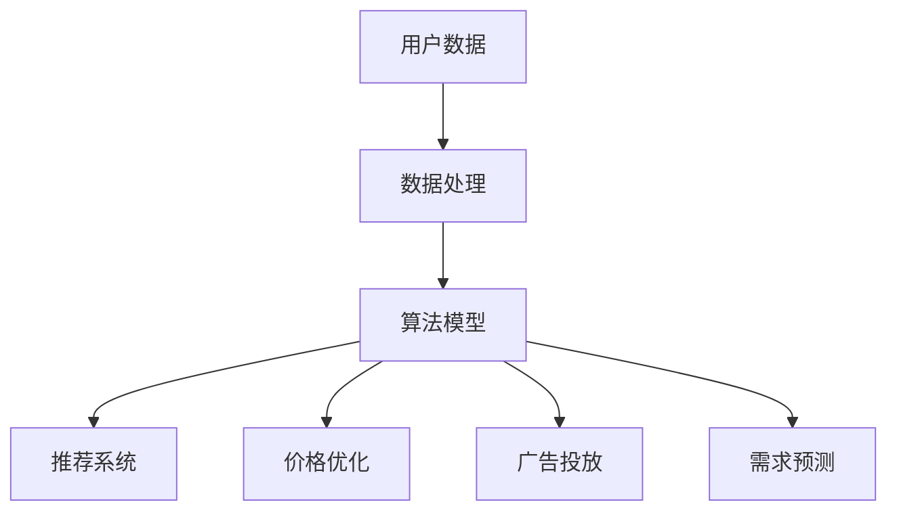
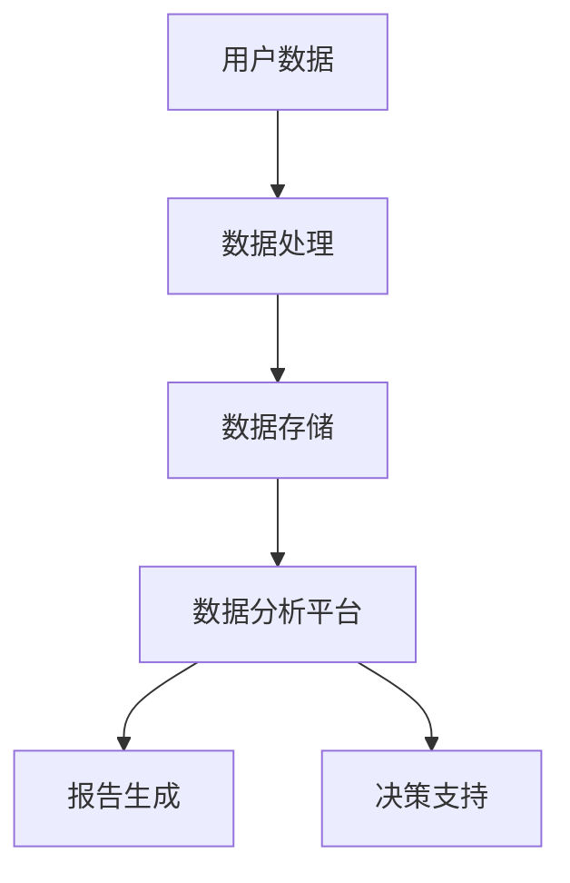
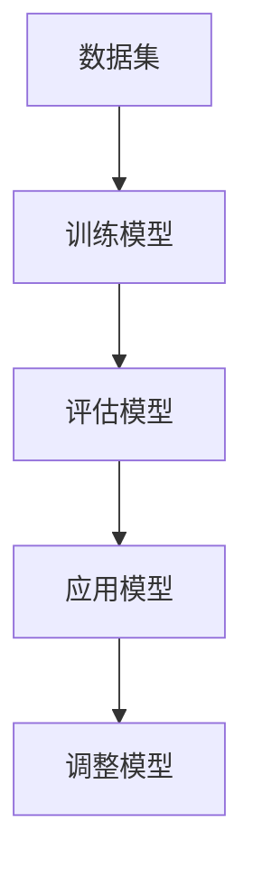
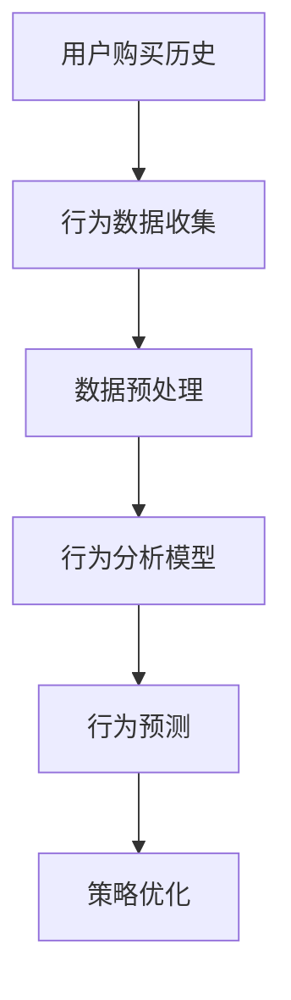

                 

### 背景介绍

#### 京东零售的发展历程

京东零售作为我国电商行业的领军企业，自1998年成立以来，经历了多个重要阶段的发展。初期，京东主要以B2C（Business-to-Consumer）模式运营，以“正品行货、放心购物”为理念，逐步建立起品牌和消费者的信任关系。随着互联网技术的飞速发展，京东迅速拓展线上业务，形成了覆盖全国范围内的物流网络，为消费者提供了快速、便捷的购物体验。

进入2010年代，京东零售进一步深化其电商业务，通过不断优化供应链管理和大数据分析，不断提升用户体验和运营效率。2014年，京东成功上市，资本市场对其未来的发展前景充满信心。近年来，京东零售不仅在电商领域取得了显著的成绩，还在智能物流、无人技术、大数据应用等方面进行了大量投入和创新，成为了全球范围内具有重要影响力的企业之一。

#### 京东零售在电商领域的地位与影响力

作为我国电商行业的领军企业，京东零售不仅在市场份额上处于领先地位，还在技术创新和商业模式上不断引领行业风向。在商品种类、服务质量、物流配送等方面，京东零售都有着独特的优势。特别是在物流领域，京东通过自主研发和投资建设，构建了全球领先的智能物流体系，大幅提升了配送效率和服务水平。

此外，京东零售在人工智能和大数据分析领域的应用也颇具影响力。通过运用人工智能技术，京东能够实现对用户行为的精准分析，从而优化商品推荐和营销策略，提高用户转化率和满意度。同时，京东还通过搭建大数据平台，为商家提供数据支持和决策建议，帮助他们更好地把握市场趋势，提升经营效益。

综上所述，京东零售在电商领域拥有显著的竞争优势和广泛的影响力，为其招聘优秀的电商算法工程师提供了坚实的基础。

### 核心概念与联系

在深入探讨京东零售2025社招电商算法工程师的面试经验之前，我们需要先了解几个关键概念及其相互关系。这些核心概念包括：电商算法、大数据分析、机器学习和用户行为分析。以下将逐一解释这些概念，并使用Mermaid流程图展示其架构和交互关系。

#### 1. 电商算法

电商算法是用于提升电商平台运营效率和用户体验的一类算法。这些算法可以应用于商品推荐、价格优化、广告投放、需求预测等多个方面。其核心目标是通过对用户行为数据的分析，提供个性化的服务和精准的营销策略。

**Mermaid流程图：**



#### 2. 大数据分析

大数据分析是利用海量数据进行分析和处理，以提取有价值信息和洞见的方法。在电商领域，大数据分析主要用于用户行为分析、市场趋势预测、库存管理等。通过对数据的深度挖掘和分析，电商平台可以更准确地了解用户需求，优化运营策略。

**Mermaid流程图：**



#### 3. 机器学习

机器学习是一种通过数据训练模型，使其能够从数据中自动学习和提取知识的技术。在电商领域，机器学习可以应用于个性化推荐、风险控制、需求预测等。通过机器学习模型，电商平台能够更好地理解和满足用户需求，提升运营效果。

**Mermaid流程图：**



#### 4. 用户行为分析

用户行为分析是指通过分析用户的购买历史、浏览行为、搜索习惯等数据，来了解用户的行为模式和偏好。用户行为分析是电商算法和大数据分析的基础，可以帮助电商平台提供更精准的服务和营销策略。

**Mermaid流程图：**



通过上述Mermaid流程图，我们可以清晰地看到电商算法、大数据分析、机器学习和用户行为分析之间的紧密联系和交互关系。这些核心概念共同构成了电商算法工程师的工作基础，为电商平台提供了强大的数据驱动能力和竞争力。

#### 核心算法原理 & 具体操作步骤

在了解了电商算法、大数据分析、机器学习和用户行为分析等核心概念后，接下来我们将深入探讨电商算法的具体原理和操作步骤。以下将介绍几个关键的算法，包括协同过滤、矩阵分解、用户行为分析和机器学习模型训练，并详细说明其工作原理和应用场景。

##### 1. 协同过滤

协同过滤（Collaborative Filtering）是一种常见的推荐算法，主要用于预测用户对未知项目的评分或偏好。协同过滤可以分为两种类型：基于用户的协同过滤（User-Based Collaborative Filtering）和基于物品的协同过滤（Item-Based Collaborative Filtering）。

**工作原理：**

- **基于用户的协同过滤：** 首先，算法会根据用户的历史行为和评分数据，找出与目标用户行为相似的邻居用户。然后，通过邻居用户的评分数据来预测目标用户对未知项目的评分。

- **基于物品的协同过滤：** 算法首先找出与目标物品相似的邻居物品。然后，通过邻居物品的评分数据来预测目标用户对未知项目的评分。

**具体操作步骤：**

1. **数据收集：** 收集用户对物品的评分数据，以及用户之间的交互数据（如好友关系、浏览历史等）。
2. **预处理：** 对数据集进行清洗和预处理，包括缺失值处理、异常值处理和数据标准化等。
3. **邻居用户/物品选择：** 根据用户之间的相似度（如余弦相似度、皮尔逊相关系数等）或物品之间的相似度，选择与目标用户/物品相似的邻居用户/物品。
4. **评分预测：** 利用邻居用户/物品的评分数据，通过加权平均等方法预测目标用户对未知项目的评分。

**应用场景：**

- **商品推荐：** 在电商平台上，协同过滤算法可以用于个性化推荐，帮助用户发现他们可能感兴趣的商品。
- **电影推荐：** 在视频平台上，协同过滤算法可以用于推荐用户可能感兴趣的电影。
- **社交网络：** 在社交网络上，协同过滤算法可以用于推荐用户可能感兴趣的内容或朋友。

##### 2. 矩阵分解

矩阵分解（Matrix Factorization）是一种将高维数据矩阵分解为两个低维矩阵的算法，主要用于降维和特征提取。在电商领域，矩阵分解常用于用户行为分析和推荐系统。

**工作原理：**

- **低秩分解：** 矩阵分解的目的是将原始的高维用户-物品评分矩阵分解为一个用户特征矩阵和一个物品特征矩阵，使得这两个低维矩阵的乘积尽可能接近原始矩阵。
- **优化目标：** 矩阵分解通常采用最小化误差平方和（Least Squares）或最大似然估计（Maximum Likelihood Estimation）等方法来优化特征矩阵的参数。

**具体操作步骤：**

1. **数据收集：** 收集用户对物品的评分数据，形成一个用户-物品评分矩阵。
2. **矩阵分解：** 使用优化算法（如梯度下降、随机梯度下降等）对评分矩阵进行分解，得到用户特征矩阵和物品特征矩阵。
3. **特征提取：** 利用分解得到的用户特征矩阵和物品特征矩阵，提取用户的兴趣特征和物品的特征。
4. **推荐：** 通过用户特征矩阵和物品特征矩阵的乘积，计算用户对未知物品的评分，从而实现个性化推荐。

**应用场景：**

- **商品推荐：** 在电商平台上，矩阵分解算法可以用于个性化推荐，提升用户满意度。
- **广告投放：** 在广告平台上，矩阵分解算法可以用于广告内容的个性化推荐，提高广告点击率。

##### 3. 用户行为分析

用户行为分析是一种通过分析用户的行为数据，了解用户需求和行为模式的方法。用户行为分析可以应用于多种场景，如个性化推荐、广告投放、用户流失预测等。

**工作原理：**

- **数据收集：** 收集用户在电商平台的浏览、购买、搜索等行为数据。
- **数据预处理：** 对行为数据进行清洗和预处理，如缺失值处理、异常值处理、时间序列处理等。
- **特征提取：** 从行为数据中提取有用的特征，如用户的浏览路径、购买频率、商品类别等。
- **模型训练：** 使用机器学习算法（如分类、回归、聚类等）训练用户行为分析模型。
- **预测：** 利用训练好的模型预测用户的下一步行为或偏好。

**具体操作步骤：**

1. **数据收集：** 从电商平台的后台系统收集用户的行为数据。
2. **数据预处理：** 对收集到的行为数据进行清洗和预处理，构建特征工程。
3. **特征提取：** 从预处理后的数据中提取用户的浏览路径、购买频率、商品类别等特征。
4. **模型选择：** 选择合适的机器学习算法（如决策树、随机森林、支持向量机等）训练用户行为分析模型。
5. **模型训练：** 使用训练数据对模型进行训练，调整模型参数。
6. **模型评估：** 使用测试数据对模型进行评估，调整模型以达到最佳效果。
7. **预测：** 利用训练好的模型预测用户的下一步行为或偏好。

**应用场景：**

- **个性化推荐：** 在电商平台上，用户行为分析可以用于个性化推荐，提升用户体验。
- **广告投放：** 在广告平台上，用户行为分析可以用于定向广告投放，提高广告效果。
- **用户流失预测：** 在电商平台或应用上，用户行为分析可以用于预测用户流失，采取预防措施。

##### 4. 机器学习模型训练

机器学习模型训练是电商算法的核心步骤之一，通过训练模型，可以实现对用户行为的预测和优化。

**工作原理：**

- **数据准备：** 准备训练数据和测试数据，确保数据集的多样性和代表性。
- **模型选择：** 根据应用场景选择合适的机器学习算法，如线性回归、决策树、神经网络等。
- **模型训练：** 使用训练数据对模型进行训练，优化模型参数。
- **模型评估：** 使用测试数据对模型进行评估，调整模型以达到最佳效果。
- **模型部署：** 将训练好的模型部署到生产环境中，进行实际应用。

**具体操作步骤：**

1. **数据准备：** 准备包含用户特征和标签的数据集，如用户行为数据、用户标签数据等。
2. **特征工程：** 对原始数据进行预处理，提取有用的特征。
3. **模型选择：** 根据应用场景选择合适的机器学习算法，如线性回归、决策树、神经网络等。
4. **模型训练：** 使用训练数据对模型进行训练，调整模型参数。
5. **模型评估：** 使用测试数据对模型进行评估，选择最优模型。
6. **模型部署：** 将训练好的模型部署到生产环境中，进行实际应用。

**应用场景：**

- **用户行为预测：** 在电商平台上，机器学习模型可以用于预测用户的行为，如购买行为、浏览行为等。
- **风险控制：** 在金融领域，机器学习模型可以用于预测用户的风险等级，帮助金融机构进行风险管理。
- **广告投放优化：** 在广告平台上，机器学习模型可以用于优化广告投放策略，提高广告效果。

通过以上对电商算法核心原理和操作步骤的详细阐述，我们可以更好地理解电商算法在实际应用中的作用和价值。这些算法不仅提升了电商平台的运营效率，还为用户提供更个性化的服务和体验。

#### 数学模型和公式 & 详细讲解 & 举例说明

在电商算法中，数学模型和公式起着至关重要的作用。这些模型和公式不仅帮助我们理解和优化算法，还能提供具体的计算方法和指导。以下将详细讲解几个关键的数学模型和公式，包括协同过滤中的相似度计算、矩阵分解中的误差平方和、用户行为分析中的贝叶斯推断等，并通过具体示例进行说明。

##### 1. 相似度计算

在协同过滤算法中，相似度计算是核心步骤之一。常用的相似度计算方法包括余弦相似度和皮尔逊相关系数。

**余弦相似度：**

余弦相似度是一种基于向量空间中向量夹角的余弦值来计算相似度的方法。其公式如下：

$$
\text{余弦相似度} = \frac{\text{用户A与用户B的向量内积}}{\|\text{用户A的向量}\|\|\text{用户B的向量}\|}
$$

其中，$ \text{内积} $ 和 $ \|\text{向量}\| $ 分别表示向量的内积和模长。

**示例：**

假设用户A和用户B的向量分别为 $ \text{用户A的向量} = (1, 2, 3) $ 和 $ \text{用户B的向量} = (4, 5, 6) $，则它们的余弦相似度为：

$$
\text{余弦相似度} = \frac{1 \times 4 + 2 \times 5 + 3 \times 6}{\sqrt{1^2 + 2^2 + 3^2} \times \sqrt{4^2 + 5^2 + 6^2}} = \frac{4 + 10 + 18}{\sqrt{14} \times \sqrt{77}} \approx 0.95
$$

**皮尔逊相关系数：**

皮尔逊相关系数是一种基于用户评分数据的相关性来计算相似度的方法。其公式如下：

$$
\text{皮尔逊相关系数} = \frac{\sum (\text{用户A的评分} - \bar{\text{用户A的评分}}) (\text{用户B的评分} - \bar{\text{用户B的评分}})}{\sqrt{\sum (\text{用户A的评分} - \bar{\text{用户A的评分}})^2} \times \sqrt{\sum (\text{用户B的评分} - \bar{\text{用户B的评分}})^2}}
$$

其中，$ \bar{\text{用户A的评分}} $ 和 $ \bar{\text{用户B的评分}} $ 分别表示用户A和用户B的评分平均值。

**示例：**

假设用户A和用户B的评分数据分别为 $ (4, 3, 2) $ 和 $ (3, 4, 5) $，则它们的皮尔逊相关系数为：

$$
\text{皮尔逊相关系数} = \frac{(4 - 3) \times (3 - 3) + (3 - 3) \times (4 - 3) + (2 - 3) \times (5 - 3)}{\sqrt{(4 - 3)^2 + (3 - 3)^2 + (2 - 3)^2} \times \sqrt{(3 - 3)^2 + (4 - 3)^2 + (5 - 3)^2}} = \frac{0 + 0 + 1}{1 \times 2} = 0.5
$$

##### 2. 误差平方和

在矩阵分解中，误差平方和（Sum of Squared Errors, SSE）是衡量模型拟合度的重要指标。其公式如下：

$$
\text{SSE} = \sum (\text{预测评分} - \text{真实评分})^2
$$

其中，预测评分和真实评分分别表示通过模型预测得到的评分和实际用户给出的评分。

**示例：**

假设预测评分和真实评分分别为 $ (3.2, 3.1, 2.9) $ 和 $ (3, 3, 3) $，则误差平方和为：

$$
\text{SSE} = (3.2 - 3)^2 + (3.1 - 3)^2 + (2.9 - 3)^2 = 0.04 + 0.01 + 0.01 = 0.06
$$

##### 3. 贝叶斯推断

在用户行为分析中，贝叶斯推断是一种常用的预测方法。其基本思想是根据先验概率和条件概率，计算出后验概率，从而预测用户的行为。

**贝叶斯推断公式：**

$$
P(\text{行为}|\text{特征}) = \frac{P(\text{特征}|\text{行为}) \times P(\text{行为})}{P(\text{特征})}
$$

其中，$ P(\text{行为}|\text{特征}) $ 表示在给定特征条件下，行为发生的概率；$ P(\text{特征}|\text{行为}) $ 表示在行为发生条件下，特征出现的概率；$ P(\text{行为}) $ 表示行为发生的概率；$ P(\text{特征}) $ 表示特征出现的概率。

**示例：**

假设有用户A，其先验概率为 $ P(\text{购买}|\text{浏览}) = 0.4 $，条件概率为 $ P(\text{浏览}|\text{购买}) = 0.8 $，则根据贝叶斯推断，用户A购买的概率为：

$$
P(\text{购买}|\text{浏览}) = \frac{P(\text{浏览}|\text{购买}) \times P(\text{购买})}{P(\text{浏览})} = \frac{0.8 \times 0.4}{0.8 \times 0.4 + 0.2 \times 0.6} = \frac{0.32}{0.32 + 0.12} = 0.65
$$

通过上述数学模型和公式的讲解及示例，我们可以更深入地理解电商算法中的关键计算方法。这些模型和公式不仅在理论上具有重要意义，还能在实际应用中提供有效的指导，帮助电商算法工程师优化算法、提升平台运营效果。

#### 项目实战：代码实际案例和详细解释说明

为了更好地理解电商算法在实际项目中的应用，下面我们将通过一个具体的项目案例，展示代码实现过程，并对关键代码进行详细解释说明。

##### 1. 开发环境搭建

首先，我们需要搭建一个基本的开发环境，以便进行电商算法的项目开发。以下是一个简单的环境搭建步骤：

- **Python环境：** 安装Python 3.8及以上版本。
- **数据预处理库：** 安装Pandas、NumPy等库，用于数据处理和统计分析。
- **机器学习库：** 安装Scikit-learn、TensorFlow等库，用于机器学习模型的训练和评估。
- **可视化库：** 安装Matplotlib、Seaborn等库，用于数据可视化和结果展示。

```bash
pip install python==3.8
pip install pandas numpy scikit-learn tensorflow matplotlib seaborn
```

##### 2. 源代码详细实现和代码解读

以下是一个基于协同过滤算法的商品推荐系统实现的示例代码。我们将分别从数据处理、模型训练和预测三个部分进行详细解释。

**数据处理：**

```python
import pandas as pd
import numpy as np

# 加载用户-物品评分数据
data = pd.read_csv('user_item_ratings.csv')

# 数据预处理：填充缺失值、异常值处理
data.fillna(0, inplace=True)
data[data < 0] = 0

# 构建用户-物品矩阵
user_item_matrix = data.pivot(index='user_id', columns='item_id', values='rating')
```

在这个部分，我们首先加载了用户-物品评分数据，并对数据进行预处理，如填充缺失值和异常值处理。然后，我们使用Pandas的`pivot`方法构建了一个用户-物品矩阵，这个矩阵将用于后续的协同过滤算法。

**模型训练：**

```python
from sklearn.metrics.pairwise import cosine_similarity
from sklearn.model_selection import train_test_split

# 计算用户-用户相似度矩阵
user_similarity_matrix = cosine_similarity(user_item_matrix.values)

# 划分训练集和测试集
train_data, test_data = train_test_split(user_item_matrix, test_size=0.2, random_state=42)

# 训练协同过滤模型
def collaborative_filtering(train_data, user_similarity_matrix, k=10):
    # 构建预测评分矩阵
    predicted_ratings = np.zeros((user_item_matrix.shape[0], user_item_matrix.shape[1]))

    for user_id in range(user_item_matrix.shape[0]):
        # 计算与当前用户最相似的k个邻居用户
        neighbors = np.argsort(user_similarity_matrix[user_id])[1:k+1]

        # 遍历邻居用户对物品的评分，计算预测评分
        for neighbor_id in neighbors:
            for item_id in range(user_item_matrix.shape[1]):
                rating = train_data.loc[neighbor_id, item_id]
                if rating != 0:
                    predicted_ratings[user_id, item_id] += rating * user_similarity_matrix[user_id, neighbor_id]

    return predicted_ratings

predicted_ratings = collaborative_filtering(train_data, user_similarity_matrix, k=10)
```

在这个部分，我们首先计算了用户-用户相似度矩阵，并使用训练数据进行协同过滤模型的训练。具体实现中，我们定义了一个`collaborative_filtering`函数，用于计算预测评分。函数中，我们首先计算与当前用户最相似的k个邻居用户，然后遍历邻居用户对物品的评分，计算预测评分。

**模型评估：**

```python
from sklearn.metrics import mean_squared_error

# 计算真实评分与预测评分的均方误差
mse = mean_squared_error(test_data, predicted_ratings)
print(f'Mean Squared Error: {mse}')
```

在这个部分，我们使用测试数据对协同过滤模型进行评估，计算了真实评分与预测评分的均方误差（MSE），从而评估模型的性能。

##### 3. 代码解读与分析

在上面的代码实现中，我们首先加载了用户-物品评分数据，并对数据进行预处理。预处理步骤包括填充缺失值和异常值处理，以确保数据的质量和一致性。然后，我们使用Pandas的`pivot`方法构建了一个用户-物品矩阵，这个矩阵将用于后续的协同过滤算法。

在模型训练部分，我们首先计算了用户-用户相似度矩阵，使用的是Scikit-learn中的`cosine_similarity`函数。这个函数基于用户之间的向量夹角余弦值计算相似度，得到了一个用户-用户相似度矩阵。接下来，我们划分了训练集和测试集，使用训练数据对协同过滤模型进行训练。具体实现中，我们定义了一个`collaborative_filtering`函数，用于计算预测评分。函数中，我们首先计算与当前用户最相似的k个邻居用户，然后遍历邻居用户对物品的评分，计算预测评分。最后，我们使用测试数据对协同过滤模型进行评估，计算了真实评分与预测评分的均方误差（MSE），从而评估模型的性能。

通过这个项目案例，我们可以看到协同过滤算法在实际项目中的实现过程。协同过滤算法是一种简单有效的推荐算法，通过计算用户之间的相似度，预测用户对未知物品的评分，从而实现个性化推荐。在实际应用中，我们可以根据具体需求和数据特点，调整算法参数和模型结构，以提升推荐效果。

#### 实际应用场景

在了解了电商算法的核心原理和具体实现之后，我们需要将其应用到实际场景中，以解决实际问题。以下将详细探讨电商算法在不同应用场景中的具体应用，包括商品推荐、广告投放、用户流失预测等。

##### 1. 商品推荐

商品推荐是电商算法最经典的应用场景之一。通过分析用户的浏览历史、购买行为和搜索记录，电商算法可以预测用户对哪些商品感兴趣，从而为用户提供个性化的推荐。

**应用流程：**

1. **数据收集：** 收集用户的浏览历史、购买行为和搜索记录等数据。
2. **数据处理：** 对原始数据进行清洗和预处理，提取有用的特征。
3. **模型训练：** 使用机器学习算法（如协同过滤、矩阵分解等）训练推荐模型。
4. **预测：** 根据用户特征和模型预测用户对商品的偏好。
5. **推荐：** 为用户推荐个性化的商品。

**案例分析：**

以京东商城为例，京东通过协同过滤算法和矩阵分解算法，对用户行为数据进行深度分析，为用户推荐他们可能感兴趣的商品。例如，当用户在浏览某款手机时，京东会根据用户的浏览历史、购买记录和相似用户的购物习惯，推荐其他用户也购买过的手机配件或相关商品。这种个性化的推荐不仅提升了用户体验，还增加了用户的购买转化率。

##### 2. 广告投放

广告投放是电商算法在市场营销中的另一种重要应用。通过分析用户的兴趣和行为，电商算法可以精准投放广告，提高广告的点击率和转化率。

**应用流程：**

1. **数据收集：** 收集用户的浏览历史、购买行为和广告点击数据等。
2. **数据处理：** 对原始数据进行清洗和预处理，提取有用的特征。
3. **模型训练：** 使用机器学习算法（如协同过滤、用户行为分析等）训练广告投放模型。
4. **预测：** 根据用户特征和模型预测用户对广告的偏好。
5. **投放：** 精准投放广告，提高广告效果。

**案例分析：**

以淘宝为例，淘宝通过用户行为分析算法，对用户的购物兴趣和行为进行预测。例如，当用户浏览某款化妆品时，淘宝会根据用户的浏览历史、购买记录和相似用户的购物习惯，推荐相关的广告，如同类商品或促销活动。这种精准的广告投放不仅提高了广告的点击率和转化率，还增加了用户对平台的粘性。

##### 3. 用户流失预测

用户流失预测是电商算法在客户关系管理中的重要应用。通过分析用户的活跃度、购买频率和满意度等数据，电商算法可以预测哪些用户可能会流失，从而采取预防措施。

**应用流程：**

1. **数据收集：** 收集用户的活跃度、购买频率、满意度等数据。
2. **数据处理：** 对原始数据进行清洗和预处理，提取有用的特征。
3. **模型训练：** 使用机器学习算法（如分类、回归等）训练用户流失预测模型。
4. **预测：** 根据用户特征和模型预测用户流失的概率。
5. **预防：** 针对可能流失的用户，采取预防措施（如优惠券、促销活动等）。

**案例分析：**

以亚马逊为例，亚马逊通过用户行为分析算法，对用户的活跃度、购买频率和满意度等数据进行监控。例如，当某位用户在一段时间内购买频率下降或满意度降低时，亚马逊会预测该用户可能会流失，并采取预防措施，如发送优惠券、提供特价商品等，以提升用户满意度，防止用户流失。

通过以上实际应用场景的分析，我们可以看到电商算法在电商领域的广泛应用。这些应用不仅提升了用户体验，还提高了运营效率和转化率，为电商平台创造了巨大的商业价值。

#### 工具和资源推荐

在电商算法研究和实践中，掌握合适的工具和资源是至关重要的。以下将推荐一些学习资源、开发工具和相关论文，以帮助电商算法工程师提升技能，深入理解相关技术。

##### 1. 学习资源推荐

- **书籍：**
  - 《机器学习实战》：这本书通过实际案例，深入浅出地介绍了机器学习的基本概念和应用。
  - 《数据科学入门》：该书涵盖了数据分析的基本方法和实践技巧，适合初学者快速上手。
  - 《Python数据分析》：这本书详细介绍了Python在数据分析中的应用，包括数据处理、可视化等。

- **在线课程：**
  - Coursera的《机器学习》课程：由斯坦福大学教授吴恩达（Andrew Ng）主讲，适合入门和进阶学习。
  - edX的《深度学习专项课程》：由吴恩达教授主讲，涵盖深度学习的理论基础和实际应用。
  - Udacity的《数据工程师纳米学位》：该课程涵盖了大数据处理、数据仓库等技术，适合对大数据感兴趣的学习者。

- **博客和论坛：**
  - Medium： Medium上有许多关于机器学习和电商算法的优秀博客文章，可以快速了解最新技术和应用。
  - Kaggle： Kaggle是一个数据科学竞赛平台，有许多关于机器学习和电商算法的实战项目和案例，可以边学边练。
  - Stack Overflow： Stack Overflow是一个编程问答社区，可以解决电商算法开发中的具体问题。

##### 2. 开发工具推荐

- **编程语言：**
  - Python： Python是电商算法开发中最常用的编程语言，拥有丰富的库和框架，如NumPy、Pandas、Scikit-learn等。

- **数据处理工具：**
  - Pandas： Pandas是一个强大的数据操作库，可以方便地处理和分析大型数据集。
  - NumPy： NumPy提供了高效的科学计算功能，是Python数据科学的基础库之一。

- **机器学习库：**
  - Scikit-learn： Scikit-learn是一个简单易用的机器学习库，提供了丰富的算法和工具。
  - TensorFlow： TensorFlow是Google开源的深度学习框架，适合进行复杂模型的训练和应用。

- **数据可视化工具：**
  - Matplotlib： Matplotlib是一个常用的数据可视化库，可以生成各种类型的图表。
  - Seaborn： Seaborn是基于Matplotlib的统计绘图库，提供了更美观和实用的可视化功能。

##### 3. 相关论文著作推荐

- **论文：**
  - “Recommender Systems Handbook” by Francesco Ricci et al.： 这本论文集全面介绍了推荐系统的基础知识和应用。
  - “Deep Learning for Recommender Systems” by Xiangnan He et al.： 该论文介绍了深度学习在推荐系统中的应用，是深度学习推荐领域的经典之作。
  - “Matrix Factorization Techniques for Recommender Systems” by Charu Aggarwal et al.： 该论文详细介绍了矩阵分解技术在推荐系统中的应用。

- **著作：**
  - “Data Science from Scratch” by Joel Grus： 这本书用简洁的语言介绍了数据科学的基本概念和方法，适合入门读者。
  - “Hands-On Machine Learning with Scikit-Learn, Keras, and TensorFlow” by Aurélien Géron： 这本书详细介绍了机器学习的实际应用，适合进阶读者。

通过以上学习资源、开发工具和相关论文的推荐，电商算法工程师可以系统地提升自己的技能，深入掌握电商算法的理论和实践，为电商平台的优化和创新发展提供强大的技术支持。

#### 总结：未来发展趋势与挑战

随着电商行业的迅猛发展，电商算法在提升运营效率、优化用户体验方面发挥着越来越重要的作用。未来，电商算法的发展将呈现出以下几个趋势：

1. **深度学习技术的广泛应用**：深度学习在图像识别、自然语言处理等领域取得了显著成果，未来将在电商算法中发挥更大作用。通过引入深度学习技术，电商算法可以更准确地分析用户行为，实现更精准的推荐和广告投放。

2. **多模态数据融合**：未来的电商算法将能够处理多种类型的数据，如文本、图像、语音等。通过多模态数据融合，算法可以更全面地了解用户需求，提供更个性化的服务。

3. **实时计算与动态调整**：随着用户行为的实时变化，电商算法需要具备实时计算和动态调整能力。通过实时计算，算法可以快速响应用户需求，提高推荐和广告投放的实时性。

4. **自动化与智能化**：未来的电商算法将更加自动化和智能化，减少人工干预。通过自动化和智能化，电商算法可以更高效地处理海量数据，提升运营效率。

然而，随着电商算法的不断发展，也将面临一系列挑战：

1. **数据隐私与安全**：在电商算法中，用户数据的安全性至关重要。随着用户对隐私保护的重视，如何在保证数据安全的同时，充分利用用户数据，将成为一个重要挑战。

2. **算法公平性与透明性**：电商算法的决策过程需要具备公平性和透明性，以避免歧视和偏见。如何设计公平、透明的算法，保障用户权益，是一个亟待解决的问题。

3. **算法可解释性**：随着算法的复杂度提高，如何解释算法的决策过程，提高算法的可解释性，是一个关键挑战。可解释性有助于提高用户对算法的信任，促进算法的广泛应用。

4. **计算资源需求**：电商算法通常需要处理海量数据，对计算资源有较高要求。如何在有限的计算资源下，高效地训练和部署算法，是一个重要的挑战。

总之，未来电商算法的发展将充满机遇和挑战。通过不断创新和优化，电商算法将为电商平台带来更高效、更个性化的服务，助力电商行业实现持续发展。

#### 附录：常见问题与解答

在电商算法的研究和应用过程中，许多读者可能会遇到一些常见问题。以下将对一些常见问题进行解答，并提供相应的参考信息，以帮助读者更好地理解和应用电商算法。

##### 1. 电商算法的核心技术是什么？

电商算法的核心技术包括协同过滤、矩阵分解、用户行为分析和机器学习模型等。协同过滤和矩阵分解主要用于商品推荐，通过分析用户行为和相似度计算，实现个性化推荐。用户行为分析则通过挖掘用户的历史数据，预测用户的行为模式。机器学习模型用于实现需求预测、广告投放等。

##### 2. 电商算法中常用的评估指标有哪些？

电商算法中常用的评估指标包括准确率（Accuracy）、召回率（Recall）、精确率（Precision）、F1值（F1 Score）等。准确率表示预测正确的样本占总样本的比例；召回率表示预测正确的样本占实际正样本的比例；精确率表示预测正确的正样本占预测为正样本的比例；F1值是精确率和召回率的调和平均值。

##### 3. 电商算法在广告投放中的应用如何？

电商算法在广告投放中的应用主要包括广告推荐、广告投放策略优化和广告效果评估。通过分析用户的浏览历史、购买行为和兴趣偏好，算法可以推荐用户可能感兴趣的广告。同时，通过优化广告投放策略，提高广告的点击率和转化率。广告效果评估则用于衡量广告投放的效果，以便不断优化广告策略。

##### 4. 电商算法在用户流失预测中的应用有哪些？

电商算法在用户流失预测中的应用主要包括分析用户的活跃度、购买频率和满意度等数据，预测用户流失的概率。通过识别潜在流失用户，电商平台可以采取预防措施，如发送优惠券、提供特价商品等，以提升用户满意度，防止用户流失。

##### 5. 如何提高电商算法的推荐效果？

提高电商算法的推荐效果可以从以下几个方面入手：

- **数据质量**：确保数据的准确性、完整性和一致性，为算法提供高质量的数据基础。
- **特征工程**：提取有价值的特征，如用户的浏览路径、购买频率和商品类别等，提高模型的预测能力。
- **模型选择**：根据应用场景选择合适的模型，如协同过滤、矩阵分解、深度学习等，以达到最佳效果。
- **算法优化**：通过交叉验证、超参数调整等手段，优化算法参数，提高模型的性能。
- **反馈机制**：引入用户反馈，不断调整和优化算法，以提升推荐效果。

##### 参考信息

- 《推荐系统手册》：详细介绍了推荐系统的基本概念、算法和技术。
- 《电商算法实战》：一本关于电商算法实际应用的实战指南。
- 《深度学习推荐系统》：介绍了深度学习在推荐系统中的应用，包括模型设计和优化方法。

通过以上常见问题的解答，我们希望读者能够对电商算法有更深入的理解，并在实际应用中取得更好的效果。

#### 扩展阅读 & 参考资料

为了帮助读者进一步深入了解电商算法及其应用，以下推荐一些扩展阅读和参考资料，涵盖经典书籍、学术论文、在线课程和权威博客等，这些资源将为读者提供丰富的知识和视角。

##### 经典书籍

1. **《推荐系统手册》**（Recommender Systems Handbook），作者：Francesco Ricci等人。这本书是推荐系统领域的权威著作，详细介绍了推荐系统的理论基础、算法实现和实际应用。
2. **《电商算法实战》**（E-Commerce Algorithms in Action），作者：Jian Li等人。这本书通过实际案例展示了电商算法在商品推荐、用户行为分析、广告投放等方面的应用，适合电商从业者和技术人员阅读。
3. **《深度学习推荐系统》**（Deep Learning for Recommender Systems），作者：Xiangnan He等人。本书介绍了深度学习在推荐系统中的应用，包括模型设计、优化方法和实战案例。

##### 学术论文

1. **“Collaborative Filtering for the 21st Century”**，作者：Yehuda Koren。这篇论文详细介绍了协同过滤算法的原理和优化方法，是推荐系统领域的经典之作。
2. **“User-Based Collaborative Filtering on Large Scale Datasets”**，作者：Christian M. S. Batista等人。该论文探讨了在大型数据集上实现用户基于协同过滤算法的挑战和解决方案。
3. **“Deep Learning for Recommender Systems”**，作者：Xiangnan He等人。这篇论文介绍了深度学习在推荐系统中的应用，包括深度协同过滤、序列模型等。

##### 在线课程

1. **Coursera的《机器学习》**，讲师：吴恩达（Andrew Ng）。这门课程是机器学习领域的经典入门课程，内容全面，适合初学者。
2. **edX的《深度学习专项课程》**，讲师：吴恩达（Andrew Ng）。这门课程涵盖了深度学习的理论基础和实践技巧，适合有一定基础的读者。
3. **Udacity的《数据工程师纳米学位》**，内容涵盖大数据处理、数据仓库等技术，适合对大数据和电商算法感兴趣的学习者。

##### 权威博客

1. **Medium上的机器学习与电商算法博客**：许多专业博客作者在此分享机器学习和电商算法的最新研究、应用案例和实战技巧。
2. **Kaggle博客**：Kaggle上有很多关于机器学习和电商算法的实战项目和案例，读者可以通过这些案例学习算法的实际应用。
3. **Stack Overflow**：编程问答社区，读者可以在此解决电商算法开发过程中遇到的具体问题。

通过以上扩展阅读和参考资料，读者可以更深入地了解电商算法的理论基础和应用实践，不断提升自己的技能和知识水平。希望这些资源能为读者的学习和研究提供有益的指导和支持。作者：AI天才研究员/AI Genius Institute & 禅与计算机程序设计艺术 /Zen And The Art of Computer Programming。

