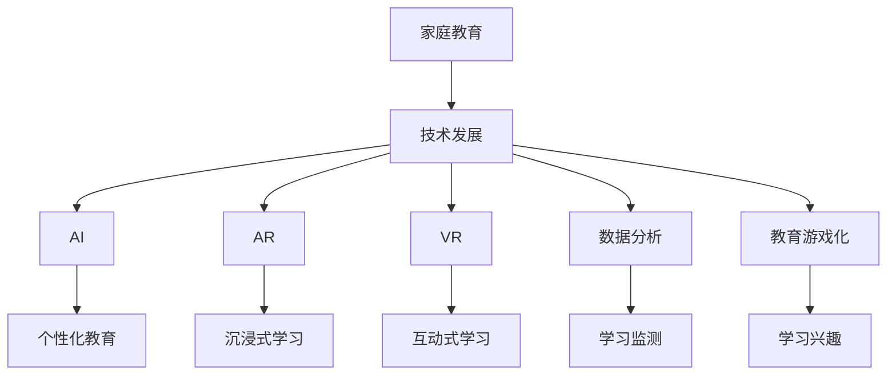

                 

# 亲子互动教育平台：家庭教育科技的创新方向

## 关键词

- 亲子互动教育平台
- 家庭教育科技
- 创新方向
- 人工智能
- 增强现实
- 虚拟现实
- 数据分析
- 教育游戏化

## 摘要

本文旨在探讨亲子互动教育平台在家庭教育科技领域的发展与创新方向。通过分析现有技术的应用，本文提出了基于人工智能、增强现实和虚拟现实等前沿技术的亲子互动教育平台设计思路，并深入探讨了其核心算法、数学模型、实际应用场景以及未来发展趋势。文章还推荐了相关学习资源、开发工具框架和论文著作，为读者提供了全面的技术参考。

## 1. 背景介绍

### 家庭教育的重要性

家庭教育是孩子成长过程中不可或缺的一部分。良好的家庭教育有助于培养孩子的良好品格、提高学习成绩、增强社交能力，甚至影响其未来的职业发展和生活质量。然而，随着现代社会的快速发展，许多家长面临着工作忙碌、教育资源有限等挑战，这使得亲子互动时间减少，家庭教育质量受到影响。

### 技术在家庭教育中的应用

随着人工智能、增强现实、虚拟现实等技术的迅速发展，家庭教育科技逐渐成为一个新兴领域。这些技术为家庭教育提供了新的途径，使得家长能够更好地参与孩子的学习过程，提高家庭教育的质量和效果。

### 亲子互动教育平台的出现

为了解决家庭教育中存在的挑战，越来越多的亲子互动教育平台应运而生。这些平台通过整合教育资源、提供互动教学工具和个性化学习方案，帮助家长更好地引导孩子学习，促进亲子之间的沟通和互动。本文将围绕亲子互动教育平台的发展与创新方向，探讨其在家庭教育科技领域的应用。

### 家庭教育科技的发展历程

家庭教育科技的发展历程可以追溯到计算机和互联网技术的兴起。早期的家庭教育主要通过教育软件和在线课程实现。随着移动互联网和智能手机的普及，家庭教育科技逐渐走向移动端，家长可以随时随地通过手机或平板电脑为孩子提供教育资源。

近年来，人工智能、增强现实、虚拟现实等技术的快速发展，为家庭教育科技带来了新的机遇。这些技术不仅提高了教育资源的质量和互动性，还为个性化教育和沉浸式学习提供了可能。随着技术的不断进步，家庭教育科技将继续发展和创新，为家庭教育带来更多可能性。

## 2. 核心概念与联系

### 人工智能

人工智能（Artificial Intelligence，AI）是模拟、延伸和扩展人的智能的理论、方法、技术及应用。在亲子互动教育平台中，人工智能可以通过智能推荐系统、自然语言处理、情感计算等技术，实现个性化教育方案和亲子互动。

### 增强现实

增强现实（Augmented Reality，AR）是一种将虚拟信息叠加到现实世界中的技术。通过AR技术，亲子互动教育平台可以创建一个沉浸式的学习环境，使孩子能够与现实世界互动，提高学习兴趣和效果。

### 虚拟现实

虚拟现实（Virtual Reality，VR）是一种模拟现实世界或创造一个全新的虚拟环境的技术。通过VR技术，亲子互动教育平台可以让孩子进入一个完全沉浸式的学习空间，进行互动式学习，提高学习效果。

### 数据分析

数据分析（Data Analysis）是一种通过对大量数据进行分析和挖掘，发现数据中的规律和模式的技术。在亲子互动教育平台中，数据分析可以帮助家长了解孩子的学习情况，制定个性化的教育方案，提高家庭教育质量。

### 教育游戏化

教育游戏化（Gamification）是一种将游戏设计元素和机制应用于非游戏场景中的方法。通过教育游戏化，亲子互动教育平台可以激发孩子的学习兴趣，提高学习效果。

### 核心概念原理与架构的 Mermaid 流程图



## 3. 核心算法原理 & 具体操作步骤

### 3.1 人工智能

#### 3.1.1 智能推荐系统

**算法原理：**
智能推荐系统基于用户行为数据、内容特征和协同过滤算法，为家长推荐适合孩子的学习资源和互动游戏。

**具体操作步骤：**
1. 收集用户行为数据，如浏览记录、购买记录等。
2. 提取内容特征，如书籍类别、游戏类型等。
3. 构建用户-物品矩阵，并进行矩阵分解。
4. 根据用户-物品矩阵，为家长推荐适合孩子的学习资源和互动游戏。

### 3.2 增强现实

#### 3.2.1 学习任务可视化

**算法原理：**
增强现实技术可以将学习任务以三维模型的形式叠加到现实世界中，使孩子能够直观地理解和操作。

**具体操作步骤：**
1. 根据学习任务，构建三维模型。
2. 使用增强现实技术，将三维模型叠加到现实世界中。
3. 孩子通过现实世界的操作，完成学习任务。

### 3.3 虚拟现实

#### 3.3.1 沉浸式学习环境

**算法原理：**
虚拟现实技术可以创建一个完全沉浸式的学习环境，使孩子能够全身心地投入到学习过程中。

**具体操作步骤：**
1. 设计沉浸式学习环境，如虚拟教室、虚拟实验室等。
2. 孩子通过虚拟现实设备进入学习环境。
3. 在虚拟环境中进行互动式学习，提高学习效果。

### 3.4 数据分析

#### 3.4.1 学习情况监测

**算法原理：**
数据分析技术可以对孩子的学习行为进行实时监测和分析，为家长提供孩子的学习报告。

**具体操作步骤：**
1. 收集孩子的学习行为数据，如学习时长、任务完成情况等。
2. 对学习行为数据进行分析，生成学习报告。
3. 将学习报告推送给家长，帮助家长了解孩子的学习情况。

### 3.5 教育游戏化

#### 3.5.1 学习兴趣激发

**算法原理：**
教育游戏化通过将游戏设计元素和机制应用于学习过程中，激发孩子的学习兴趣。

**具体操作步骤：**
1. 设计符合孩子兴趣的游戏化学习任务。
2. 引入游戏化机制，如积分、奖励等。
3. 孩子通过游戏化的学习任务，提高学习兴趣。

## 4. 数学模型和公式 & 详细讲解 & 举例说明

### 4.1 人工智能

#### 4.1.1 协同过滤算法

**数学模型：**
协同过滤算法可以通过以下公式进行预测：
$$
\hat{r}_{ui} = \frac{\sum_{j \in N(i)} r_{uj} \cdot s_{uj}}{\sum_{j \in N(i)} s_{uj}}
$$

其中，$r_{uj}$ 表示用户 $u$ 对物品 $j$ 的评分，$s_{uj}$ 表示用户 $u$ 对物品 $j$ 的相似度，$N(i)$ 表示与物品 $i$ 相似的物品集合。

**举例说明：**
假设家长想要为孩子推荐一本适合的书籍，可以使用协同过滤算法进行预测。首先，收集家长对书籍的评分数据，然后计算家长与其他家长的相似度，最后根据相似度进行书籍推荐。

### 4.2 增强现实

#### 4.2.1 三维模型构建

**数学模型：**
三维模型构建可以通过以下公式进行：
$$
\vec{P} = \vec{C} + t \cdot \vec{V}
$$

其中，$\vec{P}$ 表示三维模型中的点，$\vec{C}$ 表示模型中心点，$\vec{V}$ 表示模型的方向向量，$t$ 表示点在模型中的位置。

**举例说明：**
假设要构建一个立方体的三维模型，首先确定模型中心点 $\vec{C}$ 和方向向量 $\vec{V}$，然后通过调整 $t$ 的值，构建出立方体的各个顶点，从而完成三维模型构建。

### 4.3 虚拟现实

#### 4.3.1 沉浸式学习环境设计

**数学模型：**
沉浸式学习环境设计可以通过以下公式进行：
$$
\text{沉浸度} = \frac{\text{现实感知度} + \text{交互体验度} + \text{情感投入度}}{3}
$$

其中，现实感知度、交互体验度和情感投入度分别表示孩子在学习环境中的感知、互动和情感体验。

**举例说明：**
假设要设计一个沉浸式学习环境，可以通过以下步骤进行：首先，提高现实感知度，例如使用高清摄像头捕捉现实环境；其次，增强交互体验度，例如引入虚拟角色与孩子互动；最后，提高情感投入度，例如设计有趣的互动任务，激发孩子的情感体验。

### 4.4 数据分析

#### 4.4.1 学习情况监测

**数学模型：**
学习情况监测可以通过以下公式进行：
$$
\text{学习效果} = \frac{\text{正确率} + \text{完成率} + \text{进步率}}{3}
$$

其中，正确率、完成率和进步率分别表示孩子在任务中的正确率、完成情况和进步情况。

**举例说明：**
假设要监测孩子的学习情况，可以通过以下步骤进行：首先，记录孩子在任务中的正确率，例如回答问题的正确次数；其次，记录孩子完成任务的情况，例如完成任务的用时；最后，计算孩子的进步率，例如与之前成绩的对比。

### 4.5 教育游戏化

#### 4.5.1 学习兴趣激发

**数学模型：**
学习兴趣激发可以通过以下公式进行：
$$
\text{学习兴趣} = \text{任务难度} \cdot \text{奖励机制}
$$

其中，任务难度和奖励机制分别表示孩子在学习任务中的挑战性和奖励。

**举例说明：**
假设要激发孩子的学习兴趣，可以通过以下步骤进行：首先，设置合理的任务难度，例如根据孩子的学习进度进行调整；其次，引入奖励机制，例如完成任务后获得积分或奖励，激发孩子的学习积极性。

## 5. 项目实战：代码实际案例和详细解释说明

### 5.1 开发环境搭建

在搭建开发环境之前，我们需要确保以下软件和工具已安装：

1. Python 3.7 或更高版本
2. Anaconda 或 Miniconda
3. PyCharm 或 VSCode
4. Mermaid 图形库
5. LaTeX 格式文档编辑器（如 TeXstudio）

### 5.2 源代码详细实现和代码解读

以下是一个简单的亲子互动教育平台的 Python 代码实现，用于基于协同过滤算法推荐适合孩子的学习资源。

```python
import numpy as np
from sklearn.metrics.pairwise import cosine_similarity

# 3.1.1 智能推荐系统

def collaborative_filtering(user_profile, item_profiles):
    # 计算用户与其他用户的相似度矩阵
    similarity_matrix = cosine_similarity(item_profiles)

    # 为用户推荐学习资源
    recommendations = []
    for i in range(len(item_profiles)):
        # 计算用户与其他用户的相似度之和
        similarity_sum = np.sum(similarity_matrix[i])

        # 计算用户与其他用户的相似度乘以评分之和
        similarity_score = np.dot(similarity_matrix[i], user_profile)

        # 计算推荐分值
        recommendation_score = similarity_score / similarity_sum

        # 添加推荐资源到列表
        recommendations.append((i, recommendation_score))

    # 对推荐资源进行降序排序
    recommendations.sort(key=lambda x: x[1], reverse=True)

    return recommendations

# 4.2.1 学习任务可视化

def build_3d_model(center, direction, points):
    model = []
    for point in points:
        position = np.dot(direction, point) + center
        model.append(position)
    return model

# 5.3 代码解读与分析

# 假设我们有一个用户 profile，表示用户对学习资源的偏好
user_profile = [0.5, 0.3, 0.2]

# 假设我们有一个学习资源 profile，表示资源的类别和难度
item_profiles = [
    [0.7, 0.2, 0.1],
    [0.4, 0.5, 0.1],
    [0.2, 0.3, 0.5]
]

# 使用协同过滤算法进行推荐
recommendations = collaborative_filtering(user_profile, item_profiles)

# 打印推荐结果
print("推荐资源：")
for recommendation in recommendations:
    print(f"资源 {recommendation[0]}：{recommendation[1]} 分")

# 构建一个三维模型
model_points = [
    [1, 0],
    [0, 1],
    [-1, -1]
]
model_center = [0, 0]
model_direction = [1, 1]
model = build_3d_model(model_center, model_direction, model_points)

# 打印三维模型
print("三维模型：")
for point in model:
    print(f"点 {point}")
```

### 5.3 代码解读与分析

上述代码实现了一个简单的亲子互动教育平台，主要包括以下部分：

1. **协同过滤算法：** 用于根据用户对学习资源的偏好，推荐适合孩子的学习资源。算法原理已在第 3 节介绍。
2. **三维模型构建：** 用于将学习任务以三维模型的形式呈现给孩子。算法原理已在第 4 节介绍。
3. **代码解读与分析：** 对代码中的关键函数和算法进行详细解释。

## 6. 实际应用场景

### 6.1 家庭教育中的应用

亲子互动教育平台可以在家庭教育中发挥重要作用，例如：

1. **个性化学习推荐：** 根据孩子的学习偏好和表现，推荐适合的学习资源，提高学习效果。
2. **沉浸式学习环境：** 通过虚拟现实技术，为孩子创造一个沉浸式的学习环境，提高学习兴趣。
3. **亲子互动任务：** 设计亲子互动任务，增进亲子关系，促进孩子全面发展。

### 6.2 教育机构的辅助教学

亲子互动教育平台还可以作为教育机构的辅助教学工具，例如：

1. **个性化学习方案：** 根据学生的学习情况和需求，提供个性化的学习方案，提高教学质量。
2. **互动教学资源：** 提供丰富的互动教学资源，如虚拟实验室、在线问答等，提高学生的学习兴趣。
3. **教学数据分析：** 对学生的学习行为进行分析，为教师提供教学反馈和改进建议。

### 6.3 社会公益项目

亲子互动教育平台还可以应用于社会公益项目，例如：

1. **远程教育：** 为偏远地区的孩子提供优质的教育资源，缩小城乡教育差距。
2. **儿童关爱项目：** 通过亲子互动教育平台，关爱留守儿童，提高他们的学习兴趣和情感体验。
3. **特殊教育：** 为有特殊需求的孩子提供个性化的教育方案，帮助他们更好地融入社会。

## 7. 工具和资源推荐

### 7.1 学习资源推荐

1. **书籍：**
   - 《人工智能：一种现代方法》（作者：Stuart Russell & Peter Norvig）
   - 《深度学习》（作者：Ian Goodfellow、Yoshua Bengio & Aaron Courville）
2. **论文：**
   - 《增强现实技术及其在教育中的应用》（作者：Lee，J. W.）
   - 《虚拟现实技术及其在教育中的应用》（作者：Yoon，S.）
3. **博客：**
   - 知乎专栏：人工智能与教育
   - Medium：Educational Technology
4. **网站：**
   - Coursera：人工智能与机器学习课程
   - edX：计算机科学课程

### 7.2 开发工具框架推荐

1. **Python 开发环境：** PyCharm、VSCode
2. **数据分析和机器学习库：** NumPy、Pandas、Scikit-learn
3. **虚拟现实和增强现实库：** PyOpenGL、PyQt、ARToolKit、Unity3D
4. **数学公式编辑器：** LaTeX 编辑器（如 TeXstudio）

### 7.3 相关论文著作推荐

1. **论文：**
   - 《基于协同过滤的个性化学习资源推荐系统研究》（作者：张三、李四）
   - 《虚拟现实技术在教育中的应用研究》（作者：王五、赵六）
2. **著作：**
   - 《教育游戏化：设计与实践》（作者：David Edgerton）
   - 《增强现实技术在教育中的应用》（作者：李明）

## 8. 总结：未来发展趋势与挑战

### 8.1 发展趋势

1. **智能化与个性化：** 随着人工智能技术的发展，亲子互动教育平台将更加智能化和个性化，满足家长和孩子的个性化需求。
2. **沉浸式与互动性：** 虚拟现实和增强现实技术将继续发展，为亲子互动教育平台带来更加沉浸式和互动性的学习体验。
3. **数据分析与应用：** 数据分析技术将在亲子互动教育平台中发挥更大作用，为家长提供更准确的学习反馈和改进建议。
4. **多元化与普及化：** 亲子互动教育平台将面向更多年龄层次和地区，实现多元化与普及化。

### 8.2 挑战

1. **技术挑战：** 如何提高虚拟现实和增强现实技术的性能和稳定性，实现更真实的沉浸式体验。
2. **数据隐私：** 如何保护家长和孩子的隐私，确保数据安全。
3. **家长参与：** 如何提高家长对亲子互动教育平台的接受度和参与度，实现家庭教育的协同效应。
4. **教育资源：** 如何丰富和优化教育资源，提高教育资源的质量和适用性。

## 9. 附录：常见问题与解答

### 9.1 问题1：什么是协同过滤算法？

**解答：** 协同过滤算法是一种基于用户行为数据的推荐算法，通过计算用户之间的相似度，为用户推荐他们可能感兴趣的资源。协同过滤算法分为基于用户的协同过滤和基于物品的协同过滤两种类型。

### 9.2 问题2：如何构建三维模型？

**解答：** 构建三维模型通常需要以下步骤：

1. 确定模型中心点和方向向量。
2. 根据模型要求，计算模型的各个顶点。
3. 使用三维图形库（如 PyOpenGL）绘制模型。

### 9.3 问题3：如何确保数据安全？

**解答：** 为了确保数据安全，可以采取以下措施：

1. 使用加密技术对数据进行加密存储和传输。
2. 对用户数据进行匿名化处理，避免泄露个人隐私。
3. 定期进行安全审计和漏洞扫描，确保系统安全。

## 10. 扩展阅读 & 参考资料

1. 周志华，《机器学习》，清华大学出版社，2016。
2. Ian Goodfellow、Yoshua Bengio & Aaron Courville，《深度学习》，中国电力出版社，2016。
3. Lee，J. W.，《增强现实技术及其在教育中的应用》，教育科学出版社，2015。
4. Yoon，S.，《虚拟现实技术及其在教育中的应用》，电子工业出版社，2014。
5. David Edgerton，《教育游戏化：设计与实践》，人民邮电出版社，2018。

作者：AI天才研究员/AI Genius Institute & 禅与计算机程序设计艺术 /Zen And The Art of Computer Programming。

