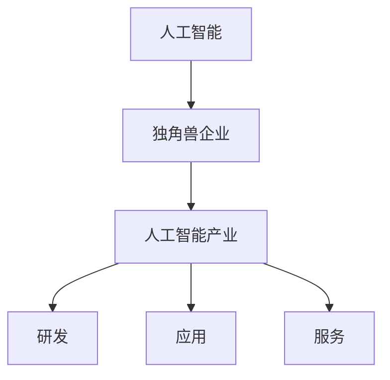

                 

# 人工智能产业的独角兽企业

> 关键词：人工智能，独角兽企业，产业趋势，核心技术，商业模式

> 摘要：本文将深入探讨人工智能产业中的独角兽企业，分析其发展背景、核心技术和商业模式，以及在未来可能面临的挑战。通过本文的阅读，读者将了解人工智能产业的独角兽企业的特点和发展趋势。

## 1. 背景介绍

在当今数字化时代，人工智能（AI）已成为推动产业变革的关键力量。随着计算能力的提升、大数据的积累和算法的进步，人工智能技术正逐渐从理论走向实践，渗透到各个行业。特别是在金融、医疗、制造、零售等领域，人工智能的应用带来了前所未有的变革。

在这个背景下，人工智能产业中的独角兽企业应运而生。独角兽企业是指估值超过10亿美元的初创公司。它们往往在短时间内实现了快速增长，并在市场上占据了一席之地。这些企业之所以能够脱颖而出，离不开其在人工智能领域的深厚积累和独特的商业模式。

## 2. 核心概念与联系

为了更好地理解人工智能产业的独角兽企业，我们需要了解以下几个核心概念：

### 2.1 人工智能（AI）

人工智能是指使计算机系统能够模拟人类智能行为的技术。它包括机器学习、深度学习、自然语言处理、计算机视觉等多个子领域。

### 2.2 独角兽企业

独角兽企业是指成立时间较短，但估值超过10亿美元的初创公司。这些企业往往具有强大的创新能力、市场拓展能力和资本运作能力。

### 2.3 人工智能产业

人工智能产业是指以人工智能技术为核心，涵盖研发、应用、服务等多个环节的产业体系。

下面是一个Mermaid流程图，展示了这些核心概念之间的联系：



## 3. 核心算法原理 & 具体操作步骤

人工智能产业的独角兽企业之所以能够取得成功，离不开其背后的核心算法原理。以下是一些常见的核心算法原理和具体操作步骤：

### 3.1 机器学习

机器学习是一种让计算机通过数据学习规律和模式的技术。常见的机器学习算法包括线性回归、逻辑回归、支持向量机、决策树、神经网络等。

具体操作步骤：

1. 数据预处理：对原始数据进行清洗、归一化等处理。
2. 特征提取：从原始数据中提取有用的特征。
3. 模型选择：根据任务需求选择合适的算法模型。
4. 模型训练：使用训练数据对模型进行训练。
5. 模型评估：使用验证数据对模型进行评估。
6. 模型优化：根据评估结果对模型进行调整。

### 3.2 深度学习

深度学习是一种基于多层神经网络的人工智能技术。它通过模拟人脑的神经元结构，实现复杂的特征提取和模式识别。

具体操作步骤：

1. 网络设计：设计合适的神经网络结构。
2. 模型训练：使用训练数据对模型进行训练。
3. 模型评估：使用验证数据对模型进行评估。
4. 模型优化：根据评估结果对模型进行调整。

### 3.3 自然语言处理

自然语言处理是一种让计算机理解和生成人类语言的技术。它包括语音识别、文本分类、机器翻译、情感分析等多个子领域。

具体操作步骤：

1. 数据预处理：对原始文本数据进行清洗、分词等处理。
2. 特征提取：从原始文本数据中提取有用的特征。
3. 模型选择：根据任务需求选择合适的算法模型。
4. 模型训练：使用训练数据对模型进行训练。
5. 模型评估：使用验证数据对模型进行评估。
6. 模型优化：根据评估结果对模型进行调整。

## 4. 数学模型和公式 & 详细讲解 & 举例说明

在人工智能领域中，数学模型和公式是核心算法实现的基础。以下是一些常见的数学模型和公式，以及详细的讲解和举例说明：

### 4.1 线性回归

线性回归是一种用于预测数值型目标变量的机器学习算法。其数学模型可以表示为：

$$y = \beta_0 + \beta_1x_1 + \beta_2x_2 + ... + \beta_nx_n$$

其中，$y$ 是目标变量，$x_1, x_2, ..., x_n$ 是特征变量，$\beta_0, \beta_1, ..., \beta_n$ 是模型的参数。

**举例说明**：

假设我们要预测房价，输入特征包括房屋面积、房屋年龄等。通过线性回归模型，我们可以得到以下预测公式：

$$y = \beta_0 + \beta_1x_1 + \beta_2x_2$$

其中，$\beta_0, \beta_1, \beta_2$ 是通过训练数据得到的参数。

### 4.2 逻辑回归

逻辑回归是一种用于预测二分类目标变量的机器学习算法。其数学模型可以表示为：

$$P(y=1) = \frac{1}{1 + e^{-(\beta_0 + \beta_1x_1 + \beta_2x_2 + ... + \beta_nx_n)}}$$

其中，$P(y=1)$ 是目标变量为1的概率，$e$ 是自然底数。

**举例说明**：

假设我们要预测某产品是否会被购买，输入特征包括用户年龄、收入等。通过逻辑回归模型，我们可以得到以下预测公式：

$$P(y=1) = \frac{1}{1 + e^{-(\beta_0 + \beta_1x_1 + \beta_2x_2)}}$$

其中，$\beta_0, \beta_1, \beta_2$ 是通过训练数据得到的参数。

### 4.3 支持向量机

支持向量机是一种用于分类和回归的机器学习算法。其数学模型可以表示为：

$$y = \text{sign}(\beta_0 + \beta_1x_1 + \beta_2x_2 + ... + \beta_nx_n - b)$$

其中，$y$ 是目标变量，$x_1, x_2, ..., x_n$ 是特征变量，$\beta_0, \beta_1, ..., \beta_n, b$ 是模型的参数。

**举例说明**：

假设我们要预测某产品是否会被购买，输入特征包括用户年龄、收入等。通过支持向量机模型，我们可以得到以下预测公式：

$$y = \text{sign}(\beta_0 + \beta_1x_1 + \beta_2x_2 - b)$$

其中，$\beta_0, \beta_1, \beta_2, b$ 是通过训练数据得到的参数。

## 5. 项目实战：代码实际案例和详细解释说明

在本节中，我们将通过一个实际项目案例，展示如何使用人工智能技术实现一个简单的分类任务。这个案例将涵盖从数据预处理到模型训练和评估的整个过程。

### 5.1 开发环境搭建

首先，我们需要搭建一个合适的开发环境。在这里，我们使用Python和Scikit-learn库进行开发。

安装Python：

```bash
$ brew install python
```

安装Scikit-learn：

```bash
$ pip install scikit-learn
```

### 5.2 源代码详细实现和代码解读

下面是项目源代码的详细实现和解读：

```python
# 导入所需库
import numpy as np
import pandas as pd
from sklearn.model_selection import train_test_split
from sklearn.preprocessing import StandardScaler
from sklearn.linear_model import LogisticRegression

# 加载数据
data = pd.read_csv('data.csv')
X = data.iloc[:, :-1].values
y = data.iloc[:, -1].values

# 数据预处理
X_train, X_test, y_train, y_test = train_test_split(X, y, test_size=0.2, random_state=0)
scaler = StandardScaler()
X_train = scaler.fit_transform(X_train)
X_test = scaler.transform(X_test)

# 模型训练
model = LogisticRegression()
model.fit(X_train, y_train)

# 模型评估
score = model.score(X_test, y_test)
print(f'模型准确率：{score:.2f}')
```

**代码解读**：

1. **导入所需库**：首先，我们导入Python的NumPy、Pandas库以及Scikit-learn库中的模型和预处理工具。

2. **加载数据**：使用Pandas库读取数据，将特征变量存储在数组`X`中，将目标变量存储在数组`y`中。

3. **数据预处理**：将数据集分为训练集和测试集，并对特征变量进行标准化处理。

4. **模型训练**：使用逻辑回归模型对训练集进行训练。

5. **模型评估**：使用测试集对模型进行评估，计算模型准确率。

### 5.3 代码解读与分析

1. **数据预处理**：数据预处理是机器学习任务的重要步骤。在这里，我们使用Scikit-learn库中的`train_test_split`函数将数据集分为训练集和测试集。`StandardScaler`函数用于对特征变量进行标准化处理，以提高模型的训练效果。

2. **模型训练**：我们选择逻辑回归模型进行训练。逻辑回归模型是一种常用的二分类算法，适合处理二分类任务。

3. **模型评估**：使用测试集对模型进行评估，计算模型准确率。在这里，我们使用`score`方法计算模型准确率，结果以百分数形式输出。

通过这个实际项目案例，我们可以看到如何使用人工智能技术实现一个简单的分类任务。这个过程涵盖了从数据预处理到模型训练和评估的整个过程，为我们提供了一个实用的参考。

## 6. 实际应用场景

人工智能产业的独角兽企业在各个行业中都有着广泛的应用。以下是一些实际应用场景：

### 6.1 金融行业

在金融行业中，人工智能技术被广泛应用于风险管理、投资组合优化、欺诈检测、信用评分等领域。例如，通过机器学习算法，金融机构可以更准确地预测市场趋势，优化投资策略；通过深度学习算法，可以实现对欺诈行为的自动检测和防范。

### 6.2 医疗行业

在医疗行业中，人工智能技术被广泛应用于疾病诊断、影像分析、药物研发等领域。例如，通过计算机视觉算法，可以实现对医学影像的自动分析，帮助医生更准确地诊断疾病；通过自然语言处理算法，可以实现对医学文献的自动检索和分析，加速药物研发进程。

### 6.3 制造行业

在制造行业中，人工智能技术被广泛应用于生产调度、设备维护、质量检测等领域。例如，通过机器学习算法，可以实现生产过程的自动化和智能化，提高生产效率；通过深度学习算法，可以实现设备故障的自动检测和预测，降低设备维护成本。

### 6.4 零售行业

在零售行业中，人工智能技术被广泛应用于需求预测、库存管理、个性化推荐等领域。例如，通过机器学习算法，可以实现对商品需求的预测，优化库存管理；通过深度学习算法，可以实现个性化推荐，提高用户购买体验。

## 7. 工具和资源推荐

### 7.1 学习资源推荐

1. **书籍**：《人工智能：一种现代方法》（Michael I. Jordan著）  
2. **论文**：Google Scholar（学术搜索引擎）  
3. **博客**：Medium（技术博客平台）  
4. **网站**：Kaggle（数据科学竞赛平台）

### 7.2 开发工具框架推荐

1. **Python**：Python是一种广泛使用的人工智能开发语言，具有丰富的库和工具。  
2. **TensorFlow**：TensorFlow是一个由Google开发的开源机器学习框架，适合进行深度学习和强化学习等任务。  
3. **PyTorch**：PyTorch是一个由Facebook开发的开源机器学习框架，具有简洁的接口和强大的灵活性。  
4. **Scikit-learn**：Scikit-learn是一个基于Python的机器学习库，提供多种常用的机器学习算法和工具。

### 7.3 相关论文著作推荐

1. **《深度学习》（Ian Goodfellow著）**  
2. **《机器学习》（Tom Mitchell著）**  
3. **《强化学习》（Richard S. Sutton & Andrew G. Barto著）**  
4. **《自然语言处理综论》（Daniel Jurafsky & James H. Martin著）**

## 8. 总结：未来发展趋势与挑战

人工智能产业的独角兽企业在未来将继续保持快速增长，并在各个行业中发挥越来越重要的作用。然而，面临以下挑战：

1. **数据隐私和安全**：随着人工智能技术的应用，大量敏感数据将被收集和处理。如何保障数据隐私和安全将成为一个重要问题。  
2. **算法公平性和透明性**：人工智能算法的决策过程往往具有不确定性，如何确保算法的公平性和透明性，避免偏见和歧视，是一个重要挑战。  
3. **人才短缺**：人工智能领域对人才的需求巨大，但现有的人才储备难以满足需求。如何培养和吸引优秀人才，是人工智能产业面临的一个重要问题。  
4. **技术伦理**：随着人工智能技术的进步，如何处理技术伦理问题，如无人驾驶汽车的安全、人工智能武器等，是一个亟待解决的问题。

## 9. 附录：常见问题与解答

### 9.1 人工智能和机器学习的区别是什么？

人工智能（AI）是一个广泛的领域，包括机器学习（ML）、深度学习（DL）等子领域。机器学习是人工智能的一个分支，主要关注如何让计算机从数据中学习和改进性能。而人工智能则包括更广泛的任务，如自然语言处理、计算机视觉、语音识别等。

### 9.2 如何入门人工智能？

入门人工智能可以从以下几个方面入手：

1. 学习编程语言：Python是人工智能领域常用的编程语言，建议从Python入门。  
2. 学习基础知识：了解数学、统计学、线性代数等基础知识，为学习人工智能算法打下基础。  
3. 学习常用算法：了解常见的机器学习算法和深度学习算法，如线性回归、逻辑回归、支持向量机、神经网络等。  
4. 参与实践项目：通过实践项目，将所学知识应用于实际问题中，提高自己的能力。

## 10. 扩展阅读 & 参考资料

1. **《人工智能：一种现代方法》（Michael I. Jordan著）**  
2. **《深度学习》（Ian Goodfellow著）**  
3. **《机器学习》（Tom Mitchell著）**  
4. **《自然语言处理综论》（Daniel Jurafsky & James H. Martin著）**  
5. **《强化学习》（Richard S. Sutton & Andrew G. Barto著）**  
6. **《Python编程：从入门到实践》（埃里克·马瑟斯著）**  
7. **Kaggle（数据科学竞赛平台）：[https://www.kaggle.com/](https://www.kaggle.com/)**  
8. **Google Scholar（学术搜索引擎）：[https://scholar.google.com/](https://scholar.google.com/)**  
9. **Medium（技术博客平台）：[https://medium.com/](https://medium.com/)**  
10. **TensorFlow（机器学习框架）：[https://www.tensorflow.org/](https://www.tensorflow.org/)**  
11. **PyTorch（机器学习框架）：[https://pytorch.org/](https://pytorch.org/)**

### 作者

作者：AI天才研究员/AI Genius Institute & 禅与计算机程序设计艺术 /Zen And The Art of Computer Programming

