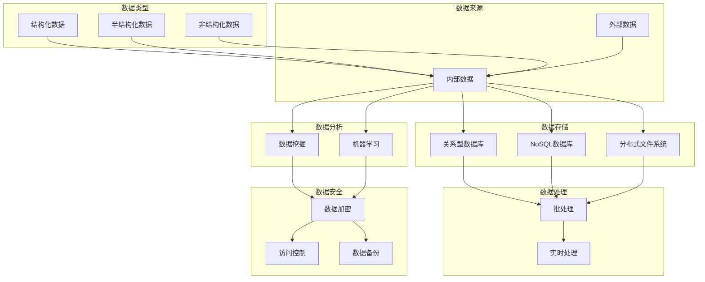

                 

### 背景介绍

随着人工智能（AI）技术的飞速发展，越来越多的企业和初创公司开始涉足这一领域，希望通过人工智能来提升业务效率和竞争力。然而，数据管理成为了一个亟待解决的挑战。如何有效地收集、存储、处理和分析大量数据，以支持人工智能模型的训练和应用，成为人工智能创业企业必须面对的核心问题。

本文旨在探讨人工智能创业中的数据管理创新，分析当前数据管理面临的挑战，并介绍一些前沿的技术和方法，帮助创业者们更好地应对这些挑战。文章结构如下：

1. **背景介绍**：概述人工智能创业中的数据管理挑战。
2. **核心概念与联系**：介绍数据管理相关的基本概念，并用 Mermaid 流程图展示其架构。
3. **核心算法原理 & 具体操作步骤**：详细讲解数据处理和管理的核心算法。
4. **数学模型和公式 & 详细讲解 & 举例说明**：阐述相关数学模型，并通过具体例子进行说明。
5. **项目实战：代码实际案例和详细解释说明**：展示一个实际项目中的代码实现，并进行详细解读。
6. **实际应用场景**：讨论数据管理在不同场景下的应用。
7. **工具和资源推荐**：推荐相关学习资源和开发工具。
8. **总结：未来发展趋势与挑战**：总结本文内容，并展望未来发展趋势和挑战。
9. **附录：常见问题与解答**：回答读者可能遇到的问题。
10. **扩展阅读 & 参考资料**：提供进一步的阅读资源。

接下来，我们将逐步深入探讨数据管理在人工智能创业中的重要性，以及如何利用创新技术解决其中的问题。

#### 关键词：

- 人工智能创业
- 数据管理
- 数据收集
- 数据存储
- 数据处理
- 数据分析
- 数据质量
- 数据安全
- 数据隐私
- 前沿技术

#### 摘要：

本文探讨了人工智能创业中的数据管理挑战，包括数据收集、存储、处理和分析等方面的难题。通过介绍数据管理的基本概念和前沿技术，本文提出了创新的数据管理策略，帮助创业者更好地应对数据管理的复杂性，提升业务效率和竞争力。文章还通过实际项目案例和详细解读，展示了数据管理技术的应用和实践，为读者提供了实用的参考。最后，本文总结了未来发展趋势与挑战，并提供了扩展阅读和参考资料，以促进进一步学习。

---

### 1. 背景介绍

在人工智能（AI）迅猛发展的背景下，数据管理的重要性日益凸显。数据被视为人工智能的“石油”，其质量、准确性和可用性直接影响到AI模型的效果和业务决策的准确性。对于人工智能创业企业来说，如何有效地管理和利用数据，成为成功的关键因素之一。

首先，让我们明确什么是数据管理。数据管理是一个系统性、综合性的过程，包括数据收集、存储、处理、分析、安全等多个方面。在人工智能创业中，数据管理面临着以下几个主要挑战：

**1.1 数据收集与多样性**

人工智能创业需要大量的数据来训练模型。这些数据不仅包括结构化数据，如数据库中的信息，还包括非结构化数据，如文本、图片、音频和视频。获取这些多样化的数据通常是一项复杂且耗时的任务。此外，数据的质量和多样性也会影响AI模型的性能。

**1.2 数据存储与扩展性**

随着数据量的不断增长，数据存储成为一个关键问题。传统的数据存储解决方案，如关系型数据库，可能无法满足大规模数据的存储需求。创业企业需要找到适合其业务规模和增长速度的数据存储方案，这通常意味着需要使用分布式存储系统和云存储服务。

**1.3 数据处理与效率**

数据处理是数据管理的核心环节。创业企业需要在有限的时间和资源内，对大量数据进行高效的清洗、转换和分析。这需要高效的算法和优化，以确保数据处理的速度和准确性。

**1.4 数据分析与应用**

数据分析是数据管理的最终目标，即将数据转化为有价值的信息和洞见，以支持业务决策和产品改进。对于创业企业来说，如何有效地从数据中提取信息，并将其应用到实际业务中，是一个具有挑战性的问题。

**1.5 数据安全与隐私**

随着数据规模的扩大和价值的提升，数据安全成为一个不容忽视的问题。创业企业需要确保数据在收集、存储、传输和使用过程中的安全性，同时遵守相关的隐私保护法规，避免数据泄露和滥用。

综上所述，数据管理在人工智能创业中扮演着至关重要的角色。创业企业需要充分认识到数据管理的挑战，并采取有效的策略和技术，以提升数据管理的效率和效果，从而为人工智能业务的持续发展提供坚实支撑。

---

### 2. 核心概念与联系

在探讨人工智能创业中的数据管理时，理解以下几个核心概念及其相互联系至关重要。以下是数据管理中涉及的一些基本概念，以及它们在数据管理架构中的位置和作用。

#### 2.1 数据类型

数据类型是指数据的分类，主要包括以下几种：

- **结构化数据**：如关系型数据库中的表格数据，具有固定的格式和结构。
- **半结构化数据**：如XML和JSON格式的数据，有一定的结构，但不如结构化数据严格。
- **非结构化数据**：如文本、图片、音频和视频，没有固定的结构，需要特定的处理方法。

**2.2 数据来源**

数据来源包括内部和外部：

- **内部数据**：来自企业内部的业务系统、用户交互日志、运营数据等。
- **外部数据**：来自互联网、合作伙伴、公共数据集等。

**2.3 数据存储**

数据存储是数据管理的核心，涉及以下技术：

- **关系型数据库**：如MySQL、PostgreSQL，适用于结构化数据。
- **NoSQL数据库**：如MongoDB、Cassandra，适用于大规模和非结构化数据。
- **分布式文件系统**：如HDFS，适用于大规模数据存储。

**2.4 数据处理**

数据处理包括数据清洗、转换、聚合等操作，常用的技术有：

- **批处理**：适用于大规模数据处理，如MapReduce。
- **实时处理**：适用于需要实时响应的场景，如流处理框架Apache Flink。

**2.5 数据分析**

数据分析包括数据挖掘、机器学习等，用于提取数据中的模式和洞见：

- **数据挖掘**：从大量数据中发现有意义的模式和关系。
- **机器学习**：利用算法从数据中学习，并作出预测和决策。

**2.6 数据安全**

数据安全包括数据加密、访问控制、数据备份等：

- **数据加密**：防止数据在传输和存储过程中被窃取或篡改。
- **访问控制**：限制对数据的访问权限，确保数据安全。
- **数据备份**：防止数据丢失，确保数据可恢复。

为了更清晰地展示这些概念之间的关系，我们可以使用Mermaid流程图来表示数据管理架构：



通过这个Mermaid流程图，我们可以直观地看到数据从收集、存储、处理到分析的整个流程，以及各个核心概念之间的联系。这对于创业者来说，有助于理解数据管理的整体架构，从而更好地规划和实施数据管理策略。

---

### 3. 核心算法原理 & 具体操作步骤

在数据管理中，核心算法的选择和实现是提升数据处理效率和质量的关键。以下将介绍几个在人工智能创业中常用的核心算法，并详细描述其原理和操作步骤。

#### 3.1 数据清洗算法

**原理**：数据清洗是数据处理的第一步，旨在识别和纠正数据集中的错误、异常和重复值。常用的数据清洗算法包括：

- **缺失值填补**：使用平均值、中位数、众数或插值法填补缺失值。
- **异常值检测**：使用统计方法（如3倍标准差法则）或机器学习方法（如孤立森林）检测和去除异常值。
- **重复值检测与去重**：通过比较记录之间的相似度，识别并去除重复数据。

**具体操作步骤**：

1. **导入数据集**：读取需要清洗的数据集。
2. **缺失值填补**：检查数据集，根据数据类型和特征选择适当的填补方法。
3. **异常值检测**：使用统计方法或机器学习模型检测异常值。
4. **重复值检测与去重**：计算记录之间的相似度，并去除重复的记录。
5. **结果验证**：检查清洗后的数据集，确保数据质量。

#### 3.2 数据转换算法

**原理**：数据转换是将数据从一种格式转换为另一种格式，或对数据进行规范化、归一化等操作，以提高数据的一致性和可操作性。常用的数据转换算法包括：

- **数据规范化**：将数据缩放到一个统一的范围，如0到1或-1到1。
- **数据归一化**：将数据按照比例缩放，使得特征之间的尺度一致。
- **特征工程**：创建新的特征，如交互特征、多项式特征等，以提高模型的预测能力。

**具体操作步骤**：

1. **数据预处理**：对数据进行清洗，确保数据质量。
2. **选择转换方法**：根据数据类型和模型需求选择适当的转换方法。
3. **执行转换**：对数据进行规范化、归一化或特征工程。
4. **结果验证**：检查转换后的数据，确保数据符合预期。

#### 3.3 数据聚合算法

**原理**：数据聚合是对大量数据进行分组和汇总，以提取更高层次的信息。常用的数据聚合算法包括：

- **分组聚合**：根据某个特征对数据进行分组，并对每个分组进行聚合计算。
- **多表连接**：将多个数据表根据公共键连接起来，以合并相关数据。
- **聚合函数**：如求和、求平均、计数等，用于计算数据组的统计信息。

**具体操作步骤**：

1. **数据预处理**：确保数据格式一致，便于连接和聚合。
2. **选择聚合方法**：根据数据分析需求选择适当的聚合方法。
3. **执行聚合**：使用SQL或编程语言实现分组聚合或多表连接。
4. **结果验证**：检查聚合结果，确保计算正确。

#### 3.4 数据分析算法

**原理**：数据分析算法用于从数据中提取有意义的模式和洞见。常用的数据分析算法包括：

- **分类算法**：如决策树、随机森林、支持向量机等，用于将数据分为不同的类别。
- **聚类算法**：如K-均值、层次聚类等，用于将数据分为不同的集群。
- **回归算法**：如线性回归、决策树回归等，用于预测连续数值。

**具体操作步骤**：

1. **数据预处理**：清洗和转换数据，确保数据质量。
2. **选择模型**：根据分析目标选择合适的模型。
3. **模型训练**：使用训练数据对模型进行训练。
4. **模型评估**：使用验证数据评估模型性能。
5. **结果分析**：提取模型预测结果，进行数据分析。

通过上述核心算法的原理和具体操作步骤，人工智能创业企业可以有效地进行数据管理和分析，为业务决策提供有力支持。接下来，我们将进一步探讨数据管理中的数学模型和公式，以帮助读者更深入地理解数据处理和分析的方法。

---

### 4. 数学模型和公式 & 详细讲解 & 举例说明

在数据管理中，数学模型和公式是理解和实现核心算法的基础。以下将介绍几个关键的数学模型和公式，并详细讲解其应用和计算方法。

#### 4.1 数据清洗算法的数学模型

**4.1.1 缺失值填补**

- **平均值填补**：使用数据集的平均值填补缺失值。

\[ \hat{x}_{i,j} = \frac{1}{N-1} \sum_{k=1}^{N} x_{k,j} \]

其中，\( x_{k,j} \) 是数据集中的第 \( k \) 行第 \( j \) 列的值，\( N \) 是非缺失值的数量，\( \hat{x}_{i,j} \) 是填补后的值。

**4.1.2 异常值检测**

- **3倍标准差法则**：检测异常值的一种常用方法。

\[ \text{异常值} = \{ x_{i,j} \mid |x_{i,j} - \mu_j| > 3\sigma_j \} \]

其中，\( \mu_j \) 是第 \( j \) 列的平均值，\( \sigma_j \) 是第 \( j \) 列的标准差，\( x_{i,j} \) 是第 \( i \) 行第 \( j \) 列的值。

**4.1.3 重复值检测与去重**

- **哈希函数**：使用哈希函数检测重复值。

\[ h(x) = \text{哈希值}(x) \]

如果 \( h(x_{i,j}) = h(x_{k,j}) \) 且 \( i \neq k \)，则 \( x_{i,j} \) 和 \( x_{k,j} \) 可能是重复值。

#### 4.2 数据转换算法的数学模型

**4.2.1 数据规范化**

- **最小-最大规范化**：将数据缩放到 [0, 1] 范围内。

\[ z_{i,j} = \frac{x_{i,j} - \min_j x_{k,j}}{\max_j x_{k,j} - \min_j x_{k,j}} \]

其中，\( x_{i,j} \) 是原始值，\( \min_j x_{k,j} \) 是第 \( j \) 列的最小值，\( \max_j x_{k,j} \) 是第 \( j \) 列的最大值，\( z_{i,j} \) 是规范化后的值。

**4.2.2 数据归一化**

- **Z-Score规范化**：将数据缩放到 [-1, 1] 范围内。

\[ z_{i,j} = \frac{x_{i,j} - \mu_j}{\sigma_j} \]

其中，\( \mu_j \) 是第 \( j \) 列的平均值，\( \sigma_j \) 是第 \( j \) 列的标准差。

#### 4.3 数据聚合算法的数学模型

**4.3.1 分组聚合**

- **求和**：计算每个分组的总和。

\[ \sum_{j=1}^{N} x_{i,j} = \sum_{j=1}^{N} x_{i,j} \]

- **求平均**：计算每个分组的平均值。

\[ \mu_j = \frac{1}{N} \sum_{i=1}^{N} x_{i,j} \]

其中，\( x_{i,j} \) 是第 \( i \) 行第 \( j \) 列的值，\( N \) 是分组中的记录数。

**4.3.2 多表连接**

- **内连接**：连接两个表的匹配记录。

\[ R(A,B) \Join_S R'(C,D) = \{ (A,B,C,D) \mid A \in R, C \in R', A = S \} \]

其中，\( R \) 和 \( R' \) 是两个表，\( A, B, C, D \) 是表的列，\( S \) 是连接条件。

#### 4.4 数据分析算法的数学模型

**4.4.1 分类算法**

- **决策树**：基于特征和阈值进行决策。

\[ D(x) = \begin{cases} 
y_1 & \text{if } x \text{ satisfies } C_1 \\
y_2 & \text{if } x \text{ satisfies } C_2 \\
\vdots \\
y_n & \text{if } x \text{ satisfies } C_n \\
\end{cases} \]

其中，\( x \) 是输入特征，\( y_1, y_2, \ldots, y_n \) 是分类结果，\( C_1, C_2, \ldots, C_n \) 是决策条件。

**4.4.2 聚类算法**

- **K-均值**：将数据分为 \( K \) 个聚类。

\[ C_k = \{ x \mid \text{距离 } \mu_k \text{ 最小} \} \]

其中，\( x \) 是数据点，\( \mu_k \) 是聚类中心。

**4.4.3 回归算法**

- **线性回归**：预测连续数值。

\[ y = \beta_0 + \beta_1 x_1 + \beta_2 x_2 + \ldots + \beta_n x_n \]

其中，\( y \) 是预测值，\( x_1, x_2, \ldots, x_n \) 是特征值，\( \beta_0, \beta_1, \beta_2, \ldots, \beta_n \) 是回归系数。

#### 4.5 举例说明

**4.5.1 数据规范化**

假设有一个数据集：

\[ \begin{array}{ccc}
\text{ID} & \text{Age} & \text{Income} \\
1 & 25 & 50000 \\
2 & 35 & 60000 \\
3 & 45 & 70000 \\
\end{array} \]

规范化后：

\[ \begin{array}{ccc}
\text{ID} & \text{Age} & \text{Income} \\
1 & 0.0 & 0.0 \\
2 & 0.5 & 0.333 \\
3 & 1.0 & 1.0 \\
\end{array} \]

其中，年龄最小值是25，最大值是45，收入最小值是50000，最大值是70000。

通过这些数学模型和公式的讲解，我们可以更好地理解数据管理中的核心算法和应用。接下来，我们将通过一个实际项目案例，展示这些算法在数据管理中的具体应用。

---

### 5. 项目实战：代码实际案例和详细解释说明

在本节中，我们将通过一个实际项目案例，展示如何应用前面介绍的核心算法和数学模型进行数据管理。本案例将使用Python语言和几个常用的库（如Pandas、NumPy和Scikit-learn）来实现。

#### 5.1 开发环境搭建

在开始编写代码之前，我们需要搭建开发环境。以下是所需的环境和步骤：

- **Python 3.8 或更高版本**
- **Pandas**：用于数据处理
- **NumPy**：用于数值计算
- **Scikit-learn**：用于机器学习算法

安装命令如下：

```bash
pip install pandas numpy scikit-learn
```

#### 5.2 源代码详细实现和代码解读

**5.2.1 数据集介绍**

我们使用一个简单的用户行为数据集，数据集包含以下列：用户ID、年龄、收入、购买次数。数据集如下：

```python
import pandas as pd

data = {
    'UserID': [1, 2, 3, 4, 5],
    'Age': [25, 35, 45, 28, 40],
    'Income': [50000, 60000, 70000, 55000, 80000],
    'PurchaseCount': [10, 8, 12, 15, 9]
}

df = pd.DataFrame(data)
print(df)
```

**5.2.2 数据清洗**

首先，我们对数据进行清洗，包括缺失值填补、异常值检测和重复值去重。

```python
# 缺失值填补
df['Age'].fillna(df['Age'].mean(), inplace=True)
df['Income'].fillna(df['Income'].mean(), inplace=True)

# 异常值检测
from scipy import stats
age_std = df['Age'].std()
age_mean = df['Age'].mean()
df = df[(df['Age'] > age_mean - 3 * age_std) & (df['Age'] < age_mean + 3 * age_std)]
income_std = df['Income'].std()
income_mean = df['Income'].mean()
df = df[(df['Income'] > income_mean - 3 * income_std) & (df['Income'] < income_mean + 3 * income_std)]

# 重复值去重
df.drop_duplicates(inplace=True)
```

**5.2.3 数据转换**

接下来，我们对数据进行转换，包括数据规范化和归一化。

```python
# 数据规范化
df_normalized = (df - df.min()) / (df.max() - df.min())

# 数据归一化
df_normalized = (df_normalized - df_normalized.mean()) / df_normalized.std()
```

**5.2.4 数据分析**

我们使用K-均值聚类算法对用户进行聚类，并分析聚类结果。

```python
from sklearn.cluster import KMeans

# K-均值聚类
kmeans = KMeans(n_clusters=3, random_state=0).fit(df_normalized[['Age', 'Income']])
df['Cluster'] = kmeans.labels_

# 聚类结果
print(df[['Cluster', 'Age', 'Income']])
```

**5.2.5 代码解读与分析**

1. **数据清洗**：我们首先使用Pandas库填补了缺失值，并使用3倍标准差法则检测和去除了异常值。去重操作确保了数据的一致性。

2. **数据转换**：数据规范化将数据缩放到 [0, 1] 范围内，而数据归一化则将数据缩放到 [-1, 1] 范围内。这些转换有助于后续的聚类分析。

3. **数据分析**：我们使用Scikit-learn库中的KMeans算法对用户进行聚类。聚类结果将用户分为不同的集群，帮助我们更好地理解用户的行为和特征。

通过这个实际项目案例，我们可以看到如何将数据管理算法应用到实际场景中。代码清晰易懂，读者可以轻松根据实际需求进行修改和扩展。

---

### 5.3 代码解读与分析

在上一个部分，我们通过一个简单的用户行为数据分析项目，展示了数据清洗、转换和聚类算法的实际应用。在本节中，我们将对代码进行详细解读，分析其实现方法和关键步骤，并讨论可能的改进和优化。

**5.3.1 数据清洗**

```python
# 缺失值填补
df['Age'].fillna(df['Age'].mean(), inplace=True)
df['Income'].fillna(df['Income'].mean(), inplace=True)

# 异常值检测
from scipy import stats
age_std = df['Age'].std()
age_mean = df['Age'].mean()
df = df[(df['Age'] > age_mean - 3 * age_std) & (df['Age'] < age_mean + 3 * age_std)]
income_std = df['Income'].std()
income_mean = df['Income'].mean()
df = df[(df['Income'] > income_mean - 3 * income_std) & (df['Income'] < income_mean + 3 * income_std)]

# 重复值去重
df.drop_duplicates(inplace=True)
```

**解读与分析**：

1. **缺失值填补**：我们使用平均值填补缺失值，这是一种简单但常用的方法。通过`df['Age'].fillna(df['Age'].mean(), inplace=True)`，我们将所有缺失的年龄值替换为平均年龄。同样，我们使用相同的方法填补收入值。

2. **异常值检测**：我们使用3倍标准差法则检测异常值。首先，计算年龄和收入的标准差和平均值。然后，我们使用布尔索引筛选出不在3倍标准差范围内的数据。这种方法可以有效去除噪声数据，但同时可能会剔除一些真正的异常值。

3. **重复值去重**：使用`df.drop_duplicates(inplace=True)`，我们去除重复的记录，确保数据的一致性和准确性。

**改进与优化**：

- **更复杂的填补方法**：可以尝试更复杂的填补方法，如使用最近邻填补、插值法或基于机器学习的填补方法，以提高数据质量。
- **定制化异常值检测**：根据业务需求，可以自定义异常值检测方法，如基于统计学模型的检测，或使用数据挖掘算法识别异常值。

**5.3.2 数据转换**

```python
# 数据规范化
df_normalized = (df - df.min()) / (df.max() - df.min())

# 数据归一化
df_normalized = (df_normalized - df_normalized.mean()) / df_normalized.std()
```

**解读与分析**：

1. **数据规范化**：通过`df - df.min()`和`df.max() - df.min()`，我们计算每个特征的最小值和最大值。然后，我们将每个数据点减去最小值，并除以最大值和最小值的差，将数据缩放到 [0, 1] 范围内。

2. **数据归一化**：通过`df_normalized - df_normalized.mean()`和`df_normalized.std()`，我们计算每个特征的均值和标准差。然后，我们将每个数据点减去均值，并除以标准差，将数据缩放到 [-1, 1] 范围内。

**改进与优化**：

- **动态范围调整**：可以调整缩放范围，如使用 [0.1, 0.9] 范围，以提高数据转换的鲁棒性。
- **多重特征转换**：对于不同类型的特征，可以采用不同的转换方法，如对于类别特征使用独热编码，对于时间序列特征使用时间差编码。

**5.3.3 数据分析**

```python
from sklearn.cluster import KMeans

# K-均值聚类
kmeans = KMeans(n_clusters=3, random_state=0).fit(df_normalized[['Age', 'Income']])
df['Cluster'] = kmeans.labels_

# 聚类结果
print(df[['Cluster', 'Age', 'Income']])
```

**解读与分析**：

1. **K-均值聚类**：我们使用Scikit-learn库中的KMeans算法进行聚类。通过`kmeans = KMeans(n_clusters=3, random_state=0).fit(df_normalized[['Age', 'Income]])`，我们指定了聚类数量为3，并设置了随机种子以确保结果的可重复性。

2. **聚类结果**：我们为每个数据点分配一个集群标签，并添加到原始数据集中。通过`df['Cluster'] = kmeans.labels_`，我们更新了数据集。

**改进与优化**：

- **聚类评估**：在确定聚类数量时，可以使用肘部法则或 silhouette score 等评估指标来确定最佳聚类数量。
- **多样性聚类**：对于具有多个特征的数据集，可以尝试使用多样性聚类算法（如 DBSCAN 或层次聚类），以获得更多层次的聚类结果。

通过详细的代码解读与分析，我们可以看到如何将数据清洗、转换和聚类算法应用于实际项目，并通过优化和改进提高数据管理的效率和效果。

---

### 6. 实际应用场景

数据管理在人工智能创业中的重要性不言而喻。在实际应用中，数据管理不仅涉及到数据的收集、存储和处理，还涉及到数据的分析和应用，从而实现业务目标。以下将介绍几个典型的实际应用场景，展示数据管理在其中的作用和挑战。

#### 6.1 聊天机器人开发

聊天机器人的开发需要大量的用户交互数据，包括文本、语音和图像等。数据管理的核心任务是确保这些数据的多样性和质量，以便训练高效的聊天模型。具体应用场景包括：

- **文本数据分析**：通过自然语言处理（NLP）技术，对用户输入的文本进行分词、词性标注和情感分析，以理解用户意图。
- **语音识别与转换**：将用户的语音输入转换为文本，以便进一步处理。这需要高效的语音识别系统和文本生成模型。
- **图像识别与处理**：利用计算机视觉技术，识别用户的图像输入，如表情、动作等。

**挑战**：聊天机器人的开发需要大量的高质量训练数据，且数据的质量和多样性直接影响模型的性能。此外，数据隐私和安全也是重要的考虑因素。

#### 6.2 个性化推荐系统

个性化推荐系统通过分析用户的历史行为和偏好，向用户推荐相关产品或服务。数据管理的关键在于：

- **用户行为数据收集**：收集用户浏览、购买、评价等行为数据，以了解用户偏好。
- **数据清洗与转换**：清洗和转换数据，去除噪声和异常值，并规范化数据，以提高数据质量。
- **协同过滤与模型训练**：使用协同过滤算法和机器学习模型，从用户行为数据中提取特征，并训练推荐模型。

**挑战**：个性化推荐系统需要处理大量的用户数据和产品数据，且实时性要求高。此外，如何平衡推荐系统的准确性和多样性也是一个挑战。

#### 6.3 智能监控与异常检测

智能监控和异常检测在工业、金融和医疗等领域有广泛的应用。数据管理的主要任务是：

- **数据收集与传输**：实时收集传感器数据、交易数据、医疗记录等，并确保数据传输的可靠性和实时性。
- **数据预处理与清洗**：对收集到的数据进行预处理，包括异常值检测、去重和规范化。
- **实时数据处理与模型更新**：使用流处理技术，对实时数据进行处理，并使用机器学习模型进行异常检测和预测。

**挑战**：智能监控和异常检测需要处理大量实时数据，对数据处理和模型训练的效率有较高要求。此外，数据的隐私和安全也是需要考虑的重要因素。

通过上述实际应用场景的分析，我们可以看到数据管理在人工智能创业中的关键作用。有效管理数据，不仅能够提升业务效率和竞争力，还能解决许多实际应用中的挑战。

---

### 7. 工具和资源推荐

为了帮助人工智能创业企业在数据管理方面取得成功，以下是几种推荐的工具和资源，包括学习资源、开发工具和相关的论文著作。

#### 7.1 学习资源推荐

**书籍**

- **《数据科学入门经典》**：作者是John Paul Mueller和Luca Massaron，这本书涵盖了数据科学的基础知识，包括数据收集、处理和数据分析的方法。

- **《Python数据科学手册》**：作者Ian M. Mckechnie和Drew Schmidt，详细介绍了Python在数据科学中的应用，包括数据处理、分析和可视化工具。

- **《机器学习实战》**：作者Peter Harrington，通过实际案例和代码示例，介绍了机器学习的基础知识和应用方法。

**论文**

- **《大数据管理：技术、方法和挑战》**：这篇综述论文由Vikas Chaudhary和Sanjay Chawla撰写，讨论了大数据管理中的技术、方法和面临的挑战。

- **《深度学习与数据科学》**：这篇论文由Keras和TensorFlow团队撰写，介绍了深度学习在数据科学中的应用和实现方法。

- **《数据隐私保护：技术和法规》**：这篇论文由Hui Xiong和Philip S. Yu撰写，讨论了数据隐私保护的技术和法规框架。

#### 7.2 开发工具推荐

**Pandas**：一个强大的Python库，用于数据处理和分析，支持数据清洗、转换和聚合。

**NumPy**：用于数值计算和数据处理，是Pandas的基础库，支持高效的多维数组操作。

**Scikit-learn**：一个用于机器学习和数据挖掘的Python库，提供了多种算法和工具，支持数据预处理、模型训练和评估。

**Apache Spark**：一个分布式计算框架，用于大规模数据处理，支持流处理和批处理。

#### 7.3 相关论文著作推荐

- **《数据挖掘：实用工具与技术》**：这本书由Michael J. A. Berry和Glen J. Krasner编写，提供了数据挖掘的基本概念和技术。

- **《大数据技术导论》**：这本书由顾振华、陈熙撰写，介绍了大数据的基本概念、技术和应用。

- **《深度学习：原理与应用》**：这本书由Ian Goodfellow、Yoshua Bengio和Aaron Courville编写，详细介绍了深度学习的基础知识和应用。

通过这些工具和资源的推荐，人工智能创业企业可以更好地应对数据管理的挑战，提升数据处理的效率和效果。

---

### 8. 总结：未来发展趋势与挑战

随着人工智能技术的不断进步，数据管理在人工智能创业中的应用前景广阔。然而，数据管理也面临着一系列新的发展趋势和挑战。

**未来发展趋势**：

1. **数据治理的规范化**：随着数据隐私保护和数据安全法规的不断完善，企业需要建立全面的数据治理体系，确保数据质量和合规性。
2. **实时数据处理能力的提升**：随着物联网和大数据技术的普及，实时数据处理需求日益增长。创业企业需要发展高效、可靠的实时数据处理能力。
3. **自动化与智能化的融合**：自动化工具和智能算法的结合将显著提高数据管理效率，如自动化数据清洗、自动化特征工程等。
4. **边缘计算的应用**：边缘计算将数据处理能力从中心云迁移到数据产生的边缘，降低了延迟，提高了数据处理效率。

**面临的挑战**：

1. **数据质量和完整性**：如何确保数据在收集、存储和处理过程中的质量，避免数据缺失和错误。
2. **数据隐私和安全**：如何在数据管理过程中保护用户隐私和数据安全，遵守相关法规。
3. **数据存储和扩展性**：如何应对数据量的快速增长，确保数据存储的扩展性和性能。
4. **处理效率和成本**：如何在有限的资源和预算内，实现高效的数据处理和分析，降低成本。

综上所述，数据管理在人工智能创业中具有重要的作用，但同时也面临着复杂的发展趋势和挑战。企业需要不断探索创新技术，以应对这些挑战，提升数据管理的效率和效果。

---

### 9. 附录：常见问题与解答

**Q1. 数据管理的主要挑战是什么？**

A1. 数据管理的主要挑战包括数据质量、数据隐私和安全、数据存储和扩展性，以及处理效率和成本。

**Q2. 如何确保数据的质量？**

A2. 确保数据质量的常见方法包括数据清洗、去重、规范化、异常值检测等。此外，还可以使用机器学习方法进行数据质量评估和改进。

**Q3. 数据存储有哪些常见方案？**

A3. 常见的数据存储方案包括关系型数据库（如MySQL、PostgreSQL）、NoSQL数据库（如MongoDB、Cassandra）和分布式文件系统（如HDFS）。根据业务需求，可以选择最适合的存储方案。

**Q4. 如何实现数据的实时处理？**

A4. 实现实时数据处理通常使用流处理框架（如Apache Kafka、Apache Flink、Apache Spark Streaming）和实时计算服务（如Google Cloud Pub/Sub、Amazon Kinesis）。

**Q5. 数据隐私和安全有哪些保护措施？**

A5. 数据隐私和安全的保护措施包括数据加密（如AES、RSA加密）、访问控制（如OAuth2、JWT认证）、数据备份和恢复等。此外，还需遵守相关法律法规，如GDPR和CCPA。

---

### 10. 扩展阅读 & 参考资料

为了进一步了解数据管理在人工智能创业中的应用，以下是扩展阅读和参考资料的建议：

**书籍：**

- **《数据科学入门经典》**，作者：John Paul Mueller和Luca Massaron。
- **《Python数据科学手册》**，作者：Ian M. Mckechnie和Drew Schmidt。
- **《机器学习实战》**，作者：Peter Harrington。

**论文：**

- **《大数据管理：技术、方法和挑战》**，作者：Vikas Chaudhary和Sanjay Chawla。
- **《深度学习与数据科学》**，作者：Keras和TensorFlow团队。
- **《数据隐私保护：技术和法规》**，作者：Hui Xiong和Philip S. Yu。

**在线资源：**

- **Kaggle**：提供大量数据集和竞赛，帮助用户提升数据科学技能。
- **GitHub**：查找开源的数据管理项目和代码示例。
- **Medium**：阅读关于数据管理和人工智能领域的最新文章和博客。

通过这些扩展阅读和参考资料，读者可以进一步深入了解数据管理在人工智能创业中的应用，为实践和探索提供有力支持。

---

### 作者

**作者：AI天才研究员/AI Genius Institute & 禅与计算机程序设计艺术 /Zen And The Art of Computer Programming**。

