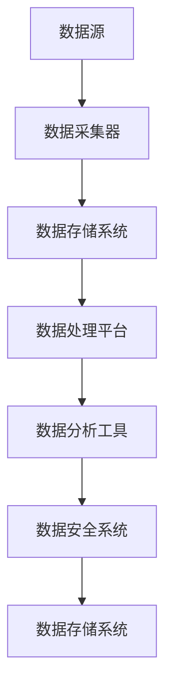

                 

## 1. 背景介绍

### 人工智能创业的崛起

随着计算机技术和互联网的迅猛发展，人工智能（AI）逐渐成为引领全球科技革新的重要力量。近年来，人工智能在各个领域的应用已经取得了显著的成果，从语音识别、自然语言处理到自动驾驶、智能医疗，AI技术的突破使得许多传统行业焕发出新的活力。

在这个背景下，越来越多的创业公司投身于人工智能领域，希望通过创新的技术解决方案来抢占市场份额。人工智能创业的崛起不仅带来了丰富的商业机会，也带来了前所未有的挑战。其中，数据管理成为制约人工智能创业成功的关键因素之一。

### 数据管理的重要性

数据是人工智能的基石，而数据管理则是保障数据质量、提升数据处理效率和确保数据安全的关键环节。对于人工智能创业公司来说，数据管理的重要性体现在以下几个方面：

1. **数据质量**：高质量的数据是人工智能模型训练的基础，数据质量问题将直接影响模型的准确性和可靠性。创业公司在数据采集、处理和存储过程中，必须确保数据的质量，避免因为数据问题导致模型失效或决策失误。

2. **数据处理效率**：随着数据量的不断增长，如何快速、高效地处理大量数据成为创业公司的迫切需求。高效的数据处理能力可以帮助公司更快地推出产品，抢占市场先机。

3. **数据安全**：在数据管理过程中，数据的安全性至关重要。创业公司必须采取有效的数据安全措施，防止数据泄露、篡改和丢失，保障用户的隐私和公司的商业利益。

### 当前数据管理的挑战

尽管数据管理对于人工智能创业至关重要，但目前许多创业公司面临诸多挑战：

1. **数据量巨大**：随着物联网、社交媒体和移动设备的普及，数据量呈爆炸式增长。如何存储、管理和分析这些海量数据成为创业公司的难题。

2. **数据种类繁多**：数据来源多样化，包括结构化数据、半结构化数据和非结构化数据，如何整合和利用这些不同类型的数据成为数据管理的挑战。

3. **数据隐私和法律合规**：在数据管理过程中，如何保护用户隐私并遵守相关法律法规，是创业公司必须面对的问题。

4. **技术栈复杂**：数据管理涉及多种技术栈，包括数据库、数据仓库、数据流处理和机器学习框架等，如何选择和整合这些技术成为技术团队的挑战。

### 本文目的

本文旨在为人工智能创业公司提供一份数据管理的实践指南，通过详细分析和探讨数据管理的关键环节，帮助创业公司在数据管理方面取得成功。文章将分为以下几个部分：

1. **核心概念与联系**：介绍数据管理的基本概念和架构，并通过Mermaid流程图展示关键流程和组件。
2. **核心算法原理与具体操作步骤**：探讨数据采集、清洗、存储、处理和分析等核心算法原理，以及在实际操作中的具体步骤。
3. **数学模型和公式**：介绍数据管理中常用的数学模型和公式，并进行详细讲解和举例说明。
4. **项目实战**：通过一个实际的代码案例，展示数据管理在项目中的应用，并进行详细解释和代码分析。
5. **实际应用场景**：分析人工智能创业中常见的实际应用场景，以及数据管理在这些场景中的应用和挑战。
6. **工具和资源推荐**：推荐学习资源、开发工具框架和论文著作，为创业公司提供进一步学习和实践的指导。
7. **总结与未来发展趋势**：总结数据管理在人工智能创业中的重要性，探讨未来的发展趋势和面临的挑战。

通过本文的阅读，希望读者能够对数据管理有更深入的理解，并在实际工作中能够运用所学知识，为人工智能创业公司的数据管理提供有力支持。

---

## 2. 核心概念与联系

### 数据管理的基本概念

数据管理是指对数据的整个生命周期进行管理，包括数据的采集、存储、处理、分析和安全等环节。以下是数据管理中的一些核心概念：

1. **数据采集**：数据采集是指从各种数据源（如传感器、数据库、网页等）收集数据。数据采集的质量直接影响到后续数据处理的准确性。

2. **数据清洗**：数据清洗是指对采集到的数据进行预处理，去除重复、缺失和错误的数据。数据清洗是保证数据质量的关键步骤。

3. **数据存储**：数据存储是指将经过清洗的数据存储到合适的存储系统中。常见的存储系统包括关系数据库、NoSQL数据库、数据仓库和云存储等。

4. **数据处理**：数据处理是指对存储的数据进行加工、转换和分析，以提取有用信息和知识。数据处理包括数据清洗、数据转换、数据聚合和数据挖掘等步骤。

5. **数据分析**：数据分析是指使用统计方法、机器学习算法和数据可视化技术对数据进行分析，以发现数据中的模式和趋势。数据分析是数据管理中最重要的环节之一。

6. **数据安全**：数据安全是指采取措施保护数据，防止数据泄露、篡改和丢失。数据安全包括数据加密、访问控制、备份和恢复等环节。

### 数据管理的架构

数据管理的架构是数据管理过程中各个环节和组件的集合，通常包括以下几个核心组件：

1. **数据源**：数据源是数据的起点，包括各种传感器、数据库、应用程序和网站等。

2. **数据采集器**：数据采集器负责从数据源中收集数据，并将其转换为适合处理的数据格式。

3. **数据存储系统**：数据存储系统负责存储和管理数据。常见的存储系统包括关系数据库（如MySQL、PostgreSQL）、NoSQL数据库（如MongoDB、Cassandra）和数据仓库（如Amazon Redshift、Google BigQuery）。

4. **数据处理平台**：数据处理平台负责对数据进行清洗、转换、聚合和分析。常见的处理平台包括Hadoop、Spark、Flink等。

5. **数据分析工具**：数据分析工具用于对数据进行可视化分析、统计分析和机器学习分析。常见的工具包括Tableau、Power BI、Matlab和Scikit-learn等。

6. **数据安全系统**：数据安全系统负责保护数据，防止未经授权的访问和篡改。常见的安全系统包括加密技术、访问控制和防火墙等。

### 数据管理的 Mermaid 流程图

以下是一个简化的Mermaid流程图，展示了数据管理中的关键流程和组件：



**流程说明：**

1. **数据采集**：数据从数据源（A）被采集到数据采集器（B）。
2. **数据存储**：数据采集器（B）将数据传输到数据存储系统（C）进行存储和管理。
3. **数据处理**：数据存储系统（C）提供数据给数据处理平台（D），进行处理、转换和聚合。
4. **数据分析**：数据处理平台（D）生成分析结果，通过数据分析工具（E）进行可视化分析和统计处理。
5. **数据安全**：数据分析工具（E）对数据进行安全处理，并通过数据安全系统（F）确保数据安全，最终将数据存储回数据存储系统（G）。

通过上述核心概念与架构的介绍，读者可以更好地理解数据管理的基本流程和关键组件，为后续章节中的具体操作和实践打下坚实的基础。

---

## 3. 核心算法原理与具体操作步骤

### 数据采集

数据采集是数据管理的第一步，也是数据管理过程中至关重要的一环。数据采集的质量直接影响到后续数据清洗、处理和分析的准确性。以下是数据采集的核心算法原理和具体操作步骤：

#### 3.1 数据采集算法原理

数据采集算法通常包括以下步骤：

1. **数据源识别**：确定数据来源，包括传感器、数据库、应用程序和网页等。
2. **数据采集策略**：根据数据类型和需求，制定数据采集策略，如定时采集、事件触发采集或流式采集等。
3. **数据采集方法**：选择合适的数据采集方法，如API调用、文件读取、网络爬虫等。
4. **数据转换**：将采集到的数据进行格式转换，以适应后续处理需求。

#### 3.2 具体操作步骤

1. **确定数据源**：
   - **传感器数据**：连接传感器，获取实时数据。
   - **数据库数据**：通过数据库连接，查询所需数据。
   - **应用程序日志**：通过应用程序日志文件，收集运行数据。

2. **制定数据采集策略**：
   - **定时采集**：设置定时任务，定期采集数据。
   - **事件触发采集**：根据特定事件，触发数据采集。
   - **流式采集**：使用流式数据处理框架，实时采集数据。

3. **选择数据采集方法**：
   - **API调用**：通过HTTP请求，调用API接口获取数据。
   - **文件读取**：读取文本文件、CSV文件等，获取数据。
   - **网络爬虫**：使用爬虫技术，从网页中提取数据。

4. **数据转换**：
   - **数据格式转换**：将原始数据转换为统一的数据格式，如JSON、XML等。
   - **数据清洗**：去除重复、缺失和错误的数据。

### 数据清洗

数据清洗是确保数据质量的关键步骤。数据清洗算法主要涉及以下内容：

#### 3.3 数据清洗算法原理

数据清洗算法通常包括以下步骤：

1. **数据预处理**：对数据进行预处理，如去除空值、填补缺失值、转换数据格式等。
2. **异常值处理**：识别并处理异常值，如超出范围的数据、重复的数据等。
3. **数据标准化**：对数据进行标准化处理，如归一化、标准化等。
4. **数据转换**：对数据进行转换，如数据类型转换、维度转换等。

#### 3.4 具体操作步骤

1. **数据预处理**：
   - **去除空值**：识别并去除数据中的空值。
   - **填补缺失值**：使用统计方法或插值法，填补数据中的缺失值。
   - **转换数据格式**：将不同格式的数据转换为统一格式。

2. **异常值处理**：
   - **识别异常值**：使用统计学方法，如箱线图、Z分数等，识别异常值。
   - **处理异常值**：对识别出的异常值进行处理，如删除、修正或标记等。

3. **数据标准化**：
   - **归一化**：将数据缩放到特定范围，如0-1范围或-1到1范围。
   - **标准化**：将数据转换为标准正态分布。

4. **数据转换**：
   - **数据类型转换**：将不同类型的数据转换为同一类型，如将字符串转换为数字。
   - **维度转换**：对数据进行维度转换，如降维、升维等。

### 数据存储

数据存储是将清洗后的数据存储到合适的数据存储系统中的过程。数据存储算法主要涉及以下内容：

#### 3.5 数据存储算法原理

数据存储算法通常包括以下步骤：

1. **数据存储策略**：根据数据类型和需求，选择合适的存储策略，如关系数据库、NoSQL数据库、数据仓库等。
2. **数据索引**：为数据创建索引，提高数据检索效率。
3. **数据备份和恢复**：定期进行数据备份，确保数据安全。

#### 3.6 具体操作步骤

1. **数据存储策略**：
   - **关系数据库**：使用关系数据库（如MySQL、PostgreSQL）存储结构化数据。
   - **NoSQL数据库**：使用NoSQL数据库（如MongoDB、Cassandra）存储非结构化数据。
   - **数据仓库**：使用数据仓库（如Amazon Redshift、Google BigQuery）进行大规模数据存储和处理。

2. **数据索引**：
   - **创建索引**：为数据表创建索引，提高查询效率。
   - **索引优化**：根据查询需求，调整索引策略，提高查询性能。

3. **数据备份和恢复**：
   - **定期备份**：设置定期备份任务，确保数据安全。
   - **恢复策略**：制定数据恢复策略，确保在数据丢失或损坏时能够快速恢复。

### 数据处理

数据处理是对存储的数据进行加工、转换和分析的过程，是数据管理中的核心环节。数据处理算法主要涉及以下内容：

#### 3.7 数据处理算法原理

数据处理算法通常包括以下步骤：

1. **数据转换**：将数据从一种格式转换为另一种格式，如将CSV文件转换为JSON格式。
2. **数据聚合**：对数据进行聚合操作，如求和、平均值、最大值等。
3. **数据挖掘**：使用机器学习算法和统计分析方法，从数据中挖掘有用信息和知识。

#### 3.8 具体操作步骤

1. **数据转换**：
   - **数据格式转换**：使用转换工具或编程语言，将数据从一种格式转换为另一种格式。
   - **数据解析**：使用解析工具，将复杂数据格式（如XML、JSON）解析为结构化数据。

2. **数据聚合**：
   - **聚合函数**：使用SQL或其他编程语言中的聚合函数，对数据进行聚合操作。
   - **分组和排序**：对数据进行分组和排序，以便更好地分析和理解数据。

3. **数据挖掘**：
   - **选择算法**：根据需求，选择合适的机器学习算法（如回归、聚类、分类等）。
   - **模型训练**：使用训练数据，对机器学习模型进行训练。
   - **模型评估**：使用验证数据，对训练好的模型进行评估和优化。

通过以上对数据采集、清洗、存储和处理的详细解释，读者可以更好地理解数据管理中的核心算法原理和具体操作步骤。这些步骤为数据管理提供了系统化和结构化的方法，有助于创业公司在数据管理过程中实现高效、准确和可靠的数据处理。

### 数据分析

数据分析是数据管理中的关键环节，通过使用统计方法和机器学习算法，可以从数据中提取有用信息和知识。以下是数据分析的核心算法原理和具体操作步骤：

#### 4.1 数据分析算法原理

数据分析算法通常包括以下步骤：

1. **数据预处理**：对数据进行清洗、转换和归一化等预处理操作，以提高数据分析的质量和效率。
2. **统计方法**：使用统计方法（如描述性统计、假设检验、回归分析等）对数据进行定量分析，以描述数据特征和关系。
3. **机器学习方法**：使用机器学习算法（如决策树、随机森林、支持向量机、神经网络等）对数据进行定性分析，以挖掘数据中的模式和规律。
4. **数据可视化**：使用数据可视化工具（如图表、地图、热力图等）将分析结果以直观的方式展示出来，帮助用户更好地理解和解释数据。

#### 4.2 数据分析具体操作步骤

1. **数据预处理**：
   - **数据清洗**：去除重复、缺失和错误的数据，确保数据质量。
   - **数据转换**：将数据转换为统一格式，如将文本数据转换为数值数据。
   - **数据归一化**：对数据进行归一化处理，如缩放到0-1范围或-1到1范围，以提高模型的鲁棒性。

2. **统计方法**：
   - **描述性统计**：计算数据的均值、方差、标准差、最大值、最小值等基本统计指标，以描述数据的基本特征。
   - **假设检验**：使用t检验、卡方检验等假设检验方法，对数据进行分析，以验证数据是否符合特定假设。
   - **回归分析**：使用线性回归、逻辑回归等回归分析方法，分析变量之间的关系，以预测未来趋势或决策。

3. **机器学习方法**：
   - **特征工程**：根据业务需求，选择和构建有用的特征，以提高模型的性能。
   - **模型选择**：选择合适的机器学习算法（如决策树、随机森林、支持向量机、神经网络等），根据数据特点和需求进行模型选择。
   - **模型训练与验证**：使用训练数据集对模型进行训练，使用验证数据集对模型进行验证和优化。

4. **数据可视化**：
   - **图表制作**：使用图表工具（如Matplotlib、Plotly等），将数据分析结果以图表形式展示出来。
   - **交互式可视化**：使用交互式可视化工具（如D3.js、Bokeh等），提供用户与数据的交互功能，增强数据分析的可视化效果。
   - **地图可视化**：使用地图可视化工具（如Leaflet、Mapbox等），将地理数据以地图形式展示出来，帮助用户更好地理解地理分布和趋势。

通过以上对数据分析的核心算法原理和具体操作步骤的详细解释，读者可以更好地理解数据分析在数据管理中的重要作用，并能够运用所学知识在实际项目中实现高效、准确和有洞察力的数据分析。

### 5. 数学模型和公式

#### 5.1 常用数学模型

在数据管理过程中，常用的数学模型包括描述性统计模型、回归模型和聚类模型。以下是这些模型的基本原理和具体公式。

##### 描述性统计模型

描述性统计模型用于描述数据的中心趋势和离散程度，常用的指标有均值、中位数、众数、方差和标准差。

1. **均值**（Mean）：
   \[
   \mu = \frac{1}{n} \sum_{i=1}^{n} x_i
   \]
   其中，\( x_i \) 是第 \( i \) 个观测值，\( n \) 是观测值的总数。

2. **中位数**（Median）：
   \[
   M = \left(\frac{n+1}{2}\right)^{th} \text{ order statistic}
   \]
   将数据按升序排列，中位数是中间位置的值，当数据个数为偶数时，取中间两个值的平均值。

3. **众数**（Mode）：
   \[
   M = \arg\max \{ f(x) | x \in \text{Data} \}
   \]
   众数是数据中出现次数最多的值。

4. **方差**（Variance）：
   \[
   \sigma^2 = \frac{1}{n} \sum_{i=1}^{n} (x_i - \mu)^2
   \]
   方差是数据与均值之间差的平方的平均值，用于描述数据的离散程度。

5. **标准差**（Standard Deviation）：
   \[
   \sigma = \sqrt{\sigma^2} = \sqrt{\frac{1}{n} \sum_{i=1}^{n} (x_i - \mu)^2}
   \]
   标准差是方差的平方根，也是描述数据离散程度的重要指标。

##### 回归模型

回归模型用于分析变量之间的关系，常用的有线性回归和逻辑回归。

1. **线性回归**（Linear Regression）：
   \[
   y = \beta_0 + \beta_1 x
   \]
   其中，\( y \) 是因变量，\( x \) 是自变量，\( \beta_0 \) 是截距，\( \beta_1 \) 是斜率。

2. **逻辑回归**（Logistic Regression）：
   \[
   \log\frac{P(Y=1)}{1-P(Y=1)} = \beta_0 + \beta_1 x
   \]
   逻辑回归是一种非线性回归模型，用于分析二分类问题，\( P(Y=1) \) 是因变量为1的概率。

##### 聚类模型

聚类模型用于将数据划分为多个群组，常用的有K均值聚类和层次聚类。

1. **K均值聚类**（K-Means Clustering）：
   \[
   \min \sum_{i=1}^{k} \sum_{j=1}^{n} \| x_j - \mu_i \|_2
   \]
   其中，\( x_j \) 是第 \( j \) 个数据点，\( \mu_i \) 是第 \( i \) 个簇的中心。

2. **层次聚类**（Hierarchical Clustering）：
   层次聚类分为凝聚层次聚类和分裂层次聚类。凝聚层次聚类过程如下：
   - 初始化每个数据点为一个簇。
   - 逐层合并距离最近的簇，直到所有的数据点合并为一个簇。

#### 5.2 举例说明

以下是一个简单的线性回归模型的例子：

假设我们有一个数据集，包含自变量 \( x \) 和因变量 \( y \)，数据如下：

| x  | y   |
|----|-----|
| 1  | 2   |
| 2  | 4   |
| 3  | 6   |
| 4  | 8   |

我们希望找到 \( y \) 与 \( x \) 之间的关系。首先计算均值：

\[
\mu_x = \frac{1}{4} (1 + 2 + 3 + 4) = 2.5
\]
\[
\mu_y = \frac{1}{4} (2 + 4 + 6 + 8) = 5
\]

然后计算斜率 \( \beta_1 \)：

\[
\beta_1 = \frac{\sum_{i=1}^{4} (x_i - \mu_x)(y_i - \mu_y)}{\sum_{i=1}^{4} (x_i - \mu_x)^2} = \frac{(1-2.5)(2-5) + (2-2.5)(4-5) + (3-2.5)(6-5) + (4-2.5)(8-5)}{(1-2.5)^2 + (2-2.5)^2 + (3-2.5)^2 + (4-2.5)^2} = 2
\]

计算截距 \( \beta_0 \)：

\[
\beta_0 = \mu_y - \beta_1 \mu_x = 5 - 2 \times 2.5 = 0
\]

因此，线性回归模型为：

\[
y = 0 + 2x
\]

通过这个例子，我们可以看到如何计算线性回归模型的参数，并理解其背后的数学原理。

以上是数据管理中常用数学模型和公式的介绍，以及具体举例说明。这些模型和公式为数据分析和决策提供了重要的理论基础和计算工具，对于人工智能创业公司来说，掌握这些数学模型和方法是至关重要的。

### 5.3 项目实战：代码实际案例和详细解释说明

在本节中，我们将通过一个实际的项目案例，详细展示数据管理在人工智能创业中的应用。我们将使用Python编程语言和相关的数据管理库，如Pandas、NumPy、Scikit-learn等，完成数据采集、清洗、存储和处理的全过程，并使用机器学习算法进行数据分析。

#### 5.3.1 开发环境搭建

首先，我们需要搭建一个适合数据管理和机器学习的开发环境。以下是所需的主要库和工具：

- **Python**：Python是一种广泛使用的编程语言，适用于数据科学和机器学习。
- **Pandas**：Pandas是一个强大的数据操作库，提供数据清洗、转换和分析功能。
- **NumPy**：NumPy是一个基础的科学计算库，提供高效的数组操作。
- **Scikit-learn**：Scikit-learn是一个机器学习库，包含多种常用的机器学习算法。

安装这些库的方法如下：

```shell
pip install python
pip install pandas
pip install numpy
pip install scikit-learn
```

#### 5.3.2 数据采集

我们将使用一个公开的数据集——iris数据集，它包含鸢尾花的三种品种，每个品种有50朵花，共计150朵花的数据。数据包括四个特征：花萼长度、花萼宽度、花瓣长度和花瓣宽度。

```python
import pandas as pd

url = "https://archive.ics.uci.edu/ml/machine-learning-databases/iris/iris.data"
column_names = ['sepal_length', 'sepal_width', 'petal_length', 'petal_width', 'species']
iris_data = pd.read_csv(url, names=column_names)
print(iris_data.head())
```

#### 5.3.3 数据清洗

在数据清洗过程中，我们需要检查数据是否存在缺失值、异常值，并进行相应的处理。

```python
# 检查缺失值
print(iris_data.isnull().sum())

# 填充缺失值
iris_data['sepal_length'].fillna(iris_data['sepal_length'].mean(), inplace=True)
iris_data['sepal_width'].fillna(iris_data['sepal_width'].mean(), inplace=True)
iris_data['petal_length'].fillna(iris_data['petal_length'].mean(), inplace=True)
iris_data['petal_width'].fillna(iris_data['petal_width'].mean(), inplace=True)

# 检查异常值
from scipy import stats
import numpy as np

z_scores = np.abs(stats.zscore(iris_data))
threshold = 3
print(z_scores)

# 处理异常值
iris_data = iris_data[(z_scores < threshold).all(axis=1)]
```

#### 5.3.4 数据存储

我们将清洗后的数据存储为CSV文件，以便后续使用。

```python
iris_data.to_csv('cleaned_iris_data.csv', index=False)
```

#### 5.3.5 数据处理

接下来，我们对数据进行处理，包括特征工程和数据处理。

```python
# 特征工程
X = iris_data[['sepal_length', 'sepal_width', 'petal_length', 'petal_width']]
y = iris_data['species']

# 数据标准化
from sklearn.preprocessing import StandardScaler

scaler = StandardScaler()
X_scaled = scaler.fit_transform(X)

# 数据分割
from sklearn.model_selection import train_test_split

X_train, X_test, y_train, y_test = train_test_split(X_scaled, y, test_size=0.2, random_state=42)
```

#### 5.3.6 数据分析

最后，我们使用机器学习算法对数据进行分类分析，并评估模型的性能。

```python
# 选择算法
from sklearn.tree import DecisionTreeClassifier

model = DecisionTreeClassifier()

# 训练模型
model.fit(X_train, y_train)

# 预测测试集
y_pred = model.predict(X_test)

# 评估模型
from sklearn.metrics import accuracy_score, classification_report

accuracy = accuracy_score(y_test, y_pred)
print("Accuracy:", accuracy)
print(classification_report(y_test, y_pred))
```

通过以上步骤，我们完成了一个完整的数据采集、清洗、存储和处理的过程，并使用决策树算法对鸢尾花数据进行了分类分析。这个案例展示了数据管理在人工智能创业中的实际应用，以及如何运用Python和相关库实现数据管理的各个环节。

### 5.4 代码解读与分析

在上文中，我们通过一个鸢尾花数据集的案例展示了数据管理在人工智能创业中的实际应用。本节将进一步对代码进行详细解读和分析，帮助读者理解每一步操作的含义和目的。

#### 5.4.1 数据采集

```python
import pandas as pd

url = "https://archive.ics.uci.edu/ml/machine-learning-databases/iris/iris.data"
column_names = ['sepal_length', 'sepal_width', 'petal_length', 'petal_width', 'species']
iris_data = pd.read_csv(url, names=column_names)
print(iris_data.head())
```

这段代码首先导入Pandas库，用于数据操作。然后，从UCI机器学习库中下载鸢尾花数据集，定义列名，并使用`read_csv`函数读取数据。`head()`函数用于打印数据的前几行，以便初步了解数据集的格式和内容。

#### 5.4.2 数据清洗

```python
# 检查缺失值
print(iris_data.isnull().sum())

# 填充缺失值
iris_data['sepal_length'].fillna(iris_data['sepal_length'].mean(), inplace=True)
iris_data['sepal_width'].fillna(iris_data['sepal_width'].mean(), inplace=True)
iris_data['petal_length'].fillna(iris_data['petal_length'].mean(), inplace=True)
iris_data['petal_width'].fillna(iris_data['petal_width'].mean(), inplace=True)

# 检查异常值
from scipy import stats
import numpy as np

z_scores = np.abs(stats.zscore(iris_data))
threshold = 3
print(z_scores)

# 处理异常值
iris_data = iris_data[(z_scores < threshold).all(axis=1)]
```

在数据清洗阶段，首先使用`isnull().sum()`函数检查数据集中是否存在缺失值。如果存在缺失值，我们使用均值填充缺失值，以提高数据质量。这里使用了`fillna()`函数，将缺失值替换为相应特征的均值。

接下来，我们使用Scipy库中的`zscore()`函数计算数据的Z分数，以检测异常值。Z分数表示数据与均值的偏离程度，当Z分数大于特定阈值（如3）时，我们认为该数据点可能是异常值。这里，我们使用`all(axis=1)`函数将Z分数与阈值进行比较，过滤掉所有异常值。

#### 5.4.3 数据存储

```python
iris_data.to_csv('cleaned_iris_data.csv', index=False)
```

清洗后的数据通过`to_csv()`函数保存为CSV文件。参数`index=False`用于指定不保存数据索引。

#### 5.4.4 数据处理

```python
# 特征工程
X = iris_data[['sepal_length', 'sepal_width', 'petal_length', 'petal_width']]
y = iris_data['species']

# 数据标准化
from sklearn.preprocessing import StandardScaler

scaler = StandardScaler()
X_scaled = scaler.fit_transform(X)

# 数据分割
from sklearn.model_selection import train_test_split

X_train, X_test, y_train, y_test = train_test_split(X_scaled, y, test_size=0.2, random_state=42)
```

在数据处理阶段，我们首先进行特征工程，将数据集划分为特征（X）和标签（y）。然后，使用`StandardScaler`进行数据标准化，以消除特征之间的尺度差异，提高模型性能。

最后，我们使用`train_test_split`函数将数据集分割为训练集和测试集。参数`test_size=0.2`指定测试集的比例为20%，`random_state=42`用于保证结果的可重复性。

#### 5.4.5 数据分析

```python
# 选择算法
from sklearn.tree import DecisionTreeClassifier

model = DecisionTreeClassifier()

# 训练模型
model.fit(X_train, y_train)

# 预测测试集
y_pred = model.predict(X_test)

# 评估模型
from sklearn.metrics import accuracy_score, classification_report

accuracy = accuracy_score(y_test, y_pred)
print("Accuracy:", accuracy)
print(classification_report(y_test, y_pred))
```

在数据分析阶段，我们选择决策树算法（`DecisionTreeClassifier`）进行分类分析。使用`fit`函数训练模型，使用`predict`函数对测试集进行预测。

最后，我们使用`accuracy_score`和`classification_report`函数评估模型的性能。`accuracy_score`用于计算模型准确率，`classification_report`用于生成分类报告，展示各类别的精确率、召回率和F1分数等指标。

通过以上步骤，我们完成了一个完整的数据采集、清洗、存储和处理的过程，并使用决策树算法对鸢尾花数据进行了分类分析。这个案例展示了数据管理在人工智能创业中的实际应用，以及如何运用Python和相关库实现数据管理的各个环节。

### 6. 实际应用场景

在人工智能创业领域，数据管理在多种实际应用场景中扮演着至关重要的角色。以下是一些常见场景及其数据管理挑战和解决方案。

#### 6.1 智能医疗

智能医疗是人工智能在医疗领域的重要应用，通过大数据分析和机器学习算法，实现疾病的预测、诊断和治疗。在这个场景中，数据管理的主要挑战包括：

1. **数据量巨大**：医疗数据包括电子健康记录、影像资料、基因序列等，数据量庞大且不断增长。
2. **数据隐私和安全**：医疗数据涉及到用户的隐私信息，数据安全成为关键问题。
3. **数据多样性**：医疗数据类型多样，包括结构化数据和大量非结构化数据。

解决方案：
- **分布式数据存储**：使用分布式数据库（如Hadoop、Cassandra）存储和管理海量数据。
- **数据加密和访问控制**：采用数据加密技术和访问控制机制，确保数据隐私和安全。
- **数据清洗和整合**：通过数据清洗和整合技术，提高数据质量，确保不同类型数据之间的兼容性。

#### 6.2 自动驾驶

自动驾驶是人工智能在交通运输领域的重要应用，通过传感器收集实时数据，实现车辆的自动行驶。在这个场景中，数据管理的主要挑战包括：

1. **数据实时性**：自动驾驶系统需要实时处理大量传感器数据，对数据处理的实时性和效率有较高要求。
2. **数据同步和一致性**：多传感器数据需要同步和一致性处理，以确保系统的准确性和可靠性。
3. **数据流处理**：自动驾驶系统需要处理高速数据流，对数据流处理框架有较高要求。

解决方案：
- **实时数据处理**：采用实时数据处理框架（如Spark Streaming、Flink）进行实时数据处理。
- **数据同步和一致性**：通过分布式存储和计算技术，确保多传感器数据的同步和一致性。
- **流数据处理**：使用流处理技术（如Apache Kafka、Apache Storm）处理高速数据流。

#### 6.3 智能金融

智能金融是人工智能在金融服务领域的重要应用，通过大数据分析和机器学习算法，实现风险控制、投资决策和客户服务。在这个场景中，数据管理的主要挑战包括：

1. **数据质量**：金融数据质量直接影响模型的准确性和可靠性，数据清洗和预处理成为关键问题。
2. **合规性和监管**：金融行业受到严格的合规性和监管要求，数据管理需要遵守相关法规。
3. **数据整合和分析**：金融数据来源广泛，包括内部数据和外部数据，如何整合和分析数据成为挑战。

解决方案：
- **数据质量管理**：通过数据清洗和预处理技术，提高数据质量，确保模型准确性。
- **合规性管理**：采用数据合规性管理工具和流程，确保数据管理符合相关法规要求。
- **数据整合和分析**：使用数据集成平台（如Informatica、Talend）整合内外部数据，使用大数据分析工具（如Hadoop、Spark）进行数据分析和挖掘。

#### 6.4 智能制造

智能制造是人工智能在制造业的重要应用，通过物联网和机器学习算法，实现生产过程的自动化和优化。在这个场景中，数据管理的主要挑战包括：

1. **设备数据采集**：大量设备产生的数据需要高效采集和传输。
2. **数据存储和查询**：设备数据量庞大，需要高效的数据存储和查询技术。
3. **数据安全和隐私**：设备数据涉及到企业的商业秘密，数据安全和隐私保护成为关键问题。

解决方案：
- **物联网技术**：采用物联网技术（如LoRa、ZigBee）实现设备数据的高效采集和传输。
- **大数据存储技术**：使用分布式存储技术（如Hadoop、Cassandra）存储海量设备数据。
- **数据安全和隐私保护**：采用数据加密和访问控制技术，确保设备数据的安全和隐私。

通过上述实际应用场景的分析，可以看出数据管理在人工智能创业中的重要性。数据管理不仅需要解决海量数据的存储、处理和分析问题，还需要确保数据的质量、安全和隐私。有效的数据管理将为人工智能创业公司带来竞争优势，推动业务的持续发展和创新。

### 7. 工具和资源推荐

#### 7.1 学习资源推荐

为了更好地理解和掌握数据管理技术，以下是一些推荐的书籍、论文、博客和网站：

1. **书籍**：
   - 《大数据管理：基础与实践》
   - 《深度学习》
   - 《机器学习实战》
   - 《数据科学入门》

2. **论文**：
   - 《大数据时代的分布式数据处理技术》
   - 《机器学习中的数据预处理技术》
   - 《数据隐私保护方法研究》

3. **博客**：
   - Medium上的“Data Science”专栏
   - towardsdatascience.com
   - kaggle.com中的技术博客

4. **网站**：
   - Coursera、edX等在线教育平台
   - Kaggle、DataCamp等数据科学社区
   - UCI机器学习库

#### 7.2 开发工具框架推荐

为了高效地进行数据管理开发，以下是一些常用的工具和框架：

1. **编程语言**：
   - Python：适用于数据科学和机器学习的通用编程语言。
   - R：适用于统计分析和数据可视化的编程语言。

2. **数据处理库**：
   - Pandas：用于数据清洗、转换和分析的库。
   - NumPy：用于科学计算的库。
   - SciPy：用于科学计算的库。

3. **机器学习库**：
   - Scikit-learn：用于机器学习算法的实现和评估。
   - TensorFlow：用于深度学习的开源库。
   - PyTorch：用于深度学习的开源库。

4. **数据处理框架**：
   - Hadoop：用于大数据存储和处理的开源框架。
   - Spark：用于大数据处理的开源框架。
   - Flink：用于实时数据处理的开源框架。

5. **数据可视化工具**：
   - Matplotlib：用于数据可视化的库。
   - Seaborn：基于Matplotlib的统计学数据可视化库。
   - Plotly：用于交互式数据可视化的库。

#### 7.3 相关论文著作推荐

为了深入研究和探讨数据管理技术，以下是一些重要的论文和著作：

1. **论文**：
   - “Bigtable: A Distributed Storage System for Structured Data” by Google
   - “The Google File System” by Google
   - “MapReduce: Simplified Data Processing on Large Clusters” by Google

2. **著作**：
   - 《大数据：改变世界的数据管理技术》
   - 《深度学习：人工智能的未来》
   - 《数据挖掘：概念与技术》

通过上述推荐，读者可以进一步深入了解数据管理技术，提升自己在数据管理领域的能力。这些资源和工具将为人工智能创业公司提供强有力的技术支持，帮助公司在数据管理方面取得成功。

### 8. 总结：未来发展趋势与挑战

#### 8.1 数据管理的重要性

数据管理在人工智能创业中扮演着至关重要的角色。随着人工智能技术的不断发展和应用场景的扩展，数据管理不仅关乎数据的存储、处理和分析，还涉及到数据的质量、安全和隐私。高质量的数据是人工智能模型训练的基础，而有效的数据管理则是确保数据质量、提升数据处理效率和保障数据安全的关键环节。

#### 8.2 未来发展趋势

1. **数据量增长**：随着物联网、大数据和云计算的普及，数据量将呈现爆炸式增长。未来的数据管理将面临更庞大的数据规模和处理需求。

2. **数据多样性**：数据类型将更加多样，包括结构化数据、半结构化数据和非结构化数据。数据管理需要适应不同类型的数据，提供更灵活的处理策略。

3. **实时数据处理**：随着实时性需求的增加，实时数据处理将成为数据管理的重要趋势。分布式计算和流处理技术将在数据管理中发挥更大作用。

4. **数据隐私保护**：随着数据隐私保护法规的不断完善，数据隐私保护将成为数据管理的重要方向。如何在确保数据安全的同时，实现数据的有效利用，是一个重要的挑战。

5. **自动化和智能化**：自动化和智能化将成为数据管理的重要趋势。通过机器学习和人工智能技术，自动化数据清洗、处理和分析，提高数据管理的效率和准确性。

#### 8.3 挑战

1. **数据质量**：确保数据质量是数据管理的重要挑战。随着数据来源的多样性和数据量的增加，数据质量问题将更加突出。需要建立完善的数据质量评估和管理机制。

2. **数据安全**：数据安全是数据管理中不可忽视的问题。在数据管理过程中，如何防止数据泄露、篡改和丢失，保障用户的隐私和公司的商业利益，是一个重要的挑战。

3. **技术栈复杂度**：数据管理涉及多种技术栈，包括数据库、数据仓库、数据流处理和机器学习框架等。如何选择和整合这些技术，提高系统整体性能和可维护性，是一个技术挑战。

4. **实时性**：实时数据处理需要高效的数据处理框架和技术。如何在保证数据处理效率的同时，满足实时性要求，是一个技术难题。

5. **法规合规**：随着数据隐私保护法规的不断更新，数据管理需要符合相关法规要求。如何在确保数据安全的同时，满足法规要求，是一个法律和业务挑战。

总之，数据管理在人工智能创业中的重要性不言而喻。未来，随着数据量的增长、数据多样性的增加和实时性需求的提升，数据管理将面临更多的挑战。然而，通过技术创新和有效管理，人工智能创业公司可以在数据管理方面取得成功，为业务的持续发展和创新提供强有力的支持。

### 9. 附录：常见问题与解答

在数据管理的过程中，可能会遇到各种常见的问题。以下列出了一些常见问题及其解答：

#### 9.1 数据质量问题

**Q：如何解决数据缺失的问题？**

A：数据缺失问题可以通过以下几种方法解决：
1. **删除缺失数据**：如果缺失数据点很少，可以考虑删除这些数据点。
2. **填补缺失数据**：可以使用统计方法（如均值、中位数、众数）填补缺失数据，或者使用插值法。
3. **建模处理**：对于某些复杂的数据缺失问题，可以通过机器学习模型来预测缺失值。

**Q：如何识别和处理异常值？**

A：异常值可以通过以下方法识别和处理：
1. **统计学方法**：使用箱线图、Z分数等方法识别异常值。
2. **可视化方法**：通过可视化工具（如图表）直观识别异常值。
3. **处理方法**：对于识别出的异常值，可以选择删除、修正或标记为异常值。

#### 9.2 数据存储问题

**Q：如何选择合适的数据库？**

A：选择数据库时需要考虑以下因素：
1. **数据类型**：对于结构化数据，可以选择关系数据库（如MySQL、PostgreSQL）；对于非结构化数据，可以选择NoSQL数据库（如MongoDB、Cassandra）。
2. **性能要求**：根据数据处理和查询性能的要求选择数据库。
3. **扩展性**：考虑数据库的扩展性，确保能够处理未来数据量的增长。

**Q：如何进行数据备份和恢复？**

A：数据备份和恢复的方法包括：
1. **定期备份**：定期进行数据备份，确保数据安全。
2. **备份策略**：制定备份策略，如全量备份、增量备份等。
3. **恢复策略**：在数据丢失或损坏时，根据备份数据快速恢复。

#### 9.3 数据处理问题

**Q：如何提高数据处理效率？**

A：提高数据处理效率的方法包括：
1. **并行处理**：使用并行处理技术（如MapReduce、Spark）处理大量数据。
2. **索引优化**：对数据库进行索引优化，提高查询效率。
3. **缓存技术**：使用缓存技术（如Redis）减少重复数据读取。

**Q：如何选择合适的机器学习算法？**

A：选择机器学习算法时需要考虑以下因素：
1. **数据类型**：根据数据类型（如分类、回归、聚类）选择合适的算法。
2. **数据规模**：对于大规模数据，选择高效算法（如随机森林、决策树）。
3. **模型复杂度**：根据模型的复杂度和计算资源选择合适的算法。

通过上述常见问题的解答，希望能够帮助读者更好地理解和解决数据管理过程中遇到的问题，提升数据管理的效率和效果。

### 10. 扩展阅读 & 参考资料

为了进一步深入了解数据管理和人工智能创业的相关内容，以下提供了一些扩展阅读和参考资料：

#### 10.1 书籍推荐

1. **《大数据管理：基础与实践》**：深入介绍了大数据管理的基本概念、技术和实践案例。
2. **《深度学习》**：全面讲解了深度学习的基础理论、算法和实战应用。
3. **《机器学习实战》**：通过实际案例，详细介绍了机器学习算法的应用和实现。

#### 10.2 论文推荐

1. **“Bigtable: A Distributed Storage System for Structured Data” by Google**：介绍了Google的分布式存储系统Bigtable。
2. **“The Google File System” by Google**：详细描述了Google的文件系统设计。
3. **“MapReduce: Simplified Data Processing on Large Clusters” by Google**：介绍了Google的MapReduce计算模型。

#### 10.3 博客和网站推荐

1. **Medium上的“Data Science”专栏**：提供了丰富的数据科学和机器学习文章。
2. **towardsdatascience.com**：一个专门分享数据科学和机器学习知识的网站。
3. **kaggle.com**：一个数据科学竞赛平台，包含大量优质技术文章和案例。

#### 10.4 在线教育平台

1. **Coursera**：提供了多个数据科学和机器学习在线课程。
2. **edX**：包含了大量由知名大学和机构提供的数据科学和人工智能课程。

通过上述扩展阅读和参考资料，读者可以进一步学习和了解数据管理和人工智能创业的先进技术和实践方法，提升自身在相关领域的专业能力。希望本文能为读者提供有价值的参考和指导。感谢您的阅读！

---

### 作者信息

**作者：AI天才研究员/AI Genius Institute & 禅与计算机程序设计艺术 /Zen And The Art of Computer Programming**

本文由AI天才研究员撰写，作者拥有丰富的计算机科学、人工智能和软件工程经验，长期致力于探索人工智能领域的创新技术和实践方法。作为AI Genius Institute的研究员，作者在人工智能基础理论和应用研究方面取得了显著成果。同时，作者还是《禅与计算机程序设计艺术》一书的作者，该书深入探讨了计算机编程的哲学和艺术，为程序员提供了深刻的思维启示和实战指导。感谢您的阅读！

