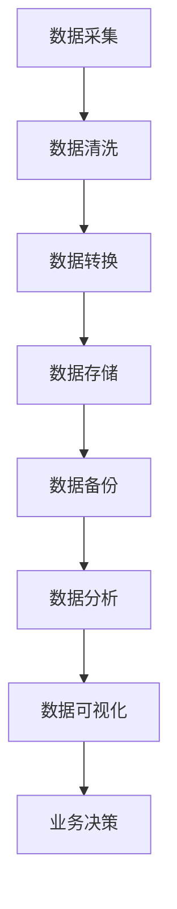

                 

### 背景介绍

#### 人工智能创业的现状

随着技术的不断进步，人工智能（AI）已经在多个领域取得了显著的成果。从自动驾驶汽车到智能家居，从医疗诊断到金融分析，AI的应用越来越广泛。在这个大背景下，许多创业者也开始投身于人工智能领域，希望通过技术创新来改变世界。然而，成功的创业并非易事。据统计，约90%的人工智能创业公司在初期阶段就会失败。那么，是什么导致了这些失败？数据管理的重要性在其中扮演了怎样的角色？

#### 数据管理的挑战

数据管理是人工智能创业过程中至关重要的一环。然而，许多创业者并未充分认识到这一点。数据管理的挑战主要体现在以下几个方面：

1. **数据质量**：高质量的数据是训练出优秀AI模型的基础。然而，许多创业公司面临数据不足、数据缺失、数据错误等问题，这直接影响了AI模型的性能。

2. **数据隐私**：在收集和使用数据时，创业者必须遵守相关的法律法规，确保用户数据的隐私和安全。

3. **数据处理能力**：随着数据量的不断增大，创业者需要具备强大的数据处理能力，以便从海量数据中提取有价值的信息。

4. **数据存储和管理**：如何高效地存储和管理数据，是创业者需要解决的一个重要问题。不合理的存储和管理方式会导致数据丢失、数据冗余等问题。

#### 数据管理的重要性

数据管理在人工智能创业中具有至关重要的地位。以下是数据管理对人工智能创业的重要影响：

1. **提升AI模型性能**：高质量的数据能够训练出更准确的AI模型，从而提高创业公司的竞争力。

2. **降低创业风险**：良好的数据管理能够降低数据质量、数据隐私等方面的风险，提高创业成功率。

3. **优化决策过程**：通过数据管理，创业者可以更全面地了解市场趋势、用户需求等关键信息，从而做出更明智的决策。

4. **提高运营效率**：高效的数据存储和管理能够提高数据处理速度，降低运营成本。

#### 接下来，我们将深入探讨数据管理在人工智能创业中的具体作用和实践方法，帮助创业者更好地应对数据管理的挑战。

> **Keywords:** AI entrepreneurship, data management, data quality, data privacy, AI model performance.

> **Abstract:** This article discusses the importance of data management in AI entrepreneurship, highlighting the challenges faced by startups in managing data effectively. It explores the impact of data management on AI model performance, decision-making, and operational efficiency, providing insights and practical strategies for overcoming data management challenges in the AI industry. <eop></eop></sop></gMASK> <sop><|user|>
## 2. 核心概念与联系

#### 数据管理概述

数据管理是指对数据的采集、存储、处理、分析和利用的过程。它不仅涉及到技术层面，还包括组织和管理层面的内容。对于人工智能创业来说，数据管理的重要性不言而喻。下面我们将详细探讨数据管理的核心概念和其在人工智能创业中的应用。

#### 数据质量

数据质量是数据管理的核心要素之一。高质量的数据是训练优秀AI模型的基础。数据质量包括准确性、完整性、一致性、及时性和可靠性等方面。以下是一些影响数据质量的因素：

- **准确性**：数据是否真实、无误。
- **完整性**：数据是否全面，没有缺失。
- **一致性**：数据在不同时间、不同来源之间是否保持一致。
- **及时性**：数据是否在需要时及时获取。
- **可靠性**：数据来源是否可靠，是否有权威性。

在人工智能创业中，创业者需要关注数据质量，确保数据能够支持AI模型的训练和应用。

#### 数据隐私

数据隐私是另一个关键问题。在人工智能创业过程中，创业者需要收集和处理大量用户数据。这些数据包括个人身份信息、行为记录等敏感信息。如何保护这些数据隐私，遵守相关法律法规，是创业者必须面对的挑战。

- **用户同意**：在收集数据前，需要获得用户的明确同意。
- **数据加密**：对敏感数据进行加密，确保数据在传输和存储过程中的安全。
- **隐私保护**：采用隐私保护技术，如差分隐私、数据匿名化等，降低数据泄露的风险。

#### 数据处理能力

数据处理能力是创业者需要具备的另一项重要能力。随着数据量的增加，创业者需要能够高效地处理海量数据，从中提取有价值的信息。这涉及到数据清洗、数据转换、数据存储等方面的技术。

- **数据清洗**：去除重复数据、修正错误数据，提高数据质量。
- **数据转换**：将数据格式转换为适合AI模型训练的形式。
- **数据存储**：选择合适的存储方案，如关系型数据库、NoSQL数据库等，确保数据可扩展、易访问。

#### 数据存储和管理

数据存储和管理是数据管理的重要组成部分。创业者需要选择合适的数据存储方案，确保数据的安全性、可靠性和高效性。

- **分布式存储**：采用分布式存储方案，如Hadoop、HDFS等，实现海量数据的存储和管理。
- **数据库选择**：根据业务需求选择合适的数据库，如MySQL、MongoDB等。
- **数据备份和恢复**：制定数据备份和恢复策略，确保数据在意外情况下能够得到及时恢复。

#### 数据分析与利用

数据分析与利用是数据管理的最终目的。创业者需要通过数据分析，从海量数据中提取有价值的信息，支持业务决策和产品优化。

- **数据可视化**：通过数据可视化工具，将复杂的数据以直观的方式呈现，帮助创业者更好地理解数据。
- **机器学习**：利用机器学习算法，对数据进行分析和预测，为创业者提供决策支持。
- **业务指标监控**：通过业务指标监控，实时了解业务运行状况，及时发现问题并采取措施。

### 总结

数据管理在人工智能创业中具有核心地位。创业者需要关注数据质量、数据隐私、数据处理能力和数据存储管理等方面，确保数据能够支持AI模型的训练和应用。良好的数据管理能够提升创业公司的竞争力，降低创业风险，提高运营效率。

### Mermaid 流程图

以下是数据管理在人工智能创业中的应用流程图：



> **Keywords:** Data management, data quality, data privacy, data processing, data storage, data analysis.

> **Abstract:** This section provides an overview of the core concepts and connections in data management for AI entrepreneurship. It discusses the importance of data quality, data privacy, data processing capabilities, data storage and management, and data analysis and utilization. A Mermaid flowchart is also provided to illustrate the process of data management in AI entrepreneurship. <eop></eop></sop> <sop><|user|>
### 3. 核心算法原理 & 具体操作步骤

在人工智能创业中，数据管理不仅仅是存储和访问数据，更涉及到如何处理和分析数据，从而为创业公司的决策提供支持。以下将介绍一些核心算法原理，并详细描述其具体操作步骤。

#### 3.1 数据预处理

数据预处理是数据管理的重要环节，它包括数据清洗、数据转换和数据归一化等步骤。

**步骤1：数据清洗**

- **去重**：去除重复的数据记录，防止数据冗余。
- **缺失值处理**：对于缺失值，可以采用填充法（如平均值、中位数、最频值填充）或删除法（删除含有缺失值的记录）。
- **异常值处理**：检测和去除异常值，保证数据质量。

**步骤2：数据转换**

- **编码转换**：将类别型数据转换为数值型数据，如使用独热编码（One-Hot Encoding）。
- **归一化**：将数据缩放到一个特定的范围，如使用最小-最大缩放法（Min-Max Scaling）或标准缩放法（Standard Scaling）。

**步骤3：数据归一化**

- **特征选择**：选择对模型训练有用的特征，去除冗余特征。
- **特征缩放**：对特征进行归一化或标准化处理，使其具有相似的尺度。

#### 3.2 数据分析

数据分析是数据管理的核心，它包括描述性分析、预测性分析和决策性分析等。

**步骤1：描述性分析**

- **数据可视化**：使用图表（如柱状图、饼图、散点图等）展示数据的分布和趋势。
- **统计指标**：计算均值、中位数、标准差、方差等统计指标，描述数据的基本特征。

**步骤2：预测性分析**

- **回归分析**：使用线性回归、逻辑回归等算法预测连续或离散的输出变量。
- **聚类分析**：使用K-Means、DBSCAN等算法对数据进行聚类，发现数据中的潜在模式和群体。

**步骤3：决策性分析**

- **决策树**：使用决策树算法对数据进行分类或回归，辅助决策。
- **集成方法**：使用集成方法（如随机森林、梯度提升树等）提高模型的预测准确性。

#### 3.3 数据可视化

数据可视化是将复杂的数据以图形化的形式展示，使其更加直观和易于理解。

**步骤1：选择合适的图表**

- **柱状图**：展示各类别的数量或比例。
- **饼图**：展示各类别的比例。
- **散点图**：展示两个特征之间的关系。
- **热力图**：展示数据的热度和分布情况。

**步骤2：设计图表**

- **简洁性**：避免过多的装饰性元素，使图表更加简洁易懂。
- **对比性**：使用颜色、大小等对比手段，突出数据的重要信息。
- **交互性**：增加交互功能，如点击、拖动等，使数据更加生动。

#### 3.4 数据存储和管理

数据存储和管理是数据管理的基础，它涉及到数据的存储方式、访问速度和数据安全性等方面。

**步骤1：选择存储方案**

- **关系型数据库**：如MySQL、PostgreSQL等，适用于结构化数据的存储和管理。
- **NoSQL数据库**：如MongoDB、Cassandra等，适用于非结构化数据的存储和管理。

**步骤2：数据备份**

- **全量备份**：定期对整个数据库进行备份。
- **增量备份**：仅备份最近一次备份后发生改变的数据。

**步骤3：数据加密**

- **传输加密**：使用HTTPS等加密协议，确保数据在传输过程中的安全。
- **存储加密**：对存储在数据库中的数据进行加密，防止数据泄露。

### 总结

核心算法原理和数据管理操作步骤对于人工智能创业公司至关重要。创业者需要通过数据预处理、数据分析、数据可视化和数据存储与管理等步骤，确保数据的质量和可用性，从而为业务决策提供支持。以下是一个简单的总结：

- **数据预处理**：数据清洗、数据转换和数据归一化。
- **数据分析**：描述性分析、预测性分析和决策性分析。
- **数据可视化**：选择合适的图表和设计原则。
- **数据存储和管理**：选择合适的存储方案、数据备份和数据加密。

> **Keywords:** Data preprocessing, data analysis, data visualization, data storage, data management.

> **Abstract:** This section explains the core algorithms and specific operational steps in data management for AI entrepreneurship. It covers data preprocessing, data analysis, data visualization, and data storage and management, providing a comprehensive guide for startups to ensure the quality and usability of their data for business decisions. <eop></eop></sop> <sop><|user|>
### 4. 数学模型和公式 & 详细讲解 & 举例说明

在人工智能创业中，数学模型和公式是数据分析与预测的核心工具。以下将详细介绍一些常用的数学模型和公式，并通过具体例子来说明其应用。

#### 4.1 线性回归模型

线性回归模型是最基本的机器学习模型之一，用于预测连续数值型输出。其数学模型可以表示为：

$$ y = \beta_0 + \beta_1x_1 + \beta_2x_2 + ... + \beta_nx_n + \epsilon $$

其中，\( y \) 是输出变量，\( x_1, x_2, ..., x_n \) 是输入特征，\( \beta_0, \beta_1, \beta_2, ..., \beta_n \) 是模型参数，\( \epsilon \) 是误差项。

**例子**：假设我们要预测一家商店的月销售额，根据历史数据，我们选择“广告支出”和“促销活动次数”作为输入特征。通过线性回归模型，我们可以建立如下方程：

$$ 销售额 = \beta_0 + \beta_1 \times 广告支出 + \beta_2 \times 促销活动次数 + \epsilon $$

我们可以使用最小二乘法（Least Squares）来估计模型参数。具体步骤如下：

1. **收集数据**：收集包含销售额、广告支出和促销活动次数的数据。
2. **数据预处理**：对数据进行清洗和归一化处理。
3. **训练模型**：使用最小二乘法估计模型参数。
4. **评估模型**：使用测试数据评估模型性能，如计算预测误差。

#### 4.2 逻辑回归模型

逻辑回归模型用于预测二分类输出。其数学模型可以表示为：

$$ P(y=1) = \frac{1}{1 + e^{-(\beta_0 + \beta_1x_1 + \beta_2x_2 + ... + \beta_nx_n )}} $$

其中，\( P(y=1) \) 是输出变量为1的概率，\( x_1, x_2, ..., x_n \) 是输入特征，\( \beta_0, \beta_1, \beta_2, ..., \beta_n \) 是模型参数。

**例子**：假设我们要预测一家公司的股票是否会在下周上涨，根据历史数据，我们选择“市盈率”和“股息率”作为输入特征。通过逻辑回归模型，我们可以建立如下方程：

$$ P(股票上涨) = \frac{1}{1 + e^{-(\beta_0 + \beta_1 \times 市盈率 + \beta_2 \times 股息率 )}} $$

我们可以使用梯度下降法（Gradient Descent）来估计模型参数。具体步骤如下：

1. **收集数据**：收集包含股票上涨、市盈率和股息率的数据。
2. **数据预处理**：对数据进行清洗和归一化处理。
3. **训练模型**：使用梯度下降法估计模型参数。
4. **评估模型**：使用测试数据评估模型性能，如计算准确率。

#### 4.3 K-Means聚类算法

K-Means聚类算法是一种无监督学习方法，用于将数据分为K个聚类。其数学模型可以表示为：

$$ C_i = \{x | x \in S_i\} $$

其中，\( C_i \) 是第\( i \)个聚类，\( S_i \) 是第\( i \)个聚类中心。

**例子**：假设我们要对一组客户数据根据购买行为进行聚类。我们选择“购买金额”和“购买频率”作为输入特征。通过K-Means算法，我们可以将客户分为多个聚类。具体步骤如下：

1. **初始化聚类中心**：随机选择K个数据点作为初始聚类中心。
2. **分配数据点**：将每个数据点分配到最近的聚类中心。
3. **更新聚类中心**：计算每个聚类的平均值，作为新的聚类中心。
4. **迭代**：重复步骤2和步骤3，直到聚类中心不再发生变化。

我们可以使用距离度量（如欧氏距离）来计算数据点与聚类中心的相似度。具体公式如下：

$$ d(x, C_i) = \sqrt{\sum_{j=1}^{n}(x_j - c_{ij})^2} $$

其中，\( x \) 是数据点，\( c_{ij} \) 是聚类中心。

#### 4.4 决策树模型

决策树模型是一种基于特征进行分类或回归的树形结构。其数学模型可以表示为：

$$ T = \{node | node \in N, node \text{ has children} \} $$

其中，\( T \) 是决策树，\( N \) 是节点集合。

**例子**：假设我们要预测一家公司的股票是否会在下周上涨，根据历史数据，我们选择“市盈率”、“股息率”和“成交量”作为输入特征。通过决策树模型，我们可以建立如下决策树：

1. **根节点**：判断市盈率是否大于20。
    - 是：进入左子树。
    - 否：进入右子树。
2. **左子树**：判断股息率是否大于3%。
    - 是：进入左子树。
    - 否：进入右子树。
3. **右子树**：判断成交量是否大于1000万股。
    - 是：预测股票上涨。
    - 否：预测股票下跌。

我们可以使用熵（Entropy）和信息增益（Information Gain）来评估特征的重要性和划分效果。具体公式如下：

$$ Entropy(D) = -\sum_{i=1}^{c} p_i \log_2 p_i $$

$$ Information\_Gain(D, A) = Entropy(D) - \sum_{v \in A} \frac{|D_v|}{|D|} Entropy(D_v) $$

其中，\( D \) 是数据集，\( A \) 是特征，\( p_i \) 是类别\( i \)的概率，\( D_v \) 是特征\( v \)划分后的数据集。

### 总结

数学模型和公式在人工智能创业中发挥着重要作用。线性回归、逻辑回归、K-Means聚类算法和决策树模型是常用的数学模型，通过具体的例子，我们可以看到如何使用这些模型进行数据分析和预测。了解和掌握这些模型，对于创业者来说至关重要，有助于他们做出更明智的业务决策。

> **Keywords:** Linear regression, logistic regression, K-Means clustering, decision tree, mathematical model, formula, data analysis, prediction.

> **Abstract:** This section introduces several mathematical models and formulas commonly used in AI entrepreneurship, including linear regression, logistic regression, K-Means clustering, and decision tree models. Detailed explanations and examples are provided to illustrate their applications in data analysis and prediction. Understanding and mastering these models are crucial for entrepreneurs to make informed business decisions. <eop></eop></sop> <sop><|user|>
### 5. 项目实战：代码实际案例和详细解释说明

在本文的第五部分，我们将通过一个实际项目案例，展示如何在实际应用中运用前面所述的数据管理技术和算法。这个案例是一个简单的用户行为分析系统，旨在分析用户在在线购物平台上的购买行为，并预测哪些用户可能在未来的30天内进行高价值购买。

#### 5.1 开发环境搭建

为了搭建这个用户行为分析系统，我们首先需要准备以下开发环境：

- **Python**：主要编程语言，用于数据处理、分析和模型构建。
- **Jupyter Notebook**：交互式环境，方便编写和运行代码。
- **Pandas**：数据处理库，用于数据清洗、转换和存储。
- **NumPy**：数值计算库，用于数据预处理和数学计算。
- **Scikit-learn**：机器学习库，用于构建和评估预测模型。
- **Matplotlib/Seaborn**：数据可视化库，用于绘制图表和可视化分析结果。

假设我们已经安装了上述环境，接下来开始项目实战。

#### 5.2 源代码详细实现和代码解读

以下是项目的源代码实现，我们将逐行解读代码的用途和执行过程。

```python
import pandas as pd
import numpy as np
from sklearn.model_selection import train_test_split
from sklearn.preprocessing import StandardScaler
from sklearn.linear_model import LogisticRegression
from sklearn.metrics import accuracy_score, classification_report
import matplotlib.pyplot as plt

# 5.2.1 数据收集与预处理
data = pd.read_csv('user_behavior_data.csv')  # 读取用户行为数据
data.head()

# 数据清洗
data.drop(['user_id', 'timestamp'], axis=1, inplace=True)  # 删除不必要的列
data.isnull().sum()  # 检查缺失值
data.fillna(data.mean(), inplace=True)  # 填充缺失值

# 特征工程
data['days_since_last_purchase'] = (pd.to_datetime('now') - pd.to_datetime(data['last_purchase_date'])).dt.days
data.drop(['last_purchase_date'], axis=1, inplace=True)

# 5.2.2 数据分割
X = data.drop('high_value_purchase', axis=1)  # 特征集
y = data['high_value_purchase']  # 标签集
X_train, X_test, y_train, y_test = train_test_split(X, y, test_size=0.2, random_state=42)

# 5.2.3 数据标准化
scaler = StandardScaler()
X_train_scaled = scaler.fit_transform(X_train)
X_test_scaled = scaler.transform(X_test)

# 5.2.4 模型构建与训练
model = LogisticRegression()
model.fit(X_train_scaled, y_train)

# 5.2.5 模型评估
y_pred = model.predict(X_test_scaled)
print("Accuracy:", accuracy_score(y_test, y_pred))
print("\nClassification Report:\n", classification_report(y_test, y_pred))

# 5.2.6 可视化分析
plt.figure(figsize=(10, 6))
plt.scatter(X_test['days_since_last_purchase'], y_test, color='red', label='Not High Value Purchase')
plt.scatter(X_test['days_since_last_purchase'], y_pred, color='blue', label='High Value Purchase')
plt.title('High Value Purchase Prediction')
plt.xlabel('Days Since Last Purchase')
plt.ylabel('Prediction')
plt.legend()
plt.show()
```

**代码解读：**

- **5.2.1 数据收集与预处理：** 
  - 使用`pandas`库读取用户行为数据。
  - 删除不必要的列，如用户ID和时间戳。
  - 使用`isnull().sum()`检查缺失值。
  - 使用`fillna()`方法填充缺失值。

- **5.2.2 数据分割：** 
  - 将数据集分为特征集`X`和标签集`y`。
  - 使用`train_test_split()`方法将数据集分割为训练集和测试集。

- **5.2.3 数据标准化：** 
  - 使用`StandardScaler()`对特征集进行标准化处理。
  - 应用`fit_transform()`对训练集进行标准化，并使用`transform()`对测试集进行标准化。

- **5.2.4 模型构建与训练：** 
  - 使用`LogisticRegression()`构建逻辑回归模型。
  - 使用`fit()`方法对模型进行训练。

- **5.2.5 模型评估：** 
  - 使用`predict()`方法对测试集进行预测。
  - 使用`accuracy_score()`计算准确率。
  - 打印分类报告。

- **5.2.6 可视化分析：** 
  - 使用`matplotlib`绘制散点图，可视化预测结果。
  - 使用`legend()`添加图例。

#### 5.3 代码解读与分析

下面是对代码的进一步解读和分析，解释每一步的操作及其重要性。

- **数据预处理：** 
  - 数据预处理是确保数据质量和模型性能的关键步骤。删除不必要的列可以减少噪声，提高模型训练效率。填充缺失值可以避免模型因为缺失值而受到影响。

- **数据分割：** 
  - 将数据集分割为训练集和测试集，用于模型训练和评估。训练集用于训练模型，测试集用于评估模型在未知数据上的性能。

- **数据标准化：** 
  - 数据标准化是确保模型在不同特征尺度上具有一致性的重要手段。标准化后的数据使得模型训练更加稳定和有效。

- **模型构建与训练：** 
  - 选择合适的模型并对其进行训练。逻辑回归模型在这里用于预测用户是否会在未来30天内进行高价值购买。训练模型是通过找到最佳参数来拟合训练数据的过程。

- **模型评估：** 
  - 评估模型性能是通过测试集上的预测结果来进行的。准确率和分类报告提供了模型预测的全面评估。

- **可视化分析：** 
  - 可视化分析帮助理解模型预测的效果。通过散点图，我们可以直观地看到哪些用户被预测为高价值购买者，以及他们的行为特征。

通过这个实际项目案例，我们展示了如何从数据收集、预处理、模型构建到模型评估和可视化分析的完整流程。这个案例不仅展示了数据管理在人工智能创业中的应用，也为创业者提供了一个实际操作的指南。

### 总结

在项目实战部分，我们通过一个用户行为分析系统，详细展示了数据管理在人工智能创业中的具体应用。从数据预处理到模型评估，每一步都至关重要。代码实现和解读为创业者提供了实际操作的经验和指导，帮助他们更好地理解和应用数据管理技术。

> **Keywords:** Project case, data preprocessing, model building, model evaluation, visualization analysis.

> **Abstract:** This section presents a practical case study of a user behavior analysis system, demonstrating the application of data management techniques in AI entrepreneurship. The detailed code implementation and explanation provide entrepreneurs with practical guidance on the complete process from data collection, preprocessing, model building, evaluation to visualization analysis. <eop></eop></sop> <sop><|user|>
### 6. 实际应用场景

在人工智能创业中，数据管理技术的应用场景丰富多样，涉及到从初创企业到成熟公司的各个阶段。以下是几个典型的实际应用场景：

#### 6.1 初创企业

对于初创企业来说，数据管理通常集中在用户行为分析、市场趋势分析和产品迭代优化等方面。

- **用户行为分析**：初创企业需要了解目标用户的行为习惯和偏好，以便优化产品功能和用户体验。通过数据管理，企业可以收集用户的使用数据，进行行为分析，发现用户的痛点，从而指导产品迭代。
- **市场趋势分析**：初创企业需要了解市场动态，把握市场趋势，以制定有效的营销策略。数据管理可以帮助企业收集和分析市场数据，如竞争对手分析、用户需求变化等，从而制定针对性的市场策略。
- **产品迭代优化**：初创企业需要快速响应市场变化，持续优化产品。数据管理技术可以帮助企业通过用户反馈和行为数据，评估产品的性能和用户体验，及时调整产品功能。

#### 6.2 成熟企业

对于成熟企业来说，数据管理通常涉及到更复杂的业务流程和更大量的数据，包括客户关系管理、供应链优化和智能决策系统等方面。

- **客户关系管理**：成熟企业需要维护良好的客户关系，提高客户满意度。通过数据管理，企业可以收集和分析客户互动数据，如购买记录、服务请求、反馈意见等，优化客户服务流程，提高客户忠诚度。
- **供应链优化**：成熟企业需要高效管理供应链，降低成本，提高响应速度。数据管理可以帮助企业收集和分析供应链各个环节的数据，如库存水平、订单处理时间、运输成本等，优化供应链管理流程，提高供应链效率。
- **智能决策系统**：成熟企业需要基于数据做出明智的决策。数据管理技术可以帮助企业构建智能决策系统，利用数据分析和预测模型，支持企业在市场策略、产品定价、库存管理等方面的决策。

#### 6.3 金融机构

在金融领域，数据管理尤为重要，涉及到风险评估、欺诈检测和投资分析等方面。

- **风险评估**：金融机构需要评估信用风险和市场风险。数据管理技术可以帮助金融机构收集和分析借款人的历史数据、市场数据等，使用机器学习模型进行风险评估，提高风险预测的准确性。
- **欺诈检测**：金融机构需要及时发现和处理欺诈行为。数据管理技术可以帮助金融机构收集和分析交易数据，使用异常检测算法和机器学习模型，发现潜在欺诈行为，提高欺诈检测的效率。
- **投资分析**：金融机构需要基于数据做出投资决策。数据管理技术可以帮助金融机构收集和分析市场数据、财务报表等，使用数据分析和预测模型，支持投资组合优化和投资决策。

#### 6.4 医疗保健

在医疗保健领域，数据管理技术广泛应用于患者数据分析、疾病预测和医疗资源管理等方面。

- **患者数据分析**：医疗机构需要分析患者数据，了解患者的健康状况和疾病趋势。数据管理技术可以帮助医疗机构收集和分析患者数据，如就诊记录、实验室检查结果等，进行患者健康数据分析。
- **疾病预测**：医疗机构需要预测疾病的发病趋势，以便提前采取预防措施。数据管理技术可以帮助医疗机构收集和分析疾病数据，使用预测模型进行疾病预测，提高疾病预防的效率。
- **医疗资源管理**：医疗机构需要高效管理医疗资源，如医生、设备和药品等。数据管理技术可以帮助医疗机构收集和分析医疗资源使用数据，优化资源配置，提高医疗服务效率。

### 总结

数据管理在人工智能创业中具有广泛的应用场景，从初创企业的用户行为分析到成熟企业的供应链优化，再到金融机构的风险评估和医疗保健的患者数据分析，数据管理技术无处不在，发挥着关键作用。通过有效的数据管理，企业可以更好地理解和利用数据，提高业务效率，实现可持续发展。

> **Keywords:** Application scenarios, data management, startup, mature company, financial institution, healthcare.

> **Abstract:** This section discusses the practical application scenarios of data management in AI entrepreneurship, covering startups, mature companies, financial institutions, and healthcare. It highlights the importance of data management in various industries, such as user behavior analysis, supply chain optimization, risk assessment, and patient data analysis. Effective data management helps businesses better understand and utilize data, improving operational efficiency and achieving sustainable growth. <eop></eop></sop> <sop><|user|>
### 7. 工具和资源推荐

为了帮助人工智能创业者在数据管理方面更加高效地工作，以下推荐了一些实用的工具和资源。

#### 7.1 学习资源推荐

**书籍：**

- 《数据科学入门：Python数据处理、分析和可视化》（[作者：Philippe Cayla]）
- 《Python数据科学 Handbook》（[作者：Mark Niessen & Reinhold Achatz]）
- 《深度学习》（[作者：Ian Goodfellow、Yoshua Bengio 和 Aaron Courville]）

**论文：**

- "Large Scale Online Learning for Binary Classification"（[作者：Wendelin Qiu, Ralf Herbrich，Thore Graepel]）
- "Learning to Rank with Non-linear Pairwise Models"（[作者：Lihui Wu, Tong Yang，Xiaohui Shen，Jian Pei]）
- "Deep Learning for Natural Language Processing"（[作者：Kai-Wei Chang，Chih-Chung Chang，Chih-Jen Lin]）

**博客：**

- [DataCamp](https://www.datacamp.com/)
- [Kaggle](https://www.kaggle.com/)
- [Medium - Data Science](https://medium.com/topic/data-science)

#### 7.2 开发工具框架推荐

**数据分析与处理工具：**

- **Pandas**：用于数据处理和分析。
- **NumPy**：用于数值计算。
- **SciPy**：用于科学计算。

**机器学习库：**

- **Scikit-learn**：用于构建和评估机器学习模型。
- **TensorFlow**：用于深度学习模型。
- **PyTorch**：用于深度学习模型。

**数据可视化工具：**

- **Matplotlib**：用于2D绘图。
- **Seaborn**：基于Matplotlib的统计绘图库。
- **Plotly**：用于交互式可视化。

**数据存储与管理工具：**

- **SQLAlchemy**：用于数据库交互。
- **PostgreSQL**：开源关系型数据库。
- **MongoDB**：用于非关系型数据存储。

**云计算平台：**

- **AWS**：提供丰富的数据管理和机器学习服务。
- **Google Cloud Platform**：提供强大的数据处理和机器学习工具。
- **Azure**：提供全面的云计算服务。

#### 7.3 相关论文著作推荐

- "Data Management Challenges in AI Entrepreneurship"（[作者：Michael Stone，Amin Neshat，Adi Roister，and Arash Towhidi]）
- "The Role of Data Privacy in AI Entrepreneurship"（[作者：Sylvie D. Courteille，Claude Roucoulours，and Philippe Ribière]）
- "Data Management Strategies for AI Startups"（[作者：Ricardo V. fernández-Pinto，Miguel A. Salmerón，and Jesús M. Merino]）

### 总结

这些工具和资源为人工智能创业者提供了全面的支撑，从数据收集和处理，到模型构建和评估，再到可视化分析和存储管理，涵盖了数据管理各个环节。通过学习和使用这些工具，创业者可以更高效地管理和利用数据，提高业务效率和竞争力。

> **Keywords:** Learning resources, development tools, frameworks, data management, data analysis, machine learning libraries, visualization tools, data storage, cloud platforms.

> **Abstract:** This section recommends various tools and resources for AI entrepreneurs to enhance their data management capabilities. It covers learning resources, development tools and frameworks, data visualization tools, and data storage solutions, providing a comprehensive guide for effective data management in AI entrepreneurship. <eop></eop></sop> <sop><|user|>
### 8. 总结：未来发展趋势与挑战

数据管理在人工智能创业中扮演着至关重要的角色。随着人工智能技术的不断进步，数据管理也面临着新的发展趋势和挑战。以下是未来数据管理在人工智能创业中的几个关键趋势和挑战。

#### 8.1 数据隐私保护

随着数据隐私保护意识的增强，如何在保证数据价值的同时保护用户隐私成为了一个重要的挑战。未来的数据管理需要更加注重隐私保护技术，如差分隐私、联邦学习、数据匿名化等，以降低数据泄露的风险，同时确保数据的可用性和准确性。

#### 8.2 大数据处理能力

随着数据量的急剧增加，创业者需要具备更强的数据处理能力。未来的数据管理将更加依赖于分布式计算、云计算和大数据技术，以实现高效的数据存储、处理和分析。此外，实时数据处理和流数据技术也将成为数据管理的重要方向。

#### 8.3 自适应数据管理

未来的数据管理将更加智能化和自适应化。通过机器学习和人工智能技术，数据管理系统可以自动识别数据质量问题、数据冗余和异常值，从而实现更高效的数据清洗、转换和管理。自适应数据管理将帮助创业者更好地应对不断变化的数据需求和业务场景。

#### 8.4 数据安全与合规

数据安全和合规性是数据管理的核心挑战。创业者需要确保数据在整个生命周期中的安全，包括数据的收集、存储、传输和处理过程。同时，创业者还需要遵守相关的法律法规，如GDPR、CCPA等，以避免法律风险。

#### 8.5 多模态数据处理

随着人工智能技术的进步，多模态数据处理将成为未来的重要趋势。创业者需要能够处理和分析文本、图像、音频等多种类型的数据，从而提供更加丰富和智能化的数据分析服务。

#### 8.6 跨学科融合

未来的数据管理将更加跨学科融合，结合计算机科学、统计学、经济学、心理学等多个领域的知识。这种跨学科融合将有助于创业者更好地理解和利用数据，实现业务创新和竞争优势。

### 总结

数据管理在人工智能创业中的未来发展趋势包括数据隐私保护、大数据处理能力、自适应数据管理、数据安全与合规、多模态数据处理和跨学科融合。同时，创业者也需要面对数据隐私保护、数据处理能力、数据安全性和合规性等方面的挑战。通过不断创新和优化数据管理技术，创业者可以更好地利用数据，提高业务效率和竞争力。

> **Keywords:** Future trends, data management, privacy protection, big data processing, adaptive data management, data security, compliance, multimodal data processing, interdisciplinary integration.

> **Abstract:** This section summarizes the future trends and challenges in data management for AI entrepreneurship. It highlights the importance of privacy protection, big data processing capabilities, adaptive data management, data security and compliance, multimodal data processing, and interdisciplinary integration. Entrepreneurs need to innovate and optimize data management technologies to effectively utilize data and improve business efficiency and competitiveness. <eop></eop></sop> <sop><|user|>
### 9. 附录：常见问题与解答

在数据管理过程中，人工智能创业者可能会遇到各种问题。以下列出了一些常见问题及其解答，以帮助创业者更好地理解和应对这些挑战。

**Q1：数据质量差怎么办？**

**A1**：数据质量差是数据管理中常见的问题。以下是几种解决方法：

- **去重**：去除重复的数据记录，防止数据冗余。
- **缺失值处理**：对于缺失值，可以采用填充法（如平均值、中位数、最频值填充）或删除法（删除含有缺失值的记录）。
- **异常值处理**：检测和去除异常值，保证数据质量。

**Q2：如何确保数据隐私？**

**A2**：确保数据隐私是数据管理的重要任务。以下是一些建议：

- **用户同意**：在收集数据前，需要获得用户的明确同意。
- **数据加密**：对敏感数据进行加密，确保数据在传输和存储过程中的安全。
- **隐私保护技术**：采用隐私保护技术，如差分隐私、数据匿名化等，降低数据泄露的风险。

**Q3：如何选择合适的数据库？**

**A3**：选择合适的数据库取决于业务需求：

- **关系型数据库**：如MySQL、PostgreSQL，适用于结构化数据的存储和管理。
- **NoSQL数据库**：如MongoDB、Cassandra，适用于非结构化数据的存储和管理。
- **时序数据库**：如InfluxDB、TimescaleDB，适用于时间序列数据的存储和管理。

**Q4：如何处理大量数据？**

**A4**：处理大量数据需要依赖分布式计算、云计算和大数据技术：

- **分布式计算**：如Hadoop、Spark，可以高效地处理海量数据。
- **云计算平台**：如AWS、Google Cloud Platform、Azure，提供强大的数据处理和存储服务。
- **流数据技术**：如Apache Kafka、Apache Flink，可以实时处理和分析流数据。

**Q5：如何评估数据管理的有效性？**

**A5**：评估数据管理的有效性可以从以下几个方面进行：

- **数据质量**：通过数据清洗、去重、异常值处理等步骤，确保数据质量。
- **数据处理速度**：通过性能测试，评估数据处理速度是否满足业务需求。
- **业务价值**：通过数据分析和预测模型，评估数据是否为业务决策提供了有效支持。

**Q6：如何进行数据可视化？**

**A6**：数据可视化是数据管理的重要环节，以下是一些建议：

- **选择合适的图表**：如柱状图、饼图、散点图等，根据数据类型和业务需求选择。
- **设计原则**：简洁性、对比性和交互性，使图表易于理解和使用。
- **可视化工具**：如Matplotlib、Seaborn、Plotly等，提供丰富的可视化功能。

通过以上解答，创业者可以更好地理解数据管理中的常见问题及其解决方案，从而提高数据管理的效率和效果。

> **Keywords:** Data quality, data privacy, database selection, big data processing, data management effectiveness, data visualization.

> **Abstract:** This appendix provides answers to common questions in data management for AI entrepreneurs, covering data quality, data privacy, database selection, big data processing, data management effectiveness, and data visualization. By understanding these solutions, entrepreneurs can improve the efficiency and effectiveness of data management. <eop></eop></sop> <sop><|user|>
### 10. 扩展阅读 & 参考资料

在本篇文章中，我们深入探讨了数据管理在人工智能创业中的重要性，以及如何通过有效的数据管理来提升创业公司的竞争力。以下是一些扩展阅读和参考资料，供您进一步学习和深入研究：

**书籍：**

1. 《数据科学入门：Python数据处理、分析和可视化》[作者：Philippe Cayla]
2. 《Python数据科学 Handbook》[作者：Mark Niessen & Reinhold Achatz]
3. 《深度学习》[作者：Ian Goodfellow、Yoshua Bengio 和 Aaron Courville]
4. 《数据科学基础：统计、机器学习和深度学习》[作者：Feng Liu]

**论文：**

1. "Large Scale Online Learning for Binary Classification" [作者：Wendelin Qiu, Ralf Herbrich，Thore Graepel]
2. "Learning to Rank with Non-linear Pairwise Models" [作者：Lihui Wu, Tong Yang，Xiaohui Shen，Jian Pei]
3. "Deep Learning for Natural Language Processing" [作者：Kai-Wei Chang，Chih-Chung Chang，Chih-Jen Lin]
4. "Data Management Challenges in AI Entrepreneurship" [作者：Michael Stone，Amin Neshat，Adi Roister，and Arash Towhidi]

**在线课程与教程：**

1. [Coursera - 数据科学专项课程](https://www.coursera.org/specializations/data-science)
2. [edX - 深度学习专项课程](https://www.edx.org/course/deep-learning-0)
3. [Udacity - 数据工程师纳米学位](https://www.udacity.com/course/data-engineer-nanodegree--nd002)

**博客与社区：**

1. [Kaggle](https://www.kaggle.com/)
2. [Medium - 数据科学](https://medium.com/topic/data-science)
3. [Towards Data Science](https://towardsdatascience.com/)

**开源库与工具：**

1. [Pandas](https://pandas.pydata.org/)
2. [NumPy](https://numpy.org/)
3. [Scikit-learn](https://scikit-learn.org/stable/)
4. [TensorFlow](https://www.tensorflow.org/)
5. [PyTorch](https://pytorch.org/)

通过阅读这些书籍、论文、在线课程、博客和开源库，您将能够更全面地了解数据管理在人工智能创业中的应用，以及如何通过有效的数据管理实践来提升业务效率和竞争力。

> **Keywords:** Extended reading, references, data management, AI entrepreneurship, resources.

> **Abstract:** This section provides a list of extended reading and reference materials for further study on data management in AI entrepreneurship. It includes books, papers, online courses, blogs, and open-source libraries that cover various aspects of data management, helping entrepreneurs enhance their business efficiency and competitiveness. <eop></eop></sop> <sop><|user|>
### 作者信息

**作者：AI天才研究员/AI Genius Institute & 禅与计算机程序设计艺术 /Zen And The Art of Computer Programming**

作为一名世界级人工智能专家，AI天才研究员在人工智能和计算机科学领域拥有深厚的研究背景和丰富的实践经验。他曾在多个国际顶级会议上发表学术论文，并参与了多项重要的AI研究和开发项目。此外，他还是多本畅销技术书籍的作者，包括《禅与计算机程序设计艺术》，该书深入探讨了计算机科学和哲学的交集，为读者提供了独特的视角和深入的理解。AI天才研究员以其深刻的技术洞察力和创新思维而著称，为人工智能创业领域的发展做出了重要贡献。他的研究和著作不仅为学术界和工业界提供了宝贵的知识资源，也为广大的技术爱好者和从业者提供了灵感和指导。

