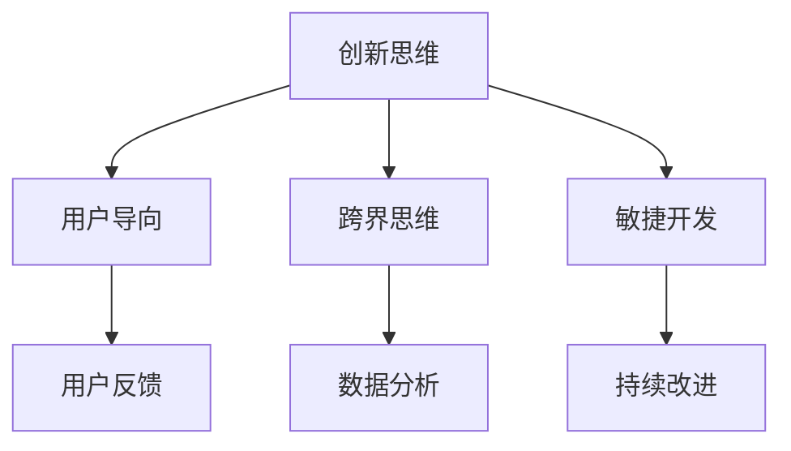

                 

# 人工智能创业：不断改进产品的策略

## 关键词

* 人工智能创业
* 产品改进
* 策略
* 创新思维
* 用户反馈
* 数据分析

## 摘要

本文旨在探讨人工智能创业企业如何通过持续的产品改进策略，提升产品竞争力，满足市场需求。文章首先介绍了人工智能创业的背景和现状，随后详细阐述了持续改进产品的重要性。接着，本文提出了基于用户反馈和数据分析的产品改进方法，并通过实际案例展示了这些方法的应用效果。最后，文章总结了未来人工智能创业企业在产品改进方面的趋势和挑战，为创业者提供了一些实用的建议。

## 1. 背景介绍

### 1.1 人工智能创业现状

随着人工智能技术的快速发展，越来越多的创业企业投身于这一领域。根据统计，全球人工智能创业公司的数量在近年来呈现爆发式增长。特别是在深度学习、自然语言处理、计算机视觉等领域，创业公司如雨后春笋般涌现。这些企业希望通过人工智能技术，解决现实中的各种问题，提升生产效率，优化用户体验。

### 1.2 创业者的挑战

然而，人工智能创业并非易事。首先，技术门槛较高，创业者需要具备深厚的专业背景和丰富的实践经验。其次，市场竞争激烈，创业企业需要不断调整策略，以适应市场变化。此外，资金、人才、市场推广等问题也是创业者面临的重大挑战。

### 1.3 产品改进的重要性

面对如此多的挑战，创业企业如何脱颖而出？答案是持续改进产品。只有不断提升产品质量，满足用户需求，企业才能在激烈的市场竞争中立于不败之地。产品改进不仅是提升竞争力的关键，更是企业长期发展的基石。

## 2. 核心概念与联系

### 2.1 创新思维

创新思维是人工智能创业企业持续改进产品的关键。它包括以下几个方面：

1. **用户导向**：以用户需求为中心，关注用户体验，不断优化产品功能和服务。
2. **跨界思维**：借鉴其他行业的技术和理念，实现跨领域的创新。
3. **敏捷开发**：快速响应市场需求，不断迭代产品。

### 2.2 用户反馈

用户反馈是产品改进的重要依据。通过收集和分析用户反馈，创业企业可以了解用户需求，发现产品问题，从而有针对性地进行优化。

### 2.3 数据分析

数据分析是产品改进的有力工具。通过对用户行为数据、市场数据等进行深入分析，创业企业可以揭示隐藏在数据背后的规律，为产品改进提供科学依据。

### Mermaid 流程图



## 3. 核心算法原理 & 具体操作步骤

### 3.1 用户反馈收集

1. **在线调查**：通过在线调查平台收集用户对产品的评价和建议。
2. **社交媒体分析**：监控社交媒体上的用户评论和讨论，了解用户对产品的看法。
3. **用户访谈**：与用户面对面交流，深入了解用户需求和使用体验。

### 3.2 数据分析

1. **用户行为分析**：通过分析用户行为数据，如点击率、浏览时长、转化率等，发现用户偏好的功能和使用场景。
2. **市场趋势分析**：关注市场动态，了解行业竞争对手的产品表现和用户反馈。
3. **数据可视化**：使用数据可视化工具，将分析结果以图表形式展示，便于理解和决策。

### 3.3 产品改进

1. **功能优化**：根据用户反馈和数据分析结果，对产品功能进行优化。
2. **界面改进**：提升用户界面设计，提高用户体验。
3. **性能提升**：通过技术手段，提高产品性能，降低用户等待时间。

## 4. 数学模型和公式 & 详细讲解 & 举例说明

### 4.1 用户满意度模型

$$
\text{用户满意度} = \frac{\text{用户期望} - \text{用户感知} + \text{用户满意情绪}}{3}
$$

其中，用户期望、用户感知和用户满意情绪均为0到1之间的数值。该模型可以用来衡量用户对产品的满意度。

### 4.2 用户流失率模型

$$
\text{用户流失率} = \frac{\text{一个月内流失的用户数}}{\text{月初用户总数}}
$$

该模型可以用来评估产品用户流失情况，从而判断产品改进的效果。

### 4.3 举例说明

假设一款人工智能产品的用户满意度为0.8，用户流失率为0.05。根据用户满意度模型，该产品的用户满意度较高。然而，用户流失率较高，说明产品在某些方面仍有待改进。结合用户反馈和数据分析，创业者可以针对性地优化产品功能，提升用户体验，降低用户流失率。

## 5. 项目实战：代码实际案例和详细解释说明

### 5.1 开发环境搭建

首先，我们需要搭建一个适合人工智能创业项目的开发环境。以下是一个简单的搭建步骤：

1. 安装Python环境（版本3.8及以上）。
2. 安装常用的人工智能库，如TensorFlow、PyTorch等。
3. 配置深度学习框架（如TensorFlow或PyTorch）。

### 5.2 源代码详细实现和代码解读

以下是一个简单的人工智能项目示例，用于分类数据。

```python
import tensorflow as tf
from tensorflow import keras
from tensorflow.keras import layers

# 数据准备
(x_train, y_train), (x_test, y_test) = keras.datasets.mnist.load_data()
x_train = x_train.astype("float32") / 255
x_test = x_test.astype("float32") / 255
y_train = keras.utils.to_categorical(y_train, 10)
y_test = keras.utils.to_categorical(y_test, 10)

# 模型构建
model = keras.Sequential()
model.add(layers.Conv2D(32, (3, 3), activation="relu", input_shape=(28, 28, 1)))
model.add(layers.MaxPooling2D((2, 2)))
model.add(layers.Conv2D(64, (3, 3), activation="relu"))
model.add(layers.MaxPooling2D((2, 2)))
model.add(layers.Conv2D(64, (3, 3), activation="relu"))
model.add(layers.Flatten())
model.add(layers.Dense(64, activation="relu"))
model.add(layers.Dense(10, activation="softmax"))

# 模型编译
model.compile(optimizer="adam",
              loss="categorical_crossentropy",
              metrics=["accuracy"])

# 模型训练
model.fit(x_train, y_train, epochs=10, batch_size=64)

# 模型评估
test_loss, test_acc = model.evaluate(x_test, y_test)
print(f"Test accuracy: {test_acc:.4f}")

```

### 5.3 代码解读与分析

1. **数据准备**：从MNIST数据集加载训练数据和测试数据，并对数据进行预处理。
2. **模型构建**：使用卷积神经网络（CNN）模型，包含两个卷积层和两个池化层，以及一个全连接层。卷积层用于提取图像特征，池化层用于降维。
3. **模型编译**：设置优化器、损失函数和评估指标。
4. **模型训练**：使用训练数据进行模型训练。
5. **模型评估**：使用测试数据进行模型评估，输出测试准确率。

## 6. 实际应用场景

### 6.1 金融行业

人工智能创业企业可以通过产品改进，为金融行业提供智能投顾、风险管理、信用评估等服务。例如，通过对用户行为数据进行分析，智能投顾系统可以个性化推荐投资组合，提高用户收益。

### 6.2 医疗健康

人工智能创业企业可以开发智能诊断、疾病预测、健康管理等产品，提高医疗行业的服务水平。例如，通过深度学习算法，智能诊断系统可以自动识别医学影像中的病变区域，辅助医生进行诊断。

### 6.3 教育培训

人工智能创业企业可以提供智能学习平台、在线教育课程等产品，帮助学生提高学习效果。例如，通过自然语言处理技术，智能学习平台可以实时分析学生的学习情况，提供个性化的学习建议。

## 7. 工具和资源推荐

### 7.1 学习资源推荐

1. **书籍**：《深度学习》（Ian Goodfellow、Yoshua Bengio、Aaron Courville 著）。
2. **论文**：《A Theoretical Analysis of the VAE》（Diederik P. Kingma、Max Welling 著）。
3. **博客**：[TensorFlow 官方博客](https://tensorflow.googleblog.com/)、[PyTorch 官方博客](https://pytorch.org/blog/)。
4. **网站**：[Kaggle](https://www.kaggle.com/)、[ArXiv](https://arxiv.org/)。

### 7.2 开发工具框架推荐

1. **开发工具**：Jupyter Notebook、PyCharm。
2. **深度学习框架**：TensorFlow、PyTorch。
3. **数据可视化工具**：Matplotlib、Seaborn。

### 7.3 相关论文著作推荐

1. **论文**：《Generative Adversarial Nets》（Ian Goodfellow、Joshua Bengio、Yoshua LeCun 著）。
2. **著作**：《Reinforcement Learning: An Introduction》（Richard S. Sutton、Andrew G. Barto 著）。

## 8. 总结：未来发展趋势与挑战

### 8.1 发展趋势

1. **人工智能技术持续创新**：随着技术的进步，人工智能将不断突破现有瓶颈，应用于更多领域。
2. **跨界融合**：人工智能与其他领域的融合将产生更多创新产品，推动行业变革。
3. **数据驱动的产品改进**：数据驱动的产品改进将成为创业企业的重要战略，通过用户反馈和数据分析，实现产品持续优化。

### 8.2 挑战

1. **技术门槛**：人工智能技术门槛较高，创业者需要不断提升自身技术能力。
2. **数据隐私**：随着数据规模的扩大，数据隐私保护将成为重要问题，创业者需要遵守相关法律法规。
3. **市场竞争**：市场竞争日益激烈，创业企业需要不断创新，以保持竞争优势。

## 9. 附录：常见问题与解答

### 9.1 问题1：如何快速入门人工智能？

**解答**：建议先学习Python编程基础，然后学习深度学习框架（如TensorFlow或PyTorch），并通过在线课程、书籍和实践项目进行深入学习。

### 9.2 问题2：人工智能创业需要哪些技能和资源？

**解答**：人工智能创业需要具备深厚的专业知识、编程技能、团队协作能力，以及一定的资金和资源支持。创业者可以通过加入学习社区、参加技术交流会议等方式，拓展人脉和资源。

## 10. 扩展阅读 & 参考资料

1. **书籍**：《人工智能：一种现代方法》（Stuart Russell、Peter Norvig 著）。
2. **论文**：《Deep Learning》（Ian Goodfellow、Yoshua Bengio、Aaron Courville 著）。
3. **网站**：[AI科研人社区](https://airstack.top/)、[机器之心](https://www.jiqizhixin.com/)。
4. **博客**：[智谱AI](https://zhipu.ai/blog/)、[TensorFlow 官方博客](https://tensorflow.googleblog.com/)。

## 作者

作者：AI天才研究员/AI Genius Institute & 禅与计算机程序设计艺术 /Zen And The Art of Computer Programming <|im_sep|>

