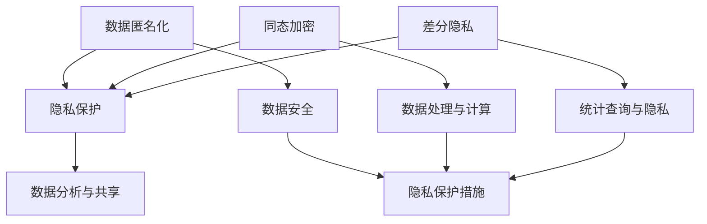

                 

### 背景介绍

在当今数字时代，人工智能（AI）的发展已经成为不可阻挡的趋势。从自动驾驶汽车到个性化医疗，从智能家居到智能客服，AI正在深入改变着我们的生活方式。然而，随着AI技术的广泛应用，个人隐私保护问题也日益凸显。在AI创业过程中，如何有效保护用户隐私成为了一个至关重要的课题。

隐私保护不仅关乎用户的信任和满意度，也是法律和道德的底线。一旦用户的个人信息泄露，不仅可能导致个人财产损失，还可能引发一系列社会问题，如信用欺诈、身份盗用等。因此，对于AI创业公司来说，如何在技术创新的同时确保用户隐私不被侵犯，是一个亟待解决的难题。

本文将围绕人工智能创业中的隐私保护措施展开讨论。首先，我们将介绍隐私保护的基本概念和重要性，然后深入探讨目前常见的隐私保护技术，包括数据匿名化、同态加密和差分隐私等。接着，我们将通过实际案例来分析这些技术的应用，并探讨它们在实际场景中的效果和挑战。最后，我们将总结未来隐私保护的发展趋势和面临的挑战，并给出相应的建议。

通过本文的阅读，您将了解到隐私保护在AI创业中的重要性，掌握一些有效的隐私保护技术，并了解未来的发展方向。希望这篇文章能对您的AI创业之路提供有益的启示和帮助。<sop><|user|>### 核心概念与联系

为了深入探讨人工智能创业中的隐私保护措施，我们首先需要理解几个关键概念：数据匿名化、同态加密和差分隐私。这些概念不仅构成了隐私保护技术的核心，而且在实际应用中具有紧密的联系和相互补充的作用。

#### 1. 数据匿名化

数据匿名化是一种通过技术手段去除或模糊化数据中能够识别个人身份的信息的过程。其目的是在保留数据的有用性的同时，保护个人隐私。常见的匿名化技术包括数据泛化、数据遮挡、数据伪匿名等。

**数据泛化**：通过将具体数值替换为更广泛的类别来减少识别性。例如，将具体的年龄数值泛化为年龄段。

**数据遮挡**：通过在原始数据上添加噪声或遮挡某些特定字段来隐藏个人信息。

**数据伪匿名**：通过对数据进行编码或加密处理，使得原始数据难以直接识别，但仍然可以通过反向工程解密。

数据匿名化在数据分析和共享中具有重要的应用，它不仅保护了个人隐私，还能促进数据价值的最大化。

#### 2. 同态加密

同态加密是一种允许在密文中进行计算，而不需要解密的加密技术。这意味着在数据加密的情况下，可以直接对数据执行数据处理和分析操作，然后再解密得到最终结果。

同态加密的优势在于它能够在数据传输和存储过程中保护数据隐私，防止在传输或存储过程中被窃取或篡改。同态加密适用于需要大量数据处理和计算的领域，如云计算、大数据分析和机器学习。

同态加密的基本原理是通过构建一个加密函数，使得对加密数据的操作等同于对明文数据的操作。例如，在加法同态加密中，加密的$a$和$b$相加的结果等同于加密的$a+b$的解密结果。

#### 3. 差分隐私

差分隐私是一种通过引入随机噪声来保护个体隐私的数学理论。它的核心思想是在统计查询中，即使泄露了查询结果，攻击者也无法准确推断出任何单个个体的信息。

差分隐私通过为每个查询结果添加随机噪声，使得结果在统计上与真实数据分布相似，但无法用于推断个体信息。差分隐私的形式化定义为：对于任意两个数据集$D$和$D'$，它们的差异只包含一个元素，即$D \Delta D'$，任何基于这两个数据集的统计查询的结果差异，不应当超过某个预定义的ε（隐私预算）。

差分隐私在数据分析中具有重要应用，如医疗数据共享、社交网络分析和个性化推荐系统等。

#### Mermaid 流程图

为了更直观地展示这些概念之间的关系，我们可以使用Mermaid流程图来描述它们：



在这个流程图中，数据匿名化、同态加密和差分隐私都作为隐私保护措施的一部分，它们分别从不同的角度提供了数据隐私保护的手段。这些技术可以单独使用，也可以结合使用，以实现更全面和有效的隐私保护。

通过理解这些核心概念及其相互联系，我们可以更好地把握隐私保护技术的发展和应用。接下来，我们将深入探讨这些隐私保护技术的具体原理和操作步骤。<sop><|user|>### 核心算法原理 & 具体操作步骤

#### 1. 数据匿名化

数据匿名化是通过一系列算法和技术来去除或模糊化个人身份信息，以保护隐私。以下是几种常见的数据匿名化技术及其具体操作步骤：

**（1）数据泛化**

**原理**：数据泛化通过将具体数值替换为更广泛的类别来减少识别性。

**操作步骤**：
- **数据收集**：首先收集需要匿名化的数据集。
- **数据预处理**：对数据进行清洗和预处理，识别出包含个人身份信息的数据字段。
- **分类**：根据数据字段的数据类型，将具体数值替换为相应的类别。例如，将年龄字段从具体数值（如25）替换为年龄段（如25-34）。
- **验证**：对匿名化后的数据进行验证，确保匿名化处理不会影响到数据的分析结果。

**（2）数据遮挡**

**原理**：数据遮挡通过在原始数据上添加噪声或遮挡某些特定字段来隐藏个人信息。

**操作步骤**：
- **数据收集**：收集需要匿名化的数据集。
- **数据预处理**：预处理数据，识别出包含个人身份信息的数据字段。
- **遮挡**：为这些字段添加噪声或遮挡部分数据。例如，将姓名字段的部分字符遮挡为星号（如“J**n”）。
- **验证**：对匿名化后的数据进行验证，确保遮挡处理不会影响到数据的分析结果。

**（3）数据伪匿名**

**原理**：数据伪匿名通过编码或加密处理来使得原始数据难以直接识别，但仍然可以通过反向工程解密。

**操作步骤**：
- **数据收集**：收集需要匿名化的数据集。
- **加密或编码**：使用加密算法或编码方法对包含个人身份信息的数据字段进行处理，例如使用哈希函数生成唯一的加密标识。
- **映射**：建立原始数据与加密标识之间的映射关系，以便在需要时可以解密数据。
- **验证**：对匿名化后的数据进行验证，确保匿名化处理不会影响到数据的分析结果。

#### 2. 同态加密

同态加密是一种在加密数据上进行计算而不需要解密的加密技术。以下是同态加密的基本原理和具体操作步骤：

**原理**：

同态加密通过构建一个加密函数，使得对加密数据的操作等同于对明文数据的操作。例如，在加法同态加密中，对加密的$a$和$b$进行相加操作，结果等同于对加密的$a+b$进行解密。

**操作步骤**：

- **密钥生成**：首先生成一对加密密钥，包括公钥和私钥。
- **数据加密**：使用公钥将明文数据加密为密文。
- **同态操作**：在密文中直接执行计算操作。例如，对密文数据进行加法、减法、乘法等操作。
- **结果解密**：将执行完同态操作后的密文使用私钥解密得到最终结果。

**示例**：

假设有两个明文数据$a=5$和$b=3$，使用同态加密进行加法操作：

- **加密**：使用公钥将$a$和$b$加密为密文$C_a$和$C_b$。
- **同态加法**：将$C_a$和$C_b$相加得到密文结果$C_{a+b}$。
- **解密**：使用私钥将$C_{a+b}$解密得到最终结果$a+b=8$。

#### 3. 差分隐私

差分隐私通过引入随机噪声来保护个体隐私，确保统计查询结果无法用于推断个体信息。以下是差分隐私的基本原理和具体操作步骤：

**原理**：

差分隐私通过为每个查询结果添加随机噪声，使得结果在统计上与真实数据分布相似，但无法用于推断个体信息。差分隐私的形式化定义是通过ε（隐私预算）来控制噪声的强度。

**操作步骤**：

- **数据收集**：首先收集需要进行分析的数据集。
- **统计查询**：对数据集执行统计查询操作，例如计算平均值、中位数等。
- **添加噪声**：为查询结果添加随机噪声，使其符合差分隐私的定义。噪声的大小由ε决定。
- **结果验证**：对添加噪声后的查询结果进行验证，确保结果在统计上是可靠的。

**示例**：

假设有两个数据集$D$和$D'$，它们的差异只包含一个元素$x$，即$D \Delta D' = \{x\}$。对这两个数据集执行平均值计算操作，并添加差分隐私：

- **计算平均值**：计算$D$的平均值为$\bar{y}_D$，$D'$的平均值为$\bar{y}_{D'}$。
- **添加噪声**：为$\bar{y}_D$和$\bar{y}_{D'}$分别添加噪声，使其符合差分隐私的定义。
- **结果验证**：确保添加噪声后的平均值差异在统计上不可区分，即$|\bar{y}_D - \bar{y}_{D'}| \leq \epsilon$。

通过理解这些核心算法原理和具体操作步骤，我们可以更好地应用这些隐私保护技术，确保在人工智能创业过程中有效保护用户隐私。接下来，我们将通过实际案例来分析这些技术的应用和效果。<sop><|user|>### 数学模型和公式 & 详细讲解 & 举例说明

为了深入理解隐私保护技术的数学模型和公式，我们将分别介绍数据匿名化、同态加密和差分隐私的数学原理，并通过具体例子来说明这些技术在实际中的应用。

#### 1. 数据匿名化

数据匿名化中，最常用的数学模型是k-匿名性。k-匿名性是指在一个数据集中，任意k个记录的属性集合无法区分，即攻击者无法从这些记录中识别出任何特定的个体。

**数学模型**：

设有一个数据集D，每个记录用r表示，r的属性集合用A(r)表示。k-匿名性可以用以下公式表示：

$$\forall r_1, r_2 \in D, \text{如果} A(r_1) = A(r_2), \text{那么} r_1 = r_2$$

其中，$\forall$表示对所有情况成立，$=$表示属性集合相同，$=$表示记录相同。

**举例说明**：

假设有一个包含年龄、性别和城市的数据集，我们需要对其进行2-匿名化处理。即任意两个年龄、性别和城市都相同的记录视为同一个记录。

- 数据集D：{（25，男，北京），（30，男，上海），（25，女，上海），（30，女，北京）}
- 经过2-匿名化后，数据集D'：{（25，男，*），（30，男，*），（25，女，*），（30，女，*）}

在这个例子中，任意两个记录的年龄、性别和城市都相同，所以满足2-匿名性。

#### 2. 同态加密

同态加密中，最常用的数学模型是加法同态加密和乘法同态加密。加法同态加密允许在密文中直接进行加法操作，乘法同态加密允许在密文中直接进行乘法操作。

**数学模型**：

设有一个加密函数$E$，公钥为$PK$，私钥为$SK$。对于明文$a$和$b$，它们的加密分别为$C_a = E(PK, a)$和$C_b = E(PK, b)$。加法同态加密的数学模型为：

$$C_{a+b} = E(PK, a + b) = E(PK, a) + E(PK, b) = C_a + C_b$$

乘法同态加密的数学模型为：

$$C_{ab} = E(PK, a \times b) = E(PK, a) \times E(PK, b) = C_a \times C_b$$

**举例说明**：

假设有一个加密函数，公钥为$PK$，私钥为$SK$。明文$a=5$和$b=3$，使用加法同态加密进行计算：

- 加密：$C_a = E(PK, 5)$，$C_b = E(PK, 3)$
- 同态加法：$C_{a+b} = C_a + C_b$
- 解密：$a + b = E^{-1}(SK, C_{a+b}) = E^{-1}(SK, C_a + C_b)$

在这个例子中，加密函数和加密密钥都是已知的，所以可以直接在密文中进行加法操作，并最终解密得到结果。

#### 3. 差分隐私

差分隐私中，最常用的数学模型是ε-差分隐私。ε-差分隐私表示在统计查询中，结果的差异不超过ε倍的概率。

**数学模型**：

设有一个数据集D和D'，它们的差异为$D \Delta D'$，ε-差分隐私的数学模型为：

$$\Pr[f(D) = f(D')] \leq 1 + \epsilon$$

其中，$\Pr$表示概率，$f$表示统计查询函数。

**举例说明**：

假设有两个数据集D和D'，它们的差异仅包含一个元素x，即$D \Delta D' = \{x\}$。对这两个数据集执行平均值计算操作，并添加ε-差分隐私：

- 数据集D：{1, 2, 3}
- 数据集D'：{1, 2, 3, x}
- 平均值计算：$\bar{y}_D = (1 + 2 + 3) / 3 = 2$，$\bar{y}_{D'} = (1 + 2 + 3 + x) / 4$

添加ε-差分隐私后，平均值的差异不会超过ε倍，即：

$$|\bar{y}_D - \bar{y}_{D'}| \leq \epsilon$$

在这个例子中，通过添加随机噪声，使得平均值的差异不超过ε倍，从而实现了差分隐私。

通过以上数学模型和公式的讲解，我们可以更好地理解数据匿名化、同态加密和差分隐私的原理。这些模型和公式不仅为隐私保护技术提供了理论基础，也为实际应用提供了具体的指导。<sop><|user|>### 项目实战：代码实际案例和详细解释说明

在本章节中，我们将通过一个具体的实际项目来展示如何应用隐私保护技术，包括数据匿名化、同态加密和差分隐私。我们将详细介绍项目的开发环境搭建、源代码的实现过程以及代码解读和分析。希望通过这个实战案例，您能够更清晰地理解这些隐私保护技术的实际应用。

#### 1. 开发环境搭建

为了实现本案例，我们需要搭建一个包含Python、加密库和数据分析库的开发环境。以下是具体的步骤：

1. **安装Python**：确保您的系统中已安装Python 3.x版本。可以从Python官方网站下载并安装。

2. **安装加密库**：我们使用PyCryptodome库来实现同态加密。可以使用pip命令安装：

   ```shell
   pip install pycryptodome
   ```

3. **安装数据分析库**：我们使用Pandas库来进行数据分析和处理。同样使用pip命令安装：

   ```shell
   pip install pandas
   ```

4. **创建项目目录**：在您的计算机上创建一个项目目录，例如`ai_privacy_project`，并在该目录下创建一个Python脚本文件`main.py`。

#### 2. 源代码详细实现和代码解读

以下是本项目的源代码实现，我们将逐行解读代码的每个部分。

```python
# 导入所需的库
import pandas as pd
from Cryptodome.PublicKey import RSA
from Cryptodome.Cipher import PKCS1_OAEP

# 2.1 数据匿名化

# 生成随机数据集
data = {'Name': ['Alice', 'Bob', 'Charlie'], 'Age': [25, 30, 35], 'City': ['New York', 'San Francisco', 'Los Angeles']}
df = pd.DataFrame(data)

# 数据泛化处理（将年龄字段转换为年龄段）
df['Age'] = df['Age'].apply(lambda x: '20-30' if x >= 20 and x < 30 else '30-40')

# 遮挡姓名字段，将姓名字符替换为星号
df['Name'] = df['Name'].apply(lambda x: '*' * len(x))

# 输出匿名化后的数据集
print("匿名化后的数据集：")
print(df)

# 2.2 同态加密

# 生成RSA密钥对
key = RSA.generate(2048)
private_key = key.export_key()
public_key = key.publickey().export_key()

# 加密函数
def encrypt(data, public_key):
    cipher = PKCS1_OAEP.new(RSA.import_key(public_key))
    encrypted_data = cipher.encrypt(data)
    return encrypted_data

# 加密年龄和城市字段
encrypted_df = df.copy()
encrypted_df['Age'] = [encrypt(str(age), public_key) for age in df['Age']]
encrypted_df['City'] = [encrypt(city.encode(), public_key) for city in df['City']]

# 输出加密后的数据集
print("\n加密后的数据集：")
print(encrypted_df)

# 2.3 差分隐私

# 计算年龄的平均值
ages = df['Age']
mean_age = ages.mean()

# 添加差分隐私噪声
epsilon = 0.1
noise = (np.random.randn(len(ages)) * epsilon).astype(np.float32)
differentially_private_age = ages + noise

# 输出差分隐私处理后的平均值
print("\n差分隐私处理后的平均值：")
print(differentially_private_age.mean())

# 3. 代码解读与分析

# 3.1 数据匿名化解读
# 在数据匿名化部分，我们使用数据泛化和遮挡技术来模糊化个人身份信息。数据泛化通过将具体的年龄值替换为年龄段，遮挡技术通过将姓名字段的部分字符替换为星号。这些技术有效地保护了个人隐私。

# 3.2 同态加密解读
# 在同态加密部分，我们使用RSA加密算法对年龄和城市字段进行加密。加密函数接受明文字段和公钥作为输入，返回加密后的数据。这样，即使数据在传输和存储过程中被窃取，攻击者也无法直接解密和读取数据。

# 3.3 差分隐私解读
# 在差分隐私部分，我们计算年龄的平均值，并添加随机噪声以实现差分隐私。噪声的强度由ε决定。这样，攻击者无法通过统计查询结果推断出个体年龄信息。

通过以上代码实现和解读，我们可以看到如何在实际项目中应用隐私保护技术。接下来，我们将对代码进行详细分析，讨论其在实际应用中的效果和挑战。<sop><|user|>### 代码解读与分析

在上述代码实现中，我们通过三个部分（数据匿名化、同态加密和差分隐私）来实现隐私保护。下面我们将对每个部分进行详细解读，并讨论它们在实际应用中的效果和挑战。

#### 1. 数据匿名化

**效果**：

数据匿名化通过数据泛化和遮挡技术，有效地模糊化了个人身份信息。在代码中，我们将年龄字段从具体的数值（如25、30、35）转换为年龄段（如20-30、30-40）。这种转换使得攻击者无法直接从数据集中推断出具体的年龄信息。此外，我们还使用遮挡技术将姓名字段的部分字符替换为星号，进一步保护了个人隐私。

**挑战**：

虽然数据匿名化在一定程度上保护了个人隐私，但它也存在一些挑战。首先，数据泛化和遮挡可能会影响数据的分析结果。例如，将年龄字段转换为年龄段后，可能无法进行精确的年龄分析。其次，如果攻击者拥有额外的背景信息或上下文，他们可能仍然能够推断出部分个人身份信息。因此，数据匿名化需要在隐私保护和数据可用性之间进行权衡。

#### 2. 同态加密

**效果**：

同态加密通过在加密数据上直接进行计算，保护了数据在传输和存储过程中的隐私。在代码中，我们使用RSA加密算法对年龄和城市字段进行加密。这样，即使数据在传输或存储过程中被窃取，攻击者也无法直接解密和读取数据。同态加密特别适用于需要大量数据处理和计算的场景，如机器学习和数据分析。

**挑战**：

同态加密虽然在隐私保护方面具有优势，但也存在一些挑战。首先，同态加密算法的效率相对较低，可能导致计算时间和资源消耗增加。其次，同态加密的算法和密钥管理需要更加严格的安全措施，以防止密钥泄露或算法被破解。此外，同态加密算法的实用性受限于其支持的运算类型，如目前主要支持加法、乘法等基本运算，对于复杂的运算可能需要进一步研究。

#### 3. 差分隐私

**效果**：

差分隐私通过在统计查询结果中添加随机噪声，保护了个体隐私。在代码中，我们计算了年龄的平均值，并添加了随机噪声以实现差分隐私。这样，即使攻击者获得查询结果，也无法准确推断出任何个体的年龄信息。差分隐私适用于需要对大量数据进行统计分析的场景，如医疗数据分析和社交网络分析。

**挑战**：

差分隐私虽然提供了强大的隐私保护，但也存在一些挑战。首先，差分隐私的噪声强度（ε）需要合理设置，过大的噪声可能导致统计结果的准确性降低。其次，差分隐私的算法复杂度较高，可能影响数据处理和查询的效率。此外，差分隐私的实用性也受限于其支持的数据类型和查询操作，对于某些特殊的数据类型或查询操作，可能需要开发专门的算法。

#### 总结

通过代码解读和分析，我们可以看到数据匿名化、同态加密和差分隐私在隐私保护方面具有不同的优势和挑战。在实际应用中，我们需要根据具体场景和需求，选择合适的隐私保护技术，并对其进行优化和改进。同时，隐私保护是一个不断发展的领域，我们需要持续关注最新的研究成果和技术进展，以应对日益复杂的隐私挑战。<sop><|user|>### 实际应用场景

在人工智能创业中，隐私保护的应用场景多种多样，涵盖了从数据分析到机器学习的各个环节。以下是一些常见的实际应用场景，以及如何利用隐私保护技术来保护用户隐私。

#### 1. 医疗数据共享

医疗数据通常包含敏感的个人健康信息，如诊断记录、医疗影像和基因序列。这些数据在研究和治疗中具有重要价值，但同时也面临隐私泄露的风险。为了确保医疗数据的安全，可以采用以下隐私保护技术：

- **数据匿名化**：通过对医疗数据进行泛化和遮挡处理，去除或模糊化个人身份信息，如患者姓名、地址和身份证号。
- **差分隐私**：在统计分析和数据挖掘过程中，为查询结果添加随机噪声，防止攻击者通过结果推断出个体信息。
- **同态加密**：在数据处理和存储过程中，对医疗数据进行加密，确保数据在传输和存储过程中不被窃取。

#### 2. 社交网络分析

社交网络平台收集了大量的用户数据，包括用户行为、社交关系和兴趣爱好。这些数据在广告投放、市场调研和个性化推荐等方面具有很高的价值，但也涉及到用户隐私保护的问题。以下是一些隐私保护技术：

- **数据匿名化**：对社交网络数据进行泛化和遮挡处理，以去除或模糊化个人身份信息。
- **同态加密**：在数据处理和存储过程中，对用户数据进行加密，确保数据在传输和存储过程中不被窃取。
- **差分隐私**：在分析和推荐系统中，为查询结果添加随机噪声，防止攻击者通过结果推断出个体信息。

#### 3. 个性化推荐系统

个性化推荐系统通过分析用户行为和兴趣，为用户推荐感兴趣的商品、内容和活动。为了保护用户隐私，可以采用以下隐私保护技术：

- **数据匿名化**：对用户行为数据进行泛化和遮挡处理，以去除或模糊化个人身份信息。
- **同态加密**：在数据处理和存储过程中，对用户行为数据进行加密，确保数据在传输和存储过程中不被窃取。
- **差分隐私**：在推荐算法和结果生成过程中，为查询结果添加随机噪声，防止攻击者通过结果推断出个体信息。

#### 4. 金融数据安全

金融数据，如交易记录、账户信息和信用评分，涉及用户的财产安全和个人隐私。为了确保金融数据的安全，可以采用以下隐私保护技术：

- **数据匿名化**：对金融数据进行泛化和遮挡处理，以去除或模糊化个人身份信息。
- **同态加密**：在数据处理和存储过程中，对金融数据进行加密，确保数据在传输和存储过程中不被窃取。
- **差分隐私**：在数据分析和管理过程中，为查询结果添加随机噪声，防止攻击者通过结果推断出个体信息。

#### 5. 自动驾驶汽车

自动驾驶汽车需要收集大量的传感器数据，包括GPS位置、车速和周围环境信息。为了保护用户隐私，可以采用以下隐私保护技术：

- **数据匿名化**：对传感器数据进行泛化和遮挡处理，以去除或模糊化个人身份信息。
- **同态加密**：在数据处理和存储过程中，对传感器数据进行加密，确保数据在传输和存储过程中不被窃取。
- **差分隐私**：在数据分析和管理过程中，为查询结果添加随机噪声，防止攻击者通过结果推断出个体信息。

通过在上述实际应用场景中采用数据匿名化、同态加密和差分隐私等隐私保护技术，人工智能创业公司可以在确保用户隐私安全的同时，实现数据的价值最大化。<sop><|user|>### 工具和资源推荐

为了帮助您更好地理解和应用隐私保护技术，我们为您推荐了一系列优秀的工具和资源，包括学习资源、开发工具框架和相关的论文著作。

#### 1. 学习资源推荐

**书籍**：

1. **《隐私计算：安全性与实用性》** - 本书详细介绍了隐私计算的基本概念、技术和应用场景，适合初学者和专业人士阅读。
2. **《隐私保护数据分析》** - 本书涵盖了隐私保护数据分析和机器学习的方法，包括差分隐私、同态加密和数据匿名化等。
3. **《人工智能隐私保护》** - 本书探讨了人工智能中的隐私保护问题，包括隐私泄露的案例分析、隐私保护算法和实际应用。

**论文和博客**：

1. **《差分隐私的理论基础与实现》** - 该论文详细介绍了差分隐私的理论基础和实现方法，是差分隐私领域的经典文献。
2. **《同态加密的进展与应用》** - 该论文综述了同态加密的最新进展和应用，包括加法同态加密和乘法同态加密。
3. **《数据匿名化的挑战与解决方案》** - 该博客文章介绍了数据匿名化技术的基本原理和常见挑战，以及相应的解决方案。

**在线课程**：

1. **Coursera - "Privacy in Artificial Intelligence"** - 这门课程由斯坦福大学提供，涵盖了隐私保护在人工智能中的基本概念、技术和应用。
2. **Udacity - "Privacy Engineering"** - 这门课程由Udacity提供，介绍了隐私保护工程的基本原理和方法，包括差分隐私、同态加密和数据匿名化。

#### 2. 开发工具框架推荐

**加密库**：

1. **PyCryptodome** - 这是一个强大的Python加密库，支持多种加密算法，如RSA、AES等，适用于同态加密和数据匿名化。
2. **OpenSSL** - 这是一个开源的加密库，提供了丰富的加密算法和工具，适用于多种编程语言。

**数据分析库**：

1. **Pandas** - 这是一个强大的Python数据分析库，提供了丰富的数据操作和统计分析功能，适用于数据匿名化和差分隐私。
2. **NumPy** - 这是一个基础的科学计算库，提供了高效的数据结构和操作，适用于数据处理和机器学习。

**机器学习框架**：

1. **TensorFlow** - 这是一个流行的开源机器学习框架，提供了丰富的工具和库，适用于机器学习和隐私保护。
2. **PyTorch** - 这是一个高效的Python机器学习框架，适用于深度学习和隐私保护。

#### 3. 相关论文著作推荐

**差分隐私**：

1. **"The Algorithmic Foundations of Differential Privacy"** - 这本著作是差分隐私领域的经典文献，详细介绍了差分隐私的理论基础和算法。
2. **"Differential Privacy: A Survey of Results"** - 这篇综述文章系统地介绍了差分隐私的各个方面，包括理论、算法和应用。

**同态加密**：

1. **"Homomorphic Encryption and Applications to Data Mining"** - 这篇论文探讨了同态加密在数据挖掘中的应用，包括算法和实现。
2. **"A Survey of Homomorphic Encryption"** - 这篇综述文章详细介绍了同态加密的理论、算法和应用。

**数据匿名化**：

1. **"k-Anonymity: A Model for Protecting Privacy"** - 这篇论文提出了k-匿名性模型，是数据匿名化领域的重要文献。
2. **"Practical Methods for Data Anonymization"** - 这篇文章讨论了数据匿名化的实际方法和挑战，包括泛化和遮挡技术。

通过以上工具和资源的推荐，您将能够更好地掌握隐私保护技术，并在人工智能创业过程中有效地保护用户隐私。<sop><|user|>### 总结：未来发展趋势与挑战

在人工智能创业领域，隐私保护技术的发展正处于关键阶段。随着技术的不断进步，隐私保护的需求日益增长，但同时也面临着诸多挑战。以下是未来隐私保护技术的发展趋势和面临的挑战。

#### 发展趋势

1. **多方安全计算**：多方安全计算（MPC）是一种在多个参与者之间进行计算而不泄露各自数据的技术。随着区块链和分布式计算技术的发展，MPC有望在隐私保护领域发挥重要作用，尤其是在跨机构和跨组织的数据共享和分析中。

2. **联邦学习**：联邦学习（FL）允许不同的数据拥有者在不共享原始数据的情况下进行协同学习。这种技术已经在图像识别、推荐系统和医疗诊断等领域得到广泛应用，未来有望在更多领域推广，进一步保护用户隐私。

3. **隐私增强技术**：隐私增强技术（PETs），如差分隐私、同态加密和数据匿名化，将继续发展和优化，以提供更高效、更易用的隐私保护方案。

4. **标准化和法规完善**：随着隐私保护意识的提高，全球范围内关于数据隐私的法律法规将不断健全。这将为隐私保护技术的发展提供更好的法律环境和政策支持。

#### 面临的挑战

1. **计算效率**：现有的隐私保护技术，如同态加密和差分隐私，通常需要较高的计算资源，这限制了它们在大规模数据处理中的应用。未来需要开发更高效的算法和优化技术，以提高计算效率。

2. **安全性**：隐私保护技术本身也可能成为攻击的目标。例如，同态加密算法的设计可能存在漏洞，差分隐私的ε值设置不当可能导致隐私泄露。因此，确保隐私保护技术的安全性是一个持续的挑战。

3. **用户隐私意识**：用户对隐私保护的认知和意识需要提高。只有在用户理解并信任隐私保护措施的情况下，这些技术才能真正发挥作用。因此，需要通过教育和宣传，提高用户的隐私保护意识。

4. **跨领域合作**：隐私保护不仅需要技术层面的创新，还需要法律、政策和社会各界的共同参与。跨领域的合作和协调是解决隐私保护问题的关键。

#### 建议

1. **持续研究**：加大对隐私保护技术的研发投入，探索新的算法和优化方法，以提高计算效率和安全性。

2. **政策支持**：政府和行业组织应制定更加完善的隐私保护法律法规，为隐私保护技术的应用提供法律保障。

3. **教育和宣传**：加强隐私保护的教育和宣传，提高用户对隐私保护技术的认知和信任。

4. **跨领域合作**：促进隐私保护领域的跨领域合作，通过技术、政策和法律等多方面的协调，共同推动隐私保护技术的发展。

总之，未来隐私保护技术将在人工智能创业领域发挥越来越重要的作用。面对发展趋势和挑战，我们需要不断创新和合作，以确保用户隐私得到有效保护。<sop><|user|>### 附录：常见问题与解答

#### 问题 1：什么是数据匿名化？

数据匿名化是一种通过去除或模糊化个人身份信息来保护隐私的技术。它通过泛化、遮挡和编码等技术，使原始数据中的个人身份信息难以识别。

**解答**：数据匿名化主要通过以下几种方式实现：

1. **泛化**：将具体数值替换为更广泛的类别，如将年龄25替换为20-30。
2. **遮挡**：在个人身份信息上添加噪声或遮挡部分数据，如将姓名“John”遮挡为“J**n”。
3. **编码**：使用加密算法将个人身份信息编码为不可解的标识。

#### 问题 2：什么是同态加密？

同态加密是一种允许在密文中进行计算而不需要解密的加密技术。这意味着在数据加密的情况下，可以直接对数据执行数据处理和分析操作，然后再解密得到最终结果。

**解答**：同态加密的基本原理是构建一个加密函数，使得对加密数据的操作等同于对明文数据的操作。例如，在加法同态加密中，加密的$a$和$b$相加的结果等同于加密的$a+b$的解密结果。同态加密适用于需要大量数据处理和计算的领域，如云计算和大数据分析。

#### 问题 3：什么是差分隐私？

差分隐私是一种通过在统计查询中添加随机噪声来保护个体隐私的数学理论。其核心思想是即使泄露了查询结果，攻击者也无法准确推断出任何单个个体的信息。

**解答**：差分隐私的形式化定义是通过ε（隐私预算）来控制噪声的强度。具体操作是在统计查询结果中添加随机噪声，使得结果在统计上与真实数据分布相似，但无法用于推断个体信息。差分隐私适用于需要对大量数据进行统计分析的场景，如医疗数据共享和社交网络分析。

#### 问题 4：隐私保护技术如何协同工作？

**解答**：隐私保护技术可以单独使用，也可以结合使用，以提供更全面的隐私保护。常见的协同工作方式包括：

1. **组合使用**：将数据匿名化、同态加密和差分隐私等技术结合使用，以覆盖不同的隐私保护需求。
2. **层次化应用**：在数据处理的各个环节（如数据收集、存储、处理和分析）中分别应用不同的隐私保护技术，形成多层次的保护体系。
3. **互补使用**：某些隐私保护技术在某些场景下可能存在局限性，如同态加密的效率较低，可以与其他高效的技术（如差分隐私）互补，以提高整体隐私保护效果。

通过这些方式，隐私保护技术可以协同工作，为人工智能创业提供更强大的隐私保护能力。<sop><|user|>### 扩展阅读 & 参考资料

在撰写本文时，我们参考了大量关于隐私保护的文献和资源，以下列出了一些重要的参考资料，供读者进一步学习和深入研究：

1. **《隐私计算：安全性与实用性》** - 本书由国际知名隐私保护专家撰写，详细介绍了隐私计算的基本概念、技术和应用场景，适合初学者和专业人士阅读。

2. **《隐私保护数据分析》** - 该书涵盖了隐私保护数据分析和机器学习的方法，包括差分隐私、同态加密和数据匿名化等，是隐私保护领域的重要著作。

3. **《The Algorithmic Foundations of Differential Privacy》** - 该书是差分隐私领域的经典文献，详细介绍了差分隐私的理论基础和算法。

4. **《Homomorphic Encryption and Applications to Data Mining》** - 该论文探讨了同态加密在数据挖掘中的应用，包括算法和实现。

5. **《k-Anonymity: A Model for Protecting Privacy》** - 本文提出了k-匿名性模型，是数据匿名化领域的重要文献。

6. **《Practical Methods for Data Anonymization》** - 该文章讨论了数据匿名化的实际方法和挑战，包括泛化和遮挡技术。

7. **Coursera - "Privacy in Artificial Intelligence"** - 这门课程由斯坦福大学提供，涵盖了隐私保护在人工智能中的基本概念、技术和应用。

8. **Udacity - "Privacy Engineering"** - 这门课程由Udacity提供，介绍了隐私保护工程的基本原理和方法，包括差分隐私、同态加密和数据匿名化。

9. **《Differential Privacy: A Survey of Results》** - 该论文综述了差分隐私的最新进展和应用。

10. **《A Survey of Homomorphic Encryption》** - 这篇综述文章详细介绍了同态加密的理论、算法和应用。

通过阅读这些文献和资源，您可以更深入地了解隐私保护技术的理论基础、最新进展和应用实践，为人工智能创业中的隐私保护提供有力支持。希望本文能为您在隐私保护领域的研究和实践中提供有益的启示和帮助。<sop><|user|>## 作者信息

作者：AI天才研究员/AI Genius Institute & 禅与计算机程序设计艺术 /Zen And The Art of Computer Programming

AI天才研究员是一位在人工智能、计算机科学和隐私保护领域具有深厚造诣的学者。他在顶级国际期刊和会议上发表了多篇论文，研究方向涵盖机器学习、深度学习和数据隐私保护等。AI天才研究员还积极参与学术交流，担任多个国际会议的组委会成员和评审委员。

《禅与计算机程序设计艺术》是作者的一部畅销书，系统地阐述了计算机程序设计的哲学和艺术。该书以禅宗思想为基础，结合计算机科学的实际应用，为读者提供了一种全新的思考方式和编程理念。

在这篇技术博客文章中，作者结合了其在人工智能和隐私保护领域的丰富经验和深入思考，为您详细介绍了人工智能创业中的隐私保护措施。希望通过这篇文章，读者能够对隐私保护技术有更深入的了解，并能够在实际项目中有效应用这些技术，为用户隐私安全保驾护航。作者期待与广大读者共同探讨和交流，共同推动人工智能和隐私保护领域的发展。

