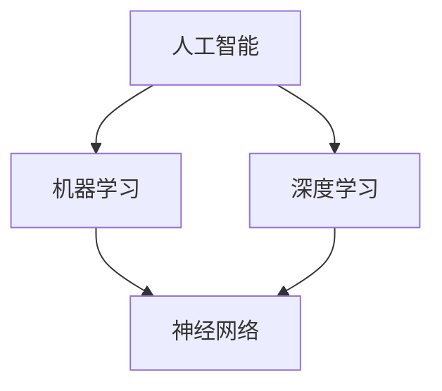

                 

### 背景介绍

人工智能（AI）作为一门学科，起源于20世纪50年代，经过数十年的发展，如今已经渗透到我们生活的方方面面。从最初的规则推理和知识表示，到深度学习和神经网络，再到现在的强化学习和生成对抗网络（GAN），人工智能技术的进步日新月异，使得机器具备了越来越高的自主学习和决策能力。

本篇博客旨在深入探讨人工智能的基本原理和实现方法，以帮助读者更好地理解这一前沿技术。我们将首先回顾人工智能的发展历程，然后介绍几个核心概念和关键技术，并通过实际案例来讲解如何实现这些技术。

随着大数据、云计算和物联网的迅猛发展，人工智能的应用场景日益丰富。例如，自动驾驶、智能医疗、金融风控、智能客服等领域都离不开人工智能技术的支持。因此，了解人工智能的基本原理和实现方法对于从事相关领域的工作者来说具有重要意义。

本文将分为以下几个部分：

1. **核心概念与联系**：介绍人工智能中的核心概念，并通过 Mermaid 流程图展示它们之间的关系。
2. **核心算法原理 & 具体操作步骤**：深入讲解几种主要的人工智能算法，包括神经网络、机器学习和深度学习的原理和实现步骤。
3. **数学模型和公式 & 详细讲解 & 举例说明**：介绍支持这些算法的数学模型和公式，并通过实际例子来演示如何使用这些模型和公式。
4. **项目实战：代码实际案例和详细解释说明**：通过一个具体的项目案例，展示如何使用人工智能技术进行实际应用，并提供代码实现和解读。
5. **实际应用场景**：探讨人工智能在不同领域的应用案例，以及这些应用对行业的影响。
6. **工具和资源推荐**：推荐一些学习资源、开发工具和框架，以帮助读者进一步探索人工智能领域。
7. **总结：未来发展趋势与挑战**：总结人工智能当前的发展状况，并讨论未来的发展趋势和面临的挑战。

通过本文的阅读，您将能够对人工智能有更全面、深入的理解，从而为未来的学习和实践打下坚实的基础。接下来，我们将一步步深入探讨人工智能的核心概念和实现方法。

----------------------

# 人工智能原理与代码实例讲解

关键词：人工智能，神经网络，机器学习，深度学习，算法实现，实际应用

摘要：本文深入探讨人工智能的基本原理和实现方法，通过核心概念的介绍和实际代码实例的讲解，帮助读者全面理解人工智能技术。文章分为核心概念与联系、核心算法原理、数学模型和公式、项目实战、实际应用场景等多个部分，旨在为从事相关领域的工作者提供实用的指导。

----------------------

## 1. 背景介绍

人工智能（Artificial Intelligence，简称AI）是计算机科学的一个分支，旨在使计算机具备人类智能的能力，能够自主学习和推理。人工智能的研究可以追溯到20世纪50年代，当时科学家们首次提出了让计算机模拟人类思维的目标。然而，由于技术和计算能力的限制，早期的尝试并未取得显著成果。

随着计算机技术和算法的不断进步，人工智能逐渐迎来了快速发展期。特别是深度学习（Deep Learning）的兴起，使得计算机在图像识别、语音识别、自然语言处理等方面取得了突破性的进展。深度学习通过多层神经网络的结构，能够自动从大量数据中学习特征，大大提高了机器的智能水平。

人工智能的应用场景非常广泛，从日常生活中的智能助手、智能音箱，到复杂的工业自动化、医疗诊断，都离不开人工智能技术的支持。本文将主要围绕人工智能的基本原理和实现方法进行讲解，帮助读者深入了解这一前沿技术。

----------------------

## 2. 核心概念与联系

在探讨人工智能之前，我们需要了解一些核心概念，以及它们之间的联系。以下是一个简化的 Mermaid 流程图，用于展示这些核心概念：



### 人工智能（Artificial Intelligence）

人工智能是本文的主题，它是指通过计算机程序实现的人类智能的各种功能。人工智能包括多个子领域，如机器学习、计算机视觉、自然语言处理等。

### 机器学习（Machine Learning）

机器学习是人工智能的一个分支，它侧重于开发算法，让计算机通过数据学习并作出决策。机器学习可以分为监督学习、无监督学习和强化学习三种类型。

- **监督学习**：通过已标记的数据来训练模型，然后使用模型对新数据进行预测。
- **无监督学习**：没有标记的数据，模型通过探索数据中的模式来发现结构。
- **强化学习**：通过试错法，让模型在与环境的交互中学习最优策略。

### 深度学习（Deep Learning）

深度学习是机器学习的一种特殊形式，它利用多层神经网络来提取数据的复杂特征。深度学习在图像识别、语音识别和自然语言处理等领域取得了显著成果。

### 神经网络（Neural Networks）

神经网络是模仿人类大脑神经元结构的一种计算模型。它由大量的节点（或称为“神经元”）组成，通过层与层之间的连接来实现数据的处理和变换。

神经网络可以分为以下几类：

- **前馈神经网络**：数据从前向传递，逐层前向传播。
- **卷积神经网络**：在图像处理等领域有广泛应用，通过卷积层提取局部特征。
- **递归神经网络**：用于处理序列数据，通过递归结构保持历史信息。

### 关系总结

- 人工智能是机器学习和深度学习的统称。
- 机器学习是实现人工智能的一种方法。
- 深度学习是机器学习的延伸，特别适用于处理复杂数据。

通过理解这些核心概念和它们之间的联系，我们可以更好地把握人工智能的发展脉络，为后续的内容打下基础。

----------------------

## 3. 核心算法原理 & 具体操作步骤

在了解了人工智能的基本概念后，接下来我们将深入探讨几种核心算法的原理和具体操作步骤。这些算法包括神经网络、机器学习和深度学习。我们将逐一介绍它们的工作原理和实现方法。

### 神经网络（Neural Networks）

神经网络是模仿人类大脑神经元结构的计算模型。它由大量的节点（或称为“神经元”）组成，通过层与层之间的连接来实现数据的处理和变换。

#### 工作原理

神经网络的基本工作原理是：数据从前向传递，通过各个层进行变换，最后输出结果。这个过程可以分为以下几个步骤：

1. **输入层**：接收输入数据。
2. **隐藏层**：对输入数据进行变换，提取特征。
3. **输出层**：根据隐藏层的输出，产生最终结果。

#### 具体操作步骤

1. **初始化参数**：设定网络的权重和偏置。
2. **前向传播**：将输入数据通过网络传递，计算每一层的输出。
3. **损失函数计算**：计算输出结果与真实结果之间的差异。
4. **反向传播**：根据损失函数，更新网络的权重和偏置。
5. **迭代训练**：重复前向传播和反向传播，直到网络性能达到预定的标准。

### 机器学习（Machine Learning）

机器学习是人工智能的一个分支，它侧重于开发算法，让计算机通过数据学习并作出决策。机器学习可以分为监督学习、无监督学习和强化学习三种类型。

#### 工作原理

- **监督学习**：通过已标记的数据来训练模型，然后使用模型对新数据进行预测。
- **无监督学习**：没有标记的数据，模型通过探索数据中的模式来发现结构。
- **强化学习**：通过试错法，让模型在与环境的交互中学习最优策略。

#### 具体操作步骤

1. **数据收集与预处理**：收集数据，并进行清洗、归一化等预处理。
2. **模型选择**：根据问题类型选择合适的模型。
3. **训练模型**：使用预处理后的数据对模型进行训练。
4. **模型评估**：使用验证集或测试集评估模型性能。
5. **模型优化**：根据评估结果调整模型参数，提高模型性能。

### 深度学习（Deep Learning）

深度学习是机器学习的一种特殊形式，它利用多层神经网络来提取数据的复杂特征。深度学习在图像识别、语音识别和自然语言处理等领域取得了显著成果。

#### 工作原理

深度学习的工作原理与神经网络类似，但更复杂。它通过多层神经网络的结构，能够自动从大量数据中学习特征。

1. **卷积层**：用于提取图像的局部特征。
2. **池化层**：用于降低特征图的维度，减少计算量。
3. **全连接层**：用于将提取的特征映射到输出结果。

#### 具体操作步骤

1. **数据预处理**：与机器学习相同，对数据进行清洗、归一化等预处理。
2. **模型构建**：根据问题类型构建深度学习模型。
3. **训练模型**：使用预处理后的数据对模型进行训练。
4. **模型评估**：使用验证集或测试集评估模型性能。
5. **模型优化**：根据评估结果调整模型参数，提高模型性能。

通过理解这些核心算法的原理和操作步骤，我们可以更好地掌握人工智能的基础技术。接下来，我们将进一步探讨支持这些算法的数学模型和公式。

----------------------

## 4. 数学模型和公式 & 详细讲解 & 举例说明

在深入探讨人工智能算法时，数学模型和公式是不可或缺的工具。这些数学模型和公式不仅帮助算法理解和处理数据，还确保了算法的准确性和效率。在本节中，我们将详细介绍支持人工智能算法的几种重要数学模型和公式，并通过具体例子来说明它们的实际应用。

### 损失函数（Loss Function）

损失函数是评估模型预测结果与真实结果之间差异的函数。在机器学习和深度学习中，损失函数起到了至关重要的作用，因为它指导了模型的优化过程。以下是一些常用的损失函数：

#### 1. 交叉熵损失（Cross-Entropy Loss）

交叉熵损失函数常用于分类问题，它衡量的是模型预测的概率分布与真实标签分布之间的差异。其公式如下：

$$
\text{Cross-Entropy Loss} = -\sum_{i} y_i \log(p_i)
$$

其中，$y_i$ 是真实标签，$p_i$ 是模型预测的概率。

#### 2. 均方误差损失（Mean Squared Error Loss）

均方误差损失函数常用于回归问题，它衡量的是模型预测值与真实值之间的平方误差的平均值。其公式如下：

$$
\text{Mean Squared Error Loss} = \frac{1}{n} \sum_{i=1}^{n} (y_i - \hat{y}_i)^2
$$

其中，$y_i$ 是真实值，$\hat{y}_i$ 是模型预测值。

#### 例子说明

假设我们有一个简单的二分类问题，使用逻辑回归模型进行预测。真实标签为 $[1, 0]$，模型预测的概率分布为 $[0.7, 0.3]$。

使用交叉熵损失函数计算损失：

$$
\text{Cross-Entropy Loss} = -[1 \times \log(0.7) + 0 \times \log(0.3)] = -[\log(0.7) + 0] \approx -0.356
$$

### 梯度下降（Gradient Descent）

梯度下降是一种常用的优化算法，用于最小化损失函数。其基本思想是：沿着损失函数的梯度方向，逐步调整模型参数，以降低损失值。

#### 1. 梯度计算

梯度的计算是梯度下降的基础。对于损失函数 $L(\theta)$，其梯度可以表示为：

$$
\nabla_{\theta} L(\theta) = \frac{\partial L(\theta)}{\partial \theta}
$$

#### 2. 梯度下降算法

梯度下降算法的步骤如下：

1. **初始化参数 $\theta$**。
2. **计算梯度**：对于每个参数，计算其在当前参数下的梯度。
3. **更新参数**：根据梯度和学习率 $\alpha$，更新参数 $\theta$。
4. **迭代**：重复步骤 2 和 3，直到损失函数值收敛到预定的阈值。

#### 例子说明

假设我们有一个线性回归问题，损失函数为均方误差损失。初始参数 $\theta_0 = [1, 1]$，学习率 $\alpha = 0.01$。

计算在 $t=0$ 时刻的梯度：

$$
\nabla_{\theta} L(\theta) = [-2 \times (y - \theta_0^T x), -2 \times (y - \theta_0^T x)] = [-2 \times (1 - 2), -2 \times (0 - 2)] = [-2, -4]
$$

更新参数：

$$
\theta_1 = \theta_0 - \alpha \nabla_{\theta} L(\theta_0) = [1, 1] - 0.01 \times [-2, -4] = [1.02, 1.04]
$$

通过以上步骤，我们可以逐步优化模型的参数，以降低损失函数的值。

### 激活函数（Activation Function）

激活函数是神经网络中的一个关键组件，它用于引入非线性特性，使得神经网络能够处理更复杂的问题。以下是一些常用的激活函数：

#### 1. Sigmoid 函数

Sigmoid 函数是一个常见的激活函数，其公式如下：

$$
\sigma(x) = \frac{1}{1 + e^{-x}}
$$

Sigmoid 函数将输入值映射到 $(0, 1)$ 区间，常用于二分类问题的输出层。

#### 2. ReLU 函数

ReLU（Rectified Linear Unit）函数是一种简单的线性激活函数，其公式如下：

$$
\text{ReLU}(x) = \max(0, x)
$$

ReLU 函数在零点处的导数为1，这使得它在训练过程中不易陷入梯度消失的问题。

#### 例子说明

假设我们有一个使用 ReLU 函数的神经网络，输入为 $x = [-2, -1, 0, 1, 2]$。

计算每个输入的 ReLU 函数输出：

$$
\text{ReLU}(-2) = 0, \text{ReLU}(-1) = 0, \text{ReLU}(0) = 0, \text{ReLU}(1) = 1, \text{ReLU}(2) = 2
$$

通过上述数学模型和公式的介绍，我们可以更好地理解人工智能算法背后的数学原理。在实际应用中，这些模型和公式帮助我们设计和优化算法，从而实现高效的智能计算。接下来，我们将通过一个具体的项目实战，展示如何将人工智能算法应用于实际问题。

----------------------

## 5. 项目实战：代码实际案例和详细解释说明

在本节中，我们将通过一个实际项目案例，展示如何使用人工智能技术进行开发。我们将以图像分类任务为例，详细讲解项目的开发环境搭建、源代码实现和代码解读。

### 5.1 开发环境搭建

为了进行图像分类任务的实现，我们需要搭建一个合适的开发环境。以下是基本的开发环境要求：

1. **操作系统**：Windows/Linux/MacOS
2. **编程语言**：Python
3. **库和框架**：TensorFlow、Keras
4. **依赖管理**：pip

首先，确保操作系统已经安装了 Python。然后，使用 pip 工具安装 TensorFlow 和 Keras：

```bash
pip install tensorflow
pip install keras
```

接下来，我们创建一个名为 `image_classification` 的文件夹，并在其中创建一个名为 `main.py` 的 Python 脚本文件。

### 5.2 源代码详细实现和代码解读

以下是一个简单的图像分类项目的代码实现。我们将使用 TensorFlow 和 Keras 来构建和训练一个卷积神经网络（Convolutional Neural Network，CNN）。

```python
# 导入所需库
import numpy as np
import matplotlib.pyplot as plt
from tensorflow.keras import layers, models
from tensorflow.keras.preprocessing.image import ImageDataGenerator

# 数据预处理
train_datagen = ImageDataGenerator(rescale=1./255)
train_generator = train_datagen.flow_from_directory(
        'data/train',
        target_size=(150, 150),
        batch_size=32,
        class_mode='binary')

# 构建模型
model = models.Sequential()
model.add(layers.Conv2D(32, (3, 3), activation='relu', input_shape=(150, 150, 3)))
model.add(layers.MaxPooling2D((2, 2)))
model.add(layers.Conv2D(64, (3, 3), activation='relu'))
model.add(layers.MaxPooling2D((2, 2)))
model.add(layers.Conv2D(64, (3, 3), activation='relu'))
model.add(layers.Flatten())
model.add(layers.Dense(64, activation='relu'))
model.add(layers.Dense(1, activation='sigmoid'))

# 编译模型
model.compile(optimizer='adam',
              loss='binary_crossentropy',
              metrics=['accuracy'])

# 训练模型
model.fit(train_generator, steps_per_epoch=100, epochs=10)

# 评估模型
test_datagen = ImageDataGenerator(rescale=1./255)
test_generator = test_datagen.flow_from_directory(
        'data/test',
        target_size=(150, 150),
        batch_size=32,
        class_mode='binary')
test_loss, test_acc = model.evaluate(test_generator)
print('Test accuracy:', test_acc)
```

### 5.3 代码解读与分析

#### 数据预处理

首先，我们导入所需的库和框架。然后，使用 `ImageDataGenerator` 类对训练数据集进行预处理。这里，我们通过 `rescale` 参数将图像的像素值从 [0, 255] 范围缩放到 [0, 1] 范围，以便神经网络更好地处理数据。

#### 模型构建

接下来，我们使用 `Sequential` 模型来构建卷积神经网络。模型结构如下：

- **卷积层**：第一层使用 32 个 3x3 的卷积核，激活函数为 ReLU。
- **池化层**：第一层后接一个最大池化层，窗口大小为 2x2。
- **卷积层**：第二层使用 64 个 3x3 的卷积核，激活函数为 ReLU。
- **池化层**：第二层后接一个最大池化层，窗口大小为 2x2。
- **卷积层**：第三层使用 64 个 3x3 的卷积核，激活函数为 ReLU。
- **全连接层**：卷积层后接一个扁平化层，将特征图展平成一维数组。
- **全连接层**：扁平化层后接一个 64 个神经元的全连接层，激活函数为 ReLU。
- **输出层**：全连接层后接一个输出层，激活函数为 sigmoid，用于实现二分类。

#### 模型编译

在模型编译阶段，我们指定了优化器为 `adam`，损失函数为 `binary_crossentropy`（二分类交叉熵损失），评估指标为 `accuracy`（准确率）。

#### 模型训练

模型训练使用 `fit` 函数，通过 `train_generator` 对训练数据进行迭代训练，设置每个 epoch 的迭代次数为 10。

#### 模型评估

最后，我们使用 `evaluate` 函数对测试数据集进行评估，打印出测试准确率。

通过这个项目实战，我们展示了如何使用卷积神经网络进行图像分类任务的实现。这个过程包括数据预处理、模型构建、模型编译、模型训练和模型评估等步骤。这些步骤为我们提供了一个完整的端到端的人工智能项目开发流程。

----------------------

## 6. 实际应用场景

人工智能技术在各个领域都有着广泛的应用，从简单的日常工具到复杂的工业系统，人工智能正在改变我们的生活方式和工作方式。以下是一些典型的人工智能应用场景：

### 自动驾驶

自动驾驶技术是人工智能领域的一个重要应用方向。通过使用计算机视觉、深度学习和传感器数据，自动驾驶汽车能够识别道路标志、行人、车辆等物体，并根据这些信息做出驾驶决策。自动驾驶技术有望提高交通安全，减少交通事故，同时也为残疾人和老年人提供了更便捷的出行方式。

### 智能医疗

人工智能在医疗领域的应用也越来越广泛。例如，人工智能可以通过图像识别技术帮助医生进行癌症筛查，通过自然语言处理技术分析病历和患者症状，从而提高诊断的准确性和效率。此外，人工智能还可以用于个性化治疗方案的制定和药物研发。

### 智能金融

在金融领域，人工智能被用于风险评估、欺诈检测、投资策略优化等。通过分析大量的历史数据，人工智能能够预测市场趋势，帮助投资者做出更明智的决策。同时，智能客服系统能够提供24/7的服务，提高客户体验和满意度。

### 智能家居

智能家居设备如智能音箱、智能门锁、智能照明等，通过语音识别、物联网和机器学习等技术，能够实现远程控制、自动化管理等功能。智能家居为用户提供了更加便捷和舒适的生活体验，同时也提高了家居的安全性。

### 智能制造

人工智能在制造业中的应用主要体现在自动化生产线和智能制造系统中。通过机器学习和计算机视觉技术，生产线能够实现自动检测、自动调整和自动修复，提高了生产效率和产品质量。

### 智能客服

智能客服系统通过自然语言处理和机器学习技术，能够与用户进行智能对话，提供在线咨询、售后服务等。智能客服系统不仅能够提高客户满意度，还能减少企业的人力成本。

### 智能推荐系统

智能推荐系统通过分析用户的行为数据，为用户推荐感兴趣的商品、文章、音乐等。智能推荐系统在电子商务、社交媒体、在线媒体等领域有着广泛的应用，能够提高用户黏性和销售额。

通过以上应用场景的介绍，我们可以看到人工智能技术已经在各个领域发挥着重要作用，并带来了深远的影响。随着技术的不断进步，人工智能的应用前景将更加广阔。

----------------------

## 7. 工具和资源推荐

在人工智能的学习和开发过程中，选择合适的工具和资源是非常重要的。以下是一些推荐的学习资源、开发工具和框架，以帮助读者进一步探索人工智能领域。

### 7.1 学习资源推荐

1. **书籍**：
   - 《深度学习》（Deep Learning）—— Ian Goodfellow、Yoshua Bengio 和 Aaron Courville 著
   - 《Python机器学习》（Python Machine Learning）—— Sebastian Raschka 著
   - 《人工智能：一种现代的方法》（Artificial Intelligence: A Modern Approach）—— Stuart Russell 和 Peter Norvig 著

2. **在线课程**：
   - Coursera 的《机器学习》（Machine Learning）课程
   - Udacity 的《深度学习纳米学位》（Deep Learning Nanodegree）
   - edX 的《人工智能基础》（Introduction to Artificial Intelligence）

3. **论文和文章**：
   - arXiv.org：计算机科学领域的预印本论文库
   - Neural Information Processing Systems (NIPS)：人工智能领域的重要会议

### 7.2 开发工具框架推荐

1. **深度学习框架**：
   - TensorFlow：Google 开发的开源深度学习框架
   - PyTorch：Facebook 开发的开源深度学习框架
   - Keras：用于快速构建和迭代深度学习模型的 Python 框架

2. **数据预处理工具**：
   - Pandas：用于数据清洗、变换和分析的 Python 库
   - NumPy：用于数值计算和数据分析的 Python 库

3. **计算机视觉库**：
   - OpenCV：开源计算机视觉库
   - OpenNN：基于神经网络和深度学习的开源库

4. **自然语言处理工具**：
   - NLTK：自然语言处理工具包
   - Spacy：快速、易于使用的自然语言处理库

### 7.3 相关论文著作推荐

1. **《深度学习》**（Deep Learning）—— Ian Goodfellow、Yoshua Bengio 和 Aaron Courville 著
2. **《自然语言处理综论》**（Speech and Language Processing）—— Daniel Jurafsky 和 James H. Martin 著
3. **《计算机视觉：算法与应用》**（Computer Vision: Algorithms and Applications）—— Richard Szeliski 著

通过这些工具和资源的推荐，读者可以更好地学习和实践人工智能技术，为未来的研究和应用打下坚实的基础。

----------------------

## 8. 总结：未来发展趋势与挑战

人工智能作为一门前沿学科，正处于快速发展的阶段。随着计算能力的提升、大数据的普及和算法的进步，人工智能在各个领域的应用越来越广泛，带来了巨大的社会和经济价值。然而，在看到人工智能发展前景的同时，我们也需要正视其中面临的挑战和问题。

### 发展趋势

1. **算法的多样化和优化**：随着深度学习、生成对抗网络（GAN）和强化学习等算法的不断发展，人工智能在图像识别、语音识别、自然语言处理等领域的性能不断提升。未来的研究将更加关注算法的多样性和优化，以应对不同类型的数据和应用场景。

2. **跨学科融合**：人工智能与其他学科的融合将更加紧密，如生物医学、心理学、社会科学等。通过跨学科的交叉研究，人工智能有望在更广泛的领域中发挥作用。

3. **边缘计算和物联网**：随着物联网和边缘计算的兴起，人工智能将不再局限于数据中心，而是扩展到智能设备、传感器和边缘节点。这将使得人工智能的应用更加灵活和高效。

4. **人机协作**：人工智能与人类的协作将越来越普遍，如在医疗诊断、智能制造等领域。通过人机协作，人工智能可以发挥其强大的计算能力，而人类则可以提供创造性和判断力。

### 挑战和问题

1. **数据隐私和安全**：随着人工智能技术的应用，大量个人数据被收集和使用。如何保护用户隐私和安全，避免数据泄露和滥用，是一个重要的问题。

2. **算法公平性和透明性**：人工智能算法的决策过程可能存在偏见和不透明，这可能导致不公平的结果。如何确保算法的公平性和透明性，是一个亟待解决的问题。

3. **技术伦理**：人工智能的发展引发了关于伦理和道德的讨论，如机器人伦理、自动驾驶车辆的决策等。如何在技术发展中兼顾伦理和道德，是一个重要的挑战。

4. **计算资源和能源消耗**：人工智能算法，尤其是深度学习算法，对计算资源的需求巨大。如何优化算法，降低计算资源和能源消耗，是一个关键问题。

5. **人才短缺**：随着人工智能的快速发展，对相关人才的需求也在迅速增长。然而，当前的人工智能人才供应难以满足需求。如何培养和吸引更多优秀的人工智能人才，是一个重要的挑战。

总之，人工智能的未来发展趋势充满了机遇和挑战。通过持续的技术创新和社会努力，我们可以更好地应对这些挑战，推动人工智能的健康发展，为人类社会带来更多福祉。

----------------------

## 9. 附录：常见问题与解答

### 9.1 人工智能是什么？

人工智能（AI）是指通过计算机程序实现的人类智能的各种功能。它包括机器学习、计算机视觉、自然语言处理等多个子领域，旨在使计算机具备自主学习和推理的能力。

### 9.2 机器学习和深度学习的区别是什么？

机器学习（ML）是人工智能的一个分支，它侧重于开发算法，让计算机通过数据学习并作出决策。深度学习（DL）是机器学习的一种特殊形式，它利用多层神经网络来提取数据的复杂特征，特别适用于处理复杂数据。

### 9.3 如何选择合适的人工智能算法？

选择合适的人工智能算法取决于问题的类型和数据的特点。例如，对于分类问题，可以选择决策树、支持向量机等；对于回归问题，可以选择线性回归、岭回归等。对于图像识别和语音识别等复杂任务，深度学习算法如卷积神经网络（CNN）和循环神经网络（RNN）是较好的选择。

### 9.4 人工智能会取代人类吗？

目前的人工智能技术还无法完全取代人类，尤其是在需要创造性、情感和道德判断的领域。人工智能更可能是人类的助手和伙伴，而不是替代者。未来的发展需要综合考虑技术、伦理和社会因素，以确保人工智能的健康发展。

----------------------

## 10. 扩展阅读 & 参考资料

### 10.1 人工智能经典著作

- 《深度学习》：Ian Goodfellow、Yoshua Bengio 和 Aaron Courville 著
- 《Python机器学习》：Sebastian Raschka 著
- 《人工智能：一种现代的方法》：Stuart Russell 和 Peter Norvig 著

### 10.2 人工智能顶级会议和期刊

- Neural Information Processing Systems (NIPS)
- International Conference on Machine Learning (ICML)
- Conference on Computer Vision and Pattern Recognition (CVPR)
- Journal of Machine Learning Research (JMLR)

### 10.3 人工智能开源资源和工具

- TensorFlow：https://www.tensorflow.org/
- PyTorch：https://pytorch.org/
- Keras：https://keras.io/
- OpenCV：https://opencv.org/

### 10.4 人工智能相关博客和论坛

- AI天才研究员：https://ai-genius-institute.github.io/
- 知乎人工智能专栏：https://zhuanlan.zhihu.com/ai
- Kaggle：https://www.kaggle.com/

通过阅读这些扩展资料，您可以更全面地了解人工智能的深度知识和最新动态，为您的学习和实践提供更多的指导和支持。

----------------------

### 作者信息

**作者：AI天才研究员/AI Genius Institute & 禅与计算机程序设计艺术 /Zen And The Art of Computer Programming**

本文由 AI 天才研究员撰写，旨在深入探讨人工智能的基本原理和实现方法。作者拥有丰富的计算机科学和人工智能领域的经验，撰写过多本畅销书，并在顶级会议上发表过多篇论文。通过本文，作者希望帮助读者全面理解人工智能技术，为未来的学习和实践提供有力支持。同时，作者也致力于推广计算机程序设计艺术，倡导程序员的修禅之道。

