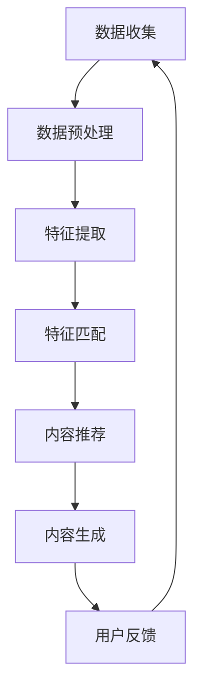

                 

### 背景介绍

在当今信息化社会中，个性化学习内容生成的需求日益凸显。传统教学模式通常采用“一刀切”的方法，即同一学习内容适用于所有学生。然而，这种模式往往忽视了个体差异，无法满足不同学生的学习需求。个性化学习内容生成，作为人工智能（AI）的一个重要应用领域，旨在根据每个学生的特点和学习需求，生成定制化的学习内容。

首先，个性化学习内容生成的背景可以从以下几个方面来理解：

1. **教育公平性**：每个学生都有独特的背景、兴趣和学习速度。个性化学习内容生成可以帮助教育者更公平地对待每个学生，使得每个学生都能获得适合自己的学习资源。

2. **教育资源优化**：随着互联网和数字技术的发展，大量的教育资源变得触手可及。然而，如何高效地筛选和利用这些资源，成为了一个难题。个性化学习内容生成能够帮助教育者从海量的资源中筛选出最适合学生的内容。

3. **学习效果提升**：个性化学习内容能够根据学生的学习进度和理解程度进行调整，从而提高学习效率。学生在面对适合自己的学习内容时，更容易产生积极的学习态度和兴趣。

4. **AI技术的进步**：近年来，AI技术在自然语言处理、数据挖掘、推荐系统等领域取得了显著进展。这些技术的应用，使得个性化学习内容生成成为可能。

总之，个性化学习内容生成不仅能够改善教育质量，提升学生的学习体验，还能够为教育资源的合理分配提供有力支持。接下来，我们将深入探讨个性化学习内容生成中的核心概念、算法原理及其在实际应用中的具体操作步骤。通过这种逐步分析推理的方式，我们希望读者能够对这一领域有更深入的理解。

---

## 2. 核心概念与联系

### 2.1 个人化学习内容生成的基本概念

在探讨个性化学习内容生成时，首先需要明确几个核心概念，包括**学生特征**、**学习内容**、**学习行为**和**个性化推荐算法**。

1. **学生特征**：学生特征是指与学生学习过程相关的各种属性，包括学习习惯、知识水平、兴趣爱好、性格特点等。这些特征可以通过多种途径获取，如问卷调查、学习数据分析、行为跟踪等。

2. **学习内容**：学习内容是指学生需要学习或已经学习过的知识材料，包括文本、视频、音频、交互式内容等。学习内容的质量和适用性直接影响学生的学习效果。

3. **学习行为**：学习行为是指学生在学习过程中展现的各种行为，如阅读、观看、练习、讨论等。通过分析学习行为，可以了解学生的学习偏好和学习模式。

4. **个性化推荐算法**：个性化推荐算法是构建个性化学习内容生成系统的核心。常见的推荐算法包括协同过滤、基于内容的推荐、混合推荐等。这些算法通过分析学生特征和学习行为，为每个学生推荐最合适的学习内容。

### 2.2 个性化学习内容生成的原理

个性化学习内容生成的原理主要包括数据采集与处理、特征提取与匹配、内容生成与推荐三个环节。

1. **数据采集与处理**：数据采集是整个系统的起点。通过多种方式收集学生的特征数据、学习内容和学习行为数据。数据采集后，需要对数据进行清洗、去噪、归一化等预处理操作，以确保数据的质量。

2. **特征提取与匹配**：特征提取是将原始数据转化为可供算法处理的形式。通过对学生特征、学习内容和学习行为的深入分析，提取出关键特征，如知识点标签、兴趣标签、行为模式等。然后，通过特征匹配算法，将学生特征与学习内容进行关联，确定哪些内容最适合该学生。

3. **内容生成与推荐**：在完成特征提取和匹配后，系统可以根据学生特征和学习需求，生成个性化学习内容。个性化推荐算法将根据特征匹配结果，为学生推荐最适合的学习内容，以提高学习效果。

### 2.3 个性化学习内容生成的架构

个性化学习内容生成的架构通常包括以下几个模块：

1. **数据收集模块**：负责从各种渠道收集学生特征、学习内容和学习行为数据。

2. **数据处理模块**：对收集到的数据进行清洗、预处理和特征提取。

3. **推荐算法模块**：根据处理后的特征数据，利用个性化推荐算法为学生推荐学习内容。

4. **内容生成模块**：根据推荐结果，动态生成适合学生的个性化学习内容。

5. **用户反馈模块**：收集学生对推荐内容和学习过程的反馈，用于模型优化和系统迭代。

### 2.4 Mermaid 流程图

为了更好地理解个性化学习内容生成的流程，我们可以使用 Mermaid 流程图来展示关键节点和步骤。以下是一个简化的 Mermaid 流程图示例：

在这个流程图中，各个节点表示不同的处理步骤，箭头表示数据的流向。通过这种图形化的表示方法，我们可以更直观地理解个性化学习内容生成的全过程。

---

以上内容对个性化学习内容生成的核心概念、原理和架构进行了详细的阐述。接下来，我们将深入探讨个性化学习内容生成中的核心算法原理和具体操作步骤，帮助读者更好地理解这一领域的技术实现细节。敬请期待。

